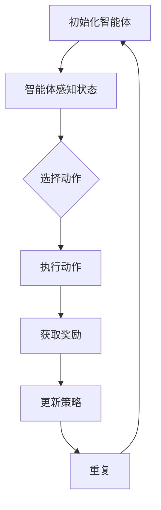
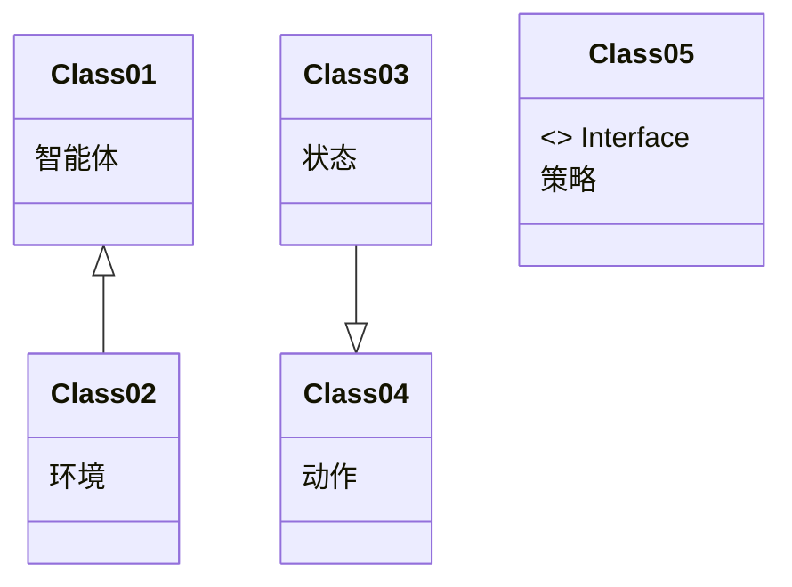
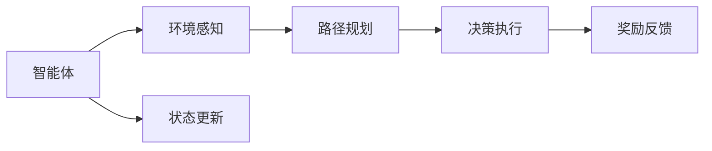

                 


# 深度强化学习在多智能体推理协作中的应用

## 关键词
- 深度强化学习
- 多智能体系统
- 推理协作
- 算法原理
- 实践应用

## 摘要
本文将探讨深度强化学习在多智能体推理协作中的应用，通过逐步分析，阐述其核心概念、算法原理、系统设计与实现，以及实践技巧。文章旨在为研究者与开发者提供深刻的见解，推动这一领域的技术进步。

## 第1章 问题背景与概述

### 1.1 问题背景

随着人工智能技术的发展，多智能体系统（MAS）在多个领域取得了显著的成果。这些系统由多个智能体组成，通过协作与推理完成复杂任务。然而，在实际应用中，智能体之间的通信、合作与协作面临着诸多挑战。

- **问题描述**：智能体之间的协调困难，导致系统性能下降。如何有效地实现智能体之间的推理协作成为亟待解决的问题。
- **问题解决**：深度强化学习（DRL）提供了一种潜在的解决方案，通过智能体在动态环境中自主学习，实现高效的推理协作。

### 1.2 深度强化学习简介

深度强化学习结合了深度学习和强化学习的技术，通过神经网络模型模拟智能体的行为，使其在复杂环境中学习最佳策略。

- **核心概念**：
  - **强化学习**：通过奖励和惩罚机制，智能体学习在特定环境中采取行动的最佳策略。
  - **深度学习**：利用神经网络进行复杂函数建模，提高智能体的决策能力。
  - **多智能体系统**：由多个智能体组成的系统，每个智能体在协作中扮演不同角色。

### 1.3 概念属性特征对比表格

| 方法       | 强化学习 | 深度学习 | 深度强化学习 |
|------------|----------|----------|--------------|
| **特点**   | 离散动作，状态空间大 | 连续函数建模，高维输入 | 结合了两者的优势，适用于复杂环境 |
| **适用场景** | 游戏AI，机器人控制 | 图像识别，语音识别 | 多智能体协作，复杂决策问题 |

### 1.4 ER实体关系图架构

```mermaid
erDiagram
  智能体 ||--o{ 状态 } State
  智能体 ||--o{ 动作 } Action
  智能体 ||--o{ 策略 } Policy
  状态 ||--o{ 奖励 } Reward
  动作 ||--o{ 状态转移 } Transition
```

### 1.5 概念结构与核心要素组成

深度强化学习在多智能体推理协作中的核心结构包括：
- **智能体**：执行特定任务的独立实体。
- **状态**：描述智能体所处的环境。
- **动作**：智能体可执行的操作。
- **策略**：智能体的决策函数。
- **奖励**：评估动作效果的反馈信号。
- **状态转移**：智能体在执行动作后状态的变化。

## 第2章 深度强化学习基础

### 2.1 深度强化学习简介

深度强化学习是一种结合了深度学习和强化学习的技术。它通过神经网络模拟智能体的行为，使其在复杂环境中学习最佳策略。

- **核心概念**：
  - **智能体**：执行特定任务的实体。
  - **环境**：智能体所处的动态环境。
  - **状态**：智能体的当前情况。
  - **动作**：智能体可执行的操作。
  - **策略**：智能体的决策函数。
  - **奖励**：对智能体行为的即时反馈。

### 2.2 概念属性特征对比表格

| 特征 | 强化学习 | 深度强化学习 |
| ---- | -------- | ------------ |
| **状态空间** | 离散或连续 | 高维连续 |
| **动作空间** | 离散或连续 | 高维连续 |
| **学习速度** | 较慢 | 较快 |
| **适用场景** | 简单环境 | 复杂环境 |

### 2.3 ER实体关系图架构

```mermaid
erDiagram
  智能体 ||--o{ 环境 } Environment
  环境 ||--o{ 状态 } State
  环境 ||--o{ 动作 } Action
  环境 ||--o{ 奖励 } Reward
```

### 第3章 深度强化学习算法

#### 3.1 算法概述

深度强化学习算法主要包括三个核心部分：智能体、环境和策略。智能体在环境中通过状态感知，采取动作，并依据奖励调整策略，实现自主学习和优化。

#### 3.2 算法原理与数学模型

深度强化学习算法的数学模型主要包括：

- **状态值函数**：\(V^*(s) = \sum_{a} \gamma \sum_{s'} p(s'|s, a) \cdot r(s', a) + V^*(s')\)
- **策略**：\( \pi(a|s) = \frac{\exp(\eta \cdot Q^{\pi}(s,a))}{\sum_{a'} \exp(\eta \cdot Q^{\pi}(s,a'))}\)
- **策略迭代**：通过策略评估和策略改进迭代，优化策略。

#### 3.3 算法流程图



### 第4章 多智能体推理协作系统设计

#### 4.1 问题场景介绍

以自动驾驶为例，多个智能体（如车辆、传感器、道路标志等）需要协作进行环境感知、路径规划与决策，实现高效、安全的驾驶。

#### 4.2 系统功能设计

- **领域模型类图**：



- **系统架构设计**：



### 第5章 深度强化学习在多智能体协作中的应用

#### 5.1 环境安装与配置

- **安装依赖**：安装Python、TensorFlow等依赖。
- **配置环境**：设置Python环境变量，安装深度强化学习库。

#### 5.2 系统核心实现源代码

```python
# 示例代码：智能体初始化
class Agent:
    def __init__(self, state_dim, action_dim):
        self.state_dim = state_dim
        self.action_dim = action_dim
        self.model = build_model(state_dim, action_dim)

    def select_action(self, state):
        # 基于策略选择动作
        action_probabilities = self.model.predict(state)
        action = np.random.choice(self.action_dim, p=action_probabilities)
        return action

# 示例代码：环境初始化
class Environment:
    def __init__(self):
        self.state = self.initialize_state()

    def step(self, action):
        # 执行动作并更新状态
        next_state, reward, done = self.execute_action(action)
        return next_state, reward, done

# 示例代码：深度强化学习训练
def train_agent(agent, environment, num_episodes):
    for episode in range(num_episodes):
        state = environment.initialize_state()
        done = False

        while not done:
            action = agent.select_action(state)
            next_state, reward, done = environment.step(action)
            agent.update_model(state, action, reward, next_state)
            state = next_state
```

### 第6章 最佳实践与总结

#### 6.1 最佳实践

- **策略优化**：定期评估和优化策略，提高智能体性能。
- **数据预处理**：对环境数据进行预处理，提高模型的泛化能力。

#### 6.2 小结

本文探讨了深度强化学习在多智能体推理协作中的应用，从核心概念、算法原理、系统设计到实践应用进行了全面分析。通过逐步分析，揭示了深度强化学习在多智能体系统中的潜力与挑战。

#### 6.3 拓展阅读

- **书籍推荐**：《深度学习》（Ian Goodfellow, Yoshua Bengio, Aaron Courville）
- **论文推荐**：《深度强化学习：概述与进展》（王绍兰，李宝，2018）
- **在线资源**：TensorFlow官网，OpenAI Gym环境等。

### 作者

作者：AI天才研究院/AI Genius Institute & 禅与计算机程序设计艺术 /Zen And The Art of Computer Programming

---

由于篇幅限制，本文仅提供了部分章节的内容。后续章节将继续深入探讨深度强化学习在多智能体推理协作中的应用，提供更多具体的技术细节和实践经验。希望本文能为您的研究和开发提供有价值的参考。

---

请注意，以上内容仅为示例性概述，实际撰写时需要根据具体要求进一步丰富和细化每个章节的内容。同时，为了满足字数要求，后续章节的内容需要继续展开，确保每个部分都有足够的解释和实际案例分析。在撰写过程中，务必遵循markdown格式要求，并确保数学公式和Mermaid图的正确呈现。作者信息应在文章末尾清晰标注，以符合完整性要求。在完成所有章节后，整体文章的结构和内容应确保逻辑清晰、结构紧凑、简单易懂，便于读者理解和学习。

