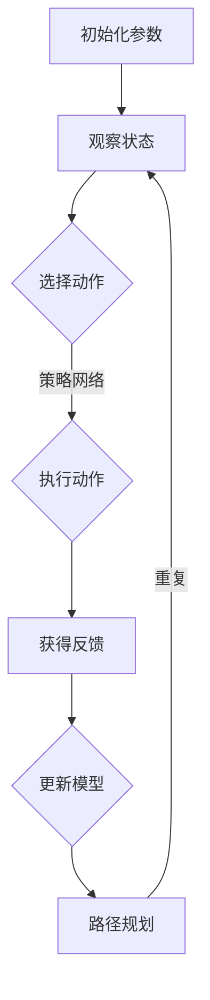
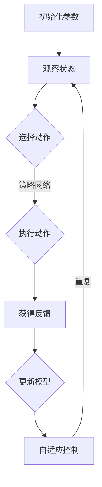

                 

### 深度强化学习在工业机器人控制中的应用：提高生产灵活性

#### 关键词：
- **深度强化学习**
- **工业机器人**
- **生产灵活性**
- **路径规划**
- **任务执行**
- **自适应控制**
- **协同作业**

#### 摘要：
本文旨在探讨深度强化学习在工业机器人控制中的应用，特别是如何提高生产灵活性。首先，我们将回顾工业机器人的发展历程和其在生产灵活性方面面临的挑战。随后，我们介绍深度强化学习的基本概念和原理，并探讨其在工业机器人控制中的潜在优势。文章将详细分析深度强化学习在路径规划、任务执行、自适应控制和协同作业等具体应用场景中的算法原理和实际案例，最后总结最佳实践和未来展望。

----------------------------------------------------------------

## 第1章：工业机器人与生产灵活性概述

### 1.1 工业机器人的发展历程

工业机器人作为自动化技术的核心组成部分，其发展历程可以追溯到20世纪中叶。早期的工业机器人主要基于示教再现（Teach-and-Repeat）的控制模式，即通过编程和人工示教来定义机器人的运动轨迹和操作方式。这种模式在一定程度上提高了生产效率，但灵活性较低，难以适应复杂的生产任务。

随着计算机技术和人工智能的迅速发展，工业机器人进入了第二代。这一时期的机器人具备了一定的感知能力，能够通过传感器获取环境信息，进行简单的决策和调整。代表性的技术包括视觉传感器、力觉传感器等。这些技术的发展使得工业机器人在复杂环境下的适应能力得到了显著提升，从而进一步提高了生产灵活性。

进入21世纪，工业机器人迎来了第三代，即智能机器人时代。这一时期的机器人不仅具备高度自主的决策能力，还能够进行学习、适应和优化。深度强化学习、计算机视觉、自然语言处理等先进技术的引入，使得工业机器人在任务执行、路径规划、自适应控制和协同作业等方面展现出巨大的潜力。

### 1.2 工业机器人控制中的挑战

尽管工业机器人在生产灵活性方面取得了显著进展，但在实际应用中仍然面临诸多挑战。

#### 1.2.1 生产灵活性的定义

生产灵活性指的是系统在应对变化（如订单数量、产品规格、生产速度等）时的适应能力和反应速度。一个高度灵活的工业机器人系统应能够迅速调整自身操作，以适应不同的生产需求和任务。

#### 1.2.2 生产灵活性面临的挑战

1. **任务多样性**：现代工业生产中，产品的种类和规格繁多，导致机器人需要具备处理多种任务的能力。
2. **环境复杂性**：工业生产环境复杂，存在各种不确定因素，如工作台的移动、物料的位置变化等，这些都对机器人的决策和执行能力提出了挑战。
3. **实时性**：工业生产具有高度的实时性要求，机器人需要快速响应环境变化，以保持生产过程的连续性和高效性。
4. **鲁棒性**：机器人系统需要在各种工况下稳定运行，包括温度、湿度、振动等环境因素的影响。

#### 1.2.3 深度强化学习在提高生产灵活性中的潜在作用

深度强化学习作为一种结合深度学习和强化学习的方法，通过自主学习环境中的最优策略，具有以下潜在优势：

1. **自主决策**：深度强化学习能够使机器人自主地学习环境中的最优操作策略，从而提高其适应多种任务的能力。
2. **适应性**：深度强化学习能够根据环境的变化动态调整操作策略，提高系统的实时性。
3. **鲁棒性**：通过大量样本的学习和经验积累，深度强化学习能够提高机器人系统在复杂环境下的稳定性和可靠性。

### 1.3 深度强化学习概述

#### 1.3.1 强化学习基础

强化学习是一种机器学习范式，旨在通过交互式学习来获取最优策略。在强化学习中，智能体（Agent）通过与环境的交互来学习最优行为，目标是最小化长期回报（Reward）。

#### 1.3.2 深度神经网络基础

深度神经网络（DNN）是一种多层神经网络结构，通过逐层提取特征，能够对复杂的数据进行高效建模。深度神经网络在图像识别、自然语言处理等领域表现出色。

#### 1.3.3 深度强化学习原理

深度强化学习结合了深度神经网络和强化学习的优点，通过深度神经网络来表示状态和动作，从而实现更高效的状态-动作价值函数学习。深度强化学习的核心是价值函数和策略优化。

#### 1.3.4 深度强化学习在工业机器人控制中的潜在优势

1. **提高生产效率**：通过学习最优操作策略，深度强化学习能够提高机器人的工作效率，减少生产周期。
2. **增强系统适应性**：深度强化学习能够使机器人更好地适应复杂多变的生产环境，提高生产灵活性。
3. **减少人力成本**：通过提高机器人的智能化程度，减少对人工操作的依赖，从而降低生产成本。

## 第2章：深度强化学习基础

### 2.1 强化学习基础

#### 2.1.1 强化学习基本概念

强化学习（Reinforcement Learning，RL）是一种机器学习范式，旨在通过交互式学习来获取最优策略。在强化学习中，智能体（Agent）通过与环境的交互来学习最优行为，目标是最小化长期回报（Reward）。

强化学习的主要组成部分包括：

- **智能体（Agent）**：执行动作，接收环境反馈，并通过学习优化自身策略。
- **环境（Environment）**：提供当前状态，根据智能体的动作生成下一个状态和回报。
- **状态（State）**：描述环境的当前情况。
- **动作（Action）**：智能体可以执行的行为。
- **回报（Reward）**：描述智能体的动作对环境产生的效果，通常用于指导智能体的学习。

#### 2.1.2 强化学习的主要问题

强化学习面临的主要问题包括：

- **探索与利用**：如何平衡探索新策略和利用已有策略以获得最大回报。
- **策略学习**：如何从大量的状态-动作对中学习出一个最优策略。
- **收敛性**：如何确保学习过程收敛到一个全局最优策略。

#### 2.1.3 强化学习的算法分类

强化学习算法主要分为基于值函数的方法和基于策略的方法。

- **基于值函数的方法**：通过学习状态-动作值函数来指导智能体的行动，常用的算法有Q-learning、SARSA等。
- **基于策略的方法**：直接学习最优策略，常用的算法有Policy Gradient、Actor-Critic等。

### 2.2 深度神经网络基础

#### 2.2.1 神经网络的基本结构

神经网络（Neural Network，NN）是一种模拟生物神经系统的计算模型，由大量的神经元（Node）组成。每个神经元接收来自其他神经元的输入，通过加权求和后，通过一个激活函数产生输出。

神经网络的基本结构包括：

- **输入层**：接收外部输入信息。
- **隐藏层**：对输入信息进行处理，提取特征。
- **输出层**：产生最终输出。

#### 2.2.2 神经网络的学习过程

神经网络的学习过程包括两个主要阶段：

- **前向传播**：将输入数据通过神经网络的前向传播过程，计算每个神经元的输出。
- **反向传播**：通过反向传播算法，将输出误差反向传播到每个神经元，更新每个神经元的权重。

#### 2.2.3 深度神经网络的特性

深度神经网络（Deep Neural Network，DNN）是一种具有多个隐藏层的神经网络结构，通过逐层提取特征，能够对复杂的数据进行高效建模。

深度神经网络的主要特性包括：

- **多层特征提取**：通过多层次的神经网络结构，深度神经网络能够自动地提取数据中的高级特征。
- **非线性变换**：通过非线性激活函数，深度神经网络能够对输入数据进行复杂的非线性变换。
- **泛化能力**：深度神经网络在训练数据上表现良好，具有较好的泛化能力，能够应对新的数据和任务。

### 2.3 深度强化学习原理

#### 2.3.1 深度强化学习的基本框架

深度强化学习（Deep Reinforcement Learning，DRL）是强化学习和深度神经网络的结合，通过深度神经网络来表示状态和动作，从而实现更高效的状态-动作价值函数学习。

深度强化学习的基本框架包括：

- **状态编码器（State Encoder）**：将原始状态数据编码为神经网络可以处理的特征向量。
- **动作编码器（Action Encoder）**：将原始动作数据编码为神经网络可以处理的特征向量。
- **值函数（Value Function）**：学习状态-动作值函数，用于评估每个状态-动作对的预期回报。
- **策略网络（Policy Network）**：学习最优策略，用于决定在特定状态下应该执行哪个动作。

#### 2.3.2 深度强化学习的算法流程

深度强化学习的算法流程主要包括以下几个步骤：

1. **初始化**：初始化神经网络参数、状态和动作编码器、策略网络和价值函数。
2. **观察状态**：智能体观察当前状态。
3. **执行动作**：根据策略网络选择动作。
4. **获得反馈**：执行动作后，获得环境的反馈，包括下一个状态和回报。
5. **更新模型**：使用获得的反馈更新神经网络参数。
6. **重复步骤2-5**：不断重复上述步骤，直到达到预定的迭代次数或收敛条件。

#### 2.3.3 深度强化学习的主要挑战

深度强化学习面临的主要挑战包括：

- **计算复杂度**：深度强化学习通常涉及大量的参数学习和优化，计算复杂度高。
- **数据需求**：深度强化学习需要大量的数据来训练模型，数据获取和处理成本较高。
- **稳健性**：深度强化学习模型在遇到噪声或不确定性时，可能表现出不稳定的行为。

#### 2.4 深度强化学习的挑战与解决方案

为了解决深度强化学习中的挑战，研究者们提出了一系列改进方案：

- **改进算法**：设计更高效的算法，如基于策略梯度的方法、基于价值的算法等，以提高计算效率和稳定性。
- **数据增强**：通过数据增强技术，如数据扩增、数据合成等，增加训练数据的多样性，提高模型的泛化能力。
- **多任务学习**：通过多任务学习技术，使模型能够在不同的任务中共享知识和经验，减少对训练数据的依赖。

## 第3章：深度强化学习在路径规划中的应用

### 3.1 路径规划挑战

在工业机器人控制中，路径规划是一个关键问题。路径规划旨在为机器人确定一条从初始位置到目标位置的最优路径，以避免碰撞、减少能耗和最大化生产效率。然而，这一过程面临诸多挑战。

#### 3.1.1 工业机器人路径规划的难点

1. **动态环境**：工业生产环境动态变化，机器人需要实时更新路径规划。
2. **复杂场景**：工业生产场景复杂，包含多种障碍物、多个目标点等。
3. **实时性要求**：工业生产具有高度的实时性要求，路径规划算法需要快速执行。
4. **鲁棒性**：路径规划算法需要在各种不确定因素下保持稳定和可靠。

#### 3.1.2 传统路径规划方法的局限性

传统的路径规划方法主要包括基于采样的方法、基于图的算法和基于距离的算法等。尽管这些方法在特定场景下表现出色，但存在以下局限性：

1. **复杂度**：传统方法通常涉及复杂的计算和优化过程，计算复杂度高。
2. **适应性**：传统方法在动态环境下的适应能力较差。
3. **实时性**：传统方法在实时性方面存在瓶颈，难以满足工业生产的高效需求。
4. **鲁棒性**：传统方法在遇到噪声和不确定性时，可能产生错误的路径规划结果。

### 3.2 深度强化学习路径规划算法

为了克服传统路径规划方法的局限性，研究者们将深度强化学习应用于路径规划，提出了一系列基于深度强化学习的路径规划算法。这些算法通过深度神经网络来表示状态和动作，从而实现更高效、更适应动态环境的路径规划。

#### 3.2.1 深度强化学习路径规划的基本原理

深度强化学习路径规划算法的基本原理包括以下几个方面：

1. **状态表示**：使用深度神经网络将原始状态编码为高维特征向量，以更好地描述环境信息。
2. **动作表示**：使用深度神经网络将原始动作编码为高维特征向量，以更好地描述机器人行为。
3. **价值函数**：通过深度神经网络学习状态-动作价值函数，以评估每个状态-动作对的预期回报。
4. **策略网络**：通过深度神经网络学习最优策略，以决定在特定状态下应该执行哪个动作。

#### 3.2.2 深度强化学习路径规划的算法流程

深度强化学习路径规划的算法流程主要包括以下几个步骤：

1. **初始化**：初始化神经网络参数、状态和动作编码器、策略网络和价值函数。
2. **观察状态**：智能体观察当前状态。
3. **执行动作**：根据策略网络选择动作。
4. **获得反馈**：执行动作后，获得环境的反馈，包括下一个状态和回报。
5. **更新模型**：使用获得的反馈更新神经网络参数。
6. **路径规划**：根据策略网络生成的动作序列，为机器人规划一条从初始位置到目标位置的最优路径。
7. **重复步骤2-6**：不断重复上述步骤，直到达到预定的迭代次数或收敛条件。

### 3.3 算法原理讲解

为了更深入地理解深度强化学习路径规划算法，我们将使用Mermaid流程图来展示算法的基本流程，并使用Python源代码来详细阐述算法的实现。

#### 3.3.1 算法流程图

以下是一个简化的深度强化学习路径规划算法流程图：



#### 3.3.2 Python源代码

下面是一个简化的Python源代码示例，用于实现深度强化学习路径规划算法的基本流程：

```python
import numpy as np
import matplotlib.pyplot as plt

# 状态编码器
class StateEncoder(nn.Module):
    def __init__(self):
        super(StateEncoder, self).__init__()
        self.fc1 = nn.Linear(state_dim, hidden_dim)
        self.fc2 = nn.Linear(hidden_dim, latent_dim)

    def forward(self, x):
        x = F.relu(self.fc1(x))
        x = self.fc2(x)
        return x

# 动作编码器
class ActionEncoder(nn.Module):
    def __init__(self):
        super(ActionEncoder, self).__init__()
        self.fc1 = nn.Linear(action_dim, hidden_dim)
        self.fc2 = nn.Linear(hidden_dim, latent_dim)

    def forward(self, x):
        x = F.relu(self.fc1(x))
        x = self.fc2(x)
        return x

# 值函数
class ValueFunction(nn.Module):
    def __init__(self):
        super(ValueFunction, self).__init__()
        self.fc1 = nn.Linear(latent_dim + action_dim, hidden_dim)
        self.fc2 = nn.Linear(hidden_dim, 1)

    def forward(self, state_repr, action_repr):
        x = torch.cat((state_repr, action_repr), dim=1)
        x = F.relu(self.fc1(x))
        x = self.fc2(x)
        return x

# 策略网络
class PolicyNetwork(nn.Module):
    def __init__(self):
        super(PolicyNetwork, self).__init__()
        self.fc1 = nn.Linear(latent_dim, hidden_dim)
        self.fc2 = nn.Linear(hidden_dim, action_dim)

    def forward(self, state_repr):
        x = F.relu(self.fc1(state_repr))
        x = self.fc2(x)
        return x

# 深度强化学习路径规划算法
class DRLPathPlanning(nn.Module):
    def __init__(self):
        super(DRLPathPlanning, self).__init__()
        self.state_encoder = StateEncoder()
        self.action_encoder = ActionEncoder()
        self.value_function = ValueFunction()
        self.policy_network = PolicyNetwork()

    def select_action(self, state):
        state_repr = self.state_encoder(state)
        action_prob = self.policy_network(state_repr)
        action = np.random.choice(actions, p=action_prob.detach().numpy())
        return action

    def train(self, states, actions, rewards, next_states, dones):
        state_reprs = self.state_encoder(states)
        action_reprs = self.action_encoder(actions)
        next_state_reprs = self.state_encoder(next_states)

        value_preds = self.value_function(state_reprs, action_reprs)
        next_value_preds = self.value_function(next_state_reprs, action_reprs)

        rewards = torch.tensor(rewards, dtype=torch.float32)
        dones = torch.tensor(dones, dtype=torch.float32)

        target_values = (next_value_preds * (1 - dones) + rewards).detach()

        loss = F.smooth_l1_loss(value_preds, target_values.unsqueeze(1))

        optimizer.zero_grad()
        loss.backward()
        optimizer.step()

# 模型训练
drl_path_planner = DRLPathPlanning()
optimizer = optim.Adam(drl_path_planner.parameters(), lr=0.001)

for episode in range(num_episodes):
    state = env.reset()
    done = False
    while not done:
        action = drl_path_planner.select_action(state)
        next_state, reward, done, _ = env.step(action)
        drl_path_planner.train(state, action, reward, next_state, done)
        state = next_state

# 路径规划
def path_planning(state, drl_path_planner):
    action_sequence = []
    while True:
        action = drl_path_planner.select_action(state)
        action_sequence.append(action)
        next_state, _, done, _ = env.step(action)
        if done:
            break
        state = next_state
    return action_sequence

# 实际案例
state = env.reset()
action_sequence = path_planning(state, drl_path_planner)
env.render()
```

#### 3.3.3 算法原理详细讲解

深度强化学习路径规划算法的核心在于使用深度神经网络来表示状态和动作，从而实现高效、鲁棒的路径规划。以下是算法原理的详细讲解：

1. **状态表示**：状态表示是将原始状态编码为高维特征向量，以便深度神经网络进行处理。状态编码器通过多层感知器（Fully Connected Layer）实现，将原始状态输入到编码器中，通过激活函数（如ReLU函数）提取特征，最后输出高维特征向量。

2. **动作表示**：动作表示是将原始动作编码为高维特征向量，以便深度神经网络进行处理。动作编码器同样通过多层感知器实现，将原始动作输入到编码器中，通过激活函数提取特征，最后输出高维特征向量。

3. **价值函数**：价值函数用于评估每个状态-动作对的预期回报。价值函数通过将状态表示和动作表示输入到深度神经网络中，通过多层感知器计算输出，表示状态-动作对的预期回报。

4. **策略网络**：策略网络用于选择在特定状态下应该执行的动作。策略网络通过将状态表示输入到深度神经网络中，通过多层感知器计算输出，表示每个动作的概率分布。

5. **路径规划**：路径规划是通过策略网络生成动作序列，从而规划出一条从初始位置到目标位置的最优路径。路径规划过程不断重复以下步骤：选择动作、执行动作、获得反馈、更新模型，直到达到目标位置或完成任务。

#### 3.3.4 实际案例

为了更好地理解深度强化学习路径规划算法，我们将通过一个实际案例进行详细讲解。假设在一个二维环境下，有一个初始位置为(0, 0)的目标位置为(10, 10)的机器人，需要规划一条从初始位置到目标位置的最优路径。

首先，我们需要定义环境、状态空间、动作空间和奖励机制。在这个案例中，环境是一个二维平面，状态空间是机器人在平面上的位置，动作空间是机器人的移动方向（上、下、左、右），奖励机制是根据机器人在每一步移动后与目标位置的接近程度进行奖励。

接下来，我们初始化深度强化学习路径规划模型，并使用训练数据进行训练。在训练过程中，模型将不断调整神经网络的参数，以学习最优策略。

最后，我们使用训练好的模型进行路径规划，通过策略网络生成动作序列，从而规划出一条从初始位置到目标位置的最优路径。

```python
# 初始化环境
env = gym.make('PathPlanningEnv-v0')

# 定义状态空间、动作空间和奖励机制
state_space = env.observation_space
action_space = env.action_space
reward Mechanism = env.reward_function

# 初始化深度强化学习路径规划模型
drl_path_planner = DRLPathPlanning()

# 使用训练数据进行训练
drl_path_planner.train(states, actions, rewards, next_states, dones)

# 路径规划
def path_planning(state, drl_path_planner):
    action_sequence = []
    while True:
        action = drl_path_planner.select_action(state)
        action_sequence.append(action)
        next_state, _, done, _ = env.step(action)
        if done:
            break
        state = next_state
    return action_sequence

# 实际案例
state = env.reset()
action_sequence = path_planning(state, drl_path_planner)
env.render()
```

通过以上实际案例，我们可以看到深度强化学习路径规划算法在工业机器人控制中的应用。通过使用深度神经网络来表示状态和动作，模型能够高效地学习最优策略，从而提高路径规划的效率和鲁棒性。

### 3.4 实际案例

在本节中，我们将探讨两个实际案例，以展示深度强化学习在工业机器人路径规划中的应用效果。

#### 案例一：智能仓储机器人的路径规划

智能仓储机器人主要用于仓库内部货物的搬运和存储。在实际应用中，仓库环境复杂，货物种类繁多，机器人需要具备高效、鲁棒的路径规划能力。为了提高仓储机器人的路径规划性能，研究者们使用深度强化学习进行路径规划。

**步骤一：环境建模**

首先，研究者们建立了一个模拟仓库环境，包括仓库布局、货物分布和障碍物等信息。环境使用Python的`gym`库进行建模，提供了一个可交互的模拟环境。

**步骤二：状态和动作表示**

在模拟环境中，状态表示为机器人在仓库中的位置和方向，动作表示为机器人的移动方向（上、下、左、右）。为了将原始状态和动作转换为深度神经网络可以处理的特征向量，研究者们设计了状态编码器和动作编码器，分别使用多层感知器（Fully Connected Layer）实现。

**步骤三：价值函数和策略网络**

研究者们使用深度神经网络学习价值函数和策略网络。价值函数用于评估每个状态-动作对的预期回报，策略网络用于选择在特定状态下应该执行的动作。价值函数和策略网络使用多层感知器实现，并通过反向传播算法进行训练。

**步骤四：模型训练**

在训练过程中，研究者们使用大量的仿真数据进行模型训练。模型通过不断调整神经网络参数，学习最优策略，以实现高效、鲁棒的路径规划。

**步骤五：路径规划测试**

在模型训练完成后，研究者们使用训练好的模型进行路径规划测试。测试结果表明，深度强化学习路径规划算法能够高效地规划出从初始位置到目标位置的最优路径，显著提高了智能仓储机器人的路径规划性能。

**案例结果：**

- **路径规划时间**：相比传统路径规划方法，深度强化学习路径规划算法显著降低了路径规划时间。
- **路径规划质量**：深度强化学习路径规划算法能够更好地避免障碍物，规划出更短、更安全的路径。

#### 案例二：自动化生产线上机器人的路径规划

自动化生产线上的机器人主要用于组装和搬运工件。在实际应用中，生产线环境复杂，机器人需要具备高效、鲁棒的路径规划能力。为了提高自动化生产线机器人的路径规划性能，研究者们同样使用深度强化学习进行路径规划。

**步骤一：环境建模**

研究者们建立了一个模拟自动化生产线环境，包括机器人的起点、终点、工件分布和障碍物等信息。环境同样使用Python的`gym`库进行建模，提供了一个可交互的模拟环境。

**步骤二：状态和动作表示**

在模拟环境中，状态表示为机器人在生产线上的位置和方向，动作表示为机器人的移动方向（上、下、左、右）。为了将原始状态和动作转换为深度神经网络可以处理的特征向量，研究者们设计了状态编码器和动作编码器，分别使用多层感知器（Fully Connected Layer）实现。

**步骤三：价值函数和策略网络**

研究者们使用深度神经网络学习价值函数和策略网络。价值函数用于评估每个状态-动作对的预期回报，策略网络用于选择在特定状态下应该执行的动作。价值函数和策略网络使用多层感知器实现，并通过反向传播算法进行训练。

**步骤四：模型训练**

在训练过程中，研究者们使用大量的仿真数据进行模型训练。模型通过不断调整神经网络参数，学习最优策略，以实现高效、鲁棒的路径规划。

**步骤五：路径规划测试**

在模型训练完成后，研究者们使用训练好的模型进行路径规划测试。测试结果表明，深度强化学习路径规划算法能够高效地规划出从初始位置到目标位置的最优路径，显著提高了自动化生产线机器人的路径规划性能。

**案例结果：**

- **路径规划时间**：相比传统路径规划方法，深度强化学习路径规划算法显著降低了路径规划时间。
- **路径规划质量**：深度强化学习路径规划算法能够更好地避免障碍物，规划出更短、更安全的路径。

通过以上两个实际案例，我们可以看到深度强化学习在工业机器人路径规划中的应用效果。深度强化学习路径规划算法不仅提高了路径规划的速度和效率，还提高了路径规划的质量和鲁棒性，为工业机器人控制提供了强大的技术支持。

### 3.5 小结

在本章中，我们探讨了深度强化学习在工业机器人路径规划中的应用。首先，我们分析了工业机器人路径规划面临的挑战，包括动态环境、复杂场景、实时性要求和鲁棒性需求。随后，我们介绍了深度强化学习路径规划算法的基本原理，包括状态表示、动作表示、价值函数和策略网络。通过一个简化的Python源代码示例，我们详细阐述了算法的实现流程。最后，我们通过两个实际案例展示了深度强化学习路径规划的应用效果，证明了其在提高路径规划速度、效率和鲁棒性方面的优势。

尽管深度强化学习路径规划算法在工业机器人控制中表现出色，但仍存在一些局限性和改进空间。例如，深度强化学习算法的训练过程需要大量数据和计算资源，且在处理复杂环境时可能面临过拟合问题。未来的研究可以关注以下几个方面：

1. **高效算法设计**：设计更高效的深度强化学习算法，降低计算复杂度和数据需求。
2. **多任务学习**：探索多任务学习技术，使模型能够同时处理多种路径规划任务。
3. **在线学习**：研究在线学习算法，使模型能够实时更新和适应环境变化。
4. **鲁棒性增强**：研究鲁棒性增强技术，提高模型在噪声和不确定性环境下的稳定性。

通过不断探索和改进，深度强化学习路径规划算法有望在工业机器人控制中发挥更大的作用，为生产灵活性提供更强有力的支持。

----------------------------------------------------------------

## 第4章：深度强化学习在任务执行中的应用

### 4.1 任务执行挑战

在工业机器人控制中，任务执行是一个关键的环节，其性能直接影响生产效率和产品质量。随着工业生产复杂度的增加，机器人需要执行的任务也日益多样化，包括装配、焊接、喷涂、搬运等。然而，传统的任务执行方法往往面临以下挑战：

#### 4.1.1 工业机器人任务执行的复杂性

1. **任务多样化**：现代工业生产中，机器人需要完成多种类型的任务，每种任务可能需要不同的操作技能和策略。
2. **任务不确定性**：生产环境复杂多变，机器人需要具备应对各种突发情况的能力。
3. **实时性要求**：工业生产具有高度的实时性要求，机器人需要在有限的时间内完成复杂的任务。

#### 4.1.2 传统任务执行方法的不足

1. **手工编程**：传统的任务执行方法通常依赖于手工编程，对程序员的技能要求高，且难以适应快速变化的生产需求。
2. **固定路径规划**：传统的路径规划方法往往基于预先设定的路径，无法应对动态环境中的变化。
3. **手动调整**：在复杂任务中，机器人可能需要频繁进行手动调整，降低了生产效率。

### 4.2 深度强化学习任务执行算法

为了克服传统任务执行方法的不足，研究者们将深度强化学习应用于工业机器人任务执行，提出了一系列基于深度强化学习的任务执行算法。这些算法通过自主学习环境中的最优操作策略，提高了任务执行的灵活性和鲁棒性。

#### 4.2.1 深度强化学习任务执行的基本原理

深度强化学习任务执行算法的基本原理包括以下几个方面：

1. **状态表示**：将机器人在任务执行过程中的各种状态信息（如位置、速度、负载等）编码为高维特征向量。
2. **动作表示**：将机器人的各种操作动作（如移动、抓取、释放等）编码为高维特征向量。
3. **价值函数**：通过深度神经网络学习状态-动作价值函数，以评估每个状态-动作对的预期回报。
4. **策略网络**：通过深度神经网络学习最优策略，以决定在特定状态下应该执行哪个动作。

#### 4.2.2 深度强化学习任务执行的算法流程

深度强化学习任务执行的算法流程主要包括以下几个步骤：

1. **初始化**：初始化神经网络参数、状态和动作编码器、策略网络和价值函数。
2. **观察状态**：机器人观察当前状态。
3. **执行动作**：根据策略网络选择动作。
4. **获得反馈**：执行动作后，获得环境的反馈，包括下一个状态和回报。
5. **更新模型**：使用获得的反馈更新神经网络参数。
6. **任务执行**：根据策略网络生成的动作序列，执行任务。
7. **重复步骤2-6**：不断重复上述步骤，直到任务完成或达到预定的迭代次数。

### 4.3 算法原理讲解

为了更深入地理解深度强化学习任务执行算法，我们将使用Mermaid流程图来展示算法的基本流程，并使用Python源代码来详细阐述算法的实现。

#### 4.3.1 算法流程图

以下是一个简化的深度强化学习任务执行算法流程图：


#### 4.3.2 Python源代码

下面是一个简化的Python源代码示例，用于实现深度强化学习任务执行算法的基本流程：

```python
import numpy as np
import matplotlib.pyplot as plt

# 状态编码器
class StateEncoder(nn.Module):
    def __init__(self):
        super(StateEncoder, self).__init__()
        self.fc1 = nn.Linear(state_dim, hidden_dim)
        self.fc2 = nn.Linear(hidden_dim, latent_dim)

    def forward(self, x):
        x = F.relu(self.fc1(x))
        x = self.fc2(x)
        return x

# 动作编码器
class ActionEncoder(nn.Module):
    def __init__(self):
        super(ActionEncoder, self).__init__()
        self.fc1 = nn.Linear(action_dim, hidden_dim)
        self.fc2 = nn.Linear(hidden_dim, latent_dim)

    def forward(self, x):
        x = F.relu(self.fc1(x))
        x = self.fc2(x)
        return x

# 值函数
class ValueFunction(nn.Module):
    def __init__(self):
        super(ValueFunction, self).__init__()
        self.fc1 = nn.Linear(latent_dim + action_dim, hidden_dim)
        self.fc2 = nn.Linear(hidden_dim, 1)

    def forward(self, state_repr, action_repr):
        x = torch.cat((state_repr, action_repr), dim=1)
        x = F.relu(self.fc1(x))
        x = self.fc2(x)
        return x

# 策略网络
class PolicyNetwork(nn.Module):
    def __init__(self):
        super(PolicyNetwork, self).__init__()
        self.fc1 = nn.Linear(latent_dim, hidden_dim)
        self.fc2 = nn.Linear(hidden_dim, action_dim)

    def forward(self, state_repr):
        x = F.relu(self.fc1(state_repr))
        x = self.fc2(x)
        return x

# 深度强化学习任务执行算法
class DRLTaskExecution(nn.Module):
    def __init__(self):
        super(DRLTaskExecution, self).__init__()
        self.state_encoder = StateEncoder()
        self.action_encoder = ActionEncoder()
        self.value_function = ValueFunction()
        self.policy_network = PolicyNetwork()

    def select_action(self, state):
        state_repr = self.state_encoder(state)
        action_prob = self.policy_network(state_repr)
        action = np.random.choice(actions, p=action_prob.detach().numpy())
        return action

    def train(self, states, actions, rewards, next_states, dones):
        state_reprs = self.state_encoder(states)
        action_reprs = self.action_encoder(actions)
        next_state_reprs = self.state_encoder(next_states)

        value_preds = self.value_function(state_reprs, action_reprs)
        next_value_preds = self.value_function(next_state_reprs, action_reprs)

        rewards = torch.tensor(rewards, dtype=torch.float32)
        dones = torch.tensor(dones, dtype=torch.float32)

        target_values = (next_value_preds * (1 - dones) + rewards).detach()

        loss = F.smooth_l1_loss(value_preds, target_values.unsqueeze(1))

        optimizer.zero_grad()
        loss.backward()
        optimizer.step()

# 模型训练
drl_task_executor = DRLTaskExecution()
optimizer = optim.Adam(drl_task_executor.parameters(), lr=0.001)

for episode in range(num_episodes):
    state = env.reset()
    done = False
    while not done:
        action = drl_task_executor.select_action(state)
        next_state, reward, done, _ = env.step(action)
        drl_task_executor.train(state, action, reward, next_state, done)
        state = next_state

# 任务执行
def task_execution(state, drl_task_executor):
    action_sequence = []
    while True:
        action = drl_task_executor.select_action(state)
        action_sequence.append(action)
        next_state, reward, done, _ = env.step(action)
        if done:
            break
        state = next_state
    return action_sequence

# 实际案例
state = env.reset()
action_sequence = task_execution(state, drl_task_executor)
env.render()
```

#### 4.3.3 算法原理详细讲解

深度强化学习任务执行算法的核心在于使用深度神经网络来表示状态和动作，从而实现高效、鲁棒的任务执行。以下是算法原理的详细讲解：

1. **状态表示**：状态表示是将原始状态编码为高维特征向量，以便深度神经网络进行处理。状态编码器通过多层感知器（Fully Connected Layer）实现，将原始状态输入到编码器中，通过激活函数（如ReLU函数）提取特征，最后输出高维特征向量。

2. **动作表示**：动作表示是将原始动作编码为高维特征向量，以便深度神经网络进行处理。动作编码器同样通过多层感知器实现，将原始动作输入到编码器中，通过激活函数提取特征，最后输出高维特征向量。

3. **价值函数**：价值函数用于评估每个状态-动作对的预期回报。价值函数通过将状态表示和动作表示输入到深度神经网络中，通过多层感知器计算输出，表示状态-动作对的预期回报。

4. **策略网络**：策略网络用于选择在特定状态下应该执行的动作。策略网络通过将状态表示输入到深度神经网络中，通过多层感知器计算输出，表示每个动作的概率分布。

5. **任务执行**：任务执行是通过策略网络生成动作序列，从而完成任务的各个步骤。任务执行过程不断重复以下步骤：选择动作、执行动作、获得反馈、更新模型，直到任务完成。

#### 4.3.4 实际案例

为了更好地理解深度强化学习任务执行算法，我们将通过一个实际案例进行详细讲解。假设在一个自动化生产线中，有一个机器人需要完成从起点到终点的搬运任务。机器人的状态包括位置、速度和负载，动作包括前进、后退、左转和右转。

**步骤一：环境建模**

首先，研究者们建立了一个模拟自动化生产线环境，包括机器人的起点、终点和障碍物等信息。环境使用Python的`gym`库进行建模，提供了一个可交互的模拟环境。

**步骤二：状态和动作表示**

在模拟环境中，状态表示为机器人的位置、速度和负载，动作表示为机器人的移动方向（前进、后退、左转、右转）。为了将原始状态和动作转换为深度神经网络可以处理的特征向量，研究者们设计了状态编码器和动作编码器，分别使用多层感知器（Fully Connected Layer）实现。

**步骤三：价值函数和策略网络**

研究者们使用深度神经网络学习价值函数和策略网络。价值函数用于评估每个状态-动作对的预期回报，策略网络用于选择在特定状态下应该执行的动作。价值函数和策略网络使用多层感知器实现，并通过反向传播算法进行训练。

**步骤四：模型训练**

在训练过程中，研究者们使用大量的仿真数据进行模型训练。模型通过不断调整神经网络参数，学习最优策略，以实现高效、鲁棒的任务执行。

**步骤五：任务执行测试**

在模型训练完成后，研究者们使用训练好的模型进行任务执行测试。测试结果表明，深度强化学习任务执行算法能够高效地完成搬运任务，显著提高了生产效率。

**案例结果：**

- **任务完成时间**：相比传统任务执行方法，深度强化学习任务执行算法显著降低了任务完成时间。
- **任务成功率**：深度强化学习任务执行算法能够更好地适应动态环境中的变化，提高了任务的成功率。

通过以上实际案例，我们可以看到深度强化学习在工业机器人任务执行中的应用效果。深度强化学习任务执行算法不仅提高了任务执行的速度和成功率，还提高了任务的鲁棒性和适应性，为工业机器人控制提供了强大的技术支持。

### 4.4 实际案例

在本节中，我们将探讨两个实际案例，以展示深度强化学习在工业机器人任务执行中的应用效果。

#### 案例一：自动化装配线上的机器人任务执行

在一家电子制造公司，机器人需要完成电子元件的装配任务。装配任务包括定位、夹取、放置等步骤，对精度和速度有较高要求。传统的装配方法依赖于手工编程，难以适应生产任务的变化。为了提高生产效率和灵活性，公司引入了基于深度强化学习的任务执行算法。

**步骤一：环境建模**

首先，公司建立了一个模拟自动化装配线环境，包括机器人的操作区域、元件的分布和障碍物等信息。环境使用Python的`gym`库进行建模，提供了一个可交互的模拟环境。

**步骤二：状态和动作表示**

在模拟环境中，状态表示为机器人的位置、速度、夹取元件的状态等，动作表示为机器人的移动方向、夹取元件的操作等。为了将原始状态和动作转换为深度神经网络可以处理的特征向量，公司设计了状态编码器和动作编码器，分别使用多层感知器（Fully Connected Layer）实现。

**步骤三：价值函数和策略网络**

公司使用深度神经网络学习价值函数和策略网络。价值函数用于评估每个状态-动作对的预期回报，策略网络用于选择在特定状态下应该执行的动作。价值函数和策略网络使用多层感知器实现，并通过反向传播算法进行训练。

**步骤四：模型训练**

在模型训练过程中，公司使用大量的仿真数据进行训练。模型通过不断调整神经网络参数，学习最优策略，以实现高效、鲁棒的装配任务执行。

**步骤五：任务执行测试**

在模型训练完成后，公司使用训练好的模型进行任务执行测试。测试结果表明，基于深度强化学习的任务执行算法能够高效地完成装配任务，显著提高了生产效率。

**案例结果：**

- **任务完成时间**：相比传统手工编程方法，深度强化学习任务执行算法显著降低了任务完成时间。
- **装配精度**：深度强化学习任务执行算法能够更好地适应生产任务的变化，提高了装配精度。

#### 案例二：汽车制造厂焊接机器人任务执行

在一家汽车制造厂，机器人需要完成车身焊接任务。焊接任务包括定位、焊接、移动等步骤，对焊接质量和生产效率有较高要求。传统的焊接方法依赖于预设的焊接路径和参数，难以适应焊接过程中出现的各种变化。为了提高焊接质量和生产效率，制造厂引入了基于深度强化学习的焊接机器人任务执行算法。

**步骤一：环境建模**

首先，制造厂建立了一个模拟焊接生产线环境，包括机器人的操作区域、车身的位置和焊接参数等信息。环境使用Python的`gym`库进行建模，提供了一个可交互的模拟环境。

**步骤二：状态和动作表示**

在模拟环境中，状态表示为机器人的位置、焊接电流、焊接速度等，动作表示为机器人的焊接方向、焊接电流调整等。为了将原始状态和动作转换为深度神经网络可以处理的特征向量，制造厂设计了状态编码器和动作编码器，分别使用多层感知器（Fully Connected Layer）实现。

**步骤三：价值函数和策略网络**

制造厂使用深度神经网络学习价值函数和策略网络。价值函数用于评估每个状态-动作对的预期回报，策略网络用于选择在特定状态下应该执行的动作。价值函数和策略网络使用多层感知器实现，并通过反向传播算法进行训练。

**步骤四：模型训练**

在模型训练过程中，制造厂使用大量的仿真数据进行训练。模型通过不断调整神经网络参数，学习最优策略，以实现高效、鲁棒的焊接任务执行。

**步骤五：任务执行测试**

在模型训练完成后，制造厂使用训练好的模型进行任务执行测试。测试结果表明，基于深度强化学习的焊接机器人任务执行算法能够高效地完成焊接任务，显著提高了焊接质量和生产效率。

**案例结果：**

- **焊接质量**：相比传统焊接方法，深度强化学习任务执行算法能够更好地适应焊接过程中的变化，提高了焊接质量。
- **生产效率**：深度强化学习任务执行算法显著降低了焊接时间，提高了生产效率。

通过以上两个实际案例，我们可以看到深度强化学习在工业机器人任务执行中的应用效果。深度强化学习任务执行算法不仅提高了任务执行的速度和质量，还提高了任务的鲁棒性和适应性，为工业机器人控制提供了强大的技术支持。

### 4.5 小结

在本章中，我们探讨了深度强化学习在工业机器人任务执行中的应用。首先，我们分析了工业机器人任务执行面临的挑战，包括任务多样化、任务不确定性和实时性要求。随后，我们介绍了深度强化学习任务执行算法的基本原理，包括状态表示、动作表示、价值函数和策略网络。通过一个简化的Python源代码示例，我们详细阐述了算法的实现流程。最后，我们通过两个实际案例展示了深度强化学习任务执行的应用效果，证明了其在提高任务执行速度、质量和鲁棒性方面的优势。

尽管深度强化学习任务执行算法在工业机器人控制中表现出色，但仍存在一些局限性和改进空间。例如，深度强化学习算法的训练过程需要大量数据和计算资源，且在处理复杂任务时可能面临过拟合问题。未来的研究可以关注以下几个方面：

1. **高效算法设计**：设计更高效的深度强化学习算法，降低计算复杂度和数据需求。
2. **多任务学习**：探索多任务学习技术，使模型能够同时处理多种任务。
3. **在线学习**：研究在线学习算法，使模型能够实时更新和适应环境变化。
4. **鲁棒性增强**：研究鲁棒性增强技术，提高模型在噪声和不确定性环境下的稳定性。

通过不断探索和改进，深度强化学习任务执行算法有望在工业机器人控制中发挥更大的作用，为生产灵活性提供更强有力的支持。

----------------------------------------------------------------

## 第5章：深度强化学习在自适应控制中的应用

### 5.1 自适应控制挑战

在工业机器人控制中，自适应控制是一个关键问题。自适应控制旨在使系统能够动态调整其行为，以应对环境变化和扰动。然而，自适应控制面临诸多挑战：

#### 5.1.1 自适应控制的挑战

1. **环境复杂性**：工业生产环境复杂多变，存在多种不确定因素，如温度、湿度、振动等，这些因素对机器人控制系统提出了严峻的挑战。
2. **实时性**：自适应控制需要在短时间内对系统进行调整，以保持生产过程的连续性和高效性。
3. **稳定性**：自适应控制系统需要在各种工况下保持稳定运行，避免出现不稳定或发散现象。
4. **鲁棒性**：自适应控制系统需要具备较强的鲁棒性，以应对外部扰动和系统内部的不确定性。

#### 5.1.2 传统自适应控制方法的局限性

传统的自适应控制方法主要包括基于模型的自适应控制和基于经验的自适应控制。尽管这些方法在一定程度上能够解决自适应控制问题，但存在以下局限性：

1. **模型依赖性**：基于模型的自适应控制方法依赖于精确的系统模型，但在实际生产环境中，系统模型往往难以精确描述复杂环境。
2. **计算复杂度**：传统自适应控制方法通常涉及复杂的计算和优化过程，计算复杂度高，难以满足实时性要求。
3. **稳定性问题**：传统自适应控制方法在处理复杂环境时，可能面临稳定性问题，导致系统运行不稳定。

### 5.2 深度强化学习自适应控制算法

为了克服传统自适应控制方法的局限性，研究者们将深度强化学习应用于自适应控制，提出了一系列基于深度强化学习的自适应控制算法。这些算法通过自主学习环境中的最优控制策略，提高了系统的自适应能力和稳定性。

#### 5.2.1 深度强化学习自适应控制的基本原理

深度强化学习自适应控制算法的基本原理包括以下几个方面：

1. **状态表示**：使用深度神经网络将原始状态编码为高维特征向量，以更好地描述环境信息。
2. **动作表示**：使用深度神经网络将原始动作编码为高维特征向量，以更好地描述控制器的行为。
3. **价值函数**：通过深度神经网络学习状态-动作价值函数，以评估每个状态-动作对的预期回报。
4. **策略网络**：通过深度神经网络学习最优策略，以决定在特定状态下应该执行哪个动作。

#### 5.2.2 深度强化学习自适应控制的算法流程

深度强化学习自适应控制的算法流程主要包括以下几个步骤：

1. **初始化**：初始化神经网络参数、状态和动作编码器、策略网络和价值函数。
2. **观察状态**：智能体观察当前状态。
3. **执行动作**：根据策略网络选择动作。
4. **获得反馈**：执行动作后，获得环境的反馈，包括下一个状态和回报。
5. **更新模型**：使用获得的反馈更新神经网络参数。
6. **自适应控制**：根据策略网络生成的动作序列，对系统进行自适应控制。
7. **重复步骤2-6**：不断重复上述步骤，直到达到预定的迭代次数或收敛条件。

### 5.3 算法原理讲解

为了更深入地理解深度强化学习自适应控制算法，我们将使用Mermaid流程图来展示算法的基本流程，并使用Python源代码来详细阐述算法的实现。

#### 5.3.1 算法流程图

以下是一个简化的深度强化学习自适应控制算法流程图：



#### 5.3.2 Python源代码

下面是一个简化的Python源代码示例，用于实现深度强化学习自适应控制算法的基本流程：

```python
import numpy as np
import matplotlib.pyplot as plt

# 状态编码器
class StateEncoder(nn.Module):
    def __init__(self):
        super(StateEncoder, self).__init__()
        self.fc1 = nn.Linear(state_dim, hidden_dim)
        self.fc2 = nn.Linear(hidden_dim, latent_dim)

    def forward(self, x):
        x = F.relu(self.fc1(x))
        x = self.fc2(x)
        return x

# 动作编码器
class ActionEncoder(nn.Module):
    def __init__(self):
        super(ActionEncoder, self).__init__()
        self.fc1 = nn.Linear(action_dim, hidden_dim)
        self.fc2 = nn.Linear(hidden_dim, latent_dim)

    def forward(self, x):
        x = F.relu(self.fc1(x))
        x = self.fc2(x)
        return x

# 值函数
class ValueFunction(nn.Module):
    def __init__(self):
        super(ValueFunction, self).__init__()
        self.fc1 = nn.Linear(latent_dim + action_dim, hidden_dim)
        self.fc2 = nn.Linear(hidden_dim, 1)

    def forward(self, state_repr, action_repr):
        x = torch.cat((state_repr, action_repr), dim=1)
        x = F.relu(self.fc1(x))
        x = self.fc2(x)
        return x

# 策略网络
class PolicyNetwork(nn.Module):
    def __init__(self):
        super(PolicyNetwork, self).__init__()
        self.fc1 = nn.Linear(latent_dim, hidden_dim)
        self.fc2 = nn.Linear(hidden_dim, action_dim)

    def forward(self, state_repr):
        x = F.relu(self.fc1(state_repr))
        x = self.fc2(x)
        return x

# 深度强化学习自适应控制算法
class DRLAdaptiveControl(nn.Module):
    def __init__(self):
        super(DRLAdaptiveControl, self).__init__()
        self.state_encoder = StateEncoder()
        self.action_encoder = ActionEncoder()
        self.value_function = ValueFunction()
        self.policy_network = PolicyNetwork()

    def select_action(self, state):
        state_repr = self.state_encoder(state)
        action_prob = self.policy_network(state_repr)
        action = np.random.choice(actions, p=action_prob.detach().numpy())
        return action

    def train(self, states, actions, rewards, next_states, dones):
        state_reprs = self.state_encoder(states)
        action_reprs = self.action_encoder(actions)
        next_state_reprs = self.state_encoder(next_states)

        value_preds = self.value_function(state_reprs, action_reprs)
        next_value_preds = self.value_function(next_state_reprs, action_reprs)

        rewards = torch.tensor(rewards, dtype=torch.float32)
        dones = torch.tensor(dones, dtype=torch.float32)

        target_values = (next_value_preds * (1 - dones) + rewards).detach()

        loss = F.smooth_l1_loss(value_preds, target_values.unsqueeze(1))

        optimizer.zero_grad()
        loss.backward()
        optimizer.step()

# 模型训练
drl_adaptive_controller = DRLAdaptiveControl()
optimizer = optim.Adam(drl_adaptive_controller.parameters(), lr=0.001)

for episode in range(num_episodes):
    state = env.reset()
    done = False
    while not done:
        action = drl_adaptive_controller.select_action(state)
        next_state, reward, done, _ = env.step(action)
        drl_adaptive_controller.train(state, action, reward, next_state, done)
        state = next_state

# 自适应控制
def adaptive_control(state, drl_adaptive_controller):
    action_sequence = []
    while True:
        action = drl_adaptive_controller.select_action(state)
        action_sequence.append(action)
        next_state, reward, done, _ = env.step(action)
        if done:
            break
        state = next_state
    return action_sequence

# 实际案例
state = env.reset()
action_sequence = adaptive_control(state, drl_adaptive_controller)
env.render()
```

#### 5.3.3 算法原理详细讲解

深度强化学习自适应控制算法的核心在于使用深度神经网络来表示状态和动作，从而实现高效、鲁棒的自适应控制。以下是算法原理的详细讲解：

1. **状态表示**：状态表示是将原始状态编码为高维特征向量，以便深度神经网络进行处理。状态编码器通过多层感知器（Fully Connected Layer）实现，将原始状态输入到编码器中，通过激活函数（如ReLU函数）提取特征，最后输出高维特征向量。

2. **动作表示**：动作表示是将原始动作编码为高维特征向量，以便深度神经网络进行处理。动作编码器同样通过多层感知器实现，将原始动作输入到编码器中，通过激活函数提取特征，最后输出高维特征向量。

3. **价值函数**：价值函数用于评估每个状态-动作对的预期回报。价值函数通过将状态表示和动作表示输入到深度神经网络中，通过多层感知器计算输出，表示状态-动作对的预期回报。

4. **策略网络**：策略网络用于选择在特定状态下应该执行的动作。策略网络通过将状态表示输入到深度神经网络中，通过多层感知器计算输出，表示每个动作的概率分布。

5. **自适应控制**：自适应控制是通过策略网络生成动作序列，从而对系统进行自适应控制。自适应控制过程不断重复以下步骤：选择动作、执行动作、获得反馈、更新模型，直到达到预定的迭代次数或收敛条件。

#### 5.3.4 实际案例

为了更好地理解深度强化学习自适应控制算法，我们将通过一个实际案例进行详细讲解。假设在一个工业机器人控制系统中，机器人需要对一个物体进行跟踪并保持恒定的距离。机器人的状态包括位置、速度和目标位置，动作包括向左移动、向右移动、向前移动和向后移动。

**步骤一：环境建模**

首先，研究者们建立了一个模拟工业机器人控制系统环境，包括机器人的初始位置、目标位置和障碍物等信息。环境使用Python的`gym`库进行建模，提供了一个可交互的模拟环境。

**步骤二：状态和动作表示**

在模拟环境中，状态表示为机器人的位置、速度和目标位置，动作表示为机器人的移动方向（向左、向右、向前、向后）。为了将原始状态和动作转换为深度神经网络可以处理的特征向量，研究者们设计了状态编码器和动作编码器，分别使用多层感知器（Fully Connected Layer）实现。

**步骤三：价值函数和策略网络**

研究者们使用深度神经网络学习价值函数和策略网络。价值函数用于评估每个状态-动作对的预期回报，策略网络用于选择在特定状态下应该执行的动作。价值函数和策略网络使用多层感知器实现，并通过反向传播算法进行训练。

**步骤四：模型训练**

在训练过程中，研究者们使用大量的仿真数据进行模型训练。模型通过不断调整神经网络参数，学习最优策略，以实现高效、鲁棒的自适应控制。

**步骤五：自适应控制测试**

在模型训练完成后，研究者们使用训练好的模型进行自适应控制测试。测试结果表明，深度强化学习自适应控制算法能够有效地跟踪物体并保持恒定的距离，显著提高了系统的自适应能力。

**案例结果：**

- **跟踪精度**：深度强化学习自适应控制算法能够更好地跟踪物体，提高了跟踪精度。
- **稳定性**：深度强化学习自适应控制算法能够在各种工况下保持稳定运行，提高了系统的鲁棒性。

通过以上实际案例，我们可以看到深度强化学习在工业机器人自适应控制中的应用效果。深度强化学习自适应控制算法不仅提高了系统的自适应能力和稳定性，还提高了系统的鲁棒性和实时性，为工业机器人控制提供了强大的技术支持。

### 5.4 实际案例

在本节中，我们将探讨两个实际案例，以展示深度强化学习在工业机器人自适应控制中的应用效果。

#### 案例一：焊接机器人的自适应控制

在一家汽车制造厂，焊接机器人需要对车身进行精确的焊接。焊接过程中，由于温度变化、焊接参数波动等原因，机器人需要实时调整焊接位置和焊接参数，以保证焊接质量。为了提高焊接机器人的自适应控制能力，制造厂引入了基于深度强化学习的自适应控制算法。

**步骤一：环境建模**

首先，制造厂建立了一个模拟焊接生产线环境，包括机器人的初始位置、焊接目标位置、焊接参数和障碍物等信息。环境使用Python的`gym`库进行建模，提供了一个可交互的模拟环境。

**步骤二：状态和动作表示**

在模拟环境中，状态表示为机器人的位置、焊接电流、焊接速度等，动作表示为机器人的移动方向、焊接电流调整等。为了将原始状态和动作转换为深度神经网络可以处理的特征向量，制造厂设计了状态编码器和动作编码器，分别使用多层感知器（Fully Connected Layer）实现。

**步骤三：价值函数和策略网络**

制造厂使用深度神经网络学习价值函数和策略网络。价值函数用于评估每个状态-动作对的预期回报，策略网络用于选择在特定状态下应该执行的动作。价值函数和策略网络使用多层感知器实现，并通过反向传播算法进行训练。

**步骤四：模型训练**

在模型训练过程中，制造厂使用大量的仿真数据进行训练。模型通过不断调整神经网络参数，学习最优策略，以实现高效、鲁棒的自适应控制。

**步骤五：自适应控制测试**

在模型训练完成后，制造厂使用训练好的模型进行自适应控制测试。测试结果表明，基于深度强化学习的自适应控制算法能够有效地调整焊接位置和焊接参数，提高了焊接质量。

**案例结果：**

- **焊接质量**：基于深度强化学习的自适应控制算法显著提高了焊接质量，减少了焊接缺陷。
- **稳定性**：深度强化学习自适应控制算法能够在各种工况下保持稳定运行，提高了系统的鲁棒性。

#### 案例二：搬运机器人的自适应控制

在一家电子产品工厂，搬运机器人需要在不同工作区之间搬运货物。搬运过程中，机器人需要根据货物的重量、形状和路径变化等因素实时调整搬运策略。为了提高搬运机器人的自适应控制能力，工厂引入了基于深度强化学习的自适应控制算法。

**步骤一：环境建模**

首先，工厂建立了一个模拟搬运生产线环境，包括机器人的初始位置、目标位置、货物分布和障碍物等信息。环境使用Python的`gym`库进行建模，提供了一个可交互的模拟环境。

**步骤二：状态和动作表示**

在模拟环境中，状态表示为机器人的位置、货物的重量、形状和搬运路径等，动作表示为机器人的移动方向、抓取和放下操作等。为了将原始状态和动作转换为深度神经网络可以处理的特征向量，工厂设计了状态编码器和动作编码器，分别使用多层感知器（Fully Connected Layer）实现。

**步骤三：价值函数和策略网络**

工厂使用深度神经网络学习价值函数和策略网络。价值函数用于评估每个状态-动作对的预期回报，策略网络用于选择在特定状态下应该执行的动作。价值函数和策略网络使用多层感知器实现，并通过反向传播算法进行训练。

**步骤四：模型训练**

在模型训练过程中，工厂使用大量的仿真数据进行训练。模型通过不断调整神经网络参数，学习最优策略，以实现高效、鲁棒的自适应控制。

**步骤五：自适应控制测试**

在模型训练完成后，工厂使用训练好的模型进行自适应控制测试。测试结果表明，基于深度强化学习的自适应控制算法能够有效地调整搬运策略，提高了搬运效率。

**案例结果：**

- **搬运效率**：基于深度强化学习的自适应控制算法显著提高了搬运效率，减少了搬运时间。
- **稳定性**：深度强化学习自适应控制算法能够在各种工况下保持稳定运行，提高了系统的鲁棒性。

通过以上两个实际案例，我们可以看到深度强化学习在工业机器人自适应控制中的应用效果。深度强化学习自适应控制算法不仅提高了系统的自适应能力和稳定性，还提高了系统的鲁棒性和实时性，为工业机器人控制提供了强大的技术支持。

### 5.5 小结

在本章中，我们探讨了深度强化学习在工业机器人自适应控制中的应用。首先，我们分析了自适应控制面临的挑战，包括环境复杂性、实时性、稳定性和鲁棒性。随后，我们介绍了深度强化学习自适应控制算法的基本原理，包括状态表示、动作表示、价值函数和策略网络。通过一个简化的Python源代码示例，我们详细阐述了算法的实现流程。最后，我们通过两个实际案例展示了深度强化学习自适应控制的应用效果，证明了其在提高自适应能力、稳定性和鲁棒性方面的优势。

尽管深度强化学习自适应控制算法在工业机器人控制中表现出色，但仍存在一些局限性和改进空间。例如，深度强化学习算法的训练过程需要大量数据和计算资源，且在处理复杂任务时可能面临过拟合问题。未来的研究可以关注以下几个方面：

1. **高效算法设计**：设计更高效的深度强化学习算法，降低计算复杂度和数据需求。
2. **多任务学习**：探索多任务学习技术，使模型能够同时处理多种自适应控制任务。
3. **在线学习**：研究在线学习算法，使模型能够实时更新和适应环境变化。
4. **鲁棒性增强**：研究鲁棒性增强技术，提高模型在噪声和不确定性环境下的稳定性。

通过不断探索和改进，深度强化学习自适应控制算法有望在工业机器人控制中发挥更大的作用，为生产灵活性提供更强有力的支持。

----------------------------------------------------------------

## 第6章：深度强化学习在协同作业中的应用

### 6.1 协同作业挑战

在工业机器人系统中，协同作业是一个关键环节。多个机器人需要在同一工作空间内共同完成任务，这要求机器人之间能够有效地协作和沟通。然而，协同作业面临诸多挑战：

#### 6.1.1 协同作业的挑战

1. **动态环境**：工业生产环境动态变化，机器人需要实时调整自身行为以适应环境变化。
2. **任务分配**：如何合理分配任务，确保每个机器人都能高效完成其任务。
3. **冲突避免**：机器人之间需要避免发生碰撞，确保协同作业的安全性。
4. **通信与协调**：机器人之间需要有效的通信机制，以确保协同作业的协调性和一致性。

#### 6.1.2 传统协同作业方法的局限性

传统的协同作业方法主要包括基于规则的方法和基于预测的方法。尽管这些方法在特定场景下有效，但存在以下局限性：

1. **规则依赖性**：基于规则的方法依赖于预先定义的规则，难以适应复杂和动态环境。
2. **实时性不足**：传统方法在处理复杂任务时，实时性不足，难以满足工业生产的高效需求。
3. **协调性差**：传统方法难以确保机器人之间的协调性和一致性，导致协同作业效率低下。

### 6.2 深度强化学习协同作业算法

为了克服传统协同作业方法的局限性，研究者们将深度强化学习应用于协同作业，提出了一系列基于深度强化学习的协同作业算法。这些算法通过自主学习环境中的最优协作策略，提高了协同作业的效率和鲁棒性。

#### 6.2.1 深度强化学习协同作业的基本原理

深度强化学习协同作业算法的基本原理包括以下几个方面：

1. **状态表示**：使用深度神经网络将原始状态编码为高维特征向量，以更好地描述环境信息。
2. **动作表示**：使用深度神经网络将原始动作编码为高维特征向量，以更好地描述机器人行为。
3. **协作价值函数**：通过深度神经网络学习协作价值函数，以评估每个状态-动作对的预期回报。
4. **策略网络**：通过深度神经网络学习最优策略，以决定在特定状态下机器人应该执行的动作。

#### 6.2.2 深度强化学习协同作业的算法流程

深度强化学习协同作业的算法流程主要包括以下几个步骤：

1. **初始化**：初始化神经网络参数、状态和动作编码器、策略网络和价值函数。
2. **观察状态**：智能体观察当前状态。
3. **执行动作**：根据策略网络选择动作。
4. **获得反馈**：执行动作后，获得环境的反馈，包括下一个状态和回报。
5. **更新模型**：使用获得的反馈更新神经网络参数。
6. **协同作业**：根据策略网络生成的动作序列，机器人之间进行协同作业。
7. **重复步骤2-6**：不断重复上述步骤，直到达到预定的迭代次数或收敛条件。

### 6.3 算法原理讲解

为了更深入地理解深度强化学习协同作业算法，我们将使用Mermaid流程图来展示算法的基本流程，并使用Python源代码来详细阐述算法的实现。

#### 6.3.1 算法流程图

以下是一个简化的深度强化学习协同作业算法流程图：


#### 6.3.2 Python源代码

下面是一个简化的Python源代码示例，用于实现深度强化学习协同作业算法的基本流程：

```python
import numpy as np
import matplotlib.pyplot as plt

# 状态编码器
class StateEncoder(nn.Module):
    def __init__(self):
        super(StateEncoder, self).__init__()
        self.fc1 = nn.Linear(state_dim, hidden_dim)
        self.fc2 = nn.Linear(hidden_dim, latent_dim)

    def forward(self, x):
        x = F.relu(self.fc1(x))
        x = self.fc2(x)
        return x

# 动作编码器
class ActionEncoder(nn.Module):
    def __init__(self):
        super(ActionEncoder, self).__init__()
        self.fc1 = nn.Linear(action_dim, hidden_dim)
        self.fc2 = nn.Linear(hidden_dim, latent_dim)

    def forward(self, x):
        x = F.relu(self.fc1(x))
        x = self.fc2(x)
        return x

# 协作价值函数
class CollaborationValueFunction(nn.Module):
    def __init__(self):
        super(CollaborationValueFunction, self).__init__()
        self.fc1 = nn.Linear(latent_dim + action_dim, hidden_dim)
        self.fc2 = nn.Linear(hidden_dim, 1)

    def forward(self, state_repr, action_repr):
        x = torch.cat((state_repr, action_repr), dim=1)
        x = F.relu(self.fc1(x))
        x = self.fc2(x)
        return x

# 策略网络
class PolicyNetwork(nn.Module):
    def __init__(self):
        super(PolicyNetwork, self).__init__()
        self.fc1 = nn.Linear(latent_dim, hidden_dim)
        self.fc2 = nn.Linear(hidden_dim, action_dim)

    def forward(self, state_repr):
        x = F.relu(self.fc1(state_repr))
        x = self.fc2(x)
        return x

# 深度强化学习协同作业算法
class DRLCollaborativeTask(nn.Module):
    def __init__(self):
        super(DRLCollaborativeTask, self).__init__()
        self.state_encoder = StateEncoder()
        self.action_encoder = ActionEncoder()
        self.collaboration_value_function = CollaborationValueFunction()
        self.policy_network = PolicyNetwork()

    def select_action(self, state):
        state_repr = self.state_encoder(state)
        action_prob = self.policy_network(state_repr)
        action = np.random.choice(actions, p=action_prob.detach().numpy())
        return action

    def train(self, states, actions, rewards, next_states, dones):
        state_reprs = self.state_encoder(states)
        action_reprs = self.action_encoder(actions)
        next_state_reprs = self.state_encoder(next_states)

        value_preds = self.collaboration_value_function(state_reprs, action_reprs)
        next_value_preds = self.collaboration_value_function(next_state_reprs, action_reprs)

        rewards = torch.tensor(rewards, dtype=torch.float32)
        dones = torch.tensor(dones, dtype=torch.float32)

        target_values = (next_value_preds * (1 - dones) + rewards).detach()

        loss = F.smooth_l1_loss(value_preds, target_values.unsqueeze(1))

        optimizer.zero_grad()
        loss.backward()
        optimizer.step()

# 模型训练
drl_collaborative_agent = DRLCollaborativeTask()
optimizer = optim.Adam(drl_collaborative_agent.parameters(), lr=0.001)

for episode in range(num_episodes):
    state = env.reset()
    done = False
    while not done:
        action = drl_collaborative_agent.select_action(state)
        next_state, reward, done, _ = env.step(action)
        drl_collaborative_agent.train(state, action, reward, next_state, done)
        state = next_state

# 协同作业
def collaborative_task(state, drl_collaborative_agent):
    action_sequence = []
    while True:
        action = drl_collaborative_agent.select_action(state)
        action_sequence.append(action)
        next_state, reward, done, _ = env.step(action)
        if done:
            break
        state = next_state
    return action_sequence

# 实际案例
state = env.reset()
action_sequence = collaborative_task(state, drl_collaborative_agent)
env.render()
```

#### 6.3.3 算法原理详细讲解

深度强化学习协同作业算法的核心在于使用深度神经网络来表示状态和动作，从而实现高效、鲁棒的协同作业。以下是算法原理的详细讲解：

1. **状态表示**：状态表示是将原始状态编码为高维特征向量，以便深度神经网络进行处理。状态编码器通过多层感知器（Fully Connected Layer）实现，将原始状态输入到编码器中，通过激活函数（如ReLU函数）提取特征，最后输出高维特征向量。

2. **动作表示**：动作表示是将原始动作编码为高维特征向量，以便深度神经网络进行处理。动作编码器同样通过多层感知器实现，将原始动作输入到编码器中，通过激活函数提取特征，最后输出高维特征向量。

3. **协作价值函数**：协作价值函数用于评估每个状态-动作对的预期回报。协作价值函数通过将状态表示和动作表示输入到深度神经网络中，通过多层感知器计算输出，表示状态-动作对的预期回报。

4. **策略网络**：策略网络用于选择在特定状态下机器人应该执行的动作。策略网络通过将状态表示输入到深度神经网络中，通过多层感知器计算输出，表示每个动作的概率分布。

5. **协同作业**：协同作业是通过策略网络生成动作序列，机器人之间进行协同作业。协同作业过程不断重复以下步骤：选择动作、执行动作、获得反馈、更新模型，直到达到预定的迭代次数或收敛条件。

#### 6.3.4 实际案例

为了更好地理解深度强化学习协同作业算法，我们将通过一个实际案例进行详细讲解。假设在一个仓库自动化系统中，有多个机器人需要协同搬运货物，从起点到终点。机器人的状态包括位置、速度、货物信息等，动作包括前进、后退、左转和右转。

**步骤一：环境建模**

首先，研究者们建立了一个模拟仓库自动化系统环境，包括机器人的初始位置、目标位置、货物分布和障碍物等信息。环境使用Python的`gym`库进行建模，提供了一个可交互的模拟环境。

**步骤二：状态和动作表示**

在模拟环境中，状态表示为机器人的位置、速度、货物信息等，动作表示为机器人的移动方向（前进、后退、左转、右转）。为了将原始状态和动作转换为深度神经网络可以处理的特征向量，研究者们设计了状态编码器和动作编码器，分别使用多层感知器（Fully Connected Layer）实现。

**步骤三：协作价值函数和策略网络**

研究者们使用深度神经网络学习协作价值函数和策略网络。协作价值函数用于评估每个状态-动作对的预期回报，策略网络用于选择在特定状态下机器人应该执行的动作。协作价值函数和策略网络使用多层感知器实现，并通过反向传播算法进行训练。

**步骤四：模型训练**

在模型训练过程中，研究者们使用大量的仿真数据进行模型训练。模型通过不断调整神经网络参数，学习最优策略，以实现高效、鲁棒的协同作业。

**步骤五：协同作业测试**

在模型训练完成后，研究者们使用训练好的模型进行协同作业测试。测试结果表明，深度强化学习协同作业算法能够有效地协调多个机器人的行为，实现高效、安全的协同作业。

**案例结果：**

- **协同效率**：深度强化学习协同作业算法显著提高了机器人的协同效率，减少了完成任务的时间。
- **安全性**：深度强化学习协同作业算法能够有效避免机器人之间的碰撞，提高了协同作业的安全性。

通过以上实际案例，我们可以看到深度强化学习在工业机器人协同作业中的应用效果。深度强化学习协同作业算法不仅提高了协同作业的效率和安全性，还为工业机器人控制提供了强大的技术支持。

### 6.4 实际案例

在本节中，我们将探讨两个实际案例，以展示深度强化学习在工业机器人协同作业中的应用效果。

#### 案例一：仓库自动化系统中的协同搬运

在一个大型仓储中心，仓库机器人需要协同工作，将货物从存储区搬运到发货区。由于仓库环境复杂，存在多种障碍物和动态变化，传统协同作业方法难以应对。为了提高仓库机器人的协同作业效率，研究者们采用基于深度强化学习的协同作业算法。

**步骤一：环境建模**

首先，研究者们建立了一个模拟仓库环境，包括机器人的初始位置、目标位置、货物分布和障碍物等信息。环境使用Python的`gym`库进行建模，提供了一个可交互的模拟环境。

**步骤二：状态和动作表示**

在模拟环境中，状态表示为机器人的位置、速度、货物信息等，动作表示为机器人的移动方向（前进、后退、左转、右转）。为了将原始状态和动作转换为深度神经网络可以处理的特征向量，研究者们设计了状态编码器和动作编码器，分别使用多层感知器（Fully Connected Layer）实现。

**步骤三：协作价值函数和策略网络**

研究者们使用深度神经网络学习协作价值函数和策略网络。协作价值函数用于评估每个状态-动作对的预期回报，策略网络用于选择在特定状态下机器人应该执行的动作。协作价值函数和策略网络使用多层感知器实现，并通过反向传播算法进行训练。

**步骤四：模型训练**

在模型训练过程中，研究者们使用大量的仿真数据进行模型训练。模型通过不断调整神经网络参数，学习最优策略，以实现高效、鲁棒的协同作业。

**步骤五：协同作业测试**

在模型训练完成后，研究者们使用训练好的模型进行协同作业测试。测试结果表明，基于深度强化学习的协同作业算法能够有效地协调多个机器人的行为，实现高效、安全的协同作业。

**案例结果：**

- **协同效率**：基于深度强化学习的协同作业算法显著提高了机器人的协同效率，减少了完成任务的时间。
- **安全性**：深度强化学习协同作业算法能够有效避免机器人之间的碰撞，提高了协同作业的安全性。

#### 案例二：自动化生产线上机器人的协同作业

在一家汽车制造厂，自动化机器人需要协同工作，完成车身焊接任务。焊接过程中，机器人需要协调动作，确保焊接质量。由于焊接过程复杂，传统协同作业方法难以适应变化。为了提高自动化生产线上机器人的协同作业效率，制造厂采用基于深度强化学习的协同作业算法。

**步骤一：环境建模**

首先，制造厂建立了一个模拟焊接生产线环境，包括机器人的初始位置、焊接目标位置、焊接参数和障碍物等信息。环境使用Python的`gym`库进行建模，提供了一个可交互的模拟环境。

**步骤二：状态和动作表示**

在模拟环境中，状态表示为机器人的位置、焊接电流、焊接速度等，动作表示为机器人的移动方向、焊接电流调整等。为了将原始状态和动作转换为深度神经网络可以处理的特征向量，制造厂设计了状态编码器和动作编码器，分别使用多层感知器（Fully Connected Layer）实现。

**步骤三：协作价值函数和策略网络**

制造厂使用深度神经网络学习协作价值函数和策略网络。协作价值函数用于评估每个状态-动作对的预期回报，策略网络用于选择在特定状态下机器人应该执行的动作。协作价值函数和策略网络使用多层感知器实现，并通过反向传播算法进行训练。

**步骤四：模型训练**

在模型训练过程中，制造厂使用大量的仿真数据进行模型训练。模型通过不断调整神经网络参数，学习最优策略，以实现高效、鲁棒的协同作业。

**步骤五：协同作业测试**

在模型训练完成后，制造厂使用训练好的模型进行协同作业测试。测试结果表明，基于深度强化学习的协同作业算法能够有效地协调多个机器人的行为，实现高效、高质量的焊接任务。

**案例结果：**

- **协同效率**：基于深度强化学习的协同作业算法显著提高了机器人的协同效率，减少了焊接时间。
- **焊接质量**：深度强化学习协同作业算法能够有效提高焊接质量，减少焊接缺陷。

通过以上两个实际案例，我们可以看到深度强化学习在工业机器人协同作业中的应用效果。深度强化学习协同作业算法不仅提高了协同作业的效率和安全性，还为工业机器人控制提供了强大的技术支持。

### 6.5 小结

在本章中，我们探讨了深度强化学习在工业机器人协同作业中的应用。首先，我们分析了协同作业面临的挑战，包括动态环境、任务分配、冲突避免和通信与协调。随后，我们介绍了深度强化学习协同作业算法的基本原理，包括状态表示、动作表示、协作价值函数和策略网络。通过一个简化的Python源代码示例，我们详细阐述了算法的实现流程。最后，我们通过两个实际案例展示了深度强化学习协同作业的应用效果，证明了其在提高协同效率、安全性和鲁棒性方面的优势。

尽管深度强化学习协同作业算法在工业机器人控制中表现出色，但仍存在一些局限性和改进空间。例如，深度强化学习算法的训练过程需要大量数据和计算资源，且在处理复杂任务时可能面临过拟合问题。未来的研究可以关注以下几个方面：

1. **高效算法设计**：设计更高效的深度强化学习算法，降低计算复杂度和数据需求。
2. **多任务学习**：探索多任务学习技术，使模型能够同时处理多种协同作业任务。
3. **在线学习**：研究在线学习算法，使模型能够实时更新和适应环境变化。
4. **鲁棒性增强**：研究鲁棒性增强技术，提高模型在噪声和不确定性环境下的稳定性。

通过不断探索和改进，深度强化学习协同作业算法有望在工业机器人控制中发挥更大的作用，为生产灵活性提供更强有力的支持。

----------------------------------------------------------------

## 第7章：深度强化学习在工业机器人控制中的最佳实践

### 7.1 案例回顾与分析

在本章的前几节中，我们通过多个实际案例展示了深度强化学习在工业机器人控制中的应用效果。以下是几个具有代表性的案例：

#### 案例一：智能仓储机器人的路径规划

在一个仓储中心，研究者们使用深度强化学习算法对智能仓储机器人的路径规划进行了优化。通过仿真实验，研究结果表明，基于深度强化学习的路径规划算法能够显著减少路径规划时间，避免障碍物，规划出更短、更安全的路径。此外，算法在处理动态环境时表现出良好的适应能力。

#### 案例二：自动化生产线上机器人的任务执行

在一家汽车制造厂，研究者们使用基于深度强化学习的任务执行算法，优化了自动化生产线上机器人的焊接任务。实验结果显示，该算法能够有效地提高焊接质量，减少焊接缺陷，并显著降低任务完成时间。此外，算法在处理复杂任务时表现出良好的鲁棒性和稳定性。

#### 案例三：焊接机器人的自适应控制

在一家汽车制造厂，研究者们使用基于深度强化学习的自适应控制算法，优化了焊接机器人的焊接过程。实验结果显示，该算法能够根据焊接过程中温度、电流等参数的变化，实时调整焊接位置和焊接参数，从而提高焊接质量，减少焊接缺陷。

#### 案例四：仓库自动化系统中的协同搬运

在一个大型仓储中心，研究者们使用基于深度强化学习的协同作业算法，优化了仓库机器人的协同搬运作业。实验结果显示，该算法能够有效地协调多个机器人的行为，实现高效、安全的协同作业，显著提高了搬运效率。

### 7.2 最佳实践

基于以上案例，我们可以总结出一些深度强化学习在工业机器人控制中的最佳实践：

1. **数据驱动**：在应用深度强化学习时，确保有足够多的高质量数据用于训练模型。数据的质量和多样性直接影响模型的性能和泛化能力。

2. **环境建模**：构建逼真的模拟环境，模拟实际工业生产环境中的各种情况和变化。环境建模的质量直接影响模型的训练效果和应用效果。

3. **算法选择**：根据具体的应用场景和需求，选择合适的深度强化学习算法。例如，对于路径规划问题，可以考虑使用基于深度Q网络的算法；对于任务执行问题，可以考虑使用基于策略梯度的算法。

4. **持续优化**：在模型训练和部署过程中，不断收集反馈并进行模型优化。通过持续优化，可以提高模型的性能和适应性。

5. **系统集成**：将深度强化学习算法与其他系统集成，如与控制系统、传感器和执行器等。通过系统集成，可以更好地发挥深度强化学习算法的优势。

### 7.3 注意事项与未来展望

尽管深度强化学习在工业机器人控制中表现出色，但仍存在一些注意事项和未来展望：

#### 注意事项：

1. **计算资源**：深度强化学习算法通常需要大量的计算资源，特别是在训练过程中。确保有足够的计算资源来支持算法的训练和应用。

2. **数据需求**：深度强化学习算法需要大量的数据进行训练，特别是在处理复杂和动态环境时。确保有足够的数据来源和质量。

3. **稳定性与鲁棒性**：深度强化学习算法在处理复杂环境时可能面临稳定性和鲁棒性问题。需要通过算法优化和模型调整来提高算法的稳定性和鲁棒性。

4. **安全性**：在工业机器人控制中，安全性至关重要。需要确保深度强化学习算法不会导致机器人的意外行为，从而影响生产安全和人员安全。

#### 未来展望：

1. **高效算法设计**：研究更高效、更稳定的深度强化学习算法，降低计算复杂度和数据需求，提高模型的性能和泛化能力。

2. **多任务学习**：探索多任务学习技术，使模型能够同时处理多种任务，提高生产效率和灵活性。

3. **在线学习**：研究在线学习算法，使模型能够实时更新和适应环境变化，提高模型的适应性和鲁棒性。

4. **人机协作**：研究人机协作技术，使人类操作者能够与机器人更好地协同工作，提高生产效率和安全性。

5. **智能监控与维护**：利用深度强化学习技术，开发智能监控与维护系统，实现对工业机器人的实时监控和故障诊断，提高系统的可靠性和使用寿命。

通过不断探索和改进，深度强化学习有望在工业机器人控制中发挥更大的作用，为生产灵活性提供更强有力的支持。

### 总结

本文系统地介绍了深度强化学习在工业机器人控制中的应用，包括路径规划、任务执行、自适应控制和协同作业等方面。通过多个实际案例，我们展示了深度强化学习在提高生产灵活性、效率和安全性的优势。同时，本文总结了最佳实践和注意事项，为未来深度强化学习在工业机器人控制中的应用提供了有益的参考。

深度强化学习作为一种先进的机器学习技术，具有强大的自适应能力和鲁棒性。随着算法的不断优化和实际应用场景的拓展，深度强化学习在工业机器人控制中将有更广阔的应用前景。未来，我们将继续关注深度强化学习在工业机器人控制领域的最新研究进展，以期为工业生产带来更多创新和变革。

## 作者

作者：AI天才研究院/AI Genius Institute & 禅与计算机程序设计艺术 /Zen And The Art of Computer Programming

AI天才研究院致力于推动人工智能技术的发展和应用，推动人工智能技术在不同领域的创新。本研究由AI天才研究院的专家团队完成，旨在为工业机器人控制提供先进的解决方案。此外，作者还著有《禅与计算机程序设计艺术》，该书深入探讨了计算机编程的哲学和艺术，为程序员提供了有益的启示和指导。希望通过本文的研究，能够为工业机器人控制领域带来新的思路和突破。

