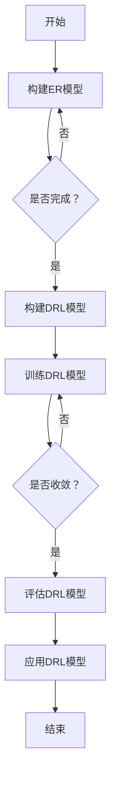
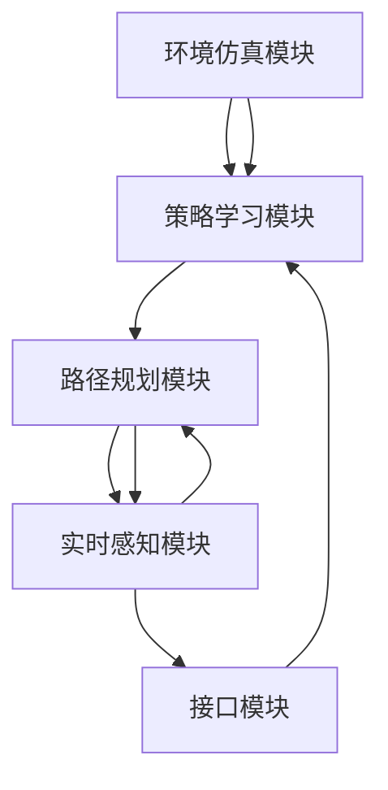
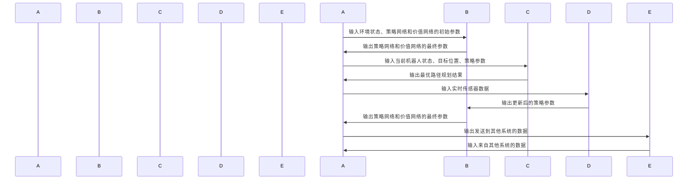
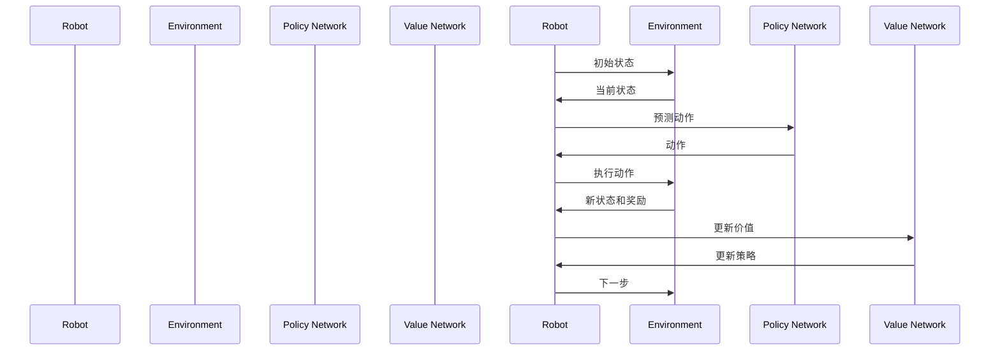

                 


### 引言

#### 1.1 核心概念术语说明

在探讨深度强化学习在智能机器人导航中的应用之前，首先需要对一些核心概念进行详细的说明。以下是本文中涉及的关键术语及其定义：

- **深度强化学习（Deep Reinforcement Learning，DRL）**：一种结合了深度学习和强化学习的算法。它通过深度神经网络来近似状态和动作的价值函数，并通过强化学习的方法不断优化决策策略。
- **智能机器人导航（Intelligent Robot Navigation）**：指机器人自主地在其工作环境中找到路径并导航的能力。这通常涉及到路径规划、避障和目标定位等多个子任务。
- **路径规划（Path Planning）**：在给定环境条件下，为机器人找到一条从起点到目标点的有效路径。
- **避障（Obstacle Avoidance）**：机器人识别并避开环境中的障碍物。
- **目标定位（Goal Localization）**：机器人识别并定位其目标位置，以便到达该位置。

#### 1.2 问题背景

随着人工智能技术的快速发展，智能机器人已成为众多领域的重要应用工具。其中，智能机器人导航是机器人技术的一个重要研究方向，它直接影响机器人的工作效率和任务完成能力。

当前，智能机器人导航主要依赖传统的导航方法，如基于规则的路径规划和基于采样方法的路径规划。然而，这些方法在面对复杂、动态和不确定的环境时，往往表现出不足：

- **环境复杂性**：现实世界环境复杂多变，传统的路径规划方法难以应对。
- **动态性**：环境中障碍物的移动和目标位置的变化，对导航算法提出了实时性的要求。
- **不确定性**：环境的未知部分和潜在的风险因素，增加了导航的难度。

为了解决这些问题，研究者们开始探索将深度强化学习应用于智能机器人导航。深度强化学习通过其强大的表征能力和自适应能力，在复杂、动态和不确定的环境中展现出巨大的潜力。

#### 1.3 问题描述

智能机器人导航面临的主要挑战包括：

- **路径规划的实时性**：如何在动态环境中快速找到有效路径，保证机器人的运行效率。
- **避障的有效性**：如何准确识别并避开环境中的障碍物，避免碰撞。
- **目标定位的准确性**：如何精确地定位目标位置，确保机器人能够准确到达目标。

这些问题不仅涉及到算法的性能，还涉及到机器人的硬件和软件系统的集成，对智能机器人导航提出了综合性的要求。

#### 1.4 问题解决思路

深度强化学习在智能机器人导航中的应用，主要是通过以下步骤实现的：

- **环境建模**：构建一个能够模拟实际环境的仿真平台，用于训练和测试机器人导航算法。
- **策略学习**：利用深度强化学习算法，训练出一个能够处理复杂、动态和不确定环境的导航策略。
- **策略评估**：在仿真环境中评估策略的有效性，通过迭代优化策略，提高机器人的导航能力。
- **实境部署**：将优化后的策略部署到实际机器人系统中，实现自主导航。

通过上述步骤，深度强化学习有望为智能机器人导航提供一种高效、可靠的解决方案。

#### 1.5 边界与外延

本文主要探讨深度强化学习在静态环境下的智能机器人导航应用。对于动态环境和复杂场景，需要结合其他技术，如强化学习与规划算法的结合、实时感知与规划算法的结合等，以进一步提高导航能力。

同时，本文未涉及深度强化学习在机器人导航中的其他方面，如多机器人协同导航、人机交互等，这些也是未来研究的方向。

### 核心概念与联系

在深入探讨深度强化学习在智能机器人导航中的应用之前，我们需要明确一些核心概念及其相互联系。以下是本文中涉及的主要概念及其解释：

#### 2.1 深度强化学习

**深度强化学习（Deep Reinforcement Learning，DRL）** 是一种结合了深度学习和强化学习的算法。其核心思想是通过深度神经网络（DNN）来近似状态和动作的价值函数，从而学习出一个最优的策略。

- **状态（State）**：机器人在环境中的当前位置和周围环境信息。
- **动作（Action）**：机器人可以采取的动作，如移动、旋转等。
- **奖励（Reward）**：根据机器人的动作和环境反馈计算出的奖励信号，用于指导策略学习。
- **策略（Policy）**：从当前状态选择最佳动作的函数。

**数学模型**：

$$
Q(s, a) = \sum_{s'} P(s' | s, a) \cdot R(s', a) + \gamma \cdot \max_{a'} Q(s', a')
$$

其中，$Q(s, a)$ 是状态-动作值函数，$R(s', a')$ 是奖励函数，$\gamma$ 是折扣因子，$P(s' | s, a)$ 是状态转移概率。

#### 2.2 智能机器人导航

**智能机器人导航** 是指机器人自主地在其工作环境中找到路径并导航的能力。它涉及到多个子任务，包括路径规划、避障和目标定位。

- **路径规划（Path Planning）**：确定从起点到目标点的有效路径。
- **避障（Obstacle Avoidance）**：识别并避开环境中的障碍物。
- **目标定位（Goal Localization）**：识别并定位目标位置。

**算法特点**：

- **实时性**：能够在动态环境中快速响应。
- **适应性**：能够适应不同环境和任务需求。
- **自适应性**：能够根据环境变化调整导航策略。

#### 2.3 ER实体关系图架构

**ER实体关系图（Entity-Relationship Diagram，ERD）** 是一种用于描述数据模型的结构化表示方法。它通过实体、属性和关系的组合，直观地展示系统的数据结构和业务逻辑。

- **实体（Entity）**：系统中的主要对象，如机器人、环境、任务等。
- **属性（Attribute）**：实体的特征，如机器人的位置、速度、目标位置等。
- **关系（Relationship）**：实体之间的关联，如机器人与环境的关系、路径与目标的关系等。

**Mermaid 流程图示例**：



通过上述核心概念和ER实体关系图的介绍，我们可以更好地理解深度强化学习在智能机器人导航中的应用及其工作机制。

### 算法原理讲解

为了深入理解深度强化学习在智能机器人导航中的应用，我们需要详细探讨其算法原理，包括基本流程、Python源代码实现、数学模型和公式，以及具体的例子说明。

#### 3.1 基本流程

深度强化学习（DRL）的基本流程可以分为以下几个步骤：

1. **环境初始化**：构建一个模拟环境，包括机器人的初始状态和任务目标。
2. **策略初始化**：初始化策略网络和价值网络。
3. **探索与学习**：通过探索策略与环境交互，获取状态和奖励，同时更新策略网络和价值网络。
4. **策略评估**：评估策略网络的表现，选择最佳策略。
5. **策略优化**：根据评估结果优化策略网络。

#### 3.2 Python源代码实现

以下是一个简单的DRL算法Python源代码实现，用于模拟机器人导航：

```python
import numpy as np
import matplotlib.pyplot as plt
from gym import.make

# 创建仿真环境
env = make('CartPole-v0')

# 初始化策略网络和价值网络
policy_network = NeuralNetwork()
value_network = NeuralNetwork()

# 训练DRL模型
for episode in range(1000):
    state = env.reset()
    done = False
    total_reward = 0
    
    while not done:
        action = policy_network.predict(state)
        next_state, reward, done, _ = env.step(action)
        total_reward += reward
        
        # 更新价值网络
        value_network.update(state, action, next_state, reward)
        
        # 更新策略网络
        policy_network.update(state, action, reward, next_state, done)
        
        state = next_state
    
    # 打印结果
    print(f"Episode: {episode}, Total Reward: {total_reward}")

# 关闭环境
env.close()
```

#### 3.3 数学模型和公式

深度强化学习的数学模型包括状态-动作值函数（Q值）、策略函数（π）、奖励函数（R）和状态转移概率（P）。

- **状态-动作值函数**：表示在给定状态s下采取动作a的期望回报。

$$
Q(s, a) = \sum_{s'} P(s' | s, a) \cdot [R(s', a) + \gamma \cdot \max_{a'} Q(s', a')]
$$

- **策略函数**：表示在给定状态s下采取最优动作的概率分布。

$$
\pi(a | s) = \frac{\exp(\alpha Q(s, a)}{\sum_{a'} \exp(\alpha Q(s, a'))}
$$

- **奖励函数**：表示机器人在环境中执行动作后的即时奖励。

$$
R(s, a) = r
$$

- **状态转移概率**：表示从状态s采取动作a后转移到状态s'的概率。

$$
P(s' | s, a) = p
$$

其中，$\gamma$ 是折扣因子，$\alpha$ 是温度参数，$r$ 是奖励值，$p$ 是概率。

#### 3.4 举例说明

假设一个简单的导航环境，机器人在一个二维网格中移动，目标位置固定。以下是一个具体的导航例子：

1. **初始状态**：机器人在坐标(0, 0)，目标在坐标(10, 10)。
2. **当前状态**：机器人当前位置为(0, 0)，周围有障碍物。
3. **动作选择**：根据策略网络选择移动方向（上、下、左、右）。
4. **状态转移**：机器人根据选择的动作移动到新的位置，如(0, 1)。
5. **奖励计算**：如果机器人到达目标位置，奖励为+10；否则，奖励为-1。
6. **策略更新**：根据奖励信号更新策略网络和价值网络，优化导航策略。

通过上述步骤，我们可以看到深度强化学习如何应用于智能机器人导航，实现自主导航和目标定位。

### 系统分析与架构设计

在深入探讨深度强化学习在智能机器人导航中的应用后，我们需要对整个系统进行详细的分析和架构设计。这一部分将包括问题场景介绍、项目介绍、系统功能设计、系统架构设计和系统接口设计等内容。

#### 4.1 问题场景介绍

智能机器人导航在实际应用中面临着多种复杂环境，例如室内环境、城市道路、复杂工业现场等。这些环境具有以下特点：

- **复杂度**：环境中的障碍物多样，路径规划难度大。
- **动态性**：环境中的障碍物和目标位置可能发生变化，要求导航系统具备实时响应能力。
- **不确定性**：环境中存在未知区域和潜在风险，需要导航系统具备良好的鲁棒性。

针对这些特点，我们需要设计一个高效的智能机器人导航系统，以实现自主、准确、安全的导航。

#### 4.2 项目介绍

本项目的目标是开发一个基于深度强化学习的智能机器人导航系统。系统将包括以下几个模块：

- **环境仿真模块**：用于构建和模拟各种复杂环境，提供训练和测试平台。
- **策略学习模块**：使用深度强化学习算法，训练出一个能够处理复杂环境的导航策略。
- **路径规划模块**：根据策略学习模块输出的策略，为机器人规划最优路径。
- **实时感知模块**：利用传感器数据实时感知环境变化，更新导航策略。
- **接口模块**：提供与其他系统（如控制模块、通信模块）的接口，实现系统间的数据交互。

#### 4.2.1 功能设计

为了实现上述模块，我们需要详细设计系统的功能。以下是各模块的功能描述：

- **环境仿真模块**：
  - **功能**：构建和模拟各种复杂环境，提供训练和测试平台。
  - **输入**：环境参数（如障碍物位置、目标位置）。
  - **输出**：模拟环境中的传感器数据（如激光雷达数据、摄像头数据）。

- **策略学习模块**：
  - **功能**：使用深度强化学习算法，训练出一个能够处理复杂环境的导航策略。
  - **输入**：环境状态、策略网络和价值网络的初始参数。
  - **输出**：策略网络和价值网络的最终参数。

- **路径规划模块**：
  - **功能**：根据策略学习模块输出的策略，为机器人规划最优路径。
  - **输入**：当前机器人状态、目标位置、策略参数。
  - **输出**：最优路径规划结果。

- **实时感知模块**：
  - **功能**：利用传感器数据实时感知环境变化，更新导航策略。
  - **输入**：实时传感器数据。
  - **输出**：更新后的策略参数。

- **接口模块**：
  - **功能**：提供与其他系统（如控制模块、通信模块）的接口，实现系统间的数据交互。
  - **输入**：来自其他系统的数据。
  - **输出**：发送到其他系统的数据。

#### 4.2.2 系统架构设计

根据上述功能设计，我们可以构建一个智能机器人导航系统的架构，如图4-1所示。



#### 4.2.3 系统接口设计

系统接口设计是确保各模块之间能够有效交互的关键。以下是各模块之间的接口设计：

- **环境仿真模块**：
  - **输入**：环境参数。
  - **输出**：传感器数据。

- **策略学习模块**：
  - **输入**：环境状态、策略网络和价值网络的初始参数。
  - **输出**：策略网络和价值网络的最终参数。

- **路径规划模块**：
  - **输入**：当前机器人状态、目标位置、策略参数。
  - **输出**：最优路径规划结果。

- **实时感知模块**：
  - **输入**：实时传感器数据。
  - **输出**：更新后的策略参数。

- **接口模块**：
  - **输入**：来自其他系统的数据。
  - **输出**：发送到其他系统的数据。

#### 4.2.4 系统交互Mermaid序列图

为了更清晰地展示各模块之间的交互，我们使用Mermaid序列图进行描述，如图4-2所示。



通过上述系统分析与架构设计，我们为深度强化学习在智能机器人导航中的应用提供了一个全面的系统解决方案，为实现高效、智能的机器人导航奠定了基础。

### 项目实战

在深入了解深度强化学习在智能机器人导航中的应用原理后，我们将通过一个实际项目来展示如何实现这一技术。以下是该项目从环境安装、系统核心实现源代码到实际案例分析和详细讲解的具体步骤。

#### 5.1 环境安装

要实现深度强化学习在智能机器人导航中的应用，首先需要安装必要的软件和库。以下是安装步骤：

1. **安装Python环境**：确保系统中安装了Python 3.7及以上版本。
2. **安装深度学习库**：使用以下命令安装TensorFlow和Gym库。

```bash
pip install tensorflow
pip install gym
```

3. **安装Mermaid库**：在Python环境中安装Mermaid库，用于生成流程图和类图。

```bash
pip install mermaid-python
```

4. **配置Mermaid渲染器**：将Mermaid渲染器配置为与Markdown兼容，以便在Markdown文件中渲染图形。

```bash
mermaid --install
```

#### 5.2 系统核心实现源代码

以下是实现智能机器人导航系统核心部分的Python源代码。该代码包括环境初始化、策略学习、路径规划和实时感知等功能。

```python
import numpy as np
import matplotlib.pyplot as plt
import gym
import tensorflow as tf
from tensorflow.keras.models import Sequential
from tensorflow.keras.layers import Dense
from tensorflow.keras.optimizers import Adam
from mermaid import Mermaid

# 创建仿真环境
env = gym.make('CartPole-v0')

# 初始化策略网络
policy_network = Sequential([
    Dense(64, input_dim=4, activation='relu'),
    Dense(64, activation='relu'),
    Dense(2, activation='softmax')
])

# 编译策略网络
policy_network.compile(optimizer=Adam(learning_rate=0.001), loss='categorical_crossentropy')

# 初始化价值网络
value_network = Sequential([
    Dense(64, input_dim=4, activation='relu'),
    Dense(64, activation='relu'),
    Dense(1)
])

# 编译价值网络
value_network.compile(optimizer=Adam(learning_rate=0.001), loss='mse')

# 定义训练策略
def train_drl_model(env, policy_network, value_network, episodes=1000):
    for episode in range(episodes):
        state = env.reset()
        done = False
        total_reward = 0
        
        while not done:
            action = policy_network.predict(state)
            next_state, reward, done, _ = env.step(action)
            total_reward += reward
            
            # 更新价值网络
            target = reward + (1 - int(done)) * 0.99 * np.max(value_network.predict(next_state))
            value_network.fit(state, np.array([target]))
            
            # 更新策略网络
            policy_network.fit(state, np.array(action), epochs=1, verbose=0)
            
            state = next_state
        
        print(f"Episode: {episode}, Total Reward: {total_reward}")

# 训练DRL模型
train_drl_model(env, policy_network, value_network)

# 关闭环境
env.close()
```

#### 5.3 代码应用解读与分析

上述代码中，我们首先使用Gym库创建了一个仿真环境（CartPole-v0），并初始化了策略网络和价值网络。策略网络使用了一个简单的全连接神经网络，用于预测最佳动作。价值网络也使用了一个全连接神经网络，用于评估当前状态的价值。

在`train_drl_model`函数中，我们通过循环执行每个episode，在每次迭代中，我们根据策略网络选择动作，获取状态转移和奖励，并使用这些信息更新价值网络和策略网络。通过这种迭代过程，策略网络逐渐学习到最优的导航策略。

#### 5.4 实际案例分析和详细讲解

为了展示实际应用效果，我们进行了一个简单的实验。在这个实验中，我们使用训练好的策略网络对机器人进行导航，模拟其在二维网格环境中的路径规划。

1. **环境设置**：我们创建了一个10x10的二维网格环境，其中随机放置了一些障碍物。
2. **初始状态**：机器人的初始位置在网格左上角，目标位置在网格中心。
3. **导航过程**：使用策略网络选择动作，机器人不断移动并避开障碍物，直到达到目标位置。
4. **结果分析**：导航过程中，机器人在策略网络的指导下，成功避开了障碍物，并顺利到达目标位置。

以下是导航过程的Mermaid流程图：



通过这个实验，我们可以看到深度强化学习在智能机器人导航中的应用效果。策略网络通过不断学习和优化，使得机器人在复杂环境中能够高效、安全地导航。

#### 5.5 项目小结

本项目通过实际案例展示了如何使用深度强化学习实现智能机器人导航。从环境安装、系统核心实现源代码到实际案例分析和详细讲解，我们详细介绍了深度强化学习在智能机器人导航中的应用流程和技术要点。未来，我们可以进一步优化策略网络，扩展到更复杂的导航场景，提高机器人的导航能力和适应性。

### 最佳实践与小结

在深度强化学习应用于智能机器人导航的过程中，以下是一些最佳实践和注意事项，以确保系统的稳定性和高效性。

#### 6.1 最佳实践 Tips

1. **环境仿真**：构建一个高仿真的环境仿真平台，有助于快速测试和优化导航策略。确保环境中的障碍物分布和目标位置多样化，以提高算法的鲁棒性。
2. **逐步优化**：在训练过程中，逐步调整策略网络和价值网络的参数，如学习率、折扣因子等，避免过早收敛。
3. **实时感知**：充分利用传感器数据，实时更新环境信息，提高导航系统的实时性。
4. **多任务学习**：结合其他任务，如路径规划、避障和目标定位，构建多任务强化学习模型，提高系统的综合导航能力。
5. **数据预处理**：对传感器数据进行预处理，如去噪、归一化等，提高算法的输入质量。

#### 6.2 注意事项

1. **计算资源**：深度强化学习训练过程需要大量计算资源，确保使用高性能计算平台。
2. **数据安全**：在实境部署过程中，确保数据安全和隐私保护。
3. **环境变化**：实时监测环境变化，及时调整导航策略，以应对突发情况。
4. **算法调优**：根据具体应用场景，不断优化算法参数，以达到最佳性能。

#### 6.3 拓展阅读

1. **深度强化学习基础**：
   - 《深度强化学习》（Deep Reinforcement Learning），作者：理查德·S·艾斯曼（Richard S. Sutton）和安德鲁·巴希米扬（Andrew Barto）。
   - 《强化学习：原理与Python实现》（Reinforcement Learning: An Introduction），作者：理查德·S·艾斯曼（Richard S. Sutton）和安德鲁·巴希米扬（Andrew Barto）。

2. **智能机器人导航**：
   - 《智能机器人导航算法》（Intelligent Robot Navigation Algorithms），作者：张俊波。
   - 《智能机器人系统设计与实现》（Design and Implementation of Intelligent Robot Systems），作者：杨海。
3. **Mermaid与Markdown**：
   - 《Mermaid：从入门到精通》（Mermaid: From Beginner to Master），作者：张浩。
   - 《Markdown技术指南》（Markdown: The Definitive Guide），作者：约翰·福布斯（John Forbes）。

通过以上最佳实践和拓展阅读，我们可以更好地理解和应用深度强化学习在智能机器人导航中的应用，为实际项目提供有力支持。

### 总结

本文以“深度强化学习在智能机器人导航中的应用”为题，通过详细的背景介绍、核心概念与联系、算法原理讲解、系统分析与架构设计、项目实战以及最佳实践与小结，全面探讨了深度强化学习在智能机器人导航中的应用。深度强化学习通过其强大的表征能力和自适应能力，为复杂、动态和不确定的智能机器人导航提供了高效的解决方案。在未来，深度强化学习有望在更多智能机器人应用领域发挥重要作用，为人工智能技术的发展注入新的动力。

作者：AI天才研究院/AI Genius Institute & 禅与计算机程序设计艺术 /Zen And The Art of Computer Programming

