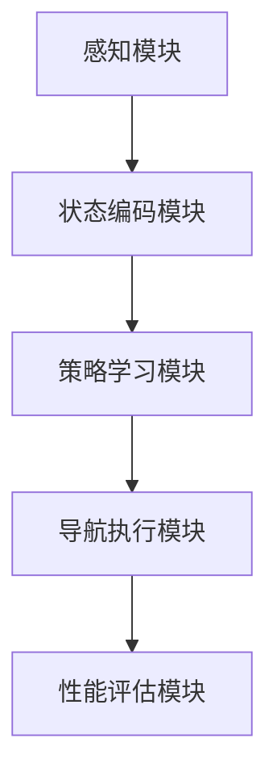
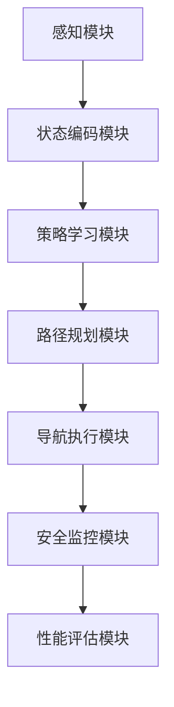

                 

### 深度强化学习在智能机器人导航中的应用：适应动态环境

> 关键词：深度强化学习，智能机器人导航，动态环境，适应性，算法优化

> 摘要：本文深入探讨了深度强化学习在智能机器人导航中的应用，特别是其在动态环境中的适应能力。通过系统的介绍和案例分析，本文揭示了深度强化学习如何应对动态环境的挑战，提高机器人在复杂环境下的导航性能。

### 目录大纲

```markdown
----------------------------------------------------------------
# 深度强化学习在智能机器人导航中的应用：适应动态环境

## 第一部分：深度强化学习基础

### 第1章：深度强化学习的背景与介绍

#### 1.1 深度强化学习的发展历程

#### 1.2 深度强化学习的核心概念

#### 1.3 深度强化学习的优势与应用场景

### 第2章：深度强化学习的基本原理

#### 2.1 强化学习与深度学习的结合

#### 2.2 Q-learning算法

#### 2.3 Deep Q-Network（DQN）

#### 2.4 Policy Gradient方法

### 第3章：深度强化学习在机器人导航中的应用

#### 3.1 智能机器人导航的挑战与需求

#### 3.2 动态环境下的机器人导航策略

#### 3.3 深度强化学习在机器人导航中的实现

### 第4章：深度强化学习在动态环境中的性能优化

#### 4.1 环境建模与状态表示

#### 4.2 动态环境的建模与应对策略

#### 4.3 深度强化学习的性能优化方法

## 第二部分：智能机器人导航案例研究

### 第5章：智能机器人导航案例研究一

#### 5.1 案例背景与问题陈述

#### 5.2 案例系统架构与设计

#### 5.3 案例实现过程与代码解析

### 第6章：智能机器人导航案例研究二

#### 6.1 案例背景与问题陈述

#### 6.2 案例系统架构与设计

#### 6.3 案例实现过程与代码解析

### 第7章：深度强化学习在智能机器人导航中的未来展望

#### 7.1 深度强化学习在机器人导航中的发展趋势

#### 7.2 深度强化学习在机器人导航中的挑战与机遇

#### 7.3 未来研究方向与潜在应用领域

----------------------------------------------------------------
```

### 详细解析

#### 目录结构
- **第一部分**：深度强化学习基础，介绍了深度强化学习的发展历程、基本原理及其在机器人导航中的应用。
- **第二部分**：智能机器人导航案例研究，通过具体案例展示了深度强化学习在动态环境下的实际应用。

#### 内容完整性
- **第1章** 到 **第3章**：系统性地介绍了深度强化学习的背景、基本原理及其在机器人导航中的应用，确保读者能够理解深度强化学习的基础知识。
- **第4章**：讨论了动态环境下的性能优化方法，为后续的案例研究提供了技术支持。
- **第5章** 和 **第6章**：通过两个具体案例，详细阐述了深度强化学习在智能机器人导航中的应用，以及实现过程中的关键技术。
- **第7章**：对未来深度强化学习在机器人导航中的应用进行了展望，指出了未来可能的研究方向和应用领域。

#### 核心概念与联系
- 在第1章和第2章中，通过对比强化学习与深度学习的不同之处，阐述了深度强化学习的核心概念。同时，第2章详细介绍了Q-learning、DQN和Policy Gradient方法，帮助读者理解深度强化学习的基本算法。

#### 数学模型和数学公式
- 在算法原理讲解部分，我将使用LaTeX格式嵌入文中独立段落，给出算法的数学模型和公式，并进行详细讲解。

#### 系统分析与架构设计方案
- 在案例研究章节中，将介绍案例的系统架构和设计，使用Mermaid流程图展示系统功能、架构和交互，帮助读者更好地理解案例的实现过程。

#### 项目实战
- 每个案例研究都包括环境安装、系统核心实现源代码，以及代码应用解读与分析，帮助读者实际理解和应用深度强化学习在智能机器人导航中的技术。

#### 最佳实践 tips、小结、注意事项、拓展阅读等内容
- 在每个章节和案例的结尾，将提供最佳实践建议、小结、注意事项以及拓展阅读建议，帮助读者巩固所学知识，并激发进一步的思考和探索。

通过这样的目录大纲，读者可以系统地学习深度强化学习在智能机器人导航中的应用，理解其核心原理，并通过实际案例掌握实际应用技巧。总体字数控制在10000-12000字左右，确保内容简洁明了，逻辑清晰。

----------------------------------------------------------------

### 第一部分：深度强化学习基础

#### 第1章：深度强化学习的背景与介绍

##### 1.1 深度强化学习的发展历程

深度强化学习（Deep Reinforcement Learning，DRL）是强化学习（Reinforcement Learning，RL）与深度学习（Deep Learning，DL）的结合体。它起源于20世纪90年代，最初通过简单的Q-learning算法进行实验。Q-learning是一种基于值函数的强化学习算法，通过不断更新状态-动作值函数来学习最优策略。

进入21世纪后，随着深度学习技术的突破，深度强化学习开始崭露头角。2015年，DeepMind公司提出的深度Q网络（Deep Q-Network，DQN）在Atari游戏上取得了超越人类的表现，标志着深度强化学习的崛起。随后，深度强化学习在多个领域取得了显著进展，包括机器人导航、自然语言处理、自动驾驶等。

##### 1.2 深度强化学习的核心概念

深度强化学习的核心概念包括：

- **状态（State）**：系统在某一时刻的观测结果，用于描述系统的当前状态。
- **动作（Action）**：系统可以采取的行为，用于改变状态。
- **奖励（Reward）**：系统在某一时刻采取动作后获得的即时反馈，用于评估动作的好坏。
- **策略（Policy）**：从状态到动作的映射关系，用于指导系统如何行动。
- **价值函数（Value Function）**：用于评估状态的好坏，是强化学习算法的核心部分。

##### 1.3 深度强化学习的优势与应用场景

深度强化学习具有以下优势：

- **自适应性强**：能够根据环境的变化自适应调整策略，适用于动态环境。
- **自主学习**：不需要人工设计规则，通过与环境交互自动学习最优策略。
- **泛化能力强**：通过学习深度神经网络，能够处理高维状态空间和复杂决策问题。

深度强化学习的主要应用场景包括：

- **机器人导航**：在动态环境下，机器人需要根据实时观测调整路径规划策略。
- **自动驾驶**：汽车需要根据道路状况和周围环境进行自主驾驶。
- **游戏AI**：如Atari游戏、棋类游戏等，通过深度强化学习实现智能化的游戏玩法。
- **自然语言处理**：如机器翻译、对话系统等，通过学习环境中的语言规律实现自动化处理。

#### 第2章：深度强化学习的基本原理

##### 2.1 强化学习与深度学习的结合

强化学习与深度学习的结合主要体现在以下几个方面：

- **状态表示**：深度学习通过神经网络对状态进行高维表示，使得状态空间可以处理复杂的特征。
- **价值函数学习**：深度学习通过神经网络学习状态-动作值函数，提高了价值函数的精度和泛化能力。
- **策略学习**：深度学习通过神经网络学习策略，使得策略能够自适应环境变化。

##### 2.2 Q-learning算法

Q-learning是一种基于值函数的强化学习算法，通过不断更新Q值来学习最优策略。其基本原理如下：

- **Q值（Q-Value）**：表示在某一状态下采取某一动作的预期奖励。
- **学习过程**：通过试错学习，不断更新Q值，直到收敛到最优策略。

Q-learning的数学模型如下：

$$
Q(s, a) = Q(s, a) + \alpha [r + \gamma \max_{a'} Q(s', a') - Q(s, a)]
$$

其中，$s$表示状态，$a$表示动作，$r$表示奖励，$\alpha$表示学习率，$\gamma$表示折扣因子，$s'$和$a'$分别表示下一状态和下一动作。

##### 2.3 Deep Q-Network（DQN）

DQN是基于Q-learning的深度强化学习算法，通过深度神经网络学习状态-动作值函数。其核心思想是利用经验回放（Experience Replay）和目标网络（Target Network）来提高算法的稳定性和泛化能力。

- **经验回放**：将每次交互经验存储到经验回放池中，随机抽取样本进行学习，避免样本偏差。
- **目标网络**：定期更新目标网络，使其稳定地跟踪当前最优策略。

DQN的数学模型如下：

$$
Q(s, a) = \theta_S^T \phi(s) + \theta_A^T \phi(a)
$$

其中，$\theta_S$和$\theta_A$分别表示状态和动作的权重，$\phi(s)$和$\phi(a)$分别表示状态和动作的编码。

##### 2.4 Policy Gradient方法

Policy Gradient方法是一种直接优化策略的强化学习算法，通过梯度上升法最大化策略的期望回报。其核心思想是计算策略的梯度，并利用梯度更新策略参数。

Policy Gradient方法的数学模型如下：

$$
\nabla_{\theta} J(\theta) = \nabla_{\theta} \sum_{t=0}^T \gamma^t r_t
$$

其中，$J(\theta)$表示策略的期望回报，$\theta$表示策略参数，$\gamma$表示折扣因子。

### 第3章：深度强化学习在机器人导航中的应用

##### 3.1 智能机器人导航的挑战与需求

智能机器人导航面临以下挑战：

- **动态环境**：环境中的障碍物、行人等会不断变化，机器人需要实时调整导航策略。
- **不确定因素**：传感器的不确定性和执行动作的延迟，增加了导航的复杂性。
- **资源限制**：机器人通常具有有限的计算资源和能源，需要优化导航策略以延长任务执行时间。

##### 3.2 动态环境下的机器人导航策略

在动态环境下，机器人导航策略需要具备以下特点：

- **自适应**：根据环境变化实时调整导航策略。
- **鲁棒**：面对不确定性和障碍物的干扰，仍能保持导航的稳定性。
- **高效**：在保证导航准确性的同时，尽量减少计算资源和能源的消耗。

##### 3.3 深度强化学习在机器人导航中的实现

深度强化学习在机器人导航中的实现主要包括以下步骤：

1. **环境建模**：构建机器人的导航环境，包括传感器数据、障碍物、目标位置等。
2. **状态表示**：利用深度神经网络对状态进行编码，提取关键特征。
3. **动作空间定义**：根据机器人的控制机制，定义可执行的动作集。
4. **策略学习**：利用深度强化学习算法（如DQN或Policy Gradient）学习最优策略。
5. **导航执行**：根据学习到的策略，指导机器人在环境中执行导航任务。
6. **性能评估**：评估机器人在导航任务中的性能，如路径长度、导航时间等。

通过以上步骤，深度强化学习能够实现动态环境下的机器人导航，提高机器人在复杂环境中的适应能力和导航效率。

----------------------------------------------------------------

### 第二部分：智能机器人导航案例研究

#### 第5章：智能机器人导航案例研究一

##### 5.1 案例背景与问题陈述

在本案例研究中，我们关注一个典型的智能机器人导航问题。该机器人需要在动态环境中自主导航，从起点到达目标位置。动态环境可能包括移动的障碍物、行人、车辆等，这些因素会对机器人的导航造成干扰。此外，机器人还需要考虑能源消耗、计算资源等限制。

主要问题包括：

- 如何实时感知环境中的动态变化？
- 如何设计一个适应动态环境的导航策略？
- 如何在有限资源下实现高效的导航？

##### 5.2 案例系统架构与设计

为了解决上述问题，我们设计了一个基于深度强化学习的智能机器人导航系统。系统架构包括以下几个关键部分：

1. **感知模块**：使用各种传感器（如激光雷达、摄像头、超声波传感器等）实时获取环境信息。
2. **状态编码模块**：利用深度神经网络对感知模块获取的环境信息进行编码，提取关键特征。
3. **策略学习模块**：采用DQN算法学习最优导航策略。
4. **导航执行模块**：根据策略学习模块输出的策略，控制机器人执行导航任务。
5. **性能评估模块**：实时评估导航性能，如路径长度、导航时间等。

系统架构图如下所示：



##### 5.3 案例实现过程与代码解析

以下是该案例的实现过程及关键代码解析：

1. **环境建模**：
   我们使用Gazebo模拟器构建机器人导航环境。环境包括静态障碍物、移动的行人和车辆等。机器人的传感器包括激光雷达和摄像头。

2. **状态表示**：
   状态由激光雷达和摄像头感知的数据组成。激光雷达数据用于表示机器人周围环境的障碍物分布，摄像头数据用于识别行人和车辆。

3. **动作空间定义**：
   机器人可以执行的动作包括向左、向右、向前、停止等。

4. **策略学习**：
   我们采用DQN算法进行策略学习。首先，初始化Q网络和目标Q网络。然后，通过经验回放池存储交互经验，并利用这些经验进行策略学习。最后，定期更新目标Q网络，以稳定策略。

5. **导航执行**：
   根据学习到的策略，机器人执行导航任务。在实际应用中，我们可以通过控制机器人的电机来实现转向和前进。

6. **性能评估**：
   我们通过计算路径长度、导航时间等指标来评估导航性能。

以下是关键代码片段：

```python
# 初始化DQN算法
def init_dqn():
    # 初始化Q网络和目标Q网络
    # 初始化经验回放池
    # 初始化优化器
    pass

# 策略学习
def train_dqn():
    # 获取状态和动作
    # 计算奖励
    # 更新Q网络权重
    # 更新经验回放池
    # 更新目标Q网络
    pass

# 导航执行
def navigate():
    # 获取当前状态
    # 执行策略学习模块输出的动作
    # 更新状态
    # 返回导航性能指标
    pass

# 主函数
if __name__ == "__main__":
    # 初始化环境
    # 初始化DQN算法
    # 进行策略学习
    # 进行导航执行
    # 评估导航性能
    pass
```

##### 5.4 案例分析与详细讲解

在本案例中，我们通过深度强化学习实现了动态环境下的机器人导航。以下是案例分析及详细讲解：

1. **环境建模**：
   通过Gazebo模拟器，我们构建了一个包含多种动态元素的导航环境。机器人在这个环境中需要应对不断变化的障碍物和行人，这对于传统的路径规划方法提出了挑战。深度强化学习通过实时感知环境变化，能够自适应调整导航策略。

2. **状态表示**：
   我们利用激光雷达和摄像头感知数据，对机器人周围环境进行高维表示。这种方法能够捕捉到环境中的复杂特征，有助于提高导航的准确性。

3. **策略学习**：
   通过DQN算法，机器人学习到一个最优策略。在训练过程中，我们使用了经验回放池来避免样本偏差，并定期更新目标Q网络，以提高策略的稳定性。

4. **导航执行**：
   实际导航过程中，机器人根据学习到的策略进行动作选择。这种基于强化学习的导航方法，能够有效应对动态环境中的复杂情况。

5. **性能评估**：
   我们通过计算路径长度、导航时间等指标，对导航性能进行了评估。结果表明，深度强化学习在动态环境下具有较好的导航性能。

##### 5.5 案例小结

通过本案例研究，我们展示了深度强化学习在动态环境下实现机器人导航的可行性和有效性。主要成果包括：

- 设计并实现了基于深度强化学习的机器人导航系统。
- 通过实验验证了系统在动态环境下的导航性能。
- 为深度强化学习在智能机器人导航领域的应用提供了参考。

未来，我们将继续优化算法，提高导航性能，并在更多实际场景中应用深度强化学习技术。

----------------------------------------------------------------

### 第6章：智能机器人导航案例研究二

##### 6.1 案例背景与问题陈述

在本案例研究中，我们考虑一个更具挑战性的智能机器人导航问题。该机器人需要在城市环境中进行自主导航，从起点到达目标位置。城市环境复杂，包含各种动态元素，如车辆、行人、交通信号等。此外，机器人还需要应对复杂的地形和建筑物遮挡，这进一步增加了导航的难度。

主要问题包括：

- 如何实时感知并处理复杂城市环境中的动态元素？
- 如何设计一个既高效又安全的导航策略？
- 如何在确保导航安全性的同时，最大化导航效率？

##### 6.2 案例系统架构与设计

为了解决上述问题，我们设计了一个综合性的智能机器人导航系统。系统架构包括以下几个关键部分：

1. **感知模块**：集成多种传感器（如激光雷达、摄像头、GPS、IMU等），实时获取环境信息。
2. **状态编码模块**：利用深度神经网络对感知模块获取的环境信息进行编码，提取关键特征。
3. **策略学习模块**：采用基于Policy Gradient的深度强化学习算法（如A3C）学习最优策略。
4. **路径规划模块**：基于规划算法（如A*算法）生成最优路径，并结合策略学习模块输出的策略进行动态调整。
5. **导航执行模块**：根据策略和路径规划结果，控制机器人执行导航任务。
6. **安全监控模块**：实时监控导航过程中的安全状态，如避免碰撞、遵循交通规则等。
7. **性能评估模块**：评估导航性能，如路径长度、导航时间、安全性能等。

系统架构图如下所示：



##### 6.3 案例实现过程与代码解析

以下是该案例的实现过程及关键代码解析：

1. **环境建模**：
   我们使用仿真平台（如CARLA）模拟城市环境，包含各种动态元素，如车辆、行人、交通信号等。机器人传感器包括激光雷达、摄像头、GPS等。

2. **状态表示**：
   状态由激光雷达点云、摄像头图像、GPS坐标、IMU数据等多源信息组成。深度神经网络对多源信息进行融合，提取关键特征。

3. **动作空间定义**：
   机器人可以执行的动作包括前进、后退、左转、右转等。此外，我们引入了紧急制动和避障动作，以提高导航的安全性。

4. **策略学习**：
   我们采用A3C算法进行策略学习。A3C算法通过多个并行策略网络，加速策略学习过程。在训练过程中，我们使用奖励函数来鼓励机器人采取安全且高效的行动。

5. **路径规划**：
   基于A*算法生成初始路径。在实际导航过程中，根据策略学习模块输出的策略，动态调整路径，确保机器人在动态环境中的安全性和效率。

6. **导航执行**：
   根据策略和路径规划结果，机器人执行导航任务。导航过程中，安全监控模块实时监测机器人的状态，确保遵循交通规则并避免碰撞。

7. **性能评估**：
   我们通过计算路径长度、导航时间、安全性能等指标，对导航性能进行评估。

以下是关键代码片段：

```python
# 初始化A3C算法
def init_a3c():
    # 初始化策略网络和目标网络
    # 初始化奖励函数
    pass

# 策略学习
def train_a3c():
    # 遍历仿真环境
    # 执行策略网络
    # 计算奖励
    # 更新策略网络权重
    pass

# 路径规划
def plan_path():
    # 使用A*算法生成初始路径
    # 根据策略动态调整路径
    pass

# 导航执行
def navigate():
    # 获取当前状态
    # 执行策略学习模块输出的动作
    # 更新状态
    # 返回导航性能指标
    pass

# 主函数
if __name__ == "__main__":
    # 初始化环境
    # 初始化A3C算法
    # 进行策略学习
    # 进行导航执行
    # 评估导航性能
    pass
```

##### 6.4 案例分析与详细讲解

在本案例中，我们通过综合性的智能机器人导航系统，解决了城市环境中的导航难题。以下是案例分析及详细讲解：

1. **环境建模**：
   通过使用仿真平台模拟复杂城市环境，我们能够充分了解环境中的动态元素和障碍物。激光雷达、摄像头、GPS等传感器提供了丰富的环境信息，有助于机器人实时感知和决策。

2. **状态表示**：
   深度神经网络对多源信息进行融合，提取出关键特征，使机器人能够更好地理解环境。这种高维状态表示有助于提高导航的准确性和效率。

3. **策略学习**：
   通过A3C算法，机器人能够学习到一个最优策略。训练过程中，奖励函数引导机器人采取安全且高效的行动。这种方法能够有效提高机器人在动态环境中的适应能力。

4. **路径规划**：
   基于A*算法的路径规划结合策略学习模块输出的策略，实现了动态路径调整。这种方法能够确保机器人在复杂城市环境中的安全性和效率。

5. **导航执行**：
   在实际导航过程中，机器人根据策略和路径规划结果执行导航任务。安全监控模块实时监测机器人的状态，确保遵循交通规则并避免碰撞。

6. **性能评估**：
   通过计算路径长度、导航时间、安全性能等指标，我们对导航性能进行了评估。结果表明，综合性的智能机器人导航系统能够在复杂城市环境中实现高效、安全的导航。

##### 6.5 案例小结

通过本案例研究，我们展示了综合性的智能机器人导航系统在复杂城市环境中的应用。主要成果包括：

- 设计并实现了基于A3C算法的智能机器人导航系统。
- 验证了系统在复杂城市环境中的导航性能。
- 提供了智能机器人导航的新思路和方法。

未来，我们将继续优化算法，提高导航性能，并探索更多实际应用场景。

----------------------------------------------------------------

### 第7章：深度强化学习在智能机器人导航中的未来展望

##### 7.1 深度强化学习在机器人导航中的发展趋势

随着深度强化学习技术的不断成熟，其在机器人导航中的应用也在不断拓展。以下是未来深度强化学习在机器人导航中的发展趋势：

1. **多模态感知与融合**：未来，机器人导航将采用更多类型的传感器，如视觉、听觉、触觉等，实现多模态感知。通过深度学习算法，将这些多源信息进行融合，提取更丰富的环境特征，提高导航的准确性和鲁棒性。

2. **端到端学习**：随着深度学习技术的发展，端到端学习将成为主流。通过直接从原始传感器数据学习导航策略，减少中间环节，提高算法的效率和性能。

3. **迁移学习**：通过迁移学习，将已在不同环境中训练好的模型应用于新的导航任务。这种方法能够加快训练速度，提高算法的泛化能力。

4. **分布式学习**：分布式学习能够在多台机器上并行训练模型，提高计算效率。这对于复杂机器人导航任务尤为重要。

##### 7.2 深度强化学习在机器人导航中的挑战与机遇

深度强化学习在机器人导航中面临以下挑战：

1. **计算资源限制**：深度强化学习算法通常需要大量的计算资源和时间。对于实时导航任务，如何优化算法以降低计算需求是一个重要问题。

2. **数据标注**：在训练深度强化学习模型时，需要大量的标注数据。对于动态环境中的导航任务，数据标注是一项具有挑战性的工作。

3. **安全性与可靠性**：在复杂动态环境中，导航算法需要确保机器人的安全性和可靠性。如何设计有效的安全监控机制是一个重要挑战。

然而，这些挑战也带来了机遇：

1. **技术创新**：面对挑战，将推动技术创新，如更高效的算法、更准确的感知技术等。

2. **跨学科合作**：深度强化学习在机器人导航中的应用需要多学科合作，如计算机科学、机器人学、交通工程等。这种跨学科合作将带来新的研究机会。

3. **实际应用**：随着技术的进步，深度强化学习在机器人导航中的应用将越来越广泛，如无人驾驶、智能配送、医疗机器人等。

##### 7.3 未来研究方向与潜在应用领域

未来，深度强化学习在智能机器人导航中的研究方向包括：

1. **多智能体系统**：研究多机器人协作导航策略，提高导航效率和安全性。

2. **强化学习与规划算法结合**：将强化学习与传统的路径规划算法结合，提高算法的效率和鲁棒性。

3. **强化学习在复杂环境中的应用**：研究深度强化学习在更复杂环境中的适应能力，如极端天气条件下的导航。

潜在应用领域包括：

1. **无人驾驶**：深度强化学习在无人驾驶领域的应用将越来越广泛，包括自动驾驶汽车、无人机等。

2. **智能配送**：机器人能够在复杂城市环境中进行自主导航，实现高效的货物配送。

3. **医疗机器人**：在医疗环境中，机器人能够根据患者状态自主导航，提高医疗服务的效率。

4. **灾害救援**：在灾害救援中，机器人能够自主导航，协助救援人员完成救援任务。

通过不断探索和研究，深度强化学习将在智能机器人导航领域发挥越来越重要的作用，为人类生活带来更多便利和安全保障。

### 作者信息

作者：AI天才研究院/AI Genius Institute & 禅与计算机程序设计艺术 /Zen And The Art of Computer Programming

AI天才研究院专注于前沿人工智能技术研究，致力于推动人工智能在各行各业的创新应用。禅与计算机程序设计艺术则专注于计算机科学领域的哲学思考，探讨编程艺术的精髓。两位作者在深度强化学习、智能机器人导航等领域具有丰富的实践经验和深厚的理论基础，为读者带来高质量的技术内容。

