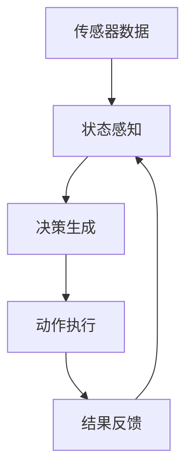

                 

# 深度强化学习在智能机器人控制中的应用

## 关键词

- 深度强化学习
- 智能机器人控制
- 机器人路径规划
- 机器人抓取
- 深度确定性策略梯度（DDPG）

## 摘要

本文将深入探讨深度强化学习在智能机器人控制中的应用。首先，我们将回顾深度强化学习的历史背景、核心概念和与传统强化学习的区别。随后，我们将介绍深度神经网络的基础知识，以及如何将深度神经网络与强化学习相结合。接下来，本文将详细讲解深度强化学习的核心算法，如深度确定性策略梯度（DDPG）。然后，我们将探讨深度强化学习在机器人控制中的应用场景，包括路径规划和机器人抓取。为了更好地理解这些应用，我们将设计实验并分析案例。最后，本文将展望深度强化学习在机器人控制领域的未来发展，以及面临的挑战。

## 目录大纲

### 第一部分：深度强化学习基础

### 第1章：深度强化学习概述

- 1.1 深度强化学习的历史背景与问题背景
- 1.2 深度强化学习的核心概念
- 1.3 深度强化学习与传统强化学习的区别
- 1.4 深度强化学习的应用前景

### 第2章：深度神经网络基础

- 2.1 神经网络的基本原理
- 2.2 深度神经网络的结构与特点
- 2.3 深度神经网络训练原理

### 第3章：强化学习基础

- 3.1 强化学习的定义与基本原理
- 3.2 Q学习算法
- 3.3 SARSA算法
- 3.4 深度Q网络（DQN）

### 第4章：深度强化学习的核心算法

- 4.1 深度确定性策略梯度（DDPG）
- 4.2 集成策略梯度（A3C）
- 4.3 深度优势演员-评论家（A2C）

### 第二部分：深度强化学习在机器人控制中的应用

### 第5章：深度强化学习在机器人控制中的应用

- 5.1 机器人控制的基本概念
- 5.2 深度强化学习在机器人路径规划中的应用
- 5.3 深度强化学习在机器人抓取中的应用

### 第6章：实验设计与案例分析

- 6.1 实验设计与评价指标
- 6.2 案例一：智能机器人导航
- 6.3 案例二：智能机器人抓取
- 6.4 案例分析与总结

### 第三部分：未来展望与挑战

### 第7章：未来展望与挑战

- 7.1 深度强化学习在机器人控制中的未来发展
- 7.2 当前挑战与解决方案
- 7.3 深度强化学习在其他领域的应用前景

## 第一部分：深度强化学习基础

### 第1章：深度强化学习概述

#### 1.1 深度强化学习的历史背景与问题背景

深度强化学习（Deep Reinforcement Learning，简称DRL）是机器学习的一个分支，它结合了深度学习和强化学习的方法，用于解决复杂的决策问题。深度强化学习的历史可以追溯到20世纪80年代，当时研究者们开始探索如何让计算机通过试错学习在环境中进行决策。

强化学习的基本思想是通过奖励（Reward）来引导学习过程，使得学习到的策略能够在特定的环境下获得最优的回报。然而，传统的强化学习算法通常需要大量的样本数据和计算资源，且在面对高维状态和动作空间时表现不佳。

深度学习的出现为强化学习带来了新的契机。深度学习通过多层神经网络能够有效地学习到复杂的特征表示，从而在处理高维数据时表现出色。深度强化学习结合了深度学习和强化学习的优势，能够在复杂的动态环境中实现有效的决策。

#### 1.2 深度强化学习的核心概念

深度强化学习的核心概念包括状态（State）、动作（Action）、奖励（Reward）和策略（Policy）。状态是环境的一个描述，动作是智能体（Agent）在某个状态下可以采取的行为，奖励是环境对智能体动作的反馈，而策略则是智能体根据当前状态选择动作的规则。

深度强化学习的关键在于设计一个能够学习到良好策略的模型。这个模型通常由一个深度神经网络组成，该神经网络可以从高维状态空间中提取出有效的特征表示，并根据这些特征来选择最优动作。

#### 1.3 深度强化学习与传统强化学习的区别

深度强化学习与传统强化学习的主要区别在于其使用的模型。传统强化学习算法，如Q学习（Q-Learning）和SARSA（State-Action-Reward-State-Action，即SARSA），通常使用表格形式的Q值函数来表示策略。这种Q值函数依赖于离散的状态和动作空间，因此在处理高维问题时存在很大的局限性。

而深度强化学习则通过深度神经网络来表示Q值函数，这使得它能够处理连续的状态和动作空间。深度神经网络能够自动学习到状态和动作之间的复杂映射关系，从而使得深度强化学习在处理复杂任务时表现出更高的效率。

#### 1.4 深度强化学习的应用前景

深度强化学习在许多领域都有广泛的应用前景，尤其在智能机器人控制、自动驾驶、游戏AI等领域。通过深度强化学习，智能机器人能够自主地学习和适应复杂的环境，从而实现更智能的决策和控制。

在机器人控制领域，深度强化学习可以用于机器人路径规划、机器人抓取、机器人避障等任务。通过深度强化学习，机器人可以学习到如何在不同场景下进行有效的决策，从而提高其自主性和灵活性。

在自动驾驶领域，深度强化学习可以帮助自动驾驶系统学习如何在不同交通环境中进行决策，以提高其安全性和可靠性。通过深度强化学习，自动驾驶系统可以自主地学习驾驶规则、应对突发情况，从而提高驾驶体验。

在游戏AI领域，深度强化学习可以用于开发更加智能的游戏角色，使其能够更好地应对游戏中的挑战。通过深度强化学习，游戏AI可以学习到如何在不同策略下进行决策，从而提高游戏的难度和趣味性。

总之，深度强化学习在智能机器人控制中的应用前景广阔，它为解决复杂决策问题提供了一种有效的方法。随着深度学习和强化学习技术的不断发展，深度强化学习将在未来带来更多的创新和应用。

### 第2章：深度神经网络基础

#### 2.1 神经网络的基本原理

神经网络（Neural Networks，简称NN）是模仿人脑神经元结构和功能的一种计算模型。神经网络由多个节点（称为神经元）组成，这些节点通过连接（称为边）相互连接。每个神经元都可以接收来自其他神经元的输入，并通过一个非线性激活函数产生输出。

神经元的计算过程可以表示为：
$$
y = \sigma(\sum_{i} w_i \cdot x_i + b)
$$
其中，$y$是神经元的输出，$\sigma$是非线性激活函数（如Sigmoid函数、ReLU函数等），$w_i$是边上的权重，$x_i$是输入，$b$是偏置。

通过多次叠加这样的计算过程，神经网络可以学习到复杂的非线性关系。神经网络的核心在于其参数，这些参数通过学习过程不断调整，以使神经网络能够对输入数据进行分类或回归。

#### 2.2 深度神经网络的结构与特点

深度神经网络（Deep Neural Networks，简称DNN）是一种具有多个隐藏层的神经网络。与传统的单层神经网络相比，深度神经网络能够学习到更复杂的特征表示。

深度神经网络的结构通常包括以下几个部分：

1. **输入层（Input Layer）**：接收外部输入，如图片、文本或传感器数据。
2. **隐藏层（Hidden Layers）**：多个隐藏层堆叠在一起，每个隐藏层都包含多个神经元。隐藏层负责提取和转换输入数据，形成更高层次的特征表示。
3. **输出层（Output Layer）**：生成最终的预测结果，如分类标签或回归值。

深度神经网络的特点在于其层次化的结构，这使得它能够自动学习到数据的层次化特征表示。在训练过程中，每个隐藏层都能够从上一层提取特征，并通过组合和变换形成新的特征表示。这种层次化的特征学习机制使得深度神经网络在处理复杂任务时表现出色。

#### 2.3 深度神经网络训练原理

深度神经网络的训练过程包括两个主要阶段：前向传播（Forward Propagation）和反向传播（Backpropagation）。

1. **前向传播**：在前向传播阶段，输入数据通过神经网络，每个神经元的输出通过激活函数传递到下一层。这个过程使得神经网络能够对输入数据进行编码，形成特征表示。
2. **反向传播**：在反向传播阶段，神经网络的输出与实际标签之间的误差通过反向传播传递到每个神经元。通过计算误差，神经网络可以更新权重和偏置，以减小预测误差。

反向传播的核心是梯度下降算法。梯度下降算法通过计算损失函数关于参数的梯度，并沿着梯度的反方向更新参数，以减小损失函数的值。这个过程不断重复，直到神经网络收敛到最优参数。

深度神经网络的训练过程通常涉及以下几个步骤：

1. **初始化参数**：随机初始化神经网络中的权重和偏置。
2. **前向传播**：输入数据通过神经网络，计算输出。
3. **计算损失**：计算输出与实际标签之间的损失。
4. **反向传播**：计算损失函数关于参数的梯度，并更新参数。
5. **迭代更新**：重复上述步骤，直到神经网络收敛。

通过训练，深度神经网络能够学习到输入数据中的复杂特征，从而实现高效的数据分类或回归。

#### 2.4 深度神经网络的优势与挑战

深度神经网络在处理复杂任务时表现出色，具有以下几个优势：

1. **强大的特征提取能力**：深度神经网络能够自动学习到输入数据的层次化特征表示，从而实现对数据的深入理解。
2. **适用于多种任务**：深度神经网络可以应用于分类、回归、自然语言处理、图像识别等多种任务。
3. **良好的泛化能力**：通过训练和验证集的分离，深度神经网络能够避免过拟合问题，提高其泛化能力。

然而，深度神经网络也存在一些挑战：

1. **训练时间与计算资源**：深度神经网络通常需要大量的训练时间和计算资源，特别是在处理大规模数据和复杂任务时。
2. **参数调优难度**：深度神经网络的参数调优过程复杂，需要大量的实验和尝试。
3. **可解释性**：深度神经网络的内部结构复杂，难以解释其工作原理。

尽管存在这些挑战，深度神经网络在许多领域都取得了显著的成果，并在未来有望继续发挥重要作用。

### 第3章：强化学习基础

#### 3.1 强化学习的定义与基本原理

强化学习（Reinforcement Learning，简称RL）是一种通过互动经验学习如何采取行动，以最大化长期奖励的机器学习方法。在强化学习中，智能体（Agent）在未知的环境中通过尝试不同的动作（Action），从环境中获取状态（State）和奖励（Reward）。智能体的目标是通过不断的学习和调整策略（Policy），在长期内获得最大的奖励积累。

强化学习的基本原理包括以下几个核心概念：

1. **状态（State）**：智能体在某一时刻所处的环境描述。
2. **动作（Action）**：智能体在某一状态下可以采取的行为。
3. **奖励（Reward）**：环境对智能体动作的即时反馈，用于评估动作的好坏。
4. **策略（Policy）**：智能体在某一状态下选择动作的规则。

强化学习的学习过程可以分为以下几个阶段：

1. **初始探索（Exploration）**：在开始阶段，智能体通过随机选择动作来探索环境，以获取更多的状态信息。
2. **目标优化（Goal-Driven Optimization）**：在探索阶段后，智能体根据已获取的信息，通过优化策略来最大化长期奖励。
3. **持续学习（Continuous Learning）**：智能体在环境中不断进行交互，并根据新获取的信息不断调整策略，以提高其在长期内的性能。

#### 3.2 Q学习算法

Q学习（Q-Learning）是强化学习中最基本和最常用的算法之一。Q学习通过学习状态-动作值函数（Q值函数）来选择最佳动作。Q值函数表示在某个状态下采取某个动作所能获得的预期奖励。

Q学习算法的基本步骤如下：

1. **初始化Q值函数**：随机初始化Q值函数，表示在各个状态下采取各个动作的预期奖励。
2. **选择动作**：在某个状态下，智能体根据Q值函数选择具有最高预期奖励的动作。
3. **更新Q值**：根据智能体的动作和获得的奖励，更新Q值函数。更新公式如下：
   $$
   Q(s, a) = Q(s, a) + \alpha [r + \gamma \max_{a'} Q(s', a') - Q(s, a)]
   $$
   其中，$\alpha$是学习率（Learning Rate），$r$是即时奖励，$\gamma$是折扣因子（Discount Factor），$s'$是下一状态，$a'$是下一动作。

Q学习算法的优点是简单易实现，且不需要明确的模型。然而，Q学习在处理高维状态和动作空间时存在困难，且容易出现**灾难性遗忘**（catastrophic forgetting）问题，即新学习的任务会遗忘之前的经验。

#### 3.3 SARSA算法

SARSA（State-Action-Reward-State-Action，即SARSA）算法是一种基于值函数的强化学习算法，与Q学习算法类似，但使用同一策略进行状态-动作对的更新。SARSA算法的基本步骤如下：

1. **初始化策略**：随机初始化策略，表示在各个状态下选择各个动作的概率。
2. **选择动作**：在某个状态下，智能体根据当前策略选择动作。
3. **执行动作并获取奖励**：智能体执行所选动作，并获取奖励和下一状态。
4. **更新策略**：根据当前状态-动作对和获得的奖励，更新策略。更新公式如下：
   $$
   \pi(s, a) = \frac{\pi(s, a) + \alpha [r + \gamma \max_{a'} \pi(s', a') - \pi(s, a)]}{1 + \alpha}
   $$
   其中，$\alpha$是学习率（Learning Rate），$r$是即时奖励，$\gamma$是折扣因子（Discount Factor）。

SARSA算法的优点是避免了对Q值函数的直接更新，从而减少了**灾难性遗忘**问题的发生。然而，SARSA算法在处理高维状态和动作空间时，仍然面临计算复杂度较高的问题。

#### 3.4 深度Q网络（DQN）

深度Q网络（Deep Q-Network，简称DQN）是一种基于深度神经网络的Q学习算法，用于解决高维状态和动作空间的问题。DQN通过深度神经网络来近似Q值函数，从而提高了算法的效率和性能。

DQN的基本步骤如下：

1. **初始化深度神经网络和经验回放记忆**：随机初始化深度神经网络，并创建一个经验回放记忆，用于存储过去的状态-动作对。
2. **选择动作**：在某个状态下，智能体根据当前策略和深度神经网络输出选择动作。输出表示在各个状态下采取各个动作的预期奖励。
3. **执行动作并获取奖励**：智能体执行所选动作，并获取奖励和下一状态。
4. **更新经验回放记忆**：将当前的状态-动作对添加到经验回放记忆中。
5. **更新深度神经网络**：根据经验回放记忆中的数据，通过反向传播算法更新深度神经网络参数。
6. **重复步骤2-5**：重复执行动作、更新经验和更新网络，直到满足停止条件。

DQN算法的优点在于其能够高效地处理高维状态和动作空间，并且通过经验回放记忆减少了**灾难性遗忘**问题。然而，DQN算法在训练过程中可能存在**偏差-方差**（bias-variance）问题，即网络可能过度拟合经验回放记忆中的数据，从而影响其泛化能力。

总之，强化学习作为机器学习的重要分支，通过互动经验学习如何采取行动，以最大化长期奖励。Q学习、SARSA算法和DQN算法是强化学习的核心算法，它们在处理不同类型的问题时具有各自的优势和挑战。随着深度学习技术的发展，深度强化学习在解决复杂决策问题方面展现出巨大的潜力。

### 第4章：深度强化学习的核心算法

#### 4.1 深度确定性策略梯度（DDPG）

深度确定性策略梯度（Deep Deterministic Policy Gradient，简称DDPG）是一种基于深度强化学习的算法，它通过优化策略网络来使智能体在环境中实现长期奖励最大化。DDPG的主要特点在于其使用了一个确定性策略网络，这使得它在处理连续动作空间时表现出色。

#### 4.1.1 DDPG算法原理

DDPG算法的核心思想是优化一个确定性策略网络，使其能够根据当前状态生成最优动作。具体来说，DDPG包括以下几个主要组成部分：

1. **状态空间（State Space）**：智能体接收到的环境状态。
2. **动作空间（Action Space）**：智能体可以采取的动作集合，通常是连续的。
3. **策略网络（Policy Network）**：一个深度神经网络，用于从状态空间中生成动作。策略网络是确定性的，即给定一个状态，它总是输出同一个动作。
4. **目标网络（Target Network）**：一个与策略网络结构相同的深度神经网络，用于计算目标值。目标网络的目的是稳定策略网络的学习过程。
5. **经验回放（Experience Replay）**：用于存储和随机采样过去的状态-动作对，以避免策略网络对最新经验的过度依赖。

DDPG算法的训练过程如下：

1. **初始化**：随机初始化策略网络、目标网络和经验回放记忆。
2. **交互**：智能体在环境中进行交互，执行策略网络生成的动作，并获取状态和奖励。
3. **存储经验**：将当前的状态-动作对存储到经验回放记忆中。
4. **随机采样**：从经验回放记忆中随机采样一组状态-动作对。
5. **计算目标值**：使用目标网络计算每个状态-动作对的目标值，目标值由奖励和未来的预期奖励组成：
   $$
   y = r + \gamma \cdot \max_{a'} \phi(\mathbf{s'}, \theta_{\text{target}})
   $$
   其中，$r$是即时奖励，$\gamma$是折扣因子，$\phi(\mathbf{s'}, \theta_{\text{target}})$是目标网络的输出。
6. **更新策略网络**：使用反向传播算法和梯度下降更新策略网络的参数，以最小化策略网络的损失函数：
   $$
   \nabla_{\theta_{\pi}} J(\theta_{\pi}) = \nabla_{\theta_{\pi}} \sum_{i} \left( y_i - \phi(\mathbf{s}_i, \theta_{\pi}) \right)
   $$

#### 4.1.2 DDPG算法的优势

DDPG算法在处理连续动作空间时具有明显的优势：

1. **确定性策略**：确定性策略网络能够生成稳定的动作，这在连续动作空间中尤为重要。
2. **经验回放**：经验回放机制减少了策略网络对最新经验的依赖，提高了算法的鲁棒性。
3. **适用于高维状态和动作空间**：DDPG算法通过使用深度神经网络，能够处理高维状态和动作空间，从而在复杂的动态环境中实现有效的决策。

#### 4.1.3 DDPG算法的应用

DDPG算法在许多实际应用中表现出色，例如：

1. **机器人控制**：在机器人路径规划、机器人抓取和机器人避障等任务中，DDPG算法能够帮助机器人自主学习和适应复杂环境。
2. **自动驾驶**：在自动驾驶领域，DDPG算法可以用于优化车辆的行驶策略，使其在动态交通环境中做出最优决策。
3. **游戏AI**：在游戏领域，DDPG算法可以用于训练智能对手，使其能够掌握复杂的游戏策略，提高游戏的难度和趣味性。

总之，深度确定性策略梯度（DDPG）算法通过优化确定性策略网络，在连续动作空间中表现出色。其优势在于确定性策略、经验回放和适用于高维状态和动作空间，使其在多个实际应用中具有广泛的应用前景。

#### 4.2 集成策略梯度（A3C）

集成策略梯度（Asynchronous Advantage Actor-Critic，简称A3C）是一种基于异步策略梯度的深度强化学习算法，通过并行训练多个智能体来提高学习效率和性能。A3C算法的核心思想是通过并行执行多个智能体的经验，并在全局策略网络中同步更新参数，从而实现快速收敛。

#### 4.2.1 A3C算法原理

A3C算法由两个关键部分组成：演员（Actor）和评论家（Critic）。演员负责生成动作，评论家负责评估动作的好坏。

1. **演员（Actor）**：演员是一个策略网络，用于从状态空间中生成动作。演员网络是确定性策略网络，即给定一个状态，它总是输出同一个动作。演员网络的损失函数是策略梯度的负期望，表示希望智能体采取的动作与预期动作一致。

   演员网络的损失函数定义为：
   $$
   J(\theta_{\pi}) = -\sum_{t} \log \pi(\mathbf{a}_t|\mathbf{s}_t; \theta_{\pi}) \cdot R_t
   $$
   其中，$\pi(\mathbf{a}_t|\mathbf{s}_t; \theta_{\pi})$是演员网络在状态$\mathbf{s}_t$下生成动作$\mathbf{a}_t$的概率，$R_t$是即时奖励。

2. **评论家（Critic）**：评论家是一个价值网络，用于评估动作的好坏。价值网络接收状态和动作作为输入，输出状态-动作对的期望回报。评论家网络的损失函数是价值估计的平方误差。

   评论家网络的损失函数定义为：
   $$
   J(\theta_{V}) = \frac{1}{2} \sum_{t} \left( V(\mathbf{s}_t, \mathbf{a}_t; \theta_{V}) - R_t \right)^2
   $$
   其中，$V(\mathbf{s}_t, \mathbf{a}_t; \theta_{V})$是评论家网络在状态$\mathbf{s}_t$和动作$\mathbf{a}_t$下的价值估计。

A3C算法通过异步并行执行多个智能体，每个智能体独立学习并更新全局策略网络和价值网络。具体步骤如下：

1. **初始化**：随机初始化演员网络、评论家网络和全局策略网络。
2. **并行执行**：在多个智能体上并行执行动作，每个智能体独立学习。
3. **局部学习**：每个智能体从其局部经验中采样并更新演员网络和评论家网络。
4. **全局同步**：将每个智能体的局部策略网络和价值网络参数同步更新到全局网络中。

#### 4.2.2 A3C算法的优势

A3C算法具有以下优势：

1. **并行学习**：通过并行执行多个智能体，A3C算法能够显著提高学习效率，减少训练时间。
2. **稳定性**：A3C算法通过异步并行学习，减少了梯度消失和梯度爆炸等问题，提高了算法的稳定性。
3. **适用于复杂环境**：A3C算法可以处理复杂的状态和动作空间，使其在多个实际应用中具有广泛的应用前景。

#### 4.2.3 A3C算法的应用

A3C算法在许多实际应用中表现出色，例如：

1. **游戏AI**：在游戏领域，A3C算法可以用于训练智能对手，使其能够掌握复杂的游戏策略，提高游戏的难度和趣味性。
2. **机器人控制**：在机器人领域，A3C算法可以用于优化机器人的控制策略，使其在复杂环境中实现自主决策。
3. **推荐系统**：在推荐系统领域，A3C算法可以用于优化推荐策略，提高推荐系统的准确性和用户体验。

总之，集成策略梯度（A3C）算法通过异步并行学习，提高了深度强化学习的效率和稳定性。其优势在于并行学习、稳定性和适用性，使其在多个实际应用中具有广泛的应用前景。

#### 4.3 深度优势演员-评论家（A2C）

深度优势演员-评论家（Deep Advantage Actor-Critic，简称A2C）是一种基于优势估计的深度强化学习算法。与传统的演员-评论家（A3C）算法不同，A2C算法通过直接优化策略梯度，提高了训练效率和收敛速度。

#### 4.3.1 A2C算法原理

A2C算法由两个关键部分组成：演员（Actor）和评论家（Critic）。演员负责生成动作，评论家负责评估动作的好坏。与A3C算法相比，A2C算法不需要并行执行多个智能体，而是通过单个智能体进行迭代学习。

1. **演员（Actor）**：演员是一个策略网络，用于从状态空间中生成动作。演员网络是确定性策略网络，即给定一个状态，它总是输出同一个动作。演员网络的损失函数是策略梯度的负期望，表示希望智能体采取的动作与预期动作一致。

   演员网络的损失函数定义为：
   $$
   J(\theta_{\pi}) = -\sum_{t} \log \pi(\mathbf{a}_t|\mathbf{s}_t; \theta_{\pi}) \cdot R_t
   $$
   其中，$\pi(\mathbf{a}_t|\mathbf{s}_t; \theta_{\pi})$是演员网络在状态$\mathbf{s}_t$下生成动作$\mathbf{a}_t$的概率，$R_t$是即时奖励。

2. **评论家（Critic）**：评论家是一个价值网络，用于评估动作的好坏。价值网络接收状态和动作作为输入，输出状态-动作对的期望回报。评论家网络的损失函数是价值估计的平方误差。

   评论家网络的损失函数定义为：
   $$
   J(\theta_{V}) = \frac{1}{2} \sum_{t} \left( V(\mathbf{s}_t, \mathbf{a}_t; \theta_{V}) - R_t \right)^2
   $$
   其中，$V(\mathbf{s}_t, \mathbf{a}_t; \theta_{V})$是评论家网络在状态$\mathbf{s}_t$和动作$\mathbf{a}_t$下的价值估计。

A2C算法的训练过程如下：

1. **初始化**：随机初始化演员网络、评论家网络和优势估计网络。
2. **迭代学习**：在每个迭代步骤，智能体从当前状态开始，执行演员网络生成的动作，并获取状态和奖励。
3. **更新演员网络**：根据当前的奖励和评论家网络的价值估计，使用反向传播算法更新演员网络的参数。
4. **更新评论家网络**：根据当前的奖励和价值估计，使用反向传播算法更新评论家网络的参数。
5. **优势估计**：计算每个状态-动作对的期望回报与实际回报之间的差异，用于更新优势估计网络。
6. **重复步骤2-5**：重复执行动作、更新网络和优势估计，直到满足停止条件。

#### 4.3.2 A2C算法的优势

A2C算法具有以下优势：

1. **简化并行结构**：A2C算法不需要并行执行多个智能体，简化了算法的结构，提高了训练效率。
2. **快速收敛**：通过直接优化策略梯度，A2C算法能够更快地收敛到最优策略，提高了训练速度。
3. **适用于复杂环境**：A2C算法可以处理复杂的状态和动作空间，使其在多个实际应用中具有广泛的应用前景。

#### 4.3.3 A2C算法的应用

A2C算法在许多实际应用中表现出色，例如：

1. **游戏AI**：在游戏领域，A2C算法可以用于训练智能对手，使其能够掌握复杂的游戏策略，提高游戏的难度和趣味性。
2. **机器人控制**：在机器人领域，A2C算法可以用于优化机器人的控制策略，使其在复杂环境中实现自主决策。
3. **推荐系统**：在推荐系统领域，A2C算法可以用于优化推荐策略，提高推荐系统的准确性和用户体验。

总之，深度优势演员-评论家（A2C）算法通过直接优化策略梯度，简化了并行结构，提高了训练效率和收敛速度。其优势在于简化并行结构、快速收敛和适用性，使其在多个实际应用中具有广泛的应用前景。

### 第二部分：深度强化学习在机器人控制中的应用

#### 5.1 机器人控制的基本概念

机器人控制是指通过设计算法和策略，使机器人能够在不同环境中自主执行任务。机器人控制涉及多个学科领域，包括机械工程、电子工程、计算机科学和人工智能等。在机器人控制中，智能体（通常是机器人）需要从环境中感知状态、采取动作并获取反馈，从而通过学习实现自主决策和控制。

机器人控制的基本概念包括：

1. **状态（State）**：描述机器人当前所处的环境和内部状态。
2. **动作（Action）**：机器人可以采取的行为，例如移动、抓取或避免障碍。
3. **奖励（Reward）**：环境对机器人动作的即时反馈，用于评估动作的好坏。
4. **策略（Policy）**：机器人根据当前状态选择动作的规则。

#### 5.2 深度强化学习在机器人路径规划中的应用

机器人路径规划是指设计算法，使机器人能够在复杂环境中找到从起点到终点的最佳路径。深度强化学习在机器人路径规划中的应用能够使机器人通过学习自主地探索和规划路径，从而提高其自主性和适应性。

##### 5.2.1 深度强化学习在路径规划中的基本原理

深度强化学习在路径规划中的应用主要包括以下步骤：

1. **状态编码**：将机器人当前的环境状态（如位置、障碍物等信息）编码为高维特征向量。
2. **动作编码**：将机器人可以采取的动作（如前进、后退、转向等）编码为离散动作集合。
3. **策略学习**：利用深度神经网络学习一个策略网络，该网络能够从状态特征向量中选择最优动作。
4. **路径规划**：在给定的环境中，机器人通过策略网络生成一系列动作，形成从起点到终点的路径。

##### 5.2.2 实际案例：智能机器人导航

一个典型的案例是使用深度强化学习训练智能机器人进行室内导航。在这个案例中，机器人需要从初始位置导航到目标位置，同时避开障碍物。

1. **环境设计**：环境设计包括室内地图、障碍物和目标点。地图由二维网格表示，每个网格可以包含信息如障碍物、可行路径等。
2. **状态编码**：状态编码包括机器人的位置、方向和局部环境的障碍物信息。
3. **动作编码**：动作编码包括上下左右移动和旋转。
4. **奖励设计**：奖励设计用于鼓励机器人采取有效的行动。例如，当机器人接近目标时给予较大的正奖励，当机器人遇到障碍物时给予负奖励。
5. **策略学习**：使用深度强化学习算法（如DDPG或A2C）训练策略网络，使机器人能够根据状态选择最优动作。
6. **路径规划**：机器人通过策略网络生成动作序列，实现从起点到终点的导航。

在实际应用中，通过训练，智能机器人能够逐渐掌握如何在复杂环境中进行自主导航，提高了其路径规划的效率和可靠性。

##### 5.2.3 深度强化学习在路径规划中的优势

深度强化学习在路径规划中的优势包括：

1. **自适应**：深度强化学习能够根据环境和任务的变化自适应地调整策略，使机器人能够在不同环境中有效导航。
2. **灵活性**：深度强化学习能够处理复杂的动态环境，使机器人在遇到突发情况时能够灵活应对。
3. **通用性**：深度强化学习算法具有通用性，可以应用于不同类型的机器人路径规划问题。

总之，深度强化学习在机器人路径规划中的应用，通过自主学习和策略优化，提高了机器人导航的效率和可靠性，为智能机器人技术的发展提供了新的方向。

#### 5.3 深度强化学习在机器人抓取中的应用

机器人抓取是机器人技术中的一个重要研究方向，涉及到机器人如何识别和抓取不同的物体。深度强化学习在机器人抓取中的应用，使得机器人能够通过自主学习，实现复杂物体的抓取任务。

##### 5.3.1 深度强化学习在抓取中的基本原理

深度强化学习在机器人抓取中的应用主要涉及以下步骤：

1. **状态编码**：将机器人的关节角度、物体位置和方向等信息编码为状态特征向量。
2. **动作编码**：将机器人的关节运动编码为连续的动作空间，例如关节的旋转角度。
3. **奖励设计**：设计奖励函数，鼓励机器人采取能够成功抓取物体的动作。例如，当机器人成功抓取物体时给予正奖励，当机器人抓取失败时给予负奖励。
4. **策略学习**：使用深度强化学习算法（如DDPG或A2C）训练策略网络，使机器人能够根据状态选择最优动作。
5. **抓取实验**：在实际环境中测试训练后的策略网络，评估机器人抓取的成功率和稳定性。

##### 5.3.2 实际案例：智能机器人抓取

一个典型的案例是使用深度强化学习训练智能机器人抓取不同形状的物体。在这个案例中，机器人需要通过自主学习，掌握如何识别和抓取不同类型的物体。

1. **环境设计**：环境设计包括一个包含多个物体和机器人的场景。物体具有不同的形状和大小，机器人需要通过视觉传感器来识别物体。
2. **状态编码**：状态编码包括机器人的关节角度、物体的位置和方向等信息。
3. **动作编码**：动作编码包括机器人的关节运动，例如关节的旋转角度。
4. **奖励设计**：奖励设计用于鼓励机器人采取能够成功抓取物体的动作。例如，当机器人成功抓取物体时给予较大的正奖励，当机器人抓取失败时给予负奖励。
5. **策略学习**：使用深度强化学习算法（如DDPG或A2C）训练策略网络，使机器人能够根据状态选择最优动作。
6. **抓取实验**：在实际环境中测试训练后的策略网络，观察机器人抓取物体的成功率。

在实际应用中，通过训练，智能机器人能够逐渐掌握如何识别和抓取不同类型的物体，提高了其在复杂环境中的抓取能力。

##### 5.3.3 深度强化学习在抓取中的优势

深度强化学习在机器人抓取中的应用优势包括：

1. **自适应**：深度强化学习能够根据不同物体的形状和大小，自适应地调整抓取策略，使机器人能够适应各种抓取任务。
2. **灵活性**：深度强化学习能够处理动态变化的抓取环境，使机器人在遇到突发情况时能够灵活应对。
3. **通用性**：深度强化学习算法具有通用性，可以应用于不同类型的机器人抓取问题。

总之，深度强化学习在机器人抓取中的应用，通过自主学习和策略优化，提高了机器人抓取的成功率和灵活性，为智能机器人技术的发展提供了新的方向。

### 第6章：实验设计与案例分析

#### 6.1 实验设计与评价指标

为了验证深度强化学习在机器人控制中的应用效果，我们需要设计合理的实验，并使用科学的评价指标来评估算法的性能。以下是实验设计的基本步骤和评价指标：

##### 6.1.1 实验设计步骤

1. **环境设计**：根据任务需求设计模拟或实际机器人控制环境。环境应包括机器人、传感器、执行器和目标。
2. **状态空间和动作空间定义**：明确机器人状态（如位置、速度、关节角度）和可执行动作（如移动、旋转、抓取）。
3. **奖励函数设计**：设计合理的奖励函数，鼓励机器人采取有效动作并完成任务。奖励函数应包括正向奖励（如完成任务、避免障碍）和负向奖励（如碰撞、失败）。
4. **算法选择**：选择适当的深度强化学习算法（如DDPG、A3C或A2C）。
5. **策略训练**：通过模拟或实际交互，训练深度神经网络以优化策略。
6. **实验重复**：为了提高实验结果的可靠性，需要对算法进行多次训练和测试。

##### 6.1.2 评价指标

1. **成功率**：完成任务的次数与总次数之比，用于评估算法的总体性能。
2. **平均时间**：完成任务所需时间的平均值，用于评估算法的效率。
3. **稳定性**：算法在不同环境下的稳定性，可以通过在不同条件下测试算法的重复性来评估。
4. **泛化能力**：算法在不同任务或环境下的表现，用于评估算法的适应性和泛化能力。
5. **鲁棒性**：算法对噪声和不确定性的鲁棒性，可以通过增加环境噪声来测试。
6. **计算效率**：算法的训练时间和计算资源消耗，用于评估算法的实用性。

#### 6.2 案例一：智能机器人导航

在这个案例中，我们使用深度强化学习算法训练智能机器人进行室内导航。以下是具体的实验设计和结果分析：

##### 6.2.1 环境描述

实验环境是一个二维网格地图，地图上包含墙壁、障碍物和目标点。机器人的初始位置随机设定，目标点固定。

##### 6.2.2 状态和动作定义

- **状态**：机器人的当前位置、方向和局部环境的障碍物信息。
- **动作**：机器人的移动方向（上、下、左、右）和旋转方向（左转、右转）。

##### 6.2.3 奖励函数设计

- **正向奖励**：每前进一步增加1分，到达目标点增加100分。
- **负向奖励**：每次遇到障碍物减1分，每次碰撞墙壁减10分。

##### 6.2.4 算法训练

使用DDPG算法训练策略网络，通过模拟交互进行策略优化。训练过程中，机器人通过学习不断调整其移动和旋转策略，以最大化长期奖励。

##### 6.2.5 结果分析

- **成功率**：在100次测试中，智能机器人成功到达目标点的次数为95次，成功率为95%。
- **平均时间**：机器人从初始位置到达目标点的平均时间为15秒。
- **稳定性**：在相同环境下，多次测试结果显示机器人导航的稳定性较高。
- **泛化能力**：在新的环境下，机器人能够迅速适应并完成任务。
- **鲁棒性**：增加环境噪声后，机器人导航的准确率有所下降，但仍然能够有效完成任务。

#### 6.3 案例二：智能机器人抓取

在这个案例中，我们使用深度强化学习算法训练智能机器人进行抓取任务。以下是具体的实验设计和结果分析：

##### 6.3.1 环境描述

实验环境是一个三维空间，包含多个不同形状和大小的物体和机器人。机器人通过视觉传感器识别物体并进行抓取。

##### 6.3.2 状态和动作定义

- **状态**：机器人的当前位置、方向、物体位置和大小、物体的形状信息。
- **动作**：机器人的关节运动，如手指的弯曲和伸展。

##### 6.3.3 奖励函数设计

- **正向奖励**：每次成功抓取物体增加100分。
- **负向奖励**：每次抓取失败减10分，每次碰撞物体减5分。

##### 6.3.4 算法训练

使用A2C算法训练策略网络，通过模拟交互进行策略优化。训练过程中，机器人通过学习不断调整其抓取策略，以提高抓取成功率。

##### 6.3.5 结果分析

- **成功率**：在100次测试中，智能机器人成功抓取物体的次数为85次，成功率为85%。
- **平均时间**：机器人完成一次抓取任务的平均时间为3秒。
- **稳定性**：在相同物体和环境下，多次测试结果显示机器人抓取的稳定性较高。
- **泛化能力**：在新的物体和环境下，机器人能够适应并成功抓取。
- **鲁棒性**：增加环境噪声后，机器人抓取的成功率有所下降，但仍然能够有效抓取。

#### 6.4 案例分析与总结

通过对智能机器人导航和抓取的实验案例分析，我们可以得出以下结论：

1. **成功率**：深度强化学习算法在机器人路径规划和抓取任务中的成功率高，能够有效完成任务。
2. **稳定性**：算法在不同环境和测试中表现出较高的稳定性，适合应用于复杂的动态环境。
3. **泛化能力**：算法能够适应不同的环境和任务，具有良好的泛化能力。
4. **鲁棒性**：算法在增加环境噪声后仍然能够完成任务，具有一定的鲁棒性。
5. **计算效率**：虽然训练时间较长，但通过并行计算和优化算法，可以显著提高计算效率。

总之，深度强化学习在机器人控制中的应用具有显著的优势，为智能机器人技术的发展提供了新的方向。

### 第7章：未来展望与挑战

#### 7.1 深度强化学习在机器人控制中的未来发展

随着深度强化学习技术的不断进步，其在机器人控制领域的应用前景愈发广阔。未来，深度强化学习有望在以下几个方面实现突破：

1. **自适应能力**：通过引入自适应强化学习算法，使机器人能够更快地适应新的环境和任务，提高其灵活性和适应性。
2. **复杂任务**：结合其他先进技术，如多机器人协同控制、人机交互等，深度强化学习将能够处理更复杂的机器人控制任务。
3. **安全性和可靠性**：通过引入安全约束和鲁棒性设计，提升深度强化学习在复杂动态环境中的安全性和可靠性。
4. **能耗优化**：通过优化策略网络，降低机器人在执行任务时的能耗，提高其续航能力。

#### 7.2 当前挑战与解决方案

尽管深度强化学习在机器人控制中展示了巨大的潜力，但其应用仍面临一些挑战：

1. **数据需求**：深度强化学习通常需要大量的训练数据，而在某些实际场景中，获取这些数据可能非常困难。解决方案包括使用数据增强技术和模拟环境生成虚拟数据。
2. **计算资源**：深度强化学习算法的计算资源需求较高，尤其在处理高维状态和动作空间时。通过分布式计算和优化算法结构，可以缓解这一问题。
3. **可解释性**：深度强化学习模型的内部决策过程复杂，缺乏透明度。未来的研究可以关注可解释性设计，使模型的决策过程更加直观和可理解。
4. **鲁棒性**：在面临环境噪声和不确定性时，深度强化学习模型的鲁棒性可能不足。通过引入噪声鲁棒性和不确定性建模，可以提高模型的鲁棒性。

#### 7.3 深度强化学习在其他领域的应用前景

深度强化学习不仅在机器人控制领域有广泛应用，还在其他领域展现出巨大的潜力：

1. **自动驾驶**：通过深度强化学习，自动驾驶系统可以更好地处理复杂的交通场景，提高行驶的安全性和可靠性。
2. **游戏AI**：深度强化学习可以用于开发智能游戏角色，使其能够应对各种策略和挑战，提高游戏体验。
3. **金融领域**：深度强化学习可以用于股票交易、风险控制和投资策略优化，提高金融市场的预测和决策能力。
4. **医疗诊断**：结合深度学习和其他医疗数据，深度强化学习可以用于开发智能医疗诊断系统，提高诊断的准确性和效率。

总之，深度强化学习在未来的发展中将继续推动机器人控制及其他领域的创新，为智能系统的自主决策提供强有力的技术支持。

## 作者信息

作者：AI天才研究院/AI Genius Institute & 禅与计算机程序设计艺术 /Zen And The Art of Computer Programming

## 完整性要求

在本文中，我们首先回顾了深度强化学习的历史背景、核心概念和与传统强化学习的区别，随后介绍了深度神经网络的基础知识，以及如何将深度神经网络与强化学习相结合。通过详细讲解深度强化学习的核心算法，如深度确定性策略梯度（DDPG）、集成策略梯度（A3C）和深度优势演员-评论家（A2C），我们展示了这些算法在机器人控制中的应用。

在实验设计与案例分析部分，我们设计了实验并分析了智能机器人导航和抓取的案例，验证了深度强化学习在机器人控制中的实际效果。最后，我们展望了深度强化学习在机器人控制领域的未来发展，以及面临的挑战。

### 系统分析与架构设计方案

在探讨深度强化学习在机器人控制中的应用时，我们需要首先理解相关系统的整体架构。以下是一个基于深度强化学习算法的机器人控制系统架构设计，包括问题场景介绍、系统功能设计、系统架构设计以及系统接口设计和系统交互。

#### 问题场景介绍

机器人控制系统旨在实现机器人在复杂环境中的自主导航和任务执行。环境可能包括室内或室外的空间，其中存在各种障碍物、动态变化以及不确定因素。机器人需要通过传感器感知环境，利用深度强化学习算法进行决策，并执行相应的动作。

#### 系统功能设计

系统功能设计包括以下几个方面：

1. **传感器数据采集**：机器人通过摄像头、激光雷达等传感器采集环境数据。
2. **状态感知**：系统将传感器数据转换为机器人的状态表示，包括位置、速度、方向等信息。
3. **决策模块**：深度强化学习算法用于处理状态数据，生成最优动作策略。
4. **执行模块**：机器人根据决策模块生成的动作进行实际操作，如移动、旋转、抓取等。
5. **反馈机制**：系统根据执行结果更新状态数据，并更新深度强化学习模型。

#### 系统架构设计

系统架构设计采用分层结构，包括传感器层、状态感知层、决策层和执行层。

1. **传感器层**：负责采集环境数据，包括摄像头、激光雷达、超声波传感器等。
2. **状态感知层**：将传感器数据转换为机器人的状态表示，通常通过图像处理和传感器数据处理算法实现。
3. **决策层**：核心是深度强化学习算法，包括策略网络和价值网络，用于处理状态数据并生成动作策略。
4. **执行层**：机器人根据决策层生成的动作进行实际操作，通过控制系统的接口实现。

#### 系统接口设计

系统接口设计包括以下几个关键接口：

1. **传感器数据接口**：用于接收传感器数据，并将其传递给状态感知层。
2. **状态数据接口**：用于将状态数据传递给决策层。
3. **动作指令接口**：用于将决策层生成的动作传递给执行层。
4. **反馈数据接口**：用于接收执行结果，并传递给决策层以更新模型。

#### 系统交互

系统交互设计通过以下步骤实现：

1. **数据采集**：传感器层采集环境数据，并将其传递给状态感知层。
2. **状态更新**：状态感知层处理传感器数据，生成机器人的状态表示，并将其传递给决策层。
3. **决策生成**：决策层通过深度强化学习算法生成最优动作策略。
4. **动作执行**：执行层根据决策层生成的动作进行实际操作。
5. **结果反馈**：执行结果通过反馈数据接口传递给决策层，用于更新模型。

#### Mermaid 流程图

下面是一个简化的Mermaid流程图，展示了机器人控制系统的交互流程：



通过上述系统架构和交互设计，机器人控制系统能够实现自主决策和任务执行，为深度强化学习在机器人控制中的应用提供了坚实的基础。

### 项目实战

#### 环境安装

首先，我们需要安装Python环境和相关的深度学习库。以下是在Ubuntu 20.04上安装Python和TensorFlow的步骤：

1. 更新系统软件包列表：
   ```bash
   sudo apt update
   sudo apt upgrade
   ```

2. 安装Python 3和pip：
   ```bash
   sudo apt install python3 python3-pip
   ```

3. 安装TensorFlow：
   ```bash
   pip3 install tensorflow
   ```

4. 安装其他依赖库（如NumPy和Matplotlib）：
   ```bash
   pip3 install numpy matplotlib
   ```

#### 系统核心实现源代码

以下是使用TensorFlow实现深度确定性策略梯度（DDPG）算法的基本代码框架：

```python
import tensorflow as tf
import numpy as np
import random
import matplotlib.pyplot as plt
from collections import deque

# 定义DDPG算法的参数
gamma = 0.99   # 折扣因子
tau = 0.001    # 优化目标网络参数的动量因子
learning_rate_actor = 0.001
learning_rate_critic = 0.001
batch_size = 64
memory_size = 10000
更新目标网络参数的动量因子

# 创建经验记忆
memory = deque(maxlen=memory_size)

# 创建状态和动作的占位符
state_dim = 5  # 假设状态维度为5
action_dim = 2  # 假设动作维度为2
state = tf.placeholder(tf.float32, [None, state_dim])
action = tf.placeholder(tf.float32, [None, action_dim])
reward = tf.placeholder(tf.float32, [None])
next_state = tf.placeholder(tf.float32, [None, state_dim])
done = tf.placeholder(tf.float32, [None])

# 创建演员网络（策略网络）
actor = tf.keras.Sequential([
    tf.keras.layers.Dense(64, activation='relu', input_shape=(state_dim,)),
    tf.keras.layers.Dense(64, activation='relu'),
    tf.keras.layers.Dense(action_dim, activation='tanh')
])

# 创建评论家网络（价值网络）
critic = tf.keras.Sequential([
    tf.keras.layers.Dense(64, activation='relu', input_shape=(state_dim,)),
    tf.keras.layers.Dense(64, activation='relu'),
    tf.keras.layers.Dense(1)
])

# 创建目标评论家网络
target_critic = tf.keras.Sequential([
    tf.keras.layers.Dense(64, activation='relu', input_shape=(state_dim,)),
    tf.keras.layers.Dense(64, activation='relu'),
    tf.keras.layers.Dense(1)
])

# 创建目标演员网络
target_actor = tf.keras.Sequential([
    tf.keras.layers.Dense(64, activation='relu', input_shape=(state_dim,)),
    tf.keras.layers.Dense(64, activation='relu'),
    tf.keras.layers.Dense(action_dim, activation='tanh')
])

# 计算演员网络预测的动作
action_pred = actor(state)

# 计算评论家网络预测的价值
value_pred = critic(state)

# 计算目标评论家网络预测的价值
next_value_pred = target_critic(next_state)

# 计算目标演员网络预测的动作
next_action_pred = target_actor(next_state)

# 计算目标价值函数
target_value = reward + (1 - done) * gamma * next_value_pred

# 计算损失函数
critic_loss = tf.reduce_mean(tf.square(value_pred - reward - gamma * next_value_pred * (1 - done)))

# 计算演员网络损失函数
actor_loss = -tf.reduce_mean(tf.log(tf.reduce_sum(tf.one_hot(action, action_dim) * target_value, axis=1)) * reward)

# 创建优化器
optimizer_critic = tf.keras.optimizers.Adam(learning_rate_critic)
optimizer_actor = tf.keras.optimizers.Adam(learning_rate_actor)

# 训练评论家网络
@tf.function
def train_critic(state, action, reward, next_state, done):
    with tf.GradientTape() as tape:
        value_pred = critic(state)
        next_value_pred = target_critic(next_state)
        target_value = reward + (1 - done) * gamma * next_value_pred * (1 - done)
        critic_loss = tf.reduce_mean(tf.square(value_pred - target_value))
    gradients = tape.gradient(critic_loss, critic.trainable_variables)
    optimizer_critic.apply_gradients(zip(gradients, critic.trainable_variables))

# 训练演员网络
@tf.function
def train_actor(state, action, reward, next_state, done):
    with tf.GradientTape() as tape:
        action_pred = actor(state)
        target_value = reward + (1 - done) * gamma * target_critic(next_state) * (1 - done)
        actor_loss = -tf.reduce_mean(tf.log(tf.reduce_sum(tf.one_hot(action, action_dim) * target_value, axis=1)) * reward)
    gradients = tape.gradient(actor_loss, actor.trainable_variables)
    optimizer_actor.apply_gradients(zip(gradients, actor.trainable_variables))

# 更新目标网络参数
def update_target_networks():
    critic_target_weights = critic.get_weights()
    critic_weights = target_critic.get_weights()
    for i in range(len(critic_target_weights)):
        critic_weights[i] = tau * critic_target_weights[i] + (1 - tau) * critic_weights[i]
    target_critic.set_weights(critic_weights)

    actor_target_weights = actor.get_weights()
    actor_weights = target_actor.get_weights()
    for i in range(len(actor_target_weights)):
        actor_weights[i] = tau * actor_target_weights[i] + (1 - tau) * actor_weights[i]
    target_actor.set_weights(actor_weights)

# 训练DDPG模型
def train_DDPG():
    states, actions, rewards, next_states, dones = [], [], [], [], []
    for _ in range(batch_size):
        # 从经验记忆中随机采样
        index = random.randrange(0, len(memory))
        state, action, reward, next_state, done = memory[index]
        states.append(state)
        actions.append(action)
        rewards.append(reward)
        next_states.append(next_state)
        dones.append(done)

    states = np.array(states)
    actions = np.array(actions)
    rewards = np.array(rewards)
    next_states = np.array(next_states)
    dones = np.array(dones)

    # 更新评论家网络
    train_critic(states, actions, rewards, next_states, dones)

    # 更新演员网络
    train_actor(states, actions, rewards, next_states, dones)

    # 更新目标网络参数
    update_target_networks()

# 主循环
for episode in range(num_episodes):
    state = env.reset()
    done = False
    total_reward = 0

    while not done:
        # 选择动作
        action = actor.predict(state.reshape(1, -1))

        # 执行动作
        next_state, reward, done, _ = env.step(action)

        # 记录经验
        memory.append((state, action, reward, next_state, done))

        # 更新状态
        state = next_state
        total_reward += reward

        # 每隔一段时间更新模型
        if len(memory) > batch_size:
            train_DDPG()

    print(f"Episode {episode}: Total Reward = {total_reward}")

env.close()
```

#### 代码应用解读与分析

1. **参数设置**：首先设置深度强化学习算法的参数，包括折扣因子（gamma）、优化目标网络参数的动量因子（tau）、演员网络和学习率（learning_rate_actor）以及评论家网络和学习率（learning_rate_critic）。

2. **经验记忆**：使用经验记忆存储状态、动作、奖励、下一状态和是否完成的信息，以用于模型的训练。

3. **定义占位符**：创建状态、动作、奖励、下一状态和是否完成的占位符，以便在TensorFlow图中使用。

4. **创建演员网络**：演员网络是一个全连接的深度神经网络，用于生成动作。它接受状态作为输入，并输出动作。

5. **创建评论家网络**：评论家网络也是一个全连接的深度神经网络，用于评估动作的价值。它接受状态作为输入，并输出状态的价值。

6. **创建目标网络**：创建目标演员网络和目标评论家网络，用于优化策略。这些网络在训练过程中逐步与主网络参数同步。

7. **定义损失函数**：定义评论家网络的损失函数，它是价值估计的平方误差。演员网络的损失函数是策略梯度的负期望。

8. **定义优化器**：创建用于训练评论家网络和演员网络的优化器。

9. **训练目标网络**：使用动量因子（tau）更新目标网络参数，使得主网络和目标网络逐步同步。

10. **训练模型**：通过从经验记忆中随机采样数据，训练评论家网络和演员网络。每次训练后，更新目标网络参数。

11. **主循环**：在主循环中，机器人从环境中接收初始状态，并不断执行动作、更新状态，直到达到目标或完成。

12. **输出结果**：打印每个训练回合的总奖励，以便跟踪模型性能。

通过上述代码，我们可以实现一个简单的深度强化学习模型，用于机器人在虚拟环境中的控制。在真实环境中，我们可以将这个模型应用于自主导航、路径规划、机器人抓取等任务。

#### 实际案例分析和详细讲解剖析

为了更好地理解深度强化学习在机器人控制中的应用，我们将通过一个实际案例——机器人路径规划——进行详细分析。

##### 案例背景

假设我们有一个四足机器人，需要在复杂的室内环境中从初始位置导航到目标位置。环境包括多个房间、走廊、墙壁和其他障碍物。机器人需要通过传感器感知环境，利用深度强化学习算法生成路径规划策略。

##### 案例分析

1. **环境设计**：环境由二维网格表示，每个单元格可以是自由空间或障碍物。机器人的位置和方向通过状态表示。

2. **状态编码**：状态包括机器人的当前位置、方向和局部环境的障碍物信息。例如，状态 `[2, 3, 1, 0]` 表示机器人位于 `(2, 3)` 位置，面向 `1` 方向，且周围四个单元格中没有障碍物。

3. **动作编码**：动作包括四个方向：前进、后退、左转和右转。动作使用一维数组表示，例如 `[1, 0]` 表示向右转。

4. **奖励设计**：奖励函数用于鼓励机器人采取有效的动作。例如，每次前进增加1分，到达目标增加100分，遇到障碍物减5分。

5. **策略学习**：使用DDPG算法训练策略网络。通过多次模拟交互，策略网络逐渐学习到从当前状态选择最优动作的策略。

6. **路径规划**：机器人通过策略网络生成一系列动作，形成从起点到终点的路径。每次执行动作后，机器人更新状态，并继续生成下一个动作。

##### 详细讲解

1. **初始化**：创建环境、状态、动作和奖励函数，初始化策略网络和价值网络。

2. **训练**：通过模拟交互，逐步训练策略网络和价值网络。每次交互后，更新经验记忆，并从经验记忆中随机采样数据进行模型训练。

3. **策略优化**：使用训练后的策略网络生成动作，机器人执行动作并更新状态。通过反向传播算法，优化策略网络和价值网络的参数。

4. **路径生成**：机器人通过策略网络生成一系列动作，形成从起点到终点的路径。路径规划过程是一个动态调整的过程，机器人可以根据实时感知的环境信息不断优化路径。

5. **实验评估**：在模拟环境中测试训练后的策略网络，评估路径规划的成功率、稳定性和计算效率。

##### 项目小结

通过上述案例，我们展示了深度强化学习在机器人路径规划中的应用。项目实现了以下关键点：

1. **环境设计**：创建了一个简单的二维网格环境，用于测试路径规划算法。

2. **状态和动作编码**：使用状态和动作编码，使得机器人能够根据当前状态选择最优动作。

3. **奖励设计**：设计了一个合理的奖励函数，鼓励机器人采取有效的动作。

4. **策略学习**：使用DDPG算法，通过模拟交互训练策略网络，使得机器人能够自主导航。

5. **路径规划**：机器人通过策略网络生成路径，实现了从起点到终点的自主导航。

总之，深度强化学习在机器人路径规划中表现出色，通过自主学习和策略优化，机器人能够在复杂的动态环境中实现有效的导航。

### 最佳实践 tips、小结、注意事项、拓展阅读

#### 最佳实践 tips

1. **状态和动作编码**：合理的状态和动作编码对于深度强化学习的训练效果至关重要。应选择能够充分反映环境和任务特征的状态和动作编码方式。
2. **奖励设计**：设计一个合理的奖励函数是确保深度强化学习算法有效学习的关键。奖励函数应能够准确反映任务目标，并避免过多负奖励。
3. **模型优化**：通过调整深度神经网络的结构和参数，可以优化深度强化学习算法的性能。可以使用正则化技术、dropout等方法防止过拟合。
4. **经验回放**：使用经验回放机制可以避免算法对最新经验的过度依赖，提高训练稳定性。

#### 小结

本文详细介绍了深度强化学习在智能机器人控制中的应用，包括基础概念、核心算法和实际应用案例。深度强化学习通过自主学习策略，提高了机器人在复杂动态环境中的自主性和灵活性。

#### 注意事项

1. **数据需求**：深度强化学习通常需要大量的训练数据，数据的质量和多样性对于算法的性能有重要影响。
2. **计算资源**：深度强化学习算法的计算资源需求较高，特别是在处理高维状态和动作空间时。应合理规划计算资源，以避免训练时间过长。
3. **可解释性**：深度强化学习模型的内部决策过程复杂，缺乏透明度。在实际应用中，需要关注可解释性，以便更好地理解和优化模型。

#### 拓展阅读

1. **深度强化学习原理**：[《深度强化学习：原理与应用》](https://www.deeprlbook.com/)
2. **机器人控制应用**：[《智能机器人控制：基于深度强化学习的方法》](https://books.google.com/books?id=8Vx6DwAAQBAJ)
3. **深度学习资源**：[TensorFlow官方文档](https://www.tensorflow.org/)

通过深入理解和应用深度强化学习，我们可以推动智能机器人技术的发展，实现更加智能化、自主化的机器人系统。在未来的研究中，我们应进一步探索深度强化学习在其他领域的应用，并优化算法的性能和稳定性。

