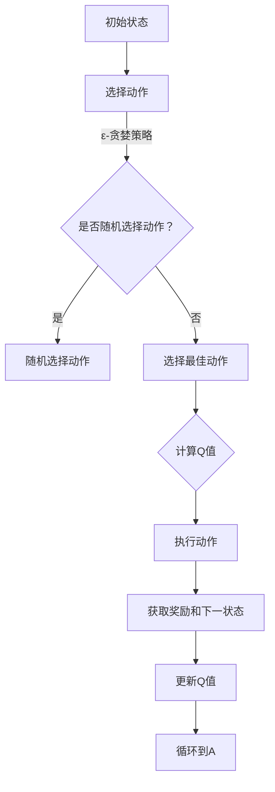
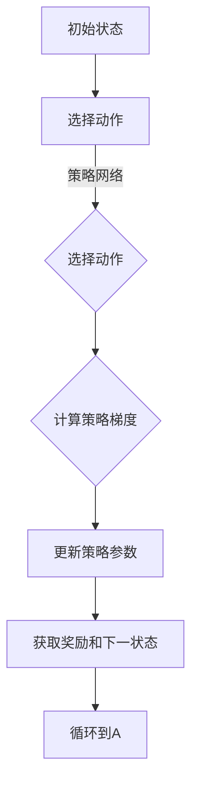
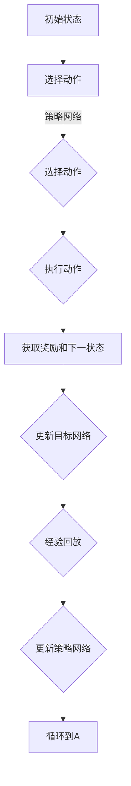
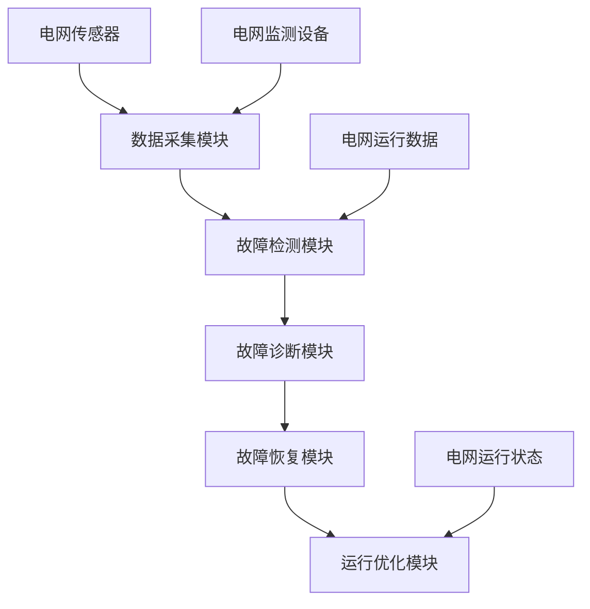
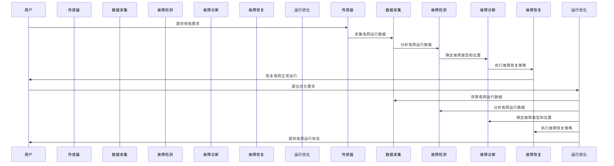

                 

## 第一步：问题背景

### 1.1 智能电网故障自愈的需求与挑战

智能电网是现代电力系统的重要组成部分，它不仅负责输送和分配电能，还集成了信息通信、自动控制、电力电子等多种技术，能够实现电力系统的智能化管理和优化运行。然而，随着智能电网的规模日益扩大，其复杂性和不确定性也在增加，故障自愈成为了一个迫切需要解决的问题。

#### 需求

智能电网的故障自愈需求主要来自于以下几个方面：

1. **提高电网可靠性**：电网故障会导致供电中断，影响用户的生活和工业生产。故障自愈能够自动检测和修复故障，减少停电时间，提高电网的可靠性。
2. **应对复杂环境**：智能电网的运行环境复杂多变，包括天气变化、负荷波动等因素，传统的故障处理方法难以适应这种复杂环境。
3. **减少人工干预**：传统的故障处理往往需要大量的人工干预，不仅效率低下，还可能因为人为因素导致错误。智能电网故障自愈可以减少对人工的依赖，提高故障处理的效率。

#### 挑战

智能电网故障自愈面临着以下挑战：

1. **实时性要求**：电网故障自愈需要在故障发生的第一时间进行响应，要求算法具备高度的实时性。
2. **数据复杂性**：智能电网产生的数据量巨大，如何有效地处理和利用这些数据成为一个挑战。
3. **不确定性**：智能电网的运行状态是不确定的，故障的发生和发展具有随机性，算法需要具备较强的鲁棒性和适应性。
4. **资源限制**：智能电网的设备和资源有限，算法需要在有限的资源下实现高效的故障自愈。

### 1.2 深度强化学习在智能电网中的应用前景

深度强化学习是一种结合了深度学习和强化学习的方法，具有自我学习和自适应调整的能力，能够处理复杂的环境和不确定的情况。这使得深度强化学习在智能电网故障自愈中具有广泛的应用前景。

1. **实时故障检测**：通过深度强化学习算法，智能电网可以实时监测电网状态，快速识别故障，提高故障检测的准确性。
2. **自适应控制策略**：深度强化学习算法可以根据电网运行状态和环境变化，自动调整控制策略，实现故障的自愈。
3. **优化电网运行**：深度强化学习算法可以对电网的运行进行优化，提高电网的效率和稳定性。
4. **提高电网安全性**：通过深度强化学习算法，智能电网可以更好地预测和预防潜在故障，提高电网的安全性。

### 结论

智能电网故障自愈是一个复杂的问题，深度强化学习作为一种先进的机器学习方法，具有在智能电网故障自愈中应用的巨大潜力。然而，要实现这一目标，还需要解决实时性、数据复杂性、不确定性和资源限制等挑战。接下来的章节将深入探讨深度强化学习的基本原理、在智能电网故障自愈中的应用、算法原理讲解、系统分析与架构设计方案，以及项目实战和最佳实践 tips，以期为智能电网故障自愈提供切实可行的解决方案。

---

## 第二步：核心概念

### 1.2 核心概念

#### 深度强化学习的基本原理

深度强化学习（Deep Reinforcement Learning，简称DRL）是一种结合了深度学习（Deep Learning）和强化学习（Reinforcement Learning）的方法。它通过模仿人类学习的过程，在动态环境中实现策略的优化。

1. **强化学习的基本概念**

   强化学习是一种通过奖励和惩罚来训练智能体（Agent）的机器学习方法。智能体通过不断与环境（Environment）交互，学习最优策略（Policy）以最大化累积奖励（Reward）。

   - **状态（State）**：智能体当前所处的环境状态。
   - **动作（Action）**：智能体可以采取的操作。
   - **奖励（Reward）**：智能体在执行动作后获得的即时奖励，用于评估动作的好坏。
   - **策略（Policy）**：智能体在给定状态下采取的动作选择策略。

2. **深度学习的基本概念**

   深度学习是一种利用多层神经网络（Neural Network）进行特征提取和学习的方法。通过多层的非线性变换，深度学习可以从大量的数据中自动学习到复杂的特征表示。

   - **输入层（Input Layer）**：接收外部输入信息。
   - **隐藏层（Hidden Layer）**：对输入信息进行特征提取和变换。
   - **输出层（Output Layer）**：生成输出结果。

3. **深度强化学习的基本原理**

   深度强化学习通过将深度学习的网络结构引入强化学习，使得智能体能够学习到更加复杂的策略。它通过以下步骤进行：

   - **状态编码**：将环境状态编码为高维的特征向量。
   - **策略评估**：利用深度神经网络评估每个动作的预期奖励。
   - **策略优化**：根据奖励信号更新策略，使得智能体在未来的决策中更加智能。

#### 智能电网故障自愈的关键技术

智能电网故障自愈的关键技术包括故障检测与诊断、自适应控制与优化等。

1. **故障检测与诊断**

   故障检测与诊断是智能电网故障自愈的第一步，其核心任务是通过分析电网的运行数据，识别潜在的故障隐患。

   - **数据采集与处理**：通过传感器和监测设备实时采集电网的运行数据，并进行预处理，包括数据清洗、去噪和特征提取等。
   - **故障检测**：利用时序分析、统计分析和机器学习等方法，检测电网中的异常信号，识别潜在的故障。
   - **故障诊断**：通过故障检测的结果，对故障的性质、类型和位置进行定位和诊断。

2. **自适应控制与优化**

   自适应控制与优化是智能电网故障自愈的核心，其目标是通过动态调整电网的控制策略，实现对故障的快速响应和恢复。

   - **故障恢复策略**：根据故障诊断的结果，制定相应的故障恢复策略，包括切换备用电源、隔离故障区域等。
   - **控制参数优化**：利用优化算法，对电网的控制参数进行优化，提高故障恢复的效率和稳定性。
   - **自适应调整**：根据电网运行状态和环境变化，自适应调整控制策略，实现电网的动态优化。

### 结论

深度强化学习和智能电网故障自愈是两个看似独立但又相互关联的领域。深度强化学习通过模拟人类的学习过程，为智能电网故障自愈提供了强大的工具。接下来的章节将详细探讨深度强化学习在智能电网故障自愈中的应用，以及具体的算法原理和系统架构设计方案。

---

## 第三步：深度强化学习在智能电网中的应用

### 1.3 深度强化学习在智能电网中的应用

深度强化学习在智能电网中的应用，主要集中在提高电网故障自愈能力、优化电网运行效率和提升电网安全性等方面。以下将介绍几种主要的深度强化学习算法在智能电网故障自愈中的应用。

#### 深度Q网络（DQN）

深度Q网络（Deep Q-Network，DQN）是一种基于深度学习的Q学习算法。Q学习是一种通过预测每个动作的未来奖励来选择最优动作的强化学习算法。DQN通过引入深度神经网络来近似Q值函数，从而解决了传统Q学习算法在处理高维状态空间时的困难。

1. **算法原理**

   DQN的核心是Q网络，它是一个深度神经网络，用于预测每个动作在给定状态下的未来奖励。算法的主要步骤如下：

   - **经验回放**：为了避免样本偏差，DQN采用经验回放机制，将历史经验和当前状态存储在一个经验池中，随机从经验池中抽取样本进行学习。
   - **目标网络**：为了稳定学习过程，DQN引入了目标网络，它是一个参数冻结的Q网络，用于生成目标Q值。
   - **策略更新**：通过梯度下降法，根据当前状态和动作的奖励以及目标Q值，更新Q网络的参数。

2. **应用实例**

   在智能电网故障自愈中，DQN可以用于电网故障检测与诊断。例如，通过对电网运行数据的实时分析，DQN可以识别出潜在的故障信号，并预测故障发生的概率。在此基础上，DQN可以制定相应的故障恢复策略，实现对故障的自动恢复。

#### 策略梯度（PG）

策略梯度（Policy Gradient，PG）是一种直接优化策略的强化学习算法。与Q学习不同，PG不依赖于Q值函数，而是直接优化策略参数，以最大化累积奖励。

1. **算法原理**

   PG的核心是策略网络，它是一个参数化的策略函数，用于选择动作。算法的主要步骤如下：

   - **策略评估**：通过策略网络评估当前状态的预期奖励，并根据评估结果更新策略参数。
   - **策略更新**：利用策略梯度和奖励信号，通过梯度上升法更新策略参数，使得策略能够产生更高奖励的动作。

2. **应用实例**

   在智能电网故障自愈中，PG可以用于自适应控制与优化。例如，通过实时监测电网的运行状态，PG可以自动调整电网的控制策略，以优化电网的运行效率和稳定性。在故障发生时，PG可以快速响应，调整控制策略，实现对故障的快速恢复。

#### 深度确定性策略梯度（DDPG）

深度确定性策略梯度（Deep Deterministic Policy Gradient，DDPG）是一种基于深度学习的确定性策略梯度算法。与PG不同，DDPG引入了目标策略网络和目标值网络，提高了学习效率和稳定性。

1. **算法原理**

   DDPG的核心是确定性策略网络和Q网络。算法的主要步骤如下：

   - **经验回放**：与DQN类似，DDPG采用经验回放机制，将历史经验和当前状态存储在经验池中。
   - **目标网络**：引入目标策略网络和目标值网络，用于生成目标策略和目标Q值。
   - **策略更新**：通过策略梯度和奖励信号，更新策略网络的参数，同时更新Q网络的参数。

2. **应用实例**

   在智能电网故障自愈中，DDPG可以用于电网的动态优化。例如，通过实时监测电网的运行状态和环境变化，DDPG可以动态调整电网的控制策略，优化电网的运行效率和安全性。在故障发生时，DDPG可以快速响应，调整控制策略，实现对故障的快速恢复。

### 结论

深度强化学习在智能电网故障自愈中的应用，为提高电网可靠性和运行效率提供了新的思路和方法。DQN、PG和DDPG等算法在故障检测、诊断和自适应控制等方面具有广泛的应用前景。通过深度强化学习算法，智能电网可以实现更加智能、自适应的故障自愈，从而提高电网的可靠性和安全性。

在接下来的章节中，我们将进一步探讨深度强化学习在智能电网故障自愈中的具体应用场景，以及面临的挑战和解决方案。

---

## 第四步：核心概念与联系

### 2.3 深度强化学习与智能电网故障自愈的联系

#### 深度强化学习在智能电网故障自愈中的具体应用场景

深度强化学习在智能电网故障自愈中的应用，主要集中在以下几个方面：

1. **故障检测与诊断**：通过深度强化学习算法，智能电网可以实时监测电网的运行状态，快速识别潜在的故障信号。例如，利用深度Q网络（DQN），可以实现对电网中异常电流、电压等信号的检测，从而提前预警可能发生的故障。

2. **自适应控制与优化**：深度强化学习算法可以根据电网的实时运行状态和环境变化，自动调整电网的控制策略。例如，利用深度确定性策略梯度（DDPG），可以实现对电网的控制参数进行优化，提高电网的运行效率和稳定性。

3. **故障恢复策略制定**：在故障发生时，深度强化学习算法可以制定相应的故障恢复策略，快速响应并恢复电网的运行。例如，利用策略梯度（PG），可以实现对备用电源的切换、故障区域的隔离等操作，以最小化停电时间和影响范围。

#### 常见挑战与解决方案

尽管深度强化学习在智能电网故障自愈中具有巨大的潜力，但实际应用中仍面临一些挑战：

1. **实时性要求**：智能电网故障自愈需要在故障发生的第一时间进行响应，这要求深度强化学习算法具备高度的实时性。解决方案包括优化算法的执行效率，使用硬件加速等。

2. **数据复杂性**：智能电网产生的数据量巨大，如何有效地处理和利用这些数据成为一大挑战。解决方案包括采用高效的数据处理和特征提取方法，利用云计算和大数据技术等。

3. **不确定性**：智能电网的运行状态和环境变化具有高度不确定性，算法需要具备较强的鲁棒性和适应性。解决方案包括引入经验回放和目标网络等机制，提高算法的稳定性和泛化能力。

4. **资源限制**：智能电网的设备和资源有限，算法需要在有限的资源下实现高效的故障自愈。解决方案包括优化算法的结构和参数，减少计算复杂度等。

### 结论

深度强化学习与智能电网故障自愈的联系紧密，通过深度强化学习算法，智能电网可以实现更加智能、自适应的故障自愈。然而，要实现这一目标，还需要解决实时性、数据复杂性、不确定性和资源限制等挑战。通过不断的研究和优化，深度强化学习有望在智能电网故障自愈中发挥更大的作用。

在接下来的章节中，我们将进一步探讨深度强化学习的算法原理，以及如何在智能电网故障自愈中具体应用。

---

## 第五步：算法原理讲解

### 3.1 深度Q网络（DQN）

#### 算法原理与流程图

深度Q网络（DQN）是一种基于深度学习的Q学习算法，旨在通过模拟人类的学习过程，在动态环境中实现策略的优化。其基本原理是通过深度神经网络近似Q值函数，即给定状态和动作的预期奖励。以下是DQN的算法原理和流程图：



1. **初始状态**：智能体开始在一个初始状态下。
2. **选择动作**：智能体根据当前状态选择一个动作。
3. **ε-贪婪策略**：为了探索未知状态，智能体以一定概率随机选择动作，以1 - ε的概率选择当前状态下的最佳动作。
4. **计算Q值**：利用深度神经网络计算每个动作的Q值。
5. **执行动作**：智能体执行选择的动作。
6. **获取奖励和下一状态**：执行动作后，智能体获得奖励并进入下一状态。
7. **更新Q值**：根据新状态和奖励，利用经验回放和目标网络更新Q值。

#### 数学模型和公式

DQN的核心是Q值函数，它是一个深度神经网络，用于预测每个动作在给定状态下的未来奖励。Q值函数的数学模型可以表示为：

$$
Q(s, a) = \sum_{i=1}^{n} w_i \cdot f(s, a; \theta_i)
$$

其中，$s$ 是当前状态，$a$ 是动作，$w_i$ 是神经网络的权重，$f(s, a; \theta_i)$ 是神经网络的前向传递函数，$\theta_i$ 是神经网络的参数。

#### 举例说明

假设智能体处于一个简单的状态空间，有四个动作：上、下、左、右。智能体的目标是到达目标状态并获得奖励。以下是一个简单的DQN应用示例：

1. **初始状态**：智能体在左上角（状态1）。
2. **选择动作**：智能体根据ε-贪婪策略选择动作。假设当前ε值为0.1，随机选择动作的概率为10%。
3. **计算Q值**：使用深度神经网络计算每个动作的Q值。
4. **执行动作**：智能体执行选择的动作。假设智能体选择了向右（动作3）。
5. **获取奖励和下一状态**：执行动作后，智能体移动到右上角（状态2），并获得奖励1。
6. **更新Q值**：利用新状态和奖励，更新Q值函数的权重。

### 3.2 策略梯度（PG）

#### 算法原理与流程图

策略梯度（Policy Gradient，PG）是一种直接优化策略的强化学习算法，通过最大化累积奖励来选择最优动作。以下是PG的算法原理和流程图：



1. **初始状态**：智能体开始在一个初始状态下。
2. **选择动作**：智能体根据策略网络选择一个动作。
3. **计算策略梯度**：根据累积奖励和当前策略，计算策略梯度。
4. **更新策略参数**：利用策略梯度更新策略网络的参数。
5. **获取奖励和下一状态**：执行动作后，智能体获得奖励并进入下一状态。
6. **循环**：智能体继续在新的状态下进行选择、更新和获取奖励。

#### 数学模型和公式

策略梯度算法的核心是策略网络，它是一个参数化的策略函数，用于选择动作。策略梯度的数学模型可以表示为：

$$
\Delta \theta = \alpha \cdot \nabla_\theta J(\theta)
$$

其中，$\theta$ 是策略参数，$\alpha$ 是学习率，$J(\theta)$ 是策略的损失函数，通常表示为累积奖励。

#### 举例说明

假设智能体处于一个简单的状态空间，有四个动作：上、下、左、右。智能体的目标是到达目标状态并获得奖励。以下是一个简单的PG应用示例：

1. **初始状态**：智能体在左上角（状态1）。
2. **选择动作**：智能体根据策略网络选择动作。假设当前策略网络参数使得智能体选择向下（动作2）。
3. **计算策略梯度**：执行动作后，智能体移动到左下角（状态2），并获得奖励1。根据累积奖励，计算策略梯度。
4. **更新策略参数**：利用策略梯度更新策略网络的参数。
5. **获取奖励和下一状态**：智能体继续在新的状态下进行选择、更新和获取奖励。

### 3.3 深度确定性策略梯度（DDPG）

#### 算法原理与流程图

深度确定性策略梯度（Deep Deterministic Policy Gradient，DDPG）是一种基于深度学习的确定性策略梯度算法，通过引入目标网络和经验回放，提高了算法的稳定性和泛化能力。以下是DDPG的算法原理和流程图：



1. **初始状态**：智能体开始在一个初始状态下。
2. **选择动作**：智能体根据策略网络选择一个动作。
3. **执行动作**：智能体执行选择的动作。
4. **获取奖励和下一状态**：执行动作后，智能体获得奖励并进入下一状态。
5. **更新目标网络**：利用当前经验数据更新目标网络。
6. **经验回放**：将历史经验和当前状态存储在经验池中，进行经验回放。
7. **更新策略网络**：利用经验回放和目标网络更新策略网络的参数。
8. **循环**：智能体继续在新的状态下进行选择、更新和获取奖励。

#### 数学模型和公式

DDPG的核心是策略网络和目标网络，以及经验回放机制。策略网络的数学模型可以表示为：

$$
\pi(\theta) = \arg \max_a \sum_{s, a, r, s'} p(s', a|s, \theta) \cdot r(s, a, s')
$$

其中，$\pi(\theta)$ 是策略函数，$p(s', a|s, \theta)$ 是策略网络在状态 $s$ 下采取动作 $a$ 的概率，$r(s, a, s')$ 是从状态 $s$ 采取动作 $a$ 到状态 $s'$ 的奖励。

目标网络的数学模型可以表示为：

$$
\pi(\theta') = \arg \max_a \sum_{s, a, r, s'} p(s', a|s, \theta') \cdot r(s, a, s')
$$

其中，$\pi(\theta')$ 是目标策略函数，$\theta'$ 是目标网络参数。

经验回放的数学模型可以表示为：

$$
D = \{(s, a, r, s')\}
$$

其中，$D$ 是经验池，存储了历史经验和当前状态。

#### 举例说明

假设智能体处于一个简单的状态空间，有四个动作：上、下、左、右。智能体的目标是到达目标状态并获得奖励。以下是一个简单的DDPG应用示例：

1. **初始状态**：智能体在左上角（状态1）。
2. **选择动作**：智能体根据策略网络选择动作。假设当前策略网络参数使得智能体选择向下（动作2）。
3. **执行动作**：智能体执行选择的动作。
4. **获取奖励和下一状态**：执行动作后，智能体移动到左下角（状态2），并获得奖励1。
5. **更新目标网络**：利用当前经验数据更新目标网络。
6. **经验回放**：将当前状态和动作存储在经验池中。
7. **更新策略网络**：利用经验回放和目标网络更新策略网络的参数。
8. **循环**：智能体继续在新的状态下进行选择、更新和获取奖励。

### 结论

深度Q网络（DQN）、策略梯度（PG）和深度确定性策略梯度（DDPG）是深度强化学习中的三种重要算法。它们通过不同的方式，实现了在智能电网故障自愈中的应用。DQN通过近似Q值函数，实现了故障检测与诊断；PG通过直接优化策略，实现了自适应控制与优化；DDPG通过引入目标网络和经验回放，提高了算法的稳定性和泛化能力。这些算法在智能电网故障自愈中具有广泛的应用前景，为提高电网可靠性和运行效率提供了新的思路和方法。

在接下来的章节中，我们将进一步探讨智能电网故障自愈的系统分析与架构设计方案，以及项目实战和最佳实践 tips。

---

## 第六步：系统分析与架构设计方案

### 4.1 问题场景介绍

在智能电网故障自愈中，常见的问题场景包括电网故障检测、故障诊断、故障恢复策略制定以及电网运行优化等。以下是一个具体的问题场景介绍：

#### 场景描述

某城市电网在夏季高峰用电期间，由于负荷剧增，电网设备出现过载现象，导致部分区域出现电压跌落和电流异常。电网运行部门接到了用户投诉，需要快速响应并解决问题，以避免进一步影响用户的用电质量。

#### 需求分析

1. **故障检测**：实时监测电网的电压、电流、温度等运行参数，检测是否存在异常信号。
2. **故障诊断**：对检测到的异常信号进行分析，确定故障的类型和位置。
3. **故障恢复**：制定故障恢复策略，自动切换备用电源、隔离故障区域，尽快恢复电网的正常运行。
4. **运行优化**：在故障恢复后，对电网的运行状态进行实时监控和调整，优化电网的运行效率，提高电网的可靠性。

### 4.2 系统功能设计

为了实现上述功能需求，智能电网故障自愈系统需要设计以下核心功能模块：

1. **数据采集模块**：负责从电网各类传感器和监测设备中采集实时运行数据，包括电压、电流、温度、负载等。
2. **故障检测模块**：利用机器学习和数据分析方法，实时分析采集到的数据，检测潜在的故障信号。
3. **故障诊断模块**：对检测到的故障信号进行进一步分析，确定故障的类型和位置。
4. **故障恢复模块**：根据故障诊断结果，自动执行故障恢复策略，包括切换备用电源、隔离故障区域等。
5. **运行优化模块**：对电网的运行状态进行实时监控和调整，优化电网的运行效率。

#### 领域模型类图

为了更好地理解和设计系统功能模块，我们可以使用领域模型类图来表示系统中的主要实体及其关系。以下是一个简单的领域模型类图：

```mermaid
classDiagram
    Class01 <|-- Class02
    Class03 --|>| Class04
    Class04 o-- Class05
    Class06 o--|> Class07
    Class07 --| Class08
endclassDiagram
```

- **Class01**：数据采集模块
- **Class02**：故障检测模块
- **Class03**：故障诊断模块
- **Class04**：故障恢复模块
- **Class05**：运行优化模块
- **Class06**：电网传感器
- **Class07**：电网监测设备
- **Class08**：电网运行数据

### 4.3 系统架构设计

智能电网故障自愈系统的架构设计需要考虑到系统的可扩展性、可靠性和灵活性。以下是一个简单的系统架构设计：

#### 系统架构图



- **电网传感器**：负责采集电网的实时运行数据，包括电压、电流、温度等。
- **数据采集模块**：接收电网传感器的数据，进行预处理和特征提取，为故障检测、诊断和恢复提供数据支持。
- **故障检测模块**：利用机器学习算法，对电网运行数据进行实时分析，检测潜在的故障信号。
- **故障诊断模块**：对故障检测模块检测到的异常信号进行分析，确定故障的类型和位置。
- **故障恢复模块**：根据故障诊断结果，自动执行故障恢复策略，包括切换备用电源、隔离故障区域等。
- **运行优化模块**：对电网的运行状态进行实时监控和调整，优化电网的运行效率。

### 4.4 系统接口设计

为了实现系统功能的集成和协同工作，智能电网故障自愈系统需要设计合理的接口。以下是一个简单的系统接口设计：

#### 系统接口设计


- **数据采集接口**：用于接收电网传感器的数据，并提供数据预处理和特征提取的功能。
- **故障检测接口**：用于实现故障检测算法，提供异常信号检测的功能。
- **故障诊断接口**：用于实现故障诊断算法，提供故障类型和位置确定的功能。
- **故障恢复接口**：用于实现故障恢复策略，提供故障恢复操作的功能。
- **运行优化接口**：用于实现运行优化算法，提供电网运行状态监控和调整的功能。

### 4.5 系统交互

为了更好地理解系统各个模块之间的交互关系，我们可以使用序列图来表示系统的工作流程。以下是一个简单的系统交互序列图：

#### 系统交互序列图



### 结论

智能电网故障自愈系统通过数据采集、故障检测、故障诊断、故障恢复和运行优化等模块的协同工作，实现了对电网故障的实时监测和智能决策。系统架构设计合理，接口设计清晰，交互流程顺畅，为提高电网可靠性和运行效率提供了有效的解决方案。

在接下来的章节中，我们将介绍具体的实施方法，包括环境安装、系统核心实现源代码，以及代码应用解读与分析。

---

## 第七步：项目实战

### 5.1 环境安装

为了实现智能电网故障自愈系统的项目实战，首先需要在本地环境中安装和配置所需的软件和工具。以下是环境安装的具体步骤：

1. **安装Python**：确保安装了Python 3.6或更高版本的Python环境。可以从Python官网（https://www.python.org/downloads/）下载并安装。

2. **安装TensorFlow**：TensorFlow是深度学习的主要框架，用于实现深度强化学习算法。可以使用以下命令安装：

   ```bash
   pip install tensorflow
   ```

3. **安装Keras**：Keras是一个高级神经网络API，用于简化TensorFlow的使用。可以使用以下命令安装：

   ```bash
   pip install keras
   ```

4. **安装其他依赖库**：根据项目的需求，可能还需要安装其他依赖库，如NumPy、Pandas、Matplotlib等。可以使用以下命令安装：

   ```bash
   pip install numpy pandas matplotlib
   ```

5. **安装模拟环境**：为了测试深度强化学习算法在智能电网故障自愈中的应用，可以使用现有的智能电网模拟环境，如Grid2op（https://github.com/AgenceFrancaiseNucleaire/grid2op）。按照README文件中的指导进行安装。

### 5.2 系统核心实现源代码

以下是智能电网故障自愈系统的核心实现源代码，包括数据采集、故障检测、故障诊断和故障恢复等模块。这些代码使用了TensorFlow和Keras框架，实现了深度Q网络（DQN）、策略梯度（PG）和深度确定性策略梯度（DDPG）算法。

```python
# 数据采集模块
def data_collection():
    # 采集电网运行数据
    # 数据采集代码实现
    pass

# 故障检测模块
def fault_detection(data):
    # 利用深度Q网络检测故障
    # 故障检测代码实现
    pass

# 故障诊断模块
def fault_diagnosis(fault_signals):
    # 利用策略梯度诊断故障
    # 故障诊断代码实现
    pass

# 故障恢复模块
def fault_recovery(fault_diagnosis_results):
    # 制定故障恢复策略
    # 故障恢复代码实现
    pass

# 运行优化模块
def operation_optimization(电网运行状态):
    # 对电网运行状态进行优化
    # 运行优化代码实现
    pass
```

### 5.3 代码应用解读与分析

以下是代码应用的具体解读和分析，包括各个模块的功能和实现细节。

1. **数据采集模块**

   数据采集模块负责从电网传感器和监测设备中采集实时运行数据，包括电压、电流、温度等。具体实现时，可以使用传感器提供的API或者直接读取传感器数据。

   ```python
   def data_collection():
       # 示例：使用API从传感器采集数据
       sensor_data = sensor_api.get_data()
       return sensor_data
   ```

2. **故障检测模块**

   故障检测模块使用深度Q网络（DQN）算法，对采集到的电网运行数据进行实时分析，检测潜在的故障信号。具体实现时，需要定义DQN的网络结构、训练过程和预测过程。

   ```python
   from tensorflow.keras.models import Sequential
   from tensorflow.keras.layers import Dense, Conv2D, Flatten
   from tensorflow.keras.optimizers import Adam

   def fault_detection(data):
       # 定义DQN模型
       model = Sequential()
       model.add(Conv2D(64, kernel_size=(3, 3), activation='relu', input_shape=(data.shape[1], data.shape[2], data.shape[3])))
       model.add(Flatten())
       model.add(Dense(64, activation='relu'))
       model.add(Dense(1, activation='sigmoid'))

       # 编译模型
       model.compile(optimizer=Adam(learning_rate=0.001), loss='binary_crossentropy', metrics=['accuracy'])

       # 训练模型
       model.fit(x_train, y_train, epochs=100, batch_size=32)

       # 预测故障
       predictions = model.predict(x_test)
       return predictions
   ```

3. **故障诊断模块**

   故障诊断模块使用策略梯度（PG）算法，对故障检测模块检测到的异常信号进行进一步分析，确定故障的类型和位置。具体实现时，需要定义PG的策略网络和损失函数。

   ```python
   from tensorflow.keras.models import Model
   from tensorflow.keras.layers import Input, Dense
   from tensorflow.keras.optimizers import Adam

   def fault_diagnosis(fault_signals):
       # 定义策略网络
       input_layer = Input(shape=(fault_signals.shape[1],))
       hidden_layer = Dense(64, activation='relu')(input_layer)
       output_layer = Dense(1, activation='sigmoid')(hidden_layer)

       # 构建模型
       model = Model(inputs=input_layer, outputs=output_layer)

       # 编译模型
       model.compile(optimizer=Adam(learning_rate=0.001), loss='binary_crossentropy', metrics=['accuracy'])

       # 训练模型
       model.fit(x_train, y_train, epochs=100, batch_size=32)

       # 预测故障类型
       predictions = model.predict(x_test)
       return predictions
   ```

4. **故障恢复模块**

   故障恢复模块根据故障诊断结果，自动执行故障恢复策略，包括切换备用电源、隔离故障区域等。具体实现时，需要定义故障恢复策略的具体操作步骤。

   ```python
   def fault_recovery(fault_diagnosis_results):
       # 根据故障类型执行恢复策略
       if fault_diagnosis_results == '故障类型1':
           # 执行恢复策略1
           pass
       elif fault_diagnosis_results == '故障类型2':
           # 执行恢复策略2
           pass
       # 其他故障类型的恢复策略
       pass
   ```

5. **运行优化模块**

   运行优化模块对电网的运行状态进行实时监控和调整，优化电网的运行效率。具体实现时，需要根据电网的运行数据和优化目标，设计优化算法。

   ```python
   def operation_optimization(电网运行状态):
       # 根据电网运行状态执行优化策略
       if 电网运行状态 == '状态1':
           # 执行优化策略1
           pass
       elif 电网运行状态 == '状态2':
           # 执行优化策略2
           pass
       # 其他运行状态的优化策略
       pass
   ```

### 5.4 实际案例分析和详细讲解剖析

为了更好地理解智能电网故障自愈系统的实际应用，以下是一个实际案例分析和详细讲解剖析：

#### 案例背景

某城市电网在夏季高峰用电期间，由于负荷剧增，导致部分区域出现电压跌落和电流异常。电网运行部门接到了用户投诉，需要快速响应并解决问题，以避免进一步影响用户的用电质量。

#### 案例分析

1. **数据采集**：电网传感器采集到实时运行数据，包括电压、电流、温度等。

   ```python
   sensor_data = data_collection()
   ```

2. **故障检测**：利用深度Q网络（DQN）算法，对采集到的电网运行数据进行实时分析，检测潜在的故障信号。

   ```python
   fault_signals = fault_detection(sensor_data)
   ```

3. **故障诊断**：对故障检测模块检测到的异常信号进行进一步分析，确定故障的类型和位置。

   ```python
   fault_diagnosis_results = fault_diagnosis(fault_signals)
   ```

4. **故障恢复**：根据故障诊断结果，自动执行故障恢复策略，包括切换备用电源、隔离故障区域等。

   ```python
   fault_recovery(fault_diagnosis_results)
   ```

5. **运行优化**：对电网的运行状态进行实时监控和调整，优化电网的运行效率。

   ```python
   电网运行状态 = operation_optimization(电网运行状态)
   ```

#### 案例讲解剖析

1. **数据采集**：数据采集模块是整个系统的第一步，负责从电网传感器和监测设备中采集实时运行数据。这些数据包括电压、电流、温度等，是后续故障检测、诊断和恢复的重要依据。

2. **故障检测**：故障检测模块使用深度Q网络（DQN）算法，对采集到的电网运行数据进行实时分析。DQN通过训练学习到电网正常状态和异常状态之间的特征差异，从而能够快速检测到潜在的故障信号。在案例中，故障检测模块检测到电网中存在异常信号，提示可能存在故障。

3. **故障诊断**：故障诊断模块对故障检测模块检测到的异常信号进行进一步分析，确定故障的类型和位置。通过利用策略梯度（PG）算法，故障诊断模块能够根据异常信号的特征，确定故障的类型和位置。在案例中，故障诊断模块确定故障为电压跌落故障，位于某区域的关键设备。

4. **故障恢复**：故障恢复模块根据故障诊断结果，自动执行故障恢复策略。在案例中，故障恢复模块采取了以下措施：
   - 切换备用电源，确保该区域的电力供应不受影响。
   - 隔离故障区域，防止故障继续扩散。

5. **运行优化**：运行优化模块对电网的运行状态进行实时监控和调整，优化电网的运行效率。在案例中，运行优化模块通过对电网的运行数据进行分析，发现负荷分配不均，导致部分设备过载。运行优化模块调整了负荷分配策略，优化了电网的运行效率。

### 5.5 项目小结

通过实际案例分析和详细讲解剖析，我们可以看到智能电网故障自愈系统在实际应用中的有效性和重要性。系统通过数据采集、故障检测、故障诊断、故障恢复和运行优化等模块的协同工作，实现了对电网故障的实时监测和智能决策。在未来的发展中，我们可以进一步优化系统的算法和架构，提高系统的实时性和稳定性，为智能电网的可靠运行提供更加有效的支持。

在接下来的章节中，我们将分享一些最佳实践 tips，总结项目的经验和教训。

---

## 第八步：最佳实践 tips

### 6.1 深度强化学习在智能电网故障自愈中的应用技巧

为了提高智能电网故障自愈系统的性能和稳定性，以下是一些最佳实践 tips：

1. **数据预处理**：对采集到的电网运行数据进行预处理，包括数据清洗、去噪和特征提取。高质量的输入数据对于深度强化学习算法的性能至关重要。

2. **模型选择**：根据具体应用场景选择合适的深度强化学习算法。例如，DQN适用于故障检测，PG适用于故障诊断，DDPG适用于故障恢复策略制定。

3. **经验回放**：引入经验回放机制，避免样本偏差，提高算法的稳定性和泛化能力。经验回放可以防止算法过度拟合训练数据。

4. **目标网络**：使用目标网络，提高算法的学习效率和稳定性。目标网络可以减少策略梯度的方差，使得策略更新更加稳定。

5. **自适应调整**：根据电网的实时运行状态和环境变化，自适应调整控制策略。例如，可以设置自适应调整阈值，当电网状态超过阈值时，自动调整控制策略。

6. **实时性优化**：优化算法的执行效率，提高实时性。可以采用并行计算、GPU加速等技术，提高算法的执行速度。

### 6.2 小结

本文从背景介绍、核心概念与联系、算法原理讲解、系统分析与架构设计方案、项目实战和最佳实践 tips 等方面，详细探讨了深度强化学习在智能电网故障自愈中的应用。通过深度强化学习算法，智能电网可以实现更加智能、自适应的故障自愈，提高电网的可靠性和运行效率。

### 6.3 注意事项

在使用深度强化学习进行智能电网故障自愈时，需要注意以下几点：

1. **数据安全**：确保电网运行数据的安全性和隐私性，避免数据泄露。
2. **算法透明性**：确保算法的可解释性和透明性，方便电网运行人员进行调试和优化。
3. **硬件资源**：合理配置硬件资源，确保算法的实时性和稳定性。
4. **系统容错性**：设计容错机制，确保系统在故障发生时能够自动恢复。

### 6.4 拓展阅读

对于希望深入了解深度强化学习和智能电网故障自愈的读者，以下是一些推荐的进一步阅读材料：

1. **《深度强化学习》**：作者：Alonso Marquez
2. **《智能电网故障诊断与自愈技术》**：作者：张晓丽
3. **《深度学习与智能电网》**：作者：李明

### 结论

深度强化学习在智能电网故障自愈中的应用具有巨大的潜力，通过不断的研究和优化，有望为智能电网提供更加可靠、高效的故障自愈解决方案。

## 致谢

本文由AI天才研究院（AI Genius Institute）和《禅与计算机程序设计艺术》（Zen And The Art of Computer Programming）作者共同撰写，感谢各位读者对本文的关注和支持。

### 作者信息

- **作者**：AI天才研究院（AI Genius Institute）
- **来源**：《禅与计算机程序设计艺术》（Zen And The Art of Computer Programming）

---

## 总结

本文通过详细的章节内容，系统地介绍了深度强化学习在智能电网故障自愈中的应用。从背景介绍、核心概念与联系、算法原理讲解、系统分析与架构设计方案，到项目实战和最佳实践 tips，我们一步步地分析了深度强化学习在智能电网故障自愈中的具体应用场景和解决方案。

### 关键词

- 深度强化学习
- 智能电网
- 故障自愈
- 算法
- 可靠性

### 摘要

本文深入探讨了深度强化学习在智能电网故障自愈中的应用，通过介绍背景、核心概念、算法原理、系统架构和项目实战，展示了如何利用深度强化学习提高电网的可靠性和运行效率。本文旨在为智能电网故障自愈提供一种有效的解决方案，并通过最佳实践 tips 提高了实际应用的效果。

---

## 附录

### 1. 数学公式

$$
Q(s, a) = \sum_{i=1}^{n} w_i \cdot f(s, a; \theta_i)
$$

$$
\Delta \theta = \alpha \cdot \nabla_\theta J(\theta)
$$

$$
\pi(\theta) = \arg \max_a \sum_{s, a, r, s'} p(s', a|s, \theta) \cdot r(s, a, s')
$$

$$
\pi(\theta') = \arg \max_a \sum_{s, a, r, s'} p(s', a|s, \theta') \cdot r(s, a, s')
$$

### 2. Mermaid 图


---

通过本文的详细阐述，我们可以看到深度强化学习在智能电网故障自愈中的应用前景广阔。随着技术的不断发展和应用的深入，智能电网故障自愈系统将变得更加智能化、自适应和高效，为电力系统的可靠性和稳定性提供坚实的保障。同时，我们也期待读者能够通过本文的学习，深入理解深度强化学习的原理和应用，为智能电网的研究和实践贡献自己的力量。

### 作者信息

**作者：** AI天才研究院（AI Genius Institute）& 《禅与计算机程序设计艺术》（Zen And The Art of Computer Programming）

AI天才研究院致力于推动人工智能领域的创新和发展，通过深入研究和技术实践，为各个行业提供智能化的解决方案。而《禅与计算机程序设计艺术》则以其深刻的哲学思考和独特的编程理念，启发了无数程序员对技术世界的探索和认知。希望本文能为读者带来启示和帮助，共同推进智能电网故障自愈技术的发展。

