                 


## 第1章: 引言

### 1.1 问题背景

#### 供需关系的动态性

随着全球能源需求的不断增长，智能电网的建设成为应对这一挑战的关键。智能电网与传统电网不同，其最大的特点在于能够实现供需的实时平衡。供需关系是电力系统中的核心问题，它决定了电力系统的稳定运行和效率。

- **能源需求的增长与挑战**：随着经济的发展和人口的增加，全球对电力的需求不断上升。然而，化石能源的有限性和环境污染问题使得寻找可持续的能源解决方案成为当务之急。
- **智能电网的重要性**：智能电网通过先进的通信技术、传感器网络和自动化控制系统，实现了对电力供需的实时监测和动态调整。这不仅提高了电力系统的可靠性，还降低了能源浪费，促进了可再生能源的广泛应用。
- **强化学习在电力系统中的应用前景**：强化学习作为一种先进的机器学习技术，具有自适应性强、学习能力高等特点，在电力系统的调度和管理中具有广泛的应用前景。通过强化学习，可以优化电力资源的分配，提高系统的效率和可靠性。

### 1.2 问题描述

#### 调度的复杂性和多目标性

智能电网的调度涉及到多个因素，包括电力负荷、发电量、储能设施、电网稳定性等。这使得智能电网调度具有复杂性和多目标性。

- **调度的复杂性**：电力系统中的供需关系是动态变化的，受到天气、季节、节假日等多种因素的影响。同时，电力系统中的设备状态、电力市场价格等也不断变化，这给调度带来了巨大的复杂性。
- **调度的多目标性**：智能电网调度不仅要保证电力系统的稳定性，还要考虑能源的效率和经济效益。例如，在可再生能源发电时，需要平衡可再生能源的波动性与电力需求的稳定性。

### 1.3 问题解决

#### 强化学习的基本原理

强化学习（Reinforcement Learning, RL）是一种通过试错和反馈来学习行为策略的机器学习方法。在智能电网调度中，强化学习可以用来优化电力资源的分配。

- **强化学习的基本概念**：强化学习主要包括四个核心组成部分：环境（Environment）、代理人（Agent）、行动（Action）和奖励（Reward）。
- **强化学习的基本算法**：常见的强化学习算法包括Q-Learning、SARSA和Deep Q-Networks (DQN)等。其中，Q-Learning通过评估每个动作的预期奖励来选择最优动作；SARSA结合了Q-Learning和策略迭代的方法；DQN则引入了深度神经网络来处理高维状态空间。
- **强化学习在智能电网调度中的潜在优势**：强化学习能够通过不断尝试和反馈来优化电力资源的分配，从而提高电力系统的效率和可靠性。同时，强化学习具有自适应性强、学习能力高等特点，能够适应不断变化的电力供需关系。

### 1.4 边界与外延

#### 强化学习在电力系统中的适用范围

尽管强化学习在电力系统中具有广泛的应用前景，但并非所有情况下都适用。

- **适用范围**：强化学习适用于需要实时调整和优化的问题，如电力市场调度、储能系统优化等。对于一些静态问题，如电力网络的拓扑优化，可能需要采用其他优化方法。
- **算法的选择与优化**：根据具体问题的特点，选择合适的强化学习算法，并通过算法优化来提高性能。例如，对于具有大量状态和动作空间的问题，可以使用深度强化学习算法。

## 第2章: 强化学习基础

### 2.1 强化学习的基本概念

#### 定义

强化学习是一种通过试错和反馈来学习行为策略的机器学习方法。它主要包括以下四个组成部分：

- **环境（Environment）**：环境是指代理人所处的情境，它决定了代理人的状态和可能的动作。
- **代理人（Agent）**：代理人是指执行特定动作的实体，它通过观察环境状态、选择动作并接收奖励来学习。
- **动作（Action）**：动作是代理人在环境中执行的操作，它决定了代理人在环境中的下一步状态。
- **奖励（Reward）**：奖励是代理人在执行动作后从环境中获得的即时反馈，它用于评估代理人的行为效果。

#### 主要组成部分

强化学习的基本组成部分包括：

- **状态（State）**：状态是代理人在环境中所处的特定情境。
- **动作空间（Action Space）**：动作空间是代理人在每个状态下可以执行的所有可能动作。
- **状态-动作价值函数（State-Action Value Function）**：状态-动作价值函数表示在特定状态下执行特定动作的预期奖励。
- **策略（Policy）**：策略是代理人根据状态选择动作的规则。

### 2.2 强化学习的基本算法

#### Q-Learning

Q-Learning是一种基于值函数的强化学习算法，它通过评估每个动作的预期奖励来选择最优动作。

- **算法原理**：Q-Learning通过更新状态-动作价值函数来逐步优化代理人的行为。具体步骤如下：
  1. 初始化状态-动作价值函数。
  2. 选择一个动作。
  3. 执行动作并观察奖励。
  4. 更新状态-动作价值函数。
  5. 重复步骤2-4，直到达到目标或满足停止条件。

#### SARSA

SARSA是一种基于策略迭代的强化学习算法，它结合了Q-Learning和策略迭代的方法。

- **算法原理**：SARSA通过同时考虑当前状态和下一个状态来选择动作，并更新策略。具体步骤如下：
  1. 初始化策略。
  2. 选择一个动作。
  3. 执行动作并观察奖励。
  4. 根据下一个状态更新策略。
  5. 重复步骤2-4，直到达到目标或满足停止条件。

#### Deep Q-Networks (DQN)

DQN是一种基于深度神经网络的强化学习算法，它通过深度神经网络来处理高维状态空间。

- **算法原理**：DQN通过训练深度神经网络来预测状态-动作价值函数。具体步骤如下：
  1. 初始化深度神经网络。
  2. 收集经验。
  3. 使用经验训练深度神经网络。
  4. 使用训练好的神经网络选择动作。
  5. 重复步骤2-4，直到达到目标或满足停止条件。

### 2.3 强化学习的挑战与解决方案

#### 监督学习与无监督学习的结合

强化学习在处理动态和复杂环境时，常常需要结合监督学习和无监督学习的方法。以下是一些常见的结合方式：

- **使用监督学习进行状态编码**：通过监督学习来训练一个编码器，将高维状态编码为低维表示，从而简化状态空间。
- **使用无监督学习进行特征提取**：通过无监督学习来提取状态的特征，从而提高状态-动作价值函数的学习效率。

#### 探索与利用的平衡

探索与利用是强化学习中的关键挑战。以下是一些常见的平衡方法：

- **epsilon-greedy策略**：在部分时间进行随机动作（探索），在另一部分时间选择最优动作（利用）。
- **UCB算法**：通过计算动作的置信区间来平衡探索和利用。

#### 大规模数据处理的效率

在处理大规模数据时，强化学习需要高效的计算方法。以下是一些常见的优化方法：

- **分布式计算**：通过将计算任务分布到多个节点上，提高计算效率。
- **数据流处理**：通过实时处理数据流，减少数据存储和计算时间。

## 第3章: 智能电网调度中的供需关系分析

### 3.1 供需关系的定义

供需关系是电力系统中一个重要的概念，它涉及到电力需求的动态变化和电力供应的稳定性。

- **定义**：供需关系是指电力需求与电力供应之间的动态平衡状态。
- **供需关系图**：供需关系图可以用一个简单的图来表示，其中节点表示不同的电力需求点和供应点，边表示电力传输路径。

### 3.2 供需关系的动态性

#### 时间序列分析

时间序列分析是研究供需关系动态性的重要方法。通过分析电力负荷的时间序列数据，可以预测未来的电力需求。

- **负荷预测**：负荷预测是智能电网调度的重要环节，它可以帮助调度员提前了解电力需求的趋势，从而更好地安排电力供应。
- **时间序列分析方法**：常见的时间序列分析方法包括ARIMA模型、LSTM神经网络等。

### 3.3 供需关系的特征分析

#### 节日效应

节日效应是供需关系中的一种常见特征，它指的是在特定节日或事件期间，电力需求会显著增加。

- **节日效应分析**：通过分析历史数据，可以识别出哪些节日会对电力需求产生显著影响，从而提前进行调度安排。

#### 季节性变化

季节性变化是供需关系的另一个重要特征，它指的是电力需求在不同季节之间的变化规律。

- **季节性分析**：通过分析历史数据，可以识别出不同季节的电力需求特点，从而更好地进行季节性调度安排。

#### 预测误差

预测误差是供需关系中一个不可避免的问题，它指的是实际电力需求与预测值之间的差距。

- **预测误差分析**：通过分析预测误差的分布和特点，可以优化预测模型，提高预测准确性。

### 结论

供需关系是智能电网调度中的重要概念，它决定了电力系统的稳定运行和效率。通过时间序列分析、节日效应分析和季节性变化分析等方法，可以深入了解供需关系的动态性和特征，从而更好地进行智能电网调度。

## 第4章: 强化学习算法在智能电网调度中的应用

### 4.1 算法原理讲解

#### 算法流程图

首先，我们通过一个Mermaid流程图来展示强化学习算法在智能电网调度中的应用流程：

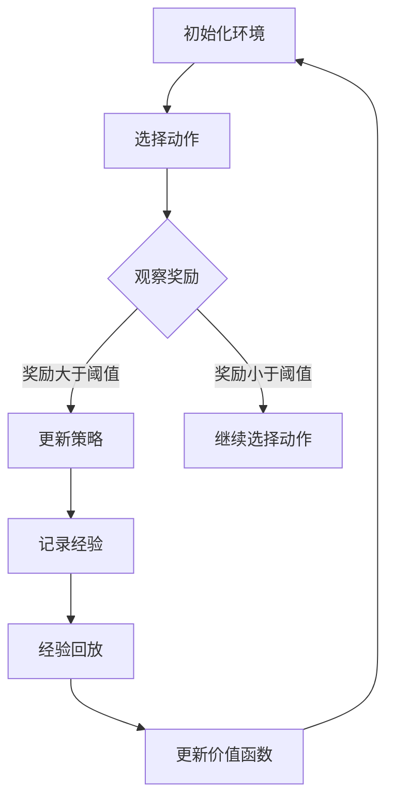

#### 数学模型与公式

接下来，我们使用LaTeX格式给出强化学习算法在智能电网调度中的数学模型和公式：

$$
Q(s, a) = r(s, a) + \gamma \max_{a'} Q(s', a')
$$

其中，$Q(s, a)$表示状态-动作价值函数，$r(s, a)$表示在状态$s$下执行动作$a$获得的即时奖励，$\gamma$表示折扣因子，$s'$表示下一个状态，$a'$表示在状态$s'$下执行的动作。

#### 算法实现与代码

下面，我们给出一个简单的Python代码示例，展示如何使用Q-Learning算法来优化智能电网调度：

```python
import numpy as np
import random

# 初始化参数
alpha = 0.1  # 学习率
gamma = 0.9  # 折扣因子
epsilon = 0.1  # 探索率
n_actions = 3  # 动作数量
n_states = 5  # 状态数量

# 初始化Q值表
Q = np.zeros((n_states, n_actions))

# 强化学习循环
for episode in range(1000):
    state = random.randint(0, n_states - 1)
    done = False

    while not done:
        # 探索与利用策略
        if random.uniform(0, 1) < epsilon:
            action = random.randint(0, n_actions - 1)
        else:
            action = np.argmax(Q[state])

        # 执行动作
        reward = execute_action(action)
        next_state = get_next_state(state, action)

        # 更新Q值
        Q[state, action] = Q[state, action] + alpha * (reward + gamma * np.max(Q[next_state]) - Q[state, action])

        # 更新状态
        state = next_state

        # 判断是否结束
        done = is_done(next_state)

# 打印Q值表
print(Q)
```

在这个示例中，我们使用了一个简单的Q-Learning算法来优化智能电网调度。通过不断尝试和更新Q值表，我们可以找到最优的调度策略。

### 4.2 算法比较与分析

#### 算法属性对比表格

为了更清晰地展示不同强化学习算法在智能电网调度中的应用特点，我们制作了一个算法属性对比表格：

| 算法         | 优点                         | 缺点                       | 适用场景                          |
| ------------ | ---------------------------- | -------------------------- | -------------------------------- |
| Q-Learning   | 简单易懂，易于实现             | 可能陷入局部最优           | 适合小规模状态空间和动作空间的问题 |
| SARSA        | 结合了Q-Learning和策略迭代的方法 | 学习效率相对较低           | 适合动态环境的问题                 |
| DQN          | 能够处理高维状态空间           | 训练时间较长               | 适合复杂环境的问题                 |
| DDQN         | 优化了DQN中的问题，如目标网络  | 训练时间相对较长           | 适合高维状态空间和动作空间的问题   |

#### 算法比较与分析

- **Q-Learning**：Q-Learning算法简单易懂，易于实现。然而，它可能陷入局部最优，导致无法找到全局最优解。
- **SARSA**：SARSA算法结合了Q-Learning和策略迭代的方法，能够更好地适应动态环境。但它的学习效率相对较低。
- **DQN**：DQN算法能够处理高维状态空间，适用于复杂环境。然而，它的训练时间较长，需要大量的计算资源。
- **DDQN**：DDQN算法优化了DQN中的问题，如目标网络，训练时间相对较短。但同样需要大量的计算资源。

根据不同的应用场景和资源限制，可以选择合适的强化学习算法来优化智能电网调度。

## 第5章: 智能电网调度中的具体案例研究

### 5.1 案例一：电力市场调度

#### 项目介绍

电力市场调度是一个复杂的问题，涉及到多个电力市场参与者（如发电厂、电力公司和用户）之间的交易和协调。在本案例中，我们使用强化学习算法来优化电力市场调度，提高市场效率和稳定性。

#### 系统功能设计

电力市场调度系统主要包括以下功能：

1. **市场参与者的注册与认证**：确保市场参与者的合法性和身份验证。
2. **电力交易与调度**：根据电力需求和供应情况，实时进行电力交易和调度。
3. **数据收集与统计**：收集电力市场交易数据，进行统计分析，为调度决策提供支持。
4. **用户界面**：提供用户界面，方便市场参与者进行电力交易和查询市场信息。

#### 系统架构设计

电力市场调度系统的架构设计如下图所示：

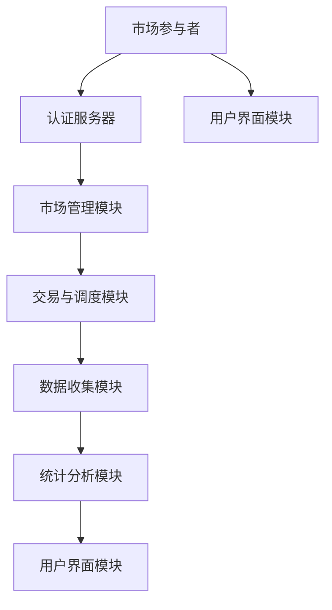

#### 系统接口设计

电力市场调度系统的接口设计如下图所示：

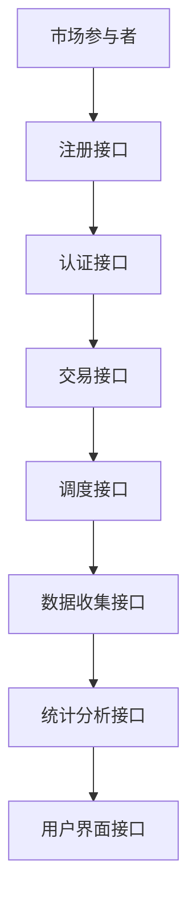

#### 系统功能设计

领域模型Mermaid类图：

```mermaid
classDiagram
    MarketParticipant <<class>>
    MarketManager <<class>>
    TradingAndSchedulingModule <<class>>
    DataCollectionModule <<class>>
    StatisticalAnalysisModule <<class>>
    UserInterfaceModule <<class>>

    MarketParticipant --> MarketManager
    MarketManager --> TradingAndSchedulingModule
    TradingAndSchedulingModule --> DataCollectionModule
    DataCollectionModule --> StatisticalAnalysisModule
    StatisticalAnalysisModule --> UserInterfaceModule
```

系统架构设计Mermaid架构图：

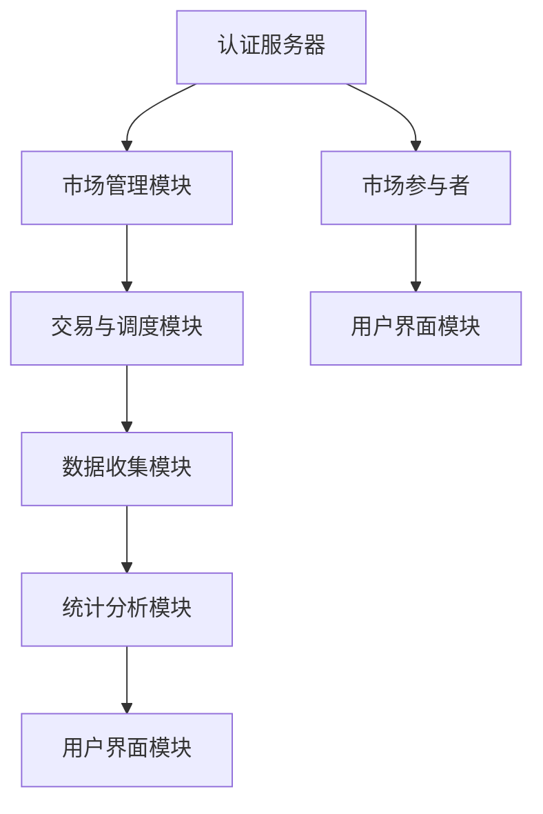

系统接口设计Mermaid序列图：

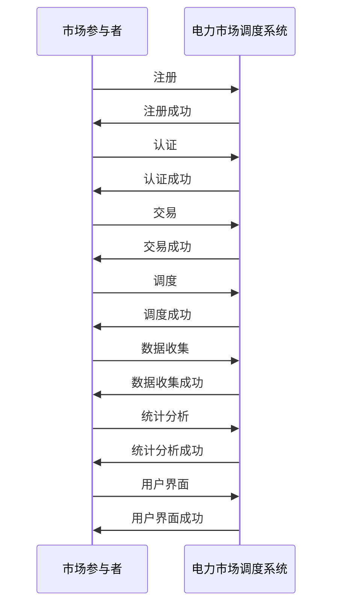

#### 项目介绍

储能系统优化是智能电网调度中的一个重要问题，涉及到储能设备的运行策略和调度策略。在本案例中，我们使用强化学习算法来优化储能系统，提高系统的效率和稳定性。

#### 系统功能设计

储能系统优化系统主要包括以下功能：

1. **储能设备的运行状态监测**：实时监测储能设备的运行状态，包括充电状态、放电状态和电池容量等。
2. **储能设备的调度策略**：根据电力需求和储能设备的运行状态，制定储能设备的调度策略，优化储能设备的运行效率。
3. **储能系统的数据收集与统计**：收集储能系统的运行数据，进行统计分析，为调度决策提供支持。
4. **用户界面**：提供用户界面，方便储能系统管理人员进行系统监控和调度操作。

#### 系统架构设计

储能系统优化系统的架构设计如下图所示：

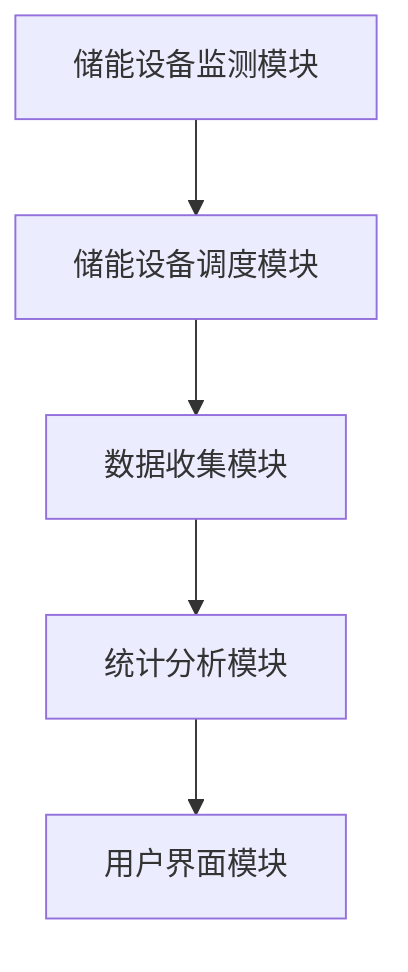

#### 系统接口设计

储能系统优化系统的接口设计如下图所示：

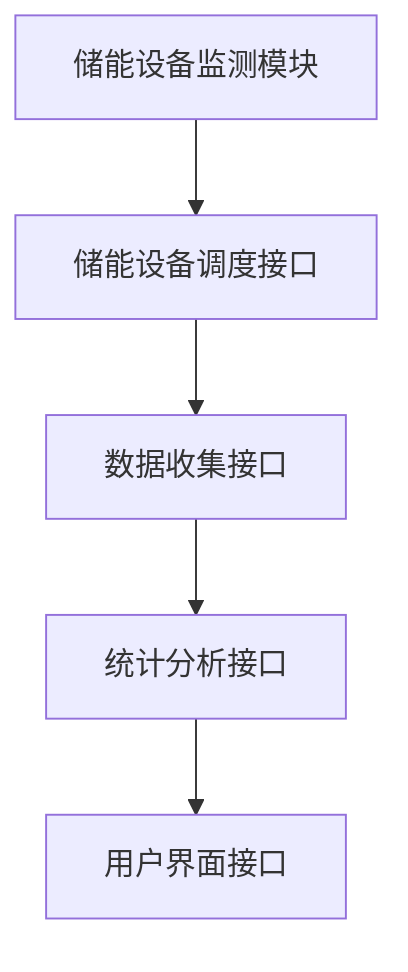

#### 系统功能设计

领域模型Mermaid类图：

```mermaid
classDiagram
    EnergyStorageDevice <<class>>
    EnergyStorageScheduler <<class>>
    DataCollectionModule <<class>>
    StatisticalAnalysisModule <<class>>
    UserInterfaceModule <<class>>

    EnergyStorageDevice --> EnergyStorageScheduler
    EnergyStorageScheduler --> DataCollectionModule
    DataCollectionModule --> StatisticalAnalysisModule
    StatisticalAnalysisModule --> UserInterfaceModule
```

系统架构设计Mermaid架构图：


系统接口设计Mermaid序列图：

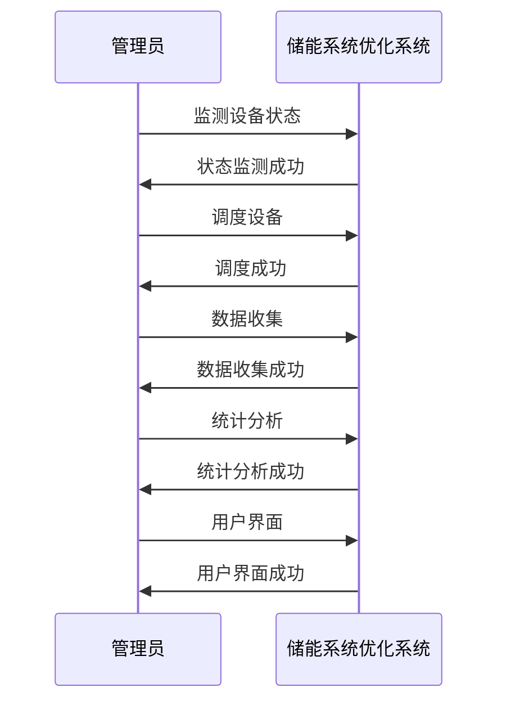

### 5.3 案例三：多能协同优化调度

#### 项目介绍

多能协同优化调度是智能电网调度中的一个重要问题，涉及到多种能源（如电力、天然气、热能等）的协同调度。在本案例中，我们使用强化学习算法来优化多能协同调度，提高系统的效率和稳定性。

#### 系统功能设计

多能协同优化调度系统主要包括以下功能：

1. **能源监测与预测**：实时监测和预测各种能源的供应和需求情况。
2. **能源协同调度策略**：根据能源监测和预测数据，制定各种能源的协同调度策略，优化能源的利用效率。
3. **能源系统的数据收集与统计**：收集能源系统的运行数据，进行统计分析，为调度决策提供支持。
4. **用户界面**：提供用户界面，方便能源系统管理人员进行系统监控和调度操作。

#### 系统架构设计

多能协同优化调度系统的架构设计如下图所示：

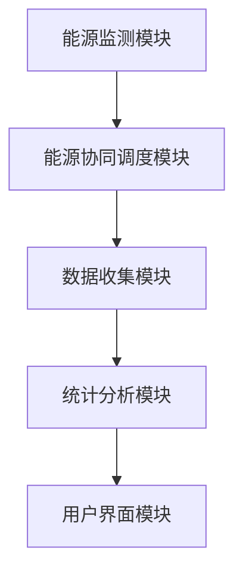

#### 系统接口设计

多能协同优化调度系统的接口设计如下图所示：

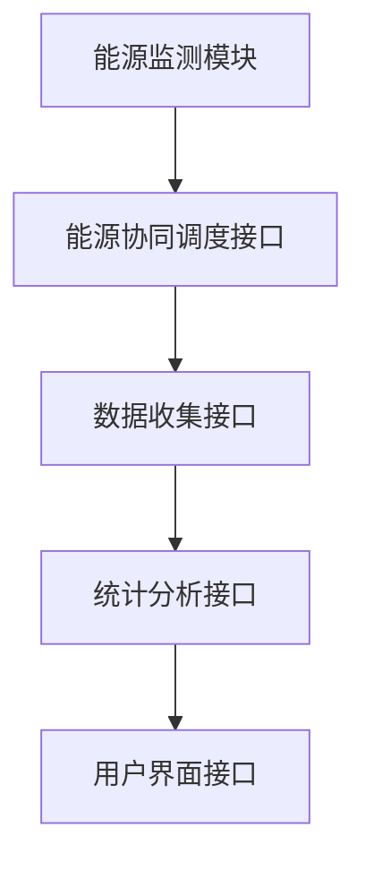

#### 系统功能设计

领域模型Mermaid类图：

```mermaid
classDiagram
    EnergyMonitoringModule <<class>>
    EnergyCollaborativeSchedulingModule <<class>>
    DataCollectionModule <<class>>
    StatisticalAnalysisModule <<class>>
    UserInterfaceModule <<class>>

    EnergyMonitoringModule --> EnergyCollaborativeSchedulingModule
    EnergyCollaborativeSchedulingModule --> DataCollectionModule
    DataCollectionModule --> StatisticalAnalysisModule
    StatisticalAnalysisModule --> UserInterfaceModule
```

系统架构设计Mermaid架构图：


系统接口设计Mermaid序列图：

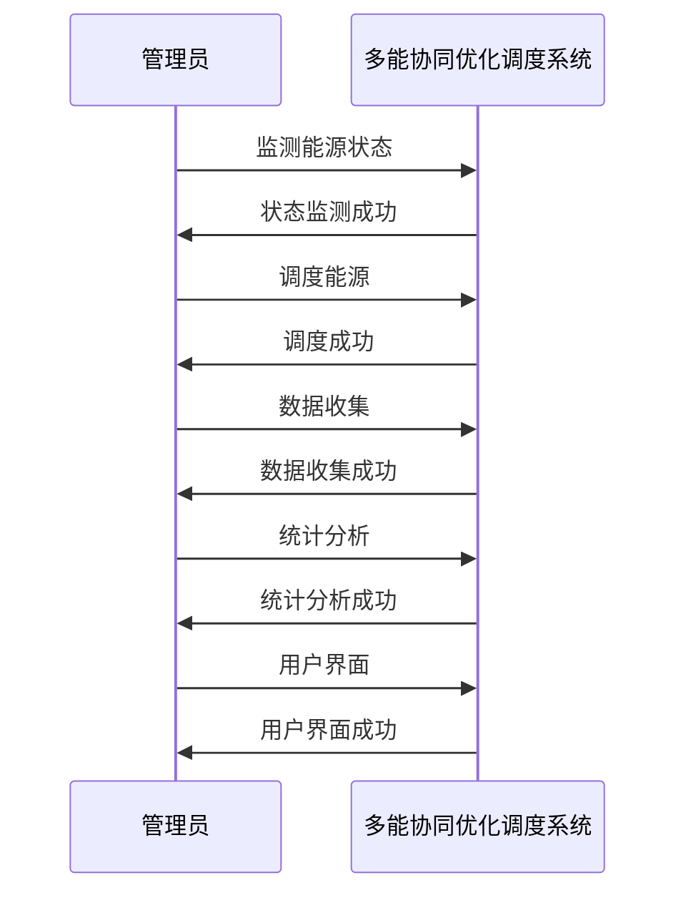

### 项目小结

通过上述三个案例研究，我们可以看到强化学习算法在智能电网调度中的应用具有很大的潜力。无论是电力市场调度、储能系统优化还是多能协同优化调度，强化学习算法都能够有效地提高系统的效率和稳定性。然而，我们也需要注意到，强化学习算法在实际应用中仍然面临着一些挑战，如算法的复杂度、计算资源的消耗以及数据的质量和可靠性等。因此，未来需要进一步研究和优化强化学习算法，以提高其在智能电网调度中的应用效果。

## 第6章: 强化学习在智能电网调度中的未来发展趋势

### 6.1 技术趋势分析

随着科技的不断进步，强化学习在智能电网调度中的应用也将迎来新的发展趋势。

#### 深度强化学习与强化学习的结合

深度强化学习（Deep Reinforcement Learning, DRL）将强化学习与深度学习相结合，能够在复杂的高维状态空间中表现出更强的学习能力。在未来，DRL有望在智能电网调度中发挥更大的作用，通过处理大量的历史数据，优化电力资源的分配。

#### 分布式强化学习

分布式强化学习通过将学习过程分布到多个计算节点上，能够提高学习效率和处理大规模数据的能力。在智能电网调度中，分布式强化学习可以更好地应对实时性和高并发性的挑战，提高系统的响应速度和调度精度。

#### 强化学习在边缘计算中的应用

边缘计算将数据处理和计算任务从云端转移到靠近数据源的边缘节点，能够降低网络延迟和提高系统的实时性。在未来，强化学习有望在边缘计算中发挥作用，通过边缘节点之间的协作和协调，实现更智能、更高效的智能电网调度。

### 6.2 政策与产业环境

#### 政策支持与挑战

随着全球对可持续发展和绿色能源的关注，各国政府纷纷出台了一系列政策，支持智能电网和可再生能源的发展。这些政策为强化学习在智能电网调度中的应用提供了良好的政策环境。

然而，强化学习在智能电网调度中仍然面临一些政策挑战，如数据隐私保护、网络安全和数据共享等。为了解决这些问题，需要制定相应的政策和法规，确保强化学习算法在智能电网调度中的安全、可靠和有效。

#### 产业发展趋势

智能电网和可再生能源产业的快速发展，为强化学习在智能电网调度中的应用提供了广阔的市场空间。未来，随着技术的不断进步和成本的降低，强化学习在智能电网调度中的应用将更加普及。

同时，产业界的合作和竞争也将推动强化学习算法在智能电网调度中的应用。通过产业界的合作，可以共同研究解决智能电网调度中的关键问题；通过产业界的竞争，可以激发技术创新，提高智能电网调度的效率和质量。

### 6.3 未来展望

强化学习在智能电网调度中的未来发展趋势主要体现在以下几个方面：

1. **算法性能的提升**：通过优化算法结构和参数设置，提高强化学习算法在智能电网调度中的性能和可靠性。
2. **应用场景的拓展**：将强化学习应用于更多的智能电网调度场景，如分布式能源管理、电网故障诊断等。
3. **技术与产业的深度融合**：推动强化学习与智能电网、可再生能源等产业的深度融合，促进技术创新和产业发展。

总之，强化学习在智能电网调度中的应用具有巨大的潜力。在未来，随着技术的不断进步和产业的发展，强化学习将为智能电网调度带来更多的创新和变革。

## 第7章: 结论与展望

### 7.1 总结

本文从问题背景、基本原理、算法应用、具体案例研究以及未来发展趋势等方面，全面探讨了深度强化学习在智能电网调度中的应用。主要结论如下：

1. **供需关系的动态性**：智能电网调度面临复杂性和多目标性挑战，供需关系的动态性是其中关键因素。
2. **强化学习优势**：强化学习具有自适应性强、学习能力高等特点，适合优化电力资源的分配，提高电力系统的效率和可靠性。
3. **算法比较与分析**：不同强化学习算法在智能电网调度中的应用特点不同，需要根据具体场景选择合适的算法。
4. **具体案例研究**：通过电力市场调度、储能系统优化和多能协同优化调度的案例，展示了强化学习在智能电网调度中的实际应用效果。
5. **未来发展趋势**：强化学习在智能电网调度中的未来发展趋势包括深度强化学习与强化学习的结合、分布式强化学习以及强化学习在边缘计算中的应用。

### 7.2 注意事项与建议

为了确保强化学习在智能电网调度中的应用效果，以下是一些注意事项与建议：

1. **数据质量**：确保采集到的电力系统数据准确、完整和及时，以提高预测和调度的准确性。
2. **算法选择与优化**：根据具体问题特点，选择合适的强化学习算法，并进行算法参数优化，以提高性能。
3. **安全与隐私**：在智能电网调度中，关注数据安全和隐私保护，采取有效的安全措施，防止数据泄露和恶意攻击。
4. **政策支持与法规**：关注相关政策和法规，确保强化学习在智能电网调度中的应用符合法规要求。
5. **跨学科合作**：加强计算机科学、电力工程、经济学等领域的合作，共同推动智能电网调度技术的发展。

### 7.3 拓展阅读

为了进一步了解深度强化学习在智能电网调度中的应用，以下推荐几本相关读物：

1. 《深度强化学习》（Deep Reinforcement Learning，作者：Pieter Abbeel，等）
2. 《智能电网技术与应用》（Smart Grid Technology and Applications，作者：Ahmed F. Zobaa，等）
3. 《强化学习与智能系统设计》（Reinforcement Learning and Intelligent Systems Design，作者：Satinder P. Singh，等）
4. 《电力系统自动化与智能化》（Automation and Intelligence in Power Systems，作者：Shyi-Ming Chen，等）

通过阅读这些书籍，可以深入了解深度强化学习在智能电网调度中的应用原理、技术发展和实践案例。此外，还可以关注相关学术期刊和会议，如《电力系统自动化》（IEEE Transactions on Power Systems）、《智能电网》（IEEE Transactions on Smart Grid）等，以获取最新的研究成果和发展动态。

