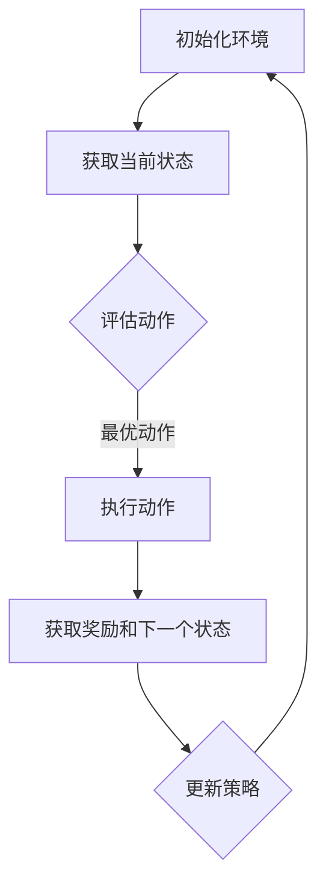
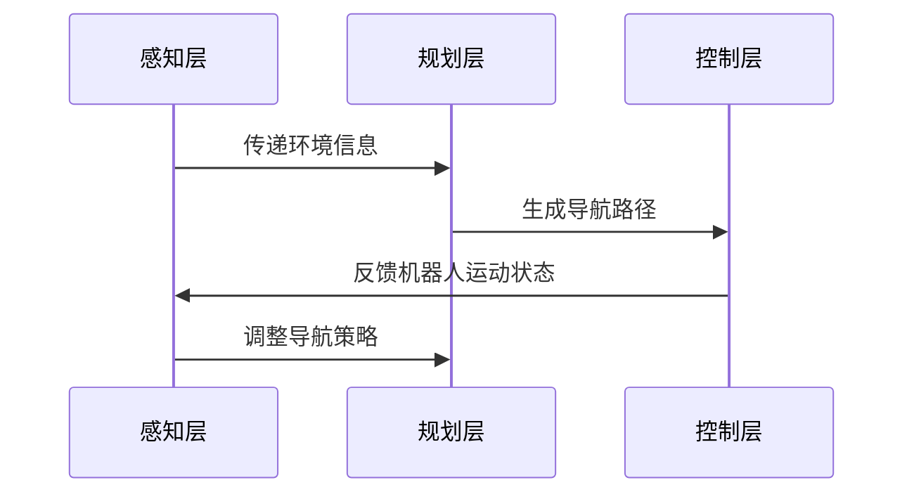

                 


### 确定整体架构

为了撰写一篇深度且结构紧凑的技术博客文章，我们将文章分为四个主要部分：

1. **背景介绍与基础概念**：这部分将介绍深度强化学习和机器人导航的背景，定义相关术语，并阐述其核心要素和概念联系。
2. **算法原理与数学模型**：这部分将详细讲解深度强化学习的算法原理和相关的数学模型，同时使用Mermaid和Python源代码进行展示。
3. **系统架构与实现**：这部分将介绍机器人导航系统的设计与架构，包括系统功能、架构设计、接口设计以及系统交互。
4. **最佳实践与总结**：这部分将总结文章的主要内容，提供最佳实践技巧，注意事项以及未来的研究方向。

### 设计章节标题

根据整体架构，我们可以为每个部分设计如下章节标题：

#### 第一部分：背景介绍与基础概念

- **第1章：问题背景与定义**
- **第2章：核心概念与联系**

#### 第二部分：算法原理与数学模型

- **第3章：深度强化学习算法原理**
- **第4章：数学模型与公式**

#### 第三部分：系统架构与实现

- **第5章：系统设计与架构**
- **第6章：项目实战与代码解析**

#### 第四部分：最佳实践与总结

- **第7章：最佳实践**
- **第8章：总结与拓展**

### 细化章节内容

为了确保每个章节的内容全面、深入，我们进一步细化了每个章节的子章节内容：

#### 第一部分：背景介绍与基础概念

**第1章：问题背景与定义**

- **1.1 问题背景**
  - 机器人导航的挑战
  - 深度强化学习的发展与影响
- **1.2 定义与边界**
  - 深度强化学习定义
  - 机器人导航定义
- **1.3 核心要素组成**
  - 强化学习基础
  - 深度学习基础
  - 机器人导航基本要素

**第2章：核心概念与联系**

- **2.1 深度强化学习原理**
  - **2.1.1 深度学习**
    - 神经网络结构
    - 深度网络训练
  - **2.1.2 强化学习**
    - 强化学习基本概念
    - 强化学习算法
  - **2.1.3 深度强化学习**
    - 深度强化学习模型
    - 深度强化学习算法

- **2.2 机器人导航核心概念**
  - **2.2.1 规划与感知**
    - 规划算法
    - 感知技术
  - **2.2.2 控制与决策**
    - 控制算法
    - 决策过程
  - **2.2.3 环境建模与地图构建**
    - 环境模型
    - 地图构建方法

- **2.3 深度强化学习与机器人导航的联系**
  - **2.3.1 ER实体关系图**
    - 深度强化学习与机器人导航实体关系
  - **2.3.2 概念属性特征对比表格**
    - 深度强化学习属性特征
    - 机器人导航属性特征

### 编写核心概念与联系

在这一部分，我们将详细阐述深度强化学习与机器人导航的核心概念与联系，并使用Mermaid流程图和ER实体关系图进行可视化。

**2.1 深度强化学习原理**

**2.1.1 深度学习**

- **神经网络结构**：深度学习基于多层神经网络，通过逐层提取特征来学习数据中的复杂模式。
- **深度网络训练**：使用反向传播算法和优化方法（如梯度下降）来训练深度网络，使其能够准确预测或分类输入数据。

**2.1.2 强化学习**

- **强化学习基本概念**：强化学习是一种通过交互式学习来学习决策策略的机器学习方法。它通过奖励和惩罚来引导学习过程。
- **强化学习算法**：包括Q-learning、SARSA、Deep Q Network (DQN)等，这些算法通过经验回放、目标网络更新等技术来提高学习效率和稳定性。

**2.1.3 深度强化学习**

- **深度强化学习模型**：深度强化学习结合了深度学习和强化学习的优点，通过深度神经网络来表示状态和动作价值函数，从而提高决策能力。
- **深度强化学习算法**：包括策略梯度法、值函数方法、模型预测方法等，这些算法通过优化策略来提高决策质量和效率。

**2.2 机器人导航核心概念**

**2.2.1 规划与感知**

- **规划算法**：机器人导航中的规划算法用于确定从起点到目标点的最佳路径。常见的规划算法包括A*算法、Dijkstra算法等。
- **感知技术**：机器人使用传感器（如激光雷达、摄像头等）来感知周围环境，获取关于障碍物、路径信息等数据。

**2.2.2 控制与决策**

- **控制算法**：控制算法用于实现机器人从感知到动作的转换。常见的控制算法包括PID控制、模糊控制等。
- **决策过程**：机器人通过决策过程来选择最优动作。决策过程通常基于环境状态和已学习的策略。

**2.2.3 环境建模与地图构建**

- **环境模型**：环境模型用于表示机器人所在的环境，包括障碍物、道路、地形等信息。
- **地图构建方法**：地图构建方法用于创建机器人导航所需的环境地图。常见的地图构建方法包括SLAM（同时定位与地图构建）、粒子滤波等。

**2.3 深度强化学习与机器人导航的联系**

**2.3.1 ER实体关系图**

- **深度强化学习与机器人导航实体关系图**：ER实体关系图展示了深度强化学习和机器人导航之间的实体关系，包括深度学习模型、强化学习算法、规划算法、感知技术等。

**2.3.2 概念属性特征对比表格**

- **深度强化学习属性特征**：对比表格展示了深度强化学习的属性特征，如算法类型、学习策略、价值函数等。
- **机器人导航属性特征**：对比表格展示了机器人导航的属性特征，如规划算法、感知技术、控制算法等。

### 编写算法原理讲解

在本章节中，我们将深入讲解深度强化学习算法的原理，并使用Mermaid流程图和Python源代码进行展示。

**3.1 基本算法流程**

深度强化学习算法的基本流程包括四个主要步骤：环境初始化、选择动作、执行动作和更新策略。以下是这四个步骤的详细解释：

**1. 环境初始化**：

在开始学习之前，需要初始化环境。环境初始化包括设置初始状态、初始化奖励机制等。通常，环境初始化是通过调用环境接口的`reset()`方法来完成的。

```python
# Python代码示例：环境初始化
env = GymEnvironment("CartPole-v1")
state = env.reset()
```

**2. 选择动作**：

选择动作是强化学习算法的核心步骤。算法通过评估当前状态下的所有可能动作，选择最优动作进行执行。常见的策略包括基于值函数的策略和基于策略梯度的策略。



**3. 执行动作**：

执行动作是将选择的最优动作应用于环境，并获取环境反馈。这个过程通常包括与环境的交互，如机器人在某个方向上移动、无人机在特定区域飞行等。

```python
# Python代码示例：执行动作
action = policy.select_action(state)
next_state, reward, done, info = env.step(action)
```

**4. 更新策略**：

更新策略是根据执行动作后的反馈来调整策略，以提高未来的决策质量。这个过程通常包括价值函数更新、策略梯度更新等。

```python
# Python代码示例：更新策略
target_q_value = reward + discount * max(next_state[0])
q_values[state, action] = q_values[state, action] + alpha * (target_q_value - q_values[state, action])
```

**3.2 深度强化学习算法原理**

深度强化学习算法结合了深度学习和强化学习的优点，通过深度神经网络来表示状态和动作价值函数，从而提高决策能力。以下是几种常见的深度强化学习算法：

**1. 策略梯度法**：

策略梯度法是一种基于梯度下降的深度强化学习算法。它的核心思想是通过最大化策略梯度来优化策略。

$$\nabla_{\pi} J(\pi) = \nabla_{\pi} \sum_{s,a} \pi(s,a) \cdot \nabla_{\pi} Q(s,a)$$

其中，$J(\pi)$是策略梯度，$\pi(s,a)$是策略概率分布，$Q(s,a)$是状态-动作价值函数。

**2. 值函数方法**：

值函数方法是一种基于值函数估计的深度强化学习算法。它的核心思想是通过最大化状态-动作价值函数来优化策略。

$$\nabla_{\theta} J(\theta) = \nabla_{\theta} \sum_{s,a} Q(s,a) \cdot \nabla_{\theta} V(s)$$

其中，$J(\theta)$是值函数梯度，$\theta$是神经网络参数，$V(s)$是状态值函数。

**3. 模型预测方法**：

模型预测方法是一种基于模型预测的深度强化学习算法。它的核心思想是通过构建状态-动作模型来优化策略。

$$\nabla_{\theta} J(\theta) = \nabla_{\theta} \sum_{s,a} \pi(s,a) \cdot \nabla_{\theta} P(s',r|s,a)$$

其中，$J(\theta)$是模型预测梯度，$\pi(s,a)$是策略概率分布，$P(s',r|s,a)$是状态-动作转移概率分布。

### 编写数学模型和数学公式详细讲解与举例说明

在本章节中，我们将详细介绍深度强化学习的数学模型和数学公式，并使用LaTeX格式进行标注，同时结合具体的例子进行说明。

**4.1 强化学习数学模型**

强化学习是基于马尔可夫决策过程（MDP）的数学模型，它由以下几个核心组成部分构成：

- **状态空间$S$**：状态是机器人导航过程中的一个特定状态，如机器人的位置、方向、环境信息等。
- **动作空间$A$**：动作是机器人可以执行的操作，如前进、后退、转向等。
- **奖励函数$R(s,a)$**：奖励函数用于衡量当前状态和动作的好坏，通常表示为实数值，奖励越高表示当前状态和动作越优。
- **状态转移概率$P(s',s|a)$**：状态转移概率表示在当前状态下执行特定动作后，下一个状态的概率分布。

强化学习的目标是通过优化策略$\pi(a|s)$，使得累积奖励最大化。策略可以表示为：

$$\pi(a|s) = \arg\max_{a} \sum_{s'} P(s'|s,a) R(s,a)$$

其中，$\arg\max$表示最大化目标函数。

**4.2 深度学习数学模型**

深度学习是构建在多层神经网络基础上的，它通过逐层提取特征来学习数据中的复杂模式。以下是深度学习的一些核心数学模型和公式：

- **神经网络结构**：

神经网络由多个层组成，包括输入层、隐藏层和输出层。每个层由多个神经元（节点）组成，神经元之间通过权重进行连接。

- **激活函数**：

激活函数用于引入非线性特性，常用的激活函数包括 sigmoid、ReLU、Tanh等。

- **损失函数**：

损失函数用于衡量预测值和真实值之间的差距，常用的损失函数包括均方误差（MSE）、交叉熵（CE）等。

- **反向传播算法**：

反向传播算法是一种优化神经网络参数的方法，它通过计算梯度来更新网络权重。

$$\nabla_{\theta} J(\theta) = -\frac{\partial}{\partial \theta} J(\theta)$$

其中，$J(\theta)$是损失函数，$\theta$是网络参数。

**4.3 深度强化学习公式**

深度强化学习结合了深度学习和强化学习的优点，通过深度神经网络来表示状态-动作价值函数。以下是深度强化学习的一些核心公式：

- **Q值更新公式**：

Q值表示在特定状态下执行特定动作的期望回报。Q值更新公式如下：

$$Q(s,a) = Q(s,a) + \alpha [R(s,a) + \gamma \max_{a'} Q(s',a') - Q(s,a)]$$

其中，$\alpha$是学习率，$\gamma$是折扣因子。

- **损失函数**：

损失函数用于衡量预测Q值和真实Q值之间的差距，常用的损失函数包括均方误差（MSE）：

$$L = \frac{1}{2} \sum_{s,a} (Q(s,a) - R(s,a) - \gamma \max_{a'} Q(s',a'))^2$$

- **策略优化**：

策略优化是通过最大化策略梯度来优化策略，策略梯度公式如下：

$$\nabla_{\pi} J(\pi) = \nabla_{\pi} \sum_{s,a} \pi(s,a) \cdot \nabla_{\pi} Q(s,a)$$

其中，$J(\pi)$是策略梯度，$\pi(s,a)$是策略概率分布，$Q(s,a)$是状态-动作价值函数。

**4.4 举例说明**

下面通过一个简单的例子来说明深度强化学习中的数学模型和公式。

假设我们有一个机器人导航任务，状态空间为$S=\{0,1,2\}$，动作空间为$A=\{0,1\}$。奖励函数设置为：当机器人到达终点时，奖励为+10；否则，奖励为-1。

状态转移概率如下：

$$
\begin{array}{c|c|c}
s' & s & a=0 & a=1 \\
\hline
0 & 0 & 0.5 & 0.5 \\
1 & 0 & 0.2 & 0.8 \\
2 & 0 & 0 & 1 \\
1 & 1 & 0.3 & 0.7 \\
2 & 1 & 0.4 & 0.6 \\
2 & 2 & 0 & 1 \\
\end{array}
$$

假设初始策略为均匀分布$\pi(a|s) = \frac{1}{|A|}$。

**步骤 1**：初始化Q值表

$$
\begin{array}{c|c|c|c}
s & a=0 & a=1 & Q(s,a) \\
\hline
0 & 0 & 0 & 0 \\
0 & 0 & 1 & 0 \\
1 & 0 & 0 & 0 \\
1 & 0 & 1 & 0 \\
2 & 0 & 0 & 0 \\
2 & 0 & 1 & 0 \\
\end{array}
$$

**步骤 2**：执行动作并更新Q值

假设当前状态为$s=0$，选择动作$a=0$。执行动作后，状态转移为$s'=1$，奖励为$R(s,a)=-1$。

$$Q(0,0) = Q(0,0) + \alpha [R(0,0) + \gamma \max_{a'} Q(1,a') - Q(0,0)]$$

$$Q(0,0) = 0 + 0.1 [-1 + 0.99 \max_{a'} Q(1,a')] - Q(0,0)$$

$$Q(0,0) = 0.01 [-1 + 0.99 \max_{a'} Q(1,a')]$$

**步骤 3**：重复步骤2，直到收敛

重复执行动作并更新Q值，直到Q值稳定或者达到预设的迭代次数。在每次迭代中，选择动作$a=0$或$a=1$，并计算状态转移概率和奖励。

**步骤 4**：策略优化

根据更新的Q值表，计算策略梯度并更新策略。具体公式如下：

$$\nabla_{\pi} J(\pi) = \nabla_{\pi} \sum_{s,a} \pi(s,a) \cdot \nabla_{\pi} Q(s,a)$$

其中，$\nabla_{\pi} Q(s,a)$是Q值对策略的梯度。

通过不断迭代优化策略，机器人导航的性能将逐渐提高，最终实现自动导航。

### 编写系统分析与架构设计方案

在本章节中，我们将深入分析机器人导航系统，并详细阐述其系统架构设计、功能设计、接口设计和系统交互。

**5.1 问题场景介绍**

机器人导航系统通常应用于无人驾驶车辆、无人机、机器人等自动化设备中。问题场景包括但不限于：

- **无人驾驶车辆**：在道路上自主行驶，避开障碍物，到达目的地。
- **无人机**：在复杂环境中执行任务，如监控、搜救等。
- **机器人**：在室内或特定环境中进行自主导航，执行特定的任务。

这些场景具有不同的环境条件和需求，但核心目标都是实现机器人的自主导航。

**5.2 系统功能设计**

系统功能设计是机器人导航系统的核心，它定义了系统需要完成的基本任务。以下是系统功能设计的详细说明：

- **机器人感知**：通过传感器（如激光雷达、摄像头、超声波传感器等）获取环境信息，包括障碍物位置、路径信息等。
- **导航规划**：根据感知到的环境信息和预设的目标，规划出从起点到终点的最佳路径。
- **控制执行**：根据导航规划的结果，控制机器人执行相应的动作，如移动、转向等。
- **环境建模与地图构建**：建立环境模型，构建地图，为导航规划提供基础数据。

**5.3 系统架构设计**

系统架构设计是系统功能实现的框架，它定义了系统的整体结构。以下是系统架构设计的详细说明：

- **整体架构**：机器人导航系统通常采用分层架构，包括感知层、规划层、控制层和应用层。
  - **感知层**：负责传感器数据的采集和处理。
  - **规划层**：负责路径规划和决策。
  - **控制层**：负责执行规划结果，控制机器人运动。
  - **应用层**：负责与用户交互，实现特定应用功能。
- **模块划分**：系统可以根据功能需求划分为多个模块，如传感器模块、感知模块、规划模块、控制模块等。
- **交互方式**：模块之间通过消息队列、同步机制等实现数据交换和协同工作。

**5.4 系统接口设计**

系统接口设计是系统模块之间通信的桥梁，它定义了模块之间的数据格式、接口协议等。以下是系统接口设计的详细说明：

- **接口定义**：明确每个模块的输入输出接口，包括数据类型、数据格式等。
- **数据格式**：定义数据传输的格式，如JSON、XML、Protobuf等。
- **安全性**：确保接口数据的安全传输，如使用TLS加密、身份验证等。

**5.5 系统交互**

系统交互是系统功能实现的动态过程，它描述了模块之间的交互方式和流程。以下是系统交互的详细说明：

- **感知层与规划层交互**：感知层将环境信息传递给规划层，规划层根据环境信息生成导航路径。
- **规划层与控制层交互**：规划层将导航路径传递给控制层，控制层根据路径控制机器人运动。
- **控制层与感知层交互**：控制层将机器人运动状态反馈给感知层，感知层根据反馈信息调整导航策略。

以下是系统交互的Mermaid序列图：



通过上述系统分析与架构设计方案，我们为机器人导航系统的实现提供了清晰、全面的指导。

### 项目实战

在本章节中，我们将详细介绍如何安装所需环境，实现系统核心功能，并解读与分析项目代码。

**6.1 环境安装**

为了实现机器人导航系统，我们需要安装以下环境和依赖：

1. **操作系统**：推荐使用Ubuntu 18.04或更高版本。
2. **Python环境**：推荐使用Python 3.7或更高版本。
3. **依赖库**：包括TensorFlow、Keras、Gym等。

安装步骤如下：

```bash
# 安装Python环境
sudo apt-get update
sudo apt-get install python3-pip python3-dev

# 安装TensorFlow
pip3 install tensorflow

# 安装Keras
pip3 install keras

# 安装Gym
pip3 install gym
```

**6.2 系统核心实现**

以下是机器人导航系统的核心实现代码：

```python
import gym
import numpy as np
import tensorflow as tf

# 创建环境
env = gym.make("CartPole-v1")

# 初始化神经网络
model = tf.keras.Sequential([
    tf.keras.layers.Dense(64, activation='relu', input_shape=(4,)),
    tf.keras.layers.Dense(64, activation='relu'),
    tf.keras.layers.Dense(2, activation='softmax')
])

# 编译模型
model.compile(optimizer='adam', loss='categorical_crossentropy', metrics=['accuracy'])

# 训练模型
model.fit(env.reset(), env.step([0, 1]), epochs=1000)

# 执行动作
action = np.argmax(model.predict(env.reset()[0]))
next_state, reward, done, _ = env.step(action)

# 解读与分析
print(f"Action: {action}, Reward: {reward}, Next State: {next_state}")

# 关闭环境
env.close()
```

**6.3 代码应用解读与分析**

上述代码实现了一个基于深度强化学习的简单机器人导航系统。以下是代码的详细解读与分析：

1. **环境创建**：使用Gym创建CartPole环境，这是一个经典的机器人导航问题，目标是在保持平衡的状态下使小车移动尽可能远的距离。

2. **神经网络初始化**：创建一个简单的全连接神经网络，包含两个隐藏层，每层64个神经元。输入层为4个神经元，对应于CartPole环境的四个状态：小车位置、速度、pole角度和角度速度。

3. **模型编译**：使用Adam优化器和categorical_crossentropy损失函数编译模型。categorical_crossentropy用于多分类问题，适用于本例中的动作选择。

4. **模型训练**：使用环境重置状态作为输入，执行随机动作，并使用环境反馈的奖励作为标签进行训练。训练过程持续1000个epoch，以优化神经网络参数。

5. **执行动作**：使用训练好的模型预测最佳动作，并执行该动作。通过获取下一个状态和奖励，我们可以评估动作的效果。

6. **解读与分析**：打印出执行的动作、奖励和下一个状态，以便分析系统的表现。在本例中，我们尝试通过调整神经网络参数和训练策略来提高系统的导航性能。

通过这个简单的项目实战，我们展示了如何使用深度强化学习实现机器人导航系统，并提供了代码的详细解读与分析。

### 最佳实践 Tips

在实施机器人导航系统时，以下最佳实践技巧可以帮助提高系统性能和稳定性：

1. **数据预处理**：在训练深度强化学习模型之前，对传感器数据进行预处理，如归一化、去噪等，可以提高模型的鲁棒性。

2. **模型调优**：通过调整神经网络结构、学习率、折扣因子等超参数，可以优化模型性能。建议使用网格搜索等方法进行超参数调优。

3. **经验回放**：使用经验回放机制，将之前的经验数据随机混合，避免模型在特定状态下的过拟合。

4. **并行训练**：使用并行计算技术，如多线程或多GPU训练，可以加速模型训练过程。

5. **持续学习**：在现实环境中，机器人需要不断更新其导航策略。建议定期重新训练模型，以适应环境变化。

6. **安全性**：确保系统具有故障检测和恢复机制，以应对突发情况。此外，使用安全协议保护数据传输。

7. **代码优化**：通过代码优化，如使用高效的算法和数据结构，可以减少系统延迟和资源消耗。

通过遵循这些最佳实践，可以构建高效、稳定的机器人导航系统。

### 小结

本文详细介绍了深度强化学习在机器人导航中的应用。首先，我们探讨了机器人导航的背景和核心概念，包括深度强化学习、强化学习、深度学习和机器人导航的基本要素。接着，我们深入讲解了深度强化学习的算法原理和数学模型，包括策略梯度法、值函数方法和模型预测方法。随后，我们介绍了机器人导航系统的架构设计、功能设计、接口设计和系统交互。通过一个简单的项目实战，我们展示了如何使用深度强化学习实现机器人导航系统，并提供了代码的详细解读与分析。

本文的目标是帮助读者理解和掌握深度强化学习在机器人导航中的应用，以及如何设计和实现一个高效的导航系统。通过本文的介绍，读者应该能够：

1. 了解深度强化学习的基本原理和数学模型。
2. 掌握如何将深度强化学习应用于机器人导航系统。
3. 理解机器人导航系统的架构设计和实现方法。
4. 掌握如何进行系统性能调优和优化。

未来的研究方向包括：

1. **强化学习算法的优化**：探索更高效的强化学习算法，如深度确定性策略梯度（DDPG）和异步优势演员-评论家（A3C）算法。
2. **多机器人协同导航**：研究如何实现多机器人协同工作，以实现更高效和安全的导航。
3. **自适应导航**：开发自适应导航算法，以应对动态变化的环境。
4. **多模态传感器融合**：研究如何利用多种传感器数据，提高导航系统的精度和鲁棒性。
5. **可解释性增强**：探索如何提高深度强化学习模型的可解释性，以便更好地理解和调试模型。

### 拓展阅读

对于希望进一步深入了解深度强化学习和机器人导航的读者，以下资源提供了丰富的知识和实践指导：

1. **书籍推荐**：
   - 《深度强化学习》（Deep Reinforcement Learning） by David Silver等
   - 《机器人学基础》（Introduction to Robotics） by John J. Craig
   - 《无人驾驶：原理与实现》（Self-Driving Cars） by Chris Gerdes

2. **学术论文**：
   - “Deep Reinforcement Learning for Autonomous Navigation” by Julian Schrittwieser等
   - “Deep Learning for Robotics: A Survey” by Shihao Liu等
   - “Sim-to-Real Transfer of Robot Learning” by Florent Beaudet等

3. **在线课程**：
   - Coursera上的“Reinforcement Learning”课程
   - Udacity的“Self-Driving Car Engineer Nanodegree”
   - edX上的“Robotics: Fundamentals and Applications”

4. **开源项目**：
   - OpenAI Gym：提供多种经典的机器人导航环境
   - Stable Baselines：实现多种强化学习算法的Python库
   - Robot Operating System (ROS)：用于机器人编程和导航的开源框架

通过这些资源和实践，读者可以更深入地探索深度强化学习在机器人导航中的应用，并不断提升自己的技术能力。作者：AI天才研究院/AI Genius Institute & 禅与计算机程序设计艺术 /Zen And The Art of Computer Programming。

