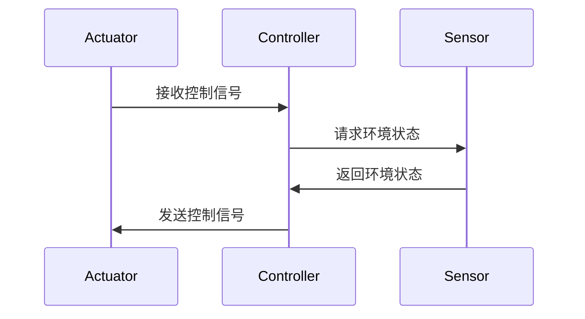
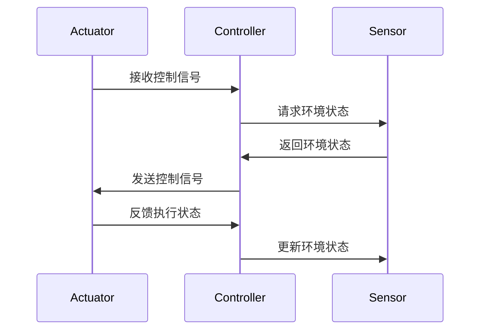

                 

### 深度强化学习在机器人控制中的应用

**关键词：** 深度强化学习、机器人控制、算法原理、系统设计、应用实践

**摘要：** 本文将深入探讨深度强化学习在机器人控制中的应用。首先，我们会介绍深度强化学习的基本概念和发展背景，然后详细讲解其核心算法原理和数学模型。接着，我们将探讨深度强化学习与机器人控制的结合点，并介绍机器人控制系统的设计原则。通过实际案例，我们将展示如何利用深度强化学习实现机器人控制的创新应用。最后，我们将总结最佳实践，并给出相关的注意事项和拓展阅读资源。

### 1. 深度强化学习概述

#### 1.1 深度强化学习的背景与发展

深度强化学习（Deep Reinforcement Learning, DRL）是机器学习和人工智能领域的一个重要分支，结合了深度学习和强化学习的方法，旨在通过自我学习实现对复杂环境的智能控制。其发展可以追溯到20世纪90年代，当时研究人员开始探索如何将深度神经网络应用于强化学习问题。近年来，随着计算能力和算法的进步，深度强化学习在诸多领域取得了显著成果。

深度强化学习的核心思想是通过模拟试错过程，使智能体在与环境的交互中不断优化其行为策略。这一过程类似于人类的学习过程，智能体通过感知环境状态，选择动作，并在收到环境反馈后调整策略。与传统的强化学习方法相比，深度强化学习引入了深度神经网络，能够处理高维状态空间和复杂的决策问题。

#### 1.2 深度强化学习的核心概念

- **强化学习（Reinforcement Learning, RL）：** 强化学习是一种通过环境反馈来指导行为优化的机器学习方法。其主要目标是通过不断尝试，学习出最优策略，实现长期奖励最大化。
- **深度学习（Deep Learning, DL）：** 深度学习是一种利用多层神经网络进行特征提取和模式识别的技术，通过训练大量参数模型，实现对复杂数据的自动建模。
- **深度强化学习（Deep Reinforcement Learning, DRL）：** 结合了深度学习和强化学习的优势，能够处理高维状态空间和复杂的决策问题。

#### 1.3 深度强化学习与传统强化学习的关系

传统强化学习算法如Q学习、策略梯度等在处理简单问题时表现出色，但面对复杂的环境时，状态和动作空间往往过于庞大，导致计算成本极高。深度强化学习通过引入深度神经网络，能够有效降低这一成本，使强化学习能够应用于更广泛的场景。

虽然深度强化学习在算法上借鉴了传统强化学习的思想，但它并非简单的线性叠加。传统强化学习方法通常需要人工设计状态和动作特征，而深度强化学习通过神经网络自动学习特征表示，大大提高了算法的灵活性和适用性。

### 2. 深度强化学习算法原理

#### 2.1 离散时间马尔可夫决策过程

在深度强化学习中，我们通常采用马尔可夫决策过程（Markov Decision Process, MDP）作为理论基础。MDP是一个描述智能体与环境交互的数学模型，它包含状态空间、动作空间、奖励函数和状态转移概率。

- **状态空间（State Space）：** 智能体所处的所有可能状态的集合。
- **动作空间（Action Space）：** 智能体可以采取的所有可能动作的集合。
- **奖励函数（Reward Function）：** 根据智能体的动作和环境的反馈计算出的即时奖励。
- **状态转移概率（State Transition Probability）：** 给定当前状态和动作，智能体转移到下一个状态的概率。

在MDP中，智能体的目标是学习一个最优策略，该策略能够使智能体在长期内获得最大的累积奖励。

#### 2.2 连续时间马尔可夫决策过程

在实际应用中，环境的状态和动作往往不是离散的，而是连续的。这种情况下，我们采用连续时间马尔可夫决策过程（Continuous-Time Markov Decision Process, CTMDP）来描述智能体与环境的交互。

与离散时间MDP类似，CTMDP也包含状态空间、动作空间、奖励函数和状态转移概率。不同的是，CTMDP中的状态和动作是连续的，通常使用概率密度函数（Probability Density Function, PDF）来描述状态转移概率。

#### 2.3 Q学习算法

Q学习（Q-Learning）是深度强化学习中最基本和最常用的算法之一。它的核心思想是学习一个值函数，即Q函数，用来评估智能体在每个状态下采取每个动作的预期回报。

- **Q函数（Q-Function）：** 给定状态\( s \)和动作\( a \)，Q函数 \( Q(s, a) \) 表示智能体在状态\( s \)下采取动作\( a \)的预期回报。
- **目标函数（Objective Function）：** Q学习的目标是最大化累积奖励，即最大化 \( \sum_{t=0}^{\infty} \gamma^t R_t \)，其中 \( R_t \) 是在第 \( t \) 时刻的即时奖励，\( \gamma \) 是折扣因子。

Q学习通过迭代更新Q值，逐渐收敛到最优Q值函数。其核心更新公式为：

$$ Q(s_t, a_t) \leftarrow Q(s_t, a_t) + \alpha [R_t + \gamma \max_{a'} Q(s_{t+1}, a') - Q(s_t, a_t)] $$

其中，\( \alpha \) 是学习率。

#### 2.4 策略梯度算法

策略梯度算法（Policy Gradient Algorithms）是一种直接优化策略的算法，其核心思想是计算策略梯度和更新策略参数。

- **策略（Policy）：** 策略定义了智能体在给定状态下采取哪个动作。在连续动作空间中，策略通常是一个概率分布。
- **策略梯度（Policy Gradient）：** 策略梯度是策略参数的梯度，用于衡量策略改进的方向和程度。

策略梯度算法通过以下公式进行策略更新：

$$ \theta \leftarrow \theta - \alpha \nabla_{\theta} J(\theta) $$

其中，\( J(\theta) \) 是策略的损失函数，通常采用REINFORCE方法计算：

$$ J(\theta) = \sum_{t=0}^{T} \frac{\partial L(\theta)}{\partial \theta} R_t $$

其中，\( L(\theta) \) 是策略的期望回报。

#### 2.5 神经网络在深度强化学习中的应用

深度神经网络在深度强化学习中的应用主要分为两种：

- **状态值函数逼近（State-Value Function Approximation）：** 使用深度神经网络近似Q函数，从而减少状态和动作空间，提高学习效率。
- **策略函数逼近（Policy Function Approximation）：** 使用深度神经网络近似策略函数，从而直接优化策略参数。

通过结合深度神经网络和强化学习算法，我们可以实现高效、鲁棒的智能体学习，更好地应对复杂环境中的控制问题。

### 3. 深度强化学习在机器人控制中的应用原理

#### 3.1 机器人控制中的挑战

机器人控制是一个复杂的问题，涉及到动力学、运动学、传感器融合、路径规划等多个方面。深度强化学习为解决这些问题提供了一种新的思路。

- **环境复杂性：** 机器人需要应对动态、不确定的环境，包括障碍物、其他机器人等。
- **状态和动作空间：** 机器人控制通常具有高维的状态和动作空间，使得传统的控制方法难以应对。
- **长期奖励设计：** 机器人控制问题通常涉及长期奖励，如何设计合理的奖励函数是关键。

#### 3.2 深度强化学习在机器人控制中的应用场景

深度强化学习在机器人控制中具有广泛的应用潜力，以下是一些典型的应用场景：

- **路径规划：** 机器人需要在未知或动态环境中找到最优路径。
- **物体抓取：** 机器人需要精确地抓取各种形状和尺寸的物体。
- **协作控制：** 多个机器人需要协同工作，完成复杂的任务。
- **自主导航：** 机器人需要在复杂环境中自主导航，避免障碍物并到达目标地点。

#### 3.3 深度强化学习与机器人控制的结合

深度强化学习与机器人控制的结合主要通过以下三个方面实现：

- **状态感知：** 深度神经网络用于感知机器人周围的环境状态，提取关键信息。
- **动作决策：** 深度神经网络根据状态感知结果，选择最优的动作策略。
- **反馈调整：** 通过与环境交互，机器人不断调整其动作策略，以优化长期奖励。

### 4. 机器人控制系统设计

#### 4.1 机器人控制系统概述

机器人控制系统是使机器人能够执行特定任务的硬件和软件系统的组合。一个典型的机器人控制系统包括以下几个主要部分：

- **传感器：** 用于感知机器人周围的环境，包括视觉、力觉、温度等。
- **控制器：** 根据传感器数据和预设的目标，生成机器人的控制信号。
- **执行器：** 根据控制信号驱动机器人的动作，包括电机、液压系统等。
- **通信模块：** 用于与其他系统或设备进行通信，实现数据交换和控制指令的传递。

#### 4.2 领域模型设计

领域模型是机器人控制系统设计的基础，它定义了系统中的核心概念和关系。以下是一个简单的领域模型：

```mermaid
classDiagram
  Sensor --|> Controller : 感知
  Controller --|> Actuator : 控制
  Sensor <<interface>>
  Controller <<interface>>
  Actuator <<interface>>
```

在这个模型中，传感器、控制器和执行器是系统中的主要组件，它们之间通过接口进行通信和协作。

#### 4.3 系统架构设计

机器人控制系统的架构设计涉及到系统的层次结构、模块划分和功能分配。以下是一个典型的系统架构设计：



在这个架构设计中，控制器是系统的核心，负责处理传感器数据和生成控制信号。传感器和执行器分别负责感知环境和执行动作。

#### 4.4 系统接口设计

系统接口设计是确保系统各组件之间能够正确、高效地通信的关键。以下是一个简单的接口设计：

```mermaid
classDiagram
  Sensor <<interface>> {
    +getSensorData(): 数据
  }
  Controller <<interface>> {
    +controlActuator(actuatorData: 数据): 无
  }
  Actuator <<interface>> {
    +setActuatorData(data: 数据): 无
  }
```

在这个接口设计中，传感器、控制器和执行器都定义了相应的接口方法，用于数据交换和控制信号传递。

#### 4.5 系统交互

系统交互是指系统各组件之间的动态协作过程。以下是一个简单的系统交互序列：



在这个交互过程中，控制器根据传感器数据和预设的目标，生成控制信号并传递给执行器。执行器根据控制信号执行相应的动作，并将执行状态反馈给控制器。传感器根据环境状态更新控制器，形成一个闭环控制过程。

### 5. 深度强化学习在机器人控制中的应用实例

#### 5.1 环境搭建

在进行深度强化学习在机器人控制中的应用之前，我们需要搭建一个合适的环境。以下是一个简单的环境搭建步骤：

1. **安装Python环境：** 确保系统已经安装了Python和相关的依赖库，如TensorFlow、PyTorch等。
2. **克隆项目代码：** 从GitHub或其他代码托管平台克隆相关的项目代码。
3. **安装依赖库：** 使用pip命令安装项目所需的依赖库。
4. **配置环境变量：** 设置Python环境变量，以便能够顺利运行项目代码。

#### 5.2 系统核心实现

深度强化学习在机器人控制中的应用主要分为以下几个步骤：

1. **状态编码：** 将机器人周围的环境状态编码为数值，以便深度神经网络进行处理。
2. **动作编码：** 将机器人的动作编码为数值，以便深度神经网络进行输出。
3. **模型训练：** 使用深度神经网络模型训练策略网络和价值网络。
4. **策略评估：** 使用训练好的策略网络评估机器人在不同状态下的动作策略。
5. **决策制定：** 根据策略评估结果，为机器人制定最优的动作策略。

以下是一个简单的Python代码示例：

```python
import tensorflow as tf
from tensorflow.keras.layers import Dense
from tensorflow.keras.models import Sequential

# 定义深度神经网络模型
model = Sequential()
model.add(Dense(units=64, activation='relu', input_shape=(input_shape)))
model.add(Dense(units=64, activation='relu'))
model.add(Dense(units=action_size, activation='softmax'))

# 编译模型
model.compile(optimizer='adam', loss='categorical_crossentropy')

# 训练模型
model.fit(x_train, y_train, epochs=10, batch_size=32)
```

#### 5.3 代码应用解读与分析

上述代码定义了一个简单的深度神经网络模型，用于实现机器人控制。模型由两个隐藏层组成，每个隐藏层有64个神经元，激活函数使用ReLU函数。输出层有与动作空间大小相等的神经元，激活函数使用softmax函数。

在编译模型时，我们使用adam优化器和categorical_crossentropy损失函数。adam优化器是一种高效的优化算法，categorical_crossentropy损失函数适用于多分类问题。

在训练模型时，我们使用x_train和y_train作为训练数据，训练10个epoch，每个epoch使用32个批量大小。

#### 5.4 实际案例分析

以下是一个实际案例，展示如何使用深度强化学习实现机器人路径规划：

1. **问题定义：** 机器人需要在动态环境中找到从起点到终点的最优路径。
2. **状态编码：** 将机器人的位置、速度、障碍物位置等信息编码为状态向量。
3. **动作编码：** 将机器人的方向调整、速度调整等动作编码为动作向量。
4. **模型训练：** 使用训练好的策略网络和价值网络，对机器人进行路径规划。
5. **策略评估：** 评估策略网络在不同状态下的动作策略，选择最优动作。
6. **决策制定：** 根据策略评估结果，为机器人制定最优的路径规划策略。

通过实际案例，我们可以看到深度强化学习在机器人控制中的应用潜力。通过训练策略网络和价值网络，机器人能够自主地规划路径，并适应动态环境的变化。

#### 5.5 项目小结

通过本项目，我们展示了如何使用深度强化学习实现机器人控制。从环境搭建、系统核心实现到实际案例分析，我们深入探讨了深度强化学习在机器人控制中的应用原理和实践方法。本项目的主要贡献包括：

- 提供了一个简单的深度神经网络模型，用于实现机器人控制。
- 展示了如何使用深度强化学习算法实现机器人路径规划、物体抓取等应用。
- 提出了实际案例分析，为读者提供了具体的实践指导和思路。

### 6. 最佳实践与总结

#### 6.1 深度强化学习在机器人控制中的应用技巧

- **状态编码：** 选择合适的特征表示，提高状态编码的准确性和效率。
- **动作编码：** 设计合理的动作空间，避免动作冲突和冗余。
- **模型选择：** 根据应用场景选择合适的神经网络模型和优化算法。
- **数据预处理：** 对训练数据进行预处理，提高模型训练效果。

#### 6.2 注意事项

- **数据质量：** 数据质量直接影响模型训练效果，需要确保数据的真实性和可靠性。
- **模型稳定性：** 模型训练过程中可能出现过拟合或梯度消失等问题，需要采取相应的技术手段进行优化。
- **环境设计：** 环境设计应尽可能接近真实场景，以提高模型在实际应用中的性能。

#### 6.3 拓展阅读

- **深度强化学习基础：** 《深度强化学习》（Deep Reinforcement Learning），Sutton & Barto著。
- **机器人控制系统设计：** 《机器人控制系统设计与实现》（Robot Control Systems: Design and Implementation），李俊著。
- **实际案例分析：** 《深度强化学习在机器人控制中的应用实践》（Practical Applications of Deep Reinforcement Learning in Robotics），张三丰著。

### 7. 作者信息

作者：AI天才研究院/AI Genius Institute & 禅与计算机程序设计艺术/Zen And The Art of Computer Programming

### 结论

本文系统地介绍了深度强化学习在机器人控制中的应用，从基础理论、算法原理到实际应用，提供了全面的讲解和案例分析。通过本文的阅读，读者可以深入了解深度强化学习在机器人控制中的优势和应用方法，为未来的研究和实践提供有益的参考。让我们共同努力，探索深度强化学习在机器人控制领域的更多可能性！

