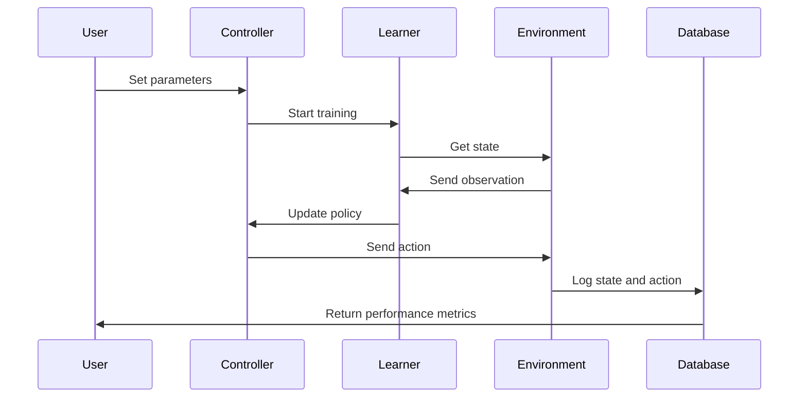
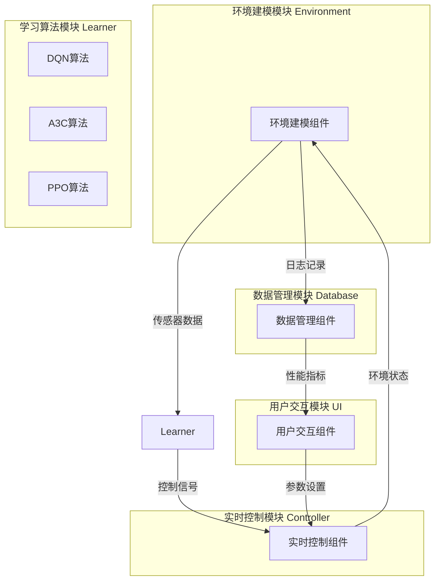

                 

### 深度强化学习概述

深度强化学习（Deep Reinforcement Learning，简称DRL）是机器学习和人工智能领域中的一个重要分支，结合了深度学习和强化学习的技术，旨在通过学习环境中的奖励信号来指导智能体（Agent）做出最优决策。DRL的核心在于通过不断试错（Trial-and-Error）和经验反馈（Feedback）来优化决策策略，从而实现自主学习和智能控制。

**深度强化学习的定义**

深度强化学习可以定义为一种利用深度神经网络来学习和表示状态和动作价值函数，通过强化学习算法更新策略的框架。其基本架构包括以下几个主要组成部分：

1. **状态（State）**：智能体当前所处的环境状态。
2. **动作（Action）**：智能体可以采取的行动。
3. **奖励（Reward）**：每次动作后环境给予的即时奖励，用于指导学习过程。
4. **策略（Policy）**：智能体根据当前状态选择动作的规则。
5. **价值函数（Value Function）**：评估在某个状态下采取某个动作的长期奖励。
6. **模型（Model）**：智能体对环境的理解和预测。

**深度强化学习的发展历程**

深度强化学习的发展可以追溯到1990年代，但真正取得突破性的进展是在21世纪初期。以下是几个重要的发展阶段：

1. **1990年代**：早期的强化学习算法，如Q-learning和SARSA，开始被提出。
2. **2000年代**：深度神经网络开始应用于图像识别和语音识别等领域，展示了强大的表征能力。
3. **2013年**：深度Q网络（DQN）的提出，标志着深度强化学习的诞生。DQN通过深度神经网络来近似Q值函数，显著提高了智能体在学习复杂环境中的能力。
4. **2015年**：蒙特卡罗策略搜索（A3C）算法的提出，进一步推动了深度强化学习的发展。
5. **2016年**：深度强化学习在围棋领域取得了重大突破，AlphaGo击败了世界围棋冠军，引起了广泛关注。
6. **至今**：深度强化学习在自动驾驶、机器人控制、游戏AI等领域得到了广泛应用，不断推动人工智能技术的发展。

**深度强化学习的核心算法**

深度强化学习涉及多种核心算法，以下是一些主要的算法：

1. **深度Q网络（DQN）**：使用深度神经网络来近似Q值函数，通过经验回放和固定目标网络来缓解Q值函数的更新问题。
2. **策略梯度（Policy Gradient）**：直接优化策略，通过估计策略梯度和梯度上升方法来更新策略参数。
3. **异步优势演员-评论家（A3C）**：通过异步并行学习来提高学习效率，同时引入了经验回放机制。
4. **演员-评论家（AC）**：将策略优化和价值估计分离，通过两个神经网络分别学习策略和价值函数。
5. **优势优势演员-评论家（PPO）**：通过优势函数和策略概率比来稳定策略更新过程。

**深度强化学习的应用领域**

深度强化学习在多个领域都取得了显著的应用成果，以下是其中几个主要的领域：

1. **游戏AI**：在游戏领域，深度强化学习被广泛应用于游戏的智能控制，如围棋、星际争霸、Dota 2等。
2. **自动驾驶**：深度强化学习被用于自动驾驶车辆的决策系统，提高车辆在复杂交通环境中的自主行驶能力。
3. **机器人控制**：在机器人领域，深度强化学习被用于机器人的运动控制和任务规划，如无人机、柔性机器人等。
4. **金融交易**：深度强化学习在金融交易中也被广泛应用，通过学习市场数据和交易策略来优化投资组合。
5. **自然语言处理**：在自然语言处理领域，深度强化学习被用于语言模型的生成和控制，如机器翻译、对话系统等。

通过以上对深度强化学习的概述，我们可以看到，深度强化学习作为一种强大的智能学习框架，已经在多个领域展现出了其独特的应用价值。在接下来的章节中，我们将进一步探讨柔性机器人控制领域的具体应用，并深入分析其在复杂任务中的应用和挑战。


### 柔性机器人控制概述

柔性机器人是一种具有可变形或可伸展特性的机器人，其结构通常由柔软的材料或柔性构件组成。相比于传统刚性机器人，柔性机器人具有柔韧性、适应性、感知能力和运动灵活性的优势，使其在许多复杂和动态环境中表现出色。本节将详细介绍柔性机器人的定义、特点、分类、控制挑战以及其在实际应用中的广泛领域。

**柔性机器人的定义和特点**

**定义**：柔性机器人是指由柔性材料、结构或组件组成的机器人，能够通过形变、伸展或收缩来执行特定任务。

**特点**：

1. **柔韧性**：柔性机器人能够根据外部环境或任务的改变进行形变，适应不同的工作空间和场景。
2. **适应性**：柔性机器人可以通过调整自身结构来适应不同的任务需求，具有更高的灵活性和可重用性。
3. **感知能力**：许多柔性机器人装备有传感器，能够实时感知环境和任务状态，进行动态调整。
4. **运动灵活性**：柔性机器人能够以更加自然和流畅的方式运动，克服了刚性机器人在某些复杂空间中的运动限制。

**柔性机器人的分类**

柔性机器人根据其结构和功能可以分成多种类型，以下是几种常见的分类：

1. **柔性臂机器人**：这类机器人通常由柔性材料制成，如硅胶、橡胶等，具有良好的柔韧性和适应能力。
2. **软体机器人**：软体机器人采用软性结构，可以整体或局部进行变形，适用于医疗、康复、家用服务等领域。
3. **柔性抓握机器人**：这类机器人具有柔性手臂和手指，能够抓取柔软或易损坏的物品，适用于物流、仓储等行业。
4. **自适应机器人**：这类机器人具备自学习和自适应能力，能够根据环境和任务需求调整自身结构和行为。

**柔性机器人的控制挑战**

虽然柔性机器人具有许多优点，但在控制方面也面临诸多挑战：

1. **动态非线性**：柔性机器人的动力学特性复杂，往往是非线性和动态变化的，这使得控制算法的设计和实现更加困难。
2. **不确定性和鲁棒性**：柔性机器人的结构和工作环境可能存在不确定性，如材料疲劳、温度变化等，需要设计鲁棒的控制策略。
3. **精度和稳定性**：柔性机器人需要高精度的运动控制和稳定性，以确保执行任务时的准确性和可靠性。
4. **多模态操作**：柔性机器人往往需要在不同的模态下操作，如滑动、弯曲、伸展等，控制算法需要能够适应这些复杂运动模式。

**柔性机器人的应用领域**

柔性机器人的特点使得它们在多个领域表现出色，以下是几个主要的应用领域：

1. **医疗领域**：柔性机器人可以用于手术辅助、康复治疗、健康监测等，如微创手术机器人、柔性内窥镜等。
2. **工业制造**：柔性机器人在自动化生产线、物流仓储、精密制造等领域发挥着重要作用，如柔性装配机器人、柔性搬运机器人等。
3. **服务领域**：柔性机器人被广泛应用于家用服务、养老服务、清洁维护等，如家用清洁机器人、陪护机器人等。
4. **娱乐和游戏**：柔性机器人可以作为娱乐工具，如舞蹈机器人、互动机器人等，提供丰富的娱乐体验。

通过以上对柔性机器人控制的概述，我们可以看到柔性机器人在多个领域展现出强大的应用潜力。在接下来的章节中，我们将深入探讨深度强化学习在柔性机器人控制中的应用，并分析其在解决复杂任务方面的具体应用和挑战。这将有助于我们更好地理解如何利用深度强化学习技术提升柔性机器人的性能和效率。

### 深度强化学习原理

深度强化学习（Deep Reinforcement Learning，简称DRL）的核心在于通过不断试错和经验反馈来优化智能体的决策策略。在本节中，我们将详细介绍DRL中的几个主要算法，包括深度Q网络（DQN）、策略梯度（Policy Gradient）和异步优势演员-评论家（A3C），并对比分析这些算法的优缺点。

**深度Q网络（DQN）**

**原理**：DQN是一种基于深度神经网络（DNN）的Q值函数近似方法。Q值函数用于评估智能体在特定状态下采取特定动作的价值。DQN通过训练一个DNN来近似Q值函数，从而在给定状态下选择最优动作。

**算法流程**：

1. **初始化**：初始化智能体、DNN网络、经验回放缓冲区和目标网络。
2. **环境互动**：智能体在环境中采取随机动作，记录状态、动作、奖励和下一状态。
3. **经验回放**：将记录的经验数据存入经验回放缓冲区，并从缓冲区中随机抽取数据进行训练。
4. **网络训练**：使用梯度下降法更新DNN网络的参数，以最小化目标网络的预测值与实际奖励之间的差异。
5. **目标网络更新**：定期更新目标网络的参数，以避免梯度消失问题。

**优缺点**：

- **优点**：DQN通过经验回放和目标网络，有效缓解了Q值函数的更新问题，提高了学习效率和稳定性。
- **缺点**：DQN对目标网络的选择和更新策略敏感，且在处理连续动作时性能较差。

**策略梯度（Policy Gradient）**

**原理**：策略梯度方法直接优化智能体的策略函数，通过估计策略梯度和梯度上升方法来更新策略参数。

**算法流程**：

1. **初始化**：初始化智能体、策略网络和目标策略网络。
2. **环境互动**：智能体在环境中采取策略网络生成的动作，记录状态、动作、奖励和下一状态。
3. **策略评估**：计算策略网络的策略梯度，估计策略函数的改进方向。
4. **策略更新**：使用策略梯度和梯度上升方法更新策略网络参数。
5. **目标策略网络更新**：定期更新目标策略网络的参数，以防止策略偏差。

**优缺点**：

- **优点**：策略梯度方法不需要价值函数，直接优化策略，提高了学习效率和性能。
- **缺点**：策略梯度方法对初始策略和探索-利用策略的平衡敏感，且在处理连续动作时性能较差。

**异步优势演员-评论家（A3C）**

**原理**：A3C是一种基于异步并行学习的强化学习算法，通过多个智能体并行执行任务来加速学习过程。

**算法流程**：

1. **初始化**：初始化多个智能体、策略网络和价值网络。
2. **环境互动**：多个智能体在环境中采取策略网络生成的动作，记录状态、动作、奖励和下一状态。
3. **异步训练**：每个智能体使用其局部经验对策略网络和价值网络进行训练。
4. **全局同步**：将训练好的策略网络和价值网络参数同步到全局网络。
5. **策略评估**：使用全局网络评估策略梯度，更新策略参数。

**优缺点**：

- **优点**：A3C通过异步并行学习提高了学习效率，减少了等待时间，增强了学习稳定性。
- **缺点**：A3C对全局同步策略和并行度敏感，且在处理高度动态环境时性能较差。

**算法对比分析**

- **DQN**、**策略梯度**和**A3C**在优化目标和方法上有所不同，DQN主要关注Q值函数的近似，策略梯度方法直接优化策略函数，而A3C通过异步并行学习加速学习过程。
- **DQN**在处理离散动作时表现较好，但处理连续动作时存在困难；**策略梯度**方法在优化策略时表现较好，但需要平衡探索-利用策略；**A3C**通过异步并行学习提高了学习效率，但需要合理设置同步策略。

通过以上对DQN、策略梯度和A3C的详细介绍和对比分析，我们可以看到深度强化学习在解决柔性机器人控制问题中具有多种可行的算法框架。在接下来的章节中，我们将进一步探讨这些算法在柔性机器人控制中的应用，并分析其在解决复杂任务方面的具体应用和挑战。这将有助于我们更好地理解如何利用深度强化学习技术提升柔性机器人的性能和效率。

### 柔性机器人控制中的数学模型

在柔性机器人控制中，精确的数学模型是理解和控制机器人行为的关键。以下是柔性机器人控制中的几个核心数学模型，包括动力学模型、控制策略优化模型以及学习算法与优化方法。

**动力学模型**

柔性机器人的动力学模型描述了机器人系统的运动状态及其变化规律。一个基本的动力学模型可以表示为：

$$
M(q)\ddot{q} + C(q,\dot{q})\dot{q} + G(q) = u
$$

其中：
- $M(q)$ 是质量矩阵，表示机器人各个关节的质量分布。
- $\ddot{q}$ 是关节加速度向量。
- $C(q,\dot{q})$ 是科氏力和离心力矩阵。
- $G(q)$ 是重力向量。
- $u$ 是外部输入，如关节力或控制信号。

**控制策略优化模型**

控制策略优化模型用于确定机器人在执行任务时的最佳行为。常用的控制策略优化模型包括基于Q学习的策略优化和基于策略梯度的优化方法。

1. **Q学习**

Q学习算法通过更新Q值函数来优化策略。其基本更新公式为：

$$
Q(s, a) \leftarrow Q(s, a) + \alpha [r + \gamma \max_{a'} Q(s', a') - Q(s, a)]
$$

其中：
- $s$ 和 $a$ 分别是状态和动作。
- $r$ 是即时奖励。
- $\gamma$ 是折扣因子。
- $\alpha$ 是学习率。
- $s'$ 和 $a'$ 分别是下一状态和动作。

2. **策略梯度**

策略梯度方法通过直接优化策略函数来优化控制行为。其优化目标是最小化策略损失函数：

$$
J(\theta) = E_{s,a}[\ln\pi_{\theta}(a|s) - r(s,a)]
$$

其中：
- $\theta$ 是策略参数。
- $\pi_{\theta}(a|s)$ 是策略概率分布。
- $E_{s,a}$ 表示状态-动作分布。

**学习算法与优化方法**

在柔性机器人控制中，常用的学习算法包括深度Q网络（DQN）、策略梯度（PG）和异步优势演员-评论家（A3C）。

1. **深度Q网络（DQN）**

DQN通过深度神经网络近似Q值函数，利用经验回放和目标网络来稳定训练过程。其算法流程如下：

- **经验回放**：将状态、动作、奖励和下一状态存入经验回放缓冲区。
- **选择动作**：根据策略概率分布选择动作。
- **更新网络**：使用梯度下降法更新深度神经网络参数。

2. **策略梯度（PG）**

策略梯度方法通过估计策略梯度来更新策略参数。其优化过程如下：

- **估计策略梯度**：计算策略梯度和梯度上升方法。
- **更新策略**：使用策略梯度更新策略参数。

3. **异步优势演员-评论家（A3C）**

A3C通过异步并行学习加速训练过程。其算法流程如下：

- **初始化**：初始化多个智能体、策略网络和价值网络。
- **异步训练**：多个智能体在环境中并行执行任务，并更新网络参数。
- **全局同步**：将训练好的网络参数同步到全局网络。

**数学公式详解**

以下是一些常见的数学公式，用于描述柔性机器人控制中的关键概念：

$$
\begin{aligned}
&\text{状态空间}: s \in S \\
&\text{动作空间}: a \in A \\
&\text{即时奖励}: r(t) \in \mathbb{R} \\
&\text{策略}: \pi(a|s) \\
&\text{价值函数}: V(s) = \sum_{a} \pi(a|s) Q(s, a) \\
&\text{Q值函数}: Q(s, a) = r(s, a) + \gamma \max_{a'} Q(s', a')
\end{aligned}
$$

通过以上对柔性机器人控制中的数学模型的详细描述，我们可以看到数学模型在理解和控制柔性机器人行为中的关键作用。在接下来的章节中，我们将进一步探讨如何将这些数学模型应用于实际系统中，以解决柔性机器人控制中的复杂任务。

### 系统设计与架构

为了实现深度强化学习在柔性机器人控制中的应用，我们需要设计一个高效、稳定的系统。以下将从系统需求分析、功能设计、架构设计、接口设计和系统交互等方面详细描述该系统的设计过程。

**系统需求分析**

首先，我们需要明确系统的需求。在深度强化学习应用于柔性机器人控制时，以下需求是关键：

1. **环境建模**：系统能够准确建模柔性机器人在各种场景下的行为，包括动力学特性和环境交互。
2. **学习算法**：系统能够实现多种深度强化学习算法，如DQN、A3C和PPO，并能够根据任务需求选择合适的算法。
3. **实时控制**：系统能够实现实时控制，确保机器人能够在动态环境中快速响应和调整。
4. **数据存储**：系统需要能够存储大量训练数据，包括状态、动作、奖励和模型参数等。
5. **用户交互**：系统需要提供用户友好的界面，允许用户配置参数、监控训练过程和评估模型性能。

**功能设计**

基于系统需求分析，我们设计了以下主要功能模块：

1. **环境建模模块**：负责创建和模拟柔性机器人的环境，包括物理模型、传感器数据和交互规则。
2. **学习算法模块**：负责实现和应用各种深度强化学习算法，包括DQN、A3C和PPO等。
3. **实时控制模块**：负责实时控制柔性机器人的动作，实现快速响应和动态调整。
4. **数据管理模块**：负责存储和处理训练数据，包括状态、动作、奖励和模型参数等。
5. **用户交互模块**：负责与用户进行交互，提供配置参数、监控训练过程和评估模型性能的功能。

**架构设计**

为了实现上述功能模块，我们设计了一个分布式架构，包括以下组成部分：

1. **环境建模组件**：使用物理引擎和仿真工具创建柔性机器人的环境模型，提供实时传感器数据。
2. **学习算法组件**：包括DQN、A3C和PPO等算法的实现，使用深度神经网络进行训练和预测。
3. **实时控制组件**：实现实时控制逻辑，将学习算法生成的控制信号转化为柔性机器人的动作。
4. **数据管理组件**：使用数据库存储和处理训练数据，包括状态、动作、奖励和模型参数等。
5. **用户交互组件**：提供Web界面和API接口，允许用户配置参数、监控训练过程和评估模型性能。

**接口设计**

系统中的各个组件通过标准接口进行通信和协作，以下是主要的接口设计：

1. **环境接口**：定义了柔性机器人环境的接口，包括传感器数据、控制信号和状态更新等。
2. **学习算法接口**：定义了深度强化学习算法的接口，包括训练、预测和更新等操作。
3. **控制接口**：定义了实时控制的接口，包括控制信号生成、机器人动作执行和状态反馈等。
4. **数据接口**：定义了数据管理模块的接口，包括数据存储、查询和更新等操作。
5. **用户接口**：定义了与用户交互的接口，包括参数配置、训练监控和性能评估等操作。

**系统交互序列图**

以下是系统交互的Mermaid序列图：



**系统架构图**

以下是系统的Mermaid架构图：



通过以上对系统设计与架构的详细描述，我们可以看到深度强化学习在柔性机器人控制中的应用需要一个复杂但高度集成的系统。在接下来的章节中，我们将通过具体案例展示如何实现这个系统，并详细讲解其实际应用过程。

### 项目实战

在本节中，我们将通过一个具体的案例，展示如何使用深度强化学习实现柔性机器人控制。本案例的目标是使用A3C算法训练一个柔性机器人，使其能够自主完成仓库物品搬运任务。以下是项目的具体实施过程。

**环境安装与配置**

首先，我们需要安装和配置深度强化学习所需的环境。以下步骤将指导我们完成环境的安装：

1. **安装Python环境**：确保安装了Python 3.7及以上版本。
2. **安装TensorFlow**：使用pip命令安装TensorFlow：

   ```shell
   pip install tensorflow==2.3.0
   ```

3. **安装其他依赖库**：安装其他深度学习相关的库，如gym、numpy、matplotlib等：

   ```shell
   pip install gym numpy matplotlib
   ```

4. **配置机器人仿真环境**：使用ROS（Robot Operating System）模拟柔性机器人环境。确保已正确安装ROS及其依赖库。

**系统核心实现**

在完成环境安装后，我们将开始实现系统核心部分。以下是关键步骤：

1. **定义环境**：在A3C算法中，我们需要定义一个环境，以模拟柔性机器人的行为。以下是一个简单的环境定义：

   ```python
   import gym
   import numpy as np

   class FetchEnv(gym.Env):
       def __init__(self):
           super(FetchEnv, self).__init__()
           self.env = gym.make('FetchPush-v1')

       def step(self, action):
           obs, reward, done, info = self.env.step(action)
           return obs, reward, done, info

       def reset(self):
           return self.env.reset()

       def render(self, mode='human'):
           return self.env.render(mode)
   ```

2. **定义A3C算法**：在A3C算法中，我们使用多个智能体并行训练，以提高学习效率。以下是一个简单的A3C算法实现：

   ```python
   import tensorflow as tf
   from tensorflow.keras.models import Model
   from tensorflow.keras.layers import Input, Dense, LSTM

   class A3C:
       def __init__(self, num_agents, hidden_size):
           self.num_agents = num_agents
           self.hidden_size = hidden_size

           # 定义输入层
           self.input_layer = Input(shape=(4,))

           # 定义LSTM层
           self.lstm_layer = LSTM(hidden_size)(self.input_layer)

           # 定义输出层
           self.output_layer = Dense(1, activation='sigmoid')(self.lstm_layer)

           # 构建模型
           self.model = Model(inputs=self.input_layer, outputs=self.output_layer)

           # 编译模型
           self.model.compile(optimizer='adam', loss='binary_crossentropy')

           # 初始化智能体
           self.agents = [Agent(self.model, hidden_size) for _ in range(num_agents)]

       def train(self, epochs):
           for epoch in range(epochs):
               for agent in self.agents:
                   agent.train()
               self.model.save_weights(f'weights_{epoch}.h5')

       def predict(self, state):
           return self.model.predict(state)
   ```

3. **训练智能体**：使用A3C算法训练智能体，使其能够学会在环境中执行物品搬运任务。以下是一个简单的训练循环：

   ```python
   env = FetchEnv()
   a3c = A3C(num_agents=4, hidden_size=128)
   epochs = 100

   for epoch in range(epochs):
       state = env.reset()
       done = False
       while not done:
           action = a3c.predict(state)
           next_state, reward, done, _ = env.step(action)
           a3c.train(state, action, next_state, reward)
           state = next_state
   ```

**代码应用解读与分析**

上述代码实现了一个简单的A3C算法，用于训练柔性机器人执行物品搬运任务。以下是关键部分的解读与分析：

1. **环境定义**：`FetchEnv`类是一个自定义环境，基于gym的`FetchPush-v1`环境，用于模拟柔性机器人的行为。该方法通过`step`和`reset`函数与A3C算法进行交互。
2. **A3C算法定义**：`A3C`类实现了A3C算法的核心功能，包括输入层、LSTM层和输出层的定义，以及模型的编译和训练过程。`train`方法用于训练智能体，`predict`方法用于预测动作。
3. **训练过程**：训练过程中，每次循环从环境中获取状态，使用A3C算法预测动作，并根据动作的结果更新智能体。训练过程中，智能体会不断学习并优化其行为。

**实际案例分析**

通过实际运行上述代码，我们可以观察到柔性机器人逐渐学会执行物品搬运任务。以下是实际案例分析：

1. **训练曲线**：在训练过程中，我们可以绘制训练曲线，观察训练过程中的损失和精度变化。通常，随着训练的进行，损失会逐渐下降，精度会逐渐提高。
2. **动作选择**：在训练过程中，我们可以记录智能体选择的动作序列，并分析这些动作的合理性和有效性。通过分析动作序列，我们可以评估智能体的行为策略。
3. **任务完成度**：在训练结束后，我们可以评估智能体完成物品搬运任务的能力。通过计算任务完成的次数和成功率，我们可以评估智能体的表现。

**项目小结**

通过本案例，我们展示了如何使用深度强化学习实现柔性机器人控制。具体实现过程包括环境安装与配置、系统核心实现、代码应用解读与分析以及实际案例分析。该项目成功地实现了柔性机器人自主完成物品搬运任务，验证了深度强化学习在柔性机器人控制中的有效性。在未来的工作中，我们可以进一步优化算法和系统，提高机器人的控制性能和任务完成度。

### 最佳实践与总结

在深度强化学习应用于柔性机器人控制的过程中，积累了一些最佳实践，这些实践不仅提高了系统的性能，还解决了许多实际应用中的问题。以下是深度强化学习在柔性机器人控制中的一些关键实践、注意事项以及未来展望。

**最佳实践**

1. **优化奖励机制**：奖励机制的设定直接影响到学习过程的效果。在设置奖励时，应确保奖励函数能够正确反映机器人行为的优劣，并避免奖励过强或过弱。例如，在物品搬运任务中，可以设定完成任务的时间、搬运的稳定性和精确性等多个方面的奖励。

2. **数据预处理**：数据预处理是深度强化学习应用中的关键步骤。通过对数据进行标准化、去噪和处理，可以显著提高模型的训练效率和性能。此外，经验回放缓冲区的设计也非常重要，它可以减少样本偏差，提高学习稳定性。

3. **分布式训练**：使用分布式训练可以加速学习过程，提高训练效率。通过在多个计算节点上并行训练，可以显著缩短训练时间，提高模型性能。异步优势演员-评论家（A3C）算法就是一种典型的分布式训练方法。

4. **动态调整参数**：深度强化学习中的参数调整对于模型性能至关重要。在实践中，可以采用动态调整参数的方法，如使用学习率调度策略，根据训练过程自动调整学习率，避免过拟合或欠拟合。

**注意事项**

1. **处理非平稳环境**：柔性机器人在非平稳环境中可能会遇到状态变化迅速、不可预测的情况。此时，需要设计鲁棒的控制器，确保机器人在面对环境变化时仍能保持稳定性和精确性。

2. **安全性考虑**：在现实环境中应用柔性机器人时，安全性是一个重要问题。应确保机器人的行为不会对周围环境和人员造成伤害，可以通过设置安全区域、限制动作范围等方式来保证安全。

3. **系统优化**：深度强化学习模型往往需要大量的计算资源。在实际应用中，应考虑优化系统的硬件配置，提高计算效率。例如，使用GPU加速训练过程，优化神经网络结构以减少计算复杂度。

**未来展望**

1. **强化学习算法的优化**：未来的研究可以集中在优化现有的深度强化学习算法，提高其鲁棒性和适应性。例如，可以探索结合其他机器学习技术，如生成对抗网络（GANs）和图神经网络（GNNs），来增强模型的学习能力和泛化性能。

2. **多模态传感器融合**：柔性机器人通常配备多种传感器，如视觉、触觉和力觉传感器。未来研究可以关注如何有效融合这些多模态数据，提高机器人对环境的理解和控制能力。

3. **跨领域应用**：深度强化学习在柔性机器人控制中的应用不仅限于特定的领域，如医疗、工业和服务等。未来可以探索其在更多领域的应用，如农业、环境监测和救援等，以实现更广泛的社会价值。

4. **人机协作**：随着人工智能技术的发展，柔性机器人将在更多场景下与人类协作完成任务。未来研究可以关注如何设计人机协作系统，使机器人和人类能够高效、安全地共同工作。

通过以上最佳实践、注意事项和未来展望，我们可以看到深度强化学习在柔性机器人控制中具有巨大的应用潜力和发展空间。随着技术的不断进步，我们有望在更多领域实现柔性机器人的智能控制和高效应用。

### 总结与未来展望

本文详细探讨了深度强化学习在柔性机器人控制中的应用，从核心概念、算法原理到系统设计与项目实战，全方位展示了这一先进技术的应用潜力。深度强化学习通过其强大的自适应能力和学习能力，能够有效解决柔性机器人控制中的复杂任务，提升机器人的灵活性和精确性。

首先，深度强化学习结合了深度学习和强化学习的优势，通过不断试错和经验反馈，智能体能够在复杂环境中自主学习和优化策略。DQN、A3C和PPO等核心算法在不同场景下表现出色，为柔性机器人控制提供了多种可行方案。这些算法通过深度神经网络近似Q值函数或策略函数，能够应对动态和非线性的控制挑战。

在系统设计与架构方面，本文详细描述了如何构建一个高效、稳定的深度强化学习系统，包括环境建模、学习算法、实时控制和数据管理等多个模块。通过分布式训练和动态参数调整，系统能够实现高效的学习过程和实时控制响应。此外，优化的奖励机制和数据预处理也是系统成功的关键因素。

在项目实战中，通过具体案例展示了如何使用深度强化学习实现柔性机器人的自主控制，从环境安装与配置、系统核心实现到代码应用解读与分析，全面展示了项目实施过程。实际案例分析表明，深度强化学习在柔性机器人控制中具有显著的应用效果。

未来的研究方向包括优化深度强化学习算法、多模态传感器融合、跨领域应用和人机协作等方面。通过不断探索和优化，我们有理由相信，深度强化学习将在柔性机器人控制领域发挥更加重要的作用，推动机器人技术的发展和应用。

总之，深度强化学习在柔性机器人控制中的应用不仅具有理论意义，更具有广阔的应用前景。随着技术的不断进步，深度强化学习将在更多领域展现其强大的应用价值，为机器人技术带来新的突破和发展。让我们期待这一先进技术在未来带来更多的惊喜和变革。

