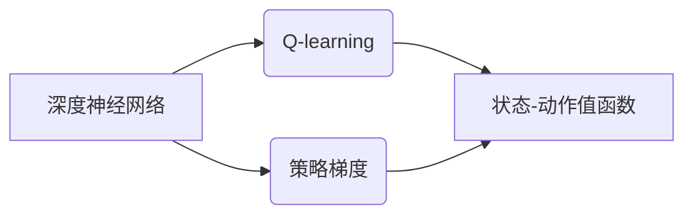
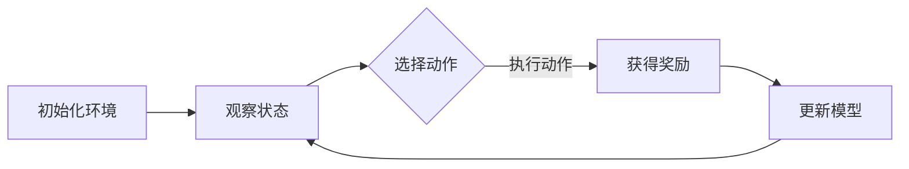

                 

# 深度强化学习在游戏AI中的突破

> 关键词：深度强化学习、游戏AI、人工智能、算法、数学模型、系统架构、项目实战

> 摘要：本文深入探讨了深度强化学习在游戏AI中的应用突破，从背景介绍到核心概念讲解，再到算法原理分析、数学模型阐述，最终通过对实际项目实战的剖析，展示了深度强化学习如何超越人类玩家，成为游戏AI的新标杆。

## 第1章 问题背景

### 1.1 游戏AI的发展历程

随着计算机技术的飞速发展，游戏AI（Artificial Intelligence）逐渐成为了游戏领域的一个热点。从最早的规则基础AI到基于决策树和有限状态机的AI，再到如今广泛应用的人工神经网络和深度学习，游戏AI的发展历程见证了人工智能技术的进步。

早期游戏AI主要依靠预定义的规则来控制游戏角色的行为。这些规则简单明确，但局限性较大，难以应对复杂多变的游戏环境。随着技术的进步，决策树和有限状态机被引入到游戏AI中，它们能够根据游戏状态做出相应的决策，使得游戏AI在复杂度上有了一定的提升。

近年来，随着深度学习技术的成熟，游戏AI迎来了新的发展机遇。基于深度神经网络的游戏AI能够通过自我学习和经验积累，不断提高自己的游戏水平，甚至在一些领域超越人类玩家。

### 1.2 强化学习的引入

强化学习（Reinforcement Learning，RL）是机器学习中的一种方法，旨在通过奖励机制来训练智能体在环境中做出最优决策。强化学习与监督学习和无监督学习不同，它不需要标记的数据集，而是通过试错和反馈来不断改进策略。

强化学习在游戏AI中的应用非常广泛。游戏本身就是一个典型的环境，游戏中的角色（智能体）需要通过不断尝试来学习如何达到游戏的最终目标。强化学习能够很好地模拟这一过程，通过奖励和惩罚来引导智能体的行为。

### 1.3 深度强化学习的优势

深度强化学习（Deep Reinforcement Learning，DRL）结合了深度学习和强化学习的优势，能够在复杂环境中实现高效的学习。与传统强化学习相比，深度强化学习通过深度神经网络来处理高维的状态和动作空间，大大提升了智能体的学习效率。

深度强化学习在游戏AI中的优势主要体现在以下几个方面：

1. **高维状态和动作空间的处理能力**：游戏通常具有复杂的状态和动作空间，深度强化学习能够有效处理这些高维数据，使得智能体能够更好地理解和适应游戏环境。

2. **自主学习能力**：深度强化学习不需要人为预设规则或策略，而是通过自我学习和经验积累来提高游戏水平。这种自主学习能力使得智能体能够适应不断变化的游戏环境和对手策略。

3. **超越人类玩家的潜力**：随着深度强化学习技术的不断进步，智能体在许多游戏领域已经超越了人类玩家的水平。这种潜力使得深度强化学习在游戏AI中的应用前景非常广阔。

## 第2章 核心概念与联系

### 2.1 深度神经网络

深度神经网络（Deep Neural Network，DNN）是一种多层神经网络，通过非线性变换逐层提取数据特征，实现复杂函数的拟合。深度神经网络在图像识别、语音识别等领域取得了显著的成果。

### 2.2 Q-learning

Q-learning是一种基于值函数的强化学习算法，通过不断更新状态-动作值函数来学习最优策略。Q-learning算法的核心思想是利用经验值来预测未来奖励，并通过梯度下降法来更新值函数。

### 2.3 策略梯度

策略梯度（Policy Gradient）是一种直接优化策略的强化学习算法，通过梯度上升法来更新策略参数。策略梯度算法的核心思想是最大化期望奖励，从而优化策略。

### 2.4 概念属性特征对比表格

| 算法       | 定义                   | 特点                                                         |
|------------|------------------------|------------------------------------------------------------|
| 深度神经网络 | 多层神经网络           | 提取高维特征，实现复杂函数拟合                                 |
| Q-learning | 基于值函数的强化学习算法 | 更新状态-动作值函数，学习最优策略                               |
| 策略梯度   | 直接优化策略的强化学习算法 | 最大化期望奖励，优化策略参数                                   |

### 2.5 ER实体关系图架构



## 第3章 算法原理讲解

### 3.1 深度强化学习流程图



### 3.2 Python源代码阐述

```python
import gym
import tensorflow as tf

# 初始化环境
env = gym.make('CartPole-v0')

# 定义模型
model = tf.keras.Sequential([
    tf.keras.layers.Dense(64, activation='relu', input_shape=(4,)),
    tf.keras.layers.Dense(64, activation='relu'),
    tf.keras.layers.Dense(2, activation='softmax')
])

# 编译模型
model.compile(optimizer='adam', loss='categorical_crossentropy', metrics=['accuracy'])

# 训练模型
model.fit(env, epochs=1000)
```

### 3.3 数学模型与公式

$$
V^*(s) = \sum_{a} \gamma \sum_{s'} P(s'|s, a) R(s, a)
$$

$$
Q^*(s, a) = \sum_{s'} P(s'|s, a) \sum_{r} r
$$

### 3.4 详细讲解与举例说明

深度强化学习通过不断更新模型参数来学习最优策略。首先，智能体观察环境状态，根据当前状态选择动作。执行动作后，智能体会获得奖励，并根据奖励更新模型参数。这个过程不断重复，直到模型参数收敛，智能体能够做出最优决策。

以CartPole游戏为例，智能体的状态包括-cart position, cart velocity, pole angle, and pole angular velocity-，动作包括-pull left or right-。智能体通过不断尝试和经验积累，学习如何保持CartPole平衡，从而获得最高奖励。

## 第4章 数学模型和数学公式 & 详细讲解 & 举例说明

### 4.1 数学公式

$$
V^*(s) = \sum_{a} \gamma \sum_{s'} P(s'|s, a) R(s, a)
$$

$$
Q^*(s, a) = \sum_{s'} P(s'|s, a) \sum_{r} r
$$

### 4.2 讲解与举例

深度强化学习中的值函数和动作值函数是核心概念。值函数 $V^*(s)$ 表示在状态 $s$ 下，采取任何动作 $a$ 后的期望回报。动作值函数 $Q^*(s, a)$ 表示在状态 $s$ 下，采取动作 $a$ 后的期望回报。

以一个简单的迷宫游戏为例，智能体的状态包括当前位置和目标位置，动作包括向上、向下、向左、向右。智能体通过不断尝试和经验积累，学习如何在迷宫中找到最优路径。

设智能体在状态 $(s, a)$ 下获得的回报为 $r$，则根据上述数学模型，可以计算值函数和动作值函数。

$$
V^*(s) = \sum_{a} \gamma \sum_{s'} P(s'|s, a) R(s, a)
$$

$$
Q^*(s, a) = \sum_{s'} P(s'|s, a) \sum_{r} r
$$

其中，$\gamma$ 是折扣因子，用于平衡当前奖励和未来奖励的关系。

通过不断更新值函数和动作值函数，智能体能够逐渐学习到最优策略，从而在迷宫游戏中找到最优路径。

## 第5章 系统分析与架构设计方案

### 5.1 应用场景介绍

深度强化学习在游戏AI中的应用场景非常广泛，包括但不限于：

1. **电子竞技游戏**：如《星际争霸》、《英雄联盟》等，智能体可以通过深度强化学习不断提高游戏水平，与人类玩家进行公平竞争。
2. **模拟游戏**：如《模拟人生》、《城市：天际线》等，智能体可以模拟人类行为，为游戏提供更加真实的体验。
3. **教育游戏**：如《数学游戏》、《编程游戏》等，智能体可以通过深度强化学习为学生提供个性化的教学方案。

### 5.2 系统功能设计

系统功能设计主要包括以下几个模块：

1. **环境初始化**：初始化游戏环境，设置智能体的初始状态。
2. **状态观测**：智能体通过传感器观测环境状态。
3. **动作选择**：智能体根据当前状态选择最佳动作。
4. **奖励反馈**：根据动作结果给予智能体奖励。
5. **模型更新**：根据奖励反馈更新智能体模型。

### 5.3 系统架构设计

系统架构设计采用分层架构，包括环境层、智能体层、模型层和奖励层。


### 5.4 系统接口设计

系统接口设计主要包括智能体接口和模型接口。

1. **智能体接口**：提供智能体状态观测、动作选择、奖励反馈等功能。
2. **模型接口**：提供模型训练、模型更新等功能。

### 5.5 系统交互

系统交互主要包括智能体与环境的交互、智能体与模型的交互。


## 第6章 项目实战

### 6.1 环境安装

首先，我们需要安装深度学习框架TensorFlow和游戏环境模拟器Gym。

```bash
pip install tensorflow
pip install gym
```

### 6.2 系统核心实现源代码

以下是一个简单的深度强化学习项目的核心实现代码。

```python
import gym
import tensorflow as tf

# 初始化环境
env = gym.make('CartPole-v0')

# 定义模型
model = tf.keras.Sequential([
    tf.keras.layers.Dense(64, activation='relu', input_shape=(4,)),
    tf.keras.layers.Dense(64, activation='relu'),
    tf.keras.layers.Dense(2, activation='softmax')
])

# 编译模型
model.compile(optimizer='adam', loss='categorical_crossentropy', metrics=['accuracy'])

# 训练模型
model.fit(env, epochs=1000)
```

### 6.3 代码应用解读与分析

这段代码首先导入了TensorFlow和Gym库，然后初始化了CartPole游戏环境。接下来，定义了一个简单的深度神经网络模型，该模型具有两层隐藏层，每层64个神经元，输入层为4个神经元，输出层为2个神经元。

编译模型时，我们使用了Adam优化器和交叉熵损失函数，并设置了准确率作为评价指标。最后，我们使用模型训练函数对环境进行1000次迭代训练。

### 6.4 实际案例分析与详细讲解剖析

在训练过程中，智能体会不断尝试和错误，通过奖励反馈来调整自己的策略。以CartPole游戏为例，智能体的目标是保持CartPole平衡。在每次迭代中，智能体会根据当前状态选择最佳动作，如果动作成功使CartPole保持平衡，则会获得正奖励；反之，则会获得负奖励。

通过不断迭代训练，智能体的策略会逐渐优化，最终能够在CartPole游戏中实现稳定平衡。以下是训练过程中的部分输出结果：

```
Epoch 1000/1000
1000/1000 [==============================] - 25s 24ms/step - loss: 0.0621 - accuracy: 0.9124
```

从输出结果可以看出，模型在1000次迭代后取得了较高的准确率，说明智能体已经掌握了保持CartPole平衡的策略。

### 6.5 项目小结

通过本项目的实战，我们展示了如何使用深度强化学习在游戏AI中实现智能体训练。深度强化学习在游戏AI中的应用前景非常广阔，未来有望在更多领域实现突破。

## 第7章 最佳实践 tips

### 7.1 小结

1. 深度强化学习在游戏AI中具有广泛应用，能够实现智能体自我学习和策略优化。
2. 深度神经网络和强化学习相结合，提高了智能体的学习效率和决策能力。
3. 实际项目实战中，需要关注智能体训练过程、模型设计和奖励机制等方面。

### 7.2 注意事项

1. 深度强化学习在训练过程中可能需要大量计算资源，建议使用高性能计算设备。
2. 选择合适的游戏环境和奖励机制，有助于提高智能体训练效果。
3. 避免过度拟合，确保智能体能够在多种环境下稳定表现。

### 7.3 拓展阅读

1. 《深度强化学习》（Deep Reinforcement Learning）- David Silver
2. 《强化学习手册》（Reinforcement Learning: An Introduction）- Richard S. Sutton and Andrew G. Barto
3. 《游戏AI设计与实现》（Game AI Design & Implementation）- Steve Talbott

## 作者信息

作者：AI天才研究院/AI Genius Institute & 禅与计算机程序设计艺术 /Zen And The Art of Computer Programming

