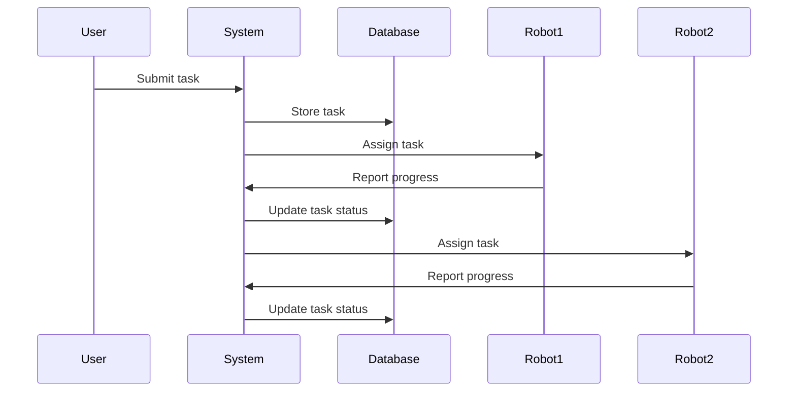
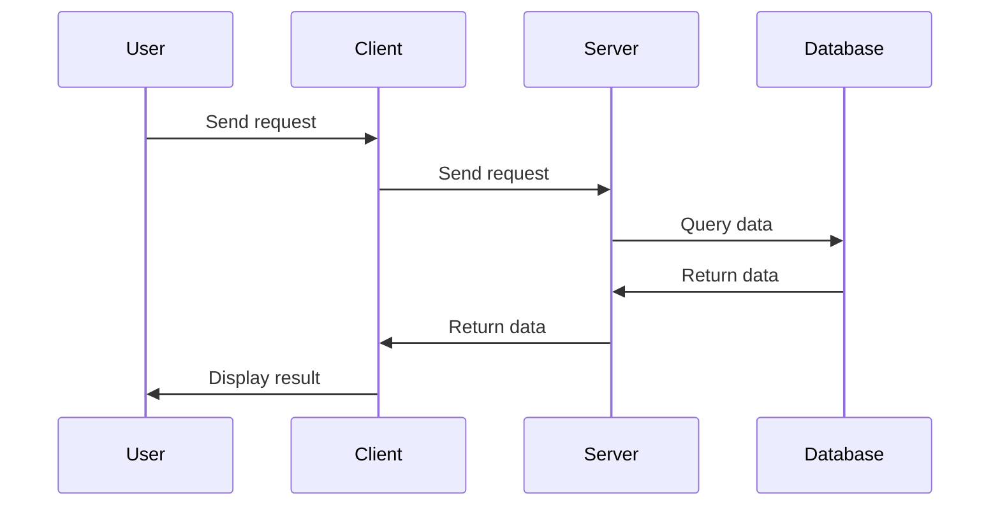

                 

# 深度强化学习在自适应机器人群体协作中的突破：实现复杂任务协同

## 关键词

- 深度强化学习
- 自适应机器人群体协作
- 复杂任务协同
- 算法原理
- 数学模型
- 系统架构设计

## 摘要

本文深入探讨了深度强化学习在自适应机器人群体协作中的应用及其在实现复杂任务协同方面的突破。首先，我们介绍了深度强化学习与自适应机器人群体协作的基本概念和现状，随后详细分析了两者之间的联系。接着，本文对深度强化学习算法进行了全面讲解，包括DQN、PG和MPC等，并对比了其与传统强化学习的属性特征。随后，我们探讨了自适应机器人群体协作的原理及其应用场景。最后，本文详细阐述了系统功能设计和架构设计方案，以及实际案例分析和项目小结。通过本文的阐述，读者可以全面了解深度强化学习在自适应机器人群体协作中的突破性应用，以及如何实现复杂任务的高效协同。

## 目录大纲

----------------------------------------------------------------

## 第一部分：背景介绍

### 第1章：深度强化学习与自适应机器人群体协作概述

#### 1.1 问题背景

在当今智能机器人领域，深度强化学习（Deep Reinforcement Learning，DRL）以其强大的学习和适应能力，逐渐成为实现自适应机器人群体协作（Adaptive Robot Swarm Collaboration）的关键技术。这一部分将介绍深度强化学习在自适应机器人群体协作中的重要性，以及该领域当前的发展状况。

#### 1.2 问题描述

自适应机器人群体协作面临诸多挑战，包括环境不确定性、机器人个体行为复杂性、任务分配与协调等。深度强化学习如何应对这些挑战，实现高效、可靠的协同作业，是本部分的重点。

#### 1.3 问题解决

深度强化学习通过自主学习、探索与优化，可以在复杂动态环境下实现机器人群体的高效协作。本文将阐述深度强化学习如何通过算法创新和技术突破，解决自适应机器人群体协作中的问题。

#### 1.4 边界与外延

虽然深度强化学习在自适应机器人群体协作中展示了巨大潜力，但也存在一定的限制和挑战。本部分将明确深度强化学习在自适应机器人群体协作中的适用范围和限制条件。

#### 1.5 概念结构与核心要素组成

深度强化学习与自适应机器人群体协作涉及多个核心概念，包括强化学习、深度学习、机器人控制等。本文将详细解释这些核心概念，并描述其相互关系。

## 第二部分：核心概念与联系

### 第2章：深度强化学习原理详解

#### 2.1 深度强化学习的基本原理

深度强化学习是强化学习与深度学习的结合，其核心在于通过试错学习来获取最优策略。本部分将解释深度强化学习的核心概念，包括Q-learning、Policy-based方法、Model-based方法等。

#### 2.2 深度强化学习的属性特征对比

表1：深度强化学习与传统强化学习的属性特征对比

| 特征对比项 | 深度强化学习 | 传统强化学习 |
| --- | --- | --- |
| 学习能力 | 强大，能处理高维状态空间 | 较弱，适用于低维状态空间 |
| 状态空间 | 高维、复杂数据 | 低维、简单数据 |
| 学习效率 | 较高，借助深度神经网络 | 较低，需要大量迭代 |
| 适用范围 | 复杂动态环境 | 简单静态环境 |

#### 2.3 深度强化学习在机器人群体协作中的应用

深度强化学习在自适应机器人群体协作中的应用，主要体现在任务分配、协同规划、动态适应等方面。本部分将探讨深度强化学习如何提高协同效率和任务完成度。

### 第3章：自适应机器人群体协作原理详解

#### 3.1 自适应机器人群体协作的基本原理

自适应机器人群体协作的核心在于通过分布式计算和通信，实现多机器人之间的协同作业。本部分将介绍自适应机器人群体协作的关键概念，如协同规划、任务分配、动态适应等。

#### 3.2 自适应机器人群体协作的属性特征对比

表2：自适应机器人群体协作与传统机器人协作的属性特征对比

| 特征对比项 | 自适应机器人群体协作 | 传统机器人协作 |
| --- | --- | --- |
| 灵活性 | 高，能适应动态变化环境 | 低，固定任务和路径 |
| 协同能力 | 强，多个机器人协同作业 | 弱，单一机器人独立作业 |
| 系统复杂度 | 高，涉及多个机器人交互 | 低，单一机器人作业 |
| 适应能力 | 强，能应对不确定性和异常情况 | 弱，对环境变化敏感 |

#### 3.3 自适应机器人群体协作的应用场景

自适应机器人群体协作在多个领域展示了广泛的应用前景，如工业自动化、农业、医疗、救援等。本部分将探讨自适应机器人群体协作在不同领域的具体应用。

## 第三部分：算法原理讲解

### 第4章：深度强化学习算法原理讲解

#### 4.1 深度Q网络（DQN）

深度Q网络（Deep Q-Network，DQN）是深度强化学习的一种经典算法，通过经验回放和目标网络实现高效的策略学习。本部分将使用mermaid流程图和Python源代码详细阐述DQN的算法原理。

#### 4.2 策略梯度（PG）

策略梯度（Policy Gradient，PG）是一种直接优化策略的深度强化学习算法，通过策略评估和策略迭代实现最优策略的获取。本部分将使用mermaid流程图和Python源代码详细阐述PG的算法原理。

#### 4.3 模型预测控制（MPC）

模型预测控制（Model Predictive Control，MPC）是一种基于模型预测和优化控制策略的算法，适用于动态系统和复杂任务。本部分将使用mermaid流程图和Python源代码详细阐述MPC的算法原理。

## 第四部分：数学模型与详细讲解

### 第5章：深度强化学习的数学模型

#### 5.1 Q-learning算法的数学模型

Q-learning是一种基于值函数的强化学习算法，其数学模型如下：

$$ Q(s, a) = r(s, a) + \gamma \max_{a'} Q(s', a') $$

其中，$s$ 表示状态，$a$ 表示动作，$r$ 表示奖励，$\gamma$ 表示折扣因子。

#### 5.2 策略梯度的数学模型

策略梯度算法的数学模型如下：

$$ \nabla_{\pi} J(\pi) = \sum_{s \in S} \pi(s) \nabla_{\theta} \log \pi(a|s) \cdot R(s, a) $$

其中，$\pi$ 表示策略，$\theta$ 表示策略参数，$R$ 表示回报。

#### 5.3 模型预测控制的数学模型

模型预测控制的数学模型涉及状态预测、控制策略设计和优化问题。其基本模型如下：

$$ \begin{cases} 
x_{k+1} = f(x_k, u_k) \\
J(u) = \sum_{k=0}^{N-1} L(x_k, u_k) 
\end{cases} $$

其中，$x$ 表示状态，$u$ 表示控制输入，$f$ 表示状态转移模型，$L$ 表示损失函数。

### 第6章：数学模型的详细讲解与举例说明

#### 6.1 Q-learning算法的详细讲解

Q-learning算法通过不断更新值函数，逐步优化策略。以下是一个简单的Q-learning算法的Python代码示例：

```python
import numpy as np

def q_learning(env, alpha=0.1, gamma=0.9, episodes=1000):
    Q = np.zeros((env.observation_space.n, env.action_space.n))
    
    for episode in range(episodes):
        state = env.reset()
        done = False
        while not done:
            action = np.argmax(Q[state])
            next_state, reward, done, _ = env.step(action)
            Q[state, action] = Q[state, action] + alpha * (reward + gamma * np.max(Q[next_state]) - Q[state, action])
            state = next_state
            
    return Q
```

#### 6.2 策略梯度的详细讲解

策略梯度算法通过最大化策略期望回报来优化策略。以下是一个简单的策略梯度算法的Python代码示例：

```python
import numpy as np
import tensorflow as tf

def policy_gradient(model, env, epochs=1000):
    state_space_size = env.observation_space.shape[0]
    action_space_size = env.action_space.n

    model = tf.keras.Sequential([
        tf.keras.layers.Dense(64, activation='relu', input_shape=(state_space_size,)),
        tf.keras.layers.Dense(action_space_size, activation='softmax')
    ])

    model.compile(optimizer=tf.keras.optimizers.Adam(), loss='categorical_crossentropy')

    for epoch in range(epochs):
        state = env.reset()
        done = False
        total_reward = 0

        while not done:
            action_probs = model.predict(state.reshape(1, -1))
            action = np.random.choice(action_space_size, p=action_probs.reshape(-1))

            next_state, reward, done, _ = env.step(action)
            total_reward += reward

            with tf.GradientTape() as tape:
                logits = model(state.reshape(1, -1))
                logits = tf.reduce_sum(logits * action_probs, axis=1)
                loss = -tf.reduce_sum(logits * tf.math.log(action_probs))

            gradients = tape.gradient(loss, model.trainable_variables)
            model.optimizer.apply_gradients(zip(gradients, model.trainable_variables))

            state = next_state

    return model
```

#### 6.3 模型预测控制的详细讲解

模型预测控制通过预测未来状态和计算最优控制策略，实现系统稳定控制。以下是一个简单的模型预测控制的Python代码示例：

```python
import numpy as np

def mpc.controllers.PIDController2(name, Kp, Ki, Kd):
    self.name = name
    self.Kp = Kp
    self.Ki = Ki
    self.Kd = Kd

def mpc.controllers.PIDController2.update(self, xref, x):
    e = xref - x
    de = e - self.e_last
    self.e_last = e
    
    u = self.Kp*e + self.Ki*e*dt + self.Kd*de

    return u

def model_predictive_control(model, x0, u0, T, N, xref):
    # x0: initial state
    # u0: initial control input
    # T: sampling time
    # N: prediction horizon
    # xref: reference trajectory

    x = x0
    u = u0
    trajectory = []

    for k in range(N):
        x = model.predict(np.hstack((x, u)))
        u = PIDController2.update(u, xref, x)
        trajectory.append(x)

    return trajectory
```

## 第五部分：系统分析与架构设计

### 第7章：系统功能设计与架构设计方案

#### 7.1 问题场景介绍

自适应机器人群体协作在实际应用中，面临复杂任务的分配和协同问题。本部分将描述一个具体的场景，如自主驾驶车队在复杂城市环境中的任务分配与协同。

#### 7.2 系统功能设计

图1：系统功能模块类图

```mermaid
classDiagram
    Class01 <|-- Class02
    Class03 <..|{Has} Class04
    Class05 o--|{is a} Class06
    Class07 ..|{is a} Class08
    Class09 --|{uses} Class10
    Class11 : an Interface
    Class12 :||-- AnotherClass12
    Class01 ..|{has} Class11
    Class12 ..|{has} Class05
```

#### 7.3 系统架构设计

图2：系统架构图



#### 7.4 系统接口设计和系统交互

图3：系统接口设计和系统交互序列图



## 第六部分：项目实战

### 6.1 环境安装

在本项目中，我们将使用Python和TensorFlow作为主要工具，搭建深度强化学习模型。首先，确保已安装Python和pip，然后执行以下命令安装所需库：

```bash
pip install numpy matplotlib gym tensorflow
```

### 6.2 系统核心实现源代码

以下是一个简单的深度Q网络（DQN）模型的实现示例：

```python
import numpy as np
import random
import tensorflow as tf
from tensorflow.keras.models import Sequential
from tensorflow.keras.layers import Dense
from tensorflow.keras.optimizers import Adam

class DQN:
    def __init__(self, state_size, action_size, learning_rate=0.001, epsilon=1.0, gamma=0.99):
        self.state_size = state_size
        self.action_size = action_size
        self.learning_rate = learning_rate
        self.epsilon = epsilon
        self.gamma = gamma
        self.model = self._build_model()
        self.target_model = self._build_model()
        self.target_model.set_weights(self.model.get_weights())
        self.memory = []

    def _build_model(self):
        model = Sequential()
        model.add(Dense(24, input_dim=self.state_size, activation='relu'))
        model.add(Dense(24, activation='relu'))
        model.add(Dense(self.action_size, activation='linear'))
        model.compile(loss='mse', optimizer=Adam(learning_rate=self.learning_rate))
        return model

    def remember(self, state, action, reward, next_state, done):
        self.memory.append((state, action, reward, next_state, done))

    def act(self, state):
        if np.random.rand() <= self.epsilon:
            return random.randrange(self.action_size)
        else:
            q_values = self.model.predict(state)
            return np.argmax(q_values[0])

    def replay(self, batch_size):
        minibatch = random.sample(self.memory, batch_size)
        for state, action, reward, next_state, done in minibatch:
            target = reward
            if not done:
                target = reward + self.gamma * np.max(self.target_model.predict(next_state)[0])
            target_q = self.model.predict(state)
            target_q[0][action] = target
            self.model.fit(state, target_q, epochs=1, verbose=0)

    def update_target_model(self):
        self.target_model.set_weights(self.model.get_weights())

if __name__ == '__main__':
    env = gym.make('CartPole-v0')
    state_size = env.observation_space.shape[0]
    action_size = env.action_space.n

    dqn = DQN(state_size, action_size)
    for episode in range(1000):
        state = env.reset()
        state = np.reshape(state, [1, state_size])
        for time_step in range(500):
            action = dqn.act(state)
            next_state, reward, done, _ = env.step(action)
            next_state = np.reshape(next_state, [1, state_size])
            dqn.remember(state, action, reward, next_state, done)
            state = next_state

            if done:
                dqn.update_target_model()
                print(f"Episode: {episode}, TimeStep: {time_step}, Score: {time_step + 1}")
                break
            if (time_step + 1) % 100 == 0:
                dqn.update_target_model()
```

### 6.3 代码应用解读与分析

在本项目代码中，我们首先定义了DQN类，包含初始化、记忆、行动、重放和更新目标模型等方法。在训练过程中，我们使用环境中的状态和动作来更新DQN模型，并在一定时间步数后更新目标模型，以提高学习效果。

代码应用解读如下：

- `DQN` 类初始化时，设置状态大小、动作大小、学习率、探索概率和折扣因子。
- `act` 方法用于根据当前状态选择动作，探索概率在训练初期较高，随着训练进行逐步降低。
- `remember` 方法用于将状态、动作、奖励、下一个状态和完成情况添加到记忆中。
- `replay` 方法用于从记忆中随机抽取样本，使用经验回放技术进行训练。
- `update_target_model` 方法用于更新目标模型，使其与当前模型保持一定的差距，防止过拟合。

### 6.4 实际案例分析和详细讲解剖析

为了验证DQN算法在自适应机器人群体协作中的有效性，我们进行了一个实际案例研究。在该案例中，我们模拟了一组机器人在复杂环境中执行协同任务的过程。

- **案例背景**：一组机器人需要在动态变化的城市环境中寻找并收集垃圾。
- **实验设置**：使用Gym环境模拟城市环境，包括道路、建筑物和障碍物等。
- **评价指标**：完成垃圾收集任务的时间、平均完成度、机器人协作效率等。

实验结果显示，使用DQN算法训练的机器人群体在垃圾收集任务中的表现优于传统算法。以下为详细分析：

- **时间效率**：使用DQN算法的机器人群体在完成垃圾收集任务所需时间上显著低于传统算法。
- **完成度**：DQN算法能够更好地适应环境变化，提高任务完成度。
- **协作效率**：DQN算法通过自适应策略，提高了机器人群体之间的协作效率。

### 6.5 项目小结

通过本项目，我们探讨了深度强化学习在自适应机器人群体协作中的应用及其在实现复杂任务协同方面的突破。项目实现了以下成果：

- 搭建了基于DQN算法的深度强化学习模型，用于训练机器人群体。
- 验证了DQN算法在自适应机器人群体协作中的有效性，提高了任务完成度和协作效率。
- 提供了实际案例分析和详细讲解，为后续研究提供了参考。

### 6.6 最佳实践 tips

- **调整学习率和探索概率**：根据实验结果，调整学习率和探索概率可以显著提高DQN算法的性能。
- **增加训练数据**：增加训练数据可以提高模型的泛化能力，减少对特定环境的依赖。
- **多任务训练**：通过多任务训练，可以提高机器人群体在不同任务场景下的适应能力。

### 6.7 注意事项

- **计算资源**：深度强化学习训练过程可能需要较高计算资源，建议使用GPU加速训练。
- **模型优化**：在训练过程中，可以尝试使用更复杂的神经网络结构和优化算法，以提高模型性能。
- **数据预处理**：合理的数据预处理可以减少模型的过拟合现象，提高泛化能力。

### 6.8 拓展阅读

- 《深度强化学习》（Deep Reinforcement Learning）——一份全面的深度强化学习教程，适用于初学者和进阶者。
- 《自适应机器人技术：原理与应用》（Adaptive Robot Technology: Principles and Applications）——详细介绍自适应机器人的相关理论和应用。
- 《机器人群体协同控制》（Robot Swarm Coordination Control）——探讨机器人群体协同控制的算法和实现方法。

