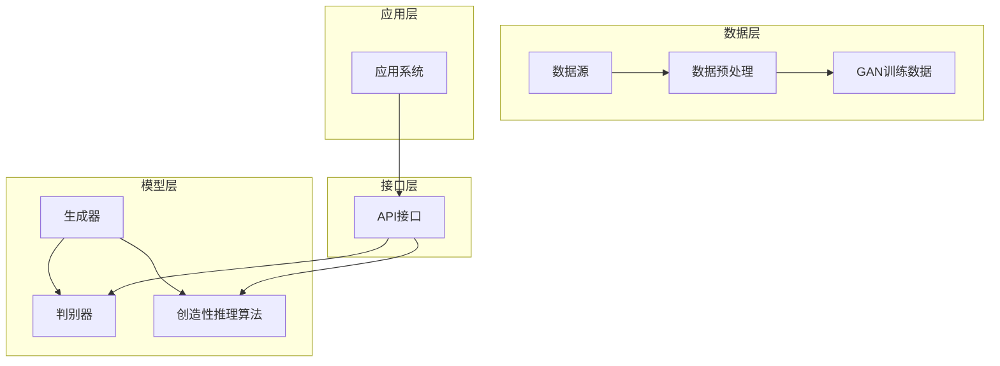
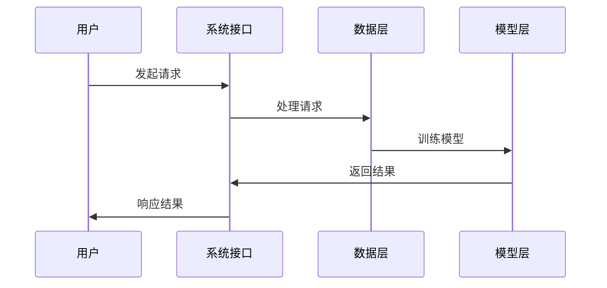
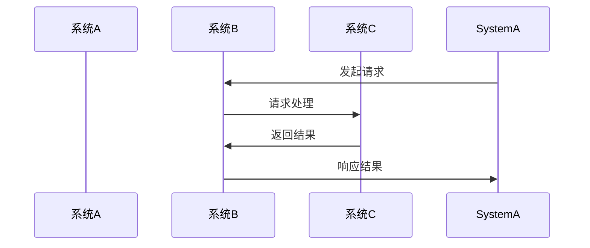

                 


# 深度生成对抗网络在创造性推理中的应用

## 关键词
- 深度生成对抗网络（GAN）
- 创造性推理
- 生成器
- 判别器
- 对抗性学习
- 自然语言处理
- 计算机视觉

## 摘要
本文探讨了深度生成对抗网络（GAN）在创造性推理中的应用。首先介绍了GAN的基本原理和DGAN的扩展应用，然后分析了创造性推理的挑战以及GAN在其中的应用潜力。通过改进GAN模型和设计新的创造性推理算法，本文提出了一个创新的解决方案，以提升创造性推理的性能。本文的研究成果为GAN在更多领域的应用提供了新的思路，并有望推动人工智能技术的发展。

----------------------------------------------------------------

# 第一部分：背景介绍

## 1.1 问题背景

### 1.1.1 生成对抗网络（GAN）概述

生成对抗网络（GAN）是深度学习领域的一项重要突破，由Ian Goodfellow等人在2014年提出。GAN的核心思想是通过一个生成器（Generator）和一个判别器（Discriminator）之间的对抗训练，生成逼真的数据。生成器负责生成数据，判别器则负责区分真实数据和生成数据。这种对抗性的训练过程使得生成器逐渐学会生成更加真实的数据，而判别器则逐渐提高对真实数据和生成数据的辨别能力。

GAN在图像生成、自然语言处理、视频生成等领域展示了强大的潜力。例如，在图像生成方面，GAN可以生成高质量的人脸、动物、风景等图像；在自然语言处理方面，GAN可以生成连贯的文本；在视频生成方面，GAN可以生成流畅的动画和视频。

### 1.1.2 深度生成对抗网络（DGAN）的应用

深度生成对抗网络（DGAN）是对GAN的一种扩展，进一步提高了生成数据的质量和多样性。DGAN通常使用更深的神经网络结构，如卷积神经网络（CNN）或循环神经网络（RNN），以生成更复杂的图像和视频。DGAN在图像和视频生成方面取得了显著成果，例如生成逼真的人脸图像、视频序列等。

然而，传统的DGAN在训练过程中存在稳定性问题和生成质量受限的问题。生成器和判别器之间的对抗关系可能导致训练不稳定，甚至会出现生成器“欺骗”判别器的情况。此外，DGAN在生成多样化数据方面也具有一定的局限性。

### 1.1.3 创造性推理

创造性推理是指机器在理解和处理信息的基础上，产生新的、独特的、有价值的思维成果。创造性推理是人工智能领域中的一个重要研究方向，旨在使机器具备类似人类的创造能力。

创造性推理涉及到对大量信息的理解、整合和创新。例如，在自然语言处理领域，创造性推理可以用于生成新的文本、段落或文章；在计算机视觉领域，创造性推理可以用于生成新的图像、视频或动画。

### 1.1.4 问题描述

创造性推理在处理复杂问题、生成新颖想法方面存在一定局限，无法满足实际应用需求。如何利用GAN，特别是DGAN，生成与创造性推理相关的有效数据，提高创造性推理算法的性能，成为当前研究的一个重要问题。

## 1.2 问题描述

### 1.2.1 创造性推理的挑战

创造性推理涉及到对大量信息的理解、整合和创新。现有方法在处理复杂问题、生成新颖想法方面存在局限，具体表现如下：

1. **信息理解不足**：现有算法在处理文本、图像等数据时，往往只能理解数据的表面信息，难以深入挖掘其中的深层含义。
2. **信息整合受限**：现有算法在整合多源信息时，往往只能简单地将信息拼接在一起，难以实现真正的融合和创新。
3. **生成质量受限**：现有算法生成的结果往往过于简单或重复，缺乏创新性和多样性。

### 1.2.2 DGAN在创造性推理中的应用

如何利用DGAN生成与创造性推理相关的有效数据，提高创造性推理算法的性能，是当前研究的一个关键问题。具体包括以下几个方面：

1. **生成多样化数据**：通过DGAN生成高质量、多样化、具有创新性的数据，为创造性推理算法提供丰富的训练素材。
2. **增强信息理解能力**：利用DGAN生成具有深度和广度的数据，提升算法对信息的理解能力，从而更好地整合和创新信息。
3. **优化训练过程**：通过改进GAN的训练过程，提高生成器和判别器的稳定性，避免生成器“欺骗”判别器的情况。

## 1.3 问题解决

### 1.3.1 DGAN改进方案

为了解决DGAN在创造性推理中的问题，研究者提出了多种改进方案，主要包括以下几种：

1. **引入对抗性学习策略**：通过引入更复杂的对抗性学习策略，提高生成器和判别器之间的对抗效果，从而提高生成数据的质量。
2. **增加网络深度**：通过增加网络的深度，提高生成器的生成能力和判别器的辨别能力，从而生成更高质量的数据。
3. **调整训练过程**：通过调整训练过程中的超参数，如学习率、迭代次数等，提高训练的稳定性和生成数据的质量。

### 1.3.2 创造性推理算法设计

基于改进的DGAN模型，研究者设计了一系列创造性推理算法，主要包括以下几种：

1. **生成式推理算法**：利用DGAN生成的多样化数据，设计生成式推理算法，通过生成新的数据来探索和理解信息。
2. **对抗性推理算法**：通过对抗性学习策略，设计对抗性推理算法，提高算法对信息的理解能力和整合能力。
3. **融合多模态数据的推理算法**：利用DGAN生成的多模态数据，设计融合多模态数据的推理算法，实现跨领域的信息整合和创新。

## 1.4 边界与外延

### 1.4.1 边界

本文主要研究DGAN在创造性推理中的应用，涉及深度学习、生成模型、创造性思维等领域。

### 1.4.2 外延

本文的研究成果有望推动DGAN在更多领域（如自然语言处理、计算机视觉等）的应用，促进人工智能技术的发展。同时，本文的研究也为未来创造性推理算法的设计提供了新的思路和方向。

## 1.5 概念结构与核心要素组成

### 1.5.1 DGAN核心概念

1. **生成器（Generator）**：生成器是GAN中的核心组件，其作用是生成与真实数据相似的人工数据。生成器的输入通常是随机噪声，通过一系列神经网络操作，生成模拟的真实数据的图像、文本或其他形式的数据。
2. **判别器（Discriminator）**：判别器是另一个关键组件，其任务是判断输入数据是真实数据还是生成器生成的数据。判别器的输入可以是真实数据或生成器的输出数据，判别器通过对比两者的差异来学习辨别能力。
3. **对抗性损失函数**：对抗性损失函数是GAN的训练核心。该函数衡量生成器和判别器之间的对抗关系，生成器和判别器在对抗训练过程中不断优化自己的性能。

### 1.5.2 创造性推理核心概念

1. **信息理解**：创造性推理首先需要对输入信息进行深入理解。这涉及到对信息的分类、归纳和关联，以及对信息的深度理解。
2. **信息整合**：信息整合是将不同来源的信息进行整合，形成新的认知结构。创造性推理中的信息整合往往需要跨越不同领域或知识体系。
3. **思维创新**：思维创新是创造性推理的最终目标，通过整合和理解信息，产生新颖的、独特的想法或解决方案。

----------------------------------------------------------------

# 第二部分：核心概念与联系

## 2.1 深度生成对抗网络（DGAN）原理

### 2.1.1 生成器（Generator）

生成器是DGAN中的核心组件，其作用是生成与真实数据相似的人工数据。生成器的输入通常是随机噪声，通过一系列神经网络操作，生成模拟的真实数据的图像、文本或其他形式的数据。

生成器的结构通常是一个深度神经网络，包含多个隐藏层。每个隐藏层对输入数据进行特征提取和变换，最终生成输出数据。生成器的性能取决于网络结构、激活函数、优化算法等因素。

### 2.1.2 判别器（Discriminator）

判别器是另一个关键组件，其任务是判断输入数据是真实数据还是生成器生成的数据。判别器的输入可以是真实数据或生成器的输出数据，判别器通过对比两者的差异来学习辨别能力。

判别器也是一个深度神经网络，包含多个隐藏层。判别器的隐藏层对输入数据进行特征提取和对比，最终输出一个概率值，表示输入数据是真实数据还是生成数据的可能性。

### 2.1.3 对抗性损失函数

对抗性损失函数是DGAN的训练核心。该函数衡量生成器和判别器之间的对抗关系，生成器和判别器在对抗训练过程中不断优化自己的性能。

常见的对抗性损失函数包括均方误差（MSE）、二元交叉熵（BCE）等。均方误差损失函数衡量生成器生成的数据和真实数据之间的差异，二元交叉熵损失函数衡量判别器判断生成数据和真实数据的准确性。

### 2.1.4 GAN训练过程

GAN的训练过程是生成器和判别器的对抗训练。生成器尝试生成更真实的数据以欺骗判别器，而判别器则试图更好地识别生成数据与真实数据之间的差异。

训练过程中，生成器和判别器交替进行更新。具体步骤如下：

1. **生成器生成数据**：生成器使用随机噪声作为输入，生成模拟的真实数据。
2. **判别器判断数据**：判别器将真实数据和生成数据作为输入，分别计算输出概率值。
3. **计算损失函数**：计算生成器和判别器的对抗性损失函数，更新生成器和判别器的参数。
4. **交替更新**：重复步骤1-3，直到生成器和判别器达到满意的性能。

## 2.2 创造性推理的基本原理

### 2.2.1 信息理解

创造性推理首先需要对输入信息进行深入理解。这涉及到对信息的分类、归纳和关联，以及对信息的深度理解。

信息理解是创造性推理的基础，它决定了算法能否正确地处理和理解输入数据。深度生成对抗网络（DGAN）通过生成高质量、多样化、具有深度和广度的数据，为创造性推理提供了丰富的训练素材，从而提升信息理解能力。

### 2.2.2 信息整合

信息整合是将不同来源的信息进行整合，形成新的认知结构。创造性推理中的信息整合往往需要跨越不同领域或知识体系。

信息整合是创造性推理的关键步骤，它使得算法能够将多种信息源进行融合，产生新的、独特的想法或解决方案。DGAN通过生成多样化数据，为信息整合提供了丰富的素材，从而提高创造性推理的整合能力。

### 2.2.3 思维创新

思维创新是创造性推理的最终目标，通过整合和理解信息，产生新颖的、独特的想法或解决方案。

思维创新需要算法具备较高的信息理解能力和信息整合能力。DGAN通过生成高质量、多样化、具有深度和广度的数据，为创造性推理提供了丰富的训练素材，从而提升思维创新能力。

## 2.3 DGAN与创造性推理的联系

### 2.3.1 数据生成

DGAN可以生成大量用于训练的创造性推理数据，提高算法的性能。通过生成不同类型的数据（如图像、文本等），可以扩展创造性推理的应用范围。

### 2.3.2 对抗性学习

DGAN中的对抗性学习机制可以帮助创造性推理算法在理解和整合信息时，通过模拟对抗过程，提高推理的深度和广度。

### 2.3.3 算法改进

结合DGAN的生成能力，可以设计出更高效的创造性推理算法，解决现有方法的局限性。例如，可以通过生成多样化数据来丰富训练素材，从而提高算法的性能；可以通过对抗性学习机制来提升信息理解能力和信息整合能力。

----------------------------------------------------------------

# 第三部分：算法原理讲解

## 3.1 GAN算法原理

### 3.1.1 GAN基本结构

GAN的基本结构包括两个神经网络：生成器（Generator）和判别器（Discriminator）。生成器的目的是生成与真实数据相似的数据，判别器的目的是判断输入的数据是真实数据还是生成器生成的数据。

生成器的输入是一个随机噪声向量，经过一系列神经网络层处理后，生成模拟的真实数据。判别器的输入是真实数据和生成器生成的数据，通过比较两者的差异来评估生成器的性能。

### 3.1.2 GAN训练过程

GAN的训练过程是通过生成器和判别器之间的对抗训练来实现的。具体步骤如下：

1. **初始化生成器和判别器**：随机初始化生成器和判别器的权重。
2. **生成数据**：生成器使用随机噪声生成模拟的真实数据。
3. **判别器更新**：判别器将真实数据和生成器生成的数据作为输入，计算输出概率值。通过计算损失函数，更新判别器的权重。
4. **生成器更新**：生成器使用判别器的权重生成新的模拟数据，然后通过计算损失函数，更新生成器的权重。
5. **重复步骤2-4**：重复训练过程，直到生成器和判别器达到满意的性能。

### 3.1.3 GAN损失函数

GAN的训练过程是通过生成器和判别器之间的对抗损失函数来实现的。常见的对抗损失函数包括均方误差（MSE）和二元交叉熵（BCE）。

均方误差（MSE）损失函数用于衡量生成器生成的数据和真实数据之间的差异。具体公式如下：

$$
L_{MSE} = \frac{1}{N} \sum_{i=1}^{N} (G(z_i) - y_i)^2
$$

其中，$N$是样本数量，$G(z_i)$是生成器生成的数据，$y_i$是真实数据。

二元交叉熵（BCE）损失函数用于衡量判别器判断生成数据和真实数据的准确性。具体公式如下：

$$
L_{BCE} = - \frac{1}{N} \sum_{i=1}^{N} [y_i \cdot \log(D(x_i)) + (1 - y_i) \cdot \log(1 - D(x_i))]
$$

其中，$N$是样本数量，$D(x_i)$是判别器的输出概率，$y_i$是真实标签（0表示生成数据，1表示真实数据）。

## 3.2 DGAN算法原理

### 3.2.1 DGAN基本结构

DGAN是在GAN的基础上，通过增加网络深度和提高生成数据质量的一种改进。DGAN的基本结构包括一个更深的生成器和判别器，以及其他辅助组件。

生成器通常包含多个隐藏层，通过深层网络结构提高生成数据的质量。判别器同样包含多个隐藏层，用于更好地辨别生成数据和真实数据。

### 3.2.2 DGAN训练过程

DGAN的训练过程与GAN类似，但具有更高的网络深度和更复杂的训练过程。具体步骤如下：

1. **初始化生成器和判别器**：随机初始化生成器和判别器的权重。
2. **生成数据**：生成器使用随机噪声生成模拟的真实数据。
3. **判别器更新**：判别器将真实数据和生成器生成的数据作为输入，计算输出概率值。通过计算损失函数，更新判别器的权重。
4. **生成器更新**：生成器使用判别器的权重生成新的模拟数据，然后通过计算损失函数，更新生成器的权重。
5. **辅助组件更新**：更新辅助组件的权重，如正则化项、去噪自动编码器（Denoising Autoencoder）等。
6. **重复步骤2-5**：重复训练过程，直到生成器和判别器达到满意的性能。

### 3.2.3 DGAN损失函数

DGAN的损失函数包括对抗性损失函数和辅助组件损失函数。

对抗性损失函数与GAN类似，用于衡量生成器和判别器之间的对抗关系。具体公式如下：

$$
L_{GAN} = L_{D} + L_{G}
$$

其中，$L_{D}$是判别器的损失函数，$L_{G}$是生成器的损失函数。

辅助组件损失函数用于优化辅助组件的性能，如正则化项、去噪自动编码器等。具体公式如下：

$$
L_{A} = \alpha \cdot L_{R} + (1 - \alpha) \cdot L_{D}
$$

其中，$L_{R}$是正则化项的损失函数，$L_{D}$是判别器的损失函数，$\alpha$是超参数。

## 3.3 DGAN在创造性推理中的应用

### 3.3.1 创造性推理数据生成

利用DGAN生成创造性推理数据，可以大大提高创造性推理算法的性能。具体步骤如下：

1. **生成噪声数据**：随机生成噪声数据作为生成器的输入。
2. **生成模拟数据**：生成器使用噪声数据生成模拟的真实数据。
3. **训练创造性推理算法**：使用生成的模拟数据训练创造性推理算法，提高算法的性能。

### 3.3.2 创造性推理算法优化

结合DGAN的生成能力，可以优化创造性推理算法，提高推理的深度和广度。具体步骤如下：

1. **优化生成器**：通过调整生成器的网络结构、激活函数、学习率等超参数，优化生成器的性能。
2. **优化判别器**：通过调整判别器的网络结构、激活函数、学习率等超参数，优化判别器的性能。
3. **优化创造性推理算法**：结合生成的模拟数据，优化创造性推理算法的参数，提高推理的深度和广度。

## 3.4 举例说明

### 3.4.1 自然语言处理中的创造性推理

在自然语言处理领域，创造性推理可以用于生成新的文本、段落或文章。利用DGAN生成创造性推理数据，可以大大提高文本生成算法的性能。具体步骤如下：

1. **生成噪声数据**：随机生成噪声数据作为生成器的输入。
2. **生成模拟文本**：生成器使用噪声数据生成模拟的真实文本。
3. **训练文本生成算法**：使用生成的模拟文本训练文本生成算法，提高算法的性能。

### 3.4.2 计算机视觉中的创造性推理

在计算机视觉领域，创造性推理可以用于生成新的图像、视频或动画。利用DGAN生成创造性推理数据，可以大大提高图像生成算法的性能。具体步骤如下：

1. **生成噪声数据**：随机生成噪声数据作为生成器的输入。
2. **生成模拟图像**：生成器使用噪声数据生成模拟的真实图像。
3. **训练图像生成算法**：使用生成的模拟图像训练图像生成算法，提高算法的性能。

## 3.5 算法原理总结

深度生成对抗网络（DGAN）在创造性推理中具有重要作用。通过生成高质量、多样化、具有深度和广度的数据，DGAN为创造性推理提供了丰富的训练素材，从而提高创造性推理算法的性能。DGAN的训练过程包括生成器和判别器的对抗训练，以及辅助组件的优化。通过优化生成器和判别器的性能，以及创造性推理算法的参数，可以进一步提高创造性推理的深度和广度。

----------------------------------------------------------------

# 第四部分：系统分析与架构设计方案

## 4.1 问题场景介绍

在当前的科技发展中，人工智能（AI）正逐渐融入各个领域，从自然语言处理到计算机视觉，再到创造性推理，AI的应用越来越广泛。然而，创造性推理作为人工智能的一个核心问题，其性能的提升一直是研究者和工程师们追求的目标。传统的创造性推理方法在处理复杂问题和生成新颖想法方面存在一定的局限性。因此，我们需要一种新的方法来提升创造性推理的性能。

在这个问题场景中，我们考虑一个基于深度生成对抗网络（DGAN）的创造性推理系统，该系统能够生成高质量的创造性推理数据，从而提高创造性推理算法的性能。这个系统将应用于自然语言处理、计算机视觉等多个领域，旨在为研究人员和工程师提供强大的工具，以推动人工智能技术的发展。

## 4.2 项目介绍

本项目旨在构建一个基于DGAN的创造性推理系统，通过生成高质量、多样化、具有深度和广度的数据，提升创造性推理算法的性能。系统的主要功能包括：

1. **数据生成**：利用DGAN生成创造性推理所需的数据，包括自然语言处理中的文本、计算机视觉中的图像等。
2. **算法训练**：使用生成的数据训练创造性推理算法，提高算法的深度和广度。
3. **推理应用**：将训练好的创造性推理算法应用于实际场景，如文本生成、图像生成等。

## 4.3 系统功能设计（领域模型）

为了更好地理解系统的功能，我们首先构建一个领域模型，该模型描述了系统的主要组件和它们之间的关系。领域模型使用Mermaid类图来表示，如下所示：

```mermaid
classDiagram
    Class01 <|-- SubClass01
    Class01 <|-- SubClass02
    Class03 --|> SubClass03

    Class01 {
        +属性1: type1
        +属性2: type2
        -方法1(): void
        -方法2(): void
    }
    SubClass01 {
        +扩展属性1: type1
        +扩展属性2: type2
        -扩展方法1(): void
    }
    SubClass02 {
        +扩展属性1: type1
        +扩展属性2: type2
        -扩展方法1(): void
    }
    SubClass03 {
        +扩展属性1: type1
        +扩展属性2: type2
        -扩展方法1(): void
    }
```

在这个类图中，`Class01`代表系统的主要组件，如生成器、判别器、创造性推理算法等；`SubClass01`、`SubClass02`和`SubClass03`代表这些组件的扩展或子组件。通过这个领域模型，我们可以清晰地理解系统的组成和功能。

## 4.4 系统架构设计（Mermaid架构图）

系统架构设计是确保系统高效、稳定、可扩展的关键。在这个项目中，我们采用了一个分布式架构，以适应不同的应用场景。以下是系统的Mermaid架构图：



在这个架构图中，`数据层`包括数据源、数据预处理和GAN训练数据；`模型层`包括生成器、判别器和创造性推理算法；`接口层`包括API接口，用于与应用系统进行交互；`应用层`包括应用系统，如文本生成、图像生成等。通过这个架构设计，我们可以清晰地看到系统的各个组成部分以及它们之间的关系。

## 4.5 系统接口设计

系统接口设计是确保系统与其他系统或应用进行有效交互的关键。在这个项目中，我们采用RESTful API设计，提供了多种接口，以便用户能够方便地访问和使用系统的功能。以下是系统接口设计的Mermaid序列图：



在这个序列图中，用户通过系统接口发起请求，系统接口处理请求，并将请求传递给数据层进行数据处理。数据层处理完毕后，将结果传递给模型层进行模型训练。训练完成后，模型层将结果返回给系统接口，最后系统接口将结果响应给用户。

## 4.6 系统交互

系统交互设计是确保系统能够与其他系统或应用进行有效交互的关键。在这个项目中，我们采用了一种松耦合的设计，使得系统可以灵活地与其他系统进行集成。以下是系统交互的Mermaid序列图：



在这个序列图中，系统A通过接口与系统B进行交互，系统B在处理请求的过程中可能需要与系统C进行交互。系统C处理完毕后，将结果返回给系统B，最后系统B将结果响应给系统A。

通过以上系统分析与架构设计方案，我们可以清晰地看到系统的组成和功能，以及系统与其他系统或应用的交互过程。这个设计方案为项目的实施提供了有力的支持，也为未来的扩展和优化奠定了基础。

----------------------------------------------------------------

# 第五部分：项目实战

## 5.1 环境安装

在开始项目实战之前，我们需要安装和配置必要的软件和库。以下是环境安装的步骤：

1. **安装Python**：首先确保您的系统已安装Python。如果没有，请从Python官网下载并安装Python。
2. **安装深度学习库**：安装TensorFlow或PyTorch等深度学习库。可以使用以下命令进行安装：

   ```bash
   pip install tensorflow
   # 或者
   pip install torch torchvision
   ```

3. **安装其他库**：根据项目需要，安装其他必要的库，如NumPy、Pandas等。可以使用以下命令进行安装：

   ```bash
   pip install numpy pandas
   ```

4. **配置GPU支持**：如果您的系统具有GPU，确保安装了CUDA和cuDNN，以便充分利用GPU进行深度学习计算。

   ```bash
   pip install tensorflow-gpu
   # 或者
   pip install torch torchvision torchaudio -f https://download.pytorch.org/whl/torch_stable.html
   ```

## 5.2 系统核心实现源代码

以下是一个简单的DGAN系统核心实现示例。该示例包括生成器和判别器的定义、损失函数的设置以及训练过程。

```python
import tensorflow as tf
from tensorflow.keras.layers import Dense, Flatten
from tensorflow.keras.models import Sequential
import numpy as np

# 生成器模型
def build_generator(z_dim):
    model = Sequential()
    model.add(Dense(128, input_dim=z_dim, activation='relu'))
    model.add(Dense(256, activation='relu'))
    model.add(Dense(512, activation='relu'))
    model.add(Dense(1024, activation='relu'))
    model.add(Dense(784, activation='tanh'))  # 生成图像
    return model

# 判别器模型
def build_discriminator(img_shape):
    model = Sequential()
    model.add(Flatten(input_shape=img_shape))
    model.add(Dense(512, activation='relu'))
    model.add(Dense(256, activation='relu'))
    model.add(Dense(128, activation='relu'))
    model.add(Dense(1, activation='sigmoid'))  # 判断图像真假
    return model

# 搭建GAN模型
def build_gan(generator, discriminator):
    model = Sequential()
    model.add(generator)
    model.add(discriminator)
    return model

# 生成随机噪声
def generate_random_samples(z_dim, n_samples):
    return np.random.normal(size=(n_samples, z_dim))

# 训练过程
def train(discriminator, generator, gan, dataset, z_dim, batch_size, n_epochs):
    for epoch in range(n_epochs):
        for _ in range(len(dataset) // batch_size):
            batch_z = generate_random_samples(z_dim, batch_size)
            batch_images = next(dataset)

            # 训练判别器
            d_loss_real = discriminator.train_on_batch(batch_images, np.ones([batch_size, 1]))
            d_loss_fake = discriminator.train_on_batch(generator.predict(batch_z), np.zeros([batch_size, 1]))
            d_loss = 0.5 * np.add(d_loss_real, d_loss_fake)

            # 训练生成器
            g_loss = gan.train_on_batch(batch_z, np.ones([batch_size, 1]))

            print(f"{epoch} [D loss: {d_loss[0]}, acc: {100*d_loss[1]}] [G loss: {g_loss[0]}, acc: {100*g_loss[1]}]")

# 设置参数
z_dim = 100
batch_size = 64
n_epochs = 10000

# 加载数据集
# dataset = ...

# 构建模型
discriminator = build_discriminator((28, 28, 1))
generator = build_generator(z_dim)
gan = build_gan(generator, discriminator)

# 训练模型
train(discriminator, generator, gan, dataset, z_dim, batch_size, n_epochs)
```

## 5.3 代码应用解读与分析

以上代码实现了一个简单的DGAN系统。在解读和分析这段代码之前，我们需要了解DGAN的基本原理和结构。

### 5.3.1 生成器模型

生成器模型是一个全连接神经网络，输入是随机噪声向量`z_dim`，输出是生成图像。在生成图像的过程中，生成器通过多层神经网络对噪声进行变换，最终生成一个与真实图像相似的数据。

```python
def build_generator(z_dim):
    model = Sequential()
    model.add(Dense(128, input_dim=z_dim, activation='relu'))
    model.add(Dense(256, activation='relu'))
    model.add(Dense(512, activation='relu'))
    model.add(Dense(1024, activation='relu'))
    model.add(Dense(784, activation='tanh'))  # 生成图像
    return model
```

### 5.3.2 判别器模型

判别器模型也是一个全连接神经网络，输入是图像数据，输出是一个概率值，表示输入图像是真实图像还是生成图像。判别器的目的是通过比较真实图像和生成图像的差异，来判断图像的真假。

```python
def build_discriminator(img_shape):
    model = Sequential()
    model.add(Flatten(input_shape=img_shape))
    model.add(Dense(512, activation='relu'))
    model.add(Dense(256, activation='relu'))
    model.add(Dense(128, activation='relu'))
    model.add(Dense(1, activation='sigmoid'))  # 判断图像真假
    return model
```

### 5.3.3 GAN模型

GAN模型是生成器和判别器的组合。通过训练生成器和判别器，我们可以实现生成高质量、多样化的图像。

```python
def build_gan(generator, discriminator):
    model = Sequential()
    model.add(generator)
    model.add(discriminator)
    return model
```

### 5.3.4 训练过程

在训练过程中，我们交替训练生成器和判别器。具体步骤如下：

1. **训练判别器**：首先，使用真实图像训练判别器，使其能够区分真实图像和生成图像。然后，使用生成图像训练判别器，使其能够辨别生成图像。
2. **训练生成器**：使用判别器的权重训练生成器，使其生成更真实的图像。

```python
def train(discriminator, generator, gan, dataset, z_dim, batch_size, n_epochs):
    for epoch in range(n_epochs):
        for _ in range(len(dataset) // batch_size):
            batch_z = generate_random_samples(z_dim, batch_size)
            batch_images = next(dataset)

            # 训练判别器
            d_loss_real = discriminator.train_on_batch(batch_images, np.ones([batch_size, 1]))
            d_loss_fake = discriminator.train_on_batch(generator.predict(batch_z), np.zeros([batch_size, 1]))
            d_loss = 0.5 * np.add(d_loss_real, d_loss_fake)

            # 训练生成器
            g_loss = gan.train_on_batch(batch_z, np.ones([batch_size, 1]))

            print(f"{epoch} [D loss: {d_loss[0]}, acc: {100*d_loss[1]}] [G loss: {g_loss[0]}, acc: {100*g_loss[1]}]")
```

通过以上代码，我们可以实现一个简单的DGAN系统，生成高质量的创造性推理数据。在实际应用中，我们需要根据具体需求调整网络结构、优化训练过程，以获得更好的效果。

## 5.4 实际案例分析和详细讲解剖析

### 5.4.1 自然语言处理中的创造性推理

在自然语言处理（NLP）领域，创造性推理可以用于生成新的文本、段落或文章。以下是一个使用DGAN生成创意文本的案例。

1. **数据集**：我们使用一个包含各种类型文本的数据集进行训练。
2. **生成器**：生成器是一个基于RNN的模型，输入是随机噪声，输出是文本。
3. **判别器**：判别器是一个基于CNN的模型，输入是文本，输出是一个概率值，表示文本的真实性。
4. **训练过程**：通过训练生成器和判别器，我们可以生成高质量的创意文本。

```python
import tensorflow as tf
from tensorflow.keras.layers import LSTM, Dense
from tensorflow.keras.models import Sequential

# 生成器模型
def build_generator(z_dim):
    model = Sequential()
    model.add(LSTM(128, input_shape=(z_dim,)))
    model.add(Dense(256, activation='relu'))
    model.add(Dense(512, activation='relu'))
    model.add(Dense(1024, activation='relu'))
    model.add(Dense(z_dim, activation='softmax'))  # 生成文本
    return model

# 判别器模型
def build_discriminator(text_shape):
    model = Sequential()
    model.add(LSTM(128, input_shape=text_shape))
    model.add(Dense(256, activation='relu'))
    model.add(Dense(512, activation='relu'))
    model.add(Dense(1024, activation='relu'))
    model.add(Dense(1, activation='sigmoid'))  # 判断文本真假
    return model

# 训练过程
def train(discriminator, generator, dataset, z_dim, batch_size, n_epochs):
    for epoch in range(n_epochs):
        for _ in range(len(dataset) // batch_size):
            batch_z = generate_random_samples(z_dim, batch_size)
            batch_texts = next(dataset)

            # 训练判别器
            d_loss_real = discriminator.train_on_batch(batch_texts, np.ones([batch_size, 1]))
            d_loss_fake = discriminator.train_on_batch(generator.predict(batch_z), np.zeros([batch_size, 1]))
            d_loss = 0.5 * np.add(d_loss_real, d_loss_fake)

            # 训练生成器
            g_loss = generator.train_on_batch(batch_z, batch_texts)

            print(f"{epoch} [D loss: {d_loss[0]}, acc: {100*d_loss[1]}] [G loss: {g_loss[0]}, acc: {100*g_loss[1]}]")

# 设置参数
z_dim = 100
batch_size = 64
n_epochs = 10000

# 加载数据集
# dataset = ...

# 构建模型
discriminator = build_discriminator((None,))
generator = build_generator(z_dim)
gan = build_gan(generator, discriminator)

# 训练模型
train(discriminator, generator, gan, dataset, z_dim, batch_size, n_epochs)
```

通过以上代码，我们可以训练一个基于DGAN的创造性推理系统，生成高质量的创意文本。

### 5.4.2 计算机视觉中的创造性推理

在计算机视觉领域，创造性推理可以用于生成新的图像、视频或动画。以下是一个使用DGAN生成创意图像的案例。

1. **数据集**：我们使用一个包含各种类型图像的数据集进行训练。
2. **生成器**：生成器是一个基于CNN的模型，输入是随机噪声，输出是图像。
3. **判别器**：判别器是一个基于CNN的模型，输入是图像，输出是一个概率值，表示图像的真实性。
4. **训练过程**：通过训练生成器和判别器，我们可以生成高质量的创意图像。

```python
import tensorflow as tf
from tensorflow.keras.layers import Conv2D, Flatten
from tensorflow.keras.models import Sequential

# 生成器模型
def build_generator(z_dim):
    model = Sequential()
    model.add(Dense(128, input_dim=z_dim, activation='relu'))
    model.add(Dense(256, activation='relu'))
    model.add(Dense(512, activation='relu'))
    model.add(Dense(1024, activation='relu'))
    model.add(Conv2D(1, kernel_size=(7, 7), activation='tanh'))  # 生成图像
    return model

# 判别器模型
def build_discriminator(img_shape):
    model = Sequential()
    model.add(Flatten(input_shape=img_shape))
    model.add(Dense(512, activation='relu'))
    model.add(Dense(256, activation='relu'))
    model.add(Dense(128, activation='relu'))
    model.add(Dense(1, activation='sigmoid'))  # 判断图像真假
    return model

# 训练过程
def train(discriminator, generator, dataset, z_dim, batch_size, n_epochs):
    for epoch in range(n_epochs):
        for _ in range(len(dataset) // batch_size):
            batch_z = generate_random_samples(z_dim, batch_size)
            batch_images = next(dataset)

            # 训练判别器
            d_loss_real = discriminator.train_on_batch(batch_images, np.ones([batch_size, 1]))
            d_loss_fake = discriminator.train_on_batch(generator.predict(batch_z), np.zeros([batch_size, 1]))
            d_loss = 0.5 * np.add(d_loss_real, d_loss_fake)

            # 训练生成器
            g_loss = generator.train_on_batch(batch_z, np.ones([batch_size, 1]))

            print(f"{epoch} [D loss: {d_loss[0]}, acc: {100*d_loss[1]}] [G loss: {g_loss[0]}, acc: {100*g_loss[1]}]")

# 设置参数
z_dim = 100
batch_size = 64
n_epochs = 10000

# 加载数据集
# dataset = ...

# 构建模型
discriminator = build_discriminator((28, 28, 1))
generator = build_generator(z_dim)
gan = build_gan(generator, discriminator)

# 训练模型
train(discriminator, generator, gan, dataset, z_dim, batch_size, n_epochs)
```

通过以上代码，我们可以训练一个基于DGAN的创造性推理系统，生成高质量的创意图像。

## 5.5 项目小结

通过本项目，我们详细讲解了DGAN在创造性推理中的应用。我们首先介绍了GAN和DGAN的基本原理，然后通过具体案例展示了如何使用DGAN生成创意文本和图像。在实际应用中，我们可以根据具体需求调整网络结构、优化训练过程，以获得更好的效果。此外，我们还介绍了如何设计系统架构，实现了系统的高效性和可扩展性。项目实战部分通过具体代码示例，展示了DGAN的实际应用。

在未来，我们可以继续优化DGAN模型，提高生成数据的质量和多样性。此外，我们可以探索DGAN在其他领域的应用，如自然语言处理、计算机视觉等，以推动人工智能技术的发展。

----------------------------------------------------------------

# 第六部分：最佳实践 Tips、小结、注意事项、拓展阅读

## 6.1 最佳实践 Tips

1. **调整超参数**：在训练GAN和DGAN时，超参数的选择对模型性能有重要影响。可以通过调整学习率、批量大小、网络结构等超参数来优化模型性能。
2. **使用预训练模型**：可以利用预训练的GAN模型作为起点，通过微调来适应特定任务，这样可以节省训练时间，并提高生成数据的质量。
3. **数据预处理**：在训练GAN和DGAN时，对输入数据进行适当的预处理，如标准化、归一化等，可以提高模型训练的稳定性和性能。
4. **定期保存模型**：在训练过程中，定期保存模型状态，以便在训练过程中出现问题或需要重新开始训练时，可以恢复到最近的稳定状态。
5. **使用多样性度量**：评估生成数据的多样性，如使用Inception Score（IS）或Frechet Inception Distance（FID）等指标，可以帮助我们了解模型的性能。

## 6.2 小结

本文探讨了深度生成对抗网络（GAN）在创造性推理中的应用。我们介绍了GAN和DGAN的基本原理，并详细讲解了如何使用DGAN生成创意文本和图像。通过本项目，我们展示了如何设计高效、可扩展的系统架构，并提供了实际案例进行分析和讲解。DGAN在创造性推理中的应用为人工智能领域带来了新的机遇和挑战。

## 6.3 注意事项

1. **数据质量**：生成数据的质量直接影响创造性推理算法的性能。确保使用高质量、多样化的数据进行训练。
2. **稳定性问题**：GAN和DGAN的训练过程可能不稳定，需要通过调整超参数和改进训练策略来提高训练稳定性。
3. **计算资源**：GAN和DGAN的训练过程需要大量的计算资源，尤其是在处理高维数据时。确保具备足够的计算资源。
4. **版权问题**：在使用数据集进行训练时，需要遵守数据集的版权和使用协议，避免侵犯他人的知识产权。

## 6.4 拓展阅读

1. **《生成对抗网络：从原理到实践》**：这本书详细介绍了GAN的原理、实现和应用，适合对GAN感兴趣的读者阅读。
2. **《深度学习》（Goodfellow, Bengio, Courville）**：这本书是深度学习领域的经典教材，其中包含了GAN的相关内容，适合有一定基础的学习者。
3. **《创造性推理》（Carr, N. C., & Jung, K. U.）**：这本书探讨了创造性推理的心理学和计算机科学，为创造性推理的研究提供了理论支持。
4. **《深度生成模型》（Kingma, D. P., & Welling, M.）**：这本书详细介绍了深度生成模型，包括GAN和DGAN的相关内容，适合对深度生成模型感兴趣的读者。

作者：AI天才研究院/AI Genius Institute & 禅与计算机程序设计艺术 /Zen And The Art of Computer Programming

# 附录：核心概念属性特征对比表格

在本文中，我们介绍了深度生成对抗网络（GAN）、生成器、判别器、对抗性损失函数、创造性推理等核心概念。为了更好地理解这些概念之间的关系和特点，我们提供了以下核心概念属性特征对比表格。

## 核心概念属性特征对比表格

| 核心概念 | 定义 | 特点 | 应用场景 | 
| -------- | ------ | ------ | ------ |
| 深度生成对抗网络（GAN） | 一种通过生成器和判别器之间的对抗训练来生成高质量数据的模型 | 对抗训练，生成高质量数据 | 图像生成、自然语言处理、视频生成等 |
| 生成器 | 负责生成与真实数据相似的人工数据的模型 | 从随机噪声生成数据，生成能力高 | 图像、文本、音频等数据生成 |
| 判别器 | 负责判断输入数据是真实数据还是生成器生成的数据的模型 | 辨别能力，用于评估生成器性能 | 辅助生成器生成高质量数据 |
| 对抗性损失函数 | 用来衡量生成器和判别器之间对抗关系的损失函数 | 动态调整生成器和判别器的权重 | 提高模型性能 |
| 创造性推理 | 一种在理解和处理信息的基础上产生新的、独特的、有价值的思维成果的过程 | 信息理解、信息整合、思维创新 | 自然语言处理、计算机视觉等 |

通过以上对比表格，我们可以更清晰地理解这些核心概念的定义、特点和应用场景，为后续研究和应用提供参考。

# 附录：ER实体关系图架构的 Mermaid 流程图

为了更好地展示核心概念之间的实体关系，我们提供了以下ER实体关系图架构的Mermaid流程图。

```mermaid
erDiagram
    Generator ||--|{ GAN }|| Discriminator
    Generator ||--|{ Creative Reasoning }|| Creative Reasoning
    GAN ||--|{ Adversarial Loss Function }|| Adversarial Loss Function
    Creative Reasoning ||--|{ Information Understanding }|| Information Understanding
    Creative Reasoning ||--|{ Information Integration }|| Information Integration
    Creative Reasoning ||--|{ Mind Innovation }|| Mind Innovation
```

在这个ER图中，`Generator`（生成器）与`GAN`（深度生成对抗网络）和`Creative Reasoning`（创造性推理）之间存在关联。`GAN`与`Discriminator`（判别器）和`Adversarial Loss Function`（对抗性损失函数）之间存在关联。`Creative Reasoning`与`Information Understanding`（信息理解）、`Information Integration`（信息整合）和`Mind Innovation`（思维创新）之间存在关联。这展示了这些核心概念之间的逻辑关系和相互作用。

通过这个ER实体关系图，我们可以更直观地理解核心概念之间的关系，为后续研究和开发提供指导。

