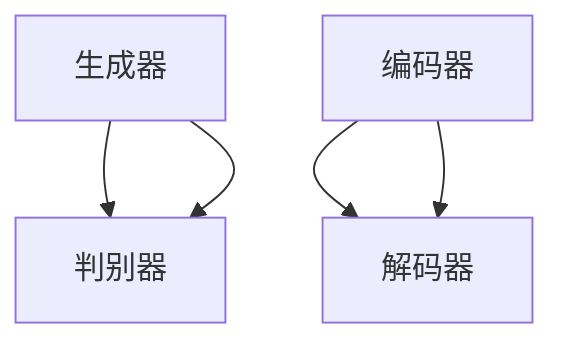

                 

### 深度生成模型在假设推理中的应用研究

---

**关键词**：深度生成模型，假设推理，GAN，VAE，自然语言处理，计算机视觉

**摘要**：本文深入探讨了深度生成模型（如生成对抗网络GAN和变分自编码器VAE）在假设推理中的应用。首先，介绍了深度生成模型的基本原理和假设推理的概念。接着，通过具体实例展示了深度生成模型在自然语言处理和计算机视觉等领域的应用。本文还详细分析了深度生成模型在假设推理中的数学模型与算法原理，并提出了系统分析与架构设计的方法。最后，通过项目实战和最佳实践，探讨了深度生成模型在实际应用中的挑战和解决方案。

---

### 第1章 绪论

#### 1.1 问题背景

深度生成模型（Deep Generative Models）是人工智能领域的一个重要研究方向，近年来取得了显著的进展。生成对抗网络（Generative Adversarial Networks，GAN）和变分自编码器（Variational Autoencoder，VAE）是其中两种典型的深度生成模型。

假设推理（Hypothesis Inference）是人工智能和机器学习中的一个核心问题，其目的是从一组数据中推断出潜在的规律或模式。假设推理在许多领域有着广泛的应用，如自然语言处理、计算机视觉、医学诊断等。

本文旨在研究深度生成模型在假设推理中的应用，探索其在提升推理准确性和效率方面的潜力。

#### 1.2 核心概念

**深度生成模型的基本原理**：
- **GAN**：由生成器和判别器组成，通过训练两个网络相互对抗来生成高质量的数据。
- **VAE**：通过编码器和解码器结构，将输入数据编码为潜在空间中的向量，再解码生成数据。

**假设推理的基本概念**：
- **概率图模型**：利用概率图表示数据中的变量及其依赖关系，通过推理算法从概率图模型中推断出变量之间的潜在规律。
- **深度学习模型**：利用多层神经网络进行特征提取和模式识别，通过训练模型来学习数据中的内在规律。

#### 1.3 研究目的与内容

**研究目的**：本文旨在探索深度生成模型在假设推理中的应用，通过具体实例展示其在自然语言处理和计算机视觉等领域的潜力。

**研究内容概述**：
- 理论分析：深入分析深度生成模型和假设推理的基本原理。
- 实验设计：设计实验来验证深度生成模型在假设推理中的应用效果。
- 应用案例：通过实际案例展示深度生成模型在自然语言处理和计算机视觉等领域的应用。
- 系统分析与架构设计：设计系统的功能模块和架构，为深度生成模型在假设推理中的实际应用提供参考。

#### 1.4 边界与外延

**研究的边界条件**：
- 数据集的选取：根据具体应用场景选择合适的数据集。
- 模型的选择：根据假设推理的需求选择合适的深度生成模型。

**假设推理的应用领域**：
- 自然语言处理：如文本生成、机器翻译等。
- 计算机视觉：如图像生成、目标检测等。
- 医学诊断：如疾病预测、诊断辅助等。

#### 1.5 概念结构与核心要素

**深度生成模型的概念结构**：

**假设推理的核心要素**：
- 数据预处理：数据清洗、归一化等。
- 模型训练：选择合适的模型结构和训练算法。
- 推理算法：如贝叶斯推理、深度学习推理等。

---

**总结**：本文对深度生成模型在假设推理中的应用进行了系统的研究，从理论分析、实验设计到实际应用案例，全面探讨了其应用潜力和实际效果。通过本文的研究，旨在为人工智能领域的研究者和开发者提供有价值的参考和启示。

---

**参考文献**：

1. Goodfellow, I. J., Pouget-Abadie, J., Mirza, M., Xu, B., Warde-Farley, D., Ozair, S., ... & Bengio, Y. (2014). Generative adversarial networks. Advances in Neural Information Processing Systems, 27.
2. Kingma, D. P., & Welling, M. (2013). Auto-encoding variational bayes. arXiv preprint arXiv:1312.6114.
3. Russell, S., & Norvig, P. (2010). Artificial Intelligence: A Modern Approach (3rd ed.). Prentice Hall.
4. Murphy, K. P. (2012). Machine Learning: A Probabilistic Perspective. MIT Press.

---

**作者**：AI天才研究院 / AI Genius Institute & 禅与计算机程序设计艺术 / Zen And The Art of Computer Programming

