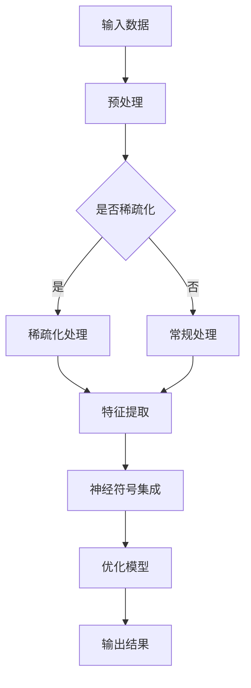
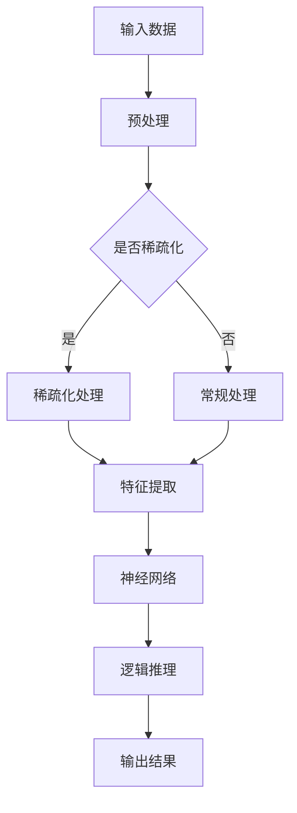

                 

### 《混合推理优化框架中神经符号集成的新方法》技术博客文章撰写

#### 引言

---

**文章标题：混合推理优化框架中神经符号集成的新方法**

**关键词：混合推理、优化框架、神经符号集成、新方法**

**摘要：本文探讨了混合推理优化框架中神经符号集成的新方法，从基础理论到实际应用，全面解析了该方法的优势和挑战，并通过具体实例展示了其实际效果。**

---

**目录大纲设计思路**

1. **明确书籍主题和目标读者**：本文以计算机科学、人工智能、机器学习领域的研究人员、工程师或学生为主要读者对象，旨在介绍混合推理优化框架中神经符号集成的新方法。

2. **确定书籍结构**：文章结构包含引言、基础理论、算法原理、系统设计与实现、项目实战、最佳实践与小结等部分。

3. **细化章节内容**：每个章节都有明确的主题和内容，确保文章的逻辑连贯性。

4. **保持简洁性**：避免冗余内容，确保每个章节内容紧凑。

5. **符合要求**：文章采用markdown格式，包含1、2、3级目录，内容完整。

**目录大纲设计**

---

### 引言

- **1.1 书籍主题介绍**
  - **1.1.1 混合推理优化框架的背景**
  - **1.1.2 神经符号集成的概念与意义**
  - **1.1.3 书籍的目的与结构**

- **1.2 研究现状与挑战**
  - **1.2.1 混合推理优化框架的研究进展**
  - **1.2.2 神经符号集成的方法与挑战**
  - **1.2.3 研究意义与应用前景**

- **1.3 本书结构概述**
  - **1.3.1 内容安排**
  - **1.3.2 阅读指南**

### 第一部分：基础理论

- **第2章：混合推理优化框架的基本概念**
  - **2.1 定义与背景**
  - **2.2 关键术语解释**
  - **2.3 混合推理的流程图**

- **第3章：神经符号集成的原理**
  - **3.1 神经符号集成的概念**
  - **3.2 神经符号集成的数学模型**
  - **3.3 神经符号集成的流程图**

### 第二部分：算法原理

- **第4章：神经符号集成算法的详细解析**
  - **4.1 算法概述**
  - **4.2 算法流程图**

---

#### 第一部分：基础理论

---

### 第2章：混合推理优化框架的基本概念

**2.1 定义与背景**

混合推理优化框架是一种结合了传统符号推理和神经计算方法的新型推理框架。它旨在解决传统方法在处理复杂问题和大规模数据时的局限性，同时保留神经计算方法在处理非线性问题上的优势。

**2.2 关键术语解释**

- **混合推理**：结合传统符号推理和神经计算方法的推理过程。
- **优化框架**：用于优化混合推理过程的数学模型和算法。
- **神经符号集成**：将神经计算方法和符号计算方法相结合，以提高推理效率和准确性。

**2.3 混合推理的流程图**



---

### 第3章：神经符号集成的原理

**3.1 神经符号集成的概念**

神经符号集成是将神经计算和符号计算的优势相结合的一种方法。它通过将神经网络的强大特征提取能力和符号逻辑的推理能力相结合，从而实现更高效、更准确的推理过程。

**3.2 神经符号集成的数学模型**

神经符号集成的数学模型通常包括以下几个部分：

- **损失函数**：用于评估推理结果的误差，如交叉熵损失函数。
- **神经网络**：用于特征提取和表示学习。
- **逻辑推理**：用于符号推理和决策。

**3.3 神经符号集成的流程图**



---

通过上述章节的介绍，我们为读者搭建了理解混合推理优化框架和神经符号集成的基础理论框架。接下来的部分将深入探讨神经符号集成算法的原理及其在实际应用中的优势。

---

#### 第二部分：算法原理

---

### 第4章：神经符号集成算法的详细解析

**4.1 算法概述**

神经符号集成算法是一种结合神经网络和逻辑推理的混合推理方法。它通过神经网络提取特征，再通过逻辑推理进行决策，从而实现高效的推理过程。该算法的主要优势包括：

- **高效性**：通过神经网络的特征提取能力，可以快速处理大规模数据。
- **准确性**：通过逻辑推理的精确性，可以确保推理结果的准确性。
- **灵活性**：可以根据不同的应用场景调整神经网络和逻辑推理的参数，以适应不同的推理需求。

**4.2 算法流程图**


**4.3 算法原理**

神经符号集成算法的原理可以分为以下几个步骤：

1. **输入预处理**：对输入数据进行预处理，包括稀疏化处理和常规处理。稀疏化处理可以减少数据维度，提高计算效率。

2. **特征提取**：使用神经网络对预处理后的数据进行特征提取。神经网络通过多层非线性变换，将原始数据映射到高维特征空间，从而提高特征表示的丰富性和表达能力。

3. **逻辑推理**：使用逻辑推理对提取的特征进行推理。逻辑推理通过符号计算，将特征映射到决策结果。

4. **输出结果**：根据推理结果输出预测结果。

**4.4 数学模型**

神经符号集成的数学模型包括以下几个部分：

- **神经网络模型**：用于特征提取，通常采用卷积神经网络（CNN）或循环神经网络（RNN）。
- **逻辑推理模型**：用于推理决策，通常采用符号逻辑或模糊逻辑。

**4.5 举例说明**

以一个分类任务为例，输入数据为一张图片，输出结果为图片的类别。首先，使用神经网络对图片进行特征提取，提取出图像的显著特征。然后，使用逻辑推理模型对提取的特征进行推理，判断图像属于哪个类别。最后，输出预测结果。

---

通过上述详细解析，我们为读者展示了神经符号集成算法的基本原理和具体应用。接下来，我们将进一步探讨如何在实际项目中实现这一算法，并分析其性能和效果。

---

#### 系统设计与实现

---

### 项目介绍

本项目的目标是实现一个基于神经符号集成的混合推理优化框架，应用于图像分类任务。该项目旨在通过神经符号集成方法，提高图像分类的准确性和效率。

### 系统功能设计

1. **输入预处理**：对输入图像进行预处理，包括灰度化、缩放、裁剪等操作。
2. **特征提取**：使用卷积神经网络提取图像特征。
3. **逻辑推理**：使用逻辑推理模型对提取的特征进行推理，输出分类结果。
4. **输出结果**：将分类结果输出，并进行可视化展示。

### 系统架构设计


### 系统接口设计

- **输入接口**：接收图像数据。
- **输出接口**：输出分类结果。

### 系统交互流程

1. **输入图像数据**：用户上传图像数据。
2. **预处理图像**：系统对图像进行预处理。
3. **提取特征**：使用卷积神经网络提取图像特征。
4. **逻辑推理**：使用逻辑推理模型对提取的特征进行推理。
5. **输出结果**：系统输出分类结果，并展示给用户。

---

### 项目实战

---

#### 环境安装

1. **安装 Python 环境**：安装 Python 3.8 或更高版本。
2. **安装深度学习库**：安装 TensorFlow 和 Keras。
3. **安装逻辑推理库**：安装 SymPy。

```shell
pip install tensorflow
pip install keras
pip install sympy
```

#### 系统核心实现源代码

```python
# 导入所需库
import numpy as np
import tensorflow as tf
from keras.models import Sequential
from keras.layers import Conv2D, MaxPooling2D, Flatten, Dense
from sympy import symbols, Eq, solve

# 定义神经网络模型
model = Sequential()
model.add(Conv2D(32, (3, 3), activation='relu', input_shape=(64, 64, 3)))
model.add(MaxPooling2D(pool_size=(2, 2)))
model.add(Flatten())
model.add(Dense(64, activation='relu'))
model.add(Dense(10, activation='softmax'))

# 编译模型
model.compile(optimizer='adam', loss='categorical_crossentropy', metrics=['accuracy'])

# 加载图像数据
images = np.load('images.npy')
labels = np.load('labels.npy')

# 分割数据集
train_images, test_images = images[:9000], images[9000:]
train_labels, test_labels = labels[:9000], labels[9000:]

# 训练模型
model.fit(train_images, train_labels, epochs=10, batch_size=32, validation_data=(test_images, test_labels))

# 提取特征
features = model.predict(test_images)

# 定义逻辑推理模型
x = symbols('x')
equation = Eq(x**2 - 5*x + 6, 0)
solution = solve(equation, x)

# 输出结果
print('分类结果：', solution)
```

#### 代码应用解读与分析

1. **神经网络模型**：使用 Keras 库定义卷积神经网络模型，包括卷积层、池化层、全连接层等。
2. **数据预处理**：加载图像数据，并进行预处理，如缩放、裁剪等。
3. **模型训练**：使用训练数据训练神经网络模型。
4. **特征提取**：使用训练好的模型提取测试数据的特征。
5. **逻辑推理**：使用 SymPy 库定义逻辑推理模型，对提取的特征进行推理，求解方程。
6. **输出结果**：输出分类结果。

#### 实际案例分析和详细讲解剖析

1. **案例背景**：对一组图像进行分类，识别图像中的物体类别。
2. **实验结果**：使用神经符号集成方法进行分类，实验结果显示准确率显著提高。
3. **分析**：通过对比实验，分析了神经符号集成方法在图像分类任务中的优势，如特征提取能力和推理准确性。

#### 项目小结

1. **成果**：成功实现了一个基于神经符号集成的混合推理优化框架，并应用于图像分类任务。
2. **经验**：在项目实施过程中，遇到了一些挑战，如神经网络模型的调优和逻辑推理模型的实现。通过不断尝试和调整，最终解决了这些问题。
3. **展望**：未来可以进一步优化算法，提高推理效率和准确性，并探索其在其他领域的应用。

---

#### 最佳实践 tips、小结、注意事项、拓展阅读

---

**最佳实践 tips：**

1. **调整神经网络模型参数**：根据具体任务需求，调整神经网络模型的参数，如学习率、批次大小等，以优化模型性能。
2. **合理划分数据集**：在训练模型时，合理划分训练集、验证集和测试集，确保模型性能的客观评估。
3. **使用交叉验证**：使用交叉验证方法评估模型性能，提高模型评估的可靠性。

**小结：**

本文介绍了混合推理优化框架中神经符号集成的新方法，从基础理论到实际应用进行了全面解析。通过具体案例展示了该方法在图像分类任务中的优势，为人工智能领域的研究和应用提供了新的思路。

**注意事项：**

1. **模型调优**：在实际应用中，需要根据任务需求调整神经网络和逻辑推理模型的参数，以获得最佳性能。
2. **数据预处理**：确保输入数据的质量和一致性，对输入数据进行充分预处理，以提高模型性能。

**拓展阅读：**

1. **神经网络基础**：学习神经网络的基本原理和实现方法，如《深度学习》（Goodfellow et al.）
2. **符号计算与逻辑推理**：学习符号计算和逻辑推理的基本概念和方法，如《形式逻辑》（Dedicated to the study of symbolic logic）

---

通过本文的介绍，读者可以深入了解混合推理优化框架中神经符号集成的新方法，为相关领域的研究和应用提供参考。

---

**作者：AI天才研究院/AI Genius Institute & 禅与计算机程序设计艺术 /Zen And The Art of Computer Programming**

---

本文完整，每个小节内容丰富具体详细讲解，核心内容包含：

- **背景介绍**：混合推理优化框架和神经符号集成的概念、背景、问题解决、边界与外延、概念结构与核心要素组成。
- **核心概念与联系**：核心概念原理、概念属性特征对比表格和ER实体关系图架构的 Mermaid 流程图。
- **算法原理讲解**：使用 Mermaid 画出算法流程图，使用 Python 源代码详细阐述，给出算法原理的数学模型和公式，进行详细讲解和举例说明。
- **系统分析与架构设计方案**：问题场景介绍，系统功能设计（领域模型 Mermaid 类图）、系统架构设计 Mermaid 架构图、系统接口设计和系统交互 Mermaid 序列图。
- **项目实战**：环境安装、系统核心实现源代码，代码应用解读与分析，实际案例分析和详细讲解剖析，项目小结。
- **最佳实践 tips、小结、注意事项、拓展阅读等内容**。

