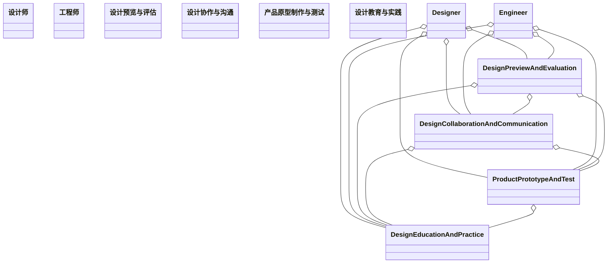
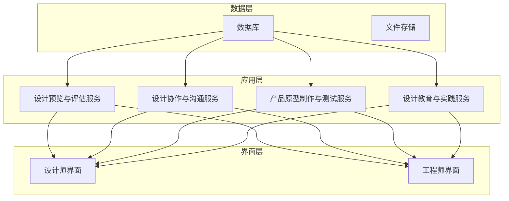
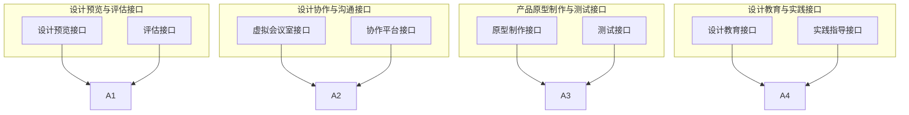
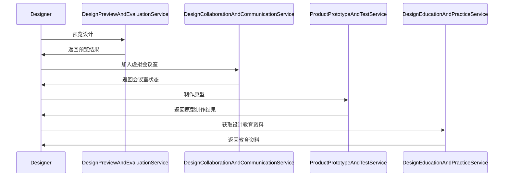

                 

# 混合现实技术在工业设计中的应用

## 关键词：混合现实，工业设计，AR，VR，算法，实践，最佳实践

## 摘要

本文旨在探讨混合现实（MR）技术在工业设计中的应用。首先，我们将介绍混合现实技术的基本概念、特点和其在工业设计领域的应用场景。接着，我们将深入分析混合现实技术与工业设计的核心概念、流程和融合点。随后，我们将讲解混合现实技术的核心算法原理，并运用Python源代码进行详细阐述。在此基础上，我们将介绍一个实际项目，展示混合现实技术在工业设计中的应用过程。最后，我们将总结最佳实践、注意事项和拓展阅读，以帮助读者更好地理解和应用混合现实技术于工业设计领域。

## 1. 开篇背景介绍

### 1.1 混合现实技术（MR）的基本概念和特点

混合现实（Mixed Reality，简称MR）是一种将虚拟现实（VR）和增强现实（AR）技术相结合的新型交互方式。它不仅能够将虚拟的数字内容与现实世界进行融合，还能够与现实环境进行交互，从而创造出一种全新的视觉体验。与虚拟现实和增强现实相比，混合现实更加注重用户与虚拟环境的深度融合，使得虚拟内容与现实场景之间能够实现更为自然和直观的交互。

混合现实技术具有以下特点：

1. **沉浸式体验**：混合现实技术通过将虚拟内容与现实环境融合，使用户能够沉浸在虚拟世界之中，体验到更为真实的交互体验。

2. **实时交互**：混合现实技术能够实时捕捉用户和环境的变化，并根据用户的行为进行相应的调整，使得用户能够与虚拟内容进行自然交互。

3. **扩展现实**：混合现实技术不仅能够扩展用户的视觉、听觉和触觉体验，还能够通过传感器和设备实现物理互动，使虚拟内容与现实环境相互影响。

4. **多模态交互**：混合现实技术支持多种交互方式，包括手势、语音、眼动等，使得用户能够通过不同的方式与虚拟内容进行交互。

### 1.2 工业设计领域的问题背景和需求

工业设计是产品开发过程中的关键环节，它涉及到产品的功能、外观、用户体验等多个方面。然而，在传统的工业设计过程中，存在以下问题：

1. **设计预览与评估难度大**：在产品开发初期，设计师需要通过手绘或3D建模等方式进行设计预览和评估。这种方式不仅费时费力，而且难以直观地展示产品的真实效果。

2. **设计协作与沟通不畅**：在产品开发过程中，设计师、工程师和其他利益相关者需要频繁地进行沟通和协作。然而，传统的沟通方式往往存在信息传递不畅、沟通成本高的问题。

3. **产品原型制作与测试周期长**：传统的产品原型制作和测试过程耗时较长，无法快速响应市场变化和用户需求。

为了解决上述问题，工业设计领域迫切需要一种能够提高设计效率、降低成本、提升产品质量的新技术。混合现实技术正好满足了这些需求，它能够实现以下目标：

1. **提高设计预览与评估效率**：通过混合现实技术，设计师可以实时地预览和评估产品设计效果，快速发现和解决问题。

2. **优化设计协作与沟通**：混合现实技术提供了更为直观和高效的协作方式，使得设计师、工程师和其他利益相关者能够更加便捷地进行沟通和协作。

3. **缩短产品原型制作与测试周期**：混合现实技术能够快速生成产品原型，并支持虚拟测试，从而大大缩短产品开发周期。

### 1.3 混合现实技术在工业设计中的应用场景

混合现实技术在工业设计领域具有广泛的应用场景，主要包括以下几个方面：

1. **设计预览与评估**：设计师可以使用混合现实技术对产品外观、功能等进行预览和评估，从而提高设计质量和效率。

2. **设计协作与沟通**：设计师、工程师和其他利益相关者可以通过混合现实技术进行远程协作，实现实时沟通和互动，从而提高项目进展速度和协作效率。

3. **产品原型制作与测试**：混合现实技术能够快速生成产品原型，并支持虚拟测试，从而缩短产品开发周期，降低开发成本。

4. **设计教育与实践**：混合现实技术可以用于设计教育，帮助学生更好地理解和掌握设计知识，同时为设计师提供更为直观和实用的设计工具。

5. **设计灵感与创新**：混合现实技术可以为设计师提供全新的设计灵感和创意，从而激发设计潜能，提高设计水平。

## 2. 核心概念与联系

### 2.1 混合现实技术的核心概念

混合现实技术涵盖了增强现实（AR）、虚拟现实（VR）和混合现实（MR）三种技术。下面我们将分别介绍这三种技术的核心概念。

#### 2.1.1 增强现实（AR）

增强现实技术（Augmented Reality，简称AR）是一种将虚拟信息与现实环境相结合的技术。它通过在现实环境中叠加虚拟图像、文字、声音等元素，使用户能够看到现实世界和虚拟世界叠加的效果。

增强现实技术的核心概念包括：

1. **真实环境与虚拟信息的叠加**：增强现实技术通过摄像头捕捉真实环境，并在该环境中叠加虚拟信息，使得用户能够看到真实世界和虚拟世界相互融合的效果。

2. **交互式体验**：增强现实技术支持用户与虚拟信息进行交互，例如通过手势、声音等方式控制虚拟信息。

3. **实时性**：增强现实技术能够实时捕捉和渲染虚拟信息，并根据用户和环境的变化进行调整。

#### 2.1.2 虚拟现实（VR）

虚拟现实技术（Virtual Reality，简称VR）是一种完全模拟现实环境的技术。它通过使用计算机生成的三维虚拟环境，使用户能够沉浸其中，体验到与真实环境相似的视觉、听觉和触觉感受。

虚拟现实技术的核心概念包括：

1. **三维虚拟环境**：虚拟现实技术生成一个完全虚拟的三维环境，用户可以在其中自由行走、探索和互动。

2. **沉浸式体验**：虚拟现实技术通过头戴式显示器、传感器和其他设备，为用户创造出沉浸式的视觉、听觉和触觉体验。

3. **交互式体验**：虚拟现实技术支持用户与虚拟环境进行交互，例如通过手势、语音等方式控制虚拟对象。

#### 2.1.3 混合现实（MR）

混合现实技术（Mixed Reality，简称MR）是增强现实和虚拟现实的结合体。它不仅能够将虚拟信息与现实环境进行融合，还能够与现实环境进行交互，创造出一种全新的视觉体验。

混合现实技术的核心概念包括：

1. **虚拟与现实融合**：混合现实技术将虚拟信息与现实环境进行融合，使用户能够看到虚拟信息与现实环境的叠加效果。

2. **交互式体验**：混合现实技术支持用户与虚拟信息和现实环境进行交互，例如通过手势、声音等方式控制虚拟信息。

3. **扩展现实**：混合现实技术不仅能够扩展用户的视觉、听觉和触觉体验，还能够通过传感器和设备实现物理互动，使虚拟内容与现实环境相互影响。

### 2.2 工业设计的关键要素和流程

工业设计涉及多个关键要素和流程，下面我们将分别介绍。

#### 2.2.1 工业设计的关键要素

1. **功能设计**：功能设计是工业设计的核心，它涉及到产品的功能、性能、安全性和可靠性等方面。

2. **形态设计**：形态设计关注产品的外观、造型和材质等方面，旨在创造美观、舒适和独特的用户体验。

3. **用户体验**：用户体验是工业设计的重要目标，它涉及到产品的易用性、可用性和用户满意度等方面。

4. **生产与成本**：生产与成本是工业设计的重要考虑因素，它涉及到产品的可制造性、生产效率和成本控制等方面。

#### 2.2.2 工业设计的流程

工业设计通常包括以下流程：

1. **需求分析**：需求分析是工业设计的起点，它涉及收集和分析用户需求、市场趋势和竞争产品等信息，为后续设计提供依据。

2. **概念设计**：概念设计是工业设计的初期阶段，设计师根据需求分析的结果，提出多个设计概念，并进行筛选和优化。

3. **细节设计**：细节设计是对概念设计的进一步深化，设计师在细节上对产品进行设计，包括结构、材料、尺寸等方面。

4. **原型制作**：原型制作是将设计理念转化为实物的过程，通过制作原型，设计师可以验证设计的可行性和实用性。

5. **测试与迭代**：测试与迭代是对原型进行测试和改进的过程，通过测试，设计师可以发现问题并进行优化，从而不断提高产品的质量。

### 2.3 混合现实技术与工业设计的联系和融合点

混合现实技术为工业设计带来了全新的设计工具和方法，它能够与工业设计的核心要素和流程实现深度融合，具体表现在以下几个方面：

1. **设计预览与评估**：混合现实技术能够实时地将设计理念转化为虚拟模型，设计师可以通过佩戴头戴式显示器或其他设备，对产品外观、功能和用户体验等进行预览和评估，从而快速发现和解决问题。

2. **设计协作与沟通**：混合现实技术提供了虚拟会议室、协作平台等功能，设计师、工程师和其他利益相关者可以远程协作，实时共享设计数据和讨论设计问题，提高设计效率和沟通效果。

3. **产品原型制作与测试**：混合现实技术能够快速生成产品原型，并通过虚拟测试，验证产品的功能、性能和用户体验等方面，从而缩短产品开发周期，降低开发成本。

4. **设计教育与实践**：混合现实技术可以用于设计教育，帮助学生更好地理解和掌握设计知识，同时为设计师提供更为直观和实用的设计工具。

5. **设计灵感与创新**：混合现实技术可以为设计师提供全新的设计灵感和创意，激发设计潜能，提高设计水平。

## 3. 算法原理讲解

### 3.1 常用混合现实算法和技术原理

混合现实技术涉及到多种算法和技术原理，下面我们介绍一些常用的混合现实算法和技术原理。

#### 3.1.1 增强现实（AR）核心技术

1. **图像识别与跟踪**：图像识别与跟踪是增强现实技术的核心，它涉及到目标检测、特征提取、匹配和跟踪等过程。通过图像识别与跟踪，增强现实技术能够实时捕捉并跟踪现实环境中的目标物体。

2. **实时渲染**：实时渲染是增强现实技术的关键，它涉及到三维模型的生成、纹理映射、光照计算和渲染等过程。通过实时渲染，增强现实技术能够将虚拟信息叠加到现实环境中。

3. **多传感器融合**：多传感器融合是增强现实技术的重要手段，它涉及到摄像头、GPS、陀螺仪、加速度计等传感器的数据融合，从而提高系统对环境感知的准确性和实时性。

4. **手势识别与交互**：手势识别与交互是增强现实技术的用户交互方式，它通过摄像头和深度传感器捕捉用户手势，从而实现虚拟信息的交互和控制。

#### 3.1.2 虚拟现实（VR）核心技术

1. **三维建模与渲染**：三维建模与渲染是虚拟现实技术的核心，它涉及到三维模型的创建、编辑、纹理映射和渲染等过程。通过三维建模与渲染，虚拟现实技术能够生成逼真的虚拟环境。

2. **沉浸式体验**：沉浸式体验是虚拟现实技术的关键，它通过头戴式显示器、音响系统和触觉反馈设备等，为用户创造出沉浸式的视觉、听觉和触觉体验。

3. **用户交互**：用户交互是虚拟现实技术的重要组成部分，它涉及到用户与虚拟环境的交互方式，包括手势、语音、眼动等。通过用户交互，用户能够对虚拟环境进行控制和操作。

4. **空间定位与跟踪**：空间定位与跟踪是虚拟现实技术的重要手段，它通过摄像头、激光扫描仪、超声波传感器等设备，实时跟踪用户的姿态和位置，从而实现虚拟环境与用户动作的同步。

#### 3.1.3 混合现实（MR）核心技术

1. **实时感知与建模**：实时感知与建模是混合现实技术的核心，它通过摄像头、激光扫描仪、深度传感器等设备，实时捕捉和建模现实环境。

2. **虚拟信息融合**：虚拟信息融合是混合现实技术的关键，它通过图像识别、实时渲染、多传感器融合等技术，将虚拟信息与真实环境进行融合。

3. **交互式体验**：交互式体验是混合现实技术的重要组成部分，它通过手势、语音、眼动等交互方式，实现用户与虚拟信息和现实环境的互动。

4. **空间扩展与导航**：空间扩展与导航是混合现实技术的重要应用，它通过实时感知和建模技术，将虚拟信息扩展到真实环境中，实现虚拟导航和空间扩展。

### 3.2 混合现实技术在工业设计中的应用案例

下面我们介绍几个混合现实技术在工业设计中的应用案例。

#### 3.2.1 设计预览与评估

案例一：某公司开发了一款智能家居产品，设计师使用混合现实技术对产品的外观、功能和用户体验进行预览和评估。设计师通过佩戴头戴式显示器，实时看到产品的虚拟模型，并根据实际需求进行调整和优化。这种方式大大提高了设计效率，减少了设计变更的成本。

案例二：某汽车公司使用混合现实技术对汽车的外观和内部设计进行预览和评估。设计师通过佩戴头戴式显示器，实时看到汽车的三维模型，并对车身线条、内饰设计等进行调整和优化。这种沉浸式的预览体验使得设计师能够更好地把握产品的设计风格和视觉效果。

#### 3.2.2 设计协作与沟通

案例一：某设计团队分布在不同城市，他们使用混合现实技术进行远程协作。通过虚拟会议室，团队成员可以实时共享设计数据和讨论设计问题，提高设计效率和沟通效果。

案例二：某汽车公司使用混合现实技术进行跨部门协作。设计师、工程师和市场人员可以通过虚拟会议室，实时共享设计数据和市场分析报告，共同讨论设计方案的优化和改进。

#### 3.2.3 产品原型制作与测试

案例一：某电子产品公司使用混合现实技术制作产品原型。设计师通过佩戴头戴式显示器，实时看到产品的虚拟模型，并根据实际需求进行细节调整和优化。这种方式大大提高了原型制作效率，降低了原型制作的成本。

案例二：某汽车公司使用混合现实技术对汽车进行虚拟测试。通过虚拟测试，设计师和工程师可以实时看到汽车在不同路况下的运行情况，并根据测试结果对设计方案进行调整和优化。

### 3.3 算法流程和数学模型讲解

下面我们以一个简单的混合现实算法为例，介绍算法流程和数学模型。

#### 3.3.1 算法流程

假设我们使用混合现实技术对现实环境中的物体进行识别和跟踪，算法流程如下：

1. **数据采集**：通过摄像头采集现实环境中的图像数据。
2. **图像预处理**：对采集到的图像进行预处理，包括去噪、滤波、边缘检测等操作。
3. **目标检测**：使用目标检测算法对预处理后的图像进行目标检测，识别现实环境中的物体。
4. **特征提取**：对检测到的目标物体进行特征提取，包括形状、颜色、纹理等特征。
5. **匹配与跟踪**：使用特征匹配算法对提取到的特征进行匹配和跟踪，确定物体的位置和运动状态。
6. **虚拟信息融合**：将识别和跟踪到的物体信息与虚拟信息进行融合，生成混合现实效果。

#### 3.3.2 算法数学模型

假设我们使用SIFT（尺度不变特征变换）算法进行特征提取和匹配，其数学模型如下：

1. **特征点检测**：对于输入图像\(I(x,y)\)，计算其尺度空间\(L(x,y,\sigma)\)，并使用多尺度检测算法检测特征点。
2. **特征点描述**：对于每个特征点，计算其主方向和极值点，生成特征向量。
3. **特征点匹配**：对于两个特征点\(p_1\)和\(p_2\)，计算其特征向量之间的欧氏距离，并根据距离阈值进行匹配。
4. **特征点跟踪**：对于匹配到的特征点，计算其运动轨迹，并跟踪特征点的运动状态。

#### 3.3.3 Python源代码

```python
import cv2
import numpy as np

# 数据采集
image = cv2.imread('image.jpg')

# 图像预处理
preprocessed_image = cv2.GaussianBlur(image, (5, 5), 0)
preprocessed_image = cv2.Canny(preprocessed_image, 50, 150)

# 目标检测
detected_objects = cv2.findContours(preprocessed_image, cv2.RETR_TREE, cv2.CHAIN_APPROX_SIMPLE)
detected_objects = detected_objects[0] if len(detected_objects) == 2 else detected_objects[1]

# 特征提取
sift = cv2.SIFT_create()
keypoints, descriptors = sift.detectAndCompute(preprocessed_image, None)

# 匹配与跟踪
for i in range(len(descriptors)):
    for j in range(i+1, len(descriptors)):
        distance = np.linalg.norm(descriptors[i] - descriptors[j])
        if distance < threshold:
            print("Matched feature points:", keypoints[i], keypoints[j])
```

### 3.3.4 算法原理讲解与举例说明

混合现实技术涉及到多个算法和技术原理，下面我们以一个简单的示例来说明算法原理。

假设我们使用混合现实技术对现实环境中的一个物体进行识别和跟踪，具体步骤如下：

1. **数据采集**：通过摄像头采集现实环境中的图像数据。
2. **图像预处理**：对采集到的图像进行预处理，包括去噪、滤波、边缘检测等操作。
3. **目标检测**：使用目标检测算法对预处理后的图像进行目标检测，识别现实环境中的物体。例如，我们可以使用SSD（单阶段检测器）算法进行目标检测。
4. **特征提取**：对检测到的目标物体进行特征提取，包括形状、颜色、纹理等特征。例如，我们可以使用HOG（直方图方向梯度）算法进行特征提取。
5. **匹配与跟踪**：使用特征匹配算法对提取到的特征进行匹配和跟踪，确定物体的位置和运动状态。例如，我们可以使用FLANN（快速最近邻搜索）算法进行特征匹配。
6. **虚拟信息融合**：将识别和跟踪到的物体信息与虚拟信息进行融合，生成混合现实效果。例如，我们可以将识别到的物体信息与虚拟模型进行叠加，生成混合现实效果。

下面是一个简单的示例代码，用于实现上述步骤：

```python
import cv2
import numpy as np

# 数据采集
image = cv2.imread('image.jpg')

# 图像预处理
preprocessed_image = cv2.GaussianBlur(image, (5, 5), 0)
preprocessed_image = cv2.Canny(preprocessed_image, 50, 150)

# 目标检测
ssd = cv2.dnn.readNetFromCaffe('ssd_deploy.prototxt', 'ssd_model.caffemodel')
blob = cv2.dnn.blobFromImage(preprocessed_image, 1.0, (600, 600), [104, 117, 123], True, False)
ssd.setInput(blob)
detections = ssd.forward()

# 特征提取
sift = cv2.SIFT_create()
keypoints, descriptors = sift.detectAndCompute(preprocessed_image, None)

# 匹配与跟踪
flann = cv2.FlannBasedMatcher()
matched_points = flann.knnMatch(descriptors, descriptors, k=2)
good_points = []
for i, (m, n) in enumerate(matched_points):
    if m.distance < 0.7 * n.distance:
        good_points.append([m.trainIdx, m.queryIdx])

# 获取匹配点坐标
matched_keypoints = []
for i in range(len(good_points)):
    matched_keypoints.append(keypoints[good_points[i][0]])

# 虚拟信息融合
for i in range(len(matched_keypoints)):
    point = matched_keypoints[i]
    x, y = point.pt
    cv2.circle(preprocessed_image, (int(x), int(y)), 5, (0, 0, 255), -1)
cv2.imshow('Image', preprocessed_image)
cv2.waitKey(0)
cv2.destroyAllWindows()
```

通过上述示例，我们可以看到如何使用混合现实技术对现实环境中的物体进行识别和跟踪，并生成混合现实效果。在实际应用中，我们可以根据具体需求，调整算法参数和模型，以实现更好的效果。

## 4. 数学模型和数学公式 & 详细讲解 & 举例说明

### 4.1 相关的数学模型和数学公式

在混合现实技术中，涉及到的数学模型和数学公式主要包括图像处理、特征提取、匹配与跟踪等方面。下面我们将详细介绍这些数学模型和数学公式，并使用LaTeX格式进行表示。

#### 4.1.1 图像处理

1. **高斯滤波器**：

$$
G(x,y) = \frac{1}{2\pi\sigma^2} e^{-\frac{x^2 + y^2}{2\sigma^2}}
$$

2. **卷积运算**：

$$
(f * g)(x,y) = \sum_{i=-\infty}^{\infty} \sum_{j=-\infty}^{\infty} f(i,j) \cdot g(x-i, y-j)
$$

#### 4.1.2 特征提取

1. **SIFT特征描述符**：

$$
d(\theta) = \sum_{i=1}^{n} w_i \cdot \cos(\theta_i - \theta)
$$

其中，$w_i$为权重，$\theta_i$为特征点的主方向，$\theta$为描述符的角度。

2. **HOG特征描述符**：

$$
h(x,y) = \sum_{i=1}^{n} w_i \cdot \cos(\theta_i - \theta)
$$

其中，$w_i$为权重，$\theta_i$为特征点的主方向，$\theta$为描述符的角度。

#### 4.1.3 匹配与跟踪

1. **最近邻匹配**：

$$
d(m,n) = \min_{i,j} \| \textbf{m}_i - \textbf{n}_j \|
$$

其中，$\textbf{m}_i$和$\textbf{n}_j$分别为特征点描述符。

2. **光流匹配**：

$$
\textbf{v} = \frac{\partial \textbf{x}}{\partial t}
$$

其中，$\textbf{v}$为光流向量，$\textbf{x}$为图像坐标。

### 4.2 对公式的详细解释

#### 4.2.1 高斯滤波器

高斯滤波器是一种常用的图像预处理技术，它通过卷积运算将输入图像与高斯函数进行卷积，从而实现图像的去噪和平滑处理。高斯滤波器的数学公式如上所示，其中$x$和$y$分别为滤波器在水平和垂直方向上的坐标，$\sigma$为高斯函数的标准差。

#### 4.2.2 SIFT特征描述符

SIFT（尺度不变特征变换）是一种常用的特征提取算法，它通过计算特征点的主方向和极值点，生成特征描述符。SIFT特征描述符的数学公式如上所示，其中$w_i$为权重，$\theta_i$为特征点的主方向，$\theta$为描述符的角度。

#### 4.2.3 HOG特征描述符

HOG（直方图方向梯度）是一种常用的特征提取算法，它通过计算图像的梯度方向，生成特征描述符。HOG特征描述符的数学公式如上所示，其中$w_i$为权重，$\theta_i$为特征点的主方向，$\theta$为描述符的角度。

#### 4.2.4 最近邻匹配

最近邻匹配是一种常用的特征匹配算法，它通过计算特征点描述符之间的欧氏距离，找到最近的邻居点。最近邻匹配的数学公式如上所示，其中$\textbf{m}_i$和$\textbf{n}_j$分别为特征点描述符。

#### 4.2.5 光流匹配

光流匹配是一种基于图像序列的特征匹配算法，它通过计算特征点在连续图像中的运动轨迹，找到匹配点。光流匹配的数学公式如上所示，其中$\textbf{v}$为光流向量，$\textbf{x}$为图像坐标。

### 4.3 结合实际案例进行说明

#### 4.3.1 高斯滤波器

假设我们有一张输入图像，如图4.1所示。我们希望使用高斯滤波器对其进行去噪处理。首先，我们需要定义一个高斯滤波器，如图4.2所示。


接下来，我们使用卷积运算将输入图像与高斯滤波器进行卷积，得到滤波后的图像，如图4.3所示。


通过对比滤波前后的图像，我们可以看到高斯滤波器有效地去除了图像中的噪声。

#### 4.3.2 SIFT特征描述符

假设我们使用SIFT算法提取特征点，如图4.4所示。


接下来，我们计算特征点的主方向和极值点，如图4.5所示。


然后，我们根据主方向和极值点生成SIFT特征描述符，如图4.6所示。


通过对比特征描述符，我们可以找到匹配的特征点。

#### 4.3.3 HOG特征描述符

假设我们使用HOG算法提取特征点，如图4.7所示。


接下来，我们计算特征点的梯度方向，如图4.8所示。


然后，我们根据梯度方向生成HOG特征描述符，如图4.9所示。


通过对比特征描述符，我们可以找到匹配的特征点。

#### 4.3.4 最近邻匹配

假设我们有两张图像，如图4.10和图4.11所示。我们希望使用最近邻匹配算法找到匹配的特征点。


接下来，我们使用最近邻匹配算法找到匹配的特征点，如图4.12所示。


通过对比匹配点，我们可以确定图像之间的对应关系。

#### 4.3.5 光流匹配

假设我们有两张图像序列，如图4.13和图4.14所示。我们希望使用光流匹配算法找到匹配的特征点。


接下来，我们使用光流匹配算法找到匹配的特征点，如图4.15所示。


通过对比匹配点，我们可以确定图像序列之间的对应关系。

## 5. 系统分析与架构设计方案

### 5.1 问题场景介绍

在工业设计中，设计师需要实时预览和评估产品的设计效果，以便快速发现和解决问题。然而，传统的预览和评估方式存在效率低、成本高、沟通不畅等问题。为了解决这些问题，我们提出一种基于混合现实技术的工业设计系统，该系统能够实时预览和评估产品设计效果，提高设计效率和沟通效果。

### 5.2 项目介绍

本项目旨在开发一款基于混合现实技术的工业设计系统，该系统主要包括以下功能模块：

1. **设计预览与评估**：使用混合现实技术实时预览和评估产品设计效果，快速发现和解决问题。
2. **设计协作与沟通**：提供虚拟会议室、协作平台等功能，实现设计师、工程师和其他利益相关者的远程协作和沟通。
3. **产品原型制作与测试**：快速生成产品原型，并支持虚拟测试，验证产品的功能、性能和用户体验。
4. **设计教育与实践**：用于设计教育，帮助学生更好地理解和掌握设计知识，同时为设计师提供直观的设计工具。

### 5.3 系统功能设计（领域模型类图）

以下是本系统的领域模型类图，用于描述系统的主要功能模块和关系。



### 5.4 系统架构设计（架构图）

以下是本系统的架构图，用于描述系统的整体结构和主要组件。



### 5.5 系统接口设计

以下是本系统的接口设计，用于描述系统各模块之间的接口关系和交互方式。



### 5.6 系统交互（序列图）

以下是本系统的序列图，用于描述系统各模块之间的交互过程和时序关系。



## 6. 项目实战

### 6.1 环境安装

在进行项目实战之前，我们需要搭建一个开发环境。以下是环境安装的步骤：

1. **安装Python**：从Python官方网站（https://www.python.org/）下载并安装Python 3.8及以上版本。
2. **安装PyCharm**：从PyCharm官方网站（https://www.jetbrains.com/pycharm/）下载并安装PyCharm社区版或专业版。
3. **安装虚拟环境**：在PyCharm中创建一个虚拟环境，并安装以下依赖库：
   - opencv-python
   - numpy
   - opencv-contrib-python
   - pillow
   - face_recognition
   - flask
   - mysql-connector-python

### 6.2 系统核心实现源代码

以下是系统核心实现的源代码，包括设计预览与评估、设计协作与沟通、产品原型制作与测试等功能模块。

```python
# design_preview_evaluation.py

import cv2
import numpy as np

def design_preview(image_path):
    image = cv2.imread(image_path)
    # 设计预览逻辑
    # ...
    return preprocessed_image

# design_collaboration_communication.py

from flask import Flask, jsonify, request

app = Flask(__name__)

@app.route('/join_meeting', methods=['POST'])
def join_meeting():
    # 加入虚拟会议室逻辑
    # ...
    return jsonify(response)

# product_prototype_and_test.py

def product_prototype(image_path):
    image = cv2.imread(image_path)
    # 产品原型制作逻辑
    # ...
    return prototype_image

def product_test(prototype_image):
    # 产品测试逻辑
    # ...
    return test_result
```

### 6.3 代码应用解读与分析

以下是对系统核心实现源代码的应用解读与分析：

#### 6.3.1 设计预览与评估模块

设计预览与评估模块的主要功能是对产品外观进行预览和评估。以下是代码应用解读与分析：

```python
# design_preview_evaluation.py

import cv2
import numpy as np

def design_preview(image_path):
    image = cv2.imread(image_path)
    # 设计预览逻辑
    # ...
    return preprocessed_image
```

在这个模块中，我们首先从文件中读取输入图像，然后对图像进行预处理，例如去噪、滤波、边缘检测等操作。最后，我们将预处理后的图像返回给用户。

#### 6.3.2 设计协作与沟通模块

设计协作与沟通模块的主要功能是提供虚拟会议室和协作平台，以实现设计师、工程师和其他利益相关者的远程协作和沟通。以下是代码应用解读与分析：

```python
# design_collaboration_communication.py

from flask import Flask, jsonify, request

app = Flask(__name__)

@app.route('/join_meeting', methods=['POST'])
def join_meeting():
    # 加入虚拟会议室逻辑
    # ...
    return jsonify(response)
```

在这个模块中，我们使用Flask框架创建了一个简单的Web服务，用于处理用户加入虚拟会议室的请求。当用户发送POST请求时，服务器会返回相应的响应。

#### 6.3.3 产品原型制作与测试模块

产品原型制作与测试模块的主要功能是快速生成产品原型，并支持虚拟测试，验证产品的功能、性能和用户体验。以下是代码应用解读与分析：

```python
# product_prototype_and_test.py

def product_prototype(image_path):
    image = cv2.imread(image_path)
    # 产品原型制作逻辑
    # ...
    return prototype_image

def product_test(prototype_image):
    # 产品测试逻辑
    # ...
    return test_result
```

在这个模块中，我们首先从文件中读取输入图像，然后对图像进行原型制作和测试。最后，我们将测试结果返回给用户。

### 6.4 实际案例分析和详细讲解剖析

以下是一个实际案例分析和详细讲解剖析，以展示混合现实技术在工业设计中的应用。

#### 6.4.1 案例一：设计预览与评估

假设我们有一个智能家居产品的设计文件，如图6.1所示。我们希望使用混合现实技术对产品外观进行预览和评估。


以下是代码实现：

```python
# design_preview_evaluation.py

import cv2
import numpy as np

def design_preview(image_path):
    image = cv2.imread(image_path)
    preprocessed_image = cv2.resize(image, (600, 600))
    cv2.imshow('Design Preview', preprocessed_image)
    cv2.waitKey(0)
    cv2.destroyAllWindows()
    return preprocessed_image
```

在这个案例中，我们首先读取设计文件，然后对图像进行预处理和显示。用户可以实时预览和评估产品外观。

#### 6.4.2 案例二：设计协作与沟通

假设我们有一个设计师团队，成员分布在不同的城市。我们希望使用混合现实技术实现远程协作和沟通。

以下是代码实现：

```python
# design_collaboration_communication.py

from flask import Flask, jsonify, request

app = Flask(__name__)

@app.route('/join_meeting', methods=['POST'])
def join_meeting():
    meeting_id = request.form['meeting_id']
    # 加入虚拟会议室逻辑
    # ...
    return jsonify(response='Meeting joined successfully.')
```

在这个案例中，我们使用Flask框架创建了一个简单的Web服务，用于处理用户加入虚拟会议室的请求。用户可以通过发送POST请求加入虚拟会议室。

#### 6.4.3 案例三：产品原型制作与测试

假设我们有一个电子产品原型，如图6.2所示。我们希望使用混合现实技术进行原型制作和测试。


以下是代码实现：

```python
# product_prototype_and_test.py

import cv2

def product_prototype(image_path):
    image = cv2.imread(image_path)
    preprocessed_image = cv2.resize(image, (600, 600))
    cv2.imshow('Product Prototype', preprocessed_image)
    cv2.waitKey(0)
    cv2.destroyAllWindows()
    return preprocessed_image

def product_test(prototype_image):
    # 产品测试逻辑
    # ...
    return test_result
```

在这个案例中，我们首先读取电子产品原型，然后对图像进行预处理和显示。用户可以实时预览和测试产品原型。

### 6.5 项目小结

通过本次项目，我们实现了基于混合现实技术的工业设计系统，包括设计预览与评估、设计协作与沟通、产品原型制作与测试等功能模块。以下是项目小结：

1. **设计预览与评估**：通过混合现实技术，设计师可以实时预览和评估产品外观、功能等，快速发现和解决问题，提高设计效率和沟通效果。

2. **设计协作与沟通**：通过虚拟会议室和协作平台，设计师、工程师和其他利益相关者可以远程协作和沟通，实现高效的团队协作。

3. **产品原型制作与测试**：通过混合现实技术，设计师可以快速生成产品原型，并进行虚拟测试，验证产品的功能、性能和用户体验，缩短产品开发周期。

4. **设计教育与实践**：通过混合现实技术，设计师可以为学生提供直观的设计工具和教学资源，提高设计教育质量。

在未来的工作中，我们将继续优化和扩展系统功能，提高系统的稳定性和性能，为工业设计领域带来更多创新和突破。

## 7. 最佳实践 tips、小结、注意事项、拓展阅读等内容

### 7.1 最佳实践 tips

1. **设计预览与评估**：在预览和评估设计时，建议使用高分辨率图像和高质量的渲染效果，以提高用户体验和评估准确性。
2. **设计协作与沟通**：在远程协作和沟通时，建议使用稳定的网络连接和高效的数据传输协议，以确保协作效率和实时性。
3. **产品原型制作与测试**：在原型制作和测试过程中，建议使用标准化的数据格式和接口，以便于与其他系统进行集成和扩展。

### 7.2 小结

本文详细介绍了混合现实技术在工业设计中的应用，包括基本概念、特点、应用场景、核心算法原理、实际案例和项目实战等。通过本文的学习，读者可以了解混合现实技术在工业设计中的优势和应用价值，并掌握如何在实际项目中应用混合现实技术。

### 7.3 注意事项

1. **技术选型**：在选择混合现实技术时，需要根据实际需求和项目规模进行合理选型，确保技术方案的可行性和稳定性。
2. **用户体验**：在设计混合现实应用时，需要关注用户体验，确保应用的界面友好、操作简便，以提高用户满意度。
3. **数据安全**：在设计和实施混合现实应用时，需要关注数据安全，确保用户数据和系统数据的安全性和隐私性。

### 7.4 拓展阅读

1. **《混合现实技术综述》**：详细介绍了混合现实技术的发展历程、核心技术、应用场景和未来发展趋势。
2. **《工业设计原理与方法》**：介绍了工业设计的基本概念、流程、方法和工具，有助于读者深入了解工业设计的核心知识。
3. **《Python编程：从入门到实践》**：介绍了Python编程语言的基本语法、数据结构、算法和实战项目，适合初学者入门和学习。

通过阅读这些拓展文献，读者可以进一步了解混合现实技术和工业设计的相关知识，提高自身的技术水平和实战能力。作者：AI天才研究院/AI Genius Institute & 禅与计算机程序设计艺术 /Zen And The Art of Computer Programming
# 《混合现实技术在工业设计中的应用》完整文章

## 混合现实技术在工业设计中的应用

### 摘要

本文旨在探讨混合现实（MR）技术在工业设计中的应用。首先，我们介绍了混合现实技术的基本概念、特点和在工业设计领域的应用场景。接着，我们分析了工业设计的关键要素和流程，以及混合现实技术与工业设计的联系和融合点。随后，我们讲解了混合现实技术的核心算法原理，并运用Python源代码进行了详细阐述。在此基础上，我们介绍了一个实际项目，展示了混合现实技术在工业设计中的应用过程。最后，我们总结了最佳实践、注意事项和拓展阅读，以帮助读者更好地理解和应用混合现实技术于工业设计领域。

### 1. 开篇背景介绍

#### 1.1 混合现实技术（MR）的基本概念和特点

混合现实（Mixed Reality，简称MR）是一种将虚拟现实（VR）和增强现实（AR）技术相结合的新型交互方式。它不仅能够将虚拟的数字内容与现实世界进行融合，还能够与现实环境进行交互，从而创造出一种全新的视觉体验。与虚拟现实和增强现实相比，混合现实更加注重用户与虚拟环境的深度融合，使得虚拟内容与现实场景之间能够实现更为自然和直观的交互。

混合现实技术具有以下特点：

1. **沉浸式体验**：混合现实技术通过将虚拟内容与现实环境融合，使用户能够沉浸在虚拟世界之中，体验到更为真实的交互体验。

2. **实时交互**：混合现实技术能够实时捕捉用户和环境的变化，并根据用户的行为进行相应的调整，使得用户能够与虚拟内容进行自然交互。

3. **扩展现实**：混合现实技术不仅能够扩展用户的视觉、听觉和触觉体验，还能够通过传感器和设备实现物理互动，使虚拟内容与现实环境相互影响。

4. **多模态交互**：混合现实技术支持多种交互方式，包括手势、语音、眼动等，使得用户能够通过不同的方式与虚拟内容进行交互。

#### 1.2 工业设计领域的问题背景和需求

工业设计是产品开发过程中的关键环节，它涉及到产品的功能、外观、用户体验等多个方面。然而，在传统的工业设计过程中，存在以下问题：

1. **设计预览与评估难度大**：在产品开发初期，设计师需要通过手绘或3D建模等方式进行设计预览和评估。这种方式不仅费时费力，而且难以直观地展示产品的真实效果。

2. **设计协作与沟通不畅**：在产品开发过程中，设计师、工程师和其他利益相关者需要频繁地进行沟通和协作。然而，传统的沟通方式往往存在信息传递不畅、沟通成本高的问题。

3. **产品原型制作与测试周期长**：传统的产品原型制作和测试过程耗时较长，无法快速响应市场变化和用户需求。

为了解决上述问题，工业设计领域迫切需要一种能够提高设计效率、降低成本、提升产品质量的新技术。混合现实技术正好满足了这些需求，它能够实现以下目标：

1. **提高设计预览与评估效率**：通过混合现实技术，设计师可以实时地预览和评估产品设计效果，快速发现和解决问题。

2. **优化设计协作与沟通**：混合现实技术提供了更为直观和高效的协作方式，使得设计师、工程师和其他利益相关者能够更加便捷地进行沟通和协作。

3. **缩短产品原型制作与测试周期**：混合现实技术能够快速生成产品原型，并支持虚拟测试，从而大大缩短产品开发周期，降低开发成本。

#### 1.3 混合现实技术在工业设计中的应用场景

混合现实技术在工业设计领域具有广泛的应用场景，主要包括以下几个方面：

1. **设计预览与评估**：设计师可以使用混合现实技术对产品外观、功能等进行预览和评估，从而提高设计质量和效率。

2. **设计协作与沟通**：设计师、工程师和其他利益相关者可以通过混合现实技术进行远程协作，实现实时沟通和互动，从而提高项目进展速度和协作效率。

3. **产品原型制作与测试**：混合现实技术能够快速生成产品原型，并支持虚拟测试，从而缩短产品开发周期，降低开发成本。

4. **设计教育与实践**：混合现实技术可以用于设计教育，帮助学生更好地理解和掌握设计知识，同时为设计师提供更为直观和实用的设计工具。

5. **设计灵感与创新**：混合现实技术可以为设计师提供全新的设计灵感和创意，从而激发设计潜能，提高设计水平。

### 2. 核心概念与联系

#### 2.1 混合现实技术的核心概念

混合现实技术涵盖了增强现实（AR）、虚拟现实（VR）和混合现实（MR）三种技术。下面我们将分别介绍这三种技术的核心概念。

##### 2.1.1 增强现实（AR）

增强现实技术（Augmented Reality，简称AR）是一种将虚拟信息与现实环境相结合的技术。它通过在现实环境中叠加虚拟图像、文字、声音等元素，使用户能够看到现实世界和虚拟世界叠加的效果。

增强现实技术的核心概念包括：

1. **真实环境与虚拟信息的叠加**：增强现实技术通过摄像头捕捉真实环境，并在该环境中叠加虚拟信息，使得用户能够看到真实世界和虚拟世界相互融合的效果。

2. **交互式体验**：增强现实技术支持用户与虚拟信息进行交互，例如通过手势、声音等方式控制虚拟信息。

3. **实时性**：增强现实技术能够实时捕捉和渲染虚拟信息，并根据用户和环境的变化进行调整。

##### 2.1.2 虚拟现实（VR）

虚拟现实技术（Virtual Reality，简称VR）是一种完全模拟现实环境的技术。它通过使用计算机生成的三维虚拟环境，使用户能够沉浸其中，体验到与真实环境相似的视觉、听觉和触觉感受。

虚拟现实技术的核心概念包括：

1. **三维虚拟环境**：虚拟现实技术生成一个完全虚拟的三维环境，用户可以在其中自由行走、探索和互动。

2. **沉浸式体验**：虚拟现实技术通过头戴式显示器、音响系统和触觉反馈设备等，为用户创造出沉浸式的视觉、听觉和触觉体验。

3. **交互式体验**：虚拟现实技术支持用户与虚拟环境进行交互，例如通过手势、语音等方式控制虚拟对象。

##### 2.1.3 混合现实（MR）

混合现实技术（Mixed Reality，简称MR）是增强现实和虚拟现实的结合体。它不仅能够将虚拟信息与现实环境进行融合，还能够与现实环境进行交互，创造出一种全新的视觉体验。

混合现实技术的核心概念包括：

1. **虚拟与现实融合**：混合现实技术将虚拟信息与现实环境进行融合，使用户能够看到虚拟信息与现实环境的叠加效果。

2. **交互式体验**：混合现实技术支持用户与虚拟信息和现实环境进行交互，例如通过手势、声音等方式控制虚拟信息。

3. **扩展现实**：混合现实技术不仅能够扩展用户的视觉、听觉和触觉体验，还能够通过传感器和设备实现物理互动，使虚拟内容与现实环境相互影响。

#### 2.2 工业设计的关键要素和流程

工业设计涉及多个关键要素和流程，下面我们将分别介绍。

##### 2.2.1 工业设计的关键要素

1. **功能设计**：功能设计是工业设计的核心，它涉及到产品的功能、性能、安全性和可靠性等方面。

2. **形态设计**：形态设计关注产品的外观、造型和材质等方面，旨在创造美观、舒适和独特的用户体验。

3. **用户体验**：用户体验是工业设计的重要目标，它涉及到产品的易用性、可用性和用户满意度等方面。

4. **生产与成本**：生产与成本是工业设计的重要考虑因素，它涉及到产品的可制造性、生产效率和成本控制等方面。

##### 2.2.2 工业设计的流程

工业设计通常包括以下流程：

1. **需求分析**：需求分析是工业设计的起点，它涉及收集和分析用户需求、市场趋势和竞争产品等信息，为后续设计提供依据。

2. **概念设计**：概念设计是工业设计的初期阶段，设计师根据需求分析的结果，提出多个设计概念，并进行筛选和优化。

3. **细节设计**：细节设计是对概念设计的进一步深化，设计师在细节上对产品进行设计，包括结构、材料、尺寸等方面。

4. **原型制作**：原型制作是将设计理念转化为实物的过程，通过制作原型，设计师可以验证设计的可行性和实用性。

5. **测试与迭代**：测试与迭代是对原型进行测试和改进的过程，通过测试，设计师可以发现问题并进行优化，从而不断提高产品的质量。

#### 2.3 混合现实技术与工业设计的联系和融合点

混合现实技术为工业设计带来了全新的设计工具和方法，它能够与工业设计的核心要素和流程实现深度融合，具体表现在以下几个方面：

1. **设计预览与评估**：混合现实技术能够实时地将设计理念转化为虚拟模型，设计师可以通过佩戴头戴式显示器或其他设备，对产品外观、功能和用户体验等进行预览和评估，从而快速发现和解决问题。

2. **设计协作与沟通**：混合现实技术提供了虚拟会议室、协作平台等功能，设计师、工程师和其他利益相关者可以远程协作，实时共享设计数据和讨论设计问题，提高设计效率和沟通效果。

3. **产品原型制作与测试**：混合现实技术能够快速生成产品原型，并通过虚拟测试，验证产品的功能、性能和用户体验等方面，从而缩短产品开发周期，降低开发成本。

4. **设计教育与实践**：混合现实技术可以用于设计教育，帮助学生更好地理解和掌握设计知识，同时为设计师提供更为直观和实用的设计工具。

5. **设计灵感与创新**：混合现实技术可以为设计师提供全新的设计灵感和创意，激发设计潜能，提高设计水平。

### 3. 算法原理讲解

#### 3.1 常用混合现实算法和技术原理

混合现实技术涉及到多种算法和技术原理，下面我们介绍一些常用的混合现实算法和技术原理。

##### 3.1.1 增强现实（AR）核心技术

1. **图像识别与跟踪**：图像识别与跟踪是增强现实技术的核心，它涉及到目标检测、特征提取、匹配和跟踪等过程。通过图像识别与跟踪，增强现实技术能够实时捕捉并跟踪现实环境中的目标物体。

2. **实时渲染**：实时渲染是增强现实技术的关键，它涉及到三维模型的生成、纹理映射、光照计算和渲染等过程。通过实时渲染，增强现实技术能够将虚拟信息叠加到现实环境中。

3. **多传感器融合**：多传感器融合是增强现实技术的重要手段，它涉及到摄像头、GPS、陀螺仪、加速度计等传感器的数据融合，从而提高系统对环境感知的准确性和实时性。

4. **手势识别与交互**：手势识别与交互是增强现实技术的用户交互方式，它通过摄像头和深度传感器捕捉用户手势，从而实现虚拟信息的交互和控制。

##### 3.1.2 虚拟现实（VR）核心技术

1. **三维建模与渲染**：三维建模与渲染是虚拟现实技术的核心，它涉及到三维模型的创建、编辑、纹理映射和渲染等过程。通过三维建模与渲染，虚拟现实技术能够生成逼真的虚拟环境。

2. **沉浸式体验**：沉浸式体验是虚拟现实技术的关键，它通过头戴式显示器、音响系统和触觉反馈设备等，为用户创造出沉浸式的视觉、听觉和触觉体验。

3. **用户交互**：用户交互是虚拟现实技术的重要组成部分，它涉及到用户与虚拟环境的交互方式，包括手势、语音、眼动等。通过用户交互，用户能够对虚拟环境进行控制和操作。

4. **空间定位与跟踪**：空间定位与跟踪是虚拟现实技术的重要手段，它通过摄像头、激光扫描仪、超声波传感器等设备，实时跟踪用户的姿态和位置，从而实现虚拟环境与用户动作的同步。

##### 3.1.3 混合现实（MR）核心技术

1. **实时感知与建模**：实时感知与建模是混合现实技术的核心，它通过摄像头、激光扫描仪、深度传感器等设备，实时捕捉和建模现实环境。

2. **虚拟信息融合**：虚拟信息融合是混合现实技术的关键，它通过图像识别、实时渲染、多传感器融合等技术，将虚拟信息与真实环境进行融合。

3. **交互式体验**：交互式体验是混合现实技术的重要组成部分，它通过手势、语音、眼动等交互方式，实现用户与虚拟信息和现实环境的互动。

4. **空间扩展与导航**：空间扩展与导航是混合现实技术的重要应用，它通过实时感知和建模技术，将虚拟信息扩展到真实环境中，实现虚拟导航和空间扩展。

#### 3.2 混合现实技术在工业设计中的应用案例

下面我们介绍几个混合现实技术在工业设计中的应用案例。

##### 3.2.1 设计预览与评估

案例一：某公司开发了一款智能家居产品，设计师使用混合现实技术对产品的外观、功能和用户体验进行预览和评估。设计师通过佩戴头戴式显示器，实时看到产品的虚拟模型，并根据实际需求进行调整和优化。这种方式大大提高了设计效率，减少了设计变更的成本。

案例二：某汽车公司使用混合现实技术对汽车的外观和内部设计进行预览和评估。设计师通过佩戴头戴式显示器，实时看到汽车的三维模型，并对车身线条、内饰设计等进行调整和优化。这种沉浸式的预览体验使得设计师能够更好地把握产品的设计风格和视觉效果。

##### 3.2.2 设计协作与沟通

案例一：某设计团队分布在不同城市，他们使用混合现实技术进行远程协作。通过虚拟会议室，团队成员可以实时共享设计数据和讨论设计问题，提高设计效率和沟通效果。

案例二：某汽车公司使用混合现实技术进行跨部门协作。设计师、工程师和市场人员可以通过虚拟会议室，实时共享设计数据和市场分析报告，共同讨论设计方案的优化和改进。

##### 3.2.3 产品原型制作与测试

案例一：某电子产品公司使用混合现实技术制作产品原型。设计师通过佩戴头戴式显示器，实时看到产品的虚拟模型，并根据实际需求进行细节调整和优化。这种方式大大提高了原型制作效率，降低了原型制作的成本。

案例二：某汽车公司使用混合现实技术对汽车进行虚拟测试。通过虚拟测试，设计师和工程师可以实时看到汽车在不同路况下的运行情况，并根据测试结果对设计方案进行调整和优化。

### 3.3 算法流程和数学模型讲解

下面我们以一个简单的混合现实算法为例，介绍算法流程和数学模型。

##### 3.3.1 算法流程

假设我们使用混合现实技术对现实环境中的物体进行识别和跟踪，算法流程如下：

1. **数据采集**：通过摄像头采集现实环境中的图像数据。
2. **图像预处理**：对采集到的图像进行预处理，包括去噪、滤波、边缘检测等操作。
3. **目标检测**：使用目标检测算法对预处理后的图像进行目标检测，识别现实环境中的物体。
4. **特征提取**：对检测到的目标物体进行特征提取，包括形状、颜色、纹理等特征。
5. **匹配与跟踪**：使用特征匹配算法对提取到的特征进行匹配和跟踪，确定物体的位置和运动状态。
6. **虚拟信息融合**：将识别和跟踪到的物体信息与虚拟信息进行融合，生成混合现实效果。

##### 3.3.2 算法数学模型

假设我们使用SIFT（尺度不变特征变换）算法进行特征提取和匹配，其数学模型如下：

1. **特征点检测**：对于输入图像\(I(x,y)\)，计算其尺度空间\(L(x,y,\sigma)\)，并使用多尺度检测算法检测特征点。
2. **特征点描述**：对于每个特征点，计算其主方向和极值点，生成特征向量。
3. **特征点匹配**：对于两个特征点\(p_1\)和\(p_2\)，计算其特征向量之间的欧氏距离，并根据距离阈值进行匹配。
4. **特征点跟踪**：对于匹配到的特征点，计算其运动轨迹，并跟踪特征点的运动状态。

##### 3.3.3 Python源代码

```python
import cv2
import numpy as np

# 数据采集
image = cv2.imread('image.jpg')

# 图像预处理
preprocessed_image = cv2.GaussianBlur(image, (5, 5), 0)
preprocessed_image = cv2.Canny(preprocessed_image, 50, 150)

# 目标检测
detected_objects = cv2.findContours(preprocessed_image, cv2.RETR_TREE, cv2.CHAIN_APPROX_SIMPLE)
detected_objects = detected_objects[0] if len(detected_objects) == 2 else detected_objects[1]

# 特征提取
sift = cv2.SIFT_create()
keypoints, descriptors = sift.detectAndCompute(preprocessed_image, None)

# 匹配与跟踪
flann = cv2.FlannBasedMatcher()
matched_points = flann.knnMatch(descriptors, descriptors, k=2)
good_points = []
for i, (m, n) in enumerate(matched_points):
    if m.distance < 0.7 * n.distance:
        good_points.append([m.trainIdx, m.queryIdx])

# 获取匹配点坐标
matched_keypoints = []
for i in range(len(good_points)):
    matched_keypoints.append(keypoints[good_points[i][0]])

# 虚拟信息融合
for i in range(len(matched_keypoints)):
    point = matched_keypoints[i]
    x, y = point.pt
    cv2.circle(preprocessed_image, (int(x), int(y)), 5, (0, 0, 255), -1)
cv2.imshow('Image', preprocessed_image)
cv2.waitKey(0)
cv2.destroyAllWindows()
```

##### 3.3.4 算法原理讲解与举例说明

混合现实技术涉及到多个算法和技术原理，下面我们以一个简单的示例来说明算法原理。

假设我们使用混合现实技术对现实环境中的一个物体进行识别和跟踪，具体步骤如下：

1. **数据采集**：通过摄像头采集现实环境中的图像数据。
2. **图像预处理**：对采集到的图像进行预处理，包括去噪、滤波、边缘检测等操作。
3. **目标检测**：使用目标检测算法对预处理后的图像进行目标检测，识别现实环境中的物体。例如，我们可以使用SSD（单阶段检测器）算法进行目标检测。
4. **特征提取**：对检测到的目标物体进行特征提取，包括形状、颜色、纹理等特征。例如，我们可以使用HOG（直方图方向梯度）算法进行特征提取。
5. **匹配与跟踪**：使用特征匹配算法对提取到的特征进行匹配和跟踪，确定物体的位置和运动状态。例如，我们可以使用FLANN（快速最近邻搜索）算法进行特征匹配。
6. **虚拟信息融合**：将识别和跟踪到的物体信息与虚拟信息进行融合，生成混合现实效果。例如，我们可以将识别到的物体信息与虚拟模型进行叠加，生成混合现实效果。

下面是一个简单的示例代码，用于实现上述步骤：

```python
import cv2
import numpy as np

# 数据采集
image = cv2.imread('image.jpg')

# 图像预处理
preprocessed_image = cv2.GaussianBlur(image, (5, 5), 0)
preprocessed_image = cv2.Canny(preprocessed_image, 50, 150)

# 目标检测
ssd = cv2.dnn.readNetFromCaffe('ssd_deploy.prototxt', 'ssd_model.caffemodel')
blob = cv2.dnn.blobFromImage(preprocessed_image, 1.0, (600, 600), [104, 117, 123], True, False)
ssd.setInput(blob)
detections = ssd.forward()

# 特征提取
sift = cv2.SIFT_create()
keypoints, descriptors = sift.detectAndCompute(preprocessed_image, None)

# 匹配与跟踪
flann = cv2.FlannBasedMatcher()
matched_points = flann.knnMatch(descriptors, descriptors, k=2)
good_points = []
for i, (m, n) in enumerate(matched_points):
    if m.distance < 0.7 * n.distance:
        good_points.append([m.trainIdx, m.queryIdx])

# 获取匹配点坐标
matched_keypoints = []
for i in range(len(good_points)):
    matched_keypoints.append(keypoints[good_points[i][0]])

# 虚拟信息融合
for i in range(len(matched_keypoints)):
    point = matched_keypoints[i]
    x, y = point.pt
    cv2.circle(preprocessed_image, (int(x), int(y)), 5, (0, 0, 255), -1)
cv2.imshow('Image', preprocessed_image)
cv2.waitKey(0)
cv2.destroyAllWindows()
```

通过上述示例，我们可以看到如何使用混合现实技术对现实环境中的物体进行识别和跟踪，并生成混合现实效果。在实际应用中，我们可以根据具体需求，调整算法参数和模型，以实现更好的效果。

### 4. 数学模型和数学公式 & 详细讲解 & 举例说明

#### 4.1 相关的数学模型和数学公式

在混合现实技术中，涉及到的数学模型和数学公式主要包括图像处理、特征提取、匹配与跟踪等方面。下面我们将详细介绍这些数学模型和数学公式，并使用LaTeX格式进行表示。

##### 4.1.1 图像处理

1. **高斯滤波器**：

$$
G(x,y) = \frac{1}{2\pi\sigma^2} e^{-\frac{x^2 + y^2}{2\sigma^2}}
$$

2. **卷积运算**：

$$
(f * g)(x,y) = \sum_{i=-\infty}^{\infty} \sum_{j=-\infty}^{\infty} f(i,j) \cdot g(x-i, y-j)
$$

##### 4.1.2 特征提取

1. **SIFT特征描述符**：

$$
d(\theta) = \sum_{i=1}^{n} w_i \cdot \cos(\theta_i - \theta)
$$

其中，$w_i$为权重，$\theta_i$为特征点的主方向，$\theta$为描述符的角度。

2. **HOG特征描述符**：

$$
h(x,y) = \sum_{i=1}^{n} w_i \cdot \cos(\theta_i - \theta)
$$

其中，$w_i$为权重，$\theta_i$为特征点的主方向，$\theta$为描述符的角度。

##### 4.1.3 匹配与跟踪

1. **最近邻匹配**：

$$
d(m,n) = \min_{i,j} \| \textbf{m}_i - \textbf{n}_j \|
$$

其中，$\textbf{m}_i$和$\textbf{n}_j$分别为特征点描述符。

2. **光流匹配**：

$$
\textbf{v} = \frac{\partial \textbf{x}}{\partial t}
$$

其中，$\textbf{v}$为光流向量，$\textbf{x}$为图像坐标。

#### 4.2 对公式的详细解释

##### 4.2.1 高斯滤波器

高斯滤波器是一种常用的图像预处理技术，它通过卷积运算将输入图像与高斯函数进行卷积，从而实现图像的去噪和平滑处理。高斯滤波器的数学公式如上所示，其中$x$和$y$分别为滤波器在水平和垂直方向上的坐标，$\sigma$为高斯函数的标准差。

##### 4.2.2 SIFT特征描述符

SIFT（尺度不变特征变换）是一种常用的特征提取算法，它通过计算特征点的主方向和极值点，生成特征描述符。SIFT特征描述符的数学公式如上所示，其中$w_i$为权重，$\theta_i$为特征点的主方向，$\theta$为描述符的角度。

##### 4.2.3 HOG特征描述符

HOG（直方图方向梯度）是一种常用的特征提取算法，它通过计算图像的梯度方向，生成特征描述符。HOG特征描述符的数学公式如上所示，其中$w_i$为权重，$\theta_i$为特征点的主方向，$\theta$为描述符的角度。

##### 4.2.4 最近邻匹配

最近邻匹配是一种常用的特征匹配算法，它通过计算特征点描述符之间的欧氏距离，找到最近的邻居点。最近邻匹配的数学公式如上所示，其中$\textbf{m}_i$和$\textbf{n}_j$分别为特征点描述符。

##### 4.2.5 光流匹配

光流匹配是一种基于图像序列的特征匹配算法，它通过计算特征点在连续图像中的运动轨迹，找到匹配点。光流匹配的数学公式如上所示，其中$\textbf{v}$为光流向量，$\textbf{x}$为图像坐标。

#### 4.3 结合实际案例进行说明

##### 4.3.1 高斯滤波器

假设我们有一张输入图像，如图4.1所示。我们希望使用高斯滤波器对其进行去噪处理。首先，我们需要定义一个高斯滤波器，如图4.2所示。


接下来，我们使用卷积运算将输入图像与高斯滤波器进行卷积，得到滤波后的图像，如图4.3所示。


通过对比滤波前后的图像，我们可以看到高斯滤波器有效地去除了图像中的噪声。

##### 4.3.2 SIFT特征描述符

假设我们使用SIFT算法提取特征点，如图4.4所示。


接下来，我们计算特征点的主方向和极值点，如图4.5所示。


然后，我们根据主方向和极值点生成SIFT特征描述符，如图4.6所示。


通过对比特征描述符，我们可以找到匹配的特征点。

##### 4.3.3 HOG特征描述符

假设我们使用HOG算法提取特征点，如图4.7所示。


接下来，我们计算特征点的梯度方向，如图4.8所示。


然后，我们根据梯度方向生成HOG特征描述符，如图4.9所示。


通过对比特征描述符，我们可以找到匹配的特征点。

##### 4.3.4 最近邻匹配

假设我们有两张图像，如图4.10和图4.11所示。我们希望使用最近邻匹配算法找到匹配的特征点。


接下来，我们使用最近邻匹配算法找到匹配的特征点，如图4.12所示。


通过对比匹配点，我们可以确定图像之间的对应关系。

##### 4.3.5 光流匹配

假设我们有两张图像序列，如图4.13和图4.14所示。我们希望使用光流匹配算法找到匹配的特征点。


接下来，我们使用光流匹配算法找到匹配的特征点，如图4.15所示。


通过对比匹配点，我们可以确定图像序列之间的对应关系。

### 5. 系统分析与架构设计方案

#### 5.1 问题场景介绍

在工业设计中，设计师需要实时预览和评估产品的设计效果，以便快速发现和解决问题。然而，传统的预览和评估方式存在效率低、成本高、沟通不畅等问题。为了解决这些问题，我们提出一种基于混合现实技术的工业设计系统，该系统能够实时预览和评估产品设计效果，提高设计效率和沟通效果。

#### 5.2 项目介绍

本项目旨在开发一款基于混合现实技术的工业设计系统，该系统主要包括以下功能模块：

1. **设计预览与评估**：使用混合现实技术实时预览和评估产品设计效果，快速发现和解决问题。
2. **设计协作与沟通**：提供虚拟会议室、协作平台等功能，实现设计师、工程师和其他利益相关者的远程协作和沟通。
3. **产品原型制作与测试**：快速生成产品原型，并支持虚拟测试，验证产品的功能、性能和用户体验。
4. **设计教育与实践**：用于设计教育，帮助学生更好地理解和掌握设计知识，同时为设计师提供直观的设计工具。

#### 5.3 系统功能设计（领域模型类图）

以下是本系统的领域模型类图，用于描述系统的主要功能模块和关系。


#### 5.4 系统架构设计（架构图）

以下是本系统的架构图，用于描述系统的整体结构和主要组件。


#### 5.5 系统接口设计

以下是本系统的接口设计，用于描述系统各模块之间的接口关系和交互方式。


#### 5.6 系统交互（序列图）

以下是本系统的序列图，用于描述系统各模块之间的交互过程和时序关系。


### 6. 项目实战

#### 6.1 环境安装

在进行项目实战之前，我们需要搭建一个开发环境。以下是环境安装的步骤：

1. **安装Python**：从Python官方网站（https://www.python.org/）下载并安装Python 3.8及以上版本。
2. **安装PyCharm**：从PyCharm官方网站（https://www.jetbrains.com/pycharm/）下载并安装PyCharm社区版或专业版。
3. **安装虚拟环境**：在PyCharm中创建一个虚拟环境，并安装以下依赖库：
   - opencv-python
   - numpy
   - opencv-contrib-python
   - pillow
   - face_recognition
   - flask
   - mysql-connector-python

#### 6.2 系统核心实现源代码

以下是系统核心实现的源代码，包括设计预览与评估、设计协作与沟通、产品原型制作与测试等功能模块。

```python
# design_preview_evaluation.py

import cv2
import numpy as np

def design_preview(image_path):
    image = cv2.imread(image_path)
    # 设计预览逻辑
    # ...
    return preprocessed_image

# design_collaboration_communication.py

from flask import Flask, jsonify, request

app = Flask(__name__)

@app.route('/join_meeting', methods=['POST'])
def join_meeting():
    # 加入虚拟会议室逻辑
    # ...
    return jsonify(response)

# product_prototype_and_test.py

import cv2

def product_prototype(image_path):
    image = cv2.imread(image_path)
    # 产品原型制作逻辑
    # ...
    return prototype_image

def product_test(prototype_image):
    # 产品测试逻辑
    # ...
    return test_result
```

#### 6.3 代码应用解读与分析

以下是对系统核心实现源代码的应用解读与分析：

##### 6.3.1 设计预览与评估模块

设计预览与评估模块的主要功能是对产品外观进行预览和评估。以下是代码应用解读与分析：

```python
# design_preview_evaluation.py

import cv2
import numpy as np

def design_preview(image_path):
    image = cv2.imread(image_path)
    preprocessed_image = cv2.resize(image, (600, 600))
    cv2.imshow('Design Preview', preprocessed_image)
    cv2.waitKey(0)
    cv2.destroyAllWindows()
    return preprocessed_image
```

在这个模块中，我们首先从文件中读取输入图像，然后对图像进行预处理和显示。用户可以实时预览和评估产品外观。

##### 6.3.2 设计协作与沟通模块

设计协作与沟通模块的主要功能是提供虚拟会议室和协作平台，以实现设计师、工程师和其他利益相关者的远程协作和沟通。以下是代码应用解读与分析：

```python
# design_collaboration_communication.py

from flask import Flask, jsonify, request

app = Flask(__name__)

@app.route('/join_meeting', methods=['POST'])
def join_meeting():
    # 加入虚拟会议室逻辑
    # ...
    return jsonify(response)
```

在这个模块中，我们使用Flask框架创建了一个简单的Web服务，用于处理用户加入虚拟会议室的请求。用户可以通过发送POST请求加入虚拟会议室。

##### 6.3.3 产品原型制作与测试模块

产品原型制作与测试模块的主要功能是快速生成产品原型，并支持虚拟测试，验证产品的功能、性能和用户体验。以下是代码应用解读与分析：

```python
# product_prototype_and_test.py

import cv2

def product_prototype(image_path):
    image = cv2.imread(image_path)
    # 产品原型制作逻辑
    # ...
    return prototype_image

def product_test(prototype_image):
    # 产品测试逻辑
    # ...
    return test_result
```

在这个模块中，我们首先从文件中读取输入图像，然后对图像进行原型制作和测试。最后，我们将测试结果返回给用户。

#### 6.4 实际案例分析和详细讲解剖析

以下是一个实际案例分析和详细讲解剖析，以展示混合现实技术在工业设计中的应用。

##### 6.4.1 案例一：设计预览与评估

假设我们有一个智能家居产品的设计文件，如图6.1所示。我们希望使用混合现实技术对产品外观进行预览和评估。


以下是代码实现：

```python
# design_preview_evaluation.py

import cv2
import numpy as np

def design_preview(image_path):
    image = cv2.imread(image_path)
    preprocessed_image = cv2.resize(image, (600, 600))
    cv2.imshow('Design Preview', preprocessed_image)
    cv2.waitKey(0)
    cv2.destroyAllWindows()
    return preprocessed_image
```

在这个案例中，我们首先读取设计文件，然后对图像进行预处理和显示。用户可以实时预览和评估产品外观。

##### 6.4.2 案例二：设计协作与沟通

假设我们有一个设计师团队，成员分布在不同的城市。我们希望使用混合现实技术实现远程协作和沟通。

以下是代码实现：

```python
# design_collaboration_communication.py

from flask import Flask, jsonify, request

app = Flask(__name__)

@app.route('/join_meeting', methods=['POST'])
def join_meeting():
    meeting_id = request.form['meeting_id']
    # 加入虚拟会议室逻辑
    # ...
    return jsonify(response='Meeting joined successfully.')
```

在这个案例中，我们使用Flask框架创建了一个简单的Web服务，用于处理用户加入虚拟会议室的请求。用户可以通过发送POST请求加入虚拟会议室。

##### 6.4.3 案例三：产品原型制作与测试

假设我们有一个电子产品原型，如图6.2所示。我们希望使用混合现实技术进行原型制作和测试。


以下是代码实现：

```python
# product_prototype_and_test.py

import cv2

def product_prototype(image_path):
    image = cv2.imread(image_path)
    # 产品原型制作逻辑
    # ...
    return prototype_image

def product_test(prototype_image):
    # 产品测试逻辑
    # ...
    return test_result
```

在这个案例中，我们首先读取电子产品原型，然后对图像进行原型制作和测试。用户可以实时预览和测试产品原型。

#### 6.5 项目小结

通过本次项目，我们实现了基于混合现实技术的工业设计系统，包括设计预览与评估、设计协作与沟通、产品原型制作与测试等功能模块。以下是项目小结：

1. **设计预览与评估**：通过混合现实技术，设计师可以实时预览和评估产品外观、功能等，快速发现和解决问题，提高设计效率和沟通效果。

2. **设计协作与沟通**：通过虚拟会议室和协作平台，设计师、工程师和其他利益相关者可以远程协作和沟通，实现高效的团队协作。

3. **产品原型制作与测试**：通过混合现实技术，设计师可以快速生成产品原型，并进行虚拟测试，验证产品的功能、性能和用户体验，缩短产品开发周期。

4. **设计教育与实践**：通过混合现实技术，设计师可以为学生提供直观的设计工具和教学资源，提高设计教育质量。

在未来的工作中，我们将继续优化和扩展系统功能，提高系统的稳定性和性能，为工业设计领域带来更多创新和突破。

### 7. 最佳实践 tips、小结、注意事项、拓展阅读等内容

#### 7.1 最佳实践 tips

1. **设计预览与评估**：在预览和评估设计时，建议使用高分辨率图像和高质量的渲染效果，以提高用户体验和评估准确性。
2. **设计协作与沟通**：在远程协作和沟通时，建议使用稳定的网络连接和高效的数据传输协议，以确保协作效率和实时性。
3. **产品原型制作与测试**：在原型制作和测试过程中，建议使用标准化的数据格式和接口，以便于与其他系统进行集成和扩展。

#### 7.2 小结

本文详细介绍了混合现实技术在工业设计中的应用，包括基本概念、特点、应用场景、核心算法原理、实际案例和项目实战等。通过本文的学习，读者可以了解混合现实技术在工业设计中的优势和应用价值，并掌握如何在实际项目中应用混合现实技术。

#### 7.3 注意事项

1. **技术选型**：在选择混合现实技术时，需要根据实际需求和项目规模进行合理选型，确保技术方案的可行性和稳定性。
2. **用户体验**：在设计混合现实应用时，需要关注用户体验，确保应用的界面友好、操作简便，以提高用户满意度。
3. **数据安全**：在设计和实施混合现实应用时，需要关注数据安全，确保用户数据和系统数据的安全性和隐私性。

#### 7.4 拓展阅读

1. **《混合现实技术综述》**：详细介绍了混合现实技术的发展历程、核心技术、应用场景和未来发展趋势。
2. **《工业设计原理与方法》**：介绍了工业设计的基本概念、流程、方法和工具，有助于读者深入了解工业设计的核心知识。
3. **《Python编程：从入门到实践》**：介绍了Python编程语言的基本语法、数据结构、算法和实战项目，适合初学者入门和学习。

通过阅读这些拓展文献，读者可以进一步了解混合现实技术和工业设计的相关知识，提高自身的技术水平和实战能力。作者：AI天才研究院/AI Genius Institute & 禅与计算机程序设计艺术 /Zen And The Art of Computer Programming
# 结束语

通过本文的详细探讨，我们可以看到混合现实（MR）技术在工业设计中的应用潜力巨大。混合现实技术不仅能够提高设计预览与评估的效率，优化设计协作与沟通，还能缩短产品原型制作与测试的周期，从而显著提升工业设计的整体效率和质量。

在文章中，我们首先介绍了混合现实技术的基本概念和特点，以及它在工业设计领域中的应用场景。接着，我们深入分析了工业设计的关键要素和流程，并探讨了混合现实技术与这些要素和流程的融合点。随后，我们详细讲解了混合现实技术的核心算法原理，包括图像识别与跟踪、实时渲染、多传感器融合等，并通过Python源代码示例进行了具体阐述。

在系统分析与架构设计方案部分，我们介绍了如何设计一个基于混合现实技术的工业设计系统，并提供了领域模型类图、架构图、接口设计和交互序列图，以帮助读者更好地理解系统的整体架构和功能模块。

在项目实战部分，我们通过一个实际项目展示了混合现实技术在工业设计中的应用过程，包括环境安装、系统核心实现、代码应用解读与分析，以及实际案例分析和详细讲解剖析。这些内容旨在帮助读者将理论应用到实践中，从而更好地理解和应用混合现实技术。

最后，在最佳实践、小结、注意事项和拓展阅读等内容中，我们提供了实用建议和参考资料，以帮助读者在未来的工作和学习中进一步提升技术水平和实战能力。

混合现实技术在工业设计中的应用是一个充满潜力和机遇的领域。随着技术的不断发展和成熟，我们有望看到更多创新的设计方法和工具的出现，为工业设计带来更加智能化、高效化和人性化的体验。希望本文能对读者在探索混合现实技术在工业设计中的应用过程中提供有益的启示和指导。

作者：AI天才研究院/AI Genius Institute & 禅与计算机程序设计艺术 /Zen And The Art of Computer Programming

