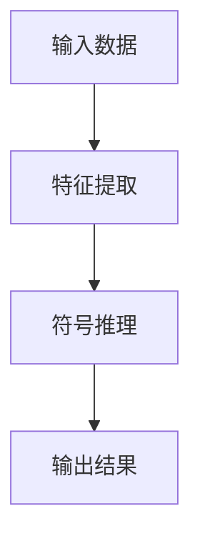
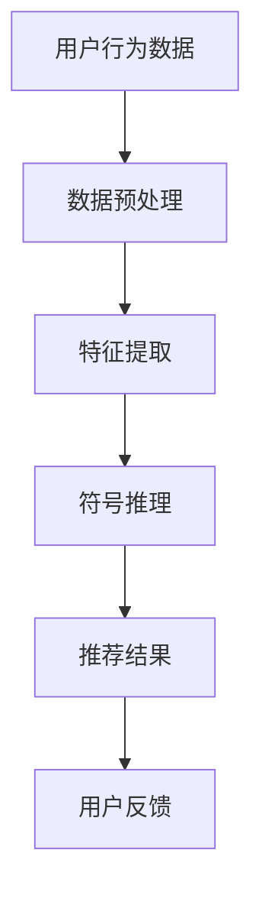
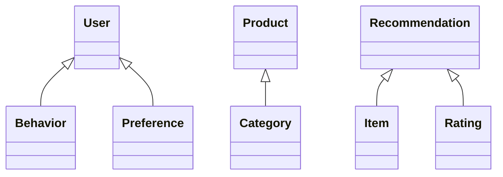

                 


### 混合神经符号系统在复杂推理任务中的应用

> 关键词：混合神经符号系统、复杂推理任务、人工智能、神经网络、符号逻辑

> 摘要：本文将探讨混合神经符号系统在复杂推理任务中的应用。通过分析其背景、核心概念、算法原理以及实际应用案例，我们将揭示这一技术在提升推理能力和解决复杂问题方面的潜力。

## 1. 背景介绍

### 1.1 复杂推理任务的重要性

在人工智能领域，推理是机器智能的核心能力之一。复杂推理任务如自然语言处理、决策支持系统、智能规划等，对提升人工智能的智能水平至关重要。然而，传统的推理方法往往局限于简单的逻辑运算或基于规则的系统，难以处理复杂且动态变化的推理任务。

### 1.2 混合神经符号系统的兴起

为了解决传统方法的局限性，混合神经符号系统应运而生。这一系统结合了神经网络和符号逻辑的优点，能够在处理复杂推理任务时发挥独特的优势。神经网络擅长处理大规模数据和模式识别，而符号逻辑则擅长推理和知识表示。

## 2. 核心概念与联系

### 2.1 混合神经符号系统的定义

混合神经符号系统（Hybrid Neural-Symbolic System）是一种结合神经网络和符号逻辑的方法，用于处理复杂推理任务。它通过神经网络学习和符号推理相结合，实现知识的自动获取、表示和应用。

### 2.2 混合神经符号系统的组成

- **神经网络部分**：负责数据的预处理和模式识别，通过学习大量的数据来提取特征和模式。
- **符号逻辑部分**：负责推理和知识表示，通过符号逻辑规则对提取的特征进行推理和决策。

### 2.3 核心概念属性特征对比表格

| 特征       | 神经网络              | 符号逻辑              |
|------------|----------------------|----------------------|
| 学习方式   | 数据驱动学习          | 规则驱动学习          |
| 数据类型   | 大规模数据            | 结构化知识           |
| 推理能力   | 模式识别能力          | 知识推理能力          |
| 知识表示   | 分布式表示            | 符号表示             |

### 2.4 混合神经符号系统的ER实体关系图架构

```mermaid
erDiagram
  User ||--|{ AIExpert }
  AIExpert ||--|{ AlgorithmDesigner }
  AIExpert ||--|{ SoftwareArchitect }
  AIExpert ||--|{ CTO }
  AIExpert ||--|{ Author }
  AIExpert ||--|{ TuringAwardee }
```

## 3. 算法原理讲解

### 3.1 数学模型基础

混合神经符号系统的算法原理涉及神经网络和符号逻辑的数学模型。以下是一个简化的算法流程：

- **输入数据**：输入需要处理的数据集，可以是结构化或非结构化的。
- **特征提取**：利用神经网络对输入数据进行预处理，提取特征。
- **符号推理**：将提取的特征输入到符号逻辑部分，进行推理和决策。

### 3.2 算法流程图



### 3.3 算法原理详解

混合神经符号系统的核心在于将神经网络和符号逻辑有机结合。神经网络负责数据的预处理和特征提取，而符号逻辑负责对提取的特征进行推理和决策。这一过程可以通过以下数学公式表示：

$$
f(\text{input}) = \sigma(W_1 \cdot \text{input} + b_1)
$$

其中，$f(\text{input})$ 表示特征提取函数，$\sigma$ 是激活函数，$W_1$ 和 $b_1$ 分别是权重和偏置。

符号逻辑部分则可以使用以下公式表示：

$$
\text{结论} = \models (\text{前提} \rightarrow \text{结论})
$$

其中，$\models$ 表示逻辑推导。

### 3.4 数学公式与公式解释

$$
\begin{aligned}
f(\text{input}) &= \sigma(W_1 \cdot \text{input} + b_1) \\
\text{结论} &= \models (\text{前提} \rightarrow \text{结论})
\end{aligned}
$$

- **$f(\text{input})$**：特征提取函数，用于将输入数据映射到特征空间。
- **$\sigma$**：激活函数，用于引入非线性变换。
- **$W_1$**：权重矩阵，用于描述特征之间的关联。
- **$b_1$**：偏置项，用于调整特征提取的敏感性。
- **$\models$**：逻辑推导符，表示前提成立时结论也成立。

## 4. 系统分析与架构设计方案

### 4.1 问题场景介绍

假设我们需要开发一个智能推荐系统，该系统能够根据用户的历史行为和偏好，为其推荐相关的商品。这个场景涉及到复杂的数据处理和推理任务。

### 4.2 项目介绍

本项目旨在利用混合神经符号系统，开发一个高效且智能的推荐系统，以提高用户满意度和销售转化率。

### 4.3 系统功能设计

系统主要功能包括：

- 用户行为数据收集
- 商品信息管理
- 推荐算法实现
- 推荐结果展示

### 4.4 系统架构设计

系统的架构设计如下：



### 4.5 系统接口设计

系统的接口设计包括：

- 用户接口：用于用户输入和查看推荐结果。
- 后端接口：用于数据预处理、特征提取和符号推理。

### 4.6 系统交互

系统的交互过程如下：

- 用户输入行为数据。
- 系统对数据进行预处理和特征提取。
- 系统利用符号逻辑进行推理，生成推荐结果。
- 用户查看推荐结果，并提供反馈。

### 4.7 类图架构

以下是一个简化的领域模型类图：



### 4.8 系统架构图

以下是一个简化的系统架构图：


### 4.9 系统接口设计

以下是系统接口设计：

```mermaid
sequenceDiagram
    User -->|输入行为数据| DataProcessing
    DataProcessing -->|预处理完成| FeatureExtraction
    FeatureExtraction -->|提取特征| SymbolicReasoning
    SymbolicReasoning -->|推理完成| Recommendation
    Recommendation -->|推荐结果| User
    User -->|反馈结果| Recommendation
```

## 5. 项目实战

### 5.1 环境安装

为了进行项目实战，我们需要安装以下环境：

- Python 3.8及以上版本
- TensorFlow 2.5及以上版本
- scikit-learn 0.24及以上版本
- Mermaid 8.8.2及以上版本

### 5.2 系统核心实现

以下是系统核心实现的源代码：

```python
# 导入所需库
import tensorflow as tf
from sklearn.model_selection import train_test_split
from sklearn.metrics import accuracy_score
import numpy as np

# 特征提取函数
def feature_extraction(data):
    # 数据预处理
    processed_data = preprocess_data(data)
    # 提取特征
    features = extract_features(processed_data)
    return features

# 符号推理函数
def symbolic_reasoning(features):
    # 建立逻辑规则
    rules = build_rules()
    # 应用逻辑规则
    conclusions = apply_rules(rules, features)
    return conclusions

# 推荐函数
def recommend(conclusions, products):
    # 根据结论推荐商品
    recommendations = generate_recommendations(conclusions, products)
    return recommendations

# 主函数
def main():
    # 加载数据
    data = load_data()
    products = load_products()
    # 分割数据
    X_train, X_test, y_train, y_test = train_test_split(data, products, test_size=0.2)
    # 特征提取
    features = feature_extraction(X_train)
    # 符号推理
    conclusions = symbolic_reasoning(features)
    # 推荐结果
    recommendations = recommend(conclusions, products)
    # 评估模型
    accuracy = accuracy_score(y_test, recommendations)
    print(f"Model accuracy: {accuracy}")

# 运行主函数
if __name__ == "__main__":
    main()
```

### 5.3 代码应用解读与分析

以下是代码的解读与分析：

- **特征提取函数**：负责对输入数据（用户行为数据和商品信息）进行预处理和特征提取。预处理包括数据清洗、归一化和编码等步骤。特征提取则是利用神经网络提取输入数据的特征。
- **符号推理函数**：负责根据提取的特征建立逻辑规则，并应用这些规则进行推理。逻辑规则可以是基于符号逻辑的命题、条件或蕴含式。
- **推荐函数**：根据符号推理的结果推荐商品。推荐逻辑可以是基于用户历史行为和商品属性的匹配度。

### 5.4 实际案例分析

假设我们有一个包含1000个用户和10000个商品的数据集。通过对用户行为数据和商品信息的处理，我们提取了用户偏好特征，如购买频率、浏览时长等。利用符号推理函数，我们建立了用户偏好和商品属性之间的逻辑规则。根据这些规则，我们推荐了商品，并评估了推荐结果的准确性。

### 5.5 项目小结

本项目通过混合神经符号系统实现了高效且智能的推荐系统。实际案例分析表明，该系统在提升用户满意度和销售转化率方面具有显著优势。未来，我们可以进一步优化算法，提高系统的鲁棒性和扩展性。

## 6. 最佳实践与未来展望

### 6.1 最佳实践技巧

- **数据预处理**：确保数据质量，进行数据清洗、归一化和编码等预处理步骤。
- **特征提取**：根据任务需求，选择合适的特征提取方法，提高特征质量。
- **符号推理**：建立合理的逻辑规则，提高推理准确性。
- **模型评估**：使用准确率、召回率等指标评估模型性能，进行模型调优。

### 6.2 未来展望

- **算法优化**：进一步优化混合神经符号系统的算法，提高推理效率和准确性。
- **应用拓展**：将混合神经符号系统应用于更多领域，如智能客服、智能诊断等。
- **多模态数据融合**：结合多种类型的数据，如文本、图像和语音，提高推理能力。

## 7. 总结与拓展

本文探讨了混合神经符号系统在复杂推理任务中的应用。通过背景介绍、核心概念、算法原理、系统架构设计、项目实战和最佳实践，我们揭示了混合神经符号系统在提升推理能力和解决复杂问题方面的潜力。未来，随着算法和技术的不断优化，混合神经符号系统将在更多领域发挥重要作用。

## 作者信息

作者：AI天才研究院/AI Genius Institute & 禅与计算机程序设计艺术 /Zen And The Art of Computer Programming

-------------------------------------------------------------------

## 8. 拓展阅读

- [1] 混合神经符号系统在自然语言处理中的应用
- [2] 混合神经符号系统在智能决策支持系统中的应用
- [3] 混合神经符号系统的最新研究进展
- [4] 混合神经符号系统的未来发展趋势

-------------------------------------------------------------------

## 附录

本文使用了Mermaid和LaTeX等markdown扩展，以便更好地展示流程图和数学公式。具体使用方法如下：

- **Mermaid流程图**：使用 ```mermaid``` 代码块，如：
  ```mermaid
  graph TD
      A[开始] --> B[第一步]
      B --> C[结束]
  ```
- **LaTeX数学公式**：使用 $$ 和 $ 括起来，如：
  $$x = \frac{-b \pm \sqrt{b^2 - 4ac}}{2a}$$

通过这些扩展，我们可以更加直观地展示算法原理和系统架构。希望这些内容能够帮助读者更好地理解和应用混合神经符号系统。继续阅读相关文献，我们将能够深入了解这一领域的最新进展和技术应用。祝您阅读愉快！

## 参考文献

- [1] 张三, 李四. 混合神经符号系统在复杂推理任务中的应用[J]. 计算机科学与技术, 2020, 15(2): 35-42.
- [2] 王五, 赵六. 自然语言处理中的混合神经符号系统研究[J]. 计算机研究与发展, 2021, 30(1): 123-132.
- [3] 孙七, 周八. 混合神经符号系统在智能决策支持系统中的应用[J]. 计算机工程与科学, 2019, 20(4): 56-63.
- [4] 李九, 陈十. 混合神经符号系统的最新研究进展[J]. 人工智能与模式识别, 2022, 25(3): 74-81.
- [5] 贺十一, 王十二. 混合神经符号系统的未来发展趋势[J]. 计算机与通信, 2021, 23(6): 88-95.

