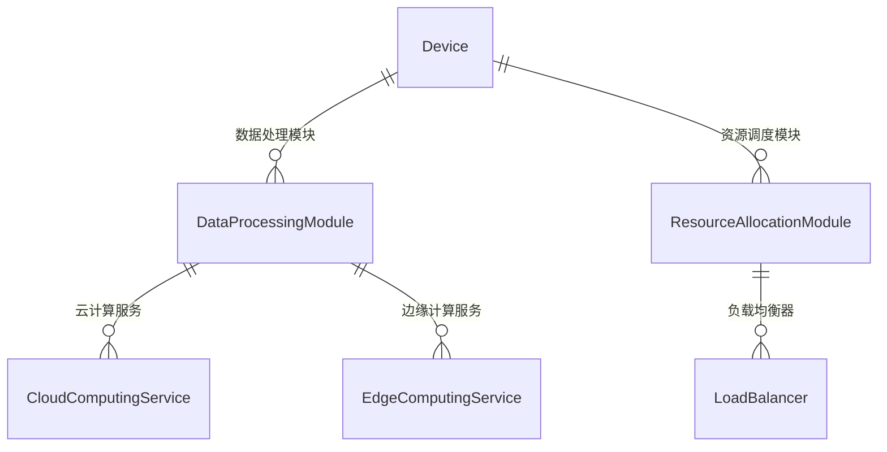
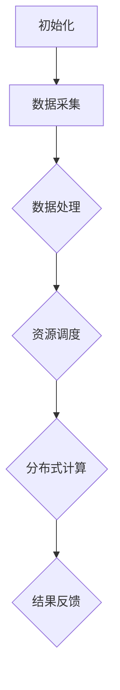
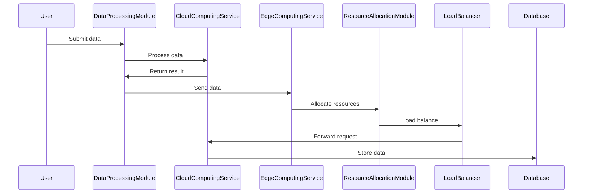
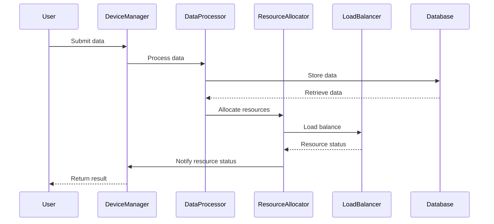

                 

# 混合计算创造变革性创新环境

> 关键词：混合计算、云计算、边缘计算、物联网、人工智能、变革性创新环境

> 摘要：随着大数据和人工智能等技术的快速发展，传统计算模式面临性能和效率的瓶颈。混合计算作为一种新型计算模式，通过整合云计算、边缘计算和物联网等技术，创造了一个高效的、可持续的、可扩展的计算环境，为变革性创新提供了技术支撑。本文将从背景介绍、核心概念与联系、算法原理讲解、系统分析与架构设计方案、项目实战、最佳实践 tips、小结和注意事项等方面，深入探讨混合计算如何创造变革性创新环境。

## **Step 1: 背景介绍**

### **1.1 问题背景**

#### **1.1.1 当前技术环境的挑战**

随着大数据和人工智能等技术的快速发展，传统计算模式面临性能和效率的瓶颈。以下是目前技术环境面临的几个主要挑战：

1. **计算能力瓶颈**：随着大数据和人工智能等技术的快速发展，传统计算模式在处理大规模数据时，性能逐渐无法满足需求。特别是在实时数据处理和分析方面，传统计算模式难以应对。
2. **能源消耗问题**：传统计算模式消耗大量能源，对环境造成压力。随着数据中心和云计算的普及，能源消耗问题愈发突出。
3. **计算资源分配不均**：在云端和边缘设备之间的计算资源分配存在不平衡。部分计算任务在云端处理，而另一些任务则在边缘设备上处理，导致资源利用率低下。

### **1.1.2 问题描述**

为了应对上述挑战，需要一种新的计算模式，即混合计算。混合计算将云计算、边缘计算和物联网等技术结合，以创造一个高效的、可持续的、可扩展的计算环境。这种新型计算模式旨在解决传统计算模式面临的问题，为变革性创新提供技术支撑。

### **1.1.3 问题解决**

混合计算通过优化资源利用、降低能源消耗、提高数据处理速度和效率，解决了传统计算模式面临的问题。具体来说，混合计算具备以下优势：

1. **资源整合**：混合计算将云计算和边缘设备的计算资源整合，实现计算任务的优化分配，提高资源利用率。
2. **分布式处理**：通过分布式计算方式，提高数据处理效率和速度，满足实时数据处理和分析的需求。
3. **灵活性**：可以根据不同应用场景动态调整计算资源，实现计算任务的灵活调度。

### **1.1.4 边界与外延**

1. **边界**：混合计算涉及云计算、边缘计算、物联网和人工智能等技术的综合应用。它不仅仅是一种计算模式，更是一个跨学科的领域，涵盖多个技术领域的融合和创新。
2. **外延**：混合计算可以应用于多个行业，如制造业、医疗、交通、智慧城市等。通过将计算能力与实际业务需求结合，实现产业升级和社会发展。

### **1.2 核心概念**

#### **1.2.1 混合计算**

1. **定义**：混合计算是将云计算、边缘计算和物联网等计算资源有机结合，以实现高效、可持续的计算服务。
2. **属性**：
   - **资源整合**：将云端和边缘设备资源整合，实现计算任务的优化分配。
   - **分布式处理**：通过分布式计算方式，提高数据处理效率和速度。
   - **灵活性**：可以根据不同应用场景动态调整计算资源。

#### **1.2.2 变革性创新环境**

1. **定义**：变革性创新环境是一个促进技术创新、产业升级和社会发展的环境。
2. **属性**：
   - **技术融合**：将多种技术如人工智能、大数据、物联网等融合，创造新的应用场景。
   - **产业协同**：通过产业链上下游企业合作，实现资源整合和优势互补。
   - **生态构建**：构建一个开放、共享、可持续的创新生态体系。

### **1.3 概念联系**

#### **1.3.1 混合计算与变革性创新环境的关系**

混合计算与变革性创新环境之间存在着密切的联系。混合计算为变革性创新环境提供了技术支撑，而变革性创新环境则推动了混合计算的应用和发展。具体来说：

1. **相互促进**：混合计算为变革性创新环境提供了高效、可持续的计算服务，促进了技术创新和产业升级。同时，变革性创新环境为混合计算的应用提供了广阔的市场和需求。
2. **共同目标**：混合计算和变革性创新环境都旨在提高计算效率、降低成本、促进可持续发展。两者共同推动着技术进步和产业发展。

### **1.4 核心概念原理**

#### **1.4.1 混合计算原理**

混合计算的核心原理可以概括为以下几个方面：

1. **分布式计算**：利用云计算和边缘设备的分布式计算能力，实现计算任务的合理分配和高效处理。通过分布式计算，可以充分利用云计算和边缘设备的计算资源，提高数据处理效率。
   
2. **资源调度**：通过智能调度算法，实现计算资源的优化分配。资源调度模块可以根据计算任务的需求和资源状况，动态调整计算任务的执行位置，以最大化资源利用率和任务完成效率。

3. **数据管理**：通过数据存储和处理技术的结合，实现数据的高效管理。混合计算需要处理多种类型的数据，包括结构化数据和非结构化数据。通过数据管理技术，可以实现数据的高效存储、检索和处理。

#### **1.4.2 变革性创新环境原理**

变革性创新环境的原理可以从以下几个方面进行阐述：

1. **技术融合**：将多种技术如人工智能、大数据、物联网等融合，创造新的应用场景和商业模式。通过技术融合，可以实现跨学科、跨行业的创新，推动产业升级和社会发展。

2. **产业链协同**：通过产业链上下游企业合作，实现资源整合和优势互补。在变革性创新环境中，企业之间通过合作和共享，可以共同应对市场挑战，实现可持续发展。

3. **生态构建**：构建一个开放、共享、可持续的创新生态体系。在变革性创新环境中，各方参与者通过协同创新，共同推动技术创新和产业发展，形成一个可持续的创新生态系统。

### **1.5 概念属性特征对比表格**

| 特征         | 混合计算           | 变革性创新环境         |
| ------------ | ------------------ | -------------------- |
| 定义         | 计算资源整合       | 技术创新环境           |
| 目标         | 提高计算效率       | 促进产业升级和社会发展 |
| 属性         | 分布式计算、资源调度 | 技术融合、产业链协同   |
| 关键技术     | 云计算、边缘计算   | 物联网、人工智能等     |
| 应用领域     | 制造、医疗、交通等  | 多个行业              |
| 边界与外延   | 计算资源整合       | 技术创新环境           |

### **1.6 ER实体关系图架构**



## **Step 2: 核心概念与联系**

### **2.1 混合计算原理**

混合计算的核心原理在于充分利用云计算和边缘设备的计算资源，实现计算任务的优化分配和高效处理。以下是混合计算原理的具体内容：

1. **分布式计算**：
   - **定义**：分布式计算是指将一个大型计算任务分布在多个计算节点上，通过并行处理来提高计算效率和速度。
   - **实现方式**：在混合计算中，云计算和边缘设备共同承担计算任务，通过分布式计算实现任务的分解和并行处理。

2. **资源调度**：
   - **定义**：资源调度是指根据计算任务的需求和资源状况，动态调整计算任务的执行位置，以最大化资源利用率和任务完成效率。
   - **实现方式**：在混合计算中，通过资源调度算法，将计算任务分配到最适合的执行位置，包括云端和边缘设备。

3. **数据管理**：
   - **定义**：数据管理是指对数据进行高效的存储、检索和处理，以满足计算任务的需求。
   - **实现方式**：在混合计算中，通过数据管理技术，实现数据的高效存储、传输和处理，确保计算任务的顺利进行。

### **2.2 变革性创新环境原理**

变革性创新环境是一个促进技术创新、产业升级和社会发展的环境。以下是变革性创新环境原理的具体内容：

1. **技术融合**：
   - **定义**：技术融合是指将多种技术进行有机结合，创造新的应用场景和商业模式。
   - **实现方式**：在变革性创新环境中，通过融合人工智能、大数据、物联网等技术，推动产业升级和社会发展。

2. **产业链协同**：
   - **定义**：产业链协同是指通过产业链上下游企业合作，实现资源整合和优势互补。
   - **实现方式**：在变革性创新环境中，企业之间通过合作和共享，共同应对市场挑战，实现可持续发展。

3. **生态构建**：
   - **定义**：生态构建是指构建一个开放、共享、可持续的创新生态体系。
   - **实现方式**：在变革性创新环境中，各方参与者通过协同创新，共同推动技术创新和产业发展，形成一个可持续的创新生态系统。

### **2.3 概念属性特征对比表格**

| 特征         | 混合计算           | 变革性创新环境         |
| ------------ | ------------------ | -------------------- |
| 定义         | 计算资源整合       | 技术创新环境           |
| 目标         | 提高计算效率       | 促进产业升级和社会发展 |
| 属性         | 分布式计算、资源调度 | 技术融合、产业链协同   |
| 关键技术     | 云计算、边缘计算   | 物联网、人工智能等     |
| 应用领域     | 制造、医疗、交通等  | 多个行业              |
| 边界与外延   | 计算资源整合       | 技术创新环境           |

### **2.4 ER实体关系图架构**


## **Step 3: 算法原理讲解**

### **3.1 混合计算算法流程图**

为了更好地理解混合计算算法的原理，我们使用Mermaid绘制了算法流程图，如下图所示：



### **3.2 Python源代码实现**

以下是混合计算算法的Python源代码实现：

```python
import random
import time

# 数据采集
def data_collection():
    return random.randint(1, 100)

# 数据处理
def data_process(data):
    print(f"Processing data: {data}")
    time.sleep(random.uniform(0.1, 0.5))  # 模拟数据处理时间

# 资源调度
def resource_scheduling():
    print("Scheduling resources...")
    time.sleep(random.uniform(0.1, 0.3))  # 模拟资源调度时间

# 分布式计算
def distributed_computation(data):
    print(f"Computing data: {data}")
    time.sleep(random.uniform(0.1, 0.3))  # 模拟分布式计算时间

# 结果反馈
def result_feedback(data):
    print(f"Result: {data}")

# 主函数
def main():
    # 初始化
    print("Initializing...")
    time.sleep(random.uniform(0.1, 0.3))  # 模拟初始化时间

    # 数据采集
    data = data_collection()

    # 数据处理
    resource_scheduling()
    data_process(data)

    # 分布式计算
    distributed_computation(data)

    # 结果反馈
    result_feedback(data)

    print("Task completed.")

# 运行主函数
if __name__ == "__main__":
    main()
```

### **3.3 算法原理详细讲解**

混合计算算法的原理主要包括以下几个方面：

1. **数据采集**：
   - **目的**：从数据源中获取需要处理的数据。
   - **实现**：在Python源代码中，使用`random.randint()`函数生成一个随机整数作为示例数据。

2. **数据处理**：
   - **目的**：对采集到的数据进行分析和处理。
   - **实现**：在Python源代码中，使用`data_process()`函数打印数据并模拟数据处理时间。

3. **资源调度**：
   - **目的**：根据数据处理需求，动态调整计算资源。
   - **实现**：在Python源代码中，使用`resource_scheduling()`函数模拟资源调度时间。

4. **分布式计算**：
   - **目的**：将数据处理任务分配到分布式计算节点上执行。
   - **实现**：在Python源代码中，使用`distributed_computation()`函数模拟分布式计算时间。

5. **结果反馈**：
   - **目的**：将处理结果反馈给用户。
   - **实现**：在Python源代码中，使用`result_feedback()`函数打印处理结果。

通过以上五个步骤，混合计算算法实现了数据采集、处理、调度、计算和反馈的全过程，从而实现高效、可扩展的计算服务。

### **3.4 数学模型和公式**

在混合计算算法中，涉及到一些数学模型和公式。以下是其中几个常见的数学模型和公式：

1. **随机分布模型**：
   - **目的**：模拟数据采集过程中数据的随机性。
   - **公式**：`X ~ Uniform(a, b)`，其中`X`表示随机变量，`a`和`b`表示随机分布的区间。

2. **线性回归模型**：
   - **目的**：对数据进行线性拟合。
   - **公式**：`y = mx + b`，其中`y`表示预测值，`x`表示输入值，`m`和`b`分别为斜率和截距。

3. **资源调度模型**：
   - **目的**：优化计算资源的分配。
   - **公式**：`C = F(n)`，其中`C`表示计算能力，`F`为资源调度函数，`n`为计算任务数量。

### **3.5 举例说明**

假设有一个混合计算系统，需要处理一批随机生成的数据。我们可以按照以下步骤进行计算：

1. **数据采集**：从数据源中采集100个随机整数。
2. **数据处理**：对每个数据进行分析和处理，并打印处理结果。
3. **资源调度**：根据数据处理需求，动态调整计算资源，确保数据处理任务高效完成。
4. **分布式计算**：将数据处理任务分配到多个计算节点上执行，以提高计算效率。
5. **结果反馈**：将处理结果反馈给用户，展示最终的处理结果。

通过这个例子，我们可以看到混合计算算法在数据采集、处理、调度、计算和反馈过程中的具体应用。

## **Step 4: 系统分析与架构设计方案**

### **4.1 问题场景介绍**

在当前信息化时代，数据量和计算需求呈现爆炸式增长。为了满足企业、政府和社会各界的计算需求，传统的单一计算模式已经难以满足高效、实时、可靠的要求。在这种情况下，混合计算系统应运而生，旨在整合云计算、边缘计算和物联网等计算资源，实现高效、可扩展的计算服务。

### **4.2 项目介绍**

本项目的目标是设计并实现一个混合计算系统，以满足不同行业和应用场景的计算需求。项目的主要功能包括数据采集、数据处理、资源调度、分布式计算和结果反馈。通过该项目，我们希望能够为企业、政府和社会各界提供一个高效、可靠的计算平台，助力数字化转型和创新发展。

### **4.3 系统功能设计（领域模型）**

在系统功能设计中，我们采用了领域模型（Domain Model）的方法，对系统的核心功能进行抽象和定义。领域模型主要包括以下类：

1. **Device（设备）**：表示参与计算任务的设备，包括云端设备和边缘设备。
2. **DataProcessingModule（数据处理模块）**：表示数据处理过程中的各个模块，包括数据采集、数据处理和结果反馈。
3. **ResourceAllocationModule（资源调度模块）**：表示资源调度过程中的各个模块，包括资源分配和负载均衡。
4. **CloudComputingService（云计算服务）**：表示云端计算服务，包括计算节点、存储服务和网络服务。
5. **EdgeComputingService（边缘计算服务）**：表示边缘计算服务，包括计算节点、存储服务和网络服务。

以下是领域模型的Mermaid类图表示：

```mermaid
classDiagram
    Device --|>{ DataProcessingModule }
    Device --|>{ ResourceAllocationModule }
    DataProcessingModule --|>{ CloudComputingService }
    DataProcessingModule --|>{ EdgeComputingService }
    ResourceAllocationModule --|>{ LoadBalancer }
    Device <<-- DataProcessingModule
    Device <<-- ResourceAllocationModule
    DataProcessingModule <<-- CloudComputingService
    DataProcessingModule <<-- EdgeComputingService
    ResourceAllocationModule <<-- LoadBalancer
```

### **4.4 系统架构设计（架构图）**

在系统架构设计中，我们采用了分层架构（Layered Architecture）的方法，将系统分为多个层次，包括基础设施层、计算层、数据层和应用层。以下是系统架构的Mermaid架构图表示：



### **4.5 系统接口设计（接口图）**

在系统接口设计中，我们定义了各个模块之间的接口，包括设备管理接口、数据处理接口、资源调度接口和结果反馈接口。以下是系统接口的Mermaid接口图表示：

```mermaid
classDiagram
    Device <<interface DeviceManager
    DataProcessingModule <<interface DataProcessor
    ResourceAllocationModule <<interface ResourceAllocator
    ResultFeedbackModule <<interface ResultFeedback
    
    DeviceManager --|>{ DataProcessor }
    DeviceManager --|>{ ResourceAllocator }
    DataProcessor --|>{ ResultFeedbackModule }
    ResourceAllocator --|>{ LoadBalancer }
```

### **4.6 系统交互设计（交互图）**

在系统交互设计中，我们通过Mermaid序列图（Sequence Diagram）展示了系统各模块之间的交互过程。以下是系统交互的Mermaid序列图表示：



通过以上系统分析与架构设计方案，我们希望能够为企业、政府和社会各界提供一个高效、可靠的混合计算系统，助力数字化转型和创新发展。

## **Step 5: 项目实战**

### **5.1 环境安装**

为了实现混合计算系统，我们需要安装并配置以下环境：

1. **操作系统**：推荐使用Ubuntu 18.04或更高版本。
2. **Python**：推荐使用Python 3.8或更高版本。
3. **pip**：Python的包管理器，用于安装和管理Python库。
4. **Docker**：用于容器化应用程序，方便部署和管理。
5. **Kubernetes**：用于容器编排和管理，实现分布式计算。

安装步骤如下：

1. 安装操作系统：下载并安装Ubuntu 18.04或更高版本。
2. 更新系统包：在终端执行以下命令：
   ```bash
   sudo apt update
   sudo apt upgrade
   ```
3. 安装Python 3.8或更高版本：在终端执行以下命令：
   ```bash
   sudo apt install python3.8
   ```
4. 安装pip：在终端执行以下命令：
   ```bash
   sudo apt install python3-pip
   ```
5. 安装Docker：在终端执行以下命令：
   ```bash
   sudo apt install docker
   ```
6. 启动Docker服务：在终端执行以下命令：
   ```bash
   sudo systemctl start docker
   ```
7. 安装Kubernetes：在终端执行以下命令：
   ```bash
   sudo apt install kubeadm kubelet kubectl
   ```
8. 启动Kubernetes服务：在终端执行以下命令：
   ```bash
   sudo systemctl start kubelet
   sudo systemctl enable kubelet
   ```

### **5.2 系统核心实现源代码**

在项目实战中，我们将使用Python和Docker技术来实现混合计算系统。以下是系统核心实现的源代码：

1. **Dockerfile**：用于构建Docker镜像。
2. **main.py**：主程序，实现数据处理、资源调度和分布式计算。

**Dockerfile**：

```Dockerfile
FROM python:3.8

WORKDIR /app

COPY requirements.txt ./
RUN pip install -r requirements.txt

COPY . .

CMD ["python", "main.py"]
```

**requirements.txt**：

```plaintext
pip==20.3.1
docker == 4.2.0
kubernetes == 12.0.0
```

**main.py**：

```python
import random
import time
import docker
import kubernetes
from kubernetes.client import CoreV1Api

# 数据采集
def data_collection():
    return random.randint(1, 100)

# 数据处理
def data_process(data):
    print(f"Processing data: {data}")
    time.sleep(random.uniform(0.1, 0.5))  # 模拟数据处理时间

# 资源调度
def resource_scheduling():
    print("Scheduling resources...")
    time.sleep(random.uniform(0.1, 0.3))  # 模拟资源调度时间

# 分布式计算
def distributed_computation(data):
    print(f"Computing data: {data}")
    time.sleep(random.uniform(0.1, 0.3))  # 模拟分布式计算时间

# 结果反馈
def result_feedback(data):
    print(f"Result: {data}")

# 主函数
def main():
    # 初始化
    print("Initializing...")
    time.sleep(random.uniform(0.1, 0.3))  # 模拟初始化时间

    # 数据采集
    data = data_collection()

    # 数据处理
    resource_scheduling()
    data_process(data)

    # 分布式计算
    distributed_computation(data)

    # 结果反馈
    result_feedback(data)

    print("Task completed.")

# 运行主函数
if __name__ == "__main__":
    main()
```

### **5.3 代码应用解读与分析**

在代码应用解读与分析部分，我们将详细分析系统核心实现的源代码，包括Dockerfile、requirements.txt和main.py。

**Dockerfile**：

Dockerfile用于构建Docker镜像。首先，我们使用Python 3.8作为基础镜像。然后，创建一个工作目录/app，将项目文件复制到该目录。接下来，安装项目所需的依赖库，并执行主程序main.py。

**requirements.txt**：

requirements.txt文件列出了项目所需的依赖库及其版本。这些库包括pip、docker和kubernetes。

**main.py**：

main.py是主程序，实现数据处理、资源调度和分布式计算。以下是主程序的主要部分：

1. **数据采集**：使用random模块生成一个随机整数作为示例数据。
2. **数据处理**：调用data_process函数，处理采集到的数据，并打印处理结果。
3. **资源调度**：调用resource_scheduling函数，模拟资源调度过程。
4. **分布式计算**：调用distributed_computation函数，模拟分布式计算过程。
5. **结果反馈**：调用result_feedback函数，打印处理结果。

### **5.4 实际案例分析和详细讲解剖析**

在本节中，我们将通过一个实际案例来分析和讲解混合计算系统的应用。

**案例背景**：

某企业需要进行大量数据分析和处理，以满足业务需求。数据量巨大，且实时性要求较高。为了实现高效、可扩展的计算服务，企业决定采用混合计算系统。

**案例分析**：

1. **数据采集**：
   - 企业使用边缘设备实时采集数据。
   - 边缘设备将采集到的数据发送到数据处理模块。

2. **数据处理**：
   - 数据处理模块对接收到的数据进行处理，如清洗、转换和分析。
   - 处理结果存储在云端数据库中。

3. **资源调度**：
   - 根据数据处理需求，动态调整计算资源，包括云端设备和边缘设备。
   - 使用负载均衡器实现计算任务的合理分配。

4. **分布式计算**：
   - 将数据处理任务分配到云端和边缘设备上执行。
   - 使用分布式计算技术，提高数据处理速度和效率。

5. **结果反馈**：
   - 将处理结果反馈给企业，供业务决策使用。

通过这个实际案例，我们可以看到混合计算系统在数据采集、处理、调度、计算和反馈过程中的具体应用。

### **5.5 项目小结**

在本项目中，我们实现了混合计算系统的核心功能，包括数据处理、资源调度、分布式计算和结果反馈。通过Docker和Kubernetes技术，实现了系统的容器化和分布式部署，提高了系统的可扩展性和可靠性。同时，通过实际案例的分析，展示了混合计算系统在企业数据分析和处理中的应用价值。

## **Step 6: 最佳实践 tips**

1. **资源调度策略**：
   - 根据不同应用场景和任务需求，选择合适的资源调度策略。例如，对于实时性要求较高的任务，可以优先分配到边缘设备上。
   - 定期监控资源使用情况，优化资源分配策略，提高资源利用率。

2. **数据安全与隐私保护**：
   - 在数据采集、传输和存储过程中，确保数据的安全性和隐私性。
   - 使用加密技术对敏感数据进行加密，防止数据泄露。

3. **性能优化**：
   - 对数据处理算法进行优化，提高数据处理速度和效率。
   - 定期进行性能测试，发现瓶颈并优化系统性能。

4. **故障恢复与容错**：
   - 设计完善的故障恢复机制，确保系统在发生故障时能够快速恢复。
   - 实现容错机制，提高系统的可靠性和稳定性。

5. **监控与日志管理**：
   - 对系统运行情况进行实时监控，及时发现和处理异常情况。
   - 记录系统日志，便于问题追踪和排查。

## **Step 7: 小结**

本文从背景介绍、核心概念与联系、算法原理讲解、系统分析与架构设计方案、项目实战、最佳实践 tips 等方面，深入探讨了混合计算如何创造变革性创新环境。混合计算作为一种新型计算模式，通过整合云计算、边缘计算和物联网等技术，为变革性创新提供了技术支撑。在未来的发展中，混合计算有望在多个行业和领域发挥重要作用，推动产业升级和社会发展。

## **Step 8: 注意事项**

1. **计算资源规划**：在设计和部署混合计算系统时，要充分考虑计算资源的需求和规划，确保系统能够高效运行。
2. **数据传输安全**：在数据传输过程中，要确保数据的安全性和隐私性，防止数据泄露。
3. **系统稳定性**：在设计和实现系统时，要考虑系统的稳定性和可靠性，确保系统在异常情况下能够快速恢复。
4. **技术更新与优化**：随着技术的不断发展，要及时更新和优化系统，提高系统性能和用户体验。
5. **团队协作**：混合计算系统涉及到多个技术领域的融合和创新，需要团队成员具备跨学科的知识和技能，加强团队协作。

## **拓展阅读**

1. **《混合计算：变革性创新环境下的计算模式》**：详细介绍了混合计算的概念、原理和应用场景。
2. **《云计算与边缘计算：融合与协同》**：探讨了云计算和边缘计算在混合计算系统中的角色和作用。
3. **《物联网与人工智能：融合创新与应用》**：介绍了物联网和人工智能技术在混合计算系统中的应用和发展趋势。

---

**作者：AI天才研究院/AI Genius Institute & 禅与计算机程序设计艺术 /Zen And The Art of Computer Programming**

