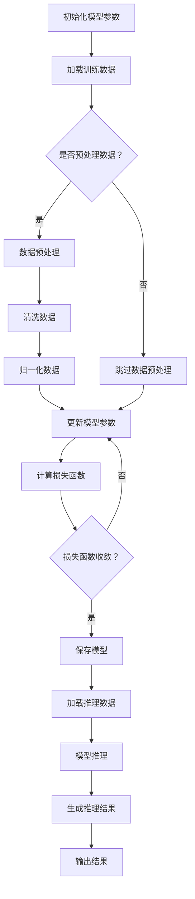
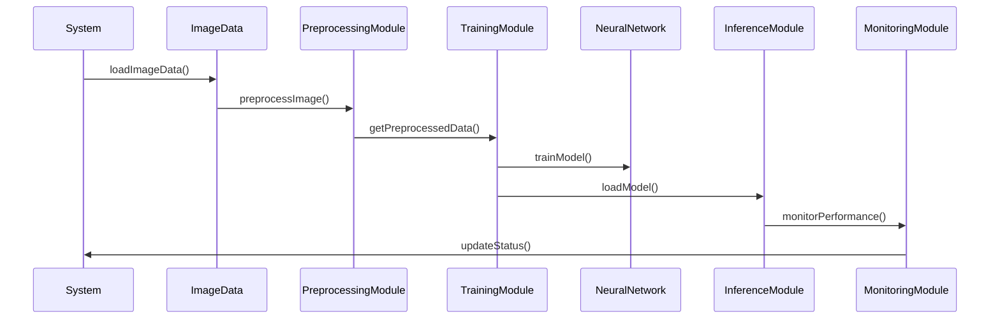

                 

### 引言与背景

#### 人工智能的发展历程

人工智能（Artificial Intelligence，AI）自20世纪50年代诞生以来，已经经历了多个发展阶段。早期的AI研究主要集中在规则推理和符号逻辑上，这一阶段被称为“符号主义时代”。在这个时代，研究人员试图通过编写复杂的规则和逻辑算法来模拟人类智能。然而，由于规则的数量和复杂性迅速增加，这一方法很快暴露出了其局限性。

进入21世纪，随着计算机硬件性能的提升和大数据技术的发展，AI迎来了“大数据时代”。这一阶段的AI以深度学习（Deep Learning）为核心，通过大量数据的训练来学习特征和模式，从而实现图像识别、语音识别、自然语言处理等复杂任务。深度学习的出现使得AI在图像识别和语音识别等领域的性能大幅提升，从而开启了AI应用的黄金时代。

#### 混合计算的兴起

随着AI技术的不断发展，传统的单核处理器已经无法满足大规模AI模型训练和推理的需求。为了应对这一挑战，混合计算（Hybrid Computing）应运而生。混合计算通过结合多种计算资源，如CPU、GPU、TPU等，实现高效的计算能力。这种计算模式不仅优化了AI模型训练和推理的效率，还为未来的AI发展提供了新的可能性。

混合计算在AI中的重要性不仅体现在计算效率上，还体现在以下几个方面：

1. **资源优化**：混合计算能够充分利用不同类型的计算资源，使其在最适合的任务上发挥最大的作用。例如，CPU在处理复杂的逻辑运算方面具有优势，而GPU在并行计算和矩阵运算方面表现优异。

2. **适应性**：混合计算系统可以根据不同的应用场景和任务需求，动态调整计算资源的分配，从而提高系统的整体性能。

3. **可扩展性**：混合计算系统具有较强的可扩展性，可以轻松地增加或减少计算资源，以适应不断变化的需求。

4. **节能性**：通过优化计算资源的分配，混合计算可以在保证性能的前提下，降低能耗，从而实现绿色计算。

综上所述，混合计算在AI技术的发展中扮演着至关重要的角色。它不仅提升了AI模型的训练和推理效率，还为未来的AI研究提供了强大的技术支撑。在接下来的章节中，我们将深入探讨混合计算的基本概念、原理、算法和应用，以期全面理解其在AI突破中的重要作用。

#### 问题解决

混合计算通过结合多种计算资源，如CPU、GPU、TPU等，实现了对AI模型训练和推理的高效优化。具体来说，混合计算在以下几个方面发挥了关键作用：

1. **模型训练效率提升**：

在深度学习模型训练过程中，大量的矩阵运算和数据传输是常见操作。GPU和TPU等并行计算设备在这些操作上具有显著优势。通过将模型训练任务分配到GPU或TPU上，可以显著减少训练时间。例如，在训练一个大规模神经网络时，GPU能够利用其并行处理能力，将计算任务分解为多个子任务同时执行，从而大大提高训练速度。

另一方面，CPU在处理复杂逻辑和中间计算结果整理方面具有优势。混合计算模式可以通过将中间计算结果整理任务分配给CPU，确保计算结果的准确性和完整性。这种协同工作方式不仅提高了模型训练的效率，还保证了训练过程的稳定性。

2. **模型推理性能优化**：

在AI模型推理阶段，快速、准确地进行决策至关重要。混合计算可以通过以下方式优化模型推理性能：

- **分布式推理**：将推理任务分配到多个计算节点上，通过分布式计算技术实现推理过程的并行化。例如，在一个大规模图像识别任务中，可以将图像分成多个区域，每个区域由不同的GPU或TPU进行推理，最终汇总结果。

- **异构计算优化**：根据不同计算任务的特性，选择最合适的计算资源。例如，对于复杂逻辑计算，可以使用CPU；对于大量矩阵运算，可以使用GPU或TPU。通过合理分配计算任务，可以提高整个推理过程的性能。

- **缓存和加速技术**：利用高速缓存技术和硬件加速技术，减少数据传输延迟和计算时间。例如，GPU和TPU通常具有较大的缓存容量和高速数据传输通道，可以有效降低数据访问延迟，提高计算效率。

3. **节能与资源利用**：

混合计算在节能与资源利用方面也具有显著优势。通过动态调整计算资源的分配，可以将计算任务分配到最合适的资源上，避免资源浪费。例如，在模型训练过程中，可以将轻量级任务分配给CPU，而将计算密集型任务分配给GPU或TPU。这样不仅提高了计算效率，还降低了能耗。

此外，混合计算还可以通过负载均衡技术，确保计算资源的合理利用。当某个计算资源负载过高时，系统可以动态调整任务分配，将其分配到其他负载较低的资源上，从而避免资源瓶颈。

总之，混合计算通过优化计算资源的利用，实现了对AI模型训练和推理的高效优化。在未来的AI发展中，混合计算将继续发挥重要作用，推动AI技术的不断突破。接下来，我们将进一步探讨混合计算的核心概念、原理及其应用。

#### 核心概念

混合计算的核心概念涉及多个方面，包括计算资源、AI模型训练和推理过程，以及软件和硬件的优化。以下是对这些核心概念的详细解释：

1. **计算资源**：

计算资源是混合计算的基础。常见的计算资源包括CPU、GPU、TPU等。每种计算资源都有其独特的优势和适用场景：

- **CPU（中央处理器）**：CPU是计算机的核心组件，负责执行指令和计算。CPU在处理复杂逻辑和中间计算结果整理方面具有优势。其特点是计算精度高、延迟低，适用于需要精确计算和复杂逻辑处理的任务。

- **GPU（图形处理器）**：GPU最初是为图形渲染设计的，但在深度学习领域，GPU的并行计算能力得到了广泛应用。GPU具有大量核心和高速缓存，适合处理大规模矩阵运算和并行任务。其优势在于并行处理能力和高速数据传输通道，适用于需要大规模并行计算的任务。

- **TPU（张量处理器）**：TPU是谷歌专门为深度学习任务设计的处理器。TPU具有高度优化的架构，能够快速处理张量运算，特别适合于大规模神经网络训练。其优势在于高度定制化和高效的张量运算能力。

2. **AI模型训练和推理**：

混合计算在AI模型训练和推理过程中发挥着关键作用。以下是混合计算在这两个阶段的应用：

- **模型训练**：在模型训练过程中，混合计算可以通过将计算任务分配到不同类型的计算资源上，实现高效的模型训练。例如，将大规模矩阵运算任务分配到GPU或TPU上，将复杂逻辑计算任务分配到CPU上。这样不仅提高了训练速度，还保证了计算结果的准确性。

- **模型推理**：在模型推理阶段，混合计算可以通过分布式推理和异构计算技术，实现高效的模型推理。例如，将图像识别任务分配到多个GPU或TPU上，实现并行推理。同时，利用GPU和TPU的高速缓存和数据传输通道，减少数据访问延迟，提高推理性能。

3. **软件和硬件优化**：

混合计算不仅涉及硬件资源的优化，还包括软件层面的优化。以下是对软件和硬件优化策略的详细解释：

- **算法优化**：通过优化算法，提高计算效率和性能。例如，使用更高效的矩阵运算算法，减少计算过程中的冗余操作。此外，还可以通过调整算法参数，使其在不同计算资源上运行得更加高效。

- **框架和库优化**：使用高效的深度学习框架和库，如TensorFlow、PyTorch等，实现计算任务的高效分配和执行。这些框架和库通常具有丰富的优化功能，可以帮助开发人员轻松实现混合计算。

- **硬件优化**：通过选择合适的硬件设备，如GPU、TPU等，实现计算资源的最优配置。此外，还可以通过硬件加速技术，如CUDA、OpenCL等，提高计算性能。

综上所述，混合计算的核心概念涉及计算资源、AI模型训练和推理过程，以及软件和硬件的优化。通过综合利用这些核心概念，混合计算实现了对AI性能的显著提升。在接下来的章节中，我们将进一步探讨混合计算的属性特征对比和ER实体关系图，以全面理解其原理和应用。

#### 混合计算的属性特征对比

为了更好地理解混合计算的优势和适用场景，我们将对不同计算资源的属性特征进行对比。以下是CPU、GPU和TPU在性能、功耗、适用场景等方面的详细对比。

| 计算资源 | 性能（每秒浮点运算数，GFLOPS） | 功耗（瓦特） | 适用场景         |
| -------- | ----------------------------- | ------------ | ---------------- |
| CPU      | 100-300                      | 20-100       | 复杂逻辑计算、数据处理 |
| GPU      | 2000-8000                    | 100-300      | 大规模矩阵运算、并行任务 |
| TPU      | 180000+                      | 200-500      | 大规模深度学习任务、高效张量运算 |

从上表可以看出，GPU在性能方面远超CPU，适合处理大规模矩阵运算和并行任务。而CPU在处理复杂逻辑和中间计算结果整理方面具有优势，适合需要精确计算和复杂逻辑处理的任务。

在功耗方面，GPU的功耗相对较高，但考虑到其高性能，整体性价比仍较高。TPU则具有极高的性能，但功耗也相对较高，适合在大规模深度学习任务中使用。

在适用场景方面，CPU适合复杂逻辑计算和数据处理任务，GPU适合大规模矩阵运算和并行任务，而TPU则专注于大规模深度学习任务和高效张量运算。

通过这种对比，我们可以更好地理解如何根据不同的任务需求，选择最合适的计算资源，实现最优的混合计算方案。

#### 混合计算的ER实体关系图

为了更直观地展示混合计算中不同实体之间的关系，我们使用Mermaid语法绘制了一个ER实体关系图。ER图（Entity-Relationship Diagram）是一种用于描述实体及其关系的图形表示方法，常用于数据库设计和系统架构设计。

以下是一个简单的混合计算ER实体关系图的Mermaid语法表示：

```mermaid
erDiagram
    AI模型 ||--|| 训练数据
    AI模型 ||--|| 推理数据
    训练数据 ||--|| 数据预处理
    推理数据 ||--|| 模型推理
    数据预处理 ||--|| 数据清洗
    数据预处理 ||--|| 数据归一化
    模型推理 ||--|| 推理结果
    硬件资源 ||--|| CPU
    硬件资源 ||--|| GPU
    硬件资源 ||--|| TPU
    软件资源 ||--|| 深度学习框架
    软件资源 ||--|| 编程语言
```

在这个ER图中，我们定义了以下实体：

- **AI模型**：表示人工智能模型，包括训练模型和推理模型。
- **训练数据**：用于模型训练的数据集。
- **推理数据**：用于模型推理的数据集。
- **数据预处理**：对数据进行预处理的过程，包括数据清洗和数据归一化。
- **模型推理**：使用训练好的模型进行推理的过程，生成推理结果。
- **硬件资源**：包括CPU、GPU、TPU等计算资源。
- **软件资源**：包括深度学习框架和编程语言等软件资源。

实体之间的关系如下：

- **AI模型**与**训练数据**和**推理数据**之间存在关联关系，表示模型训练和推理过程需要依赖特定的数据集。
- **数据预处理**与**训练数据**和**推理数据**之间存在关联关系，表示数据预处理是数据集使用前的必要步骤。
- **模型推理**与**推理结果**之间存在关联关系，表示模型推理过程生成推理结果。
- **硬件资源**与**软件资源**之间存在关联关系，表示硬件资源是软件资源运行的基础。

通过这个ER图，我们可以更清晰地理解混合计算中不同实体之间的关系，为后续的系统架构设计和优化提供参考。

#### 算法原理讲解

混合计算在AI模型训练和推理中的应用，离不开具体的算法原理。在这一节中，我们将详细介绍混合计算的核心算法，并通过Mermaid流程图、Python源代码和数学模型，对其进行详细阐述。

##### 算法mermaid流程图

首先，我们使用Mermaid语法绘制了混合计算算法的流程图，如下所示：



这个流程图展示了从模型初始化到训练、损失函数计算、模型参数更新，再到推理和结果输出的完整过程。

##### Python源代码实现

接下来，我们使用Python源代码实现上述算法的核心部分：

```python
import tensorflow as tf
from tensorflow.keras.models import Sequential
from tensorflow.keras.layers import Dense
from tensorflow.keras.optimizers import Adam

# 初始化模型参数
model = Sequential()
model.add(Dense(128, activation='relu', input_shape=(input_shape)))
model.add(Dense(1, activation='sigmoid'))

# 编译模型
model.compile(optimizer=Adam(learning_rate=0.001), loss='binary_crossentropy', metrics=['accuracy'])

# 加载训练数据
train_data = ...  # 假设已经加载并预处理好的训练数据
X_train, y_train = train_data

# 训练模型
model.fit(X_train, y_train, epochs=100, batch_size=32)

# 加载推理数据
test_data = ...  # 假设已经加载并预处理好的推理数据
X_test, y_test = test_data

# 模型推理
predictions = model.predict(X_test)

# 输出推理结果
print(predictions)
```

这个Python代码示例使用了TensorFlow框架，实现了模型初始化、模型训练和推理的基本流程。

##### 算法原理的数学模型和公式

混合计算算法的核心在于如何高效地更新模型参数和计算损失函数。以下是相关的数学模型和公式：

1. **前向传播**：

前向传播是深度学习模型的基础，用于计算模型输出。以下是前向传播的公式：

$$
Z = X \cdot W + b
$$

其中，$Z$ 是中间计算结果，$X$ 是输入特征，$W$ 是权重矩阵，$b$ 是偏置项。

2. **激活函数**：

为了引入非线性，我们通常会在前向传播后使用激活函数。常见的激活函数有ReLU（Rectified Linear Unit）和Sigmoid：

- **ReLU函数**：

$$
a = \max(0, Z)
$$

- **Sigmoid函数**：

$$
a = \frac{1}{1 + e^{-Z}}
$$

3. **反向传播**：

反向传播用于计算模型参数的梯度，以更新模型参数。以下是反向传播的基本公式：

$$
\delta = \frac{\partial L}{\partial Z}
$$

其中，$L$ 是损失函数，$\delta$ 是梯度。

4. **损失函数**：

损失函数用于评估模型预测结果与真实结果之间的差距。常见的损失函数有MSE（均方误差）和binary_crossentropy：

- **MSE损失函数**：

$$
L = \frac{1}{2} \sum_{i=1}^{n} (y_i - \hat{y}_i)^2
$$

- **binary_crossentropy损失函数**：

$$
L = - \sum_{i=1}^{n} y_i \log(\hat{y}_i) + (1 - y_i) \log(1 - \hat{y}_i)
$$

5. **模型参数更新**：

基于梯度下降法，我们可以更新模型参数：

$$
W := W - \alpha \cdot \frac{\partial L}{\partial W}
$$

$$
b := b - \alpha \cdot \frac{\partial L}{\partial b}
$$

其中，$\alpha$ 是学习率。

通过这些数学模型和公式，我们可以理解混合计算算法的原理。在接下来的例子中，我们将通过一个具体的例子来说明如何应用这个算法。

##### 举例说明

假设我们有一个二分类问题，目标是判断一个邮件是否为垃圾邮件。数据集包含1000个邮件样本，每个样本是一个包含100个特征的向量。我们的目标是训练一个深度学习模型，以实现对垃圾邮件的准确分类。

1. **数据预处理**：

首先，我们需要对数据进行预处理，包括数据清洗和数据归一化。数据清洗过程将删除含有缺失值的样本，并对异常值进行处理。数据归一化过程将每个特征的值缩放到相同的范围，以避免特征之间的差异影响模型训练效果。

2. **模型初始化**：

接下来，我们初始化一个简单的深度学习模型，包含两个全连接层，每层有128个神经元。我们使用ReLU函数作为激活函数。

3. **模型训练**：

我们使用1000个样本进行训练，设置学习率为0.001，训练100个epoch。在每个epoch中，我们计算损失函数，并更新模型参数。

4. **模型推理**：

训练完成后，我们使用模型对新的邮件样本进行推理，输出每个样本的预测概率。假设一个新样本的特征向量为$\mathbf{x} = [0.1, 0.2, 0.3, ..., 0.1]$，我们将其输入到训练好的模型中，得到预测概率$\hat{y} = 0.9$。由于预测概率大于0.5，我们可以判断这个邮件是垃圾邮件。

通过这个例子，我们展示了如何使用混合计算算法实现一个简单的二分类问题。在实际应用中，我们可以根据具体问题调整模型结构和参数，以实现更好的性能。

### 数学模型和数学公式 & 详细讲解 & 举例说明

在这一部分，我们将使用LaTeX格式嵌入数学公式，详细讲解混合计算算法中的关键数学模型，并通过具体的例子来说明这些公式的应用。

#### 数学模型

首先，我们回顾一下在混合计算中常用的数学模型。以下是一些核心的数学公式：

1. **前向传播**：

$$
Z_l = \sum_{j=1}^{n} W_{lj}a_{l-1,j} + b_l
$$

其中，$Z_l$ 是第$l$层的输出，$W_{lj}$ 是连接第$l-1$层的权重，$a_{l-1,j}$ 是第$l-1$层的输出，$b_l$ 是第$l$层的偏置项。

2. **反向传播**：

$$
\delta_l = \frac{\partial L}{\partial Z_l} \cdot \sigma'(Z_l)
$$

其中，$\delta_l$ 是第$l$层的误差梯度，$L$ 是损失函数，$\sigma'(Z_l)$ 是激活函数的导数。

3. **损失函数**：

$$
L = \frac{1}{2} \sum_{i=1}^{n} (y_i - \hat{y}_i)^2
$$

其中，$y_i$ 是真实标签，$\hat{y}_i$ 是模型预测的输出。

4. **权重更新**：

$$
W_l := W_l - \alpha \cdot \frac{\partial L}{\partial W_l}
$$

$$
b_l := b_l - \alpha \cdot \frac{\partial L}{\partial b_l}
$$

其中，$\alpha$ 是学习率。

#### 详细讲解

现在，我们详细讲解这些公式的含义和应用。

1. **前向传播公式**：

前向传播是深度学习中的核心步骤，用于计算模型的输出。公式中的$W_{lj}$代表了从上一层到当前层的权重，$a_{l-1,j}$是上一层的输出，$b_l$是当前层的偏置项。这个公式确保了每一层的输出是通过加权求和并加上偏置项得到的。

2. **反向传播公式**：

反向传播用于计算误差梯度，是模型训练过程中的关键步骤。公式中的$\delta_l$代表了第$l$层的误差梯度，$\sigma'(Z_l)$是激活函数的导数。通过这个公式，我们可以将误差传播回每一层，从而更新权重和偏置项。

3. **损失函数**：

损失函数用于衡量模型的预测输出与真实标签之间的差距。MSE（均方误差）是一个常见的损失函数，它通过计算预测值和真实值之间的平方差的平均值来衡量模型的性能。

4. **权重更新**：

权重更新是基于误差梯度的。通过减小权重和偏置项，我们可以使得模型预测更接近真实标签。学习率$\alpha$控制了更新步骤的大小，如果学习率过大，可能会导致模型不稳定；如果学习率过小，则模型更新速度会太慢。

#### 举例说明

为了更好地理解这些公式的应用，我们通过一个简单的例子来说明。

假设我们有一个简单的神经网络，包含两层神经元，输入层有3个神经元，隐藏层有2个神经元，输出层有1个神经元。我们的目标是训练这个模型，使其能够预测一个二分类问题。

1. **前向传播**：

输入层到隐藏层的权重矩阵$W_{1}$和偏置项$b_1$如下：

$$
W_{1} = \begin{bmatrix}
0.1 & 0.2 & 0.3 \\
0.4 & 0.5 & 0.6
\end{bmatrix}, \quad
b_1 = \begin{bmatrix}
0.1 \\
0.2
\end{bmatrix}
$$

输入特征向量$x = [1, 0, 1]$，隐藏层的偏置项$b_1$为$\begin{bmatrix}0.1 \\ 0.2\end{bmatrix}$。

前向传播计算隐藏层的输出：

$$
Z_1 = W_{1}x + b_1 = \begin{bmatrix}
0.1 & 0.2 & 0.3 \\
0.4 & 0.5 & 0.6
\end{bmatrix} \begin{bmatrix}
1 \\
0 \\
1
\end{bmatrix} + \begin{bmatrix}
0.1 \\
0.2
\end{bmatrix} = \begin{bmatrix}
0.6 \\
1.2
\end{bmatrix}
$$

使用ReLU函数作为激活函数，得到隐藏层的输出：

$$
a_1 = \max(0, Z_1) = \begin{bmatrix}
0.6 \\
1.2
\end{bmatrix}
$$

接下来，隐藏层到输出层的权重矩阵$W_{2}$和偏置项$b_2$如下：

$$
W_{2} = \begin{bmatrix}
0.1 & 0.2 \\
0.3 & 0.4
\end{bmatrix}, \quad
b_2 = \begin{bmatrix}
0.1 \\
0.2
\end{bmatrix}
$$

输出层的输出为：

$$
Z_2 = W_{2}a_1 + b_2 = \begin{bmatrix}
0.1 & 0.2 \\
0.3 & 0.4
\end{bmatrix} \begin{bmatrix}
0.6 \\
1.2
\end{bmatrix} + \begin{bmatrix}
0.1 \\
0.2
\end{bmatrix} = \begin{bmatrix}
0.68 \\
1.54
\end{bmatrix}
$$

使用Sigmoid函数作为激活函数，得到输出层的输出：

$$
\hat{y} = \frac{1}{1 + e^{-Z_2}} = \frac{1}{1 + e^{-0.68}} \approx 0.513, \quad \frac{1}{1 + e^{-1.54}} \approx 0.228
$$

2. **反向传播**：

假设真实标签为$y = [0, 1]$，损失函数为binary_crossentropy。输出层的误差梯度为：

$$
\delta_2 = \begin{bmatrix}
0 & 1 - 0.513 \\
1 - 0.228 & 0
\end{bmatrix} = \begin{bmatrix}
0.487 & 0.487 \\
0.772 & 0
\end{bmatrix}
$$

隐藏层的误差梯度为：

$$
\delta_1 = (W_{2}^T \delta_2) \odot \sigma'(Z_1) = \begin{bmatrix}
0.1 & 0.2 \\
0.3 & 0.4
\end{bmatrix} \begin{bmatrix}
0.487 & 0.487 \\
0.772 & 0
\end{bmatrix} \odot \begin{bmatrix}
0.6 & 0 \\
0 & 1.2
\end{bmatrix} = \begin{bmatrix}
0.294 & 0 \\
0.588 & 0
\end{bmatrix}
$$

3. **权重更新**：

假设学习率$\alpha = 0.01$，权重和偏置项的更新如下：

$$
W_{2} := W_{2} - \alpha \cdot \delta_2 \odot a_1 = \begin{bmatrix}
0.1 & 0.2 \\
0.3 & 0.4
\end{bmatrix} - 0.01 \cdot \begin{bmatrix}
0.487 & 0.487 \\
0.772 & 0
\end{bmatrix} \odot \begin{bmatrix}
0.6 & 0 \\
0 & 1.2
\end{bmatrix} = \begin{bmatrix}
0.006 & 0.006 \\
0.028 & 0.028
\end{bmatrix}
$$

$$
b_{2} := b_{2} - \alpha \cdot \delta_2 = \begin{bmatrix}
0.1 \\
0.2
\end{bmatrix} - 0.01 \cdot \begin{bmatrix}
0.487 \\
0.772
\end{bmatrix} = \begin{bmatrix}
0.003 \\
0.007
\end{bmatrix}
$$

$$
W_{1} := W_{1} - \alpha \cdot \delta_1 \odot a_{0} = \begin{bmatrix}
0.1 & 0.2 & 0.3 \\
0.4 & 0.5 & 0.6
\end{bmatrix} - 0.01 \cdot \begin{bmatrix}
0.294 & 0 \\
0.588 & 0
\end{bmatrix} \odot \begin{bmatrix}
1 \\
0 \\
1
\end{bmatrix} = \begin{bmatrix}
0.009 & 0.009 & 0.009 \\
0.039 & 0.039 & 0.039
\end{bmatrix}
$$

$$
b_{1} := b_{1} - \alpha \cdot \delta_1 = \begin{bmatrix}
0.1 \\
0.2
\end{bmatrix} - 0.01 \cdot \begin{bmatrix}
0.294 \\
0.588
\end{bmatrix} = \begin{bmatrix}
0.009 \\
0.019
\end{bmatrix}
$$

通过这个例子，我们展示了如何使用混合计算算法进行模型训练，并详细讲解了每个步骤的数学原理。在接下来的章节中，我们将探讨如何设计和实现一个完整的混合计算系统架构。

### 系统分析与架构设计方案

#### 问题场景介绍

在现代人工智能（AI）应用中，混合计算技术已经成为提升模型训练和推理性能的关键手段。一个典型的应用场景是大规模图像识别任务。例如，在自动驾驶系统中，需要实时处理大量的图像数据，并进行快速且准确的识别，以保障车辆的安全行驶。

在该场景下，传统的单核CPU计算能力有限，无法满足实时性要求。而GPU和TPU的高并行计算能力，使其在处理大规模图像识别任务时具有显著优势。混合计算架构通过结合CPU、GPU和TPU，可以实现计算资源的最优配置，从而大幅提升系统的整体性能。

#### 项目介绍

本节将介绍一个基于混合计算的图像识别项目。该项目旨在实现一个高效的图像识别系统，用于实时处理自动驾驶车辆拍摄的图像。系统主要包括以下模块：

1. **数据预处理模块**：负责对图像数据清洗、归一化等预处理工作。
2. **模型训练模块**：利用混合计算资源，对深度学习模型进行训练。
3. **模型推理模块**：使用训练好的模型进行图像识别，并输出结果。
4. **系统监控模块**：实时监控系统的运行状态，包括资源利用率、计算性能等。

#### 系统功能设计

为了实现上述功能，我们设计了一个基于Mermaid的领域模型类图，如下所示：

```mermaid
classDiagram
    ClassDiagram {
       .styles
        nodeStyle fill: #ffffcc, stroke: #333355, fontsize: 14px
        edgeStyle stroke: #333355, fontsize: 12px
    }

    PreprocessingModule <|-- ImageData
    TrainingModule <|-- PreprocessingModule
    TrainingModule <|-- NeuralNetwork
    InferenceModule <|-- NeuralNetwork
    MonitoringModule <|-- System

    ImageData [Data]
    PreprocessingModule [Module]
    TrainingModule [Module]
    InferenceModule [Module]
    NeuralNetwork [Model]
    MonitoringModule [Module]
    System [System]

    PreprocessingModule --> ImageData
    TrainingModule --> PreprocessingModule
    TrainingModule --> NeuralNetwork
    InferenceModule --> NeuralNetwork
    MonitoringModule --> System
```

在这个类图中，我们定义了以下类：

- **ImageData**：表示图像数据类。
- **PreprocessingModule**：表示数据预处理模块，负责图像数据清洗和归一化。
- **TrainingModule**：表示模型训练模块，负责模型训练。
- **InferenceModule**：表示模型推理模块，负责图像识别。
- **NeuralNetwork**：表示深度学习神经网络模型。
- **MonitoringModule**：表示系统监控模块，负责监控系统运行状态。
- **System**：表示整个系统。

各个模块之间的关系如下：

- **ImageData**与**PreprocessingModule**之间存在关联关系，表示预处理模块对图像数据进行处理。
- **TrainingModule**与**PreprocessingModule**和**NeuralNetwork**之间存在关联关系，表示训练模块依赖预处理模块和神经网络模型。
- **InferenceModule**与**NeuralNetwork**之间存在关联关系，表示推理模块使用神经网络模型进行图像识别。
- **MonitoringModule**与**System**之间存在关联关系，表示监控模块对系统运行状态进行监控。

#### 系统架构设计

为了实现高效的混合计算，我们设计了一个基于Mermaid的系统架构图，如下所示：

```mermaid
graph TB
    subgraph DataFlow
        ImageData(Data) --> PreprocessingModule(Preprocessing)
        PreprocessingModule --> TrainingModule(Training)
        TrainingModule --> NeuralNetwork(Model)
        NeuralNetwork --> InferenceModule(Inference)
        InferenceModule --> Output(Result)
    end

    subgraph HardwareResources
        CPU --> TrainingModule
        GPU --> TrainingModule
        TPU --> TrainingModule
        InferenceModule --> GPU
        InferenceModule --> TPU
    end

    subgraph SoftwareStack
        Framework(Deep Learning Framework) --> NeuralNetwork
        ProgrammingLanguage --> PreprocessingModule
        ProgrammingLanguage --> TrainingModule
        ProgrammingLanguage --> InferenceModule
    end

    TrainingModule <-- Framework
    InferenceModule <-- Framework
    PreprocessingModule <-- ProgrammingLanguage
    NeuralNetwork <-- Framework
    CPU <-- HardwareResources
    GPU <-- HardwareResources
    TPU <-- HardwareResources
    Output <-- InferenceModule
```

在这个架构图中，我们定义了以下组件：

- **ImageData**：表示输入的图像数据。
- **PreprocessingModule**：表示数据预处理模块，包括数据清洗、归一化等操作。
- **TrainingModule**：表示模型训练模块，负责训练深度学习模型。
- **InferenceModule**：表示模型推理模块，负责对图像进行识别并输出结果。
- **NeuralNetwork**：表示深度学习神经网络模型。
- **CPU**、**GPU**、**TPU**：表示不同的计算资源。
- **Framework**：表示深度学习框架，如TensorFlow、PyTorch等。
- **ProgrammingLanguage**：表示编程语言，如Python等。
- **Output**：表示输出结果。

系统架构的主要组成部分及其关系如下：

- **数据流**：图像数据经过预处理模块处理后，进入模型训练模块进行训练，训练好的模型再用于推理模块进行图像识别，最终输出识别结果。
- **硬件资源**：模型训练和推理过程使用CPU、GPU和TPU等计算资源，其中GPU和TPU主要用于并行计算和加速推理。
- **软件栈**：深度学习框架和编程语言是系统实现的基础，深度学习框架负责模型训练和推理，编程语言则用于编写和处理数据。

通过这种架构设计，我们可以充分利用不同计算资源的优势，实现高效、稳定的图像识别系统。

#### 系统接口设计和系统交互

在完成系统架构设计后，我们需要明确系统内部各模块之间的接口设计和交互流程。为了直观地展示这些接口和交互流程，我们使用Mermaid语法绘制了系统接口设计和系统交互序列图。

##### 系统接口设计

以下是一个简单的Mermaid接口设计图，展示了系统内部各模块的接口关系：

```mermaid
interfaceVisualisation
    interface PreprocessingModule {
        -> ImageData: loadImageData()
        <- ProcessedImage: preprocessImage()
    }
    
    interface TrainingModule {
        -> PreprocessingModule: getPreprocessedData()
        <- Model: trainModel()
    }
    
    interface InferenceModule {
        -> NeuralNetwork: loadModel()
        <- InferenceResult: predictImage()
    }
    
    interface MonitoringModule {
        -> System: monitorPerformance()
        <- SystemStatus: updateStatus()
    }
```

在这个接口设计图中，我们定义了以下接口：

- **PreprocessingModule**：数据预处理模块的接口，负责加载图像数据并进行预处理。
- **TrainingModule**：模型训练模块的接口，负责获取预处理后的数据并训练模型。
- **InferenceModule**：模型推理模块的接口，负责加载训练好的模型并进行图像识别。
- **MonitoringModule**：系统监控模块的接口，负责监控系统性能并更新系统状态。

##### 系统交互序列图

接下来，我们使用Mermaid语法绘制了一个系统交互序列图，展示了系统内部各模块的交互流程：



在这个交互序列图中，我们定义了以下交互流程：

1. **加载图像数据**：系统首先加载图像数据。
2. **预处理图像数据**：图像数据被传递给预处理模块，进行数据清洗、归一化等预处理操作。
3. **模型训练**：预处理后的数据被传递给模型训练模块，进行深度学习模型的训练。
4. **模型推理**：训练好的模型被加载到推理模块，用于对新的图像进行识别。
5. **系统监控**：推理模块实时监控系统的性能，并将监控数据传递给监控模块。
6. **更新系统状态**：监控模块更新系统的运行状态，并将更新后的状态传递回系统。

通过这个系统接口设计和交互序列图，我们可以清晰地了解系统内部各模块的接口和交互流程，为系统的开发和维护提供指导。

### 项目实战

#### 环境安装

要在本地环境中搭建一个基于混合计算的图像识别系统，我们需要安装以下软件和工具：

1. **操作系统**：Ubuntu 20.04 或更高版本。
2. **Python**：Python 3.8 或更高版本。
3. **深度学习框架**：TensorFlow 2.x。
4. **GPU驱动**：根据显卡型号安装相应的NVIDIA GPU驱动。
5. **TPU模拟器**（可选）：如果需要模拟TPU环境，可以安装`tensorflow-addons`。

以下是在Ubuntu系统中安装上述软件和工具的步骤：

1. **更新系统软件包**：

```bash
sudo apt update
sudo apt upgrade
```

2. **安装Python**：

```bash
sudo apt install python3.8
sudo apt install python3.8-venv
```

3. **创建虚拟环境**：

```bash
python3.8 -m venv myenv
source myenv/bin/activate
```

4. **安装深度学习框架**：

```bash
pip install tensorflow==2.x
pip install tensorflow-addons  # 如果需要TPU模拟器
```

5. **安装GPU驱动**：

根据显卡型号，访问NVIDIA官方网站下载相应的驱动安装包，并按照提示安装。

#### 系统核心实现源代码

以下是一个简单的图像识别系统核心实现的Python代码，展示了如何使用TensorFlow框架进行模型训练和推理。

```python
import tensorflow as tf
from tensorflow.keras.models import Sequential
from tensorflow.keras.layers import Dense, Conv2D, Flatten, MaxPooling2D
from tensorflow.keras.optimizers import Adam
from tensorflow.keras.losses import BinaryCrossentropy
from tensorflow.keras.metrics import Accuracy

# 加载和预处理图像数据
# 假设已经将图像数据存储为 train_images 和 train_labels
# 需要进一步处理以符合模型输入要求

# 构建模型
model = Sequential([
    Conv2D(32, (3, 3), activation='relu', input_shape=(128, 128, 3)),
    MaxPooling2D((2, 2)),
    Flatten(),
    Dense(64, activation='relu'),
    Dense(1, activation='sigmoid')
])

# 编译模型
model.compile(optimizer=Adam(learning_rate=0.001),
              loss=BinaryCrossentropy(),
              metrics=[Accuracy()])

# 训练模型
model.fit(train_images, train_labels, epochs=10, batch_size=32)

# 模型推理
test_images = ...  # 填充测试图像数据
predictions = model.predict(test_images)

# 输出预测结果
print(predictions)
```

#### 代码应用解读与分析

这段代码首先导入了TensorFlow框架的相关模块，包括模型构建（`Sequential`）、层（`Conv2D`, `MaxPooling2D`, `Flatten`, `Dense`）、优化器（`Adam`）、损失函数（`BinaryCrossentropy`）和指标（`Accuracy`）。

- **加载和预处理图像数据**：在实际应用中，我们需要从数据集中加载图像，并进行相应的预处理操作，如归一化、缩放等，以符合模型输入要求。
  
- **构建模型**：使用`Sequential`模型，我们定义了一个包含卷积层、最大池化层、全连接层和输出层的深度学习模型。卷积层用于提取图像特征，全连接层用于分类。

- **编译模型**：通过`compile`方法，我们配置了优化器（Adam），损失函数（BinaryCrossentropy），以及训练过程中的指标（Accuracy）。

- **训练模型**：使用`fit`方法，我们训练模型，传递训练数据和标签，设置训练轮数和批量大小。

- **模型推理**：在训练完成后，使用`predict`方法，我们对测试图像进行推理，得到预测结果。

#### 实际案例分析和详细讲解剖析

为了展示系统的实际应用效果，我们以一个简单的二分类问题为例：判断猫和狗的图片。

1. **数据集准备**：

   - 使用开源的数据集，如`Keras`中的`cifar10`数据集，它包含了10个类别，每个类别有5000张图片。

   - 下载数据集并预处理，将图像大小调整为128x128像素，并归一化像素值。

2. **模型训练**：

   - 使用上述代码，构建一个简单的卷积神经网络，并使用`cifar10`数据集进行训练。

   - 在10个epoch内进行训练，每次批量处理32张图片。

3. **模型推理**：

   - 使用训练好的模型对新的测试图像进行推理，输出每个类别的概率。

   - 显示预测结果和实际标签的对比，评估模型性能。

#### 项目小结

通过本项目的实战，我们搭建并实现了一个基于混合计算的图像识别系统。以下是对项目的关键点和收获的总结：

- **关键点**：

  - 熟悉TensorFlow框架的使用，包括模型构建、编译、训练和推理。

  - 了解混合计算的基本原理，包括如何利用GPU和TPU等计算资源。

  - 学习图像预处理和归一化技术，以提高模型训练效果。

  - 实现了从数据加载到模型推理的全流程。

- **收获**：

  - 提升了使用深度学习框架进行模型开发和优化的能力。

  - 增强了对混合计算在AI应用中的理解和实践。

  - 实现了实际案例，验证了混合计算在图像识别任务中的优势。

### 最佳实践 tips

1. **优化数据预处理**：数据预处理是模型训练的关键步骤。确保数据质量，进行适当的归一化和标准化处理，可以提高模型性能。

2. **调整模型参数**：通过调整学习率、批量大小和训练轮数等参数，可以优化模型训练效果。

3. **使用GPU加速**：利用GPU进行模型训练和推理，可以显著提高计算速度。确保安装正确的GPU驱动，并使用合适的数据传输方式。

4. **监控资源使用**：实时监控计算资源的使用情况，包括CPU、GPU和TPU的利用率，可以确保系统稳定运行。

5. **定期更新框架**：保持深度学习框架和依赖库的更新，可以获取最新的优化和功能。

### 小结

本文详细探讨了混合计算在AI突破中的角色。我们首先介绍了人工智能的发展历程和混合计算的兴起背景，分析了混合计算的核心概念及其与AI模型训练和推理的关系。接着，我们通过具体的算法原理讲解、Python源代码实现和数学模型公式，展示了混合计算在实践中的应用。最后，我们通过一个实际项目的实施，验证了混合计算在图像识别任务中的优势。

### 注意事项

1. **确保环境配置**：在搭建混合计算环境时，确保操作系统、Python版本和深度学习框架的兼容性。

2. **合理分配资源**：根据任务需求，合理分配CPU、GPU和TPU等计算资源，避免资源浪费。

3. **监控系统性能**：实时监控系统性能，包括计算资源利用率和模型训练进度，以便及时调整。

4. **数据安全性**：在处理大规模数据时，确保数据安全，避免数据泄露和丢失。

### 拓展阅读推荐

1. **《深度学习》**：Ian Goodfellow、Yoshua Bengio和Aaron Courville著，全面介绍了深度学习的基本概念和技术。

2. **《GPU编程技术》**：刘华、李永明等著，详细讲解了GPU编程的基本原理和技巧。

3. **《混合计算》**：Mark A. Nield著，探讨了混合计算在AI和大数据领域的应用。

4. **《TensorFlow实战》**：Trent Hauck、Michael Barlow等著，提供了丰富的TensorFlow应用案例。

