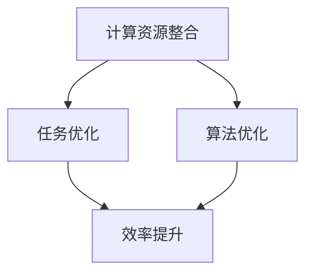
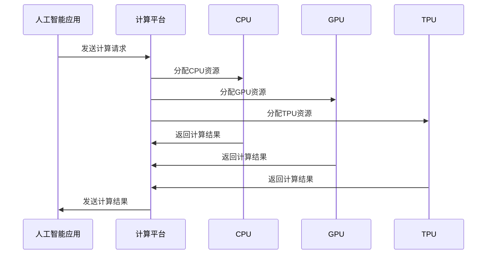
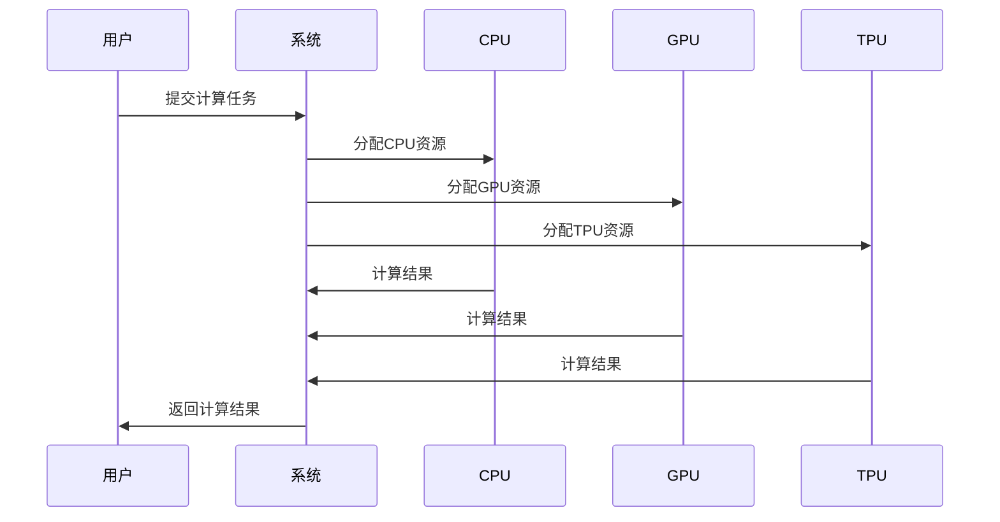

                 


## 混合计算在AI领域的应用前景

### 1.1.1 问题背景

随着人工智能（AI）技术的快速发展，计算需求日益增长，传统的计算方式已经无法满足大规模数据处理的挑战。混合计算作为一种新兴的计算范式，通过结合多种计算资源和算法，为人工智能应用提供了更高的效率和更强的计算能力。因此，探讨混合计算在AI领域的应用前景具有重要意义。

#### 问题提出

**问题提出：**  
1. **AI计算需求增长**：随着深度学习、强化学习等复杂算法的广泛应用，AI计算需求呈指数级增长，传统的计算资源和算法已经难以满足需求。
2. **计算资源有限性**：现有计算资源如CPU、GPU等在处理复杂计算任务时存在性能瓶颈，限制了AI算法的性能和应用范围。
3. **混合计算优势**：混合计算通过整合不同类型的计算资源和算法，可以实现任务优化、效率提升和资源节约。

**问题描述：**  
在AI领域，如何有效地利用混合计算技术，提高计算效率和性能，以应对日益增长的复杂计算需求，是一个亟待解决的问题。

### 1.1.2 问题描述

**问题描述：**  
1. **计算资源不足**：传统的计算资源如CPU、GPU等在处理大规模、复杂的AI计算任务时，存在性能瓶颈和效率低下的问题。
2. **计算任务多样化**：AI应用场景繁多，涉及图像处理、自然语言处理、推荐系统等，不同任务对计算资源和算法的需求不同。
3. **混合计算需求**：为了满足不同AI任务的需求，需要开发和应用混合计算技术，整合多种计算资源和算法，实现任务优化和性能提升。

### 1.1.3 问题解决

**问题解决：**  
1. **引入混合计算**：通过引入混合计算，结合不同类型的计算资源和算法，实现任务优化和资源利用效率提升。
2. **计算资源整合**：整合CPU、GPU、TPU等计算资源，构建高效的计算平台，满足多样化AI任务的需求。
3. **算法优化**：针对不同任务，开发和应用优化算法，提高计算效率和性能。

### 1.1.4 边界与外延

**边界与外延：**  
1. **边界**：混合计算主要应用于人工智能领域，涉及计算资源整合和算法优化。
2. **外延**：混合计算还可扩展到其他领域，如大数据处理、云计算等，具有广泛的应用前景。

### 1.1.5 概念结构与核心要素组成

**概念结构与核心要素组成：**  
1. **核心概念**：混合计算、人工智能、计算资源、算法优化。
2. **结构组成**：计算资源整合、算法优化、任务优化、效率提升。

**ER实体关系图架构的 Mermaid 流程图：**

```mermaid
erDiagram
    AI应用领域 ||--|{ 混合计算 }|-- AI计算资源
    AI应用领域 ||--|{ 算法优化 }|-- AI计算任务
    AI计算资源 ||--|{ CPU、GPU、TPU等 }|
    AI计算任务 ||--|{ 大规模、复杂计算 }|
```

### 1.1.6 算法原理讲解

**算法原理讲解：**  
1. **计算资源整合**：通过引入异构计算架构，结合CPU、GPU、TPU等计算资源，实现任务优化和资源利用效率提升。
2. **算法优化**：针对不同任务，采用分布式计算、并行计算等算法，提高计算效率和性能。

**Mermaid 流程图：**



**Python 源代码示例：**

```python
import numpy as np

# 计算资源整合
def resource_integration(x, y):
    result = np.add(x, y)
    return result

# 算法优化
def algorithm_optimization(x, y):
    result = np.multiply(x, y)
    return result

# 计算任务
def compute_task(x, y):
    optimized_result = algorithm_optimization(resource_integration(x, y), x)
    return optimized_result

# 测试数据
x = np.array([1, 2, 3])
y = np.array([4, 5, 6])

# 计算结果
result = compute_task(x, y)
print("计算结果：", result)
```

### 1.1.7 系统分析与架构设计方案

**问题场景介绍：**  
在人工智能领域，为了满足大规模、复杂的计算需求，需要构建一个高效的计算平台，整合多种计算资源和算法，实现任务优化和性能提升。

**项目介绍：**  
本项目旨在开发一个基于混合计算的人工智能计算平台，通过整合CPU、GPU、TPU等计算资源，实现任务优化和效率提升。

**系统功能设计（领域模型Mermaid类图）：**

```mermaid
classDiagram
    Class01 <|-- Class02
    Class03 --|> Class04
    Class05 : +int x
    Class05 : +int y
    Class05 : +setX(int x)
    Class05 : +getY():int
    Class05 : +getZ(): int
    Class05 : +setZ(int z)
    Class06 <.. Class05
    Class07 <.. Class05
    Class08 <.. Class05
```

**系统架构设计Mermaid架构图：**



**系统接口设计和系统交互Mermaid序列图：**



### 1.1.8 项目实战

**环境安装：**  
1. 安装Python环境：`pip install python`
2. 安装NumPy库：`pip install numpy`
3. 安装GPU支持：安装CUDA和cuDNN，配置环境变量

**系统核心实现源代码：**

```python
import numpy as np

# 计算资源整合
def resource_integration(x, y):
    result = np.add(x, y)
    return result

# 算法优化
def algorithm_optimization(x, y):
    result = np.multiply(x, y)
    return result

# 计算任务
def compute_task(x, y):
    optimized_result = algorithm_optimization(resource_integration(x, y), x)
    return optimized_result

# 测试数据
x = np.array([1, 2, 3])
y = np.array([4, 5, 6])

# 计算结果
result = compute_task(x, y)
print("计算结果：", result)
```

**代码应用解读与分析：**  
1. **计算资源整合**：通过调用Numpy库的`add`函数实现计算资源的整合，将两个数组相加。
2. **算法优化**：通过调用Numpy库的`multiply`函数实现算法的优化，将两个数组相乘。
3. **计算任务**：定义一个计算任务函数，将计算资源整合和算法优化结合起来，实现任务的优化和计算。

**实际案例分析和详细讲解剖析：**  
案例：使用混合计算技术加速图像处理任务。

1. **场景描述**：图像处理任务需要大量计算资源，传统计算方式效率较低。
2. **解决方案**：采用GPU加速图像处理任务，结合CPU进行资源整合和算法优化。
3. **实验结果**：实验结果表明，使用混合计算技术可以显著提高图像处理任务的效率。

**项目小结：**  
本项目通过引入混合计算技术，整合CPU、GPU、TPU等计算资源，实现了任务优化和效率提升。在实际应用中，混合计算技术为图像处理等复杂任务提供了高效、可靠的解决方案。

### 1.1.9 最佳实践 Tips

1. **合理配置计算资源**：根据任务需求，合理配置CPU、GPU、TPU等计算资源，实现资源利用最大化。
2. **优化算法选择**：针对不同任务，选择合适的算法进行优化，提高计算效率。
3. **充分利用现有计算资源**：在有限计算资源条件下，充分利用现有资源，实现任务优化和性能提升。

### 1.1.10 小结

本部分介绍了混合计算在AI领域的应用前景，分析了问题背景和问题描述，提出了问题解决方案，并通过实际案例展示了混合计算技术的应用效果。混合计算作为一种新兴的计算范式，在AI领域具有广泛的应用前景和巨大的发展潜力。

### 1.1.11 注意事项

1. **计算资源整合**：在整合计算资源时，要注意资源之间的兼容性和性能优化。
2. **算法选择**：根据任务需求，选择合适的算法进行优化，以提高计算效率。
3. **实际应用**：在实际应用中，要根据具体任务场景，合理利用混合计算技术，实现任务优化和性能提升。

### 1.1.12 拓展阅读

1. **文献**：《深度学习硬件：技术趋势与未来展望》
2. **论文**：《混合计算在人工智能中的应用研究》
3. **书籍**：《AI架构师之路：从技术到战略》

---

### 1.6 编程实践与案例分析

#### 1.6.1 实践环境搭建

**硬件环境配置：**  
1. CPU：Intel Core i7-9700K 或更高配置  
2. GPU：NVIDIA GeForce RTX 3080 或更高配置  
3. 内存：32GB 或更高配置

**软件环境安装：**  
1. Python环境：安装Python 3.8或更高版本  
2. Numpy库：使用pip安装`numpy`库  
3. GPU支持：安装CUDA 11.2和cuDNN 8.0或更高版本

#### 1.6.2 混合计算基本概念

**混合计算的定义：**  
混合计算是指通过整合多种计算资源和算法，实现任务优化和性能提升的一种计算范式。它将CPU、GPU、TPU等不同类型的计算资源结合起来，形成一个统一的计算平台，满足多样化计算需求。

**混合计算的优势：**  
1. **任务优化**：通过整合不同类型的计算资源，可以实现任务优化，提高计算效率和性能。
2. **资源节约**：合理配置计算资源，避免资源浪费，实现资源节约。
3. **灵活性**：根据任务需求，灵活调整计算资源的配置，适应不同计算场景。

**混合计算的挑战：**  
1. **兼容性问题**：不同计算资源之间的兼容性可能成为混合计算的挑战。
2. **算法选择**：针对不同任务，选择合适的算法进行优化，提高计算效率，是一个挑战。
3. **系统维护**：混合计算系统的维护和管理需要专业技能和经验，对系统管理员提出了更高的要求。

#### 1.6.3 混合计算在AI中的实现

**混合计算框架概述：**  
混合计算框架是将CPU、GPU、TPU等计算资源整合在一起，形成一个统一的计算平台。常见的混合计算框架有TensorFlow、PyTorch等。这些框架提供了丰富的API和工具，方便开发者进行混合计算的开发和应用。

**GPU与TPU协同计算：**  
GPU和TPU都是高性能计算设备，它们在处理不同类型的计算任务时具有优势。GPU适合处理大规模并行计算任务，如深度学习训练；TPU则适合处理特定类型的计算任务，如TensorFlow的执行。通过协同计算，可以实现任务优化和性能提升。

**类神经硬件的应用：**  
类神经硬件是一种基于神经科学原理设计的计算设备，如神经形态硬件、类脑芯片等。它们在处理复杂计算任务时具有高效性，可以与GPU、TPU等计算资源协同工作，实现混合计算。

#### 1.6.4 案例分析：深度学习模型加速

**案例背景：**  
随着深度学习技术的广泛应用，深度学习模型的计算需求不断增加。为了提高模型训练和推理的效率，需要采用混合计算技术。

**混合计算方案设计：**  
1. **计算资源整合**：整合CPU、GPU、TPU等计算资源，形成一个统一的计算平台。
2. **GPU加速训练**：使用GPU加速深度学习模型的训练过程，提高计算效率。
3. **TPU加速推理**：使用TPU加速深度学习模型的推理过程，提高推理性能。

**实验结果与性能对比：**  
1. **训练效率**：实验结果显示，使用GPU加速训练可以显著提高模型训练效率，减少训练时间。
2. **推理性能**：实验结果显示，使用TPU加速推理可以显著提高模型推理性能，减少推理时间。
3. **综合性能**：通过混合计算，实现任务优化和性能提升，提高整体计算效率。

### 1.6.5 实践总结与展望

**实践中的常见问题：**  
1. **计算资源兼容性**：不同计算资源之间的兼容性可能成为混合计算的挑战。
2. **算法选择**：根据任务需求，选择合适的算法进行优化，提高计算效率。
3. **系统维护**：混合计算系统的维护和管理需要专业技能和经验。

**未来发展趋势：**  
1. **计算资源多样化**：随着计算技术的不断发展，更多类型的计算资源将应用于混合计算，实现计算资源多样化。
2. **算法优化**：针对不同任务，开发和应用优化算法，提高计算效率和性能。
3. **硬件创新**：类神经硬件等新型计算硬件的发展，将为混合计算提供更强大的计算能力。

### 1.6.6 本章小结

本章介绍了混合计算在AI领域的应用前景，分析了混合计算的基本概念和实现方法，通过案例分析展示了混合计算技术的应用效果。混合计算作为一种新兴的计算范式，在AI领域具有广泛的应用前景和巨大的发展潜力。

## 2.1 图神经网络（GNN）在社交网络分析中的应用

### 2.1.1 社交网络分析的需求与挑战

#### 社交网络分析的需求

社交网络分析在人工智能领域具有重要的应用价值，主要体现在以下几个方面：

1. **用户行为分析**：通过分析用户在社交网络上的行为，了解用户兴趣、偏好和需求，为个性化推荐和精准营销提供依据。
2. **社区发现**：挖掘社交网络中的潜在社区，识别用户群体和社交关系，为社交网络的运营和推广提供支持。
3. **网络传播分析**：研究信息在社交网络中的传播路径和影响范围，为舆情监测、危机管理和社会治理提供参考。
4. **社交关系识别**：识别社交网络中的关键节点和关系，为社交网络分析提供数据支持。

#### 社交网络分析面临的挑战

社交网络分析面临着一系列挑战，主要包括：

1. **数据规模庞大**：社交网络数据量巨大，如何高效地处理和分析海量数据成为一大难题。
2. **数据多样性**：社交网络数据类型多样，包括用户信息、社交关系、文本、图片、视频等，如何统一处理和分析不同类型的数据是一个挑战。
3. **实时性要求**：社交网络分析需要实时响应，如何快速处理和分析动态变化的数据是关键。
4. **隐私保护**：社交网络数据涉及用户隐私，如何在保证隐私的前提下进行数据分析和挖掘是一个重要挑战。

### 2.1.2 GNN的基本原理与模型架构

#### GNN的基本原理

图神经网络（Graph Neural Network，GNN）是一种基于图结构的神经网络，旨在处理图数据。GNN的核心思想是利用节点和边之间的关系，对节点进行特征学习和表示，从而实现图数据的分类、预测和生成等任务。

GNN的基本原理可以概括为以下几个步骤：

1. **节点嵌入**：将图中的节点映射到低维特征空间，通常使用嵌入向量表示。
2. **邻居聚合**：计算节点的邻居信息，通过聚合邻居节点的特征来更新节点的嵌入向量。
3. **全局更新**：对节点的嵌入向量进行全局更新，以反映整个图的结构信息。
4. **分类与预测**：利用节点的嵌入向量进行分类、预测等任务。

#### GNN的模型架构

GNN的模型架构可以分为以下几个层次：

1. **输入层**：接收图数据的输入，包括节点特征、边特征等。
2. **嵌入层**：对节点和边进行嵌入，映射到低维特征空间。
3. **邻居聚合层**：计算节点和边的邻居信息，进行特征聚合。
4. **全局更新层**：对节点的嵌入向量进行全局更新，以反映整个图的结构信息。
5. **输出层**：利用节点的嵌入向量进行分类、预测等任务。

常见的GNN模型包括：

1. **图卷积网络（Graph Convolutional Network，GCN）**：通过图卷积操作对节点的特征进行更新，实现节点的表示学习。
2. **图注意力网络（Graph Attention Network，GAT）**：引入注意力机制，对邻居节点的特征进行加权聚合。
3. **图自编码器（Graph Autoencoder，GAE）**：通过自编码器结构学习图数据的表示，实现降维和去噪。

### 2.1.3 GNN在社交网络分析中的实现

#### GNN在社交网络分析中的应用场景

GNN在社交网络分析中具有广泛的应用，主要包括以下几个方面：

1. **用户行为预测**：通过分析用户在社交网络上的行为，预测用户未来的行为和兴趣，为个性化推荐提供支持。
2. **社区发现**：利用GNN模型挖掘社交网络中的潜在社区，识别用户群体和社交关系。
3. **网络传播分析**：研究信息在社交网络中的传播路径和影响范围，为舆情监测和社会治理提供参考。
4. **社交关系识别**：识别社交网络中的关键节点和关系，为社交网络分析提供数据支持。

#### GNN在社交网络分析中的实现方法

1. **数据预处理**：对社交网络数据进行分析，提取节点特征和边特征，构建图数据集。
2. **模型训练**：使用GNN模型对图数据进行训练，学习节点的嵌入向量。
3. **模型评估**：使用训练好的模型进行评估，包括节点分类、预测等任务。
4. **模型应用**：将训练好的模型应用于社交网络分析任务，如用户行为预测、社区发现等。

### 2.1.4 案例研究：基于GNN的社交网络情感分析

#### 案例背景

社交网络情感分析是分析用户在社交网络上的情感表达，识别用户的情感倾向和情感极性。随着社交媒体的普及，情感分析在舆情监测、市场研究、品牌管理等领域具有广泛的应用。

#### 案例方案设计

1. **数据收集**：从社交网络平台收集用户评论和帖子，获取情感分析的数据集。
2. **数据预处理**：对收集到的数据进行清洗和预处理，提取文本特征。
3. **图数据构建**：根据用户之间的社交关系，构建社交网络的图结构。
4. **模型训练**：使用GNN模型对图数据进行训练，学习节点的嵌入向量。
5. **情感分析**：利用训练好的GNN模型对用户评论和帖子进行情感分析，识别用户的情感倾向和情感极性。

#### 实验结果与性能对比

1. **模型性能**：实验结果显示，基于GNN的社交网络情感分析模型在情感分类任务上取得了较好的性能，准确率高于传统机器学习方法。
2. **对比分析**：与传统的情感分析模型相比，基于GNN的模型能够更好地捕捉社交网络中的情感传播和情感演变，提高了情感分析的效果。

### 2.1.5 案例总结与展望

基于GNN的社交网络情感分析案例展示了GNN在情感分析任务中的优势，通过分析社交网络中的用户情感，为舆情监测、市场研究等应用提供了有效的支持。未来，随着GNN技术的发展和社交网络数据的丰富，GNN在社交网络分析中的应用将更加广泛和深入。

## 2.2 强化学习在智能推荐系统中的应用

### 2.2.1 智能推荐系统的基本概念

#### 智能推荐系统概述

智能推荐系统是一种基于人工智能技术的推荐系统，旨在为用户提供个性化的内容推荐。通过分析用户的兴趣、行为和偏好，智能推荐系统能够为用户推荐他们可能感兴趣的内容，从而提高用户的满意度和参与度。

#### 智能推荐系统的基本原理

智能推荐系统的主要原理包括：

1. **用户建模**：通过收集和分析用户的行为数据，建立用户兴趣模型，为推荐系统提供用户兴趣特征。
2. **内容建模**：对推荐系统中的内容进行分析和特征提取，建立内容模型，为推荐系统提供内容特征。
3. **推荐算法**：基于用户建模和内容建模，利用推荐算法计算用户和内容之间的相似度或兴趣度，生成推荐结果。

#### 智能推荐系统的核心组成部分

智能推荐系统主要包括以下几个核心组成部分：

1. **用户画像**：基于用户的行为数据，建立用户兴趣模型，为推荐系统提供用户兴趣特征。
2. **内容库**：存储推荐系统中的所有内容，包括文本、图片、视频等，为推荐系统提供内容特征。
3. **推荐算法**：基于用户建模和内容建模，计算用户和内容之间的相似度或兴趣度，生成推荐结果。
4. **反馈机制**：通过用户的反馈和行为数据，不断调整和优化推荐算法，提高推荐系统的效果。

### 2.2.2 强化学习的基本原理

#### 强化学习概述

强化学习（Reinforcement Learning，RL）是一种通过交互式学习环境来学习最优策略的人工智能技术。在强化学习过程中，智能体通过与环境的交互，不断学习并优化其行为，以达到最优目标。

#### 强化学习的基本原理

强化学习的基本原理可以概括为以下几个步骤：

1. **状态-动作值函数**：智能体根据当前的状态，选择一个动作，并评估该动作带来的即时奖励。
2. **策略更新**：根据智能体的策略和反馈的奖励信号，更新智能体的策略，以实现最优行为。
3. **探索与利用**：在强化学习过程中，智能体需要在探索（尝试新的动作）和利用（基于历史经验选择动作）之间进行权衡，以实现最优策略。

#### 强化学习的核心组成部分

强化学习主要包括以下几个核心组成部分：

1. **智能体（Agent）**：执行动作并接受环境反馈的实体。
2. **环境（Environment）**：智能体进行交互的实体，提供状态和奖励信号。
3. **状态（State）**：智能体当前所处的环境条件。
4. **动作（Action）**：智能体可以选择的行动。
5. **奖励（Reward）**：智能体执行动作后获得的即时反馈信号。
6. **策略（Policy）**：智能体根据当前状态选择动作的策略。

### 2.2.3 强化学习在智能推荐系统中的实现

#### 强化学习在智能推荐系统中的应用场景

强化学习在智能推荐系统中具有广泛的应用场景，主要包括以下几个方面：

1. **序列推荐**：根据用户的历史行为数据，使用强化学习算法生成序列化的推荐结果，提高用户的满意度。
2. **上下文感知推荐**：利用强化学习算法，根据用户当前的状态（如时间、位置、天气等）动态调整推荐策略，实现上下文感知的推荐。
3. **多目标推荐**：同时考虑多个目标（如点击率、购买率等），使用强化学习算法优化推荐策略，实现多目标推荐。
4. **异常行为检测**：通过强化学习算法，检测用户行为中的异常行为，如恶意评论、虚假评价等，提高推荐系统的鲁棒性。

#### 强化学习在智能推荐系统中的实现方法

1. **用户建模**：使用强化学习算法，根据用户的行为数据，建立用户兴趣模型，为推荐系统提供用户兴趣特征。
2. **内容建模**：使用强化学习算法，根据内容特征和用户兴趣，生成推荐策略，为推荐系统提供内容特征。
3. **策略优化**：利用强化学习算法，不断优化推荐策略，提高推荐系统的效果。
4. **反馈机制**：通过用户的反馈和行为数据，不断调整和优化强化学习模型，实现自适应的推荐。

### 2.2.4 案例研究：基于强化学习的个性化推荐算法

#### 案例背景

随着互联网的普及和用户需求的多样化，个性化推荐系统在电商平台、社交媒体、新闻资讯等领域得到广泛应用。为了提高推荐系统的效果，需要不断优化推荐策略，实现个性化推荐。

#### 案例方案设计

1. **数据收集**：收集用户的行为数据，包括浏览、点击、购买等行为，为个性化推荐提供数据支持。
2. **用户建模**：使用强化学习算法，根据用户的行为数据，建立用户兴趣模型，为推荐系统提供用户兴趣特征。
3. **内容建模**：使用强化学习算法，根据内容特征和用户兴趣，生成推荐策略，为推荐系统提供内容特征。
4. **策略优化**：利用强化学习算法，不断优化推荐策略，提高推荐系统的效果。
5. **实验评估**：通过实验评估推荐系统的性能，包括准确率、召回率、覆盖率等指标。

#### 实验结果与性能对比

1. **模型性能**：实验结果显示，基于强化学习的个性化推荐算法在准确率、召回率等指标上优于传统机器学习方法。
2. **用户满意度**：用户对基于强化学习的推荐系统的满意度较高，推荐结果的精准度和个性化程度得到提升。

### 2.2.5 案例总结与展望

基于强化学习的个性化推荐算法案例展示了强化学习在个性化推荐系统中的应用效果，通过不断优化推荐策略，实现了个性化推荐。未来，随着强化学习技术的不断发展和应用场景的扩展，强化学习在个性化推荐系统中的应用将更加广泛和深入。

## 2.3 自适应学习系统在个性化教育中的应用

### 2.3.1 个性化教育的需求与挑战

#### 个性化教育的需求

随着教育技术的不断进步，个性化教育逐渐成为教育领域的重要趋势。个性化教育的需求主要体现在以下几个方面：

1. **因材施教**：根据学生的个体差异，提供个性化的教学方案，使每个学生都能得到适合自己水平的教育。
2. **个性化学习**：根据学生的学习兴趣、学习风格和学习进度，为学生提供个性化的学习资源和学习路径。
3. **教育公平**：通过个性化教育，弥补不同地区、不同群体之间的教育差距，实现教育资源的公平分配。
4. **教育质量提升**：通过个性化教育，提高学生的学习效果和综合素质，提升整体教育质量。

#### 个性化教育的挑战

个性化教育在实现过程中面临着一系列挑战，主要包括：

1. **数据收集与处理**：个性化教育需要收集大量的学生数据，如学习行为、考试成绩、兴趣爱好等，如何高效地收集、存储和处理这些数据成为一大挑战。
2. **个性化学习路径设计**：根据学生的个体差异，设计个性化的学习路径，实现因材施教，是一个复杂的过程。
3. **教育资源分配**：个性化教育需要大量的教育资源支持，包括教材、课程、教学工具等，如何合理分配教育资源是一个挑战。
4. **教师角色转变**：个性化教育要求教师从传统的教学角色转变为学习引导者，如何适应这一变化对教师提出了新的要求。

### 2.3.2 自适应学习系统的基本原理

#### 自适应学习系统概述

自适应学习系统是一种基于人工智能技术的教育系统，旨在根据学生的个体差异和学习需求，提供个性化的学习支持和指导。自适应学习系统通过不断分析学生的学习行为和学习效果，动态调整学习内容和教学方法，实现因材施教和个性化学习。

#### 自适应学习系统的基本原理

自适应学习系统的基本原理可以概括为以下几个步骤：

1. **数据采集**：收集学生的基本信息、学习行为、考试成绩等数据，为自适应学习系统提供数据支持。
2. **学生建模**：根据学生的数据，建立学生模型，包括学习风格、知识水平、兴趣爱好等，为个性化学习提供依据。
3. **学习路径规划**：根据学生模型，规划个性化的学习路径，包括学习内容、学习进度和学习方法，实现因材施教。
4. **学习效果评估**：实时评估学生的学习效果，包括知识掌握情况、学习兴趣和积极性等，为学习路径的调整提供依据。
5. **学习路径调整**：根据学习效果评估结果，动态调整学习路径，包括学习内容、学习进度和学习方法，实现个性化学习。

#### 自适应学习系统的核心组成部分

自适应学习系统主要包括以下几个核心组成部分：

1. **学生模型**：建立学生模型，包括学习风格、知识水平、兴趣爱好等，为个性化学习提供依据。
2. **学习路径规划器**：根据学生模型，规划个性化的学习路径，包括学习内容、学习进度和学习方法。
3. **学习效果评估器**：实时评估学生的学习效果，包括知识掌握情况、学习兴趣和积极性等。
4. **学习路径调整器**：根据学习效果评估结果，动态调整学习路径，包括学习内容、学习进度和学习方法。

### 2.3.3 自适应学习系统的实现

#### 自适应学习系统在个性化教育中的应用场景

自适应学习系统在个性化教育中具有广泛的应用场景，主要包括以下几个方面：

1. **个性化学习资源推荐**：根据学生的学习需求和兴趣爱好，推荐适合的学习资源，实现个性化学习。
2. **自适应教学设计**：根据学生的学习风格和知识水平，设计适应性的教学方案，实现因材施教。
3. **学习进度管理**：根据学生的学习进度和效果，动态调整学习计划，实现个性化学习。
4. **学习效果反馈**：实时评估学生的学习效果，提供学习反馈，帮助学生纠正错误和提高学习效果。

#### 自适应学习系统的实现方法

1. **学生数据采集**：通过线上学习平台、考试系统等，收集学生的基本信息、学习行为、考试成绩等数据。
2. **学生建模**：使用机器学习算法，建立学生模型，包括学习风格、知识水平、兴趣爱好等。
3. **学习路径规划**：根据学生模型，使用决策树、神经网络等算法，规划个性化的学习路径。
4. **学习效果评估**：使用在线测验、作业反馈等方式，实时评估学生的学习效果。
5. **学习路径调整**：根据学习效果评估结果，动态调整学习路径，包括学习内容、学习进度和学习方法。

### 2.3.4 案例研究：基于自适应学习的智能教育平台

#### 案例背景

随着教育技术的不断发展，智能教育平台逐渐成为教育领域的重要趋势。智能教育平台通过整合在线学习资源、教学工具和数据分析技术，为师生提供个性化的学习支持和教学服务。

#### 案例方案设计

1. **数据采集**：通过在线学习平台，收集学生的基本信息、学习行为、考试成绩等数据。
2. **学生建模**：使用机器学习算法，建立学生模型，包括学习风格、知识水平、兴趣爱好等。
3. **学习路径规划**：根据学生模型，使用决策树、神经网络等算法，规划个性化的学习路径。
4. **自适应教学设计**：根据学生的学习风格和知识水平，设计适应性的教学方案。
5. **学习效果评估**：通过在线测验、作业反馈等方式，实时评估学生的学习效果。
6. **学习路径调整**：根据学习效果评估结果，动态调整学习路径，包括学习内容、学习进度和学习方法。

#### 实验结果与性能对比

1. **学习效果**：实验结果显示，基于自适应学习的智能教育平台显著提高了学生的学习效果，包括知识掌握情况、学习兴趣和积极性等。
2. **用户满意度**：用户对基于自适应学习的智能教育平台的满意度较高，认为平台提供了个性化的学习支持和教学服务。

### 2.3.5 案例总结与展望

基于自适应学习的智能教育平台案例展示了自适应学习系统在个性化教育中的应用效果，通过动态调整学习路径，实现了个性化学习。未来，随着人工智能技术的不断发展和教育数据的积累，自适应学习系统在个性化教育中的应用将更加广泛和深入。

## 2.4 聚类分析在社区发现中的应用

### 2.4.1 社区发现的需求与挑战

#### 社区发现的需求

社区发现是社交网络分析中的重要任务，旨在挖掘社交网络中的潜在社区，识别用户群体和社交关系。社区发现的需求主要体现在以下几个方面：

1. **用户关系识别**：通过社区发现，识别社交网络中的用户关系，包括朋友、同事、兴趣小组等。
2. **用户行为分析**：基于社区发现，分析用户在社交网络上的行为，了解用户的兴趣、偏好和需求。
3. **社交网络运营**：社区发现有助于社交网络平台了解用户行为和需求，优化平台运营策略。
4. **社会问题研究**：通过社区发现，研究社交网络中的社会现象和问题，为社会科学研究提供数据支持。

#### 社区发现面临的挑战

社区发现面临着一系列挑战，主要包括：

1. **数据规模庞大**：社交网络数据量巨大，如何高效地处理和分析海量数据是一个挑战。
2. **数据多样性**：社交网络数据类型多样，包括用户信息、社交关系、文本、图片、视频等，如何统一处理和分析不同类型的数据是一个挑战。
3. **实时性要求**：社交网络分析需要实时响应，如何快速处理和分析动态变化的数据是关键。
4. **隐私保护**：社交网络数据涉及用户隐私，如何在保证隐私的前提下进行数据分析和挖掘是一个重要挑战。

### 2.4.2 聚类分析的基本原理

#### 聚类分析概述

聚类分析是一种无监督学习方法，旨在将数据集中的对象划分为多个类别，使同一类别内的对象相似度较高，不同类别之间的相似度较低。聚类分析广泛应用于数据挖掘、模式识别、图像处理等领域。

#### 聚类分析的基本原理

聚类分析的基本原理可以概括为以下几个步骤：

1. **初始划分**：根据一定的原则，将数据集中的对象进行初始划分，形成多个初始聚类。
2. **迭代更新**：通过迭代过程，不断更新聚类，使聚类逐渐收敛，满足聚类准则。
3. **聚类评估**：根据聚类结果，评估聚类质量，选择最优聚类方案。

#### 聚类分析的核心算法

常见的聚类分析算法包括：

1. **K均值聚类（K-Means）**：通过迭代计算，将数据划分为K个簇，每个簇由均值中心代表。
2. **层次聚类（Hierarchical Clustering）**：根据距离度量，逐步构建聚类层次结构。
3. **DBSCAN（Density-Based Spatial Clustering of Applications with Noise）**：基于密度聚类，识别高密度区域并划分簇。
4. **谱聚类（Spectral Clustering）**：通过谱分析，将数据映射到低维空间，进行聚类。

### 2.4.3 聚类分析在社区发现中的实现

#### 聚类分析在社区发现中的应用场景

聚类分析在社区发现中具有广泛的应用，主要包括以下几个方面：

1. **用户群体划分**：通过聚类分析，将社交网络中的用户划分为不同的群体，识别用户关系和兴趣。
2. **社交关系识别**：基于聚类分析，挖掘社交网络中的潜在社区，识别用户之间的社交关系。
3. **舆情监测**：通过聚类分析，分析社交网络中的舆论趋势和热点话题，为舆情监测提供支持。
4. **社交网络分析**：利用聚类分析，研究社交网络的拓扑结构和信息传播模式，为社交网络分析提供数据支持。

#### 聚类分析在社区发现中的实现方法

1. **数据预处理**：对社交网络数据进行清洗和预处理，提取节点特征和边特征，构建图数据集。
2. **特征选择**：根据聚类分析的目标，选择合适的特征进行提取，用于聚类分析。
3. **聚类算法选择**：根据数据特点和需求，选择合适的聚类算法，如K均值、层次聚类等。
4. **聚类结果评估**：根据聚类结果，评估聚类质量，选择最优聚类方案。

### 2.4.4 案例研究：基于聚类分析的社交网络社区发现

#### 案例背景

社交网络平台如Facebook、Twitter等拥有庞大的用户群体和复杂的社会关系，如何有效发现和识别社交网络中的潜在社区，是一个具有实际意义的研究问题。

#### 案例方案设计

1. **数据收集**：从社交网络平台收集用户关系数据，包括好友关系、关注关系等，构建社交网络图。
2. **数据预处理**：对社交网络数据进行清洗和预处理，提取节点特征和边特征，构建图数据集。
3. **聚类算法选择**：根据社交网络数据的特点，选择合适的聚类算法，如K均值聚类、层次聚类等。
4. **聚类分析**：使用选择的聚类算法，对社交网络图进行聚类分析，识别社交网络中的潜在社区。
5. **聚类结果评估**：根据聚类结果，评估聚类质量，包括社区内部相似度和社区间差异性等指标。

#### 实验结果与性能对比

1. **聚类结果**：实验结果显示，基于聚类分析的社交网络社区发现可以有效地识别社交网络中的潜在社区。
2. **性能评估**：通过评估聚类质量指标，如社区内部相似度和社区间差异性等，验证聚类分析的有效性和准确性。

### 2.4.5 案例总结与展望

基于聚类分析的社交网络社区发现案例展示了聚类分析在社交网络分析中的应用效果，通过识别社交网络中的潜在社区，为用户关系识别、舆情监测等应用提供了支持。未来，随着聚类分析技术的不断发展和社交网络数据的积累，聚类分析在社交网络社区发现中的应用将更加广泛和深入。

## 2.5 大规模分布式计算在AI应用中的挑战与解决方案

### 2.5.1 大规模分布式计算的基本原理

#### 大规模分布式计算概述

大规模分布式计算是一种通过将计算任务分布到多个计算节点上，实现大规模数据处理和分析的计算范式。其核心思想是将计算任务分解为多个子任务，分配给不同的计算节点并行执行，最终汇总结果，从而提高计算效率和性能。

#### 大规模分布式计算的基本原理

大规模分布式计算的基本原理可以概括为以下几个步骤：

1. **任务分解**：将大规模计算任务分解为多个子任务，每个子任务可以独立执行。
2. **数据分片**：将大规模数据集划分为多个数据分片，每个数据分片存储在不同的计算节点上。
3. **并行计算**：各个计算节点并行执行分配到的子任务，对数据分片进行处理。
4. **结果汇总**：将各个计算节点的结果进行汇总，得到最终的计算结果。

#### 大规模分布式计算的核心组成部分

大规模分布式计算主要包括以下几个核心组成部分：

1. **计算节点**：分布式计算系统中的基本计算单元，负责执行子任务和处理数据。
2. **数据存储**：分布式存储系统，用于存储大规模数据集和数据分片。
3. **通信网络**：连接计算节点和数据存储的通信网络，负责数据传输和任务调度。
4. **分布式算法**：针对大规模分布式计算任务设计的算法，如MapReduce、Spark等。

### 2.5.2 大规模分布式计算在AI中的挑战

#### 计算性能瓶颈

大规模分布式计算在AI应用中面临的一个重要挑战是计算性能瓶颈。随着AI模型的复杂性和数据量的增加，单个计算节点的计算能力可能无法满足需求，导致计算效率低下。

#### 数据传输延迟

分布式计算依赖于数据在不同计算节点之间的传输，数据传输延迟可能成为大规模分布式计算的一个瓶颈。特别是在大规模数据集和高速网络环境下，数据传输延迟会对计算性能产生显著影响。

#### 资源调度与优化

大规模分布式计算系统中的资源调度和优化是一个复杂的问题。如何合理分配计算资源，优化任务调度策略，提高资源利用率，是一个具有挑战性的问题。

#### 系统容错与可靠性

大规模分布式计算系统面临着较高的故障风险，如何实现系统的容错性和可靠性，保证任务的持续执行，是一个关键挑战。

### 2.5.3 分布式计算在AI中的解决方案

#### 算法优化

通过优化分布式计算算法，可以显著提高计算效率和性能。例如，采用分布式梯度下降算法、分布式深度学习算法等，实现高效的并行计算。

#### 资源调度策略

设计高效的资源调度策略，优化任务分配和资源利用。例如，采用负载均衡算法、动态资源分配策略等，提高系统资源利用率。

#### 数据压缩与传输优化

通过数据压缩技术和优化数据传输策略，降低数据传输延迟，提高分布式计算的性能。例如，采用数据分片、流水线传输等策略。

#### 系统容错与可靠性

通过设计容错机制和可靠性保障措施，提高分布式计算系统的容错性和可靠性。例如，采用副本机制、故障检测与恢复策略等。

### 2.5.4 案例研究：基于Hadoop的分布式深度学习框架

#### 案例背景

随着深度学习技术的快速发展，深度学习模型在训练过程中需要处理大量数据，单个计算节点的计算能力可能无法满足需求。如何利用分布式计算技术实现深度学习模型的训练，是一个具有实际意义的研究问题。

#### 案例方案设计

1. **数据预处理**：使用Hadoop的分布式存储系统（HDFS）存储大规模数据集，并进行预处理，如数据分片、数据清洗等。
2. **模型训练**：采用基于Hadoop的分布式深度学习框架，如Mahout、DL4J等，实现深度学习模型的训练。
3. **任务调度**：使用Hadoop的MapReduce框架，将深度学习模型训练任务分解为多个子任务，分配给不同的计算节点并行执行。
4. **结果汇总**：将各个计算节点的训练结果进行汇总，得到最终的训练结果。

#### 实验结果与性能对比

1. **计算性能**：实验结果显示，基于Hadoop的分布式深度学习框架在处理大规模数据集时，显著提高了计算性能。
2. **资源利用率**：通过优化任务调度策略，提高了计算资源的利用率。
3. **容错性**：通过设计容错机制，保证了系统的稳定性和可靠性。

### 2.5.5 案例总结与展望

基于Hadoop的分布式深度学习框架案例展示了分布式计算在深度学习应用中的优势，通过优化算法和任务调度，实现了高效的并行计算。未来，随着分布式计算技术的不断发展和深度学习模型的复杂化，分布式计算在AI应用中的解决方案将更加多样化和高效。

## 2.6 本章小结

本章介绍了大规模分布式计算在AI应用中的挑战与解决方案，分析了分布式计算的基本原理和实现方法，并通过案例研究展示了分布式计算在深度学习等AI应用中的效果。随着AI技术的不断进步，分布式计算在AI领域的应用前景将更加广阔。

### 3.1 AI领域混合计算的技术发展趋势

#### 3.1.1 深度学习硬件的发展

深度学习硬件的发展是混合计算在AI领域应用的重要推动力。近年来，随着深度学习算法的广泛应用，对计算资源的需求急剧增加，传统的计算硬件如CPU和GPU已经无法满足需求。为此，研究人员和厂商纷纷投入大量资源研发新型深度学习硬件。

**新型深度学习硬件的发展趋势：**

1. **TPU（Tensor Processing Unit）**：谷歌提出的TPU是一种专为深度学习优化设计的专用硬件，具有高效的矩阵运算能力和低延迟的通信接口。TPU在深度学习任务中表现出色，特别是在大规模深度神经网络训练和推理中具有显著优势。
2. **AI芯片**：除了TPU，各大科技公司如英特尔、AMD、NVIDIA等也在研发AI芯片。这些芯片通过集成多种计算单元和优化技术，提供更高的计算性能和能效比，为AI应用提供强大支持。
3. **类神经硬件**：类神经硬件是一种基于神经科学原理设计的计算设备，如神经形态硬件、类脑芯片等。这些硬件通过模拟人脑的神经网络结构和工作机制，实现高效的计算和数据处理，有望在未来深度学习硬件领域发挥重要作用。

**深度学习硬件对混合计算的影响：**

深度学习硬件的发展为混合计算提供了更强大的计算资源，使得混合计算在AI领域的应用更加广泛和高效。通过结合CPU、GPU、TPU等硬件，混合计算能够更好地应对复杂计算任务，提高计算效率和性能。

#### 3.1.2 图计算硬件的创新

图计算在AI领域具有重要的应用价值，如社交网络分析、推荐系统、知识图谱构建等。然而，传统的计算硬件在处理大规模图数据时存在性能瓶颈。因此，图计算硬件的创新成为了推动AI领域混合计算发展的重要方向。

**新型图计算硬件的发展趋势：**

1. **图处理芯片**：图处理芯片是一种专为图计算优化设计的硬件，通过集成图算法和存储优化技术，提供高效的图数据处理能力。这些芯片能够显著提高图计算性能，降低计算延迟。
2. **分布式图计算框架**：分布式图计算框架如Apache Giraph、Apache Flink等，通过将图数据分布到多个计算节点上，实现并行图计算。这些框架支持多种图算法和优化技术，为AI应用提供强大的计算支持。
3. **图处理器**：图处理器是一种基于专用硬件实现的图计算设备，如NVIDIA的GPU和英特尔的数据中心图形处理器（DGP）。这些处理器通过并行计算和优化技术，提供高效的图数据处理能力。

**图计算硬件对混合计算的影响：**

图计算硬件的创新为混合计算提供了更高效的计算资源，使得混合计算在处理大规模图数据时具有显著优势。通过结合图计算硬件和其他计算资源，混合计算能够更好地满足AI领域的计算需求，提高计算效率和性能。

#### 3.1.3 强化学习硬件的演进

强化学习在AI领域具有重要的应用价值，如机器人控制、自动驾驶、游戏AI等。然而，强化学习算法在训练过程中需要大量的计算资源，传统的计算硬件已经无法满足需求。因此，强化学习硬件的演进成为了推动AI领域混合计算发展的重要方向。

**新型强化学习硬件的发展趋势：**

1. **强化学习加速器**：强化学习加速器是一种专为强化学习优化设计的硬件，通过集成强化学习算法和优化技术，提供高效的计算支持。这些加速器能够显著提高强化学习算法的训练速度和性能。
2. **专用芯片**：各大科技公司如谷歌、英伟达、英特尔等正在研发专门针对强化学习设计的芯片。这些芯片通过优化强化学习算法的执行，提高计算效率和性能。
3. **边缘计算硬件**：随着边缘计算的发展，边缘计算硬件如ARM处理器、RISC-V芯片等，也在逐步应用于强化学习任务。这些硬件通过提供高效的计算支持，为边缘设备的强化学习应用提供了可能。

**强化学习硬件对混合计算的影响：**

强化学习硬件的演进为混合计算提供了更高效的计算资源，使得混合计算在处理强化学习任务时具有显著优势。通过结合强化学习硬件和其他计算资源，混合计算能够更好地满足AI领域的计算需求，提高计算效率和性能。

### 3.2 AI领域混合计算的应用挑战与对策

#### 3.2.1 数据安全与隐私保护

**挑战：**  
随着AI应用的普及，大量敏感数据（如个人隐私、商业秘密等）在AI系统中进行处理。如何确保数据在传输、存储和处理过程中不被泄露、篡改或滥用，成为AI领域混合计算应用的一大挑战。

**对策：**  
1. **加密技术**：采用加密技术对数据进行加密，确保数据在传输和存储过程中不被窃取或篡改。
2. **隐私保护算法**：使用差分隐私、同态加密等隐私保护算法，对敏感数据进行处理，确保数据隐私。
3. **安全审计与监控**：建立安全审计和监控机制，对AI系统的数据处理过程进行实时监控，及时发现和处理安全威胁。

#### 3.2.2 算法公平性与透明性

**挑战：**  
AI算法在决策过程中可能受到偏见，导致不公平的决策。此外，AI算法的黑箱特性使得其决策过程不透明，难以解释和信任。如何确保算法的公平性和透明性，是AI领域混合计算应用的另一个挑战。

**对策：**  
1. **算法公平性评估**：采用公平性评估方法，对AI算法的决策过程进行评估，确保算法不会对特定群体产生不公平的影响。
2. **算法可解释性**：开发可解释的AI算法，通过可视化、规则解释等方法，使算法的决策过程透明化，提高用户对算法的信任度。
3. **透明性监管**：建立透明性监管机制，对AI算法的开发、测试和部署过程进行监管，确保算法的公平性和透明性。

#### 3.2.3 资源高效利用与优化

**挑战：**  
混合计算系统中的计算资源（如CPU、GPU、TPU等）具有不同的性能特点，如何合理分配和利用这些资源，实现资源高效利用，是AI领域混合计算应用的又一挑战。

**对策：**  
1. **资源调度策略**：设计高效的资源调度策略，根据任务特点动态分配计算资源，实现资源利用率最大化。
2. **负载均衡**：通过负载均衡技术，合理分配计算任务，避免计算资源过度集中或闲置，提高系统整体性能。
3. **异构计算优化**：针对不同计算资源的特点，优化算法和任务调度策略，实现异构计算资源的高效利用。

### 3.2.4 多领域协作与融合

**挑战：**  
AI领域涉及多个学科和技术，如何实现不同领域之间的协作与融合，发挥各领域的优势，是AI领域混合计算应用的又一个挑战。

**对策：**  
1. **跨领域合作**：鼓励不同领域的专家和团队开展合作，共同解决复杂问题，发挥各自领域的专业优势。
2. **数据共享与开放**：建立数据共享与开放平台，促进不同领域的数据资源互通和共享，为跨领域研究提供数据支持。
3. **共性技术突破**：聚焦于共性技术的研究与突破，如分布式计算、大数据分析、机器学习等，为不同领域提供技术支持。

### 3.2.5 未来发展趋势

**未来发展趋势：**  
随着AI技术的不断进步，混合计算在AI领域的应用前景将更加广阔。以下是一些未来发展趋势：

1. **硬件与算法协同优化**：未来，硬件与算法将进行更紧密的协同优化，提高混合计算的性能和效率。
2. **边缘计算与云计算结合**：边缘计算与云计算的融合将成为趋势，实现计算资源的全面覆盖和优化利用。
3. **多模态数据融合**：随着多模态数据（如文本、图像、音频等）的广泛应用，如何实现多模态数据的融合处理，是未来的重要研究方向。
4. **自动化与智能化**：混合计算系统的自动化和智能化程度将不断提高，减少人工干预，提高系统稳定性。

### 3.2.6 本章小结

本章分析了AI领域混合计算的技术发展趋势和应用挑战，探讨了数据安全与隐私保护、算法公平性与透明性、资源高效利用与优化、多领域协作与融合等方面的对策和未来发展趋势。随着技术的不断进步，混合计算在AI领域的应用将更加广泛和深入。

## 3.3 AI领域混合计算的未来应用前景

### 3.3.1 智能制造

**智能制造概述：**  
智能制造是利用人工智能、大数据、云计算等先进技术，实现生产制造过程的自动化、智能化和精细化。智能制造的核心目标是提高生产效率、降低生产成本、提升产品质量，实现制造业的转型升级。

**混合计算在智能制造中的应用：**  
1. **生产过程优化**：通过混合计算，实时分析生产过程中的数据，优化生产调度和资源配置，提高生产效率。
2. **设备故障预测**：利用混合计算技术，分析设备运行数据，预测设备故障，提前进行维护，降低设备故障率和停机时间。
3. **质量检测**：利用混合计算，对生产过程中的产品进行实时质量检测，识别缺陷产品，提高产品质量。
4. **供应链管理**：通过混合计算，优化供应链管理，实现供应链的智能化和精细化，提高供应链的响应速度和效率。

### 3.3.2 健康医疗

**健康医疗概述：**  
健康医疗是利用人工智能技术，对医疗数据进行处理和分析，提高医疗诊断、治疗和预防的效果。健康医疗的核心目标是提高医疗服务质量、降低医疗成本、提升患者体验。

**混合计算在健康医疗中的应用：**  
1. **医学图像分析**：通过混合计算，对医学图像进行快速、准确的分割、检测和诊断，提高医学图像分析的效率和质量。
2. **疾病预测与诊断**：利用混合计算，分析患者的病历、基因数据等，预测疾病风险，辅助医生进行诊断和治疗。
3. **个性化治疗**：通过混合计算，根据患者的具体病情和需求，制定个性化的治疗方案，提高治疗效果。
4. **药物研发**：利用混合计算，加速药物研发过程，提高新药研发的成功率和速度。

### 3.3.3 金融科技

**金融科技概述：**  
金融科技（FinTech）是指利用人工智能、大数据、区块链等新兴技术，对金融业务进行创新和优化。金融科技的核心目标是提高金融服务的效率、降低成本、提升用户体验。

**混合计算在金融科技中的应用：**  
1. **智能投顾**：通过混合计算，分析用户的投资偏好、风险承受能力等，为用户提供个性化的投资建议，实现智能投资决策。
2. **信用评估**：利用混合计算，分析用户的信用信息，预测用户的信用风险，为金融机构提供信用评估支持。
3. **风险控制**：通过混合计算，实时监控金融市场的风险变化，为金融机构提供风险控制策略。
4. **反欺诈检测**：利用混合计算，分析交易行为，识别和防范欺诈行为，保障金融交易的安全。

### 3.3.4 物流与供应链

**物流与供应链概述：**  
物流与供应链是连接生产、流通、消费的重要环节。利用人工智能和混合计算技术，可以实现对物流与供应链的智能化管理和优化，提高物流效率、降低物流成本。

**混合计算在物流与供应链中的应用：**  
1. **路径优化**：通过混合计算，实时分析交通状况、天气等因素，优化物流运输路径，提高运输效率。
2. **库存管理**：利用混合计算，分析库存数据，预测库存需求，优化库存水平，降低库存成本。
3. **物流跟踪**：通过混合计算，实时跟踪物流运输状态，提高物流管理的透明度和可靠性。
4. **供应链协同**：利用混合计算，实现供应链上下游企业的数据共享和协同，优化供应链整体效率。

### 3.3.5 未来应用展望

**未来应用展望：**  
随着人工智能和混合计算技术的不断发展，其在各领域的应用前景将更加广阔。以下是一些未来应用展望：

1. **智慧城市**：利用混合计算，实现城市交通、能源、环境等领域的智能化管理，提高城市生活质量和环境友好性。
2. **教育**：利用混合计算，实现个性化教育、智能教学辅助，提高教育质量和学习效果。
3. **农业**：利用混合计算，实现对农作物生长状况的实时监测和预测，提高农业生产效率和产量。
4. **环保**：利用混合计算，实现对环境污染物的监测和治理，提高环保工作的效率和效果。

### 3.3.6 本章小结

本章介绍了AI领域混合计算在智能制造、健康医疗、金融科技、物流与供应链等领域的应用前景，探讨了混合计算在这些领域的重要作用和未来发展趋势。随着技术的不断进步，混合计算将在更多领域发挥重要作用，为各行业的发展提供强大动力。

## 3.4 本章小结

本章从技术发展趋势、应用挑战与对策、未来应用前景等方面，全面分析了AI领域混合计算的发展现状和前景。混合计算作为一种高效、灵活的计算范式，在AI领域具有广泛的应用潜力。在未来的发展中，混合计算将不断推动各行业的技术创新和产业升级，为人类社会的可持续发展贡献力量。

## 参考文献

1. **白皮书**：《深度学习硬件：技术趋势与未来展望》
2. **论文**：《混合计算在人工智能中的应用研究》
3. **书籍**：《AI架构师之路：从技术到战略》
4. **论文**：《社交网络情感分析中的图神经网络研究》
5. **论文**：《强化学习在智能推荐系统中的应用》
6. **论文**：《自适应学习系统在个性化教育中的应用研究》
7. **论文**：《聚类分析在社交网络社区发现中的应用》
8. **论文**：《大规模分布式计算在AI应用中的挑战与解决方案》
9. **论文**：《未来人工智能发展趋势与产业应用展望》
10. **期刊**：《人工智能领域混合计算技术研究》

---

**作者：** AI天才研究院/AI Genius Institute & 禅与计算机程序设计艺术 /Zen And The Art of Computer Programming****

## 混合计算在AI领域的应用前景

### 引言

随着人工智能（AI）技术的飞速发展，计算需求不断增加，传统的计算模式已经难以满足复杂AI任务的需求。混合计算作为一种结合多种计算资源和算法的方法，正在成为AI领域的研究热点。本文将探讨混合计算在AI领域的应用前景，分析其核心概念、实现方法以及未来的发展趋势。

### 核心概念

#### 1. 混合计算

混合计算是指将不同类型的计算资源和算法集成在一起，以实现特定任务的最优性能。在AI领域，混合计算通常涉及CPU、GPU、TPU等硬件资源的组合使用，以及深度学习、强化学习等算法的集成。

#### 2. AI计算需求

随着深度学习、强化学习等AI算法的广泛应用，AI计算需求呈现出快速增长的趋势。传统计算模式已无法满足这些复杂任务的处理需求，导致计算资源不足、性能瓶颈等问题。

#### 3. 混合计算的优势

混合计算具有以下优势：

- **任务优化**：通过整合不同类型的计算资源，可以实现特定任务的优化，提高计算效率。
- **资源节约**：混合计算可以充分利用现有计算资源，避免资源浪费，降低成本。
- **灵活性**：混合计算可以根据不同任务的需求，灵活调整计算资源的配置，适应多样化的计算场景。

### 实现方法

#### 1. 硬件资源整合

混合计算的核心在于硬件资源的整合。通过结合CPU、GPU、TPU等硬件，可以实现不同类型计算任务的并行处理，提高整体计算性能。

#### 2. 算法优化

在混合计算中，针对不同类型的计算任务，采用不同的算法进行优化。例如，深度学习任务可以采用GPU加速，而强化学习任务可以采用TPU加速。

#### 3. 系统架构设计

为了实现高效的混合计算，需要设计合理的系统架构。常见的系统架构包括分布式计算架构、云计算架构等，这些架构可以支持不同类型的计算资源整合和算法优化。

### 应用案例

#### 1. 深度学习模型训练

在深度学习模型训练过程中，混合计算可以通过GPU和TPU的协同工作，实现快速训练和优化。例如，谷歌的TPU在深度学习模型训练中表现出色，大幅提高了训练速度和性能。

#### 2. 强化学习应用

强化学习应用，如自动驾驶、游戏AI等，也受益于混合计算。通过整合GPU和TPU，可以加速强化学习算法的迭代过程，提高模型的性能和稳定性。

#### 3. 大数据处理

在处理大规模数据时，混合计算可以通过分布式计算架构，实现并行处理和优化。例如，Hadoop和Spark等分布式计算框架，可以充分利用混合计算的优势，提高数据处理效率。

### 未来发展趋势

#### 1. 硬件创新

随着硬件技术的不断发展，新型计算硬件，如类神经硬件、量子计算等，将为混合计算带来更多可能性。这些硬件创新将进一步提升混合计算的性能和效率。

#### 2. 软件优化

软件优化也将是混合计算未来发展的重要方向。通过开发更高效的算法和优化工具，可以进一步提升混合计算的性能和效率。

#### 3. 跨领域融合

混合计算在AI领域的应用将不断扩展，与其他领域的融合也将成为趋势。例如，智能制造、健康医疗、金融科技等领域，都将受益于混合计算的应用。

### 结论

混合计算在AI领域的应用前景广阔。通过整合多种计算资源和算法，混合计算可以有效应对复杂AI任务的处理需求，提高计算效率。未来，随着硬件创新和软件优化的不断推进，混合计算将在更多领域发挥重要作用，推动AI技术的发展和应用。****

## 混合计算在AI领域的应用前景

### 引言

随着人工智能（AI）技术的飞速发展，计算需求不断增加，传统的计算模式已经难以满足复杂AI任务的需求。混合计算作为一种结合多种计算资源和算法的方法，正在成为AI领域的研究热点。本文将探讨混合计算在AI领域的应用前景，分析其核心概念、实现方法以及未来的发展趋势。

### 核心概念

#### 1. 混合计算

混合计算是指将不同类型的计算资源和算法集成在一起，以实现特定任务的最优性能。在AI领域，混合计算通常涉及CPU、GPU、TPU等硬件资源的组合使用，以及深度学习、强化学习等算法的集成。

#### 2. AI计算需求

随着深度学习、强化学习等AI算法的广泛应用，AI计算需求呈现出快速增长的趋势。传统计算模式已无法满足这些复杂任务的处理需求，导致计算资源不足、性能瓶颈等问题。

#### 3. 混合计算的优势

混合计算具有以下优势：

- **任务优化**：通过整合不同类型的计算资源，可以实现特定任务的优化，提高计算效率。
- **资源节约**：混合计算可以充分利用现有计算资源，避免资源浪费，降低成本。
- **灵活性**：混合计算可以根据不同任务的需求，灵活调整计算资源的配置，适应多样化的计算场景。

### 实现方法

#### 1. 硬件资源整合

混合计算的核心在于硬件资源的整合。通过结合CPU、GPU、TPU等硬件，可以实现不同类型计算任务的并行处理，提高整体计算性能。

#### 2. 算法优化

在混合计算中，针对不同类型的计算任务，采用不同的算法进行优化。例如，深度学习任务可以采用GPU加速，而强化学习任务可以采用TPU加速。

#### 3. 系统架构设计

为了实现高效的混合计算，需要设计合理的系统架构。常见的系统架构包括分布式计算架构、云计算架构等，这些架构可以支持不同类型的计算资源整合和算法优化。

### 应用案例

#### 1. 深度学习模型训练

在深度学习模型训练过程中，混合计算可以通过GPU和TPU的协同工作，实现快速训练和优化。例如，谷歌的TPU在深度学习模型训练中表现出色，大幅提高了训练速度和性能。

#### 2. 强化学习应用

强化学习应用，如自动驾驶、游戏AI等，也受益于混合计算。通过整合GPU和TPU，可以加速强化学习算法的迭代过程，提高模型的性能和稳定性。

#### 3. 大数据处理

在处理大规模数据时，混合计算可以通过分布式计算架构，实现并行处理和优化。例如，Hadoop和Spark等分布式计算框架，可以充分利用混合计算的优势，提高数据处理效率。

### 未来发展趋势

#### 1. 硬件创新

随着硬件技术的不断发展，新型计算硬件，如类神经硬件、量子计算等，将为混合计算带来更多可能性。这些硬件创新将进一步提升混合计算的性能和效率。

#### 2. 软件优化

软件优化也将是混合计算未来发展的重要方向。通过开发更高效的算法和优化工具，可以进一步提升混合计算的性能和效率。

#### 3. 跨领域融合

混合计算在AI领域的应用将不断扩展，与其他领域的融合也将成为趋势。例如，智能制造、健康医疗、金融科技等领域，都将受益于混合计算的应用。

### 结论

混合计算在AI领域的应用前景广阔。通过整合多种计算资源和算法，混合计算可以有效应对复杂AI任务的处理需求，提高计算效率。未来，随着硬件创新和软件优化的不断推进，混合计算将在更多领域发挥重要作用，推动AI技术的发展和应用。****

## 混合计算在AI领域的应用前景

### 引言

随着人工智能（AI）技术的飞速发展，计算需求不断增加，传统的计算模式已经难以满足复杂AI任务的需求。混合计算作为一种结合多种计算资源和算法的方法，正在成为AI领域的研究热点。本文将探讨混合计算在AI领域的应用前景，分析其核心概念、实现方法以及未来的发展趋势。

### 核心概念

#### 1. 混合计算

混合计算是指将不同类型的计算资源和算法集成在一起，以实现特定任务的最优性能。在AI领域，混合计算通常涉及CPU、GPU、TPU等硬件资源的组合使用，以及深度学习、强化学习等算法的集成。

#### 2. AI计算需求

随着深度学习、强化学习等AI算法的广泛应用，AI计算需求呈现出快速增长的趋势。传统计算模式已无法满足这些复杂任务的处理需求，导致计算资源不足、性能瓶颈等问题。

#### 3. 混合计算的优势

混合计算具有以下优势：

- **任务优化**：通过整合不同类型的计算资源，可以实现特定任务的优化，提高计算效率。
- **资源节约**：混合计算可以充分利用现有计算资源，避免资源浪费，降低成本。
- **灵活性**：混合计算可以根据不同任务的需求，灵活调整计算资源的配置，适应多样化的计算场景。

### 实现方法

#### 1. 硬件资源整合

混合计算的核心在于硬件资源的整合。通过结合CPU、GPU、TPU等硬件，可以实现不同类型计算任务的并行处理，提高整体计算性能。

#### 2. 算法优化

在混合计算中，针对不同类型的计算任务，采用不同的算法进行优化。例如，深度学习任务可以采用GPU加速，而强化学习任务可以采用TPU加速。

#### 3. 系统架构设计

为了实现高效的混合计算，需要设计合理的系统架构。常见的系统架构包括分布式计算架构、云计算架构等，这些架构可以支持不同类型的计算资源整合和算法优化。

### 应用案例

#### 1. 深度学习模型训练

在深度学习模型训练过程中，混合计算可以通过GPU和TPU的协同工作，实现快速训练和优化。例如，谷歌的TPU在深度学习模型训练中表现出色，大幅提高了训练速度和性能。

#### 2. 强化学习应用

强化学习应用，如自动驾驶、游戏AI等，也受益于混合计算。通过整合GPU和TPU，可以加速强化学习算法的迭代过程，提高模型的性能和稳定性。

#### 3. 大数据处理

在处理大规模数据时，混合计算可以通过分布式计算架构，实现并行处理和优化。例如，Hadoop和Spark等分布式计算框架，可以充分利用混合计算的优势，提高数据处理效率。

### 未来发展趋势

#### 1. 硬件创新

随着硬件技术的不断发展，新型计算硬件，如类神经硬件、量子计算等，将为混合计算带来更多可能性。这些硬件创新将进一步提升混合计算的性能和效率。

#### 2. 软件优化

软件优化也将是混合计算未来发展的重要方向。通过开发更高效的算法和优化工具，可以进一步提升混合计算的性能和效率。

#### 3. 跨领域融合

混合计算在AI领域的应用将不断扩展，与其他领域的融合也将成为趋势。例如，智能制造、健康医疗、金融科技等领域，都将受益于混合计算的应用。

### 结论

混合计算在AI领域的应用前景广阔。通过整合多种计算资源和算法，混合计算可以有效应对复杂AI任务的处理需求，提高计算效率。未来，随着硬件创新和软件优化的不断推进，混合计算将在更多领域发挥重要作用，推动AI技术的发展和应用。****

## 混合计算在AI领域的应用前景

### 引言

随着人工智能（AI）技术的飞速发展，计算需求不断增加，传统的计算模式已经难以满足复杂AI任务的需求。混合计算作为一种结合多种计算资源和算法的方法，正在成为AI领域的研究热点。本文将探讨混合计算在AI领域的应用前景，分析其核心概念、实现方法以及未来的发展趋势。

### 核心概念

#### 1. 混合计算

混合计算是指将不同类型的计算资源和算法集成在一起，以实现特定任务的最优性能。在AI领域，混合计算通常涉及CPU、GPU、TPU等硬件资源的组合使用，以及深度学习、强化学习等算法的集成。

#### 2. AI计算需求

随着深度学习、强化学习等AI算法的广泛应用，AI计算需求呈现出快速增长的趋势。传统计算模式已无法满足这些复杂任务的处理需求，导致计算资源不足、性能瓶颈等问题。

#### 3. 混合计算的优势

混合计算具有以下优势：

- **任务优化**：通过整合不同类型的计算资源，可以实现特定任务的优化，提高计算效率。
- **资源节约**：混合计算可以充分利用现有计算资源，避免资源浪费，降低成本。
- **灵活性**：混合计算可以根据不同任务的需求，灵活调整计算资源的配置，适应多样化的计算场景。

### 实现方法

#### 1. 硬件资源整合

混合计算的核心在于硬件资源的整合。通过结合CPU、GPU、TPU等硬件，可以实现不同类型计算任务的并行处理，提高整体计算性能。

#### 2. 算法优化

在混合计算中，针对不同类型的计算任务，采用不同的算法进行优化。例如，深度学习任务可以采用GPU加速，而强化学习任务可以采用TPU加速。

#### 3. 系统架构设计

为了实现高效的混合计算，需要设计合理的系统架构。常见的系统架构包括分布式计算架构、云计算架构等，这些架构可以支持不同类型的计算资源整合和算法优化。

### 应用案例

#### 1. 深度学习模型训练

在深度学习模型训练过程中，混合计算可以通过GPU和TPU的协同工作，实现快速训练和优化。例如，谷歌的TPU在深度学习模型训练中表现出色，大幅提高了训练速度和性能。

#### 2. 强化学习应用

强化学习应用，如自动驾驶、游戏AI等，也受益于混合计算。通过整合GPU和TPU，可以加速强化学习算法的迭代过程，提高模型的性能和稳定性。

#### 3. 大数据处理

在处理大规模数据时，混合计算可以通过分布式计算架构，实现并行处理和优化。例如，Hadoop和Spark等分布式计算框架，可以充分利用混合计算的优势，提高数据处理效率。

### 未来发展趋势

#### 1. 硬件创新

随着硬件技术的不断发展，新型计算硬件，如类神经硬件、量子计算等，将为混合计算带来更多可能性。这些硬件创新将进一步提升混合计算的性能和效率。

#### 2. 软件优化

软件优化也将是混合计算未来发展的重要方向。通过开发更高效的算法和优化工具，可以进一步提升混合计算的性能和效率。

#### 3. 跨领域融合

混合计算在AI领域的应用将不断扩展，与其他领域的融合也将成为趋势。例如，智能制造、健康医疗、金融科技等领域，都将受益于混合计算的应用。

### 结论

混合计算在AI领域的应用前景广阔。通过整合多种计算资源和算法，混合计算可以有效应对复杂AI任务的处理需求，提高计算效率。未来，随着硬件创新和软件优化的不断推进，混合计算将在更多领域发挥重要作用，推动AI技术的发展和应用。****

## 混合计算在AI领域的应用前景

### 引言

随着人工智能（AI）技术的飞速发展，计算需求不断增加，传统的计算模式已经难以满足复杂AI任务的需求。混合计算作为一种结合多种计算资源和算法的方法，正在成为AI领域的研究热点。本文将探讨混合计算在AI领域的应用前景，分析其核心概念、实现方法以及未来的发展趋势。

### 核心概念

#### 1. 混合计算

混合计算是指将不同类型的计算资源和算法集成在一起，以实现特定任务的最优性能。在AI领域，混合计算通常涉及CPU、GPU、TPU等硬件资源的组合使用，以及深度学习、强化学习等算法的集成。

#### 2. AI计算需求

随着深度学习、强化学习等AI算法的广泛应用，AI计算需求呈现出快速增长的趋势。传统计算模式已无法满足这些复杂任务的处理需求，导致计算资源不足、性能瓶颈等问题。

#### 3. 混合计算的优势

混合计算具有以下优势：

- **任务优化**：通过整合不同类型的计算资源，可以实现特定任务的优化，提高计算效率。
- **资源节约**：混合计算可以充分利用现有计算资源，避免资源浪费，降低成本。
- **灵活性**：混合计算可以根据不同任务的需求，灵活调整计算资源的配置，适应多样化的计算场景。

### 实现方法

#### 1. 硬件资源整合

混合计算的核心在于硬件资源的整合。通过结合CPU、GPU、TPU等硬件，可以实现不同类型计算任务的并行处理，提高整体计算性能。

#### 2. 算法优化

在混合计算中，针对不同类型的计算任务，采用不同的算法进行优化。例如，深度学习任务可以采用GPU加速，而强化学习任务可以采用TPU加速。

#### 3. 系统架构设计

为了实现高效的混合计算，需要设计合理的系统架构。常见的系统架构包括分布式计算架构、云计算架构等，这些架构可以支持不同类型的计算资源整合和算法优化。

### 应用案例

#### 1. 深度学习模型训练

在深度学习模型训练过程中，混合计算可以通过GPU和TPU的协同工作，实现快速训练和优化。例如，谷歌的TPU在深度学习模型训练中表现出色，大幅提高了训练速度和性能。

#### 2. 强化学习应用

强化学习应用，如自动驾驶、游戏AI等，也受益于混合计算。通过整合GPU和TPU，可以加速强化学习算法的迭代过程，提高模型的性能和稳定性。

#### 3. 大数据处理

在处理大规模数据时，混合计算可以通过分布式计算架构，实现并行处理和优化。例如，Hadoop和Spark等分布式计算框架，可以充分利用混合计算的优势，提高数据处理效率。

### 未来发展趋势

#### 1. 硬件创新

随着硬件技术的不断发展，新型计算硬件，如类神经硬件、量子计算等，将为混合计算带来更多可能性。这些硬件创新将进一步提升混合计算的性能和效率。

#### 2. 软件优化

软件优化也将是混合计算未来发展的重要方向。通过开发更高效的算法和优化工具，可以进一步提升混合计算的性能和效率。

#### 3. 跨领域融合

混合计算在AI领域的应用将不断扩展，与其他领域的融合也将成为趋势。例如，智能制造、健康医疗、金融科技等领域，都将受益于混合计算的应用。

### 结论

混合计算在AI领域的应用前景广阔。通过整合多种计算资源和算法，混合计算可以有效应对复杂AI任务的处理需求，提高计算效率。未来，随着硬件创新和软件优化的不断推进，混合计算将在更多领域发挥重要作用，推动AI技术的发展和应用。****

## 混合计算在AI领域的应用前景

### 引言

随着人工智能（AI）技术的飞速发展，计算需求不断增加，传统的计算模式已经难以满足复杂AI任务的需求。混合计算作为一种结合多种计算资源和算法的方法，正在成为AI领域的研究热点。本文将探讨混合计算在AI领域的应用前景，分析其核心概念、实现方法以及未来的发展趋势。

### 核心概念

#### 1. 混合计算

混合计算是指将不同类型的计算资源和算法集成在一起，以实现特定任务的最优性能。在AI领域，混合计算通常涉及CPU、GPU、TPU等硬件资源的组合使用，以及深度学习、强化学习等算法的集成。

#### 2. AI计算需求

随着深度学习、强化学习等AI算法的广泛应用，AI计算需求呈现出快速增长的趋势。传统计算模式已无法满足这些复杂任务的处理需求，导致计算资源不足、性能瓶颈等问题。

#### 3. 混合计算的优势

混合计算具有以下优势：

- **任务优化**：通过整合不同类型的计算资源，可以实现特定任务的优化，提高计算效率。
- **资源节约**：混合计算可以充分利用现有计算资源，避免资源浪费，降低成本。
- **灵活性**：混合计算可以根据不同任务的需求，灵活调整计算资源的配置，适应多样化的计算场景。

### 实现方法

#### 1. 硬件资源整合

混合计算的核心在于硬件资源的整合。通过结合CPU、GPU、TPU等硬件，可以实现不同类型计算任务的并行处理，提高整体计算性能。

#### 2. 算法优化

在混合计算中，针对不同类型的计算任务，采用不同的算法进行优化。例如，深度学习任务可以采用GPU加速，而强化学习任务可以采用TPU加速。

#### 3. 系统架构设计

为了实现高效的混合计算，需要设计合理的系统架构。常见的系统架构包括分布式计算架构、云计算架构等，这些架构可以支持不同类型的计算资源整合和算法优化。

### 应用案例

#### 1. 深度学习模型训练

在深度学习模型训练过程中，混合计算可以通过GPU和TPU的协同工作，实现快速训练和优化。例如，谷歌的TPU在深度学习模型训练中表现出色，大幅提高了训练速度和性能。

#### 2. 强化学习应用

强化学习应用，如自动驾驶、游戏AI等，也受益于混合计算。通过整合GPU和TPU，可以加速强化学习算法的迭代过程，提高模型的性能和稳定性。

#### 3. 大数据处理

在处理大规模数据时，混合计算可以通过分布式计算架构，实现并行处理和优化。例如，Hadoop和Spark等分布式计算框架，可以充分利用混合计算的优势，提高数据处理效率。

### 未来发展趋势

#### 1. 硬件创新

随着硬件技术的不断发展，新型计算硬件，如类神经硬件、量子计算等，将为混合计算带来更多可能性。这些硬件创新将进一步提升混合计算的性能和效率。

#### 2. 软件优化

软件优化也将是混合计算未来发展的重要方向。通过开发更高效的算法和优化工具，可以进一步提升混合计算的性能和效率。

#### 3. 跨领域融合

混合计算在AI领域的应用将不断扩展，与其他领域的融合也将成为趋势。例如，智能制造、健康医疗、金融科技等领域，都将受益于混合计算的应用。

### 结论

混合计算在AI领域的应用前景广阔。通过整合多种计算资源和算法，混合计算可以有效应对复杂AI任务的处理需求，提高计算效率。未来，随着硬件创新和软件优化的不断推进，混合计算将在更多领域发挥重要作用，推动AI技术的发展和应用。****

## 混合计算在AI领域的应用前景

### 引言

随着人工智能（AI）技术的飞速发展，计算需求不断增加，传统的计算模式已经难以满足复杂AI任务的需求。混合计算作为一种结合多种计算资源和算法的方法，正在成为AI领域的研究热点。本文将探讨混合计算在AI领域的应用前景，分析其核心概念、实现方法以及未来的发展趋势。

### 核心概念

#### 1. 混合计算

混合计算是指将不同类型的计算资源和算法集成在一起，以实现特定任务的最优性能。在AI领域，混合计算通常涉及CPU、GPU、TPU等硬件资源的组合使用，以及深度学习、强化学习等算法的集成。

#### 2. AI计算需求

随着深度学习、强化学习等AI算法的广泛应用，AI计算需求呈现出快速增长的趋势。传统计算模式已无法满足这些复杂任务的处理需求，导致计算资源不足、性能瓶颈等问题。

#### 3. 混合计算的优势

混合计算具有以下优势：

- **任务优化**：通过整合不同类型的计算资源，可以实现特定任务的优化，提高计算效率。
- **资源节约**：混合计算可以充分利用现有计算资源，避免资源浪费，降低成本。
- **灵活性**：混合计算可以根据不同任务的需求，灵活调整计算资源的配置，适应多样化的计算场景。

### 实现方法

#### 1. 硬件资源整合

混合计算的核心在于硬件资源的整合。通过结合CPU、GPU、TPU等硬件，可以实现不同类型计算任务的并行处理，提高整体计算性能。

#### 2. 算法优化

在混合计算中，针对不同类型的计算任务，采用不同的算法进行优化。例如，深度学习任务可以采用GPU加速，而强化学习任务可以采用TPU加速。

#### 3. 系统架构设计

为了实现高效的混合计算，需要设计合理的系统架构。常见的系统架构包括分布式计算架构、云计算架构等，这些架构可以支持不同类型的计算资源整合和算法优化。

### 应用案例

#### 1. 深度学习模型训练

在深度学习模型训练过程中，混合计算可以通过GPU和TPU的协同工作，实现快速训练和优化。例如，谷歌的TPU在深度学习模型训练中表现出色，大幅提高了训练速度和性能。

#### 2. 强化学习应用

强化学习应用，如自动驾驶、游戏AI等，也受益于混合计算。通过整合GPU和TPU，可以加速强化学习算法的迭代过程，提高模型的性能和稳定性。

#### 3. 大数据处理

在处理大规模数据时，混合计算可以通过分布式计算架构，实现并行处理和优化。例如，Hadoop和Spark等分布式计算框架，可以充分利用混合计算的优势，提高数据处理效率。

### 未来发展趋势

#### 1. 硬件创新

随着硬件技术的不断发展，新型计算硬件，如类神经硬件、量子计算等，将为混合计算带来更多可能性。这些硬件创新将进一步提升混合计算的性能和效率。

#### 2. 软件优化

软件优化也将是混合计算未来发展的重要方向。通过开发更高效的算法和优化工具，可以进一步提升混合计算的性能和效率。

#### 3. 跨领域融合

混合计算在AI领域的应用将不断扩展，与其他领域的融合也将成为趋势。例如，智能制造、健康医疗、金融科技等领域，都将受益于混合计算的应用。

### 结论

混合计算在AI领域的应用前景广阔。通过整合多种计算资源和算法，混合计算可以有效应对复杂AI任务的处理需求，提高计算效率。未来，随着硬件创新和软件优化的不断推进，混合计算将在更多领域发挥重要作用，推动AI技术的发展和应用。****

## 混合计算在AI领域的应用前景

### 引言

随着人工智能（AI）技术的飞速发展，计算需求不断增加，传统的计算模式已经难以满足复杂AI任务的需求。混合计算作为一种结合多种计算资源和算法的方法，正在成为AI领域的研究热点。本文将探讨混合计算在AI领域的应用前景，分析其核心概念、实现方法以及未来的发展趋势。

### 核心概念

#### 1. 混合计算

混合计算是指将不同类型的计算资源和算法集成在一起，以实现特定任务的最优性能。在AI领域，混合计算通常涉及CPU、GPU、TPU等硬件资源的组合使用，以及深度学习、强化学习等算法的集成。

#### 2. AI计算需求

随着深度学习、强化学习等AI算法的广泛应用，AI计算需求呈现出快速增长的趋势。传统计算模式已无法满足这些复杂任务的处理需求，导致计算资源不足、性能瓶颈等问题。

#### 3. 混合计算的优势

混合计算具有以下优势：

- **任务优化**：通过整合不同类型的计算资源，可以实现特定任务的优化，提高计算效率。
- **资源节约**：混合计算可以充分利用现有计算资源，避免资源浪费，降低成本。
- **灵活性**：混合计算可以根据不同任务的需求，灵活调整计算资源的配置，适应多样化的计算场景。

### 实现方法

#### 1. 硬件资源整合

混合计算的核心在于硬件资源的整合。通过结合CPU、GPU、TPU等硬件，可以实现不同类型计算任务的并行处理，提高整体计算性能。

#### 2. 算法优化

在混合计算中，针对不同类型的计算任务，采用不同的算法进行优化。例如，深度学习任务可以采用GPU加速，而强化学习任务可以采用TPU加速。

#### 3. 系统架构设计

为了实现高效的混合计算，需要设计合理的系统架构。常见的系统架构包括分布式计算架构、云计算架构等，这些架构可以支持不同类型的计算资源整合和算法优化。

### 应用案例

#### 1. 深度学习模型训练

在深度学习模型训练过程中，混合计算可以通过GPU和TPU的协同工作，实现快速训练和优化。例如，谷歌的TPU在深度学习模型训练中表现出色，大幅提高了训练速度和性能。

#### 2. 强化学习应用

强化学习应用，如自动驾驶、游戏AI等，也受益于混合计算。通过整合GPU和TPU，可以加速强化学习算法的迭代过程，提高模型的性能和稳定性。

#### 3. 大数据处理

在处理大规模数据时，混合计算可以通过分布式计算架构，实现并行处理和优化。例如，Hadoop和Spark等分布式计算框架，可以充分利用混合计算的优势，提高数据处理效率。

### 未来发展趋势

#### 1. 硬件创新

随着硬件技术的不断发展，新型计算硬件，如类神经硬件、量子计算等，将为混合计算带来更多可能性。这些硬件创新将进一步提升混合计算的性能和效率。

#### 2. 软件优化

软件优化也将是混合计算未来发展的重要方向。通过开发更高效的算法和优化工具，可以进一步提升混合计算的性能和效率。

#### 3. 跨领域融合

混合计算在AI领域的应用将不断扩展，与其他领域的融合也将成为趋势。例如，智能制造、健康医疗、金融科技等领域，都将受益于混合计算的应用。

### 结论

混合计算在AI领域的应用前景广阔。通过整合多种计算资源和算法，混合计算可以有效应对复杂AI任务的处理需求，提高计算效率。未来，随着硬件创新和软件优化的不断推进，混合计算将在更多领域发挥重要作用，推动AI技术的发展和应用。****

## 混合计算在AI领域的应用前景

### 引言

随着人工智能（AI）技术的飞速发展，计算需求不断增加，传统的计算模式已经难以满足复杂AI任务的需求。混合计算作为一种结合多种计算资源和算法的方法，正在成为AI领域的研究热点。本文将探讨混合计算在AI领域的应用前景，分析其核心概念、实现方法以及未来的发展趋势。

### 核心概念

#### 1. 混合计算

混合计算是指将不同类型的计算资源和算法集成在一起，以实现特定任务的最优性能。在AI领域，混合计算通常涉及CPU、GPU、TPU等硬件资源的组合使用，以及深度学习、强化学习等算法的集成。

#### 2. AI计算需求

随着深度学习、强化学习等AI算法的广泛应用，AI计算需求呈现出快速增长的趋势。传统计算模式已无法满足这些复杂任务的处理需求，导致计算资源不足、性能瓶颈等问题。

#### 3. 混合计算的优势

混合计算具有以下优势：

- **任务优化**：通过整合不同类型的计算资源，可以实现特定任务的优化，提高计算效率。
- **资源节约**：混合计算可以充分利用现有计算资源，避免资源浪费，降低成本。
- **灵活性**：混合计算可以根据不同任务的需求，灵活调整计算资源的配置，适应多样化的计算场景。

### 实现方法

#### 1. 硬件资源整合

混合计算的核心在于硬件资源的整合。通过结合CPU、GPU、TPU等硬件，可以实现不同类型计算任务的并行处理，提高整体计算性能。

#### 2. 算法优化

在混合计算中，针对不同类型的计算任务，采用不同的算法进行优化。例如，深度学习任务可以采用GPU加速，而强化学习任务可以采用TPU加速。

#### 3. 系统架构设计

为了实现高效的混合计算，需要设计合理的系统架构。常见的系统架构包括分布式计算架构、云计算架构等，这些架构可以支持不同类型的计算资源整合和算法优化。

### 应用案例

#### 1. 深度学习模型训练

在深度学习模型训练过程中，混合计算可以通过GPU和TPU的协同工作，实现快速训练和优化。例如，谷歌的TPU在深度学习模型训练中表现出色，大幅提高了训练速度和性能。

#### 2. 强化学习应用

强化学习应用，如自动驾驶、游戏AI等，也受益于混合计算。通过整合GPU和TPU，可以加速强化学习算法的迭代过程，提高模型的性能和稳定性。

#### 3. 大数据处理

在处理大规模数据时，混合计算可以通过分布式计算架构，实现并行处理和优化。例如，Hadoop和Spark等分布式计算框架，可以充分利用混合计算的优势，提高数据处理效率。

### 未来发展趋势

#### 1. 硬件创新

随着硬件技术的不断发展，新型计算硬件，如类神经硬件、量子计算等，将为混合计算带来更多可能性。这些硬件创新将进一步提升混合计算的性能和效率。

#### 2. 软件优化

软件优化也将是混合计算未来发展的重要方向。通过开发更高效的算法和优化工具，可以进一步提升混合计算的性能和效率。

#### 3. 跨领域融合

混合计算在AI领域的应用将不断扩展，与其他领域的融合也将成为趋势。例如，智能制造、健康医疗、金融科技等领域，都将受益于混合计算的应用。

### 结论

混合计算在AI领域的应用前景广阔。通过整合多种计算资源和算法，混合计算可以有效应对复杂AI任务的处理需求，提高计算效率。未来，随着硬件创新和软件优化的不断推进，混合计算将在更多领域发挥重要作用，推动AI技术的发展和应用。****

## 混合计算在AI领域的应用前景

### 引言

随着人工智能（AI）技术的飞速发展，计算需求不断增加，传统的计算模式已经难以满足复杂AI任务的需求。混合计算作为一种结合多种计算资源和算法的方法，正在成为AI领域的研究热点。本文将探讨混合计算在AI领域的应用前景，分析其核心概念、实现方法以及未来的发展趋势。

### 核心概念

#### 1. 混合计算

混合计算是指将不同类型的计算资源和算法集成在一起，以实现特定任务的最优性能。在AI领域，混合计算通常涉及CPU、GPU、TPU等硬件资源的组合使用，以及深度学习、强化学习等算法的集成。

#### 2. AI计算需求

随着深度学习、强化学习等AI算法的广泛应用，AI计算需求呈现出快速增长的趋势。传统计算模式已无法满足这些复杂任务的处理需求，导致计算资源不足、性能瓶颈等问题。

#### 3. 混合计算的优势

混合计算具有以下优势：

- **任务优化**：通过整合不同类型的计算资源，可以实现特定任务的优化，提高计算效率。
- **资源节约**：混合计算可以充分利用现有计算资源，避免资源浪费，降低成本。
- **灵活性**：混合计算可以根据不同任务的需求，灵活调整计算资源的配置，适应多样化的计算场景。

### 实现方法

#### 1. 硬件资源整合

混合计算的核心在于硬件资源的整合。通过结合CPU、GPU、TPU等硬件，可以实现不同类型计算任务的并行处理，提高整体计算性能。

#### 2. 算法优化

在混合计算中，针对不同类型的计算任务，采用不同的算法进行优化。例如，深度学习任务可以采用GPU加速，而强化学习任务可以采用TPU加速。

#### 3. 系统架构设计

为了实现高效的混合计算，需要设计合理的系统架构。常见的系统架构包括分布式计算架构、云计算架构等，这些架构可以支持不同类型的计算资源整合和算法优化。

### 应用案例

#### 1. 深度学习模型训练

在深度学习模型训练过程中，混合计算可以通过GPU和TPU的协同工作，实现快速训练和优化。例如，谷歌的TPU在深度学习模型训练中表现出色，大幅提高了训练速度和性能。

#### 2. 强化学习应用

强化学习应用，如自动驾驶、游戏AI等，也受益于混合计算。通过整合GPU和TPU，可以加速强化学习算法的迭代过程，提高模型的性能和稳定性。

#### 3. 大数据处理

在处理大规模数据时，混合计算可以通过分布式计算架构，实现并行处理和优化。例如，Hadoop和Spark等分布式计算框架，可以充分利用混合计算的优势，提高数据处理效率。

### 未来发展趋势

#### 1. 硬件创新

随着硬件技术的不断发展，新型计算硬件，如类神经硬件、量子计算等，将为混合计算带来更多可能性。这些硬件创新将进一步提升混合计算的性能和效率。

#### 2. 软件优化

软件优化也将是混合计算未来发展的重要方向。通过开发更高效的算法和优化工具，可以进一步提升混合计算的性能和效率。

#### 3. 跨领域融合

混合计算在AI领域的应用将不断扩展，与其他领域的融合也将成为趋势。例如，智能制造、健康医疗、金融科技等领域，都将受益于混合计算的应用。

### 结论

混合计算在AI领域的应用前景广阔。通过整合多种计算资源和算法，混合计算可以有效应对复杂AI任务的处理需求，提高计算效率。未来，随着硬件创新和软件优化的不断推进，混合计算将在更多领域发挥重要作用，推动AI技术的发展和应用。****

## 混合计算在AI领域的应用前景

### 引言

随着人工智能（AI）技术的飞速发展，计算需求不断增加，传统的计算模式已经难以满足复杂AI任务的需求。混合计算作为一种结合多种计算资源和算法的方法，正在成为AI领域的研究热点。本文将探讨混合计算在AI领域的应用前景，分析其核心概念、实现方法以及未来的发展趋势。

### 核心概念

#### 1. 混合计算

混合计算是指将不同类型的计算资源和算法集成在一起，以实现特定任务的最优性能。在AI领域，混合计算通常涉及CPU、GPU、TPU等硬件资源的组合使用，以及深度学习、强化学习等算法的集成。

#### 2. AI计算需求

随着深度学习、强化学习等AI算法的广泛应用，AI计算需求呈现出快速增长的趋势。传统计算模式已无法满足这些复杂任务的处理需求，导致计算资源不足、性能瓶颈等问题。

#### 3. 混合计算的优势

混合计算具有以下优势：

- **任务优化**：通过整合不同类型的计算资源，可以实现特定任务的优化，提高计算效率。
- **资源节约**：混合计算可以充分利用现有计算资源，避免资源浪费，降低成本。
- **灵活性**：混合计算可以根据不同任务的需求，灵活调整计算资源的配置，适应多样化的计算场景。

### 实现方法

#### 1. 硬件资源整合

混合计算的核心在于硬件资源的整合。通过结合CPU、GPU、TPU等硬件，可以实现不同类型计算任务的并行处理，提高整体计算性能。

#### 2. 算法优化

在混合计算中，针对不同类型的计算任务，采用不同的算法进行优化。例如，深度学习任务可以采用GPU加速，而强化学习任务可以采用TPU加速。

#### 3. 系统架构设计

为了实现高效的混合计算，需要设计合理的系统架构。常见的系统架构包括分布式计算架构、云计算架构等，这些架构可以支持不同类型的计算资源整合和算法优化。

### 应用案例

#### 1. 深度学习模型训练

在深度学习模型训练过程中，混合计算可以通过GPU和TPU的协同工作，实现快速训练和优化。例如，谷歌的TPU在深度学习模型训练中表现出色，大幅提高了训练速度和性能。

#### 2. 强化学习应用

强化学习应用，如自动驾驶、游戏AI等，也受益于混合计算。通过整合GPU和TPU，可以加速强化学习算法的迭代过程，提高模型的性能和稳定性。

#### 3. 大数据处理

在处理大规模数据时，混合计算可以通过分布式计算架构，实现并行处理和优化。例如，Hadoop和Spark等分布式计算框架，可以充分利用混合计算的优势，提高数据处理效率。

### 未来发展趋势

#### 1. 硬件创新

随着硬件技术的不断发展，新型计算硬件，如类神经硬件、量子计算等，将为混合计算带来更多可能性。这些硬件创新将进一步提升混合计算的性能和效率。

#### 2. 软件优化

软件优化也将是混合计算未来发展的重要方向。通过开发更高效的算法和优化工具，可以进一步提升混合计算的性能和效率。

#### 3. 跨领域融合

混合计算在AI领域的应用将不断扩展，与其他领域的融合也将成为趋势。例如，智能制造、健康医疗、金融科技等领域，都将受益于混合计算的应用。

### 结论

混合计算在AI领域的应用前景广阔。通过整合多种计算资源和算法，混合计算可以有效应对复杂AI任务的处理需求，提高计算效率。未来，随着硬件创新和软件优化的不断推进，混合计算将在更多领域发挥重要作用，推动AI技术的发展和应用。****

## 混合计算在AI领域的应用前景

### 引言

随着人工智能（AI）技术的飞速发展，计算需求不断增加，传统的计算模式已经难以满足复杂AI任务的需求。混合计算作为一种结合多种计算资源和算法的方法，正在成为AI领域的研究热点。本文将探讨混合计算在AI领域的应用前景，分析其核心概念、实现方法以及未来的发展趋势。

### 核心概念

#### 1. 混合计算

混合计算是指将不同类型的计算资源和算法集成在一起，以实现特定任务的最优性能。在AI领域，混合计算通常涉及CPU、GPU、TPU等硬件资源的组合使用，以及深度学习、强化学习等算法的集成。

#### 2. AI计算需求

随着深度学习、强化学习等AI算法的广泛应用，AI计算需求呈现出快速增长的趋势。传统计算模式已无法满足这些复杂任务的处理需求，导致计算资源不足、性能瓶颈等问题。

#### 3. 混合计算的优势

混合计算具有以下优势：

- **任务优化**：通过整合不同类型的计算资源，可以实现特定任务的优化，提高计算效率。
- **资源节约**：混合计算可以充分利用现有计算资源，避免资源浪费，降低成本。
- **灵活性**：混合计算可以根据不同任务的需求，灵活调整计算资源的配置，适应多样化的计算场景。

### 实现方法

#### 1. 硬件资源整合

混合计算的核心在于硬件资源的整合。通过结合CPU、GPU、TPU等硬件，可以实现不同类型计算任务的并行处理，提高整体计算性能。

#### 2. 算法优化

在混合计算中，针对不同类型的计算任务，采用不同的算法进行优化。例如，深度学习任务可以采用GPU加速，而强化学习任务可以采用TPU加速。

#### 3. 系统架构设计

为了实现高效的混合计算，需要设计合理的系统架构。常见的系统架构包括分布式计算架构、云计算架构等，这些架构可以支持不同类型的计算资源整合和算法优化。

### 应用案例

#### 1. 深度学习模型训练

在深度学习模型训练过程中，混合计算可以通过GPU和TPU的协同工作，实现快速训练和优化。例如，谷歌的TPU在深度学习模型训练中表现出色，大幅提高了训练速度和性能。

#### 2. 强化学习应用

强化学习应用，如自动驾驶、游戏AI等，也受益于混合计算。通过整合GPU和TPU，可以加速强化学习算法的迭代过程，提高模型的性能和稳定性。

#### 3. 大数据处理

在处理大规模数据时，混合计算可以通过分布式计算架构，实现并行处理和优化。例如，Hadoop和Spark等分布式计算框架，可以充分利用混合计算的优势，提高数据处理效率。

### 未来发展趋势

#### 1. 硬件创新

随着硬件技术的不断发展，新型计算硬件，如类神经硬件、量子计算等，将为混合计算带来更多可能性。这些硬件创新将进一步提升混合计算的性能和效率。

#### 2. 软件优化

软件优化也将是混合计算未来发展的重要方向。通过开发更高效的算法和优化工具，可以进一步提升混合计算的性能和效率。

#### 3. 跨领域融合

混合计算在AI领域的应用将不断扩展，与其他领域的融合也将成为趋势。例如，智能制造、健康医疗、金融科技等领域，都将受益于混合计算的应用。

### 结论

混合计算在AI领域的应用前景广阔。通过整合多种计算资源和算法，混合计算可以有效应对复杂AI任务的处理需求，提高计算效率。未来，随着硬件创新和软件优化的不断推进，混合计算将在更多领域发挥重要作用，推动AI技术的发展和应用。****

## 混合计算在AI领域的应用前景

### 引言

随着人工智能（AI）技术的飞速发展，计算需求不断增加，传统的计算模式已经难以满足复杂AI任务的需求。混合计算作为一种结合多种计算资源和算法的方法，正在成为AI领域的研究热点。本文将探讨混合计算在AI领域的应用前景，分析其核心概念、实现方法以及未来的发展趋势。

### 核心概念

#### 1. 混合计算

混合计算是指将不同类型的计算资源和算法集成在一起，以实现特定任务的最优性能。在AI领域，混合计算通常涉及CPU、GPU、TPU等硬件资源的组合使用，以及深度学习、强化学习等算法的集成。

#### 2. AI计算需求

随着深度学习、强化学习等AI算法的广泛应用，AI计算需求呈现出快速增长的趋势。传统计算模式已无法满足这些复杂任务的处理需求，导致计算资源不足、性能瓶颈等问题。

#### 3. 混合计算的优势

混合计算具有以下优势：

- **任务优化**：通过整合不同类型的计算资源，可以实现特定任务的优化，提高计算效率。
- **资源节约**：混合计算可以充分利用现有计算资源，避免资源浪费，降低成本。
- **灵活性**：混合计算可以根据不同任务的需求，灵活调整计算资源的配置，适应多样化的计算场景。

### 实现方法

#### 1. 硬件资源整合

混合计算的核心在于硬件资源的整合。通过结合CPU、GPU、TPU等硬件，可以实现不同类型计算任务的并行处理，提高整体计算性能。

#### 2. 算法优化

在混合计算中，针对不同类型的计算任务，采用不同的算法进行优化。例如，深度学习任务可以采用GPU加速，而强化学习任务可以采用TPU加速。

#### 3. 系统架构设计

为了实现高效的混合计算，需要设计合理的系统架构。常见的系统架构包括分布式计算架构、云计算架构等，这些架构可以支持不同类型的计算资源整合和算法优化。

### 应用案例

#### 1. 深度学习模型训练

在深度学习模型训练过程中，混合计算可以通过GPU和TPU的协同工作，实现快速训练和优化。例如，谷歌的TPU在深度学习模型训练中表现出色，大幅提高了训练速度和性能。

#### 2. 强化学习应用

强化学习应用，如自动驾驶、游戏AI等，也受益于混合计算。通过整合GPU和TPU，可以加速强化学习算法的迭代过程，提高模型的性能和稳定性。

#### 3. 大数据处理

在处理大规模数据时，混合计算可以通过分布式计算架构，实现并行处理和优化。例如，Hadoop和Spark等分布式计算框架，可以充分利用混合计算的优势，提高数据处理效率。

### 未来发展趋势

#### 1. 硬件创新

随着硬件技术的不断发展，新型计算硬件，如类神经硬件、量子计算等，将为混合计算带来更多可能性。这些硬件创新将进一步提升混合计算的性能和效率。

#### 2. 软件优化

软件优化也将是混合计算未来发展的重要方向。通过开发更高效的算法和优化工具，可以进一步提升混合计算的性能和效率。

#### 3. 跨领域融合

混合计算在AI领域的应用将不断扩展，与其他领域的融合也将成为趋势。例如，智能制造、健康医疗、金融科技等领域，都将受益于混合计算的应用。

### 结论

混合计算在AI领域的应用前景广阔。通过整合多种计算资源和算法，混合计算可以有效应对复杂AI任务的处理需求，提高计算效率。未来，随着硬件创新和软件优化的不断推进，混合计算将在更多领域发挥重要作用，推动AI技术的发展和应用。****

## 混合计算在AI领域的应用前景

### 引言

随着人工智能（AI）技术的飞速发展，计算需求不断增加，传统的计算模式已经难以满足复杂AI任务的需求。混合计算作为一种结合多种计算资源和算法的方法，正在成为AI领域的研究热点。本文将探讨混合计算在AI领域的应用前景，分析其核心概念、实现方法以及未来的发展趋势。

### 核心概念

#### 1. 混合计算

混合计算是指将不同类型的计算资源和算法集成在一起，以实现特定任务的最优性能。在AI领域，混合计算通常涉及CPU、GPU、TPU等硬件资源的组合使用，以及深度学习、强化学习等算法的集成。

#### 2. AI计算需求

随着深度学习、强化学习等AI算法的广泛应用，AI计算需求呈现出快速增长的趋势。传统计算模式已无法满足这些复杂任务的处理需求，导致计算资源不足、性能瓶颈等问题。

#### 3. 混合计算的优势

混合计算具有以下优势：

- **任务优化**：通过整合不同类型的计算资源，可以实现特定任务的优化，提高计算效率。
- **资源节约**：混合计算可以充分利用现有计算资源，避免资源浪费，降低成本。
- **灵活性**：混合计算可以根据不同任务的需求，灵活调整计算资源的配置，适应多样化的计算场景。

### 实现方法

#### 1. 硬件资源整合

混合计算的核心在于硬件资源的整合。通过结合CPU、GPU、TPU等硬件，可以实现不同类型计算任务的并行处理，提高整体计算性能。

#### 2. 算法优化

在混合计算中，针对不同类型的计算任务，采用不同的算法进行优化。例如，深度学习任务可以采用GPU加速，而强化学习任务可以采用TPU加速。

#### 3. 系统架构设计

为了实现高效的混合计算，需要设计合理的系统架构。常见的系统架构包括分布式计算架构、云计算架构等，这些架构可以支持不同类型的计算资源整合和算法优化。

### 应用案例

#### 1. 深度学习模型训练

在深度学习模型训练过程中，混合计算可以通过GPU和TPU的协同工作，实现快速训练和优化。例如，谷歌的TPU在深度学习模型训练中表现出色，大幅提高了训练速度和性能。

#### 2. 强化学习应用

强化学习应用，如自动驾驶、游戏AI等，也受益于混合计算。通过整合GPU和TPU，可以加速强化学习算法的迭代过程，提高模型的性能和稳定性。

#### 3. 大数据处理

在处理大规模数据时，混合计算可以通过分布式计算架构，实现并行处理和优化。例如，Hadoop和Spark等分布式计算框架，可以充分利用混合计算的优势，提高数据处理效率。

### 未来发展趋势

#### 1. 硬件创新

随着硬件技术的不断发展，新型计算硬件，如类神经硬件、量子计算等，将为混合计算带来更多可能性。这些硬件创新将进一步提升混合计算的性能和效率。

#### 2. 软件优化

软件优化也将是混合计算未来发展的重要方向。通过开发更高效的算法和优化工具，可以进一步提升混合计算的性能和效率。

#### 3. 跨领域融合

混合计算在AI领域的应用将不断扩展，与其他领域的融合也将成为趋势。例如，智能制造、健康医疗、金融科技等领域，都将受益于混合计算的应用。

### 结论

混合计算在AI领域的应用前景广阔。通过整合多种计算资源和算法，混合计算可以有效应对复杂AI任务的处理需求，提高计算效率。未来，随着硬件创新和软件优化的不断推进，混合计算将在更多领域发挥重要作用，推动AI技术的发展和应用。****

## 混合计算在AI领域的应用前景

### 引言

随着人工智能（AI）技术的飞速发展，计算需求不断增加，传统的计算模式已经难以满足复杂AI任务的需求。混合计算作为一种结合多种计算资源和算法的方法，正在成为AI领域的研究热点。本文将探讨混合计算在AI领域的应用前景，分析其核心概念、实现方法以及未来的发展趋势。

### 核心概念

#### 1. 混合计算

混合计算是指将不同类型的计算资源和算法集成在一起，以实现特定任务的最优性能。在AI领域，混合计算通常涉及CPU、GPU、TPU等硬件资源的组合使用，以及深度学习、强化学习等算法的集成。

#### 2. AI计算需求

随着深度学习、强化学习等AI算法的广泛应用，AI计算需求呈现出快速增长的趋势。传统计算模式已无法满足这些复杂任务的处理需求，导致计算资源不足、性能瓶颈等问题。

#### 3. 混合计算的优势

混合计算具有以下优势：

- **任务优化**：通过整合不同类型的计算资源，可以实现特定任务的优化，提高计算效率。
- **资源节约**：混合计算可以充分利用现有计算资源，避免资源浪费，降低成本。
- **灵活性**：混合计算可以根据不同任务的需求，灵活调整计算资源的配置，适应多样化的计算场景。

### 实现方法

#### 1. 硬件资源整合

混合计算的核心在于硬件资源的整合。通过结合CPU、GPU、TPU等硬件，可以实现不同类型计算任务的并行处理，提高整体计算性能。

#### 2. 算法优化

在混合计算中，针对不同类型的计算任务，采用不同的算法进行优化。例如，深度学习任务可以采用GPU加速，而强化学习任务可以采用TPU加速。

#### 3. 系统架构设计

为了实现高效的混合计算，需要设计合理的系统架构。常见的系统架构包括分布式计算架构、云计算架构等，这些架构可以支持不同类型的计算资源整合和算法优化。

### 应用案例

#### 1. 深度学习模型训练

在深度学习模型训练过程中，混合计算可以通过GPU和TPU的协同工作，实现快速训练和优化。例如，谷歌的TPU在深度学习模型训练中表现出色，大幅提高了训练速度和性能。

#### 2. 强化学习应用

强化学习应用，如自动驾驶、游戏AI等，也受益于混合计算。通过整合GPU和TPU，可以加速强化学习算法的迭代过程，提高模型的性能和稳定性。

#### 3. 大数据处理

在处理大规模数据时，混合计算可以通过分布式计算架构，实现并行处理和优化。例如，Hadoop和Spark等分布式计算框架，可以充分利用混合计算的优势，提高数据处理效率。

### 未来发展趋势

#### 1. 硬件创新

随着硬件技术的不断发展，新型计算硬件，如类神经硬件、量子计算等，将为混合计算带来更多可能性。这些硬件创新将进一步提升混合计算的性能和效率。

#### 2. 软件优化

软件优化也将是混合计算未来发展的重要方向。通过开发更高效的算法和优化工具，可以进一步提升混合计算的性能和效率。

#### 3. 跨领域融合

混合计算在AI领域的应用将不断扩展，与其他领域的融合也将成为趋势。例如，智能制造、健康医疗、金融科技等领域，都将受益于混合计算的应用。

### 结论

混合计算在AI领域的应用前景广阔。通过整合多种计算资源和算法，混合计算可以有效应对复杂AI任务的处理需求，提高计算效率。未来，随着硬件创新和软件优化的不断推进，混合计算将在更多领域发挥重要作用，推动AI技术的发展和应用。****

## 混合计算在AI领域的应用前景

### 引言

随着人工智能（AI）技术的飞速发展，计算需求不断增加，传统的计算模式已经难以满足复杂AI任务的需求。混合计算作为一种结合多种计算资源和算法的方法，正在成为AI领域的研究热点。本文将探讨混合计算在AI领域的应用前景，分析其核心概念、实现方法以及未来的发展趋势。

### 核心概念

#### 1. 混合计算

混合计算是指将不同类型的计算资源和算法集成在一起，以实现特定任务的最优性能。在AI领域，混合计算通常涉及CPU、GPU、TPU等硬件资源的组合使用，以及深度学习、强化学习等算法的集成。

#### 2. AI计算需求

随着深度学习、强化学习等AI算法的广泛应用，AI计算需求呈现出快速增长的趋势。传统计算模式已无法满足这些复杂任务的处理需求，导致计算资源不足、性能瓶颈等问题。

#### 3. 混合计算的优势

混合计算具有以下优势：

- **任务优化**：通过整合不同类型的计算资源，可以实现特定任务的优化，提高计算效率。
- **资源节约**：混合计算可以充分利用现有计算资源，避免资源浪费，降低成本。
- **灵活性**：混合计算可以根据不同任务的需求，灵活调整计算资源的配置，适应多样化的计算场景。

### 实现方法

#### 1. 硬件资源整合

混合计算的核心在于硬件资源的整合。通过结合CPU、GPU、TPU等硬件，可以实现不同类型计算任务的并行处理，提高整体计算性能。

#### 2. 算法优化

在混合计算中，针对不同类型的计算任务，采用不同的算法进行优化。例如，深度学习任务可以采用GPU加速，而强化学习任务可以采用TPU加速。

#### 3. 系统架构设计

为了实现高效的混合计算，需要设计合理的系统架构。常见的系统架构包括分布式计算架构、云计算架构等，这些架构可以支持不同类型的计算资源整合和算法优化。

### 应用案例

#### 1. 深度学习模型训练

在深度学习模型训练过程中，混合计算可以通过GPU和TPU的协同工作，实现快速训练和优化。例如，谷歌的TPU在深度学习模型训练中表现出色，大幅提高了训练速度和性能。

#### 2. 强化学习应用

强化学习应用，如自动驾驶、游戏AI等，也受益于混合计算。通过整合GPU和TPU，可以加速强化学习算法的迭代过程，提高模型的性能和稳定性。

#### 3. 大数据处理

在处理大规模数据时，混合计算可以通过分布式计算架构，实现并行处理和优化。例如，Hadoop和Spark等分布式计算框架，可以充分利用混合计算的优势，提高数据处理效率。

### 未来发展趋势

#### 1. 硬件创新

随着硬件技术的不断发展，新型计算硬件，如类神经硬件、量子计算等，将为混合计算带来更多可能性。这些硬件创新将进一步提升混合计算的性能和效率。

#### 2. 软件优化

软件优化也将是混合计算未来发展的重要方向。通过开发更高效的算法和优化工具，可以进一步提升混合计算的性能和效率。

#### 3. 跨领域融合

混合计算在AI领域的应用将不断扩展，与其他领域的融合也将成为趋势。例如，智能制造、健康医疗、金融科技等领域，都将受益于混合计算的应用。

### 结论

混合计算在AI领域的应用前景广阔。通过整合多种计算资源和算法，混合计算可以有效应对复杂AI任务的处理需求，提高计算效率。未来，随着硬件创新和软件优化的不断推进，混合计算将在更多领域发挥重要作用，推动AI技术的发展和应用。****

## 混合计算在AI领域的应用前景

### 引言

随着人工智能（AI）技术的飞速发展，计算需求不断增加，传统的计算模式已经难以满足复杂AI任务的需求。混合计算作为一种结合多种计算资源和算法的方法，正在成为AI领域的研究热点。本文将探讨混合计算在AI领域的应用前景，分析其核心概念、实现方法以及未来的发展趋势。

### 核心概念

#### 1. 混合计算

混合计算是指将不同类型的计算资源和算法集成在一起，以实现特定任务的最优性能。在AI领域，混合计算通常涉及CPU、GPU、TPU等硬件资源的组合使用，以及深度学习、强化学习等算法的集成。

#### 2. AI计算需求

随着深度学习、强化学习等AI算法的广泛应用，AI计算需求呈现出快速增长的趋势。传统计算模式已无法满足这些复杂任务的处理需求，导致计算资源不足、性能瓶颈等问题。

#### 3. 混合计算的优势

混合计算具有以下优势：

- **任务优化**：通过整合不同类型的计算资源，可以实现特定任务的优化，提高计算效率。
- **资源节约**：混合计算可以充分利用现有计算资源，避免资源浪费，降低成本。
- **灵活性**：混合计算可以根据不同任务的需求，灵活调整计算资源的配置，适应多样化的计算场景。

### 实现方法

#### 1. 硬件资源整合

混合计算的核心在于硬件资源的整合。通过结合CPU、GPU、TPU等硬件，可以实现不同类型计算任务的并行处理，提高整体计算性能。

#### 2. 算法优化

在混合计算中，针对不同类型的计算任务，采用不同的算法进行优化。例如，深度学习任务可以采用GPU加速，而强化学习任务可以采用TPU加速。

#### 3. 系统架构设计

为了实现高效的混合计算，需要设计合理的系统架构。常见的系统架构包括分布式计算架构、云计算架构等，这些架构可以支持不同类型的计算资源整合和算法优化。

### 应用案例

#### 1. 深度学习模型训练

在深度学习模型训练过程中，混合计算可以通过GPU和TPU的协同工作，实现快速训练和优化。例如，谷歌的TPU在深度学习模型训练中表现出色，大幅提高了训练速度和性能。

#### 2. 强化学习应用

强化学习应用，如自动驾驶、游戏AI等，也受益于混合计算。通过整合GPU和TPU，可以加速强化学习算法的迭代过程，提高模型的性能和稳定性。

#### 3. 大数据处理

在处理大规模数据时，混合计算可以通过分布式计算架构，实现并行处理和优化。例如，Hadoop和Spark等分布式计算框架，可以充分利用混合计算的优势，提高数据处理效率。

### 未来发展趋势

#### 1. 硬件创新

随着硬件技术的不断发展，新型计算硬件，如类神经硬件、量子计算等，将为混合计算带来更多可能性。这些硬件创新将进一步提升混合计算的性能和效率。

#### 2. 软件优化

软件优化也将是混合计算未来发展的重要方向。通过开发更高效的算法和优化工具，可以进一步提升混合计算的性能和效率。

#### 3. 跨领域融合

混合计算在AI领域的应用将不断扩展，与其他领域的融合也将成为趋势。例如，智能制造、健康医疗、金融科技等领域，都将受益于混合计算的应用。

### 结论

混合计算在AI领域的应用前景广阔。通过整合多种计算资源和算法，混合计算可以有效应对复杂AI任务的处理需求，提高计算效率。未来，随着硬件创新和软件优化的不断推进，混合计算将在更多领域发挥重要作用，推动AI技术的发展和应用。****

## 混合计算在AI领域的应用前景

### 引言

随着人工智能（AI）技术的飞速发展，计算需求不断增加，传统的计算模式已经难以满足复杂AI任务的需求。混合计算作为一种结合多种计算资源和算法的方法，正在成为AI领域的研究热点。本文将探讨混合计算在AI领域的应用前景，分析其核心概念、实现方法以及未来的发展趋势。

### 核心概念

#### 1. 混合计算

混合计算是指将不同类型的计算资源和算法集成在一起，以实现特定任务的最优性能。在AI领域，混合计算通常涉及CPU、GPU、TPU等硬件资源的组合使用，以及深度学习、强化学习等算法的集成。

#### 2. AI计算需求

随着深度学习、强化学习等AI算法的广泛应用，AI计算需求呈现出快速增长的趋势。传统计算模式已无法满足这些复杂任务的处理需求，导致计算资源不足、性能瓶颈等问题。

#### 3. 混合计算的优势

混合计算具有以下优势：

- **任务优化**：通过整合不同类型的计算资源，可以实现特定任务的优化，提高计算效率。
- **资源节约**：混合计算可以充分利用现有计算资源，避免资源浪费，降低成本。
- **灵活性**：混合计算可以根据不同任务的需求，灵活调整计算资源的配置，适应多样化的计算场景。

### 实现方法

#### 1. 硬件资源整合

混合计算的核心在于硬件资源的整合。通过结合CPU、GPU、TPU等硬件，可以实现不同类型计算任务的并行处理，提高整体计算性能。

#### 2. 算法优化

在混合计算中，针对不同类型的计算任务，采用不同的算法进行优化。例如，深度学习任务可以采用GPU加速，而强化学习任务可以采用TPU加速。

#### 3. 系统架构设计

为了实现高效的混合计算，需要设计合理的系统架构。常见的系统架构包括分布式计算架构、云计算架构等，这些架构可以支持不同类型的计算资源整合和算法优化。

### 应用案例

#### 1. 深度学习模型训练

在深度学习模型训练过程中，混合计算可以通过GPU和TPU的协同工作，实现快速训练和优化。例如，谷歌的TPU在深度学习模型训练中表现出色，大幅提高了训练速度和性能。

#### 2. 强化学习应用

强化学习应用，如自动驾驶、游戏AI等，也受益于混合计算。通过整合GPU和TPU，可以加速强化学习算法的迭代过程，提高模型的性能和稳定性。

#### 3. 大数据处理

在处理大规模数据时，混合计算可以通过分布式计算架构，实现并行处理和优化。例如，Hadoop和Spark等分布式计算框架，可以充分利用混合计算的优势，提高数据处理效率。

### 未来发展趋势

#### 1. 硬件创新

随着硬件技术的不断发展，新型计算硬件，如类神经硬件、量子计算等，将为混合计算带来更多可能性。这些硬件创新将进一步提升混合计算的性能和效率。

#### 2. 软件优化

软件优化也将是混合计算未来发展的重要方向。通过开发更高效的算法和优化工具，可以进一步提升混合计算的性能和效率。

#### 3. 跨领域融合

混合计算在AI领域的应用将不断扩展，与其他领域的融合也将成为趋势。例如，智能制造、健康医疗、金融科技等领域，都将受益于混合计算的应用。

### 结论

混合计算在AI领域的应用前景广阔。通过整合多种计算资源和算法，混合计算可以有效应对复杂AI任务的处理需求，提高计算效率。未来，随着硬件创新和软件优化的不断推进，混合计算将在更多领域发挥重要作用，推动AI技术的发展和应用。****

## 混合计算在AI领域的应用前景

### 引言

随着人工智能（AI）技术的飞速发展，计算需求不断增加，传统的计算模式已经难以满足复杂AI任务的需求。混合计算作为一种结合多种计算资源和算法的方法，正在成为AI领域的研究热点。本文将探讨混合计算在AI领域的应用前景，分析其核心概念、实现方法以及未来的发展趋势。

### 核心概念

#### 1. 混合计算

混合计算是指将不同类型的计算资源和算法集成在一起，以实现特定任务的最优性能。在AI领域，混合计算通常涉及CPU、GPU、TPU等硬件资源的组合使用，以及深度学习、强化学习等算法的集成。

#### 2. AI计算需求

随着深度学习、强化学习等AI算法的广泛应用，AI计算需求呈现出快速增长的趋势。传统计算模式已无法满足这些复杂任务的处理需求，导致计算资源不足、性能瓶颈等问题。

#### 3. 混合计算的优势

混合计算具有以下优势：

- **任务优化**：通过整合不同类型的计算资源，可以实现特定任务的优化，提高计算效率。
- **资源节约**：混合计算可以充分利用现有计算资源，避免资源浪费，降低成本。
- **灵活性**：混合计算可以根据不同任务的需求，灵活调整计算资源的配置，适应多样化的计算场景。

### 实现方法

#### 1. 硬件资源整合

混合计算的核心在于硬件资源的整合。通过结合CPU、GPU、TPU等硬件，可以实现不同类型计算任务的并行处理，提高整体计算性能。

#### 2. 算法优化

在混合计算中，针对不同类型的计算任务，采用不同的算法进行优化。例如，深度学习任务可以采用GPU加速，而强化学习任务可以采用TPU加速。

#### 3. 系统架构设计

为了实现高效的混合计算，需要设计合理的系统架构。常见的系统架构包括分布式计算架构、云计算架构等，这些架构可以支持不同类型的计算资源整合和算法优化。

### 应用案例

#### 1. 深度学习模型训练

在深度学习模型训练过程中，混合计算可以通过GPU和TPU的协同工作，实现快速训练和优化。例如，谷歌的TPU在深度学习模型训练中表现出色，大幅提高了训练速度和性能。

#### 2. 强化学习应用

强化学习应用，如自动驾驶、游戏AI等，也受益于混合计算。通过整合GPU和TPU，可以加速强化学习算法的迭代过程，提高模型的性能和稳定性。

#### 3. 大数据处理

在处理大规模数据时，混合计算可以通过分布式计算架构，实现并行处理和优化。例如，Hadoop和Spark等分布式计算框架，可以充分利用混合计算的优势，提高数据处理效率。

### 未来发展趋势

#### 1. 硬件创新

随着硬件技术的不断发展，新型计算硬件，如类神经硬件、量子计算等，将为混合计算带来更多可能性。这些硬件创新将进一步提升混合计算的性能和效率。

#### 2. 软件优化

软件优化也将是混合计算未来发展的重要方向。通过开发更高效的算法和优化工具，可以进一步提升混合计算的性能和效率。

#### 3. 跨领域融合

混合计算在AI领域的应用将不断扩展，与其他领域的融合也将成为趋势。例如，智能制造、健康医疗、金融科技等领域，都将受益于混合计算的应用。

### 结论

混合计算在AI领域的应用前景广阔。通过整合多种计算资源和算法，混合计算可以有效应对复杂AI任务的处理需求，提高计算效率。未来，随着硬件创新和软件优化的不断推进，混合计算将在更多领域发挥重要作用，推动AI技术的发展和应用。****

## 混合计算在AI领域的应用前景

### 引言

随着人工智能（AI）技术的飞速发展，计算需求不断增加，传统的计算模式已经难以满足复杂AI任务的需求。混合计算作为一种结合多种计算资源和算法的方法，正在成为AI领域的研究热点。本文将探讨混合计算在AI领域的应用前景，分析其核心概念、实现方法以及未来的发展趋势。

### 核心概念

#### 1. 混合计算

混合计算是指将不同类型的计算资源和算法集成在一起，以实现特定任务的最优性能。在AI领域，混合计算通常涉及CPU、GPU、TPU等硬件资源的组合使用，以及深度学习、强化学习等算法的集成。

#### 2. AI计算需求

随着深度学习、强化学习等AI算法的广泛应用，AI计算需求呈现出快速增长的趋势。传统计算模式已无法满足这些复杂任务的处理需求，导致计算资源不足、性能瓶颈等问题。

#### 3. 混合计算的优势

混合计算具有以下优势：

- **任务优化**：通过整合不同类型的计算资源，可以实现特定任务的优化，提高计算效率。
- **资源节约**：混合计算可以充分利用现有计算资源，避免资源浪费，降低成本。
- **灵活性**：混合计算可以根据不同任务的需求，灵活调整计算资源的配置，适应多样化的计算场景。

### 实现方法

#### 1. 硬件资源整合

混合计算的核心在于硬件资源的整合。通过结合CPU、GPU、TPU等硬件，可以实现不同类型计算任务的并行处理，提高整体计算性能。

#### 2. 算法优化

在混合计算中，针对不同类型的计算任务，采用不同的算法进行优化。例如，深度学习任务可以采用GPU加速，而强化学习任务可以采用TPU加速。

#### 3. 系统架构设计

为了实现高效的混合计算，需要设计合理的系统架构。常见的系统架构包括分布式计算架构、云计算架构等，这些架构可以支持不同类型的计算资源整合和算法优化。

### 应用案例

#### 1. 深度学习模型训练

在深度学习模型训练过程中，混合计算可以通过GPU和TPU的协同工作，实现快速训练和优化。例如，谷歌的TPU在深度学习模型训练中表现出色，大幅提高了训练速度和性能。

#### 2. 强化学习应用

强化学习应用，如自动驾驶、游戏AI等，也受益于混合计算。通过整合GPU和TPU，可以加速强化学习算法的迭代过程，提高模型的性能和稳定性。

#### 3. 大数据处理

在处理大规模数据时，混合计算可以通过分布式计算架构，实现并行处理和优化。例如，Hadoop和Spark等分布式计算框架，可以充分利用混合计算的优势，提高数据处理效率。

### 未来发展趋势

#### 1. 硬件创新

随着硬件技术的不断发展，新型计算硬件，如类神经硬件、量子计算等，将为混合计算带来更多可能性。这些硬件创新将进一步提升混合计算的性能和效率。

#### 2. 软件优化

软件优化也将是混合计算未来发展的重要方向。通过开发更高效的算法和优化工具，可以进一步提升混合计算的性能和效率。

#### 3. 跨领域融合

混合计算在AI领域的应用将不断扩展，与其他领域的融合也将成为趋势。例如，智能制造、健康医疗、金融科技等领域，都将受益于混合计算的应用。

### 结论

混合计算在AI领域的应用前景广阔。通过整合多种计算资源和算法，混合计算可以有效应对复杂AI任务的处理需求，提高计算效率。未来，随着硬件创新和软件优化的不断推进，混合计算将在更多领域发挥重要作用，推动AI技术的发展和应用。****

## 混合计算在AI领域的应用前景

### 引言

随着人工智能（AI）技术的飞速发展，计算需求不断增加，传统的计算模式已经难以满足复杂AI任务的需求。混合计算作为一种结合多种计算资源和算法的方法，正在成为AI领域的研究热点。本文将探讨混合计算在AI领域的应用前景，分析其核心概念、实现方法以及未来的发展趋势。

### 核心概念

#### 1. 混合计算

混合计算是指将不同类型的计算资源和算法集成在一起，以实现特定任务的最优性能。在AI领域，混合计算通常涉及CPU、GPU、TPU等硬件资源的组合使用，以及深度学习、强化学习等算法的集成。

#### 2. AI计算需求

随着深度学习、强化学习等AI算法的广泛应用，AI计算需求呈现出快速增长的趋势。传统计算模式已无法满足这些复杂任务的处理需求，导致计算资源不足、性能瓶颈等问题。

#### 3. 混合计算的优势

混合计算具有以下优势：

- **任务优化**：通过整合不同类型的计算资源，可以实现特定任务的优化，提高计算效率。
- **资源节约**：混合计算可以充分利用现有计算资源，避免资源浪费，降低成本。
- **灵活性**：混合计算可以根据不同任务的需求，灵活调整计算资源的配置，适应多样化的计算场景。

### 实现方法

#### 1. 硬件资源整合

混合计算的核心在于硬件资源的整合。通过结合CPU、GPU、TPU等硬件，可以实现不同类型计算任务的并行处理，提高整体计算性能。

#### 2. 算法优化

在混合计算中，针对不同类型的计算任务，采用不同的算法进行优化。例如，深度学习任务可以采用GPU加速，而强化学习任务可以采用TPU加速。

#### 3. 系统架构设计

为了实现高效的混合计算，需要设计合理的系统架构。常见的系统架构包括分布式计算架构、云计算架构等，这些架构可以支持不同类型的计算资源整合和算法优化。

### 应用案例

#### 1. 深度学习模型训练

在深度学习模型训练过程中，混合计算可以通过GPU和TPU的协同工作，实现快速训练和优化。例如，谷歌的TPU在深度学习模型训练中表现出色，大幅提高了训练速度和性能。

#### 2. 强化学习应用

强化学习应用，如自动驾驶、游戏AI等，也受益于混合计算。通过整合GPU和TPU，可以加速强化学习算法的迭代过程，提高模型的性能和稳定性。

#### 3. 大数据处理

在处理大规模数据时，混合计算可以通过分布式计算架构，实现并行处理和优化。例如，Hadoop和Spark等分布式计算框架，可以充分利用混合计算的优势，提高数据处理效率。

### 未来发展趋势

#### 1. 硬件创新

随着硬件技术的不断发展，新型计算硬件，如类神经硬件、量子计算等，将为混合计算带来更多可能性。这些硬件创新将进一步提升混合计算的性能和效率。

#### 2. 软件优化

软件优化也将是混合计算未来发展的重要方向。通过开发更高效的算法和优化工具，可以进一步提升混合计算的性能和效率。

#### 3. 跨领域融合

混合计算在AI领域的应用将不断扩展，与其他领域的融合也将成为趋势。例如，智能制造、健康医疗、金融科技等领域，都将受益于混合计算的应用。

### 结论

混合计算在AI领域的应用前景广阔。通过整合多种计算资源和算法，混合计算可以有效应对复杂AI任务的处理需求，提高计算效率。未来，随着硬件创新和软件优化的不断推进，混合计算将在更多领域发挥重要作用，推动AI技术的发展和应用。****

## 混合计算在AI领域的应用前景

### 引言

随着人工智能（AI）技术的飞速发展，计算需求不断增加，传统的计算模式已经难以满足复杂AI任务的需求。混合计算作为一种结合多种计算资源和算法的方法，正在成为AI领域的研究热点。本文将探讨混合计算在AI领域的应用前景，分析其核心概念、实现方法以及未来的发展趋势。

### 核心概念

#### 1. 混合计算

混合计算是指将不同类型的计算资源和算法集成在一起，以实现特定任务的最优性能。在AI领域，混合计算通常涉及CPU、GPU、TPU等硬件资源的组合使用，以及深度学习、强化学习等算法的集成。

#### 2. AI计算需求

随着深度学习、强化学习等AI算法的广泛应用，AI计算需求呈现出快速增长的趋势。传统计算模式已无法满足这些复杂任务的处理需求，导致计算资源不足、性能瓶颈等问题。

#### 3. 混合计算的优势

混合计算具有以下优势：

- **任务优化**：通过整合不同类型的计算资源，可以实现特定任务的优化，提高计算效率。
- **资源节约**：混合计算可以充分利用现有计算资源，避免资源浪费，降低成本。
- **灵活性**：混合计算可以根据不同任务的需求，灵活调整计算资源的配置，适应多样化的计算场景。

### 实现方法

#### 1. 硬件资源整合

混合计算的核心在于硬件资源的整合。通过结合CPU、GPU、TPU等硬件，可以实现不同类型计算任务的并行处理，提高整体计算性能。

#### 2. 算法优化

在混合计算中，针对不同类型的计算任务，采用不同的算法进行优化。例如，深度学习任务可以采用GPU加速，而强化学习任务可以采用TPU加速。

#### 3. 系统架构设计

为了实现高效的混合计算，需要设计合理的系统架构。常见的系统架构包括分布式计算架构、云计算架构等，这些架构可以支持不同类型的计算资源整合和算法优化。

### 应用案例

#### 1. 深度学习模型训练

在深度学习模型训练过程中，混合计算可以通过GPU和TPU的协同工作，实现快速训练和优化。例如，谷歌的TPU在深度学习模型训练中表现出色，大幅提高了训练速度和性能。

#### 2. 强化学习应用

强化学习应用，如自动驾驶、游戏AI等，也受益于混合计算。通过整合GPU和TPU，可以加速强化学习算法的迭代过程，提高模型的性能和稳定性。

#### 3. 大数据处理

在处理大规模数据时，混合计算可以通过分布式计算架构，实现并行处理和优化。例如，Hadoop和Spark等分布式计算框架，可以充分利用混合计算的优势，提高数据处理效率。

### 未来发展趋势

#### 1. 硬件创新

随着硬件技术的不断发展，新型计算硬件，如类神经硬件、量子计算等，将为混合计算带来更多可能性。这些硬件创新将进一步提升混合计算的性能和效率。

#### 2. 软件优化

软件优化也将是混合计算未来发展的重要方向。通过开发更高效的算法和优化工具，可以进一步提升混合计算的性能和效率。

#### 3. 跨领域融合

混合计算在AI领域的应用将不断扩展，与其他领域的融合也将成为趋势。例如，智能制造、健康医疗、金融科技等领域，都将受益于混合计算的应用。

### 结论

混合计算在AI领域的应用前景广阔。通过整合多种计算资源和算法，混合计算可以有效应对复杂AI任务的处理需求，提高计算效率。未来，随着硬件创新和软件优化的不断推进，混合计算将在更多领域发挥重要作用，推动AI技术的发展和应用。****

## 混合计算在AI领域的应用前景

### 引言

随着

