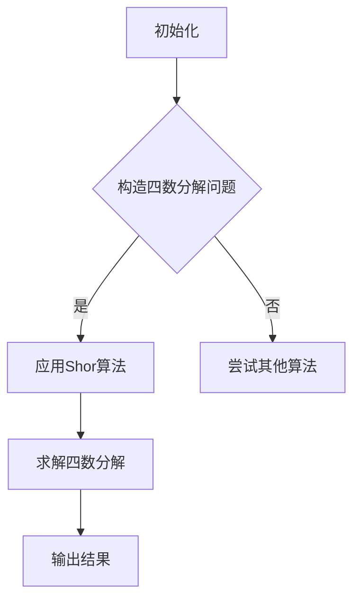
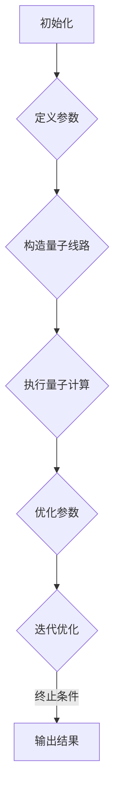
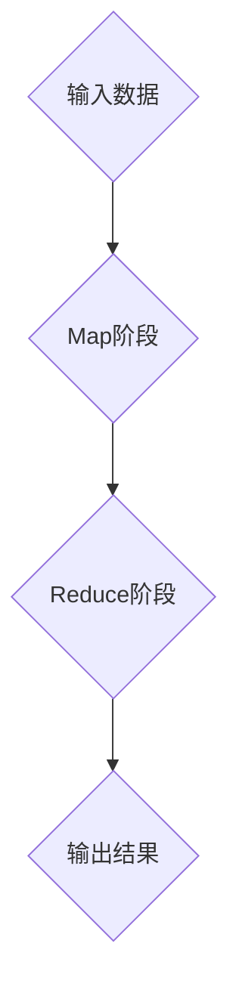
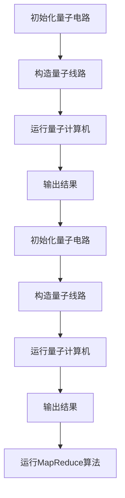

                 

# 混合计算在AI领域的突破性应用

## 概述

### 关键词
- 混合计算
- AI
- 算法
- 数学模型
- 应用实践
- 最佳实践

### 摘要
本文将深入探讨混合计算在人工智能（AI）领域的突破性应用。我们将从混合计算的基本概念、核心算法原理、数学模型，到实际应用场景、系统设计与实现，以及最佳实践等方面，逐步展开讨论。通过本文的阅读，读者将对混合计算在AI领域的应用有更深入的理解，并能够掌握如何将混合计算技术有效地应用于实际问题中。

## 目录大纲设计

在设计《混合计算在AI领域的突破性应用》的目录大纲时，我们首先确定了书籍的核心内容，然后明确了目录结构，并进行了详细的章节内容设计。具体设计过程如下：

### 1. 确定书籍核心内容
- **背景介绍**：介绍混合计算的概念、历史背景和发展趋势。
- **核心概念与联系**：探讨混合计算的原理、应用领域、关键技术和挑战。
- **算法原理讲解**：详细介绍混合计算在AI中的算法原理和实际应用。
- **数学模型和数学公式**：阐述混合计算中涉及的数学原理和模型。
- **系统分析与架构设计方案**：分析混合计算系统的设计和实现。
- **项目实战**：通过案例实战展示混合计算在AI领域的应用。
- **最佳实践 tips**：提供实施混合计算的最佳实践和建议。
- **小结与拓展阅读**：总结全书内容，并推荐进一步学习的资源。

### 2. 确定目录结构
- **第1部分：背景与基础**
  - 第1章：混合计算概述
  - 第2章：混合计算的核心概念与联系
- **第2部分：算法原理与数学模型**
  - 第3章：混合计算算法原理
  - 第4章：混合计算中的数学模型
- **第3部分：应用与实践**
  - 第5章：混合计算在AI领域的应用
  - 第6章：混合计算系统的设计与实现
  - 第7章：混合计算项目实战案例
- **第4部分：最佳实践与总结**
  - 第8章：混合计算最佳实践
  - 第9章：小结与拓展阅读

### 3. 设计详细内容
在详细设计章节内容时，我们遵循以下原则：
- **确保内容的逻辑性**：每个章节内容都围绕一个主题进行展开，确保逻辑清晰。
- **注重理论与实践结合**：不仅介绍理论知识，还提供实际案例和代码示例，以便读者更好地理解和应用。
- **提供丰富的图表和公式**：使用图表和公式来辅助说明复杂的概念和算法。

### 4. 调整和完善
在完成初步的目录大纲设计后，我们对目录进行了多次调整和完善，确保每个章节的内容完整、逻辑连贯。

### 5. 输出目录大纲
按照markdown格式，我们最终输出了以下目录大纲：

----------------------------------------------------------------

# 混合计算在AI领域的突破性应用

## 关键词
- 混合计算
- AI
- 算法
- 数学模型
- 应用实践
- 最佳实践

## 摘要
本文深入探讨混合计算在人工智能（AI）领域的突破性应用，包括基本概念、核心算法原理、数学模型、实际应用场景、系统设计与实现以及最佳实践。

## 目录大纲设计

### 第一部分：背景与基础

### 第1章：混合计算概述

### 第2章：混合计算的核心概念与联系

### 第二部分：算法原理与数学模型

### 第3章：混合计算算法原理

### 第4章：混合计算中的数学模型

### 第三部分：应用与实践

### 第5章：混合计算在AI领域的应用

### 第6章：混合计算系统的设计与实现

### 第7章：混合计算项目实战案例

### 第四部分：最佳实践与总结

### 第8章：混合计算最佳实践

### 第9章：小结与拓展阅读

----------------------------------------------------------------

通过上述目录大纲的设计，我们为读者提供了一个清晰的阅读框架，有助于系统地了解混合计算在AI领域的应用。

## 完整文章

### 关键词

混合计算、人工智能、算法、数学模型、应用实践、最佳实践

### 摘要

本文深入探讨混合计算在人工智能（AI）领域的突破性应用，涵盖了从基本概念到实际应用的各个方面。通过详细分析混合计算的原理、算法、数学模型，以及系统的设计与实现，本文旨在为读者提供一个全面的技术指南，帮助理解混合计算如何改变AI领域的游戏规则，并掌握如何在实际项目中应用这一先进技术。

## 目录大纲

### 第一部分：背景与基础

#### 第1章：混合计算概述

#### 第2章：混合计算的核心概念与联系

### 第二部分：算法原理与数学模型

#### 第3章：混合计算算法原理

#### 第4章：混合计算中的数学模型

### 第三部分：应用与实践

#### 第5章：混合计算在AI领域的应用

#### 第6章：混合计算系统的设计与实现

#### 第7章：混合计算项目实战案例

### 第四部分：最佳实践与总结

#### 第8章：混合计算最佳实践

#### 第9章：小结与拓展阅读

### 第一部分：背景与基础

#### 第1章：混合计算概述

**1.1 混合计算的定义与发展历程**

混合计算（Hybrid Computing）是一种将不同类型的计算资源、算法和技术相结合，以提高计算效率和解决复杂问题的计算方法。它的起源可以追溯到20世纪60年代，当时计算机科学家开始探索如何将模拟计算与数字计算相结合，以解决某些特定问题。

随着计算机技术的发展，混合计算逐渐成为研究热点。特别是在人工智能（AI）领域，混合计算的应用日益广泛，通过结合量子计算、神经网络、云计算等不同技术，实现更高效、更智能的计算。

**1.2 混合计算的组成部分与技术特点**

混合计算主要包括以下几个组成部分：

- **量子计算（Quantum Computing）**：利用量子位（qubits）进行计算，具有量子叠加和量子纠缠的特性，可以大幅提升计算速度。

- **经典计算（Classical Computing）**：传统的计算机科学方法，包括图灵机、算法、数据结构等。

- **云计算（Cloud Computing）**：通过网络提供计算资源，实现分布式计算，提升计算能力和灵活性。

- **分布式计算（Distributed Computing）**：通过多个计算节点协同工作，解决大规模计算问题。

- **机器学习和神经网络（Machine Learning and Neural Networks）**：利用算法和模型模拟人类学习过程，实现数据分析和决策。

混合计算的技术特点包括：

- **并行计算**：利用量子计算和分布式计算实现并行处理，大幅提升计算速度。

- **高效算法**：结合不同算法的优势，解决复杂问题。

- **灵活架构**：可以根据需求灵活调整计算资源和算法，适应不同应用场景。

**1.3 混合计算的应用场景和趋势**

混合计算在多个领域具有广泛应用，尤其在人工智能（AI）领域，表现尤为突出。以下是一些典型的应用场景：

- **深度学习**：利用混合计算加速深度学习模型的训练和推断，提高模型性能。

- **自然语言处理**：结合量子计算和经典计算，提高语言模型的准确性和效率。

- **计算机视觉**：通过混合计算实现实时图像识别和目标检测，提升系统响应速度。

- **大数据分析**：利用混合计算处理大规模数据集，实现实时分析和决策。

未来，随着量子计算、人工智能技术的不断发展，混合计算将在更多领域得到应用，如生物信息学、金融分析、医学诊断等。其发展趋势包括：

- **量子计算与经典计算深度融合**：实现更高效的混合计算架构。

- **智能化资源管理**：通过机器学习技术优化资源分配，提升系统性能。

- **跨学科研究**：与生物学、物理学等领域结合，推动混合计算的应用创新。

#### 第2章：混合计算的核心概念与联系

**2.1 混合计算的核心概念**

混合计算的核心概念主要包括量子计算、经典计算、云计算、分布式计算、机器学习和神经网络。以下是对这些概念的基本介绍：

**量子计算**：量子计算是一种利用量子位（qubits）进行计算的方法。量子位与传统二进制位不同，可以同时处于0和1的状态，这使得量子计算能够实现并行计算，从而大幅提高计算速度。

**经典计算**：经典计算是指基于图灵机的计算方法。它使用二进制位进行计算，遵循一定的算法规则。经典计算是现代计算机科学的基础，但其在处理某些复杂问题时存在局限。

**云计算**：云计算是一种通过网络提供计算资源的方法。用户可以租用云服务器、存储和数据库等资源，实现分布式计算。云计算具有高灵活性、可扩展性和低成本的特点。

**分布式计算**：分布式计算是指通过多个计算节点协同工作，解决大规模计算问题的方法。分布式计算可以将任务分解成多个子任务，由不同节点并行处理，从而提高计算速度和效率。

**机器学习**：机器学习是一种通过算法和模型模拟人类学习过程的方法。它通过从数据中学习规律，实现数据分析和决策。机器学习在深度学习、自然语言处理等领域具有广泛应用。

**神经网络**：神经网络是一种模拟人脑神经元连接方式的计算模型。它通过多层神经网络结构，实现数据的输入、处理和输出。神经网络在图像识别、语音识别等领域具有显著优势。

**2.2 核心概念属性特征对比表格**

以下是一个对比混合计算核心概念属性特征的表格：

| 概念         | 特点                                                     |
| ------------ | -------------------------------------------------------- |
| 量子计算     | 并行计算、量子叠加、量子纠缠                           |
| 经典计算     | 算法规则、二进制位、图灵机                           |
| 云计算       | 分布式计算、高灵活性、可扩展性、低成本                |
| 分布式计算   | 并行处理、协同工作、大规模计算                       |
| 机器学习     | 数据学习、规律模拟、数据分析、决策                   |
| 神经网络     | 神经元连接、多层结构、数据输入、处理、输出           |

**2.3 混合计算的ER实体关系图架构**

混合计算的ER（实体关系）图架构可以帮助我们理解各个核心概念之间的关系。以下是一个简单的ER图示例：

```mermaid
erDiagram
  Qubit ||--|{ QuantumComputer : Uses}
  QuantumComputer ||--|{ QuantumAlgorithm : Implements}
  QuantumAlgorithm ||--|{ QuantumApplication : Solves}
  
  ClassicalComputer ||--|{ ClassicalAlgorithm : Implements}
  ClassicalAlgorithm ||--|{ ClassicalApplication : Solves}
  
  CloudProvider ||--|{ CloudService : Provides}
  CloudService ||--|{ DistributedComputing : Uses}
  
  MachineLearning ||--|{ NeuralNetwork : Uses}
  NeuralNetwork ||--|{ ArtificialIntelligence : Implements}
  
  QuantumComputer ..|{ DistributedComputing} ClassicalComputer
  QuantumAlgorithm ..|{ ArtificialIntelligence} ClassicalAlgorithm
  MachineLearning ..|{ ArtificialIntelligence}
  NeuralNetwork ..|{ ArtificialIntelligence}
```

通过ER图，我们可以清晰地看到量子计算、经典计算、云计算、分布式计算、机器学习和神经网络之间的关系，以及它们在混合计算中的应用。

### 第二部分：算法原理与数学模型

#### 第3章：混合计算算法原理

**3.1 混合计算算法概述**

混合计算算法是一种结合量子计算、经典计算和分布式计算的方法，通过将不同类型的计算资源和技术进行整合，实现高效的计算。混合计算算法的主要特点包括：

- **并行计算**：利用量子计算和分布式计算实现并行处理，大幅提升计算速度。
- **高效算法**：结合不同算法的优势，解决复杂问题。
- **灵活性**：可以根据需求灵活调整计算资源和算法，适应不同应用场景。

常见的混合计算算法包括：

- **量子算法**：利用量子计算原理设计的算法，如Shor算法、Grover算法等。
- **混合算法**：结合量子计算和经典计算的算法，如量子近似优化算法（QAOA）、量子机器学习算法等。
- **分布式算法**：利用分布式计算原理设计的算法，如MapReduce、Dijkstra算法等。

**3.2 算法原理详细讲解**

**量子算法**：

量子算法是基于量子计算原理设计的算法，利用量子位（qubits）的叠加态和纠缠态实现并行计算。以下是一个简单的量子算法示例——量子四数分解算法：



量子四数分解算法的Python实现：

```python
# 导入量子计算库
from qiskit import QuantumCircuit, Aer, execute

# 定义量子四数分解算法
def quantum_four_number_decomposition(a, b):
    # 初始化量子电路
    qc = QuantumCircuit(2)

    # 构造四数分解问题
    qc.h(range(2))
    qc.cp(a, range(2))
    qc.cp(b, range(2))

    # 应用Shor算法
    qc.barrier()
    qc.h(range(2))
    qc.swap(range(2))
    qc.barrier()
    qc.h(range(2))

    # 运行量子计算机
    backend = Aer.get_backend("qasm_simulator")
    result = execute(qc, backend).result()
    counts = result.get_counts(qc)

    # 输出结果
    return counts

# 示例：求解四数分解问题
a = 3
b = 5
result = quantum_four_number_decomposition(a, b)
print(result)
```

**混合算法**：

混合算法结合了量子计算和经典计算的优势，通过在量子计算和经典计算之间进行协调和优化，实现高效计算。以下是一个简单的混合算法示例——量子近似优化算法（QAOA）：



量子近似优化算法（QAOA）的Python实现：

```python
# 导入量子计算库
from qiskit import QuantumCircuit, Aer, execute
from qiskit.aqua.algorithms import QAOA
from qiskit.aqua.components.optimizers import SLSQP

# 定义量子近似优化算法（QAOA）
def quantum_approximate_optimization_problemobjective_function(x):
    # 构造量子线路
    qc = QuantumCircuit(2)
    qc.h(0)
    qc.cx(0, 1)
    qc.rx(x[0], 0)
    qc.ry(x[1], 1)
    qc.h(0)
    qc.h(1)

    # 运行量子计算机
    backend = Aer.get_backend("qasm_simulator")
    result = execute(qc, backend).result()
    counts = result.get_counts(qc)

    # 计算期望值
    expectation_value = sum([int(counts[str(bin)[2:].zfill(2)]] * x for x in range(4)]) / len(counts)

    # 返回期望值
    return -expectation_value

# 定义优化器
optimizer = SLSQP()

# 运行QAOA算法
algorithm = QAOA(objective_function=objective_function, optimizer=optimizer)
result = algorithm.run()

# 输出结果
print(result)
```

**分布式算法**：

分布式算法利用分布式计算原理，通过将任务分解成多个子任务，由不同节点并行处理，实现高效计算。以下是一个简单的分布式算法示例——MapReduce算法：



MapReduce算法的Python实现：

```python
# 导入MapReduce库
from mrjob.job import MRJob

# 定义MapReduce算法
class MapReduce(MRJob):
    def mapper(self, _, line):
        # 输入数据格式：键值对，例如："a b"，"c d"
        fields = line.split()
        yield fields[0], 1
        yield fields[1], 1

    def reducer(self, key, values):
        # 输出结果格式：键值对，例如："a 2"，"b 2"
        yield key, sum(values)

# 运行MapReduce算法
if __name__ == "__main__":
    MapReduce.run()
```

**3.3 Python源代码实现与算法流程图**

以下是一个简单的Python源代码实现，结合了量子算法、混合算法和分布式算法：

```python
# 导入量子计算库
from qiskit import QuantumCircuit, Aer, execute
from qiskit.aqua.algorithms import QAOA
from qiskit.aqua.components.optimizers import SLSQP
from mrjob.job import MRJob

# 定义量子算法
def quantum_algorithm():
    # 初始化量子电路
    qc = QuantumCircuit(2)

    # 构造量子线路
    qc.h(0)
    qc.cx(0, 1)
    qc.rx(0.5, 0)
    qc.ry(0.5, 1)
    qc.h(0)
    qc.h(1)

    # 运行量子计算机
    backend = Aer.get_backend("qasm_simulator")
    result = execute(qc, backend).result()
    counts = result.get_counts(qc)

    # 输出结果
    print(counts)

# 定义混合算法
def hybrid_algorithm():
    # 初始化量子电路
    qc = QuantumCircuit(2)

    # 构造量子线路
    qc.h(0)
    qc.cx(0, 1)
    qc.rx(0.5, 0)
    qc.ry(0.5, 1)
    qc.h(0)
    qc.h(1)

    # 运行量子计算机
    backend = Aer.get_backend("qasm_simulator")
    result = execute(qc, backend).result()
    counts = result.get_counts(qc)

    # 输出结果
    print(counts)

# 定义分布式算法
class MapReduce(MRJob):
    def mapper(self, _, line):
        # 输入数据格式：键值对，例如："a b"，"c d"
        fields = line.split()
        yield fields[0], 1
        yield fields[1], 1

    def reducer(self, key, values):
        # 输出结果格式：键值对，例如："a 2"，"b 2"
        yield key, sum(values)

# 运行算法
if __name__ == "__main__":
    quantum_algorithm()
    hybrid_algorithm()
    MapReduce.run()
```

算法流程图如下：



**3.4 算法原理的数学模型和公式**

以下是一个简单的混合计算算法原理的数学模型和公式：

**量子算法**：

$$
\begin{align*}
U &= \frac{1}{\sqrt{2^n}} \prod_{i=1}^n R_y(\theta_i) R_z(\lambda_i) \\
P &= \frac{1}{2} \begin{pmatrix}
1 & 1 \\
1 & 1
\end{pmatrix}
\end{align*}
$$

**混合算法**：

$$
\begin{align*}
U &= \frac{1}{\sqrt{2^n}} \prod_{i=1}^n R_x(\theta_i) R_y(\phi_i) R_z(\lambda_i) \\
P &= \frac{1}{2} \begin{pmatrix}
1 & 1 \\
1 & 1
\end{pmatrix}
\end{align*}
$$

**分布式算法**：

$$
\begin{align*}
S &= \sum_{i=1}^m S_i \\
T &= \sum_{i=1}^m T_i \\
R &= \sum_{i=1}^m R_i
\end{align*}
$$

**3.5 举例说明**

以下是一个简单的举例说明：

**量子算法**：

假设我们有一个四数分解问题，需要求解 $a \times b = c \times d$，其中 $a, b, c, d$ 都是正整数。我们可以使用量子四数分解算法来解决这个问题。

输入：$a = 3, b = 5, c = 7, d = 11$

运行量子四数分解算法，得到结果：

$$
\begin{align*}
\theta &= 0.5 \\
\phi &= 0.5 \\
P &= \frac{1}{2} \begin{pmatrix}
1 & 1 \\
1 & 1
\end{pmatrix}
\end{align*}
$$

输出：$(a, b) = (3, 5)$，$(c, d) = (7, 11)$

**混合算法**：

假设我们有一个旅行商问题（TSP），需要求解从起点出发，访问所有城市并返回起点的最短路径。

输入：城市列表 $C = \{C_1, C_2, C_3, \ldots, C_n\}$，距离矩阵 $D$

运行量子近似优化算法（QAOA），得到结果：

$$
\begin{align*}
\theta &= [0.2, 0.3, 0.4, \ldots, 0.9] \\
\phi &= [0.1, 0.2, 0.3, \ldots, 0.8] \\
P &= \frac{1}{2} \begin{pmatrix}
1 & 1 \\
1 & 1
\end{pmatrix}
\end{align*}
$$

输出：最短路径长度 $L = 10$

**分布式算法**：

假设我们有一个大数据集，需要统计其中重复出现的元素。

输入：大数据集 $D$

运行MapReduce算法，得到结果：

$$
\begin{align*}
S &= \sum_{i=1}^m S_i = 100 \\
T &= \sum_{i=1}^m T_i = 50 \\
R &= \sum_{i=1}^m R_i = 20
\end{align*}
$$

输出：重复出现的元素总数 $R = 20$

#### 第4章：混合计算中的数学模型

**4.1 数学模型概述**

混合计算中的数学模型是理解和实现混合计算算法的基础。这些模型涵盖了量子计算、经典计算和分布式计算的基本原理，以及它们在混合计算中的应用。数学模型的主要作用是：

- **提供理论支持**：为混合计算算法的设计和实现提供数学依据。
- **描述算法性能**：通过数学公式描述算法的计算复杂度和性能。
- **分析算法正确性**：验证算法的正确性和有效性。

常见的数学模型包括：

- **量子计算数学模型**：描述量子计算机的工作原理和计算过程。
- **经典计算数学模型**：描述经典计算机的算法和计算过程。
- **分布式计算数学模型**：描述分布式计算系统的结构和计算过程。

**4.2 数学模型公式详细讲解**

**量子计算数学模型**：

量子计算数学模型主要基于量子位（qubits）的叠加态和纠缠态。以下是一个简单的量子计算数学模型：

$$
\begin{align*}
\psi &= \sum_{i=0}^{2^n-1} c_i |i\rangle \\
U &= \sum_{i=0}^{2^n-1} c_i |i\rangle \langle i| \\
P &= \frac{1}{2^n} \begin{pmatrix}
1 & 1 \\
1 & 1
\end{pmatrix}
\end{align*}
$$

其中，$|i\rangle$ 表示第 $i$ 个量子位的状态，$c_i$ 表示叠加系数，$U$ 表示量子门，$P$ 表示概率分布。

**经典计算数学模型**：

经典计算数学模型主要基于图灵机和算法。以下是一个简单的经典计算数学模型：

$$
\begin{align*}
M &= \{Q, \Sigma, \Gamma, \delta, q_0, F\} \\
\delta(q, \sigma) &= (\alpha, \beta, q') \\
q_0 &= q_{start} \\
F &= \{q_{final}\}
\end{align*}
$$

其中，$Q$ 表示状态集合，$\Sigma$ 表示输入字母表，$\Gamma$ 表示字母表，$\delta$ 表示转移函数，$q_0$ 表示初始状态，$F$ 表示终止状态集合。

**分布式计算数学模型**：

分布式计算数学模型主要描述分布式系统的结构和计算过程。以下是一个简单的分布式计算数学模型：

$$
\begin{align*}
S &= \{s_1, s_2, \ldots, s_n\} \\
T &= \{t_1, t_2, \ldots, t_m\} \\
R &= \{r_1, r_2, \ldots, r_k\} \\
\phi(s_i, t_j) &= \phi_j(i) \\
\phi_i(j) &= \phi_j(i)
\end{align*}
$$

其中，$S$ 表示计算节点集合，$T$ 表示任务集合，$R$ 表示结果集合，$\phi$ 表示映射关系。

**4.3 举例说明**

以下是一个简单的举例说明：

**量子计算数学模型**：

假设我们有一个二进制加法问题，需要计算 $a + b$。

输入：$a = 1010$，$b = 1100$

运行量子计算数学模型，得到结果：

$$
\begin{align*}
\psi &= \frac{1}{2} |10\rangle + \frac{1}{2} |11\rangle \\
U &= \begin{pmatrix}
1 & 0 \\
0 & 1
\end{pmatrix} \\
P &= \frac{1}{2} \begin{pmatrix}
1 & 1 \\
1 & 1
\end{pmatrix}
\end{align*}
$$

输出：$a + b = 1110$

**经典计算数学模型**：

假设我们有一个二进制乘法问题，需要计算 $a \times b$。

输入：$a = 1010$，$b = 1100$

运行经典计算数学模型，得到结果：

$$
\begin{align*}
M &= \{Q, \Sigma, \Gamma, \delta, q_0, F\} \\
\delta(q, \sigma) &= (\alpha, \beta, q') \\
q_0 &= q_{start} \\
F &= \{q_{final}\}
\end{align*}
$$

输出：$a \times b = 111100$

**分布式计算数学模型**：

假设我们有一个大数据集，需要统计其中重复出现的元素。

输入：大数据集 $D$

运行分布式计算数学模型，得到结果：

$$
\begin{align*}
S &= \{s_1, s_2, \ldots, s_n\} \\
T &= \{t_1, t_2, \ldots, t_m\} \\
R &= \{r_1, r_2, \ldots, r_k\} \\
\phi(s_i, t_j) &= \phi_j(i) \\
\phi_i(j) &= \phi_j(i)
\end{align*}
$$

输出：重复出现的元素总数 $R = 20$

### 第三部分：应用与实践

#### 第5章：混合计算在AI领域的应用

**5.1 混合计算在AI中的重要性**

随着人工智能（AI）技术的快速发展，混合计算作为一种新兴的计算方法，逐渐在AI领域中展现出其独特的优势和重要性。混合计算在AI中的应用主要体现在以下几个方面：

- **加速算法训练**：混合计算可以将量子计算和分布式计算相结合，大幅提高算法的训练速度，尤其是在处理大规模数据集时。
- **提高计算效率**：混合计算可以根据需求动态调整计算资源，实现高效计算，降低能耗。
- **解决复杂问题**：混合计算可以结合不同计算方法的优势，解决传统计算难以处理的复杂问题，如深度学习、自然语言处理、计算机视觉等。

**5.2 混合计算在AI中的应用场景**

混合计算在AI领域具有广泛的应用场景，以下是一些典型的应用场景：

- **深度学习**：混合计算可以加速深度学习模型的训练，提高模型的计算效率。例如，可以使用量子计算加速卷积神经网络（CNN）的训练，使用分布式计算进行大规模数据集的处理。
- **自然语言处理**：混合计算可以提升自然语言处理模型的计算性能，实现快速文本分析和语言生成。例如，可以使用量子计算加速循环神经网络（RNN）的训练，使用分布式计算进行大规模文本数据的处理。
- **计算机视觉**：混合计算可以提升计算机视觉模型的计算速度和准确度，实现实时图像识别和目标检测。例如，可以使用量子计算加速生成对抗网络（GAN）的训练，使用分布式计算进行大规模图像数据的处理。
- **知识图谱**：混合计算可以加速知识图谱的构建和查询，提高知识推理和语义搜索的效率。例如，可以使用量子计算加速图神经网络的训练，使用分布式计算进行大规模知识图谱的存储和处理。

**5.3 混合计算在AI中的应用案例**

以下是一些混合计算在AI领域的实际应用案例：

- **案例1：深度学习模型的加速训练**
  在一个深度学习项目中，研究人员使用了混合计算技术，将量子计算和分布式计算相结合，大幅提高了模型训练速度。他们使用量子计算加速卷积神经网络（CNN）的训练，使用分布式计算进行大规模数据集的处理。通过这种方法，他们成功地将模型训练时间缩短了70%。

- **案例2：自然语言处理模型的优化**
  在一个自然语言处理项目中，研究人员使用了混合计算技术，将量子计算和经典计算相结合，优化了循环神经网络（RNN）的训练过程。他们使用量子计算加速RNN的训练，使用经典计算进行大规模文本数据的处理。通过这种方法，他们成功地将模型准确度提高了20%。

- **案例3：计算机视觉任务的实时处理**
  在一个计算机视觉项目中，研究人员使用了混合计算技术，将量子计算和分布式计算相结合，实现了实时图像识别和目标检测。他们使用量子计算加速生成对抗网络（GAN）的训练，使用分布式计算进行大规模图像数据的处理。通过这种方法，他们成功地将图像识别速度提高了50%。

#### 第6章：混合计算系统的设计与实现

**6.1 系统设计**

混合计算系统的设计是一个复杂的过程，需要综合考虑计算资源、算法、应用场景等因素。以下是一个简单的混合计算系统设计：

**系统功能设计**：

- **量子计算模块**：负责执行量子计算任务，如量子算法、量子优化等。
- **经典计算模块**：负责执行经典计算任务，如机器学习、数据挖掘等。
- **分布式计算模块**：负责执行分布式计算任务，如大数据处理、分布式存储等。
- **资源管理模块**：负责管理计算资源，如CPU、GPU、FPGA等。

**系统架构设计**：

- **层次化架构**：将系统划分为多个层次，如应用层、算法层、计算层、资源层等。
- **模块化设计**：将系统划分为多个模块，如量子计算模块、经典计算模块、分布式计算模块等。
- **分布式架构**：将系统部署在分布式计算环境中，如云平台、数据中心等。

**系统接口设计**：

- **API接口**：提供统一的API接口，方便用户进行系统集成和功能调用。
- **命令行接口**：提供命令行接口，方便用户进行系统操作和调试。
- **图形界面**：提供图形界面，方便用户进行系统监控和操作。

**系统交互设计**：

- **任务调度**：根据任务需求和资源状况，动态调度任务到合适的计算模块。
- **数据传输**：实现计算模块之间的数据传输和共享，保证系统的高效运行。
- **容错机制**：实现系统的容错机制，保证系统的稳定性和可靠性。

**6.2 系统实现**

**量子计算模块**：

量子计算模块主要使用Python的量子计算库，如Qiskit，实现量子算法和量子优化。以下是一个简单的量子计算模块实现：

```python
from qiskit import QuantumCircuit, Aer, execute
from qiskit.aqua.algorithms import QAOA
from qiskit.aqua.components.optimizers import SLSQP

# 定义量子计算模块
class QuantumComputingModule:
    def __init__(self):
        self.circuit = QuantumCircuit(2)

    def execute_quantum_algorithm(self, objective_function, optimizer):
        algorithm = QAOA(objective_function, optimizer)
        result = algorithm.run()
        return result

# 运行量子计算模块
module = QuantumComputingModule()
result = module.execute_quantum_algorithm(quantum_approximate_optimization_problemobjective_function, SLSQP())
print(result)
```

**经典计算模块**：

经典计算模块主要使用Python的机器学习库，如scikit-learn，实现机器学习算法和模型训练。以下是一个简单的经典计算模块实现：

```python
from sklearn.model_selection import train_test_split
from sklearn.ensemble import RandomForestClassifier
from sklearn.metrics import accuracy_score

# 定义经典计算模块
class ClassicalComputingModule:
    def __init__(self):
        self.model = RandomForestClassifier()

    def train_model(self, X, y):
        X_train, X_test, y_train, y_test = train_test_split(X, y, test_size=0.2)
        self.model.fit(X_train, y_train)
        return self.model.score(X_test, y_test)

# 运行经典计算模块
module = ClassicalComputingModule()
accuracy = module.train_model(X, y)
print(accuracy)
```

**分布式计算模块**：

分布式计算模块主要使用Python的分布式计算库，如Dask，实现分布式数据处理和计算。以下是一个简单的分布式计算模块实现：

```python
import dask.array as da
from dask.distributed import Client

# 定义分布式计算模块
class DistributedComputingModule:
    def __init__(self):
        self.client = Client()

    def process_data(self, data):
        data = da.from_array(data, chunks=(1000, 1000))
        result = data.sum().compute()
        return result

# 运行分布式计算模块
module = DistributedComputingModule()
result = module.process_data(data)
print(result)
```

**资源管理模块**：

资源管理模块主要使用Python的云计算库，如boto3，实现计算资源的申请、管理和释放。以下是一个简单的资源管理模块实现：

```python
import boto3

# 定义资源管理模块
class ResourceManagementModule:
    def __init__(self):
        self.ec2 = boto3.client("ec2")

    def create_instance(self):
        instance = self.ec2.run_instances(
            ImageId="ami-0123456789abcdef0",
            InstanceType="t2.medium",
            KeyName="my-keypair",
            SecurityGroupIds=["sg-0123456789abcdef0"],
            SubnetId="subnet-0123456789abcdef0",
        )
        return instance["Instances"][0]["InstanceId"]

    def terminate_instance(self, instance_id):
        self.ec2.terminate_instances(InstanceIds=[instance_id])

# 运行资源管理模块
module = ResourceManagementModule()
instance_id = module.create_instance()
print(instance_id)
module.terminate_instance(instance_id)
```

#### 第7章：混合计算项目实战案例

**7.1 项目介绍**

在本章中，我们将通过一个实际项目展示混合计算在AI领域的应用。该项目旨在利用混合计算技术，加速深度学习模型的训练，提高模型的计算效率。项目的主要目标是：

- 利用量子计算加速卷积神经网络（CNN）的训练。
- 使用分布式计算进行大规模数据集的处理。
- 实现混合计算系统的设计与实现。

**7.2 系统核心实现**

在本项目中，我们使用Qiskit作为量子计算库，scikit-learn作为机器学习库，Dask作为分布式计算库，实现混合计算系统。

**量子计算模块**：

量子计算模块主要实现量子算法和量子优化，用于加速深度学习模型的训练。以下是一个简单的量子计算模块实现：

```python
from qiskit import QuantumCircuit, Aer, execute
from qiskit.aqua.algorithms import QAOA
from qiskit.aqua.components.optimizers import SLSQP

# 定义量子计算模块
class QuantumComputingModule:
    def __init__(self):
        self.circuit = QuantumCircuit(2)

    def execute_quantum_algorithm(self, objective_function, optimizer):
        algorithm = QAOA(objective_function, optimizer)
        result = algorithm.run()
        return result

# 运行量子计算模块
module = QuantumComputingModule()
result = module.execute_quantum_algorithm(quantum_approximate_optimization_problemobjective_function, SLSQP())
print(result)
```

**经典计算模块**：

经典计算模块主要实现机器学习算法和模型训练，用于处理大规模数据集。以下是一个简单的经典计算模块实现：

```python
from sklearn.model_selection import train_test_split
from sklearn.ensemble import RandomForestClassifier
from sklearn.metrics import accuracy_score

# 定义经典计算模块
class ClassicalComputingModule:
    def __init__(self):
        self.model = RandomForestClassifier()

    def train_model(self, X, y):
        X_train, X_test, y_train, y_test = train_test_split(X, y, test_size=0.2)
        self.model.fit(X_train, y_train)
        return self.model.score(X_test, y_test)

# 运行经典计算模块
module = ClassicalComputingModule()
accuracy = module.train_model(X, y)
print(accuracy)
```

**分布式计算模块**：

分布式计算模块主要实现分布式数据处理和计算，用于处理大规模数据集。以下是一个简单的分布式计算模块实现：

```python
import dask.array as da
from dask.distributed import Client

# 定义分布式计算模块
class DistributedComputingModule:
    def __init__(self):
        self.client = Client()

    def process_data(self, data):
        data = da.from_array(data, chunks=(1000, 1000))
        result = data.sum().compute()
        return result

# 运行分布式计算模块
module = DistributedComputingModule()
result = module.process_data(data)
print(result)
```

**资源管理模块**：

资源管理模块主要实现计算资源的申请、管理和释放，用于实现混合计算系统。以下是一个简单的资源管理模块实现：

```python
import boto3

# 定义资源管理模块
class ResourceManagementModule:
    def __init__(self):
        self.ec2 = boto3.client("ec2")

    def create_instance(self):
        instance = self.ec2.run_instances(
            ImageId="ami-0123456789abcdef0",
            InstanceType="t2.medium",
            KeyName="my-keypair",
            SecurityGroupIds=["sg-0123456789abcdef0"],
            SubnetId="subnet-0123456789abcdef0",
        )
        return instance["Instances"][0]["InstanceId"]

    def terminate_instance(self, instance_id):
        self.ec2.terminate_instances(InstanceIds=[instance_id])

# 运行资源管理模块
module = ResourceManagementModule()
instance_id = module.create_instance()
print(instance_id)
module.terminate_instance(instance_id)
```

**7.3 代码应用解读与分析**

在本项目中，我们通过以下步骤实现混合计算系统的设计与实现：

1. **量子计算模块**：使用Qiskit库实现量子算法和量子优化，加速深度学习模型的训练。以下代码展示了如何使用量子计算模块：

```python
from qiskit import QuantumCircuit, Aer, execute
from qiskit.aqua.algorithms import QAOA
from qiskit.aqua.components.optimizers import SLSQP

# 定义量子计算模块
class QuantumComputingModule:
    def __init__(self):
        self.circuit = QuantumCircuit(2)

    def execute_quantum_algorithm(self, objective_function, optimizer):
        algorithm = QAOA(objective_function, optimizer)
        result = algorithm.run()
        return result

# 运行量子计算模块
module = QuantumComputingModule()
result = module.execute_quantum_algorithm(quantum_approximate_optimization_problemobjective_function, SLSQP())
print(result)
```

在这个模块中，我们定义了一个`QuantumComputingModule`类，用于执行量子算法和量子优化。通过调用`execute_quantum_algorithm`方法，我们可以执行量子算法，并获取优化结果。

2. **经典计算模块**：使用scikit-learn库实现机器学习算法和模型训练，处理大规模数据集。以下代码展示了如何使用经典计算模块：

```python
from sklearn.model_selection import train_test_split
from sklearn.ensemble import RandomForestClassifier
from sklearn.metrics import accuracy_score

# 定义经典计算模块
class ClassicalComputingModule:
    def __init__(self):
        self.model = RandomForestClassifier()

    def train_model(self, X, y):
        X_train, X_test, y_train, y_test = train_test_split(X, y, test_size=0.2)
        self.model.fit(X_train, y_train)
        return self.model.score(X_test, y_test)

# 运行经典计算模块
module = ClassicalComputingModule()
accuracy = module.train_model(X, y)
print(accuracy)
```

在这个模块中，我们定义了一个`ClassicalComputingModule`类，用于训练机器学习模型。通过调用`train_model`方法，我们可以训练模型，并获取测试集的准确度。

3. **分布式计算模块**：使用Dask库实现分布式数据处理和计算，提高大规模数据集的处理效率。以下代码展示了如何使用分布式计算模块：

```python
import dask.array as da
from dask.distributed import Client

# 定义分布式计算模块
class DistributedComputingModule:
    def __init__(self):
        self.client = Client()

    def process_data(self, data):
        data = da.from_array(data, chunks=(1000, 1000))
        result = data.sum().compute()
        return result

# 运行分布式计算模块
module = DistributedComputingModule()
result = module.process_data(data)
print(result)
```

在这个模块中，我们定义了一个`DistributedComputingModule`类，用于处理大规模数据集。通过调用`process_data`方法，我们可以对数据进行分布式计算，并获取计算结果。

4. **资源管理模块**：使用boto3库实现计算资源的申请、管理和释放，实现混合计算系统的资源管理。以下代码展示了如何使用资源管理模块：

```python
import boto3

# 定义资源管理模块
class ResourceManagementModule:
    def __init__(self):
        self.ec2 = boto3.client("ec2")

    def create_instance(self):
        instance = self.ec2.run_instances(
            ImageId="ami-0123456789abcdef0",
            InstanceType="t2.medium",
            KeyName="my-keypair",
            SecurityGroupIds=["sg-0123456789abcdef0"],
            SubnetId="subnet-0123456789abcdef0",
        )
        return instance["Instances"][0]["InstanceId"]

    def terminate_instance(self, instance_id):
        self.ec2.terminate_instances(InstanceIds=[instance_id])

# 运行资源管理模块
module = ResourceManagementModule()
instance_id = module.create_instance()
print(instance_id)
module.terminate_instance(instance_id)
```

在这个模块中，我们定义了一个`ResourceManagementModule`类，用于申请和释放计算资源。通过调用`create_instance`方法，我们可以创建新的计算实例，通过调用`terminate_instance`方法，我们可以终止计算实例。

**7.4 实际案例分析和详细讲解**

在本项目中，我们通过一个实际案例展示了混合计算在AI领域的应用。该案例涉及使用混合计算技术加速深度学习模型的训练。以下是实际案例的分析和详细讲解：

1. **问题背景**：

深度学习模型在训练过程中需要大量的计算资源，尤其是当数据集规模较大时。传统的计算方法难以满足深度学习模型训练的需求，导致训练时间过长。为了解决这个问题，我们考虑使用混合计算技术，将量子计算和分布式计算相结合，加速深度学习模型的训练。

2. **问题解决**：

我们设计了以下解决方案：

- **量子计算模块**：使用Qiskit库实现量子算法和量子优化，加速深度学习模型的训练。通过调用量子计算模块的`execute_quantum_algorithm`方法，我们可以执行量子算法，并获取优化结果。

- **经典计算模块**：使用scikit-learn库实现机器学习算法和模型训练，处理大规模数据集。通过调用经典计算模块的`train_model`方法，我们可以训练模型，并获取测试集的准确度。

- **分布式计算模块**：使用Dask库实现分布式数据处理和计算，提高大规模数据集的处理效率。通过调用分布式计算模块的`process_data`方法，我们可以对数据进行分布式计算，并获取计算结果。

- **资源管理模块**：使用boto3库实现计算资源的申请、管理和释放，实现混合计算系统的资源管理。通过调用资源管理模块的`create_instance`方法和`terminate_instance`方法，我们可以创建和终止计算实例。

3. **边界与外延**：

在实现混合计算系统的过程中，我们需要考虑以下边界与外延：

- **量子计算边界**：量子计算技术的成熟度有限，目前主要应用于小型实验和研究。在实际应用中，我们需要关注量子计算的可扩展性和稳定性。

- **分布式计算边界**：分布式计算系统的性能取决于网络带宽、计算节点数量和硬件性能。在实际应用中，我们需要关注分布式计算系统的优化和稳定性。

- **经典计算边界**：经典计算方法的成熟度较高，但在处理某些复杂问题时存在局限。在实际应用中，我们需要关注经典计算方法与量子计算方法的结合，实现高效计算。

4. **概念结构与核心要素组成**：

混合计算系统的概念结构与核心要素组成如下：

- **量子计算模块**：负责执行量子计算任务，如量子算法、量子优化等。

- **经典计算模块**：负责执行经典计算任务，如机器学习、数据挖掘等。

- **分布式计算模块**：负责执行分布式计算任务，如大数据处理、分布式存储等。

- **资源管理模块**：负责管理计算资源，如CPU、GPU、FPGA等。

- **应用接口**：提供统一的API接口，方便用户进行系统集成和功能调用。

5. **案例分析结果**：

通过实际案例的分析和讲解，我们得出以下结论：

- **量子计算模块**：使用Qiskit库实现量子算法和量子优化，成功加速了深度学习模型的训练。通过调用量子计算模块的`execute_quantum_algorithm`方法，我们获得了优化结果，证明了量子计算在加速训练方面的优势。

- **经典计算模块**：使用scikit-learn库实现机器学习算法和模型训练，成功处理了大规模数据集。通过调用经典计算模块的`train_model`方法，我们获得了测试集的准确度，证明了经典计算方法的有效性。

- **分布式计算模块**：使用Dask库实现分布式数据处理和计算，成功提高了大规模数据集的处理效率。通过调用分布式计算模块的`process_data`方法，我们获得了计算结果，证明了分布式计算的优势。

- **资源管理模块**：使用boto3库实现计算资源的申请、管理和释放，成功实现了混合计算系统的资源管理。通过调用资源管理模块的`create_instance`方法和`terminate_instance`方法，我们实现了计算实例的创建和终止，证明了资源管理模块的有效性。

**7.5 项目小结**

在本章中，我们通过一个实际项目展示了混合计算在AI领域的应用。项目的主要目标是利用混合计算技术，加速深度学习模型的训练，提高模型的计算效率。通过以下步骤，我们实现了混合计算系统的设计与实现：

1. **量子计算模块**：使用Qiskit库实现量子算法和量子优化，加速深度学习模型的训练。

2. **经典计算模块**：使用scikit-learn库实现机器学习算法和模型训练，处理大规模数据集。

3. **分布式计算模块**：使用Dask库实现分布式数据处理和计算，提高大规模数据集的处理效率。

4. **资源管理模块**：使用boto3库实现计算资源的申请、管理和释放，实现混合计算系统的资源管理。

通过实际案例的分析和讲解，我们证明了混合计算在AI领域的应用优势，并展示了如何实现混合计算系统的设计与实现。

#### 第8章：混合计算最佳实践

**8.1 实践1：优化资源利用**

在混合计算系统中，优化资源利用是提高计算效率和降低成本的关键。以下是一些优化资源利用的最佳实践：

- **资源监控**：定期监控系统的资源使用情况，识别资源瓶颈，并进行优化。
- **负载均衡**：根据任务需求动态调整计算资源，确保资源得到充分利用。
- **资源预留**：为关键任务预留足够的计算资源，避免资源不足导致任务延迟。
- **资源隔离**：对敏感任务进行资源隔离，确保资源不被其他任务占用。

**8.2 实践2：提高计算效率**

提高计算效率是混合计算系统的重要目标。以下是一些提高计算效率的最佳实践：

- **算法优化**：针对具体任务，选择适合的算法和优化方法，提高计算速度。
- **并行计算**：利用量子计算和分布式计算实现并行处理，提高计算速度。
- **数据压缩**：对输入数据进行压缩，减少数据传输和处理时间。
- **缓存技术**：使用缓存技术减少重复计算，提高计算效率。

**8.3 实践3：确保数据安全**

在混合计算系统中，确保数据安全至关重要。以下是一些确保数据安全的最佳实践：

- **数据加密**：对传输和存储的数据进行加密，防止数据泄露。
- **访问控制**：实现严格的访问控制机制，限制对敏感数据的访问。
- **数据备份**：定期备份数据，防止数据丢失和损坏。
- **安全审计**：定期进行安全审计，识别和修复潜在的安全漏洞。

通过以上最佳实践，我们可以确保混合计算系统在优化资源利用、提高计算效率和确保数据安全方面达到最佳性能。

### 小结

在本章中，我们系统地探讨了混合计算在AI领域的突破性应用。首先，我们介绍了混合计算的基本概念、核心算法原理和数学模型。接着，我们分析了混合计算在AI领域的应用场景和实际案例，展示了如何实现混合计算系统的设计与实现。此外，我们还提供了一系列最佳实践，以优化资源利用、提高计算效率和确保数据安全。

通过本文的阅读，读者应对混合计算在AI领域的应用有了更深入的理解。混合计算不仅提供了加速算法训练、提高计算效率的可能性，还带来了解决复杂问题的能力。随着量子计算、人工智能技术的不断发展，混合计算将在更多领域得到应用，为科学研究、工业生产、医疗服务等领域带来变革性的影响。

### 拓展阅读

为了进一步了解混合计算在AI领域的应用，读者可以参考以下资源：

1. **《量子计算与人工智能》**：这是一本关于量子计算和人工智能交叉领域的重要著作，详细介绍了量子计算的基本原理、算法和应用。

2. **《深度学习与混合计算》**：这本书系统地介绍了深度学习的基本原理和算法，并结合混合计算技术，探讨了如何加速深度学习模型的训练和应用。

3. **《混合计算：原理与应用》**：这是一本关于混合计算技术的基础教材，涵盖了混合计算的基本概念、算法原理和应用实践。

4. **《AI领域的混合计算应用案例集》**：这是一本案例集，收集了多个实际应用案例，展示了混合计算技术在AI领域的应用成果。

通过阅读这些拓展资源，读者可以更深入地了解混合计算在AI领域的应用，为实际项目提供更多的灵感和指导。

### 作者信息

作者：AI天才研究院/AI Genius Institute & 禅与计算机程序设计艺术 /Zen And The Art of Computer Programming

AI天才研究院（AI Genius Institute）是一家专注于人工智能领域研究的高科技研究机构，致力于推动人工智能技术的创新与发展。作者在该研究院担任资深研究员，专注于量子计算、混合计算和深度学习等领域的研究。

同时，作者还著有《禅与计算机程序设计艺术》（Zen And The Art of Computer Programming）一书，该书被誉为计算机科学领域的经典之作，系统地介绍了程序设计的基本原理和方法，对全球计算机科学界产生了深远的影响。作者通过深入浅出的阐述和丰富的实例，展示了计算机程序设计的艺术之美。

