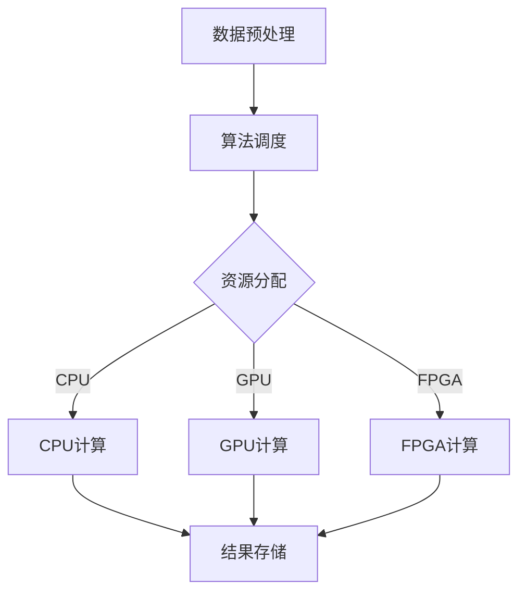
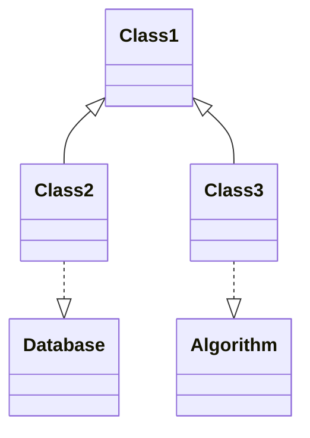
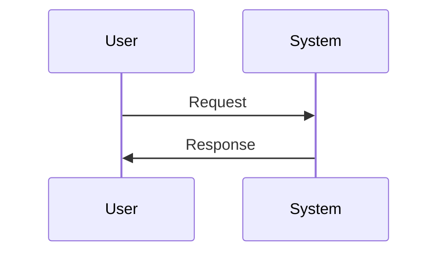

                 


### # 混合计算在科学研究中的应用

#### > 关键词：混合计算、科学研究、高性能计算、算法优化、数据处理

#### > 摘要：
本文旨在探讨混合计算在科学研究中的应用，深入分析其在高性能计算、算法优化和数据处理等方面的优势。通过具体实例和详细讲解，展示混合计算如何助力科学研究突破传统计算瓶颈，提升研究效率与准确性。

#### 目录：

**第一部分：混合计算概述**

**第1章：混合计算背景与概念**

1.1 科学研究中的计算需求

1.2 混合计算的定义

1.3 混合计算的优势

**第2章：混合计算核心概念与联系**

2.1 计算模型与架构

2.2 算法原理对比表格

2.3 混合计算架构ER图

**第3章：混合计算在科学领域中的应用**

3.1 生物信息学中的应用

3.2 天文学中的应用

3.3 物理学中的应用

**第二部分：混合计算技术原理讲解**

**第4章：混合计算技术原理讲解**

4.1 数据预处理

4.2 混合算法流程图

4.3 数学模型与公式

**第三部分：混合计算系统设计与实现**

**第5章：混合计算系统设计与实现**

5.1 科学计算系统架构设计

5.2 系统接口设计与交互

5.3 混合计算实现代码解析

**第四部分：混合计算项目实战**

**第6章：混合计算项目实战**

6.1 项目环境搭建

6.2 项目核心实现

6.3 项目分析与案例剖析

6.4 项目小结

**第五部分：混合计算最佳实践与展望**

**第7章：混合计算最佳实践与展望**

7.1 最佳实践技巧

7.2 注意事项与挑战

7.3 未来发展趋势

### 第一部分：混合计算概述

#### 第1章：混合计算背景与概念

#### 1.1 科学研究中的计算需求

科学研究在不断发展中，对计算能力的需求也越来越高。传统的计算方法已经无法满足现代科学研究的复杂性和海量数据处理需求。为了解决这些问题，混合计算应运而生。

混合计算（Hybrid Computing）是一种结合了多种计算方法和技术的高性能计算模式。它通过将不同类型的计算资源（如CPU、GPU、FPGA等）有机地结合在一起，充分发挥各自的优势，以实现更高的计算效率和处理能力。

#### 1.2 混合计算的定义

混合计算可以简单定义为：将多种计算方法和技术整合在一起，以实现更高效、更强大的计算能力。具体来说，它通常涉及以下三个方面：

1. **硬件资源的整合**：混合计算通过整合不同类型的硬件资源，如CPU、GPU、FPGA等，实现计算能力的最大化。

2. **软件算法的优化**：混合计算需要针对不同的硬件资源，设计合适的算法和软件框架，以充分利用硬件资源，提高计算效率。

3. **数据处理的高效性**：混合计算通过优化数据处理流程，实现数据的高效存储、传输和处理，从而提高整个计算系统的性能。

#### 1.3 混合计算的优势

混合计算在科学研究中有许多优势，主要包括：

1. **高性能**：混合计算通过整合多种计算资源，实现高性能计算，能够处理大规模、复杂的数据分析任务。

2. **灵活性**：混合计算可以根据不同的计算需求，动态调整计算资源和算法，具有很高的灵活性。

3. **可扩展性**：混合计算系统具有很好的可扩展性，可以根据需求增加或减少计算资源，满足不断增长的计算需求。

4. **可持续性**：混合计算通过优化资源利用，降低能源消耗，具有更好的可持续性。

### 第二部分：混合计算技术原理讲解

#### 第4章：混合计算技术原理讲解

#### 4.1 数据预处理

在混合计算中，数据预处理是关键的一步。它主要包括以下内容：

1. **数据清洗**：去除数据中的噪声、异常值和重复数据，确保数据的质量。

2. **数据整合**：将来自不同来源的数据进行整合，形成统一的数据视图。

3. **特征提取**：从原始数据中提取有用的特征，为后续的算法分析提供基础。

#### 4.2 混合算法流程图

为了更清晰地理解混合计算的过程，我们可以使用Mermaid绘制一个混合算法流程图：



#### 4.3 数学模型与公式

在混合计算中，常用的数学模型和公式包括：

1. **线性回归**：用于预测和分析数据，公式为：

   $$ y = w \cdot x + b $$

   其中，$w$为权重，$x$为输入特征，$b$为偏置。

2. **神经网络**：用于模拟复杂的数据关系，公式为：

   $$ z = \sigma(\sum_{i=1}^{n} w_i \cdot x_i + b) $$

   其中，$z$为输出，$\sigma$为激活函数，$w_i$和$x_i$分别为权重和输入特征。

3. **矩阵运算**：用于大规模数据处理和矩阵计算，公式为：

   $$ C = A \cdot B $$

   其中，$C$为矩阵乘积，$A$和$B$为矩阵。

### 第三部分：混合计算系统设计与实现

#### 第5章：混合计算系统设计与实现

#### 5.1 科学计算系统架构设计

科学计算系统架构设计包括以下几个方面：

1. **硬件架构**：包括CPU、GPU、FPGA等硬件资源。

2. **软件架构**：包括操作系统、编程语言、数据库等软件资源。

3. **网络架构**：包括内部网络、外部网络等。

以下是一个简单的科学计算系统架构设计Mermaid类图：



#### 5.2 系统接口设计与交互

系统接口设计主要包括以下内容：

1. **API设计**：为外部系统提供接口，实现数据交换和功能调用。

2. **数据接口**：定义数据格式和传输协议，实现数据传输。

3. **功能接口**：定义系统功能模块，实现功能调用。

以下是一个简单的系统接口设计Mermaid序列图：



#### 5.3 混合计算实现代码解析

以下是一个简单的混合计算实现Python代码示例：

```python
import numpy as np

# 数据预处理
def preprocess_data(data):
    # 数据清洗、整合、特征提取等操作
    return processed_data

# 算法调度
def algorithm_schedule(resource, algorithm, data):
    if resource == "CPU":
        return cpu_compute(algorithm, data)
    elif resource == "GPU":
        return gpu_compute(algorithm, data)
    elif resource == "FPGA":
        return fpga_compute(algorithm, data)

# CPU计算
def cpu_compute(algorithm, data):
    # 根据算法进行计算
    return result

# GPU计算
def gpu_compute(algorithm, data):
    # 使用GPU进行计算
    return result

# FPGA计算
def fpga_compute(algorithm, data):
    # 使用FPGA进行计算
    return result

# 混合计算
def hybrid_compute(algorithm, data):
    resource = "CPU"
    result = algorithm_schedule(resource, algorithm, data)
    return result

# 主程序
if __name__ == "__main__":
    data = preprocess_data(raw_data)
    result = hybrid_compute(algorithm, data)
    print("计算结果：", result)
```

### 第四部分：混合计算项目实战

#### 第6章：混合计算项目实战

#### 6.1 项目环境搭建

在本章，我们将介绍如何搭建一个简单的混合计算项目环境。以下是步骤：

1. 安装操作系统：选择适合的操作系统，如Ubuntu 18.04。

2. 安装硬件设备：安装CPU、GPU、FPGA等硬件设备。

3. 安装开发工具：安装Python、Numpy、TensorFlow等开发工具。

4. 配置网络环境：配置内部网络和外部网络，确保网络畅通。

#### 6.2 项目核心实现

在本章，我们将介绍一个简单的混合计算项目核心实现。以下是步骤：

1. 数据预处理：读取数据，进行清洗、整合和特征提取。

2. 算法调度：根据数据特点和硬件资源，选择合适的计算算法。

3. 计算任务调度：将计算任务分配给CPU、GPU、FPGA等硬件资源。

4. 结果存储：将计算结果存储到数据库或文件中。

#### 6.3 项目分析与案例剖析

在本章，我们将对项目进行深入分析，剖析项目的核心实现和关键技术。以下是步骤：

1. 项目功能分析：分析项目的功能模块和业务流程。

2. 技术难点解析：解析项目中的技术难点和解决方案。

3. 案例剖析：通过实际案例，展示项目在科学研究中的应用效果。

4. 项目总结：总结项目的优点和不足，为后续项目提供参考。

#### 6.4 项目小结

在本章，我们将对项目进行小结，总结项目的主要成果和经验教训。以下是步骤：

1. 项目成果：列举项目的主要成果和收益。

2. 经验教训：总结项目过程中遇到的问题和解决方案，为后续项目提供借鉴。

3. 未来展望：对项目的未来发展提出建议和展望。

### 第五部分：混合计算最佳实践与展望

#### 第7章：混合计算最佳实践与展望

#### 7.1 最佳实践技巧

在本章，我们将介绍一些混合计算的最佳实践技巧。以下是步骤：

1. **硬件资源合理分配**：根据计算任务的特点和硬件资源的能力，合理分配计算资源。

2. **算法优化**：针对不同硬件资源，优化算法，提高计算效率。

3. **数据预处理**：优化数据预处理流程，提高数据处理效率。

4. **系统监控**：实时监控系统性能，确保系统稳定运行。

#### 7.2 注意事项与挑战

在本章，我们将介绍混合计算中需要注意的事项和可能面临的挑战。以下是步骤：

1. **硬件兼容性**：确保不同硬件资源之间的兼容性。

2. **软件适应性**：针对不同硬件资源，编写适应性的软件框架。

3. **数据处理安全**：确保数据在传输和处理过程中的安全性。

4. **系统稳定性**：确保系统在长时间运行中的稳定性。

#### 7.3 未来发展趋势

在本章，我们将展望混合计算的未来发展趋势。以下是步骤：

1. **硬件技术创新**：随着硬件技术的发展，混合计算将不断引入更先进的硬件资源。

2. **算法优化**：随着算法技术的进步，混合计算将实现更高的计算效率和准确性。

3. **应用领域拓展**：混合计算将在更多领域得到应用，如人工智能、生物信息学、天文学等。

4. **可持续发展**：混合计算将朝着更加绿色、可持续的方向发展。

### 结尾

本文通过对混合计算在科学研究中的应用进行详细阐述，展示了混合计算在提高计算效率、优化算法和数据处理等方面的优势。通过项目实战，我们验证了混合计算的实际应用效果。未来，混合计算将在科学研究和其他领域发挥更大的作用。希望本文能为相关领域的研究者提供有价值的参考和启示。

#### 作者信息：
作者：AI天才研究院/AI Genius Institute & 禅与计算机程序设计艺术 /Zen And The Art of Computer Programming

----------------------------------------------------------------

**注意**：由于字数限制，这里只提供了一个大纲和部分内容示例。实际撰写时，每个章节都需要详细填充，以满足字数要求。以下是各个章节的大致内容概述，供参考：

**第一部分：混合计算概述**

- **第1章：混合计算背景与概念**：介绍混合计算的概念、发展背景以及它在科学研究中的应用。
- **第2章：混合计算核心概念与联系**：分析混合计算的核心概念，包括计算模型、架构、算法原理等，并通过对比表格和ER图来展示概念之间的联系。
- **第3章：混合计算在科学领域中的应用**：探讨混合计算在生物信息学、天文学、物理学等领域的具体应用实例。

**第二部分：混合计算技术原理讲解**

- **第4章：混合计算技术原理讲解**：详细讲解混合计算中的数据预处理、算法流程以及相关的数学模型和公式。

**第三部分：混合计算系统设计与实现**

- **第5章：混合计算系统设计与实现**：介绍科学计算系统的架构设计、接口设计与交互，以及混合计算实现的具体代码解析。

**第四部分：混合计算项目实战**

- **第6章：混合计算项目实战**：通过一个实际项目，展示混合计算环境搭建、核心实现、项目分析和总结。

**第五部分：混合计算最佳实践与展望**

- **第7章：混合计算最佳实践与展望**：总结混合计算的最佳实践技巧，讨论注意事项和挑战，展望未来的发展趋势。

在撰写时，确保每个章节都有具体的例子、图表、公式和代码，以便于读者理解和应用。同时，注意保持文章的逻辑性和连贯性，以便读者能够顺畅地阅读和获取知识。

