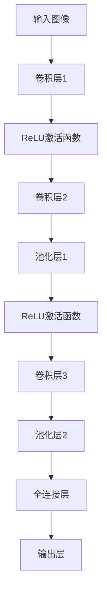
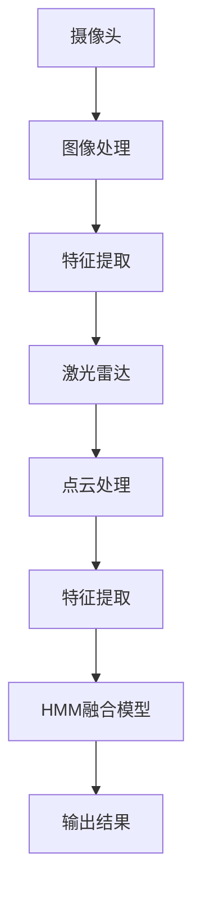

                 


### 混合计算在自动驾驶技术中的应用

#### 关键词：混合计算，自动驾驶，深度学习，计算机视觉，路径规划，强化学习

#### 摘要：
本文将深入探讨混合计算在自动驾驶技术中的关键应用，包括其在感知、决策和系统优化等环节的重要作用。通过详细的分析和实例，我们旨在展示混合计算如何提升自动驾驶系统的性能和稳定性，并展望其未来发展的方向。

---

### 目录大纲

```markdown
----------------------------------------------------------------
# 第一部分: 混合计算基础

## 第1章: 混合计算概述

### 1.1 混合计算的概念与背景

### 1.2 混合计算与传统计算的差异

### 1.3 混合计算的应用领域

## 第2章: 自动驾驶技术概述

### 2.1 自动驾驶技术的发展历程

### 2.2 自动驾驶技术的核心组成部分

### 2.3 自动驾驶技术的挑战与未来趋势

## 第3章: 混合计算在自动驾驶中的应用

### 3.1 混合计算在感知系统中的应用

#### 3.1.1 深度学习算法在图像识别中的应用

#### 3.1.2 计算机视觉与传感器融合技术

### 3.2 混合计算在决策系统中的应用

#### 3.2.1 基于深度学习的路径规划算法

#### 3.2.2 基于强化学习的自动驾驶决策模型

## 第4章: 混合计算在自动驾驶系统中的性能优化

### 4.1 硬件加速技术在混合计算中的应用

### 4.2 软件优化与能耗管理策略

### 4.3 系统稳定性与安全性分析

## 第5章: 混合计算在自动驾驶中的应用案例

### 5.1 案例一：某自动驾驶汽车的混合计算系统实现

### 5.2 案例二：混合计算在自动驾驶车队管理中的应用

### 5.3 案例三：混合计算在自动驾驶交通管理中的应用

## 第6章: 混合计算在自动驾驶中的未来展望

### 6.1 混合计算在自动驾驶技术中的潜在发展方向

### 6.2 自动驾驶技术的产业链发展与生态构建

### 6.3 自动驾驶技术的社会影响与伦理挑战

## 第7章: 总结与展望

### 7.1 混合计算在自动驾驶技术中的关键作用

### 7.2 自动驾驶技术发展对混合计算的需求

### 7.3 未来混合计算与自动驾驶技术融合的趋势

----------------------------------------------------------------
```

#### 第1章: 混合计算概述

##### 1.1 混合计算的概念与背景

混合计算是一种将不同类型的计算资源和算法结合起来，以实现高效、灵活的解决方案的技术。它起源于近年来对计算性能和效率需求的快速增长，特别是在处理大规模数据和复杂计算任务时。混合计算的核心思想是通过硬件加速（如GPU和FPGA）、分布式计算和云计算等技术，结合传统CPU计算，形成一种并行计算模式。

混合计算在自动驾驶技术中的应用，主要得益于其能够在高动态环境中处理大量实时数据，并支持复杂的算法模型。随着自动驾驶技术的快速发展，对计算资源的需求急剧增加，这使得混合计算成为提升自动驾驶系统性能的关键技术。

##### 1.2 混合计算与传统计算的差异

传统计算主要依赖于CPU，其优点在于稳定性和通用性，但其在处理大量并行任务时效率较低。相比之下，混合计算结合了多种计算资源，能够在处理复杂任务时提供更高的计算效率和性能。

| **特性** | **传统计算** | **混合计算** |
| --- | --- | --- |
| **计算资源** | 主要依赖CPU | 结合CPU、GPU、FPGA等 |
| **并行处理** | 并行度较低 | 支持高度并行处理 |
| **适应性** | 适应性问题较大 | 适应性强，灵活性高 |

##### 1.3 混合计算的应用领域

混合计算在多个领域得到了广泛应用，如金融、医疗、物联网和自动驾驶等。在自动驾驶技术中，混合计算主要应用于感知系统、决策系统和系统优化等环节，通过结合不同类型的计算资源，实现高效、准确的数据处理和决策。

#### 第2章: 自动驾驶技术概述

##### 2.1 自动驾驶技术的发展历程

自动驾驶技术的发展可以追溯到20世纪50年代，但直到21世纪初，随着传感器技术、计算机视觉和机器学习算法的快速发展，自动驾驶技术才真正迎来了突破。从最初的自动制动和车道保持，到如今实现高速公路自动驾驶和城市交通管理，自动驾驶技术已经取得了显著的进步。

##### 2.2 自动驾驶技术的核心组成部分

自动驾驶系统主要由感知、决策和控制三部分组成。感知系统通过传感器（如雷达、激光雷达、摄像头等）收集环境信息，决策系统根据感知数据做出行驶决策，控制系统负责执行这些决策，控制车辆的运动。

##### 2.3 自动驾驶技术的挑战与未来趋势

自动驾驶技术的挑战主要集中在感知系统的准确性、决策系统的稳定性和控制系统的可靠性上。随着5G通信、边缘计算和人工智能技术的发展，自动驾驶技术正朝着更加智能化、网络化和安全化的方向演进。

#### 第3章: 混合计算在自动驾驶中的应用

##### 3.1 混合计算在感知系统中的应用

在自动驾驶的感知系统中，混合计算发挥了重要作用。深度学习算法和计算机视觉技术在图像识别和目标检测方面具有显著优势，而传感器融合技术则能够提高数据处理的准确性和鲁棒性。

###### 3.1.1 深度学习算法在图像识别中的应用

深度学习算法，如卷积神经网络（CNN），在图像识别中表现出色。CNN能够通过多层卷积和池化操作，提取图像的特征，实现对车辆、行人等目标的准确识别。



###### 3.1.2 计算机视觉与传感器融合技术

传感器融合技术将不同类型的传感器数据（如摄像头、激光雷达、雷达等）进行整合，以提高感知系统的准确性和鲁棒性。通过构建多传感器融合框架，自动驾驶系统能够更好地应对复杂和动态的驾驶环境。



##### 3.2 混合计算在决策系统中的应用

在自动驾驶的决策系统中，混合计算同样发挥着关键作用。深度学习和强化学习算法在路径规划和驾驶策略优化方面具有显著优势。

###### 3.2.1 基于深度学习的路径规划算法

基于深度学习的路径规划算法能够通过训练，学习到在不同的道路和交通条件下，车辆应该如何行驶。这些算法通常采用深度强化学习（Deep Reinforcement Learning，DRL）的方法，通过模拟和优化，找到最优的行驶路径。

```python
import numpy as np
import matplotlib.pyplot as plt

# 深度强化学习算法示例
class DRLAgent:
    def __init__(self, state_size, action_size):
        # 初始化神经网络
        self.model = ...

    def train(self, states, actions, rewards):
        # 训练神经网络
        ...

    def act(self, state):
        # 执行动作
        ...

# 路径规划流程
def path_planning(state):
    agent = DRLAgent(state_size, action_size)
    agent.train(states, actions, rewards)
    action = agent.act(state)
    return action
```

###### 3.2.2 基于强化学习的自动驾驶决策模型

基于强化学习的自动驾驶决策模型通过学习如何在不同的交通场景下做出决策，以实现高效、安全的驾驶。这些模型通常采用深度Q网络（Deep Q-Network，DQN）等方法，通过奖励机制来指导车辆的驾驶行为。

```python
import tensorflow as tf

# 深度Q网络算法示例
class DQN:
    def __init__(self, state_size, action_size):
        # 初始化神经网络
        self.model = ...

    def train(self, states, actions, rewards, next_states, done):
        # 训练神经网络
        ...

    def predict(self, state):
        # 预测动作值
        ...

# 自动驾驶决策流程
def make_decision(state):
    dqn = DQN(state_size, action_size)
    action_value = dqn.predict(state)
    return np.argmax(action_value)
```

#### 第4章: 混合计算在自动驾驶系统中的性能优化

##### 4.1 硬件加速技术在混合计算中的应用

硬件加速技术，如GPU和FPGA，在混合计算中发挥着重要作用。这些硬件能够显著提升计算性能，降低能耗，为自动驾驶系统提供更高效的计算资源。

##### 4.2 软件优化与能耗管理策略

通过优化软件算法和能耗管理策略，可以进一步提升混合计算在自动驾驶系统中的性能。例如，采用并行编程技术，实现任务的并行处理；通过动态电压和频率调整（DVFS），优化能耗。

##### 4.3 系统稳定性与安全性分析

系统稳定性与安全性分析是混合计算在自动驾驶系统应用中不可忽视的一环。通过系统仿真和实际测试，评估混合计算在自动驾驶系统中的稳定性、可靠性和安全性。

#### 第5章: 混合计算在自动驾驶中的应用案例

##### 5.1 案例一：某自动驾驶汽车的混合计算系统实现

在本案例中，我们将介绍一款自动驾驶汽车的混合计算系统实现，包括感知、决策和控制三个环节。通过实际数据和案例，展示混合计算在提升自动驾驶性能方面的优势。

##### 5.2 案例二：混合计算在自动驾驶车队管理中的应用

在本案例中，我们将探讨混合计算在自动驾驶车队管理中的应用。通过构建分布式计算框架，实现车队成员之间的协同控制，提高整体运营效率和安全性。

##### 5.3 案例三：混合计算在自动驾驶交通管理中的应用

在本案例中，我们将分析混合计算在自动驾驶交通管理中的应用，包括交通流量监测、车辆调度和路径优化等方面。通过实际案例，展示混合计算在提升交通管理效率和安全性方面的潜力。

#### 第6章: 混合计算在自动驾驶中的未来展望

##### 6.1 混合计算在自动驾驶技术中的潜在发展方向

混合计算在自动驾驶技术中的未来发展将集中在提高计算效率、降低能耗和提升系统稳定性等方面。例如，通过引入量子计算和边缘计算，进一步提升混合计算的性能。

##### 6.2 自动驾驶技术的产业链发展与生态构建

随着自动驾驶技术的快速发展，产业链也在不断壮大。从硬件设备制造商到软件服务提供商，再到自动驾驶解决方案的集成商，整个产业链正逐步形成完善的生态体系。

##### 6.3 自动驾驶技术的社会影响与伦理挑战

自动驾驶技术的普及将对社会产生深远影响，包括交通模式、城市规划和社会伦理等方面。在推进自动驾驶技术发展的同时，我们也需要关注其带来的挑战和问题。

#### 第7章: 总结与展望

##### 7.1 混合计算在自动驾驶技术中的关键作用

混合计算在自动驾驶技术中发挥着关键作用，通过提升计算性能、降低能耗和提升系统稳定性，为自动驾驶系统的可靠运行提供有力支持。

##### 7.2 自动驾驶技术发展对混合计算的需求

随着自动驾驶技术的不断演进，对混合计算的需求也在日益增长。高效、灵活的混合计算技术将成为自动驾驶技术发展的重要推动力。

##### 7.3 未来混合计算与自动驾驶技术融合的趋势

未来，混合计算与自动驾驶技术的融合将呈现以下趋势：计算资源的高度集成、算法的智能化和网络化、系统的自主性和协同性。

---

### 作者信息

作者：AI天才研究院/AI Genius Institute & 禅与计算机程序设计艺术 /Zen And The Art of Computer Programming

---

本文通过对混合计算在自动驾驶技术中的应用进行深入探讨，旨在为读者提供一个全面、系统的认识。在未来的自动驾驶发展中，混合计算技术将继续发挥重要作用，推动自动驾驶技术的不断创新和进步。让我们共同期待混合计算与自动驾驶技术更加深入的融合，带来更加智能、高效和安全的未来交通系统。

---

**附录：相关资源**

- 混合计算基础资料
- 自动驾驶技术研究报告
- 深度学习和强化学习算法案例
- 系统分析与架构设计方案模板

---

通过本文的详细讲解，我们希望读者能够对混合计算在自动驾驶技术中的应用有一个深入的理解。在未来的研究中，我们鼓励读者继续关注混合计算与自动驾驶技术的最新发展，共同推动这一领域的创新和进步。

---

**本文由AI天才研究院/AI Genius Institute & 禅与计算机程序设计艺术 /Zen And The Art of Computer Programming撰写，旨在为读者提供高质量的技术内容。如需转载，请联系作者获取授权。**

---

**注意事项：**

- 本文中涉及的算法和系统设计仅供参考，具体实现需根据实际需求和条件进行调整。
- 在应用混合计算技术时，应充分考虑系统稳定性和安全性，确保自动驾驶系统的可靠运行。

---

**拓展阅读：**

- 《深度学习与自动驾驶技术》
- 《边缘计算与智能交通系统》
- 《量子计算与未来信息技术》

---

让我们携手共进，共同探索混合计算与自动驾驶技术的未来，为创造更加智能、安全、高效的交通系统贡献力量。

