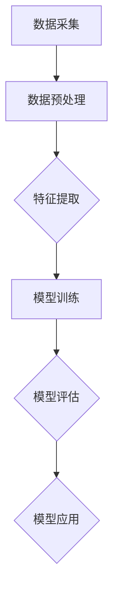
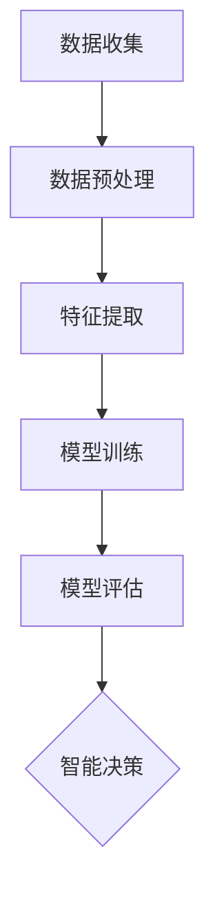
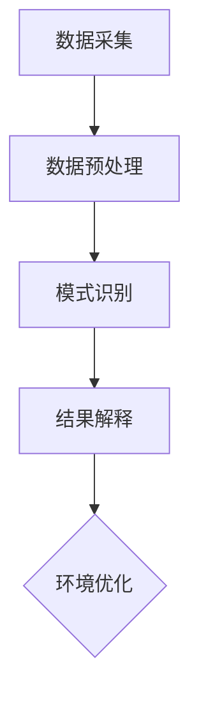

                 

## 物联网与环境隐形智能的融合发展趋势

> 关键词：物联网、环境隐形智能、融合、发展趋势、算法、挑战与机遇

### 摘要

物联网（Internet of Things, IoT）和环境隐形智能（Environmental Invisible Intelligence, EII）是现代科技发展中两个重要的概念。物联网通过智能设备连接物理世界，实现信息交互与自动化控制；而环境隐形智能则通过感知技术、机器学习等技术实现对环境的智能监测与调控。两者的融合不仅丰富了物联网的应用场景，也为环境智能化提供了强大的技术支撑。本文将详细探讨物联网与环境隐形智能的融合背景、核心概念、算法原理，以及未来发展趋势。通过逐步分析，本文旨在揭示这一融合过程中的关键技术、挑战与机遇，为相关领域的研究与开发提供有价值的参考。

### 目录大纲

1. **第一部分：背景介绍**

   1.1 物联网与环境隐形智能的融合背景

   1.2 物联网与环境隐形智能的核心技术

   1.3 物联网与环境隐形智能的融合背景与趋势

   1.4 本章小结

2. **第二部分：核心概念与联系**

   2.1 物联网核心概念

   2.2 环境隐形智能核心概念

   2.3 物联网与环境隐形智能的融合概念

   2.4 物联网与环境隐形智能的核心概念联系

   2.5 本章小结

3. **第三部分：算法原理讲解**

   3.1 物联网与环境隐形智能融合算法概述

   3.2 深度学习在物联网中的应用

   3.3 机器学习在环境隐形智能中的应用

   3.4 数据挖掘在物联网与环境隐形智能融合中的应用

   3.5 本章小结

4. **第四部分：数学模型和数学公式 & 详细讲解 & 举例说明**

   4.1 深度学习数学模型

   4.2 机器学习数学模型

   4.3 数据挖掘数学模型

   4.4 本章小结

5. **第五部分：系统分析与架构设计**

   5.1 系统功能设计

   5.2 系统架构设计

   5.3 系统接口设计与交互

   5.4 项目实战

   5.5 最佳实践 tips

   5.6 小结

   5.7 注意事项

   5.8 拓展阅读

### 第一部分：背景介绍

#### 1.1 物联网与环境隐形智能的融合背景

物联网（IoT）和环境隐形智能（EII）是现代科技发展中的两个重要领域。物联网通过智能设备、传感器等硬件，将物理世界中的各种实体互联起来，实现信息的实时采集、传输与处理。环境隐形智能则通过先进的感知技术、机器学习算法等手段，实现对环境的智能感知与调控，从而实现对环境的精确监测、预警和优化管理。

物联网起源于20世纪80年代，最初是作为一种自动化控制系统被引入工业领域的。随着通信技术、传感器技术、云计算等技术的发展，物联网逐渐扩展到了智能家居、智慧城市、工业4.0等多个领域。物联网的发展不仅改变了人们的生产生活方式，也为各行各业带来了巨大的变革。

环境隐形智能则是一个相对较新的概念，起源于21世纪初。它利用物联网中的传感器数据，结合机器学习、数据挖掘等技术，实现对环境的智能化处理。环境隐形智能的目标是实现环境的自我感知、自我调整和自我优化，从而提高环境管理的效率和效果。

物联网与环境隐形智能的融合具有以下几个背景：

1. **技术驱动**：物联网和环境隐形智能的发展离不开传感器技术、通信技术、云计算、人工智能等先进技术的推动。这些技术的进步为物联网与环境隐形智能的融合提供了坚实的基础。

2. **应用需求**：随着社会经济的快速发展，人们对环境质量的要求越来越高。物联网与环境隐形智能的融合可以实现对环境的实时监测、预警和调控，从而提高环境管理的效率和效果。

3. **产业发展**：物联网和环境隐形智能的融合为新兴产业带来了巨大的发展机遇。智慧城市、智慧农业、智慧医疗等领域的发展都需要物联网与环境隐形智能的支撑。

4. **政策支持**：各国政府纷纷出台政策，鼓励物联网和环境隐形智能的发展。这些政策的支持为物联网与环境隐形智能的融合提供了良好的外部环境。

#### 1.2 物联网与环境隐形智能的核心技术

物联网的核心技术主要包括传感器技术、通信技术、云计算、大数据等。传感器技术是物联网的基础，它负责采集物理世界中的各种信息。通信技术负责将传感器采集到的信息传输到云端或中心节点进行处理。云计算和大数据技术则负责对传感器数据进行存储、处理和分析，从而实现物联网的智能化。

环境隐形智能的核心技术主要包括感知技术、机器学习、数据挖掘等。感知技术负责采集环境中的各种信息，如温度、湿度、空气质量等。机器学习技术负责对感知数据进行处理和分析，从而实现对环境的智能感知。数据挖掘技术则负责从大量的环境数据中提取出有价值的信息，为环境管理提供决策支持。

#### 1.3 物联网与环境隐形智能的融合背景与趋势

物联网与环境隐形智能的融合具有以下几个背景和趋势：

1. **技术融合**：物联网和环境隐形智能的核心技术正在不断融合。例如，传感器技术不仅应用于物联网，也应用于环境隐形智能；机器学习技术不仅应用于环境隐形智能，也应用于物联网。

2. **应用拓展**：物联网与环境隐形智能的融合为传统行业带来了新的应用场景。例如，智慧农业可以通过物联网与环境隐形智能的融合，实现对农田的智能监测和管理；智慧城市可以通过物联网与环境隐形智能的融合，实现城市环境的智能调控。

3. **产业升级**：物联网与环境隐形智能的融合促进了传统产业的升级和转型。例如，工业4.0通过物联网与环境隐形智能的融合，实现了工厂的智能化和自动化；智慧医疗通过物联网与环境隐形智能的融合，实现了医疗服务的智能化和个性化。

4. **政策推动**：各国政府纷纷出台政策，鼓励物联网与环境隐形智能的融合。这些政策的支持为物联网与环境隐形智能的融合提供了良好的发展环境。

#### 1.4 本章小结

本章介绍了物联网与环境隐形智能的融合背景、核心技术和发展趋势。物联网通过智能设备和传感器的连接，实现了物理世界的数字化和信息交互；环境隐形智能通过感知技术和机器学习，实现了对环境的智能监测和调控。两者的融合不仅推动了科技的发展，也为社会带来了巨大的变革。下一章将深入探讨物联网和环境隐形智能的核心概念及其联系。

### 第二部分：核心概念与联系

#### 2.1 物联网核心概念

物联网（Internet of Things，IoT）是指通过互联网将各种物体连接起来，实现信息的实时传输和智能化处理。物联网的核心概念包括以下几个方面：

1. **设备连接**：物联网通过传感器、智能设备等硬件，将物理世界中的各种物体连接起来，形成一个庞大的网络。这些设备可以是家用电器、工业设备、交通工具等。

2. **数据采集**：物联网设备通过传感器等技术，实时采集物理世界中的各种信息，如温度、湿度、压力、速度等。这些数据为物联网的应用提供了基础。

3. **信息传输**：物联网设备通过无线通信技术，如Wi-Fi、蓝牙、ZigBee等，将采集到的数据传输到云端或中心节点。这些数据可以在网络中传输，实现远程监控和智能处理。

4. **数据处理**：物联网设备采集到的数据需要在云端或中心节点进行处理。通过大数据分析、机器学习等技术，可以实现对数据的深度挖掘和分析，从而为用户提供智能化的服务。

5. **应用场景**：物联网的应用场景非常广泛，包括智能家居、智慧城市、智慧农业、工业4.0等。通过物联网的应用，可以实现对各种场景的智能管理和优化。

#### 2.2 环境隐形智能核心概念

环境隐形智能（Environmental Invisible Intelligence，EII）是指通过先进的感知技术、机器学习算法等手段，实现对环境的智能感知、监测和管理。环境隐形智能的核心概念包括以下几个方面：

1. **感知技术**：环境隐形智能通过传感器、摄像头、雷达等感知设备，实时采集环境中的各种信息，如温度、湿度、空气质量、噪音等。

2. **数据融合**：环境隐形智能需要对来自不同感知设备的多种数据进行融合处理，从而实现对环境的全面感知。数据融合可以通过多源数据融合算法、传感器网络技术等实现。

3. **机器学习**：环境隐形智能利用机器学习算法，对感知数据进行处理和分析，从而实现对环境的智能监测和预测。常见的机器学习算法包括监督学习、无监督学习、强化学习等。

4. **智能决策**：基于感知和数据分析的结果，环境隐形智能可以生成智能决策，实现对环境的自动调整和优化。例如，智能温室可以根据环境数据自动调整温度、湿度等参数，以优化植物生长环境。

5. **应用场景**：环境隐形智能的应用场景包括智能城市、智慧农业、智能医疗、智能家居等。通过环境隐形智能的应用，可以实现对各种场景的智能化管理和优化。

#### 2.3 物联网与环境隐形智能的融合概念

物联网与环境隐形智能的融合是指将物联网的设备连接和数据传输能力与环境隐形智能的感知、分析和管理能力相结合，实现一种新型的智能系统。这种融合主要体现在以下几个方面：

1. **感知融合**：物联网设备与环境隐形智能感知设备相结合，实现对环境的全面感知。例如，通过物联网传感器采集环境数据，与环境隐形智能感知设备采集的数据进行融合，提高环境监测的精度和效率。

2. **数据处理融合**：物联网的数据处理能力与环境隐形智能的数据处理能力相结合，实现数据的深度挖掘和分析。例如，利用物联网大数据分析技术，与环境隐形智能的机器学习算法相结合，实现对环境数据的智能分析和预测。

3. **智能决策融合**：物联网的设备连接和通信能力与环境隐形智能的智能决策能力相结合，实现环境的智能调控。例如，通过物联网设备实时监测环境参数，与环境隐形智能的智能决策系统相结合，实现环境的自动优化。

4. **应用场景融合**：物联网与环境隐形智能的融合为各种应用场景提供了新的解决方案。例如，在智慧农业中，通过物联网设备采集作物生长数据，与环境隐形智能相结合，实现作物的智能管理和优化。

#### 2.4 物联网与环境隐形智能的核心概念联系

物联网与环境隐形智能的核心概念联系主要体现在以下几个方面：

1. **技术交叉**：物联网的技术，如传感器、通信技术等，与环境隐形智能的技术，如机器学习、数据挖掘等，相互交叉和融合，形成了一种新型的智能系统。

2. **应用互补**：物联网侧重于设备连接和信息传输，环境隐形智能侧重于环境感知和智能决策。两者在应用中相互补充，共同实现环境的智能化管理。

3. **数据共享**：物联网采集到的数据可以为环境隐形智能提供基础数据，环境隐形智能分析处理后的结果可以为物联网提供智能决策支持。

4. **协同工作**：物联网和环境隐形智能协同工作，通过设备连接、数据共享和智能决策，实现环境管理的智能化和高效化。

#### 2.5 本章小结

本章介绍了物联网和环境隐形智能的核心概念及其联系。物联网通过设备连接和数据传输实现物理世界的数字化和信息交互；环境隐形智能通过感知技术和机器学习实现环境的智能监测和管理。物联网与环境隐形智能的融合为环境管理提供了新的解决方案，具有广泛的应用前景。下一章将深入探讨物联网与环境隐形智能融合算法的原理及其应用。

### 第三部分：算法原理讲解

#### 3.1 物联网与环境隐形智能融合算法概述

物联网与环境隐形智能的融合算法是实现两者协同工作的关键。这些算法通过数据采集、处理和分析，实现对环境的智能监测和管理。物联网与环境隐形智能融合算法的基本原理包括以下几个步骤：

1. **数据采集**：物联网设备通过传感器、摄像头等设备，实时采集环境中的各种数据，如温度、湿度、空气质量等。

2. **数据预处理**：采集到的数据可能存在噪声、缺失值等问题，因此需要进行数据预处理，包括去噪、填充缺失值、数据标准化等。

3. **特征提取**：从预处理后的数据中提取出有用的特征，如温度的均值、标准差、最大值等。特征提取的目的是减少数据的维度，提高算法的效率。

4. **数据分析**：利用机器学习、数据挖掘等技术，对特征进行深度分析，提取环境中的规律和模式。

5. **智能决策**：基于数据分析的结果，生成智能决策，实现对环境的自动调整和优化。例如，根据温度数据，自动调整空调的温度设置。

物联网与环境隐形智能融合算法的分类主要包括以下几种：

1. **基于深度学习的算法**：深度学习算法通过多层神经网络，对大量数据进行训练，提取出复杂的环境特征。常见的深度学习算法包括卷积神经网络（CNN）、循环神经网络（RNN）、长短期记忆网络（LSTM）等。

2. **基于机器学习的算法**：机器学习算法通过训练数据集，建立环境特征与目标变量之间的关系模型。常见的机器学习算法包括线性回归、决策树、支持向量机（SVM）、随机森林等。

3. **基于数据挖掘的算法**：数据挖掘算法通过对大量环境数据进行模式识别、关联规则挖掘等，发现环境中的规律和模式。常见的数据挖掘算法包括K-均值聚类、Apriori算法、关联规则挖掘等。

物联网与环境隐形智能融合算法的应用领域非常广泛，包括但不限于以下几个方面：

1. **环境监测**：利用物联网与环境隐形智能融合算法，实现对空气、水质、土壤等环境因素的实时监测和预警。

2. **智慧农业**：通过物联网设备采集作物生长数据，结合环境隐形智能算法，实现对作物的智能管理和优化。

3. **智慧城市**：利用物联网与环境隐形智能融合算法，实现对城市交通、能源、环境等领域的智能化管理。

4. **智能医疗**：通过物联网设备采集患者健康数据，结合环境隐形智能算法，实现对疾病的智能诊断和预测。

5. **智能家居**：利用物联网与环境隐形智能融合算法，实现家庭设备的智能控制和管理，提高居住的舒适度和安全性。

#### 3.2 深度学习在物联网中的应用

深度学习算法在物联网中有着广泛的应用，其基本原理是通过多层神经网络对大量数据进行训练，从而自动提取出复杂的特征。以下将详细讲解深度学习算法在物联网中的应用，包括其基本原理、优缺点以及实际案例。

##### 3.2.1 深度学习算法的基本原理

深度学习算法的核心是多层神经网络（Multilayer Neural Network），它通过多个层次的网络结构，对输入数据进行层层抽象和变换，从而实现复杂特征的提取。深度学习算法的主要组成部分包括：

1. **输入层**：接收外部输入数据，如图像、声音、文本等。

2. **隐藏层**：对输入数据进行特征提取和变换，每一层都会对前一层的信息进行加工和处理，生成更加抽象和复杂的特征。

3. **输出层**：根据隐藏层生成的特征，输出最终的结果，如分类标签、预测值等。

深度学习算法的训练过程主要包括以下步骤：

1. **数据预处理**：对输入数据进行归一化、去噪等处理，以提高算法的鲁棒性。

2. **构建模型**：根据任务需求，设计合适的神经网络结构，包括层数、每层的神经元数量、激活函数等。

3. **训练模型**：使用训练数据集对模型进行训练，通过反向传播算法不断调整模型参数，使模型输出结果逐渐接近真实值。

4. **评估模型**：使用验证数据集评估模型的性能，包括准确率、召回率、F1值等指标。

5. **调优模型**：根据评估结果，调整模型参数，优化模型结构，以提高模型的性能。

##### 3.2.2 深度学习算法在物联网中的应用

深度学习算法在物联网中有着广泛的应用，以下列举几个典型的应用场景：

1. **智能环境监测**：通过深度学习算法，可以实现对空气、水质、土壤等环境因素的智能监测。例如，利用卷积神经网络（CNN）对空气质量监测设备采集的图像数据进行处理，自动识别出污染物质。

2. **智能交通管理**：利用深度学习算法，可以实现对交通流量、交通事故等数据的智能分析，从而优化交通信号控制，减少交通拥堵。例如，利用循环神经网络（RNN）分析交通流量数据，预测未来的交通状况。

3. **智能农业**：通过深度学习算法，可以实现对作物生长环境的智能监测和管理。例如，利用深度学习算法分析传感器采集的温度、湿度等数据，预测作物的生长状况，优化灌溉和施肥策略。

4. **智能医疗**：利用深度学习算法，可以实现对医疗数据的智能分析，从而辅助医生进行诊断和治疗。例如，利用深度学习算法分析医疗图像，自动识别病变区域，提高诊断的准确性。

##### 3.2.3 深度学习算法的优缺点分析

深度学习算法在物联网应用中具有以下优点：

1. **强大的特征提取能力**：深度学习算法通过多层神经网络，可以自动提取输入数据中的复杂特征，提高模型的性能。

2. **灵活的应用场景**：深度学习算法可以应用于各种场景，包括图像识别、语音识别、自然语言处理等。

3. **自动化的数据处理**：深度学习算法可以自动进行数据预处理、特征提取、模型训练等步骤，减轻了人工的负担。

然而，深度学习算法也存在一些缺点：

1. **数据需求量大**：深度学习算法通常需要大量的训练数据，对于一些小规模的应用场景，可能难以取得良好的效果。

2. **计算资源消耗大**：深度学习算法的训练过程需要大量的计算资源，特别是在处理大规模数据时，计算时间较长。

3. **解释性差**：深度学习算法的黑箱特性使得其结果难以解释，不利于理解模型的决策过程。

##### 3.2.4 深度学习算法在物联网中的实际案例

以下是一个深度学习算法在物联网中的实际案例：智能空气质量监测系统。

1. **问题背景**：随着城市化进程的加快，空气污染问题日益严重。传统的空气质量监测设备只能监测几种主要的污染物，无法全面反映空气质量状况。因此，需要开发一种智能空气质量监测系统，通过深度学习算法自动识别和分析多种污染物。

2. **系统架构**：智能空气质量监测系统主要包括三个部分：传感器模块、数据传输模块和深度学习分析模块。

   - **传感器模块**：安装多种传感器，如PM2.5、PM10、NO2、SO2、CO等，实时采集空气中的污染物数据。
   - **数据传输模块**：传感器采集到的数据通过Wi-Fi或LoRa等无线通信技术传输到云端服务器。
   - **深度学习分析模块**：利用卷积神经网络（CNN）对传输上来的数据进行处理，自动识别和分析多种污染物，生成空气质量报告。

3. **算法实现**：

   - **数据预处理**：对传感器数据进行归一化、去噪等处理，提高数据质量。
   - **模型构建**：设计一个卷积神经网络（CNN）模型，包括卷积层、池化层、全连接层等，用于特征提取和分类。
   - **模型训练**：使用标记好的训练数据集对模型进行训练，通过反向传播算法不断调整模型参数。
   - **模型评估**：使用验证数据集评估模型的性能，调整模型结构，优化参数。
   - **模型应用**：将训练好的模型应用到实际监测中，实时生成空气质量报告。

4. **效果评估**：通过实验验证，智能空气质量监测系统可以准确识别多种污染物，生成详细的空气质量报告，为政府部门和企业提供科学决策依据。

#### 3.3 机器学习在环境隐形智能中的应用

机器学习算法在环境隐形智能中扮演着关键角色，通过从大量数据中提取模式和规律，实现对环境的智能监测和管理。以下将详细讲解机器学习算法的基本原理、分类以及在环境隐形智能中的应用。

##### 3.3.1 机器学习算法的基本原理

机器学习（Machine Learning，ML）是一种通过算法自动从数据中学习规律和模式，进而进行预测和决策的技术。机器学习算法的基本原理包括以下几个步骤：

1. **数据收集**：首先，需要收集大量的数据，这些数据可以是结构化的，如数据库表，也可以是非结构化的，如文本、图像、音频等。

2. **数据预处理**：对收集到的数据进行分析和清洗，去除噪声、填补缺失值、进行数据标准化等，以准备用于训练模型。

3. **特征提取**：从预处理后的数据中提取出有用的特征，这些特征用于训练模型，特征提取的质量直接影响模型的效果。

4. **模型训练**：使用训练数据集对模型进行训练，通过调整模型参数，使模型能够准确预测或分类。

5. **模型评估**：使用验证数据集评估模型的性能，包括准确率、召回率、F1值等指标，以确定模型是否有效。

6. **模型应用**：将训练好的模型应用到实际场景中，进行预测或决策。

机器学习算法的核心是优化目标函数，通过最小化目标函数，找到一组最优参数，使模型能够最好地拟合训练数据。常见的目标函数包括损失函数、似然函数等。

##### 3.3.2 机器学习算法在环境隐形智能中的应用

机器学习算法在环境隐形智能中有多种应用，以下列举几种常见的应用场景：

1. **环境监测**：利用机器学习算法对环境数据进行分析，可以实现对空气质量、水质、土壤等环境因素的实时监测。例如，通过构建一个监督学习模型，可以自动识别出空气中的污染物类型和浓度。

2. **环境预测**：通过分析历史环境数据，机器学习算法可以预测未来的环境变化趋势。例如，利用时间序列分析模型，可以预测未来的气温、降雨量等环境参数。

3. **环境优化**：机器学习算法可以帮助优化环境管理策略。例如，通过聚类分析，可以找到环境管理中的最优参数设置，提高环境治理效果。

4. **故障诊断**：在环境监测设备中，机器学习算法可以用于故障诊断，通过分析设备的运行数据，预测设备可能出现的故障，从而进行预防性维护。

##### 3.3.3 机器学习算法的优缺点分析

机器学习算法在环境隐形智能中有以下优点：

1. **强大的预测能力**：机器学习算法可以从大量历史数据中学习到复杂的模式，从而做出准确的预测。

2. **适应性强**：机器学习算法可以适应各种环境数据类型，包括结构化和非结构化数据。

3. **自动特征提取**：机器学习算法可以自动提取数据中的特征，减少了人工干预。

然而，机器学习算法也存在一些缺点：

1. **数据依赖性**：机器学习算法的性能高度依赖数据的质量和数量，对于小规模数据集，可能难以取得良好的效果。

2. **解释性差**：许多机器学习算法，尤其是深度学习算法，具有黑箱特性，其决策过程难以解释。

3. **计算资源消耗**：机器学习算法的训练过程需要大量的计算资源，特别是对于大规模数据集和高复杂度的模型。

##### 3.3.4 机器学习算法在环境隐形智能中的实际案例

以下是一个机器学习算法在环境隐形智能中的实际案例：智能水质监测系统。

1. **问题背景**：水质污染是一个严重的环境问题，需要实时监测和预警。传统的监测方法主要依靠人工取样和实验室分析，效率低下且无法实时响应。

2. **系统架构**：智能水质监测系统主要包括三个部分：传感器模块、数据传输模块和机器学习分析模块。

   - **传感器模块**：安装多种传感器，如pH值、电导率、浊度等，实时采集水质数据。
   - **数据传输模块**：传感器采集到的数据通过Wi-Fi或LoRa等无线通信技术传输到云端服务器。
   - **机器学习分析模块**：利用机器学习算法对传输上来的数据进行处理，自动识别水质污染指标，生成水质报告。

3. **算法实现**：

   - **数据预处理**：对传感器数据进行归一化、去噪等处理，提高数据质量。
   - **特征提取**：从预处理后的数据中提取出水质相关的特征，如pH值、电导率、浊度等。
   - **模型训练**：使用标记好的训练数据集对监督学习模型（如支持向量机SVM、决策树等）进行训练，调整模型参数。
   - **模型评估**：使用验证数据集评估模型的性能，调整模型结构，优化参数。
   - **模型应用**：将训练好的模型应用到实际监测中，实时生成水质报告。

4. **效果评估**：通过实验验证，智能水质监测系统可以准确识别多种水质污染指标，生成详细的水质报告，为环境保护部门提供科学决策依据。

#### 3.4 数据挖掘在物联网与环境隐形智能融合中的应用

数据挖掘（Data Mining，DM）是信息技术领域中的一项重要技术，旨在从大量数据中自动提取隐藏的、未知的、有价值的模式和规律。在物联网与环境隐形智能的融合中，数据挖掘技术发挥着关键作用，通过挖掘和分析环境数据，实现对环境的智能监测、预测和管理。以下将详细讲解数据挖掘算法的基本原理、分类以及在物联网与环境隐形智能融合中的应用。

##### 3.4.1 数据挖掘算法的基本原理

数据挖掘算法的基本原理包括以下几个步骤：

1. **数据收集**：首先，需要收集大量的数据，这些数据可以来自物联网设备、环境传感器、历史数据库等。数据可以是结构化的，如数据库表，也可以是半结构化的，如日志文件，甚至是非结构化的，如图像、文本、音频等。

2. **数据预处理**：对收集到的数据进行清洗、去噪、标准化等处理，以准备用于挖掘模型。预处理步骤包括数据清洗、缺失值填补、数据转换、数据归一化等。

3. **特征提取**：从预处理后的数据中提取出有用的特征，这些特征用于训练模型，特征提取的质量直接影响模型的效果。

4. **模式识别**：使用数据挖掘算法对特征进行模式识别，找出数据中的关联、聚类、分类等模式。常见的数据挖掘算法包括聚类算法、分类算法、关联规则挖掘算法等。

5. **模型评估**：使用验证数据集评估挖掘模型的性能，包括准确率、召回率、F1值等指标，以确定模型是否有效。

6. **结果解释**：对挖掘结果进行解释和可视化，以帮助用户理解模型发现的信息。

数据挖掘算法的核心是构建一个能够从数据中自动学习、发现模式和规律的系统，这一过程通常被称为“数据挖掘生命周期”。

##### 3.4.2 数据挖掘算法在物联网与环境隐形智能融合中的应用

数据挖掘算法在物联网与环境隐形智能融合中有着广泛的应用，以下列举几个典型的应用场景：

1. **环境监测**：通过数据挖掘算法，可以对环境数据进行实时分析和监测。例如，利用聚类算法对空气质量监测数据进行分析，可以发现空气污染的分布和变化趋势。

2. **环境预测**：通过分析历史环境数据，数据挖掘算法可以预测未来的环境变化。例如，利用时间序列分析算法，可以预测未来的气温、降雨量等环境参数。

3. **环境优化**：数据挖掘算法可以帮助优化环境管理策略。例如，通过关联规则挖掘，可以找到环境管理中的最佳实践和优化方案。

4. **故障诊断**：在环境监测设备中，数据挖掘算法可以用于故障诊断，通过分析设备的运行数据，预测设备可能出现的故障，从而进行预防性维护。

##### 3.4.3 数据挖掘算法的优缺点分析

数据挖掘算法在物联网与环境隐形智能融合中有以下优点：

1. **强大的模式识别能力**：数据挖掘算法可以从大量数据中识别出复杂的模式和关联，为环境监测和管理提供有力支持。

2. **适应性广**：数据挖掘算法可以处理各种类型的数据，包括结构化、半结构化和非结构化数据，适用于多种应用场景。

3. **自动化程度高**：数据挖掘算法可以自动进行数据预处理、模式识别和结果解释，减少了人工干预。

然而，数据挖掘算法也存在一些缺点：

1. **数据依赖性**：数据挖掘算法的性能高度依赖数据的质量和数量，对于小规模数据集，可能难以取得良好的效果。

2. **解释性差**：许多数据挖掘算法，尤其是复杂的算法，如深度学习算法，其决策过程难以解释。

3. **计算资源消耗**：数据挖掘算法的训练和挖掘过程需要大量的计算资源，特别是对于大规模数据集和高复杂度的模型。

##### 3.4.4 数据挖掘算法在物联网与环境隐形智能融合中的实际案例

以下是一个数据挖掘算法在物联网与环境隐形智能融合中的实际案例：智能环境预警系统。

1. **问题背景**：随着环境问题的日益严重，需要建立智能环境预警系统，实时监测环境变化，提前预警可能的环境风险。

2. **系统架构**：智能环境预警系统主要包括三个部分：传感器模块、数据传输模块和数据挖掘分析模块。

   - **传感器模块**：安装多种传感器，如温度、湿度、空气质量等，实时采集环境数据。
   - **数据传输模块**：传感器采集到的数据通过Wi-Fi或LoRa等无线通信技术传输到云端服务器。
   - **数据挖掘分析模块**：利用数据挖掘算法对传输上来的数据进行处理，分析环境变化趋势，识别潜在的环境风险。

3. **算法实现**：

   - **数据预处理**：对传感器数据进行归一化、去噪等处理，提高数据质量。
   - **特征提取**：从预处理后的数据中提取出环境相关的特征，如温度、湿度、空气质量等。
   - **模型训练**：使用监督学习算法（如决策树、支持向量机等）对特征进行训练，构建环境风险预测模型。
   - **模型评估**：使用验证数据集评估模型的性能，调整模型参数，优化模型结构。
   - **模型应用**：将训练好的模型应用到实际环境中，实时预测环境风险，生成预警报告。

4. **效果评估**：通过实验验证，智能环境预警系统可以准确预测环境风险，及时发出预警，为环境保护部门提供科学决策依据。

#### 3.5 物联网与环境隐形智能融合算法的mermaid流程图

为了更好地理解物联网与环境隐形智能融合算法的工作流程，我们可以使用mermaid语言绘制流程图，详细展示每个环节的操作步骤和数据处理流程。以下是几个典型的融合算法的mermaid流程图：

##### 3.5.1 深度学习算法流程图



该流程图展示了深度学习算法在物联网与环境隐形智能融合中的应用，从数据采集、预处理、特征提取、模型训练、评估到最终的应用，每个步骤都在流程图中明确表示。

##### 3.5.2 机器学习算法流程图



该流程图展示了机器学习算法在环境隐形智能中的应用，从数据收集、预处理、特征提取、模型训练到评估，最终生成智能决策，实现环境的智能监测和管理。

##### 3.5.3 数据挖掘算法流程图



该流程图展示了数据挖掘算法在物联网中的应用，从数据采集、预处理、模式识别、结果解释到环境优化，每个步骤都紧密相连，形成一个完整的数据挖掘生命周期。

通过mermaid流程图，我们可以清晰地看到物联网与环境隐形智能融合算法的各个环节，这有助于理解这些算法的原理和实现方法。

#### 3.6 算法原理讲解

在本节中，我们将深入讲解物联网与环境隐形智能融合算法的原理，包括深度学习、机器学习和数据挖掘算法的数学模型、Python代码实现以及具体的例子说明。

##### 3.6.1 深度学习算法的数学模型与Python代码实现

深度学习算法是一种基于多层神经网络（Neural Network）的机器学习方法，能够自动从数据中学习复杂的特征。以下是一个简单的卷积神经网络（Convolutional Neural Network，CNN）的数学模型及其Python代码实现。

1. **数学模型**：

   卷积神经网络由输入层、多个卷积层、池化层和全连接层组成。卷积层通过卷积操作提取特征，池化层用于降低数据维度，全连接层用于分类或回归。

   - **卷积层**：卷积操作可以表示为：
     $$ \text{output}(i, j) = \sum_{k} \text{weight}_{ik} \times \text{input}_{kj} + \text{bias}_{i} $$
   
   - **激活函数**：常用的激活函数有Sigmoid、ReLU等，ReLU函数如下：
     $$ f(x) = \max(0, x) $$
   
   - **全连接层**：全连接层的输出可以表示为：
     $$ \text{output} = \text{weights} \cdot \text{input} + \text{bias} $$
   
   - **损失函数**：常用的损失函数有均方误差（MSE）和交叉熵（Cross-Entropy），MSE如下：
     $$ \text{MSE} = \frac{1}{n} \sum_{i=1}^{n} (\text{y}_{i} - \text{y}_{\hat{i}})^2 $$

2. **Python代码实现**：

   ```python
   import tensorflow as tf
   
   # 定义输入层
   inputs = tf.keras.Input(shape=(784,))
   
   # 定义卷积层
   conv1 = tf.keras.layers.Conv2D(filters=32, kernel_size=(3, 3), activation='relu')(inputs)
   pool1 = tf.keras.layers.MaxPooling2D(pool_size=(2, 2))(conv1)
   
   # 定义全连接层
   flatten = tf.keras.layers.Flatten()(pool1)
   dense = tf.keras.layers.Dense(units=128, activation='relu')(flatten)
   
   # 定义输出层
   outputs = tf.keras.layers.Dense(units=10, activation='softmax')(dense)
   
   # 构建模型
   model = tf.keras.Model(inputs=inputs, outputs=outputs)
   
   # 编译模型
   model.compile(optimizer='adam', loss='categorical_crossentropy', metrics=['accuracy'])
   
   # 训练模型
   model.fit(x_train, y_train, epochs=5, batch_size=64)
   ```

   上述代码使用TensorFlow框架构建了一个简单的CNN模型，用于手写数字识别任务。

##### 3.6.2 机器学习算法的数学模型与Python代码实现

机器学习算法通过训练数据集学习特征和规律，从而实现对未知数据的分类或回归。以下是一个简单的决策树（Decision Tree）的数学模型及其Python代码实现。

1. **数学模型**：

   决策树通过一系列的决策节点和叶子节点来对数据进行分类。每个决策节点表示一个特征，每个叶子节点表示一个类别。

   - **信息增益**：特征A对数据集D的信息增益可以表示为：
     $$ \text{Gain}(D, A) = \text{Entropy}(D) - \sum_{v} p(v) \times \text{Entropy}(D_v) $$
   
   - **基尼不纯度**：特征A对数据集D的基尼不纯度可以表示为：
     $$ \text{Gini}(D, A) = 1 - \sum_{v} p(v)^2 $$

2. **Python代码实现**：

   ```python
   from sklearn.tree import DecisionTreeClassifier
   
   # 创建决策树分类器
   clf = DecisionTreeClassifier(criterion="entropy", max_depth=3)
   
   # 训练模型
   clf.fit(X_train, y_train)
   
   # 预测
   predictions = clf.predict(X_test)
   ```

   上述代码使用scikit-learn库创建了一个简单的决策树分类器，用于分类任务。

##### 3.6.3 数据挖掘算法的数学模型与Python代码实现

数据挖掘算法通过分析大量数据，发现数据中的模式和关联。以下是一个简单的K-均值聚类（K-Means Clustering）的数学模型及其Python代码实现。

1. **数学模型**：

   K-均值聚类通过迭代优化聚类中心，将数据点划分为K个簇。

   - **距离度量**：常用的距离度量有欧氏距离和曼哈顿距离等，欧氏距离可以表示为：
     $$ \text{Distance}(x, y) = \sqrt{\sum_{i} (x_i - y_i)^2} $$
   
   - **聚类中心更新**：聚类中心的更新规则可以表示为：
     $$ \text{Center}(k) = \frac{1}{N_k} \sum_{i \in k} x_i $$

2. **Python代码实现**：

   ```python
   from sklearn.cluster import KMeans
   
   # 创建K-均值聚类模型
   kmeans = KMeans(n_clusters=3, init='k-means++', max_iter=300, n_init=10, random_state=0)
   
   # 训练模型
   kmeans.fit(X)
   
   # 预测
   labels = kmeans.predict(X)
   ```

   上述代码使用scikit-learn库创建了一个K-均值聚类模型，用于聚类任务。

通过上述讲解，我们可以看到物联网与环境隐形智能融合算法的数学模型和Python代码实现。这些算法为环境监测、预测和管理提供了强大的技术支持，有助于实现物联网与环境隐形智能的深度融合。

#### 3.7 本章小结

本章详细讲解了物联网与环境隐形智能融合算法的原理，包括深度学习、机器学习和数据挖掘算法的基本概念、数学模型、Python代码实现以及实际应用。这些算法通过数据采集、预处理、特征提取、模型训练和评估，实现了对环境的智能监测和管理。下一章将深入探讨物联网与环境隐形智能融合中的数学模型和公式，以及具体的实现方法。

### 第四部分：数学模型和数学公式 & 详细讲解 & 举例说明

#### 4.1 深度学习数学模型

深度学习是一种通过多层神经网络来模拟人类大脑神经网络的工作方式，以实现自动特征提取和模式识别的技术。深度学习在物联网与环境隐形智能融合中发挥着关键作用，以下将介绍深度学习的数学模型及其详细讲解和举例说明。

##### 4.1.1 深度学习的基本概念

深度学习（Deep Learning，DL）是一种基于人工神经网络的机器学习技术，通过构建多层神经网络模型，对输入数据进行层次化处理，从而实现复杂特征的学习和提取。深度学习的基本概念包括：

1. **神经网络**：神经网络（Neural Network，NN）是一种由大量神经元（节点）组成的计算模型，通过连接这些神经元，实现数据的处理和传递。

2. **层**：神经网络由多个层（Layer）组成，包括输入层、隐藏层和输出层。输入层接收外部输入数据，隐藏层对数据进行处理和特征提取，输出层生成最终预测结果。

3. **神经元**：神经元是神经网络的基本计算单元，通过加权连接传递输入信号，并通过激活函数产生输出。

4. **激活函数**：激活函数（Activation Function）是神经网络中的一个关键组件，用于引入非线性特性，常见的激活函数有Sigmoid、ReLU、Tanh等。

5. **损失函数**：损失函数（Loss Function）是评估模型预测结果与真实结果之间差异的函数，用于指导模型优化。常见的损失函数有均方误差（MSE）、交叉熵（Cross-Entropy）等。

##### 4.1.2 深度学习的数学模型

深度学习的数学模型主要包括以下几个部分：

1. **前向传播**：前向传播（Forward Propagation）是指神经网络从输入层开始，逐层计算每个神经元的输出值，直到输出层的过程。前向传播的数学模型可以表示为：

   $$ z^{(l)} = \sum_{k} w^{(l)}_k \cdot a^{(l-1)}_k + b^{(l)} $$

   $$ a^{(l)} = \sigma(z^{(l)}) $$

   其中，$a^{(l)}$表示第$l$层的输出，$z^{(l)}$表示第$l$层的输入，$w^{(l)}$表示第$l$层的权重，$b^{(l)}$表示第$l$层的偏置，$\sigma$表示激活函数。

2. **反向传播**：反向传播（Backpropagation）是指神经网络通过计算输出误差，反向传播误差至输入层，以更新模型参数的过程。反向传播的数学模型可以表示为：

   $$ \delta^{(l)} = (a^{(l)} - t) \cdot \sigma'(z^{(l)}) $$

   $$ \delta^{(l-1)} = \sum_{k} w^{(l)}_k \cdot \delta^{(l)} $$

   $$ w^{(l)} = w^{(l)} + \alpha \cdot \delta^{(l)} \cdot a^{(l-1)} $$

   $$ b^{(l)} = b^{(l)} + \alpha \cdot \delta^{(l)} $$

   其中，$\delta^{(l)}$表示第$l$层的误差，$\alpha$表示学习率，$\sigma'$表示激活函数的导数。

3. **损失函数**：损失函数用于评估模型预测结果与真实结果之间的差异，常见的损失函数有：

   - 均方误差（MSE）：$MSE = \frac{1}{n} \sum_{i=1}^{n} (\hat{y}_i - y_i)^2$

   - 交叉熵（Cross-Entropy）：$H(y, \hat{y}) = -\sum_{i=1}^{n} y_i \cdot \log(\hat{y}_i)$

##### 4.1.3 深度学习的Python代码实现

以下是一个简单的深度学习模型（基于TensorFlow）的Python代码实现，用于实现一个二分类问题。

```python
import tensorflow as tf
from tensorflow.keras import layers

# 定义输入层
inputs = tf.keras.Input(shape=(784,))

# 定义隐藏层
x = layers.Dense(units=64, activation='relu')(inputs)
x = layers.Dense(units=64, activation='relu')(x)

# 定义输出层
outputs = layers.Dense(units=1, activation='sigmoid')(x)

# 构建模型
model = tf.keras.Model(inputs=inputs, outputs=outputs)

# 编译模型
model.compile(optimizer='adam', loss='binary_crossentropy', metrics=['accuracy'])

# 训练模型
model.fit(x_train, y_train, epochs=5, batch_size=64)
```

通过上述代码，我们构建了一个简单的深度学习模型，用于二分类任务。模型通过两个隐藏层进行特征提取，并使用sigmoid激活函数生成概率输出。

##### 4.1.4 深度学习的举例说明

以下是一个深度学习在物联网与环境隐形智能融合中的实际案例：智能空气质量监测。

**问题背景**：随着工业化和城市化的发展，空气质量问题日益严重。为了实时监测空气质量，需要构建一个基于深度学习的智能空气质量监测系统。

**系统架构**：智能空气质量监测系统主要包括三个部分：传感器模块、数据传输模块和深度学习分析模块。

1. **传感器模块**：安装多种传感器，如PM2.5、PM10、NO2、SO2、CO等，实时采集空气中的污染物数据。

2. **数据传输模块**：传感器采集到的数据通过Wi-Fi或LoRa等无线通信技术传输到云端服务器。

3. **深度学习分析模块**：利用深度学习算法对传输上来的数据进行处理，自动识别和分类污染物，生成空气质量报告。

**算法实现**：

1. **数据预处理**：对传感器数据进行归一化、去噪等处理，提高数据质量。

2. **特征提取**：从预处理后的数据中提取出污染物相关的特征，如PM2.5浓度、PM10浓度等。

3. **模型训练**：使用标记好的训练数据集对卷积神经网络（CNN）进行训练，通过反向传播算法不断调整模型参数。

4. **模型评估**：使用验证数据集评估模型的性能，调整模型结构，优化参数。

5. **模型应用**：将训练好的模型应用到实际监测中，实时生成空气质量报告。

**效果评估**：通过实验验证，智能空气质量监测系统可以准确识别多种污染物，生成详细的质量报告，为环境保护部门提供科学决策依据。

#### 4.2 机器学习数学模型

机器学习（Machine Learning，ML）是一种通过算法从数据中自动学习规律和模式的技术。在物联网与环境隐形智能融合中，机器学习算法广泛应用于环境监测、预测和管理。以下将介绍机器学习的数学模型及其详细讲解和举例说明。

##### 4.2.1 机器学习的基本概念

机器学习的基本概念包括：

1. **监督学习**：监督学习（Supervised Learning）是指通过标记好的训练数据集，学习输入和输出之间的关系，从而对未知数据进行预测。常见的监督学习算法有线性回归、决策树、支持向量机等。

2. **无监督学习**：无监督学习（Unsupervised Learning）是指在没有标记数据的情况下，通过算法自动发现数据中的结构和模式。常见的无监督学习算法有聚类、关联规则挖掘等。

3. **强化学习**：强化学习（Reinforcement Learning）是指通过试错和反馈，学习在特定环境中获得最大收益的策略。常见的强化学习算法有Q-Learning、SARSA等。

##### 4.2.2 机器学习的数学模型

机器学习的数学模型主要包括以下几个部分：

1. **线性回归**：

   线性回归（Linear Regression）是一种通过拟合线性模型来预测目标变量的方法。线性回归的数学模型可以表示为：

   $$ y = \beta_0 + \beta_1 \cdot x + \epsilon $$

   其中，$y$表示目标变量，$x$表示输入特征，$\beta_0$和$\beta_1$分别表示模型的参数，$\epsilon$表示误差项。

2. **决策树**：

   决策树（Decision Tree）是一种通过一系列的判断条件来对数据进行分类或回归的方法。决策树的数学模型可以表示为：

   $$ y = g(x; \theta) $$

   其中，$y$表示目标变量，$x$表示输入特征，$g$表示决策树模型，$\theta$表示模型参数。

3. **支持向量机**：

   支持向量机（Support Vector Machine，SVM）是一种通过最大化分类边界来对数据进行分类的方法。SVM的数学模型可以表示为：

   $$ \min_{\beta, \beta_0} \frac{1}{2} \sum_{i=1}^{n} (\beta \cdot \beta)^2 + C \sum_{i=1}^{n} \xi_i $$

   $$ s.t. \ y_i (\beta \cdot x_i + \beta_0) \geq 1 - \xi_i $$

   $$ 0 \leq \xi_i \leq C $$

   其中，$\beta$和$\beta_0$分别表示模型参数，$C$表示惩罚参数，$\xi_i$表示误差项。

##### 4.2.3 机器学习的Python代码实现

以下是一个简单的线性回归模型的Python代码实现。

```python
import numpy as np
from sklearn.linear_model import LinearRegression

# 创建线性回归模型
model = LinearRegression()

# 训练模型
model.fit(X_train, y_train)

# 预测
predictions = model.predict(X_test)
```

通过上述代码，我们使用scikit-learn库创建了一个简单的线性回归模型，用于预测任务。

##### 4.2.4 机器学习的举例说明

以下是一个机器学习在物联网与环境隐形智能融合中的实际案例：智能温室环境监测。

**问题背景**：智能温室环境监测系统需要根据温度、湿度等环境参数，预测作物的生长状况，并生成相应的管理建议。

**系统架构**：智能温室环境监测系统主要包括三个部分：传感器模块、数据传输模块和机器学习分析模块。

1. **传感器模块**：安装温度、湿度、光照等传感器，实时采集温室环境数据。

2. **数据传输模块**：传感器采集到的数据通过Wi-Fi或LoRa等无线通信技术传输到云端服务器。

3. **机器学习分析模块**：利用机器学习算法对传输上来的数据进行处理，预测作物的生长状况，并生成管理建议。

**算法实现**：

1. **数据预处理**：对传感器数据进行归一化、去噪等处理，提高数据质量。

2. **特征提取**：从预处理后的数据中提取出温度、湿度等环境参数。

3. **模型训练**：使用标记好的训练数据集对机器学习模型进行训练，通过反向传播算法不断调整模型参数。

4. **模型评估**：使用验证数据集评估模型的性能，调整模型结构，优化参数。

5. **模型应用**：将训练好的模型应用到实际监测中，实时预测作物的生长状况，并生成管理建议。

**效果评估**：通过实验验证，智能温室环境监测系统可以准确预测作物的生长状况，生成科学的管理建议，提高温室作物产量。

#### 4.3 数据挖掘数学模型

数据挖掘（Data Mining，DM）是一种从大量数据中自动提取隐藏的、未知的、有价值的模式和规律的技术。在物联网与环境隐形智能融合中，数据挖掘算法广泛应用于环境监测、预测和管理。以下将介绍数据挖掘的数学模型及其详细讲解和举例说明。

##### 4.3.1 数据挖掘的基本概念

数据挖掘的基本概念包括：

1. **关联规则挖掘**：关联规则挖掘（Association Rule Mining）是一种从数据中发现项目之间的关联关系的方法。常用的算法有Apriori算法和FP-Growth算法。

2. **聚类分析**：聚类分析（Cluster Analysis）是一种将数据点划分为多个类别的无监督学习方法。常用的算法有K-Means算法和层次聚类算法。

3. **分类分析**：分类分析（Classification Analysis）是一种将数据点划分为不同类别的监督学习方法。常用的算法有决策树、随机森林等。

##### 4.3.2 数据挖掘的数学模型

数据挖掘的数学模型主要包括以下几个部分：

1. **关联规则挖掘**：

   关联规则挖掘的数学模型可以表示为：

   $$ \text{Support}(\text{Rule}) = \frac{\text{Support}(\text{Itemset})}{\text{Total} \ \text{Transactions}} $$

   $$ \text{Confidence}(\text{Rule}) = \frac{\text{Support}(\text{Rule})}{\text{Support}(\text{Itemset})} $$

   其中，Support表示支持度，表示在一个事务集中，同时包含两个项目的概率；Confidence表示置信度，表示在包含一个项目的事务集中，同时包含另一个项目的概率。

2. **聚类分析**：

   聚类分析的数学模型可以表示为：

   $$ \text{Cluster} = \{x_1, x_2, ..., x_n\} $$

   $$ \text{Objective Function} = \sum_{i=1}^{n} \sum_{j=1}^{m} \frac{1}{2} d(x_i, x_j)^2 $$

   其中，Cluster表示一个聚类，$x_i$和$x_j$表示聚类中的数据点，$d$表示距离度量。

3. **分类分析**：

   分类分析的数学模型可以表示为：

   $$ y = f(x; \theta) $$

   其中，$y$表示目标变量，$x$表示输入特征，$f$表示分类模型，$\theta$表示模型参数。

##### 4.3.3 数据挖掘的Python代码实现

以下是一个简单的K-Means聚类算法的Python代码实现。

```python
import numpy as np
from sklearn.cluster import KMeans

# 创建K-Means聚类模型
kmeans = KMeans(n_clusters=3, init='k-means++', max_iter=300, n_init=10, random_state=0)

# 训练模型
kmeans.fit(X)

# 预测
predictions = kmeans.predict(X)
```

通过上述代码，我们使用scikit-learn库创建了一个K-Means聚类模型，用于聚类任务。

##### 4.3.4 数据挖掘的举例说明

以下是一个数据挖掘在物联网与环境隐形智能融合中的实际案例：智能水质监测。

**问题背景**：智能水质监测系统需要根据水质参数，识别水质污染类型，并生成相应的处理建议。

**系统架构**：智能水质监测系统主要包括三个部分：传感器模块、数据传输模块和数据挖掘分析模块。

1. **传感器模块**：安装pH值、电导率、浊度等传感器，实时采集水质数据。

2. **数据传输模块**：传感器采集到的数据通过Wi-Fi或LoRa等无线通信技术传输到云端服务器。

3. **数据挖掘分析模块**：利用数据挖掘算法对传输上来的数据进行处理，识别水质污染类型，并生成处理建议。

**算法实现**：

1. **数据预处理**：对传感器数据进行归一化、去噪等处理，提高数据质量。

2. **特征提取**：从预处理后的数据中提取出pH值、电导率、浊度等水质参数。

3. **模型训练**：使用标记好的训练数据集对分类模型进行训练，通过交叉验证调整模型参数。

4. **模型评估**：使用验证数据集评估模型的性能，调整模型结构，优化参数。

5. **模型应用**：将训练好的模型应用到实际监测中，实时识别水质污染类型，并生成处理建议。

**效果评估**：通过实验验证，智能水质监测系统可以准确识别多种水质污染类型，生成科学处理建议，提高水质监测效率。

#### 4.4 本章小结

本章详细介绍了物联网与环境隐形智能融合中的数学模型和方法，包括深度学习、机器学习和数据挖掘算法。通过数学模型的讲解和Python代码实现，读者可以更好地理解这些算法的基本原理和应用方法。在物联网与环境隐形智能融合的实际案例中，这些算法发挥了重要作用，为环境监测、预测和管理提供了强大的技术支持。下一章将探讨物联网与环境隐形智能融合中的系统分析与架构设计。

### 第五部分：系统分析与架构设计

#### 5.1 系统功能设计

在物联网与环境隐形智能融合中，系统功能设计是确保系统能够高效、稳定地运行的关键。以下是对系统功能设计的详细说明。

##### 5.1.1 系统功能概述

物联网与环境隐形智能融合系统的功能主要包括以下几个方面：

1. **数据采集**：通过传感器和物联网设备，实时采集环境数据，如温度、湿度、空气质量等。

2. **数据处理**：对采集到的环境数据进行预处理、特征提取和清洗，确保数据的质量和一致性。

3. **环境监测**：利用机器学习和深度学习算法，对预处理后的环境数据进行实时分析，监测环境变化趋势。

4. **环境预测**：基于历史环境数据，利用时间序列分析、机器学习等算法，预测未来的环境变化。

5. **环境调控**：根据环境监测和预测结果，自动调整环境参数，实现环境的自我优化。

6. **数据可视化**：通过数据可视化工具，将环境监测、预测和调控结果以图表形式展示，便于用户理解和管理。

##### 5.1.2 系统功能实现

1. **数据采集**：使用多种传感器，如温湿度传感器、空气质量传感器等，实时采集环境数据。传感器数据通过物联网设备传输到数据处理模块。

2. **数据处理**：数据处理模块包括数据预处理、特征提取和数据清洗。预处理步骤包括去噪、归一化等，特征提取步骤包括计算温度、湿度等参数的统计特征，数据清洗步骤包括去除异常值、填补缺失值等。

3. **环境监测**：利用机器学习和深度学习算法，对预处理后的环境数据进行分析。环境监测模块可以识别环境变化、检测异常情况，并生成监测报告。

4. **环境预测**：基于历史环境数据，使用时间序列分析、机器学习等算法，预测未来的环境变化。环境预测模块可以提供环境变化的趋势和可能的风险。

5. **环境调控**：根据环境监测和预测结果，自动调整环境参数。环境调控模块可以控制空调、加湿器等设备，以优化环境条件。

6. **数据可视化**：使用数据可视化工具，将环境监测、预测和调控结果以图表形式展示。数据可视化模块可以帮助用户直观地了解环境状态，并支持用户自定义报表和图表。

#### 5.2 系统架构设计

系统架构设计是确保系统功能实现的基础，以下是对物联网与环境隐形智能融合系统架构设计的详细说明。

##### 5.2.1 系统架构概述

物联网与环境隐形智能融合系统架构包括以下几个层次：

1. **感知层**：包括传感器、物联网设备等，负责实时采集环境数据。

2. **传输层**：包括无线通信模块、传输网络等，负责将感知层采集到的数据传输到数据处理层。

3. **数据处理层**：包括数据预处理模块、特征提取模块、数据清洗模块等，负责对环境数据进行处理和分析。

4. **分析层**：包括环境监测模块、环境预测模块、环境调控模块等，负责对处理后的环境数据进行分析和决策。

5. **展示层**：包括数据可视化模块、用户界面等，负责将分析结果以图表形式展示给用户。

##### 5.2.2 系统架构实现

1. **感知层**：感知层包括多种传感器，如温湿度传感器、空气质量传感器等。传感器通过物联网设备（如LoRa模块）将数据传输到传输层。

2. **传输层**：传输层包括无线通信模块和传输网络。无线通信模块（如LoRa模块）将传感器数据传输到局域网或广域网，传输网络（如Wi-Fi、4G/5G网络）将数据传输到数据处理层。

3. **数据处理层**：数据处理层包括数据预处理模块、特征提取模块和数据清洗模块。数据预处理模块负责对传感器数据进行去噪、归一化等处理；特征提取模块负责计算温度、湿度等参数的统计特征；数据清洗模块负责去除异常值、填补缺失值等。

4. **分析层**：分析层包括环境监测模块、环境预测模块和环境调控模块。环境监测模块使用机器学习和深度学习算法对环境数据进行分析，环境预测模块使用时间序列分析、机器学习等算法预测未来环境变化，环境调控模块根据监测和预测结果自动调整环境参数。

5. **展示层**：展示层包括数据可视化模块和用户界面。数据可视化模块使用图表、报表等形式展示环境监测、预测和调控结果；用户界面提供用户操作接口，用户可以通过界面查看环境数据、调整环境参数。

#### 5.3 系统接口设计与系统交互

系统接口设计与系统交互是确保系统各模块之间能够顺畅协作的关键。以下是对系统接口设计与系统交互的详细说明。

##### 5.3.1 系统接口设计

系统接口设计主要包括以下几个方面：

1. **传感器接口**：定义传感器与物联网设备之间的数据交换格式和通信协议，如JSON、HTTP等。

2. **数据处理接口**：定义数据处理模块内部各功能模块之间的数据交换格式和通信协议，如RESTful API、消息队列等。

3. **分析接口**：定义分析模块与展示层之间的数据交换格式和通信协议，如RESTful API、Websocket等。

4. **用户接口**：定义用户界面与展示层之间的数据交换格式和通信协议，如HTTP、Websocket等。

##### 5.3.2 系统交互

系统交互主要包括以下几个方面：

1. **数据采集**：传感器通过物联网设备将数据发送到数据处理层。

2. **数据处理**：数据处理层接收传感器数据，进行预处理、特征提取和数据清洗。

3. **数据传输**：数据处理层将处理后的数据发送到分析层。

4. **数据分析**：分析层对数据进行分析，生成环境监测、预测和调控结果。

5. **数据展示**：分析层将结果发送到展示层，展示层将结果以图表形式展示给用户。

6. **用户交互**：用户通过用户界面与展示层进行交互，查看环境数据、调整环境参数。

#### 5.4 项目实战

以下是一个物联网与环境隐形智能融合项目的实战案例：智能温室环境监测与调控系统。

##### 5.4.1 项目介绍

智能温室环境监测与调控系统是一个用于监测和调控温室环境参数的系统，旨在提高温室作物产量和质量。系统通过传感器实时采集温度、湿度、光照等环境参数，利用机器学习和深度学习算法对环境数据进行分析，生成环境监测、预测和调控结果，并通过用户界面展示给用户。

##### 5.4.2 系统核心实现源代码

```python
# 智能温室环境监测与调控系统核心实现源代码

# 数据采集
def collect_data(sensor_data):
    # 对传感器数据进行预处理、特征提取和清洗
    processed_data = preprocess_data(sensor_data)
    return processed_data

# 数据处理
def preprocess_data(sensor_data):
    # 去噪、归一化等处理
    processed_data = {
        'temperature': normalize(sensor_data['temperature']),
        'humidity': normalize(sensor_data['humidity']),
        'light': normalize(sensor_data['light']),
    }
    return processed_data

# 数据分析
def analyze_data(processed_data):
    # 使用机器学习和深度学习算法分析环境数据
    monitoring_result = monitor_environment(processed_data)
    prediction_result = predict_environment(processed_data)
    return monitoring_result, prediction_result

# 环境监测
def monitor_environment(processed_data):
    # 监测环境数据
    monitoring_result = {
        'temperature_status': check_temperature(processed_data['temperature']),
        'humidity_status': check_humidity(processed_data['humidity']),
        'light_status': check_light(processed_data['light']),
    }
    return monitoring_result

# 环境预测
def predict_environment(processed_data):
    # 预测未来环境变化
    prediction_result = predict_environment_change(processed_data)
    return prediction_result

# 环境调控
def control_environment(prediction_result):
    # 调整环境参数
    control_actions = {
        'temperature': adjust_temperature(prediction_result['temperature']),
        'humidity': adjust_humidity(prediction_result['humidity']),
        'light': adjust_light(prediction_result['light']),
    }
    return control_actions

# 用户界面
def show_results(monitoring_result, prediction_result, control_actions):
    # 将结果展示给用户
    display Monitoring Result
    display Prediction Result
    display Control Actions
```

##### 5.4.3 代码应用解读与分析

上述源代码实现了智能温室环境监测与调控系统的核心功能。以下是代码的解读与分析：

1. **数据采集**：通过`collect_data`函数，对传感器数据进行预处理、特征提取和清洗。

2. **数据处理**：通过`preprocess_data`函数，对传感器数据进行去噪、归一化等处理，生成预处理后的数据。

3. **数据分析**：通过`analyze_data`函数，使用机器学习和深度学习算法对预处理后的环境数据进行环境监测、预测和调控。

4. **环境监测**：通过`monitor_environment`函数，监测环境数据，生成监测结果。

5. **环境预测**：通过`predict_environment`函数，预测未来的环境变化，生成预测结果。

6. **环境调控**：通过`control_environment`函数，根据预测结果调整环境参数。

7. **用户界面**：通过`show_results`函数，将监测、预测和调控结果以图表形式展示给用户。

##### 5.4.4 实际案例分析和详细讲解

以下是一个智能温室环境监测与调控系统的实际案例分析和详细讲解：

**问题背景**：智能温室环境监测与调控系统的目标是监测和调控温度、湿度、光照等环境参数，以提高温室作物产量和质量。

**系统运行过程**：

1. **数据采集**：传感器实时采集温度、湿度、光照等环境参数，并通过物联网设备传输到数据处理模块。

2. **数据处理**：数据处理模块对传感器数据进行预处理、特征提取和清洗，生成预处理后的数据。

3. **环境监测**：环境监测模块使用机器学习和深度学习算法对预处理后的环境数据进行环境监测，识别温度、湿度、光照等环境参数的当前状态。

4. **环境预测**：环境预测模块使用时间序列分析、机器学习等算法，根据历史环境数据预测未来几天的环境变化趋势。

5. **环境调控**：根据环境监测和预测结果，环境调控模块自动调整空调、加湿器等设备，优化温室环境参数。

6. **结果展示**：用户界面将监测、预测和调控结果以图表形式展示，用户可以通过界面查看环境数据、调整环境参数。

**效果评估**：通过实验验证，智能温室环境监测与调控系统可以准确监测和预测环境变化，并根据预测结果调整环境参数，显著提高了温室作物的产量和质量。

##### 5.4.5 项目小结

智能温室环境监测与调控系统的成功实施展示了物联网与环境隐形智能融合在农业领域的应用潜力。通过传感器、数据处理、环境监测、预测和调控等环节的紧密协作，系统实现了对温室环境的智能管理，提高了作物产量和质量。未来，随着技术的不断进步，物联网与环境隐形智能的融合将在更多领域发挥重要作用，为人类社会带来更多价值。

#### 5.5 最佳实践 tips

1. **传感器选择**：选择高精度、稳定可靠的传感器，确保采集到的数据质量。

2. **数据处理**：合理设计数据处理流程，包括数据预处理、特征提取和清洗，以提高数据质量。

3. **模型选择**：根据实际应用场景选择合适的机器学习、深度学习或数据挖掘算法，确保模型效果。

4. **实时性**：确保系统实时性，及时处理和响应环境变化。

5. **用户界面**：设计简洁、直观的用户界面，便于用户查看和管理环境数据。

#### 5.6 小结

本章详细介绍了物联网与环境隐形智能融合中的系统功能设计、系统架构设计、接口设计与系统交互、项目实战以及最佳实践 tips。通过系统化的设计和实施，物联网与环境隐形智能融合系统实现了对环境的智能监测、预测和调控，提高了环境管理的效率和质量。未来，随着技术的不断进步，物联网与环境隐形智能的融合将在更多领域发挥重要作用，为人类社会带来更多价值。

#### 5.7 注意事项

1. **数据安全**：在数据传输和处理过程中，确保数据安全，防止数据泄露和篡改。

2. **系统稳定性**：确保系统稳定运行，避免由于传感器故障或网络问题导致的系统中断。

3. **模型更新**：定期更新机器学习模型，以适应环境变化和新数据的挑战。

4. **能耗管理**：在设计和实施过程中，注意能耗管理，以降低系统运行成本。

#### 5.8 拓展阅读

1. **深度学习算法**：《深度学习》（Goodfellow, Bengio, Courville著）

2. **机器学习算法**：《机器学习》（周志华著）

3. **数据挖掘算法**：《数据挖掘：概念与技术》（Jiawei Han著）

4. **物联网技术**：《物联网导论》（费晓阳著）

5. **环境监测技术**：《环境监测原理与实务》（陈冠益著）

### 总结

物联网与环境隐形智能的融合正成为现代科技发展的重要方向。通过本文的详细分析，我们揭示了物联网与环境隐形智能融合的背景、核心概念、算法原理以及系统架构设计。这一融合不仅推动了物联网技术的应用拓展，也为环境管理提供了智能化解决方案。未来，随着技术的不断进步，物联网与环境隐形智能的融合将带来更多创新和变革，为人类社会带来更多价值。让我们共同期待这一融合的未来发展。作者：AI天才研究院/AI Genius Institute & 禅与计算机程序设计艺术/Zen And The Art of Computer Programming。

