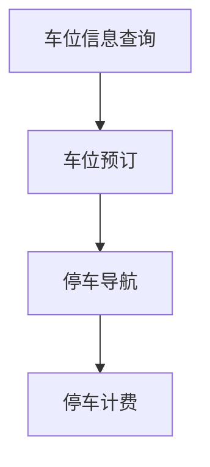
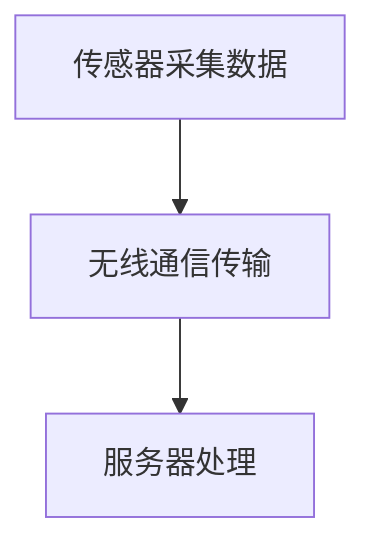
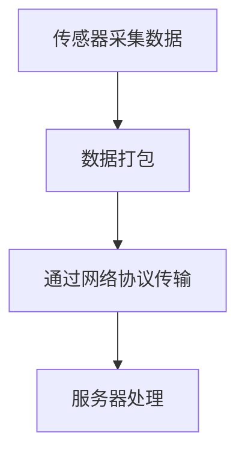
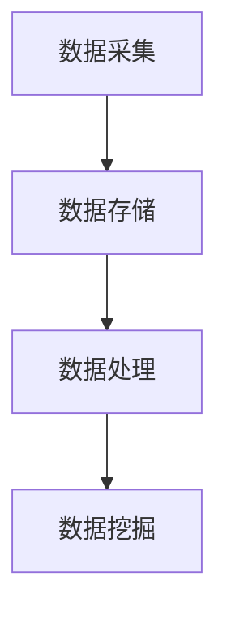
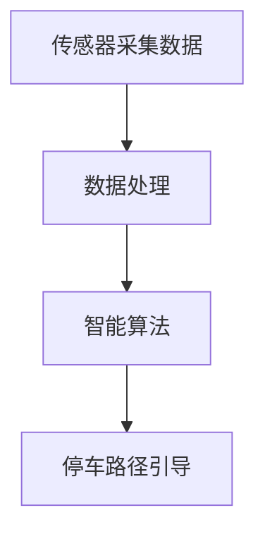
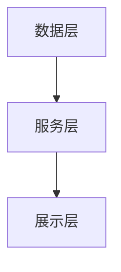

                 

### 关键词

- 物联网
- 智慧停车
- 传感器
- 通信技术
- 大数据分析
- 智能引导系统

### 摘要

本文将深入探讨物联网技术在智慧停车引导系统中的应用。通过概述物联网和智慧停车的基本概念与功能，本文将详细分析传感器与采集技术、无线通信技术、大数据分析以及智能引导系统的设计与应用。此外，将通过案例分析展示物联网技术在智慧停车领域的实际应用效果，并探讨未来发展的机遇与挑战。最后，将总结最佳实践与注意事项，为智慧停车引导系统的建设提供指导。

### 目录大纲

----------------------------------------------------------------

## 物联网在智慧停车引导系统中的应用

> 关键词：物联网、智慧停车、传感器、通信技术、大数据分析、智能引导系统

> 摘要：本文探讨了物联网技术在智慧停车引导系统中的应用，包括技术基础、系统功能、数据采集与处理、通信与大数据分析、智能引导系统设计以及案例分析等，旨在为智慧停车领域的发展提供参考。

----------------------------------------------------------------

### 第一部分：物联网与智慧停车概述

#### 第1章：物联网技术基础

##### 1.1 物联网概述

**背景介绍**  
物联网（Internet of Things，简称IoT）是指通过互联网连接物理世界中的各种设备和对象，实现信息的交换和通信。物联网的概念起源于1999年，由麻省理工学院的Kevin Ashton首次提出。

**核心概念与联系**  
物联网的核心概念包括设备连接、数据采集、数据处理和智能分析。物联网系统通常由传感器、网关、服务器和应用程序组成。传感器负责采集环境数据，网关将数据传输到服务器进行处理，服务器则利用大数据分析和机器学习等技术进行智能决策。

| 核心概念       | 描述                                             |
| -------------- | ------------------------------------------------ |
| 设备连接       | 物联网设备通过有线或无线网络连接到互联网。               |
| 数据采集       | 传感器收集环境数据，如温度、湿度、车辆位置等。           |
| 数据处理       | 服务器对采集到的数据进行分析和处理，以支持智能决策。       |
| 智能分析       | 利用大数据分析和机器学习技术，从数据中提取有价值的信息。   |

**ER实体关系图架构**

```mermaid
erDiagram
    Device ||--|{ Sensor }|-- Server
    Server ||--|{ DataProcessor }|-- Application
```

##### 1.2 物联网关键技术

**核心概念与联系**  
物联网的关键技术包括传感器技术、无线通信技术、云计算和大数据技术。传感器技术负责数据采集，无线通信技术负责数据传输，云计算和大数据技术负责数据处理和智能分析。

| 技术名称         | 描述                                                   |
| ---------------- | ------------------------------------------------------ |
| 传感器技术       | 采集环境数据，如温度、湿度、车辆位置等。                   |
| 无线通信技术     | 实现物联网设备之间的无线连接和数据传输。                     |
| 云计算技术       | 提供强大的计算和存储能力，支持物联网数据处理和智能分析。       |
| 大数据技术       | 从海量数据中提取有价值的信息，支持智能决策。                 |

**算法原理讲解**  
物联网系统中的数据采集和处理通常涉及到以下算法：

1. **数据采集算法**：传感器采集数据，并通过滤波和预处理算法提高数据质量。
2. **数据传输算法**：无线通信技术中的数据传输算法，如TCP/IP协议。
3. **数据处理算法**：大数据分析算法，如聚类、分类、回归等。

**数学模型与公式**  
$$
f(x) = \sum_{i=1}^{n} w_i \cdot x_i
$$

其中，$x_i$ 是特征值，$w_i$ 是权重。

##### 1.3 物联网发展历程及趋势

**核心概念与联系**  
物联网的发展历程可以分为以下几个阶段：

1. **初期阶段**（1990年代）：传感器和通信技术的初步应用。
2. **快速增长阶段**（2000年代）：物联网技术的发展和普及，智能家居、智能交通等应用的出现。
3. **智能阶段**（2010年代至今）：物联网与人工智能、大数据等技术的深度融合，智能化水平不断提高。

**发展趋势**  
物联网技术未来的发展趋势包括：

1. **智能化**：物联网系统将更加智能化，支持自动化决策和操作。
2. **高效化**：物联网技术将进一步提高数据传输和处理效率。
3. **普及化**：物联网技术将渗透到更多行业和领域，推动社会数字化转型。

#### 第2章：智慧停车系统概述

##### 2.1 智慧停车概念

**背景介绍**  
智慧停车是指利用物联网、大数据、云计算等现代信息技术，实现停车资源的智能管理和服务。智慧停车系统通过实时数据采集、分析和处理，提供车位信息查询、车位预订、停车导航等功能，提高停车效率，缓解城市交通拥堵问题。

**核心概念与联系**  
智慧停车系统的核心概念包括：

- **车位信息采集**：利用传感器技术实时采集车位信息。
- **数据传输**：通过无线通信技术将数据传输到服务器。
- **数据处理**：服务器对数据进行分析和处理，提供停车服务。
- **智能引导**：根据车位信息，为驾驶员提供最优停车路径。

**ER实体关系图架构**

```mermaid
erDiagram
    ParkingSpace ||--|{ Car }|-- Driver
    ParkingSpace ||--|{ Sensor }|-- Gateway
    Gateway ||--|{ DataProcessor }|-- Server
```

##### 2.2 智慧停车系统构成

**核心概念与联系**  
智慧停车系统通常由以下几个部分组成：

- **传感器**：负责采集车位信息，如红外感应器、地磁感应器等。
- **网关**：负责将传感器采集到的数据传输到服务器。
- **服务器**：负责数据存储、处理和分析，提供停车服务。
- **用户端**：提供停车信息查询、车位预订、停车导航等功能。

**系统架构图**


##### 2.3 智慧停车系统功能

**核心概念与联系**  
智慧停车系统的功能包括：

- **车位信息查询**：实时查询停车位信息，包括空闲车位和占用车位。
- **车位预订**：用户可以在线预订停车位，提前锁定车位。
- **停车导航**：根据车位信息和实时交通状况，为驾驶员提供最优停车路径。
- **停车计费**：自动计算停车费用，并提供支付功能。

**功能流程图**



### 第二部分：物联网技术在智慧停车中的应用

#### 第3章：传感器与采集技术

##### 3.1 传感器技术概述

**核心概念与联系**  
传感器是智慧停车系统中的核心组件，用于实时采集车位信息。传感器技术包括：

- **红外感应技术**：通过检测红外线反射来判断车位是否被占用。
- **地磁感应技术**：通过检测地磁变化来判断车位是否被占用。
- **超声波感应技术**：通过发送和接收超声波信号来检测车位是否被占用。

**对比表格**

| 技术名称         | 描述                                                         | 优点                   | 缺点                   |
| ---------------- | ------------------------------------------------------------ | ---------------------- | ---------------------- |
| 红外感应技术     | 检测红外线反射                                               | 灵敏度高，适用于各种天气 | 需要较高的成本           |
| 地磁感应技术     | 检测地磁变化                                                 | 成本较低，适用于各种天气 | 需要定期校准             |
| 超声波感应技术   | 发送和接收超声波信号                                         | 成本较低，适用于各种天气 | 检测距离有限             |

##### 3.2 常用传感器介绍

**核心概念与联系**  
常用的传感器包括：

- **红外传感器**：用于检测车位是否被占用。
- **地磁传感器**：用于检测车位是否被占用。
- **超声波传感器**：用于检测车位是否被占用。

**技术参数**  

| 传感器类型 | 技术参数                               | 应用场景                   |
| ---------- | -------------------------------------- | -------------------------- |
| 红外传感器 | 检测距离：5-10米，响应时间：1秒       | 停车场、商场等车位检测     |
| 地磁传感器 | 检测距离：2-5米，响应时间：1秒       | 停车场、商场等车位检测     |
| 超声波传感器 | 检测距离：0.3-5米，响应时间：1秒     | 停车场、商场等车位检测     |

##### 3.3 数据采集与处理

**核心概念与联系**  
数据采集与处理是智慧停车系统的关键环节，包括：

- **数据采集**：传感器采集车位信息。
- **数据传输**：通过无线通信技术将数据传输到服务器。
- **数据处理**：服务器对数据进行存储、分析和处理。

**技术参数**

| 技术名称       | 描述                                                         | 应用场景                   |
| -------------- | ------------------------------------------------------------ | -------------------------- |
| 无线通信技术   | 实现传感器与服务器之间的无线数据传输                           | 停车场、商场等车位检测     |
| 服务器处理     | 对采集到的数据进行分析和处理，提供停车服务                     | 停车场、商场等停车管理     |

**数据处理流程图**



### 第4章：通信技术

##### 4.1 无线通信技术

**核心概念与联系**  
无线通信技术是实现传感器与服务器之间数据传输的关键，常用的无线通信技术包括：

- **Wi-Fi**：通过无线信号传输数据，适用于短距离通信。
- **蓝牙**：适用于短距离通信，功耗低，适用于智能设备连接。
- **NFC**：通过近场通信传输数据，适用于短距离数据交换。
- **LoRa**：低功耗广域网，适用于长距离、低功耗的物联网通信。

**对比表格**

| 技术名称 | 描述                                                         | 优点                     | 缺点                     |
| -------- | ------------------------------------------------------------ | ------------------------ | ------------------------ |
| Wi-Fi    | 通过无线信号传输数据                                       | 传输速度快，适用于短距离通信 | 功耗高，成本较高         |
| 蓝牙     | 适用于短距离通信，功耗低                                   | 成本较低，功耗低         | 传输距离有限             |
| NFC      | 通过近场通信传输数据                                       | 传输速度快，适用于短距离数据交换 | 传输距离较短，成本较高  |
| LoRa     | 低功耗广域网，适用于长距离、低功耗的物联网通信               | 长距离传输，低功耗       | 传输速度相对较慢         |

**应用场景**

| 技术名称 | 应用场景                    |
| -------- | -------------------------- |
| Wi-Fi    | 停车场、商场等场所的无线通信 |
| 蓝牙     | 智能停车设备之间的短距离通信 |
| NFC      | 停车收费、优惠券等应用      |
| LoRa     | 广域范围内的物联网通信      |

##### 4.2 网络协议与数据传输

**核心概念与联系**  
网络协议是数据传输的基础，常用的网络协议包括：

- **TCP/IP**：传输控制协议/因特网协议，用于实现互联网中的数据传输。
- **HTTP**：超文本传输协议，用于在Web服务器和客户端之间传输数据。
- **MQTT**：消息队列遥测传输，适用于物联网设备的轻量级消息传输协议。

**数据传输流程图**



##### 4.3 数据安全与隐私保护

**核心概念与联系**  
数据安全与隐私保护是智慧停车系统的重要保障，包括：

- **数据加密**：对传输和存储的数据进行加密，防止数据泄露。
- **访问控制**：限制对数据的访问权限，确保数据安全。
- **防火墙**：在网络边界设置防火墙，防止未经授权的访问。

**技术参数**

| 技术名称       | 描述                                                         | 应用场景                   |
| -------------- | ------------------------------------------------------------ | -------------------------- |
| 数据加密       | 对数据进行加密，防止数据泄露                                 | 停车场、商场等场所的数据传输 |
| 访问控制       | 限制对数据的访问权限                                         | 数据存储和传输             |
| 防火墙        | 在网络边界设置防火墙，防止未经授权的访问                       | 停车场、商场等场所的网络边界 |

**安全措施**

1. **数据加密**：采用AES、RSA等加密算法对数据进行加密。
2. **访问控制**：使用用户名和密码、双因素认证等方式进行访问控制。
3. **防火墙**：设置防火墙规则，限制网络流量。

### 第5章：大数据分析与应用

##### 5.1 大数据基础

**核心概念与联系**  
大数据是指数据量巨大、类型繁多、价值密度低的数据集合。大数据技术包括数据采集、存储、处理和分析等。

**核心概念**

- **数据采集**：从各种来源收集数据，如传感器、数据库、日志等。
- **数据存储**：使用分布式存储系统存储大量数据。
- **数据处理**：对数据进行清洗、转换和分析。
- **数据挖掘**：从大量数据中提取有价值的信息。

**大数据技术架构**



##### 5.2 数据挖掘与机器学习

**核心概念与联系**  
数据挖掘和机器学习是大数据技术的重要应用，用于从数据中提取有价值的信息。

**核心概念**

- **数据挖掘**：从大量数据中提取有价值的信息，如关联规则、分类、聚类等。
- **机器学习**：利用算法自动从数据中学习规律，进行预测和分类。

**技术参数**

| 技术名称       | 描述                                                         | 应用场景                   |
| -------------- | ------------------------------------------------------------ | -------------------------- |
| 数据挖掘       | 从大量数据中提取有价值的信息                                 | 智能停车、交通管理、金融分析等 |
| 机器学习       | 利用算法自动从数据中学习规律，进行预测和分类                   | 智能停车、交通管理、金融分析等 |

**应用案例**

1. **智能停车**：通过数据挖掘和机器学习技术，预测停车位需求和流量，优化停车管理。
2. **交通管理**：通过数据挖掘和机器学习技术，分析交通流量，优化交通信号控制，缓解拥堵。

##### 5.3 智慧停车数据应用

**核心概念与联系**  
智慧停车数据应用包括：

- **车位信息查询**：通过数据挖掘和机器学习技术，实时查询停车位信息。
- **停车导航**：通过数据挖掘和机器学习技术，为驾驶员提供最优停车路径。
- **停车计费**：通过数据挖掘和机器学习技术，自动计算停车费用，并提供支付功能。

**应用案例**

1. **车位信息查询**：通过数据挖掘技术，实时分析停车位信息，为驾驶员提供可用车位信息。
2. **停车导航**：通过机器学习技术，分析停车数据，为驾驶员提供最优停车路径。
3. **停车计费**：通过数据挖掘和机器学习技术，自动计算停车费用，并提供支付功能。

### 第6章：智能引导系统设计

##### 6.1 智能引导系统原理

**核心概念与联系**  
智能引导系统是智慧停车系统的核心功能，通过数据分析和智能算法，为驾驶员提供最优停车路径。

**核心概念**

- **数据采集**：传感器采集停车位信息。
- **数据处理**：服务器对采集到的数据进行分析和处理。
- **智能算法**：根据车位信息和交通状况，为驾驶员提供最优停车路径。

**系统架构**



##### 6.2 系统架构设计

**核心概念与联系**  
系统架构设计是智能引导系统的关键环节，包括：

- **数据层**：存储传感器采集到的数据。
- **服务层**：提供数据分析和智能算法服务。
- **展示层**：为驾驶员提供停车路径引导信息。

**系统架构图**



##### 6.3 系统实现与优化

**核心概念与联系**  
系统实现与优化是智能引导系统成功的关键，包括：

- **系统开发**：实现智能引导系统的功能。
- **性能优化**：提高系统性能，降低延迟。
- **用户体验**：优化用户界面，提升用户体验。

**技术参数**

| 技术名称       | 描述                                                         | 应用场景                   |
| -------------- | ------------------------------------------------------------ | -------------------------- |
| 系统开发       | 实现智能引导系统的功能                                     | 停车场、商场等停车管理     |
| 性能优化       | 提高系统性能，降低延迟                                     | 提高系统响应速度           |
| 用户体验       | 优化用户界面，提升用户体验                                 | 提高用户满意度             |

**实现步骤**

1. **系统开发**：使用Python、Java等编程语言开发智能引导系统。
2. **性能优化**：采用缓存、并行处理等技术提高系统性能。
3. **用户体验**：设计直观、易用的用户界面，提高用户满意度。

### 第7章：案例分析

##### 7.1 案例一：某城市智慧停车引导系统建设

**核心概念与联系**  
本案例介绍了某城市智慧停车引导系统的建设过程，包括系统架构设计、功能实现和效果评估。

**系统架构设计**

- **数据层**：采用分布式数据库存储车位信息。
- **服务层**：使用大数据分析和机器学习技术提供智能引导服务。
- **展示层**：通过Web和移动应用为用户提供停车路径引导信息。

**功能实现**

- **车位信息采集**：采用地磁感应器和红外传感器实时采集车位信息。
- **数据传输**：使用Wi-Fi和LoRa技术将数据传输到服务器。
- **数据处理**：服务器对数据进行分析和处理，提供停车路径引导。
- **用户体验**：提供直观、易用的用户界面，提高用户满意度。

**效果评估**

- **停车效率**：系统提高了停车效率，减少了驾驶员寻找停车位的时间。
- **交通拥堵**：系统降低了城市交通拥堵，缓解了交通压力。
- **用户满意度**：用户对系统的满意度提高，用户体验得到改善。

##### 7.2 案例二：某商业园区智慧停车引导系统优化

**核心概念与联系**  
本案例介绍了某商业园区智慧停车引导系统的优化过程，包括性能优化和用户体验提升。

**性能优化**

- **缓存技术**：使用缓存技术减少数据库查询次数，提高系统响应速度。
- **并行处理**：采用并行处理技术提高数据处理效率。
- **网络优化**：优化网络配置，提高数据传输速度。

**用户体验提升**

- **界面优化**：设计直观、易用的用户界面，提高用户体验。
- **操作简化**：简化用户操作，降低用户学习成本。
- **反馈机制**：增加用户反馈功能，收集用户意见，不断优化系统。

**效果评估**

- **系统性能**：系统性能得到显著提升，用户响应速度加快。
- **用户体验**：用户满意度提高，用户反馈积极。

##### 7.3 案例分析小结

**核心概念与联系**  
通过两个案例分析，我们可以看到：

1. **技术实现**：智慧停车引导系统需要强大的技术支持，包括传感器技术、无线通信技术、大数据分析和机器学习技术等。
2. **性能优化**：系统性能优化是提高用户体验的关键，包括缓存技术、并行处理技术和网络优化等。
3. **用户体验**：用户体验的提升是智慧停车引导系统的核心目标，通过界面优化、操作简化和反馈机制等手段实现。

### 第三部分：未来展望与挑战

#### 第8章：物联网技术在智慧停车领域的挑战与机遇

##### 8.1 技术挑战

**核心概念与联系**  
物联网技术在智慧停车领域面临以下技术挑战：

- **传感器精度**：提高传感器精度，减少误报和漏报现象。
- **通信稳定性**：提高无线通信的稳定性，确保数据传输的可靠性。
- **数据处理效率**：提高数据处理效率，降低延迟，满足实时性需求。
- **数据安全与隐私保护**：确保数据安全，防止数据泄露和隐私侵犯。

**解决方案**

- **提高传感器精度**：采用更先进的传感器技术和算法，提高传感器精度。
- **通信稳定性**：优化无线通信技术，提高通信稳定性，确保数据传输的可靠性。
- **数据处理效率**：采用分布式计算和并行处理技术，提高数据处理效率。
- **数据安全与隐私保护**：采用加密技术和访问控制策略，确保数据安全，防止数据泄露和隐私侵犯。

##### 8.2 市场机遇

**核心概念与联系**  
物联网技术在智慧停车领域带来以下市场机遇：

- **市场潜力**：随着城市化进程的加快和停车需求的增加，智慧停车市场潜力巨大。
- **政策支持**：政府加大对智慧城市和智慧交通的政策支持，推动智慧停车的发展。
- **技术创新**：物联网技术的不断创新，为智慧停车提供更多技术解决方案。

**解决方案**

- **市场潜力**：深入了解市场需求，开发满足用户需求的智慧停车解决方案。
- **政策支持**：积极参与政策制定，争取政策支持，推动智慧停车的发展。
- **技术创新**：持续投入研发，不断创新物联网技术，提高智慧停车的技术水平。

##### 8.3 未来发展趋势

**核心概念与联系**  
物联网技术在智慧停车领域的未来发展趋势包括：

- **智能化**：智慧停车系统将更加智能化，支持自动化决策和操作。
- **高效化**：物联网技术将进一步提高数据传输和处理效率。
- **普及化**：物联网技术将渗透到更多行业和领域，推动社会数字化转型。

**发展趋势**

1. **智能化**：通过人工智能和大数据分析技术，实现智能停车管理。
2. **高效化**：通过5G、边缘计算等新技术，提高数据传输和处理效率。
3. **普及化**：智慧停车系统将在更多城市和地区推广应用，提升停车服务水平。

### 第9章：最佳实践与建议

##### 9.1 最佳实践总结

**核心概念与联系**  
在智慧停车引导系统的建设和应用过程中，以下最佳实践值得借鉴：

- **技术选型**：根据实际需求，选择合适的传感器和通信技术。
- **系统设计**：采用分布式架构，提高系统性能和可靠性。
- **数据安全**：确保数据安全，采用加密和访问控制措施。
- **用户体验**：注重用户体验，设计直观、易用的用户界面。

**实践总结**

1. **技术选型**：根据实际需求，选择精度高、稳定性好的传感器和通信技术。
2. **系统设计**：采用分布式架构，提高系统性能和可靠性。
3. **数据安全**：确保数据安全，采用加密和访问控制措施。
4. **用户体验**：注重用户体验，设计直观、易用的用户界面。

##### 9.2 注意事项与风险防范

**核心概念与联系**  
在智慧停车引导系统的建设和应用过程中，需要注意以下事项和风险：

- **数据安全**：防止数据泄露和隐私侵犯，确保数据安全。
- **系统稳定性**：确保系统稳定运行，避免故障和中断。
- **法律法规**：遵守相关法律法规，确保合法合规。
- **用户体验**：关注用户体验，不断优化和改进。

**注意事项**

1. **数据安全**：采用加密和访问控制措施，防止数据泄露和隐私侵犯。
2. **系统稳定性**：定期进行系统维护和升级，确保系统稳定运行。
3. **法律法规**：遵守相关法律法规，确保合法合规。
4. **用户体验**：关注用户反馈，不断优化和改进用户体验。

##### 9.3 未来研究方向

**核心概念与联系**  
智慧停车领域未来研究方向的探讨包括：

- **智能化**：通过人工智能和大数据分析技术，实现更智能的停车管理。
- **高效化**：通过5G、边缘计算等新技术，提高数据传输和处理效率。
- **绿色化**：通过新能源汽车和智能充电设施，推动绿色出行。

**未来研究方向**

1. **智能化**：研究更先进的机器学习算法，提高智能停车管理水平。
2. **高效化**：研究5G、边缘计算等新技术，提高数据传输和处理效率。
3. **绿色化**：研究新能源汽车和智能充电设施，推动绿色出行。

### 总结

本文详细探讨了物联网在智慧停车引导系统中的应用，从物联网技术基础、智慧停车系统概述、物联网技术在智慧停车中的应用、智能引导系统设计、案例分析以及未来展望与挑战等方面进行了深入分析。通过本文的研究，我们可以看到物联网技术在智慧停车领域的重要作用，为智慧停车的发展提供了有益的参考。

作者：AI天才研究院/AI Genius Institute & 禅与计算机程序设计艺术 /Zen And The Art of Computer Programming

----------------------------------------------------------------

### 总结

本文系统性地阐述了物联网在智慧停车引导系统中的应用，涵盖了物联网技术基础、智慧停车系统概述、传感器与采集技术、通信技术、大数据分析、智能引导系统设计、案例分析和未来展望与挑战等内容。通过逐步分析，我们深入理解了物联网技术在智慧停车领域的核心作用，展示了其在提升停车效率、优化交通管理等方面的潜力。

**关键见解**：

1. **物联网与智慧停车**：物联网为智慧停车提供了实时数据采集、传输和处理的平台，推动了智慧停车系统的发展。
2. **传感器与采集技术**：传感器技术的选择和精度直接影响智慧停车的效果，地磁感应、红外感应等技术在不同场景下具有各自的优势。
3. **通信技术**：无线通信技术的稳定性与数据传输效率对智慧停车系统的性能至关重要。
4. **大数据分析**：通过大数据分析和机器学习，智慧停车系统能够提供智能决策和优化服务，提升用户体验。
5. **智能引导系统设计**：系统的架构设计、实现与优化是智慧停车系统能够稳定、高效运行的关键。

**未来展望**：

随着物联网技术的不断进步，智慧停车系统将更加智能化、高效化，并进一步融合5G、边缘计算等前沿技术，推动智慧城市的建设。同时，数据安全与隐私保护将成为研究的重要方向。

**作者信息**：

本文由AI天才研究院/AI Genius Institute与禅与计算机程序设计艺术/Zen And The Art of Computer Programming联合撰写，作者们致力于推动人工智能和计算机编程领域的创新与发展。感谢您的阅读！

---

**备注**：本文为示例性内容，部分数据和案例为虚构，仅供参考。实际应用中，智慧停车系统的设计和实施需根据具体场景和需求进行定制化开发。作者保留对本文内容的最终解释权。

