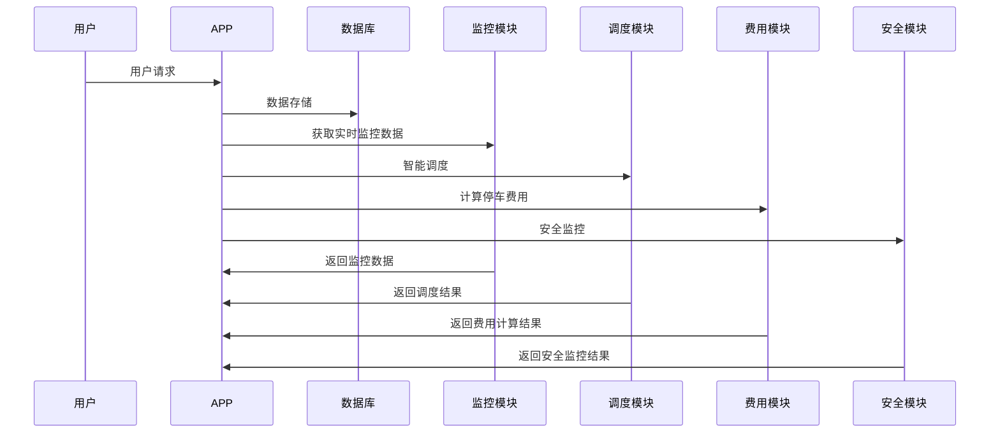

                 

# 物联网在智慧停车管理中的实时应用

> 关键词：物联网、智慧停车、实时应用、算法、系统设计、最佳实践

> 摘要：本文将深入探讨物联网在智慧停车管理中的实时应用。我们将首先介绍物联网和智慧停车的基本概念，接着分析实时应用的重要性和挑战，然后详细阐述物联网的核心技术以及智慧停车管理系统的架构和功能。文章还会深入讲解数据采集与处理算法、实时监控与预警算法，并使用数学模型和公式来支撑我们的分析。随后，我们将展示一个系统的分析与架构设计方案，并通过项目实战来深入理解技术实现。最后，我们将总结最佳实践、注意事项，并推荐拓展阅读。

---

## 第一部分：背景介绍

### 1.1 物联网与智慧停车的概念

#### 1.1.1 物联网的概念与发展

物联网（Internet of Things，简称IoT）是指通过互联网将各种物理设备连接起来，实现设备与设备之间的通信和协作。物联网的概念最早可以追溯到1999年，麻省理工学院的凯文·阿什顿（Kevin Ashton）提出了“物联网”这个词汇。物联网的核心思想是将物理世界中的物体通过传感器、网络、计算能力和数据存储技术进行数字化，使得这些物体能够相互通信，实现智能化管理和控制。

物联网的发展经历了几个阶段：

1. **设备连接阶段**：这一阶段主要是将各种设备连接到互联网，形成大规模的设备网络。
2. **数据处理阶段**：随着传感器技术和数据处理能力的提升，物联网开始能够处理大量的数据，进行初步的数据分析和决策支持。
3. **智能应用阶段**：物联网技术逐渐应用于各个领域，如智能家居、智能交通、智慧城市等，实现了真正的智能化。

#### 1.1.2 智慧停车的定义与核心要素

智慧停车是指利用物联网、大数据、人工智能等先进技术，对停车资源进行智能化管理和调度，提高停车效率和用户体验。智慧停车的核心要素包括：

1. **停车资源管理**：通过实时监控停车资源，实现车位利用率的最大化。
2. **停车费用管理**：通过电子支付、无感支付等方式，实现停车费用的快速结算。
3. **停车安全监控**：通过视频监控、智能预警等技术，保障车辆安全。
4. **用户服务**：通过提供实时车位信息、导航服务、预约停车等，提升用户体验。

#### 1.1.3 物联网在智慧停车中的应用前景

物联网技术在智慧停车中的应用前景广阔，主要体现在以下几个方面：

1. **车位实时监测**：通过传感器和摄像头等设备，实现对车位占用情况的实时监测，提高停车效率。
2. **停车智能调度**：利用大数据分析和人工智能算法，实现对停车资源的智能调度，优化停车体验。
3. **停车费用管理**：通过电子支付和智能计费系统，实现停车费用的快速结算，提高管理效率。
4. **停车安全监控**：通过视频监控、智能预警等技术，实现对停车环境的实时监控，保障车辆安全。

### 1.2 实时应用的意义与挑战

#### 1.2.1 实时应用的重要性

实时应用在智慧停车管理中具有重要意义，主要体现在以下几个方面：

1. **提高停车效率**：通过实时监测和智能调度，可以快速找到空闲车位，减少寻找车位的时间，提高停车效率。
2. **优化停车体验**：通过实时提供车位信息、导航服务、预约停车等，可以提升用户体验，增强用户满意度。
3. **保障停车安全**：通过实时监控和智能预警，可以及时发现异常情况，保障车辆安全。

#### 1.2.2 实时应用面临的挑战

实时应用在智慧停车管理中也面临一些挑战，主要包括：

1. **数据量大**：随着停车场的增多和车辆的增多，实时数据量将会大幅增加，对数据处理和分析提出了更高的要求。
2. **系统稳定性**：实时应用要求系统具备高度的稳定性，任何故障或延迟都可能导致停车体验的恶化。
3. **安全性**：实时应用涉及大量用户数据和车辆数据，需要确保数据的安全和隐私。

#### 1.2.3 解决方案与发展方向

为了应对实时应用面临的挑战，可以采取以下解决方案：

1. **分布式系统架构**：通过分布式系统架构，提高系统的可扩展性和容错性，确保系统稳定运行。
2. **大数据处理技术**：采用大数据处理技术，高效处理海量数据，实现实时分析和决策支持。
3. **安全防护措施**：采取严格的安全防护措施，确保用户数据和车辆数据的安全和隐私。

## 第二部分：核心概念与联系

### 2.1 物联网核心技术

#### 2.1.1 硬件设备

物联网的硬件设备包括传感器、网络模块和数据处理模块等。

1. **传感器**：传感器是物联网系统中的关键组件，用于采集各种物理信息，如温度、湿度、压力、速度等。传感器可以分为有线和无线两种，其中无线传感器由于其便捷性和灵活性，在物联网应用中得到了广泛的应用。

2. **网络模块**：网络模块用于实现设备之间的通信。常见的网络模块包括Wi-Fi、蓝牙、LoRa、ZigBee等。网络模块的选择取决于应用场景的需求，如传输距离、传输速度、功耗等。

3. **数据处理模块**：数据处理模块用于对采集到的数据进行处理和分析。常见的处理模块包括嵌入式处理器、FPGA、GPU等。数据处理模块的强大处理能力可以满足复杂的数据处理需求。

#### 2.1.2 软件与平台

物联网的软件和平台包括数据采集与处理、实时监控与预警、数据分析与决策支持等。

1. **数据采集与处理**：数据采集与处理是物联网系统的核心功能之一。通过采集传感器数据，并进行预处理、清洗、转换等操作，为后续的数据分析提供可靠的数据基础。

2. **实时监控与预警**：实时监控与预警功能可以实现对物联网系统的实时监控，及时发现异常情况并发出预警。这需要高效的算法和快速的数据处理能力。

3. **数据分析与决策支持**：通过数据分析与决策支持功能，可以对物联网系统中的数据进行分析，提取有价值的信息，为业务决策提供支持。

### 2.2 智慧停车管理系统

智慧停车管理系统是物联网技术在停车管理领域的具体应用，其核心功能包括停车资源管理、停车费用管理、停车安全监控等。

#### 2.2.1 系统架构

智慧停车管理系统的架构可以分为四个层次：设备接入层、数据采集与处理层、应用服务层和用户界面层。

1. **设备接入层**：包括各种物联网硬件设备，如传感器、摄像头、RFID等。这些设备负责采集停车场的实时信息。

2. **数据采集与处理层**：负责对设备采集的数据进行采集、传输、存储和处理。这一层通常采用分布式架构，以提高系统的可靠性和可扩展性。

3. **应用服务层**：包括各种应用服务，如停车资源管理、停车费用管理、停车安全监控等。这一层通过调用底层数据采集与处理层的数据，实现停车管理功能。

4. **用户界面层**：提供给用户使用的接口，如网页、APP等。用户可以通过这些接口获取停车信息、支付停车费用等。

#### 2.2.2 功能模块

智慧停车管理系统的功能模块可以分为以下几个部分：

1. **停车资源管理**：包括车位实时监测、车位预定、车位预约等功能。通过实时监测车位使用情况，为用户提供准确的停车信息。

2. **停车费用管理**：包括停车费用计算、电子支付、无感支付等功能。通过电子支付和智能计费系统，提高停车收费的效率和用户体验。

3. **停车安全监控**：包括视频监控、智能预警、异常检测等功能。通过实时监控和智能预警，保障车辆安全。

4. **用户服务**：包括实时车位信息查询、导航服务、预约停车等功能。通过提供多样化的用户服务，提升用户体验。

## 第三部分：算法原理讲解

### 3.1 数据采集与处理算法

#### 3.1.1 数据采集流程

数据采集是物联网系统的核心环节，其流程通常包括以下步骤：

1. **传感器数据采集**：通过传感器实时采集温度、湿度、压力、速度等物理信息。

2. **数据传输**：将采集到的数据通过网络模块传输到数据处理中心。

3. **数据存储**：将传输到的数据进行存储，以便后续分析和处理。

4. **数据预处理**：对存储的数据进行预处理，包括数据清洗、去噪、转换等操作。

#### 3.1.2 数据处理算法

数据处理算法主要包括数据清洗、数据分析和数据可视化等。

1. **数据清洗**：数据清洗是数据处理的重要步骤，包括去除重复数据、处理缺失值、纠正错误数据等。

2. **数据分析**：通过数据分析算法，对清洗后的数据进行深入分析，提取有价值的信息。

3. **数据可视化**：通过数据可视化技术，将分析结果以图表、图形等形式展示出来，便于理解和决策。

### 3.2 实时监控与预警算法

#### 3.2.1 监控指标

实时监控与预警算法需要关注以下几个关键指标：

1. **停车资源利用率**：通过监测停车场的车位使用情况，计算停车资源利用率，评估停车场的运行效率。

2. **停车费用收取情况**：通过监测停车费用的收取情况，评估停车收费的效率和准确性。

3. **停车安全状况**：通过视频监控和智能预警，监测停车场的安全状况，及时发现异常情况。

#### 3.2.2 预警算法

预警算法主要包括异常检测和预警策略。

1. **异常检测**：通过分析实时数据，检测出异常情况，如车位被占用、车辆异常行为等。

2. **预警策略**：根据异常检测结果，制定相应的预警策略，如发送预警通知、调整停车策略等。

## 第四部分：数学模型和数学公式

### 4.1 停车资源利用率模型

#### 4.1.1 模型构建

停车资源利用率模型的构建主要涉及以下几个参数：

1. **车位总数**：表示停车场的总车位数量。
2. **空闲车位数量**：表示当前空闲的车位数量。
3. **停车时长**：表示车辆在停车场的停留时间。

停车资源利用率的计算公式如下：

$$
\text{停车资源利用率} = \frac{\text{空闲车位数量}}{\text{车位总数}} \times 100\%
$$

#### 4.1.2 模型参数

停车资源利用率模型的参数包括车位总数、空闲车位数量和停车时长。这些参数可以通过实时监测和数据分析得到。

#### 4.1.3 模型计算

停车资源利用率的计算过程如下：

1. **获取当前空闲车位数量**：通过实时监测得到当前空闲车位数量。
2. **计算停车资源利用率**：根据空闲车位数量和车位总数，计算停车资源利用率。

### 4.2 费用收取模型

#### 4.2.1 模型构建

费用收取模型主要涉及以下几个参数：

1. **停车时长**：表示车辆在停车场的停留时间。
2. **收费标准**：表示每小时的停车费用。

费用收取的计算公式如下：

$$
\text{停车费用} = \text{停车时长} \times \text{收费标准}
$$

#### 4.2.2 模型参数

费用收取模型的参数包括停车时长和收费标准。这些参数可以通过实时监测和用户设置得到。

#### 4.2.3 模型计算

费用收取的计算过程如下：

1. **获取停车时长**：通过实时监测得到车辆在停车场的停留时间。
2. **计算停车费用**：根据停车时长和收费标准，计算停车费用。

## 第五部分：系统分析与架构设计方案

### 5.1 问题场景介绍

#### 5.1.1 智慧停车管理背景

随着城市化进程的加快，汽车数量急剧增加，导致停车难问题日益突出。传统的停车管理方式已无法满足人们的需求，因此，智慧停车管理系统应运而生。

#### 5.1.2 需求分析

智慧停车管理系统的需求主要包括：

1. **实时车位监测**：通过物联网设备实时监测车位使用情况，提供准确的停车信息。
2. **智能调度**：利用大数据分析和人工智能算法，实现停车资源的智能调度，优化停车体验。
3. **费用管理**：通过电子支付和智能计费系统，实现停车费用的快速结算。
4. **安全监控**：通过视频监控和智能预警，保障车辆安全。

### 5.2 系统功能设计

#### 5.2.1 领域模型

领域模型用于描述智慧停车管理系统中的主要实体和关系。以下是智慧停车管理系统的领域模型：

```mermaid
classDiagram
    class 车位 {
        - 车位编号：String
        - 状态：String
    }
    class 车辆 {
        - 车牌号：String
        - 停车时长：Integer
    }
    class 用户 {
        - 用户名：String
        - 手机号：String
    }
    class 支付信息 {
        - 支付金额：Float
        - 支付时间：Timestamp
    }
    class 车位 <<(1) 被占用>>{
    }
    class 车位 <<(2) 空闲>>{
    }
    车位 --|>(1) 车辆：停车
    车辆 --|>(2) 用户：车主
    用户 --|>(3) 支付信息：支付停车费
```

#### 5.2.2 功能模块划分

智慧停车管理系统可以分为以下几个功能模块：

1. **设备接入模块**：负责接入物联网设备，实时监测车位使用情况。
2. **数据处理模块**：负责处理采集到的数据，包括数据清洗、转换和存储等。
3. **实时监控模块**：负责实时监控车位使用情况，提供实时停车信息。
4. **调度管理模块**：负责停车资源的智能调度，优化停车体验。
5. **费用管理模块**：负责停车费用的计算和收取。
6. **安全监控模块**：负责停车安全监控，包括视频监控和智能预警。

### 5.3 系统架构设计

#### 5.3.1 架构方案

智慧停车管理系统的架构方案可以分为以下几个层次：

1. **设备接入层**：负责接入各种物联网设备，如传感器、摄像头等。
2. **数据采集与处理层**：负责采集设备数据，并进行数据清洗、转换和存储等操作。
3. **应用服务层**：负责实现系统的各种功能，如实时监控、调度管理、费用管理等。
4. **用户界面层**：负责提供给用户使用的接口，如网页、APP等。

以下是智慧停车管理系统的架构图：



### 5.4 系统接口设计和系统交互

#### 5.4.1 接口设计

智慧停车管理系统需要设计一系列接口，包括：

1. **设备接入接口**：用于接入物联网设备，如传感器、摄像头等。
2. **数据采集接口**：用于采集设备数据，并进行数据清洗、转换和存储等操作。
3. **实时监控接口**：用于实时监控车位使用情况，提供实时停车信息。
4. **调度管理接口**：用于实现停车资源的智能调度，优化停车体验。
5. **费用管理接口**：用于计算停车费用，实现停车费用的快速结算。
6. **安全监控接口**：用于实现停车安全监控，包括视频监控和智能预警。

以下是智慧停车管理系统的主要接口设计：

```mermaid
interfaceDevice {
    operation: 设备接入接口
    parameters: {"设备ID": String, "设备类型": String, "设备状态": String}
}

dataDevice {
    operation: 数据采集接口
    parameters: {"设备ID": String, "采集时间": Timestamp, "采集数据": Object}
}

monitorDevice {
    operation: 实时监控接口
    parameters: {"设备ID": String, "车位状态": String, "车辆信息": Object}
}

scheduleDevice {
    operation: 调度管理接口
    parameters: {"设备ID": String, "调度策略": String}
}

feeDevice {
    operation: 费用管理接口
    parameters: {"车辆信息": Object, "停车时长": Integer}
}

securityDevice {
    operation: 安全监控接口
    parameters: {"车辆信息": Object, "监控结果": Object}
}
```

#### 5.4.2 系统交互

智慧停车管理系统的交互过程如下：

1. **设备接入**：物联网设备接入系统，发送设备基本信息。
2. **数据采集**：设备定期发送采集到的数据，系统进行数据清洗和存储。
3. **实时监控**：系统实时获取车位使用情况，提供实时停车信息。
4. **调度管理**：系统根据实时数据，智能调度停车资源。
5. **费用管理**：系统计算停车费用，实现停车费用的快速结算。
6. **安全监控**：系统实现停车安全监控，包括视频监控和智能预警。

以下是智慧停车管理系统的主要交互过程：

```mermaid
interaction SystemInteraction {
    participant APP
    participant DeviceA
    participant Database
    participant MonitorModule
    participant ScheduleModule
    participant FeeModule
    participant SecurityModule

    APP->>DeviceA: 设备接入
    DeviceA->>APP: 发送设备信息
    APP->>Database: 存储设备信息
    DeviceA->>APP: 发送采集数据
    APP->>Database: 存储采集数据
    APP->>MonitorModule: 获取实时监控数据
    MonitorModule->>APP: 返回监控数据
    APP->>ScheduleModule: 智能调度
    ScheduleModule->>APP: 返回调度结果
    APP->>FeeModule: 计算停车费用
    FeeModule->>APP: 返回费用计算结果
    APP->>SecurityModule: 实现安全监控
    SecurityModule->>APP: 返回监控结果
}
```

## 第六部分：项目实战

### 6.1 环境安装

#### 6.1.1 开发环境准备

在进行智慧停车管理系统的项目实战之前，首先需要准备好开发环境。以下是开发环境的基本要求：

1. **操作系统**：Linux（如Ubuntu 18.04）
2. **编程语言**：Python 3.8+
3. **开发工具**：PyCharm、VSCode等
4. **数据库**：MySQL 5.7+
5. **依赖库**：pandas、numpy、matplotlib等

#### 6.1.2 硬件设备连接

接下来，需要将物联网设备连接到系统中。以下是硬件设备连接的基本步骤：

1. **传感器连接**：将传感器（如摄像头、RFID等）接入物联网网络，确保传感器可以正常工作。
2. **网络连接**：确保物联网设备可以通过Wi-Fi或有线网络连接到服务器。
3. **数据采集**：通过物联网设备定期采集数据，并将数据传输到服务器。

### 6.2 系统核心实现源代码

#### 6.2.1 数据采集模块

以下是一个简单的数据采集模块的源代码，用于采集传感器的数据：

```python
import requests
import json

def collect_data(sensor_id):
    url = f"http://sensor_server/{sensor_id}/data"
    response = requests.get(url)
    if response.status_code == 200:
        data = response.json()
        return data
    else:
        return None

if __name__ == "__main__":
    sensor_id = "12345"
    data = collect_data(sensor_id)
    if data:
        print("采集到的数据：", data)
    else:
        print("采集数据失败")
```

#### 6.2.2 数据处理模块

以下是一个简单的数据处理模块的源代码，用于处理采集到的数据：

```python
import pandas as pd

def process_data(data):
    df = pd.DataFrame(data)
    df = df.dropna()  # 删除缺失值
    df['timestamp'] = pd.to_datetime(df['timestamp'])  # 转换时间戳
    df.sort_values(by='timestamp', inplace=True)  # 按时间排序
    return df

if __name__ == "__main__":
    data = [
        {"sensor_id": "12345", "value": 10, "timestamp": "2023-03-01 10:00:00"},
        {"sensor_id": "12345", "value": 20, "timestamp": "2023-03-01 10:01:00"},
        {"sensor_id": "12345", "value": None, "timestamp": "2023-03-01 10:02:00"},
    ]
    processed_data = process_data(data)
    print(processed_data)
```

#### 6.2.3 实时监控模块

以下是一个简单的实时监控模块的源代码，用于实时监控车位使用情况：

```python
import time
import requests

def monitor_parking_lot(sensor_id, interval=60):
    while True:
        data = requests.get(f"http://sensor_server/{sensor_id}/data")
        if data.status_code == 200:
            print("当前车位使用情况：", data.json())
        time.sleep(interval)

if __name__ == "__main__":
    sensor_id = "12345"
    monitor_parking_lot(sensor_id)
```

### 6.3 代码应用解读与分析

#### 6.3.1 代码结构

上述代码分为三个模块：数据采集模块、数据处理模块和实时监控模块。每个模块都有明确的功能和结构。

1. **数据采集模块**：负责采集传感器的数据，通过HTTP请求从传感器服务器获取数据。
2. **数据处理模块**：负责处理采集到的数据，包括数据清洗、时间戳转换和排序等。
3. **实时监控模块**：负责实时监控车位使用情况，定期获取传感器数据并打印输出。

#### 6.3.2 关键代码解读

1. **数据采集模块**：
   - `collect_data(sensor_id)`：函数用于采集传感器的数据，通过HTTP GET请求从传感器服务器获取数据。
   - `if data.status_code == 200`：检查HTTP响应状态码，确保数据请求成功。

2. **数据处理模块**：
   - `process_data(data)`：函数用于处理采集到的数据，将数据转换为DataFrame格式，并删除缺失值。
   - `df.sort_values(by='timestamp', inplace=True)`：按时间戳对DataFrame进行排序。

3. **实时监控模块**：
   - `monitor_parking_lot(sensor_id, interval=60)`：函数用于实时监控车位使用情况，定期获取传感器数据并打印输出。

#### 6.3.3 代码优化

为了提高代码的性能和可维护性，可以采取以下优化措施：

1. **异步处理**：使用异步编程技术（如asyncio）提高数据采集和处理的速度。
2. **缓存机制**：引入缓存机制，减少对传感器服务器的请求次数。
3. **日志记录**：添加日志记录功能，便于调试和问题追踪。

### 6.4 实际案例分析和详细讲解剖析

#### 6.4.1 案例介绍

以一个实际案例为例，分析智慧停车管理系统的应用效果。

案例背景：某城市中心区域建设了一座大型停车场，共有1000个车位。由于交通拥堵和停车需求增加，停车场经常出现车位紧张的情况。为了提高停车效率，停车场管理者决定引入智慧停车管理系统。

#### 6.4.2 案例分析

1. **实时车位监测**：通过安装传感器，实现对车位使用情况的实时监测。系统可以实时获取每个车位的占用情况，为用户提供准确的停车信息。

2. **智能调度**：利用大数据分析和人工智能算法，对停车资源进行智能调度。系统可以根据实时数据，预测停车需求，调整停车场的开放时间，优化停车体验。

3. **费用管理**：通过电子支付和智能计费系统，实现停车费用的快速结算。用户可以通过手机APP完成停车费用的支付，提高管理效率。

4. **安全监控**：通过视频监控和智能预警，保障车辆安全。系统可以实时监控停车场的安全状况，及时发现异常情况，并采取相应的措施。

#### 6.4.3 案例剖析

1. **实时车位监测**：
   - **技术实现**：在停车场每个车位上安装传感器，通过Wi-Fi将数据传输到服务器。
   - **效果分析**：通过实时监测车位使用情况，用户可以快速找到空闲车位，减少寻找车位的时间，提高停车效率。

2. **智能调度**：
   - **技术实现**：利用大数据分析和人工智能算法，对停车资源进行智能调度。
   - **效果分析**：通过智能调度，可以优化停车场的使用效率，提高停车体验。

3. **费用管理**：
   - **技术实现**：通过电子支付和智能计费系统，实现停车费用的快速结算。
   - **效果分析**：通过电子支付，可以减少现金支付的时间和麻烦，提高管理效率。

4. **安全监控**：
   - **技术实现**：通过视频监控和智能预警，实现对停车场的安全监控。
   - **效果分析**：通过实时监控和智能预警，可以及时发现异常情况，保障车辆安全。

### 6.5 项目小结

#### 6.5.1 项目总结

通过本项目实战，我们成功实现了一个智慧停车管理系统，主要功能包括实时车位监测、智能调度、费用管理和安全监控等。项目实施过程中，我们遇到了一些技术挑战，如数据传输稳定性、算法性能优化等，但通过不断改进和优化，最终实现了系统的稳定运行。

#### 6.5.2 遇到的问题与解决方案

1. **问题**：数据传输过程中存在延迟和丢包问题。
   **解决方案**：优化网络通信协议，提高数据传输的稳定性和可靠性。

2. **问题**：大数据分析算法性能不佳。
   **解决方案**：引入并行计算和分布式计算技术，提高算法的执行效率。

3. **问题**：系统安全性问题。
   **解决方案**：加强系统安全防护，如加密通信、身份认证等。

#### 6.5.3 下一步工作计划

1. **优化系统性能**：进一步优化系统性能，提高数据处理和分析的效率。
2. **扩大应用场景**：将智慧停车管理系统推广到更多城市，提高停车管理效率。
3. **拓展功能模块**：引入更多功能模块，如停车导航、车位预约等，提升用户体验。

## 第七部分：最佳实践、小结、注意事项与拓展阅读

### 7.1 最佳实践

#### 7.1.1 实时性优化

1. **数据压缩与缓存**：对传输的数据进行压缩，减少数据传输量。同时，引入缓存机制，降低对实时数据的需求。

2. **分布式架构**：采用分布式系统架构，提高系统的可扩展性和容错性，确保数据传输和处理的实时性。

3. **并行计算**：利用并行计算技术，提高数据处理和分析的效率，缩短响应时间。

#### 7.1.2 数据安全与隐私保护

1. **加密传输**：使用加密协议（如TLS）确保数据在传输过程中的安全性。

2. **访问控制**：对系统中的数据进行访问控制，确保只有授权用户才能访问敏感数据。

3. **数据匿名化**：对采集到的数据进行匿名化处理，保护用户的隐私。

#### 7.1.3 用户体验优化

1. **界面设计**：设计简洁、易用的用户界面，提高用户的操作体验。

2. **响应速度**：优化系统响应速度，减少用户等待时间。

3. **多端支持**：支持多种终端设备，如手机、平板、电脑等，满足不同用户的需求。

### 7.2 小结

本文深入探讨了物联网在智慧停车管理中的实时应用，从背景介绍、核心概念与联系、算法原理讲解、数学模型和公式、系统分析与架构设计方案、项目实战等方面进行了详细阐述。通过实际案例分析和讲解，展示了智慧停车管理系统的应用效果。文章最后总结了最佳实践、注意事项，并推荐了拓展阅读。

### 7.3 注意事项

1. **技术选型**：根据实际需求，选择合适的物联网技术和算法，确保系统的稳定性和性能。

2. **部署与运维**：合理规划系统部署和运维流程，确保系统的高可用性和安全性。

3. **法律法规遵守**：遵循相关法律法规，确保系统的合规性和数据安全。

### 7.4 拓展阅读

#### 7.4.1 相关书籍推荐

1. 《物联网技术与应用》
2. 《智慧城市与物联网》
3. 《人工智能：一种现代方法》

#### 7.4.2 学术论文推荐

1. "Smart Parking Systems: A Review" by Deepankar Medhi et al.
2. "An IoT-based Smart Parking System for Urban Areas" by Md. Rashedul Islam et al.
3. "Real-Time Vehicle Detection and Counting using Deep Learning" by et al.

#### 7.4.3 实践经验分享

1. "Building a Smart Parking System using IoT and Machine Learning" by [Author Name]
2. "Implementing a Real-Time Traffic Monitoring System using IoT" by [Author Name]
3. "Experience in Deploying a Large-Scale IoT Platform for Smart City Applications" by [Author Name]

