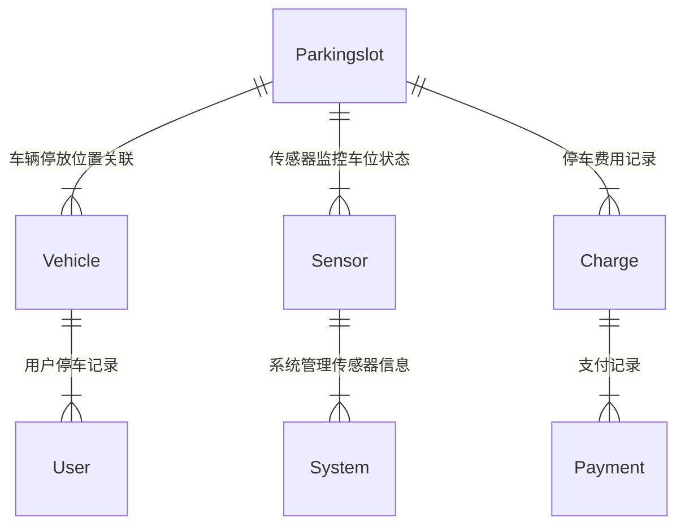

                 

### 第1章：引言

#### 1.1 问题背景

智慧停车管理是城市化进程中的一个重要课题。随着汽车数量的急剧增加，传统的停车管理模式已无法满足城市居民日益增长的停车需求。停车难问题不仅影响市民的日常生活质量，还对城市交通的流畅性和可持续发展带来挑战。

智慧停车管理通过引入物联网技术，实现对停车资源的智能化管理和高效利用。物联网（IoT）是一种通过传感器、设备和网络实现数据采集和传输的技术，它为智慧停车管理提供了技术支撑。

#### 1.2 问题描述

在智慧停车管理中，存在以下几个主要问题：

1. **车位信息不透明**：传统停车管理中，车位信息不透明，导致车主难以找到空闲车位。
2. **停车资源利用不充分**：许多车位在非高峰时段处于闲置状态，资源利用不充分。
3. **收费不透明**：停车收费过程中存在人工操作，容易产生纠纷和效率低下。
4. **数据孤岛**：不同停车场的车位信息、收费信息等数据相互独立，无法实现信息共享。

#### 1.3 问题解决

通过引入物联网技术，可以解决上述问题。具体措施包括：

1. **车辆定位**：使用GPS、RFID等定位技术，实时跟踪车辆位置。
2. **车位实时监控**：通过传感器技术，实时监测车位状态，提高车位利用率。
3. **车位预约**：通过移动应用和云端平台，实现车位预约功能，减少找车时间。
4. **智能收费**：通过无感支付和云端计费，提高停车收费的效率和透明度。

#### 1.4 边界与外延

本文将探讨物联网在智慧停车管理中的应用，包括但不限于以下技术：

- **传感器技术**：用于车辆检测、车位检测。
- **云计算**：用于大规模数据存储和计算。
- **大数据分析**：对停车数据进行分析，以提供决策支持。
- **移动通信技术**：用于数据传输和通信。

#### 1.5 概念结构与核心要素组成

- **物联网（IoT）**：指物物相连的智能网络，通过传感器、设备和网络实现数据采集和传输。
- **智慧停车管理**：结合物联网技术，对停车资源进行高效管理，包括车位管理、停车信息共享、停车费用管理等。

### 第2章：物联网技术在智慧停车管理中的核心概念与联系

在智慧停车管理中，物联网技术发挥着关键作用。本节将详细介绍物联网技术在智慧停车管理中的核心概念，包括传感器技术、云计算、大数据分析等，并对比它们的属性特征。

#### 2.1 物联网技术概述

物联网技术是智慧停车管理的基础，它通过传感器、设备和网络实现数据采集和传输。以下是物联网技术的主要组成部分：

- **传感器技术**：用于采集车辆和车位的状态信息。
- **云计算**：用于存储和处理大量数据。
- **大数据分析**：用于对停车数据进行分析，提供决策支持。

#### 2.2 核心概念属性特征对比表格

| 概念         | 描述                                                         | 特点                 | 应用场景                     |
| ------------ | ------------------------------------------------------------ | -------------------- | ---------------------------- |
| 传感器技术   | 用于车辆检测、车位检测                                       | 高精度、实时性强     | 车辆识别、车位状态监测       |
| 云计算       | 用于大规模数据存储和计算                                     | 大规模、弹性扩展     | 数据存储、计算处理、智能分析 |
| 大数据分析   | 对停车数据进行分析，以提供决策支持                           | 深度分析、智能化     | 数据挖掘、预测分析、优化决策 |

#### 2.3 ER实体关系图架构

为了更好地理解物联网技术在智慧停车管理中的应用，我们可以使用ER（实体关系）图来描述各个实体之间的关系。

在上面的ER图中，`Parkingslot`实体与`Vehicle`、`Sensor`和`Charge`实体之间存在关联。`Vehicle`实体代表停放车辆，`Sensor`实体用于监控车位状态，`Charge`实体用于记录停车费用。这些实体之间的关系为智慧停车管理提供了数据关联和交互的框架。

### 第3章：物联网在智慧停车管理中的应用原理

物联网技术在智慧停车管理中的应用，主要通过以下几个关键环节实现：车辆定位、车位实时监控、车位预约和智能收费。以下是这些环节的具体应用原理。

#### 3.1 车辆定位技术

车辆定位是智慧停车管理的重要一环，它能够帮助车主快速找到车辆。常用的车辆定位技术包括：

- **GPS（全球定位系统）**：通过卫星信号确定车辆的位置，精度高，适用于户外环境。
- **北斗卫星导航系统**：我国自主研发的卫星导航系统，与GPS类似，具有高精度定位能力。
- **RFID（射频识别）**：通过射频信号识别车辆身份，适用于短距离定位。

#### 3.2 停车位实时监控

实时监控车位状态是提高停车资源利用率的关键。常用的监控技术包括：

- **传感器技术**：使用地磁传感器、红外传感器等，实时检测车位是否被占用。
- **图像识别技术**：通过摄像头捕捉车位图像，利用图像识别算法判断车位状态。

#### 3.3 车位预约

车位预约能够有效减少车主找车位的时间，提高停车效率。实现车位预约的关键技术包括：

- **移动应用**：通过手机应用，车主可以查看附近空闲车位并进行预约。
- **云端平台**：提供车位预约数据支持和实时更新。

#### 3.4 智能收费

智能收费是智慧停车管理的重要组成部分，它能够提高收费效率和透明度。常用的智能收费技术包括：

- **无感支付**：通过车牌识别和电子支付，实现快速缴费，无需停车。
- **云端计费**：通过云计算平台，实现实时计费和账单管理。

### 第4章：物联网在智慧停车管理中的应用案例分析

物联网技术在智慧停车管理中的应用案例越来越多，以下将介绍两个具体的案例，分析其系统功能设计、架构设计和接口设计。

#### 4.1 案例一：某城市智慧停车管理系统

**项目介绍**：某城市智慧停车管理系统是一个集车辆定位、车位实时监控、车位预约和智能收费于一体的系统，旨在解决城市停车难题。

**系统功能设计**：
- **车辆定位**：通过GPS和RFID技术，实时跟踪车辆位置。
- **车位实时监控**：通过传感器技术和图像识别技术，实时监控车位状态。
- **车位预约**：通过手机应用和云端平台，实现车位预约功能。
- **智能收费**：通过无感支付和云端计费，实现快速缴费。

**系统架构设计**：
- **前端应用**：包括移动应用和网页应用，提供用户交互界面。
- **后端服务**：包括车辆定位服务、车位监控服务、车位预约服务和收费服务，负责数据处理和业务逻辑。
- **数据库**：存储车辆位置信息、车位状态信息、预约信息和收费信息。

**系统接口设计**：
- **API接口**：提供车辆定位、车位监控、车位预约和智能收费等服务的接口，供前端应用调用。
- **数据接口**：与其他系统（如支付系统、公安系统等）进行数据交换。

#### 4.2 案例二：智能停车机器人

**项目介绍**：智能停车机器人是一种能够自动泊车的设备，通过物联网技术和人工智能算法，实现自主寻找车位和泊车。

**系统功能设计**：
- **自主寻找车位**：通过摄像头和传感器，识别附近车位状态，选择最佳车位。
- **自主泊车**：通过人工智能算法，实现车辆的精准泊车。
- **车位预约**：通过云端平台，实现车位预约功能。

**系统架构设计**：
- **感知层**：包括摄像头、传感器等，用于采集车位状态和车辆位置信息。
- **决策层**：包括人工智能算法，用于分析车位状态，规划泊车路径。
- **执行层**：包括电机、转向系统等，用于实现车辆的自主泊车。

**系统接口设计**：
- **控制接口**：用于与车辆控制系统进行通信，实现自主泊车。
- **数据接口**：用于与其他系统（如云端平台、支付系统等）进行数据交换。

### 第5章：物联网在智慧停车管理中的挑战与解决方案

物联网技术在智慧停车管理中的应用虽然带来了诸多便利，但也面临着一些挑战。以下是物联网在智慧停车管理中面临的几个主要挑战以及相应的解决方案。

#### 5.1 数据安全问题

**问题描述**：智慧停车管理系统涉及大量的个人隐私数据，如车牌号码、支付信息等，这些数据的安全问题成为关注焦点。

**解决方案**：
- **数据加密**：对传输和存储的数据进行加密处理，确保数据在传输过程中不被窃取。
- **访问控制**：建立严格的访问控制机制，限制只有授权用户可以访问敏感数据。
- **安全审计**：定期进行安全审计，检测系统的安全漏洞，及时修复。

#### 5.2 网络安全问题

**问题描述**：智慧停车管理系统需要稳定的网络连接，以实现数据的实时传输和处理。然而，网络攻击和数据泄露等问题可能影响系统的正常运行。

**解决方案**：
- **防火墙和入侵检测系统**：部署防火墙和入侵检测系统，防止恶意攻击。
- **网络隔离**：将智慧停车管理系统与其他网络隔离开来，降低攻击范围。
- **安全培训**：提高员工的网络安全意识，定期进行安全培训。

#### 5.3 成本问题

**问题描述**：物联网技术在智慧停车管理中的应用需要大量的硬件设备和软件支持，这可能导致成本过高。

**解决方案**：
- **分阶段实施**：根据实际需求，分阶段进行物联网技术的引入，避免一次性投入过大。
- **开源软件和硬件**：采用开源软件和硬件，降低成本。
- **合作共赢**：与硬件供应商和软件开发商合作，共同分担成本。

### 第6章：物联网在智慧停车管理中的未来发展趋势

随着技术的不断进步，物联网在智慧停车管理中的应用前景广阔。以下是物联网在智慧停车管理中的未来发展趋势。

#### 6.1 技术趋势分析

- **5G技术**：5G技术的广泛应用将极大提升物联网设备的连接速度和数据处理能力，为智慧停车管理提供更强大的支持。
- **人工智能（AI）**：AI技术将在智慧停车管理中发挥重要作用，如智能停车机器人、自动驾驶汽车等，将提高停车效率和安全性。

#### 6.2 应用场景拓展

- **共享停车**：随着共享经济的发展，共享停车将成为趋势。通过物联网技术，实现停车资源的共享和高效利用。
- **城市智慧交通**：智慧停车管理将融入城市智慧交通体系，通过数据共享和智能分析，优化城市交通流量，提高道路通行效率。

### 第7章：总结与展望

物联网技术在智慧停车管理中的应用，极大地提升了停车管理的效率和用户体验。从车辆定位、车位实时监控到车位预约和智能收费，物联网技术为智慧停车管理提供了全面的技术支持。

在未来，随着5G和AI等新技术的不断发展，物联网在智慧停车管理中的应用将更加广泛和深入。通过共享停车和城市智慧交通的融合，物联网技术将为城市可持续发展提供新的解决方案。

让我们期待物联网技术在智慧停车管理中的更多创新和应用，为城市的智慧化进程贡献力量。

