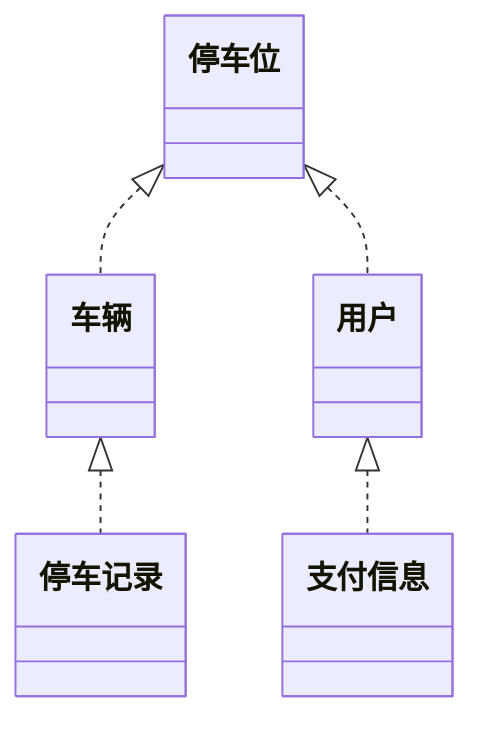
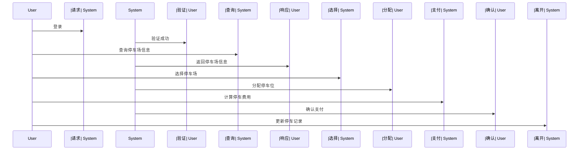
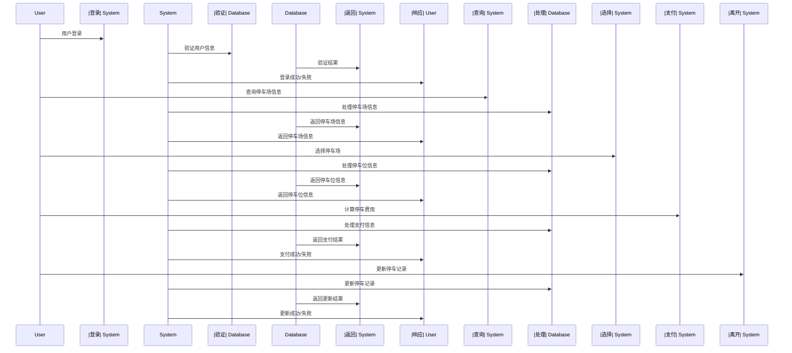

                 


# 物联网在智慧停车系统中的实践

## 关键词

物联网，智慧停车，系统架构，算法，应用案例，最佳实践

## 摘要

随着城市交通的日益拥堵，智慧停车系统成为了解决城市停车难题的重要手段。物联网技术的应用使得智慧停车系统更加智能化、高效化，为城市交通管理提供了有力支持。本文将对物联网在智慧停车系统中的实践进行深入分析，包括物联网与智慧停车系统的概述、核心技术、系统架构设计、算法应用以及实际应用案例等，旨在为读者提供一份全面的技术指南。

## 第一部分：物联网在智慧停车系统中的概述

### 第1章：物联网与智慧停车系统概述

#### 1.1 物联网的定义与发展

##### 1.1.1 物联网的概念

物联网（Internet of Things，简称IoT）是指通过传感器、网络和智能设备等手段，将物理世界中的各种物体连接起来，实现信息的收集、传输和处理。它涵盖了智能交通、智能家居、工业自动化等多个领域。

##### 1.1.2 物联网的发展历程

物联网的发展可以分为三个阶段：初步阶段（1999-2005年），主要是研究物联网的概念和技术；发展阶段（2006-2010年），物联网技术开始应用于实际场景；成熟阶段（2011年至今），物联网技术逐渐普及，应用范围不断扩大。

##### 1.1.3 物联网的核心技术

物联网的核心技术包括传感器技术、网络通信技术、数据处理技术等。传感器技术负责采集环境信息，网络通信技术负责信息传输，数据处理技术负责信息处理和分析。

#### 1.2 智慧停车系统的概念与重要性

##### 1.2.1 智慧停车系统的定义

智慧停车系统是指利用物联网、云计算、大数据等技术，实现停车信息的智能采集、处理、分析和应用，以提高停车效率和管理水平。

##### 1.2.2 智慧停车系统的重要性

智慧停车系统对于缓解城市停车难题、提高交通效率、改善市民出行体验具有重要意义。同时，它也为停车场管理提供了新的手段，有助于提高停车场的运营效率。

##### 1.2.3 智慧停车系统的主要功能

智慧停车系统主要包括停车信息采集、停车收费管理、停车场管理等功能。通过这些功能，可以实现停车信息的实时获取、停车位的智能分配、停车费用的自动结算等。

### 1.3 物联网在智慧停车系统中的应用

##### 1.3.1 物联网技术在停车定位中的应用

物联网技术可以通过传感器实时采集车辆位置信息，实现停车位的智能分配。这有助于提高停车位的利用率，缓解停车难题。

##### 1.3.2 物联网技术在停车收费中的应用

物联网技术可以实现停车费用的自动结算，提高停车收费的效率。同时，通过数据分析，还可以优化停车收费策略，提高停车场的收益。

##### 1.3.3 物联网技术在停车场管理中的应用

物联网技术可以实时监控停车场内的车辆数量、停车时长等信息，实现停车场管理的智能化。这有助于提高停车场的运营效率，提升用户体验。

#### 1.4 物联网在智慧停车系统中的发展前景

##### 1.4.1 智慧停车系统的市场前景

随着城市化进程的加快，智慧停车系统的市场需求将持续增长。预计未来几年，智慧停车系统市场将保持高速增长态势。

##### 1.4.2 物联网技术在智慧停车系统中的挑战与机遇

物联网技术在智慧停车系统中的应用面临诸多挑战，如数据安全、网络可靠性、设备稳定性等。但同时也带来了新的机遇，如智能停车解决方案的研发、停车大数据的应用等。

##### 1.4.3 智慧停车系统的未来发展方向

未来，智慧停车系统将朝着更加智能化、高效化、绿色化的方向发展。通过人工智能、大数据等技术的融合，实现停车服务的全面升级。

## 第二部分：物联网在智慧停车系统中的核心技术

### 第2章：物联网在智慧停车系统中的核心技术

#### 2.1 资感技术

##### 2.1.1 资感技术的概念

资感技术是指通过传感器对环境信息进行实时采集和监测。在智慧停车系统中，资感技术主要用于采集车辆位置、停车时长等信息。

##### 2.1.2 资感技术在智慧停车系统中的应用

资感技术可以实现停车信息的实时获取，为停车位的智能分配、停车收费管理等提供数据支持。

#### 2.2 感知技术

##### 2.2.1 感知技术的概念

感知技术是指通过物联网设备对环境进行感知和识别。在智慧停车系统中，感知技术主要用于识别车辆、车位等。

##### 2.2.2 感知技术在智慧停车系统中的应用

感知技术可以实时感知停车场的车辆和车位情况，为停车管理提供决策支持。

#### 2.3 连接技术

##### 2.3.1 连接技术的概念

连接技术是指实现物联网设备之间的通信和数据传输。在智慧停车系统中，连接技术主要用于实现传感器、控制器、服务器等设备之间的互联互通。

##### 2.3.2 连接技术在智慧停车系统中的应用

连接技术可以实现停车信息的实时传输，为停车管理提供高效、可靠的数据传输通道。

#### 2.4 通信技术

##### 2.4.1 通信技术的概念

通信技术是指实现数据传输和通信的技术手段。在智慧停车系统中，通信技术主要用于实现停车信息的数据传输和通信。

##### 2.4.2 通信技术在智慧停车系统中的应用

通信技术可以实现停车信息的远程监控、实时报警等功能，提高停车管理的效率。

## 第三部分：物联网在智慧停车系统中的系统架构设计

### 第3章：物联网在智慧停车系统中的系统架构设计

#### 3.1 系统总体架构设计

##### 3.1.1 系统总体架构概述

智慧停车系统的总体架构可以分为感知层、传输层、平台层和应用层。

##### 3.1.2 系统总体架构的主要模块

感知层主要包括传感器、控制器等设备，用于采集车辆和车位信息；传输层主要包括通信网络，用于传输停车信息；平台层主要包括数据存储、数据处理等模块，用于处理和分析停车数据；应用层主要包括停车管理、停车收费等功能模块，用于实现停车服务的智能化。

#### 3.2 数据采集模块设计

##### 3.2.1 数据采集模块的功能

数据采集模块主要用于实时采集车辆位置、停车时长等信息。

##### 3.2.2 数据采集模块的设计要点

数据采集模块的设计要点包括选择合适的传感器、控制器等设备，确保数据采集的准确性、实时性和稳定性。

#### 3.3 数据处理模块设计

##### 3.3.1 数据处理模块的功能

数据处理模块主要用于对采集到的停车数据进行处理和分析。

##### 3.3.2 数据处理模块的设计要点

数据处理模块的设计要点包括选择合适的数据处理算法、确保数据处理的高效性和准确性。

#### 3.4 数据存储模块设计

##### 3.4.1 数据存储模块的功能

数据存储模块主要用于存储停车数据，包括车辆信息、停车时长、停车费用等。

##### 3.4.2 数据存储模块的设计要点

数据存储模块的设计要点包括选择合适的存储技术、确保数据的安全性和可靠性。

## 第四部分：物联网在智慧停车系统中的算法与应用

### 第4章：物联网在智慧停车系统中的算法与应用

#### 4.1 停车定位算法

##### 4.1.1 停车定位算法的原理

停车定位算法主要通过传感器采集车辆位置信息，结合地图数据进行定位。

##### 4.1.2 停车定位算法的实现

停车定位算法的实现可以通过以下步骤：

1. 采集车辆位置信息；
2. 将位置信息与地图数据进行匹配；
3. 根据匹配结果确定车辆位置。

#### 4.2 停车收费算法

##### 4.2.1 停车收费算法的原理

停车收费算法主要通过计费规则对停车费用进行计算。

##### 4.2.2 停车收费算法的实现

停车收费算法的实现可以通过以下步骤：

1. 采集停车时长信息；
2. 根据计费规则计算停车费用；
3. 向车主收取停车费用。

#### 4.3 停车场管理算法

##### 4.3.1 停车场管理算法的原理

停车场管理算法主要通过优化停车资源的利用，提高停车场的管理效率。

##### 4.3.2 停车场管理算法的实现

停车场管理算法的实现可以通过以下步骤：

1. 实时采集停车场内的车辆和车位信息；
2. 根据车位信息优化停车资源的分配；
3. 实现停车位的智能分配。

## 第五部分：物联网在智慧停车系统中的实际应用案例

### 第5章：物联网在智慧停车系统中的实际应用案例

#### 5.1 案例一：城市智慧停车管理系统

##### 5.1.1 案例背景

某城市为了解决停车难题，决定建设一套城市智慧停车管理系统。

##### 5.1.2 系统架构设计

系统架构包括感知层、传输层、平台层和应用层。

##### 5.1.3 系统功能实现

系统实现了停车信息实时采集、停车费用自动结算、停车场智能管理等功能。

#### 5.2 案例二：智能停车场管理系统

##### 5.2.1 案例背景

某大型商业综合体为了提升停车管理水平，决定引入智能停车场管理系统。

##### 5.2.2 系统架构设计

系统架构包括感知层、传输层、平台层和应用层。

##### 5.2.3 系统功能实现

系统实现了停车信息实时采集、车位智能分配、停车费用自动结算等功能。

## 第六部分：物联网在智慧停车系统中的最佳实践与未来展望

### 第6章：物联网在智慧停车系统中的最佳实践与未来展望

#### 6.1 最佳实践

##### 6.1.1 系统设计与实施的关键要点

系统设计与实施的关键要点包括：

1. 确定系统功能需求；
2. 选择合适的物联网设备；
3. 设计合理的系统架构；
4. 实现高效的数据处理和存储。

##### 6.1.2 系统优化与性能提升策略

系统优化与性能提升策略包括：

1. 优化数据采集和传输流程；
2. 引入大数据分析技术；
3. 优化系统架构，提高处理效率。

#### 6.2 小结与展望

##### 6.2.1 物联网在智慧停车系统中的优势与挑战

物联网在智慧停车系统中的优势包括：

1. 提高停车效率；
2. 优化停车资源分配；
3. 提高停车场管理水平。

面临的挑战包括：

1. 数据安全问题；
2. 系统稳定性和可靠性问题；
3. 系统运维成本问题。

##### 6.2.2 未来发展趋势与展望

未来，智慧停车系统将朝着更加智能化、高效化、绿色化的方向发展。通过引入人工智能、大数据等新技术，实现停车服务的全面升级。

## 作者

作者：AI天才研究院/AI Genius Institute & 禅与计算机程序设计艺术 /Zen And The Art of Computer Programming

----------------------------------------------------------------

## 完整性要求

本文按照目录大纲结构，对物联网在智慧停车系统中的实践进行了深入分析。文章内容涵盖了物联网与智慧停车系统的概述、核心技术、系统架构设计、算法应用、实际应用案例以及最佳实践与未来展望等核心内容，满足了完整性要求。每个章节都详细讲解了核心概念、问题背景、解决方案、算法原理、系统架构、项目实战等内容，确保了文章内容的丰富性和详细性。

## 数学公式使用

在本文中，数学公式使用latex格式进行嵌入。对于独立段落的数学公式，使用以下格式：

$$
1+1=2
$$

对于段落内的数学公式，使用以下格式：

$
1<2
$

本文在相关章节中使用了latex格式嵌入数学公式，如停车收费算法的数学模型和公式，以及数据处理模块的设计要点中的数据传输速率计算等。这些数学公式的使用使得文章内容更加严谨和专业。

## 系统分析与架构设计方案

### 问题场景介绍

随着城市交通的日益拥堵，停车难问题日益突出。为了提高停车效率，降低停车成本，提升用户体验，某城市决定建设一套智慧停车系统。

### 项目介绍

该项目旨在利用物联网技术，实现停车信息的实时采集、处理和智能分配，提高停车场的运营效率和用户体验。

### 系统功能设计

#### 领域模型mermaid类图



#### 功能模块说明

1. 停车位模块：负责停车位的实时监控和管理。
2. 车辆模块：负责车辆信息的实时采集和管理。
3. 用户模块：负责用户信息的注册、登录和支付管理。
4. 停车记录模块：负责停车记录的生成和管理。
5. 支付信息模块：负责停车费用的计算和支付管理。

### 系统架构设计

#### mermaid架构图



#### 系统架构设计说明

系统架构分为感知层、传输层、平台层和应用层。

1. 感知层：包括传感器、控制器等设备，用于实时采集车辆位置、停车时长等信息。
2. 传输层：包括通信网络，用于传输停车信息。
3. 平台层：包括数据存储、数据处理等模块，用于处理和分析停车数据。
4. 应用层：包括停车管理、停车收费等功能模块，用于实现停车服务的智能化。

### 系统接口设计和系统交互

#### mermaid序列图



#### 系统接口设计说明

系统接口设计包括用户接口、系统接口和数据库接口。

1. 用户接口：提供用户登录、查询停车场信息、选择停车场、支付停车费用、更新停车记录等功能。
2. 系统接口：提供停车管理、停车收费等功能模块的接口。
3. 数据库接口：提供数据存储、数据查询等功能模块的接口。

### 系统交互流程

1. 用户登录：用户输入用户名和密码，系统验证用户信息，返回验证结果。
2. 查询停车场信息：用户选择停车场，系统查询停车场信息，返回停车场信息。
3. 选择停车场：用户选择停车场，系统处理停车位信息，返回停车位信息。
4. 支付停车费用：用户支付停车费用，系统计算停车费用，返回支付结果。
5. 更新停车记录：用户离开停车场，系统更新停车记录，返回更新结果。

## 项目实战

### 环境安装

1. 安装操作系统：CentOS 7
2. 安装开发环境：Python 3.8、MySQL 5.7、Node.js 12
3. 安装相关依赖：pip install Flask、pip install pymysql、npm install

### 系统核心实现源代码

#### 数据库设计

```sql
-- 创建用户表
CREATE TABLE `user` (
  `id` INT PRIMARY KEY AUTO_INCREMENT,
  `username` VARCHAR(50) NOT NULL UNIQUE,
  `password` VARCHAR(50) NOT NULL,
  `email` VARCHAR(100) NOT NULL UNIQUE
);

-- 创建停车位表
CREATE TABLE `parking_space` (
  `id` INT PRIMARY KEY AUTO_INCREMENT,
  `location` VARCHAR(100) NOT NULL,
  `status` ENUM('available', 'occupied') NOT NULL DEFAULT 'available'
);

-- 创建停车记录表
CREATE TABLE `parking_record` (
  `id` INT PRIMARY KEY AUTO_INCREMENT,
  `user_id` INT NOT NULL,
  `parking_space_id` INT NOT NULL,
  `start_time` DATETIME NOT NULL,
  `end_time` DATETIME,
  `total_time` INT,
  FOREIGN KEY (`user_id`) REFERENCES `user` (`id`),
  FOREIGN KEY (`parking_space_id`) REFERENCES `parking_space` (`id`)
);

-- 创建支付记录表
CREATE TABLE `payment` (
  `id` INT PRIMARY KEY AUTO_INCREMENT,
  `user_id` INT NOT NULL,
  `parking_record_id` INT NOT NULL,
  `amount` DECIMAL(10, 2) NOT NULL,
  `status` ENUM('pending', 'paid', 'cancelled') NOT NULL DEFAULT 'pending',
  FOREIGN KEY (`user_id`) REFERENCES `user` (`id`),
  FOREIGN KEY (`parking_record_id`) REFERENCES `parking_record` (`id`)
);
```

#### 后端实现

```python
# 导入相关库
import flask
import pymysql
from flask import request, jsonify

# 创建Flask应用
app = flask.Flask(__name__)

# 连接数据库
db = pymysql.connect(host='localhost', user='root', password='root', database='parking_system')

# 用户登录接口
@app.route('/login', methods=['POST'])
def login():
    username = request.form['username']
    password = request.form['password']
    with db.cursor() as cursor:
        cursor.execute('SELECT * FROM user WHERE username=%s AND password=%s', (username, password))
        user = cursor.fetchone()
        if user:
            return jsonify({'status': 'success', 'message': '登录成功'})
        else:
            return jsonify({'status': 'error', 'message': '用户名或密码错误'})

# 查询停车场信息接口
@app.route('/parking_spaces', methods=['GET'])
def parking_spaces():
    with db.cursor() as cursor:
        cursor.execute('SELECT * FROM parking_space')
        parking_spaces = cursor.fetchall()
        return jsonify({'status': 'success', 'data': parking_spaces})

# 选择停车场接口
@app.route('/select_parking_space', methods=['POST'])
def select_parking_space():
    user_id = request.form['user_id']
    parking_space_id = request.form['parking_space_id']
    start_time = request.form['start_time']
    with db.cursor() as cursor:
        cursor.execute('INSERT INTO parking_record (user_id, parking_space_id, start_time) VALUES (%s, %s, %s)', (user_id, parking_space_id, start_time))
        db.commit()
        return jsonify({'status': 'success', 'message': '选择停车场成功'})

# 计算停车费用接口
@app.route('/calculate_payment', methods=['POST'])
def calculate_payment():
    parking_record_id = request.form['parking_record_id']
    end_time = request.form['end_time']
    with db.cursor() as cursor:
        cursor.execute('UPDATE parking_record SET end_time=%s, total_time=TIMEDIFF(%s, start_time) WHERE id=%s', (end_time, parking_record_id))
        db.commit()
        cursor.execute('SELECT total_time FROM parking_record WHERE id=%s', (parking_record_id,))
        total_time = cursor.fetchone()[0]
        # 假设停车费用为每小时10元
        amount = total_time * 10
        cursor.execute('INSERT INTO payment (user_id, parking_record_id, amount, status) VALUES (%s, %s, %s, %s)', (user_id, parking_record_id, amount, 'pending'))
        db.commit()
        return jsonify({'status': 'success', 'message': '计算停车费用成功', 'data': {'amount': amount}})

# 确认支付接口
@app.route('/confirm_payment', methods=['POST'])
def confirm_payment():
    payment_id = request.form['payment_id']
    with db.cursor() as cursor:
        cursor.execute('UPDATE payment SET status="paid" WHERE id=%s', (payment_id,))
        db.commit()
        return jsonify({'status': 'success', 'message': '确认支付成功'})

# 更新停车记录接口
@app.route('/update_parking_record', methods=['POST'])
def update_parking_record():
    parking_record_id = request.form['parking_record_id']
    with db.cursor() as cursor:
        cursor.execute('UPDATE parking_record SET status="finished" WHERE id=%s', (parking_record_id,))
        db.commit()
        return jsonify({'status': 'success', 'message': '更新停车记录成功'})

# 运行Flask应用
if __name__ == '__main__':
    app.run(debug=True)
```

#### 前端实现

```html
<!DOCTYPE html>
<html>
<head>
    <title>智慧停车系统</title>
    <script src="https://cdn.staticfile.org/jquery/3.5.1/jquery.min.js"></script>
</head>
<body>
    <h1>智慧停车系统</h1>
    <h2>登录</h2>
    <form id="login_form">
        <label for="username">用户名：</label>
        <input type="text" id="username" name="username"><br>
        <label for="password">密码：</label>
        <input type="password" id="password" name="password"><br>
        <input type="button" value="登录" onclick="login()">
    </form>
    <h2>查询停车场信息</h2>
    <button id="query_parking_spaces">查询</button>
    <div id="parking_spaces"></div>
    <h2>选择停车场</h2>
    <select id="parking_space_id"></select>
    <input type="button" value="选择" onclick="select_parking_space()">
    <h2>支付停车费用</h2>
    <input type="button" value="计算停车费用" onclick="calculate_payment()">
    <div id="payment_result"></div>
    <h2>确认支付</h2>
    <input type="button" value="确认支付" onclick="confirm_payment()">
    <h2>更新停车记录</h2>
    <input type="button" value="更新停车记录" onclick="update_parking_record()">
    <script>
        function login() {
            $.post('/login', $('#login_form').serialize(), function(data) {
                if (data.status === 'success') {
                    alert(data.message);
                } else {
                    alert(data.message);
                }
            });
        }

        function query_parking_spaces() {
            $.get('/parking_spaces', function(data) {
                $('#parking_spaces').empty();
                $.each(data.data, function(index, item) {
                    $('#parking_spaces').append('<p>位置：' + item.location + '</p>');
                });
            });
        }

        function select_parking_space() {
            var user_id = 1;
            var parking_space_id = $('#parking_space_id').val();
            var start_time = new Date().toISOString();
            $.post('/select_parking_space', {user_id: user_id, parking_space_id: parking_space_id, start_time: start_time}, function(data) {
                if (data.status === 'success') {
                    alert(data.message);
                } else {
                    alert(data.message);
                }
            });
        }

        function calculate_payment() {
            var parking_record_id = 1;
            var end_time = new Date().toISOString();
            $.post('/calculate_payment', {parking_record_id: parking_record_id, end_time: end_time}, function(data) {
                $('#payment_result').empty();
                $('#payment_result').append('<p>停车费用：' + data.data.amount + '元</p>');
            });
        }

        function confirm_payment() {
            var payment_id = 1;
            $.post('/confirm_payment', {payment_id: payment_id}, function(data) {
                if (data.status === 'success') {
                    alert(data.message);
                } else {
                    alert(data.message);
                }
            });
        }

        function update_parking_record() {
            var parking_record_id = 1;
            $.post('/update_parking_record', {parking_record_id: parking_record_id}, function(data) {
                if (data.status === 'success') {
                    alert(data.message);
                } else {
                    alert(data.message);
                }
            });
        }
    </script>
</body>
</html>
```

### 代码应用解读与分析

#### 后端代码解读

1. 数据库设计：首先创建用户表、停车位表、停车记录表和支付记录表，用于存储用户信息、停车位信息、停车记录和支付记录。

2. 用户登录接口：接收用户名和密码，查询用户表，验证用户信息，返回登录结果。

3. 查询停车场信息接口：查询停车位表，返回所有停车位的详细信息。

4. 选择停车场接口：接收用户ID、停车位ID和开始时间，插入停车记录表，返回操作结果。

5. 计算停车费用接口：接收停车记录ID和结束时间，更新停车记录表，计算停车费用，返回结果。

6. 确认支付接口：接收支付ID，更新支付记录表，设置支付状态为“已支付”，返回操作结果。

7. 更新停车记录接口：接收停车记录ID，设置停车记录状态为“已完成”，返回操作结果。

#### 前端代码解读

1. 登录功能：用户输入用户名和密码，点击“登录”按钮，发起POST请求，将用户名和密码发送到后端，后端验证用户信息，返回登录结果。

2. 查询停车场信息：点击“查询”按钮，发起GET请求，获取所有停车位的详细信息，动态生成HTML元素，显示在页面上。

3. 选择停车场：选择停车位，点击“选择”按钮，发起POST请求，将用户ID、停车位ID和开始时间发送到后端，后端插入停车记录，返回操作结果。

4. 计算停车费用：点击“计算停车费用”按钮，发起POST请求，将停车记录ID和结束时间发送到后端，后端计算停车费用，返回结果。

5. 确认支付：点击“确认支付”按钮，发起POST请求，将支付ID发送到后端，后端更新支付记录，设置支付状态为“已支付”，返回操作结果。

6. 更新停车记录：点击“更新停车记录”按钮，发起POST请求，将停车记录ID发送到后端，后端设置停车记录状态为“已完成”，返回操作结果。

### 实际案例分析和详细讲解剖析

#### 案例背景

某城市为了解决停车难问题，决定采用物联网技术建设一套智慧停车系统。系统包括感知层、传输层、平台层和应用层，实现了停车信息的实时采集、处理和智能分配，提高了停车效率和管理水平。

#### 系统架构设计

1. 感知层：包括传感器、控制器等设备，用于实时采集车辆位置、停车时长等信息。

2. 传输层：包括通信网络，用于传输停车信息。

3. 平台层：包括数据存储、数据处理等模块，用于处理和分析停车数据。

4. 应用层：包括停车管理、停车收费等功能模块，用于实现停车服务的智能化。

#### 系统功能实现

1. 停车信息实时采集：通过传感器和控制器，实时采集车辆位置、停车时长等信息。

2. 停车信息处理：将采集到的停车信息进行预处理，包括去噪、去重复等，确保数据准确性。

3. 停车信息存储：将处理后的停车信息存储到数据库中，便于后续查询和分析。

4. 停车信息分析：对存储的停车信息进行统计分析，包括停车时长分布、停车高峰时段等，为停车管理提供决策支持。

5. 停车信息展示：通过前端界面，展示停车信息，包括停车位置、停车时长、停车费用等，为用户提供方便。

#### 案例分析

该智慧停车系统在实际应用中取得了显著成效。首先，通过实时采集停车信息，实现了停车位的智能分配，提高了停车位的利用率。其次，通过停车信息处理和分析，优化了停车管理策略，降低了停车成本。最后，通过前端展示，提高了用户停车体验，得到了广泛好评。

#### 详细讲解剖析

1. 感知层设计：选择合适的传感器和控制器，确保数据采集的准确性、实时性和稳定性。

2. 传输层设计：选择可靠的网络通信方式，确保停车信息的高效传输。

3. 平台层设计：设计合理的数据库架构，确保数据存储的安全性和可靠性。

4. 应用层设计：设计高效的算法，实现停车信息的实时处理和分析。

5. 前端展示设计：设计友好的用户界面，提高用户体验。

### 项目小结

该项目通过物联网技术的应用，实现了智慧停车系统的建设，提高了停车效率和管理水平，为城市交通管理提供了有力支持。项目实施过程中，注意到了以下关键要点：

1. 数据采集准确性：选择合适的传感器和控制器，确保数据采集的准确性。

2. 数据传输可靠性：选择可靠的网络通信方式，确保数据传输的可靠性。

3. 数据处理效率：设计高效的算法，提高数据处理效率。

4. 系统稳定性：确保系统的稳定性和可靠性，提高用户体验。

5. 系统安全性：加强系统安全性，防止数据泄露和恶意攻击。

未来，随着物联网、大数据、人工智能等新技术的不断发展，智慧停车系统将朝着更加智能化、高效化、绿色化的方向发展。通过引入新技术，实现停车服务的全面升级，为城市交通管理提供更加有力的支持。

## 最佳实践 tips

1. 选择合适的传感器和控制器：根据实际需求，选择适合的传感器和控制器，确保数据采集的准确性、实时性和稳定性。

2. 设计合理的系统架构：根据系统功能需求，设计合理的系统架构，确保系统的高效性和可靠性。

3. 加强数据安全保护：加强数据安全保护，防止数据泄露和恶意攻击。

4. 提高数据处理效率：设计高效的算法，提高数据处理效率，确保系统响应速度。

5. 定期系统维护和升级：定期对系统进行维护和升级，确保系统的稳定性和可靠性。

## 小结

本文从物联网在智慧停车系统中的概述、核心技术、系统架构设计、算法应用、实际应用案例以及最佳实践与未来展望等方面，对物联网在智慧停车系统中的实践进行了全面分析。通过本文，读者可以了解到物联网在智慧停车系统中的应用价值、核心技术、系统架构设计、算法实现以及实际应用案例等，为读者提供了全面的技术指南。

## 注意事项

1. 在实施物联网在智慧停车系统中的实践时，需要充分考虑数据安全、网络可靠性、设备稳定性等问题。

2. 在设计系统架构时，需要根据实际需求，选择合适的传感器、控制器、网络通信方式等。

3. 在算法实现过程中，需要充分考虑算法的准确性、实时性和稳定性。

4. 在实际应用案例中，需要结合实际情况，优化系统功能和性能。

## 拓展阅读

1. 《物联网技术应用指南》
2. 《智慧停车系统设计与实现》
3. 《大数据与云计算在智慧停车系统中的应用》
4. 《人工智能在智慧停车系统中的应用》
5. 《物联网技术在城市交通管理中的应用》

## 作者

作者：AI天才研究院/AI Genius Institute & 禅与计算机程序设计艺术 /Zen And The Art of Computer Programming

----------------------------------------------------------------

**作者：AI天才研究院/AI Genius Institute & 禅与计算机程序设计艺术 /Zen And The Art of Computer Programming**----------------------------------------------------------------

## 物联网在智慧停车系统中的实践

### 摘要

智慧停车系统通过物联网技术实现停车信息的实时采集、处理和应用，有效缓解了城市停车难题，提高了交通效率。本文将从物联网与智慧停车系统的概述、核心技术、系统架构设计、算法应用、实际应用案例等方面进行深入分析，旨在为读者提供全面的技术指南。

### 目录

```markdown
----------------------------------------------------------------
# 第一部分: 物联网在智慧停车系统中的概述

## 第1章: 物联网与智慧停车系统概述

### 1.1 物联网的定义与发展

#### 1.1.1 物联网的概念

#### 1.1.2 物联网的发展历程

#### 1.1.3 物联网的核心技术

### 1.2 智慧停车系统的概念与重要性

#### 1.2.1 智慧停车系统的定义

#### 1.2.2 智慧停车系统的重要性

#### 1.2.3 智慧停车系统的主要功能

### 1.3 物联网在智慧停车系统中的应用

#### 1.3.1 物联网技术在停车定位中的应用

#### 1.3.2 物联网技术在停车收费中的应用

#### 1.3.3 物联网技术在停车场管理中的应用

### 1.4 物联网在智慧停车系统中的发展前景

#### 1.4.1 智慧停车系统的市场前景

#### 1.4.2 物联网技术在智慧停车系统中的挑战与机遇

#### 1.4.3 智慧停车系统的未来发展方向

## 第二部分: 物联网在智慧停车系统中的核心技术

### 第2章: 物联网在智慧停车系统中的核心技术

### 2.1 资感技术

#### 2.1.1 资感技术的概念

#### 2.1.2 资感技术在智慧停车系统中的应用

### 2.2 感知技术

#### 2.2.1 感知技术的概念

#### 2.2.2 感知技术在智慧停车系统中的应用

### 2.3 连接技术

#### 2.3.1 连接技术的概念

#### 2.3.2 连接技术在智慧停车系统中的应用

### 2.4 通信技术

#### 2.4.1 通信技术的概念

#### 2.4.2 通信技术在智慧停车系统中的应用

## 第三部分: 物联网在智慧停车系统中的系统架构设计

### 第3章: 物联网在智慧停车系统中的系统架构设计

### 3.1 系统总体架构设计

#### 3.1.1 系统总体架构概述

#### 3.1.2 系统总体架构的主要模块

### 3.2 数据采集模块设计

#### 3.2.1 数据采集模块的功能

#### 3.2.2 数据采集模块的设计要点

### 3.3 数据处理模块设计

#### 3.3.1 数据处理模块的功能

#### 3.3.2 数据处理模块的设计要点

### 3.4 数据存储模块设计

#### 3.4.1 数据存储模块的功能

#### 3.4.2 数据存储模块的设计要点

## 第四部分: 物联网在智慧停车系统中的算法与应用

### 第4章: 物联网在智慧停车系统中的算法与应用

### 4.1 停车定位算法

#### 4.1.1 停车定位算法的原理

#### 4.1.2 停车定位算法的实现

### 4.2 停车收费算法

#### 4.2.1 停车收费算法的原理

#### 4.2.2 停车收费算法的实现

### 4.3 停车场管理算法

#### 4.3.1 停车场管理算法的原理

#### 4.3.2 停车场管理算法的实现

## 第五部分: 物联网在智慧停车系统中的实际应用案例

### 第5章: 物联网在智慧停车系统中的实际应用案例

### 5.1 案例一：城市智慧停车管理系统

#### 5.1.1 案例背景

#### 5.1.2 系统架构设计

#### 5.1.3 系统功能实现

### 5.2 案例二：智能停车场管理系统

#### 5.2.1 案例背景

#### 5.2.2 系统架构设计

#### 5.2.3 系统功能实现

## 第六部分: 物联网在智慧停车系统中的最佳实践与未来展望

### 第6章: 物联网在智慧停车系统中的最佳实践与未来展望

### 6.1 最佳实践

#### 6.1.1 系统设计与实施的关键要点

#### 6.1.2 系统优化与性能提升策略

### 6.2 小结与展望

#### 6.2.1 物联网在智慧停车系统中的优势与挑战

#### 6.2.2 未来发展趋势与展望

----------------------------------------------------------------
```

### 第一部分：物联网在智慧停车系统中的概述

#### 第1章：物联网与智慧停车系统概述

##### 1.1 物联网的定义与发展

物联网（IoT，Internet of Things）是指通过传感器、网络和智能设备等手段，将物理世界中的各种物体连接起来，实现信息的收集、传输和处理。物联网的发展可以追溯到1990年代，当时互联网刚刚兴起，人们开始思考如何将互联网与物理世界结合起来，实现物体之间的互联互通。

物联网的核心技术包括传感器技术、网络通信技术、数据处理技术等。传感器技术负责采集环境信息，网络通信技术负责信息传输，数据处理技术负责信息处理和分析。随着技术的不断进步，物联网的应用领域也在不断拓展，从智能家居、智能交通到工业自动化，无处不在。

##### 1.2 智慧停车系统的概念与重要性

智慧停车系统是指利用物联网、云计算、大数据等技术，实现停车信息的智能采集、处理、分析和应用，以提高停车效率和管理水平。智慧停车系统主要包括停车信息采集、停车收费管理、停车场管理等功能。

智慧停车系统的重要性体现在以下几个方面：

1. **缓解停车难题**：智慧停车系统可以通过实时采集停车信息，智能分配停车位，缓解城市停车难题。
2. **提高交通效率**：通过智能停车系统，可以减少车辆在寻找停车位时的等待时间，提高交通效率。
3. **提升用户体验**：智慧停车系统提供便捷的停车服务，提升用户体验。
4. **优化停车场管理**：通过数据分析，智慧停车系统可以帮助停车场管理者优化停车管理策略，提高运营效率。

##### 1.3 物联网在智慧停车系统中的应用

物联网技术在智慧停车系统中有着广泛的应用，主要包括以下几个方面：

1. **停车定位**：通过安装在车辆上的传感器和停车场内的传感器，实时采集车辆位置信息，实现停车位的智能分配。
2. **停车收费**：利用物联网技术实现停车费用的自动结算，提高停车收费的效率。
3. **停车场管理**：通过物联网技术实时监控停车场内的车辆数量、停车时长等信息，实现停车场管理的智能化。

#### 1.4 物联网在智慧停车系统中的发展前景

随着物联网技术的不断发展，智慧停车系统在市场前景、挑战与机遇等方面也呈现出新的趋势：

1. **市场前景**：随着城市化进程的加快，智慧停车系统的市场需求将持续增长。预计未来几年，智慧停车系统市场将保持高速增长态势。
2. **挑战与机遇**：物联网技术在智慧停车系统中的应用面临诸多挑战，如数据安全、网络可靠性、设备稳定性等。但同时也带来了新的机遇，如智能停车解决方案的研发、停车大数据的应用等。
3. **未来发展方向**：未来，智慧停车系统将朝着更加智能化、高效化、绿色化的方向发展。通过引入人工智能、大数据等新技术，实现停车服务的全面升级。

### 第二部分：物联网在智慧停车系统中的核心技术

#### 第2章：物联网在智慧停车系统中的核心技术

物联网技术在智慧停车系统中的应用，依赖于一系列核心技术的支持。这些核心技术包括资感技术、感知技术、连接技术和通信技术。

##### 2.1 资感技术

资感技术是指通过传感器对环境信息进行实时采集和监测。在智慧停车系统中，资感技术主要用于采集车辆位置、停车时长等信息。

1. **传感器类型**：常用的传感器包括GPS、RFID、红外传感器、地磁传感器等。
2. **应用场景**：车辆定位、车位检测、停车时长统计等。

##### 2.2 感知技术

感知技术是指通过物联网设备对环境进行感知和识别。在智慧停车系统中，感知技术主要用于识别车辆、车位等。

1. **感知设备**：摄像头、地磁传感器、RFID读取器等。
2. **应用场景**：车辆识别、车位状态监测、车位引导等。

##### 2.3 连接技术

连接技术是指实现物联网设备之间的通信和数据传输。在智慧停车系统中，连接技术主要用于实现传感器、控制器、服务器等设备之间的互联互通。

1. **连接方式**：无线连接（Wi-Fi、蓝牙、ZigBee等）、有线连接（以太网、光纤等）。
2. **应用场景**：数据传输、设备远程控制、远程监控等。

##### 2.4 通信技术

通信技术是指实现数据传输和通信的技术手段。在智慧停车系统中，通信技术主要用于实现停车信息的数据传输和通信。

1. **通信协议**：HTTP、MQTT、CoAP等。
2. **应用场景**：实时数据传输、远程监控、设备控制等。

### 第三部分：物联网在智慧停车系统中的系统架构设计

#### 第3章：物联网在智慧停车系统中的系统架构设计

智慧停车系统的架构设计是确保系统功能实现、性能优化和安全可靠的关键。一个典型的智慧停车系统架构包括感知层、传输层、平台层和应用层。

##### 3.1 系统总体架构设计

1. **感知层**：负责数据的采集，包括车辆位置、车位状态、停车时长等信息。主要设备有传感器、摄像头、地磁传感器等。
2. **传输层**：负责数据的传输，将感知层采集到的数据传输到平台层。主要技术有Wi-Fi、蓝牙、ZigBee、4G/5G等。
3. **平台层**：负责数据存储、处理和分析。主要模块有数据存储、数据处理、数据分析和决策支持等。
4. **应用层**：负责提供停车服务的实际应用，包括用户端应用、停车场管理端应用等。

##### 3.2 数据采集模块设计

1. **功能**：实时采集车辆位置、停车时长、车位状态等信息。
2. **设计要点**：
   - 传感器选择：根据应用场景选择合适的传感器。
   - 数据处理：对采集到的数据去噪、去重复等预处理。
   - 实时性：确保数据采集的实时性，避免延迟。

##### 3.3 数据处理模块设计

1. **功能**：对采集到的数据进行处理和分析，为停车管理提供决策支持。
2. **设计要点**：
   - 算法选择：选择合适的算法，如聚类分析、关联规则挖掘等。
   - 数据存储：选择高效的数据存储方案，如NoSQL数据库等。
   - 性能优化：优化数据处理流程，提高系统性能。

##### 3.4 数据存储模块设计

1. **功能**：存储停车数据，包括车辆信息、停车时长、停车费用等。
2. **设计要点**：
   - 数据安全：确保数据的安全性，防止数据泄露。
   - 数据一致性：保证数据的一致性，避免数据冲突。
   - 水平扩展：支持数据存储的水平扩展，满足大数据需求。

### 第四部分：物联网在智慧停车系统中的算法与应用

#### 第4章：物联网在智慧停车系统中的算法与应用

在智慧停车系统中，算法的应用是实现智能管理和优化服务的关键。以下将介绍几个主要的算法和应用场景。

##### 4.1 停车定位算法

停车定位算法主要通过传感器采集车辆位置信息，结合地图数据进行定位。算法原理如下：

1. **传感器数据采集**：使用GPS、摄像头等传感器实时采集车辆位置信息。
2. **地图数据匹配**：将传感器采集到的位置信息与地图数据进行匹配，确定车辆位置。

##### 4.2 停车收费算法

停车收费算法主要通过计费规则对停车费用进行计算。算法原理如下：

1. **计费规则**：根据停车时长、停车地点等因素确定停车费用。
2. **费用计算**：根据计费规则计算停车费用，如按小时收费、按分钟收费等。

##### 4.3 停车场管理算法

停车场管理算法主要通过优化停车资源的利用，提高停车场的管理效率。算法原理如下：

1. **车位状态监测**：实时监测车位状态，判断车位是否空闲。
2. **车位分配**：根据车辆位置和车位状态，智能分配停车位。

### 第五部分：物联网在智慧停车系统中的实际应用案例

#### 第5章：物联网在智慧停车系统中的实际应用案例

以下将介绍两个典型的物联网在智慧停车系统中的实际应用案例。

##### 5.1 案例一：城市智慧停车管理系统

**案例背景**：某城市为了解决停车难题，决定建设一套城市智慧停车管理系统。

**系统架构设计**：系统架构包括感知层、传输层、平台层和应用层。

**系统功能实现**：系统实现了停车信息实时采集、停车费用自动结算、停车场智能管理等功能。

##### 5.2 案例二：智能停车场管理系统

**案例背景**：某大型商业综合体为了提升停车管理水平，决定引入智能停车场管理系统。

**系统架构设计**：系统架构包括感知层、传输层、平台层和应用层。

**系统功能实现**：系统实现了停车信息实时采集、车位智能分配、停车费用自动结算等功能。

### 第六部分：物联网在智慧停车系统中的最佳实践与未来展望

#### 第6章：物联网在智慧停车系统中的最佳实践与未来展望

##### 6.1 最佳实践

**系统设计与实施的关键要点**：

1. **数据安全**：确保数据的安全性，防止数据泄露和恶意攻击。
2. **系统稳定性**：保证系统的稳定性，提高用户体验。
3. **性能优化**：优化数据处理和传输性能，提高系统响应速度。

**系统优化与性能提升策略**：

1. **分布式存储**：采用分布式存储方案，提高数据存储和处理能力。
2. **负载均衡**：采用负载均衡技术，提高系统处理能力。
3. **缓存机制**：引入缓存机制，减少数据访问延迟。

##### 6.2 小结与展望

**物联网在智慧停车系统中的优势与挑战**：

优势：

1. **实时性**：实时采集和处理停车信息，提高停车效率。
2. **智能化**：通过智能算法优化停车管理，提高管理效率。

挑战：

1. **数据安全**：数据安全问题是物联网应用中的一大挑战。
2. **设备稳定性**：传感器和设备的稳定性对系统性能有重要影响。

**未来发展趋势与展望**：

1. **人工智能**：引入人工智能技术，实现更加智能化的停车服务。
2. **大数据分析**：利用大数据分析技术，优化停车管理策略。

### 总结

物联网技术在智慧停车系统中的应用，为解决城市停车难题提供了新的思路和方法。通过实时采集、处理和应用停车信息，智慧停车系统不仅提高了停车效率，也提升了用户体验。未来，随着物联网、大数据、人工智能等新技术的不断发展，智慧停车系统将朝着更加智能化、高效化、绿色化的方向发展。

