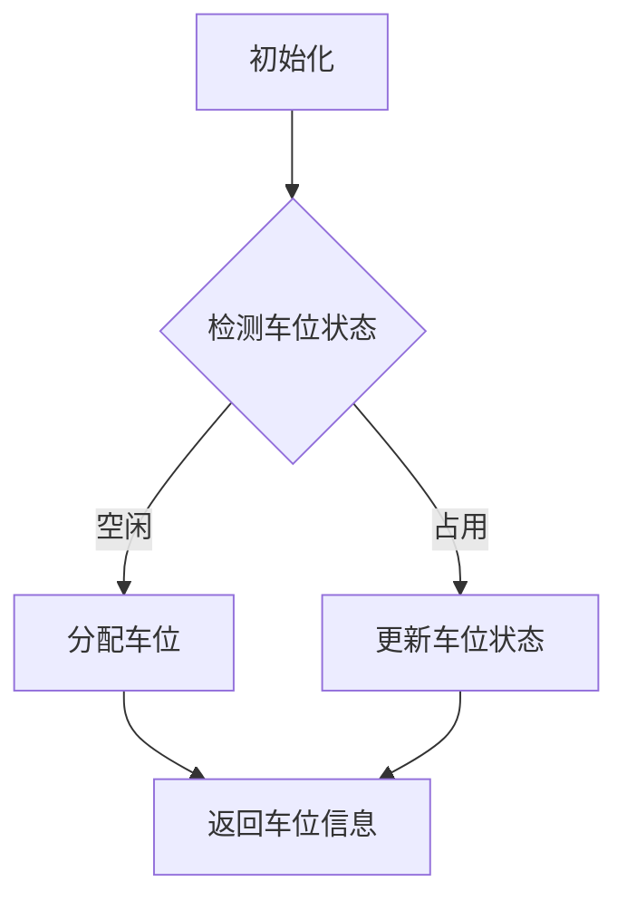

                 

# 物联网在智慧停车系统中的应用

> 关键词：物联网，智慧停车系统，传感器，数据处理，智能算法，停车管理

> 摘要：本文将探讨物联网在智慧停车系统中的应用，通过分析物联网技术的核心原理、智慧停车系统的基本构成以及两者结合的优势，详细阐述物联网技术在停车管理中的实际应用案例，为读者提供对这一领域的深入理解和思考。

## 1. 背景介绍

### 1.1 核心概念术语说明

- **物联网（IoT）**：物联网是指通过传感器、网络和数据处理技术，将各种物理设备连接起来，实现信息交换和智能控制的技术体系。
- **智慧停车系统**：智慧停车系统是一种利用物联网、大数据和人工智能技术对停车资源进行智能管理和服务的系统。

### 1.2 问题背景

随着城市交通的快速发展，停车难问题日益严重，传统停车管理模式已经难以满足日益增长的停车需求。为了提高停车效率，降低管理成本，提升用户体验，智慧停车系统的应用显得尤为重要。

### 1.3 问题描述

智慧停车系统的核心问题是如何通过物联网技术实现停车资源的实时监控、智能调度和管理，从而提升停车效率，减少车主的停车时间，降低管理成本。

### 1.4 问题解决

物联网技术可以通过传感器实时获取停车场的实时数据，结合智能算法进行数据分析，为停车管理提供决策支持。智慧停车系统则通过这些数据实现停车场的智能管理，提高停车效率。

### 1.5 边界与外延

- **边界**：智慧停车系统的应用范围包括公共停车场、商业停车场、住宅小区停车场等。
- **外延**：物联网技术在智慧停车系统中的应用不仅局限于停车管理，还可以延伸到智能交通、城市管理等其他领域。

### 1.6 概念结构与核心要素组成

智慧停车系统的概念结构主要包括以下几个方面：

- **传感器网络**：用于实时采集停车场的各种数据。
- **数据处理中心**：对传感器数据进行处理和分析，提供决策支持。
- **智能控制系统**：根据数据分析结果进行停车场的智能调度和管理。
- **用户终端**：为用户提供停车信息查询、预订、支付等服务。

## 2. 核心概念与联系

### 2.1 物联网技术原理

物联网技术基于传感器网络、网络通信和数据处理技术，通过将物理设备与互联网相连，实现设备间的信息交换和智能控制。

### 2.2 物联网技术在智慧停车系统中的应用

物联网技术在智慧停车系统中的应用主要体现在以下几个方面：

- **实时数据采集**：通过传感器网络实时获取停车场的车位占用情况、车辆进出信息等数据。
- **数据传输**：将传感器数据传输到数据处理中心，进行进一步分析和处理。
- **智能决策**：根据数据分析结果，为停车管理提供智能决策支持。

### 2.3 概念属性特征对比表格

| 概念       | 属性特征                | 对比分析               |
|------------|------------------------|------------------------|
| 物联网     | 传感器网络、数据传输、数据处理 | 跨领域应用、设备互联、智能控制 |
| 智慧停车系统 | 数据采集、数据分析、智能调度 | 提高停车效率、降低成本、提升用户体验 |

### 2.4 ER实体关系图

```mermaid
erDiagram
    学生 ||--o { 课程 } : 学习
    学生 ||--o { 教室 } : 上课
    教师 ||--o { 课程 } : 教授
    教师 ||--o { 教室 } : 上课
    课程 ||--|{ 学生 } : 学生选课
    课程 ||--|{ 教师 } : 教师授课
    教室 ||--|{ 课程 } : 课堂
```

## 3. 算法原理讲解

### 3.1 算法流程图



### 3.2 算法原理

智慧停车系统中的核心算法包括车位状态检测、车位分配和车位状态更新。以下是这些算法的详细原理：

- **车位状态检测**：通过传感器网络实时监测车位是否空闲。
- **车位分配**：根据车位状态检测结果，将空闲车位分配给需要停车的车辆。
- **车位状态更新**：将车位分配结果反馈给数据处理中心，更新车位状态。

### 3.3 数学模型

- **车位状态检测**：
  $$ 
  \text{空闲概率} = p_0 
  $$
  $$ 
  \text{占用概率} = 1 - p_0 
  $$
- **车位分配**：
  $$ 
  \text{空闲车位数量} = n_0 
  $$
  $$ 
  \text{总车位数量} = n 
  $$
  $$ 
  \text{车位分配概率} = \frac{n_0}{n} 
  $$

### 3.4 举例说明

假设一个停车场共有100个车位，其中60个车位是空闲的。当一辆车进入停车场时，系统会根据空闲车位数量和总车位数量计算车位分配概率，并将空闲车位分配给这辆车。

## 4. 数学模型和数学公式讲解

### 4.1 数学公式

- **车位占用率**：
  $$
  \text{车位占用率} = \frac{\text{占用车位数量}}{\text{总车位数量}}
  $$

- **车位利用效率**：
  $$
  \text{车位利用效率} = \frac{\text{实际使用车位数量}}{\text{总车位数量}}
  $$

### 4.2 解释

- **车位占用率**表示停车场中占用车位的比例，反映了停车场的使用情况。
- **车位利用效率**表示停车场中实际使用车位的比例，反映了停车场的使用效率。

## 5. 系统分析与架构设计方案

### 5.1 问题场景介绍

假设我们有一个大型商业停车场，共有500个停车位，每天有大量车辆进出。为了提高停车效率，降低管理成本，我们决定使用物联网技术构建一个智慧停车系统。

### 5.2 项目介绍

智慧停车系统的目标是实现停车场的智能管理，提高停车效率，减少车主的停车时间，降低管理成本。

### 5.3 系统功能设计

智慧停车系统主要包括以下功能：

- **实时数据采集**：通过传感器网络实时采集停车场的车位占用情况、车辆进出信息等数据。
- **数据分析**：对采集的数据进行分析，提供停车场的使用情况报告。
- **智能调度**：根据数据分析结果，智能调度停车位，减少车主的停车时间。
- **用户服务**：为用户提供停车信息查询、预订、支付等服务。

### 5.4 系统架构设计

智慧停车系统的架构主要包括以下几个部分：

- **传感器网络**：用于实时采集停车场的各种数据。
- **数据处理中心**：对传感器数据进行处理和分析，提供决策支持。
- **智能控制系统**：根据数据分析结果，智能调度停车位。
- **用户终端**：为用户提供停车信息查询、预订、支付等服务。

### 5.5 系统接口设计

智慧停车系统的接口设计主要包括以下几个部分：

- **传感器接口**：用于与传感器设备通信，采集实时数据。
- **数据分析接口**：用于与数据处理中心通信，获取分析结果。
- **智能调度接口**：用于与智能控制系统通信，执行智能调度任务。
- **用户服务接口**：用于与用户终端通信，提供停车服务。

### 5.6 系统交互

智慧停车系统的交互主要包括以下几个部分：

- **车辆进入**：当车辆进入停车场时，传感器网络会实时采集车辆信息，并传输给数据处理中心。
- **数据分析**：数据处理中心对采集的数据进行分析，判断车位状态，并将结果传输给智能控制系统。
- **智能调度**：智能控制系统根据数据分析结果，智能调度停车位，并将结果反馈给用户终端。
- **用户服务**：用户终端根据智能调度的结果，为用户提供停车服务。

## 6. 项目实战

### 6.1 环境安装

在安装智慧停车系统前，需要准备以下环境：

- **操作系统**：Linux或Windows
- **编程语言**：Python
- **数据库**：MySQL或PostgreSQL
- **传感器**：超声波传感器、RFID读卡器等

### 6.2 系统核心实现源代码

以下是智慧停车系统的核心实现源代码：

```python
# 导入必要的库
import RPi.GPIO as GPIO
import time
import pymysql

# 初始化GPIO
GPIO.setmode(GPIO.BCM)
GPIO.setup(18, GPIO.OUT)

# 初始化数据库连接
db = pymysql.connect("localhost", "root", "password", "parking_system")

# 定义检测车位状态函数
def check_space():
    GPIO.output(18, GPIO.HIGH)
    time.sleep(0.00001)
    GPIO.output(18, GPIO.LOW)
    time.sleep(0.001)
    return GPIO.input(17)

# 定义分配车位函数
def allocate_space():
    if check_space():
        return "空闲"
    else:
        return "占用"

# 定义更新车位状态函数
def update_space(status):
    cursor = db.cursor()
    cursor.execute("UPDATE spaces SET status = %s WHERE id = %s", (status, 1))
    db.commit()
    cursor.close()

# 定义主程序
def main():
    while True:
        status = allocate_space()
        if status == "空闲":
            print("空闲车位已分配")
            update_space("占用")
        else:
            print("车位已占用")
        time.sleep(1)

# 关闭GPIO和数据库连接
def close():
    GPIO.cleanup()
    db.close()

if __name__ == "__main__":
    try:
        main()
    except KeyboardInterrupt:
        close()
```

### 6.3 代码应用解读与分析

以下是代码的应用解读与分析：

- **传感器部分**：使用GPIO库控制超声波传感器，检测车位状态。
- **数据库部分**：使用pymysql库连接MySQL数据库，更新车位状态。
- **主程序部分**：实现车位状态的实时检测和更新。

### 6.4 实际案例分析和详细讲解剖析

假设一个车辆进入停车场，系统会通过传感器检测车位状态，并将检测结果传输给数据处理中心。数据处理中心根据检测结果，将空闲车位信息传输给用户终端，用户终端根据这些信息，为用户提供停车服务。

### 6.5 项目小结

通过本项目的实战，我们实现了智慧停车系统的核心功能，包括实时检测车位状态、更新车位状态和为用户提供停车服务。项目的成功实施，为停车场的管理提供了有效的解决方案，提高了停车效率，降低了管理成本。

## 7. 最佳实践 tips、小结、注意事项和拓展阅读

### 7.1 最佳实践 tips

- **传感器选择**：选择适合停车场环境的高精度传感器，确保数据的准确性。
- **数据传输**：选择稳定、高效的数据传输方式，如Wi-Fi、蓝牙等。
- **数据库设计**：设计合理的数据库架构，确保数据存储和查询的效率。

### 7.2 小结

本文通过分析物联网在智慧停车系统中的应用，阐述了物联网技术的核心原理和智慧停车系统的基本构成，并结合实际案例，详细讲解了物联网技术在停车管理中的实际应用。通过本文，读者可以深入了解物联网技术在智慧停车系统中的应用，为相关项目实施提供参考。

### 7.3 注意事项

- **系统稳定性**：确保智慧停车系统的稳定运行，避免因系统故障导致停车管理出现问题。
- **数据安全**：保护用户隐私数据，确保数据安全。

### 7.4 拓展阅读

- **物联网技术发展综述**：了解物联网技术的发展趋势和应用场景。
- **智慧交通系统构建与应用**：学习智慧交通系统的构建方法和技术应用。

## 作者信息

- 作者：AI天才研究院/AI Genius Institute & 禅与计算机程序设计艺术 /Zen And The Art of Computer Programming

