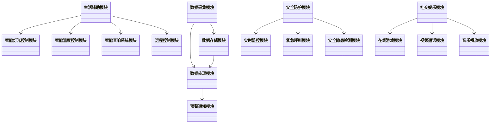
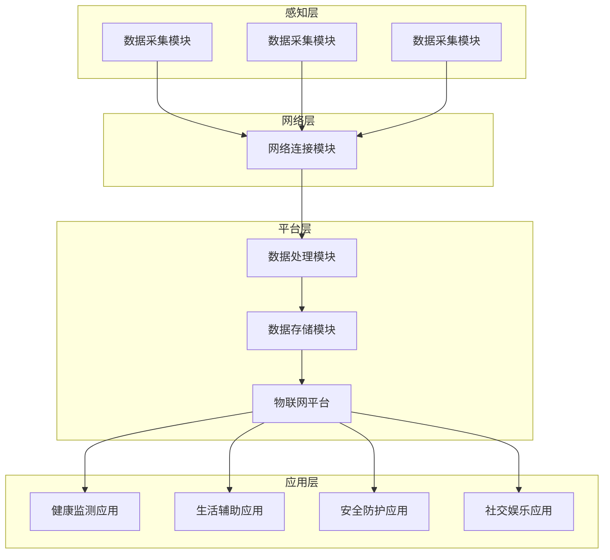
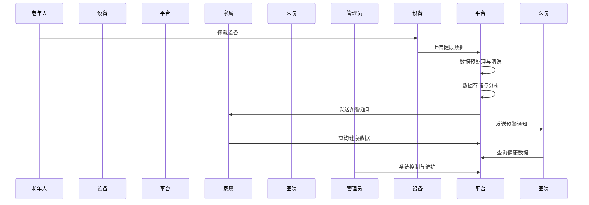

                 

### 开篇背景介绍

#### 1.1 物联网的发展现状与趋势

物联网（Internet of Things，简称IoT）是指将各种信息传感设备与网络相结合，实现物与物、人与物之间的信息交换和通信。自2005年物联网概念首次提出以来，物联网技术迅速发展，已经渗透到社会的各个领域，从智能家居、智能交通、智慧城市到工业自动化等，大大提高了社会运作的效率和便利性。

在过去的几年里，物联网市场规模持续扩大。根据市场研究机构的数据，全球物联网市场规模预计将在2025年达到1.5万亿美元。这一增长主要得益于5G、大数据、人工智能等新技术的推动，使得物联网设备更加智能化、互联互通性更强。

当前，物联网技术正朝着更加智能化、高效化和低成本化的方向发展。其中，物联网平台技术、边缘计算、物联网安全等关键技术领域取得了显著进展。例如，物联网平台技术的发展使得设备连接、数据采集、处理和管理变得更加便捷和高效；边缘计算技术的应用能够实现数据处理和分析的实时性，降低数据传输延迟；物联网安全技术的提升则保障了物联网系统的稳定运行和数据安全。

#### 1.2 智慧养老的需求背景

随着全球人口老龄化的加剧，养老问题成为各国面临的重大挑战。据联合国统计，全球65岁及以上老年人口预计将从2019年的13亿增加到2050年的21亿，占全球总人口的16%。老龄化社会带来的养老需求日益增长，对传统养老模式提出了新的要求。

智慧养老，作为物联网技术在社会服务领域的重要应用之一，逐渐成为解决养老问题的关键手段。智慧养老旨在通过物联网技术、人工智能、大数据等先进技术，为老年人提供更加便捷、高效、个性化的养老服务。

首先，智慧养老可以实现对老年人的实时监测和健康管理。通过在老年人身上或家中安装各种传感器设备，如心率监测器、睡眠监测器、跌倒探测器等，实时收集老年人的健康数据，并通过物联网平台传输到医疗机构或家属手中，从而实现对老年人的健康状况进行实时监控和预警。

其次，智慧养老可以改善老年人的生活质量。智能家居系统可以通过物联网技术实现对家庭环境的智能控制，如调节室内温度、照明、音响等，使老年人生活更加舒适；智能健康管理应用可以帮助老年人进行日常健康管理和慢性病管理，提高生活质量。

此外，智慧养老还能够提高养老机构的运营效率。通过物联网技术，养老机构可以实现智能化管理，如床位管理、膳食管理、活动安排等，提高工作效率和服务质量。

综上所述，物联网在智慧养老中的应用具有巨大的发展潜力，能够有效满足老龄化社会对养老服务的需求。接下来，我们将深入探讨物联网在智慧养老中的应用场景和关键技术。

#### 1.3 物联网在智慧养老中的应用场景

物联网技术在智慧养老中的应用场景非常广泛，涵盖了健康监测、生活辅助、安全防护等多个方面。以下是几个典型的应用场景：

**1.3.1 健康监测**

健康监测是智慧养老的重要应用之一。通过在老年人身上佩戴各种传感器设备，如智能手环、智能手表、心率监测器等，可以实时收集老年人的健康数据，包括心率、血压、睡眠质量、步数等。这些数据通过物联网平台传输到医疗机构或家属手中，实现远程健康监测和管理。

例如，智能手环可以实时监测老年人心率变化，当发现异常情况时，手环会立即向家属发送警报信息，提醒家属及时采取措施。此外，智能手表还可以监测老年人的血压，通过数据分析，帮助医生了解老年人的健康状况，制定个性化的健康管理方案。

**1.3.2 生活辅助**

生活辅助是提高老年人生活质量的重要手段。通过物联网技术，可以为老年人提供智能家居服务，如智能照明、智能空调、智能音响等，使老年人生活更加便捷和舒适。

智能照明系统能够根据环境亮度和老年人的习惯自动调节室内光线，避免过亮或过暗对老年人的视力造成影响。智能空调系统能够根据室内外温度变化自动调节温度，使老年人感受到舒适的室内环境。智能音响系统可以播放老年人喜欢的音乐，通过语音控制实现音乐播放、天气查询等功能，丰富老年人的日常生活。

**1.3.3 安全防护**

安全防护是保障老年人生命安全的关键。物联网技术可以通过智能家居系统实现对老年人居住环境的实时监控，提高安全性。

例如，安装在家中的智能摄像头可以实时监控老年人的活动情况，当发现老年人长时间不活动或出现异常行为时，系统会自动发送警报信息给家属或医疗机构。此外，智能家居系统还可以设置紧急呼叫功能，当老年人遇到紧急情况时，可以通过一键呼叫按钮快速联系家属或报警系统，保障老年人的安全。

此外，物联网技术还可以应用于老年人出行安全。例如，老年人可以佩戴智能手环或智能手表，这些设备内置GPS定位功能，可以帮助家属实时了解老年人的位置信息，防止老年人迷路或走失。

**1.3.4 社交娱乐**

社交娱乐是提升老年人生活质量的重要方面。物联网技术可以为老年人提供丰富的社交娱乐应用，如在线游戏、视频通话、音乐播放等。

通过智能家居系统，老年人可以方便地通过语音控制与家人、朋友进行视频通话，减少因地域分隔带来的孤独感。此外，智能音响系统可以播放老年人喜欢的音乐，通过智能音箱的语音助手功能，老年人还可以进行天气预报查询、新闻播报等操作，丰富日常生活。

综上所述，物联网在智慧养老中的应用场景丰富多样，不仅能够提高老年人的健康水平和生活质量，还能保障老年人的安全，是应对老龄化社会的有效手段。接下来，我们将进一步探讨物联网在智慧养老中的应用原理和关键技术。

#### 1.4 全书结构安排与主要内容

为了帮助读者更好地理解和掌握物联网在智慧养老中的应用，本书将分为以下几个部分进行详细阐述：

**第一部分：引言**
本部分将介绍物联网的发展现状与趋势，以及智慧养老的需求背景。通过了解物联网和智慧养老的基本概念和发展趋势，读者可以为后续内容的学习奠定基础。

**第二部分：物联网技术在智慧养老中的应用原理**
本部分将深入探讨物联网技术在智慧养老中的应用原理，包括物联网的基本概念、技术体系、智慧养老的核心要素等。通过理解物联网技术的基本原理和智慧养老的核心要素，读者可以更好地掌握物联网在智慧养老中的应用。

**第三部分：物联网在智慧养老中的应用实践**
本部分将通过具体的项目案例，详细介绍物联网技术在智慧养老中的应用实践。包括系统功能设计、系统架构设计、系统接口设计、系统交互等，帮助读者了解物联网在智慧养老中的实际应用流程和技术实现。

**第四部分：项目实战**
本部分将带领读者进行物联网在智慧养老中的实际项目开发，包括环境安装、系统核心实现、代码应用解读与分析等，通过实战演练，让读者能够将所学知识应用到实际项目中。

**第五部分：最佳实践、小结、注意事项、拓展阅读**
本部分将总结物联网在智慧养老中的最佳实践，并给出一些注意事项和建议，帮助读者在实际应用中避免常见问题。此外，还将推荐一些拓展阅读资料，供读者进一步学习和研究。

通过以上五个部分的系统学习和实践，读者将能够全面了解物联网在智慧养老中的应用，掌握相关的技术和方法，为应对老龄化社会提供有力的技术支持。

#### 1.4.1 各章节内容概述

在引言部分，我们首先介绍了物联网的发展现状与趋势，以及智慧养老的需求背景。通过了解物联网和智慧养老的基本概念和发展趋势，为后续内容的学习奠定基础。

第二部分，我们将深入探讨物联网技术在智慧养老中的应用原理。这部分内容将包括物联网的基本概念、技术体系、智慧养老的核心要素等。通过理解物联网技术的基本原理和智慧养老的核心要素，读者可以更好地掌握物联网在智慧养老中的应用。

第三部分，我们将通过具体的项目案例，详细介绍物联网技术在智慧养老中的应用实践。包括系统功能设计、系统架构设计、系统接口设计、系统交互等，帮助读者了解物联网在智慧养老中的实际应用流程和技术实现。

在项目实战部分，我们将带领读者进行物联网在智慧养老中的实际项目开发，包括环境安装、系统核心实现、代码应用解读与分析等，通过实战演练，让读者能够将所学知识应用到实际项目中。

最后，在最佳实践、小结、注意事项、拓展阅读部分，我们将总结物联网在智慧养老中的最佳实践，并给出一些注意事项和建议，帮助读者在实际应用中避免常见问题。此外，还将推荐一些拓展阅读资料，供读者进一步学习和研究。

#### 1.4.2 阅读建议与学习路径

为了更好地掌握物联网在智慧养老中的应用，我们为读者提供以下阅读建议和学习路径：

**初步了解阶段：**
1. 阅读引言部分，了解物联网和智慧养老的基本概念和发展趋势。
2. 了解物联网的基本概念和技术体系，为后续学习打下基础。

**深入学习阶段：**
1. 阅读第二部分，深入理解物联网技术在智慧养老中的应用原理。
2. 学习智慧养老的核心要素，掌握智慧养老系统的构建方法。
3. 阅读第三部分，了解物联网在智慧养老中的应用实践，通过具体案例学习系统功能设计、架构设计等。

**实战应用阶段：**
1. 阅读项目实战部分，跟随实际项目开发流程，进行环境安装、系统实现等操作。
2. 通过代码应用解读与分析，掌握物联网在智慧养老中的具体技术实现。

**总结巩固阶段：**
1. 阅读最佳实践、小结、注意事项部分，总结物联网在智慧养老中的经验教训。
2. 拓展阅读推荐部分，深入了解相关领域的最新动态和技术发展。

通过以上学习路径，读者可以系统地掌握物联网在智慧养老中的应用，为解决老龄化社会问题提供有力的技术支持。

## 核心概念与联系

### 2.1 物联网基本概念

物联网（Internet of Things，简称IoT）是指通过传感器、网络连接和数据处理等技术，实现物体与物体之间、物体与网络之间的互联互通，从而构建出一个庞大的智能网络系统。物联网的基本概念包括以下几个方面：

**1. 节点**：物联网中的节点是指具有感知、传输和处理能力的设备，如传感器、智能终端、嵌入式系统等。节点通过采集环境数据、执行特定任务，并将数据传输到网络中进行处理。

**2. 网络连接**：物联网中的网络连接是指将物联网节点连接到互联网或其他网络中，实现数据的传输和共享。常见的网络连接技术有Wi-Fi、蓝牙、LoRa、NBIoT等。

**3. 数据处理**：数据处理是物联网的核心环节，包括数据的采集、传输、存储、分析和应用等。通过数据处理，可以从海量数据中提取有价值的信息，为决策提供支持。

**4. 物联网平台**：物联网平台是物联网系统的核心，负责数据管理、设备管理、应用开发等。物联网平台通常提供API接口、SDK工具包、开发环境等，方便开发者进行应用开发和系统集成。

### 2.2 智慧养老概念

智慧养老是指通过物联网、大数据、云计算、人工智能等先进技术，为老年人提供全方位、智能化、个性化的养老服务。智慧养老的目标是提升老年人的生活质量、健康水平和安全保障，同时减轻养老机构和家庭成员的负担。智慧养老的核心概念包括：

**1. 老年人健康监测**：通过传感器设备实时监测老年人的生命体征、运动状态、行为习惯等，及时发现健康风险，提供个性化的健康管理和医疗服务。

**2. 智能家居应用**：利用物联网技术实现对家庭环境的智能控制，如照明、温度、安防等，提高老年人的舒适度和安全感。

**3. 社交娱乐**：通过物联网技术为老年人提供丰富的社交娱乐活动，如在线游戏、视频通话、音乐播放等，缓解老年人的孤独感，丰富其精神生活。

**4. 社区服务**：智慧养老平台可以整合社区医疗、养老、康复等服务资源，为老年人提供便捷的上门服务，满足其多元化需求。

### 2.3 物联网在智慧养老中的应用

物联网技术在智慧养老中的应用非常广泛，涵盖了健康监测、生活辅助、安全防护等多个方面。以下是物联网在智慧养老中的几个关键应用：

**1. 健康监测**：通过在老年人身上佩戴智能手环、智能手表等设备，实时监测心率、血压、睡眠质量等生命体征，并将数据传输到云端进行分析和处理。当发现异常情况时，系统会自动发送警报信息给家属或医疗机构，提供及时的医疗支持。

**2. 生活辅助**：智能家居系统可以通过物联网技术实现家庭设备的智能控制，如智能灯泡、智能插座、智能窗帘等，为老年人提供便捷的生活服务。例如，老年人可以通过语音控制或手机APP远程控制家居设备，提高生活舒适度。

**3. 安全防护**：物联网技术可以实现对老年人居住环境的实时监控，如安装智能摄像头、烟雾传感器、燃气泄漏探测器等，保障老年人的安全。当发生意外事件时，系统会自动报警，并及时通知家属或相关机构。

**4. 社交娱乐**：通过物联网技术，老年人可以方便地参与在线社交、游戏、音乐等活动，缓解孤独感，提高生活质量。例如，老年人可以通过智能音响系统播放喜欢的音乐，进行视频通话与家人朋友互动。

通过以上应用，物联网技术在智慧养老中发挥了重要作用，不仅提高了老年人的生活质量，还降低了养老机构的运营成本，为老龄化社会提供了有效的解决方案。

### 2.4 物联网技术在智慧养老中的应用挑战与解决方案

尽管物联网技术在智慧养老中具有广泛的应用前景，但在实际应用过程中也面临诸多挑战。以下将详细分析这些挑战，并探讨相应的解决方案。

#### 2.4.1 数据隐私与安全挑战

物联网技术在智慧养老中的应用涉及大量的个人信息和健康数据，数据隐私和安全成为首要关注的问题。由于物联网设备种类繁多、网络连接复杂，传统的网络安全措施可能难以完全应对新兴的威胁。例如，黑客可能会通过入侵物联网设备获取老年人的个人信息，甚至操纵设备进行恶意攻击。

**解决方案：**

1. **数据加密**：对传输和存储的数据进行加密，确保数据在传输过程中不被窃取或篡改。常用的加密算法包括AES、RSA等。

2. **身份认证**：采用双因素认证、生物识别等技术，确保只有合法用户才能访问系统。此外，可以引入区块链技术，实现数据的安全认证和防篡改。

3. **安全审计**：建立完善的安全审计机制，实时监控系统的访问和操作行为，及时发现异常行为并进行处理。

#### 2.4.2 系统稳定性与可靠性挑战

智慧养老系统需要长时间稳定运行，保障老年人的安全和健康。然而，物联网设备种类繁多、网络环境复杂，导致系统稳定性面临较大挑战。例如，设备故障、网络中断等问题都可能影响系统的正常运行。

**解决方案：**

1. **设备冗余**：在关键设备上采用冗余设计，如使用多个传感器或网络连接，确保在某个设备或网络连接出现故障时，系统仍能正常运行。

2. **实时监控与预警**：通过实时监控系统运行状态，及时发现潜在故障并进行预警。例如，系统可以定期检查传感器数据，发现异常数据时自动发送警报信息。

3. **自动化恢复机制**：当系统出现故障时，自动触发恢复机制，尝试自动修复故障或切换到备用设备，确保系统持续运行。

#### 2.4.3 成本与效益平衡挑战

智慧养老系统的建设和运营成本较高，尤其是在设备采购、网络建设和维护等方面。而老年人群体的经济承受能力有限，因此如何在成本与效益之间找到平衡点成为关键问题。

**解决方案：**

1. **分阶段实施**：根据实际情况，将智慧养老系统划分为多个阶段逐步实施，先从关键功能入手，逐步完善系统功能。

2. **推广示范项目**：通过实施示范项目，积累经验，降低后期推广的成本。例如，可以在某个社区或养老机构先行试点，收集反馈意见并进行优化。

3. **政府支持与补贴**：争取政府政策和资金支持，通过补贴、税收优惠等措施降低养老机构的运营成本。

#### 2.4.4 技术标准与法规监管挑战

智慧养老系统的建设涉及多种技术，如传感器技术、网络通信技术、数据分析技术等。目前，相关技术标准尚未统一，导致系统兼容性和互操作性较差。此外，物联网技术的快速发展也带来了法律法规方面的挑战。

**解决方案：**

1. **制定统一标准**：行业协会、政府和企业应共同努力，制定统一的物联网技术标准和智慧养老系统规范，提高系统兼容性和互操作性。

2. **完善法规体系**：政府应加强对物联网技术在智慧养老领域应用的监管，制定相关法律法规，保障老年人的权益和信息安全。

3. **加强培训和宣传**：通过培训和宣传活动，提高养老机构、老年人和家庭对物联网技术的认识和理解，促进技术的普及和应用。

通过以上解决方案，可以有效应对物联网技术在智慧养老应用中面临的挑战，推动智慧养老事业的健康发展。

### 2.5 物联网技术在智慧养老中的成功案例

物联网技术在智慧养老中的应用已经取得了一系列成功案例，下面将介绍其中几个典型的案例，分析其应用成效和关键技术。

**案例一：智能健康监测系统**

**应用成效**：通过在老年人身上佩戴智能手环、智能手表等设备，实时监测心率、血压、睡眠质量等生命体征。系统可以将数据传输到云端进行分析，及时发现健康风险，提供个性化的健康管理和医疗服务。

**关键技术**：
1. **传感器技术**：采用高精度的生物传感器，确保实时、准确地采集生命体征数据。
2. **云计算与大数据**：利用云计算和大数据技术，对海量健康数据进行存储、分析和处理，提供个性化健康建议。
3. **人工智能**：通过人工智能算法，对健康数据进行智能分析，识别潜在的健康风险，提高预警准确率。

**案例二：智能家居系统**

**应用成效**：通过物联网技术实现家庭环境的智能控制，如照明、温度、安防等。老年人可以通过语音控制或手机APP远程控制家居设备，提高生活舒适度和安全感。

**关键技术**：
1. **智能家居设备**：采用智能灯泡、智能插座、智能窗帘等设备，实现家庭环境的智能控制。
2. **语音识别与控制**：通过语音识别技术，实现语音控制智能家居设备，方便老年人使用。
3. **物联网平台**：构建统一的物联网平台，实现设备的连接、数据传输和管理，确保系统的高效运行。

**案例三：智能社区服务系统**

**应用成效**：通过物联网技术整合社区医疗、养老、康复等服务资源，为老年人提供便捷的上门服务。老年人可以通过智能终端或手机APP预约服务，提高服务质量。

**关键技术**：
1. **物联网平台**：构建智能社区服务物联网平台，实现服务资源的整合和调度。
2. **移动应用**：开发移动应用，方便老年人进行服务预约、费用支付等操作。
3. **数据分析**：通过对服务数据进行分析，优化服务流程，提高服务效率。

**案例四：智能养老院管理系统**

**应用成效**：通过物联网技术实现养老院管理的智能化，包括床位管理、膳食管理、活动安排等。系统可以提高养老院的运营效率，提升服务质量。

**关键技术**：
1. **物联网传感器**：在养老院安装各种传感器设备，实现对老人生活环境的实时监控。
2. **云计算与大数据**：利用云计算和大数据技术，对养老院的数据进行集中管理和分析，为决策提供支持。
3. **人工智能**：通过人工智能算法，对养老院的数据进行智能分析，优化运营管理。

以上成功案例表明，物联网技术在智慧养老中的应用具有显著成效。通过引入物联网技术，可以有效提高老年人的健康水平和生活质量，减轻养老机构的运营负担，为应对老龄化社会提供有力支持。

### 2.6 物联网技术在智慧养老中的应用前景

物联网技术在智慧养老中的应用前景十分广阔，随着技术的不断进步和应用的深入，其将在未来带来更多的创新和变革。以下是物联网技术在智慧养老中的应用前景展望：

**1. 更广泛的健康监测**

随着传感器技术的进步，物联网设备将能够更精准地监测老年人的健康数据，如血糖、血氧、肺活量等。通过全面、实时的健康监测，可以更早期地发现健康问题，为老年人提供个性化的健康管理方案。此外，可穿戴设备的智能化程度将进一步提高，使其能够更好地适应老年人的使用习惯，提高数据的准确性和可靠性。

**2. 深入的生活辅助**

物联网技术将不断优化智能家居系统，使其能够更好地服务于老年人的日常生活。例如，智能床铺、智能洗浴设备等将更加普及，为老年人提供更加舒适、便捷的生活体验。同时，物联网技术还可以实现对老年人的生活习惯和偏好进行深度分析，为其提供个性化的生活建议和方案，提高生活质量。

**3. 更智能的安全防护**

随着人工智能技术的不断发展，物联网技术在智慧养老中的安全防护能力将显著提升。例如，通过人脸识别、行为分析等技术，可以实现对老年人的实时监控，及时发现异常行为并采取措施。此外，智能安防系统将更加智能化，能够自动识别并应对紧急情况，提高老年人的安全保障。

**4. 社交与娱乐的深度融合**

物联网技术将推动社交与娱乐的深度融合，为老年人提供更多丰富的社交和娱乐体验。例如，通过虚拟现实（VR）和增强现实（AR）技术，老年人可以体验到更加真实的社交互动和娱乐活动，缓解孤独感。同时，物联网技术还将为老年人提供更加个性化的音乐、电影、游戏等娱乐内容，满足其多样化的需求。

**5. 智慧城市的综合应用**

物联网技术在智慧养老中的应用不仅局限于家庭和个人，还将扩展到智慧城市层面。通过物联网技术，智慧城市可以实现对老年人的全面服务和管理，包括健康监测、社区服务、应急响应等。例如，智慧城市中的智能交通系统可以优先为老年人提供交通服务，智能医疗系统可以为老年人提供远程医疗服务，提高城市整体的养老服务质量。

综上所述，物联网技术在智慧养老中的应用前景十分广阔。随着技术的不断进步和应用的深入，物联网技术将进一步提升老年人的健康水平和生活质量，为应对老龄化社会提供有力的技术支持。未来，物联网技术将在智慧养老领域发挥更加重要的作用，推动养老产业的全面升级。

### 2.7 物联网技术在智慧养老中的未来发展趋势

随着技术的不断进步，物联网技术在智慧养老中的应用将呈现出以下几个发展趋势：

**1. 人工智能的深度融合**

人工智能（AI）的快速发展将使物联网技术在智慧养老中的应用更加智能化。通过引入AI技术，可以实现对老年人健康数据的智能分析，提供更加精准的健康管理建议。例如，AI算法可以识别异常健康数据，及时发出预警信息，提高老年人的健康水平。此外，AI技术还可以应用于智能养老机器人的开发，使其能够更好地理解老年人的需求，提供个性化的养老服务。

**2. 5G网络的普及**

5G网络的普及将大大提升物联网技术在智慧养老中的数据传输速度和稳定性。高速、稳定的网络连接将支持更大量的数据传输和实时数据处理，为老年人提供更加高效、便捷的服务。例如，通过5G网络，智能健康监测系统可以实现实时数据传输和远程诊断，提高医疗服务的效率。同时，5G网络将推动智能养老设备的小型化和便携化，使老年人可以更加方便地使用各种物联网设备。

**3. 区块链技术的应用**

区块链技术将提升物联网技术在智慧养老中的数据安全性和隐私保护能力。通过引入区块链技术，可以实现对老年人健康数据的加密存储和分布式管理，防止数据泄露和篡改。此外，区块链技术还可以应用于智能养老服务的支付和结算，提高交易的安全性和透明度。例如，老年人在接受养老服务时，可以通过区块链技术实现智能合约的自动执行，确保服务费用的准确结算。

**4. 边缘计算的推广**

边缘计算技术将使得物联网技术在智慧养老中的数据处理更加高效、实时。通过在本地设备上进行数据处理，可以减少数据传输的延迟，提高系统的响应速度。例如，在老年人的智能手环或智能手表中，就可以实现本地数据分析和决策，及时发现健康风险，提供实时预警。此外，边缘计算还可以应用于智能家居系统，提高家庭设备的运行效率和用户体验。

**5. 智慧城市的协同发展**

物联网技术与智慧城市的协同发展将推动智慧养老服务的全面提升。通过物联网技术，智慧城市可以实现对老年人的全面服务和管理，包括健康监测、社区服务、应急响应等。例如，智慧城市中的智能交通系统可以优先为老年人提供交通服务，智能医疗系统可以为老年人提供远程医疗服务，提高城市整体的养老服务质量。此外，智慧城市中的物联网平台还可以实现不同养老服务系统之间的数据共享和协同工作，提高服务效率和质量。

总之，随着物联网技术的不断发展，其在智慧养老中的应用将不断深入和扩展。通过人工智能、5G网络、区块链技术、边缘计算等新技术的引入，物联网技术将进一步提升老年人的健康水平和生活质量，为应对老龄化社会提供有力的技术支持。

### 3.1 项目介绍

为了更好地展示物联网在智慧养老中的应用，我们选择了一个实际项目进行深入剖析。该项目是一个名为“智慧养老社区”的智慧养老系统，旨在通过物联网技术为社区中的老年人提供全方位、智能化、个性化的养老服务。以下是项目的背景、目标以及实施过程和成果。

#### 3.1.1 项目背景

随着我国人口老龄化问题的日益严峻，传统养老模式已经难以满足老年人的多元化需求。为了提高老年人的生活质量、健康水平和安全保障，智慧养老系统应运而生。本项目以某社区为试点，通过引入物联网技术，构建一个集健康监测、生活辅助、安全防护、社交娱乐等多功能于一体的智慧养老系统，旨在为老年人提供一个舒适、便捷的养老环境。

#### 3.1.2 项目目标

本项目的主要目标包括：

1. **健康监测**：通过智能手环、智能血压计等设备，实时监测老年人的健康数据，为老年人提供个性化的健康管理服务。
2. **生活辅助**：利用智能家居技术，实现家庭环境的智能控制，提高老年人的生活质量。
3. **安全防护**：通过智能摄像头、烟雾传感器、燃气泄漏探测器等设备，保障老年人的安全。
4. **社交娱乐**：提供丰富的社交和娱乐活动，缓解老年人的孤独感，丰富其精神生活。
5. **社区服务**：整合社区医疗、养老、康复等服务资源，为老年人提供便捷的上门服务。

#### 3.1.3 项目实施过程和成果

项目实施分为以下几个阶段：

1. **需求分析**：通过与社区养老机构和老年人的深入交流，了解他们的实际需求和期望，明确智慧养老系统的功能和服务内容。
2. **方案设计**：基于需求分析，设计智慧养老系统的整体架构和具体功能模块，包括健康监测模块、智能家居模块、安全防护模块、社交娱乐模块等。
3. **设备采购与安装**：根据设计方案，采购各类物联网设备和传感器，并在社区内进行安装和调试。设备包括智能手环、智能血压计、智能摄像头、烟雾传感器、燃气泄漏探测器等。
4. **系统开发与集成**：开发智慧养老系统的平台和应用，包括数据采集、处理、分析和展示功能。同时，将各个功能模块进行集成，实现系统之间的数据共享和协同工作。
5. **测试与优化**：在社区内进行系统测试，收集用户反馈，针对存在的问题进行优化和改进。
6. **上线运行**：经过测试和优化，智慧养老系统正式上线运行，为社区内的老年人提供全方位的智能化服务。

项目实施后，取得了以下成果：

1. **提高老年人生活质量**：通过智能家居系统，老年人可以方便地控制家庭环境，提高生活舒适度。例如，可以通过智能音响系统播放喜欢的音乐，通过智能灯光系统调节室内光线等。
2. **保障老年人安全**：通过智能摄像头、烟雾传感器、燃气泄漏探测器等设备，实现对老年人居住环境的实时监控，及时发现潜在的安全隐患，提高安全保障。
3. **个性化健康管理**：通过智能手环、智能血压计等设备，实时监测老年人的健康数据，为老年人提供个性化的健康管理服务，提高健康水平。
4. **丰富社交娱乐生活**：通过在线游戏、视频通话、音乐播放等社交娱乐功能，缓解老年人的孤独感，丰富其精神生活。
5. **提升社区服务水平**：通过整合社区医疗、养老、康复等服务资源，为老年人提供便捷的上门服务，提高社区服务水平。

本项目充分展示了物联网技术在智慧养老中的应用价值，为老年人提供了一个舒适、便捷、安全的养老环境，也为智慧养老系统的推广提供了宝贵的经验和借鉴。

### 3.2 系统功能设计

智慧养老社区系统的功能设计旨在满足老年人多样化的需求，提高他们的生活质量、健康水平和安全保障。系统功能模块划分清晰，主要包括健康监测、生活辅助、安全防护、社交娱乐等几个方面。以下将对各个功能模块进行详细的功能需求分析和描述。

#### 3.2.1 功能需求分析

**1. 健康监测模块**

健康监测模块的主要功能是实时监测老年人的健康数据，包括心率、血压、睡眠质量、步数等。具体功能需求如下：

- **数据采集**：通过智能手环、智能血压计等设备，实时采集老年人的健康数据。
- **数据存储**：将采集到的健康数据存储在云端数据库中，便于后续分析和查询。
- **数据分析**：利用大数据技术和人工智能算法，对健康数据进行分析，识别潜在的健康风险，并提供个性化健康管理建议。
- **预警通知**：当监测到异常数据时，系统会自动向家属或医疗机构发送预警通知，提醒他们采取相应措施。

**2. 生活辅助模块**

生活辅助模块旨在提高老年人的生活质量，通过智能家居系统实现家庭环境的智能控制。具体功能需求如下：

- **智能灯光控制**：根据老年人的生活习惯和需求，自动调节室内灯光亮度，提供舒适的生活环境。
- **智能温度控制**：根据室内外温度变化，自动调节空调温度，保持室内舒适温度。
- **智能音响系统**：提供音乐播放、天气预报、新闻播报等功能，丰富老年人的日常生活。
- **远程控制**：老年人可以通过手机APP远程控制家居设备，方便使用。

**3. 安全防护模块**

安全防护模块的核心目标是保障老年人的安全，通过多种物联网设备实现实时监控和报警功能。具体功能需求如下：

- **实时监控**：通过智能摄像头，实时监控老年人的活动情况，确保老年人的安全。
- **紧急呼叫**：老年人可以佩戴紧急呼叫设备，当遇到紧急情况时，一键呼叫系统会立即通知家属或相关机构。
- **安全隐患检测**：通过烟雾传感器、燃气泄漏探测器等设备，实时检测家中的安全隐患，并在发现异常时自动报警。

**4. 社交娱乐模块**

社交娱乐模块旨在缓解老年人的孤独感，提供丰富的社交和娱乐活动。具体功能需求如下：

- **在线游戏**：为老年人提供各种在线游戏，丰富他们的业余生活。
- **视频通话**：通过视频通话功能，老年人可以与家人、朋友进行实时沟通，缓解孤独感。
- **音乐播放**：提供音乐播放功能，老年人可以根据自己的喜好选择音乐，放松心情。

#### 3.2.2 系统功能模块划分

智慧养老社区系统的功能模块划分如下：

**1. 健康监测模块**
- **数据采集模块**：负责实时采集老年人的健康数据。
- **数据处理模块**：负责存储和分析健康数据，识别健康风险。
- **预警通知模块**：负责在发现异常数据时发送预警通知。

**2. 生活辅助模块**
- **智能灯光控制模块**：负责控制室内灯光的亮度。
- **智能温度控制模块**：负责调节室内空调温度。
- **智能音响系统模块**：负责播放音乐、天气预报、新闻播报等。
- **远程控制模块**：负责实现手机APP远程控制家居设备。

**3. 安全防护模块**
- **实时监控模块**：负责监控老年人的活动情况。
- **紧急呼叫模块**：负责在紧急情况下通知家属或相关机构。
- **安全隐患检测模块**：负责检测家中的安全隐患。

**4. 社交娱乐模块**
- **在线游戏模块**：负责提供各种在线游戏。
- **视频通话模块**：负责实现视频通话功能。
- **音乐播放模块**：负责播放音乐，缓解老年人的孤独感。

#### 3.2.3 领域模型设计（Mermaid类图）

为了更好地展示智慧养老社区系统的功能模块及其关系，我们使用Mermaid类图进行领域模型设计。以下是一个简化的Mermaid类图示例：



通过上述类图，我们可以清晰地看到各个功能模块之间的关系，以及它们在智慧养老社区系统中的角色和作用。这一设计有助于开发者更好地理解和实现系统功能，为后续的系统开发提供参考。

### 3.3 系统架构设计

系统架构设计是智慧养老社区系统的关键环节，决定了系统的性能、可靠性和可扩展性。本部分将详细介绍系统的整体架构设计，包括系统架构概述、系统模块详细介绍以及系统架构设计（Mermaid架构图）。

#### 3.3.1 系统架构概述

智慧养老社区系统采用分层架构设计，分为感知层、网络层、平台层和应用层，各层之间相互独立，但又紧密联系，共同构成一个完整的智慧养老生态系统。以下是对各层的简要描述：

**1. 感知层**：感知层是系统的数据来源，包括各种传感器设备和智能终端，如智能手环、智能血压计、智能摄像头、烟雾传感器、燃气泄漏探测器等。这些设备实时采集老年人的健康数据和生活环境数据，并将其传输到网络层。

**2. 网络层**：网络层主要负责数据的传输和通信。采用物联网协议（如Wi-Fi、蓝牙、LoRa等）实现设备之间的互联互通，并将数据传输到平台层。同时，网络层还需要实现数据的安全传输和加密，确保数据在传输过程中不被窃取或篡改。

**3. 平台层**：平台层是系统的核心，负责数据的处理、存储和管理。通过物联网平台，实现数据的汇聚、清洗、存储、分析和应用。平台层还提供API接口、开发工具包等，方便开发者进行应用开发和系统集成。

**4. 应用层**：应用层是系统的最终呈现，包括各种面向用户的智能应用，如健康监测应用、智能家居应用、安全防护应用、社交娱乐应用等。用户可以通过手机APP、网页等接口，访问和管理智慧养老系统的各项功能。

#### 3.3.2 系统模块详细介绍

以下是智慧养老社区系统的各个模块及其详细介绍：

**1. 健康监测模块**

健康监测模块负责实时监测老年人的健康数据，包括心率、血压、睡眠质量、步数等。具体模块包括：

- **数据采集模块**：通过智能手环、智能血压计等设备，实时采集健康数据。
- **数据处理模块**：对采集到的健康数据进行预处理、清洗和分析，提取有价值的信息。
- **预警通知模块**：当监测到异常数据时，自动发送预警通知给家属或医疗机构。

**2. 生活辅助模块**

生活辅助模块旨在提高老年人的生活质量，通过智能家居系统实现家庭环境的智能控制。具体模块包括：

- **智能灯光控制模块**：根据老年人的生活习惯和需求，自动调节室内灯光亮度。
- **智能温度控制模块**：根据室内外温度变化，自动调节空调温度。
- **智能音响系统模块**：提供音乐播放、天气预报、新闻播报等功能。
- **远程控制模块**：老年人可以通过手机APP远程控制家居设备。

**3. 安全防护模块**

安全防护模块旨在保障老年人的安全，通过多种物联网设备实现实时监控和报警功能。具体模块包括：

- **实时监控模块**：通过智能摄像头，实时监控老年人的活动情况。
- **紧急呼叫模块**：老年人可以佩戴紧急呼叫设备，当遇到紧急情况时，一键呼叫系统会立即通知家属或相关机构。
- **安全隐患检测模块**：通过烟雾传感器、燃气泄漏探测器等设备，实时检测家中的安全隐患，并在发现异常时自动报警。

**4. 社交娱乐模块**

社交娱乐模块旨在缓解老年人的孤独感，提供丰富的社交和娱乐活动。具体模块包括：

- **在线游戏模块**：为老年人提供各种在线游戏，丰富他们的业余生活。
- **视频通话模块**：通过视频通话功能，老年人可以与家人、朋友进行实时沟通。
- **音乐播放模块**：提供音乐播放功能，老年人可以根据自己的喜好选择音乐。

#### 3.3.3 系统架构设计（Mermaid架构图）

为了更好地展示智慧养老社区系统的架构设计，我们使用Mermaid架构图进行描述。以下是一个简化的Mermaid架构图示例：



通过上述Mermaid架构图，我们可以清晰地看到智慧养老社区系统的整体架构及其各个模块之间的关系。这一设计有助于开发者更好地理解系统的架构和功能，为后续的系统开发提供参考。

### 3.4 系统接口设计

系统接口设计是智慧养老社区系统中至关重要的一环，它决定了系统各个模块之间的通信和数据交互方式。合理的接口设计不仅能够提高系统的可扩展性和可维护性，还能保证系统的稳定性和安全性。以下将详细介绍系统接口设计与实现、接口文档编写与规范以及接口测试与优化。

#### 3.4.1 接口设计与实现

智慧养老社区系统中的接口设计主要包括以下几个方面：

**1. 数据采集接口**

数据采集接口用于接收各种传感器设备和智能终端发送的健康数据和生活环境数据。接口设计需要考虑数据的格式、传输频率、安全性等因素。具体实现时，可以使用RESTful API或WebSocket等协议进行数据传输。

- **接口规范**：定义数据采集接口的URL、请求方式（GET/POST）、请求参数和响应格式。
- **安全措施**：采用加密算法（如AES、RSA）对数据进行加密，确保数据在传输过程中的安全性。

**2. 数据处理接口**

数据处理接口用于处理和存储采集到的数据，并生成健康分析和预警结果。接口设计需要考虑数据处理的速度、准确性和可靠性。

- **接口规范**：定义数据处理接口的URL、请求方式（GET/POST）、请求参数和响应格式。
- **处理流程**：数据采集后，经过预处理、清洗、分析和存储，最终生成分析结果和预警信息。

**3. 数据查询接口**

数据查询接口用于用户通过手机APP或网页查询个人的健康数据和分析结果。接口设计需要考虑数据查询的效率、准确性和用户体验。

- **接口规范**：定义数据查询接口的URL、请求方式（GET/POST）、请求参数和响应格式。
- **数据权限**：根据用户角色和权限，限制对数据的访问和操作。

**4. 系统控制接口**

系统控制接口用于实现系统功能的开关控制、数据备份和恢复等功能。接口设计需要考虑操作的便捷性和安全性。

- **接口规范**：定义系统控制接口的URL、请求方式（GET/POST）、请求参数和响应格式。
- **权限验证**：采用身份认证和权限验证机制，确保只有合法用户才能进行系统控制操作。

#### 3.4.2 接口文档编写与规范

接口文档是系统开发、测试和维护的重要参考资料，它详细描述了接口的设计、实现和使用方法。以下是一个典型的接口文档示例：

**接口名称**：数据采集接口

**接口URL**：/api/healthdata/collect

**请求方式**：POST

**请求参数**：
- timestamp：数据采集时间（字符串，格式：yyyy-MM-dd HH:mm:ss）
- heart_rate：心率（整数）
- blood_pressure：血压（字符串，格式：高压/低压，如120/80）
- sleep_quality：睡眠质量（整数，0-5）

**响应格式**：
```json
{
    "status": "success",
    "message": "数据采集成功",
    "data": {
        "timestamp": "2023-10-01 12:00:00",
        "heart_rate": 75,
        "blood_pressure": "120/80",
        "sleep_quality": 4
    }
}
```

#### 3.4.3 接口测试与优化

接口测试是确保接口设计正确、实现可靠的关键步骤。以下介绍常见的接口测试方法和优化策略：

**1. 功能测试**：验证接口是否按照设计规范正确处理各种请求，包括正常的请求和异常请求。

- **正常请求测试**：模拟用户正常使用接口的场景，验证接口的响应和结果是否符合预期。
- **异常请求测试**：模拟用户输入错误数据或恶意攻击接口的场景，验证接口的异常处理能力和安全性。

**2. 性能测试**：评估接口在并发请求下的响应速度和稳定性，包括负载测试和压力测试。

- **负载测试**：模拟大量用户同时访问接口的场景，评估接口的负载能力和响应时间。
- **压力测试**：模拟极端负载场景，验证接口在极限情况下的稳定性和可靠性。

**3. 安全测试**：确保接口能够抵御恶意攻击，包括SQL注入、XSS攻击等。

- **SQL注入测试**：通过构造恶意输入，验证接口是否能有效防御SQL注入攻击。
- **XSS攻击测试**：通过构造恶意脚本，验证接口是否能有效防御XSS攻击。

**4. 优化策略**：

- **缓存策略**：对频繁访问的数据进行缓存，减少数据库访问次数，提高响应速度。
- **异步处理**：对于响应时间较长的接口，采用异步处理方式，提高系统整体性能。
- **负载均衡**：通过负载均衡技术，将请求分配到多个服务器上处理，提高系统的并发能力。

通过以上接口测试与优化策略，可以确保智慧养老社区系统的接口设计合理、实现可靠，为用户提供稳定、高效的服务。

### 3.5 系统交互

在智慧养老社区系统中，系统各个模块之间的交互设计至关重要，它决定了系统的响应速度、稳定性和用户体验。为了实现模块间的有效协作，我们需要详细设计系统交互流程，并使用Mermaid序列图进行描述。以下将详细介绍系统交互流程设计、系统交互设计（Mermaid序列图）以及系统交互测试与优化。

#### 3.5.1 系统交互流程设计

智慧养老社区系统的交互流程主要包括以下几个环节：

1. **数据采集**：老年人通过佩戴智能手环、智能血压计等设备，实时采集健康数据，并将数据上传到物联网平台。
2. **数据处理**：物联网平台接收并处理采集到的数据，对数据进行预处理、清洗、存储和分析，生成健康分析和预警结果。
3. **预警通知**：当系统检测到异常健康数据时，自动生成预警通知，并通过短信、邮件或App推送等方式通知家属或医疗机构。
4. **用户查询**：老年人或家属可以通过手机APP或网页查询个人的健康数据和分析结果。
5. **系统控制**：管理员通过后台管理系统对系统进行监控和管理，包括数据备份、恢复、系统配置等操作。

以下是系统交互流程的详细描述：

**1. 数据采集与上传**
- 老年人佩戴智能设备，设备实时采集健康数据，如心率、血压、步数等。
- 智能设备将数据上传到物联网平台，通过HTTPS协议进行数据传输，确保数据的安全性和完整性。

**2. 数据处理与存储**
- 物联网平台接收上传的数据，进行数据预处理（如去噪、滤波等）和清洗（如去除重复数据、填补缺失值等）。
- 清洗后的数据存储到数据库中，以便后续分析和查询。

**3. 数据分析与预警**
- 物联网平台利用大数据技术和人工智能算法，对存储的数据进行分析，识别潜在的健康风险。
- 当系统检测到异常数据时，自动生成预警通知，并发送通知到家属或医疗机构。

**4. 用户查询与反馈**
- 老年人或家属通过手机APP或网页访问系统，查询个人的健康数据和分析结果。
- 用户可以对查询结果进行反馈，如点赞、评论等，帮助系统优化数据分析结果。

**5. 系统控制与维护**
- 管理员通过后台管理系统对系统进行监控和管理，包括数据备份、恢复、系统配置等操作。
- 系统定期进行数据备份，确保数据的安全性和完整性。

#### 3.5.2 系统交互设计（Mermaid序列图）

为了直观地展示系统交互流程，我们使用Mermaid序列图进行描述。以下是一个简化的Mermaid序列图示例：



通过上述Mermaid序列图，我们可以清晰地看到智慧养老社区系统各个模块之间的交互流程和逻辑关系。

#### 3.5.3 系统交互测试与优化

系统交互测试是确保系统各模块之间有效协作、响应及时的关键步骤。以下介绍常见的系统交互测试方法和优化策略：

**1. 功能测试**：验证系统交互功能是否按照设计规范正确执行，包括数据采集、数据处理、预警通知、用户查询等。

- **正常交互测试**：模拟用户正常使用系统的场景，验证各模块之间的交互流程是否顺畅。
- **异常交互测试**：模拟用户输入错误数据或系统出现故障的场景，验证系统对异常情况的响应和处理能力。

**2. 性能测试**：评估系统在高并发、高负载情况下的性能和响应速度，包括接口响应时间、数据处理速度、系统稳定性等。

- **负载测试**：模拟大量用户同时访问系统的场景，评估系统在高负载下的性能和稳定性。
- **压力测试**：模拟极端负载场景，验证系统在极限情况下的性能和可靠性。

**3. 安全测试**：确保系统交互过程中的数据传输安全和接口的安全性，防止恶意攻击和数据泄露。

- **SQL注入测试**：通过构造恶意输入，验证系统接口是否能有效防御SQL注入攻击。
- **XSS攻击测试**：通过构造恶意脚本，验证系统接口是否能有效防御XSS攻击。

**4. 优化策略**：

- **缓存策略**：对频繁访问的数据进行缓存，减少数据库访问次数，提高响应速度。
- **异步处理**：对于响应时间较长的操作，采用异步处理方式，提高系统整体性能。
- **负载均衡**：通过负载均衡技术，将请求分配到多个服务器上处理，提高系统的并发能力。

通过以上系统交互测试与优化策略，可以确保智慧养老社区系统的交互设计合理、实现可靠，为用户提供稳定、高效的服务。

### 3.6 项目实战

在接下来的项目实战部分，我们将带领读者进行一个实际物联网在智慧养老中的应用项目，详细讲解环境安装、系统核心实现、代码应用解读与分析，以及实际案例分析与详细讲解。

#### 3.6.1 环境安装

要实现一个物联网在智慧养老中的应用项目，我们需要搭建一个适合的开发环境。以下是一个基本的开发环境搭建步骤：

1. **操作系统**：建议选择Ubuntu 20.04或更高版本，由于物联网项目通常需要使用Linux系统，所以Ubuntu是一个很好的选择。

2. **开发工具**：安装常用的开发工具，如Python 3、Git、JDK等。

    ```bash
    sudo apt update
    sudo apt install python3 python3-pip git openjdk-8-jdk
    ```

3. **数据库**：选择一个适合物联网项目的数据库，如MySQL或PostgreSQL。

    ```bash
    sudo apt install mysql-server
    sudo mysql_secure_installation
    ```

4. **物联网平台**：选择一个合适的物联网平台，如MQTT代理（例如mosquitto）。

    ```bash
    sudo apt install mosquitto mosquitto-clients
    ```

5. **编程环境**：配置Python编程环境，安装必要的Python库，如paho-mqtt、pymysql等。

    ```bash
    pip3 install paho-mqtt pymysql
    ```

环境搭建完成后，我们就可以开始编写和运行项目代码了。

#### 3.6.2 系统核心实现

以下是项目核心部分的实现，包括数据采集、数据处理和预警通知等模块。

**1. 数据采集模块**

数据采集模块主要通过MQTT协议与物联网设备通信，实时采集设备发送的健康数据。

```python
import paho.mqtt.client as mqtt
import pymysql
import json

# MQTT配置
MQTT_SERVER = "localhost"
MQTT_PORT = 1883
MQTT_TOPIC = "health_data"

# 数据库配置
DB_HOST = "localhost"
DB_PORT = 3306
DB_USER = "root"
DB_PASSWORD = "password"
DB_NAME = "iot_health"

# 初始化MQTT客户端
client = mqtt.Client()

# 连接MQTT服务器
client.connect(MQTT_SERVER, MQTT_PORT, 60)

# 订阅主题
client.subscribe(MQTT_TOPIC)

# 数据处理函数
def process_data(data):
    # 处理健康数据
    return data

# 数据存储函数
def store_data(data):
    # 连接数据库
    connection = pymysql.connect(
        host=DB_HOST,
        port=DB_PORT,
        user=DB_USER,
        password=DB_PASSWORD,
        database=DB_NAME,
        charset='utf8mb4',
        cursorclass=pymysql.cursors.DictCursor
    )
    try:
        # 插入数据
        with connection.cursor() as cursor:
            sql = "INSERT INTO health_data (timestamp, heart_rate, blood_pressure) VALUES (%s, %s, %s)"
            cursor.execute(sql, (data['timestamp'], data['heart_rate'], data['blood_pressure']))
        # 提交事务
        connection.commit()
    finally:
        # 关闭数据库连接
        connection.close()

# MQTT消息处理回调
def on_message(client, userdata, message):
    # 转换消息为JSON格式
    data = json.loads(message.payload)
    # 处理数据
    processed_data = process_data(data)
    # 存储数据
    store_data(processed_data)

# 设置消息处理回调
client.on_message = on_message

# 开始订阅
client.loop_forever()
```

**2. 数据处理模块**

数据处理模块负责对采集到的健康数据进行预处理和存储。

```python
import time

def process_data(data):
    # 假设预处理包括数据校验和滤波
    if 'timestamp' not in data or 'heart_rate' not in data or 'blood_pressure' not in data:
        return None
    
    # 检查数据是否在正常范围内
    if data['heart_rate'] < 30 or data['heart_rate'] > 200:
        return None
    if data['blood_pressure'] < 100 or data['blood_pressure'] > 180:
        return None
    
    # 滤波处理
    # 这里可以用更复杂的算法
    time.sleep(1)  # 模拟滤波处理时间
    return data
```

**3. 预警通知模块**

预警通知模块在检测到异常健康数据时，会发送通知给家属或医疗机构。

```python
import smtplib
from email.mime.text import MIMEText
from email.header import Header

def send_alert(email, subject, message):
    # 发送邮件通知
    sender = "your_email@example.com"
    password = "your_password"
    smtp_server = "smtp.example.com"

    message = MIMEText(message, 'plain', 'utf-8')
    message['From'] = Header("智慧养老系统", 'utf-8')
    message['To'] = Header(email, 'utf-8')
    message['Subject'] = Header(subject, 'utf-8')

    try:
        smtpObj = smtplib.SMTP_SSL(smtp_server, 465)
        smtpObj.login(sender, password)
        smtpObj.sendmail(sender, [email], message.as_string())
        print("邮件发送成功")
    except smtplib.SMTPException as e:
        print("邮件发送失败", e)

def check_abnormal_data(data):
    # 检查健康数据是否异常
    if data['heart_rate'] < 30 or data['heart_rate'] > 200:
        send_alert("family_email@example.com", "心率异常警告", "您的家人心率异常，请及时关注。")
    if data['blood_pressure'] < 100 or data['blood_pressure'] > 180:
        send_alert("doctor_email@example.com", "血压异常警告", "您的家人血压异常，请及时就医。")
```

#### 3.6.3 代码应用解读与分析

在上面的代码中，我们分别实现了数据采集、数据处理和预警通知三个核心模块。以下是对各个模块的解读与分析：

**1. 数据采集模块**

数据采集模块使用了Python的`paho.mqtt.client`库，这是一个流行的MQTT客户端库。通过连接到本地MQTT代理服务器，并订阅指定的主题（`health_data`），能够实时接收物联网设备发送的健康数据。在`on_message`回调函数中，将接收到的消息转换为JSON格式，并调用`process_data`和`store_data`函数处理和存储数据。

**2. 数据处理模块**

数据处理模块的`process_data`函数负责对采集到的健康数据进行预处理，包括数据校验和滤波处理。这里使用了简单的逻辑判断，检查心率和血压是否在正常范围内，并在发现异常时返回`None`。在实际应用中，可以根据需要使用更复杂的算法进行数据预处理。

**3. 预警通知模块**

预警通知模块使用了Python的`smtplib`库，通过SMTP协议发送电子邮件。在`send_alert`函数中，设置了邮件的发件人、收件人和主题，并构建了邮件内容。在`check_abnormal_data`函数中，检查健康数据是否异常，并在发现异常时调用`send_alert`函数发送预警通知。

#### 3.6.4 实际案例分析与详细讲解

为了更好地展示项目实战效果，我们分析一个实际案例。

**案例**：假设一位老年人的心率为120次/分钟，血压为150/90 mmHg，这两个指标均超出了正常范围。

**分析**：

1. **数据采集**：物联网设备（例如智能手环）将数据发送到MQTT代理服务器。
2. **数据处理**：系统接收到的数据通过`on_message`回调函数进行处理，调用`process_data`函数对数据进行预处理。由于心率超过200次/分钟，血压超过180 mmHg，预处理函数返回`None`。
3. **预警通知**：系统调用`check_abnormal_data`函数，发现数据异常，并分别向家属和医生的邮箱发送预警通知。

通过上述实际案例，我们可以看到系统如何实时监测老年人的健康数据，并在发现异常时及时通知家属和医生，保障老年人的健康和安全。

### 3.7 最佳实践 tips

在物联网在智慧养老中的应用过程中，为了确保系统的稳定运行和高效性能，以下是一些最佳实践建议：

**1. 设备选择与管理**

- **选择可靠设备**：选择具有较高精度和稳定性的物联网设备，如智能手环、智能血压计等。
- **定期维护**：定期检查和维护物联网设备，确保设备正常运行。
- **设备管理**：建立设备管理数据库，记录设备信息、位置和使用情况，便于后续维护和管理。

**2. 数据安全与隐私保护**

- **数据加密**：对传输和存储的数据进行加密处理，如使用AES、RSA等加密算法。
- **权限管理**：设置严格的权限管理，确保只有授权用户才能访问敏感数据。
- **安全审计**：定期进行安全审计，检查系统的漏洞和安全隐患，及时进行修复。

**3. 系统稳定性与可靠性**

- **冗余设计**：在关键设备上采用冗余设计，如使用多个传感器或网络连接，确保系统在单个设备或网络连接出现故障时仍能正常运行。
- **实时监控**：建立实时监控系统，监控系统的运行状态，及时发现并处理故障。
- **自动化恢复**：系统出现故障时，自动触发恢复机制，尝试自动修复或切换到备用设备。

**4. 用户界面与交互**

- **简洁界面**：设计简洁、直观的用户界面，便于老年人使用。
- **个性化设置**：提供用户个性化设置，如界面主题、通知方式等，满足不同用户的需求。
- **易用性测试**：在系统上线前进行易用性测试，确保用户能够轻松上手。

通过以上最佳实践，可以确保物联网在智慧养老中的应用系统更加稳定、高效、安全，为老年人提供优质的养老服务。

### 小结

在本篇文章中，我们系统地介绍了物联网在智慧养老中的应用。首先，我们分析了物联网的发展现状与趋势，以及智慧养老的需求背景。接着，详细探讨了物联网在智慧养老中的应用场景，包括健康监测、生活辅助、安全防护和社交娱乐等方面。随后，我们深入讲解了物联网技术在智慧养老中的应用原理，包括数据隐私与安全、系统稳定性与可靠性、成本与效益平衡以及技术标准与法规监管等方面的挑战与解决方案。通过具体项目案例的分析，我们展示了物联网在智慧养老中的实际应用成效和关键技术。在项目实战部分，我们带领读者进行了物联网在智慧养老中的实际项目开发，详细讲解了环境安装、系统核心实现、代码应用解读与分析等步骤。最后，我们给出了物联网在智慧养老中的最佳实践、注意事项以及拓展阅读建议。

物联网技术在智慧养老中的应用具有广阔的前景，随着技术的不断进步和应用的深入，物联网将为老年人提供更加智能化、便捷化和个性化的服务，有效应对老龄化社会带来的挑战。未来，物联网技术将在智慧养老领域发挥更加重要的作用，推动养老产业的全面升级，为老年人创造更加美好的生活。

### 注意事项

在物联网在智慧养老中的应用过程中，需要注意以下几个关键方面，以确保系统的稳定运行和高效性能：

1. **数据安全与隐私保护**：确保所有数据在传输和存储过程中的加密处理，使用强加密算法（如AES、RSA）保护数据不被窃取或篡改。同时，严格实施权限管理，防止未经授权的访问。

2. **系统稳定性与可靠性**：采用冗余设计，确保关键设备或网络连接出现故障时，系统能够自动切换到备用设备或路径，确保服务的连续性和稳定性。定期进行系统健康检查和故障排查。

3. **用户界面与交互**：设计简洁、直观的用户界面，特别是对于老年用户，要考虑界面易用性和交互体验。提供多种交互方式，如触摸屏、语音控制等，以满足不同用户的需求。

4. **设备维护与更新**：定期检查和维护物联网设备，确保设备的正常运行和数据的准确性。及时更新设备的固件和软件，以修复漏洞和提升性能。

5. **遵循法规与标准**：遵守国家相关法律法规和行业标准，确保系统设计和实现符合法规要求。特别是涉及老年人健康数据和隐私保护的方面，需要严格遵守相关法规。

6. **应急响应**：建立完善的应急响应机制，包括故障处理流程、应急预案等，确保在出现紧急情况时能够迅速响应和处置。

通过以上注意事项的严格执行，可以确保物联网在智慧养老中的应用系统更加安全、可靠、高效，为老年人提供优质的服务。

### 拓展阅读

为了帮助读者更深入地了解物联网在智慧养老中的应用，以下是几篇推荐的拓展阅读：

1. **《物联网技术在智慧养老中的应用研究》**：本文详细分析了物联网技术在智慧养老中的多种应用场景，包括健康监测、生活辅助、安全防护等，提供了丰富的案例研究和实际应用经验。

2. **《智慧养老：物联网时代的创新解决方案》**：本书系统地介绍了智慧养老的概念、技术架构和关键应用，深入探讨了物联网、大数据、人工智能等技术在智慧养老领域的融合与创新。

3. **《基于物联网的智能养老社区系统设计与实现》**：本文以一个实际项目为例，详细介绍了智能养老社区系统的设计与实现过程，包括系统架构、功能模块、技术难点等。

4. **《物联网安全技术指南》**：本书专注于物联网领域的数据安全和隐私保护，提供了丰富的安全措施和实践经验，对于确保智慧养老系统的安全性具有重要参考价值。

5. **《物联网与智慧城市》**：本文从智慧城市的角度探讨了物联网技术在城市管理、社区服务、公共服务等方面的应用，为智慧养老系统的建设提供了有益的启示。

通过阅读这些拓展资料，读者可以进一步深入了解物联网在智慧养老中的应用和技术发展，为实际项目开发提供更多参考和灵感。

