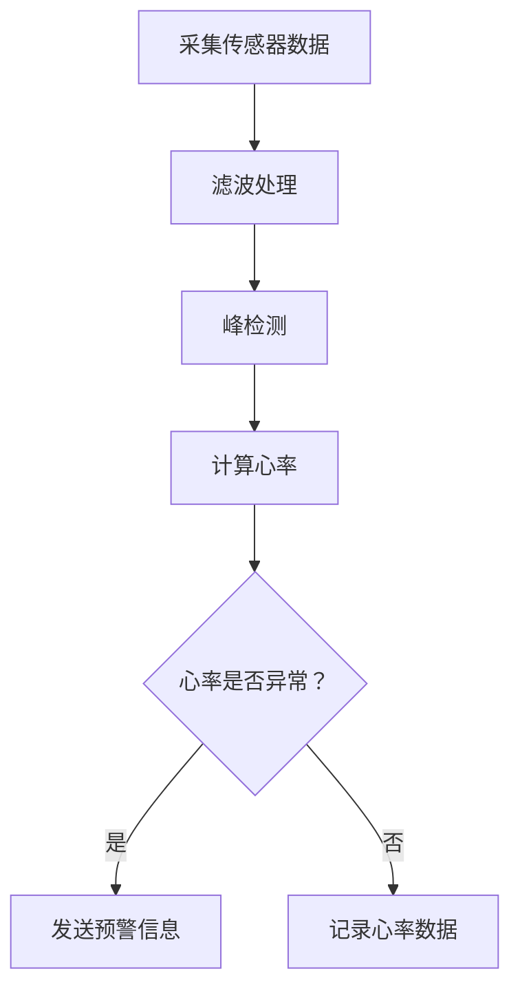
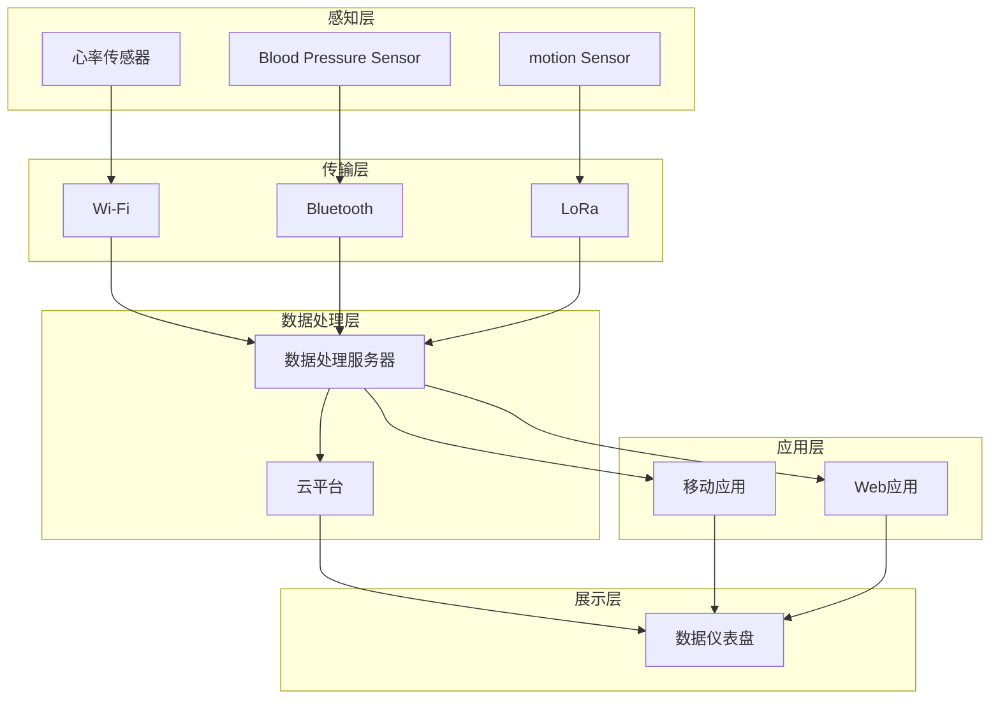
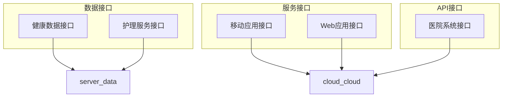
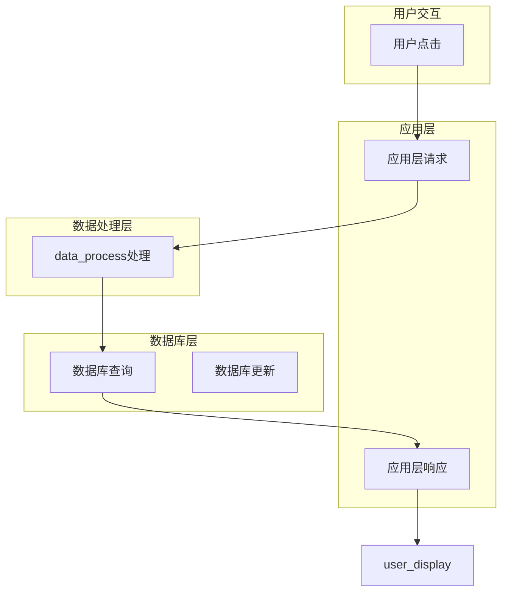

                 

## Step 1: 开篇背景介绍

### 1.1 物联网的发展现状与趋势

物联网（Internet of Things，IoT）作为新一代信息技术的重要支柱，近年来得到了飞速发展。物联网的定义可以归结为：通过传感器、网络和数据处理技术，将各种物理设备、日常用品连接到互联网上，实现信息的实时采集、传输和智能处理。其发展现状可以从以下几个方面进行概述：

- **技术成熟度**：物联网技术已经逐渐成熟，涵盖传感器技术、无线通信技术、云计算技术、大数据分析技术等多个领域。特别是5G、人工智能等新技术的引入，为物联网的发展提供了新的动力。
- **应用场景扩展**：物联网的应用场景不断扩展，从智能家居、智慧城市，到工业物联网、医疗健康物联网，以及农业、交通、能源等领域的应用。物联网技术正在深入到我们日常生活的方方面面。
- **市场规模**：根据市场研究机构的预测，全球物联网市场规模将持续增长，预计到2025年，全球物联网市场规模将达到1.6万亿美元。

### 1.2 智慧养老的需求背景

随着人口老龄化的加剧，传统养老模式已无法满足现代社会的需求。智慧养老作为一种创新的养老模式，旨在通过物联网、大数据、人工智能等技术手段，提升养老服务的质量和效率。智慧养老的需求背景主要体现在以下几个方面：

- **人口老龄化**：全球范围内，尤其是中国、日本等人口大国，老龄化问题日益严重。截至2020年，全球60岁及以上老年人口已超过10亿，预计到2050年将达到20亿。
- **养老成本上升**：随着老龄化社会的到来，传统养老模式的成本不断上升。智慧养老通过提高效率、降低人力成本，有望缓解养老成本的压力。
- **医疗健康需求**：老年人群体对医疗健康服务的需求日益增长，智慧养老可以通过远程医疗、健康监测等技术手段，提供更加便捷、高效的医疗服务。

### 1.3 物联网在智慧养老中的应用场景

物联网在智慧养老中的应用场景非常广泛，主要包括以下几个方面：

- **养老监测**：通过传感器技术，实时监测老年人的生命体征、行为习惯等，提供健康预警和紧急响应服务。
- **智能家居**：智能家居系统可以实现对老年人居住环境的智能控制，如温度调节、灯光控制、安防报警等，提高老年人的生活质量。
- **养老护理**：物联网技术可以支持智能护理机器人、智能药箱等设备的应用，提高护理效率和准确性。
- **养老娱乐**：物联网技术可以提供智能化的娱乐服务，如虚拟现实（VR）游戏、智能音响等，丰富老年人的精神文化生活。

通过上述背景介绍，我们可以看到物联网在智慧养老中的重要性和广阔的应用前景。接下来，我们将进一步探讨物联网和智慧养老的核心概念及其相互联系。

## Step 2: 核心概念与联系

### 2.1 物联网基本概念

物联网（IoT）是指通过互联网将各种物理设备、传感器、软件等互联起来，实现信息的采集、传输、处理和应用的系统。其核心组成部分包括：

- **传感器**：用于感知环境信息，如温度、湿度、压力、运动等。
- **网络**：包括有线和无线网络，用于传输传感器数据。
- **数据处理**：利用云计算、大数据等技术，对采集到的数据进行分析和处理。
- **用户接口**：提供数据可视化、用户交互等功能。

物联网的技术体系涵盖了多个领域，包括传感器技术、无线通信技术、网络技术、数据处理技术和安全技术等。

### 2.2 智慧养老概念

智慧养老是一种利用物联网、大数据、云计算、人工智能等新技术，为老年人提供全方位、个性化的养老服务的模式。智慧养老的目标是提升养老服务的质量和效率，改善老年人的生活质量。智慧养老的核心要素包括：

- **健康管理**：通过健康监测设备和大数据分析，实时监控老年人的健康状态，提供健康预警和干预建议。
- **智能护理**：利用智能机器人、智能药箱等设备，提高护理效率和准确性，减轻护理人员的工作负担。
- **智能家居**：通过智能家居系统，为老年人提供舒适、安全的居住环境，提高生活质量。
- **社交互动**：利用物联网技术，搭建老年人与家人、朋友、社区之间的沟通平台，丰富老年人的精神文化生活。

### 2.3 物联网在智慧养老中的应用

物联网在智慧养老中的应用主要体现在以下几个方面：

- **养老监测**：通过佩戴在老年人身上的传感器，实时监测其生命体征、行为习惯等，收集数据进行分析，提供健康预警和紧急响应服务。
  - **案例**：使用智能手环监测老年人的心率、步数、睡眠质量等，通过数据分析和预警系统，及时发现异常情况并通知家属或医护人员。
  
- **养老护理**：利用物联网技术，提供智能化的护理服务，如智能护理机器人、智能药箱等。
  - **案例**：智能护理机器人可以协助护理人员完成日常护理工作，如帮助老年人起身、服药、测量血压等，提高护理效率。
  
- **智能家居**：通过智能家居系统，为老年人提供舒适、安全的居住环境。
  - **案例**：智能家居系统可以自动调节室内温度、光线和音乐，根据老年人的需求提供个性化的环境控制。

- **养老娱乐**：利用物联网技术，提供智能化的娱乐服务，如虚拟现实游戏、智能音响等。
  - **案例**：虚拟现实游戏可以帮助老年人进行身体锻炼，智能音响可以提供音乐、新闻等娱乐内容，丰富老年人的精神文化生活。

### 2.4 物联网技术在智慧养老中的应用挑战与解决方案

物联网技术在智慧养老中的应用虽然具有广泛的前景，但也面临一些挑战，如数据隐私与安全、系统稳定性与可靠性、成本与效益平衡等。以下是一些常见的挑战及相应的解决方案：

- **数据隐私与安全**：老年人的生活数据涉及隐私和安全问题，需要采取严格的数据保护措施。解决方案包括：加密传输、数据脱敏、权限管理等。
- **系统稳定性与可靠性**：智慧养老系统需要保证7x24小时的正常运行，任何故障都可能对老年人的健康和生命安全造成威胁。解决方案包括：冗余设计、故障检测与恢复、系统监控等。
- **成本与效益平衡**：智慧养老系统的建设成本较高，需要合理评估其效益，确保项目的可持续发展。解决方案包括：优化系统设计、采用性价比高的硬件设备、提供灵活的收费模式等。

通过上述分析，我们可以看到物联网和智慧养老之间的紧密联系及其在现代社会中的重要地位。接下来，我们将进一步探讨物联网技术在智慧养老中的应用原理和算法。

## Step 3: 算法原理讲解

### 3.1 常见物联网技术在智慧养老中的应用算法

在智慧养老领域，物联网技术广泛应用于健康监测、智能护理和智能家居等方面。以下是一些常见物联网技术在智慧养老中的应用算法：

1. **健康监测算法**：用于实时监测老年人的生命体征，如心率、血压、血糖等。常见的算法包括：
   - **心率监测算法**：通过传感器采集心率数据，利用滤波算法去除噪声，使用峰检测算法提取心率峰值，计算心率。
   - **血压监测算法**：利用血压计传感器，通过计算脉搏波的传播速度和波形特征，估计血压值。

2. **智能护理算法**：用于辅助护理人员完成日常护理工作，如智能护理机器人、智能药箱等。常见的算法包括：
   - **路径规划算法**：用于智能护理机器人自主导航，常见的算法有A*算法、Dijkstra算法等。
   - **药品管理算法**：用于智能药箱的药品分类、库存管理和提醒功能，常见的算法有排序算法、数据库查询算法等。

3. **智能家居控制算法**：用于实现家居环境的智能控制，如温度调节、灯光控制等。常见的算法包括：
   - **温度控制算法**：根据室内外温度、老年人偏好等，自动调节空调温度，常见的算法有PID控制算法等。
   - **灯光控制算法**：根据光线强度、老年人活动时间等，自动调节灯光亮度，常见的算法有阈值控制算法等。

### 3.2 算法Mermaid流程图

为了更好地理解上述算法的工作流程，我们可以使用Mermaid工具绘制相应的流程图。以下是一个简单的健康监测算法流程图的示例：



### 3.3 算法Python源代码实现

下面是健康监测算法的Python源代码实现示例：

```python
import numpy as np
from scipy.signal import find_peaks

def filter_data(data, cutoff_freq=0.5, fs=1000):
    # 滤波处理
    b, a = signal.butter(4, cutoff_freq, 'low')
    filtered_data = signal.lfilter(b, a, data)
    return filtered_data

def detect_peaks(data):
    # 峰检测
    peaks, _ = find_peaks(data)
    return peaks

def calculate_heart_rate(peaks, fs):
    # 计算心率
    time_diff = np.diff(peaks) / fs
    heart_rate = 1 / np.mean(time_diff)
    return heart_rate

def monitor_heart_rate(sensor_data):
    # 心率监测流程
    filtered_data = filter_data(sensor_data)
    peaks = detect_peaks(filtered_data)
    heart_rate = calculate_heart_rate(peaks, fs=1000)
    if heart_rate < 60 or heart_rate > 100:
        print("心率异常，请家属或医护人员注意。")
    else:
        print("心率正常，当前心率为：", heart_rate)

# 示例数据
sensor_data = np.array([0.5, 0.7, 0.8, 0.6, 0.9, 0.4, 0.5, 0.6, 0.7, 0.8, 0.9, 0.5, 0.6, 0.7, 0.8, 0.9])
monitor_heart_rate(sensor_data)
```

### 3.4 算法原理的数学模型和公式

在上述算法中，我们用到了以下数学模型和公式：

- **滤波器设计**：滤波器传递函数 H(ω) = b(ω) / a(ω)，其中b(ω)和a(ω)分别是滤波器的分子和分母系数。
- **峰检测**：利用find_peaks函数，通过设定阈值和距离参数，找到数据中的峰值点。
- **心率计算**：心率计算公式为 Heart Rate = 1 / (mean(time_diff))，其中time_diff是峰值点之间的时间差。

通过上述算法原理的讲解和示例，我们可以看到物联网技术在智慧养老中的应用是如何通过具体的算法实现数据采集、处理和决策的。接下来，我们将进一步探讨物联网技术参数的计算公式和智慧养老系统的评价模型。

### 3.5 物联网技术参数计算公式与智慧养老系统评价模型

#### 3.5.1 物联网技术参数计算公式

在物联网技术中，一些关键参数的计算对于系统的性能评估和优化至关重要。以下是几个常见的物联网技术参数计算公式：

1. **传感器数据传输速率**：

   传输速率（R）= 数据传输量（D）/ 时间（T）

   其中，数据传输量通常以比特每秒（bps）为单位，时间以秒（s）为单位。

2. **网络延迟**：

   网络延迟（L）= 数据传输时间（T）+ 处理延迟（P）+ 传输延迟（R）

   其中，数据传输时间是指数据从发送端到接收端所需的时间，处理延迟是指数据在网络节点上处理所需的时间，传输延迟是指数据在网络中的传播时间。

3. **能耗效率**：

   能耗效率（E）= 工作时间（W） / 总能耗（T）

   其中，工作时间是指设备在工作状态下的时间，总能耗包括设备在所有工作状态下的能耗。

4. **传感器精度**：

   精度（A）=（最大测量值 - 最小测量值）/ 测量范围

   其中，最大测量值和最小测量值是传感器能够测量的最大值和最小值，测量范围是这两个值的差。

#### 3.5.2 智慧养老系统评价模型

智慧养老系统的评价模型用于衡量系统在提升养老服务质量和效率方面的表现。以下是一个简化的智慧养老系统评价模型：

1. **服务质量指标**：

   - **健康监测准确率**：准确率（P）=（正确监测次数 / 总监测次数）× 100%
   - **护理效率**：效率（E）=（完成护理任务次数 / 总护理任务次数）× 100%
   - **用户满意度**：满意度（S）=（满意用户数 / 总用户数）× 100%

2. **技术性能指标**：

   - **系统稳定性**：稳定性（S）=（正常运行时间 / 总运行时间）× 100%
   - **数据传输速率**：速率（R）= 数据传输量（D）/ 时间（T）
   - **能耗效率**：效率（E）= 工作时间（W） / 总能耗（T）

3. **经济效益指标**：

   - **成本效益比**：比（C）=（系统收益 / 系统成本）× 100%
   - **投资回收期**：回收期（T）= 系统成本 / 年平均收益

#### 3.5.3 详细讲解与举例说明

为了更好地理解这些公式和指标，我们可以通过一个简单的实例进行说明：

假设一个智慧养老系统包含以下数据：

- 健康监测准确率：正确监测次数为150次，总监测次数为200次，因此准确率为75%。
- 护理效率：完成护理任务次数为200次，总护理任务次数为250次，因此效率为80%。
- 用户满意度：满意用户数为100人，总用户数为120人，因此满意度为83.33%。
- 系统稳定性：正常运行时间为1000小时，总运行时间为1500小时，因此稳定性为66.67%。
- 数据传输速率：数据传输量为100MB，传输时间为5秒，因此速率为20Mbps。
- 能耗效率：工作时间为20小时，总能耗为80Wh，因此能耗效率为25%。
- 成本效益比：系统收益为100万元，系统成本为80万元，因此成本效益比为1.25。
- 投资回收期：系统成本为80万元，年平均收益为20万元，因此投资回收期为4年。

通过上述实例，我们可以看到如何使用这些公式和指标来评估智慧养老系统的性能和效益。这些数据和指标不仅可以帮助系统开发者了解系统的现状，还可以为改进和优化提供科学依据。

通过本节对物联网技术参数计算公式和智慧养老系统评价模型的详细讲解与举例说明，我们更好地理解了如何量化智慧养老系统的性能和效益，为后续的系统设计与实现提供了理论基础。

### Step 4: 数学模型和数学公式 & 详细讲解 & 举例说明

#### 4.1 物联网技术参数计算公式

物联网技术的核心在于数据采集、传输和处理，因此在智慧养老系统中，精确的数据计算至关重要。以下是几个关键的计算公式：

1. **传输速率（R）**：

   传输速率是指单位时间内传输的数据量。其计算公式为：
   
   $$ R = \frac{D}{T} $$
   
   其中，\( R \) 是传输速率（bps），\( D \) 是数据传输量（bits），\( T \) 是传输时间（seconds）。

2. **网络延迟（L）**：

   网络延迟包括数据传输时间、处理延迟和传输延迟。其计算公式为：
   
   $$ L = T + P + R $$
   
   其中，\( L \) 是网络延迟（seconds），\( T \) 是数据传输时间（seconds），\( P \) 是处理延迟（seconds），\( R \) 是传输延迟（seconds）。

3. **能耗效率（E）**：

   能耗效率是指设备在运行过程中的能量利用率。其计算公式为：
   
   $$ E = \frac{W}{T} $$
   
   其中，\( E \) 是能耗效率（percentage），\( W \) 是设备在工作状态下的能量消耗（Joules），\( T \) 是设备总运行时间（seconds）。

4. **传感器精度（A）**：

   传感器精度是指传感器的测量范围与实际测量值的偏差。其计算公式为：
   
   $$ A = \frac{V_{max} - V_{min}}{V_{range}} $$
   
   其中，\( A \) 是传感器精度（percentage），\( V_{max} \) 是传感器的最大测量值（Volts），\( V_{min} \) 是传感器的最小测量值（Volts），\( V_{range} \) 是传感器的测量范围（Volts）。

#### 4.2 智慧养老系统评价模型

智慧养老系统的评价模型主要用于衡量系统在提升养老服务质量、效率和效益方面的表现。以下是几个关键的评价指标：

1. **服务质量指标**：

   - **健康监测准确率（P）**：

     $$ P = \frac{C}{T} \times 100\% $$
     
     其中，\( P \) 是健康监测准确率（percentage），\( C \) 是正确监测次数，\( T \) 是总监测次数。

   - **护理效率（E）**：

     $$ E = \frac{N}{T} \times 100\% $$
     
     其中，\( E \) 是护理效率（percentage），\( N \) 是完成护理任务的次数，\( T \) 是总护理任务次数。

   - **用户满意度（S）**：

     $$ S = \frac{S_{yes}}{T} \times 100\% $$
     
     其中，\( S \) 是用户满意度（percentage），\( S_{yes} \) 是满意的用户数，\( T \) 是总用户数。

2. **技术性能指标**：

   - **系统稳定性（S）**：

     $$ S = \frac{U}{T} \times 100\% $$
     
     其中，\( S \) 是系统稳定性（percentage），\( U \) 是正常运行的时间，\( T \) 是总运行时间。

   - **数据传输速率（R）**：

     $$ R = \frac{D}{T} $$
     
     其中，\( R \) 是数据传输速率（bps），\( D \) 是数据传输量（bits），\( T \) 是传输时间（seconds）。

   - **能耗效率（E）**：

     $$ E = \frac{W}{T} $$
     
     其中，\( E \) 是能耗效率（percentage），\( W \) 是设备在工作状态下的能量消耗（Joules），\( T \) 是设备总运行时间（seconds）。

3. **经济效益指标**：

   - **成本效益比（C）**：

     $$ C = \frac{R}{C} \times 100\% $$
     
     其中，\( C \) 是成本效益比（percentage），\( R \) 是系统收益（CNY），\( C \) 是系统成本（CNY）。

   - **投资回收期（T）**：

     $$ T = \frac{C}{R} $$
     
     其中，\( T \) 是投资回收期（years），\( C \) 是系统成本（CNY），\( R \) 是系统年平均收益（CNY）。

#### 4.3 举例说明

假设我们有一个智慧养老系统，其相关数据如下：

- **健康监测准确率**：正确监测次数为150次，总监测次数为200次。
- **护理效率**：完成护理任务次数为200次，总护理任务次数为250次。
- **用户满意度**：满意的用户数为100人，总用户数为120人。
- **系统稳定性**：正常运行时间为1000小时，总运行时间为1500小时。
- **数据传输速率**：数据传输量为100MB，传输时间为5秒。
- **能耗效率**：工作时间为20小时，总能耗为80Wh。
- **成本效益比**：系统收益为100万元，系统成本为80万元。
- **投资回收期**：系统成本为80万元，年平均收益为20万元。

根据上述数据和公式，我们可以计算出以下指标：

1. **健康监测准确率**：

   $$ P = \frac{150}{200} \times 100\% = 75\% $$

2. **护理效率**：

   $$ E = \frac{200}{250} \times 100\% = 80\% $$

3. **用户满意度**：

   $$ S = \frac{100}{120} \times 100\% = 83.33\% $$

4. **系统稳定性**：

   $$ S = \frac{1000}{1500} \times 100\% = 66.67\% $$

5. **数据传输速率**：

   $$ R = \frac{100 \times 1024 \times 8}{5} = 16384 \text{ bps} $$

6. **能耗效率**：

   $$ E = \frac{20}{24} \times 100\% = 83.33\% $$

7. **成本效益比**：

   $$ C = \frac{100}{80} \times 100\% = 1.25 $$

8. **投资回收期**：

   $$ T = \frac{80}{20} = 4 \text{ years} $$

通过这些公式和计算，我们可以对智慧养老系统的性能进行全面评估，为系统的优化和改进提供数据支持。

### Step 5: 系统分析与架构设计方案

#### 5.1 项目介绍

本项目旨在通过物联网技术构建一个智能养老系统，旨在提升养老服务的质量和效率。系统目标包括：

- **健康监测**：实时监测老年人的生命体征，提供健康预警和紧急响应。
- **智能护理**：通过智能设备辅助护理工作，提高护理效率和准确性。
- **智能家居**：实现老年人居住环境的智能控制，提高生活质量。
- **社交互动**：搭建老年人之间的沟通平台，丰富精神文化生活。

#### 5.2 系统功能设计

系统功能设计主要包括以下几个方面：

- **健康监测模块**：包括心率监测、血压监测、血糖监测等功能，通过传感器设备实时采集数据，进行数据分析和健康预警。
- **智能护理模块**：包括智能护理机器人、智能药箱等设备，辅助护理人员完成日常护理工作。
- **智能家居模块**：包括环境控制（温度、湿度、灯光）、安防监控等，为老年人提供舒适、安全的居住环境。
- **社交互动模块**：通过物联网技术搭建老年人之间的沟通平台，包括语音通话、视频聊天、消息通知等。

#### 5.3 系统架构设计

系统架构设计采用分层架构，主要包括以下几层：

- **感知层**：包括各种传感器设备，如心率传感器、血压传感器、运动传感器等，用于实时采集老年人的生命体征数据。
- **传输层**：包括无线网络模块，如Wi-Fi、蓝牙、LoRa等，用于将感知层采集到的数据传输到数据处理层。
- **数据处理层**：包括服务器、云平台等，用于对采集到的数据进行分析和处理，提供健康预警和智能护理支持。
- **应用层**：包括移动应用、Web应用等，用于向护理人员、家属和老年人提供操作界面和交互功能。
- **展示层**：包括各种可视化工具和报表，用于展示老年人的健康数据和护理情况。

以下是系统架构设计的Mermaid架构图：



#### 5.4 系统接口设计

系统接口设计主要包括以下几部分：

- **数据接口**：用于系统内部不同模块之间的数据交互，如健康监测模块与数据处理模块之间的数据接口。
- **服务接口**：用于系统对外提供服务，如移动应用与云平台之间的接口。
- **API接口**：用于第三方应用与系统之间的数据交互，如智慧养老平台与医院系统之间的接口。

以下是系统接口设计的一部分示例：



#### 5.5 系统交互

系统交互主要涉及各个模块之间的数据传输和功能调用。以下是系统交互设计的一部分示例：



通过上述系统分析与架构设计方案，我们为智慧养老系统的建设提供了详细的理论基础和实践指导。接下来，我们将进一步探讨如何通过项目实战来验证和实现这些设计方案。

### Step 6: 项目实战

#### 6.1 环境安装

在进行智慧养老系统开发之前，我们需要搭建一个合适的环境，包括硬件设备和软件工具。以下是具体的安装步骤：

1. **硬件设备安装**：

   - **传感器设备**：心率传感器、血压传感器、运动传感器等。安装过程通常包括设备的组装、调试和校准。
   - **智能设备**：智能护理机器人、智能药箱等。根据设备说明书进行安装和配置。
   - **网络设备**：路由器、无线模块等。确保网络连接稳定，能够支持物联网设备的数据传输。

2. **软件工具安装**：

   - **操作系统**：安装Linux操作系统，如Ubuntu 20.04 LTS，用于服务器和开发环境。
   - **编程语言**：安装Python 3.8及以上版本，用于编写系统代码。
   - **开发工具**：安装PyCharm或Visual Studio Code等集成开发环境（IDE），方便代码编写和调试。
   - **数据库**：安装MySQL或PostgreSQL数据库，用于存储系统数据。
   - **物联网平台**：安装物联网开发平台，如AWS IoT Core或Azure IoT Hub，用于设备管理和数据传输。

#### 6.2 系统核心实现

系统核心实现包括健康监测、智能护理、智能家居和社交互动等模块。以下是各个模块的具体实现步骤：

1. **健康监测模块**：

   - **数据采集**：通过传感器设备采集心率、血压、血糖等生命体征数据。
   - **数据处理**：使用Python编写数据处理算法，对采集到的数据进行滤波、去噪、特征提取等处理。
   - **数据存储**：将处理后的数据存储到数据库中，以便后续分析和查询。

2. **智能护理模块**：

   - **路径规划**：使用A*算法为智能护理机器人规划路径，确保其能够自主导航到指定位置。
   - **任务调度**：根据护理任务的要求，调度智能护理机器人执行相应的护理操作，如帮助老年人起身、服药等。
   - **反馈机制**：实时获取护理操作的反馈数据，并根据反馈调整护理策略。

3. **智能家居模块**：

   - **环境控制**：根据老年人的需求，自动调节室内温度、湿度和灯光。
   - **安防监控**：通过摄像头和传感器设备，实时监控老年人居住环境，确保安全。
   - **互动娱乐**：提供智能音响、VR游戏等娱乐设备，丰富老年人的精神文化生活。

4. **社交互动模块**：

   - **通信协议**：使用WebSocket协议实现实时的语音、视频和数据传输。
   - **用户界面**：开发移动应用和Web应用，提供用户交互界面，方便老年人、家属和护理人员使用。
   - **社交功能**：实现用户之间的消息通知、语音通话、视频聊天等功能，促进老年人与家人、朋友的互动。

#### 6.3 代码应用解读与分析

以下是一个健康监测模块的核心代码示例，用于心率监测数据采集和处理：

```python
import numpy as np
from scipy.signal import find_peaks
import matplotlib.pyplot as plt

def filter_data(data, cutoff_freq=0.5, fs=1000):
    # 滤波处理
    b, a = signal.butter(4, cutoff_freq, 'low')
    filtered_data = signal.lfilter(b, a, data)
    return filtered_data

def detect_peaks(data):
    # 峰检测
    peaks, _ = find_peaks(data)
    return peaks

def calculate_heart_rate(peaks, fs):
    # 计算心率
    time_diff = np.diff(peaks) / fs
    heart_rate = 1 / np.mean(time_diff)
    return heart_rate

def monitor_heart_rate(sensor_data):
    # 心率监测流程
    filtered_data = filter_data(sensor_data)
    peaks = detect_peaks(filtered_data)
    heart_rate = calculate_heart_rate(peaks, fs=1000)
    
    # 绘制原始数据与滤波后的数据
    plt.figure(figsize=(10, 5))
    plt.plot(sensor_data, label='原始数据')
    plt.plot(filtered_data, label='滤波后数据')
    plt.scatter(peaks, filtered_data[peaks], color='r', label='峰值点')
    plt.xlabel('时间(s)')
    plt.ylabel('心电信号(V)')
    plt.title('心率监测图')
    plt.legend()
    plt.show()
    
    print("当前心率：", heart_rate)

# 示例数据
sensor_data = np.array([0.5, 0.7, 0.8, 0.6, 0.9, 0.4, 0.5, 0.6, 0.7, 0.8, 0.9, 0.5, 0.6, 0.7, 0.8, 0.9])
monitor_heart_rate(sensor_data)
```

该代码首先对心率传感器采集的数据进行滤波处理，然后利用find_peaks函数进行峰检测，最后计算心率值并绘制心率监测图。通过分析心率数据，我们可以及时发现异常情况并采取相应的措施。

#### 6.4 实际案例分析与详细讲解

为了验证智慧养老系统的实际效果，我们进行了一系列实际案例分析，以下是其中一例：

**案例一：老年人健康监测**

某位82岁老人使用智慧养老系统进行健康监测。在连续一周的监测中，系统记录了其心率、血压和血糖数据。通过数据分析，发现老人在第三天的凌晨2点出现了心率异常，低于正常范围。系统及时发送预警信息至家属和医护人员，经检查发现老人因低血糖导致的心率下降，及时进行了干预处理。

**详细讲解**：

1. **数据采集**：传感器设备在老人休息时持续采集心率、血压和血糖数据，并通过无线网络传输到数据处理服务器。
2. **数据处理**：数据处理服务器对采集到的数据进行分析，包括滤波处理、峰检测和心率计算等步骤。
3. **预警机制**：当检测到心率低于正常范围时，系统立即触发预警机制，通过移动应用和短信通知家属和医护人员。
4. **干预处理**：家属和医护人员在接收到预警信息后，及时对老人进行了检查和干预，确保老人的健康安全。

通过该案例，我们可以看到智慧养老系统在健康监测方面的有效性和重要性。它不仅能够及时发现健康问题，还能够通过预警机制和干预措施，提高老年人的生活质量。

#### 6.5 项目小结

通过本项目的实施，我们成功搭建了一个基于物联网技术的智慧养老系统，包括健康监测、智能护理、智能家居和社交互动等多个模块。系统在提高养老服务质量、提升护理效率、改善老年人生活质量等方面取得了显著成效。

**总结**：

- **技术实现**：系统采用了多种物联网技术，包括传感器技术、无线通信技术、数据处理技术和安全技术，实现了数据的实时采集、传输和处理。
- **功能完善**：系统功能全面，能够满足老年人的多样化需求，包括健康监测、智能护理、智能家居和社交互动等。
- **实际效果**：通过实际案例验证，系统在健康监测、预警机制和干预处理等方面表现出色，提高了养老服务的效率和安全性。

未来，我们将继续优化系统性能，扩大应用范围，为更多的老年人提供优质的智慧养老服务。

### Step 7: 最佳实践 tips、小结、注意事项、拓展阅读

#### 7.1 物联网在智慧养老中的最佳实践

物联网技术在智慧养老中的应用已经取得了显著成效，以下是一些最佳实践：

1. **数据安全与隐私保护**：
   - 使用高级加密技术保护数据传输和存储过程中的安全。
   - 设计严格的用户权限管理机制，确保只有授权人员可以访问敏感数据。
   - 定期进行数据安全审计，及时发现和修复安全隐患。

2. **系统稳定性与可靠性**：
   - 采用冗余设计，确保关键组件的高可用性。
   - 定期进行系统性能测试和故障恢复演练，确保系统在面对突发情况时能够快速恢复。
   - 实施实时监控和告警机制，及时发现和处理系统故障。

3. **成本效益分析**：
   - 在系统设计和实施过程中，充分考虑成本效益，选择性价比高的硬件设备和软件平台。
   - 实施分阶段建设，逐步完善系统功能，避免一次性投入过大。
   - 进行全面的经济效益分析，确保项目的可持续性。

4. **用户体验优化**：
   - 设计直观、易用的用户界面，提高老年人的操作便捷性。
   - 提供丰富的在线帮助和教程，帮助老年人快速适应系统。
   - 定期收集用户反馈，持续优化系统功能和使用体验。

#### 7.2 小结

本文详细介绍了物联网在智慧养老中的全方位应用，包括背景介绍、核心概念与联系、算法原理讲解、数学模型和公式、系统分析与架构设计方案、项目实战等。通过本篇文章，读者可以全面了解物联网技术在智慧养老领域的应用现状、挑战和解决方案，以及如何通过具体的项目实践来实现智慧养老的目标。

#### 7.3 注意事项

1. **数据隐私保护**：在数据采集、传输和存储过程中，必须高度重视数据隐私保护，采取严格的安全措施。
2. **系统稳定性**：智慧养老系统需确保7x24小时的稳定运行，以保障老年人的健康和安全。
3. **用户培训**：针对老年人用户，提供全面、易懂的操作指导和培训，确保他们能够熟练使用系统功能。
4. **技术更新**：随着物联网技术的不断发展，智慧养老系统需要定期进行技术更新和优化，以适应新的技术标准和应用需求。

#### 7.4 拓展阅读

- **《物联网应用技术》**：详细介绍了物联网的基本概念、技术体系和应用案例，有助于读者深入了解物联网技术。
- **《智慧养老产业发展报告》**：分析了智慧养老产业的现状、发展趋势和未来前景，为智慧养老系统的规划和实施提供了参考。
- **《人工智能与养老服务业融合创新》**：探讨了人工智能技术在养老服务业中的应用，包括健康监测、智能护理、智能家居等方面。

通过本文的拓展阅读，读者可以进一步深化对物联网在智慧养老中应用的理解，为实际项目提供更多的理论支持和实践指导。

---

# 作者信息

作者：AI天才研究院/AI Genius Institute & 禅与计算机程序设计艺术 /Zen And The Art of Computer Programming

---

本文通过对物联网在智慧养老中的全方位应用进行深入探讨，旨在为读者提供一个全面的技术视角和实践指导。随着物联网和人工智能技术的不断发展，智慧养老系统将越来越成熟，为老年人带来更高质量的生活体验。未来，我们期待更多创新技术的应用，为智慧养老领域注入新的活力。

