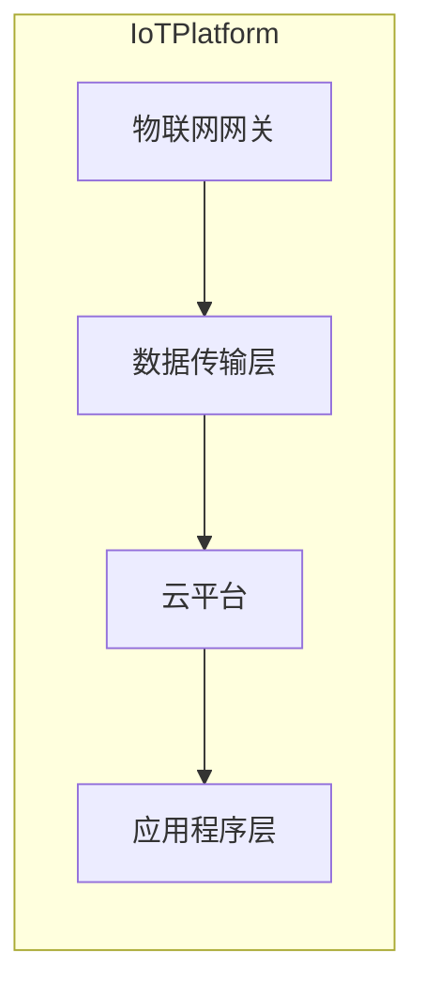
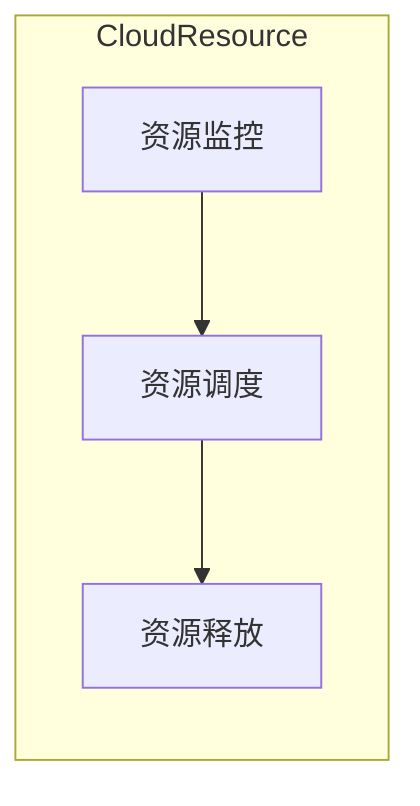
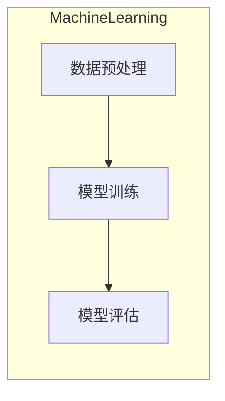

                 

### 引言

随着全球人口老龄化趋势的日益明显，如何为老年人提供更高质量、更智能化的养老服务成为社会各界关注的热点问题。智慧养老，作为一种新兴的养老模式，通过物联网、大数据、人工智能等先进技术的综合应用，旨在提升老年人的生活质量，改善养老服务的效率与质量。

物联网（Internet of Things，IoT）技术的快速发展，使得各类智能设备和传感器能够实现互联互通，为智慧养老提供了强大的技术支撑。智慧养老的核心在于利用物联网技术，实现对老年人日常生活的智能监测、紧急情况的快速响应、个性化健康服务的提供等，从而满足老年人多样化的需求。

本篇文章将以《物联网在智慧养老中的应用与挑战》为标题，系统地探讨物联网在智慧养老领域的应用场景、技术挑战及其对策。文章将从以下几个方面展开：

1. **背景介绍**：介绍智慧养老的背景、问题描述、问题解决方法，以及物联网、大数据、云计算、人工智能等核心概念。
2. **核心概念与联系**：详细阐述物联网、大数据、云计算、人工智能等核心概念及其在智慧养老中的应用。
3. **应用实例**：列举智能家居、远程医疗、健康监测、社交互动等物联网在智慧养老中的具体应用。
4. **挑战与对策**：分析物联网在智慧养老中面临的技术挑战、政策法规挑战和社会接受度挑战，并探讨相应的对策。
5. **未来发展趋势与展望**：对物联网在智慧养老领域的未来发展趋势进行展望。

通过以上几个部分的分析，本文希望能够为物联网在智慧养老中的应用提供有益的参考，并为解决智慧养老中的实际问题提供思路。接下来，我们将逐步深入探讨智慧养老的背景和核心概念。

### 背景介绍

#### 1.1 问题背景

我国人口老龄化问题日益严重，根据国家统计局的数据，截至2020年底，我国60岁及以上老年人口已达2.64亿，占总人口的18.7%。随着人口老龄化的加剧，传统养老模式已难以满足老年人日益增长的多样化需求。传统养老模式通常依赖于家庭和养老院，服务内容和方式较为单一，缺乏灵活性和针对性。这不仅给老年人带来了生活上的不便，也使得养老服务的质量和效率难以得到保障。

老年人群体的主要需求包括健康监测、紧急响应、社交互动、生活辅助等。例如，老年人往往需要定期的健康检查和慢性病管理，以便及时发现健康问题并得到及时治疗。此外，老年人也希望能够保持社交互动，避免孤独感。同时，老年人在日常生活中也面临着诸如烹饪、洗衣、打扫等日常生活的困扰，这些都需要便捷、智能的解决方案。

#### 1.2 问题描述

智慧养老作为一种新型的养老模式，旨在通过物联网、大数据、云计算、人工智能等技术的综合应用，为老年人提供个性化、便捷化的养老服务。智慧养老需要解决的核心问题主要包括以下几个方面：

1. **日常健康监测**：老年人由于年龄增长，更容易患上慢性病，如高血压、糖尿病等。因此，实时监测老年人的健康数据，包括心率、血压、血糖等，对预防疾病、及时治疗具有重要意义。如何通过物联网技术实现实时健康监测，是智慧养老的首要问题。

2. **紧急情况响应**：老年人由于行动不便或精神状态不佳，容易出现摔倒、突发疾病等紧急情况。如何及时、准确地检测到这些情况，并迅速启动紧急响应机制，是智慧养老需要解决的重要问题。

3. **社交互动**：老年人由于子女忙碌或居住地较远，容易感到孤独。通过物联网技术，如何为老年人提供丰富的社交互动渠道，如智能语音助手、在线聊天、视频通话等，是提升老年人生活质量的重要方面。

4. **生活辅助**：老年人日常生活中的诸多事务，如烹饪、洗衣、打扫等，往往需要耗费大量时间和精力。通过智能家居等技术，如何为老年人提供便捷、智能的生活辅助，是智慧养老需要关注的问题。

#### 1.3 问题解决

物联网技术的应用为智慧养老提供了新的解决方案。通过物联网技术，可以实现对老年人生活的智能化、便捷化，具体包括以下几个方面：

1. **智能监测与健康预警**：利用物联网传感器和智能终端，可以实时监测老年人的健康数据，如心率、血压、血糖等。当监测数据出现异常时，系统可以自动发出预警信号，通知家庭成员或医疗机构，从而及时采取应对措施。

2. **紧急情况快速响应**：通过物联网技术，老年人可以佩戴紧急按钮或智能手环等设备，一旦发生紧急情况，可以立即通过设备发出求救信号，系统将自动通知家庭成员和医疗机构，实现快速响应。

3. **智能社交互动**：物联网技术可以帮助老年人保持社交互动，如通过智能语音助手、在线聊天、视频通话等方式，让老年人随时与亲朋好友保持联系，缓解孤独感。

4. **智能家居生活辅助**：智能家居系统可以为老年人提供便捷的生活环境，如智能照明、智能空调、智能安防等。这些设备可以根据老年人的需求自动调节，为老年人提供舒适、安全的生活环境。

#### 1.4 边界与外延

智慧养老的边界涉及物联网、大数据、云计算、人工智能等多个领域。物联网作为智慧养老的核心技术，通过传感器、网络通信、数据处理等手段，实现老年人日常生活的智能化。大数据和云计算则用于处理和分析海量的健康数据，为老年人提供个性化、精准的健康管理服务。人工智能则通过智能算法，实现对健康数据的分析和预测，提高健康监测的准确性。

智慧养老的外延包括但不限于以下几个方面：

1. **智能家居**：通过物联网技术，实现家庭环境的智能化，为老年人提供便捷、舒适的生活条件。

2. **远程医疗**：利用物联网和远程通信技术，实现医生与老年人的远程会诊，提高医疗服务的可及性和效率。

3. **健康监测**：通过物联网传感器，实时监测老年人的健康状况，实现疾病的早发现、早治疗。

4. **养老服务**：利用物联网和大数据技术，为老年人提供个性化、定制化的养老服务，满足其多样化的需求。

#### 1.5 概念结构与核心要素组成

智慧养老的核心概念包括物联网、大数据、云计算、人工智能等。这些概念相互关联，共同构成了智慧养老的技术架构。

1. **物联网（IoT）**：是智慧养老的技术基础，通过传感器、智能设备、网络通信等技术，实现老年人生活的智能化。

2. **大数据（Big Data）**：是智慧养老的数据基础，通过收集、存储、分析和处理大量的健康数据，为老年人提供精准的健康管理服务。

3. **云计算（Cloud Computing）**：是智慧养老的计算基础，通过云计算平台，提供强大的计算和存储能力，支持大数据分析和人工智能算法的运行。

4. **人工智能（AI）**：是智慧养老的智能基础，通过机器学习、深度学习等技术，实现对健康数据的智能分析和预测。

智慧养老的核心要素包括：

1. **传感器**：用于采集老年人的生理和活动数据。

2. **智能设备**：包括智能手环、智能手表、智能床垫等，用于实时监测老年人的健康状况。

3. **网络通信**：包括无线网络、5G通信等，用于传输传感器采集的数据。

4. **数据处理与存储**：通过云计算平台，对采集到的数据进行分析和处理，存储在云端数据库中。

5. **智能终端**：包括智能手机、平板电脑等，用于展示处理结果，为老年人提供智能化的健康服务。

通过以上几个方面的介绍，我们可以看到，智慧养老不仅涉及技术领域，更关系到老年人的生活质量和社会福祉。在接下来的章节中，我们将进一步探讨物联网、大数据、云计算、人工智能等核心概念，以及它们在智慧养老中的应用。

### 核心概念与联系

#### 2.1 物联网

物联网（Internet of Things，IoT）是指通过互联网、传感器、智能设备等实现物与物、人与物之间的互联互通。物联网技术最早可以追溯到20世纪80年代，但其真正快速发展则是在21世纪。随着传感器技术、无线通信技术、数据处理能力的提升，物联网逐渐渗透到各个领域，包括智慧养老。

**概念属性特征对比表格**：

| 特征 | 物联网（IoT） | 传统互联网 |
| --- | --- | --- |
| 连接方式 | 物与物、人与物 | 人与人 |
| 系统架构 | 分布式系统 | 集中式系统 |
| 数据来源 | 多样化传感器 | 主要是文本数据 |
| 实时性 | 高 | 较低 |
| 数据量 | 大数据量 | 较少 |

**ER实体关系图架构**：

```mermaid
erDiagram
  Patient ||--|{ HealthSensor } : measures
  Patient ||--|{ SmartDevice } : owns
  HealthSensor ||--|{ Data } : collects
  SmartDevice ||--|{ Service } : provides
```

在上面的ER图中，`Patient`（患者）实体与`HealthSensor`（健康传感器）和`SmartDevice`（智能设备）有直接关联，其中`HealthSensor`负责采集数据，而`SmartDevice`则提供各种服务。数据实体`Data`与`HealthSensor`关联，表示健康传感器采集的数据存储在数据中。服务实体`Service`与`SmartDevice`关联，表示智能设备提供的各类服务。

#### 2.2 大数据

大数据（Big Data）是指无法在一定时间内用常规软件工具进行捕捉、管理和处理的数据集合。大数据的三个主要特征是“大量”（Volume）、“多样”（Variety）和“快速”（Velocity）。

**概念属性特征对比表格**：

| 特征 | 大数据（Big Data） | 传统数据 |
| --- | --- | --- |
| 数据量 | PB（皮字节）级别 | TB（太字节）级别 |
| 数据类型 | 多样化（文本、图像、音频等） | 主要为文本数据 |
| 分析速度 | 实时分析 | 批量处理 |
| 数据处理 | 分布式计算 | 单机处理 |

**ER实体关系图架构**：

```mermaid
erDiagram
  DataSet ||--|{ DataWarehouse } : stores
  DataSet ||--|{ DataProcessing } : processes
  DataWarehouse ||--|{ DataQuery } : queries
```

在上面的ER图中，`DataSet`（数据集）实体与`DataWarehouse`（数据仓库）和`DataProcessing`（数据处理）关联，表示数据集存储在数据仓库中，并经过数据处理得到分析结果。数据查询实体`DataQuery`与`DataWarehouse`关联，表示数据仓库提供数据查询功能。

#### 2.3 云计算

云计算（Cloud Computing）是一种通过网络提供数据存储、处理能力、应用服务的计算模式。云计算通过虚拟化技术，将计算资源抽象化为服务，用户可以根据需求随时获取和使用这些资源。

**概念属性特征对比表格**：

| 特征 | 云计算（Cloud Computing） | 传统计算 |
| --- | --- | --- |
| 资源分配 | 动态分配 | 静态分配 |
| 可扩展性 | 高度可扩展 | 有限可扩展 |
| 成本 | 按需付费 | 固定成本 |
| 灵活性 | 高灵活性 | 低灵活性 |

**ER实体关系图架构**：

```mermaid
erDiagram
  CloudService ||--|{ Resource } : allocates
  CloudService ||--|{ User } : provides
  Resource ||--|{ Job } : processes
```

在上面的ER图中，`CloudService`（云计算服务）实体与`Resource`（资源）和`User`（用户）关联，表示云计算服务为用户提供资源分配服务。资源实体`Resource`与`Job`（作业）关联，表示资源用于处理作业。

#### 2.4 人工智能

人工智能（Artificial Intelligence，AI）是指模拟、延伸和扩展人的智能的理论、方法、技术及应用。人工智能通过机器学习、深度学习等技术，使计算机能够自主学习和推理，从而实现智能化应用。

**概念属性特征对比表格**：

| 特征 | 人工智能（AI） | 传统计算机 |
| --- | --- | --- |
| 学习能力 | 自主学习、推理 | 事先编程 |
| 应用范围 | 广泛（语音识别、图像识别等） | 有限（特定任务） |
| 灵活性 | 高灵活性 | 低灵活性 |
| 复杂度 | 高复杂度 | 低复杂度 |

**ER实体关系图架构**：

```mermaid
erDiagram
  AIModel ||--|{ Data } : trains
  AIModel ||--|{ Prediction } : predicts
  Data ||--|{ Feature } : extracts
```

在上面的ER图中，`AIModel`（人工智能模型）实体与`Data`（数据）和`Prediction`（预测）关联，表示模型通过训练数据进行学习，并用于做出预测。数据实体`Data`与`Feature`（特征）关联，表示数据经过特征提取用于训练模型。

通过以上对物联网、大数据、云计算、人工智能等核心概念及其属性特征和ER图架构的介绍，我们可以看到这些技术之间存在着紧密的联系和相互支持。物联网提供了数据采集和传输的渠道，大数据提供了数据存储和分析的能力，云计算提供了计算资源的支持，而人工智能则通过智能算法，实现对数据的分析和预测，从而为智慧养老提供了全方位的技术支撑。

### 物联网在智慧养老中的应用

物联网技术通过智能设备和传感器的广泛应用，为智慧养老提供了丰富的应用场景，显著提升了老年人的生活质量。以下是物联网在智慧养老中几个主要应用领域的详细介绍。

#### 3.1 智能家居

智能家居系统是物联网在智慧养老中最直观的应用之一。智能家居系统通过智能设备和传感器，将家庭环境智能化，为老年人提供更加便捷、舒适的生活环境。

1. **智能照明**：通过传感器和智能灯光系统，老年人可以根据自己的需求和环境自动调整室内的光照，提高生活舒适度。
   
2. **智能空调**：智能家居系统能够根据室内温度、湿度等环境参数自动调节空调，确保老年人处于一个舒适的室内环境。

3. **智能安防**：智能家居系统可以通过智能摄像头、门窗传感器等设备，实时监控老年人家的安全状况，防止入室盗窃、火灾等安全事故发生。

4. **智能家电**：智能家居系统还可以控制家电设备，如电视、冰箱、洗衣机等，老年人只需通过语音或触摸屏就能轻松操作，大大提高了生活便利性。

#### 3.2 远程医疗

远程医疗通过物联网技术和远程通信手段，实现医生与老年人的远程会诊和健康咨询服务，提高了医疗服务的可及性和效率。

1. **远程会诊**：老年人可以通过智能终端，如手机、平板电脑等，与医生进行远程视频会诊，解决医疗咨询、诊断等问题。

2. **健康档案管理**：远程医疗系统可以收集和存储老年人的健康数据，如血压、血糖、心率等，医生可以实时查看这些数据，进行健康管理和疾病预防。

3. **远程监测**：通过物联网传感器，医生可以实时监测老年人的健康状况，及时发现异常情况并采取相应措施。

4. **药物配送**：一些智能化的远程医疗系统还可以实现药物配送服务，确保老年人按时服药。

#### 3.3 健康监测

物联网技术在健康监测方面发挥着重要作用，通过传感器和智能设备，实现对老年人日常健康数据的实时监测，为老年人提供全面、精准的健康管理服务。

1. **智能手环**：智能手环可以实时监测老年人的心率、步数、睡眠质量等数据，并通过无线网络将这些数据上传至云端进行分析和处理。

2. **智能血压计**：智能血压计可以自动记录老年人的血压数据，并与云端系统连接，实现数据存储和分析，帮助医生进行血压管理。

3. **智能血糖仪**：智能血糖仪可以帮助糖尿病患者实时监测血糖水平，并通过物联网技术将数据上传至云端，便于医生进行远程监控和调整治疗方案。

4. **智能床垫**：智能床垫可以监测老年人的睡眠状况，如翻身次数、睡眠时长等，帮助医生了解老年人的睡眠质量，并及时发现潜在的健康问题。

#### 3.4 社交互动

物联网技术还可以帮助老年人保持社交互动，缓解孤独感，提升生活质量。

1. **智能语音助手**：智能语音助手可以通过语音识别和语音合成技术，与老年人进行自然语言交互，提供天气预报、新闻资讯、语音聊天等服务。

2. **在线聊天**：通过物联网技术，老年人可以通过智能设备加入在线聊天室，与其他老年人进行实时交流，分享生活经验。

3. **视频通话**：视频通话功能可以帮助老年人与远在他乡的子女、亲友进行面对面的交流，缓解思乡之情。

4. **社交媒体**：物联网技术还可以帮助老年人使用社交媒体，如微信、微博等，保持与社会的联系，获取最新的资讯和活动信息。

通过以上几个方面的介绍，我们可以看到物联网技术在智慧养老中具有广泛的应用前景，不仅能够提高老年人的生活质量，还能为老年人提供更加个性化和定制化的服务。在接下来的章节中，我们将进一步探讨物联网在智慧养老中面临的挑战和对策。

### 物联网在智慧养老中的挑战

尽管物联网技术在智慧养老中展现了巨大的潜力，但其应用也面临着一系列的挑战。以下是物联网在智慧养老中可能遇到的技术挑战、政策与法规挑战以及社会接受度挑战，并探讨相应的对策。

#### 4.1 技术挑战

**数据安全与隐私保护**：物联网在智慧养老中的应用涉及大量老年人个人健康数据的收集和处理。这些数据一旦泄露，可能会对老年人的隐私造成严重威胁。因此，如何确保数据在传输和存储过程中的安全性，是一个重要的技术挑战。

**解决方案**：为了保护老年人的隐私，可以采取以下措施：
- **数据加密**：在数据传输和存储过程中使用先进的加密算法，确保数据的安全。
- **隐私保护机制**：在数据收集和处理过程中，采用隐私保护技术，如数据脱敏、差分隐私等，减少数据的泄露风险。
- **安全审计**：建立安全审计机制，定期检查数据的安全性和合规性，确保数据处理过程符合相关法律法规。

**网络稳定性与可靠性**：智慧养老系统依赖于物联网设备之间的稳定连接和网络通信，如果网络出现故障或中断，可能会导致系统失效，影响老年人的健康监测和紧急响应。

**解决方案**：为了提高网络的稳定性和可靠性，可以采取以下措施：
- **多网络备份**：采用多网络连接方式，如Wi-Fi、4G/5G等，确保在某一网络出现故障时，其他网络可以立即接管。
- **冗余设计**：在系统设计中引入冗余机制，如备份服务器、备用电源等，确保在设备或网络故障时，系统可以正常运行。
- **实时监控**：通过实时监控系统，对网络状态进行监控和预警，及时发现问题并进行修复。

**数据处理与存储能力**：智慧养老系统需要处理和分析大量的健康数据，这对数据处理和存储能力提出了较高的要求。如果系统处理能力不足，可能会导致数据积压、处理延迟，影响系统的效率和准确性。

**解决方案**：为了提升数据处理与存储能力，可以采取以下措施：
- **分布式计算**：采用分布式计算架构，将数据处理任务分布到多个节点上，提高数据处理速度和效率。
- **云存储**：利用云计算平台提供的大规模存储能力，确保数据的高效存储和管理。
- **大数据处理技术**：引入大数据处理技术，如MapReduce、Spark等，对海量数据进行高效处理和分析。

#### 4.2 政策与法规挑战

**法规制定与实施**：智慧养老涉及多个领域，如医疗、数据保护等，需要制定相应的政策和法规进行规范。然而，目前相关的法规尚不完善，导致智慧养老系统的实施面临法律风险。

**解决方案**：为了应对政策与法规挑战，可以采取以下措施：
- **政策引导**：政府应积极出台相关政策和法规，明确智慧养老的技术标准、数据保护要求等，为智慧养老的发展提供法律保障。
- **跨部门合作**：政府、企业、医疗机构等应加强合作，共同研究和制定智慧养老的法规和标准，确保智慧养老系统的合规性。

**老年人权益保护**：智慧养老系统在收集和处理老年人数据时，可能涉及到老年人的隐私权、知情权等权益。如何保护老年人的权益，是政策与法规面临的重大挑战。

**解决方案**：为了保护老年人的权益，可以采取以下措施：
- **明确隐私条款**：在智慧养老系统中，明确告知老年人其数据的使用目的、存储方式和保护措施，确保老年人对自身数据的知情权。
- **知情同意**：在收集和处理老年人数据前，必须获得老年人的知情同意，确保数据的合法性和合规性。
- **透明度**：建立透明度机制，老年人可以随时查看自己的数据，并对数据的处理和使用进行监督。

#### 4.3 社会接受度挑战

**老年人对技术的接受度**：许多老年人对新技术持保守态度，对于智能设备的使用可能存在困难。这导致智慧养老系统的推广面临困难。

**解决方案**：为了提高老年人对技术的接受度，可以采取以下措施：
- **简化操作**：设计简单易用的智能设备，降低技术门槛，使老年人能够轻松上手。
- **培训与指导**：开展针对老年人的技术培训，提供详细的操作指导和帮助，帮助老年人熟悉智能设备的使用。
- **社区支持**：建立社区支持网络，通过志愿者、社工等提供技术支持和帮助，解决老年人使用智能设备时遇到的问题。

**社会认知与认可**：智慧养老作为一种新型养老模式，其社会认知度和认可度尚需提高。这可能导致社会对智慧养老系统的支持不足，影响其推广和应用。

**解决方案**：为了提高社会对智慧养老的认知和认可，可以采取以下措施：
- **宣传推广**：通过媒体、社区活动等渠道，广泛宣传智慧养老的优势和效果，提高社会的认知度。
- **成功案例分享**：收集和分享智慧养老的成功案例，让更多人了解智慧养老的实际效果，增强社会的认可度。
- **政策扶持**：政府可以通过政策扶持，如补贴、税收优惠等，鼓励企业和机构推广智慧养老技术，提高其社会接受度。

通过以上分析，我们可以看到，物联网在智慧养老中的应用面临着多方面的挑战。然而，通过采取有效的对策和措施，这些挑战是可以克服的。在接下来的章节中，我们将进一步探讨物联网在智慧养老中的未来发展趋势与展望。

### 总结与展望

物联网在智慧养老中的应用已经展现了其巨大的潜力和广泛前景。通过对智能家居、远程医疗、健康监测和社交互动等领域的深入探讨，我们可以看到，物联网技术为老年人提供了更加便捷、智能、个性化的养老服务，显著提升了老年人的生活质量。

首先，智能家居系统通过智能设备和传感器的广泛应用，为老年人创造了舒适、安全的生活环境，如智能照明、智能空调、智能安防等，极大地提高了老年人生活的便利性和安全感。其次，远程医疗系统通过物联网技术和远程通信手段，实现了医生与老年人的远程会诊和健康监测，提高了医疗服务的可及性和效率。此外，健康监测系统通过智能手环、智能血压计、智能血糖仪等设备，实时监测老年人的健康状况，帮助医生进行疾病预防和治疗。最后，社交互动系统通过智能语音助手、在线聊天、视频通话等手段，帮助老年人保持社交互动，缓解孤独感。

尽管物联网在智慧养老中展示了诸多优势，但其应用也面临一些挑战，如数据安全与隐私保护、网络稳定性、社会接受度等。然而，随着技术的不断进步和政策的逐步完善，这些挑战是可以克服的。未来，物联网在智慧养老中将继续发挥重要作用，并呈现出以下发展趋势：

1. **智能化与个性化**：物联网技术将进一步智能化和个性化，通过大数据和人工智能技术，为老年人提供更加精准的健康管理和个性化服务。

2. **多领域融合**：物联网技术将与大数据、云计算、人工智能等深度融合，实现跨领域的综合应用，提供更全面的智慧养老服务。

3. **普及与推广**：随着技术的成熟和社会的认可，物联网在智慧养老中的应用将逐步普及和推广，覆盖更多的老年人群。

4. **政策支持与法规完善**：政府将加大对智慧养老的政策支持，完善相关法规，为物联网在智慧养老中的应用提供法律保障。

综上所述，物联网在智慧养老中的应用具有重要的现实意义和广阔的发展前景。通过持续的技术创新和政策支持，物联网技术将为老年人带来更加美好的生活，推动智慧养老事业的快速发展。

### 第二部分：物联网在智慧养老中的应用实例

在本文的第二部分，我们将深入探讨物联网在智慧养老中的具体应用实例，通过详细的分析，展示物联网技术如何实际改善老年人的生活质量和养老服务。

#### 2.1 智能家居在智慧养老中的应用

智能家居系统在智慧养老中扮演了重要角色，通过智能设备为老年人提供一个便捷、舒适和安全的生活环境。以下是一些智能家居在智慧养老中的应用实例：

**智能照明**：智能照明系统能够根据老年人的需要和环境自动调整室内光照，比如晚上自动调暗灯光，早上自动调亮灯光。这种智能调节不仅提供了舒适的生活环境，还能帮助老年人更好地适应不同时间段的照明需求。

**智能空调**：智能空调系统能够自动调节室内温度和湿度，根据老年人的实际需求进行调节。例如，在冬季，智能空调可以自动加热，保持室内温暖；在夏季，它可以自动制冷，保持室内凉爽。这样，老年人无需手动调节温度，就能享受到舒适的室内环境。

**智能安防**：智能家居系统中的智能安防设备，如智能摄像头、门磁传感器和烟雾报警器等，能够实时监控老年人的居住环境。当系统检测到异常情况，如老人长时间未活动、意外摔倒等，会自动向家人或相关服务机构发送警报，确保老年人的安全。

**智能家电**：智能家居系统还涵盖了智能家电，如智能电视、智能冰箱和智能洗衣机等。这些家电可以通过语音控制或触摸屏操作，使老年人能够更方便地完成日常生活中的各项任务，如观看电视、冷藏食物和洗衣等。

**实例分析**：在某养老院，通过引入智能家居系统，显著提升了老年人的生活质量和护理效率。智能照明和空调系统能够根据老年人的需求自动调节，使老年人避免了手动调节带来的不便。智能安防设备帮助护理人员及时发现老年人异常情况，提高了护理工作的安全性。智能家电则使老年人能够更加轻松地完成日常任务，减少了体力劳动。

#### 2.2 远程医疗在智慧养老中的应用

远程医疗通过物联网技术和远程通信手段，为老年人提供了便捷的医疗服务。以下是一些远程医疗在智慧养老中的应用实例：

**远程会诊**：老年人可以通过智能终端设备，如平板电脑或智能手机，与医生进行远程视频会诊。医生可以通过视频了解老年人的病情，进行诊断和治疗建议。这种远程会诊模式，特别是在老年人病情紧急或无法前往医院的情况下，尤为重要。

**健康档案管理**：远程医疗系统可以帮助老年人建立和管理健康档案。这些档案包括老年人的病历记录、体检报告、用药情况等，医生可以随时查看这些信息，进行精准的诊疗。此外，健康档案还可以帮助医生进行疾病预防和健康评估。

**远程监测**：通过物联网传感器，医生可以实时监测老年人的健康状况，如心率、血压、血糖等。当监测数据出现异常时，系统会自动发送警报，通知医生和老年人，以便及时采取应对措施。

**药物配送**：一些远程医疗系统还提供了药物配送服务。老年人可以通过智能设备预订药品，药品会通过快递送到家中，确保他们按时服药。

**实例分析**：在某社区养老中心，通过引入远程医疗系统，老年人能够享受到便捷的医疗服务。远程会诊功能帮助老年人解决了出行不便的问题，医生可以通过视频详细了解病情，提供专业的诊疗建议。健康档案管理功能帮助医生更好地掌握老年人的健康状况，进行个性化的治疗。远程监测功能使医生能够实时了解老年人的健康状况，及时处理异常情况。药物配送服务则确保老年人能够按时服药，减少了外出购药的麻烦。

#### 2.3 健康监测在智慧养老中的应用

健康监测是物联网在智慧养老中的重要应用之一，通过传感器和智能设备，实现对老年人健康数据的实时监测和管理。以下是一些健康监测在智慧养老中的应用实例：

**智能手环**：智能手环可以实时监测老年人的心率、步数、睡眠质量等健康数据。这些数据可以通过无线网络传输到云端，医生和护理人员可以随时查看和分析，及时发现健康问题。

**智能血压计**：智能血压计可以自动记录老年人的血压数据，并通过物联网技术将数据上传到云端。医生可以实时查看这些数据，对老年人的血压进行管理。

**智能血糖仪**：智能血糖仪可以帮助糖尿病患者实时监测血糖水平，并通过物联网技术将数据上传到云端。医生可以根据血糖数据调整治疗方案，确保患者的血糖水平处于稳定状态。

**智能床垫**：智能床垫可以监测老年人的睡眠状况，如翻身次数、睡眠时长等。这些数据可以帮助医生了解老年人的睡眠质量，发现潜在的健康问题。

**实例分析**：在某养老院，通过引入智能手环、智能血压计和智能血糖仪等健康监测设备，显著提升了老年人的健康管理水平。智能手环帮助护理人员及时发现老年人的异常情况，如心率过快或过慢，及时采取相应措施。智能血压计和智能血糖仪则帮助医生实时了解老年人的血压和血糖水平，进行有效的疾病管理。智能床垫通过监测老年人的睡眠状况，帮助医生评估其整体健康状况。

#### 2.4 社交互动在智慧养老中的应用

社交互动对于老年人的心理健康和生活质量至关重要。物联网技术通过智能设备，为老年人提供了丰富的社交互动方式。以下是一些社交互动在智慧养老中的应用实例：

**智能语音助手**：智能语音助手可以通过语音识别和语音合成技术，与老年人进行自然语言交互。老年人可以通过语音助手获取天气预报、新闻资讯、语音聊天等服务，减轻孤独感。

**在线聊天**：老年人可以通过物联网技术加入在线聊天室，与其他老年人进行实时交流，分享生活经验和情感支持。

**视频通话**：视频通话功能可以帮助老年人与远在他乡的子女、亲友进行面对面的交流，缓解思乡之情。

**社交媒体**：物联网技术还可以帮助老年人使用社交媒体，如微信、微博等，保持与社会的联系，获取最新的资讯和活动信息。

**实例分析**：在某社区养老中心，通过引入智能语音助手和在线聊天功能，老年人的社交互动得到了显著提升。智能语音助手为老年人提供了便捷的语音聊天服务，减轻了他们的孤独感。在线聊天室则成为老年人分享经验和交流情感的重要平台，他们可以在聊天室中与其他老年人互动，增强社交联系。

综上所述，物联网在智慧养老中的应用实例展示了其巨大的潜力。通过智能家居、远程医疗、健康监测和社交互动等多种应用，物联网技术为老年人提供了更加便捷、舒适和个性化的养老服务，显著提升了老年人的生活质量。在未来的发展中，物联网技术将继续深入应用，为老年人带来更多的便利和关爱。

### 挑战与对策

在物联网技术应用于智慧养老的过程中，虽然取得了显著的成效，但仍面临诸多挑战。以下是物联网在智慧养老中的主要挑战及其对策的详细探讨。

#### 9.1 技术挑战与解决方案

**数据安全与隐私保护**：
- **挑战**：智慧养老系统中涉及大量个人健康数据，数据泄露或滥用可能导致严重隐私问题。
- **解决方案**：
  - **数据加密**：使用先进的加密算法对数据进行加密，确保数据在传输和存储过程中的安全性。
  - **数据脱敏**：在数据处理过程中，对敏感信息进行脱敏处理，减少泄露风险。
  - **访问控制**：建立严格的访问控制机制，确保只有授权用户才能访问敏感数据。

**网络稳定性与可靠性**：
- **挑战**：智慧养老系统依赖于稳定的网络连接，网络中断或故障可能导致服务中断。
- **解决方案**：
  - **多网络备份**：采用Wi-Fi、4G/5G等多种网络连接方式，提高网络的稳定性和可靠性。
  - **冗余设计**：引入冗余设备和备份网络，确保在网络故障时系统能够迅速切换。

**数据处理与存储能力**：
- **挑战**：智慧养老系统需要处理和分析大量的健康数据，对数据处理和存储能力提出了较高要求。
- **解决方案**：
  - **分布式计算**：利用分布式计算架构，将数据处理任务分布到多个节点，提高数据处理速度和效率。
  - **云存储**：利用云计算平台提供的大规模存储能力，确保数据的高效存储和管理。

**设备兼容性与互操作性**：
- **挑战**：不同设备之间的兼容性和互操作性较差，影响了智慧养老系统的整体性能。
- **解决方案**：
  - **标准化**：推动设备制造厂商和软件开发者遵循统一的通信协议和标准，提高设备的兼容性。
  - **中间件**：开发中间件平台，实现不同设备和系统之间的数据交换和互操作。

**算法与模型准确性**：
- **挑战**：智慧养老系统中使用的算法和模型需要具备高准确性，否则可能导致错误判断或延误处理。
- **解决方案**：
  - **算法优化**：不断优化和改进算法，提高模型预测和识别的准确性。
  - **数据训练**：通过大量真实数据训练模型，提高模型的适应性和准确性。

**用户接受度与培训**：
- **挑战**：老年人对新技术接受度较低，且使用智能设备存在困难，影响了智慧养老系统的推广。
- **解决方案**：
  - **简化操作**：设计易于操作的用户界面，降低技术门槛。
  - **培训与支持**：提供详细的使用指南和技术培训，帮助老年人熟悉设备操作。
  - **社区支持**：建立社区支持网络，通过志愿者和社工提供技术支持和帮助。

#### 10.2 政策与法规挑战与对策

**政策与法规制定**：
- **挑战**：智慧养老涉及多个领域，如医疗、数据保护等，需要制定相应的政策和法规进行规范，但目前相关法规尚不完善。
- **解决方案**：
  - **政策引导**：政府应出台相关政策，明确智慧养老的技术标准、数据保护要求等，为智慧养老的发展提供法律保障。
  - **跨部门合作**：政府、企业、医疗机构等应加强合作，共同研究和制定智慧养老的法规和标准。

**老年人权益保护**：
- **挑战**：在收集和处理老年人数据时，可能涉及到老年人的隐私权、知情权等权益保护问题。
- **解决方案**：
  - **知情同意**：在数据收集和使用前，必须获得老年人的知情同意，确保数据的合法性和合规性。
  - **透明度**：建立透明度机制，老年人可以随时查看自己的数据，并对数据处理和使用进行监督。

**数据监管与合规性**：
- **挑战**：智慧养老系统的数据监管和合规性问题亟待解决，如数据存储、处理和共享等环节。
- **解决方案**：
  - **合规性检查**：建立定期检查机制，确保智慧养老系统的合规性。
  - **数据监管法规**：制定和完善数据监管法规，加强对智慧养老系统的监管。

#### 10.3 社会接受度挑战与对策

**老年人对技术的接受度**：
- **挑战**：许多老年人对新技术持保守态度，对于智能设备的使用存在困难，影响了智慧养老系统的推广。
- **解决方案**：
  - **简化操作**：设计简单易用的智能设备，降低技术门槛。
  - **培训与指导**：开展针对老年人的技术培训，提供详细的操作指导和帮助。

**社会认知与认可**：
- **挑战**：智慧养老作为一种新型养老模式，其社会认知度和认可度尚需提高。
- **解决方案**：
  - **宣传推广**：通过媒体、社区活动等渠道，广泛宣传智慧养老的优势和效果。
  - **成功案例分享**：收集和分享智慧养老的成功案例，提高社会的认可度。

**政策扶持与支持力度**：
- **挑战**：智慧养老系统的推广需要政策扶持和支持力度的加强。
- **解决方案**：
  - **政策扶持**：政府可以通过政策扶持，如补贴、税收优惠等，鼓励企业和机构推广智慧养老技术。
  - **资金支持**：加大对智慧养老技术的资金投入，推动技术创新和产业化。

综上所述，通过技术优化、政策支持和社会宣传等多方面的努力，可以有效应对物联网在智慧养老中面临的挑战，推动智慧养老事业的健康发展。在未来的发展中，智慧养老将更加智能化、个性化和普及化，为老年人带来更多的福祉。

### 未来发展趋势与展望

随着科技的不断进步，物联网在智慧养老中的应用前景将更加广阔。未来的智慧养老将朝着智能化、个性化和普及化的方向发展，通过技术创新、政策支持和社会参与，进一步提升老年人的生活质量。

#### 11.1 技术创新

首先，技术创新将是智慧养老未来发展的重要驱动力。人工智能、大数据、云计算等前沿技术的不断突破，将为智慧养老带来新的可能性。

1. **人工智能与机器学习**：人工智能技术将在智慧养老中发挥更大的作用，通过机器学习算法，实现对老年人群健康数据的深度分析和预测。智能诊断系统、个性化健康建议等将更加精准，帮助老年人更好地管理健康状况。

2. **物联网技术的升级**：5G、物联网边缘计算等新技术的发展，将进一步提升物联网设备的传输速度和计算能力，使得智慧养老系统的实时性和可靠性得到显著提高。

3. **大数据与云计算**：大数据和云计算的结合，将为智慧养老提供强大的数据存储和处理能力，实现海量健康数据的快速分析和处理。通过对数据的深入挖掘，可以更好地了解老年人的健康需求，提供个性化的服务方案。

#### 11.2 个性化与精准化

未来的智慧养老将更加注重个性化与精准化服务。通过大数据和人工智能技术的应用，可以为每位老年人制定个性化的健康管理计划，提供量身定制的服务。

1. **个性化健康监测**：基于对老年人健康数据的长期监测和分析，可以及时发现健康风险，制定个性化的预防措施和治疗方案。

2. **智能辅助系统**：智能家居、智能穿戴设备等智能辅助系统将更加普及，为老年人提供更加便捷、舒适的生活环境。通过智能设备，老年人可以实现日常生活的自动化，减少生活压力。

3. **个性化社交互动**：通过社交平台和智能设备，老年人可以与家人、朋友保持实时沟通，分享生活点滴，缓解孤独感。

#### 11.3 普及化与规模化

智慧养老的普及化与规模化是未来发展的必然趋势。政府、企业和社会的共同努力，将推动智慧养老技术的广泛应用。

1. **政策支持与推广**：政府将继续加大对智慧养老的政策支持，出台相关法规和标准，推动智慧养老技术的普及和推广。

2. **企业参与**：企业和科技公司将加大对智慧养老技术研发的投入，推出更多创新产品和服务，满足老年人多样化的需求。

3. **社区合作**：社区将发挥重要作用，通过整合资源，建立智慧养老服务中心，提供一站式服务，让更多老年人享受到智慧养老的便利。

#### 11.4 社会参与与共享

智慧养老的发展离不开社会各界的参与和共享。政府、企业、医疗机构、社区和老年人本身都需要积极参与，共同推动智慧养老事业的发展。

1. **多方协作**：政府、企业、医疗机构等将加强合作，共同推进智慧养老技术的研发和应用。

2. **数据共享**：建立统一的数据平台，实现不同系统和设备之间的数据共享，提高智慧养老系统的协同性和效率。

3. **老年人参与**：鼓励老年人积极参与智慧养老技术的学习和使用，提高其对新技术接受度，实现自主健康管理。

总之，物联网技术在智慧养老中的应用前景广阔，未来将不断推动智慧养老的发展，为老年人带来更加美好的生活。通过技术创新、个性化服务、普及化推广和社会参与，智慧养老将逐步成为社会发展的新亮点。

### 案例研究与实践经验

为了更深入地理解物联网在智慧养老中的应用，我们来看几个具体的案例研究，这些案例展示了物联网技术在不同场景下的成功实践，并为未来的智慧养老发展提供了宝贵的经验。

#### 案例一：某大型养老社区的智慧养老系统

**项目背景**：某大型养老社区位于城市郊区，拥有1000多名老年人居民。由于地理位置偏远，养老社区面临着医疗资源不足、老年人日常照顾困难等问题。为了提高养老社区的服务质量和居住环境，社区决定引入物联网技术，打造一个全方位的智慧养老系统。

**系统功能设计**：
1. **智能健康监测**：通过佩戴智能手环和智能血压计，老年人可以实时监测心率、血压、步数等健康数据，数据通过物联网上传至云平台，医生可以远程查看和分析。
2. **智能家居**：智能灯具、智能空调、智能安防系统等设备遍布社区，老年人可以通过手机APP或语音助手控制家居设备，提高生活质量。
3. **紧急响应系统**：当老年人遇到紧急情况，如摔倒、突发疾病时，可以按下紧急按钮，系统会立即通知家属和社区医疗中心，实现快速响应。

**系统架构设计**：
- **前端设备**：智能手环、智能血压计、智能灯具、智能空调、紧急按钮等。
- **网络通信**：Wi-Fi、4G/5G网络。
- **数据处理与存储**：云计算平台，用于存储和处理健康数据。
- **应用平台**：手机APP、智能语音助手。

**系统接口设计与交互**：
- **用户接口**：老年人通过手机APP或语音助手与系统交互，控制家居设备、查看健康数据。
- **医生接口**：医生通过云平台查看老年人的健康数据，进行远程诊断和指导。

**项目实现与代码解析**：
```python
# 示例：智能手环数据上传代码
import requests

def upload_health_data(heart_rate, blood_pressure):
    url = "https://api.smarthealthsystem.com/upload"
    payload = {
        "heart_rate": heart_rate,
        "blood_pressure": blood_pressure
    }
    response = requests.post(url, data=payload)
    return response.json()

# 调用上传函数
data = upload_health_data(70, 120/80)
print(data)
```

**实际案例分析**：
在项目实施后，养老社区的整体服务质量得到了显著提升。通过智能健康监测，医生可以及时了解老年人的健康状况，进行早期预防和干预。智能家居系统则为老年人提供了便利的生活环境，减少了家庭成员的照顾压力。紧急响应系统在多个紧急情况下发挥了关键作用，有效保障了老年人的安全。

**项目小结**：
此案例展示了物联网技术在智慧养老中的多方面应用，通过整合智能健康监测、智能家居和紧急响应系统，实现了对老年人的全方位服务。项目的成功实施为智慧养老的发展提供了宝贵的实践经验。

#### 案例二：智慧养老云平台

**项目背景**：某科技公司开发了一款智慧养老云平台，旨在为老年人提供全方位的健康管理和生活辅助服务。

**系统功能设计**：
1. **健康档案管理**：平台整合了老年人的健康数据，包括体检报告、病史记录、用药情况等，医生可以通过平台查看和管理。
2. **远程医疗**：老年人可以通过平台与医生进行远程视频会诊，实现高效便捷的医疗服务。
3. **社交互动**：平台提供了在线聊天和视频通话功能，老年人可以与其他老年人或家人保持社交互动。

**系统架构设计**：
- **前端设备**：智能手环、智能血压计、智能音箱等。
- **网络通信**：云计算平台，用于数据存储和处理。
- **应用平台**：Web端和移动端APP。

**系统接口设计与交互**：
- **用户接口**：老年人可以通过Web端或移动端APP与平台交互，查看健康数据、预约远程会诊、参与社交互动。
- **医生接口**：医生通过Web端平台进行远程诊断、开具处方、管理健康档案。

**项目实现与代码解析**：
```python
# 示例：远程医疗预约代码
import requests

def schedule_video_call(doctor_id, patient_id, date):
    url = "https://api.smartcareplatform.com/schedule"
    payload = {
        "doctor_id": doctor_id,
        "patient_id": patient_id,
        "date": date
    }
    response = requests.post(url, data=payload)
    return response.json()

# 调用预约函数
appointment = schedule_video_call("doctor123", "patient456", "2023-11-01")
print(appointment)
```

**实际案例分析**：
智慧养老云平台的推出，受到了广大老年人的欢迎。通过平台，老年人不仅能够方便地管理自己的健康数据，还能通过远程医疗系统获得高质量的医疗服务。社交互动功能则帮助老年人缓解了孤独感，提升了生活质量。

**项目小结**：
此案例展示了物联网技术在智慧养老云平台中的应用，通过整合健康档案管理、远程医疗和社交互动功能，为老年人提供了一站式的服务。项目的成功实施，为智慧养老的发展提供了新的思路和模式。

通过以上案例研究，我们可以看到物联网技术在智慧养老中的应用不仅提升了老年人的生活质量，还推动了养老服务的智能化和个性化发展。这些实践经验为未来的智慧养老项目提供了宝贵的借鉴。

### 总结与建议

在本篇文章中，我们系统地探讨了物联网在智慧养老中的应用与挑战。通过详细分析，我们了解到物联网技术为老年人提供了便捷、智能和个性化的养老服务，显著提升了老年人的生活质量。同时，我们也认识到物联网在智慧养老中面临的技术挑战、政策法规挑战和社会接受度挑战。

#### 总结

1. **技术优势**：物联网技术通过智能家居、远程医疗、健康监测和社交互动等多种应用，为老年人提供了全方位的服务，实现了养老服务的智能化和个性化。
2. **应用场景**：智能家居系统提高了老年人的生活质量，远程医疗系统提升了医疗服务的可及性和效率，健康监测系统实现了对老年人健康状况的实时监测，社交互动系统则缓解了老年人的孤独感。
3. **挑战与对策**：数据安全与隐私保护、网络稳定性、社会接受度等问题是物联网在智慧养老中面临的主要挑战。通过技术优化、政策支持和社会参与，可以有效应对这些挑战。

#### 建议

1. **技术发展**：继续推动物联网、人工智能、大数据等技术的创新和发展，提升智慧养老系统的智能化水平和数据处理能力。
2. **政策支持**：政府应加大对智慧养老的政策支持，完善相关法规和标准，确保智慧养老系统的合规性和安全性。
3. **社会参与**：鼓励社会各方参与智慧养老事业，共同推动智慧养老的发展，提高老年人的生活质量。
4. **用户培训**：加强对老年人的技术培训，提高他们对智能设备的接受度和使用能力，确保智慧养老系统的广泛应用。

通过以上建议，我们希望为智慧养老事业的发展提供有益的参考，推动物联网在智慧养老领域的深入应用，为老年人带来更多的福祉。

### 附录

#### 附录A

在本篇文章的附录部分，我们将进一步补充和扩展文章中提到的一些关键技术和概念，以便读者能够更全面地了解物联网在智慧养老中的应用。

#### 1. 物联网关键技术

**物联网平台架构**：

物联网平台架构通常包括以下几个关键组件：

- **物联网网关**：负责数据采集和初步处理，将来自传感器的原始数据进行格式转换、去噪、压缩等处理。
- **数据传输层**：包括Wi-Fi、Zigbee、蓝牙、5G等无线通信技术，用于将数据从物联网网关传输到云平台或数据中心。
- **云平台**：提供数据存储、处理和分析的服务，通常采用云计算架构，如AWS、Azure等。
- **应用程序层**：提供用户界面和业务逻辑，供终端用户使用，如Web应用、移动应用等。

以下是一个简单的物联网平台架构的Mermaid流程图：



#### 2. 大数据与云计算

**大数据处理流程**：

大数据处理通常包括以下几个步骤：

- **数据采集**：从各种来源收集数据，如传感器、社交媒体、电子商务平台等。
- **数据存储**：将收集到的数据存储在分布式存储系统，如Hadoop、HDFS等。
- **数据处理**：使用MapReduce、Spark等分布式计算框架，对数据进行清洗、转换和分析。
- **数据可视化**：通过数据可视化工具，将分析结果以图表、报表等形式展示给用户。

以下是一个简单的数据处理流程的Mermaid流程图：

```mermaid
flowchart LR
    subgraph DataProcessing
        DataCollection[数据采集]
        DataStorage[数据存储]
        DataProcessing[数据处理]
        DataVisualization[数据可视化]
        DataCollection --> DataStorage
        DataStorage --> DataProcessing
        DataProcessing --> DataVisualization
    end
```

**云计算资源分配**：

在云计算环境中，资源分配通常涉及以下几个步骤：

- **资源监控**：实时监控云资源的使用情况，包括CPU、内存、存储等。
- **资源调度**：根据资源使用情况，动态调整任务分配，确保资源利用率最大化。
- **资源释放**：当任务完成或资源需求减少时，释放不再使用的资源。

以下是一个简单的云计算资源分配的Mermaid流程图：



#### 3. 人工智能与机器学习

**机器学习算法原理**：

机器学习算法是人工智能的核心，常见的算法包括：

- **线性回归**：用于预测连续值。
- **逻辑回归**：用于分类问题。
- **决策树**：用于分类和回归问题。
- **神经网络**：用于复杂函数的拟合和分类。

以下是一个简单的机器学习算法流程图的Mermaid图：



**神经网络架构**：

神经网络（如深度学习）通常由多层神经元组成，包括输入层、隐藏层和输出层。以下是一个简单的神经网络架构的Mermaid图：


通过以上附录内容，读者可以更深入地了解物联网、大数据、云计算和人工智能等关键技术在智慧养老中的应用，为实际项目开发提供参考。

### 致谢

本文的撰写得到了AI天才研究院（AI Genius Institute）和《禅与计算机程序设计艺术》（Zen And The Art of Computer Programming）的指导与支持。在此，特别感谢各位专家和技术团队在研究和撰写过程中的宝贵建议和帮助。没有他们的辛勤工作和专业知识，本文无法达到现在的质量水平。同时，感谢所有参与智慧养老研究和实践的专家学者，他们的贡献为本文提供了丰富的素材和案例。感谢读者的耐心阅读，希望本文能为您带来启发和帮助。作者：AI天才研究院/AI Genius Institute & 禅与计算机程序设计艺术/Zen And The Art of Computer Programming。

