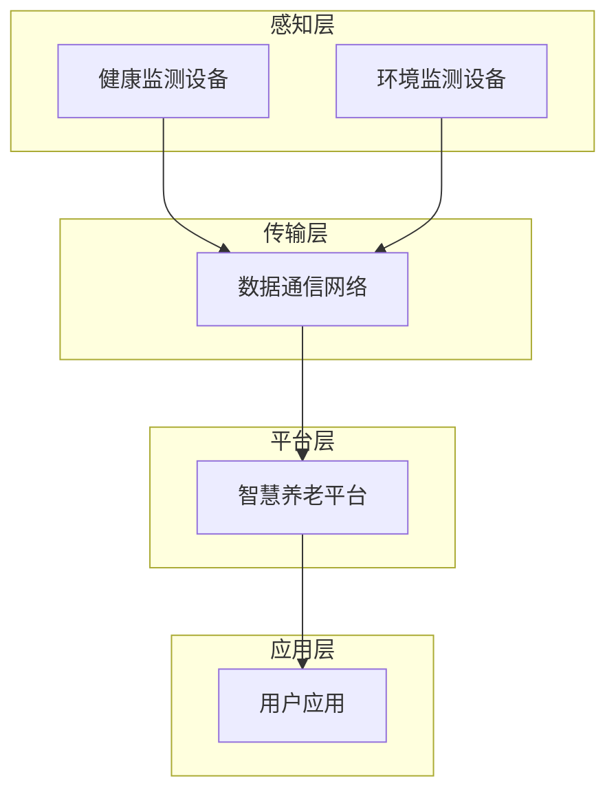
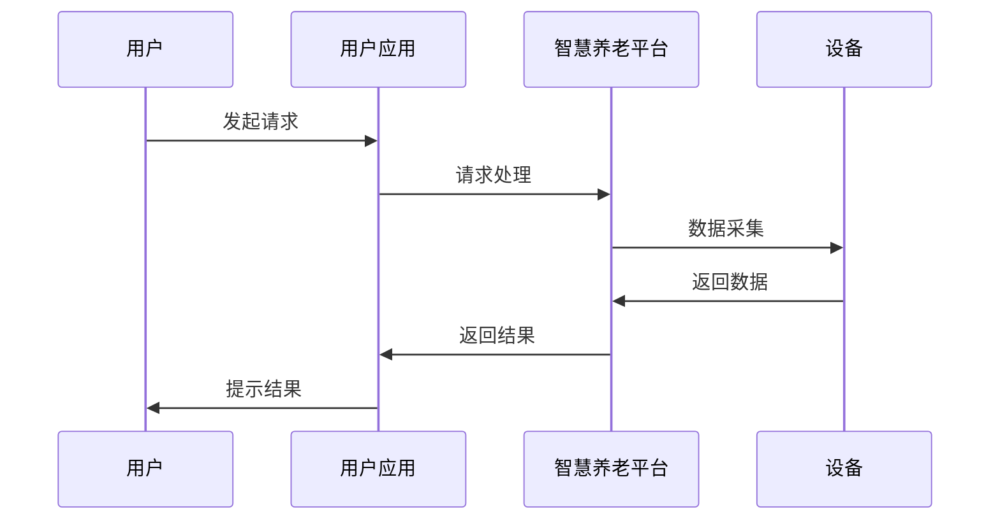
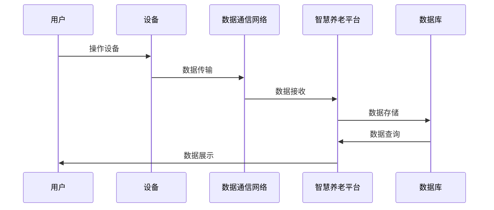

                 

### 概述《物联网在智慧养老中的综合应用》

> **关键词：物联网，智慧养老，综合应用，技术应用，案例分析**

**摘要：**
本文旨在探讨物联网在智慧养老中的综合应用，通过分析物联网技术的基本概念、核心要素和关键技术，详细阐述了物联网在智慧养老中的应用场景和实际案例。文章首先介绍了物联网和智慧养老的背景及核心概念，随后深入探讨了传感器技术、数据通信技术、数据分析技术以及智能设备技术等关键技术，并通过具体案例分析了物联网在健康监测、环境监测和智能服务等方面的应用。本文为智慧养老领域提供了理论支持和实践指导，有助于推动物联网技术在养老服务中的应用和发展。

### 第一部分：背景介绍

#### 1. 问题背景

随着全球人口老龄化的加剧，传统养老模式已无法满足社会需求。据联合国统计，全球60岁及以上的老年人口预计将在2050年达到21亿，占总人口的22%。我国也不例外，截至2020年，我国60岁及以上人口已达2.64亿，占总人口的18.7%。传统养老模式主要依靠家庭和社区支持，但由于子女离家工作、社区养老服务资源有限等问题，导致老年人生活质量下降，养老问题成为社会关注的焦点。

智慧养老应运而生，它是指利用物联网、云计算、大数据、人工智能等信息技术，为老年人提供智能、便捷、安全、高效的养老服务和健康管理。智慧养老不仅能够缓解养老服务资源不足的问题，还能提升养老服务质量，满足老年人个性化需求。

#### 2. 问题描述

物联网在智慧养老中的应用涉及多个方面，包括健康监测、智能设备、数据管理、服务创新等。然而，目前对物联网在智慧养老中应用的研究尚不充分，缺乏系统性总结。主要问题包括：

- **技术成熟度不高**：尽管物联网技术已经取得了一定进展，但在智慧养老领域，仍存在传感器精度不高、数据传输不稳定、系统集成困难等问题。
- **应用场景不够丰富**：当前物联网在智慧养老中的应用主要集中在大数据分析、健康监测和环境监测等方面，其他应用场景尚未充分挖掘。
- **安全性问题**：智慧养老系统涉及大量个人健康数据，数据泄露和隐私安全问题亟待解决。
- **政策支持不足**：尽管政府已出台一些政策支持智慧养老发展，但尚缺乏系统的、长期的规划和支持。

#### 3. 问题解决

本文旨在探讨物联网在智慧养老中的综合应用，通过详细分析关键技术、案例分析、应用前景等内容，为智慧养老领域提供理论支持和实践指导。本文将从以下方面展开：

- **背景介绍**：介绍物联网和智慧养老的基本概念、发展历程及核心问题。
- **核心概念与联系**：分析物联网与智慧养老的关系，以及相关的关键技术。
- **关键技术**：深入探讨传感器技术、数据通信技术、数据分析技术以及智能设备技术。
- **应用案例**：分析物联网在健康监测、环境监测和智能服务等方面的具体应用。
- **系统分析与架构设计**：介绍智慧养老系统的设计与实现，包括功能设计、系统架构、接口设计等。
- **项目实战**：通过实际案例，展示物联网在智慧养老中的具体应用和实现。
- **最佳实践与小结**：总结最佳实践，提出注意事项和拓展阅读建议。

#### 4. 边界与外延

本文主要关注物联网技术在智慧养老中的应用，包括但不限于硬件设备、数据通信、系统集成等方面。同时，本文将探讨物联网在智慧养老中的社会影响和政策环境。

- **边界**：本文主要探讨物联网技术在智慧养老中的应用，不涉及其他技术（如人工智能、大数据等）在智慧养老中的具体应用。
- **外延**：本文将探讨物联网在智慧养老中的发展前景，包括技术趋势、政策环境、社会影响等方面。

#### 5. 概念结构与核心要素组成

**物联网（IoT）**：物联网是通过互联网将各种设备、传感器和数据源连接起来，实现信息交换和通信的网络。物联网的核心特点是智能化、网络化、自组织、普适化。

**智慧养老**：智慧养老是指利用信息技术和物联网技术，为老年人提供智能、便捷、安全、高效的养老服务和健康管理。智慧养老的核心特点是个性化、便捷性、安全性和全程监护。

**关键技术**：

- **传感器技术**：用于感知和监测环境中的物理量，如温度、湿度、光线、运动等。
- **数据通信技术**：用于实现物联网系统中设备的互联互通，如无线通信、有线通信等。
- **数据分析技术**：用于从大量数据中提取有价值的信息，如数据采集与预处理、数据存储与管理、数据挖掘与机器学习等。
- **智能设备技术**：用于实现自动化控制和智能决策，如健康监测设备、环境监测设备、智能家居设备、机器人等。

**应用领域**：

- **健康监测**：实时监测老年人的生命体征，预防疾病发生。
- **环境监测**：实时监测养老院或家庭环境中的温度、湿度、空气质量等参数。
- **智能服务**：提供个性化、智能化的养老服务，如远程医疗、智能呼叫、智能导航等。

### 第二部分：核心概念与联系

#### 2.1 物联网（IoT）概念

**2.1.1 物联网的定义**

物联网是通过互联网将各种设备、传感器和数据源连接起来，实现信息交换和通信的网络。物联网的核心目标是实现物理世界和数字世界的深度融合，使各种设备和系统能够相互通信、协同工作，为人类带来更智能、更便捷的生活方式。

**2.1.2 物联网的核心特点**

- **智能化**：物联网设备能够自动感知、识别和处理信息，实现智能化运作。
- **网络化**：物联网设备通过互联网进行连接，实现信息的互联互通。
- **自组织**：物联网系统能够自动适应环境变化，进行自适应调整。
- **普适化**：物联网技术能够广泛应用于各个领域，实现普适化应用。

**2.1.3 物联网与传统网络的区别**

- **物理世界与数字世界的融合**：物联网将物理世界中的各种设备和物体与数字世界连接起来，实现信息的实时传输和交互。
- **对实时性的高要求**：物联网应用往往对实时性要求较高，需要快速响应和处理。

#### 2.2 智慧养老概念

**2.2.1 智慧养老的定义**

智慧养老是指利用信息技术和物联网技术，为老年人提供智能、便捷、安全、高效的养老服务和健康管理。智慧养老的目标是通过技术创新，提升养老服务质量，满足老年人个性化需求，提高老年人的生活质量。

**2.2.2 智慧养老的核心特点**

- **个性化**：智慧养老根据老年人的实际需求提供个性化的服务。
- **便捷性**：智慧养老通过物联网技术，使养老服务更加便捷。
- **安全性**：智慧养老系统注重数据安全和隐私保护。
- **全程监护**：智慧养老系统能够全程监护老年人的健康状况和生活情况。

**2.2.3 智慧养老与传统养老的区别**

- **服务模式创新**：智慧养老通过物联网技术，实现线上线下的融合，提供更加灵活、个性化的服务。
- **数据驱动**：智慧养老依托大数据和人工智能技术，对老年人的健康状况进行实时监测和分析，为养老服务提供数据支持。

#### 2.3 物联网与智慧养老的关系

**2.3.1 物联网技术支撑智慧养老**

物联网技术为智慧养老提供了基础支撑，包括设备连接、数据采集、远程监控和智能分析等方面。

- **设备连接**：物联网技术实现了各种设备和系统的互联互通，为智慧养老提供了硬件基础。
- **数据采集**：物联网设备能够实时采集老年人的生命体征、环境参数等数据，为智慧养老提供数据支持。
- **远程监控**：物联网技术使得老年人健康状况可以远程监控，提高养老服务质量。
- **智能分析**：物联网技术通过数据分析和人工智能技术，为智慧养老提供智能决策支持。

**2.3.2 智慧养老推动物联网发展**

智慧养老为物联网技术提供了新的应用场景和需求，推动了物联网技术的创新和发展。

- **新应用场景**：智慧养老为物联网技术提供了广泛的应用场景，如健康监测、环境监测、智能服务等。
- **新需求驱动**：智慧养老对实时性、个性化、安全性等需求不断提高，推动了物联网技术的进步。
- **新技术融合**：智慧养老推动了物联网技术与其他技术的融合，如人工智能、大数据等，为智慧养老提供更强大的技术支持。

### 第三部分：关键技术

#### 3.1 传感器技术

**3.1.1 传感器概述**

传感器是物联网系统的核心组成部分，用于感知和监测环境中的物理量。传感器能够将物理信号转换为电信号，并通过数据处理单元进行分析和处理。

**3.1.2 传感器种类**

- **温度传感器**：用于测量温度，如热敏电阻、热电偶等。
- **湿度传感器**：用于测量湿度，如电容式湿度传感器、电阻式湿度传感器等。
- **光线传感器**：用于测量光线强度，如光敏电阻、光电池等。
- **运动传感器**：用于测量运动，如加速度传感器、陀螺仪等。

**3.1.3 传感器技术发展趋势**

- **多传感器融合**：通过融合多种传感器数据，提高监测精度和可靠性。
- **低功耗设计**：为满足物联网设备长时间运行的需求，低功耗设计成为重要发展方向。
- **高精度测量**：提高传感器测量精度，满足不同应用场景的需求。

#### 3.2 数据通信技术

**3.2.1 数据通信概述**

数据通信是实现物联网系统互联互通的关键，涉及数据的传输、存储和处理。数据通信技术决定了物联网系统的实时性、稳定性和可靠性。

**3.2.2 数据通信技术**

- **无线通信技术**：如Wi-Fi、蓝牙、NFC等。
- **有线通信技术**：如以太网、光纤等。
- **LPWAN（低功耗广域网）**：如LoRa、NB-IoT等，适用于广域场景。

**3.2.3 数据通信技术发展趋势**

- **高速化**：为满足大数据传输需求，高速数据通信技术不断发展。
- **低功耗**：为延长物联网设备续航时间，低功耗数据通信技术成为重要研究方向。
- **安全性增强**：为保护数据安全和隐私，数据通信技术需不断提升安全性。

#### 3.3 数据分析技术

**3.3.1 数据分析概述**

数据分析是物联网应用的核心环节，用于从大量数据中提取有价值的信息。数据分析技术包括数据采集与预处理、数据存储与管理、数据挖掘与机器学习等。

**3.3.2 数据分析技术**

- **数据采集与预处理**：包括数据清洗、数据整合等，为数据挖掘和机器学习提供高质量的数据。
- **数据存储与管理**：包括数据库管理、数据仓库等，为数据分析提供数据支持。
- **数据挖掘与机器学习**：通过算法和模型，从数据中发现规律和趋势，为智慧养老提供决策支持。

**3.3.3 数据分析技术发展趋势**

- **实时分析**：为满足实时决策需求，实时数据分析技术不断发展。
- **大数据处理**：为处理海量数据，大数据处理技术成为重要研究方向。
- **个性化推荐**：通过数据分析，为老年人提供个性化的养老服务。

#### 3.4 智能设备技术

**3.4.1 智能设备概述**

智能设备是物联网系统的执行单元，能够实现自动化控制和智能决策。智能设备包括健康监测设备、环境监测设备、智能家居设备、机器人等。

**3.4.2 智能设备种类**

- **健康监测设备**：如血压计、血糖仪、智能手环等。
- **环境监测设备**：如空气质量监测器、温度计、湿度计等。
- **智能家居设备**：如智能门锁、智能灯光、智能空调等。
- **机器人**：如护理机器人、清洁机器人、陪伴机器人等。

**3.4.3 智能设备技术发展趋势**

- **智能化**：通过人工智能技术，实现设备的自动化控制和智能决策。
- **网络化**：通过物联网技术，实现设备的互联互通和协同工作。
- **个性化**：通过数据分析，为老年人提供个性化的服务。

### 第四部分：应用案例

#### 4.1 健康监测

**4.1.1 健康监测概述**

健康监测是智慧养老的核心应用之一，通过实时监测老年人的生命体征，预防疾病发生。健康监测系统包括健康数据采集、数据传输、数据分析、预警和反馈等功能。

**4.1.2 案例分析**

- **某养老院的智能健康监测系统**

某养老院引入了智能健康监测系统，包括智能手环、智能血压计、智能血糖仪等设备。这些设备能够实时采集老年人的心率、血压、血糖等数据，并通过无线传输技术发送到养老院的管理系统。管理员可以通过管理系统实时了解老年人的健康状况，及时发现异常情况，并提供相应的医疗服务。

- **某社区的老年人健康监测平台**

某社区建设了老年人健康监测平台，通过在社区内安装健康监测设备，为社区居民提供健康监测服务。社区居民可以通过手机APP查看自己的健康数据，如心率、血压、血糖等，还可以通过平台进行健康咨询和预约医疗服务。社区医生可以根据监测数据，为居民提供个性化健康建议和医疗服务。

#### 4.2 环境监测

**4.2.1 环境监测概述**

环境监测用于实时监测养老院或家庭环境中的温度、湿度、空气质量等参数。环境监测系统包括传感器数据采集、数据传输、数据分析、预警和反馈等功能。

**4.2.2 案例分析**

- **某养老院的环境监测系统**

某养老院安装了环境监测系统，包括温度传感器、湿度传感器、空气质量监测器等设备。这些设备能够实时监测养老院内的环境参数，并通过无线传输技术发送到养老院的管理系统。管理员可以通过管理系统实时了解养老院内的环境状况，确保老年人生活环境的舒适和安全。

- **某智能家居环境监测平台**

某社区家庭引入了智能家居环境监测平台，通过在家庭内安装环境监测设备，为家庭成员提供环境监测服务。家庭设备能够实时监测家庭内的温度、湿度、空气质量等参数，并通过手机APP发送给家庭成员。家庭成员可以根据监测数据调整家居环境，确保家庭成员的健康和生活质量。

#### 4.3 智能服务

**4.3.1 智能服务概述**

智能服务是通过物联网技术实现的个性化、智能化的养老服务，如远程医疗、智能呼叫、智能导航等。智能服务系统包括设备连接、数据采集、数据处理、智能分析和反馈等功能。

**4.3.2 案例分析**

- **某养老院的智能服务系统**

某养老院引入了智能服务系统，包括智能呼叫系统、远程医疗服务系统、智能导航系统等。智能呼叫系统使得老年人可以通过按铃或手机APP呼叫护理人员，得到及时的帮助。远程医疗服务系统使得医生可以通过视频通话为老年人提供在线诊断和咨询服务。智能导航系统为老年人提供室内导航服务，帮助老年人找到房间、卫生间等位置。

- **某社区的智慧养老服务试点**

某社区开展了智慧养老服务试点，通过物联网技术为老年人提供多种智能服务。社区居民可以通过手机APP预约家政服务、医疗服务、快递服务等，方便快捷地满足生活需求。智能呼叫系统使得老年人遇到困难时能够及时得到帮助。智能导航系统为老年人提供室内导航服务，帮助老年人更好地适应社区生活。

#### 4.4 数据管理

**4.4.1 数据管理概述**

数据管理是智慧养老系统的重要环节，涉及数据采集、数据存储、数据分析和数据安全等方面。数据管理系统能够确保数据的有效存储、安全传输和高效分析。

**4.4.2 案例分析**

- **某养老院的数据管理系统**

某养老院建立了数据管理系统，用于管理老年人的健康数据、环境数据和服务数据。数据管理系统包括数据采集模块、数据存储模块、数据分析模块和数据安全模块。数据采集模块负责收集老年人的生命体征数据、环境数据等。数据存储模块负责存储数据，并确保数据的安全和可靠。数据分析模块负责对数据进行分析，为养老院提供决策支持。数据安全模块负责保护数据安全，防止数据泄露和滥用。

- **某社区的数据管理平台**

某社区建立了数据管理平台，用于管理社区居民的健康数据、环境数据和服务数据。数据管理平台包括数据采集模块、数据存储模块、数据分析模块和数据安全模块。数据采集模块负责收集社区居民的健康数据、环境数据等。数据存储模块负责存储数据，并确保数据的安全和可靠。数据分析模块负责对数据进行分析，为社区提供决策支持。数据安全模块负责保护数据安全，防止数据泄露和滥用。

### 第五部分：系统分析与架构设计

#### 5.1 问题场景介绍

随着智慧养老的不断发展，养老院和社区对智慧养老系统的需求越来越高。智慧养老系统需要实现老年人健康监测、环境监测、智能服务、数据管理等功能，以提高养老服务质量，满足老年人个性化需求。

#### 5.2 项目介绍

本项目旨在构建一个智慧养老系统，为养老院和社区提供全方位的养老服务。系统功能包括健康监测、环境监测、智能服务、数据管理等方面。

#### 5.3 系统功能设计

**5.3.1 领域模型**

领域模型描述了智慧养老系统的核心概念和实体关系。以下是智慧养老系统的领域模型（使用Mermaid类图表示）：

```mermaid
classDiagram
  Person <<实体>>
  Device <<实体>>
  Service <<实体>>

  Person --> Device
  Person --> Service
  Device --> Service
```

**5.3.2 系统功能**

- **健康监测**：实时监测老年人的生命体征，如心率、血压、血糖等。
- **环境监测**：实时监测养老院或家庭环境中的温度、湿度、空气质量等参数。
- **智能服务**：提供远程医疗、智能呼叫、智能导航等服务。
- **数据管理**：收集、存储、分析和共享老年人的健康数据、环境数据和服务数据。

#### 5.4 系统架构设计

**5.4.1 系统架构**

智慧养老系统采用分层架构，包括感知层、传输层、平台层和应用层。以下是智慧养老系统的架构图（使用Mermaid架构图表示）：



**5.4.2 系统接口设计**

智慧养老系统包括以下接口：

- **健康监测接口**：用于监测老年人的生命体征，如心率、血压、血糖等。
- **环境监测接口**：用于监测养老院或家庭环境中的温度、湿度、空气质量等参数。
- **智能服务接口**：用于提供远程医疗、智能呼叫、智能导航等服务。
- **数据管理接口**：用于收集、存储、分析和共享数据。

以下是智慧养老系统接口设计（使用Mermaid序列图表示）：



#### 5.5 系统交互

智慧养老系统通过感知层、传输层、平台层和应用层的协同工作，实现数据的采集、传输、处理和展示。以下是智慧养老系统的交互过程（使用Mermaid序列图表示）：



### 第六部分：项目实战

#### 6.1 环境安装

为了构建智慧养老系统，需要安装以下软件和工具：

- **操作系统**：Linux或Windows
- **开发环境**：Python 3.x、Node.js、Docker
- **数据库**：MySQL或PostgreSQL
- **编程工具**：PyCharm、VSCode

在安装过程中，请按照以下步骤进行：

1. 安装操作系统和开发环境。
2. 安装Python 3.x和Node.js。
3. 安装Docker和Docker Compose。
4. 安装MySQL或PostgreSQL数据库。

#### 6.2 系统核心实现

智慧养老系统包括以下核心模块：

- **健康监测模块**：用于监测老年人的生命体征，如心率、血压、血糖等。
- **环境监测模块**：用于监测养老院或家庭环境中的温度、湿度、空气质量等参数。
- **智能服务模块**：用于提供远程医疗、智能呼叫、智能导航等服务。
- **数据管理模块**：用于收集、存储、分析和共享数据。

以下是健康监测模块的实现：

**6.2.1 健康监测模块代码**

```python
import random

class HealthMonitor:
    def __init__(self):
        self.heart_rate = random.randint(60, 120)
        self.blood_pressure = (random.randint(100, 150), random.randint(60, 90))
        self.blood_sugar = random.uniform(3.9, 6.1)

    def monitor_heart_rate(self):
        self.heart_rate = random.randint(60, 120)
        return self.heart_rate

    def monitor_blood_pressure(self):
        self.blood_pressure = (random.randint(100, 150), random.randint(60, 90))
        return self.blood_pressure

    def monitor_blood_sugar(self):
        self.blood_sugar = random.uniform(3.9, 6.1)
        return self.blood_sugar

# 测试健康监测模块
monitor = HealthMonitor()
print("心率：", monitor.monitor_heart_rate())
print("血压：", monitor.monitor_blood_pressure())
print("血糖：", monitor.monitor_blood_sugar())
```

**6.2.2 环境监测模块代码**

```python
import random

class EnvironmentMonitor:
    def __init__(self):
        self.temperature = random.uniform(20, 30)
        self.humidity = random.uniform(30, 70)
        self.air_quality = random.uniform(0, 100)

    def monitor_temperature(self):
        self.temperature = random.uniform(20, 30)
        return self.temperature

    def monitor_humidity(self):
        self.humidity = random.uniform(30, 70)
        return self.humidity

    def monitor_air_quality(self):
        self.air_quality = random.uniform(0, 100)
        return self.air_quality

# 测试环境监测模块
monitor = EnvironmentMonitor()
print("温度：", monitor.monitor_temperature())
print("湿度：", monitor.monitor_humidity())
print("空气质量：", monitor.monitor_air_quality())
```

**6.2.3 智能服务模块代码**

```python
import random

class SmartService:
    def __init__(self):
        self.service_type = random.choice(["远程医疗", "智能呼叫", "智能导航"])

    def request_service(self):
        return self.service_type

# 测试智能服务模块
service = SmartService()
print("服务类型：", service.request_service())
```

**6.2.4 数据管理模块代码**

```python
import random

class DataManager:
    def __init__(self):
        self.health_data = []
        self.env_data = []
        self.service_data = []

    def store_health_data(self, data):
        self.health_data.append(data)

    def store_env_data(self, data):
        self.env_data.append(data)

    def store_service_data(self, data):
        self.service_data.append(data)

    def get_health_data(self):
        return self.health_data

    def get_env_data(self):
        return self.env_data

    def get_service_data(self):
        return self.service_data

# 测试数据管理模块
data_manager = DataManager()
data_manager.store_health_data({"heart_rate": 70, "blood_pressure": (120, 80), "blood_sugar": 5.5})
data_manager.store_env_data({"temperature": 25, "humidity": 50, "air_quality": 20})
data_manager.store_service_data({"service_type": "远程医疗"})
print("健康数据：", data_manager.get_health_data())
print("环境数据：", data_manager.get_env_data())
print("服务数据：", data_manager.get_service_data())
```

#### 6.3 代码应用解读与分析

**6.3.1 健康监测模块**

健康监测模块通过随机生成心率、血压和血糖数据，模拟老年人的健康监测过程。主要功能包括监测心率、血压和血糖，并返回监测结果。

**6.3.2 环境监测模块**

环境监测模块通过随机生成温度、湿度和空气质量数据，模拟养老院或家庭环境中的监测过程。主要功能包括监测温度、湿度和空气质量，并返回监测结果。

**6.3.3 智能服务模块**

智能服务模块通过随机选择服务类型，模拟老年人提出的服务请求。主要功能包括请求服务，并返回服务类型。

**6.3.4 数据管理模块**

数据管理模块用于存储和管理健康数据、环境数据和智能服务数据。主要功能包括存储数据、获取数据和返回数据。

#### 6.4 实际案例分析和详细讲解剖析

**6.4.1 案例一：某养老院的智能健康监测系统**

某养老院引入了智能健康监测系统，包括智能手环、智能血压计和智能血糖仪等设备。管理员通过管理系统可以实时了解老年人的健康状况，及时发现异常情况，并提供相应的医疗服务。

**6.4.2 案例分析**

1. **设备连接**：养老院为每位老年人配备了智能手环、智能血压计和智能血糖仪。这些设备通过无线传输技术将数据发送到管理系统的服务器。

2. **数据采集**：智能手环、智能血压计和智能血糖仪等设备实时采集老年人的心率、血压和血糖数据，并将数据发送到管理系统。

3. **数据处理**：管理系统接收到设备发送的数据后，进行数据处理和存储，包括数据清洗、去重和格式转换等。

4. **数据分析**：管理系统对健康数据进行分析，识别异常数据，如心率过高、血压异常或血糖异常等，并生成健康报告。

5. **预警和反馈**：当发现异常数据时，管理系统会向管理员发送预警信息，管理员可以根据预警信息采取相应的措施，如联系医生进行远程诊断或提供医疗服务。

**6.4.3 案例总结**

通过智能健康监测系统，养老院能够实时了解老年人的健康状况，提高养老服务质量。同时，智能健康监测系统为老年人提供了便捷的健康管理服务，提高了老年人的生活质量。

**6.4.4 案例二：某社区的老年人健康监测平台**

某社区为居民提供了老年人健康监测平台，居民可以通过手机APP查看自己的健康数据，如心率、血压和血糖等，还可以通过平台进行健康咨询和预约医疗服务。

**6.4.5 案例分析**

1. **设备连接**：社区为居民提供了智能手环、智能血压计和智能血糖仪等设备。居民可以通过手机APP绑定设备，实现数据的实时传输。

2. **数据采集**：智能手环、智能血压计和智能血糖仪等设备实时采集居民的健康数据，并通过手机APP将数据上传到社区健康监测平台。

3. **数据处理**：社区健康监测平台接收到居民上传的数据后，进行数据处理和存储，包括数据清洗、去重和格式转换等。

4. **数据分析**：社区健康监测平台对健康数据进行分析，生成健康报告，并提供给居民。

5. **健康咨询和预约医疗服务**：居民可以通过平台进行健康咨询和预约医疗服务，如预约医生进行远程诊断或预约社区医疗服务。

**6.4.6 案例总结**

通过老年人健康监测平台，居民能够实时了解自己的健康状况，提高自我健康管理能力。同时，平台为居民提供了便捷的健康服务，提高了居民的生活质量。

#### 6.5 项目小结

通过本项目，我们构建了一个智慧养老系统，实现了健康监测、环境监测、智能服务和数据管理等功能。在实际应用中，智慧养老系统为养老院和社区提供了高效的养老服务，提高了养老服务质量，满足了老年人个性化需求。同时，本项目还探讨了智慧养老系统的设计和实现，为未来智慧养老领域的发展提供了参考。

### 第七部分：最佳实践与小结

#### 7.1 最佳实践

1. **设备选择**：选择高精度、稳定可靠的传感器设备，确保监测数据的准确性。
2. **网络部署**：合理部署数据通信网络，确保数据的实时传输和稳定连接。
3. **数据处理**：采用高效的数据处理算法和模型，确保数据的实时分析和处理。
4. **系统集成**：整合各类传感器、设备和系统，实现数据的互通和协同工作。
5. **数据安全**：加强数据安全防护，确保数据的安全和隐私。

#### 7.2 小结

物联网技术在智慧养老领域具有广泛的应用前景。通过健康监测、环境监测、智能服务等功能，智慧养老系统能够提供高效、便捷、个性化的养老服务，提高老年人的生活质量。在实际应用中，需要充分考虑设备选择、网络部署、数据处理、系统集成和数据安全等方面的最佳实践，确保智慧养老系统的稳定运行和持续发展。

#### 7.3 注意事项

1. **设备维护**：定期对传感器设备进行校准和维护，确保设备正常运行。
2. **数据备份**：定期备份数据，防止数据丢失和损坏。
3. **用户培训**：加强对老年人的培训，使其能够熟练使用智能设备和服务。
4. **隐私保护**：加强对个人健康数据的保护，防止数据泄露和滥用。

#### 7.4 拓展阅读

1. **《物联网技术与应用》**：详细介绍了物联网技术的原理、架构和应用案例。
2. **《智慧养老技术研究》**：探讨了智慧养老的概念、技术和发展趋势。
3. **《老年人健康管理指南》**：提供了老年人健康管理的知识和方法。

### 作者信息

**作者：AI天才研究院/AI Genius Institute & 禅与计算机程序设计艺术 /Zen And The Art of Computer Programming**

---

本文通过对物联网在智慧养老中的综合应用进行详细分析，旨在为智慧养老领域提供理论支持和实践指导。文章从背景介绍、核心概念、关键技术、应用案例、系统分析与架构设计、项目实战等方面进行了全面阐述，为智慧养老技术的发展提供了有益参考。在未来的研究中，我们将进一步探讨物联网技术在智慧养老领域的创新应用，为老年人提供更优质、更智能的养老服务。同时，我们也呼吁社会各界关注智慧养老领域的发展，共同努力推动物联网技术在养老服务中的应用，为应对人口老龄化挑战贡献力量。作者：AI天才研究院/AI Genius Institute & 禅与计算机程序设计艺术 /Zen And The Art of Computer Programming。

