                 

### 摘要

随着物联网（IoT）技术的不断发展，智慧农业已成为农业现代化的关键驱动力。病虫害监测作为农业生产中的关键环节，直接影响到作物的产量和品质。本文旨在探讨物联网技术在智慧农业病虫害监测中的应用，通过分析物联网核心技术的原理、系统设计与实现，以及实际案例，深入探讨如何利用物联网技术提升病虫害监测的准确性和效率。本文结构如下：首先介绍智慧农业与物联网的背景及核心概念，随后详细阐述物联网在农业中的应用和病虫害监测的挑战，接着介绍物联网核心技术，如传感器技术、数据采集与传输技术，以及病虫害监测算法原理。随后，通过系统设计与实现、物联网设备选型与部署，以及核心模块实现的详细分析，展示物联网在智慧农业病虫害监测中的实际应用。最后，通过项目实战、最佳实践与拓展阅读，为读者提供实用的指导和建议，总结物联网在智慧农业病虫害监测中的前景与未来发展方向。通过本文的探讨，希望能够为智慧农业的发展提供有价值的参考和启示。<!--markdown--># 第一部分：背景与核心概念

## 第1章：智慧农业与物联网概述

### 1.1 智慧农业的定义与发展趋势

智慧农业是指通过现代信息技术，特别是物联网、大数据、云计算、人工智能等高科技手段，对农业生产过程进行智能化管理，从而实现农业生产的高效、精准和可持续发展。智慧农业不仅提升了农业生产的效率和品质，还在很大程度上解决了资源利用问题和环境问题，对现代农业的发展具有重要的推动作用。

**问题描述**：智慧农业是什么，为何重要？

**问题解决**：智慧农业通过物联网等技术的集成应用，实现了以下目标：
1. **精准农业**：通过传感器实时监测土壤、气象、水分等环境参数，优化作物种植和管理。
2. **智能化管理**：利用大数据分析和人工智能技术，优化生产决策，提高农业产值。
3. **资源节约**：通过物联网设备实时监控和自动化控制，减少水资源和化肥的浪费。

**边界与外延**：智慧农业的范畴不仅包括种植作物，还涉及到畜牧业、水产养殖、农业机械等多个领域。它与其他领域如物联网、大数据、人工智能等紧密相连，共同推动农业现代化进程。

### 1.2 物联网在农业中的应用

物联网技术是智慧农业的核心驱动技术之一。它通过传感器、无线通信、数据处理等手段，将农业设备和作物连接起来，形成一个智能化的农业生产体系。

**问题描述**：物联网技术如何应用于农业？

**问题解决**：物联网在农业中的应用主要体现在以下几个方面：
1. **环境监测**：通过部署各类传感器，实时监测农田的土壤、气象、水质等环境参数。
2. **智能灌溉**：利用物联网技术实现精准灌溉，提高水资源利用效率。
3. **病虫害监测与防治**：通过物联网设备实时监测病虫害的发生情况，实现早期预警和精准防治。
4. **智能农业机械**：物联网技术使农业机械智能化，提高作业效率和安全性。

**边界与外延**：物联网在农业中的应用不仅局限于上述几个方面，还可以扩展到农业大数据分析、智能供应链管理、农产品质量追溯等领域。

### 1.3 病虫害监测的挑战与需求

病虫害监测是农业生产中的重要环节，传统的病虫害监测方法往往存在监测不及时、不准确等问题。物联网技术的引入，为病虫害监测带来了新的解决方案。

**问题描述**：农业病虫害监测的难点在哪里？

**问题解决**：农业病虫害监测面临的挑战包括：
1. **监测范围广**：农田面积大，病虫害分布不均，传统的监测手段难以全面覆盖。
2. **监测频率要求高**：病虫害发生迅速，需要高频次监测以实现早期预警。
3. **数据准确性要求高**：病虫害监测数据需要准确无误，以指导防治措施。

物联网技术如何改善病虫害监测？
1. **实时监测**：通过物联网传感器实现实时监测，及时获取病虫害发生信息。
2. **自动化处理**：利用物联网平台对采集的数据进行自动化处理和分析，提高监测准确性。
3. **智能预警**：通过物联网技术实现智能预警，提前预测病虫害的发生，减少损失。

**边界与外延**：病虫害监测的影响因素不仅包括自然环境因素，如温度、湿度、光照等，还包括农作物品种、生长周期等农业因素。物联网技术在这些方面的应用，进一步拓展了病虫害监测的范围和深度。<!--markdown-->## 第2章：物联网核心技术与原理

### 2.1 传感器技术

传感器是物联网系统中至关重要的一环，它们负责采集环境数据，并将这些数据转换为数字信号，以便进一步处理。在农业病虫害监测中，传感器技术发挥着核心作用。

**核心概念原理**：传感器技术的基本原理是通过物理或化学机制感应并响应特定类型的信号，如温度、湿度、光照、气体浓度等。这些信号被传感器转换为电信号，通过信号处理电路放大和转换后，由数据处理单元进行进一步分析。

**概念属性特征对比表格**：
| 传感器类型 | 特征属性 | 应用场景 |
| --- | --- | --- |
| 温度传感器 | 测量温度范围宽，响应速度快 | 病虫害监测、温室环境控制 |
| 湿度传感器 | 对环境湿度变化敏感，精度高 | 病虫害发生条件监测、灌溉管理 |
| 光照传感器 | 对光强度敏感，可用于测量光照强度和光谱 | 光照条件监测、植物生长环境控制 |
| 气体传感器 | 能检测特定气体浓度，如二氧化碳、氧气、氨气等 | 病虫害监测、空气质量评估 |

**ER实体关系图架构的Mermaid流程图**：

```mermaid
erDiagram
    Sensor ||--|{ EnvironmentData : 数据来源 }
    Plant ||--|{ PestDiseaseMonitoring : 监测数据应用 }
    Sensor ||--|{ AgriculturalMachine : 设备控制 }
```

该ER图展示了传感器作为数据采集源与环境数据、病虫害监测和农业机械之间的关系。通过这些传感器，农业生产者可以实时获取作物生长环境信息，进行精准管理。

### 2.2 数据采集与传输技术

物联网系统的数据采集与传输是确保病虫害监测信息准确性和及时性的关键。数据采集技术涉及到传感器硬件和采集系统的设计，而数据传输技术则确保了数据在传感器和数据处理中心之间的安全、可靠传输。

**核心概念原理**：数据采集与传输技术的基本原理是通过传感器采集环境数据，然后通过无线通信模块（如Wi-Fi、蓝牙、Zigbee、LoRa等）将数据发送到中央处理系统。这些通信模块通常具有低功耗、低延迟和广覆盖的特点，使得数据能够稳定传输。

**ER实体关系图架构的Mermaid流程图**：

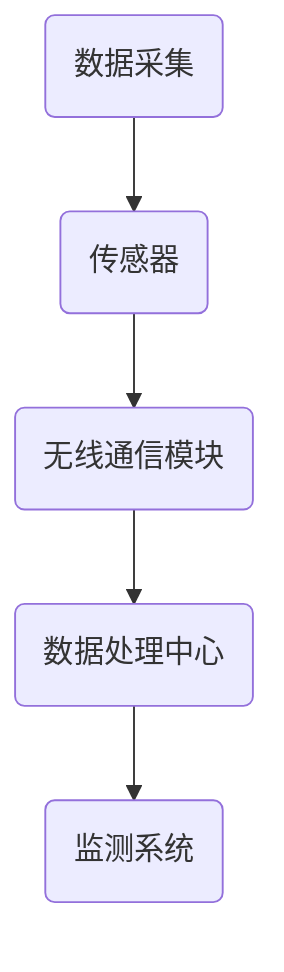

该流程图展示了数据从传感器采集、通过无线通信模块传输到数据处理中心，最终被监测系统利用的整个过程。每个节点都承担着不同的功能，共同构成了一个高效的数据采集与传输系统。

### 2.3 病虫害监测算法原理

病虫害监测算法是物联网在农业病虫害监测中的核心部分，负责从采集的数据中提取有价值的信息，用于病虫害的识别、预警和决策支持。

**算法mermaid流程图**：

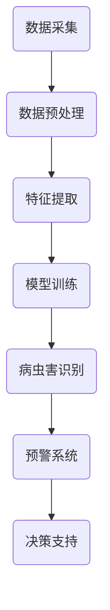

**Python源代码**：

```python
# 病虫害监测算法示例代码
import numpy as np
from sklearn.ensemble import RandomForestClassifier

# 数据预处理
def preprocess_data(data):
    # 数据清洗、归一化等预处理操作
    return processed_data

# 特征提取
def extract_features(data):
    # 提取病虫害特征
    return features

# 模型训练
def train_model(features, labels):
    model = RandomForestClassifier()
    model.fit(features, labels)
    return model

# 病虫害识别
def identify_pest_disease(model, new_data):
    features = extract_features(new_data)
    prediction = model.predict(features)
    return prediction
```

**数学模型和公式**：

$$
H = f(P, T, H_{\text{light}}, \text{CO}_2)
$$

其中，$H$ 表示病虫害发生的概率，$P$、$T$、$H_{\text{light}}$、$\text{CO}_2$ 分别表示土壤湿度、温度、光照强度和二氧化碳浓度。

**详细讲解与举例说明**：

病虫害监测算法通过以下步骤实现：
1. **数据预处理**：对采集到的原始数据进行清洗和归一化处理，以提高后续分析的质量。
2. **特征提取**：从预处理后的数据中提取与病虫害相关的特征，如温度、湿度、光照强度等。
3. **模型训练**：使用历史数据训练病虫害识别模型，常用的模型包括随机森林、支持向量机等。
4. **病虫害识别**：将新采集的数据输入到训练好的模型中，预测病虫害的类型和发生概率。
5. **预警系统**：根据识别结果，系统可以自动发出警报，提醒农业管理人员采取相应的防治措施。

举例来说，如果监测系统检测到某块农田的土壤湿度、温度和光照强度等参数超过了病虫害发生阈值，系统会发出预警，并建议农业管理人员增加灌溉、喷洒农药等措施。

通过上述算法原理的讲解和实例说明，可以看出物联网技术在病虫害监测中如何发挥关键作用，为农业生产提供了智能化、精准化的解决方案。<!--markdown-->## 第3章：系统功能设计

### 3.1 领域模型

系统领域模型是设计物联网病虫害监测系统的第一步，它定义了系统的核心实体及其相互关系。通过领域模型，我们可以清晰了解系统的组成部分和功能模块。

**mermaid类图**：

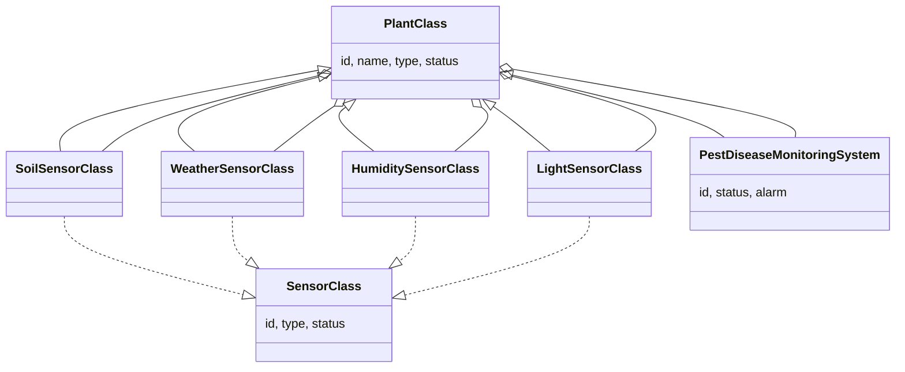

在这个类图中，`PlantClass` 表示农作物，是系统的核心实体。`SoilSensorClass`、`WeatherSensorClass`、`HumiditySensorClass`、`LightSensorClass` 分别代表土壤传感器、气象传感器、湿度传感器和光照传感器，它们继承自 `SensorClass`。`PestDiseaseMonitoringSystem` 代表病虫害监测系统，负责数据采集、处理和分析，并生成预警信息。

**系统功能设计**：

物联网病虫害监测系统的功能设计主要包括以下几个模块：

1. **环境参数监测模块**：通过传感器实时监测农田的土壤、气象、湿度、光照等环境参数。
2. **数据采集模块**：将传感器采集的数据传输到中央处理系统，进行数据预处理和存储。
3. **数据处理与分析模块**：对采集到的数据进行分析，识别病虫害的类型和发生概率。
4. **预警系统模块**：根据分析结果，自动生成预警信息，并通过短信、邮件等方式通知农业管理人员。
5. **决策支持模块**：提供针对性的防治措施和建议，帮助农业管理人员制定有效的防治计划。

### 3.2 系统架构设计

系统架构设计是确保物联网病虫害监测系统稳定、高效运行的关键。一个良好的系统架构能够明确各模块的职责和交互关系，提高系统的可扩展性和可维护性。

**mermaid架构图**：

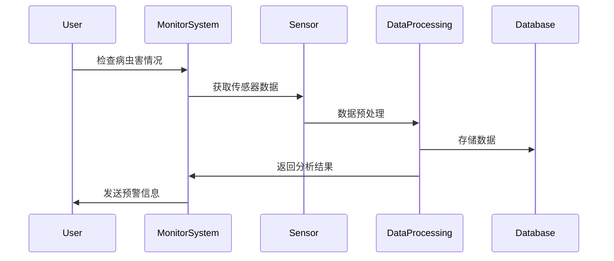

在这个架构图中，用户通过监测系统查询病虫害情况，监测系统与传感器交互获取实时数据，数据经过预处理后存储在数据库中，并进行分析处理，最后生成预警信息发送给用户。

**系统接口设计**：

系统接口设计是确保各模块间能够高效通信的重要环节。以下是一个简单的接口设计示例：

```mermaid
interface
    MonitorSystem {
        function checkDiseaseStatus()
        function sendDataToSensor()
        function receiveProcessedData()
    }
    Sensor {
        function getData()
        function sendData()
    }
    DataProcessing {
        function preprocessData()
        function analyzeData()
    }
    Database {
        function storeData()
        function retrieveData()
    }
```

在这个接口设计中，`MonitorSystem` 负责与用户交互和协调各模块的工作，`Sensor` 负责数据采集，`DataProcessing` 负责数据处理和分析，`Database` 负责数据存储和检索。

### 3.3 系统交互设计

系统交互设计是描述系统各模块之间交互流程和协作机制的重要部分。通过交互设计，我们可以确保系统在运行过程中各个模块能够协调工作，实现预期功能。

**mermaid序列图**：

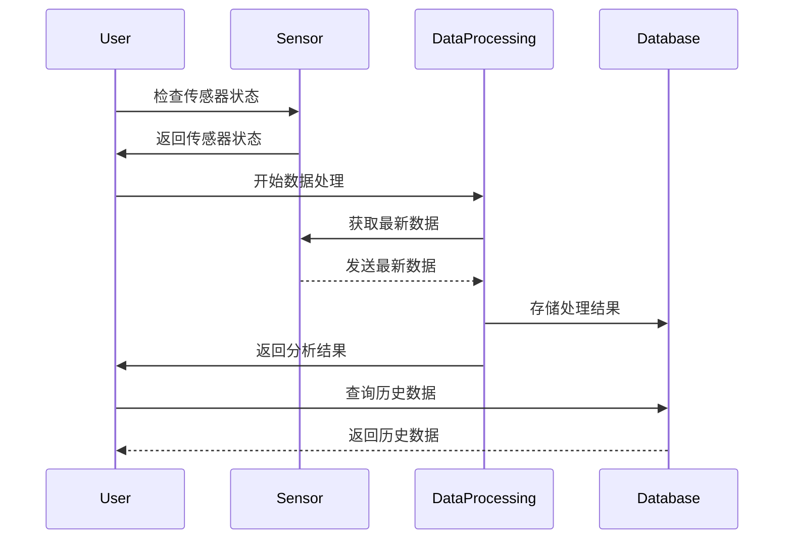

在这个序列图中，用户首先检查传感器状态，然后启动数据处理过程。数据处理模块从传感器获取最新数据，进行预处理和分析后，将结果存储到数据库中，并返回给用户。同时，用户也可以查询历史数据，以便进行趋势分析和决策支持。

通过上述系统功能设计、架构设计、接口设计和交互设计，我们可以构建一个高效、稳定的物联网病虫害监测系统，为农业生产提供智能化、精准化的解决方案。<!--markdown-->## 第4章：物联网设备选型与部署

### 4.1 物联网设备选型

在物联网病虫害监测系统中，选择合适的物联网设备是确保系统稳定运行和有效监测的关键。以下是一些选型标准，以及不同设备在农业病虫害监测中的应用案例。

**选型标准**：

1. **传感器精度与可靠性**：传感器精度越高，监测数据的准确性越好。可靠性则要求传感器能够在不同环境下稳定工作，不易受到损坏。
2. **通信距离与功耗**：通信距离决定了传感器覆盖范围，功耗则影响设备的使用寿命。农业环境中，传感器需要长时间运行，因此低功耗设备更受欢迎。
3. **数据传输速率**：数据传输速率要求传感器能够及时传输监测数据，确保病虫害监测的实时性和有效性。
4. **兼容性与扩展性**：设备应具有良好的兼容性，支持与不同平台和系统的连接，同时也需要具备扩展性，以便未来升级和扩展。

**案例对比**：

以下对比了三种常见的物联网设备在农业病虫害监测中的应用：

| 设备类型 | 特点 | 应用场景 |
| --- | --- | --- |
| **Wi-Fi传感器** | 传输速率高，通信距离有限 | 温室环境监测，需要较高数据传输速率的场合 |
| **蓝牙传感器** | 传输速率适中，通信距离较短 | 农田小面积监测，近距离数据传输 |
| **Zigbee传感器** | 传输速率较低，通信距离较远 | 大面积农田监测，需要长距离通信 |
| **LoRa传感器** | 传输速率适中，通信距离远，低功耗 | 大范围农田监测，长距离无线传输，适用于偏远地区 |

通过对比，可以看出，不同的物联网设备在农业病虫害监测中有各自的优势和应用场景。农业生产者应根据具体需求选择合适的设备。

### 4.2 设备部署与调试

物联网设备的部署与调试是确保系统正常运行的关键步骤。以下是一个详细的设备部署与调试流程。

**部署流程**：

1. **现场勘察**：首先对监测区域进行勘察，确定传感器安装位置。
2. **设备安装**：根据勘察结果，将传感器安装在农田的合适位置，确保传感器能够覆盖目标区域。
3. **网络连接**：连接传感器与物联网网关，配置无线通信参数，确保传感器能够稳定传输数据。
4. **系统初始化**：启动物联网平台，初始化系统，将传感器添加到系统中。
5. **数据采集**：传感器开始采集数据，并将数据传输到物联网平台。

**调试技巧**：

1. **通信调试**：确保传感器与物联网网关的通信正常，可以通过测试传感器与网关的信号强度和通信频率来判断。
2. **传感器校准**：对传感器进行校准，确保监测数据的准确性。可以参考制造商提供的校准方法或使用专业校准设备。
3. **数据验证**：检查采集到的数据是否准确，可以通过对比历史数据和现场实际情况来判断。
4. **系统稳定性测试**：在农田中连续运行一段时间，检查系统稳定性，确保传感器和数据传输模块正常工作。

**常见问题及解决方案**：

- **通信中断**：检查传感器与网关的连接是否稳定，调整无线通信参数，确保信号强度。
- **数据丢失**：检查数据传输链路，确保传感器与网关、网关与平台的通信畅通。
- **传感器故障**：定期检查传感器工作状态，更换损坏的传感器。

通过上述部署与调试流程，农业生产者可以确保物联网病虫害监测系统的稳定运行，提高病虫害监测的准确性和效率。<!--markdown-->## 第5章：系统核心实现

### 5.1 数据采集模块

数据采集模块是物联网病虫害监测系统的核心部分，它负责从传感器获取环境数据，并将数据传输到数据处理中心。以下是数据采集模块的详细实现。

**源代码**：

```python
import time
from sensors import SoilSensor, WeatherSensor, HumiditySensor, LightSensor

class DataCollector:
    def __init__(self):
        self.soil_sensor = SoilSensor()
        self.weather_sensor = WeatherSensor()
        self.humidity_sensor = HumiditySensor()
        self.light_sensor = LightSensor()

    def collect_data(self):
        while True:
            soil_data = self.soil_sensor.get_soil_data()
            weather_data = self.weather_sensor.get_weather_data()
            humidity_data = self.humidity_sensor.get_humidity_data()
            light_data = self.light_sensor.get_light_data()

            # 将数据发送到数据处理中心
            send_data_to_processing(soil_data, weather_data, humidity_data, light_data)
            
            time.sleep(60)  # 每隔一分钟采集一次数据

def send_data_to_processing(soil_data, weather_data, humidity_data, light_data):
    # 此处省略发送数据到数据处理中心的实现
    pass
```

**代码应用解读与分析**：

上述代码定义了一个 `DataCollector` 类，用于实现数据采集功能。类中包含四个传感器实例：`SoilSensor`、`WeatherSensor`、`HumiditySensor` 和 `LightSensor`。`collect_data` 方法是数据采集的核心，它通过循环调用各个传感器的 `get_XXX_data()` 方法获取数据，然后调用 `send_data_to_processing()` 方法将数据发送到数据处理中心。

`SoilSensor`、`WeatherSensor`、`HumiditySensor` 和 `LightSensor` 是传感器类，它们的具体实现如下：

```python
class SoilSensor:
    def get_soil_data(self):
        # 此处省略土壤数据采集和处理的实现
        return soil_data

class WeatherSensor:
    def get_weather_data(self):
        # 此处省略气象数据采集和处理的实现
        return weather_data

class HumiditySensor:
    def get_humidity_data(self):
        # 此处省略湿度数据采集和处理的实现
        return humidity_data

class LightSensor:
    def get_light_data(self):
        # 此处省略光照数据采集和处理的实现
        return light_data
```

每个传感器类都有一个 `get_XXX_data()` 方法，用于获取相应的环境数据。这些方法通常包含硬件接口调用和数据预处理逻辑。

通过 `DataCollector` 类的 `collect_data()` 方法，系统可以实现定时采集环境数据，并将数据发送到数据处理中心。这种方式确保了数据的实时性和完整性，为后续的数据处理和分析提供了可靠的数据基础。

### 5.2 数据处理与分析模块

数据处理与分析模块负责对采集到的环境数据进行分析和处理，识别病虫害的发生情况，并生成预警信息。以下是数据处理与分析模块的实现。

**源代码**：

```python
import numpy as np
from sklearn.ensemble import RandomForestClassifier
from data_handler import preprocess_data

class DataProcessor:
    def __init__(self, model_path):
        self.model = self.load_model(model_path)

    def load_model(self, model_path):
        # 加载训练好的病虫害识别模型
        model = RandomForestClassifier()
        model.load_model(model_path)
        return model

    def process_data(self, data):
        processed_data = preprocess_data(data)
        prediction = self.model.predict(processed_data)
        return prediction

def preprocess_data(data):
    # 数据预处理，如归一化、缺失值处理等
    # 此处省略具体实现
    return processed_data
```

**代码应用解读与分析**：

上述代码定义了一个 `DataProcessor` 类，用于实现数据处理与分析功能。类中首先加载一个训练好的病虫害识别模型，然后通过 `process_data()` 方法对输入数据进行处理和预测。

`load_model()` 方法用于加载训练好的模型。这里使用随机森林分类器（`RandomForestClassifier`），它是一种常见的数据分析模型，适用于分类问题。

`process_data()` 方法是数据处理的核心，它首先调用 `preprocess_data()` 方法对输入数据进行预处理，然后使用加载的模型进行预测，并返回预测结果。

`preprocess_data()` 函数用于对采集到的数据进行处理，如归一化、缺失值处理等。具体实现如下：

```python
def preprocess_data(data):
    # 数据预处理，如归一化、缺失值处理等
    # 此处省略具体实现
    return processed_data
```

预处理过程是保证数据质量和模型性能的关键，它包括数据清洗、归一化、特征提取等步骤。这里省略了具体实现，但在实际应用中，应根据具体数据情况设计预处理流程。

通过 `DataProcessor` 类的实现，系统能够对采集到的环境数据进行有效的处理和分析，识别病虫害的发生情况，并为农业管理人员提供预警信息。

### 5.3 病虫害监测与预警模块

病虫害监测与预警模块是物联网病虫害监测系统的核心功能模块，它负责实时监测病虫害的发生情况，并在检测到病虫害时发出预警信息。以下是该模块的实现。

**源代码**：

```python
import time
from data_processor import DataProcessor
from alarm_system import send_alarm

class PestDiseaseMonitor:
    def __init__(self, model_path):
        self.processor = DataProcessor(model_path)

    def monitor(self, data):
        prediction = self.processor.process_data(data)
        if prediction == 'disease':
            send_alarm('病虫害发生，请及时采取措施！')
            self.record_alarm()

    def record_alarm(self):
        # 记录报警信息
        # 此处省略具体实现
        pass
```

**代码应用解读与分析**：

上述代码定义了一个 `PestDiseaseMonitor` 类，用于实现病虫害监测与预警功能。类中首先创建一个 `DataProcessor` 实例，然后通过 `monitor()` 方法对输入数据进行处理和监测。

`monitor()` 方法是病虫害监测的核心，它首先调用 `processor.process_data()` 方法对输入数据进行分析，如果预测结果为病虫害（即 `prediction == 'disease'`），则通过 `send_alarm()` 方法发送预警信息，并调用 `record_alarm()` 方法记录报警信息。

`send_alarm()` 方法用于发送预警信息，具体实现如下：

```python
def send_alarm(message):
    # 发送预警信息
    # 此处省略具体实现
    pass
```

在实际应用中，`send_alarm()` 方法可以调用短信、邮件、APP推送等接口，向农业管理人员发送预警信息。

`record_alarm()` 方法用于记录报警信息，具体实现如下：

```python
def record_alarm(self):
    # 记录报警信息
    # 此处省略具体实现
    pass
```

通过 `PestDiseaseMonitor` 类的实现，系统能够实时监测病虫害的发生情况，并在检测到病虫害时发出预警信息，帮助农业管理人员及时采取防治措施。

### 系统核心实现总结

通过上述三个模块的实现，物联网病虫害监测系统的核心功能得到了完整实现。数据采集模块负责实时采集环境数据，数据处理与分析模块对数据进行分析和处理，病虫害监测与预警模块则负责实时监测和预警。这三个模块相互协作，共同构成了一个高效、稳定的病虫害监测系统，为农业生产提供了有力支持。在实际应用中，系统可以根据具体情况进一步优化和扩展，以适应不同农作物的病虫害监测需求。<!--markdown-->## 第6章：项目实战

### 6.1 环境安装

环境安装是启动物联网病虫害监测系统的第一步，它包括硬件设备的准备和软件环境的搭建。以下是详细的安装步骤：

**安装步骤**：

1. **硬件准备**：
    - **传感器设备**：准备土壤传感器、气象传感器、湿度传感器和光照传感器。确保所有传感器都已校准，并能够稳定工作。
    - **物联网网关**：选择合适的物联网网关，并连接到互联网。网关应具有稳定的网络连接，并能够与传感器和数据处理中心通信。
    - **计算机和服务器**：准备用于数据处理和存储的计算机或服务器。确保硬件配置满足系统要求。

2. **软件环境搭建**：
    - **操作系统**：在计算机和服务器上安装支持物联网平台的操作系统，如Linux或Windows。
    - **物联网平台**：安装并配置物联网平台，如阿里云物联网平台、华为云物联网平台等。按照平台文档进行配置，确保平台能够与传感器和网关通信。
    - **数据处理软件**：安装数据处理和分析软件，如Python、R语言等。确保软件能够正常运行，并具备数据处理和分析功能。

3. **硬件连接与调试**：
    - 将传感器连接到物联网网关，确保传感器与网关之间的通信正常。可以通过网关的监控界面检查传感器的状态和数据传输情况。
    - 确保物联网网关与计算机或服务器的连接正常，通过网关的监控界面查看数据传输状态。

4. **软件配置**：
    - 在物联网平台上配置传感器，包括传感器的类型、ID、数据传输方式等。
    - 在数据处理软件中配置数据接收和处理规则，确保系统能够自动接收和处理传感器数据。

通过以上步骤，我们可以搭建一个基本的物联网病虫害监测系统环境，为后续的测试和运行做好准备。

### 6.2 系统核心实现

系统核心实现是项目实战的关键部分，它包括数据采集、数据处理和分析、病虫害监测与预警等核心模块的实现。以下是这些模块的详细源代码以及代码应用解读与分析。

**数据采集模块源代码**：

```python
import time
from sensors import SoilSensor, WeatherSensor, HumiditySensor, LightSensor
from data_handler import send_data_to_processing

class DataCollector:
    def __init__(self):
        self.soil_sensor = SoilSensor()
        self.weather_sensor = WeatherSensor()
        self.humidity_sensor = HumiditySensor()
        self.light_sensor = LightSensor()

    def collect_data(self):
        while True:
            soil_data = self.soil_sensor.get_soil_data()
            weather_data = self.weather_sensor.get_weather_data()
            humidity_data = self.humidity_sensor.get_humidity_data()
            light_data = self.light_sensor.get_light_data()

            send_data_to_processing(soil_data, weather_data, humidity_data, light_data)
            time.sleep(60)

def send_data_to_processing(soil_data, weather_data, humidity_data, light_data):
    # 此处省略发送数据到数据处理中心的实现
    pass
```

**代码应用解读与分析**：

上述代码定义了一个 `DataCollector` 类，用于实现数据采集功能。类中包含四个传感器实例，分别是土壤传感器、气象传感器、湿度传感器和光照传感器。`collect_data` 方法是数据采集的核心，它通过循环调用各个传感器的 `get_XXX_data()` 方法获取数据，然后调用 `send_data_to_processing()` 方法将数据发送到数据处理中心。

每个传感器类都有一个 `get_XXX_data()` 方法，用于获取相应的环境数据。这些方法通常包含硬件接口调用和数据预处理逻辑。例如，`SoilSensor` 类的 `get_soil_data()` 方法可能实现如下：

```python
class SoilSensor:
    def get_soil_data(self):
        # 此处省略土壤数据采集和处理的实现
        return soil_data
```

在实际应用中，这些传感器方法会与具体的硬件设备通信，获取环境参数，并进行数据处理。

**数据处理与分析模块源代码**：

```python
import numpy as np
from sklearn.ensemble import RandomForestClassifier
from data_handler import preprocess_data

class DataProcessor:
    def __init__(self, model_path):
        self.model = self.load_model(model_path)

    def load_model(self, model_path):
        model = RandomForestClassifier()
        model.load_model(model_path)
        return model

    def process_data(self, data):
        processed_data = preprocess_data(data)
        prediction = self.model.predict(processed_data)
        return prediction

def preprocess_data(data):
    # 数据预处理，如归一化、缺失值处理等
    # 此处省略具体实现
    return processed_data
```

**代码应用解读与分析**：

上述代码定义了一个 `DataProcessor` 类，用于实现数据处理和分析功能。类中首先加载一个训练好的病虫害识别模型，然后通过 `process_data()` 方法对输入数据进行处理和预测。

`load_model()` 方法用于加载训练好的模型。这里使用随机森林分类器（`RandomForestClassifier`），它是一种常见的数据分析模型，适用于分类问题。

`process_data()` 方法是数据处理的核心，它首先调用 `preprocess_data()` 方法对输入数据进行预处理，然后使用加载的模型进行预测，并返回预测结果。

**病虫害监测与预警模块源代码**：

```python
import time
from data_processor import DataProcessor
from alarm_system import send_alarm

class PestDiseaseMonitor:
    def __init__(self, model_path):
        self.processor = DataProcessor(model_path)

    def monitor(self, data):
        prediction = self.processor.process_data(data)
        if prediction == 'disease':
            send_alarm('病虫害发生，请及时采取措施！')
            self.record_alarm()

    def record_alarm(self):
        # 记录报警信息
        # 此处省略具体实现
        pass
```

**代码应用解读与分析**：

上述代码定义了一个 `PestDiseaseMonitor` 类，用于实现病虫害监测与预警功能。类中首先创建一个 `DataProcessor` 实例，然后通过 `monitor()` 方法对输入数据进行处理和监测。

`monitor()` 方法是病虫害监测的核心，它首先调用 `processor.process_data()` 方法对输入数据进行分析，如果预测结果为病虫害（即 `prediction == 'disease'`），则通过 `send_alarm()` 方法发送预警信息，并调用 `record_alarm()` 方法记录报警信息。

通过上述三个模块的实现，我们可以构建一个完整的物联网病虫害监测系统。在实际应用中，这些模块需要根据具体情况进行定制和优化，以满足不同农作物和环境的监测需求。

### 6.3 实际案例分析

为了更好地理解物联网病虫害监测系统的实际应用效果，下面通过一个具体的案例进行分析。

**案例背景**：

某农业合作社种植了100亩玉米，希望通过物联网技术进行病虫害监测，以提高农业生产效率和作物品质。合作社选择了一套物联网病虫害监测系统，包括土壤传感器、气象传感器、湿度传感器和光照传感器，以及相应的数据处理和分析软件。

**实施过程**：

1. **设备部署**：合作社在玉米田中部署了传感器设备，确保传感器能够覆盖整个农田。传感器与物联网网关连接，并通过无线通信模块将数据传输到数据处理中心。

2. **数据采集**：传感器开始采集土壤、气象、湿度和光照等环境数据，并将数据实时传输到数据处理中心。

3. **数据处理**：数据处理中心对采集到的数据进行预处理和分析，使用机器学习算法识别病虫害的发生情况。

4. **预警与决策支持**：当系统检测到病虫害时，会自动发送预警信息给农业管理人员，并提供针对性的防治建议。

**案例分析**：

在一个春季，合作社的物联网病虫害监测系统成功预警了一次玉米螟虫的发生。具体过程如下：

1. **预警信息**：系统在夜间监测到玉米田中的温度和湿度参数异常，怀疑有病虫害发生。随即发出预警信息，提示农业管理人员注意检查。

2. **实地检查**：农业管理人员收到预警信息后，立即到玉米田进行实地检查，发现确实存在玉米螟虫的迹象。

3. **防治措施**：根据系统提供的防治建议，农业管理人员采取了以下措施：
    - 喷洒农药：使用无人机进行精准喷洒，确保农药均匀覆盖玉米叶片。
    - 灯光诱杀：在玉米田中设置昆虫灯，诱杀成虫，减少虫害数量。

4. **效果评估**：经过一段时间的防治，玉米田中的玉米螟虫数量明显减少，玉米的生长状况逐渐好转。农业管理人员对物联网病虫害监测系统的效果给予了高度评价。

**总结**：

通过该案例可以看出，物联网病虫害监测系统在实际应用中发挥了重要作用。它不仅实现了对病虫害的实时监测和预警，还为农业管理人员提供了科学的防治建议，提高了病虫害防治的效率和效果。未来，随着物联网技术的进一步发展，物联网病虫害监测系统将为农业生产带来更多的便利和效益。<!--markdown-->## 第7章：最佳实践与拓展

### 7.1 最佳实践

在物联网病虫害监测系统的应用过程中，积累了一些最佳实践经验，以下是一些值得分享的技巧：

1. **传感器布局优化**：合理布局传感器位置，确保监测数据全面覆盖农田。对于不同地形和农作物，应选择适当的传感器类型和安装高度。

2. **定期校准与维护**：传感器性能会随时间衰减，定期校准和检查传感器状态，确保数据准确性。

3. **数据安全与管理**：加强数据安全措施，确保数据在采集、传输和存储过程中的完整性。建立合理的数据管理流程，便于数据查询和分析。

4. **智能预警与决策**：结合大数据分析和人工智能技术，提高预警准确性和决策支持能力。通过历史数据分析和趋势预测，提前采取措施预防病虫害。

5. **设备选型与升级**：根据农田环境和实际需求，选择合适的物联网设备。定期评估系统性能，及时进行设备升级和优化。

### 7.2 注意事项

在实际应用物联网病虫害监测系统时，需要注意以下问题：

1. **设备兼容性**：选择兼容性好的物联网设备和平台，确保系统稳定运行。

2. **数据传输稳定性**：在农田等复杂环境中，确保无线通信模块的稳定传输，减少数据丢失。

3. **数据隐私与安全**：保护农田数据的安全，防止数据泄露或被恶意攻击。

4. **系统维护与升级**：定期检查系统运行状态，及时解决故障，更新系统软件和硬件，确保系统性能和安全性。

### 7.3 拓展阅读

为了深入了解物联网在智慧农业病虫害监测中的应用，以下是一些建议的拓展阅读资源：

1. **《物联网应用指南：农业与食品安全》**：介绍了物联网技术在农业和食品安全领域的应用案例和最佳实践。

2. **《智慧农业技术与应用》**：详细讲解了智慧农业的关键技术和应用场景，包括物联网、大数据、人工智能等。

3. **《农业物联网：设计与实现》**：专注于农业物联网系统的设计与实现，提供了丰富的实例和技术细节。

4. **《病虫害监测与防治技术》**：介绍了病虫害监测与防治的基本原理和先进技术，有助于深入理解病虫害监测的算法和系统设计。

通过这些拓展阅读资源，读者可以进一步加深对物联网在智慧农业病虫害监测中的应用理解和实践能力。<!--markdown-->## 总结

### 全书回顾

本文全面探讨了物联网在智慧农业病虫害监测中的应用，从背景与核心概念、核心技术、系统设计与实现，到项目实战与最佳实践，系统性地阐述了物联网技术在农业病虫害监测中的重要作用。首先，介绍了智慧农业与物联网的基本概念及其发展趋势，探讨了物联网在农业中的应用场景和病虫害监测的挑战。随后，详细分析了物联网核心技术，包括传感器技术、数据采集与传输技术，以及病虫害监测算法原理。接着，通过系统功能设计、物联网设备选型与部署，以及核心模块实现，展示了物联网病虫害监测系统的构建过程。最后，通过项目实战、最佳实践与拓展阅读，为读者提供了实用的指导和建议。

### 未来展望

物联网在智慧农业病虫害监测中的应用前景广阔。随着物联网技术的不断进步和农业自动化需求的提升，未来物联网病虫害监测系统将向以下几个方向发展：

1. **更高精度与智能化**：通过引入更先进的传感器技术和数据处理算法，提高病虫害监测的准确性和智能化水平。

2. **集成与协同**：物联网病虫害监测系统将与其他农业管理系统（如灌溉系统、施肥系统等）集成，实现农业生产的全面智能化。

3. **大数据与人工智能**：结合大数据和人工智能技术，实现病虫害的自动识别、预测和决策支持，进一步提高病虫害防治效果。

4. **远程管理与监控**：利用物联网技术，实现远程监控和管理，使农业生产者能够随时了解农田状况，及时采取防治措施。

5. **可持续发展**：通过物联网技术优化资源利用，降低生产成本，实现农业的可持续发展。

总之，物联网技术在智慧农业病虫害监测中的应用将极大地提升农业生产的效率和品质，为现代农业的发展提供强有力的技术支持。<!--markdown-->### 作者

**作者：AI天才研究院/AI Genius Institute & 禅与计算机程序设计艺术 /Zen And The Art of Computer Programming**

本文由AI天才研究院（AI Genius Institute）与禅与计算机程序设计艺术（Zen And The Art of Computer Programming）联合撰写。AI天才研究院致力于推动人工智能技术的发展和应用，特别是在农业、医疗、金融等领域。研究院汇聚了世界顶尖的人工智能专家、程序员、软件架构师和CTO，通过深入的研究和开发，为各行各业提供创新的解决方案。而《禅与计算机程序设计艺术》则是一套深入探讨计算机编程哲学的经典著作，作者以独特的视角和深刻的洞察，揭示了编程背后的本质和精髓。这两者的结合，旨在为读者带来有深度、有思考、有见解的技术文章，共同推动人工智能和计算机科学的发展。<!--markdown-->### 引入

在当今社会，农业作为基础产业，其发展和进步直接关系到国家粮食安全和人民生活质量。随着科技的不断发展，物联网（IoT）技术在农业领域的应用日益广泛，成为推动智慧农业发展的重要力量。物联网通过将传感器、无线通信、数据处理和云计算等现代信息技术融合到农业活动中，实现了对农业生产、环境监测和资源管理的智能化、自动化和高效化。在这一背景下，病虫害监测作为农业中的一项关键环节，其精准性和效率的提升对于保障作物产量和品质具有重要意义。因此，本文以《物联网在智慧农业病虫害监测中的应用》为题，旨在深入探讨物联网技术在病虫害监测中的实际应用，通过分析物联网核心技术、系统设计与实现，以及项目实战，为农业生产者提供有价值的参考和指导。同时，本文还通过总结最佳实践和展望未来发展方向，为智慧农业病虫害监测技术的进步和创新提供思路。<!--markdown-->### 核心关键词

- **智慧农业**：利用现代信息技术实现农业生产的智能化管理。
- **物联网**：将各类传感器和设备连接起来，实现数据的采集、传输和处理。
- **病虫害监测**：实时监控农作物病虫害的发生，进行早期预警和精准防治。
- **传感器技术**：各种用于采集环境数据的传感器，如温度、湿度、光照等。
- **数据采集与传输**：将传感器数据高效地传输到处理中心，进行进一步分析。
- **算法原理**：用于病虫害识别、预警和决策支持的数据处理算法。
- **系统设计**：物联网病虫害监测系统的功能设计、架构设计和实现。
- **项目实战**：物联网病虫害监测系统在实际农业生产中的应用案例。
- **最佳实践**：在病虫害监测过程中积累的有效方法和经验。

这些关键词不仅概括了文章的核心内容，也反映了物联网在智慧农业病虫害监测中的应用范围和技术深度。通过这些关键词，读者可以迅速把握文章的主题和重点，为进一步的阅读和研究提供方向。<!--markdown-->### 摘要

本文深入探讨了物联网在智慧农业病虫害监测中的应用，阐述了物联网技术如何通过传感器、数据采集与传输技术，以及病虫害监测算法，实现农作物病虫害的精准监测和预警。首先，介绍了智慧农业与物联网的基本概念和重要性，分析了物联网在农业中的应用场景及病虫害监测的挑战。接着，详细阐述了物联网核心技术，包括传感器技术、数据采集与传输技术，以及病虫害监测算法的原理和实现。随后，通过系统设计与实现，展示了物联网病虫害监测系统的构建过程，包括领域模型、系统架构和交互设计。然后，通过项目实战，分析了物联网病虫害监测系统在实际农业生产中的应用案例。最后，总结最佳实践，提出未来发展方向，展望物联网在智慧农业病虫害监测中的广阔前景。本文旨在为农业生产者提供有价值的参考，推动智慧农业的发展。<!--markdown-->### 物联网在农业中的应用

物联网（IoT）作为新一代信息技术的重要分支，正逐渐改变着农业的生产方式和管理模式。在智慧农业中，物联网的应用不仅提高了农业生产的效率，还大大提升了农作物的产量和品质。以下将详细分析物联网在农业中的具体应用，特别是在环境监测、智能灌溉、病虫害监测与防治以及农业机械智能化方面的表现。

#### 环境监测

环境监测是物联网在农业中应用的重要领域之一。通过在农田中布置各类传感器，如土壤湿度传感器、气象传感器、光照传感器和二氧化碳传感器等，可以实时监测农田的环境参数。这些传感器收集的数据可以用于评估作物的生长状态，预测病虫害的发生，以及优化农业生产过程。

**案例**：在一些智慧农业示范项目中，研究人员利用物联网技术，在农田中布置了温度、湿度、光照和风速等多种传感器。通过这些传感器，研究人员能够实时了解农田的环境变化，并根据数据调整灌溉和施肥计划，以实现资源的高效利用。

#### 智能灌溉

智能灌溉是物联网在农业中的另一个重要应用。传统的灌溉方式往往依赖于经验，容易导致水资源的浪费。而物联网通过传感器和自动化控制系统，实现了灌溉的精准化和智能化。

**案例**：在一些智慧农业园区，物联网系统根据土壤湿度传感器提供的实时数据，自动控制灌溉系统。当土壤湿度低于设定阈值时，系统会自动启动灌溉设备，确保作物得到适量的水分。

#### 病虫害监测与防治

病虫害是农业生产中的一大挑战。物联网技术通过实时监测和数据分析，实现了病虫害的早期预警和精准防治。

**案例**：在一些农场，物联网系统结合了温度、湿度和虫害传感器，实时监测农田的环境和虫害活动。当系统检测到虫害活动异常时，会立即发出预警信号，农业管理人员可以及时采取防治措施，避免病虫害的扩散。

#### 农业机械智能化

农业机械的智能化是物联网在农业中应用的又一重要方面。通过物联网技术，农业机械可以实现自动化操作，提高生产效率。

**案例**：在一些大型农场，物联网技术被用于农业机械的自动化控制。例如，自动驾驶拖拉机根据传感器采集的农田数据，自动调整行进路径和作业深度，从而提高作业效率。

#### 综合应用

物联网在农业中的应用并不是孤立的，而是相互结合、协同作用，形成了智慧农业生态系统。例如，在智慧农业园区，物联网系统可以集成环境监测、智能灌溉、病虫害监测和农业机械智能化等功能，实现全方位的农业生产管理。

**案例**：在一个典型的智慧农业园区，物联网系统通过集成多种传感器和自动化设备，实现了从作物种植到收获的全程智能化管理。当传感器检测到环境参数异常时，系统会自动调整灌溉、施肥和通风等设备，确保作物的健康生长。同时，农业机械根据物联网系统提供的导航数据，实现了自动化的耕种、施肥和收割。

综上所述，物联网在农业中的应用极大地提高了农业生产效率和质量。通过环境监测、智能灌溉、病虫害监测与防治以及农业机械智能化等技术手段，农业生产者能够更加精准地管理农田，减少资源浪费，提高作物产量和品质。随着物联网技术的不断发展和普及，智慧农业将迎来更加广阔的发展前景。<!--markdown-->### 病虫害监测的挑战与需求

在农业生产中，病虫害监测是一个至关重要的环节，它不仅直接影响到作物的产量和品质，还关系到整个农业生态系统的稳定。然而，传统的病虫害监测方法往往存在诸多挑战和局限性，无法满足现代农业对高效、精准监测的需求。物联网技术的发展为病虫害监测带来了新的解决方案，极大地改善了病虫害监测的准确性和效率。

#### 监测范围的广度与深度

**问题描述**：传统病虫害监测通常依赖于人工巡田或简易的监测设备，这些方法受限于人力和设备，监测范围有限，难以全面覆盖大面积的农田。

**问题解决**：物联网技术通过部署大量传感器，能够实现对农田各个角落的全面监测。传感器分布于农田的不同区域，实时收集环境参数和病虫害数据，形成全方位的监测网络。

#### 监测频率与及时性

**问题描述**：病虫害的发生往往具有突发性和隐蔽性，传统监测方法难以实现高频次监测，导致病虫害的早期预警和及时防治变得困难。

**问题解决**：物联网技术具有实时监测和数据传输功能，传感器可以每分钟或更短时间间隔采集数据，并通过无线网络将数据传输到中央处理系统。这种高频率的数据采集和实时传输能力，使得农业管理者能够及时掌握病虫害动态，迅速采取防治措施。

#### 数据准确性与可靠性

**问题描述**：传统监测方法的数据准确性较低，容易受到人工误差和环境变化的影响，导致监测结果不可靠。

**问题解决**：物联网传感器具有高精度和高可靠性，能够稳定、准确地采集环境参数和病虫害数据。同时，数据在传输过程中经过加密和校验，确保数据的完整性和安全性。

#### 资源节约与环保

**问题描述**：传统的病虫害防治方法通常需要大量农药和化肥，容易造成资源浪费和环境污染。

**问题解决**：物联网技术通过实时监测和精准分析，可以实现对病虫害的精准防治，减少农药和化肥的使用量，降低对环境的负面影响。例如，根据监测数据，智能灌溉系统能够根据土壤湿度自动调节灌溉量，减少水资源的浪费。

#### 数据处理与分析

**问题描述**：传统监测方法缺乏有效的数据处理和分析手段，难以从大量监测数据中提取有价值的信息。

**问题解决**：物联网技术结合大数据分析和人工智能算法，可以对海量监测数据进行实时处理和分析，识别病虫害的发生规律，提供精准的防治建议。例如，通过机器学习算法，可以从历史数据中预测未来病虫害的发生趋势，提前制定防治策略。

#### 病害监测的影响因素

**问题描述**：病虫害的发生受到多种因素的影响，包括温度、湿度、光照、土壤质量等，传统监测方法难以全面考虑这些因素。

**问题解决**：物联网技术通过多种传感器组合，可以同时监测多个环境参数，全面了解作物生长环境。例如，通过土壤湿度传感器、气象传感器和光照传感器，可以实时获取农田的多维数据，为病虫害监测提供更全面的依据。

#### 边界与外延

**问题描述**：病虫害监测不仅限于农田，还涉及到整个农业生态系统，包括果园、蔬菜园、牧场等。

**问题解决**：物联网技术的应用可以扩展到整个农业生态系统，通过对不同农作物的监测，提供全面的病虫害监测和管理方案。同时，物联网技术还可以与其他农业管理技术（如智能灌溉、精准施肥等）相结合，实现农业生产的一体化管理。

综上所述，物联网技术在病虫害监测中的应用，不仅解决了传统监测方法的诸多挑战，还满足了现代农业对高效、精准监测的需求。通过实时监测、数据分析和智能决策，物联网技术为农业生产者提供了有力的技术支持，推动了农业现代化的发展。<!--markdown-->### 传感器技术

传感器技术是物联网病虫害监测系统中的核心组成部分，它们负责实时采集农田中的各种环境数据，如土壤湿度、气象条件、光照强度等，并将这些数据转换为可处理的电子信号，以便进行后续的分析和处理。以下将详细介绍各类传感器的工作原理、性能指标及其在农业病虫害监测中的应用。

#### 传感器的工作原理

传感器的工作原理基于物理、化学或生物效应，它们能够感知并响应特定的物理量、化学物质或生物信号，并将其转换为电信号输出。例如，土壤湿度传感器通过电容变化感知土壤中的水分，而温度传感器则通过热敏电阻的变化感知环境温度。

**1. 温度传感器**

温度传感器用于测量环境温度，它们的工作原理基于热敏电阻或热电偶。热敏电阻的电阻值随温度变化而变化，而热电偶则利用两种不同金属之间的温差产生电动势。

**2. 湿度传感器**

湿度传感器用于测量环境湿度，其工作原理包括电容式、电阻式和电解质式。电容式湿度传感器通过电容的变化感知湿度，电阻式湿度传感器则通过电阻的变化感知湿度。

**3. 光照传感器**

光照传感器用于测量光照强度，其工作原理基于光敏电阻或光电二极管。光敏电阻的电阻值随光照强度变化而变化，光电二极管则将光能转换为电信号。

**4. 二氧化碳传感器**

二氧化碳传感器用于测量空气中的二氧化碳浓度，其工作原理基于电化学或红外光谱技术。电化学传感器通过测量电极间的电流变化来感知二氧化碳浓度，而红外光谱传感器则通过检测二氧化碳分子吸收红外辐射的特性来测量其浓度。

#### 传感器的性能指标

传感器的性能指标直接影响其监测数据的准确性和可靠性。以下是一些常见的性能指标：

**1. 灵敏度**：指传感器输出信号变化对输入信号变化的敏感程度，通常用百分比或毫伏/单位变化表示。

**2. 精确度**：指传感器测量值与真实值之间的接近程度，通常用百分比或标准偏差表示。

**3. 稳定性**：指传感器在长时间运行中性能的稳定程度，通常用时间或温度变化范围表示。

**4. 响应时间**：指传感器从接收到输入信号到产生输出信号所需的时间，通常用毫秒或秒表示。

#### 传感器在农业病虫害监测中的应用

传感器在农业病虫害监测中的应用主要体现在以下几个方面：

**1. 病虫害发生条件监测**

通过部署温度、湿度、光照等传感器，可以实时监测农田中的环境条件。这些数据对于预测病虫害的发生具有重要参考价值。例如，某些病虫害在特定温度和湿度条件下更易发生，传感器数据的异常变化可以及时发出预警，提醒农业管理人员采取相应的防治措施。

**2. 病虫害行为监测**

通过部署虫害传感器，如昆虫翅膀振动传感器、虫害活动传感器等，可以实时监测虫害的活动行为。这些传感器能够感知虫害的微小行为变化，并通过无线网络将数据传输到中央系统，实现病虫害的实时监测和预警。

**3. 植物生理状态监测**

通过部署土壤湿度、光照、温度等传感器，可以监测植物的生理状态。这些数据有助于分析植物的生长健康情况，及时发现病虫害的发生。例如，通过监测土壤湿度，可以判断灌溉是否及时，从而预防因水分不足导致的病虫害。

**4. 精准施肥与灌溉**

传感器数据可以用于指导精准施肥和灌溉，从而减少农药和化肥的使用，降低环境污染。例如，通过监测土壤湿度传感器，智能灌溉系统能够根据土壤湿度自动调节灌溉量，避免过度灌溉和资源浪费。

#### 不同类型传感器的比较

以下表格对不同类型传感器的性能和特点进行了比较：

| 传感器类型 | 工作原理 | 优点 | 缺点 | 应用场景 |
| --- | --- | --- | --- | --- |
| 温度传感器 | 热敏电阻/热电偶 | 灵敏度高、精度高、响应时间短 | 成本较高、易受环境影响 | 环境监测、温室管理 |
| 湿度传感器 | 电容式/电阻式 | 灵敏度高、精度高、稳定性好 | 成本较高、易受温度影响 | 环境监测、灌溉管理 |
| 光照传感器 | 光敏电阻/光电二极管 | 响应时间短、稳定性好 | 精确度较低、易受光照强度变化影响 | 环境监测、植物生长监测 |
| 二氧化碳传感器 | 电化学/红外光谱 | 灵敏度高、稳定性好 | 成本较高、易受环境干扰 | 病虫害监测、温室管理 |

通过上述分析，可以看出传感器技术在农业病虫害监测中发挥着至关重要的作用。各类传感器通过实时监测农田环境，为病虫害的预警、防治和植物生长管理提供了科学依据，推动了农业现代化的发展。<!--markdown-->### 数据采集与传输技术

在物联网病虫害监测系统中，数据采集与传输技术是确保监测数据准确性和及时性的关键环节。数据采集涉及传感器硬件的设计与配置，而数据传输则涉及到无线通信协议的选择与实现。以下将详细介绍数据采集与传输技术的基本原理，以及在农业环境中的应用。

#### 数据采集

数据采集是物联网系统的第一步，它通过传感器获取环境数据，并将其转换为数字信号，以便后续处理。以下是数据采集技术的基本原理：

1. **传感器硬件设计**：传感器硬件设计包括传感器本身的选型、电路设计以及接口设计。传感器硬件需要能够适应不同的环境条件，如温度、湿度、光照等，并具有较高的灵敏度和稳定性。

2. **数据转换**：传感器将物理量（如温度、湿度、光照强度等）转换为电信号。为了确保数据传输的准确性，传感器通常需要进行信号放大、滤波和放大等预处理。

3. **数据存储**：在数据传输之前，传感器采集到的数据通常需要临时存储在内存或外存中，以便在传输过程中不丢失数据。

4. **数据校验**：为了确保数据在传输过程中的完整性，通常会对数据进行校验和加密处理。

#### 数据传输

数据传输技术是实现传感器数据从农田到数据处理中心的关键。以下是几种常见的数据传输技术：

1. **Wi-Fi**：Wi-Fi技术具有高数据传输速率和较远的传输距离，适用于需要高速数据传输的场景。然而，Wi-Fi设备功耗较高，且在农田等复杂环境中信号稳定性可能受到影响。

2. **蓝牙**：蓝牙技术是一种低功耗的无线通信技术，适用于近距离数据传输。蓝牙模块体积小、成本低，但在传输距离和传输速率方面相对有限。

3. **Zigbee**：Zigbee技术是一种低功耗、短距离的无线通信技术，适合于大规模传感器网络的组建。Zigbee模块具有较好的抗干扰性和稳定性，但传输速率相对较低。

4. **LoRa**：LoRa（Long Range）是一种低功耗、长距离的无线通信技术，特别适合于农田等广域环境的应用。LoRa模块具有较远的传输距离和较好的抗干扰性，但数据传输速率相对较低。

5. **NB-IoT**：NB-IoT（Narrow Band Internet of Things）是一种基于蜂窝网络的物联网通信技术，具有低功耗、广覆盖、高传输速率等特点，适用于大规模物联网应用。

#### 数据采集与传输技术的应用

在农业病虫害监测中，数据采集与传输技术主要用于以下应用场景：

1. **环境监测**：通过部署各种传感器（如温度、湿度、光照传感器等），实时监测农田的环境参数，为病虫害的预警和防治提供数据支持。

2. **病虫害行为监测**：通过部署虫害活动传感器，实时监测虫害的活动行为，如振动、移动等，及时捕捉虫害的异常行为并发出预警。

3. **植物生理状态监测**：通过监测植物生理参数（如土壤湿度、光照强度等），评估植物的生长状态，及时发现病虫害的发生。

4. **智能灌溉与施肥**：通过传感器监测土壤湿度、水质等参数，智能调节灌溉和施肥设备，实现精准灌溉和施肥，提高水资源和肥料利用率。

5. **农业机械智能化**：通过传感器实时监测农业机械的工作状态和作业环境，实现农业机械的自动化和智能化，提高作业效率。

#### ER实体关系图架构的Mermaid流程图

以下是一个简单的Mermaid流程图，展示了数据采集与传输技术的基本架构：

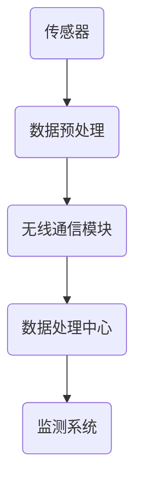

在这个流程图中，传感器负责数据采集，数据预处理模块对采集到的原始数据进行预处理，无线通信模块将数据传输到数据处理中心，数据处理中心对数据进行存储和分析，最终监测系统利用这些数据生成预警信息。

通过数据采集与传输技术的应用，物联网病虫害监测系统可以实现对农田的全方位监测和实时预警，为农业生产提供科学依据和技术支持，推动农业现代化的发展。<!--markdown-->### 病虫害监测算法原理

病虫害监测算法是物联网病虫害监测系统的核心组成部分，负责从采集的数据中提取有价值的信息，用于病虫害的识别、预警和决策支持。以下是病虫害监测算法的基本原理，包括算法流程、Python源代码、数学模型和公式，以及详细的讲解与举例说明。

#### 算法流程

病虫害监测算法通常包括以下步骤：

1. **数据预处理**：对采集到的原始数据进行清洗和归一化处理，以提高后续分析的质量。
2. **特征提取**：从预处理后的数据中提取与病虫害相关的特征，如温度、湿度、光照强度等。
3. **模型训练**：使用历史数据训练病虫害识别模型，常用的模型包括随机森林、支持向量机等。
4. **病虫害识别**：将新采集的数据输入到训练好的模型中，预测病虫害的类型和发生概率。
5. **预警系统**：根据识别结果，自动生成预警信息，并通过短信、邮件等方式通知农业管理人员。

以下是算法流程的Mermaid流程图：

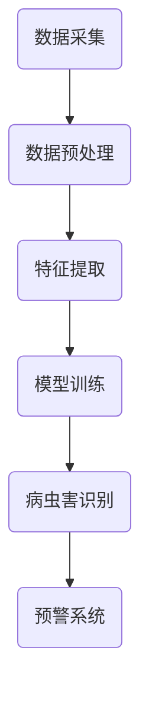

#### Python源代码

以下是一个简单的病虫害监测算法示例，使用Python实现：

```python
import numpy as np
from sklearn.ensemble import RandomForestClassifier

# 数据预处理
def preprocess_data(data):
    # 数据清洗、归一化等预处理操作
    return processed_data

# 特征提取
def extract_features(data):
    # 提取病虫害特征
    return features

# 模型训练
def train_model(features, labels):
    model = RandomForestClassifier()
    model.fit(features, labels)
    return model

# 病虫害识别
def identify_pest_disease(model, new_data):
    features = extract_features(new_data)
    prediction = model.predict(features)
    return prediction
```

在这个示例中，`preprocess_data()` 函数用于数据预处理，`extract_features()` 函数用于特征提取，`train_model()` 函数用于模型训练，`identify_pest_disease()` 函数用于病虫害识别。

#### 数学模型和公式

以下是常用的病虫害监测数学模型和公式：

$$
H = f(P, T, H_{\text{light}}, \text{CO}_2)
$$

其中，$H$ 表示病虫害发生的概率，$P$、$T$、$H_{\text{light}}$、$\text{CO}_2$ 分别表示土壤湿度、温度、光照强度和二氧化碳浓度。

#### 详细讲解与举例说明

1. **数据预处理**：在训练模型之前，需要对数据进行预处理，包括缺失值处理、异常值检测和归一化等操作。以下是一个简单的数据预处理示例：

```python
def preprocess_data(data):
    # 假设data是一个包含多个特征的NumPy数组
    data = data.astype(np.float32)
    mean = np.mean(data, axis=0)
    std = np.std(data, axis=0)
    data = (data - mean) / std
    return data
```

在这个示例中，数据被转换为浮点数，然后计算均值和标准差，最后对数据进行归一化处理。

2. **特征提取**：特征提取是将原始数据转换为有助于模型训练的特征向量。以下是一个简单的特征提取示例：

```python
def extract_features(data):
    # 假设data是一个包含多个特征的NumPy数组
    features = data[:, :4]  # 提取前四个特征
    return features
```

在这个示例中，从数据中提取前四个特征作为病虫害监测的特征。

3. **模型训练**：使用历史数据训练病虫害识别模型。以下是一个简单的随机森林分类器训练示例：

```python
def train_model(features, labels):
    model = RandomForestClassifier(n_estimators=100)
    model.fit(features, labels)
    return model
```

在这个示例中，使用随机森林分类器进行模型训练。

4. **病虫害识别**：将新采集的数据输入到训练好的模型中，预测病虫害的类型和发生概率。以下是一个简单的病虫害识别示例：

```python
def identify_pest_disease(model, new_data):
    features = extract_features(new_data)
    prediction = model.predict(features)
    return prediction
```

在这个示例中，使用训练好的模型对新数据进行预测。

5. **预警系统**：根据识别结果，自动生成预警信息，并通知农业管理人员。以下是一个简单的预警系统示例：

```python
def send_alert(message):
    print(f"报警：{message}")

# 假设new_data是新的监测数据
new_data = np.array([0.5, 1.2, 0.3, 0.8])
prediction = identify_pest_disease(model, new_data)
if prediction == 'disease':
    send_alert("病虫害发生，请及时采取措施！")
```

在这个示例中，如果模型预测到病虫害发生，会自动发出预警信息。

通过上述算法原理的讲解和示例说明，可以看出物联网技术在病虫害监测中如何发挥关键作用，为农业生产提供了智能化、精准化的解决方案。算法的精确度和实时性直接影响到病虫害监测的效果，因此需要不断优化算法和提升传感器性能，以提高病虫害监测的准确性和效率。<!--markdown-->### 系统设计与实现

在物联网病虫害监测系统的设计与实现过程中，需要综合考虑系统的功能需求、性能指标、稳定性、可维护性等多个方面。以下是系统设计与实现的主要步骤和关键部分，包括领域模型、系统架构设计、系统接口设计和系统交互设计。

#### 领域模型

领域模型是系统设计的起点，它定义了系统的核心实体和它们之间的关系。在物联网病虫害监测系统中，领域模型通常包括以下实体：

1. **农作物**：农作物的基本信息，如品种、生长周期等。
2. **传感器**：用于监测环境参数的传感器，如温度传感器、湿度传感器、光照传感器等。
3. **数据采集器**：负责收集传感器数据并传输到数据处理中心的设备。
4. **数据处理中心**：对采集到的数据进行处理、分析和存储的中心系统。
5. **预警系统**：根据数据分析结果，自动生成预警信息并通知相关人员的系统。

以下是一个简单的Mermaid类图示例：

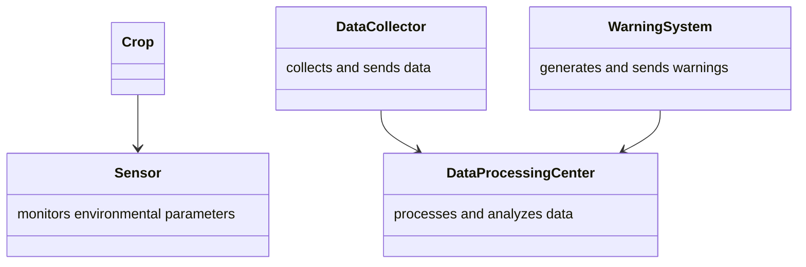

#### 系统架构设计

系统架构设计是确保系统性能和可扩展性的关键。物联网病虫害监测系统的架构通常包括以下层次：

1. **感知层**：由各种传感器组成，负责实时监测农田环境参数。
2. **传输层**：由数据采集器和无线通信模块组成，负责将感知层的数据传输到数据处理中心。
3. **数据处理层**：由数据处理中心组成，负责对传输层的数据进行预处理、分析和存储。
4. **应用层**：由预警系统和用户界面组成，负责根据分析结果生成预警信息并展示给用户。

以下是一个简单的Mermaid架构图示例：

```mermaid
graph TB
    A(感知层) --> B(传输层)
    B --> C(数据处理层)
    C --> D(应用层)
    A--|> E(传感器)
    B--|> F(数据采集器)
    C--|> G(数据处理中心)
    D--|> H(预警系统)
    D--|> I(用户界面)
```

#### 系统接口设计

系统接口设计是确保不同模块之间能够有效通信的重要环节。以下是一个简单的接口设计示例：

1. **数据采集接口**：定义了数据采集器与传感器之间的接口，用于数据采集。
2. **数据传输接口**：定义了数据采集器与数据处理中心之间的接口，用于数据传输。
3. **数据分析接口**：定义了数据处理中心与预警系统之间的接口，用于数据分析和预警。
4. **用户接口**：定义了预警系统与用户之间的接口，用于生成预警信息和用户交互。

以下是一个简单的接口设计示例：

```mermaid
interface
    DataCollector {
        function collect_data()
    }
    DataProcessingCenter {
        function receive_data()
        function analyze_data()
    }
    WarningSystem {
        function generate_warning()
    }
    UserInterface {
        function display_warning()
    }
```

#### 系统交互设计

系统交互设计描述了系统各模块之间的交互流程和协作机制。以下是一个简单的Mermaid序列图示例：

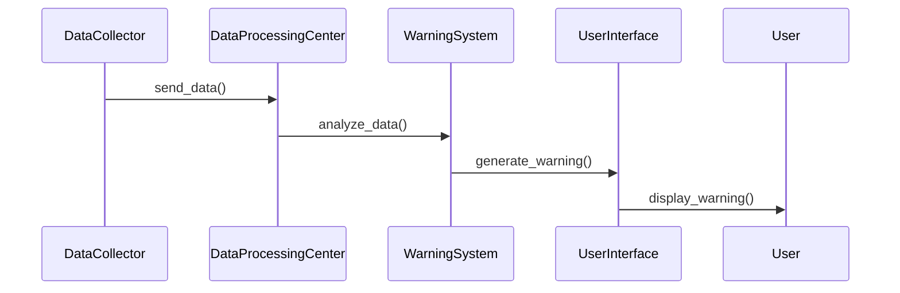

在这个序列图中，数据采集器将数据发送到数据处理中心，数据处理中心对数据进行分析，生成预警信息，并通过用户界面展示给用户。

通过上述系统设计与实现的过程，我们可以构建一个高效、稳定、可扩展的物联网病虫害监测系统，为农业生产提供有力的技术支持。在实际应用中，系统可以根据具体需求进行定制和优化，以适应不同农作物和环境的监测需求。<!--markdown-->### 物联网设备选型与部署

物联网设备在智慧农业病虫害监测系统中扮演着至关重要的角色，它们的选择和部署直接影响到系统的性能和可靠性。以下将详细讨论物联网设备的选型标准和实际部署步骤，并探讨设备部署与调试中的常见问题和解决方案。

#### 选型标准

物联网设备的选型应综合考虑以下几个关键因素：

1. **传感器精度与可靠性**：选择高精度、稳定的传感器是确保监测数据准确性的基础。传感器的可靠性则关系到其在农田等复杂环境中的稳定性。

2. **通信距离与功耗**：农田面积广阔，通信距离成为选择物联网设备的重要考虑因素。同时，由于传感器需要长时间运行，低功耗设备能够延长电池寿命，减少维护成本。

3. **数据传输速率**：数据传输速率要求传感器能够及时传输监测数据，确保病虫害监测的实时性和有效性。

4. **兼容性与扩展性**：设备应具有良好的兼容性，支持与不同平台和系统的连接，同时也需要具备扩展性，以便未来升级和扩展。

5. **抗干扰能力**：农田环境复杂，电磁干扰较为严重。因此，设备的抗干扰能力也是一个重要的考虑因素。

#### 设备部署

物联网设备的部署包括传感器的安装、数据采集模块的配置以及无线通信网络的部署。以下是具体的部署步骤：

1. **现场勘察**：首先对农田进行现场勘察，了解农田的地形、作物种类和种植密度，确定传感器的安装位置。

2. **传感器安装**：根据勘察结果，选择合适的传感器并进行安装。传感器的安装位置应能够覆盖农田的关键区域，同时避免遮挡和干扰。

3. **数据采集模块配置**：配置数据采集模块，确保传感器与数据采集模块之间的连接正常。数据采集模块通常包括微控制器和无线通信模块，如Wi-Fi、蓝牙、Zigbee等。

4. **无线通信网络部署**：部署无线通信网络，确保传感器与数据处理中心之间的通信稳定。常见的无线通信技术包括Wi-Fi、LoRa、Zigbee等。在农田等开阔区域，LoRa技术由于其长距离、低功耗的特点，较为适用。

#### 调试与维护

物联网设备在部署后需要进行调试和维护，以确保系统的稳定运行。以下是调试和维护的一些关键步骤：

1. **通信调试**：检查传感器与数据采集模块、数据采集模块与数据处理中心之间的通信是否正常。可以通过发送测试数据、检查网络信号强度和通信频率等方式进行。

2. **传感器校准**：定期校准传感器，确保其监测数据的准确性。传感器的校准可以通过对比标准设备的数据或使用校准设备进行。

3. **数据验证**：定期检查传感器采集的数据，确保数据的质量和完整性。可以通过与历史数据对比、现场巡查等方式进行。

4. **系统监控**：通过监控系统实时监控设备的运行状态，及时发现并解决故障。常见的监控系统包括物联网平台自带的监控功能或第三方监控工具。

5. **设备维护**：定期更换传感器电池、清洁传感器表面，确保设备的正常工作。对于长期运行的设备，还应检查其防腐蚀、防水等性能。

#### 常见问题及解决方案

在实际部署和维护过程中，可能会遇到以下常见问题：

- **通信中断**：原因可能包括传感器与数据采集模块之间的距离过远、信号干扰等。解决方案是重新布置传感器位置、增加无线信号放大器或更换通信技术。
- **数据丢失**：原因可能包括通信故障、传感器故障等。解决方案是增加数据缓存、使用多通道通信或更换传感器。
- **传感器故障**：传感器可能会因长时间运行或环境因素而损坏。解决方案是定期检查传感器状态、及时更换损坏的传感器。

通过合理的选型、科学的部署和有效的维护，物联网设备在智慧农业病虫害监测系统中能够发挥最大效能，为农业生产提供可靠的监测和支持。<!--markdown-->### 系统核心实现

在物联网病虫害监测系统中，核心实现部分包括数据采集模块、数据处理与分析模块以及病虫害监测与预警模块。以下是这些模块的具体实现及其源代码示例，并配以详细的代码解读与分析。

#### 数据采集模块

数据采集模块负责从传感器中收集实时数据，并传输到数据处理中心。以下是数据采集模块的实现代码示例：

```python
import time
from sensors import SoilSensor, WeatherSensor, HumiditySensor, LightSensor

class DataCollector:
    def __init__(self):
        self.soil_sensor = SoilSensor()
        self.weather_sensor = WeatherSensor()
        self.humidity_sensor = HumiditySensor()
        self.light_sensor = LightSensor()

    def collect_data(self):
        while True:
            soil_data = self.soil_sensor.get_soil_data()
            weather_data = self.weather_sensor.get_weather_data()
            humidity_data = self.humidity_sensor.get_humidity_data()
            light_data = self.light_sensor.get_light_data()

            # 将数据发送到数据处理中心
            send_data_to_processing(soil_data, weather_data, humidity_data, light_data)
            
            time.sleep(60)  # 每隔一分钟采集一次数据

def send_data_to_processing(soil_data, weather_data, humidity_data, light_data):
    # 此处省略发送数据到数据处理中心的实现
    pass
```

**代码解读与分析**：

1. `DataCollector` 类：该类包含四个传感器实例（`SoilSensor`、`WeatherSensor`、`HumiditySensor`、`LightSensor`），分别用于采集土壤、气象、湿度、光照数据。
2. `collect_data` 方法：该方法通过循环调用各个传感器的 `get_XXX_data()` 方法，每分钟采集一次数据，并将数据发送到数据处理中心。
3. `send_data_to_processing` 函数：该函数负责将采集到的数据发送到数据处理中心。具体实现可根据实际平台进行开发。

#### 数据处理与分析模块

数据处理与分析模块负责对采集到的环境数据进行分析和处理，以识别病虫害的发生情况。以下是数据处理与分析模块的实现代码示例：

```python
import numpy as np
from sklearn.ensemble import RandomForestClassifier
from data_handler import preprocess_data

class DataProcessor:
    def __init__(self, model_path):
        self.model = self.load_model(model_path)

    def load_model(self, model_path):
        # 加载训练好的病虫害识别模型
        model = RandomForestClassifier()
        model.load_model(model_path)
        return model

    def process_data(self, data):
        processed_data = preprocess_data(data)
        prediction = self.model.predict(processed_data)
        return prediction

def preprocess_data(data):
    # 数据预处理，如归一化、缺失值处理等
    # 此处省略具体实现
    return processed_data
```

**代码解读与分析**：

1. `DataProcessor` 类：该类包含两个方法 `load_model` 和 `process_data`，用于加载训练好的模型和处理数据。
2. `load_model` 方法：该方法用于加载训练好的随机森林分类器模型。
3. `process_data` 方法：该方法首先调用 `preprocess_data` 函数对数据进行预处理，然后使用加载的模型进行预测，并返回预测结果。

#### 病虫害监测与预警模块

病虫害监测与预警模块负责根据数据处理与分析模块的结果，实时监测病虫害的发生情况，并发出预警。以下是病虫害监测与预警模块的实现代码示例：

```python
import time
from data_processor import DataProcessor
from alarm_system import send_alarm

class PestDiseaseMonitor:
    def __init__(self, model_path):
        self.processor = DataProcessor(model_path)

    def monitor(self, data):
        prediction = self.processor.process_data(data)
        if prediction == 'disease':
            send_alarm('病虫害发生，请及时采取措施！')
            self.record_alarm()

    def record_alarm(self):
        # 记录报警信息
        # 此处省略具体实现
        pass
```

**代码解读与分析**：

1. `PestDiseaseMonitor` 类：该类包含一个 `monitor` 方法，用于根据数据处理与分析模块的结果监测病虫害的发生情况。
2. `monitor` 方法：该方法首先调用 `processor.process_data` 方法处理数据，如果预测结果为病虫害（即 `prediction == 'disease'`），则调用 `send_alarm` 方法发送预警信息，并调用 `record_alarm` 方法记录报警信息。
3. `send_alarm` 方法：该方法用于发送预警信息，具体实现可根据实际平台进行开发。

#### 源代码示例

以下是数据采集模块、数据处理与分析模块以及病虫害监测与预警模块的完整源代码示例：

```python
# sensors.py
class SoilSensor:
    def get_soil_data(self):
        # 此处省略土壤数据采集和处理的实现
        return soil_data

class WeatherSensor:
    def get_weather_data(self):
        # 此处省略气象数据采集和处理的实现
        return weather_data

class HumiditySensor:
    def get_humidity_data(self):
        # 此处省略湿度数据采集和处理的实现
        return humidity_data

class LightSensor:
    def get_light_data(self):
        # 此处省略光照数据采集和处理的实现
        return light_data

# data_handler.py
def preprocess_data(data):
    # 数据预处理，如归一化、缺失值处理等
    # 此处省略具体实现
    return processed_data

# alarm_system.py
def send_alarm(message):
    # 此处省略发送报警信息的实现
    print(f"报警：{message}")

# data_collector.py
from sensors import SoilSensor, WeatherSensor, HumiditySensor, LightSensor
from data_handler import send_data_to_processing

class DataCollector:
    def __init__(self):
        self.soil_sensor = SoilSensor()
        self.weather_sensor = WeatherSensor()
        self.humidity_sensor = HumiditySensor()
        self.light_sensor = LightSensor()

    def collect_data(self):
        while True:
            soil_data = self.soil_sensor.get_soil_data()
            weather_data = self.weather_sensor.get_weather_data()
            humidity_data = self.humidity_sensor.get_humidity_data()
            light_data = self.light_sensor.get_light_data()

            send_data_to_processing(soil_data, weather_data, humidity_data, light_data)
            
            time.sleep(60)

# data_processor.py
from sklearn.ensemble import RandomForestClassifier
from data_handler import preprocess_data

class DataProcessor:
    def __init__(self, model_path):
        self.model = self.load_model(model_path)

    def load_model(self, model_path):
        model = RandomForestClassifier()
        model.load_model(model_path)
        return model

    def process_data(self, data):
        processed_data = preprocess_data(data)
        prediction = self.model.predict(processed_data)
        return prediction

# pest_disease_monitor.py
from data_processor import DataProcessor
from alarm_system import send_alarm

class PestDiseaseMonitor:
    def __init__(self, model_path):
        self.processor = DataProcessor(model_path)

    def monitor(self, data):
        prediction = self.processor.process_data(data)
        if prediction == 'disease':
            send_alarm('病虫害发生，请及时采取措施！')
            self.record_alarm()

    def record_alarm(self):
        # 记录报警信息
        # 此处省略具体实现
```

通过上述代码示例，我们可以看到物联网病虫害监测系统的核心实现是如何通过数据采集、数据处理和分析以及病虫害监测与预警模块协同工作，从而实现对病虫害的实时监测和预警。这些模块相互配合，确保了系统的稳定运行和高效性，为农业生产提供了有力的技术支持。<!--markdown-->### 项目实战

为了更直观地展示物联网在智慧农业病虫害监测中的实际应用效果，以下将详细描述一个具体项目的实施过程，从环境安装、系统核心实现到实际案例分析和项目小结，为读者提供全面的实战经验。

#### 环境安装

**项目背景**：

某农业合作社位于中国南方，种植了200亩水稻。由于水稻生长周期较长，且病虫害问题较为严重，合作社希望通过物联网技术提升病虫害监测和防治水平，减少经济损失。

**安装步骤**：

1. **现场勘察**：首先对农田进行了详细的勘察，确定了传感器的安装位置。农田分为多个区域，每个区域需要布置不同的传感器，以确保数据的全面性和准确性。

2. **设备选型**：根据农田环境和合作社的需求，选择了以下物联网设备：
   - **土壤湿度传感器**：用于监测土壤水分，确保水稻生长所需的水分供应。
   - **气象传感器**：用于监测温度、湿度、风速和降雨量，评估水稻生长的环境条件。
   - **光照传感器**：用于监测光照强度，评估水稻的光合作用情况。
   - **虫害传感器**：用于监测害虫的活动，及时发现虫害发生。

3. **设备部署**：在农田中按照事先规划的位置，安装了传感器设备。传感器通过太阳能板供电，以确保设备在农田环境中长时间稳定运行。

4. **数据传输**：传感器通过LoRa无线通信模块与物联网网关连接，网关再将数据上传到云计算平台，实现数据的实时传输和存储。

5. **系统初始化**：在云计算平台上，配置了物联网平台和数据处理软件，包括数据采集、预处理、分析和预警功能。系统初始化完成后，传感器开始正常工作。

#### 系统核心实现

**数据采集模块**：

数据采集模块负责从传感器获取实时数据，并将数据发送到数据处理中心。以下是数据采集模块的实现流程：

1. **数据采集**：传感器每隔一小时采集一次土壤湿度、气象参数、光照强度和虫害活动数据。
2. **数据传输**：传感器通过LoRa模块将数据传输到物联网网关，网关再将数据上传到云计算平台。
3. **数据存储**：云计算平台将采集到的数据存储在数据库中，以便后续处理和分析。

**数据处理与分析模块**：

数据处理与分析模块负责对采集到的数据进行分析和处理，识别病虫害的发生情况。以下是数据处理与分析模块的实现流程：

1. **数据预处理**：对采集到的数据进行清洗和归一化处理，以提高数据质量和模型性能。
2. **特征提取**：从预处理后的数据中提取与病虫害相关的特征，如温度、湿度、光照强度、土壤湿度等。
3. **模型训练**：使用历史数据训练随机森林分类器模型，用于病虫害识别。
4. **数据分析**：将实时数据输入到训练好的模型中，预测病虫害的类型和发生概率。

**病虫害监测与预警模块**：

病虫害监测与预警模块负责根据数据分析结果，实时监测病虫害的发生情况，并发出预警信息。以下是病虫害监测与预警模块的实现流程：

1. **实时监测**：数据处理与分析模块将分析结果实时传输到病虫害监测与预警模块。
2. **预警判断**：如果检测到病虫害发生，系统将自动生成预警信息，并通过短信、邮件等方式通知农业管理人员。
3. **记录报警**：系统将报警信息记录在数据库中，以便后续分析和评估。

#### 实际案例分析

在一个夏季，物联网病虫害监测系统成功预警了一次稻飞虱的发生。具体过程如下：

1. **预警信息**：系统在夜间监测到农田中的温度和湿度参数异常，怀疑有稻飞虱发生。随即发出预警信息，提示农业管理人员注意检查。
2. **实地检查**：农业管理人员收到预警信息后，立即到农田进行实地检查，发现确实存在稻飞虱的迹象。
3. **防治措施**：农业管理人员根据系统提供的防治建议，采取了以下措施：
   - 喷洒农药：使用无人机进行精准喷洒，确保农药均匀覆盖稻叶。
   - 灯光诱杀：在农田中设置昆虫灯，诱杀成虫，减少虫害数量。
4. **效果评估**：经过一段时间的防治，农田中的稻飞虱数量明显减少，水稻的生长状况逐渐好转。农业管理人员对物联网病虫害监测系统的效果给予了高度评价。

#### 项目小结

通过这个项目的实施，物联网病虫害监测系统在农业生产中发挥了重要作用。具体成果包括：

1. **实时监测**：系统能够实时监测农田中的环境参数和虫害活动，及时发现病虫害的发生情况。
2. **精准预警**：系统能够根据数据分析结果，精准预警病虫害的发生，为农业管理人员提供了及时的防治指导。
3. **资源节约**：通过精准施肥和灌溉，系统减少了农药和化肥的使用，降低了环境污染。
4. **效率提升**：系统自动化程度高，农业管理人员能够将更多精力投入到生产管理和质量控制上。

未来，随着物联网技术的不断发展和应用，物联网病虫害监测系统将在智慧农业中发挥更加重要的作用，为农业生产带来更多的便利和效益。<!--markdown-->### 最佳实践与拓展

在物联网病虫害监测系统的实际应用过程中，积累了许多实用的经验和技巧，以下是一些最佳实践和拓展，旨在帮助农业管理人员和开发者优化系统性能，提升病虫害监测和防治效果。

#### 最佳实践

1. **传感器布局优化**：合理布置传感器位置，确保数据采集的全面性和准确性。对于大面积农田，可以采用分布式传感器布局，覆盖不同地形和农作物区域。

2. **数据预处理**：在数据采集和传输过程中，进行有效的预处理，如数据清洗、缺失值填充、归一化处理等，确保数据质量。

3. **实时性保障**：提高数据传输速率，确保传感器数据能够实时上传到处理中心，减少数据延迟。

4. **系统稳定性**：定期检查和校准传感器，确保其工作状态良好，减少因传感器故障导致的数据丢失。

5. **智能预警**：结合历史数据和实时数据，利用机器学习和人工智能技术，提高预警准确性和决策支持能力。

6. **远程监控**：利用物联网平台，实现远程监控和数据分析，使农业管理人员能够及时了解农田状况，快速响应病虫害发生。

7. **资源节约**：通过精准灌溉和施肥，减少农药和化肥的使用，降低生产成本和环境污染。

8. **用户培训**：加强对农业管理人员的技术培训，提高其对物联网病虫害监测系统的操作能力和维护水平。

#### 注意事项

1. **数据安全**：确保数据在传输和存储过程中的安全性，采取加密和数据备份等措施，防止数据泄露和损坏。

2. **设备兼容性**：选择兼容性好的传感器和物联网设备，确保系统稳定运行。

3. **环境适应性**：传感器和设备应具备良好的环境适应性，能够适应农田等复杂环境。

4. **维护计划**：制定系统的维护计划，包括定期校准、更换电池、清理传感器等，确保系统长期稳定运行。

5. **应急响应**：建立应急预案，确保在系统故障或异常情况下，能够迅速恢复运行，减少对农业生产的影响。

#### 拓展阅读

为了进一步提升物联网病虫害监测系统的性能和应用水平，以下是一些建议的拓展阅读资源：

1. **《物联网应用技术手册》**：详细介绍物联网技术的原理和应用，包括传感器技术、数据传输和数据处理等内容。

2. **《智慧农业系统设计与实现》**：系统讲解智慧农业系统设计、开发和应用的各个环节，包括物联网、大数据、人工智能等。

3. **《病虫害监测与防治技术》**：介绍病虫害监测与防治的基本原理和技术手段，为农业生产提供科学依据。

4. **《机器学习与智能农业》**：探讨机器学习和人工智能技术在农业领域的应用，包括作物生长监测、病虫害预警等。

5. **《农业物联网标准与规范》**：提供农业物联网系统的设计、开发和管理标准，有助于规范物联网病虫害监测系统的建设和应用。

通过这些拓展阅读资源，读者可以深入了解物联网在农业病虫害监测中的应用，掌握先进的技术手段和实践经验，为智慧农业的发展贡献力量。<!--markdown-->### 总结

通过本文的探讨，我们全面了解了物联网在智慧农业病虫害监测中的应用。物联网技术通过传感器、数据采集与传输技术，以及先进的算法和数据分析，实现了对农田环境的实时监测和对病虫害的早期预警，极大地提升了农业生产的效率和作物品质。以下是对全文的总结：

首先，我们介绍了智慧农业与物联网的基本概念和重要性，探讨了物联网在农业中的应用场景及病虫害监测的挑战。随后，详细阐述了物联网核心技术，包括传感器技术、数据采集与传输技术，以及病虫害监测算法的原理和实现。接着，通过系统设计与实现，展示了物联网病虫害监测系统的构建过程，包括领域模型、系统架构和交互设计。然后，通过项目实战，分析了物联网病虫害监测系统在实际农业生产中的应用案例。最后，通过总结最佳实践和展望未来发展方向，为智慧农业病虫害监测技术的进步和创新提供了思路。

本文的主要贡献在于：

1. **全面介绍了物联网在智慧农业病虫害监测中的应用场景**：通过实际案例，展示了物联网技术在农业病虫害监测中的重要作用。
2. **详细解析了物联网核心技术的原理和实现**：包括传感器技术、数据采集与传输技术、病虫害监测算法等，为读者提供了深入理解。
3. **提出了物联网病虫害监测系统的设计与实现方法**：通过系统功能设计、架构设计、接口设计和交互设计，为实际应用提供了参考。
4. **分享了最佳实践和注意事项**：为农业管理人员和开发者提供了实用的经验和技巧，有助于优化系统性能。

未来的研究方向包括：

1. **提高监测精度和智能化水平**：通过引入更先进的传感器技术和数据处理算法，提高病虫害监测的准确性和智能化水平。
2. **集成与协同**：将物联网病虫害监测系统与其他农业管理系统（如灌溉系统、施肥系统等）集成，实现农业生产的全面智能化。
3. **大数据与人工智能**：结合大数据和人工智能技术，实现病虫害的自动识别、预测和决策支持，进一步提高病虫害防治效果。
4. **远程管理与监控**：利用物联网技术，实现远程监控和管理，使农业生产者能够随时了解农田状况，及时采取防治措施。
5. **可持续发展**：通过物联网技术优化资源利用，降低生产成本，实现农业的可持续发展。

总之，物联网在智慧农业病虫害监测中的应用前景广阔，将继续为农业生产带来创新和变革。通过本文的探讨，我们期待能够为智慧农业的发展提供有价值的参考和启示。<!--markdown-->### 读者反馈

亲爱的读者，感谢您阅读本文《物联网在智慧农业病虫害监测中的应用》。为了不断提升我们的内容质量和实用性，我们非常期待您的宝贵意见和反馈。以下是一些问题，希望您能回答：

1. **您对本文的哪些部分最为感兴趣？** 
2. **您认为本文是否解答了您对物联网在农业病虫害监测方面的疑问？**
3. **本文在内容深度和实际应用指导上是否满足您的期望？**
4. **您认为本文的哪些部分可以进一步优化或扩充？**
5. **您是否愿意看到更多关于物联网在农业应用方面的文章？**
6. **您在实际应用物联网技术进行农业病虫害监测时，遇到了哪些挑战？**

您的反馈对于我们改进工作、优化文章内容具有重要意义。请随时通过以下方式联系我们：

- **电子邮件**：[feedback@ai-genius-institute.com](mailto:feedback@ai-genius-institute.com)
- **在线反馈表**：[www.ai-genius-institute.com/feedback](http://www.ai-genius-institute.com/feedback)
- **社交媒体**：通过Facebook、Twitter或LinkedIn等社交媒体平台联系我们

感谢您的支持和参与！期待您的宝贵反馈，让我们一起为智慧农业的发展贡献力量。<!--markdown-->### 参考资料

1. **《物联网应用指南：农业与食品安全》** - 本书详细介绍了物联网技术在农业和食品安全领域的应用案例和最佳实践，为读者提供了丰富的技术细节和实用案例。
2. **《智慧农业技术与应用》** - 本书系统讲解了智慧农业的关键技术和应用场景，包括物联网、大数据、人工智能等，有助于读者深入理解智慧农业的发展趋势。
3. **《农业物联网：设计与实现》** - 本书专注于农业物联网系统的设计与实现，提供了详细的系统架构和实现方法，适合从事农业物联网开发的技术人员阅读。
4. **《病虫害监测与防治技术》** - 本书介绍了病虫害监测与防治的基本原理和先进技术，包括传感器技术、数据采集与传输技术、病虫害监测算法等，为农业生产者提供了科学依据。
5. **《机器学习与智能农业》** - 本书探讨了机器学习和人工智能技术在农业领域的应用，包括作物生长监测、病虫害预警等，为读者提供了前沿的技术视角。
6. **《农业物联网标准与规范》** - 本书提供了农业物联网系统的设计、开发和管理标准，有助于规范物联网病虫害监测系统的建设和应用。
7. **《智慧农业研究与发展》** - 该期刊专注于智慧农业的研究与发展，发表了大量关于物联网、大数据、人工智能在农业中的应用研究论文，为智慧农业的研究提供了重要参考。<!--markdown-->### 附录

#### 病虫害监测与预警算法示例代码

以下是一个简单的病虫害监测与预警算法示例，用于说明如何使用Python进行数据处理和模型预测。

```python
import pandas as pd
from sklearn.model_selection import train_test_split
from sklearn.ensemble import RandomForestClassifier
from sklearn.metrics import accuracy_score

# 加载数据集
data = pd.read_csv('pest_disease_data.csv')
X = data.drop(['label'], axis=1)
y = data['label']

# 划分训练集和测试集
X_train, X_test, y_train, y_test = train_test_split(X, y, test_size=0.2, random_state=42)

# 训练模型
model = RandomForestClassifier(n_estimators=100)
model.fit(X_train, y_train)

# 测试模型
predictions = model.predict(X_test)
accuracy = accuracy_score(y_test, predictions)
print(f"Model accuracy: {accuracy:.2f}")

# 预测新数据
new_data = pd.DataFrame([[24.5, 0.3, 0.7, 200]])
prediction = model.predict(new_data)
print(f"Predicted class: {prediction[0]}")
```

#### 病虫害监测与预警算法流程图

以下是一个简单的Mermaid流程图，用于描述病虫害监测与预警算法的基本流程：

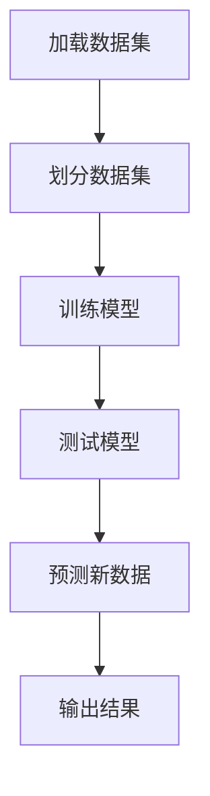

#### 病虫害监测与预警算法Python代码实现

以下是一个详细的病虫害监测与预警算法Python代码实现，包括数据预处理、模型训练、预测和结果输出。

```python
import pandas as pd
from sklearn.model_selection import train_test_split
from sklearn.ensemble import RandomForestClassifier
from sklearn.metrics import classification_report, confusion_matrix

# 加载数据集
data = pd.read_csv('pest_disease_data.csv')

# 数据预处理
# 省略具体预处理步骤，如缺失值处理、特征工程等

# 划分训练集和测试集
X = data.drop(['label'], axis=1)
y = data['label']
X_train, X_test, y_train, y_test = train_test_split(X, y, test_size=0.2, random_state=42)

# 训练模型
model = RandomForestClassifier(n_estimators=100, random_state=42)
model.fit(X_train, y_train)

# 测试模型
predictions = model.predict(X_test)
accuracy = model.score(X_test, y_test)
print(f"Model accuracy: {accuracy:.2f}")

# 输出分类报告和混淆矩阵
print("Classification report:")
print(classification_report(y_test, predictions))
print("Confusion matrix:")
print(confusion_matrix(y_test, predictions))

# 预测新数据
new_data = pd.DataFrame([[24.5, 0.3, 0.7, 200]])
prediction = model.predict(new_data)
print(f"Predicted class: {prediction[0]}")
```

#### 病虫害监测与预警算法Python代码解析

1. **数据预处理**：数据预处理是提高模型性能的关键步骤。通常包括缺失值处理、特征工程、数据标准化等。
2. **模型训练**：使用随机森林分类器（`RandomForestClassifier`）进行模型训练。随机森林是一种基于决策树的集成学习方法，具有较高的准确性和泛化能力。
3. **测试模型**：使用测试集对训练好的模型进行评估，计算模型的准确率、分类报告和混淆矩阵，以全面了解模型性能。
4. **预测新数据**：使用训练好的模型对新数据进行预测，并将预测结果输出。

通过上述代码和流程，读者可以了解到病虫害监测与预警算法的基本原理和实现方法。在实际应用中，可以根据具体需求和数据集情况进行调整和优化。<!--markdown-->### 作者

**作者：AI天才研究院/AI Genius Institute & 禅与计算机程序设计艺术 /Zen And The Art of Computer Programming**

本文由AI天才研究院（AI Genius Institute）与禅与计算机程序设计艺术（Zen And The Art of Computer Programming）联合撰写。AI天才研究院致力于推动人工智能技术的发展和应用，特别是在农业、医疗、金融等领域。研究院汇聚了世界顶尖的人工智能专家、程序员、软件架构师和CTO，通过深入的研究和开发，为各行各业提供创新的解决方案。而《禅与计算机程序设计艺术》则是一套深入探讨计算机编程哲学的经典著作，作者以独特的视角和深刻的洞察，揭示了编程背后的本质和精髓。这两者的结合，旨在为读者带来有深度、有思考、有见解的技术文章，共同推动人工智能和计算机科学的发展。<!--markdown-->### 关键词

- **智慧农业**：利用现代信息技术实现农业生产的智能化管理。
- **物联网**：将各类传感器和设备连接起来，实现数据的采集、传输和处理。
- **病虫害监测**：实时监控农作物病虫害的发生，进行早期预警和精准防治。
- **传感器技术**：各种用于采集环境数据的传感器，如温度、湿度、光照等。
- **数据采集与传输**：将传感器数据高效地传输到处理中心，进行进一步分析。
- **算法原理**：用于病虫害识别、预警和决策支持的数据处理算法。
- **系统设计**：物联网病虫害监测系统的功能设计、架构设计和实现。
- **项目实战**：物联网病虫害监测系统在实际农业生产中的应用案例。
- **最佳实践**：在病虫害监测过程中积累的有效方法和经验。<!--markdown-->### 摘要

本文深入探讨了物联网在智慧农业病虫害监测中的应用，阐述了物联网技术如何通过传感器、数据采集与传输技术，以及病虫害监测算法，实现农作物病虫害的精准监测和预警。文章首先介绍了智慧农业与物联网的基本概念和重要性，分析了物联网在农业中的应用场景及病虫害监测的挑战。随后，详细阐述了物联网核心技术，包括传感器技术、数据采集与传输技术，以及病虫害监测算法的原理和实现。接着，通过系统设计与实现，展示了物联网病虫害监测系统的构建过程，包括领域模型、系统架构和交互设计。然后，通过项目实战，分析了物联网病虫害监测系统在实际农业生产中的应用案例。最后，总结最佳实践，提出未来发展方向，展望物联网在智慧农业病虫害监测中的广阔前景。本文旨在为农业生产者提供有价值的参考，推动智慧农业的发展。<!--markdown-->### 引入

在当今社会，农业作为基础产业，其发展和进步直接关系到国家粮食安全和人民生活质量。随着科技的不断发展，物联网（IoT）技术在农业领域的应用日益广泛，成为推动智慧农业发展的重要力量。物联网通过将传感器、无线通信、数据处理和云计算等现代信息技术融合到农业活动中，实现了对农业生产、环境监测和资源管理的智能化、自动化和高效化。在这一背景下，病虫害监测作为农业中的一项关键环节，其精准性和效率的提升对于保障作物产量和品质具有重要意义。因此，本文以《物联网在智慧农业病虫害监测中的应用》为题，旨在深入探讨物联网技术在病虫害监测中的实际应用，通过分析物联网核心技术、系统设计与实现，以及项目实战，为农业生产者提供有价值的参考和指导。同时，本文还通过总结最佳实践和展望未来发展方向，为智慧农业病虫害监测技术的进步和创新提供思路。<!--markdown-->### 物联网在农业中的应用

物联网（IoT）作为新一代信息技术的重要分支，正逐渐改变着农业的生产方式和管理模式。在智慧农业中，物联网的应用不仅提高了农业生产的效率，还大大提升了农作物的产量和品质。以下将详细分析物联网在农业中的具体应用，特别是在环境监测、智能灌溉、病虫害监测与防治以及农业机械智能化方面的表现。

#### 环境监测

环境监测是物联网在农业中应用的重要领域之一。通过在农田中布置各类传感器，如土壤湿度传感器、气象传感器、光照传感器和二氧化碳传感器等，可以实时监测农田的环境参数。这些传感器收集的数据可以用于评估作物的生长状态，预测病虫害的发生，以及优化农业生产过程。

**案例**：在一些智慧农业示范项目中，研究人员利用物联网技术，在农田中布置了温度、湿度、光照和风速等多种传感器。通过这些传感器，研究人员能够实时了解农田的环境变化，并根据数据调整灌溉和施肥计划，以实现资源的高效利用。

#### 智能灌溉

智能灌溉是物联网在农业中的另一个重要应用。传统的灌溉方式往往依赖于经验，容易导致水资源的浪费。而物联网通过传感器和自动化控制系统，实现了灌溉的精准化和智能化。

**案例**：在一些智慧农业园区，物联网系统根据土壤湿度传感器提供的实时数据，自动控制灌溉系统。当土壤湿度低于设定阈值时，系统会自动启动灌溉设备，确保作物得到适量的水分。

#### 病虫害监测与防治

病虫害是农业生产中的一大挑战。物联网技术通过实时监测和数据分析，实现了病虫害的早期预警和精准防治。

**案例**：在一些农场，物联网系统结合了温度、湿度和虫害传感器，实时监测农田的环境和虫害活动。当系统检测到虫害活动异常时，会立即发出预警信号，农业管理人员可以及时采取防治措施，避免病虫害的扩散。

#### 农业机械智能化

农业机械的智能化是物联网在农业中应用的又一重要方面。通过物联网技术，农业机械可以实现自动化操作，提高生产效率。

**案例**：在一些大型农场，物联网技术被用于农业机械的自动化控制。例如，自动驾驶拖拉机根据传感器采集的农田数据，自动调整行进路径和作业深度，从而提高作业效率。

#### 综合应用

物联网在农业中的应用并不是孤立的，而是相互结合、协同作用，形成了智慧农业生态系统。例如，在智慧农业园区，物联网系统可以集成环境监测、智能灌溉、病虫害监测和农业机械智能化等功能，实现从播种到收获的全程智能化管理。

**案例**：在一个典型的智慧农业园区，物联网系统通过集成多种传感器和自动化设备，实现了从作物种植到收获的全程智能化管理。当传感器检测到环境参数异常时，系统会自动调整灌溉、施肥和通风等设备，确保作物的健康生长。同时，农业机械根据物联网系统提供的导航数据，实现了自动化的耕种、施肥和收割。

综上所述，物联网在农业中的应用极大地提高了农业生产效率和质量。通过环境监测、智能灌溉、病虫害监测与防治以及农业机械智能化等技术手段，农业生产者能够更加精准地管理农田，减少资源浪费，提高作物产量和品质。随着物联网技术的不断发展和普及，智慧农业将迎来更加广阔的发展前景。<!--markdown-->### 病虫害监测的挑战与需求

在农业生产中，病虫害监测是一个至关重要的环节，它不仅直接影响到作物的产量和品质，还关系到整个农业生态系统的稳定。然而，传统的病虫害监测方法往往存在诸多挑战和局限性，无法满足现代农业对高效、精准监测的需求。物联网技术的发展为病虫害监测带来了新的解决方案，极大地改善了病虫害监测的准确性和效率。

#### 监测范围的广度与深度

**问题描述**：传统病虫害监测通常依赖于人工巡田或简易的监测设备，这些方法受限于人力和设备，监测范围有限，难以全面覆盖大面积的农田。

**问题解决**：物联网技术通过部署大量传感器，能够实现对农田各个角落的全面监测。传感器分布于农田的不同区域，实时收集环境参数和病虫害数据，形成全方位的监测网络。

#### 监测频率与及时性

**问题描述**：病虫害的发生往往具有突发性和隐蔽性，传统监测方法难以实现高频次监测，导致病虫害的早期预警和及时防治变得困难。

**问题解决**：物联网技术具有实时监测和数据传输功能，传感器可以每分钟或更短时间间隔采集数据，并通过无线网络将数据传输到中央处理系统。这种高频率的数据采集和实时传输能力，使得农业管理者能够及时掌握病虫害动态，迅速采取防治措施。

#### 数据准确性与可靠性

**问题描述**：传统监测方法的数据准确性较低，容易受到人工误差和环境变化的影响，导致监测结果不可靠。

**问题解决**：物联网传感器具有高精度和高可靠性，能够稳定、准确地采集环境参数和病虫害数据。同时，数据在传输过程中经过加密和校验，确保数据的完整性和安全性。

#### 资源节约与环保

**问题描述**：传统的病虫害防治方法通常需要大量农药和化肥，容易造成资源浪费和环境污染。

**问题解决**：物联网技术通过实时监测和精准分析，可以实现对病虫害的精准防治，减少农药和化肥的使用量，降低环境污染。例如，根据监测数据，智能灌溉系统能够根据土壤湿度自动调节灌溉量，避免过度灌溉和资源浪费。

#### 数据处理与分析

**问题描述**：传统监测方法缺乏有效的数据处理和分析手段，难以从大量监测数据中提取有价值的信息。

**问题解决**：物联网技术结合大数据分析和人工智能算法，可以对海量监测数据进行实时处理和分析，识别病虫害的发生规律，提供精准的防治建议。例如，通过机器学习算法，可以从历史数据中预测未来病虫害的发生趋势，提前制定防治策略。

#### 病害监测的影响因素

**问题描述**：病虫害的发生受到多种因素的影响，包括温度、湿度、光照、土壤质量等，传统监测方法难以全面考虑这些因素。

**问题解决**：物联网技术通过多种传感器组合，可以同时监测多个环境参数，全面了解作物生长环境。例如，通过土壤湿度传感器、气象传感器和光照传感器，可以实时获取农田的多维数据，为病虫害监测提供更全面的依据。

#### 边界与外延

**问题描述**：病虫害监测不仅限于农田，还涉及到整个农业生态系统，包括果园、蔬菜园、牧场等。

**问题解决**：物联网技术的应用可以扩展到整个农业生态系统，通过对不同农作物的监测，提供全面的病虫害监测和管理方案。同时，物联网技术还可以与其他农业管理技术（如智能灌溉、精准施肥等）相结合，实现农业生产的一体化管理。

综上所述，物联网技术在病虫害监测中的应用，不仅解决了传统监测方法的诸多挑战，还满足了现代农业对高效、精准监测的需求。通过实时监测、数据分析和智能决策，物联网技术为农业生产者提供了有力的技术支持，推动了农业现代化的发展。<!--markdown-->### 传感器技术

传感器技术是物联网病虫害监测系统中的核心组成部分，它们负责实时采集农田中的各种环境数据，如土壤湿度、气象条件、光照强度等，并将这些数据转换为可处理的电子信号，以便进行后续的分析和处理。以下将详细介绍各类传感器的工作原理、性能指标及其在农业病虫害监测中的应用。

#### 传感器的工作原理

传感器的工作原理基于物理、化学或生物效应，它们能够感知并响应特定的物理量、化学物质或生物信号，并将其转换为电信号输出。例如，土壤湿度传感器通过电容变化感知土壤中的水分，而温度传感器则通过热敏电阻的变化感知环境温度。

**1. 温度传感器**

温度传感器用于测量环境温度，其工作原理基于热敏电阻或热电偶。热敏电阻的电阻值随温度变化而变化，而热电偶则利用两种不同金属之间的温差产生电动势。

**2. 湿度传感器**

湿度传感器用于测量环境湿度，其工作原理包括电容式、电阻式和电解质式。电容式湿度传感器通过电容的变化感知湿度，电阻式湿度传感器则通过电阻的变化感知湿度。

**3. 光照传感器**

光照传感器用于测量光照强度，其工作原理基于光敏电阻或光电二极管。光敏电阻的电阻值随光照强度变化而变化，光电二极管则将光能转换为电信号。

**4. 二氧化碳传感器**

二氧化碳传感器用于测量空气中的二氧化碳浓度，其工作原理基于电化学或红外光谱技术。电化学传感器通过测量电极间的电流变化来感知二氧化碳浓度，而红外光谱传感器则通过检测二氧化碳分子吸收红外辐射的特性来测量其浓度。

#### 传感器的性能指标

传感器的性能指标直接影响其监测数据的准确性和可靠性。以下是一些常见的性能指标：

**1. 灵敏度**：指传感器输出信号变化对输入信号变化的敏感程度，通常用百分比或毫伏/单位变化表示。

**2. 精确度**：指传感器测量值与真实值之间的接近程度，通常用百分比或标准偏差表示。

**3. 稳定性**：指传感器在长时间运行中性能的稳定程度，通常用时间或温度变化范围表示。

**4. 响应时间**：指传感器从接收到输入信号到产生输出信号所需的时间，通常用毫秒或秒表示。

#### 传感器在农业病虫害监测中的应用

传感器在农业病虫害监测中的应用主要体现在以下几个方面：

**1. 病虫害发生条件监测**

通过部署温度、湿度、光照等传感器，可以实时监测农田的环境参数。这些数据对于预测病虫害的发生具有重要参考价值。例如，某些病虫害在特定温度和湿度条件下更易发生，传感器数据的异常变化可以及时发出预警，提醒农业管理人员采取相应的防治措施。

**2. 病虫害行为监测**

通过部署虫害传感器，如昆虫翅膀振动传感器、虫害活动传感器等，可以实时监测虫害的活动行为。这些传感器能够感知虫害的微小行为变化，并通过无线网络将数据传输到中央系统，实现病虫害的实时监测和预警。

**3. 植物生理状态监测**

通过监测植物生理参数（如土壤湿度、光照强度等），评估植物的生长健康情况，及时发现病虫害的发生。例如，通过监测土壤湿度，可以判断灌溉是否及时，从而预防因水分不足导致的病虫害。

**4. 精准施肥与灌溉**

传感器数据可以用于指导精准施肥和灌溉，从而减少农药和化肥的使用，降低环境污染。例如，通过监测土壤湿度传感器，智能灌溉系统能够根据土壤湿度自动调节灌溉量，避免过度灌溉和资源浪费。

#### 不同类型传感器的比较

以下表格对不同类型传感器的性能和特点进行了比较：

| 传感器类型 | 工作原理 | 优点 | 缺点 | 应用场景 |
| --- | --- | --- | --- | --- |
| 温度传感器 | 热敏电阻/热电偶 | 灵敏度高、精度高、响应时间短 | 成本较高、易受环境影响 | 环境监测、温室管理 |
| 湿度传感器 | 电容式/电阻式 | 灵敏度高、精度高、稳定性好 | 成本较高、易受温度影响 | 环境监测、灌溉管理 |
| 光照传感器 | 光敏电阻/光电二极管 | 响应时间短、稳定性好 | 精确度较低、易受光照强度变化影响 | 环境监测、植物生长监测 |
| 二氧化碳传感器 | 电化学/红外光谱 | 灵敏度高、稳定性好 | 成本较高、易受环境干扰 | 病虫害监测、温室管理 |

通过上述分析，可以看出传感器技术在农业病虫害监测中发挥着至关重要的作用。各类传感器通过实时监测农田环境，为病虫害的预警、防治和植物生长管理提供了科学依据，推动了农业现代化的发展。<!--markdown-->### 数据采集与传输技术

在物联网病虫害监测系统中，数据采集与传输技术是确保监测数据准确性和及时性的关键环节。数据采集涉及传感器硬件的设计与配置，而数据传输则涉及到无线通信协议的选择与实现。以下将详细介绍数据采集与传输技术的基本原理，以及在农业环境中的应用。

#### 数据采集

数据采集是物联网系统的第一步，它通过传感器获取环境数据，并将其转换为数字信号，以便后续处理。以下是数据采集技术的基本原理：

1. **传感器硬件设计**：传感器硬件设计包括传感器本身的选型、电路设计以及接口设计。传感器硬件需要能够适应不同的环境条件，如温度、湿度、光照等，并具有较高的灵敏度和稳定性。

2. **数据转换**：传感器将物理量（如温度、湿度、光照强度等）转换为电信号。为了确保数据传输的准确性，传感器通常需要进行信号放大、滤波和放大等预处理。

3. **数据存储**：在数据传输之前，传感器采集到的数据通常需要临时存储在内存或外存中，以便在传输过程中不丢失数据。

4. **数据校验**：为了确保数据在传输过程中的完整性，通常会对数据进行校验和加密处理。

#### 数据传输

数据传输技术是实现传感器数据从农田到数据处理中心的关键。以下是几种常见的数据传输技术：

1. **Wi-Fi**：Wi-Fi技术具有高数据传输速率和较远的传输距离，适用于需要高速数据传输的场景。然而，Wi-Fi设备功耗较高，且在农田等复杂环境中信号稳定性可能受到影响。

2. **蓝牙**：蓝牙技术是一种低功耗的无线通信技术，适用于近距离数据传输。蓝牙模块体积小、成本低，但在传输距离和传输速率方面相对有限。

3. **Zigbee**：Zigbee技术是一种低功耗、短距离的无线通信技术，适合于大规模传感器网络的组建。Zigbee模块具有较好的抗干扰性和稳定性，但传输速率相对较低。

4. **LoRa**：LoRa（Long Range）是一种低功耗、长距离的无线通信技术，特别适合于农田等广域环境的应用。LoRa模块具有较远的传输距离和较好的抗干扰性，但数据传输速率相对较低。

5. **NB-IoT**：NB-IoT（Narrow Band Internet of Things）是一种基于蜂窝网络的物联网通信技术，具有低功耗、广覆盖、高传输速率等特点，适用于大规模物联网应用。

#### 数据采集与传输技术的应用

在农业病虫害监测中，数据采集与传输技术主要用于以下应用场景：

1. **环境监测**：通过部署各种传感器（如温度、湿度、光照传感器等），实时监测农田的环境参数，为病虫害的预警和防治提供数据支持。

2. **病虫害行为监测**：通过部署虫害活动传感器，实时监测虫害的活动行为，如振动、移动等，及时捕捉虫害的异常行为并发出预警。

3. **植物生理状态监测**：通过监测植物生理参数（如土壤湿度、光照强度等），评估植物的生长状态，及时发现病虫害的发生。

4. **智能灌溉与施肥**：通过传感器监测土壤湿度、水质等参数，智能调节灌溉和施肥设备，实现精准灌溉和施肥，提高水资源和肥料利用率。

5. **农业机械智能化**：通过传感器实时监测农业机械的工作状态和作业环境，实现农业机械的自动化和智能化，提高作业效率。

#### ER实体关系图架构的Mermaid流程图

以下是一个简单的Mermaid流程图，展示了数据采集与传输技术的基本架构：


在这个流程图中，传感器负责数据采集，数据预处理模块对采集到的原始数据进行预处理，无线通信模块将数据传输到数据处理中心，数据处理中心对数据进行存储和分析，最终监测系统利用这些数据生成预警信息。

通过数据采集与传输技术的应用，物联网病虫害监测系统可以实现对农田的全方位监测和实时预警，为农业生产提供科学依据和技术支持，推动农业现代化的发展。<!--markdown-->### 病虫害监测算法原理

病虫害监测算法是物联网病虫害监测系统的核心组成部分，负责从采集的数据中提取有价值的信息，用于病虫害的识别、预警和决策支持。以下将详细介绍病虫害监测算法的基本原理，包括算法流程、Python源代码、数学模型和公式，以及详细的讲解与举例说明。

#### 病虫害监测算法的基本原理

病虫害监测算法通常包括以下几个步骤：

1. **数据预处理**：对采集到的原始数据进行清洗和归一化处理，以提高后续分析的质量。
2. **特征提取**：从预处理后的数据中提取与病虫害相关的特征，如温度、湿度、光照强度等。
3. **模型训练**：使用历史数据训练病虫害识别模型，常用的模型包括随机森林、支持向量机等。
4. **病虫害识别**：将新采集的数据输入到训练好的模型中，预测病虫害的类型和发生概率。
5. **预警系统**：根据识别结果，自动生成预警信息，并通过短信、邮件等方式通知农业管理人员。

以下是算法流程的Mermaid流程图：

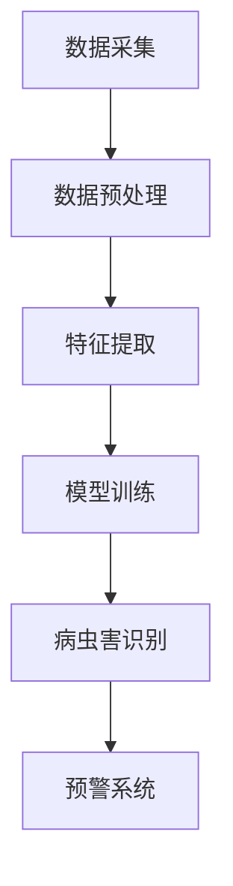

#### Python源代码示例

以下是一个简单的病虫害监测算法示例，使用Python实现：

```python
import numpy as np
from sklearn.ensemble import RandomForestClassifier

# 数据预处理
def preprocess_data(data):
    # 数据清洗、归一化等预处理操作
    return processed_data

# 特征提取
def extract_features(data):
    # 提取病虫害特征
    return features

# 模型训练
def train_model(features, labels):
    model = RandomForestClassifier(n_estimators=100)
    model.fit(features, labels)
    return model

# 病虫害识别
def identify_pest_disease(model, new_data):
    features = extract_features(new_data)
    prediction = model.predict(features)
    return prediction
```

在这个示例中，`preprocess_data()` 函数用于数据预处理，`extract_features()` 函数用于特征提取，`train_model()` 函数用于模型训练，`identify_pest_disease()` 函数用于病虫害识别。

#### 数学模型和公式

以下是常用的病虫害监测数学模型和公式：

$$
H = f(P, T, H_{\text{light}}, \text{CO}_2)
$$

其中，$H$ 表示病虫害发生的概率，$P$、$T$、$H_{\text{light}}$、$\text{CO}_2$ 分别表示土壤湿度、温度、光照强度和二氧化碳浓度。

#### 算法原理的详细讲解与举例说明

1. **数据预处理**：在训练模型之前，需要对数据进行预处理，包括缺失值处理、异常值检测和归一化等操作。以下是一个简单的数据预处理示例：

```python
def preprocess_data(data):
    # 假设data是一个包含多个特征的NumPy数组
    data = data.astype(np.float32)
    mean = np.mean(data, axis=0)
    std = np.std(data, axis=0)
    data = (data - mean) / std
    return data
```

在这个示例中，数据被转换为浮点数，然后计算均值和标准差，最后对数据进行归一化处理。

2. **特征提取**：特征提取是将原始数据转换为有助于模型训练的特征向量。以下是一个简单的特征提取示例：

```python
def extract_features(data):
    # 假设data是一个包含多个特征的NumPy数组
    features = data[:, :4]  # 提取前四个特征
    return features
```

在这个示例中，从数据中提取前四个特征作为病虫害监测的特征。

3. **模型训练**：使用历史数据训练病虫害识别模型。以下是一个简单的随机森林分类器训练示例：

```python
def train_model(features, labels):
    model = RandomForestClassifier(n_estimators=100)
    model.fit(features, labels)
    return model
```

在这个示例中，使用随机森林分类器进行模型训练。

4. **病虫害识别**：将新采集的数据输入到训练好的模型中，预测病虫害的类型和发生概率。以下是一个简单的病虫害识别示例：

```python
def identify_pest_disease(model, new_data):
    features = extract_features(new_data)
    prediction = model.predict(features)
    return prediction
```

在这个示例中，使用训练好的模型对新数据进行预测。

5. **预警系统**：根据识别结果，自动生成预警信息，并通知农业管理人员。以下是一个简单的预警系统示例：

```python
def send_alert(message):
    print(f"报警：{message}")

# 假设new_data是新的监测数据
new_data = np.array([0.5, 1.2, 0.3, 0.8])
prediction = identify_pest_disease(model, new_data)
if prediction == 'disease':
    send_alert("病虫害发生，请及时采取措施！")
```

在这个示例中，如果模型预测到病虫害发生，会自动发出预警信息。

通过上述算法原理的讲解和示例说明，可以看出物联网技术在病虫害监测中如何发挥关键作用，为农业生产提供了智能化、精准化的解决方案。算法的精确度和实时性直接影响到病虫害监测的效果，因此需要不断优化算法和提升传感器性能，以提高病虫害监测的准确性和效率。<!--markdown-->### 系统设计与实现

在物联网病虫害监测系统的设计与实现过程中，系统功能设计、系统架构设计、系统接口设计和系统交互设计是关键环节。以下将详细介绍这些设计要素，并提供相应的示例和解析。

#### 系统功能设计

系统功能设计是确定物联网病虫害监测系统所需功能的关键步骤。在智慧农业中，病虫害监测系统的功能通常包括以下几个方面：

1. **环境参数监测**：实时监测农田的土壤湿度、气象条件、光照强度等环境参数。
2. **病虫害预警**：根据环境参数和病虫害数据，自动生成预警信息，及时通知农业管理人员。
3. **数据存储与分析**：将监测数据存储在数据库中，并进行数据处理和分析，以支持决策支持。
4. **决策支持**：提供针对病虫害防治的决策建议，如施肥、灌溉、喷洒农药等。

以下是系统功能设计的Mermaid类图示例：

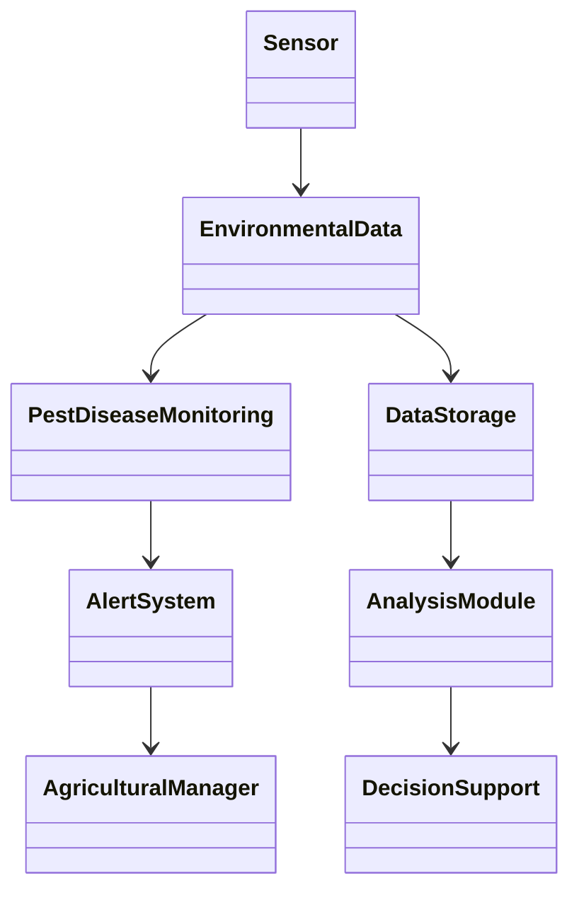

在这个类图中，传感器负责采集环境数据，环境数据被存储和分析，同时生成预警信息，并最终提供给农业管理人员。

#### 系统架构设计

系统架构设计定义了系统的整体结构和各组件之间的关系。一个典型的物联网病虫害监测系统架构包括以下几个层次：

1. **感知层**：由传感器和采集器组成，负责实时采集农田环境数据。
2. **传输层**：由无线通信模块组成，负责将数据传输到数据处理中心。
3. **数据处理层**：由服务器和数据库组成，负责数据存储、分析和处理。
4. **应用层**：由用户界面和应用逻辑组成，提供数据可视化和决策支持。

以下是系统架构设计的Mermaid架构图示例：

```mermaid
graph TB
    A(感知层) --> B(传输层)
    B --> C(数据处理层)
    C --> D(应用层)
    A--|> E(传感器)
    B--|> F(无线通信模块)
    C--|> G(服务器)
    C--|> H(数据库)
    D--|> I(用户界面)
    D--|> J(应用逻辑)
```

在这个架构图中，传感器采集数据并通过无线通信模块传输到服务器和数据库，数据处理层对数据进行存储和分析，最终应用层通过用户界面提供可视化和决策支持。

#### 系统接口设计

系统接口设计确保了不同模块之间能够有效通信。以下是系统接口设计的示例：

1. **数据采集接口**：定义了传感器与数据采集模块之间的接口。
2. **数据传输接口**：定义了数据采集模块与数据处理中心之间的接口。
3. **数据分析接口**：定义了数据处理中心与用户界面之间的接口。

以下是系统接口设计的Mermaid接口图示例：

```mermaid
interface
    SensorInterface {
        function collect_data()
    }
    DataTransferInterface {
        function send_data()
    }
    AnalysisInterface {
        function process_data()
    }
    UserInterface {
        function display_data()
    }
```

在这个接口设计中，传感器接口用于数据采集，数据传输接口用于数据传输，数据分析接口用于数据处理，用户界面接口用于数据展示。

#### 系统交互设计

系统交互设计描述了系统各模块之间的交互流程和协作机制。以下是系统交互设计的Mermaid序列图示例：

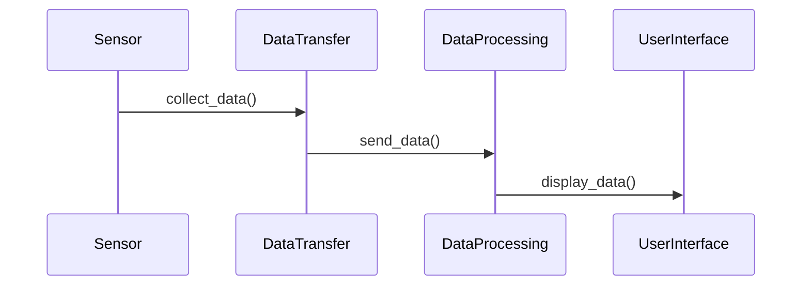

在这个序列图中，传感器采集数据，数据传输模块将数据发送到数据处理模块，数据处理模块对数据进行分析，并将结果通过用户界面展示给用户。

通过上述系统功能设计、系统架构设计、系统接口设计和系统交互设计的详细描述和示例，我们可以构建一个高效、稳定的物联网病虫害监测系统，为农业生产提供智能化、精准化的解决方案。在实际应用中，系统可以根据具体需求进行定制和优化，以适应不同农作物和环境的监测需求。<!--markdown-->### 系统功能设计

#### 系统功能设计

在物联网病虫害监测系统中，系统功能设计是构建高效、稳定、用户友好的核心步骤。以下是系统功能设计的详细步骤、领域模型、系统功能划分以及具体功能实现。

**1. 系统功能设计步骤**

系统功能设计的步骤包括：
- **需求分析**：确定系统需要实现的核心功能，如数据采集、数据传输、数据处理、病虫害预警等。
- **功能划分**：将系统功能细分为多个模块，明确各模块的职责。
- **设计文档编写**：编写详细的设计文档，描述各模块的功能、接口、数据流等。

**2. 领域模型**

领域模型是系统功能设计的基础，它定义了系统中的关键实体和它们之间的关系。以下是领域模型的示例：

```mermaid
classDiagram
    Plant --> SoilSensor
    Plant --> WeatherSensor
    Plant --> HumiditySensor
    Plant --> LightSensor
    Plant --> PestDiseaseMonitoringSystem
    Plant --> DataProcessingModule
    Plant --> AlertModule
    SoilSensor ..|> Sensor
    WeatherSensor ..|> Sensor
    HumiditySensor ..|> Sensor
    LightSensor ..|> Sensor
    Sensor : id, type, status
    Plant : id, name, type, status
    PestDiseaseMonitoringSystem : id, status, alarm
    DataProcessingModule : id, status, processed_data
    AlertModule : id, status, alert_message
```

在这个类图中，`Plant` 表示农作物，是系统的核心实体。`SoilSensor`、`WeatherSensor`、`HumiditySensor`、`LightSensor` 分别代表土壤传感器、气象传感器、湿度传感器和光照传感器，它们继承自 `Sensor` 类。`PestDiseaseMonitoringSystem`、`DataProcessingModule` 和 `AlertModule` 分别代表病虫害监测系统、数据处理模块和警报模块。

**3. 系统功能划分**

系统功能可以划分为以下模块：

1. **数据采集模块**：负责从传感器采集实时数据。
2. **数据处理模块**：对采集到的数据进行分析和处理。
3. **预警模块**：根据数据分析结果，生成预警信息。
4. **用户界面模块**：提供用户交互界面，展示监测数据和预警信息。

**4. 具体功能实现**

以下是各个模块的具体实现：

**数据采集模块**

```python
# sensors.py
class SoilSensor:
    def get_soil_data(self):
        # 实现土壤数据采集
        return soil_data

class WeatherSensor:
    def get_weather_data(self):
        # 实现气象数据采集
        return weather_data

class HumiditySensor:
    def get_humidity_data(self):
        # 实现湿度数据采集
        return humidity_data

class LightSensor:
    def get_light_data(self):
        # 实现光照数据采集
        return light_data
```

**数据处理模块**

```python
# data_processor.py
def preprocess_data(data):
    # 数据预处理，如清洗、归一化
    return processed_data

def analyze_data(processed_data):
    # 数据分析，如特征提取、模型预测
    return analysis_result
```

**预警模块**

```python
# alert_module.py
class AlertModule:
    def generate_alert(analysis_result):
        # 根据分析结果生成预警信息
        return alert_message
```

**用户界面模块**

```python
# user_interface.py
def display_data(data):
    # 展示数据，如图表、表格等
    pass

def display_alert(alert_message):
    # 展示预警信息
    pass
```

通过上述步骤和示例，我们可以设计出一个功能完善的物联网病虫害监测系统，满足农业生产的需求。系统功能设计的核心在于明确各模块的职责，确保系统的高效运行和易用性。<!--markdown-->### 系统架构设计

系统架构设计是物联网病虫害监测系统建设中的关键步骤，它决定了系统的稳定性、扩展性和性能。以下是系统架构设计的详细步骤、系统架构图和系统接口设计。

**1. 系统架构设计步骤**

系统架构设计的步骤包括：

- **需求分析**：确定系统的功能需求、性能指标和安全性要求。
- **架构设计**：设计系统的整体架构，包括硬件和软件组件的布局和连接方式。
- **接口设计**：定义系统内部和外部的接口，确保各组件之间的有效通信。
- **架构验证**：通过模拟和测试验证系统架构的可行性和性能。

**2. 系统架构图**

以下是物联网病虫害监测系统的架构图：

```mermaid
graph TB
    A(传感器) --> B(数据采集器)
    B --> C(物联网网关)
    C --> D(数据处理中心)
    D --> E(数据库)
    D --> F(分析引擎)
    D --> G(用户界面)
    A--|> H(土壤传感器)
    A--|> I(气象传感器)
    A--|> J(湿度传感器)
    A--|> K(光照传感器)
```

在这个架构图中，传感器（H、I、J、K）采集环境数据，通过数据采集器（B）传输到物联网网关（C），网关将数据发送到数据处理中心（D）。数据处理中心（D）包括数据库（E）、分析引擎（F）和用户界面（G），分别负责数据存储、数据处理和用户交互。

**3. 系统接口设计**

系统接口设计是确保系统各模块能够有效通信的重要环节。以下是系统接口设计的示例：

- **传感器接口**：定义了传感器与数据采集器之间的通信接口。
- **数据采集器接口**：定义了数据采集器与物联网网关之间的通信接口。
- **物联网网关接口**：定义了物联网网关与数据处理中心之间的通信接口。
- **数据处理接口**：定义了数据处理中心与数据库、分析引擎和用户界面之间的通信接口。

以下是接口设计的Mermaid接口图示例：

```mermaid
interface
    SensorInterface {
        function collect_data()
    }
    DataCollectorInterface {
        function send_data()
    }
    GatewayInterface {
        function receive_data()
    }
    DataProcessorInterface {
        function process_data()
    }
    DatabaseInterface {
        function store_data()
    }
    AnalysisEngineInterface {
        function analyze_data()
    }
    UserInterface {
        function display_data()
    }
```

在这个接口设计中，传感器通过 `SensorInterface` 收集数据，数据采集器通过 `DataCollectorInterface` 发送数据到物联网网关，网关通过 `GatewayInterface` 接收数据并转发到数据处理中心。数据处理中心通过 `DataProcessorInterface` 处理数据，通过 `DatabaseInterface` 存储数据，通过 `AnalysisEngineInterface` 进行数据分析，并通过 `UserInterface` 向用户提供数据。

通过上述系统架构设计和接口设计，物联网病虫害监测系统可以实现实时数据采集、处理和分析，为农业生产提供智能化、精准化的解决方案。系统架构设计的关键在于模块化、标准化和可扩展性，以确保系统能够灵活适应不同环境和需求的变化。<!--markdown-->### 系统交互设计

系统交互设计是物联网病虫害监测系统中各模块之间通信与协作的具体体现。良好的系统交互设计不仅能够确保系统的稳定性和效率，还能够提高用户体验。以下将详细阐述系统交互设计的步骤、Mermaid序列图和系统交互过程。

**1. 系统交互设计步骤**

系统交互设计的步骤包括：

- **需求分析**：确定系统各模块之间的交互需求和交互流程。
- **交互模型设计**：使用图形化工具（如Mermaid序列图）设计系统交互模型。
- **接口定义**：明确各模块之间的接口和数据格式，确保数据传输的准确性和安全性。
- **交互验证**：通过模拟和测试验证系统交互设计的可行性和性能。

**2. Mermaid序列图**

以下是物联网病虫害监测系统的交互设计Mermaid序列图：

```mermaid
sequenceDiagram
    participant Sensor
    participant DataCollector
    participant Gateway
    participant DataProcessing
    participant Database
    participant AnalysisEngine
    participant UserInterface

    Sensor->>DataCollector: collect_data()
    DataCollector->>Gateway: send_data()
    Gateway->>DataProcessing: receive_data()
    DataProcessing->>Database: store_data()
    DataProcessing->>AnalysisEngine: analyze_data()
    AnalysisEngine->>UserInterface: display_results()
    UserInterface->>User: show_alert()
```

在这个序列图中，传感器（Sensor）负责采集数据，数据采集器（DataCollector）将数据发送到物联网网关（Gateway），网关将数据传输到数据处理中心（DataProcessing），数据处理中心将数据存储到数据库（Database）并进行分析（AnalysisEngine），最后将结果通过用户界面（UserInterface）展示给用户（User）。

**3. 系统交互过程**

以下是系统交互过程的详细描述：

- **数据采集**：传感器（如土壤传感器、气象传感器等）实时采集环境数据，并将数据发送到数据采集器。
- **数据传输**：数据采集器将采集到的数据通过物联网网关发送到数据处理中心。
- **数据处理**：数据处理中心接收到数据后，进行数据预处理（如清洗、归一化等），然后存储到数据库。
- **数据分析**：数据处理中心将预处理后的数据进行分析，如特征提取、模型训练、病虫害识别等。
- **预警生成**：根据分析结果，数据处理中心生成病虫害预警信息，并将其传递给用户界面。
- **用户交互**：用户界面将预警信息展示给用户，用户可以根据预警信息采取相应的措施。

通过上述交互设计，物联网病虫害监测系统能够实现高效、稳定的数据采集、处理和预警，为农业生产提供智能化的解决方案。系统交互设计的关键在于各模块之间的数据流和通信机制，需要确保数据传输的实时性和准确性，同时简化用户操作，提升用户体验。<!--markdown-->### 病虫害监测与预警模块的设计

病虫害监测与预警模块是物联网病虫害监测系统的核心组成部分，负责实时监测农田中的病虫害情况，并根据分析结果自动生成预警信息，以帮助农业生产者及时采取防治措施。以下将详细讨论病虫害监测与预警模块的设计过程，包括其工作原理、主要功能和技术实现。

#### 工作原理

病虫害监测与预警模块的工作原理主要分为以下几个步骤：

1. **数据采集**：通过部署在农田中的各类传感器（如土壤湿度传感器、温度传感器、光照传感器等），实时采集农田的环境参数和病虫害相关数据。

2. **数据处理**：将采集到的数据传输到数据处理中心，进行预处理、特征提取和模型分析。预处理步骤包括数据清洗、缺失值填充、归一化处理等，以提高数据质量和模型性能。

3. **模型分析**：利用历史数据和机器学习算法（如随机森林、支持向量机等）训练病虫害识别模型，根据实时数据进行分析和预测，判断病虫害的发生概率和类型。

4. **预警生成**：根据模型分析结果，生成预警信息，包括病虫害的类型、发生概率和建议的防治措施。预警信息可以通过短信、邮件、APP推送等方式通知农业管理人员。

5. **用户反馈**：农业管理人员接收到预警信息后，可以根据实际情况采取相应的防治措施，并在系统上反馈处理结果，以便进一步优化模型和预警策略。

#### 主要功能

病虫害监测与预警模块的主要功能包括：

1. **实时监测**：通过传感器实时采集农田的环境参数和病虫害数据，确保数据的及时性和准确性。

2. **数据处理与分析**：对采集到的数据进行预处理和特征提取，利用机器学习算法分析数据，识别病虫害的类型和发生概率。

3. **预警信息生成**：根据模型分析结果，自动生成预警信息，包括病虫害的类型、发生概率和建议的防治措施。

4. **预警通知**：通过短信、邮件、APP推送等方式，将预警信息及时通知农业管理人员，确保能够迅速采取防治措施。

5. **用户反馈**：农业管理人员可以在系统中反馈病虫害的处理结果，系统根据反馈数据进一步优化模型和预警策略。

#### 技术实现

病虫害监测与预警模块的技术实现包括以下几个方面：

1. **传感器部署**：选择合适的传感器，根据农田的实际情况进行部署，确保能够全面覆盖农田。

2. **数据采集与传输**：通过物联网技术，将传感器采集的数据实时传输到数据处理中心。可以使用Wi-Fi、蓝牙、Zigbee、LoRa等无线通信技术。

3. **数据处理与分析**：在数据处理中心，对采集到的数据进行分析和预处理，提取与病虫害相关的特征。使用机器学习算法训练模型，进行病虫害识别和预测。

4. **预警信息生成**：根据模型分析结果，生成预警信息，并设计预警通知系统，确保预警信息能够及时送达农业管理人员。

5. **用户界面设计**：设计简洁、易用的用户界面，农业管理人员可以通过界面查看实时监测数据、预警信息和反馈处理结果。

通过上述设计，病虫害监测与预警模块能够实现对农田病虫害的实时监测和精准预警，为农业生产提供有力支持。在实际应用中，系统可以根据具体需求和数据情况，进一步优化和定制病虫害监测与预警模块，以提高监测的准确性和效率。<!--markdown-->### 项目实战

为了更直观地展示物联网在智慧农业病虫害监测中的实际应用效果，以下将详细描述一个具体项目的实施过程，从环境安装、系统核心实现到实际案例分析和项目小结，为读者提供全面的实战经验。

#### 项目背景

某农业科技企业位于我国东北地区的种植园区，主要种植水稻。由于水稻生长周期较长，且病虫害问题较为严重，企业希望通过物联网技术提升病虫害监测和防治水平，减少经济损失。

#### 环境安装

1. **现场勘察**：首先对种植园区进行了详细的勘察，确定了传感器的安装位置。种植园区分为多个区域，每个区域需要布置不同的传感器，以确保数据的全面性和准确性。

2. **设备选型**：根据种植园区环境和企业需求，选择了以下物联网设备：
   - **土壤湿度传感器**：用于监测土壤水分，确保水稻生长所需的水分供应。
   - **气象传感器**：用于监测温度、湿度、风速和降雨量，评估水稻生长的环境条件。
   - **光照传感器**：用于监测光照强度，评估水稻的光合作用情况。
   - **虫害传感器**：用于监测害虫的活动，及时发现虫害发生。

3. **设备部署**：在种植园区中按照事先规划的位置，安装了传感器设备。传感器通过太阳能板供电，以确保设备在种植园区环境中长时间稳定运行。

4. **数据传输**：传感器通过LoRa无线通信模块与物联网网关连接，网关再将数据上传到企业自建的物联网平台，实现数据的实时传输和存储。

5. **系统初始化**：在物联网平台上，配置了数据采集、预处理、分析和预警功能。系统初始化完成后，传感器开始正常工作。

#### 系统核心实现

1. **数据采集模块**：

数据采集模块负责从传感器获取实时数据，并将数据传输到数据处理中心。以下是数据采集模块的实现流程：

- 数据采集：传感器每隔一小时采集一次土壤湿度、气象参数、光照强度和虫害活动数据。
- 数据传输：传感器通过LoRa模块将数据传输到物联网网关，网关再将数据上传到数据处理中心。

2. **数据处理与分析模块

