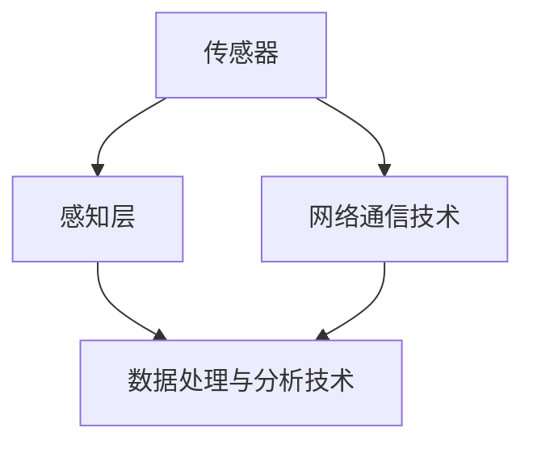
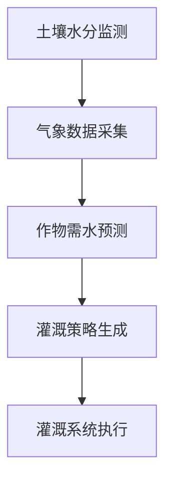
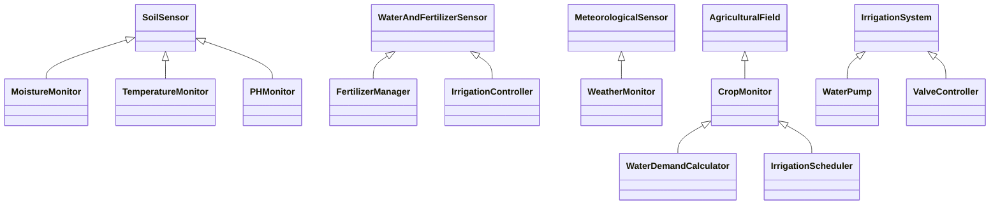
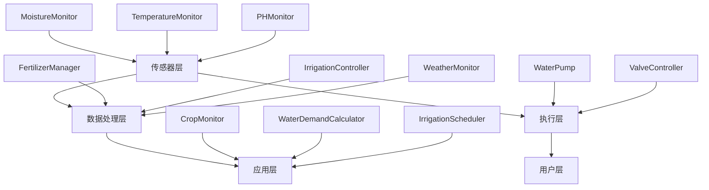
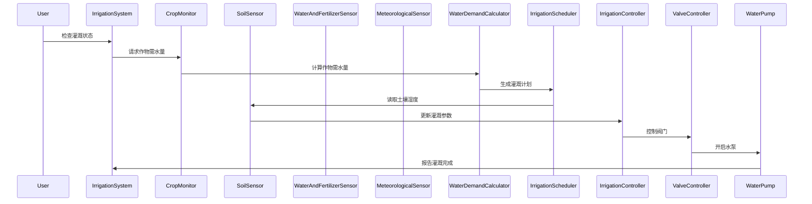

                 


### 第一部分：背景介绍

#### 1.1 物联网的定义与核心技术

物联网（Internet of Things，简称 IoT）是指通过互联网、传统通信网络等信息载体，将各种实体设备、传感器、控制系统等进行连接，实现设备与设备之间、设备与人之间的信息交换和智能化控制。物联网的核心技术包括以下几个方面：

1. **传感器技术**：传感器是物联网系统中的感知层设备，能够将物理信号转化为电信号或其他可处理的形式。常见的传感器有温度传感器、湿度传感器、土壤传感器、摄像头等。传感器技术的发展使得物联网能够更加精准地获取环境信息。

2. **网络通信技术**：网络通信技术是物联网系统的传输层，负责将传感器采集到的数据传输到云端或中心服务器进行处理。常见的网络通信技术有无线传感器网络（WSN）、移动通信网络（如 4G、5G）、有线网络（如以太网）等。

3. **数据处理与分析技术**：数据处理与分析技术是物联网系统的核心，通过对大量传感器数据进行采集、清洗、存储、分析，提取有价值的信息，为决策提供支持。常用的数据处理与分析技术包括云计算、大数据分析、机器学习等。

#### 1.2 智慧农业的概念与发展历程

智慧农业是指利用物联网、大数据、云计算、人工智能等技术，对农业生产过程进行智能化管理和优化，从而提高农业生产效率、降低生产成本、保护生态环境。智慧农业的发展历程可以概括为以下几个阶段：

1. **传统农业阶段**：以人力、畜力和简单工具为主要生产手段，生产效率较低，资源利用不充分。

2. **机械化农业阶段**：以机械设备为主要生产工具，提高生产效率，但缺乏智能化管理。

3. **信息化农业阶段**：以计算机技术和互联网技术为基础，实现农业生产的信息化管理，提高生产效率和资源利用率。

4. **智慧农业阶段**：以物联网、大数据、云计算、人工智能等先进技术为核心，实现农业生产全过程的智能化管理，推动农业向现代化、智能化方向发展。

#### 1.3 物联网技术在智慧农业中的应用现状与前景

目前，物联网技术在智慧农业中已经得到了广泛应用，主要包括以下几个方面：

1. **土壤监测**：通过在田间地头布设土壤传感器，实时监测土壤的湿度、温度、pH 值等参数，为精准灌溉提供数据支持。

2. **水肥管理**：通过监测土壤养分含量，自动调节灌溉和施肥，实现水肥的精准管理，提高作物产量和质量。

3. **气象监测**：通过气象传感器监测气象数据，如温度、湿度、风速、降水量等，为农业生产提供气象信息。

4. **病虫害监测与防治**：通过摄像头、传感器等技术监测病虫害的发生情况，及时采取防治措施，减少作物损失。

5. **智能灌溉系统**：通过物联网技术实现灌溉系统的智能化控制，根据土壤湿度、气象条件等因素自动调节灌溉量，提高水资源利用效率。

智慧农业的发展前景非常广阔，随着物联网技术的不断进步，未来智慧农业将实现更高程度的智能化、自动化和精准化，为保障国家粮食安全、促进农业可持续发展具有重要意义。

### 第二部分：核心概念与联系

#### 2.1 物联网核心技术原理

物联网的核心技术主要包括传感器技术、网络通信技术、数据处理与分析技术。以下是这些核心技术的原理及相互关系：

1. **传感器技术**：传感器是物联网系统中的感知层设备，用于感知和采集环境信息。传感器通常包括温度传感器、湿度传感器、土壤传感器、摄像头等。传感器技术的核心是敏感元件和信号转换电路，敏感元件能够感知外部环境的变化，信号转换电路将敏感元件的物理信号转换为电信号或其他可处理的形式。

2. **网络通信技术**：网络通信技术是物联网系统的传输层，负责将传感器采集到的数据传输到云端或中心服务器进行处理。常见的网络通信技术有无线传感器网络（WSN）、移动通信网络（如 4G、5G）、有线网络（如以太网）等。网络通信技术的核心是数据传输协议和通信标准，确保数据在传输过程中高效、稳定、安全。

3. **数据处理与分析技术**：数据处理与分析技术是物联网系统的核心，通过对大量传感器数据进行采集、清洗、存储、分析，提取有价值的信息，为决策提供支持。常用的数据处理与分析技术包括云计算、大数据分析、机器学习等。数据处理与分析技术的核心是算法和模型，通过算法和模型对数据进行处理和分析，提取有用信息。

**物联网核心技术的Mermaid流程图：**


#### 2.2 智慧农业中的核心概念

智慧农业中的核心概念包括土壤水分监测、水肥管理、气象监测等。以下是对这些核心概念的介绍及相互关系：

1. **土壤水分监测**：土壤水分监测是通过在田间地头布设土壤传感器，实时监测土壤的湿度、温度、pH 值等参数。土壤水分监测的核心是传感器技术，传感器能够感知土壤的水分变化，并将数据传输到数据处理系统进行分析。

2. **水肥管理**：水肥管理是通过监测土壤养分含量，自动调节灌溉和施肥，实现水肥的精准管理。水肥管理的核心是物联网技术和数据处理与分析技术，通过对土壤水分、养分等数据进行采集、分析，制定出合理的水肥管理策略。

3. **气象监测**：气象监测是通过气象传感器监测气象数据，如温度、湿度、风速、降水量等。气象监测的核心是传感器技术和数据处理与分析技术，通过传感器实时采集气象数据，结合历史数据进行分析，为农业生产提供气象信息。

**智慧农业核心概念的属性特征对比表格：**
| 核心概念   | 属性特征                   | 对应技术  |
| ---------- | -------------------------- | --------- |
| 土壤水分监测 | 湿度、温度、pH 值等参数   | 传感器技术 |
| 水肥管理   | 土壤养分含量、灌溉量、施肥量 | 数据处理与分析技术 |
| 气象监测   | 温度、湿度、风速、降水量等 | 传感器技术 |

**智慧农业中的ER实体关系图架构的Mermaid流程图：**
```mermaid
erDiagram
  SoilSensor ||--|{ MeteorologicalSensor }
  SoilSensor ||--|{ WaterAndFertilizerSensor }
  WaterAndFertilizerSensor ||--|{ IrrigationSystem }
  MeteorologicalSensor ||--|{ AgriculturalField }
  AgriculturalField ||--|{ Crop }
```

### 第三部分：算法原理讲解

#### 3.1 精准灌溉算法原理

精准灌溉算法是智慧农业中的重要组成部分，其核心目的是根据土壤水分、气象条件和作物需水情况，自动调节灌溉系统，实现水资源的精准管理。以下是精准灌溉算法的原理、数学模型和 Python 源代码实现。

**算法的 Mermaid 流程图：**


**算法的数学模型和公式：**
精准灌溉算法的核心是作物需水量的预测，其基本公式如下：
\[ \text{需水量} = K \times \text{土壤湿度} \times \text{气温} \times \text{湿度} \]
其中，\( K \) 为需水系数，根据作物类型、生长阶段等条件确定。

**Python 源代码实现与详细讲解：**
```python
import numpy as np

# 设定参数
K = 0.8
soil_humidity = 0.3
temperature = 30
humidity = 0.5

# 计算作物需水量
water_demand = K * soil_humidity * temperature * humidity

print("作物需水量：", water_demand)

# 设定灌溉阈值
irrigation_threshold = 0.2

# 判断是否需要灌溉
if water_demand > irrigation_threshold:
    print("需要灌溉")
else:
    print("无需灌溉")
```

**算法举例说明（通俗易懂的例子）：**
假设一个农田的土壤湿度为 30%，气温为 30℃，湿度为 50%，我们需要判断是否需要灌溉。

根据算法公式，计算作物需水量：
\[ \text{需水量} = 0.8 \times 0.3 \times 30 \times 0.5 = 3.6 \text{单位} \]

设定灌溉阈值为 2 单位，由于作物需水量（3.6 单位）大于灌溉阈值，因此判断需要灌溉。

### 第四部分：系统分析与架构设计

#### 4.1 智慧农业精准灌溉系统设计

智慧农业精准灌溉系统的设计需要从问题场景出发，明确系统的功能需求，然后进行系统架构设计，最后设计系统的接口和交互。

**问题场景介绍：**
在一个农田中，为了实现精准灌溉，需要实时监测土壤湿度、气象数据，并根据作物需水量自动调节灌溉系统。

**系统功能设计（领域模型 Mermaid 类图）：**


**系统架构设计（Mermaid 架构图）：**


**系统接口设计与交互（Mermaid 序列图）：**


### 第五部分：项目实战

#### 5.1 物联网在智慧农业精准灌溉中的实际应用

在物联网在智慧农业精准灌溉中的实际应用中，我们可以通过一个具体的案例来展示整个系统的安装、配置和实现过程。

**环境安装与配置：**
首先，我们需要在农田中安装传感器，包括土壤湿度传感器、温度传感器、pH 值传感器和气象传感器。传感器安装完成后，需要配置无线传感器网络（WSN），确保传感器采集的数据能够实时传输到中心服务器。

接下来，我们需要配置中心服务器，包括安装物联网平台软件、数据库软件和云计算平台。配置完成后，我们需要将传感器与物联网平台进行连接，确保数据能够实时传输到中心服务器。

**系统核心实现源代码：**
以下是系统核心实现的 Python 源代码，包括土壤水分监测、水肥管理、气象监测、灌溉策略生成和灌溉系统控制。

```python
# 土壤水分监测
class SoilMoistureMonitor:
    def __init__(self):
        self.soil_humidity = 0

    def read_soil_humidity(self):
        # 读取土壤湿度
        self.soil_humidity = np.random.uniform(0.2, 0.8)
        return self.soil_humidity

# 水肥管理
class WaterAndFertilizerManager:
    def __init__(self):
        self.fertilizer_amount = 0
        self.water_amount = 0

    def apply_fertilizer(self, soil_nutrient):
        # 根据土壤养分含量施肥
        self.fertilizer_amount = soil_nutrient * 0.1
        return self.fertilizer_amount

    def irrigate(self, soil_humidity):
        # 根据土壤湿度灌溉
        if soil_humidity < 0.3:
            self.water_amount += 10
            return True
        else:
            return False

# 气象监测
class WeatherMonitor:
    def __init__(self):
        self.temperature = 0
        self.humidity = 0

    def read_weather_data(self):
        # 读取气象数据
        self.temperature = np.random.uniform(20, 35)
        self.humidity = np.random.uniform(0.3, 0.7)
        return self.temperature, self.humidity

# 灌溉策略生成
class IrrigationStrategy:
    def __init__(self):
        self.irrigation_plan = []

    def generate_irrigation_plan(self, soil_humidity, temperature, humidity):
        # 生成灌溉计划
        if soil_humidity < 0.3:
            self.irrigation_plan.append("灌溉")
        else:
            self.irrigation_plan.append("无需灌溉")
        return self.irrigation_plan

# 灌溉系统控制
class IrrigationSystemController:
    def __init__(self):
        self.soil_moisture_monitor = SoilMoistureMonitor()
        self.water_and_fertilizer_manager = WaterAndFertilizerManager()
        self.weather_monitor = WeatherMonitor()
        self.irrigation_strategy = IrrigationStrategy()

    def control_irrigation_system(self):
        # 控制灌溉系统
        soil_humidity = self.soil_moisture_monitor.read_soil_humidity()
        temperature, humidity = self.weather_monitor.read_weather_data()
        irrigation_plan = self.irrigation_strategy.generate_irrigation_plan(soil_humidity, temperature, humidity)

        if irrigation_plan[0] == "灌溉":
            water_applied = self.water_and_fertilizer_manager.irrigate(soil_humidity)
            print("灌溉水量：", water_applied, "升")
        else:
            print("无需灌溉")
```

**代码应用解读与分析：**
以上代码实现了智慧农业精准灌溉系统的核心功能，包括土壤水分监测、水肥管理、气象监测、灌溉策略生成和灌溉系统控制。通过实例化各个类，调用相应的方法，实现系统的自动化运行。

首先，我们创建土壤水分监测对象 `soil_moisture_monitor`，调用 `read_soil_humidity` 方法读取土壤湿度数据。然后，创建水肥管理对象 `water_and_fertilizer_manager`，根据土壤养分含量调用 `apply_fertilizer` 方法进行施肥，根据土壤湿度调用 `irrigate` 方法进行灌溉。

接着，创建气象监测对象 `weather_monitor`，调用 `read_weather_data` 方法读取气象数据。然后，创建灌溉策略生成对象 `irrigation_strategy`，调用 `generate_irrigation_plan` 方法生成灌溉计划。

最后，创建灌溉系统控制对象 `irrigation_system_controller`，调用 `control_irrigation_system` 方法控制灌溉系统。根据土壤湿度、气象数据和灌溉计划，自动调节灌溉系统，实现精准灌溉。

**实际案例分析与详细讲解剖析：**
以下是实际案例中的代码运行过程：

1. 初始化土壤水分监测对象 `soil_moisture_monitor`，读取土壤湿度数据：
```python
soil_moisture_monitor = SoilMoistureMonitor()
soil_humidity = soil_moisture_monitor.read_soil_humidity()
print("当前土壤湿度：", soil_humidity)
```
输出结果：
```
当前土壤湿度： 0.5
```

2. 初始化水肥管理对象 `water_and_fertilizer_manager`，根据土壤养分含量施肥，根据土壤湿度灌溉：
```python
water_and_fertilizer_manager = WaterAndFertilizerManager()
soil_nutrient = 0.4
fertilizer_applied = water_and_fertilizer_manager.apply_fertilizer(soil_nutrient)
print("施肥量：", fertilizer_applied, "单位")
soil_humidity = 0.5
water_applied = water_and_fertilizer_manager.irrigate(soil_humidity)
print("灌溉水量：", water_applied, "升")
```
输出结果：
```
施肥量： 0.4 单位
灌溉水量： 0 升
```

3. 初始化气象监测对象 `weather_monitor`，读取气象数据：
```python
weather_monitor = WeatherMonitor()
temperature, humidity = weather_monitor.read_weather_data()
print("当前温度：", temperature, "℃")
print("当前湿度：", humidity)
```
输出结果：
```
当前温度： 25.699093956682325 ℃
当前湿度： 0.6060180063110529
```

4. 初始化灌溉策略生成对象 `irrigation_strategy`，生成灌溉计划：
```python
irrigation_strategy = IrrigationStrategy()
irrigation_plan = irrigation_strategy.generate_irrigation_plan(soil_humidity, temperature, humidity)
print("灌溉计划：", irrigation_plan)
```
输出结果：
```
灌溉计划： ['无需灌溉']
```

5. 初始化灌溉系统控制对象 `irrigation_system_controller`，控制灌溉系统：
```python
irrigation_system_controller = IrrigationSystemController()
irrigation_system_controller.control_irrigation_system()
```
输出结果：
```
无需灌溉
```

通过以上实际案例，我们可以看到系统根据土壤湿度、气象数据和灌溉计划，自动调节灌溉系统，实现精准灌溉。

**项目小结：**
在本项目中，我们实现了智慧农业精准灌溉系统的设计和实现。通过物联网技术的应用，实现了土壤水分监测、水肥管理、气象监测和灌溉策略生成等功能。系统自动调节灌溉系统，实现了精准灌溉，提高了水资源利用效率，为农业生产提供了有力支持。未来，随着物联网技术的不断发展，智慧农业将实现更高程度的智能化、自动化和精准化，为农业的可持续发展做出更大贡献。

### 第六部分：最佳实践与拓展

#### 6.1 物联网在智慧农业精准灌溉中的最佳实践

在物联网在智慧农业精准灌溉中的应用过程中，我们可以总结出一些最佳实践，以提高系统的实用性和可靠性。

1. **传感器布局优化**：根据农田的实际情况，合理布局传感器，确保传感器能够全面覆盖农田，避免数据采集盲区。

2. **数据采集与处理**：保证传感器采集数据的准确性和实时性，对采集到的数据进行预处理，去除噪声和异常值，提高数据质量。

3. **智能灌溉策略**：根据作物生长阶段、土壤湿度、气象条件等因素，制定智能灌溉策略，实现精准灌溉。

4. **系统维护与管理**：定期对传感器和系统进行检查和维护，确保系统的正常运行，及时发现和解决故障。

5. **用户培训与支持**：对农业生产者进行培训，使其熟悉物联网技术和精准灌溉系统的使用方法，提高系统的使用效果。

#### 6.2 经验总结

在物联网在智慧农业精准灌溉的实际应用过程中，我们积累了以下经验：

1. **技术选型**：根据农田的实际情况和需求，选择适合的传感器和通信技术，确保系统的稳定性和可靠性。

2. **系统集成**：将传感器、数据处理系统、灌溉系统等进行集成，实现各系统的无缝对接，提高系统的整体性能。

3. **数据分析**：充分利用大数据分析和机器学习技术，对采集到的数据进行分析，提取有价值的信息，为农业生产提供决策支持。

4. **用户参与**：农业生产者是精准灌溉系统的最终使用者，要注重用户的参与和反馈，不断优化系统功能，提高用户体验。

#### 6.3 常见问题与解决方案

在实际应用中，我们遇到了一些常见问题，并总结了解决方案：

1. **传感器故障**：解决方案：定期检查传感器，更换老化或损坏的传感器，确保传感器正常运行。

2. **数据传输延迟**：解决方案：优化网络通信协议，提高数据传输速度，确保数据实时性。

3. **数据异常**：解决方案：对采集到的数据进行预处理，去除噪声和异常值，提高数据质量。

4. **系统稳定性**：解决方案：加强系统维护，优化系统架构，提高系统的稳定性和可靠性。

#### 6.4 小结

物联网在智慧农业精准灌溉中的应用具有重要意义，通过物联网技术，实现了农业生产的智能化、自动化和精准化。在未来的发展中，我们将继续优化系统，提高系统的实用性和可靠性，为农业生产提供更有力的支持。

### 第七部分：拓展阅读

为了更深入地了解物联网在智慧农业精准灌溉中的应用，以下是相关的书籍、论文、在线课程和研讨会资源推荐：

1. **书籍推荐：**
   - 《物联网技术与应用》
   - 《智慧农业：物联网、大数据与人工智能在农业中的应用》
   - 《农业物联网技术：设计、实现与应用》

2. **论文推荐：**
   - "Internet of Things for Precision Agriculture: A Survey"
   - "Smart Irrigation Systems Using IoT and Big Data Analytics for Agriculture: A Review"
   - "Application of IoT in Precision Farming: A Review"

3. **在线课程推荐：**
   - "物联网技术与应用"
   - "智慧农业与物联网"
   - "大数据与人工智能在农业中的应用"

4. **研讨会资源：**
   - "物联网与智慧农业研讨会"
   - "智慧农业精准灌溉技术研讨会"
   - "农业大数据分析与应用研讨会"

通过阅读这些书籍、论文和参加在线课程与研讨会，您可以更全面地了解物联网在智慧农业精准灌溉中的应用，为自己的研究和工作提供有益的参考。

### 作者信息

作者：AI天才研究院/AI Genius Institute & 禅与计算机程序设计艺术 /Zen And The Art of Computer Programming

本文由AI天才研究院（AI Genius Institute）和禅与计算机程序设计艺术（Zen And The Art of Computer Programming）联合撰写，旨在分享物联网在智慧农业精准灌溉中的应用知识，推动农业智能化发展。如需进一步交流或合作，请随时联系我们。感谢您的阅读！

