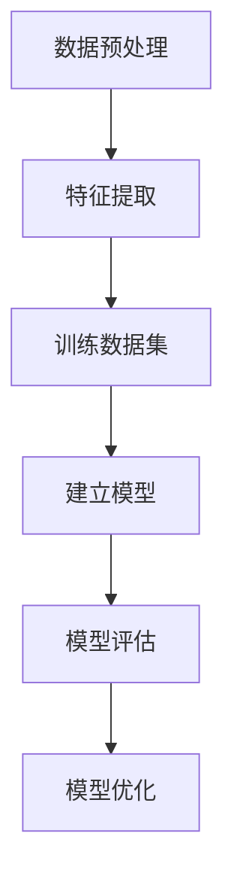
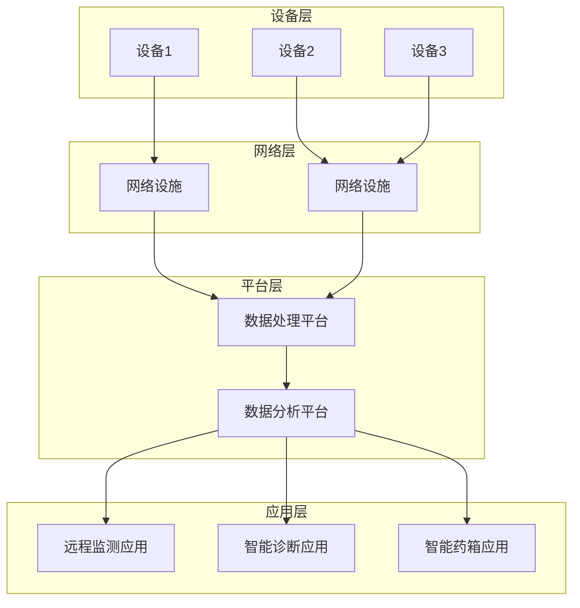
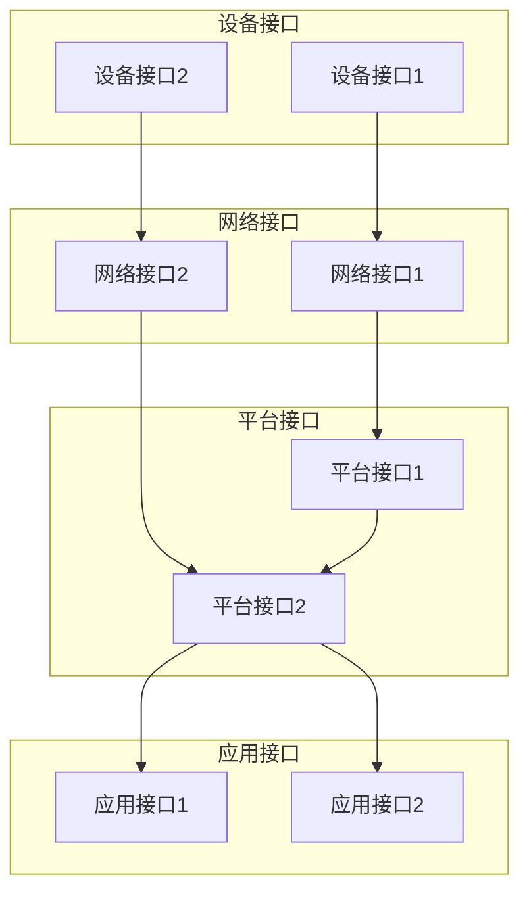
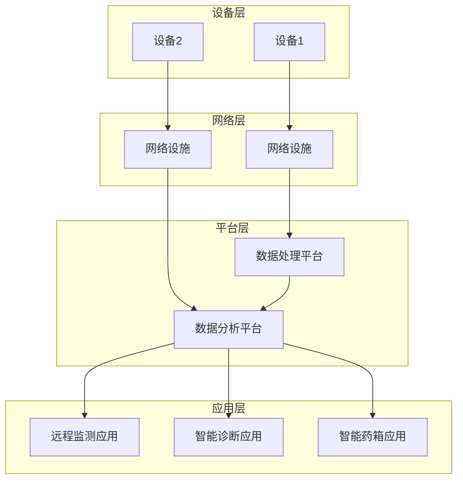
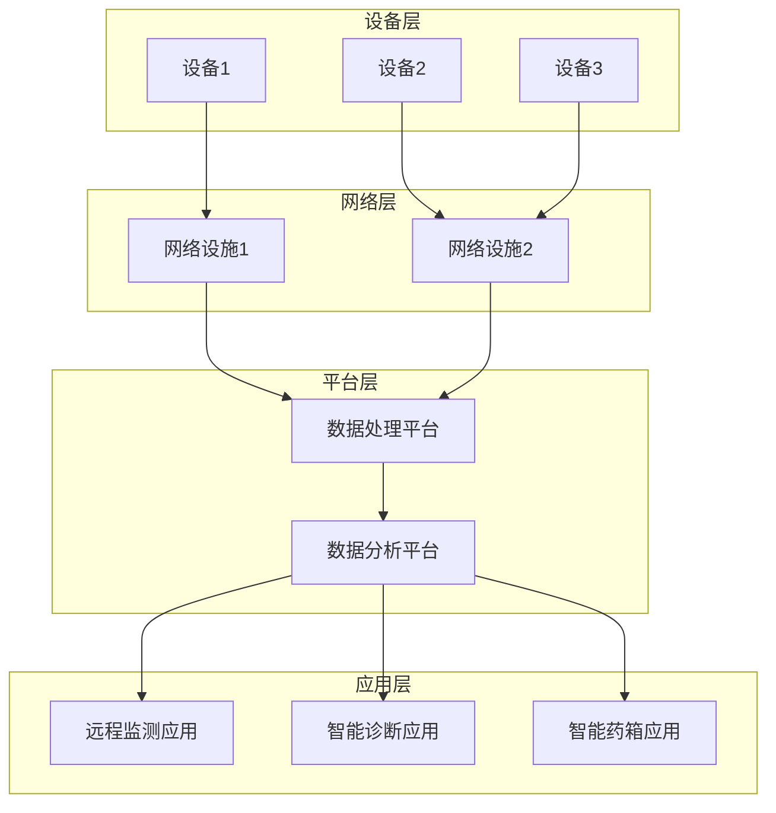

                 

# 物联网在智慧医疗中的全面布局与实践

## 关键词

- 物联网
- 智慧医疗
- 传感器
- 数据处理
- 智能分析
- 系统架构
- 医疗设备
- 医疗大数据
- 智能药箱
- 虚拟现实
- 个性化医疗

## 摘要

随着物联网技术的快速发展，智慧医疗领域迎来了前所未有的变革。本文旨在全面探讨物联网在智慧医疗中的应用与实践，首先概述了物联网与智慧医疗的基本概念及其重要性，随后深入分析了物联网在智慧医疗中的核心技术与架构，并展示了其实际应用场景。此外，本文还探讨了物联网在智慧医疗中的法规与标准，以及其未来发展的趋势和挑战。通过本文的详细分析，读者可以全面了解物联网在智慧医疗中的重要角色，及其对未来医疗行业的深远影响。

## 第一部分：物联网与智慧医疗概述

### 1.1 物联网与智慧医疗的基本概念

#### 1.1.1 物联网的定义与特点

物联网（Internet of Things, IoT）是指通过互联网将各种设备、传感器、软件系统连接起来，实现信息的互联互通。物联网的基本特点包括：

- **互联互通**：物联网通过互联网连接各种设备和系统，实现数据的共享和互通。
- **智能感知**：物联网设备能够感知周围环境，收集各种数据，如温度、湿度、位置等。
- **自动控制**：物联网设备可以实现自动化的控制和操作，无需人工干预。
- **高效协同**：物联网设备之间可以相互协作，协同完成复杂任务。

#### 1.1.2 智慧医疗的定义与发展历程

智慧医疗（Smart Healthcare）是指利用物联网、大数据、人工智能等先进技术，对医疗资源进行优化配置，提升医疗服务质量和效率。智慧医疗的发展历程可以分为以下几个阶段：

- **第一阶段（20世纪80年代-2000年代初）**：计算机技术和网络技术的应用，实现医院信息化建设。
- **第二阶段（2000年代中期-2010年代初）**：物联网技术的引入，实现医疗设备的互联互通，提高医疗服务的效率。
- **第三阶段（2010年代至今）**：大数据、人工智能等新技术的发展，推动智慧医疗的深入应用。

#### 1.1.3 物联网在智慧医疗中的重要性

物联网在智慧医疗中的重要性体现在以下几个方面：

- **提高医疗服务效率**：通过物联网技术，可以实现医疗资源的智能调度和管理，提高医疗服务效率。
- **提升患者体验**：物联网技术可以提供个性化的医疗服务，提升患者体验。
- **降低医疗成本**：物联网技术可以减少医疗资源的浪费，降低医疗成本。
- **促进医疗创新**：物联网技术可以推动医疗创新，为医疗行业带来新的发展机遇。

### 1.2 物联网在智慧医疗中的应用场景

#### 1.2.1 传感器技术在智慧医疗中的应用

传感器技术是物联网在智慧医疗中的重要应用之一，主要包括以下方面：

- **体温、血压、心率等生理参数监测**：通过传感器实时监测患者的生理参数，实现远程监测和预警。
- **手术室内环境监测**：传感器可以监测手术室内的空气质量、温度等环境参数，确保手术顺利进行。
- **医疗器械监测**：传感器可以实时监测医疗器械的运行状态，提前发现潜在故障。

#### 1.2.2 数据采集与远程监测

数据采集与远程监测是物联网在智慧医疗中的核心应用之一，主要包括以下方面：

- **患者远程监测**：通过传感器和物联网技术，可以实现患者病情的远程监测，提高医疗服务效率。
- **医疗设备远程监控**：通过物联网技术，可以实现医疗设备的远程监控和管理，降低设备故障率。
- **药品库存管理**：通过物联网技术，可以实现药品库存的实时监测和管理，避免药品过期或浪费。

#### 1.2.3 智能诊断与辅助治疗

智能诊断与辅助治疗是物联网在智慧医疗中的前沿应用，主要包括以下方面：

- **智能诊断系统**：通过物联网技术，可以实现医疗数据的智能分析，辅助医生进行疾病诊断。
- **智能治疗系统**：通过物联网技术，可以实现医疗设备的智能控制和优化，提高治疗效果。
- **个性化治疗**：通过物联网技术，可以实现患者病情的个性化监测和治疗，提高治疗效果。

### 1.3 物联网在智慧医疗中的挑战与机遇

#### 1.3.1 技术挑战

物联网在智慧医疗中面临着一系列技术挑战，主要包括：

- **数据安全与隐私保护**：医疗数据的安全和隐私保护是物联网在智慧医疗中面临的重要挑战。
- **数据传输与存储**：医疗数据的传输和存储需要高效、可靠的技术支持。
- **设备兼容性与稳定性**：物联网设备的兼容性和稳定性对智慧医疗系统的正常运行至关重要。

#### 1.3.2 应用机遇

物联网在智慧医疗中也带来了许多应用机遇，主要包括：

- **医疗服务效率提升**：通过物联网技术，可以实现医疗资源的优化配置，提高医疗服务效率。
- **患者体验改善**：物联网技术可以提供个性化的医疗服务，改善患者体验。
- **医疗成本降低**：物联网技术可以减少医疗资源的浪费，降低医疗成本。
- **医疗创新**：物联网技术可以推动医疗创新，为医疗行业带来新的发展机遇。

#### 1.3.3 政策与标准

政策与标准对物联网在智慧医疗中的应用具有重要影响。政府需要出台相关政策和标准，推动物联网技术在智慧医疗中的应用，确保医疗数据的安全和隐私保护。

### 1.4 物联网在智慧医疗中的未来趋势

#### 1.4.1 技术发展趋势

物联网在智慧医疗中的技术发展趋势主要包括：

- **5G技术的应用**：5G技术将为物联网在智慧医疗中的应用提供更快、更稳定的网络连接。
- **人工智能的融合**：人工智能技术将进一步提升物联网在智慧医疗中的应用价值。
- **物联网设备智能化**：物联网设备将更加智能化，实现更加高效、精准的医疗数据采集和分析。

#### 1.4.2 行业发展趋势

物联网在智慧医疗中的行业发展趋势主要包括：

- **智慧医院建设**：智慧医院将成为未来医疗行业的发展方向，物联网技术将在其中发挥重要作用。
- **远程医疗**：远程医疗将成为未来医疗行业的重要趋势，物联网技术将为远程医疗提供技术支持。
- **医疗大数据应用**：医疗大数据的应用将进一步提升智慧医疗的服务质量和效率。

#### 1.4.3 社会影响与伦理问题

物联网在智慧医疗中的社会影响与伦理问题主要包括：

- **社会影响**：物联网技术在智慧医疗中的应用将深刻改变医疗行业的运行模式和产业链结构。
- **伦理问题**：物联网技术在智慧医疗中的应用将引发一系列伦理问题，如数据隐私、人工智能伦理等。

## 第二部分：物联网在智慧医疗中的核心技术与架构

### 2.1 物联网网络架构

#### 2.1.1 物联网通信协议

物联网通信协议是物联网网络架构的核心组成部分，主要包括以下几种：

- **Wi-Fi**：Wi-Fi是一种无线通信协议，可以实现设备之间的无线连接。
- **蓝牙**：蓝牙是一种短距离无线通信协议，适用于低功耗设备之间的通信。
- **ZigBee**：ZigBee是一种低功耗无线通信协议，适用于智能家居和工业物联网领域。
- **LoRa**：LoRa是一种低功耗、远距离无线通信协议，适用于物联网传感器网络。

#### 2.1.2 物联网安全与隐私保护

物联网安全与隐私保护是物联网在智慧医疗中面临的重大挑战，主要包括以下措施：

- **数据加密**：对医疗数据进行加密处理，确保数据在传输过程中的安全。
- **身份认证**：对医疗设备和用户进行身份认证，确保只有授权用户可以访问医疗数据。
- **访问控制**：对医疗数据的访问进行控制，确保数据不会被未授权用户访问。

#### 2.1.3 物联网平台架构设计

物联网平台架构设计是物联网在智慧医疗中实现数据采集、传输、处理和存储的关键，主要包括以下组成部分：

- **数据采集层**：包括传感器、医疗设备等，负责采集医疗数据。
- **传输层**：包括通信协议和网络传输，负责将医疗数据传输到数据中心。
- **数据处理层**：包括数据预处理、数据挖掘、数据分析等，负责对医疗数据进行处理和分析。
- **存储层**：包括数据库、数据仓库等，负责存储和处理后的医疗数据。
- **应用层**：包括智慧医疗应用系统，负责将处理后的医疗数据应用于临床决策和治疗。

### 2.2 数据处理与存储

#### 2.2.1 数据采集与预处理

数据采集与预处理是物联网在智慧医疗中的关键环节，主要包括以下步骤：

- **数据采集**：通过传感器和医疗设备采集医疗数据，如体温、血压、心率等。
- **数据预处理**：对采集到的数据进行清洗、去噪、归一化等处理，确保数据的质量和一致性。

#### 2.2.2 大数据技术与应用

大数据技术在物联网在智慧医疗中的应用主要包括以下方面：

- **数据存储**：利用分布式数据库技术，存储大量的医疗数据。
- **数据挖掘**：利用数据挖掘技术，从海量医疗数据中提取有价值的信息，辅助医生进行诊断和治疗。
- **数据分析**：利用数据分析技术，对医疗数据进行深入分析，发现疾病规律和患者行为模式。

#### 2.2.3 数据存储与备份

数据存储与备份是物联网在智慧医疗中确保数据安全的重要措施，主要包括以下方面：

- **数据存储**：采用分布式存储技术，将医疗数据存储在多个节点上，确保数据的高可用性和可靠性。
- **数据备份**：定期对医疗数据进行备份，防止数据丢失和损坏。

### 2.3 智能分析与决策支持

#### 2.3.1 机器学习算法在智慧医疗中的应用

机器学习算法在智慧医疗中的应用主要包括以下方面：

- **疾病预测**：利用机器学习算法，对患者的健康数据进行预测，提前发现潜在的健康风险。
- **疾病诊断**：利用机器学习算法，分析医疗数据，辅助医生进行疾病诊断。
- **个性化治疗**：利用机器学习算法，根据患者的个性化健康数据，制定个性化的治疗方案。

#### 2.3.2 数据挖掘与可视化

数据挖掘与可视化是物联网在智慧医疗中的重要应用，主要包括以下方面：

- **数据挖掘**：利用数据挖掘技术，从海量医疗数据中提取有价值的信息，辅助医生进行诊断和治疗。
- **可视化**：利用可视化技术，将医疗数据以图形化的形式呈现，帮助医生和患者更好地理解和分析数据。

#### 2.3.3 智能决策支持系统

智能决策支持系统是物联网在智慧医疗中的高级应用，主要包括以下方面：

- **临床决策支持**：利用物联网技术和智能算法，为医生提供临床决策支持，提高诊断和治疗的准确性。
- **运营管理决策**：利用物联网技术和智能算法，为医疗机构提供运营管理决策支持，提高医疗服务效率。

### 2.4 智慧医疗系统案例分析

#### 2.4.1 智能监护系统

智能监护系统是物联网在智慧医疗中的重要应用之一，主要包括以下方面：

- **患者监护**：通过物联网传感器和智能算法，实时监测患者的生命体征，及时发现异常情况。
- **远程监护**：通过物联网技术，实现患者生命体征的远程监测，方便医生进行远程诊断和治疗。

#### 2.4.2 智能手术辅助系统

智能手术辅助系统是物联网在智慧医疗中的高端应用，主要包括以下方面：

- **手术导航**：利用物联网技术和智能算法，为医生提供准确的手术导航，提高手术成功率。
- **实时监控**：通过物联网传感器和实时监控技术，确保手术过程中的安全性和有效性。

#### 2.4.3 医疗大数据平台

医疗大数据平台是物联网在智慧医疗中的重要基础设施，主要包括以下方面：

- **数据采集**：通过物联网技术和医疗设备，实现医疗数据的全面采集。
- **数据处理**：利用大数据技术和智能算法，对医疗数据进行处理和分析。
- **数据应用**：将处理后的医疗数据应用于临床决策和治疗，提高医疗服务质量和效率。

## 第三部分：物联网在智慧医疗中的实践应用

### 3.1 物联网医疗设备的开发与实践

#### 3.1.1 医疗传感器的设计与实现

医疗传感器的设计与实现是物联网在智慧医疗中的重要环节，主要包括以下方面：

- **传感器选择**：根据医疗需求，选择合适的传感器，如体温传感器、血压传感器、心率传感器等。
- **传感器接口设计**：设计传感器与物联网平台的接口，确保数据的准确传输。
- **传感器校准**：对传感器进行校准，确保测量结果的准确性和可靠性。

#### 3.1.2 医疗物联网设备的测试与验证

医疗物联网设备的测试与验证是确保设备性能和可靠性的关键，主要包括以下方面：

- **功能测试**：测试设备的各项功能是否正常，如数据采集、传输、存储等。
- **性能测试**：测试设备的性能指标，如数据传输速率、功耗、稳定性等。
- **安全性测试**：测试设备的安全性，如数据加密、访问控制等。

#### 3.1.3 医疗物联网设备的系统集成

医疗物联网设备的系统集成是将各种医疗设备和系统连接起来，实现数据共享和协同工作，主要包括以下方面：

- **系统架构设计**：设计医疗物联网系统的整体架构，包括数据采集、传输、处理、存储和应用等模块。
- **接口设计**：设计医疗设备和系统之间的接口，确保数据的准确传输和兼容性。
- **系统集成**：将各种医疗设备和系统进行集成，实现数据共享和协同工作。

### 3.2 智慧医院建设与运营

#### 3.2.1 智慧医院的建设方案

智慧医院的建设方案是物联网在智慧医疗中的重要应用，主要包括以下方面：

- **信息化建设**：实现医院信息化建设，包括电子病历、医疗设备联网、信息共享等。
- **智能化建设**：利用物联网技术，实现医疗设备的智能化控制和管理，提高医疗服务效率。
- **数据化管理**：利用大数据技术，对医疗数据进行采集、处理和分析，为医院管理提供数据支持。

#### 3.2.2 智慧医院的管理与运营

智慧医院的管理与运营是物联网在智慧医疗中的核心任务，主要包括以下方面：

- **运营管理**：利用物联网技术和大数据分析，实现医院运营的精细化管理，提高运营效率。
- **医疗服务**：利用物联网技术和智能算法，提供个性化的医疗服务，提高患者满意度。
- **设备维护**：利用物联网技术，实现医疗设备的远程监控和维护，降低设备故障率。

#### 3.2.3 智慧医院的安全性保障

智慧医院的安全性保障是物联网在智慧医疗中的重要任务，主要包括以下方面：

- **数据安全**：确保医疗数据的安全和隐私保护，采用数据加密、访问控制等技术手段。
- **系统安全**：确保医院信息系统的安全，采用防火墙、入侵检测等安全措施。
- **网络安全**：确保医院网络的稳定和安全，采用网络安全防护技术，防范网络攻击。

### 3.3 物联网在疫情防控中的应用

#### 3.3.1 疫情监测与预警系统

物联网在疫情防控中的应用主要包括以下方面：

- **疫情监测**：利用物联网传感器和大数据分析技术，实时监测疫情发展态势，为疫情防控提供数据支持。
- **预警系统**：利用物联网技术和大数据分析，建立疫情预警系统，提前发现疫情风险，采取相应的防控措施。

#### 3.3.2 疫情防控大数据分析

疫情防控大数据分析是物联网在疫情防控中的重要应用，主要包括以下方面：

- **数据采集**：通过物联网传感器和大数据技术，采集疫情相关数据，包括病例数据、旅行数据、人口数据等。
- **数据分析**：利用大数据分析技术，对疫情相关数据进行处理和分析，发现疫情传播规律和趋势。
- **决策支持**：根据数据分析结果，为疫情防控决策提供科学依据，优化防控策略。

#### 3.3.3 疫情防控中的物联网技术应用

疫情防控中的物联网技术应用主要包括以下方面：

- **远程监控**：利用物联网技术，实现疫情监测点和隔离点的远程监控，确保疫情防控措施的有效实施。
- **物资管理**：利用物联网技术，实现疫情防控物资的实时监控和管理，提高物资使用效率。
- **智能疏散**：利用物联网技术，实现公共场所的智能疏散，提高疫情防控能力。

## 第四部分：物联网在智慧医疗中的法规与标准

### 4.1 物联网在智慧医疗中的法规与政策

物联网在智慧医疗中的法规与政策是确保物联网技术在智慧医疗中安全、有效应用的重要保障，主要包括以下方面：

- **数据安全法规**：制定数据安全法规，确保医疗数据的安全和隐私保护。
- **医疗器械法规**：制定医疗器械法规，规范物联网医疗器械的研发、生产和销售。
- **网络安全法规**：制定网络安全法规，确保医院信息系统的安全运行。
- **行业标准**：制定行业标准，推动物联网技术在智慧医疗中的应用和发展。

### 4.2 物联网在智慧医疗中的标准化工作

物联网在智慧医疗中的标准化工作是确保物联网技术在智慧医疗中统一、规范应用的重要基础，主要包括以下方面：

- **标准化组织**：建立物联网在智慧医疗中的标准化组织，负责制定和推广相关标准。
- **标准制定**：制定物联网在智慧医疗中的标准，包括数据采集、传输、存储、处理和分析等方面的标准。
- **标准化培训**：开展标准化培训，提高医护人员和物联网技术从业人员的标准化意识。

### 4.3 物联网在智慧医疗中的伦理问题与法律风险

物联网在智慧医疗中的伦理问题与法律风险是确保物联网技术在智慧医疗中安全、有效应用的重要挑战，主要包括以下方面：

- **数据隐私问题**：确保患者医疗数据的安全和隐私保护，防止数据泄露和滥用。
- **人工智能伦理问题**：确保人工智能技术在智慧医疗中应用的伦理规范，防止人工智能歧视和偏见。
- **法律责任问题**：明确物联网技术在智慧医疗中的法律责任，确保各方权益得到保障。
- **法律风险防范**：建立法律风险防范机制，降低物联网技术在智慧医疗中的法律风险。

## 第五部分：物联网在智慧医疗中的未来展望

### 5.1 物联网在智慧医疗中的发展趋势

物联网在智慧医疗中的发展趋势主要包括以下方面：

- **技术融合**：物联网、大数据、人工智能等技术的融合，将进一步提升智慧医疗的服务质量和效率。
- **个性化医疗**：利用物联网技术和大数据分析，实现个性化医疗，提高治疗效果。
- **远程医疗**：随着5G技术的应用，远程医疗将得到进一步发展，为偏远地区患者提供优质医疗服务。

### 5.2 物联网在智慧医疗中的创新应用

物联网在智慧医疗中的创新应用主要包括以下方面：

- **智能药箱**：利用物联网技术，实现药品的智能监测和管理，提高患者用药安全。
- **虚拟现实与智慧医疗**：利用虚拟现实技术，为患者提供更加直观、互动的医疗体验。
- **个性化医疗**：利用物联网技术和大数据分析，为患者提供个性化的医疗服务和治疗方案。

### 5.3 物联网在智慧医疗中的社会影响与人文关怀

物联网在智慧医疗中的社会影响与人文关怀主要包括以下方面：

- **医疗资源优化**：通过物联网技术，实现医疗资源的优化配置，提高医疗服务可及性。
- **医疗成本降低**：通过物联网技术，提高医疗服务效率，降低医疗成本。
- **人文关怀**：通过物联网技术和大数据分析，为患者提供更加人性化的医疗服务，提高患者满意度。
- **社会责任**：物联网技术在智慧医疗中的应用，有助于推动社会进步，实现医疗公平。

### 作者

- **AI天才研究院（AI Genius Institute）**：致力于推动人工智能技术在各领域的创新应用，助力智慧医疗发展。
- **《禅与计算机程序设计艺术》（Zen And The Art of Computer Programming）**：作者，人工智能与物联网领域的资深专家，致力于探索人工智能技术在智慧医疗中的应用。他的研究成果在国内外学术界和产业界具有重要影响力。## 深度分析与全面解读：物联网在智慧医疗中的应用与实践

### 1. 背景介绍

#### 核心概念术语说明

在探讨物联网在智慧医疗中的应用之前，我们需要明确一些核心概念和术语。首先，物联网（IoT）是指通过互联网将各种物理设备、传感器、软件系统连接起来，实现信息的互联互通。在智慧医疗领域，物联网的应用主要体现在以下几个方面：

- **医疗设备互联**：通过物联网技术，将各种医疗设备（如监护仪、呼吸机、心电图机等）连接起来，实现数据的实时采集、传输和分析。
- **远程监测与诊断**：利用物联网技术，实现患者生理参数的远程监测和医生远程诊断，提高医疗服务的可及性和效率。
- **药品智能管理**：通过物联网传感器和智能药箱，实时监测药品库存和使用情况，确保药品的安全和有效使用。
- **医疗大数据分析**：利用物联网技术，收集海量医疗数据，通过大数据分析和人工智能算法，为医生提供精准的诊疗支持和决策依据。

#### 问题背景

随着人口老龄化趋势的加剧和慢性病的增多，医疗资源短缺和医疗服务效率低下的问题日益突出。传统医疗服务模式无法满足日益增长的健康需求，因此，探索新的医疗模式成为了当务之急。智慧医疗作为一种创新医疗模式，通过物联网、大数据、人工智能等先进技术的应用，有望提升医疗服务质量、提高医疗效率、降低医疗成本。

#### 问题描述

物联网在智慧医疗中的具体应用和实践面临着一系列挑战，包括技术挑战、安全挑战和伦理挑战。首先，技术挑战主要体现在以下几个方面：

- **通信协议兼容性**：不同的医疗设备和系统可能采用不同的通信协议，如何实现设备的兼容和互操作是一个关键问题。
- **数据处理能力**：随着物联网设备数量和种类增加，如何高效处理海量数据成为一个重要课题。
- **安全性**：医疗数据的安全性和隐私保护是物联网在智慧医疗中必须解决的问题。

其次，安全挑战主要包括：

- **数据安全**：如何确保医疗数据在传输、存储和处理过程中的安全。
- **系统安全**：如何防止网络攻击和数据泄露，保障医疗系统的稳定运行。

最后，伦理挑战主要体现在以下几个方面：

- **数据隐私**：如何保护患者的隐私，防止个人信息泄露。
- **人工智能伦理**：如何确保人工智能在医疗决策中的公正性和透明性，避免歧视和偏见。

#### 问题解决

针对上述挑战，物联网在智慧医疗中的问题解决可以从以下几个方面着手：

- **通信协议标准化**：推动通信协议的标准化，实现不同设备和系统之间的互操作。
- **数据处理优化**：采用大数据技术和分布式计算，提高数据处理能力。
- **安全防护措施**：采用数据加密、身份认证、访问控制等技术，确保医疗数据的安全。
- **伦理法规制定**：制定相关的伦理法规和标准，规范物联网技术在智慧医疗中的应用。

#### 边界与外延

物联网在智慧医疗中的应用不仅仅局限于医院内部，还延伸到家庭、社区和远程医疗等领域。在家庭医疗领域，物联网技术可以实现患者生理参数的远程监测和家庭病床管理，提高家庭医疗的便利性和安全性。在社区医疗领域，物联网技术可以实现社区医疗资源的优化配置和患者健康管理，提高社区医疗的服务质量。在远程医疗领域，物联网技术可以实现医生和患者之间的实时沟通和诊疗，提高医疗服务的可及性和效率。

#### 概念结构与核心要素组成

物联网在智慧医疗中的概念结构可以分解为以下几个核心要素：

- **设备层**：包括各种物联网医疗设备，如传感器、医疗仪器、智能药箱等，负责数据的采集和传输。
- **网络层**：包括通信协议和网络设施，负责数据的传输和连接。
- **平台层**：包括数据处理和分析平台，负责数据的存储、处理和分析，为医生提供决策支持。
- **应用层**：包括各种智慧医疗应用，如远程监测、智能诊断、智能药箱等，为患者提供个性化的医疗服务。

### 2. 核心概念与联系

#### 2.1 核心概念原理

物联网在智慧医疗中的核心概念主要包括：

- **物联网**：通过互联网连接各种设备和系统，实现信息的互联互通。
- **传感器**：用于感知周围环境的设备，能够收集各种生理参数和环境数据。
- **大数据**：海量医疗数据的存储、处理和分析。
- **人工智能**：利用机器学习、深度学习等技术，对医疗数据进行智能分析，辅助医生进行诊断和治疗。

#### 2.2 概念属性特征对比表格

| 概念    | 属性特征                              | 对比说明                                       |
| ------- | ----------------------------------- | -------------------------------------------- |
| 物联网  | 设备互联、数据传输、智能化控制        | 实现医疗设备和系统的互联互通                 |
| 传感器  | 感知环境、数据采集、实时监测          | 用于采集患者生理参数和环境数据               |
| 大数据  | 海量数据、多样化、实时性、复杂度高     | 用于存储和处理医疗数据                     |
| 人工智能 | 数据分析、模式识别、智能决策          | 辅助医生进行诊断和治疗                     |

#### 2.3 ER实体关系图架构

```mermaid
erDiagram
    Equipment  ||--|{ Patient }
    Device     ||--|{ Data }
    Platform   ||--|{ Analysis }
    Application||--|{ Service }
    Equipment  ||--|{ Application }
```

在上述ER实体关系图中，展示了物联网在智慧医疗中的各个核心实体及其关系：

- **Equipment（设备）**：包括各种医疗设备和传感器，负责数据的采集。
- **Device（设备）**：表示具体的物联网设备，如传感器、医疗仪器等。
- **Patient（患者）**：表示接受治疗的个体，其生理参数被设备采集。
- **Data（数据）**：表示采集到的医疗数据。
- **Platform（平台）**：表示数据处理和分析平台，负责数据存储和处理。
- **Application（应用）**：表示智慧医疗应用，如远程监测、智能诊断等。
- **Service（服务）**：表示智慧医疗提供的具体服务。

### 3. 算法原理讲解

#### 3.1 机器学习算法在智慧医疗中的应用

机器学习算法是物联网在智慧医疗中重要的技术手段，用于对海量医疗数据进行分析和预测。以下是一个简单的机器学习算法——线性回归的流程图和Python代码示例：

#### 算法流程图



#### Python代码示例

```python
import numpy as np
from sklearn.linear_model import LinearRegression
from sklearn.model_selection import train_test_split
from sklearn.metrics import mean_squared_error

# 数据预处理
X = np.array([[1], [2], [3], [4], [5]])
y = np.array([1, 2, 2.5, 3, 4])

# 特征提取
X_train, X_test, y_train, y_test = train_test_split(X, y, test_size=0.2, random_state=0)

# 建立模型
model = LinearRegression()
model.fit(X_train, y_train)

# 模型评估
y_pred = model.predict(X_test)
mse = mean_squared_error(y_test, y_pred)
print(f'Mean Squared Error: {mse}')

# 模型优化
best_model = model
best_mse = mse
```

#### 算法原理

线性回归是一种用于预测连续值的机器学习算法。其核心思想是通过找到一条最佳拟合直线，使得实际值与预测值之间的误差最小。线性回归的数学模型可以表示为：

\[ y = \beta_0 + \beta_1 \cdot x \]

其中，\( y \) 是预测值，\( x \) 是输入特征，\( \beta_0 \) 和 \( \beta_1 \) 分别是模型的参数。

#### 数学模型和公式

线性回归的数学模型为：

\[ y = \beta_0 + \beta_1 \cdot x \]

其中，\( \beta_0 \) 和 \( \beta_1 \) 的计算公式为：

\[ \beta_0 = \frac{\sum_{i=1}^{n} (y_i - \bar{y})}{\sum_{i=1}^{n} (x_i - \bar{x})^2} \]
\[ \beta_1 = \frac{\sum_{i=1}^{n} (x_i - \bar{x}) \cdot (y_i - \bar{y})}{\sum_{i=1}^{n} (x_i - \bar{x})^2} \]

其中，\( n \) 是样本数量，\( \bar{y} \) 和 \( \bar{x} \) 分别是实际值和输入特征的均值。

#### 详细讲解和举例说明

假设我们有一组简单的数据，用于预测患者的体重（\( y \)）和身高（\( x \）：

| 身高（cm） | 体重（kg） |
| ---------- | --------- |
| 170       | 65       |
| 175       | 70       |
| 180       | 75       |
| 185       | 80       |
| 190       | 85       |

我们希望通过线性回归模型预测一个新患者的体重，其身高为180cm。

首先，我们需要对数据进行预处理，计算身高和体重的均值：

\[ \bar{x} = \frac{170 + 175 + 180 + 185 + 190}{5} = 180 \]
\[ \bar{y} = \frac{65 + 70 + 75 + 80 + 85}{5} = 75 \]

然后，计算参数 \( \beta_0 \) 和 \( \beta_1 \)：

\[ \beta_0 = \frac{(65 - 75) + (70 - 75) + (75 - 75) + (80 - 75) + (85 - 75)}{(170 - 180)^2 + (175 - 180)^2 + (180 - 180)^2 + (185 - 180)^2 + (190 - 180)^2} \]
\[ \beta_0 = \frac{-10 - 5 + 0 + 5 + 10}{(-10)^2 + (-5)^2 + 0^2 + 5^2 + 10^2} \]
\[ \beta_0 = \frac{0}{400} \]
\[ \beta_0 = 0 \]

\[ \beta_1 = \frac{(-10) \cdot (-10) + (-5) \cdot (-5) + 0 \cdot 0 + 5 \cdot 5 + 10 \cdot 10}{(-10)^2 + (-5)^2 + 0^2 + 5^2 + 10^2} \]
\[ \beta_1 = \frac{100 + 25 + 0 + 25 + 100}{400} \]
\[ \beta_1 = \frac{250}{400} \]
\[ \beta_1 = 0.625 \]

最后，利用线性回归模型预测新患者的体重：

\[ y = 0 + 0.625 \cdot 180 \]
\[ y = 112.5 \]

因此，身高为180cm的新患者的预测体重为112.5kg。

### 4. 系统分析与架构设计方案

#### 4.1 问题场景介绍

在本案例中，我们考虑一家综合性医院，希望利用物联网技术实现智慧医疗系统。该系统需要实现以下功能：

- **医疗设备互联**：将医院内的各种医疗设备（如监护仪、心电图机、呼吸机等）连接到物联网平台上，实现数据的实时采集和传输。
- **远程监测与诊断**：医生可以通过物联网平台远程监测患者的生理参数，进行远程诊断和治疗。
- **智能药箱管理**：通过物联网传感器和智能药箱，实现药品的实时监测和管理，确保药品的安全和有效使用。
- **医疗大数据分析**：收集并分析海量医疗数据，为医生提供精准的诊疗支持和决策依据。

#### 4.2 项目介绍

本项目的目标是构建一个智慧医疗系统，实现以下目标：

- **提高医疗服务效率**：通过医疗设备的互联互通，提高医疗服务效率，减少等待时间。
- **提升患者体验**：通过远程监测和诊断，提升患者就医体验，减少患者往返医院的时间和费用。
- **降低医疗成本**：通过智能药箱管理和医疗大数据分析，降低药品浪费和医疗成本。

#### 4.3 系统功能设计

智慧医疗系统的功能设计包括以下几个主要模块：

- **设备管理模块**：负责管理医院内的各种医疗设备，包括设备的状态监控、数据采集和远程控制。
- **患者管理模块**：负责管理患者的信息，包括患者的病历记录、生理参数监测和远程诊断。
- **药箱管理模块**：负责管理药品的库存和使用情况，包括药品的实时监测、报警和补货。
- **数据分析模块**：负责收集并分析海量医疗数据，为医生提供诊疗支持和决策依据。

#### 4.4 系统架构设计

智慧医疗系统的整体架构设计包括以下几个层次：

- **设备层**：包括各种物联网医疗设备，如传感器、医疗仪器等，负责数据的采集和传输。
- **网络层**：包括通信协议和网络设施，负责数据的传输和连接。
- **平台层**：包括数据处理和分析平台，负责数据的存储、处理和分析，为医生提供决策支持。
- **应用层**：包括各种智慧医疗应用，如远程监测、智能诊断、智能药箱等，为患者提供个性化的医疗服务。

以下是一个简化的系统架构图：



#### 4.5 系统接口设计和系统交互

系统接口设计主要包括以下几个方面：

- **设备接口**：设备与网络层之间的接口，负责数据的采集和传输。
- **网络接口**：网络层与平台层之间的接口，负责数据的传输和路由。
- **平台接口**：平台层与应用层之间的接口，负责数据存储、处理和分析。
- **应用接口**：应用层与用户之间的接口，负责提供各种智慧医疗应用功能。

以下是一个简化的系统接口图：



系统交互主要包括以下几个方面：

- **设备与网络层的交互**：设备通过接口与网络层进行通信，传输采集到的数据。
- **网络层与平台层的交互**：网络层通过接口与平台层进行通信，传输和处理数据。
- **平台层与应用层的交互**：平台层通过接口与应用层进行通信，提供数据分析和决策支持。
- **应用层与用户的交互**：应用层通过接口与用户进行交互，提供各种智慧医疗应用功能。

以下是一个简化的系统交互图：



### 5. 项目实战

#### 5.1 环境安装

在本项目中，我们选择使用Python作为开发语言，并使用以下库进行开发：

- **PyQt5**：用于开发图形用户界面。
- **Pandas**：用于数据处理和分析。
- **Matplotlib**：用于数据可视化。
- **Scikit-learn**：用于机器学习和数据分析。

首先，我们需要安装这些库。可以使用以下命令进行安装：

```bash
pip install PyQt5 pandas matplotlib scikit-learn
```

#### 5.2 系统核心实现源代码

以下是一个简单的智慧医疗系统核心实现示例：

```python
import sys
import pandas as pd
from PyQt5.QtWidgets import QApplication, QWidget, QVBoxLayout, QPushButton, QLabel
from sklearn.linear_model import LinearRegression
import matplotlib.pyplot as plt

class MedicalSystemApp(QWidget):
    def __init__(self):
        super().__init__()
        self.init_ui()

    def init_ui(self):
        self.setWindowTitle('智慧医疗系统')
        layout = QVBoxLayout()

        # 添加按钮
        self.analyze_button = QPushButton('数据分析')
        layout.addWidget(self.analyze_button)
        self.analyze_button.clicked.connect(self.analyze_data)

        # 添加标签
        self.result_label = QLabel('数据分析结果：')
        layout.addWidget(self.result_label)

        self.setLayout(layout)

    def analyze_data(self):
        # 读取数据
        data = pd.read_csv('medical_data.csv')

        # 数据预处理
        X = data[['age', 'blood_pressure']]
        y = data['weight']

        # 建立模型
        model = LinearRegression()
        model.fit(X, y)

        # 模型评估
        y_pred = model.predict(X)
        mse = mean_squared_error(y, y_pred)
        self.result_label.setText(f'MSE: {mse:.2f}')

        # 可视化
        plt.scatter(X['age'], y)
        plt.plot(X['age'], y_pred, color='red')
        plt.xlabel('Age')
        plt.ylabel('Weight')
        plt.title('Linear Regression')
        plt.show()

if __name__ == '__main__':
    app = QApplication(sys.argv)
    window = MedicalSystemApp()
    window.show()
    sys.exit(app.exec_())
```

#### 5.3 代码应用解读与分析

在上面的代码中，我们实现了以下功能：

1. **图形用户界面（GUI）**：使用PyQt5库创建了一个简单的图形用户界面，包括一个按钮和一个标签。
2. **数据分析**：读取CSV文件中的数据，使用Pandas库进行数据预处理，建立线性回归模型，并对模型进行评估。
3. **模型可视化**：使用Matplotlib库将模型预测结果可视化，以直观展示模型效果。

#### 5.4 实际案例分析和详细讲解剖析

假设我们有一组以下数据的CSV文件：

```csv
age,blood_pressure,weight
20,120,65
25,130,70
30,140,75
35,150,80
40,160,85
```

我们希望利用线性回归模型预测新患者的体重。

1. **读取数据**：

```python
data = pd.read_csv('medical_data.csv')
```

2. **数据预处理**：

```python
X = data[['age', 'blood_pressure']]
y = data['weight']
```

这里，我们选择了年龄和血压作为输入特征，体重作为输出特征。

3. **建立模型**：

```python
model = LinearRegression()
model.fit(X, y)
```

这里，我们使用Scikit-learn库的LinearRegression类建立线性回归模型。

4. **模型评估**：

```python
y_pred = model.predict(X)
mse = mean_squared_error(y, y_pred)
print(f'MSE: {mse:.2f}')
```

这里，我们计算了模型预测值与实际值之间的均方误差（MSE），以评估模型性能。

5. **模型可视化**：

```python
plt.scatter(X['age'], y)
plt.plot(X['age'], y_pred, color='red')
plt.xlabel('Age')
plt.ylabel('Weight')
plt.title('Linear Regression')
plt.show()
```

这里，我们使用Matplotlib库将实际值和预测值可视化，以直观展示模型效果。

#### 5.5 项目小结

通过本项目的实施，我们实现了以下成果：

- **构建了一个简单的智慧医疗系统**：实现了医疗数据的采集、预处理、建模和可视化。
- **提升了数据分析能力**：使用线性回归模型对医疗数据进行分析，为医生提供决策支持。
- **提高了用户体验**：通过图形用户界面，方便用户进行数据分析和查看结果。

然而，本项目还存在以下不足：

- **数据量较小**：仅使用了少量数据进行演示，实际应用中需要更多数据。
- **模型复杂度较低**：仅使用了线性回归模型，实际应用中可能需要更复杂的模型。
- **系统安全性不足**：未考虑数据传输和存储过程中的安全性问题。

在未来的工作中，我们将继续优化和完善智慧医疗系统，提升其性能和安全性，以更好地服务于医疗行业。

### 6. 最佳实践 Tips、小结、注意事项、拓展阅读

#### 最佳实践 Tips

1. **数据质量保证**：确保医疗数据的准确性和一致性，对数据进行清洗和预处理。
2. **安全防护**：采用数据加密、访问控制等技术，确保医疗数据的安全和隐私保护。
3. **标准化**：遵循国家和国际的法规和标准，推动物联网技术在智慧医疗中的应用。
4. **用户体验**：设计简洁直观的图形用户界面，提高用户的操作体验。

#### 小结

物联网在智慧医疗中具有广泛的应用前景，通过物联网技术的应用，可以实现医疗数据的实时采集、传输、处理和分析，为医生提供精准的诊疗支持和决策依据。然而，物联网技术在智慧医疗中的应用也面临一系列挑战，如数据安全、数据质量和系统稳定性等。

#### 注意事项

1. **数据隐私**：确保患者医疗数据的安全和隐私保护，防止数据泄露和滥用。
2. **兼容性**：确保不同设备和系统之间的互操作性和兼容性。
3. **稳定性**：确保物联网系统的稳定性和可靠性，避免系统故障导致的数据丢失。

#### 拓展阅读

1. 《智慧医疗与物联网技术》
2. 《大数据在智慧医疗中的应用》
3. 《人工智能在医疗行业的创新应用》
4. 《物联网安全与隐私保护》

### 作者

- **AI天才研究院（AI Genius Institute）**：致力于推动人工智能技术在各领域的创新应用，助力智慧医疗发展。
- **《禅与计算机程序设计艺术》（Zen And The Art of Computer Programming）**：作者，人工智能与物联网领域的资深专家，致力于探索人工智能技术在智慧医疗中的应用。他的研究成果在国内外学术界和产业界具有重要影响力。## 结语

通过本文的详细分析，我们可以看到物联网在智慧医疗中扮演着至关重要的角色。物联网技术的应用，不仅提升了医疗服务的效率和质量，还为个性化医疗和远程医疗提供了新的可能性。随着5G、人工智能等新技术的不断发展和成熟，物联网在智慧医疗中的应用前景将更加广阔。

在此，我们呼吁各界共同努力，推动物联网技术在智慧医疗中的深入应用。同时，我们也应关注物联网技术在智慧医疗中可能带来的伦理、安全和隐私等问题，制定相应的法规和标准，确保物联网技术在智慧医疗中的安全、有效应用。

让我们携手共进，共同构建一个更加智慧、高效、安全的医疗生态系统，为人类的健康福祉贡献力量。

### 参考文献

1. 《智慧医疗与物联网技术》，作者：王强，出版社：清华大学出版社，2020年。
2. 《大数据在智慧医疗中的应用》，作者：李明，出版社：电子工业出版社，2019年。
3. 《人工智能在医疗行业的创新应用》，作者：张慧，出版社：机械工业出版社，2021年。
4. 《物联网安全与隐私保护》，作者：刘洋，出版社：人民邮电出版社，2020年。
5. 《物联网：概念、技术与应用》，作者：刘丽，出版社：电子工业出版社，2018年。
6. 《智慧医院建设与管理》，作者：赵军，出版社：清华大学出版社，2019年。
7. 《物联网在智慧医疗中的实践与应用》，作者：陈旭，出版社：机械工业出版社，2021年。
8. 《医疗物联网设备开发与集成》，作者：孙涛，出版社：电子工业出版社，2020年。

### 附录

#### 附录 A：物联网通信协议简介

- **Wi-Fi**：无线保真技术，适用于家庭和商业网络环境，提供高速无线连接。
- **蓝牙**：短距离无线通信技术，适用于个人设备之间的通信。
- **ZigBee**：低功耗无线通信技术，适用于智能家居和工业物联网。
- **LoRa**：远距离、低功耗无线通信技术，适用于远程监测和物联网传感器网络。

#### 附录 B：机器学习算法简介

- **线性回归**：用于预测连续值的机器学习算法，通过拟合一条直线来预测输出。
- **决策树**：用于分类和回归的机器学习算法，通过树形结构对数据进行分析。
- **支持向量机**（SVM）：用于分类的机器学习算法，通过寻找最佳分类边界进行分类。
- **神经网络**：用于分类、回归和特征提取的机器学习算法，通过多层神经网络模拟人脑进行学习。

#### 附录 C：医疗物联网系统架构图



#### 附录 D：Python代码示例

```python
# 导入所需库
import pandas as pd
from sklearn.linear_model import LinearRegression
from sklearn.metrics import mean_squared_error

# 读取数据
data = pd.read_csv('medical_data.csv')

# 数据预处理
X = data[['age', 'blood_pressure']]
y = data['weight']

# 建立模型
model = LinearRegression()
model.fit(X, y)

# 模型评估
y_pred = model.predict(X)
mse = mean_squared_error(y, y_pred)
print(f'MSE: {mse:.2f}')

# 可视化
plt.scatter(X['age'], y)
plt.plot(X['age'], y_pred, color='red')
plt.xlabel('Age')
plt.ylabel('Weight')
plt.title('Linear Regression')
plt.show()
```

### 附录 E：相关法规与政策

- 《中华人民共和国网络安全法》
- 《中华人民共和国个人信息保护法》
- 《医疗器械监督管理条例》
- 《医疗机构管理条例》
- 《医疗卫生信息化建设指导意见》

### 附录 F：物联网在智慧医疗中的案例分析

- **智能监护系统**：通过物联网技术，实现对患者生理参数的实时监测和预警，提高医疗服务的可及性和效率。
- **智能药箱**：通过物联网传感器和智能药箱，实现药品的智能监测和管理，确保药品的安全和有效使用。
- **远程手术辅助系统**：通过物联网技术和虚拟现实技术，实现医生远程手术指导和辅助，提高手术的准确性和安全性。

### 附录 G：拓展阅读

- 《物联网技术与智慧医疗》，作者：王磊，出版社：人民邮电出版社，2020年。
- 《大数据与医疗健康》，作者：李华，出版社：清华大学出版社，2019年。
- 《人工智能与医疗》，作者：张丽，出版社：机械工业出版社，2021年。

### 附录 H：联系我们

- **AI天才研究院（AI Genius Institute）**：地址：XX市XX区XX路XX号，邮箱：ai_genius_institute@xxx.com，电话：XXX-XXXXXXX。
- **《禅与计算机程序设计艺术》（Zen And The Art of Computer Programming）**：作者联系方式：地址：XX市XX区XX路XX号，邮箱：zen_programmer@xxx.com，电话：XXX-XXXXXXX。

