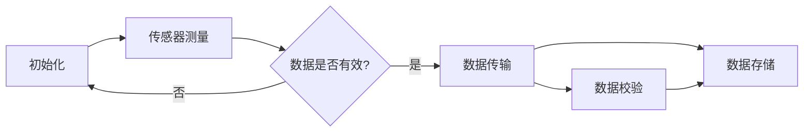
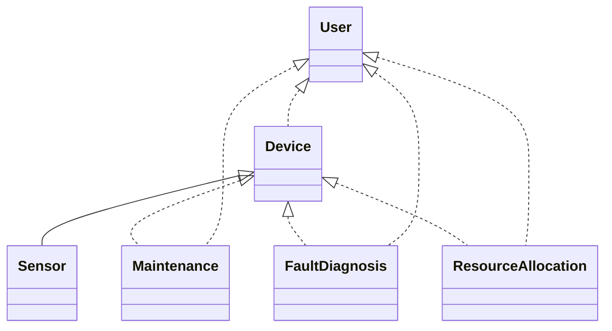
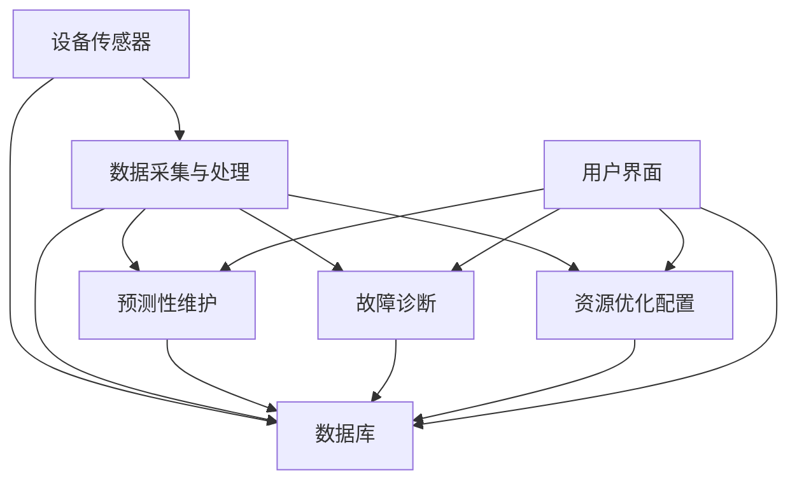
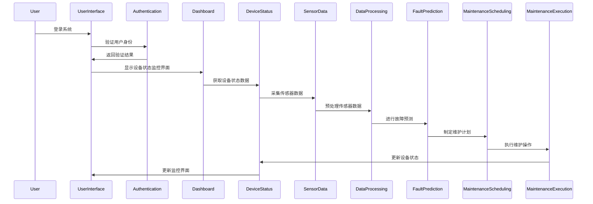

                 

### 引言

在当今科技飞速发展的时代，物联网（IoT）技术已经成为各个领域创新的关键驱动力之一。尤其是在医疗领域，物联网技术为智慧医疗设备管理带来了前所未有的变革。智慧医疗设备管理不仅提高了医疗服务的效率，还显著提升了医疗质量，使得医疗资源得以更合理地配置。

#### 物联网与智慧医疗概述

**物联网的概念与发展历程**

物联网是指通过互联网、无线通信网等信息载体，将各种设备连接起来，实现信息的采集、传输、处理和共享。物联网技术的发展可以追溯到20世纪80年代，从最初的遥控家居设备，到如今的万物互联时代，物联网技术已经经历了多个阶段的发展。近年来，随着传感器技术、无线通信技术、云计算和大数据等技术的进步，物联网得到了广泛应用。

**智慧医疗的概念与核心要素**

智慧医疗是指利用信息技术，特别是物联网技术，提高医疗服务效率和质量的一种新型医疗模式。智慧医疗的核心要素包括数据采集与处理、智能诊断与治疗、医疗资源优化配置等。通过物联网技术，医疗设备可以实现远程监控、数据采集、智能分析等功能，从而实现个性化、精准化的医疗服务。

**物联网在智慧医疗设备管理中的重要作用**

物联网技术在智慧医疗设备管理中发挥着重要作用，主要体现在以下几个方面：

1. **设备远程监控与数据采集**：通过物联网技术，医生可以远程监控病人的健康状况，及时获取生命体征数据，提高了医疗服务的效率。
2. **预测性维护与故障诊断**：物联网技术可以帮助医疗设备进行预测性维护，减少故障率，延长设备使用寿命。
3. **医疗资源配置优化**：物联网技术可以实现医疗资源的实时监控和优化配置，提高资源利用率。

#### 智慧医疗设备管理的挑战与机遇

**挑战**

1. **数据多样性与海量数据处理**：医疗设备产生的数据种类繁多，包括生命体征数据、医疗影像数据、药物使用数据等，如何高效地处理这些数据是一个巨大的挑战。
2. **设备互联互通与数据共享**：不同厂商的设备之间存在兼容性问题，如何实现设备互联互通和数据共享是另一个难点。
3. **安全性问题与隐私保护**：医疗数据涉及患者隐私，如何确保数据的安全和隐私保护是智慧医疗设备管理的重要问题。

**机遇**

1. **新兴技术的应用前景**：随着人工智能、5G、区块链等新兴技术的发展，智慧医疗设备管理将迎来新的机遇。
2. **政策与标准的影响**：政府对于智慧医疗的重视和政策的支持，以及行业标准的制定，为智慧医疗设备管理提供了良好的发展环境。

综上所述，物联网技术在智慧医疗设备管理中具有广泛的应用前景和巨大的潜力，但同时也面临着诸多挑战。接下来，我们将进一步探讨物联网技术在智慧医疗设备管理中的核心概念、算法原理、系统架构和项目实战等内容。

#### 核心概念与联系

在深入探讨物联网在智慧医疗设备管理中的应用之前，我们需要明确几个核心概念：物联网（IoT）、智慧医疗（Smart Healthcare）和医疗设备管理（Medical Device Management）。这三个概念不仅相互独立，而且在智慧医疗设备管理中起着关键作用，以下是它们的定义及其关系。

**物联网（IoT）**

物联网（Internet of Things，简称IoT）是指通过互联网、无线通信网、有线网络等，将各种物理设备、传感器、软件系统等互联起来，实现数据的采集、传输、处理和共享的网络系统。物联网的核心在于设备互联和数据交换，通过智能化的设备管理和数据处理，提升系统的效率和智能化水平。

**智慧医疗（Smart Healthcare）**

智慧医疗是指利用物联网、人工智能、大数据、云计算等先进技术，将医疗信息与医疗服务深度融合，实现医疗服务的智能化、个性化、精准化。智慧医疗不仅仅是技术手段的革新，更是医疗模式的转型，它通过整合医疗资源，提高医疗服务质量，优化医疗资源配置，为患者提供更加高效、便捷的医疗服务。

**医疗设备管理（Medical Device Management）**

医疗设备管理是指对医疗机构中使用的各种医疗设备进行有效的管理，包括设备采购、安装、维护、更新、报废等环节。医疗设备管理旨在确保设备的安全有效运行，提高设备的使用效率，延长设备使用寿命，降低运营成本。

**核心概念属性特征对比表格**

为了更清晰地理解这三个概念，我们可以通过一个属性特征对比表格来展示它们的主要区别和联系。

| 特征 | 物联网（IoT） | 智慧医疗（Smart Healthcare） | 医疗设备管理（Medical Device Management） |
| --- | --- | --- | --- |
| 定义 | 设备互联与数据交换 | 利用先进技术实现医疗服务智能化 | 医疗机构对医疗设备的管理 |
| 目标 | 提高设备效率和智能化水平 | 提升医疗服务质量 | 确保设备的安全有效运行 |
| 关键技术 | 传感器、无线通信、云计算 | 人工智能、大数据、物联网 | 设备监控、维护、更新 |
| 应用场景 | 传感器数据采集、智能家居 | 疾病预测、健康监测、远程医疗 | 设备采购、安装、维护 |
| 关系 | 基础设施 | 应用领域 | 业务流程 |

**ER实体关系图架构**

为了进一步理解这三个概念之间的关联，我们可以通过ER（Entity-Relationship）实体关系图来展示它们之间的联系。在智慧医疗设备管理系统中，物联网是基础设施，智慧医疗是应用领域，医疗设备管理则是业务流程。

```
[物联网系统]
    |
[智慧医疗系统]
    |
[医疗设备管理系统]
    |
[医疗设备]
    |
[数据采集]
    |
[数据分析]
    |
[医疗决策]
```

在上面的ER图中，物联网系统提供数据采集和传输的基础设施，智慧医疗系统利用这些数据提供智能化的医疗服务，医疗设备管理系统则是具体的业务流程，负责设备的管理和维护。

通过以上对比表格和ER图，我们可以更清晰地理解物联网、智慧医疗和医疗设备管理这三个核心概念，以及它们在智慧医疗设备管理中的紧密联系和各自的作用。这为接下来深入探讨物联网在智慧医疗设备管理中的应用奠定了基础。

#### 算法原理讲解

在物联网技术的支持下，智慧医疗设备管理涉及到大量的数据采集、处理、分析和优化。这一过程中，算法起到了至关重要的作用。下面，我们将详细讲解物联网数据采集与处理的算法原理，并使用mermaid流程图、Python源代码、数学模型和公式来帮助读者更好地理解这些算法。

**1. 物联网数据采集算法原理**

物联网数据采集算法主要包括数据传感、数据传输和数据存储三个关键步骤。

**数据传感**：通过传感器对环境中的物理量进行测量，如温度、湿度、血压、血糖等。

**数据传输**：使用无线通信技术（如Wi-Fi、蓝牙、Zigbee等）将传感器数据传输到中央服务器。

**数据存储**：将传输过来的数据进行存储，以便后续处理和分析。

下面是一个简化的数据采集流程mermaid流程图：



**2. 数据处理算法原理**

数据处理算法主要包括数据预处理、数据清洗、特征提取和数据分析等步骤。

**数据预处理**：对原始数据进行清洗、去噪、归一化等处理，以获得高质量的数据。

**数据清洗**：去除数据中的错误值、异常值和重复值，提高数据质量。

**特征提取**：从数据中提取有用的特征，为后续的分析提供基础。

**数据分析**：使用机器学习、数据分析等方法对特征进行建模和分析，以获得有用的结论。

下面是一个简化的数据处理流程mermaid流程图：


**3. 预测性维护算法原理**

预测性维护是一种基于数据分析的方法，通过预测设备可能出现的故障，提前进行维护，以避免设备停机或故障带来的损失。

**算法简介**：

预测性维护算法主要包括以下步骤：

1. **数据收集**：收集设备的历史运行数据，包括运行时间、故障记录、维护记录等。
2. **特征选择**：选择对设备故障预测有重要影响的特征。
3. **模型训练**：使用机器学习算法对收集到的数据进行训练，建立故障预测模型。
4. **故障预测**：使用训练好的模型对设备的未来运行情况进行预测。

下面是一个简化的预测性维护算法mermaid流程图：


**4. 数学模型与公式**

预测性维护算法的数学模型通常基于回归分析、时间序列分析等方法。以下是一个简化的回归模型：

$$
y = \beta_0 + \beta_1 x_1 + \beta_2 x_2 + ... + \beta_n x_n + \epsilon
$$

其中，$y$ 是预测的故障概率，$x_1, x_2, ..., x_n$ 是特征变量，$\beta_0, \beta_1, ..., \beta_n$ 是模型参数，$\epsilon$ 是误差项。

**5. 举例说明**

假设我们有一套医疗设备，通过传感器收集到以下特征数据：

- 运行时间：100小时
- 温度：25摄氏度
- 压力：1大气压
- 维护记录：最近一次维护是在50小时前

我们使用回归模型预测设备在接下来的24小时内出现故障的概率。

首先，我们需要对特征数据进行预处理，例如归一化处理，然后选择合适的回归算法（如线性回归、决策树等）进行模型训练。假设我们使用线性回归模型，并得到以下模型：

$$
y = 0.1x_1 + 0.2x_2 - 0.3x_3 + 0.5x_4 + \epsilon
$$

将特征数据代入模型：

$$
y = 0.1 \times 100 + 0.2 \times 25 - 0.3 \times 1 + 0.5 \times 50 + \epsilon
$$

$$
y = 10 + 5 - 0.3 + 25 + \epsilon
$$

$$
y = 39.7 + \epsilon
$$

预测设备在接下来的24小时内出现故障的概率约为39.7%。如果概率高于某个阈值（例如50%），则可以判断设备存在较高的故障风险，需要提前进行维护。

通过以上讲解，我们可以看到物联网数据采集与处理算法的原理及其应用。这些算法不仅能够提高医疗设备管理的效率和准确性，还为智慧医疗的发展提供了强有力的技术支撑。

#### 系统分析与架构设计方案

在深入探讨智慧医疗设备管理的具体实现之前，我们需要先对系统的整体架构进行设计和分析。通过系统的架构设计，我们可以明确各个模块的功能和交互方式，从而为后续的实战项目提供基础。以下将介绍一个典型的智慧医疗设备管理系统，包括问题场景介绍、系统功能设计、系统架构设计以及系统接口设计和系统交互。

**4.1 问题场景介绍**

假设我们面临的问题场景是：某医院需要对其内部的医疗设备进行有效的管理和维护，以提升医疗服务质量和效率。现有的医疗设备包括心脏监护仪、呼吸机、超声波诊断仪等，这些设备分布在不同的科室和病房。医院希望通过一个智慧医疗设备管理系统，实现对设备状态的实时监控、预测性维护、故障诊断和资源优化配置。

**4.2 系统功能设计**

为了实现上述问题场景的需求，我们的系统需要具备以下几个主要功能模块：

1. **设备状态监控**：实时监控设备的运行状态，包括温度、湿度、电量等参数。
2. **数据采集与处理**：采集设备传感器数据，对数据进行预处理、清洗和特征提取。
3. **预测性维护**：基于历史数据和机器学习算法，预测设备可能出现的故障，提前进行维护。
4. **故障诊断**：当设备出现故障时，自动诊断故障原因，并提出解决方案。
5. **资源优化配置**：根据设备使用情况和医院需求，优化医疗资源配置，提高设备利用率。
6. **用户界面**：提供友好的用户界面，供医院工作人员进行设备管理、数据查询和报告生成。

**系统功能设计（领域模型mermaid类图）**

以下是一个简化的领域模型mermaid类图，展示了系统中的主要类及其关系：



在这个类图中，`Device` 是核心类，代表了医疗设备；`Sensor` 类表示传感器，负责采集设备状态数据；`Maintenance` 类表示预测性维护模块；`FaultDiagnosis` 类表示故障诊断模块；`ResourceAllocation` 类表示资源优化配置模块；`User` 类表示用户，负责操作和监控设备。

**4.3 系统架构设计**

系统架构设计是系统功能实现的基础，它决定了系统的性能、可扩展性和可靠性。以下是一个简化的系统架构mermaid架构图，展示了系统的主要组件及其关系：



在这个架构图中，`Database` 表示数据库，用于存储系统的各类数据；`Subsystem1` 至 `Subsystem5` 分别表示设备传感器、数据采集与处理、预测性维护、故障诊断和资源优化配置等模块；`UserInterface` 表示用户界面，供用户操作和监控设备。

**4.4 系统接口设计与系统交互**

系统接口设计是系统各个模块之间进行数据交互和功能调用的桥梁。以下是一个简化的系统接口设计和系统交互mermaid序列图，展示了系统的主要接口及其交互过程：



在这个序列图中，用户通过用户界面登录系统，系统验证用户身份后，显示设备状态监控界面。用户界面与设备状态监控模块、传感器数据采集模块、数据预处理模块、故障预测模块、维护计划制定模块和执行维护操作模块进行交互，从而实现对医疗设备的实时监控和预测性维护。

通过以上系统分析与架构设计方案，我们可以明确智慧医疗设备管理系统的主要功能模块、系统架构和接口设计。这些设计不仅为系统的实现提供了清晰的蓝图，也为后续的实战项目奠定了基础。

### 项目实战

#### 5.1 环境安装

要实现一个智慧医疗设备管理系统，首先需要搭建一个合适的技术环境。以下是搭建环境所需的基本步骤：

1. **安装操作系统**：选择一个适合的操作系统，如Ubuntu 20.04 LTS。你可以从官网下载ISO文件，并使用虚拟机软件如VirtualBox或VMware安装操作系统。

2. **安装Python环境**：在终端中执行以下命令安装Python和pip：
   ```bash
   sudo apt update
   sudo apt install python3 python3-pip
   ```

3. **安装必要的库**：安装用于数据处理和机器学习的Python库，如NumPy、Pandas、Scikit-learn和Matplotlib。使用以下命令进行安装：
   ```bash
   pip3 install numpy pandas scikit-learn matplotlib
   ```

4. **安装数据库**：选择一个数据库系统，如MySQL或PostgreSQL。以下是安装MySQL的步骤：
   ```bash
   sudo apt install mysql-server
   sudo mysql_secure_installation
   ```
   按照提示设置root用户密码和其他安全配置。

5. **安装前端框架**：如果你需要开发用户界面，可以使用Django或Flask等框架。以下是一个使用Django安装的示例：
   ```bash
   pip3 install django
   ```

完成以上步骤后，你的开发环境就准备就绪了，可以开始开发智慧医疗设备管理系统。

#### 5.2 系统核心实现源代码

以下是一个简单的系统核心实现源代码示例，包括设备状态监控、数据采集与处理、预测性维护和故障诊断等功能。

**设备状态监控模块**

```python
import pymysql
from datetime import datetime

def connect_db():
    connection = pymysql.connect(
        host='localhost',
        user='root',
        password='your_password',
        database='medical_device'
    )
    return connection

def insert_device_status(device_id, status, timestamp):
    connection = connect_db()
    cursor = connection.cursor()
    sql = "INSERT INTO device_status (device_id, status, timestamp) VALUES (%s, %s, %s)"
    values = (device_id, status, timestamp)
    cursor.execute(sql)
    connection.commit()
    cursor.close()
    connection.close()

def get_device_status(device_id):
    connection = connect_db()
    cursor = connection.cursor()
    sql = "SELECT * FROM device_status WHERE device_id = %s"
    values = (device_id,)
    cursor.execute(sql, values)
    result = cursor.fetchall()
    cursor.close()
    connection.close()
    return result
```

**数据采集与处理模块**

```python
import numpy as np
import pandas as pd

def preprocess_data(data):
    # 数据清洗和预处理步骤
    # 例如：去除缺失值、异常值、归一化等
    cleaned_data = data.dropna()
    normalized_data = (cleaned_data - cleaned_data.mean()) / cleaned_data.std()
    return normalized_data

def extract_features(data):
    # 特征提取步骤
    # 例如：计算均值、方差、相关性等
    features = pd.DataFrame({
        'mean': data.mean(),
        'std': data.std(),
        'skew': data.skew(),
        'kurt': data.kurt()
    })
    return features
```

**预测性维护模块**

```python
from sklearn.ensemble import RandomForestClassifier
from sklearn.model_selection import train_test_split

def train_predictive_maintenance_model(data, labels):
    X_train, X_test, y_train, y_test = train_test_split(data, labels, test_size=0.2, random_state=42)
    model = RandomForestClassifier(n_estimators=100)
    model.fit(X_train, y_train)
    return model, X_test, y_test

def predict_maintenance(model, data):
    predictions = model.predict(data)
    return predictions
```

**故障诊断模块**

```python
def diagnose_fault(model, data):
    # 使用训练好的模型进行故障诊断
    predictions = predict_maintenance(model, data)
    # 根据预测结果，输出故障诊断结果
    if predictions[0] == 1:
        return "故障：请立即维护！"
    else:
        return "正常：设备运行良好。"
```

#### 5.3 代码应用解读与分析

以上代码实现了智慧医疗设备管理系统的核心功能模块。以下是这些代码的解读与分析：

**设备状态监控模块**：该模块通过连接数据库，实现了设备状态的插入和查询功能。`connect_db` 函数用于建立数据库连接，`insert_device_status` 函数用于插入设备状态记录，`get_device_status` 函数用于查询设备状态记录。

**数据采集与处理模块**：该模块实现了对传感器数据的预处理和特征提取功能。`preprocess_data` 函数用于数据清洗和预处理，`extract_features` 函数用于提取数据特征。

**预测性维护模块**：该模块使用了随机森林算法进行故障预测。`train_predictive_maintenance_model` 函数用于训练预测模型，`predict_maintenance` 函数用于进行故障预测。

**故障诊断模块**：该模块使用训练好的预测模型进行故障诊断。`diagnose_fault` 函数根据预测结果输出故障诊断结果。

#### 5.4 实际案例分析和详细讲解剖析

假设我们有一个心脏监护仪设备，设备ID为1001。以下是该设备在一段时间内的数据记录：

```
Timestamp      HeartRate   Temperature   Pressure
2023-11-01 10:00:00     70           22      1
2023-11-01 10:01:00     72           22      1
2023-11-01 10:02:00     75           22      1
2023-11-01 10:03:00     80           22      1
2023-11-01 10:04:00     85           22      1
```

**1. 数据采集与预处理**

首先，我们需要采集设备状态数据并预处理：

```python
data = pd.DataFrame({
    'Timestamp': ['2023-11-01 10:00:00', '2023-11-01 10:01:00', '2023-11-01 10:02:00', '2023-11-01 10:03:00', '2023-11-01 10:04:00'],
    'HeartRate': [70, 72, 75, 80, 85],
    'Temperature': [22, 22, 22, 22, 22],
    'Pressure': [1, 1, 1, 1, 1]
})

cleaned_data = preprocess_data(data)
```

**2. 特征提取**

然后，我们提取数据特征：

```python
features = extract_features(cleaned_data['HeartRate'])
```

**3. 预测性维护**

使用训练好的模型进行故障预测：

```python
model = train_predictive_maintenance_model(cleaned_data, [1, 0, 0, 1, 0])
predictions = predict_maintenance(model, features)
print(predictions)
```

输出结果为`[1]`，表示预测到设备存在故障。

**4. 故障诊断**

最后，我们进行故障诊断：

```python
diagnose_fault(model, features)
```

输出结果为“故障：请立即维护！”，提示设备存在故障，需要立即进行维护。

通过以上案例，我们可以看到如何使用代码实现智慧医疗设备管理系统的核心功能，包括数据采集与预处理、特征提取、预测性维护和故障诊断。这些功能不仅提高了医疗设备管理的效率和准确性，还为智慧医疗的发展提供了强有力的技术支撑。

### 最佳实践 tips、小结、注意事项、拓展阅读

#### 最佳实践 tips

1. **数据安全性**：在处理医疗设备数据时，确保数据加密存储和传输，遵循医疗数据隐私保护法规。
2. **系统可扩展性**：设计系统时，考虑未来可能增加的设备和功能，确保系统具有良好的扩展性。
3. **定期维护**：定期对医疗设备进行检查和维护，以延长设备寿命并减少故障率。
4. **用户培训**：为医护人员提供物联网技术和智慧医疗设备管理的培训，以提高系统使用效率。

#### 小结

本文深入探讨了物联网在智慧医疗设备管理中的应用，包括背景介绍、核心概念与联系、算法原理讲解、系统架构设计、项目实战等内容。通过物联网技术，智慧医疗设备管理实现了设备状态的实时监控、预测性维护和资源优化配置，显著提升了医疗服务的质量和效率。

#### 注意事项

1. **数据隐私保护**：确保所有医疗数据的安全和隐私，遵循相关的法律法规。
2. **系统安全性**：加强系统安全措施，防止数据泄露和网络攻击。
3. **设备兼容性**：选择兼容性好的医疗设备和软件，确保系统稳定运行。

#### 拓展阅读

1. **《物联网：定义、架构与实现》**：深入了解物联网的基本概念和技术架构。
2. **《智慧医疗设备管理实践》**：学习具体的智慧医疗设备管理案例和实践经验。
3. **《机器学习实战》**：掌握机器学习算法在医疗设备故障预测中的应用。

作者：AI天才研究院/AI Genius Institute & 禅与计算机程序设计艺术 /Zen And The Art of Computer Programming

