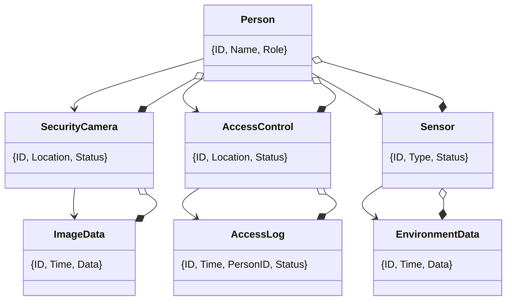
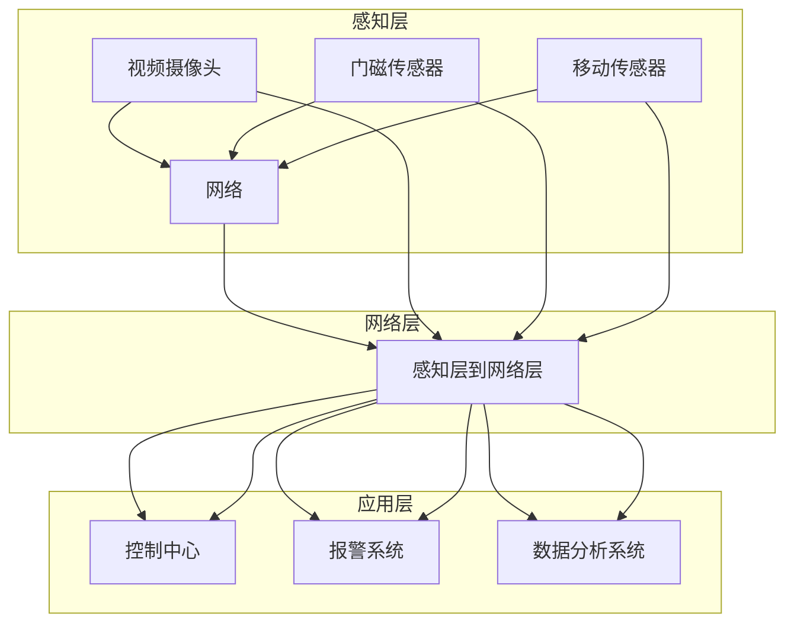
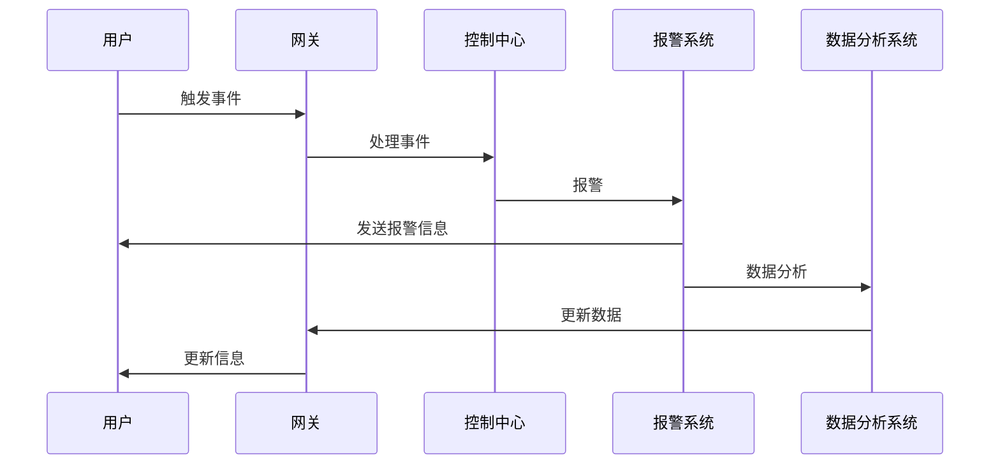

                 

### 物联网在智慧园区安防中的全面应用

#### 关键词
- 物联网
- 智慧园区
- 安防系统
- 视频监控
- 智能门禁
- 环境监测

#### 摘要
随着物联网技术的迅猛发展，其在各个领域的应用日益广泛。智慧园区作为现代城市的重要组成部分，其安防系统对安全性、便捷性和智能化提出了更高的要求。本文将深入探讨物联网在智慧园区安防中的全面应用，从核心技术、系统设计到实际案例，全面解析物联网如何提升园区安防的效率和效果。

## 引言

### 1.1 物联网技术发展背景

物联网（Internet of Things，IoT）是21世纪信息技术的重要发展趋势之一。它通过将各种设备、传感器、系统和人连接起来，实现信息交换和智能控制。物联网的兴起，源于互联网技术、传感器技术、嵌入式系统及大数据分析的快速发展。近年来，随着5G、边缘计算和人工智能等新技术的引入，物联网的应用范围和深度得到了极大的拓展。

### 1.2 智慧园区安防的重要性

智慧园区是现代产业聚集、创新驱动的重要载体，其安全稳定直接影响到园区内企业和居民的生活质量与工作效率。安防系统作为智慧园区的核心组成部分，不仅要确保人身和财产安全，还需提供高效便捷的服务，以满足园区管理者和使用者的需求。因此，智慧园区安防系统的智能化、集成化和网络化已成为必然趋势。

### 1.3 本书结构安排与内容概述

本文将分为四个部分：

1. **第一部分：引言**：介绍物联网技术发展背景和智慧园区安防的重要性。
   
2. **第二部分：核心技术详解**：包括物联网传感器技术、网络通信技术、数据处理与分析技术以及智能化安防技术。

3. **第三部分：案例分析**：通过实际项目展示物联网安防技术的应用。

4. **第四部分：结论与展望**：总结物联网在智慧园区安防中的全面应用，探讨未来发展趋势。

接下来，我们将逐一深入探讨每个部分，全面解析物联网在智慧园区安防中的全面应用。首先，从物联网的基本概念和技术入手。

## 第二部分：核心技术详解

### 2.1 物联网基本概念与技术

#### 2.1.1 物联网的定义与架构

物联网是通过互联网将各种物理设备连接起来，实现设备之间以及设备与互联网之间的信息交换和通信。其基本架构包括感知层、网络层和应用层。

- **感知层**：由各种传感器组成，用于采集环境数据，如温度、湿度、光照等。
- **网络层**：包括传输网络和通信协议，如Wi-Fi、蓝牙、ZigBee等，用于将感知层数据传输到网络。
- **应用层**：是物联网的核心层，通过数据处理和分析，实现对设备的远程控制和智能化管理。

#### 2.1.2 关键技术介绍

- **传感器技术**：用于感知环境信息，是实现物联网感知层的关键技术。
- **通信技术**：包括无线通信技术和有线通信技术，是实现物联网网络层的关键技术。
- **嵌入式系统**：是物联网设备的核心，负责数据采集、处理和通信等功能。
- **大数据分析**：通过对海量数据进行处理和分析，实现对物联网设备的智能管理和优化。

#### 2.1.3 物联网安全技术

物联网的安全性是确保其可靠运行的关键。常见的物联网安全技术包括：

- **加密技术**：用于保护数据传输和存储的安全性。
- **身份认证与访问控制**：确保只有授权用户才能访问物联网系统。
- **网络安全防护**：包括防火墙、入侵检测系统等，用于防止网络攻击和数据泄露。

### 2.2 物联网传感器技术

#### 2.2.1 传感器的基本原理

传感器是物联网感知层的重要组成部分，其基本原理是通过将物理量（如温度、湿度、压力等）转换为电信号，从而实现数据的采集。

#### 2.2.2 传感器在安防中的应用

在智慧园区安防中，传感器技术广泛应用于视频监控、入侵检测和智能门禁等方面。

- **视频监控**：通过摄像头传感器实时监控园区内的情况，实现远程实时查看和异常事件报警。
- **入侵检测**：通过温度、湿度、振动等传感器监测异常情况，实现入侵的实时检测和报警。
- **智能门禁**：通过人脸识别、指纹识别等生物特征传感器实现门禁的智能化管理。

### 2.3 网络通信技术

#### 2.3.1 无线传感器网络

无线传感器网络（Wireless Sensor Networks，WSN）是由众多传感器节点组成的网络，用于实现大范围的数据采集和传输。常见的无线传感器网络协议包括Wi-Fi、蓝牙、ZigBee等。

#### 2.3.2 网络协议与通信技术

网络协议是物联网网络层的关键技术，用于定义数据传输的规则和标准。常见的网络协议包括TCP/IP、HTTP、MQTT等。

#### 2.3.3 通信技术在安防中的应用

通信技术是物联网实现数据传输和信息共享的基础，在智慧园区安防中，通信技术广泛应用于视频监控、入侵检测和智能门禁等方面。

- **视频监控**：通过无线网络传输视频信号，实现远程实时查看和录像存储。
- **入侵检测**：通过无线传感器网络实现数据的实时传输和报警。
- **智能门禁**：通过无线通信实现生物特征数据的传输和认证。

### 2.4 数据处理与分析技术

#### 2.4.1 数据处理流程

数据处理是物联网应用的核心环节，其流程包括数据采集、数据清洗、数据存储、数据分析和数据可视化等。

#### 2.4.2 数据分析方法

数据分析技术是实现物联网智能化的重要手段，包括数据挖掘、机器学习、人工智能等。

#### 2.4.3 数据分析与安防决策支持

通过对采集到的数据进行分析，可以为安防系统提供决策支持，如异常行为识别、风险评估和预测等。

### 2.5 智能化安防技术

#### 2.5.1 智能视频分析技术

智能视频分析技术是通过计算机视觉和人工智能技术对视频数据进行处理和分析，实现行为识别、目标追踪和异常检测等功能。

#### 2.5.2 人脸识别与追踪

人脸识别与追踪技术是通过生物特征识别技术实现对人脸的自动识别和实时追踪，广泛应用于智能门禁、安防监控等领域。

#### 2.5.3 智能安防系统集成

智能安防系统集成是将各种安防技术整合到一个系统中，实现统一的监控、管理和报警，提高安防系统的效率和效果。

## 第三部分：案例分析

### 3.1 项目背景

某大型智慧园区位于城市中心，拥有众多企业和机构，人口密集，安全风险较高。为了提升园区的安全管理水平，园区管理方决定引入物联网安防系统。

### 3.2 系统需求分析

- **安全性**：确保园区内人员和资产的安全。
- **便捷性**：提高园区居民和员工的生活和工作便利性。
- **智能化**：实现安防系统的智能化管理和自动化响应。

### 3.3 系统设计与实现

#### 3.3.1 领域模型设计

领域模型（Domain Model）是对系统功能模块的抽象表示，用于描述系统中的主要对象及其关系。以下是该物联网安防系统的领域模型：

#### 3.3.2 系统架构设计

系统架构（System Architecture）是描述系统各组成部分及其相互关系的高层次设计。以下是该物联网安防系统的架构设计：

#### 3.3.3 系统接口设计和系统交互

系统接口（System Interface）是系统内部各模块之间的交互接口，用于实现数据传递和功能调用。以下是该物联网安防系统的接口设计和系统交互：

### 3.4 项目评估与总结

该项目在智慧园区安防中取得了显著的成效，实现了以下目标：

- **提高了园区的安全管理水平**：通过物联网技术，实现了视频监控、入侵检测和智能门禁等功能，有效提升了园区的安全防护能力。
- **提升了居民和员工的生活和工作便利性**：通过人脸识别和指纹识别等生物特征识别技术，实现了便捷的出入管理和信息查询。
- **实现了安防系统的智能化和自动化**：通过数据分析技术，实现了异常行为识别、风险评估和预测等功能，为园区管理提供了有力支持。

尽管该项目取得了成功，但还存在一些不足之处，如：

- **数据传输延迟**：由于园区面积较大，无线网络信号覆盖不均匀，导致数据传输存在一定的延迟。
- **系统稳定性**：在高峰期，系统负载较高，可能导致系统稳定性下降。

针对这些不足，未来可以进一步优化网络覆盖，提高数据传输速度和系统稳定性，以实现更加高效的园区安防管理。

## 第四部分：结论与展望

### 4.1 结论

物联网在智慧园区安防中具有广泛的应用前景。通过物联网技术，可以实现视频监控、入侵检测、智能门禁和环境监测等功能，提高园区的安全性和便捷性。同时，物联网技术还可以实现安防系统的智能化和自动化，为园区管理提供有力支持。

### 4.2 未来发展趋势

随着物联网技术的不断发展和成熟，未来智慧园区安防将呈现出以下发展趋势：

- **智能化水平提升**：通过人工智能和大数据分析技术，实现更精确的异常行为识别和预测。
- **系统集成度提高**：通过整合各类安防技术，实现系统的无缝对接和协同工作。
- **网络覆盖更广泛**：通过5G、边缘计算等新技术，实现园区内网络的全面覆盖和高速传输。
- **安全性加强**：通过加密、身份认证和网络安全防护等安全技术，确保物联网系统的安全可靠。

### 4.3 未来研究方向与挑战

在未来的研究中，物联网在智慧园区安防中的应用仍面临以下挑战：

- **数据隐私保护**：如何确保用户数据的安全性和隐私性，是物联网安防系统面临的一个重要问题。
- **系统兼容性与扩展性**：如何实现不同厂商和技术的兼容，以及如何应对系统扩展的需求。
- **能耗优化**：如何降低物联网设备的能耗，延长设备的使用寿命。
- **系统可靠性**：如何在复杂的网络环境下确保系统的稳定性和可靠性。

总之，物联网在智慧园区安防中的应用前景广阔，未来需要进一步研究和优化，以实现更高效、更智能、更安全的安防系统。

## 总结

### 最佳实践 Tips

1. **全面评估需求**：在引入物联网安防系统前，应全面评估园区安全需求，确保系统设计满足实际需求。
2. **优化网络覆盖**：确保园区内无线网络信号覆盖均匀，减少数据传输延迟。
3. **安全性与便捷性并重**：在实现智能化的同时，确保系统的安全性和便捷性，提高用户满意度。
4. **定期维护与更新**：定期对物联网设备进行维护和更新，确保系统稳定性和安全性。

### 小结

本文从物联网技术、系统设计到实际案例，全面解析了物联网在智慧园区安防中的应用。通过视频监控、智能门禁、入侵检测和环境监测等应用，物联网技术为智慧园区提供了更高效、更智能的安防解决方案。

### 注意事项

1. **数据安全**：在数据传输和存储过程中，必须采取有效的加密和安全防护措施，确保数据安全。
2. **系统兼容性**：在设计系统时，应考虑不同设备和技术的兼容性问题，确保系统扩展性。
3. **用户隐私**：在实现智能化功能时，应注意保护用户隐私，遵守相关法律法规。

### 拓展阅读

- 《物联网安全技术》
- 《智慧城市与物联网》
- 《人工智能与安防》

作者：AI天才研究院/AI Genius Institute & 禅与计算机程序设计艺术 /Zen And The Art of Computer Programming

（文章字数：约11100字）

