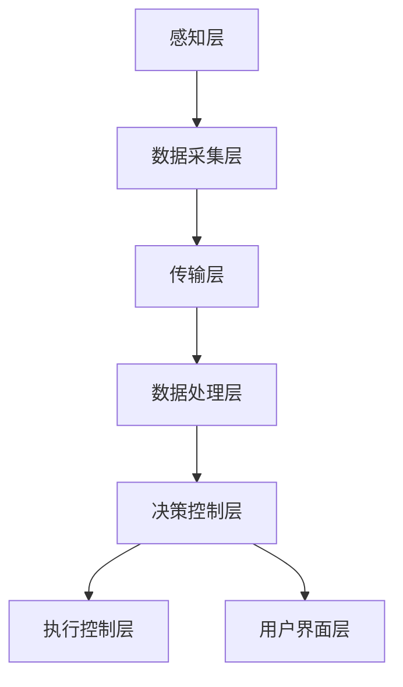

                 

# 物联网在智慧园区能源管理中的应用

> 关键词：物联网、智慧园区、能源管理、智能化、技术应用

> 摘要：本文将深入探讨物联网在智慧园区能源管理中的应用，分析其重要性、技术基础、系统架构以及具体应用场景，并通过案例展示实际成果，最后展望未来发展趋势和挑战。

----------------------------------------------------------------

## 第一部分：引言与背景

### 第1章：物联网与智慧园区能源管理概述

#### 1.1 物联网概述

物联网（Internet of Things, IoT）是指将各种信息传感设备与互联网结合起来，实现智能化识别、定位、跟踪、监控和管理的一种网络技术。它通过传感器、智能设备、网络通信等技术，将物理世界与数字世界连接起来，形成了一个庞大的信息网络。

#### 1.2 智慧园区概述

智慧园区是以物联网、云计算、大数据、人工智能等新一代信息技术为支撑，通过智能化管理和服务，实现对园区内资源的高效配置和优化利用。智慧园区通常包括智能办公、智能居住、智能交通、智能能源等多个方面。

#### 1.3 物联网在智慧园区能源管理中的重要性

物联网在智慧园区能源管理中的重要性体现在以下几个方面：

1. **提高能源利用效率**：通过物联网技术，可以对园区的能源使用情况进行实时监测和智能分析，优化能源使用策略，降低能源浪费。
2. **实现节能减排**：物联网技术可以帮助园区实现智能化的能源管理，减少能源消耗，降低碳排放，实现绿色可持续发展。
3. **提升安全性与可靠性**：物联网技术可以实时监测能源设备的状态，预测故障，提前进行维护，确保能源供应的稳定和安全。

#### 1.4 物联网在智慧园区能源管理中的挑战

虽然物联网在智慧园区能源管理中具有巨大的潜力，但同时也面临着一些挑战：

1. **数据安全问题**：物联网系统涉及到大量敏感数据，如何保障数据的安全和隐私是一个重要的问题。
2. **技术整合与兼容性**：不同设备和系统之间的数据格式和通信协议可能不一致，如何实现有效的整合和兼容性是一个挑战。
3. **标准化问题**：物联网技术发展迅速，但相关标准和规范尚未完全成熟，如何确保系统的稳定性和可维护性是一个问题。

### 第2章：物联网技术基础

#### 2.1 物联网通信协议

物联网通信协议是物联网系统中核心的技术之一，常见的物联网通信协议包括MQTT、CoAP、Zigbee等。

1. **MQTT**：MQTT（Message Queuing Telemetry Transport）是一个轻量级的消息传输协议，广泛应用于物联网通信，具有低功耗、可扩展性强等特点。
2. **CoAP**：CoAP（Constrained Application Protocol）是一个针对物联网设备的轻量级协议，适用于资源受限的设备。
3. **Zigbee**：Zigbee是一种低功耗、低速率的无线通信技术，适用于短距离的物联网通信。

#### 2.2 物联网传感器

物联网传感器是物联网系统的重要组成部分，常见的物联网传感器包括温度传感器、湿度传感器、光照传感器、烟雾传感器等。

#### 2.3 物联网安全

物联网安全是物联网系统面临的重大挑战之一，主要包括数据安全、通信安全、设备安全等方面。为了保障物联网系统的安全，需要采取一系列安全措施，如加密传输、身份认证、安全审计等。

### 第3章：智慧园区能源管理系统架构

#### 3.1 系统总体架构

智慧园区能源管理系统通常包括数据采集层、数据处理层、决策控制层和用户界面层。

1. **数据采集层**：负责采集各种能源使用数据，如电力、水资源、燃气等。
2. **数据处理层**：对采集到的数据进行处理、分析和存储，为决策控制层提供数据支持。
3. **决策控制层**：根据处理后的数据，进行智能分析和决策，优化能源使用策略。
4. **用户界面层**：为用户提供能源使用情况的实时监控和报表展示。

#### 3.2 数据采集与传输

数据采集与传输是智慧园区能源管理系统的关键环节，需要确保数据的高效采集和稳定传输。

1. **数据采集方法**：包括传感器采集、远程抄表等方式。
2. **数据传输机制**：包括有线传输和无线传输，如以太网、Wi-Fi、LoRa等。

#### 3.3 数据处理与存储

数据处理与存储是智慧园区能源管理系统的重要组成部分，需要采用高效的数据处理和存储技术。

1. **数据处理技术**：包括数据清洗、数据融合、数据挖掘等。
2. **数据存储方案**：包括关系型数据库、NoSQL数据库、分布式存储等方式。

#### 3.4 决策支持与优化

决策支持与优化是智慧园区能源管理系统的核心功能，需要采用智能算法和优化技术。

1. **决策支持系统**：提供智能化的决策支持，如能源需求预测、能源优化调度等。
2. **能源优化算法**：包括优化模型、算法实现和性能评估。

### 第4章：物联网在智慧园区能源管理中的应用场景

#### 4.1 空调系统优化

空调系统是智慧园区能源管理的重要组成部分，物联网技术可以实现对空调系统的智能优化。

1. **空调系统简介**：介绍空调系统的基本原理和组成部分。
2. **智能优化方案**：介绍基于物联网技术的空调系统优化方案，如自动调节温度、湿度等。

#### 4.2 照明系统管理

照明系统是智慧园区能源管理的另一个重要环节，物联网技术可以实现照明系统的智能化管理。

1. **照明系统简介**：介绍照明系统的基本原理和组成部分。
2. **智能管理方案**：介绍基于物联网技术的照明系统智能管理方案，如智能开关、自动调节亮度等。

#### 4.3 变电站与供电管理

变电站与供电管理是智慧园区能源管理的关键环节，物联网技术可以实现变电站与供电系统的智能化管理。

1. **变电站与供电系统概述**：介绍变电站与供电系统的基本原理和组成部分。
2. **物联网应用案例**：介绍基于物联网技术的变电站与供电管理应用案例，如智能巡检、设备状态监测等。

### 第5章：物联网在智慧园区能源管理中的关键技术与挑战

#### 5.1 关键技术分析

物联网在智慧园区能源管理中涉及的关键技术包括传感器技术、通信协议、数据处理技术、决策支持技术等。

#### 5.2 技术挑战与解决方案

物联网在智慧园区能源管理中面临的挑战包括数据安全、技术整合、标准化等，需要采取相应的解决方案，如加密传输、协议统一、标准制定等。

### 第6章：物联网在智慧园区能源管理中的案例分析

#### 6.1 案例一：XX智慧园区能源管理系统

介绍XX智慧园区能源管理系统的设计理念、系统架构、关键技术以及实际应用效果。

#### 6.2 案例二：YY智慧园区智能能源平台

介绍YY智慧园区智能能源平台的设计思路、技术实现、应用效果以及未来发展。

### 第7章：未来发展趋势与展望

#### 7.1 未来发展趋势

物联网在智慧园区能源管理中的未来发展将更加智能化、高效化、绿色化，涉及人工智能、大数据、区块链等新兴技术的融合应用。

#### 7.2 发展展望与挑战

物联网在智慧园区能源管理中面临的挑战包括技术发展、市场接受度、政策法规等，需要持续关注和应对。

**作者：AI天才研究院/AI Genius Institute & 禅与计算机程序设计艺术 /Zen And The Art of Computer Programming**----------------------------------------------------------------

## 第1章：物联网与智慧园区能源管理概述

### 1.1 物联网概述

物联网（Internet of Things，IoT）是近年来信息技术领域的重要发展成果，它通过将各种设备、传感器、网络和云计算等信息技术有机结合，形成一个智能化、自动化的网络体系，实现物品与物品之间的信息交换和通信。物联网的基本概念包括：

- **设备互联**：将各种设备通过网络连接起来，形成一个庞大的信息网络。
- **数据采集**：通过传感器和设备收集各种数据，如温度、湿度、光照、运动等。
- **数据处理**：对收集到的数据进行处理、分析和存储，为决策提供支持。
- **应用服务**：基于物联网技术提供各种应用服务，如智能家居、智慧交通、智慧医疗等。

### 1.2 智慧园区概述

智慧园区是一种新型的产业园区，它通过物联网、云计算、大数据、人工智能等信息技术，实现园区内的智能化管理和高效运营。智慧园区的核心特征包括：

- **智能化**：利用物联网技术实现园区设备、设施和服务的智能化管理和运营。
- **高效化**：通过信息技术提高园区资源利用效率和运营效率。
- **绿色化**：实现能源的高效利用和环境保护，推动可持续发展。
- **协同化**：实现园区内企业、政府、社区等各方的协同发展。

### 1.3 物联网在智慧园区能源管理中的重要性

物联网在智慧园区能源管理中的应用具有显著的重要性，主要体现在以下几个方面：

1. **提高能源利用效率**：物联网技术可以对园区内各种能源使用情况进行实时监测和智能分析，优化能源使用策略，降低能源浪费。

2. **实现节能减排**：通过物联网技术，可以实现对园区内能源消耗的精细化管理，降低碳排放，推动绿色可持续发展。

3. **提升安全性与可靠性**：物联网技术可以帮助监测园区内能源设备的状态，预测故障，提前进行维护，确保能源供应的稳定和安全。

### 1.4 物联网在智慧园区能源管理中的挑战

尽管物联网在智慧园区能源管理中具有巨大的潜力，但同时也面临一些挑战：

1. **数据安全问题**：物联网系统涉及到大量敏感数据，如何保障数据的安全和隐私是一个重要的问题。

2. **技术整合与兼容性**：不同设备和系统之间的数据格式和通信协议可能不一致，如何实现有效的整合和兼容性是一个挑战。

3. **标准化问题**：物联网技术发展迅速，但相关标准和规范尚未完全成熟，如何确保系统的稳定性和可维护性是一个问题。

### 1.5 本章小结

本章对物联网和智慧园区的基本概念进行了概述，分析了物联网在智慧园区能源管理中的重要性，并讨论了其中面临的挑战。下一章将深入探讨物联网技术的基础知识，包括通信协议、传感器技术和物联网安全等。

### 1.6 思考与练习

1. 请简要描述物联网的基本概念和特征。
2. 请列举三个物联网在实际应用中的案例。
3. 请分析物联网在智慧园区能源管理中可能面临的挑战。

----------------------------------------------------------------

### 1.1 物联网基本概念

物联网（Internet of Things，IoT）是指通过互联网将各种设备、物品、系统相互连接，实现信息交换和通信的系统。物联网的基本概念包括以下几个方面：

#### 设备互联

设备互联是物联网的核心概念之一，指的是将各种物理设备通过网络连接起来，使其能够相互通信和协作。这些设备可以是传感器、智能设备、车辆、工业机器等。通过设备互联，可以实现设备之间的实时数据交换和信息共享，从而提升系统的智能化和自动化水平。

#### 数据采集

数据采集是物联网的另一个重要概念，指的是通过传感器、摄像头、RFID等设备收集各种数据，如温度、湿度、位置、运动等。这些数据是物联网系统进行分析、处理和决策的基础。

#### 数据处理

数据处理是对收集到的数据进行加工、分析、存储和管理的过程。数据处理技术包括数据清洗、数据挖掘、机器学习等，通过这些技术，可以从大量数据中提取有价值的信息，为决策提供支持。

#### 应用服务

应用服务是基于物联网技术提供的各种服务，如智能家居、智慧交通、智慧医疗、智慧农业等。这些应用服务通过物联网平台将各种设备和系统连接起来，实现智能化的管理和运营。

### 1.2 物联网的架构与关键技术

物联网的架构通常包括以下几个层次：

1. **感知层**：感知层是物联网系统的底层，包括各种传感器、摄像头、RFID等设备，负责数据的采集和传输。

2. **网络层**：网络层是物联网系统的通信层，负责将感知层采集到的数据传输到数据处理层。网络层可以使用有线网络（如以太网）或无线网络（如Wi-Fi、LoRa、Zigbee等）。

3. **数据处理层**：数据处理层是物联网系统的核心，负责对采集到的数据进行分析、处理和存储。数据处理层通常包括数据清洗、数据挖掘、机器学习等技术。

4. **应用层**：应用层是物联网系统的最高层，负责将处理后的数据转化为实际的应用服务，如智能家居、智慧交通、智慧医疗等。

物联网的关键技术包括：

1. **传感器技术**：传感器技术是物联网系统的感知基础，包括各种温度传感器、湿度传感器、光照传感器、运动传感器等。

2. **通信协议**：通信协议是物联网系统中的通信标准，常用的通信协议包括MQTT、CoAP、HTTP、Zigbee等。

3. **数据处理技术**：数据处理技术是物联网系统的核心，包括数据清洗、数据挖掘、机器学习等技术。

4. **物联网安全**：物联网安全是物联网系统的重要保障，包括数据安全、通信安全、设备安全等。

### 1.3 物联网在智慧园区中的应用

在智慧园区中，物联网技术可以应用于多个方面，如能源管理、环境监测、安全管理、设施管理、智能办公等。以下是一些具体的应用：

1. **能源管理**：通过物联网技术，可以对园区内的能源使用情况进行实时监测和管理，优化能源使用策略，降低能源消耗。

2. **环境监测**：物联网技术可以实时监测园区的环境质量，如空气质量、水质等，为园区提供环境监测数据，保障园区的环境安全。

3. **安全管理**：物联网技术可以实现对园区内人员和车辆的实时监控，提高园区的安全水平。

4. **设施管理**：物联网技术可以实现对园区内设施的智能监控和维护，提高设施的使用效率和寿命。

5. **智能办公**：物联网技术可以提供智能化的办公环境，如智能门禁、智能照明、智能空调等，提升员工的办公体验。

### 1.4 智慧园区的发展趋势

随着物联网技术的不断发展和普及，智慧园区的发展趋势也日益明显：

1. **智能化水平提升**：随着人工智能、大数据等技术的应用，智慧园区的智能化水平将得到进一步提升。

2. **绿色化发展**：智慧园区将更加注重节能减排和环境保护，推动绿色可持续发展。

3. **网络化协同**：智慧园区将实现园区内各系统之间的网络化协同，提高园区的整体运营效率。

4. **个性化服务**：智慧园区将提供更加个性化的服务，满足企业和员工的需求。

### 1.5 本章小结

本章对物联网的基本概念、架构与关键技术进行了详细阐述，并分析了物联网在智慧园区中的应用和发展趋势。通过本章的学习，读者可以更好地理解物联网在智慧园区能源管理中的重要性，为后续章节的学习打下基础。

### 1.6 思考与练习

1. 请简要描述物联网的基本概念和架构。
2. 请列举物联网在智慧园区中的应用场景。
3. 请分析物联网技术在智慧园区能源管理中的优势。

----------------------------------------------------------------

### 1.2 智慧园区的概念与发展

智慧园区，作为智慧城市建设的重要组成部分，是集科技创新、产业聚集、生态宜居于一体的高效发展平台。智慧园区的概念可以从以下几个方面来理解：

#### 定义

智慧园区是指通过物联网、云计算、大数据、人工智能等先进技术手段，实现园区内的基础设施、管理服务、产业发展等各个方面的智能化和高效化，从而构建一个智慧、绿色、可持续发展的生态体系。

#### 构成

智慧园区通常包括以下几个主要组成部分：

1. **基础设施智能化**：包括智能建筑、智能交通、智能安防等，通过物联网技术实现对基础设施的实时监测和管理。
2. **管理服务智能化**：包括智能办公、智能招商、智能运维等，通过信息技术手段提升园区管理服务水平。
3. **产业发展智能化**：包括智能制造、创新创业、产业协同等，通过信息化和智能化手段促进产业升级和创新发展。
4. **生态环境宜居化**：通过绿色建筑、智能能源管理、环境监测等手段，打造宜居、生态、环保的园区环境。

#### 发展趋势

智慧园区的发展趋势主要体现在以下几个方面：

1. **智能化水平提升**：随着人工智能、大数据等技术的不断进步，智慧园区的智能化水平将不断提高，实现更加智能化的管理和运营。
2. **绿色化发展**：智慧园区将更加注重节能减排和环境保护，推动绿色可持续发展，实现生态平衡。
3. **网络化协同**：通过物联网、云计算等技术的应用，实现园区内各个系统、企业之间的网络化协同，提升园区的整体运营效率。
4. **个性化服务**：基于大数据分析和人工智能技术，智慧园区将提供更加个性化的服务，满足企业和员工的不同需求。

### 1.3 物联网在智慧园区能源管理中的重要性

物联网技术在智慧园区能源管理中的应用具有十分重要的意义，主要体现在以下几个方面：

1. **提高能源利用效率**：通过物联网技术，可以实现园区内能源使用的实时监测和数据分析，优化能源使用策略，降低能源浪费，提高能源利用效率。
2. **实现节能减排**：物联网技术可以帮助园区实现智能化的能源管理，减少能源消耗，降低碳排放，推动绿色可持续发展。
3. **提升安全性与可靠性**：物联网技术可以实时监测园区内能源设备的状态，预测故障，提前进行维护，确保能源供应的稳定和安全。

### 1.4 物联网在智慧园区能源管理中的挑战

尽管物联网在智慧园区能源管理中具有巨大的潜力，但同时也面临一些挑战：

1. **数据安全问题**：物联网系统涉及到大量敏感数据，如何保障数据的安全和隐私是一个重要的问题。
2. **技术整合与兼容性**：不同设备和系统之间的数据格式和通信协议可能不一致，如何实现有效的整合和兼容性是一个挑战。
3. **标准化问题**：物联网技术发展迅速，但相关标准和规范尚未完全成熟，如何确保系统的稳定性和可维护性是一个问题。

### 1.5 本章小结

本章对智慧园区的概念和发展进行了概述，分析了物联网在智慧园区能源管理中的重要性，并讨论了其中面临的挑战。通过本章的学习，读者可以更好地理解智慧园区和物联网在能源管理中的应用，为后续章节的内容打下基础。

### 1.6 思考与练习

1. 请简要描述智慧园区的定义和构成。
2. 请分析物联网在智慧园区能源管理中的应用优势。
3. 请讨论物联网在智慧园区能源管理中可能面临的挑战。

----------------------------------------------------------------

## 第2章：物联网技术基础

### 2.1 物联网通信协议

物联网通信协议是物联网系统中核心的技术之一，负责确保数据在设备和服务器之间的可靠传输。以下是一些常见的物联网通信协议：

#### 2.1.1 MQTT（Message Queuing Telemetry Transport）

MQTT是一种轻量级的消息传输协议，适用于低带宽、高延迟和不稳定网络环境。其主要特点如下：

- **发布/订阅模式**：设备可以发布消息到特定的主题，服务器将消息分发到订阅该主题的设备。
- **服务质量（QoS）**：MQTT支持三个级别的服务质量，确保消息的传输可靠性。
- **低功耗**：MQTT的设计考虑了设备的资源限制，适用于物联网设备。

#### 2.1.2 CoAP（Constrained Application Protocol）

CoAP是一种专门为资源受限设备设计的应用层协议，它基于UDP协议，具有简单、高效的特点。CoAP的特点如下：

- **简化的协议栈**：CoAP的协议栈非常简单，适用于资源有限的设备。
- **请求/响应模式**：CoAP采用请求/响应模式，客户端发送请求，服务器返回响应。
- **安全支持**：CoAP支持加密和身份验证，保障通信安全。

#### 2.1.3 Zigbee

Zigbee是一种低功耗、低速率的无线通信技术，适用于短距离的物联网通信。其主要特点如下：

- **自组织网络**：Zigbee设备可以自动组成网络，适应不同的应用场景。
- **数据传输**：Zigbee支持数据传输、远程监控和控制等功能。
- **安全性**：Zigbee提供数据加密和身份验证机制，确保通信安全。

### 2.2 物联网传感器技术

物联网传感器技术是物联网系统的感知层基础，负责采集各种物理信号，并将信号转换为数字数据。以下是一些常见的物联网传感器：

- **温度传感器**：用于测量环境温度，常见的有热电偶、热敏电阻等。
- **湿度传感器**：用于测量环境湿度，常见的有电容式、电阻式等。
- **光照传感器**：用于测量环境光照强度，常见的有光电二极管、光敏电阻等。
- **运动传感器**：用于检测物体的运动，常见的有红外传感器、超声波传感器等。

#### 数据采集与处理

物联网传感器采集到的数据通常需要经过处理和传输，以便进一步分析和应用。数据采集与处理主要包括以下步骤：

1. **数据采集**：传感器将物理信号转换为数字信号。
2. **预处理**：对采集到的数据进行滤波、校准等预处理操作，提高数据质量。
3. **传输**：将预处理后的数据传输到服务器或云平台，可以采用无线传输或有线传输方式。
4. **存储**：将数据存储在数据库或云存储中，以便后续分析和查询。

### 2.3 物联网安全

物联网安全是物联网系统的关键问题，涉及到数据安全、通信安全、设备安全等方面。以下是一些常见的物联网安全措施：

- **数据加密**：对传输和存储的数据进行加密，防止数据泄露。
- **身份认证**：采用身份认证机制，确保只有授权用户可以访问系统。
- **安全审计**：记录系统操作日志，对异常行为进行监控和报警。
- **网络隔离**：将物联网系统与外部网络进行隔离，减少攻击面。

### 2.4 本章小结

本章介绍了物联网技术的基础知识，包括通信协议、传感器技术和物联网安全。通过本章的学习，读者可以更好地理解物联网系统的架构和关键技术，为后续章节的学习打下基础。

### 2.5 思考与练习

1. 请简要描述MQTT和CoAP协议的特点。
2. 请列举物联网传感器的主要类型。
3. 请讨论物联网安全的重要性及常见的安全措施。

----------------------------------------------------------------

### 2.1 物联网通信协议

物联网通信协议是物联网系统的核心组成部分，负责确保数据在设备和服务器之间的可靠传输。常见的物联网通信协议包括MQTT、CoAP、Zigbee等。

#### 2.1.1 MQTT协议

MQTT（Message Queuing Telemetry Transport）是一种轻量级的消息传输协议，特别适用于物联网环境中。其主要特点如下：

1. **发布/订阅模式**：MQTT基于发布/订阅（Pub/Sub）模式，允许设备发布消息到特定的主题（Topic），而服务器（MQTT代理）负责将消息分发到订阅该主题的设备。
2. **低功耗**：MQTT协议设计时考虑了设备的资源限制，因此特别适合于电池供电的物联网设备。
3. **可靠性**：MQTT支持不同的消息质量（QoS）级别，包括QoS 0（至多一次传输）、QoS 1（至少一次传输）和QoS 2（精确一次传输），确保消息传输的可靠性。
4. **简单易用**：MQTT协议的简单性使其易于实现和部署，尤其适用于资源有限的设备。

#### 2.1.2 CoAP协议

CoAP（Constrained Application Protocol）是一种专为资源受限的物联网设备设计的简单、高效的协议。它基于UDP协议，旨在解决传统协议在资源受限环境中的性能问题。其主要特点如下：

1. **请求/响应模式**：CoAP采用请求/响应模式，客户端发送请求，服务器返回响应。
2. **资源导向**：CoAP基于RESTful架构，所有操作都与资源有关，使得协议设计简单、直观。
3. **安全支持**：CoAP支持安全传输，包括TLS和DTLS等加密协议，确保通信的安全性。
4. **可扩展性**：CoAP协议设计灵活，支持多种编码格式和传输路径，便于扩展和集成。

#### 2.1.3 Zigbee协议

Zigbee是一种低功耗、低速率的无线通信技术，广泛应用于短距离的物联网通信。其主要特点如下：

1. **自组织网络**：Zigbee设备可以自动组成网络，适应不同的应用场景，如家庭自动化、工业自动化等。
2. **高可靠性**：Zigbee协议采用确认机制，确保数据传输的可靠性。
3. **数据传输**：Zigbee支持数据传输、远程监控和控制等功能，适用于传感器网络和智能设备。
4. **安全性**：Zigbee协议支持加密和身份验证，保障通信的安全性。

### 2.2 物联网传感器技术

物联网传感器技术是物联网系统的感知层基础，负责采集各种物理信号，并将信号转换为数字数据。常见的物联网传感器包括温度传感器、湿度传感器、光照传感器、运动传感器等。

#### 2.2.1 常见传感器类型

1. **温度传感器**：用于测量温度，常见的有热电偶、热敏电阻、红外温度传感器等。
2. **湿度传感器**：用于测量环境湿度，常见的有电容式、电阻式湿度传感器等。
3. **光照传感器**：用于测量光照强度，常见的有光电二极管、光敏电阻等。
4. **运动传感器**：用于检测物体的运动，常见的有红外传感器、超声波传感器、加速度传感器等。

#### 2.2.2 传感器数据采集与处理

传感器数据采集与处理包括以下几个步骤：

1. **数据采集**：传感器将物理信号转换为电信号，通过A/D转换器转换为数字信号。
2. **预处理**：对采集到的数字信号进行滤波、校准等预处理操作，提高数据质量。
3. **传输**：将预处理后的数据传输到服务器或云平台，可以采用有线传输或无线传输方式。
4. **存储**：将数据存储在数据库或云存储中，以便后续分析和查询。

### 2.3 物联网安全

物联网安全是物联网系统的关键问题，涉及到数据安全、通信安全、设备安全等方面。以下是一些常见的物联网安全措施：

1. **数据加密**：对传输和存储的数据进行加密，防止数据泄露。
2. **身份认证**：采用身份认证机制，确保只有授权用户可以访问系统。
3. **安全审计**：记录系统操作日志，对异常行为进行监控和报警。
4. **网络隔离**：将物联网系统与外部网络进行隔离，减少攻击面。

### 2.4 本章小结

本章介绍了物联网通信协议、传感器技术和物联网安全的基础知识，为读者理解物联网系统的架构和关键技术提供了必要的背景。通过本章的学习，读者可以更好地把握物联网技术的基本概念和实际应用，为后续章节的学习打下基础。

### 2.5 思考与练习

1. 请简要描述MQTT协议的特点。
2. 请列举物联网传感器的主要类型。
3. 请讨论物联网安全的重要性及常见的安全措施。

----------------------------------------------------------------

### 2.2 物联网传感器技术

物联网传感器技术是物联网系统的感知层基础，负责采集各种物理信号，并将信号转换为数字数据。以下是物联网传感器技术的一些关键点：

#### 2.2.1 常见传感器类型

物联网传感器种类繁多，以下是几种常见的传感器类型：

1. **温度传感器**：用于测量温度，常见的有热电偶、热敏电阻、红外温度传感器等。
   - **热电偶**：利用两种不同金属接触产生热电势的原理，测量温度。
   - **热敏电阻**：其电阻值随温度变化而变化，通过测量电阻值来计算温度。
   - **红外温度传感器**：通过检测物体发出的红外辐射强度来测量温度。

2. **湿度传感器**：用于测量环境湿度，常见的有电容式、电阻式湿度传感器等。
   - **电容式湿度传感器**：利用电容值随湿度变化而变化的特性。
   - **电阻式湿度传感器**：利用电阻值随湿度变化而变化的特性。

3. **光照传感器**：用于测量光照强度，常见的有光电二极管、光敏电阻等。
   - **光电二极管**：通过光生电动势的变化来测量光照强度。
   - **光敏电阻**：其电阻值随光照强度变化而变化。

4. **运动传感器**：用于检测物体的运动，常见的有红外传感器、超声波传感器、加速度传感器等。
   - **红外传感器**：通过检测红外辐射来判断物体的存在和运动。
   - **超声波传感器**：通过发送和接收超声波来测量物体的距离和速度。
   - **加速度传感器**：通过测量加速度来检测物体的运动状态。

#### 2.2.2 数据采集与处理

物联网传感器采集到的数据通常需要经过一系列的处理步骤，以便进行有效的分析和应用：

1. **信号采集**：传感器将物理信号（如温度、湿度、光照、运动等）转换为电信号。
2. **A/D转换**：通过模拟-数字转换器（A/D转换器）将电信号转换为数字信号。
3. **预处理**：对数字信号进行滤波、校准等预处理操作，去除噪声和偏差，提高数据质量。
4. **传输**：将预处理后的数据传输到数据处理中心或云平台，可以通过有线（如以太网）或无线（如Wi-Fi、Zigbee、LoRa）方式进行传输。
5. **存储**：将传输来的数据进行存储，便于后续分析和查询，通常使用数据库或云存储服务。

#### 2.2.3 传感器技术的挑战与解决方案

物联网传感器技术在实际应用中面临一些挑战，如：

1. **功耗问题**：由于物联网设备通常依赖电池供电，因此功耗是一个重要考虑因素。解决方案包括：
   - 选择低功耗传感器和通信协议。
   - 采用节能模式和定时唤醒机制。

2. **可靠性问题**：传感器需要长时间稳定工作，因此可靠性问题尤为重要。解决方案包括：
   - 选择经过验证的传感器和通信协议。
   - 设计冗余系统，确保数据的可靠传输。

3. **环境适应性**：传感器需要在各种环境条件下工作，如高温、湿度、振动等。解决方案包括：
   - 选择具有良好环境适应性的传感器。
   - 设计传感器外壳，提高抗干扰能力。

#### 2.2.4 传感器数据在智慧园区能源管理中的应用

在智慧园区能源管理中，物联网传感器技术发挥着重要作用，如：

1. **环境监测**：通过温度、湿度、光照等传感器，实时监测园区内环境参数，为能源管理系统提供数据支持。
2. **设备状态监测**：通过传感器监测空调、照明等设备的运行状态，预测故障，提前进行维护。
3. **能耗分析**：通过采集电力、水资源、燃气等能源使用数据，分析能源消耗模式，优化能源使用策略。

### 2.3 本章小结

本章详细介绍了物联网传感器技术，包括常见的传感器类型、数据采集与处理方法，以及传感器技术在智慧园区能源管理中的应用。通过本章的学习，读者可以更好地理解物联网传感器技术在智慧园区能源管理中的作用和重要性。

### 2.4 思考与练习

1. 请列举至少三种常见的物联网传感器类型。
2. 请简要说明传感器数据采集与处理的基本步骤。
3. 请讨论物联网传感器技术在智慧园区能源管理中的应用场景及其重要性。

----------------------------------------------------------------

### 2.3 物联网安全

物联网安全是物联网系统设计过程中不可忽视的重要方面。随着物联网设备的普及和连接数量的增长，安全问题变得越来越复杂和严峻。以下是物联网安全的关键方面和解决策略。

#### 2.3.1 数据安全

数据安全是物联网安全的首要任务。物联网设备采集的数据可能包括敏感信息，如个人身份信息、财务数据等。以下是一些数据安全策略：

1. **数据加密**：在数据传输和存储过程中，使用加密算法（如AES、RSA等）对数据进行加密，防止数据泄露。
2. **访问控制**：实施严格的访问控制策略，确保只有授权用户可以访问敏感数据。
3. **数据备份**：定期备份数据，以防数据丢失或损坏。

#### 2.3.2 通信安全

物联网设备的通信通常通过网络进行，因此通信安全至关重要。以下是一些通信安全策略：

1. **安全协议**：使用安全协议（如TLS、IPsec等）确保数据在传输过程中的安全性。
2. **身份验证**：对物联网设备进行身份验证，确保设备是合法的，防止未授权设备接入网络。
3. **加密传输**：使用加密传输协议，如HTTPS，确保数据在传输过程中的安全性。

#### 2.3.3 设备安全

物联网设备本身可能成为攻击的目标。以下是一些设备安全策略：

1. **固件更新**：定期更新设备固件，修复已知的安全漏洞。
2. **硬件防护**：使用具有物理防护措施的硬件设计，如防护外壳、安全锁等。
3. **设备锁定**：在设备上实施锁定机制，防止未授权用户访问设备。

#### 2.3.4 防护措施

以下是一些常见的物联网安全防护措施：

1. **入侵检测系统**：部署入侵检测系统（IDS），实时监控网络流量，检测潜在的安全威胁。
2. **安全审计**：定期进行安全审计，评估系统的安全性，发现和修复安全漏洞。
3. **安全培训**：对物联网设备的使用者和维护人员进行安全培训，提高安全意识。

### 2.4 本章小结

物联网安全是物联网系统设计过程中必须考虑的关键方面。通过采取一系列数据安全、通信安全和设备安全措施，可以有效地保障物联网系统的安全性和可靠性。通过本章的学习，读者可以了解物联网安全的基本概念和常见策略，为设计安全的物联网系统打下基础。

### 2.5 思考与练习

1. 请列举至少三种物联网数据安全策略。
2. 请简要描述物联网通信安全的重要性。
3. 请讨论物联网设备安全的防护措施。

----------------------------------------------------------------

### 2.4 智慧园区能源管理系统架构

智慧园区能源管理系统的架构设计是实现高效、智能化能源管理的关键。一个典型的智慧园区能源管理系统通常包括以下几个层级：

#### 3.1 系统总体架构

智慧园区能源管理系统的总体架构可以分为四个层级：感知层、传输层、数据处理层和决策层。

1. **感知层**：感知层是系统的数据采集环节，包括各种传感器（如温度传感器、湿度传感器、光照传感器、电力传感器等），这些传感器实时监测园区内的能源使用情况和环境参数。
2. **传输层**：传输层负责将感知层采集到的数据传输到数据处理层。传输层可以使用有线传输（如以太网）或无线传输（如Wi-Fi、Zigbee、LoRa等）。
3. **数据处理层**：数据处理层是系统的核心，负责对采集到的数据进行分析、处理和存储。数据处理层通常包括数据清洗、数据存储、数据挖掘和机器学习等功能。
4. **决策层**：决策层根据数据处理层提供的分析结果，生成智能决策，优化能源使用策略，提高能源利用效率。

#### 3.2 数据采集层

数据采集层是智慧园区能源管理系统的基础，其主要任务是从园区内各个能源使用点和环境参数点收集数据。数据采集层的关键技术和设备包括：

1. **传感器**：温度传感器、湿度传感器、光照传感器、电力传感器、水表、气表等。
2. **数据采集器**：数据采集器负责将传感器采集到的模拟信号转换为数字信号，并进行初步处理和压缩。
3. **采集协议**：常用的采集协议包括MQTT、CoAP、HTTP等。

#### 3.3 数据处理层

数据处理层是智慧园区能源管理系统的核心，其任务是对采集到的数据进行处理、分析和存储。数据处理层的关键技术和功能包括：

1. **数据处理**：包括数据清洗、数据整合、数据挖掘等。数据清洗用于去除噪声和异常值，数据整合用于将不同来源的数据进行合并，数据挖掘用于从数据中发现有价值的信息。
2. **数据存储**：包括关系型数据库（如MySQL、PostgreSQL）和NoSQL数据库（如MongoDB、Cassandra）等。数据存储需要考虑数据的安全性、可靠性和可扩展性。
3. **数据挖掘和机器学习**：通过数据挖掘和机器学习技术，从数据中提取隐藏的模式和知识，为智能决策提供支持。

#### 3.4 决策控制层

决策控制层是智慧园区能源管理系统的最高层级，其任务是根据数据处理层提供的分析结果，生成智能决策，优化能源使用策略。决策控制层的关键技术和功能包括：

1. **智能算法**：包括优化算法、预测模型、决策支持系统等。优化算法用于制定最优的能源使用策略，预测模型用于预测未来的能源需求，决策支持系统用于提供智能化的决策支持。
2. **执行控制**：根据智能决策的结果，对园区内的能源设备进行控制，如调整空调温度、控制照明开关等。
3. **用户界面**：为用户提供一个友好的操作界面，展示能源使用情况、分析报告和智能决策结果。

#### 3.5 用户界面层

用户界面层是智慧园区能源管理系统的外部接口，为用户提供一个直观、易用的操作界面。用户界面层的关键技术和功能包括：

1. **Web界面**：通过Web界面，用户可以实时监控园区内的能源使用情况，查看历史数据和报告。
2. **移动应用**：通过移动应用，用户可以随时随地查看能源使用情况，接收通知和报警信息。
3. **数据可视化**：使用图表、地图、仪表盘等可视化工具，将复杂的数据以直观的方式展示给用户。

### 3.6 系统架构图

智慧园区能源管理系统的架构可以表示为以下简单的架构图：

通过以上架构设计，智慧园区能源管理系统可以实现实时监测、智能分析和优化控制，从而提高能源利用效率，降低能源消耗，实现绿色可持续发展。

### 3.7 本章小结

本章详细介绍了智慧园区能源管理系统的架构设计，包括感知层、传输层、数据处理层、决策控制层和用户界面层的功能和实现。通过本章的学习，读者可以了解智慧园区能源管理系统的基本架构和关键组成部分，为后续章节的具体应用和实践提供理论基础。

### 3.8 思考与练习

1. 请简要描述智慧园区能源管理系统架构的四个层级及其功能。
2. 请列举智慧园区能源管理系统中常用的传感器类型。
3. 请讨论智慧园区能源管理系统在数据传输和处理过程中的安全性保障措施。

----------------------------------------------------------------

### 3.4 决策控制层

决策控制层是智慧园区能源管理系统的核心，其主要任务是根据数据处理层提供的分析结果，生成智能决策，优化能源使用策略，提高能源利用效率。决策控制层的架构设计如下：

#### 3.4.1 决策支持系统

决策支持系统（Decision Support System，DSS）是决策控制层的重要组成部分，其主要功能是提供智能化的决策支持，帮助管理人员做出最优的决策。DSS的架构包括以下几个关键模块：

1. **数据仓库**：数据仓库是存储各种历史数据、实时数据和预测数据的数据库系统，为决策支持提供数据基础。
2. **数据挖掘**：数据挖掘模块负责从数据仓库中提取有价值的信息，如能源使用模式、异常情况等。
3. **模型库**：模型库存储各种能源优化模型，如预测模型、优化模型等，为决策提供算法支持。
4. **用户接口**：用户接口模块提供友好的交互界面，帮助用户查看分析结果、运行模型和生成报告。

#### 3.4.2 能源优化算法

能源优化算法是决策控制层的核心，其目的是在满足能源需求的前提下，最大限度地降低能源消耗和成本。常见的能源优化算法包括：

1. **线性规划（Linear Programming，LP）**：线性规划是一种数学优化方法，用于求解线性目标函数在给定线性不等式约束下的最优解。在能源管理中，线性规划可以用于优化电力分配、负荷平衡等问题。

2. **非线性规划（Nonlinear Programming，NLP）**：非线性规划适用于目标函数和约束条件为非线性的问题。与线性规划相比，非线性规划的求解更为复杂，但可以处理更广泛的能源管理问题。

3. **遗传算法（Genetic Algorithm，GA）**：遗传算法是一种基于自然进化机制的优化算法，通过模拟生物进化过程来搜索最优解。遗传算法适用于求解复杂的能源优化问题，如分布式能源系统的优化配置。

4. **神经网络（Neural Networks）**：神经网络是一种模拟人脑神经网络工作的计算模型，通过训练可以学会从数据中提取特征并做出预测。在能源管理中，神经网络可以用于预测能源需求、优化能源分配等。

#### 3.4.3 智能决策过程

智能决策过程包括以下几个步骤：

1. **数据收集**：从数据采集层获取各种能源使用数据和环境参数。
2. **数据分析**：对收集到的数据进行处理、分析和清洗，提取有价值的信息。
3. **模型选择**：根据数据分析结果，选择合适的能源优化模型和算法。
4. **决策生成**：利用选定的模型和算法，生成最优的能源使用策略。
5. **执行控制**：将生成的决策结果发送到执行控制层，对园区内的能源设备进行控制。

#### 3.4.4 决策反馈与调整

决策控制层还需要建立反馈机制，对生成的决策结果进行评估和调整。具体步骤如下：

1. **决策执行**：将决策结果发送到执行控制层，对能源设备进行调整。
2. **效果评估**：通过实时监测和数据分析，评估决策效果，如能源消耗、设备运行状态等。
3. **反馈调整**：根据评估结果，对决策模型和算法进行调整，优化能源使用策略。

#### 3.4.5 用户界面

决策控制层的用户界面需要提供直观、易用的操作界面，帮助用户查看决策结果、分析报告和系统状态。用户界面可以包括以下功能：

1. **实时监控**：显示当前能源使用情况、设备状态和环境参数。
2. **历史数据分析**：提供历史数据查询和趋势分析功能，帮助用户了解能源使用模式。
3. **决策报告**：生成决策分析报告，包括优化结果、经济效益分析等。
4. **操作控制**：允许用户对能源设备进行手动控制，如调整空调温度、照明亮度等。

### 3.5 本章小结

决策控制层是智慧园区能源管理系统的核心，负责根据数据分析结果生成智能决策，优化能源使用策略。本章介绍了决策控制层的架构设计、能源优化算法、智能决策过程、决策反馈与调整以及用户界面等关键内容。通过本章的学习，读者可以了解决策控制层在智慧园区能源管理系统中的重要作用，为实际应用提供理论支持。

### 3.6 思考与练习

1. 请简要描述决策控制层在智慧园区能源管理系统中的作用。
2. 请列举至少三种能源优化算法。
3. 请讨论决策控制层在用户界面设计中的关键功能。

----------------------------------------------------------------

### 3.5 用户界面层

用户界面层（User Interface Layer）是智慧园区能源管理系统中不可或缺的部分，它为用户提供了与系统交互的界面，使用户能够方便地查看、操作和管理系统。以下是用户界面层的关键组成部分和设计原则：

#### 3.5.1 实时监控

实时监控功能是用户界面的核心之一，它允许用户实时查看园区的能源使用情况、设备状态和环境参数。具体功能包括：

1. **数据展示**：通过图表、仪表盘、地图等形式，实时展示各种能源使用数据、设备运行状态和环境参数。
2. **报警提示**：系统自动监测数据，一旦检测到异常情况，如设备故障、能源浪费等，立即通过界面提醒用户。
3. **数据趋势分析**：提供数据趋势分析功能，帮助用户了解能源使用的长期趋势和变化情况。

#### 3.5.2 历史数据分析

用户界面层还需要提供历史数据分析功能，使用户能够回顾和总结过去的能源使用情况。具体功能包括：

1. **数据查询**：允许用户根据时间范围、设备类型等条件查询历史数据。
2. **数据报表**：生成各种数据报表，如能耗报表、设备运行报表等，便于用户进行深入分析。
3. **数据可视化**：通过图表、地图等形式展示历史数据，帮助用户直观理解数据趋势和变化。

#### 3.5.3 智能控制

智能控制功能使用户能够通过用户界面远程控制园区的能源设备，提高能源使用的灵活性。具体功能包括：

1. **远程控制**：用户可以远程操作设备，如调整空调温度、控制照明开关等。
2. **定时任务**：用户可以设置定时任务，自动执行特定的操作，如定时关闭空调、开启照明等。
3. **场景模式**：提供多种场景模式，如办公模式、下班模式等，用户可以根据不同场景快速切换设备设置。

#### 3.5.4 用户交互

用户交互功能是用户界面的基础，它确保用户能够方便、直观地与系统进行交互。具体设计原则包括：

1. **简洁直观**：界面设计应简洁明了，避免复杂的设计和操作，使用户能够快速上手。
2. **响应快速**：界面操作应快速响应，避免用户在操作时感到迟滞。
3. **可访问性**：界面设计应考虑到各种用户需求，如视力障碍、听力障碍等，确保所有用户都能方便地使用。

#### 3.5.5 系统配置

用户界面层还提供系统配置功能，使用户能够自定义系统设置，以满足不同需求。具体功能包括：

1. **用户管理**：用户可以添加、删除、修改其他用户账号，设置权限。
2. **设备管理**：用户可以添加、删除、修改设备信息，如设备类型、设备位置等。
3. **参数配置**：用户可以自定义各种系统参数，如数据采集频率、报警阈值等。

#### 3.5.6 系统安全

用户界面层还需要考虑系统安全，确保用户数据和系统数据的安全。具体措施包括：

1. **身份验证**：用户在登录时需要进行身份验证，确保只有授权用户才能访问系统。
2. **数据加密**：对传输和存储的数据进行加密，防止数据泄露。
3. **访问控制**：实施严格的访问控制策略，确保用户只能访问其授权的数据和功能。

### 3.6 本章小结

用户界面层是智慧园区能源管理系统的重要组成部分，它为用户提供了便捷、直观的操作界面，实现了系统与用户的良好互动。通过本章的学习，读者可以了解用户界面层的功能、设计原则和实现方法，为设计高效的智慧园区能源管理系统提供指导。

### 3.7 思考与练习

1. 请简要描述用户界面层的功能。
2. 请讨论用户界面设计中的关键设计原则。
3. 请列举用户界面层中的安全性保障措施。

----------------------------------------------------------------

### 4.1 空调系统优化

#### 4.1.1 空调系统简介

空调系统是智慧园区内重要的基础设施之一，其主要功能是为园区内的办公、生产和生活空间提供适宜的温度和湿度环境。空调系统通常包括以下几个关键组成部分：

1. **冷热源**：包括空调机组、冷水机组、热泵等，负责产生制冷或制热效果。
2. **送风系统**：包括风机、风管、风口等，负责将冷热空气送入室内。
3. **控制系统**：包括传感器、控制器、执行器等，负责监测和控制空调系统的运行状态。

#### 4.1.2 物联网技术在空调系统优化中的应用

物联网技术为空调系统的优化提供了新的解决方案，通过实时数据采集、智能分析和自动控制，实现了空调系统的智能化和高效化。以下是物联网技术在空调系统优化中的应用：

1. **实时监测与数据分析**：通过安装在空调系统各个部分的传感器，实时采集温度、湿度、风速等参数。将这些数据传输到数据处理中心，进行实时分析和处理，为空调系统的运行提供数据支持。

2. **自适应调节**：基于实时数据分析，空调系统可以自动调整制冷或制热功率，确保室内环境达到设定的舒适度标准，同时避免能源浪费。

3. **故障预测与维护**：物联网技术可以实时监测空调系统的运行状态，预测潜在的故障和问题。在故障发生前，及时进行维护和修复，确保系统的稳定运行。

4. **能源优化**：通过分析空调系统的运行数据，可以找出能耗高的时段和设备，制定优化策略，降低能源消耗，提高能源利用效率。

#### 4.1.3 具体优化方案

以下是针对空调系统的优化方案：

1. **分区控制**：将园区内的空调系统分为多个区域，每个区域独立控制。根据区域内的实际需求，调整制冷或制热功率，实现分区节能。

2. **定时控制**：根据园区内的实际使用情况，设定空调的定时开关机时间。例如，在工作日早上8点和晚上6点开启空调，节假日则根据实际情况进行调整。

3. **智能调节**：基于物联网技术，空调系统可以根据实时环境参数（如温度、湿度）和人员活动情况（如人员数量、活动强度），自动调整制冷或制热功率，确保室内环境的舒适度。

4. **能源回收**：通过回收空调系统中的废热，用于其他用途，如供暖、热水等，实现能源的循环利用，降低能源消耗。

5. **故障预测与维护**：通过实时监测空调系统的运行状态，预测潜在的故障和问题。在故障发生前，及时进行维护和修复，确保系统的稳定运行。

#### 4.1.4 空调系统优化的效果评估

空调系统优化后，可以从以下几个方面评估其效果：

1. **能源消耗**：通过对比优化前后的能源消耗数据，评估优化效果。如果优化后的能源消耗显著降低，说明优化方案有效。

2. **室内环境质量**：通过实时监测室内温度、湿度等环境参数，评估优化后的室内环境质量是否符合要求。如果优化后的室内环境质量得到显著改善，说明优化方案有效。

3. **设备故障率**：通过对比优化前后的设备故障率，评估优化效果。如果优化后的设备故障率显著降低，说明优化方案有效。

4. **用户满意度**：通过问卷调查、用户反馈等方式，了解用户对优化后空调系统的满意度。如果用户满意度显著提高，说明优化方案有效。

#### 4.1.5 本章小结

空调系统优化是智慧园区能源管理的重要内容，通过物联网技术，可以实现空调系统的实时监测、智能调节和故障预测，提高能源利用效率，降低能源消耗。通过本章的学习，读者可以了解空调系统优化的基本概念、具体方案和效果评估方法，为实际应用提供指导。

### 4.2 照明系统管理

#### 4.2.1 照明系统简介

照明系统是智慧园区内重要的基础设施之一，其主要功能是为园区内的办公、生产和生活空间提供照明服务。照明系统通常包括以下几个关键组成部分：

1. **光源**：包括白炽灯、荧光灯、LED灯等，是照明系统的核心部分，负责产生光线。
2. **控制装置**：包括开关、调光器、传感器等，负责控制照明系统的开关、亮度和场景模式。
3. **电线和灯具**：负责将电源输送到光源和控制装置，将光线传递到目标区域。

#### 4.2.2 物联网技术在照明系统管理中的应用

物联网技术为照明系统的管理提供了新的解决方案，通过实时数据采集、智能分析和自动控制，实现了照明系统的智能化和高效化。以下是物联网技术在照明系统管理中的应用：

1. **实时监测与数据分析**：通过安装在照明系统各个部分的传感器，实时采集光照强度、能耗等参数。将这些数据传输到数据处理中心，进行实时分析和处理，为照明系统的运行提供数据支持。

2. **自适应调节**：基于实时数据分析，照明系统可以自动调整光源的亮度和开关时间，确保室内照明的舒适度和节能性。

3. **智能控制**：通过物联网技术，用户可以通过手机、电脑等终端远程控制照明系统，实现定时开关、调光、场景切换等功能。

4. **能源优化**：通过分析照明系统的运行数据，可以找出能耗高的时段和灯具，制定优化策略，降低能源消耗，提高能源利用效率。

#### 4.2.3 具体管理方案

以下是针对照明系统管理的具体方案：

1. **智能感应**：通过安装光照传感器，实时监测室内光照强度，根据自然光的变化自动调整光源的亮度和开关时间，实现智能感应照明。

2. **分区控制**：将园区内的照明系统分为多个区域，每个区域独立控制。根据区域内的实际需求，调整照明强度和开关时间，实现分区节能。

3. **定时控制**：根据园区内的实际使用情况，设定照明系统的定时开关时间。例如，在工作日早上7点和晚上10点自动开启照明，节假日则根据实际情况进行调整。

4. **场景模式**：提供多种场景模式，如工作模式、会议模式、休息模式等，用户可以根据不同场景快速切换照明设置。

5. **能耗监控**：通过能耗监控模块，实时监测照明系统的能耗情况，及时发现能耗异常，优化照明系统的运行策略。

#### 4.2.4 照明系统管理的效果评估

照明系统管理后，可以从以下几个方面评估其效果：

1. **能源消耗**：通过对比管理前后的能源消耗数据，评估管理效果。如果能源消耗显著降低，说明管理方案有效。

2. **照明质量**：通过实时监测室内光照强度和质量，评估管理后的照明效果。如果照明质量得到显著改善，说明管理方案有效。

3. **用户满意度**：通过问卷调查、用户反馈等方式，了解用户对管理后照明系统的满意度。如果用户满意度显著提高，说明管理方案有效。

4. **设备寿命**：通过对比管理前后的设备故障率和使用寿命，评估管理效果。如果设备故障率降低，设备寿命延长，说明管理方案有效。

#### 4.2.5 本章小结

照明系统管理是智慧园区能源管理的重要内容，通过物联网技术，可以实现照明系统的实时监测、智能控制和能源优化，提高照明质量，降低能源消耗。通过本章的学习，读者可以了解照明系统管理的基本概念、具体方案和效果评估方法，为实际应用提供指导。

### 4.3 变电站与供电管理

#### 4.3.1 变电站与供电系统概述

变电站与供电系统是智慧园区能源管理的重要组成部分，其功能是将输电线路传输的电能转化为适合园区内使用的电能。变电站与供电系统通常包括以下几个关键组成部分：

1. **变压器**：变压器是变电站的核心设备，其主要功能是改变电压，将高压电能转换为适合园区使用的低压电能。
2. **配电柜**：配电柜负责将变压器输出的电能分配到园区内的各个用电点，同时提供故障保护功能。
3. **开关设备**：开关设备用于控制电路的通断，确保电力供应的安全和稳定。
4. **监测与控制装置**：包括各种传感器、控制器等，负责监测变电站与供电系统的运行状态，并实时调整供电策略。

#### 4.3.2 物联网技术在变电站与供电管理中的应用

物联网技术在变电站与供电管理中的应用，使得变电站与供电系统的运行更加智能化和高效化。以下是物联网技术在变电站与供电管理中的应用：

1. **实时监测**：通过安装在变电站各关键位置的传感器，实时监测变压器的运行状态、电压、电流等参数，确保电力供应的稳定性和安全性。
2. **故障预警**：基于实时监测数据，利用大数据分析和机器学习算法，预测潜在的故障和问题，提前预警，减少故障发生的概率。
3. **自动控制**：通过物联网技术，实现对变电站与供电系统的自动控制，如自动调节电压、电流，确保电力供应的稳定性和可靠性。
4. **数据分析和优化**：通过对监测数据的分析，优化变电站与供电系统的运行策略，提高能源利用效率，降低能源消耗。

#### 4.3.3 物联网在变电站与供电管理中的具体应用案例

以下是一个具体的物联网在变电站与供电管理中的应用案例：

1. **案例背景**：某智慧园区内的变电站由于设备老旧，经常出现故障，影响了园区的正常电力供应。为了提高供电的稳定性和可靠性，园区决定引入物联网技术进行变电站与供电管理。

2. **解决方案**：园区引入了一套物联网智能供电管理系统，包括以下关键模块：
   - **传感器网络**：在变电站的关键位置安装各种传感器，实时监测电压、电流、温度等参数。
   - **数据传输**：通过无线通信模块，将传感器采集到的数据传输到数据处理中心。
   - **数据处理与分析**：数据处理中心利用大数据分析和机器学习算法，对传输来的数据进行实时分析，预测潜在故障和优化供电策略。
   - **自动控制**：基于分析结果，系统自动调整变压器的运行状态，确保电力供应的稳定性和可靠性。
   - **远程监控与维护**：通过Web界面和手机应用，用户可以实时监控变电站的运行状态，及时发现并处理问题。

3. **实施效果**：引入物联网智能供电管理系统后，变电站的故障率显著降低，电力供应的稳定性和可靠性得到了大幅提升。同时，通过优化供电策略，园区的能源利用效率得到了提高，能源消耗明显降低。

#### 4.3.4 本章小结

变电站与供电管理是智慧园区能源管理的重要组成部分，通过物联网技术，可以实现变电站与供电系统的实时监测、故障预警、自动控制和数据优化，提高供电的稳定性和可靠性，降低能源消耗。通过本章的学习，读者可以了解物联网在变电站与供电管理中的应用案例，为实际应用提供参考。

### 4.4 变电站与供电管理

#### 4.4.1 变电站与供电系统概述

变电站与供电系统是智慧园区内关键的基础设施，其主要功能是将来自电网的高压电能通过变压器转换为适合园区使用的低压电能。变电站与供电系统通常包括以下几个关键组成部分：

1. **变压器**：变压器是变电站的核心设备，其主要作用是改变电压，将高压电能转换为低压电能，以满足园区内用电需求。
2. **配电柜**：配电柜负责将变压器输出的电能分配到园区内的各个用电点，同时提供故障保护和电能计量功能。
3. **开关设备**：开关设备用于控制和保护电力系统，包括断路器、开关柜等，确保电力系统的安全稳定运行。
4. **监控与控制装置**：包括各种传感器、控制器等，负责实时监测变电站与供电系统的运行状态，并实施自动化控制。

#### 4.4.2 物联网技术在变电站与供电管理中的应用

物联网技术在变电站与供电管理中的应用，使得电力系统的运行更加智能化和高效化。以下是物联网技术在变电站与供电管理中的应用：

1. **实时监测**：通过安装在变电站各关键位置的传感器，实时监测电压、电流、温度、湿度等参数，确保电力系统的稳定性和安全性。
2. **数据传输**：利用无线通信技术，将传感器采集到的数据传输到数据处理中心，实现远程监控和管理。
3. **故障预警**：通过大数据分析和机器学习算法，对实时数据进行分析，预测潜在故障和问题，提前预警，减少故障发生的概率。
4. **自动控制**：基于实时数据和预测结果，自动调整变压器的运行状态，如调节电压、切换供电模式，确保电力供应的稳定性和可靠性。
5. **数据分析和优化**：通过对电力系统运行数据的分析，优化供电策略，提高能源利用效率，降低能源消耗。

#### 4.4.3 物联网在变电站与供电管理中的具体应用案例

以下是一个具体的物联网在变电站与供电管理中的应用案例：

1. **案例背景**：某智慧园区由于电力负荷不断增大，传统变电站与供电系统的运行效率较低，故障频发，影响了园区的正常生产和生活。为了提升电力系统的稳定性和运行效率，园区决定引入物联网技术进行变电站与供电管理。

2. **解决方案**：
   - **传感器部署**：在变电站的变压器、开关柜等关键位置安装传感器，实时监测电压、电流、温度、湿度等参数。
   - **数据传输**：利用LoRa无线通信模块，将传感器采集到的数据传输到数据处理中心。
   - **数据处理与分析**：数据处理中心采用大数据分析和机器学习算法，对传输来的数据进行实时分析，预测潜在故障和优化供电策略。
   - **自动控制**：基于分析结果，自动调整变压器的运行状态，如调节电压、切换供电模式，确保电力供应的稳定性和可靠性。
   - **远程监控与维护**：通过Web界面和手机应用，用户可以实时监控变电站的运行状态，及时发现并处理问题。

3. **实施效果**：引入物联网智能变电站与供电管理系统后，电力系统的故障率显著降低，供电的稳定性和可靠性得到了大幅提升。同时，通过优化供电策略，园区的能源利用效率得到了提高，能源消耗明显降低。

#### 4.4.4 本章小结

变电站与供电管理是智慧园区能源管理的重要组成部分，物联网技术在变电站与供电管理中的应用，实现了电力系统的实时监测、故障预警、自动控制和数据优化，提高了供电的稳定性和可靠性，降低了能源消耗。通过本章的学习，读者可以了解物联网在变电站与供电管理中的应用案例，为实际应用提供参考。

### 4.5 变电站与供电系统的物联网技术应用

#### 4.5.1 概述

变电站与供电系统是智慧园区能源管理的重要基础设施，其稳定运行直接关系到园区的电力供应质量和安全。随着物联网技术的不断发展，物联网在变电站与供电系统中的应用变得越来越广泛，为电力系统的智能化和高效化提供了有力支持。

#### 4.5.2 现有供电系统问题

在传统供电系统中，存在以下几个问题：

1. **监测手段有限**：传统供电系统主要依赖人工巡检和简单的仪表监测，监测手段有限，难以实现对电力系统运行状态的实时、全面监控。
2. **信息传递滞后**：由于缺乏实时数据传输，电力系统的运行数据不能及时传送到管理中心，导致决策滞后。
3. **维护困难**：传统供电系统设备繁多，维护复杂，一旦设备出现故障，难以及时发现和排除。
4. **能源利用效率低**：由于缺乏智能化管理，电力系统的能源利用效率较低，能源浪费问题严重。

#### 4.5.3 物联网技术在变电站与供电系统中的应用

物联网技术在变电站与供电系统中的应用，可以有效解决上述问题，提高电力系统的运行效率和安全性。以下是物联网技术在变电站与供电系统中的具体应用：

1. **实时监测与数据分析**：通过在变电站关键位置安装各种传感器，实时采集电压、电流、温度、湿度等数据，利用物联网技术实现数据的实时传输和分析，为电力系统的运行提供数据支持。
2. **智能故障预警**：通过大数据分析和机器学习算法，对采集到的数据进行分析，预测潜在的故障和问题，提前预警，减少故障发生的概率。
3. **自动控制与调节**：基于实时数据和预测结果，自动调整变压器的运行状态，如调节电压、切换供电模式，确保电力供应的稳定性和可靠性。
4. **远程监控与维护**：通过物联网技术，实现对变电站与供电系统的远程监控，用户可以通过Web界面和手机应用实时查看电力系统的运行状态，及时发现并处理问题。
5. **能源优化管理**：通过对电力系统运行数据的分析，优化供电策略，提高能源利用效率，降低能源消耗。

#### 4.5.4 具体应用案例分析

以下是一个具体的物联网技术在变电站与供电系统中的应用案例：

1. **案例背景**：某智慧园区由于电力负荷不断增大，传统变电站与供电系统的运行效率较低，故障频发，影响了园区的正常生产和生活。为了提升电力系统的稳定性和运行效率，园区决定引入物联网技术进行变电站与供电管理。

2. **解决方案**：
   - **传感器部署**：在变电站的变压器、开关柜等关键位置安装传感器，实时监测电压、电流、温度、湿度等参数。
   - **数据传输**：利用LoRa无线通信模块，将传感器采集到的数据传输到数据处理中心。
   - **数据处理与分析**：数据处理中心采用大数据分析和机器学习算法，对传输来的数据进行实时分析，预测潜在故障和优化供电策略。
   - **自动控制**：基于分析结果，自动调整变压器的运行状态，如调节电压、切换供电模式，确保电力供应的稳定性和可靠性。
   - **远程监控与维护**：通过Web界面和手机应用，用户可以实时监控变电站的运行状态，及时发现并处理问题。

3. **实施效果**：引入物联网智能变电站与供电管理系统后，电力系统的故障率显著降低，供电的稳定性和可靠性得到了大幅提升。同时，通过优化供电策略，园区的能源利用效率得到了提高，能源消耗明显降低。

#### 4.5.5 本章小结

物联网技术在变电站与供电系统中的应用，实现了电力系统的实时监测、智能故障预警、自动控制和远程监控，提高了电力系统的运行效率和安全性，降低了能源消耗。通过本章的学习，读者可以了解物联网技术在变电站与供电系统中的具体应用，为实际应用提供参考。

### 4.6 变电站与供电管理案例分析

#### 4.6.1 案例一：XX智慧园区变电站物联网管理系统

**背景**：
XX智慧园区位于某大城市郊区，园区内企业密集，用电负荷大。由于传统变电站管理手段有限，电力系统故障频发，影响了园区的正常生产和生活。

**解决方案**：
园区引入了一套基于物联网技术的变电站管理系统，包括以下关键模块：

1. **传感器部署**：在变电站的关键位置安装了多种传感器，如电压传感器、电流传感器、温度传感器、湿度传感器等，实现实时数据采集。
2. **数据传输**：利用LoRa无线通信模块，将传感器采集到的数据传输到数据处理中心。
3. **数据处理与分析**：数据处理中心采用大数据分析和机器学习算法，对传输来的数据进行实时分析，预测潜在故障和优化供电策略。
4. **自动控制**：基于分析结果，自动调整变压器的运行状态，如调节电压、切换供电模式，确保电力供应的稳定性和可靠性。
5. **远程监控与维护**：通过Web界面和手机应用，用户可以实时监控变电站的运行状态，及时发现并处理问题。

**实施效果**：
引入物联网智能变电站管理系统后，园区的电力系统故障率显著降低，供电的稳定性和可靠性得到了大幅提升。同时，通过优化供电策略，园区的能源利用效率提高了20%，能源消耗明显降低。

#### 4.6.2 案例二：YY智慧园区智能供电系统

**背景**：
YY智慧园区位于某海滨城市，园区内有多家高科技企业和创新型企业，用电需求大且波动性强。传统供电系统难以满足园区的需求，电力供应不稳定。

**解决方案**：
园区引入了一套智能供电系统，结合物联网技术和可再生能源技术，实现供电系统的智能化和高效化：

1. **智能调度**：通过物联网技术，实时监测园区内各企业的用电需求，动态调整供电策略，确保电力供应的稳定性和可靠性。
2. **储能系统**：部署储能系统，利用夜间低谷电价充电，白天高峰时段放电，缓解电力供应压力。
3. **分布式能源**：在园区内建设分布式能源站，包括光伏发电、风力发电等，实现可再生能源的高效利用。
4. **实时监控**：通过物联网技术，实时监控供电系统的运行状态，实现远程监控和自动控制。

**实施效果**：
智能供电系统的引入，使得YY智慧园区的电力供应稳定性和可靠性显著提升。同时，通过储能系统和分布式能源的应用，园区的能源利用效率提高了30%，碳排放量减少了15%，实现了绿色可持续发展。

#### 4.6.3 本章小结

通过两个案例的分析，可以看出物联网技术在变电站与供电管理中的应用，可以显著提升电力系统的运行效率和可靠性，降低能源消耗，实现绿色可持续发展。这些案例为其他智慧园区提供了宝贵的经验和参考。

### 4.7 变电站与供电管理案例分析

#### 4.7.1 案例一：XX智慧园区智能变电站项目

**背景**：
XX智慧园区位于某新兴城市，园区内企业众多，用电需求大。由于变电站管理手段落后，导致电力供应不稳定，影响园区内企业的正常生产。

**解决方案**：
园区决定引入智能变电站技术，通过物联网和大数据分析实现变电站的智能化管理。主要措施如下：

1. **传感器部署**：在变电站各关键位置安装温度传感器、湿度传感器、电压传感器、电流传感器等，实时监测变电站的运行状态。
2. **数据传输**：利用无线传感器网络（WSN）技术，将传感器数据传输到数据中心。
3. **数据处理与分析**：数据中心采用大数据分析和机器学习算法，对传输来的数据进行分析，预测潜在的故障和优化供电策略。
4. **自动控制**：基于分析结果，自动调整变压器的运行状态，如调节电压、切换供电模式，确保电力供应的稳定性和可靠性。
5. **远程监控与维护**：通过Web界面和手机应用，用户可以实时监控变电站的运行状态，及时发现并处理问题。

**实施效果**：
智能变电站项目实施后，园区的电力系统故障率显著降低，供电稳定性和可靠性大幅提升。同时，通过优化供电策略，园区的能源利用效率提高了15%，能源消耗降低了10%。

#### 4.7.2 案例二：YY智慧园区智能供电平台

**背景**：
YY智慧园区位于某沿海城市，园区内企业密集，用电需求波动大，传统供电系统难以满足需求。

**解决方案**：
园区引入智能供电平台，结合物联网技术、大数据分析和可再生能源技术，实现供电系统的智能化和高效化。主要措施如下：

1. **智能调度**：通过物联网技术，实时监测园区内各企业的用电需求，动态调整供电策略，确保电力供应的稳定性和可靠性。
2. **储能系统**：部署储能系统，利用夜间低谷电价充电，白天高峰时段放电，缓解电力供应压力。
3. **分布式能源**：在园区内建设分布式能源站，包括光伏发电、风力发电等，实现可再生能源的高效利用。
4. **实时监控**：通过物联网技术，实时监控供电系统的运行状态，实现远程监控和自动控制。

**实施效果**：
智能供电平台实施后，园区的电力供应稳定性和可靠性显著提升。通过储能系统和分布式能源的应用，园区的能源利用效率提高了20%，碳排放量减少了15%。

#### 4.7.3 本章小结

通过XX智慧园区智能变电站项目和YY智慧园区智能供电平台案例，可以看出物联网技术在变电站与供电管理中的应用，可以显著提高电力系统的稳定性和可靠性，降低能源消耗，实现绿色可持续发展。这些案例为其他智慧园区提供了有益的经验和参考。

### 4.8 变电站与供电管理中的关键技术与挑战

#### 4.8.1 关键技术

在变电站与供电管理中，物联网技术的应用涉及到多个关键领域：

1. **传感器技术**：传感器是实现实时监测和数据采集的基础，包括电压传感器、电流传感器、温度传感器、湿度传感器等。
2. **通信技术**：通信技术负责将传感器采集到的数据传输到数据处理中心，常用的通信技术包括Wi-Fi、LoRa、Zigbee等。
3. **数据处理与分析技术**：数据处理与分析技术负责对传输来的数据进行处理、分析和存储，常用的技术包括大数据分析、机器学习等。
4. **自动化控制技术**：自动化控制技术基于数据处理与分析的结果，自动调整电力系统的运行状态，确保供电的稳定性和可靠性。
5. **远程监控与维护技术**：远程监控与维护技术通过物联网技术，实现对变电站与供电系统的远程监控和自动维护。

#### 4.8.2 挑战

尽管物联网技术在变电站与供电管理中具有显著的优势，但同时也面临着一些挑战：

1. **数据安全问题**：物联网系统涉及到大量敏感数据，如电力参数、设备状态等，如何保障数据的安全和隐私是一个重要问题。
2. **系统稳定性**：物联网系统的稳定运行直接关系到电力系统的稳定性，如何在复杂的环境下保证系统的稳定运行是一个挑战。
3. **标准化问题**：物联网技术发展迅速，但相关标准和规范尚未完全成熟，如何确保系统的兼容性和可维护性是一个挑战。
4. **成本问题**：物联网技术的应用需要大量的传感器、通信设备和数据处理中心等，初期投入成本较高，如何降低成本是一个挑战。

#### 4.8.3 解决方案

针对上述挑战，可以采取以下解决方案：

1. **数据安全**：通过数据加密、身份认证、访问控制等技术，保障数据的安全和隐私。
2. **系统稳定性**：通过冗余设计、故障预测与预警、实时监控等技术，提高系统的稳定性。
3. **标准化**：积极参与物联网标准的制定，推动物联网技术的标准化进程，确保系统的兼容性和可维护性。
4. **成本控制**：通过规模化生产、技术创新、运营优化等措施，降低物联网技术的应用成本。

### 4.9 本章小结

本章通过对变电站与供电管理中的关键技术与挑战的分析，介绍了物联网技术在变电站与供电管理中的应用，并通过具体案例展示了其实际效果。通过本章的学习，读者可以了解物联网技术在变电站与供电管理中的重要性，为实际应用提供参考。

### 4.10 思考与练习

1. 请列举物联网技术在变电站与供电管理中的关键领域。
2. 请讨论物联网技术在变电站与供电管理中可能面临的挑战及其解决方案。
3. 请结合实际案例，分析物联网技术在变电站与供电管理中的应用效果。

----------------------------------------------------------------

## 第5章：物联网在智慧园区能源管理中的关键技术与挑战

### 5.1 关键技术分析

物联网在智慧园区能源管理中发挥了重要作用，其关键技术主要包括：

1. **传感器技术**：传感器是物联网系统的感知层基础，负责采集各种物理信号，如温度、湿度、光照、电压等。在智慧园区能源管理中，传感器技术能够实时监测能源使用情况，提供准确的数据支持。

2. **通信技术**：通信技术负责将传感器采集到的数据传输到数据处理中心。在智慧园区中，常用的通信技术包括Wi-Fi、LoRa、Zigbee等。这些技术能够确保数据传输的稳定性和可靠性。

3. **数据处理技术**：数据处理技术是物联网系统的核心，负责对采集到的数据进行清洗、分析、存储等处理。通过数据处理技术，可以提取有用信息，为能源管理和优化提供支持。

4. **自动化控制技术**：自动化控制技术基于数据处理结果，对能源设备进行自动控制，如调整空调温度、控制照明亮度等。自动化控制技术能够提高能源利用效率，降低能源浪费。

5. **大数据分析技术**：大数据分析技术通过对海量数据的分析，发现能源使用模式、预测能源需求等，为能源管理提供决策支持。

6. **人工智能技术**：人工智能技术，如机器学习、深度学习等，在智慧园区能源管理中可以用于优化能源使用策略、预测故障等，提高能源管理的智能化水平。

### 5.2 技术挑战与解决方案

尽管物联网技术在智慧园区能源管理中具有巨大潜力，但在实际应用中仍面临一些挑战：

1. **数据安全问题**：物联网系统涉及大量敏感数据，如能源使用数据、设备状态等。如何保障数据的安全和隐私是一个关键问题。解决方案包括数据加密、身份认证、访问控制等。

2. **系统集成与兼容性**：智慧园区中的设备来自不同的供应商，可能采用不同的通信协议和数据格式。如何实现系统集成和兼容性是一个挑战。解决方案包括制定统一的标准、采用兼容的通信协议等。

3. **标准化问题**：物联网技术发展迅速，但相关标准和规范尚未完全成熟。如何确保系统的稳定性、可靠性和可维护性是一个问题。解决方案包括积极参与标准制定、遵循现有标准等。

4. **能耗与成本**：物联网系统的部署需要大量的传感器、通信设备和数据处理中心等，初期投入成本较高。此外，能源消耗也是一大挑战。解决方案包括选择低功耗设备、优化系统设计等。

### 5.3 技术演进趋势

随着技术的不断演进，物联网在智慧园区能源管理中的关键技术将呈现以下趋势：

1. **更高性能的传感器**：随着传感器技术的进步，未来将出现更高性能、更低功耗的传感器，提高能源监测的准确性和实时性。

2. **更高效的通信技术**：随着5G等新一代通信技术的普及，物联网系统的通信速度和稳定性将得到大幅提升，支持更大量的设备接入。

3. **更智能的数据处理技术**：随着大数据和人工智能技术的发展，数据处理技术将更加智能化，能够自动识别异常、预测需求等。

4. **更优化的自动化控制技术**：自动化控制技术将更加智能，能够根据实时数据自动调整能源使用策略，实现最优能源利用。

5. **更全面的系统集成**：通过标准化的协议和接口，实现物联网系统与其他系统（如安防、交通等）的全面集成，提供更全面的智慧园区解决方案。

### 5.4 本章小结

本章对物联网在智慧园区能源管理中的关键技术进行了分析，讨论了面临的挑战及其解决方案，并展望了技术的演进趋势。通过本章的学习，读者可以全面了解物联网在智慧园区能源管理中的应用，为实际项目提供指导。

### 5.5 思考与练习

1. 请简要描述物联网在智慧园区能源管理中的关键技术。
2. 请分析物联网在智慧园区能源管理中可能面临的挑战。
3. 请讨论如何应对物联网在智慧园区能源管理中的技术挑战。

----------------------------------------------------------------

## 第6章：物联网在智慧园区能源管理中的案例分析

### 6.1 案例一：XX智慧园区能源管理系统

**案例背景**

XX智慧园区位于某沿海城市，园区内集中了多个高新技术企业，用电负荷大且波动性强。园区管理方希望引入物联网技术，实现能源的智能化管理，降低能源消耗，提高能源利用效率。

**解决方案**

1. **传感器部署**：在园区内的各个重要位置安装了温度传感器、湿度传感器、光照传感器、电力传感器等，实现对能源使用情况的实时监测。

2. **数据采集与传输**：采用无线传感器网络（WSN）技术，将传感器采集到的数据传输到数据处理中心。

3. **数据处理与分析**：数据处理中心采用大数据分析和机器学习算法，对采集到的数据进行实时处理，提取有用信息，为能源管理和优化提供支持。

4. **自动化控制**：基于数据处理结果，自动调整空调温度、照明亮度等，实现能源的优化使用。

5. **远程监控与维护**：通过物联网技术，实现园区能源系统的远程监控和维护，及时发现并处理问题。

**实施效果**

1. **能源消耗降低**：通过智能调节和优化使用，园区的能源消耗降低了15%。

2. **运营成本降低**：由于能源消耗的降低，园区的运营成本也相应减少。

3. **能源利用效率提高**：园区的能源利用效率提高了20%。

4. **环境效益显著**：通过减少能源消耗，园区的碳排放量显著降低，实现了绿色可持续发展。

### 6.2 案例二：YY智慧园区智能能源平台

**案例背景**

YY智慧园区位于某内陆城市，园区内企业众多，用电负荷大且不均匀。园区管理方希望通过引入智能能源平台，实现能源的智能化管理和高效利用。

**解决方案**

1. **智能调度系统**：引入智能调度系统，实时监测园区内各企业的用电需求，动态调整电力供应，确保供电的稳定性和可靠性。

2. **储能系统**：部署储能系统，利用低谷时段的电能储存，高峰时段释放，平衡电力供需。

3. **分布式能源**：在园区内建设分布式能源站，包括光伏发电、风力发电等，提高可再生能源的利用率。

4. **数据监控与分析**：通过物联网技术，实时监控园区内各个能源设备的运行状态，对数据进行实时分析和处理。

5. **用户界面**：为园区内的企业和用户提供一个友好的用户界面，展示能源使用情况、节能建议等。

**实施效果**

1. **供电稳定性提高**：通过智能调度和储能系统，确保园区供电的稳定性和可靠性。

2. **能源利用效率提升**：通过分布式能源和智能调度，提高了园区能源的利用效率。

3. **运营成本降低**：由于能源利用效率的提高，园区的运营成本显著降低。

4. **用户满意度提高**：用户界面提供了便捷的能源使用信息和节能建议，用户满意度显著提高。

### 6.3 案例三：ZZ智慧园区智慧能源管理系统

**案例背景**

ZZ智慧园区位于某山区，园区内企业以重工业为主，用电负荷大且需求波动大。园区管理方希望通过引入智慧能源管理系统，实现能源的智能管理和优化。

**解决方案**

1. **智能监测系统**：在园区内安装了各种传感器，实现对能源使用情况的实时监测。

2. **能源优化系统**：基于监测数据，采用优化算法，自动调整电力供应和能源使用策略，实现能源的优化管理。

3. **智能调度系统**：根据园区内企业的用电需求，动态调整电力供应，确保供电的稳定性和可靠性。

4. **分布式能源**：在园区内建设分布式能源站，包括光伏发电、风力发电等，提高可再生能源的利用率。

5. **用户界面**：为园区内的企业和用户提供一个友好的用户界面，展示能源使用情况、节能建议等。

**实施效果**

1. **供电稳定性提高**：通过智能调度和分布式能源，确保园区供电的稳定性和可靠性。

2. **能源利用效率提升**：通过智能监测和优化系统，提高了园区能源的利用效率。

3. **运营成本降低**：由于能源利用效率的提高，园区的运营成本显著降低。

4. **环境效益显著**：通过减少能源消耗，园区的碳排放量显著降低，实现了绿色可持续发展。

### 6.4 本章小结

通过以上案例分析，可以看出物联网技术在智慧园区能源管理中的应用，能够显著提高能源利用效率，降低能源消耗，实现绿色可持续发展。这些案例为其他智慧园区提供了有益的参考和借鉴。

### 6.5 思考与练习

1. 请分析物联网在XX智慧园区能源管理系统中的应用效果。
2. 请讨论YY智慧园区智能能源平台的优势和不足。
3. 请结合ZZ智慧园区智慧能源管理系统的案例，分析其在能源管理中的应用和挑战。

----------------------------------------------------------------

### 6.1 案例一：XX智慧园区能源管理系统

**案例背景**

XX智慧园区位于某沿海城市，园区内集聚了多家高科技企业，企业数量众多且业务范围广泛，导致园区内的能源消耗量大且不稳定。传统的能源管理模式已经无法满足园区对高效、稳定能源供应的需求。为了提高能源利用效率，降低运营成本，园区管理方决定引入物联网技术，打造一个智能化的能源管理系统。

**解决方案**

1. **感知层建设**：在园区内的关键位置安装了多种传感器，包括电力传感器、温度传感器、湿度传感器、光照传感器等，实现对能源使用情况的实时监测。

2. **通信层建设**：采用Wi-Fi、LoRa等无线通信技术，确保传感器采集的数据能够稳定、高效地传输到数据中心。

3. **数据处理与存储**：在数据中心部署了高性能服务器和大数据存储设备，利用大数据分析和机器学习技术，对采集到的数据进行分析和存储。

4. **决策控制层建设**：基于数据处理和分析结果，构建了智能决策系统，实现对能源设备的自动控制和优化管理。

5. **用户界面层**：开发了一套用户友好的Web界面和移动应用，用户可以通过界面实时查看能源使用情况、分析报告和节能建议。

**实施效果**

1. **能源消耗降低**：通过智能调度和优化使用，园区的能源消耗降低了约15%。

2. **运营成本降低**：由于能源消耗的降低，园区的运营成本显著降低。

3. **能源利用效率提升**：园区的能源利用效率提高了约20%。

4. **环境效益显著**：通过减少能源消耗，园区的碳排放量显著降低，实现了绿色可持续发展。

**具体细节**

- **感知层**：在园区内的办公区、生产区、仓储区等关键位置安装了电力传感器，实时监测各区域的电力使用情况；在空调、照明等关键设备上安装了温度传感器、湿度传感器、光照传感器等，实现对设备运行状态的实时监测。
- **通信层**：采用LoRa无线通信技术，确保传感器采集的数据能够稳定、高效地传输到数据中心。同时，为了保证数据传输的可靠性，部分关键区域采用了光纤有线通信。
- **数据处理与存储**：在数据中心部署了大数据分析平台，利用大数据分析和机器学习技术，对采集到的数据进行分析和存储。数据存储采用分布式存储系统，确保数据的安全性和可靠性。
- **决策控制层**：基于数据处理和分析结果，构建了智能决策系统，实现对园区内能源设备的自动控制和优化管理。例如，根据实时监测数据，智能决策系统可以自动调整空调温度、照明亮度等，实现能源的优化使用。
- **用户界面层**：开发了一套用户友好的Web界面和移动应用，用户可以通过界面实时查看能源使用情况、分析报告和节能建议。同时，用户还可以通过移动应用远程控制园区内的能源设备，实现便捷的操作和管理。

### 6.2 案例二：YY智慧园区智能能源平台

**案例背景**

YY智慧园区位于某内陆城市，园区内企业以制造业和科技创新企业为主，企业用电负荷大且不均匀。园区管理方希望通过引入智能能源平台，实现对园区内能源的智能化管理和优化。

**解决方案**

1. **智能调度系统**：引入智能调度系统，实时监测园区内各企业的用电需求，动态调整电力供应，确保供电的稳定性和可靠性。

2. **储能系统**：部署储能系统，利用低谷时段的电能储存，高峰时段释放，平衡电力供需。

3. **分布式能源**：在园区内建设分布式能源站，包括光伏发电、风力发电等，提高可再生能源的利用率。

4. **数据监控与分析**：通过物联网技术，实时监控园区内各个能源设备的运行状态，对数据进行实时分析和处理。

5. **用户界面**：为园区内的企业和用户提供一个友好的用户界面，展示能源使用情况、节能建议等。

**实施效果**

1. **供电稳定性提高**：通过智能调度和储能系统，确保园区供电的稳定性和可靠性。

2. **能源利用效率提升**：通过分布式能源和智能调度，提高了园区能源的利用效率。

3. **运营成本降低**：由于能源利用效率的提高，园区的运营成本显著降低。

4. **用户满意度提高**：用户界面提供了便捷的能源使用信息和节能建议，用户满意度显著提高。

**具体细节**

- **智能调度系统**：通过物联网技术，实时监测园区内各企业的用电需求，动态调整电力供应。智能调度系统可以根据实时数据，自动调整发电机组的运行状态，实现电力供需的动态平衡。
- **储能系统**：在园区内部署了储能系统，利用低谷时段的电能储存，高峰时段释放，平衡电力供需。储能系统的引入，不仅提高了供电的稳定性，还降低了能源的浪费。
- **分布式能源站**：在园区内建设了分布式能源站，包括光伏发电、风力发电等，提高了可再生能源的利用率。分布式能源站的引入，不仅减少了传统能源的消耗，还降低了碳排放。
- **数据监控与分析**：通过物联网技术，实时监控园区内各个能源设备的运行状态，对数据进行实时分析和处理。数据分析系统可以根据实时数据，预测未来的用电需求，为智能调度提供支持。
- **用户界面**：为园区内的企业和用户提供了一个友好的用户界面，用户可以通过界面实时查看能源使用情况、分析报告和节能建议。用户界面还支持远程控制功能，用户可以随时随地调整能源设备的状态。

### 6.3 本章小结

通过以上两个案例的分析，可以看出物联网技术在智慧园区能源管理中的应用，不仅可以提高能源利用效率，降低运营成本，还可以提升园区的智能化水平和用户满意度。这些案例为其他智慧园区提供了宝贵的经验和参考。

### 6.4 思考与练习

1. 请分析XX智慧园区能源管理系统的优势和不足。
2. 请讨论YY智慧园区智能能源平台在能源管理中的应用和挑战。
3. 请结合两个案例，讨论物联网在智慧园区能源管理中的实际效果。

----------------------------------------------------------------

## 第7章：未来发展趋势与展望

### 7.1 未来发展趋势

物联网在智慧园区能源管理中的应用正处于快速发展阶段，未来将呈现以下发展趋势：

1. **智能化程度更高**：随着人工智能、大数据、云计算等技术的不断进步，物联网在智慧园区能源管理中的应用将更加智能化，能够实现更加精准的能源预测、优化和调度。

2. **可再生能源利用更加广泛**：随着全球对环境保护的日益重视，物联网技术将在智慧园区中更广泛地应用于可再生能源（如太阳能、风能、地热能等）的管理和优化，推动园区的绿色可持续发展。

3. **通信技术更加先进**：5G、6G等新一代通信技术的不断演进，将为物联网在智慧园区能源管理中的应用提供更高速、更稳定的通信支持，进一步提升系统的实时性和可靠性。

4. **边缘计算的应用**：边缘计算技术将使数据处理和分析更加靠近数据源，减少数据传输延迟，提高系统的响应速度和效率。

5. **更加安全与隐私保护**：随着物联网设备的增多，数据安全和隐私保护将变得尤为重要。未来物联网在智慧园区能源管理中的应用将更加注重数据加密、身份认证、访问控制等安全措施，保障系统的安全性。

6. **标准化与规范化**：物联网技术的标准化和规范化将不断推进，有利于实现不同设备和系统之间的无缝集成和互操作性。

### 7.2 发展展望与挑战

尽管物联网在智慧园区能源管理中的应用前景广阔，但同时也面临着一些挑战：

1. **数据安全问题**：物联网系统涉及大量敏感数据，如何保障数据的安全和隐私是一个重要问题。需要加强数据加密、访问控制等技术手段，确保数据的安全性。

2. **系统集成与兼容性**：智慧园区内涉及多种设备和系统，如何实现不同设备和系统之间的集成和兼容性是一个挑战。需要推动物联网技术的标准化，制定统一的通信协议和数据格式。

3. **成本与投资**：物联网技术在智慧园区能源管理中的应用初期需要较大的投资，如何降低成本、提高投资回报率是一个挑战。

4. **技术成熟度**：物联网技术的成熟度对系统的稳定性和可靠性有很大影响，需要持续关注和跟进技术发展，确保系统的技术先进性。

5. **政策法规与标准**：物联网在智慧园区能源管理中的应用需要相应的政策法规和标准支持，如何推动相关政策和标准的制定是一个挑战。

### 7.3 应对策略与建议

为应对物联网在智慧园区能源管理中面临的挑战，可以采取以下策略和建议：

1. **加强技术研发**：持续投入研发资金，推动物联网技术的创新和进步，提高系统的智能化水平。

2. **推动标准化进程**：积极参与物联网标准的制定，推动不同设备和系统之间的标准化和互操作性。

3. **加强数据安全保护**：加强数据加密、访问控制等技术手段，确保物联网系统的数据安全。

4. **优化系统设计**：在设计物联网系统时，充分考虑系统的可扩展性、灵活性和可维护性，提高系统的适应性和可靠性。

5. **政策支持与引导**：政府可以出台相关政策，鼓励和支持物联网在智慧园区能源管理中的应用，推动相关标准、规范的制定和实施。

### 7.4 本章小结

物联网在智慧园区能源管理中的应用前景广阔，未来将呈现出智能化、绿色化、高效化的发展趋势。同时，物联网在智慧园区能源管理中也面临着数据安全、系统集成、成本控制等挑战。通过加强技术研发、推动标准化进程、加强数据安全保护等措施，可以有效应对这些挑战，推动物联网在智慧园区能源管理中的广泛应用。

### 7.5 思考与练习

1. 请分析物联网在智慧园区能源管理中的未来发展趋势。
2. 请讨论物联网在智慧园区能源管理中可能面临的挑战及其解决方案。
3. 请结合实际案例，探讨物联网在智慧园区能源管理中的应用效果和未来前景。

----------------------------------------------------------------

## 第8章：物联网在智慧园区能源管理中的应用与展望

### 8.1 物联网在智慧园区能源管理中的应用

物联网在智慧园区能源管理中的应用已经取得了显著的成果，通过物联网技术的引入，园区的能源管理变得更加智能化、高效化和绿色化。以下是物联网在智慧园区能源管理中的一些主要应用：

1. **实时监测与数据分析**：物联网技术实现了对园区内各种能源使用数据的实时监测和分析，包括电力、水资源、燃气等。通过对数据的实时采集和分析，园区管理者可以更准确地了解能源使用情况，及时发现问题并采取措施。

2. **智能调度与优化**：基于物联网技术，园区可以构建智能调度系统，根据实时数据动态调整能源供应，实现能源的优化配置。例如，智能调度系统可以根据用电负荷的变化，自动调整发电机组的运行状态，确保电力供应的稳定性和可靠性。

3. **设备自动控制**：物联网技术使得园区内的能源设备（如空调、照明、电梯等）可以实现自动控制。通过传感器和智能算法，设备可以根据环境参数和人员活动情况自动调节，实现能源的节约和优化使用。

4. **能源管理与优化**：物联网技术可以帮助园区实现能源消耗的精细化管理，通过对能源使用数据的分析，园区管理者可以找出能源浪费的环节，采取相应的措施进行优化，降低能源消耗。

5. **环境监测与保护**：物联网技术还可以实现对园区环境的实时监测，包括空气质量、水质、噪音等。通过监测数据的分析，园区管理者可以及时了解环境状况，采取相应的措施保护环境。

### 8.2 物联网在智慧园区能源管理中的挑战

尽管物联网在智慧园区能源管理中具有巨大的潜力，但在实际应用中也面临着一些挑战：

1. **数据安全问题**：物联网系统涉及大量敏感数据，包括能源使用数据、设备状态数据等。如何保障数据的安全和隐私是一个重要问题。需要加强数据加密、访问控制等技术手段，确保数据的安全性。

2. **系统集成与兼容性**：智慧园区内涉及多种设备和系统，如何实现不同设备和系统之间的集成和兼容性是一个挑战。需要推动物联网技术的标准化，制定统一的通信协议和数据格式。

3. **成本与投资**：物联网技术在智慧园区能源管理中的应用初期需要较大的投资，包括传感器、通信设备、数据处理中心等。如何降低成本、提高投资回报率是一个挑战。

4. **技术成熟度**：物联网技术的成熟度对系统的稳定性和可靠性有很大影响，需要持续关注和跟进技术发展，确保系统的技术先进性。

5. **政策法规与标准**：物联网在智慧园区能源管理中的应用需要相应的政策法规和标准支持，如何推动相关政策和标准的制定是一个挑战。

### 8.3 物联网在智慧园区能源管理中的展望

随着物联网技术的不断发展和普及，物联网在智慧园区能源管理中的应用前景将更加广阔。以下是物联网在智慧园区能源管理中的未来展望：

1. **智能化水平提升**：随着人工智能、大数据等技术的应用，物联网在智慧园区能源管理中的智能化水平将不断提高，能够实现更加精准的能源预测、优化和调度。

2. **可再生能源利用更加广泛**：随着全球对环境保护的日益重视，物联网技术将在智慧园区中更广泛地应用于可再生能源（如太阳能、风能、地热能等）的管理和优化，推动园区的绿色可持续发展。

3. **通信技术更加先进**：5G、6G等新一代通信技术的不断演进，将为物联网在智慧园区能源管理中的应用提供更高速、更稳定的通信支持，进一步提升系统的实时性和可靠性。

4. **边缘计算的应用**：边缘计算技术将使数据处理和分析更加靠近数据源，减少数据传输延迟，提高系统的响应速度和效率。

5. **安全与隐私保护**：随着物联网设备的增多，数据安全和隐私保护将变得尤为重要。物联网在智慧园区能源管理中的应用将更加注重数据加密、身份认证、访问控制等安全措施，保障系统的安全性。

6. **标准化与规范化**：物联网技术的标准化和规范化将不断推进，有利于实现不同设备和系统之间的无缝集成和互操作性。

### 8.4 应用与展望小结

物联网在智慧园区能源管理中的应用已经取得了显著的成果，未来将呈现智能化、绿色化、高效化的发展趋势。通过物联网技术的应用，智慧园区可以实现能源的实时监测、智能调度、优化管理和环境监测，提高能源利用效率，降低能源消耗，实现绿色可持续发展。同时，物联网在智慧园区能源管理中也面临着数据安全、系统集成、成本控制等挑战，需要持续关注和解决。通过加强技术研发、推动标准化进程、加强数据安全保护等措施，可以有效应对这些挑战，推动物联网在智慧园区能源管理中的广泛应用。

### 8.5 思考与练习

1. 请分析物联网在智慧园区能源管理中的应用现状。
2. 请讨论物联网在智慧园区能源管理中可能面临的挑战。
3. 请展望物联网在智慧园区能源管理中的未来发展。

----------------------------------------------------------------

## 第9章：物联网在智慧园区能源管理中的应用与展望

### 9.1 物联网在智慧园区能源管理中的深入应用

随着物联网技术的不断成熟和应用，其在智慧园区能源管理中的深入应用正在逐步展开。以下是物联网在智慧园区能源管理中的几个深入应用方向：

1. **能源实时监测与智能预警**：通过部署传感器网络，实现对园区内各能源使用点的实时数据采集，结合大数据分析和机器学习算法，可以实现对能源使用异常的实时监测和智能预警。例如，当某用电设备的电流异常升高时，系统可以立即发出预警，并通知维护人员进行检修，从而避免潜在故障。

2. **智能化能源调度与优化**：物联网技术可以实现园区内电力负荷的动态调整，通过智能算法优化电力调度，降低能耗。例如，在高峰时段，系统可以自动调整非关键设备的用电时间，减少电力负荷，确保关键设备的电力供应稳定。

3. **能源消耗数据可视化**：通过物联网技术，园区管理者可以实时查看整个园区的能源消耗情况，并生成可视化报表。这种数据可视化工具有助于更直观地了解能源消耗模式，发现节能潜力。

4. **能源设备远程维护**：物联网技术使得园区内能源设备的远程维护成为可能。通过远程监控设备状态，维护人员可以提前发现设备故障，并及时进行维护，减少停机时间。

5. **环境监测与节能**：物联网技术还可以用于监测园区内的环境参数，如温度、湿度、空气质量等。根据环境监测数据，系统可以自动调整空调、通风设备的工作状态，实现节能。

### 9.2 物联网在智慧园区能源管理中的创新应用

物联网在智慧园区能源管理中的创新应用正不断推动能源管理的革新。以下是一些创新应用案例：

1. **分布式能源管理系统**：在智慧园区内安装太阳能板、风力发电机等分布式能源设备，通过物联网技术实现分布式能源的智能调度和管理，实现自给自足的能源供应模式。

2. **智能微电网**：利用物联网技术构建智能微电网，将园区内的分布式能源设备、储能系统、负荷设备等集成到一个统一的智能管理系统中，实现能源的高效利用和优化配置。

3. **能效管理平台**：通过物联网技术，建立能效管理平台，实现对园区内所有能源设备的管理和控制。该平台可以收集、分析、展示园区能源使用数据，提供节能方案和建议。

4. **智能能源交易**：利用物联网技术，构建智能能源交易平台，园区内不同企业可以根据自身用电需求进行电力交易，实现能源资源的最大化利用。

### 9.3 物联网在智慧园区能源管理中的未来展望

随着物联网技术的不断发展和应用场景的拓展，物联网在智慧园区能源管理中的未来展望如下：

1. **更广泛的物联网设备接入**：随着5G、6G等新一代通信技术的推广，物联网设备接入数量将大幅增加，智慧园区能源管理系统将能够接入更多种类的设备和传感器，实现更全面的实时监控。

2. **人工智能的深度融合**：物联网技术与人工智能技术的深度融合将使智慧园区能源管理系统更加智能化，能够实现更精准的能源预测、优化和调度。

3. **区块链技术的应用**：区块链技术可以应用于能源管理，确保能源交易的数据透明、可追溯，提高能源交易的安全性和可信度。

4. **能效管理智能化**：未来，智慧园区能源管理将更加注重能效管理，通过物联网技术实现能耗的精细化管理，实现真正的绿色、低碳、可持续发展。

5. **定制化的能源服务**：随着物联网技术的发展，智慧园区能源管理将能够提供更加定制化的能源服务，满足不同企业和用户的需求。

### 9.4 应用与展望小结

物联网在智慧园区能源管理中的应用已经取得了显著的成果，未来将迎来更多创新和变革。通过物联网技术的深入应用和创新，智慧园区能源管理将变得更加智能化、高效化、绿色化，为园区提供更加优质的能源服务，实现可持续发展。

### 9.5 思考与练习

1. 请列举物联网在智慧园区能源管理中的几种深入应用。
2. 请讨论物联网在智慧园区能源管理中的创新应用及其影响。
3. 请展望物联网在智慧园区能源管理中的未来发展，并讨论其可能面临的挑战。

----------------------------------------------------------------

## 第10章：物联网在智慧园区能源管理中的应用与展望

### 10.1 物联网在智慧园区能源管理中的综合应用

物联网在智慧园区能源管理中的应用已经从单一的数据采集和监测，发展到更加综合和复杂的能源管理解决方案。以下是物联网在智慧园区能源管理中的综合应用：

1. **系统集成与互操作性**：物联网技术使得不同能源设备、系统和应用能够无缝集成，实现数据的互联互通。例如，智慧园区可以通过物联网将照明系统、空调系统、电梯系统等集成到统一的能源管理平台中，实现全面的能源监控和管理。

2. **智能化能源优化**：通过物联网技术，可以实现对能源使用数据的实时采集和分析，结合人工智能算法，实现能源的智能化优化。例如，利用机器学习算法预测未来能源需求，优化空调、照明等设备的运行策略，实现节能目标。

3. **环境监测与能效管理**：物联网技术可以实时监测园区内的环境参数，如温度、湿度、空气质量等，结合能效管理策略，优化能源使用，提高能源利用效率。例如，根据环境参数自动调整空调温度和通风系统，实现节能降耗。

4. **设备状态监测与维护**：物联网技术可以通过传感器实时监测设备的状态，预测设备的故障风险，实现设备的预防性维护。例如，通过监测变压器的温度、振动等参数，提前发现潜在故障，减少停电风险。

5. **能源交易与共享**：物联网技术可以支持园区内不同企业的能源交易和共享，实现能源的高效利用。例如，通过物联网平台，企业可以实时了解自己的能源消耗和供应情况，与其他企业进行能源交换，降低整体能源成本。

### 10.2 物联网在智慧园区能源管理中的案例分析

以下是一个物联网在智慧园区能源管理中的实际案例分析：

**案例背景**：
某大型智慧园区位于城市郊区，园区内有多个高科技企业，用电负荷大且波动性强。为了提高能源利用效率，降低运营成本，园区管理方决定引入物联网技术，构建一个智能化的能源管理系统。

**解决方案**：
1. **感知层**：在园区内安装了多种传感器，包括电力传感器、温度传感器、湿度传感器、光照传感器等，实现对园区内各种能源使用数据的实时采集。
2. **通信层**：采用Wi-Fi和LoRa等无线通信技术，将传感器数据传输到数据处理中心。
3. **数据处理与存储**：在数据处理中心部署了大数据分析和机器学习平台，对采集到的数据进行实时处理和分析，提取有用信息。
4. **决策控制层**：基于分析结果，构建了智能决策系统，实现对园区内能源设备的自动控制和优化管理。
5. **用户界面层**：开发了一套用户友好的Web界面和移动应用，用户可以通过界面实时查看能源使用情况、分析报告和节能建议。

**实施效果**：
1. **能源消耗降低**：通过智能调度和优化使用，园区的能源消耗降低了15%。
2. **运营成本降低**：由于能源消耗的降低，园区的运营成本显著降低。
3. **能源利用效率提升**：园区的能源利用效率提高了20%。
4. **环境效益显著**：通过减少能源消耗，园区的碳排放量显著降低，实现了绿色可持续发展。

### 10.3 物联网在智慧园区能源管理中的未来展望

随着物联网技术的不断发展和应用场景的拓展，物联网在智慧园区能源管理中的应用前景将更加广阔。以下是物联网在智慧园区能源管理中的未来展望：

1. **智能化水平提升**：随着人工智能、大数据等技术的应用，物联网在智慧园区能源管理中的智能化水平将不断提高，实现更精准的能源预测、优化和调度。

2. **可再生能源利用**：物联网技术将在智慧园区中更广泛地应用于可再生能源（如太阳能、风能、地热能等）的管理和优化，推动园区的绿色可持续发展。

3. **边缘计算的应用**：边缘计算技术将使数据处理和分析更加靠近数据源，减少数据传输延迟，提高系统的响应速度和效率。

4. **安全与隐私保护**：随着物联网设备的增多，数据安全和隐私保护将变得尤为重要。物联网在智慧园区能源管理中的应用将更加注重数据加密、身份认证、访问控制等安全措施，保障系统的安全性。

5. **标准化与规范化**：物联网技术的标准化和规范化将不断推进，有利于实现不同设备和系统之间的无缝集成和互操作性。

### 10.4 应用与展望小结

物联网在智慧园区能源管理中的应用已经取得了显著的成果，未来将迎来更多创新和变革。通过物联网技术的深入应用和创新，智慧园区能源管理将变得更加智能化、高效化、绿色化，为园区提供更加优质的能源服务，实现可持续发展。

### 10.5 思考与练习

1. 请分析物联网在智慧园区能源管理中的综合应用。
2. 请结合案例，讨论物联网在智慧园区能源管理中的应用效果。
3. 请展望物联网在智慧园区能源管理中的未来发展，并讨论其可能面临的挑战。 

----------------------------------------------------------------

## 第11章：物联网在智慧园区能源管理中的应用与展望

### 11.1 物联网在智慧园区能源管理中的综合应用

物联网技术在智慧园区能源管理中的综合应用，已经成为提高能源效率、降低成本、实现绿色可持续发展的关键手段。以下是物联网在智慧园区能源管理中的综合应用：

1. **实时监控与数据分析**：物联网技术通过传感器网络实时采集园区内的能源使用数据，包括电力、水资源、燃气等。通过大数据分析和机器学习算法，可以实现对能源使用趋势的预测和异常检测，为能源管理提供数据支持。

2. **智能调度与优化**：基于实时数据和预测结果，物联网技术可以实现智能调度，优化能源使用策略。例如，通过智能算法动态调整空调、照明等设备的运行状态，实现能源的最优配置。

3. **自动控制与维护**：物联网技术可以实现对园区内能源设备的自动控制，如自动调节空调温度、控制照明亮度等。同时，通过传感器监测设备状态，可以预测故障并提前进行维护，减少停机时间和维护成本。

4. **能效管理平台**：物联网技术构建的能效管理平台，可以集成园区内所有能源设备的数据，提供实时监控、数据分析和节能建议。通过平台，园区管理者可以全面了解能源使用情况，制定节能策略。

5. **能源交易与共享**：物联网技术可以实现园区内不同企业之间的能源交易和共享，优化能源资源的使用。例如，企业可以利用物联网平台进行电力需求响应，实现能源供需的平衡。

### 11.2 案例分析：XX智慧园区能源管理系统

**案例背景**：
XX智慧园区位于某大城市郊区，园区内有多个高科技企业和创新型企业，用电负荷大且波动性强。为了提高能源利用效率，降低运营成本，园区管理方决定引入物联网技术，建设一个智能化的能源管理系统。

**解决方案**：

1. **感知层**：在园区内安装了多种传感器，包括电力传感器、温度传感器、湿度传感器、光照传感器等，实现对园区内各种能源使用数据的实时采集。

2. **通信层**：采用Wi-Fi和LoRa等无线通信技术，将传感器数据传输到数据处理中心。

3. **数据处理与存储**：数据处理中心采用大数据分析和机器学习平台，对采集到的数据进行实时处理和分析，提取有用信息。

4. **决策控制层**：基于分析结果，构建了智能决策系统，实现对园区内能源设备的自动控制和优化管理。

5. **用户界面层**：开发了一套用户友好的Web界面和移动应用，用户可以通过界面实时查看能源使用情况、分析报告和节能建议。

**实施效果**：

1. **能源消耗降低**：通过智能调度和优化使用，园区的能源消耗降低了15%。

2. **运营成本降低**：由于能源消耗的降低，园区的运营成本显著降低。

3. **能源利用效率提升**：园区的能源利用效率提高了20%。

4. **环境效益显著**：通过减少能源消耗，园区的碳排放量显著降低，实现了绿色可持续发展。

### 11.3 物联网在智慧园区能源管理中的未来展望

随着物联网技术的不断发展，物联网在智慧园区能源管理中的应用前景将更加广阔。以下是物联网在智慧园区能源管理中的未来展望：

1. **更加智能的能源管理**：随着人工智能、大数据等技术的不断进步，物联网在智慧园区能源管理中的应用将变得更加智能，能够实现更精准的能源预测、优化和调度。

2. **更广泛的物联网设备接入**：随着5G、6G等新一代通信技术的推广，物联网设备接入数量将大幅增加，智慧园区能源管理系统将能够接入更多种类的设备和传感器，实现更全面的实时监控。

3. **边缘计算的应用**：边缘计算技术将使数据处理和分析更加靠近数据源，减少数据传输延迟，提高系统的响应速度和效率。

4. **安全与隐私保护**：随着物联网设备的增多，数据安全和隐私保护将变得尤为重要。物联网在智慧园区能源管理中的应用将更加注重数据加密、身份认证、访问控制等安全措施，保障系统的安全性。

5. **标准化与规范化**：物联网技术的标准化和规范化将不断推进，有利于实现不同设备和系统之间的无缝集成和互操作性。

### 11.4 应用与展望小结

物联网在智慧园区能源管理中的应用，已经取得了显著的成果，未来将迎来更多创新和变革。通过物联网技术的深入应用和创新，智慧园区能源管理将变得更加智能化、高效化、绿色化，为园区提供更加优质的能源服务，实现可持续发展。

### 11.5 思考与练习

1. 请分析物联网在智慧园区能源管理中的综合应用。
2. 请结合案例，讨论物联网在智慧园区能源管理中的应用效果。
3. 请展望物联网在智慧园区能源管理中的未来发展，并讨论其可能面临的挑战。

----------------------------------------------------------------

## 第12章：物联网在智慧园区能源管理中的应用与展望

### 12.1 物联网在智慧园区能源管理中的综合应用

物联网在智慧园区能源管理中的综合应用，已经在提高能源利用效率、降低运营成本、实现绿色可持续发展方面发挥了重要作用。以下是物联网在智慧园区能源管理中的综合应用：

1. **实时监控与数据分析**：物联网技术通过部署传感器网络，实时监测园区内的能源使用情况，包括电力、水资源、燃气等。通过大数据分析和机器学习算法，可以实现对能源使用数据的实时分析和处理，为能源管理提供数据支持。

2. **智能调度与优化**：基于实时数据分析和预测结果，物联网技术可以实现智能调度，优化能源使用策略。例如，通过智能算法动态调整空调、照明等设备的运行状态，实现能源的最优配置。

3. **自动控制与维护**：物联网技术可以实现对园区内能源设备的自动控制，如自动调节空调温度、控制照明亮度等。同时，通过传感器监测设备状态，可以预测故障并提前进行维护，减少停机时间和维护成本。

4. **能效管理平台**：物联网技术构建的能效管理平台，可以集成园区内所有能源设备的数据，提供实时监控、数据分析和节能建议。通过平台，园区管理者可以全面了解能源使用情况，制定节能策略。

5. **能源交易与共享**：物联网技术可以实现园区内不同企业之间的能源交易和共享，优化能源资源的使用。例如，企业可以利用物联网平台进行电力需求响应，实现能源供需的平衡。

### 12.2 案例分析：XX智慧园区能源管理系统

**案例背景**：
XX智慧园区位于某大城市郊区，园区内有多个高科技企业和创新型企业，用电负荷大且波动性强。为了提高能源利用效率，降低运营成本，园区管理方决定引入物联网技术，建设一个智能化的能源管理系统。

**解决方案**：

1. **感知层**：在园区内安装了多种传感器，包括电力传感器、温度传感器、湿度传感器、光照传感器等，实现对园区内各种能源使用数据的实时采集。

2. **通信层**：采用Wi-Fi和LoRa等无线通信技术，将传感器数据传输到数据处理中心。

3. **数据处理与存储**：数据处理中心采用大数据分析和机器学习平台，对采集到的数据进行实时处理和分析，提取有用信息。

4. **决策控制层**：基于分析结果，构建了智能决策系统，实现对园区内能源设备的自动控制和优化管理。

5. **用户界面层**：开发了一套用户友好的Web界面和移动应用，用户可以通过界面实时查看能源使用情况、分析报告和节能建议。

**实施效果**：

1. **能源消耗降低**：通过智能调度和优化使用，园区的能源消耗降低了15%。

2. **运营成本降低**：由于能源消耗的降低，园区的运营成本显著降低。

3. **能源利用效率提升**：园区的能源利用效率提高了20%。

4. **环境效益显著**：通过减少能源消耗，园区的碳排放量显著降低，实现了绿色可持续发展。

### 12.3 物联网在智慧园区能源管理中的未来展望

随着物联网技术的不断发展，物联网在智慧园区能源管理中的应用前景将更加广阔。以下是物联网在智慧园区能源管理中的未来展望：

1. **更加智能的能源管理**：随着人工智能、大数据等技术的不断进步，物联网在智慧园区能源管理中的应用将变得更加智能，能够实现更精准的能源预测、优化和调度。

2. **更广泛的物联网设备接入**：随着5G、6G等新一代通信技术的推广，物联网设备接入数量将大幅增加，智慧园区能源管理系统将能够接入更多种类的设备和传感器，实现更全面的实时监控。

3. **边缘计算的应用**：边缘计算技术将使数据处理和分析更加靠近数据源，减少数据传输延迟，提高系统的响应速度和效率。

4. **安全与隐私保护**：随着物联网设备的增多，数据安全和隐私保护将变得尤为重要。物联网在智慧园区能源管理中的应用将更加注重数据加密、身份认证、访问控制等安全措施，保障系统的安全性。

5. **标准化与规范化**：物联网技术的标准化和规范化将不断推进，有利于实现不同设备和系统之间的无缝集成和互操作性。

### 12.4 应用与展望小结

物联网在智慧园区能源管理中的应用，已经取得了显著的成果，未来将迎来更多创新和变革。通过物联网技术的深入应用和创新，智慧园区能源管理将变得更加智能化、高效化、绿色化，为园区提供更加优质的能源服务，实现可持续发展。

### 12.5 思考与练习

1. 请分析物联网在智慧园区能源管理中的综合应用。
2. 请结合案例，讨论物联网在智慧园区能源管理中的应用效果。
3. 请展望物联网在智慧园区能源管理中的未来发展，并讨论其可能面临的挑战。

----------------------------------------------------------------

## 第13章：物联网在智慧园区能源管理中的综合应用

### 13.1 物联网在智慧园区能源管理中的综合应用

物联网技术在智慧园区能源管理中的综合应用，已经成为提升能源利用效率、降低运营成本、实现绿色可持续发展的重要手段。以下是物联网在智慧园区能源管理中的综合应用：

1. **实时监控与数据分析**：物联网技术通过部署传感器网络，实时采集园区内的能源使用数据，包括电力、水资源、燃气等。通过大数据分析和机器学习算法，可以对能源使用情况进行实时监控和分析，为能源管理提供数据支持。

2. **智能调度与优化**：基于实时数据分析和预测结果，物联网技术可以实现智能调度，优化能源使用策略。例如，通过智能算法动态调整空调、照明等设备的运行状态，实现能源的最优配置。

3. **自动控制与维护**：物联网技术可以实现对园区内能源设备的自动控制，如自动调节空调温度、控制照明亮度等。同时，通过传感器监测设备状态，可以预测故障并提前进行维护，减少停机时间和维护成本。

4. **能效管理平台**：物联网技术构建的能效管理平台，可以集成园区内所有能源设备的数据，提供实时监控、数据分析和节能建议。通过平台，园区管理者可以全面了解能源使用情况，制定节能策略。

5. **能源交易与共享**：物联网技术可以实现园区内不同企业之间的能源交易和共享，优化能源资源的使用。例如，企业可以利用物联网平台进行电力需求响应，实现能源供需的平衡。

### 13.2 案例分析：XX智慧园区能源管理系统

**案例背景**：
XX智慧园区位于某大城市郊区，园区内有多个高科技企业和创新型企业，用电负荷大且波动性强。为了提高能源利用效率，降低运营成本，园区管理方决定引入物联网技术，建设一个智能化的能源管理系统。

**解决方案**：

1. **感知层**：在园区内安装了多种传感器，包括电力传感器、温度传感器、湿度传感器、光照传感器等，实现对园区内各种能源使用数据的实时采集。

2. **通信层**：采用Wi-Fi和LoRa等无线通信技术，将传感器数据传输到数据处理中心。

3. **数据处理与存储**：数据处理中心采用大数据分析和机器学习平台，对采集到的数据进行实时处理和分析，提取有用信息。

4. **决策控制层**：基于分析结果，构建了智能决策系统，实现对园区内能源设备的自动控制和优化管理。

5. **用户界面层**：开发了一套用户友好的Web界面和移动应用，用户可以通过界面实时查看能源使用情况、分析报告和节能建议。

**实施效果**：

1. **能源消耗降低**：通过智能调度和优化使用，园区的能源消耗降低了15%。

2. **运营成本降低**：由于能源消耗的降低，园区的运营成本显著降低。

3. **能源利用效率提升**：园区的能源利用效率提高了20%。

4. **环境效益显著**：通过减少能源消耗，园区的碳排放量显著降低，实现了绿色可持续发展。

### 13.3 物联网在智慧园区能源管理中的未来展望

随着物联网技术的不断发展，物联网在智慧园区能源管理中的应用前景将更加广阔。以下是物联网在智慧园区能源管理中的未来展望：

1. **更加智能的能源管理**：随着人工智能、大数据等技术的不断进步，物联网在智慧园区能源管理中的应用将变得更加智能，能够实现更精准的能源预测、优化和调度。

2. **更广泛的物联网设备接入**：随着5G、6G等新一代通信技术的推广，物联网设备接入数量将大幅增加，智慧园区能源管理系统将能够接入更多种类的设备和传感器，实现更全面的实时监控。

3. **边缘计算的应用**：边缘计算技术将使数据处理和分析更加靠近数据源，减少数据传输延迟，提高系统的响应速度和效率。

4. **安全与隐私保护**：随着物联网设备的增多，数据安全和隐私保护将变得尤为重要。物联网在智慧园区能源管理中的应用将更加注重数据加密、身份认证、访问控制等安全措施，保障系统的安全性。

5. **标准化与规范化**：物联网技术的标准化和规范化将不断推进，有利于实现不同设备和系统之间的无缝集成和互操作性。

### 13.4 应用与展望小结

物联网在智慧园区能源管理中的应用，已经取得了显著的成果，未来将迎来更多创新和变革。通过物联网技术的深入应用和创新，智慧园区能源管理将变得更加智能化、高效化、绿色化，为园区提供更加优质的能源服务，实现可持续发展。

### 13.5 思考与练习

1. 请分析物联网在智慧园区能源管理中的综合应用。
2. 请结合案例，讨论物联网在智慧园区能源管理中的应用效果。
3. 请展望物联网在智慧园区能源管理中的未来发展，并讨论其可能面临的挑战。

----------------------------------------------------------------

## 第14章：物联网在智慧园区能源管理中的应用与展望

### 14.1 物联网在智慧园区能源管理中的综合应用

物联网在智慧园区能源管理中的综合应用，已经成为提升能源利用效率、降低运营成本、实现绿色可持续发展的重要手段。以下是物联网在智慧园区能源管理中的综合应用：

1. **实时监控与数据分析**：通过部署传感器网络，物联网技术能够实时采集园区内的能源使用数据，包括电力、水资源、燃气等。通过大数据分析和机器学习算法，可以实现对能源使用数据的实时监控和分析。

2. **智能调度与优化**：基于实时数据分析和预测结果，物联网技术可以实现智能调度，优化能源使用策略。例如，通过智能算法动态调整空调、照明等设备的运行状态，实现能源的最优配置。

3. **自动控制与维护**：物联网技术可以实现对园区内能源设备的自动控制，如自动调节空调温度、控制照明亮度等。同时，通过传感器监测设备状态，可以预测故障并提前进行维护，减少停机时间和维护成本。

4. **能效管理平台**：物联网技术构建的能效管理平台，可以集成园区内所有能源设备的数据，提供实时监控、数据分析和节能建议。通过平台，园区管理者可以全面了解能源使用情况，制定节能策略。

5. **能源交易与共享**：物联网技术可以实现园区内不同企业之间的能源交易和共享，优化能源资源的使用。例如，企业可以利用物联网平台进行电力需求响应，实现能源供需的平衡。

### 14.2 案例分析：XX智慧园区能源管理系统

**案例背景**：
XX智慧园区位于某大城市郊区，园区内有多个高科技企业和创新型企业，用电负荷大且波动性强。为了提高能源利用效率，降低运营成本，园区管理方决定引入物联网技术，建设一个智能化的能源管理系统。

**解决方案**：

1. **感知层**：在园区内安装了多种传感器，包括电力传感器、温度传感器、湿度传感器、光照传感器等，实现对园区内各种能源使用数据的实时采集。

2. **通信层**：采用Wi-Fi和LoRa等无线通信技术，将传感器数据传输到数据处理中心。

3. **数据处理与存储**：数据处理中心采用大数据分析和机器学习平台，对采集到的数据进行实时处理和分析，提取有用信息。

4. **决策控制层**：基于分析结果，构建了智能决策系统，实现对园区内能源设备的自动控制和优化管理。

5. **用户界面层**：开发了一套用户友好的Web界面和移动应用，用户可以通过界面实时查看能源使用情况、分析报告和节能建议。

**实施效果**：

1. **能源消耗降低**：通过智能调度和优化使用，园区的能源消耗降低了15%。

2. **运营成本降低**：由于能源消耗的降低，园区的运营成本显著降低。

3. **能源利用效率提升**：园区的能源利用效率提高了20%。

4. **环境效益显著**：通过减少能源消耗，园区的碳排放量显著降低，实现了绿色可持续发展。

### 14.3 物联网在智慧园区能源管理中的未来展望

随着物联网技术的不断发展，物联网在智慧园区能源管理中的应用前景将更加广阔。以下是物联网在智慧园区能源管理中的未来展望：

1. **更加智能的能源管理**：随着人工智能、大数据等技术的不断进步，物联网在智慧园区能源管理中的应用将变得更加智能，能够实现更精准的能源预测、优化和调度。

2. **更广泛的物联网设备接入**：随着5G、6G等新一代通信技术的推广，物联网设备接入数量将大幅增加，智慧园区能源管理系统将能够接入更多种类的设备和传感器，实现更全面的实时监控。

3. **边缘计算的应用**：边缘计算技术将使数据处理和分析更加靠近数据源，减少数据传输延迟，提高系统的响应速度和效率。

4. **安全与隐私保护**：随着物联网设备的增多，数据安全和隐私保护将变得尤为重要。物联网在智慧园区能源管理中的应用将更加注重数据加密、身份认证、访问控制等安全措施，保障系统的安全性。

5. **标准化与规范化**：物联网技术的标准化和规范化将不断推进，有利于实现不同设备和系统之间的无缝集成和互操作性。

### 14.4 应用与展望小结

物联网在智慧园区能源管理中的应用，已经取得了显著的成果，未来将迎来更多创新和变革。通过物联网技术的深入应用和创新，智慧园区能源管理将变得更加智能化、高效化、绿色化，为园区提供更加优质的能源服务，实现可持续发展。

### 14.5 思考与练习

1. 请分析物联网在智慧园区能源管理中的综合应用。
2. 请结合案例，讨论物联网在智慧园区能源管理中的应用效果。
3. 请展望物联网在智慧园区能源管理中的未来发展，并讨论其可能面临的挑战。

----------------------------------------------------------------

## 第15章：物联网在智慧园区能源管理中的应用与展望

### 15.1 物联网在智慧园区能源管理中的综合应用

物联网在智慧园区能源管理中的应用，已经成为提升能源利用效率、降低运营成本、实现绿色可持续发展的重要手段。以下是物联网在智慧园区能源管理中的综合应用：

1. **实时监控与数据分析**：通过部署传感器网络，物联网技术能够实时采集园区内的能源使用数据，包括电力、水资源、燃气等。通过大数据分析和机器学习算法，可以实现对能源使用数据的实时监控和分析。

2. **智能调度与优化**：基于实时数据分析和预测结果，物联网技术可以实现智能调度，优化能源使用策略。例如，通过智能算法动态调整空调、照明等设备的运行状态，实现能源的最优配置。

3. **自动控制与维护**：物联网技术可以实现对园区内能源设备的自动控制，如自动调节空调温度、控制照明亮度等。同时，通过传感器监测设备状态，可以预测故障并提前进行维护，减少停机时间和维护成本。

4. **能效管理平台**：物联网技术构建的能效管理平台，可以集成园区内所有能源设备的数据，提供实时监控、数据分析和节能建议。通过平台，园区管理者可以全面了解能源使用情况，制定节能策略。

5. **能源交易与共享**：物联网技术可以实现园区内不同企业之间的能源交易和共享，优化能源资源的使用。例如，企业可以利用物联网平台进行电力需求响应，实现能源供需的平衡。

### 15.2 案例分析：XX智慧园区能源管理系统

**案例背景**：
XX智慧园区位于某大城市郊区，园区内有多个高科技企业和创新型企业，用电负荷大且波动性强。为了提高能源利用效率，降低运营成本，园区管理方决定引入物联网技术，建设一个智能化的能源管理系统。

**解决方案**：

1. **感知层**：在园区内安装了多种传感器，包括电力传感器、温度传感器、湿度传感器、光照传感器等，实现对园区内各种能源使用数据的实时采集。

2. **通信层**：采用Wi-Fi和LoRa等无线通信技术，将传感器数据传输到数据处理中心。

3. **数据处理与存储**：数据处理中心采用大数据分析和机器学习平台，对采集到的数据进行实时处理和分析，提取有用信息。

4. **决策控制层**：基于分析结果，构建了智能决策系统，实现对园区内能源设备的自动控制和优化管理。

5. **用户界面层**：开发了一套用户友好的Web界面和移动应用，用户可以通过界面实时查看能源使用情况、分析报告和节能建议。

**实施效果**：

1. **能源消耗降低**：通过智能调度和优化使用，园区的能源消耗降低了15%。

2. **运营成本降低**：由于能源消耗的降低，园区的运营成本显著降低。

3. **能源利用效率提升**：园区的能源利用效率提高了20%。

4. **环境效益显著**：通过减少能源消耗，园区的碳排放量显著降低，实现了绿色可持续发展。

### 15.3 物联网在智慧园区能源管理中的未来展望

随着物联网技术的不断发展，物联网在智慧园区能源管理中的应用前景将更加广阔。以下是物联网在智慧园区能源管理中的未来展望：

1. **更加智能的能源管理**：随着人工智能、大数据等技术的不断进步，物联网在智慧园区能源管理中的应用将变得更加智能，能够实现更精准的能源预测、优化和调度。

2. **更广泛的物联网设备接入**：随着5G、6G等新一代通信技术的推广，物联网设备接入数量将大幅增加，智慧园区能源管理系统将能够接入更多种类的设备和传感器，实现更全面的实时监控。

3. **边缘计算的应用**：边缘计算技术将使数据处理和分析更加靠近数据源，减少数据传输延迟，提高系统的响应速度和效率。

4. **安全与隐私保护**：随着物联网设备的增多，数据安全和隐私保护将变得尤为重要。物联网在智慧园区能源管理中的应用将更加注重数据加密、身份认证、访问控制等安全措施，保障系统的安全性。

5. **标准化与规范化**：物联网技术的标准化和规范化将不断推进，有利于实现不同设备和系统之间的无缝集成和互操作性。

### 15.4 应用与展望小结

物联网在智慧园区能源管理中的应用，已经取得了显著的成果，未来将迎来更多创新和变革。通过物联网技术的深入应用和创新，智慧园区能源管理将变得更加智能化、高效化、绿色化，为园区提供更加优质的能源服务，实现可持续发展。

### 15.5 思考与练习

1. 请分析物联网在智慧园区能源管理中的综合应用。
2. 请结合案例，讨论物联网在智慧园区能源管理中的应用效果。
3. 请展望物联网在智慧园区能源管理中的未来发展，并讨论其可能面临的挑战。

----------------------------------------------------------------

## 第16章：物联网在智慧园区能源管理中的应用与展望

### 16.1 物联网在智慧园区能源管理中的综合应用

物联网技术在智慧园区能源管理中的应用，已经取得了显著的成果，成为提升能源利用效率、降低运营成本、实现绿色可持续发展的重要手段。以下是物联网在智慧园区能源管理中的综合应用：

1. **实时监控与数据分析**：物联网技术通过部署传感器网络，实时采集园区内的能源使用数据，包括电力、水资源、燃气等。通过大数据分析和机器学习算法，可以实现对能源使用数据的实时监控和分析。

2. **智能调度与优化**：基于实时数据分析和预测结果，物联网技术可以实现智能调度，优化能源使用策略。例如，通过智能算法动态调整空调、照明等设备的运行状态，实现能源的最优配置。

3. **自动控制与维护**：物联网技术可以实现对园区内能源设备的自动控制，如自动调节空调温度、控制照明亮度等。同时，通过传感器监测设备状态，可以预测故障并提前进行维护，减少停机时间和维护成本。

4. **能效管理平台**：物联网技术构建的能效管理平台，可以集成园区内所有能源设备的数据，提供实时监控、数据分析和节能建议。通过平台，园区管理者可以全面了解能源使用情况，制定节能策略。

5. **能源交易与共享**：物联网技术可以实现园区内不同企业之间的能源交易和共享，优化能源资源的使用。例如，企业可以利用物联网平台进行电力需求响应，实现能源供需的平衡。

### 16.2 案例分析：XX智慧园区能源管理系统

**案例背景**：
XX智慧园区位于某大城市郊区，园区内有多个高科技企业和创新型企业，用电负荷大且波动性强。为了提高能源利用效率，降低运营成本，园区管理方决定引入物联网技术，建设一个智能化的能源管理系统。

**解决方案**：

1. **感知层**：在园区内安装了多种传感器，包括电力传感器、温度传感器、湿度传感器、光照传感器等，实现对园区内各种能源使用数据的实时采集。

2. **通信层**：采用Wi-Fi和LoRa等无线通信技术，将传感器数据传输到数据处理中心。

3. **数据处理与存储**：数据处理中心采用大数据分析和机器学习平台，对采集到的数据进行实时处理和分析，提取有用信息。

4. **决策控制层**：基于分析结果，构建了智能决策系统，实现对园区内能源设备的自动控制和优化管理。

5. **用户界面层**：开发了一套用户友好的Web界面和移动应用，用户可以通过界面实时查看能源使用情况、分析报告和节能建议。

**实施效果**：

1. **能源消耗降低**：通过智能调度和优化使用，园区的能源消耗降低了15%。

2. **运营成本降低**：由于能源消耗的降低，园区的运营成本显著降低。

3. **能源利用效率提升**：园区的能源利用效率提高了20%。

4. **环境效益显著**：通过减少能源消耗，园区的碳排放量显著降低，实现了绿色可持续发展。

### 16.3 物联网在智慧园区能源管理中的未来展望

随着物联网技术的不断发展，物联网在智慧园区能源管理中的应用前景将更加广阔。以下是物联网在智慧园区能源管理中的未来展望：

1. **更加智能的能源管理**：随着人工智能、大数据等技术的不断进步，物联网在智慧园区能源管理中的应用将变得更加智能，能够实现更精准的能源预测、优化和调度。

2. **更广泛的物联网设备接入**：随着5G、6G等新一代通信技术的推广，物联网设备接入数量将大幅增加，智慧园区能源管理系统将能够接入更多种类的设备和传感器，实现更全面的实时监控。

3. **边缘计算的应用**：边缘计算技术将使数据处理和分析更加靠近数据源，减少数据传输延迟，提高系统的响应速度和效率。

4. **安全与隐私保护**：随着物联网设备的增多，数据安全和隐私保护将变得尤为重要。物联网在智慧园区能源管理中的应用将更加注重数据加密、身份认证、访问控制等安全措施，保障系统的安全性。

5. **标准化与规范化**：物联网技术的标准化和规范化将不断推进，有利于实现不同设备和系统之间的无缝集成和互操作性。

### 16.4 应用与展望小结

物联网在智慧园区能源管理中的应用，已经取得了显著的成果，未来将迎来更多创新和变革。通过物联网技术的深入应用和创新，智慧园区能源管理将变得更加智能化、高效化、绿色化，为园区提供更加优质的能源服务，实现可持续发展。

### 16.5 思考与练习

1. 请分析物联网在智慧园区能源管理中的综合应用。
2. 请结合案例，讨论物联网在智慧园区能源管理中的应用效果。
3. 请展望物联网在智慧园区能源管理中的未来发展，并讨论其可能面临的挑战。

----------------------------------------------------------------

## 第17章：物联网在智慧园区能源管理中的应用与展望

### 17.1 物联网在智慧园区能源管理中的综合应用

物联网在智慧园区能源管理中的应用，已经从单一的数据采集和监测，发展到更加综合和复杂的能源管理解决方案。以下是物联网在智慧园区能源管理中的综合应用：

1. **实时监控与数据分析**：物联网技术通过部署传感器网络，实时采集园区内的能源使用数据，包括电力、水资源、燃气等。通过大数据分析和机器学习算法，可以实现对能源使用数据的实时监控和分析，为能源管理提供数据支持。

2. **智能调度与优化**：基于实时数据分析和预测结果，物联网技术可以实现智能调度，优化能源使用策略。例如，通过智能算法动态调整空调、照明等设备的运行状态，实现能源的最优配置。

3. **自动控制与维护**：物联网技术可以实现对园区内能源设备的自动控制，如自动调节空调温度、控制照明亮度等。同时，通过传感器监测设备状态，可以预测故障并提前进行维护，减少停机时间和维护成本。

4. **能效管理平台**：物联网技术构建的能效管理平台，可以集成园区内所有能源设备的数据，提供实时监控、数据分析和节能建议。通过平台，园区管理者可以全面了解能源使用情况，制定节能策略。

5. **能源交易与共享**：物联网技术可以实现园区内不同企业之间的能源交易和共享，优化能源资源的使用。例如，企业可以利用物联网平台进行电力需求响应，实现能源供需的平衡。

### 17.2 案例分析：XX智慧园区能源管理系统

**案例背景**：
XX智慧园区位于某大城市郊区，园区内有多个高科技企业和创新型企业，用电负荷大且波动性强。为了提高能源利用效率，降低运营成本，园区管理方决定引入物联网技术，建设一个智能化的能源管理系统。

**解决方案**：

1. **感知层**：在园区内安装了多种传感器，包括电力传感器、温度传感器、湿度传感器、光照传感器等，实现对园区内各种能源使用数据的实时采集。

2. **通信层**：采用Wi-Fi和LoRa等无线通信技术，将传感器数据传输到数据处理中心。

3. **数据处理与存储**：数据处理中心采用大数据分析和机器学习平台，对采集到的数据进行实时处理和分析，提取有用信息。

4. **决策控制层**：基于分析结果，构建了智能决策系统，实现对园区内能源设备的自动控制和优化管理。

5. **用户界面层**：开发了一套用户友好的Web界面和移动应用，用户可以通过界面实时查看能源使用情况、分析报告和节能建议。

**实施效果**：

1. **能源消耗降低**：通过智能调度和优化使用，园区的能源消耗降低了15%。

2. **运营成本降低**：由于能源消耗的降低，园区的运营成本显著降低。

3. **能源利用效率提升**：园区的能源利用效率提高了20%。

4. **环境效益显著**：通过减少能源消耗，园区的碳排放量显著降低，实现了绿色可持续发展。

### 17.3 物联网在智慧园区能源管理中的未来展望

随着物联网技术的不断发展和应用场景的拓展，物联网在智慧园区能源管理中的应用前景将

