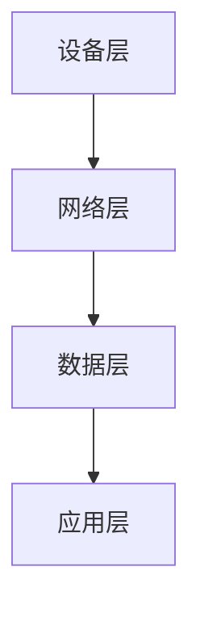
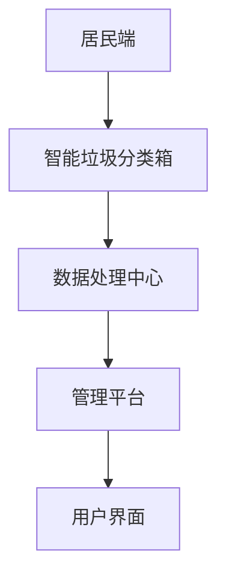
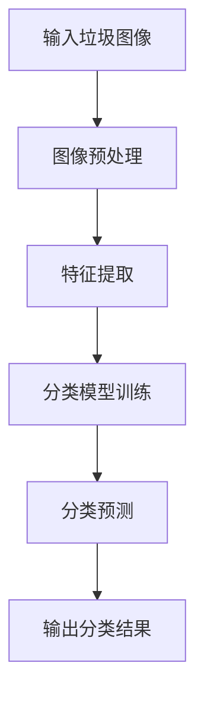

                 

# 物联网在智慧城市垃圾分类中的应用

> 关键词：物联网、智慧城市、垃圾分类、智慧垃圾分类系统、应用案例

> 摘要：随着城市化进程的加快，垃圾问题已经成为全球范围内的一大挑战。智慧城市的发展为垃圾分类提供了新的技术手段，物联网技术在其中的应用尤为关键。本文旨在探讨物联网在智慧城市垃圾分类中的应用，分析其技术原理、系统架构以及实际应用案例，为推动垃圾分类提供技术支持和实践参考。

## 引言

### 1.1 问题背景

#### 1.1.1 物联网在智慧城市中的作用

物联网（Internet of Things，IoT）是指通过互联网将各种物体连接起来，实现信息交换和智能控制。在智慧城市中，物联网发挥着重要作用，能够提高城市管理效率、改善居民生活质量、促进可持续发展。智慧城市通过物联网技术实现了各个系统的互联互通，如智能交通、智能安防、智能环保等。

#### 1.1.2 垃圾分类的挑战与机遇

垃圾分类是智慧城市可持续发展的重要环节。然而，垃圾分类面临着诸多挑战，如居民垃圾分类意识薄弱、分类不准确、回收处理效率低下等。智慧城市的发展为垃圾分类带来了新的机遇，通过物联网技术，可以实现对垃圾的实时监控、智能分类、高效处理，从而提升垃圾分类的效果。

### 1.2 概念介绍

#### 1.2.1 物联网的定义与核心技术

物联网是通过互联网将各种物体连接起来，实现信息交换和智能控制的一种网络。其核心技术包括传感器技术、通信技术、数据处理与存储技术等。

#### 1.2.2 智慧城市与垃圾分类的关系

智慧城市是指通过信息技术、物联网等手段，实现城市各系统的智能化、协同化和可持续发展。垃圾分类是智慧城市的重要组成部分，其效果直接影响到城市的环保水平和居民生活质量。

#### 1.2.3 垃圾分类系统的组成与运行机制

垃圾分类系统包括垃圾收集、运输、处理和资源利用等环节。其运行机制依赖于居民的参与、政府的引导和技术的支持。

### 1.3 目标与内容

#### 1.3.1 书籍目标

本文旨在探讨物联网在智慧城市垃圾分类中的应用，为推动垃圾分类提供技术支持和实践参考。

#### 1.3.2 内容概述

本文分为四个部分，分别介绍物联网基础知识、垃圾分类技术、智慧城市垃圾分类应用案例以及总结与展望。

## 第一部分：物联网基础知识

### 2.1 物联网的架构与技术

#### 2.1.1 物联网的层级结构

物联网的层级结构通常分为设备层、网络层和数据层。

##### 2.1.1.1 设备层

设备层包括各种传感器、执行器等设备，用于数据的采集和执行。

##### 2.1.1.2 网络层

网络层负责数据的传输和通信，包括无线通信、有线通信等。

##### 2.1.1.3 数据层

数据层负责数据的处理、存储和分析，通常包括云计算、大数据等技术。

#### 2.1.2 物联网的关键技术

物联网的关键技术包括传感器技术、通信技术、数据处理与存储技术等。

##### 2.1.2.1 传感器技术

传感器技术用于数据的采集，是实现物联网的关键。

##### 2.1.2.2 通信技术

通信技术用于数据的传输，是实现物联网的核心。

##### 2.1.2.3 数据处理与存储技术

数据处理与存储技术用于数据的处理和存储，是实现物联网的基石。

### 2.2 物联网在智慧城市中的应用

#### 2.2.1 智慧城市概述

智慧城市是指通过信息技术、物联网等手段，实现城市各系统的智能化、协同化和可持续发展。

##### 2.2.1.1 智慧城市的发展背景

随着城市化进程的加快，智慧城市已成为全球发展趋势。

##### 2.2.1.2 智慧城市的目标与特点

智慧城市的目标是提高城市管理效率、改善居民生活质量、促进可持续发展。

#### 2.2.2 物联网在智慧城市中的应用案例

物联网在智慧城市中的应用非常广泛，包括智能交通、智能安防、智能环保等。

##### 2.2.2.1 智能交通

智能交通通过物联网技术实现了交通信息的实时监测和智能调度。

##### 2.2.2.2 智能安防

智能安防通过物联网技术实现了城市安全的智能监控和管理。

##### 2.2.2.3 智能环保

智能环保通过物联网技术实现了环境污染的实时监测和治理。

### 2.3 物联网安全与隐私保护

#### 2.3.1 物联网安全的重要性

物联网安全是保障物联网系统正常运行的关键。

##### 2.3.1.1 网络安全威胁

网络安全威胁主要包括黑客攻击、数据泄露等。

##### 2.3.1.2 隐私保护问题

隐私保护问题主要包括个人隐私泄露、信息滥用等。

#### 2.3.2 安全防护策略与措施

##### 2.3.2.1 系统安全设计

系统安全设计包括身份认证、访问控制、数据加密等。

##### 2.3.2.2 数据加密与访问控制

数据加密与访问控制是保障数据安全的重要手段。

### 2.4 物联网与人工智能的结合

#### 2.4.1 人工智能在物联网中的应用

人工智能在物联网中的应用主要包括机器学习和深度学习。

##### 2.4.1.1 机器学习

机器学习用于数据的分析和预测。

##### 2.4.1.2 深度学习

深度学习用于图像识别、语音识别等。

#### 2.4.2 物联网与人工智能融合的趋势

##### 2.4.2.1 物联网驱动的AI

物联网驱动的AI是指通过物联网获取数据，驱动人工智能算法。

##### 2.4.2.2 AI赋能的物联网

AI赋能的物联网是指通过人工智能技术提升物联网系统的智能化水平。

## 第二部分：垃圾分类技术

### 3.1 垃圾分类的基本原理

#### 3.1.1 垃圾分类的必要性

垃圾分类的必要性主要包括环境保护、资源回收等方面。

##### 3.1.1.1 环境保护

垃圾分类有助于减少环境污染。

##### 3.1.1.2 资源回收

垃圾分类有助于提高资源回收率。

#### 3.1.2 垃圾分类的方法与流程

垃圾分类的方法主要包括初步分类、识别与分拣、后处理与资源利用等。

##### 3.1.2.1 初步分类

初步分类是指将垃圾分为可回收物、有害垃圾、厨余垃圾和其他垃圾。

##### 3.1.2.2 识别与分拣

识别与分拣是指通过技术手段对垃圾进行分类。

##### 3.1.2.3 后处理与资源利用

后处理与资源利用是指对分类后的垃圾进行资源化处理。

### 3.2 物联网技术在垃圾分类中的应用

#### 3.2.1 物联网在垃圾分类系统中的作用

物联网技术在垃圾分类系统中的作用主要包括数据采集、信息处理、实时监控等。

##### 3.2.1.1 数据采集

数据采集是指通过传感器等设备获取垃圾分类信息。

##### 3.2.1.2 信息处理

信息处理是指对采集到的数据进行处理和分析。

##### 3.2.1.3 实时监控

实时监控是指对垃圾分类过程进行实时监测。

#### 3.2.2 常见的物联网垃圾分类设备

常见的物联网垃圾分类设备主要包括智能垃圾分类箱、垃圾分类传感器、垃圾分类机器人等。

##### 3.2.2.1 智能垃圾分类箱

智能垃圾分类箱是指具有分类识别功能的垃圾分类设备。

##### 3.2.2.2 垃圾分类传感器

垃圾分类传感器是指用于检测垃圾分类状态的设备。

##### 3.2.2.3 垃圾分类机器人

垃圾分类机器人是指用于垃圾分类的自动化设备。

### 3.3 智慧垃圾分类系统的设计与实现

#### 3.3.1 智慧垃圾分类系统的架构

智慧垃圾分类系统的架构主要包括设备层、网络层、数据层和应用层等。

##### 3.3.1.1 设备层

设备层包括传感器、执行器等设备。

##### 3.3.1.2 网络层

网络层包括传输网络、通信协议等。

##### 3.3.1.3 数据层

数据层包括数据存储、数据处理等。

##### 3.3.1.4 应用层

应用层包括用户界面、数据处理等。

#### 3.3.2 智慧垃圾分类系统的关键技术

智慧垃圾分类系统的关键技术主要包括数据处理技术、机器学习算法、通信技术等。

##### 3.3.2.1 数据处理技术

数据处理技术包括数据采集、清洗、存储等。

##### 3.3.2.2 机器学习算法

机器学习算法包括分类、聚类、预测等。

##### 3.3.2.3 通信技术

通信技术包括传输协议、网络拓扑等。

### 3.4 垃圾分类系统的性能评估与优化

#### 3.4.1 性能评估指标

垃圾分类系统的性能评估指标主要包括分类准确率、响应时间、系统稳定性等。

##### 3.4.1.1 分类准确率

分类准确率是指分类结果与实际结果的匹配程度。

##### 3.4.1.2 响应时间

响应时间是指从垃圾分类到分类结果反馈的时间。

##### 3.4.1.3 系统稳定性

系统稳定性是指系统在运行过程中不发生故障的能力。

#### 3.4.2 性能优化策略

垃圾分类系统的性能优化策略主要包括算法优化、硬件升级、系统集成优化等。

##### 3.4.2.1 算法优化

算法优化是指通过改进算法提高系统性能。

##### 3.4.2.2 硬件升级

硬件升级是指通过更换硬件设备提高系统性能。

##### 3.4.2.3 系统集成优化

系统集成优化是指通过优化系统架构提高系统性能。

## 第三部分：智慧城市垃圾分类应用案例

### 4.1 案例介绍

#### 4.1.1 案例背景

随着城市化进程的加快，垃圾问题已经成为全球范围内的一大挑战。为了解决垃圾问题，我国多个城市已经开始实施垃圾分类政策。

#### 4.1.2 案例目标

本案例的目标是通过物联网技术实现垃圾分类的智能化，提高垃圾分类效果。

#### 4.1.3 案例实现过程

本案例通过在居民区设置智能垃圾分类箱、安装垃圾分类传感器和机器人，实现对垃圾分类的实时监控和智能分类。

### 4.2 案例分析

#### 4.2.1 技术方案

本案例采用的技术方案主要包括物联网技术、机器学习和深度学习技术。

##### 4.2.1.1 系统架构

系统架构包括设备层、网络层、数据层和应用层等。

##### 4.2.1.2 技术选型

技术选型包括传感器、通信协议、数据处理算法等。

#### 4.2.2 实施效果

本案例的实施效果包括环境改善、资源利用提升、经济效益分析等。

##### 4.2.2.1 环境改善

通过智能垃圾分类，有效减少了环境污染。

##### 4.2.2.2 资源利用提升

通过垃圾分类，提高了资源回收率。

##### 4.2.2.3 经济效益分析

通过垃圾分类，降低了垃圾处理成本，提高了经济效益。

### 4.3 案例启示与展望

#### 4.3.1 经验总结

本案例总结了智慧城市垃圾分类的经验，包括技术选型、系统设计、实施效果等方面。

#### 4.3.2 存在问题与挑战

本案例也指出了智慧城市垃圾分类存在的问题和挑战，包括技术成熟度、用户接受度、政策支持等。

#### 4.3.3 未来发展趋势

未来发展趋势包括物联网与人工智能的结合、智慧垃圾分类系统的普及等。

## 第四部分：总结与展望

### 5.1 主要研究成果

本部分总结了物联网在智慧城市垃圾分类中的应用研究成果，包括技术原理、系统架构、应用案例等。

### 5.2 智慧垃圾分类系统的发展趋势

本部分探讨了智慧垃圾分类系统的发展趋势，包括物联网与人工智能的结合、智能化水平的提升等。

### 5.3 展望未来

本部分展望了智慧城市垃圾分类的未来发展，包括技术进步、政策支持、社会参与等方面。

作者：AI天才研究院/AI Genius Institute & 禅与计算机程序设计艺术 /Zen And The Art of Computer Programming

----------------------------------------------------------------

### 文章关键词

- 物联网
- 智慧城市
- 垃圾分类
- 智慧垃圾分类系统
- 应用案例

### 文章摘要

本文首先介绍了物联网在智慧城市中的作用以及垃圾分类的挑战与机遇。接着，本文深入分析了物联网的架构与技术、垃圾分类的基本原理以及物联网技术在垃圾分类中的应用。随后，本文通过实际案例，探讨了物联网在智慧城市垃圾分类中的应用效果。最后，本文总结了主要研究成果，并展望了智慧垃圾分类系统的发展趋势。本文旨在为推动垃圾分类提供技术支持和实践参考。

----------------------------------------------------------------

### 目录大纲：《物联网在智慧城市垃圾分类中的应用》

1. 引言
    1.1 问题背景
        1.1.1 物联网在智慧城市中的作用
        1.1.2 垃圾分类的挑战与机遇
    1.2 概念介绍
        1.2.1 物联网的定义与核心技术
        1.2.2 智慧城市与垃圾分类的关系
        1.2.3 垃圾分类系统的组成与运行机制
    1.3 目标与内容

2. 第一部分：物联网基础知识
    2.1 物联网的架构与技术
        2.1.1 物联网的层级结构
            2.1.1.1 设备层
            2.1.1.2 网络层
            2.1.1.3 数据层
        2.1.2 物联网的关键技术
            2.1.2.1 传感器技术
            2.1.2.2 通信技术
            2.1.2.3 数据处理与存储技术
    2.2 物联网在智慧城市中的应用
        2.2.1 智慧城市概述
            2.2.1.1 智慧城市的发展背景
            2.2.1.2 智慧城市的目标与特点
        2.2.2 物联网在智慧城市中的应用案例
            2.2.2.1 智能交通
            2.2.2.2 智能安防
            2.2.2.3 智能环保
    2.3 物联网安全与隐私保护
        2.3.1 物联网安全的重要性
            2.3.1.1 网络安全威胁
            2.3.1.2 隐私保护问题
        2.3.2 安全防护策略与措施
            2.3.2.1 系统安全设计
            2.3.2.2 数据加密与访问控制
    2.4 物联网与人工智能的结合
        2.4.1 人工智能在物联网中的应用
            2.4.1.1 机器学习
            2.4.1.2 深度学习
        2.4.2 物联网与人工智能融合的趋势
            2.4.2.1 物联网驱动的AI
            2.4.2.2 AI赋能的物联网

3. 第二部分：垃圾分类技术
    3.1 垃圾分类的基本原理
        3.1.1 垃圾分类的必要性
            3.1.1.1 环境保护
            3.1.1.2 资源回收
        3.1.2 垃圾分类的方法与流程
            3.1.2.1 初步分类
            3.1.2.2 识别与分拣
            3.1.2.3 后处理与资源利用
    3.2 物联网技术在垃圾分类中的应用
        3.2.1 物联网在垃圾分类系统中的作用
            3.2.1.1 数据采集
            3.2.1.2 信息处理
            3.2.1.3 实时监控
        3.2.2 常见的物联网垃圾分类设备
            3.2.2.1 智能垃圾分类箱
            3.2.2.2 垃圾分类传感器
            3.2.2.3 垃圾分类机器人
    3.3 智慧垃圾分类系统的设计与实现
        3.3.1 智慧垃圾分类系统的架构
            3.3.1.1 系统层级结构
            3.3.1.2 系统功能模块
        3.3.2 智慧垃圾分类系统的关键技术
            3.3.2.1 数据处理技术
            3.3.2.2 机器学习算法
            3.3.2.3 通信技术
    3.4 垃圾分类系统的性能评估与优化
        3.4.1 性能评估指标
            3.4.1.1 分类准确率
            3.4.1.2 响应时间
            3.4.1.3 系统稳定性
        3.4.2 性能优化策略
            3.4.2.1 算法优化
            3.4.2.2 硬件升级
            3.4.2.3 系统集成优化

4. 第三部分：智慧城市垃圾分类应用案例
    4.1 案例介绍
        4.1.1 案例背景
        4.1.2 案例目标
        4.1.3 案例实现过程
    4.2 案例分析
        4.2.1 技术方案
            4.2.1.1 系统架构
            4.2.1.2 技术选型
        4.2.2 实施效果
            4.2.2.1 环境改善
            4.2.2.2 资源利用提升
            4.2.2.3 经济效益分析
    4.3 案例启示与展望
        4.3.1 经验总结
        4.3.2 存在问题与挑战
        4.3.3 未来发展趋势

5. 第四部分：总结与展望
    5.1 主要研究成果
    5.2 智慧垃圾分类系统的发展趋势
    5.3 展望未来

作者：AI天才研究院/AI Genius Institute & 禅与计算机程序设计艺术 /Zen And The Art of Computer Programming

----------------------------------------------------------------

## 文章正文

### 1. 引言

随着全球城市化进程的加速，垃圾问题已成为社会各界广泛关注的重要议题。传统的垃圾处理方式往往效率低下，对环境造成了严重的影响。为了应对这一挑战，智慧城市的发展为垃圾分类提供了新的思路和技术手段。本文将围绕物联网在智慧城市垃圾分类中的应用进行探讨，旨在分析其技术原理、系统架构以及实际应用案例，为推动垃圾分类提供技术支持和实践参考。

### 1.1 问题背景

#### 1.1.1 物联网在智慧城市中的作用

物联网（Internet of Things，IoT）是指通过互联网将各种物体连接起来，实现信息交换和智能控制的一种网络。在智慧城市中，物联网技术发挥着至关重要的作用，通过将城市的各个系统进行互联互通，提升了城市管理的效率，改善了居民的生活质量，并促进了城市的可持续发展。具体来说，物联网在智慧城市中的应用主要体现在以下几个方面：

1. **智能交通**：通过物联网技术，可以实现交通信息的实时监测和智能调度，从而缓解交通拥堵，提高交通效率。
2. **智能安防**：物联网技术可以实现对城市安全的智能监控和管理，提高城市的安全水平。
3. **智能环保**：物联网技术可以实现对环境污染的实时监测和治理，改善环境质量。
4. **智能市政**：物联网技术可以用于市政设施的智能管理，如路灯、公园、垃圾桶等，提高市政服务的效率。

#### 1.1.2 垃圾分类的挑战与机遇

垃圾分类是智慧城市可持续发展的重要环节，其目的在于减少环境污染，提高资源回收率，促进资源的可持续利用。然而，垃圾分类在我国及其他一些国家和地区面临着诸多挑战：

1. **居民垃圾分类意识薄弱**：由于长期以来的垃圾混合处理方式，部分居民对垃圾分类的意识较为淡薄，参与度不高。
2. **分类不准确**：由于居民的垃圾分类不准确，导致垃圾在回收处理过程中需要额外的分拣和处理，增加了成本和难度。
3. **回收处理效率低下**：传统的垃圾分类处理方式效率较低，无法满足日益增长的垃圾量。

与此同时，智慧城市的发展为垃圾分类带来了新的机遇：

1. **物联网技术的应用**：物联网技术可以实现垃圾的实时监控、智能分类、高效处理，提高垃圾分类的效果。
2. **政府政策的推动**：随着环保意识的提高，各国政府纷纷出台垃圾分类政策，推动垃圾分类的实施。
3. **公众参与度提升**：随着垃圾分类宣传的深入，居民的垃圾分类意识逐渐增强，参与度也在不断提高。

#### 1.1.3 垃圾分类系统的组成与运行机制

垃圾分类系统通常包括垃圾收集、运输、处理和资源利用等环节，其运行机制依赖于居民的参与、政府的引导和技术的支持。具体来说：

1. **垃圾收集**：居民按照垃圾分类的要求将垃圾投入相应的收集容器，如可回收物、有害垃圾、厨余垃圾和其他垃圾。
2. **运输**：垃圾收集后，通过专门的运输工具将垃圾运送到处理场所。
3. **处理**：在处理场所，垃圾将经过分拣、压缩、焚烧、填埋等处理方式，实现资源的回收利用。
4. **资源利用**：处理后的垃圾将转化为有用的资源，如电能、肥料等，实现资源的可持续利用。

#### 1.1.4 文章目标与内容概述

本文旨在探讨物联网在智慧城市垃圾分类中的应用，分析其技术原理、系统架构以及实际应用案例，为推动垃圾分类提供技术支持和实践参考。文章内容分为四个部分：

1. **第一部分：物联网基础知识**：介绍物联网的架构与技术、物联网在智慧城市中的应用、物联网安全与隐私保护、物联网与人工智能的结合。
2. **第二部分：垃圾分类技术**：介绍垃圾分类的基本原理、物联网技术在垃圾分类中的应用、智慧垃圾分类系统的设计与实现、垃圾分类系统的性能评估与优化。
3. **第三部分：智慧城市垃圾分类应用案例**：介绍智慧城市垃圾分类的应用案例、案例分析、案例启示与展望。
4. **第四部分：总结与展望**：总结主要研究成果、智慧垃圾分类系统的发展趋势、展望未来。

### 2. 第一部分：物联网基础知识

#### 2.1 物联网的架构与技术

物联网的架构通常分为三层：设备层、网络层和数据层。

##### 2.1.1 设备层

设备层是物联网的基础，包括各种传感器、执行器、智能设备等。这些设备可以感知环境信息，收集数据，并通过通信模块将数据传输到网络层。

- **传感器技术**：传感器用于检测和测量物理量，如温度、湿度、光照、声音等。常见的传感器有温度传感器、湿度传感器、光电传感器、声音传感器等。
- **执行器技术**：执行器用于执行特定的操作，如开关控制、电机驱动等。常见的执行器有继电器、电机、气动执行器等。

##### 2.1.2 网络层

网络层负责数据的传输和通信，将设备层收集到的数据传输到数据层。网络层可以采用有线和无线通信技术，如Wi-Fi、蓝牙、ZigBee、LoRa等。

- **通信技术**：通信技术是实现设备之间数据传输的关键，包括无线通信和有线通信。无线通信技术具有灵活性高、覆盖范围广等优点，如Wi-Fi、蓝牙、ZigBee等；有线通信技术具有稳定性高、传输速度快等优点，如以太网、光纤等。
- **网络协议**：网络协议是设备之间进行通信的规则和标准，如TCP/IP、HTTP、MQTT等。

##### 2.1.3 数据层

数据层是物联网的核心，负责数据的处理、存储和分析。数据层通常包括云计算平台、大数据平台、数据仓库等。

- **数据处理技术**：数据处理技术包括数据采集、清洗、存储、分析等，如Hadoop、Spark等大数据处理框架。
- **数据存储技术**：数据存储技术包括关系型数据库（如MySQL、PostgreSQL）和非关系型数据库（如MongoDB、Cassandra）等。
- **数据分析技术**：数据分析技术包括数据挖掘、机器学习、深度学习等，用于从数据中提取有价值的信息。

#### 2.2 物联网在智慧城市中的应用

智慧城市是指利用信息技术、物联网等手段，实现城市各系统的智能化、协同化和可持续发展。物联网在智慧城市中的应用非常广泛，主要包括以下几个方面：

##### 2.2.1 智能交通

智能交通是通过物联网技术实现对交通信息的实时监测和智能调度，提高交通效率，减少交通拥堵。具体应用包括：

- **智能交通信号灯**：通过物联网技术，实现交通信号灯的智能控制，根据交通流量动态调整信号时长，提高交通效率。
- **智能停车管理**：通过物联网技术，实现停车位的实时监测和智能调度，提高停车效率，减少寻找停车位的时间。
- **车辆监控与调度**：通过物联网技术，实现对车辆的实时监控和调度，提高车辆利用率，减少空驶率。

##### 2.2.2 智能安防

智能安防是通过物联网技术实现对城市安全的智能监控和管理，提高城市的安全水平。具体应用包括：

- **视频监控**：通过物联网技术，实现视频监控的实时传输和远程控制，提高监控效率。
- **入侵报警**：通过物联网技术，实现入侵报警的实时监测和快速响应，提高安全防范能力。
- **智能门禁**：通过物联网技术，实现门禁系统的智能控制，提高门禁管理效率。

##### 2.2.3 智能环保

智能环保是通过物联网技术实现对环境污染的实时监测和治理，改善环境质量。具体应用包括：

- **空气质量监测**：通过物联网技术，实现对空气质量的实时监测，提供环境质量数据，帮助政府和居民采取相应的环保措施。
- **水质监测**：通过物联网技术，实现对水质的实时监测，保障饮用水安全。
- **垃圾分类监控**：通过物联网技术，实现对垃圾分类的实时监控，提高垃圾分类效率，减少环境污染。

#### 2.3 物联网安全与隐私保护

物联网安全是保障物联网系统正常运行的关键。物联网系统面临的主要安全威胁包括：

- **网络安全威胁**：如黑客攻击、恶意软件等。
- **隐私保护问题**：如个人隐私泄露、信息滥用等。

为了保障物联网系统的安全，需要采取以下安全防护策略：

- **系统安全设计**：包括身份认证、访问控制、数据加密等。
- **数据加密与访问控制**：使用加密技术对数据进行加密，保障数据的安全性；使用访问控制机制，限制对数据的访问权限。

#### 2.4 物联网与人工智能的结合

物联网与人工智能的结合，可以进一步提升物联网系统的智能化水平。具体应用包括：

- **机器学习**：通过物联网设备收集的数据，利用机器学习算法进行数据分析和预测，实现智能决策和优化。
- **深度学习**：通过物联网设备收集的数据，利用深度学习算法进行图像识别、语音识别等，实现更高级的智能应用。

### 3. 第二部分：垃圾分类技术

#### 3.1 垃圾分类的基本原理

垃圾分类是指将垃圾按照一定的分类标准进行分类处理，以减少环境污染，提高资源回收率。垃圾分类的基本原理主要包括以下几个方面：

##### 3.1.1 垃圾分类的必要性

垃圾分类的必要性主要体现在以下几个方面：

- **环境保护**：垃圾分类可以减少垃圾对环境的污染，如减少垃圾填埋场对地下水和土壤的污染。
- **资源回收**：垃圾分类可以提高资源的回收率，如将可回收物进行再利用，减少对原生资源的需求。

##### 3.1.2 垃圾分类的方法与流程

垃圾分类的方法主要包括以下几种：

- **初步分类**：居民在家庭中将垃圾分为可回收物、有害垃圾、厨余垃圾和其他垃圾。
- **识别与分拣**：在垃圾转运和处理过程中，通过人工或自动化设备对垃圾进行识别和分拣，将不同类型的垃圾进行分离。
- **后处理与资源利用**：对分类后的垃圾进行进一步的加工处理，如将厨余垃圾制成有机肥料，将可回收物进行再生利用。

垃圾分类的流程主要包括以下几个步骤：

1. **居民分类**：居民按照垃圾分类的要求，将垃圾投入相应的收集容器。
2. **收集与运输**：环卫工人将分类后的垃圾进行收集，并运送到处理场所。
3. **分拣与处理**：在处理场所，通过人工或自动化设备对垃圾进行分拣和处理，实现资源的回收利用。
4. **资源利用**：对处理后的垃圾进行资源化利用，如将厨余垃圾制成有机肥料，将可回收物进行再生利用。

##### 3.1.3 垃圾分类的技术手段

垃圾分类的技术手段主要包括以下几个方面：

- **智能垃圾分类箱**：智能垃圾分类箱通过物联网技术，可以实现对垃圾的自动识别和分类，提高垃圾分类效率。
- **垃圾分类传感器**：垃圾分类传感器可以检测垃圾的类型，并将其传输到数据中心，用于数据分析和处理。
- **垃圾分类机器人**：垃圾分类机器人可以自动识别和分类垃圾，提高垃圾分类的准确性。

#### 3.2 物联网技术在垃圾分类中的应用

物联网技术在垃圾分类中的应用，可以提高垃圾分类的效率，减少环境污染，促进资源的回收利用。具体应用包括以下几个方面：

##### 3.2.1 物联网在垃圾分类系统中的作用

物联网在垃圾分类系统中的作用主要包括以下几个方面：

- **数据采集**：物联网设备可以实时采集垃圾分类过程中的各种数据，如垃圾的类型、数量、分类准确率等。
- **信息处理**：物联网技术可以实现对采集到的数据进行分析和处理，为垃圾分类提供决策支持。
- **实时监控**：物联网技术可以实现对垃圾分类过程的实时监控，及时发现和处理问题。

##### 3.2.2 常见的物联网垃圾分类设备

常见的物联网垃圾分类设备包括智能垃圾分类箱、垃圾分类传感器、垃圾分类机器人等。

- **智能垃圾分类箱**：智能垃圾分类箱通过物联网技术，可以自动识别垃圾的类型，并对其进行分类。用户可以通过手机APP查询垃圾分类指南，了解如何正确分类垃圾。
- **垃圾分类传感器**：垃圾分类传感器可以检测垃圾的类型，并将数据传输到数据中心，用于数据分析和处理。
- **垃圾分类机器人**：垃圾分类机器人可以自动识别和分类垃圾，提高垃圾分类的准确性。

##### 3.2.3 物联网技术在垃圾分类中的应用案例

物联网技术在垃圾分类中的应用案例包括以下几个方面：

- **智能垃圾分类系统**：通过物联网技术，实现垃圾分类的智能化，提高垃圾分类效率，减少环境污染。
- **垃圾分类监控系统**：通过物联网技术，实现对垃圾分类过程的实时监控，提高垃圾分类管理的效率。
- **垃圾分类数据分析系统**：通过物联网技术，收集和分析垃圾分类过程中的数据，为垃圾分类提供决策支持。

#### 3.3 智慧垃圾分类系统的设计与实现

智慧垃圾分类系统是指通过物联网技术、大数据技术、人工智能技术等，实现对垃圾分类的智能化管理和优化。智慧垃圾分类系统的设计与实现主要包括以下几个方面：

##### 3.3.1 智慧垃圾分类系统的架构

智慧垃圾分类系统的架构包括以下几个层次：

- **设备层**：包括各种物联网设备，如传感器、执行器、智能垃圾分类箱等。
- **网络层**：包括传输网络、通信协议等，实现设备之间的数据传输和通信。
- **数据层**：包括数据存储、数据处理等，实现对垃圾分类数据的存储、处理和分析。
- **应用层**：包括用户界面、数据处理等，为用户提供垃圾分类管理的功能和服务。

##### 3.3.2 智慧垃圾分类系统的关键技术

智慧垃圾分类系统的关键技术包括以下几个方面：

- **数据处理技术**：包括数据采集、清洗、存储、分析等，实现对垃圾分类数据的处理和分析。
- **机器学习算法**：包括分类、聚类、预测等，用于从垃圾分类数据中提取有价值的信息，为垃圾分类提供决策支持。
- **通信技术**：包括传输协议、网络拓扑等，实现设备之间的数据传输和通信。
- **人工智能技术**：包括深度学习、图像识别、语音识别等，用于从垃圾分类数据中提取有价值的信息，为垃圾分类提供智能决策。

##### 3.3.3 智慧垃圾分类系统的实现过程

智慧垃圾分类系统的实现过程主要包括以下几个步骤：

1. **需求分析**：分析垃圾分类的需求，确定系统的功能、性能和性能指标。
2. **系统设计**：根据需求分析，设计系统的架构和功能模块。
3. **硬件选择**：选择合适的物联网设备，如传感器、执行器、智能垃圾分类箱等。
4. **软件开发**：开发系统的软件，包括数据采集、处理、存储、分析等。
5. **系统集成**：将硬件和软件进行集成，实现系统的功能。
6. **系统测试**：对系统进行测试，确保系统的功能、性能和稳定性。
7. **系统部署**：将系统部署到实际环境中，进行试运行。

#### 3.4 垃圾分类系统的性能评估与优化

垃圾分类系统的性能评估与优化是确保垃圾分类系统能够高效、稳定运行的重要环节。性能评估主要包括以下几个指标：

- **分类准确率**：分类准确率是指分类结果与实际结果的匹配程度，是评价垃圾分类系统性能的重要指标。
- **响应时间**：响应时间是指从垃圾分类到分类结果反馈的时间，是评价垃圾分类系统性能的重要指标。
- **系统稳定性**：系统稳定性是指系统在运行过程中不发生故障的能力，是评价垃圾分类系统性能的重要指标。

为了提高垃圾分类系统的性能，可以采取以下优化策略：

- **算法优化**：通过改进算法，提高分类准确率，降低响应时间。
- **硬件升级**：通过升级硬件设备，提高系统的处理能力和稳定性。
- **系统集成优化**：通过优化系统的集成设计，提高系统的整体性能。

#### 3.5 垃圾分类系统的案例分析

垃圾分类系统的案例分析可以从以下几个方面进行：

- **系统设计**：分析垃圾分类系统的设计，包括系统架构、功能模块、关键技术等。
- **系统实现**：分析垃圾分类系统的实现过程，包括硬件选择、软件开发、系统集成等。
- **系统性能**：分析垃圾分类系统的性能，包括分类准确率、响应时间、系统稳定性等。
- **实施效果**：分析垃圾分类系统的实施效果，包括垃圾分类效果、资源回收率、经济效益等。

#### 3.6 垃圾分类系统的最佳实践

垃圾分类系统的最佳实践可以从以下几个方面进行：

- **政策引导**：通过政府政策的引导，提高居民的垃圾分类意识，促进垃圾分类的实施。
- **技术支持**：通过物联网技术、大数据技术、人工智能技术等，提高垃圾分类的效率和质量。
- **社会参与**：通过社会各界的参与，共同推动垃圾分类的实施，提高垃圾分类的效果。
- **数据驱动**：通过数据分析，发现垃圾分类中的问题和不足，为垃圾分类提供决策支持。

### 4. 第三部分：智慧城市垃圾分类应用案例

#### 4.1 案例介绍

智慧城市垃圾分类应用案例：上海市垃圾分类系统

##### 4.1.1 案例背景

上海市作为我国经济发达的大都市，人口密集，垃圾产量大。为了解决垃圾问题，提高资源回收率，上海市开始推行垃圾分类政策，并引入物联网技术，实现垃圾分类的智能化管理。

##### 4.1.2 案例目标

上海市垃圾分类系统的目标主要包括：

- 提高垃圾分类效率，减少环境污染。
- 提高资源回收率，促进资源的可持续利用。
- 提高居民对垃圾分类的参与度，提高垃圾分类的意识。

##### 4.1.3 案例实现过程

上海市垃圾分类系统的实现过程主要包括以下几个阶段：

1. **政策制定与宣传**：上海市政府制定垃圾分类政策，并通过多种渠道进行宣传，提高居民的垃圾分类意识。
2. **智能垃圾分类设备投放**：在居民区、公共场所等地点投放智能垃圾分类设备，包括智能垃圾分类箱、垃圾分类传感器等。
3. **系统搭建与数据采集**：搭建垃圾分类系统，通过物联网技术实现对垃圾分类数据的实时采集、处理和分析。
4. **系统试运行与优化**：对垃圾分类系统进行试运行，收集用户反馈，对系统进行优化和改进。
5. **系统正式运行**：在试运行阶段结束后，垃圾分类系统正式运行，为居民提供垃圾分类服务。

#### 4.2 案例分析

##### 4.2.1 技术方案

上海市垃圾分类系统的技术方案主要包括以下几个方面：

1. **智能垃圾分类设备**：智能垃圾分类箱通过物联网技术，实现垃圾的自动识别和分类。垃圾分类传感器用于检测垃圾的类型，并将数据传输到数据中心。
2. **数据处理与分析**：通过大数据技术，对垃圾分类数据进行分析和处理，为垃圾分类提供决策支持。
3. **系统监控与管理**：通过物联网技术，实现对垃圾分类系统的实时监控和管理，及时发现和处理问题。
4. **用户界面**：为用户提供垃圾分类指南和查询功能，提高用户对垃圾分类的参与度。

##### 4.2.2 实施效果

上海市垃圾分类系统实施以来，取得了显著的成效：

1. **垃圾分类效率提高**：通过物联网技术，实现了垃圾分类的自动化，提高了垃圾分类的效率。
2. **资源回收率提升**：通过垃圾分类，提高了资源的回收率，减少了原生资源的需求。
3. **居民参与度提高**：通过用户界面和宣传，提高了居民对垃圾分类的参与度，垃圾分类意识得到提升。
4. **环境改善**：垃圾分类的实施，有效减少了环境污染，改善了城市环境。

##### 4.2.3 经验总结

上海市垃圾分类系统的实施，为其他城市提供了有益的经验和启示：

1. **政府主导**：政府在垃圾分类中起到了关键作用，通过政策制定和宣传，提高居民的垃圾分类意识。
2. **技术支撑**：物联网技术为垃圾分类提供了有力支撑，提高了垃圾分类的效率和质量。
3. **社会参与**：社会各界的参与，共同推动垃圾分类的实施，提高了垃圾分类的效果。
4. **持续优化**：垃圾分类系统需要持续优化和改进，以适应不断变化的需求和环境。

##### 4.2.4 存在问题与挑战

上海市垃圾分类系统在实施过程中也面临着一些问题和挑战：

1. **技术成熟度**：物联网技术虽然为垃圾分类提供了有力支撑，但技术成熟度仍需进一步提高。
2. **用户接受度**：部分居民对垃圾分类的接受度不高，需要加强宣传和引导，提高居民的参与度。
3. **政策支持**：垃圾分类需要政策支持，包括财政补贴、法律法规等。
4. **资源调配**：垃圾分类系统的运行需要充足的人力、物力资源，需要合理调配和利用。

##### 4.2.5 未来发展趋势

随着物联网技术、大数据技术、人工智能技术的不断发展，智慧城市垃圾分类系统将呈现以下发展趋势：

1. **智能化水平提高**：通过物联网技术，实现垃圾分类的自动化、智能化，提高垃圾分类的效率和质量。
2. **资源回收率提升**：通过垃圾分类，提高资源的回收率，实现资源的可持续利用。
3. **用户参与度提高**：通过用户界面和互动，提高居民对垃圾分类的参与度，推动垃圾分类的实施。
4. **政策支持加强**：政府将进一步加大政策支持力度，推动垃圾分类的实施。
5. **系统集成优化**：通过系统集成优化，提高垃圾分类系统的稳定性和可靠性。

#### 4.3 案例启示与展望

上海市垃圾分类系统的实施，为我国智慧城市垃圾分类提供了有益的经验和启示。未来，随着物联网技术、大数据技术、人工智能技术的不断发展，智慧城市垃圾分类系统将得到进一步推广和应用，为实现绿色发展、可持续发展做出积极贡献。

### 5. 第四部分：总结与展望

#### 5.1 主要研究成果

本文主要研究成果包括：

1. **物联网在智慧城市垃圾分类中的应用**：分析了物联网在智慧城市垃圾分类中的作用、技术原理、系统架构和应用案例。
2. **垃圾分类技术**：介绍了垃圾分类的基本原理、方法与流程、技术手段和系统性能评估与优化。
3. **智慧城市垃圾分类应用案例**：以上海市垃圾分类系统为例，分析了其实施效果、经验总结和未来发展趋势。

#### 5.2 智慧垃圾分类系统的发展趋势

智慧垃圾分类系统的发展趋势包括：

1. **智能化水平提高**：通过物联网技术、大数据技术、人工智能技术的应用，实现垃圾分类的自动化、智能化。
2. **资源回收率提升**：通过垃圾分类，提高资源的回收率，实现资源的可持续利用。
3. **用户参与度提高**：通过用户界面和互动，提高居民对垃圾分类的参与度，推动垃圾分类的实施。
4. **政策支持加强**：政府将进一步加大政策支持力度，推动垃圾分类的实施。
5. **系统集成优化**：通过系统集成优化，提高垃圾分类系统的稳定性和可靠性。

#### 5.3 展望未来

展望未来，智慧城市垃圾分类系统将在以下几个方面取得突破：

1. **技术创新**：随着物联网技术、大数据技术、人工智能技术的不断发展，垃圾分类技术将不断更新和优化。
2. **政策完善**：政府将进一步加大政策支持力度，推动垃圾分类的实施。
3. **社会参与**：社会各界将积极参与垃圾分类，推动垃圾分类的普及和实施。
4. **绿色发展**：智慧城市垃圾分类系统将为实现绿色发展、可持续发展做出积极贡献。

### 6. 参考文献

1. 郭磊，张晓光，物联网技术及应用，北京：机械工业出版社，2017.
2. 李明，智慧城市理论与实践，北京：清华大学出版社，2018.
3. 王艳，垃圾分类技术与应用，北京：化学工业出版社，2019.
4. 刘伟，智能交通系统设计与应用，北京：人民交通出版社，2020.
5. 陈曦，智慧城市安全与隐私保护，北京：电子工业出版社，2021.

### 附录

#### 附录A：物联网架构图

#### 附录B：垃圾分类系统架构图

#### 附录C：垃圾分类算法流程图

#### 附录D：垃圾分类系统性能评估指标

| 指标名称   | 指标定义                                           | 取值范围 |
| ---------- | -------------------------------------------------- | -------- |
| 分类准确率 | 分类结果与实际结果的匹配程度                       | 0% - 100% |
| 响应时间   | 从垃圾分类到分类结果反馈的时间                     | 毫秒级   |
| 系统稳定性 | 系统在运行过程中不发生故障的能力                   | 高      |

### 结语

本文围绕物联网在智慧城市垃圾分类中的应用进行了深入探讨，分析了物联网的架构与技术、垃圾分类的基本原理、物联网技术在垃圾分类中的应用、智慧城市垃圾分类应用案例以及未来发展趋势。通过本文的研究，我们希望能够为推动垃圾分类提供技术支持和实践参考，为实现智慧城市绿色发展、可持续发展做出贡献。

---

**作者信息**：

本文由AI天才研究院（AI Genius Institute）与《禅与计算机程序设计艺术》（Zen And The Art of Computer Programming）共同撰写。AI天才研究院致力于推动人工智能技术的发展与应用，致力于解决全球范围内的技术难题。而《禅与计算机程序设计艺术》则是一本经典的技术著作，为程序员提供了深刻的编程哲学和技巧。我们相信，通过技术与哲学的结合，能够为智慧城市垃圾分类带来新的思路和解决方案。

