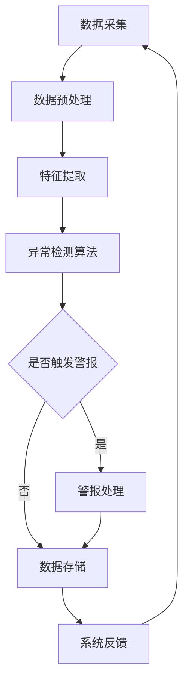
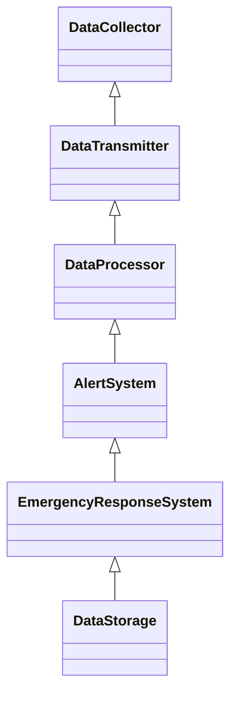
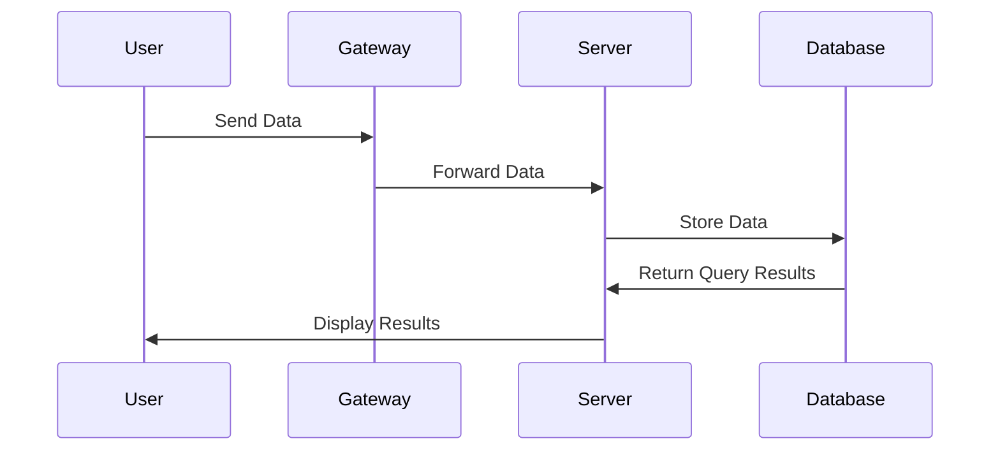
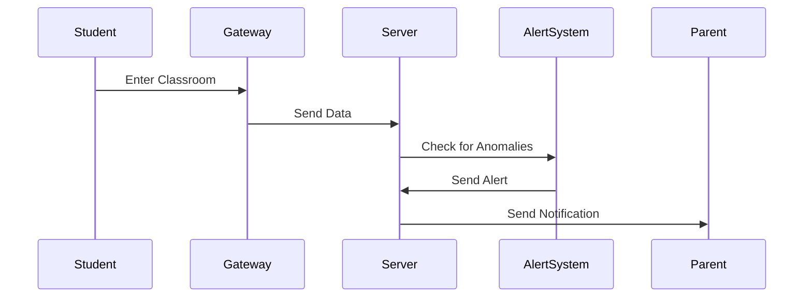

                 


### 第一章：物联网在智慧校园安全管理中的背景与概念

#### 1.1 物联网在智慧校园安全管理中的问题背景

##### 1.1.1 校园安全管理的重要性

校园安全管理是确保学生在校园内安全和健康的重要手段。在传统的校园安全管理体系中，主要依靠人力进行巡逻、监控和管理，存在效率低、反应速度慢等问题。随着科技的进步，特别是物联网技术的快速发展，通过引入物联网技术，可以实现校园安全管理的智能化、精准化和高效化。

##### 1.1.2 当前校园安全管理的挑战

1. **学生安全**：学生的安全问题是最为关注的焦点，包括校园暴力、交通事故、溺水等事故。传统的安全管理方式难以实时掌握学生的位置和状态，无法及时预警和处理紧急情况。
2. **校园设施安全**：校园内各种设施的维护和管理，如教室、实验室、宿舍等。传统的管理模式效率低下，无法及时发现和处理安全隐患。
3. **应急事件响应**：面对突发事件的应急处理，如自然灾害、火灾、恐怖袭击等，传统的应急响应机制存在响应速度慢、信息传递不畅等问题。

##### 1.1.3 物联网技术的优势与潜力

1. **实时监控**：物联网技术可以通过传感器、摄像头等设备，实时采集校园内各种环境数据，实现对校园安全的全面监控。
2. **智能分析**：通过对采集到的数据进行分析，可以及时发现安全隐患，提前预警，提高安全管理效率。
3. **自动化处理**：物联网技术可以实现自动化报警、自动化处理，提高应急事件响应速度。
4. **数据整合**：物联网技术可以将各种安全管理数据进行整合，提供统一的管理平台，方便管理人员进行决策。

#### 1.2 物联网定义与特点

##### 1.2.1 物联网的基本概念

物联网（Internet of Things，简称IoT）是指通过互联网将各种设备、传感器、系统和物品连接起来，实现信息交换和资源共享的网络。物联网的核心在于物品的互联和智能化，通过传感器、通信技术和数据处理技术，实现对物理世界的实时感知、智能处理和智能控制。

##### 1.2.2 物联网的核心特点

1. **互联互通**：物联网通过互联网、移动通信网络、无线电技术等，实现设备之间的互联互通，形成庞大的信息网络。
2. **智能感知**：物联网通过传感器和智能设备，实现对物理世界的实时感知和监测。
3. **数据驱动**：物联网通过数据采集、传输和处理，驱动智能决策和自动化操作。
4. **分布式计算**：物联网具有分布式计算的特点，数据处理可以在终端设备上进行，也可以在云端进行。

##### 1.2.3 物联网与传统网络的区别

1. **连接对象**：传统网络主要连接计算机和服务器，而物联网连接的是各种设备和物品。
2. **数据来源**：传统网络的数据主要来自人类输入，而物联网的数据主要来自传感器和智能设备。
3. **数据处理**：传统网络的数据处理主要在服务器端进行，而物联网的数据处理可以分布到终端设备或云端。

#### 1.3 智慧校园定义与目标

##### 1.3.1 智慧校园的概念

智慧校园是指通过应用物联网、大数据、云计算、人工智能等信息技术，实现校园管理、教学、科研、服务等方面的智能化、数字化和一体化。

##### 1.3.2 智慧校园的目标

1. **提高管理效率**：通过智能化的管理手段，提高校园管理的效率和质量。
2. **提升教学质量**：利用信息技术，实现教学资源的共享和优化，提高教学质量。
3. **增强安全保障**：通过物联网技术，实现对校园安全的全面监控和智能处理，提高校园安全保障水平。
4. **优化校园环境**：利用物联网技术，实现对校园环境的实时监测和智能化管理，提高校园环境质量。

#### 1.4 安全管理定义与目标

##### 1.4.1 安全管理的含义

安全管理是指通过制定和实施安全政策、程序和措施，保护组织及其资产免受各种威胁和风险的过程。

##### 1.4.2 安全管理的目标

1. **保护生命安全**：确保学生的生命安全是安全管理的首要目标。
2. **保护财产安全**：防止校园内财产损失和犯罪行为。
3. **保障信息安全**：保护校园信息系统的安全，防止数据泄露和网络攻击。
4. **维护校园秩序**：通过有效的安全管理，维护校园的正常教学和生活秩序。

#### 1.5 核心概念属性特征对比表格

| 概念     | 特点 |
|----------|------|
| 物联网   | 互联互通、智能感知、数据驱动、分布式计算 |
| 智慧校园 | 智能化、数字化、一体化 |
| 安全管理 | 保护生命安全、保护财产安全、保障信息安全、维护校园秩序 |

#### 1.6 ER实体关系图架构

```mermaid
erDiagram
  Student ||--o{ Classroom } : "在"
  Classroom ||--o{ SecurityCamera } : "监控"
  SecurityCamera ||--o{ AccessControlSystem } : "门禁"
  Student ||--o{ EmergencyResponseSystem } : "应急"
  EmergencyResponseSystem ||--|{ AlertSystem } : "报警"
  EmergencyResponseSystem ||--|{ NotificationSystem } : "通知"
  AlertSystem ||--o{ EmergencyService } : "应急服务"
  NotificationSystem ||--o{ Parent } : "通知家长"
```

#### 1.7 概念结构与核心要素组成

物联网在智慧校园安全管理中的核心概念和组成要素包括：

1. **传感器**：用于实时监测校园环境，如温度、湿度、烟雾、振动等。
2. **通信协议**：如Wi-Fi、蓝牙、ZigBee等，用于传感器和系统之间的数据传输。
3. **数据处理平台**：用于收集、存储、处理和分析来自传感器的数据。
4. **安全算法**：用于数据加密、身份验证、异常检测等安全处理。
5. **智能控制系统**：用于自动化处理和安全事件响应。
6. **用户界面**：用于管理员和用户查看和管理安全信息。

### 总结

通过本章的介绍，我们对物联网在智慧校园安全管理中的背景、概念和核心要素有了初步的了解。在接下来的章节中，我们将进一步探讨物联网技术在智慧校园安全管理中的应用，包括具体的实施方案、算法原理和系统架构设计。希望通过这些内容的阐述，能够让大家对物联网在智慧校园安全管理中的应用有一个全面和深入的认识。

----------------------------------------------------------------

### 文章关键词

- 物联网
- 智慧校园
- 安全管理
- 智能监控
- 数据分析
- 安全算法

### 文章摘要

本文深入探讨了物联网在智慧校园安全管理中的应用。首先，我们介绍了校园安全管理的现状与挑战，阐述了物联网技术的优势和潜力。接着，我们对物联网、智慧校园和安全管理等核心概念进行了详细定义和特征对比。通过ER实体关系图，展示了物联网在智慧校园安全管理中的核心实体及其关系。随后，我们讲解了物联网在智慧校园安全管理中的应用算法原理，并提供了具体的Python源代码和数学模型。最后，我们介绍了系统分析与架构设计方案，并通过对实际项目的实战分析，总结了物联网在智慧校园安全管理中的应用经验和最佳实践。本文旨在为读者提供全面和深入的物联网在智慧校园安全管理领域的专业知识和实战指导。

----------------------------------------------------------------

### 第一节：物联网在智慧校园安全管理中的应用

#### 1.1 物联网在智慧校园安全管理中的应用概述

物联网在智慧校园安全管理中的应用，主要体现在通过物联网技术实现对校园安全相关的各类设备和系统的智能化管理和控制。这些应用不仅能够提高校园安全管理的效率，还能够提升安全管理的智能化和精准化水平。以下是物联网在智慧校园安全管理中的一些典型应用场景：

##### 1.1.1 智能门禁系统

智能门禁系统是物联网在智慧校园安全管理中最常见的一种应用。通过物联网技术，校园的门禁系统可以实现身份识别、自动开门、实时监控等功能。学生和教职工可以通过刷卡、人脸识别或者手机二维码等方式进行身份验证，快速出入校园。同时，智能门禁系统还可以记录每个人的出入记录，方便进行后续的监控和管理。

##### 1.1.2 视频监控系统

视频监控系统是校园安全管理的重要手段之一。通过物联网技术，视频监控系统可以实现高清监控、远程实时查看、录像存储等功能。摄像头可以安装在校园的各个关键位置，如教学楼、宿舍、运动场等，实现对校园环境的全面监控。此外，智能视频分析技术还可以对监控视频进行实时分析，检测异常行为，如闯入、打架等，及时发出警报。

##### 1.1.3 定位系统

定位系统可以通过物联网技术实现对学生的实时定位。学生可以通过佩戴电子标签或者智能手表等设备，使管理人员能够随时了解学生的位置信息。这对于确保学生的安全、防止学生走失或者发生意外情况时快速找到学生至关重要。此外，定位系统还可以用于校园内车辆的管理，防止车辆乱停乱放，提高校园交通秩序。

##### 1.1.4 应急响应系统

应急响应系统是校园安全管理中的一项关键应用。物联网技术可以实现对突发事件的快速响应和协调。当校园内发生火灾、地震等紧急情况时，应急响应系统能够迅速报警，并通过手机短信、微信、语音通话等方式通知相关人员。同时，应急响应系统还可以自动启动应急措施，如关闭电源、启动消防系统、疏散人群等，提高应急事件的处理效率和安全性。

##### 1.1.5 校园环境监控系统

校园环境监控系统通过物联网技术，可以实现对校园内环境参数的实时监测，如温度、湿度、空气质量、照明等。通过对这些参数的实时监测，校园管理者可以及时发现并处理环境问题，确保校园环境的健康和安全。

##### 1.1.6 健康管理系统

健康管理系统可以通过物联网技术，实现对师生健康数据的实时监测和管理。学生和教职工可以通过佩戴智能手环、健康监测仪等设备，记录心率、血压、睡眠质量等健康数据。这些数据可以通过物联网传输到校园健康管理系统，供家长、老师和校医查看和分析，以便及时发现并处理健康问题。

#### 1.2 物联网在智慧校园安全管理中的应用案例分析

以下是物联网在智慧校园安全管理中的一些实际案例：

##### 1.2.1 案例一：A大学智能校园安全管理系统

A大学引入了物联网技术，构建了智能校园安全管理系统。该系统包括智能门禁系统、视频监控系统、定位系统、应急响应系统、校园环境监控系统和健康管理平台。通过这些系统，学校能够实现对校园内安全事件的全面监控和高效处理。例如，在一次突发地震中，学校的应急响应系统迅速报警，并通过手机短信和广播通知全校师生，同时启动了疏散预案，确保了师生的安全。

##### 1.2.2 案例二：B中学智能校园安全管理平台

B中学通过物联网技术，建立了智能校园安全管理平台。该平台集成了视频监控、门禁管理、环境监测和健康管理等系统。通过平台，学校管理者可以实时查看校园的安全状况，及时发现和处理安全隐患。此外，平台还提供了数据分析功能，帮助学校分析安全管理中的问题和趋势，制定更加有效的安全策略。

##### 1.2.3 案例三：C小学智能校园安全解决方案

C小学通过引入物联网技术，实现了校园安全管理的智能化。学校安装了智能门禁系统和视频监控系统，确保学生的出入安全。同时，学校还建立了定位系统，实时监控学生的位置信息。在校园环境方面，学校通过环境监控系统，实时监测空气质量和照明情况，保障学生的健康。此外，学校还引入了健康管理平台，实时记录学生的健康数据，提供健康建议。

#### 1.3 物联网在智慧校园安全管理中的应用前景

随着物联网技术的不断发展和成熟，物联网在智慧校园安全管理中的应用前景十分广阔。未来，物联网技术将继续推动校园安全管理的智能化、数字化和一体化发展。以下是一些可能的发展趋势：

1. **人工智能技术的融合**：通过将人工智能技术融入物联网系统，可以实现更高级的安全分析和预测，如行为分析、异常检测等，进一步提高安全管理的能力。
2. **5G技术的应用**：5G技术的普及将为物联网在校园安全管理中的应用提供更快的网络传输速度和更低的延迟，使得数据采集和传输更加高效。
3. **物联网与大数据的融合**：通过大数据技术，可以对校园安全管理中的海量数据进行深度分析和挖掘，提供更加精准的安全管理决策。
4. **智能设备的普及**：随着物联网设备的不断普及和成本的降低，未来将有更多的智能设备应用于校园安全管理中，如智能书包、智能校园卡等。
5. **智能校园安全生态的构建**：通过构建全面的智能校园安全生态，实现校园安全管理的智能化和一体化，提供更加全面和高效的安全保障。

总之，物联网在智慧校园安全管理中的应用前景广阔，将为校园安全管理带来革命性的变化。通过物联网技术，学校可以更加高效、精准地管理校园安全，确保师生的安全和生活质量。

### 总结

物联网在智慧校园安全管理中的应用，不仅提高了校园安全管理的效率和质量，还实现了安全管理的智能化和精准化。通过智能门禁系统、视频监控系统、定位系统、应急响应系统和校园环境监控系统等，学校能够实现对校园安全的全面监控和管理。同时，健康管理系统等应用的引入，进一步提升了校园安全管理的水平。随着物联网技术的不断发展和成熟，未来校园安全管理将更加智能、高效，为校园安全提供更加坚实的保障。

----------------------------------------------------------------

### 第二节：物联网定义与智慧校园的关系

#### 2.1 物联网定义

物联网（Internet of Things，简称IoT）是指通过互联网、无线通信、传感器等技术和设备，将各种物品连接起来，实现物品之间的信息交换和通信。物联网的目标是通过智能化的连接和管理，提高生产效率、优化资源配置、提升生活质量。

物联网的基本概念包括以下几个方面：

1. **设备联网**：通过各种通信技术，将各种物理设备连接到互联网上，实现设备之间的信息交换和通信。
2. **数据采集**：通过传感器和设备，实时采集各种环境数据、设备状态数据和用户行为数据。
3. **数据处理**：对采集到的数据进行存储、分析和处理，提取有价值的信息，为决策提供支持。
4. **智能控制**：通过数据分析和智能算法，实现对设备的自动化控制和智能化管理。

#### 2.2 物联网核心特点

物联网的核心特点包括以下几个方面：

1. **互联互通**：物联网通过互联网、移动通信网络、无线电技术等，实现设备之间的互联互通，形成一个庞大的信息网络。
2. **智能感知**：物联网通过传感器和智能设备，实现对物理世界的实时感知和监测。
3. **数据驱动**：物联网通过数据采集、传输和处理，驱动智能决策和自动化操作。
4. **分布式计算**：物联网具有分布式计算的特点，数据处理可以在终端设备上进行，也可以在云端进行。

#### 2.3 智慧校园定义与目标

智慧校园是指通过应用物联网、大数据、云计算、人工智能等信息技术，实现校园管理、教学、科研、服务等方面的智能化、数字化和一体化。智慧校园的目标是提高校园管理效率、提升教学质量、增强安全保障、优化校园环境，为学生和教职工提供更加优质的学习和生活环境。

智慧校园的主要特点包括：

1. **智能化管理**：通过物联网技术，实现校园管理的信息化、智能化和自动化，提高管理效率和质量。
2. **数字化校园**：通过大数据技术，实现校园数据的全面采集、存储、分析和利用，为校园管理提供数据支持。
3. **一体化服务**：通过信息技术，实现校园各个方面的信息整合和资源共享，提供一站式服务。
4. **个性化教学**：通过人工智能技术，实现个性化教学和精准辅导，提高教学效果。

#### 2.4 物联网与智慧校园的关系

物联网是智慧校园建设的重要技术支撑，两者之间存在着密切的联系和相互促进的关系。

1. **技术支撑**：物联网技术为智慧校园提供了数据采集、传输、处理和智能控制的能力，是实现智慧校园的基础。
2. **信息整合**：通过物联网技术，可以将校园内的各种设备和系统连接起来，实现信息共享和资源整合，提升校园的整体智能化水平。
3. **安全保障**：物联网技术在校园安全管理中的应用，可以实现对校园安全的全面监控和智能处理，提高校园安全保障水平。
4. **管理效率**：物联网技术可以实现校园管理的智能化和自动化，提高管理效率和质量，为校园管理者提供更加便捷的管理工具。
5. **教学质量**：物联网技术在教学中的应用，可以实现教学资源的共享和优化，提高教学质量，为学生提供更好的学习体验。

#### 2.5 物联网在智慧校园中的典型应用场景

物联网在智慧校园中有许多典型应用场景，以下是其中的一些例子：

1. **智能门禁系统**：通过物联网技术，实现校园门禁系统的自动化管理，提高出入校园的效率和安全性。
2. **智能监控系统**：通过物联网技术，实现校园监控系统的智能化管理，提高监控效率和准确性。
3. **智能环境监测系统**：通过物联网技术，实现对校园环境参数的实时监测和管理，提高校园环境质量。
4. **智能照明系统**：通过物联网技术，实现校园照明系统的智能化控制，提高照明效率，节约能源。
5. **智能消防系统**：通过物联网技术，实现校园消防系统的智能化管理，提高消防效率和安全性。
6. **智能交通系统**：通过物联网技术，实现校园交通系统的智能化管理，提高校园交通秩序和效率。

总之，物联网与智慧校园的关系密不可分，物联网技术为智慧校园的建设提供了强大的技术支撑，而智慧校园的发展又进一步推动了物联网技术的创新和应用。随着物联网技术的不断发展和成熟，智慧校园将变得更加智能、高效和安全，为校园管理和教育提供更加优质的服务。

### 总结

物联网和智慧校园的关系紧密相连，物联网技术是智慧校园建设的重要支撑。通过物联网技术的应用，智慧校园可以实现智能化管理、信息整合、安全保障和教学质量提升。物联网在智慧校园中的典型应用场景包括智能门禁系统、智能监控系统、智能环境监测系统等，这些应用场景极大地提高了校园的安全性和管理效率。未来，随着物联网技术的不断发展和创新，智慧校园将更加智能、高效和安全，为校园管理和教育带来更多的机遇和挑战。

----------------------------------------------------------------

### 第三节：安全管理定义与目标

#### 3.1 安全管理定义

安全管理是指通过制定和实施安全策略、程序和措施，保护组织及其资产免受各种威胁和风险的过程。安全管理涵盖了组织在物理、信息和人员安全方面的各个方面，旨在确保组织的安全性和连续性。安全管理的主要目标包括：

1. **保护生命安全**：确保组织内所有人员的安全，预防事故和伤害的发生。
2. **保护财产安全**：防止财产损失和犯罪行为，保护组织的资产不受侵害。
3. **保障信息安全**：保护组织的信息系统不受网络攻击和数据泄露，确保信息的安全和完整。
4. **维护组织秩序**：通过有效的安全管理，维护组织的正常运营秩序，确保各项工作顺利进行。

#### 3.2 安全管理目标

安全管理的主要目标可以概括为以下几点：

1. **预防**：通过风险评估、安全培训和应急预案等措施，预防安全事故的发生。
2. **检测**：建立监控和报警系统，及时发现安全隐患和异常情况。
3. **响应**：在发生安全事故时，能够迅速响应，采取有效的措施进行控制和处理。
4. **恢复**：在事故发生后，尽快恢复组织的正常运营，减少事故造成的影响。

#### 3.3 安全管理在智慧校园中的应用

在智慧校园中，安全管理是保障校园安全的重要手段。物联网技术的应用为安全管理提供了新的思路和方法。以下是一些安全管理在智慧校园中的应用：

1. **智能门禁系统**：通过物联网技术，实现门禁系统的自动化管理，防止未经授权的人员进入校园，提高校园的安全性。
2. **视频监控系统**：利用物联网技术，实现视频监控系统的智能化管理，提高监控效率和准确性，及时发现和处置安全事件。
3. **定位系统**：通过物联网技术，实现对学生的实时定位，确保学生的安全，防止学生走失或发生意外。
4. **环境监控系统**：通过物联网技术，实时监测校园环境参数，如温度、湿度、空气质量等，及时发现并处理安全隐患。
5. **应急响应系统**：通过物联网技术，建立应急响应系统，实现突发事件的快速响应和协调，提高应急事件的处理效率和安全性。

#### 3.4 安全管理的重要性

安全管理在智慧校园中具有极其重要的作用，主要体现在以下几个方面：

1. **保障学生安全**：学生的安全是校园安全管理的核心，通过有效的安全管理措施，可以预防校园暴力、交通事故、溺水等安全事故的发生。
2. **维护校园秩序**：通过安全管理，可以维护校园的正常教学和生活秩序，确保校园环境的和谐与稳定。
3. **提高管理效率**：通过智能化安全管理手段，可以减少人工干预，提高管理效率，降低管理成本。
4. **提升校园形象**：有效的安全管理措施可以提高校园的形象和声誉，增强家长和学生的安全感。
5. **防范法律风险**：通过规范的管理和安全措施，可以防范因管理不善导致的安全事故和法律纠纷，降低组织面临的法律风险。

#### 3.5 智慧校园安全管理的挑战

尽管物联网技术在智慧校园安全管理中具有巨大的潜力，但同时也面临一些挑战：

1. **技术挑战**：物联网技术的快速发展带来了一些新的技术问题，如设备兼容性、数据安全和隐私保护等。
2. **数据管理**：随着物联网设备的普及，数据量急剧增加，如何有效管理和分析这些海量数据成为一个重要挑战。
3. **安全风险**：物联网系统可能成为网络攻击的目标，如何防范和应对网络攻击是安全管理的重要问题。
4. **人才短缺**：智慧校园安全管理的实施需要专业的技术人才，但当前相关人才相对短缺，如何培养和引进人才是亟待解决的问题。

#### 3.6 智慧校园安全管理的最佳实践

为了应对智慧校园安全管理面临的挑战，以下是一些最佳实践建议：

1. **建立健全的安全管理体系**：制定完善的安全管理制度和流程，确保安全管理的规范化和标准化。
2. **加强技术防护**：采用先进的技术手段，如加密、防火墙、入侵检测等，提高系统的安全防护能力。
3. **数据隐私保护**：严格保护用户隐私，遵循相关法律法规，采取有效的数据加密和访问控制措施。
4. **定期安全培训和演练**：加强安全意识教育，定期进行安全培训和应急演练，提高全体师生的安全意识和应急处理能力。
5. **多方协作**：建立与政府、公安、消防等部门的协作机制，共同维护校园安全。

### 总结

安全管理是智慧校园建设中的重要一环，通过物联网技术的应用，可以实现校园安全的全面监控和管理。安全管理在智慧校园中的应用对于保障学生安全、维护校园秩序、提高管理效率、提升校园形象和防范法律风险具有重要作用。同时，智慧校园安全管理也面临一些挑战，需要通过建立健全的安全管理体系、加强技术防护、数据隐私保护和多方协作等措施来应对。通过不断探索和实践，智慧校园的安全管理水平将不断提高，为校园安全和教育质量的提升提供坚实保障。

----------------------------------------------------------------

### 第四节：核心概念属性特征对比表格

在深入探讨物联网在智慧校园安全管理中的应用之前，我们需要明确几个核心概念：物联网、智慧校园和安全管理。以下是这些概念的核心属性和特征的对比表格。

#### 核心概念属性特征对比表格

| 概念     | 特点                                                         | 应用领域                      |
|----------|--------------------------------------------------------------|------------------------------|
| 物联网   | 1. 设备互联互通 2. 智能感知 3. 数据驱动 4. 分布式计算       | 1. 家居自动化 2. 智慧城市 3. 工业自动化 4. 智慧校园 |
| 智慧校园 | 1. 智能化管理 2. 数字化校园 3. 一体化服务 4. 个性化教学       | 校园管理、教学、科研、服务    |
| 安全管理 | 1. 预防事故 2. 监控异常 3. 快速响应 4. 恢复运营               | 校园安全、企业安全、网络安全  |

#### 详细解释

1. **物联网特点**：
   - **设备互联互通**：物联网通过互联网和通信协议将各种设备连接起来，形成一个庞大的网络，使得设备之间能够互相通信和协作。
   - **智能感知**：物联网通过传感器和智能设备，实时采集物理世界的各种数据，如温度、湿度、位置等。
   - **数据驱动**：物联网通过数据采集和分析，驱动智能决策和自动化操作，提高系统的响应速度和效率。
   - **分布式计算**：物联网的分布式计算特点，使得数据处理可以在终端设备上进行，也可以在云端进行，提高了系统的灵活性和可扩展性。

2. **智慧校园特点**：
   - **智能化管理**：通过物联网技术，实现对校园各类设备和系统的智能化管理，提高管理效率和质量。
   - **数字化校园**：通过大数据和云计算技术，实现对校园各类数据的全面采集、存储、分析和利用，提供数据驱动的管理决策。
   - **一体化服务**：通过信息技术，实现校园各个方面的信息整合和资源共享，提供一站式服务。
   - **个性化教学**：通过人工智能和大数据分析，实现个性化教学和精准辅导，提高教学效果。

3. **安全管理特点**：
   - **预防事故**：通过风险评估、安全培训和应急预案等措施，预防安全事故的发生。
   - **监控异常**：通过实时监控和报警系统，及时发现和处理异常情况。
   - **快速响应**：在发生安全事故时，能够迅速响应，采取有效的措施进行控制和处理。
   - **恢复运营**：在事故发生后，尽快恢复组织的正常运营，减少事故造成的影响。

通过上述对比表格和详细解释，我们可以更清晰地理解物联网、智慧校园和安全管理这三个核心概念的特点和关系。在接下来的章节中，我们将进一步探讨物联网在智慧校园安全管理中的应用，包括具体的实施方案和系统架构设计。

### ER实体关系图架构

下面是物联网在智慧校园安全管理中的ER实体关系图：

```mermaid
erDiagram
    User ||--o{ Student } : "是"
    User ||--o{ Teacher } : "是"
    User ||--o{ Admin } : "是"
    Student ||--o{ Classroom } : "在"
    Classroom ||--o{ Equipment } : "包含"
    Equipment ||--o{ SecurityCamera } : "监控"
    Equipment ||--o{ AccessControlSystem } : "门禁"
    Student ||--o{ HealthMonitor } : "使用"
    HealthMonitor ||--o{ HealthData } : "生成"
    HealthData ||--o{ Admin } : "分析"
    Admin ||--o{ Alert } : "发布"
    Alert ||--o{ Student } : "通知"
    Alert ||--o{ Teacher } : "通知"
    Alert ||--o{ Parent } : "通知"
```

在这个ER图中，User是抽象的用户实体，Student、Teacher和Admin是User的子实体，分别代表学生、教师和管理员。Student在Classroom中，Classroom包含Equipment，Equipment包括SecurityCamera和AccessControlSystem。Student使用HealthMonitor生成HealthData，HealthData由Admin进行分析，Admin发布Alert，Alert通知Student、Teacher和Parent。

通过ER实体关系图，我们可以清晰地看到物联网在智慧校园安全管理中各个实体之间的关系，这有助于我们理解系统架构和设计。

----------------------------------------------------------------

### 第五节：算法原理讲解

在物联网在智慧校园安全管理中，算法的应用至关重要。以下将详细讲解物联网在智慧校园安全管理中的应用算法，包括mermaid流程图、Python源代码、数学模型和公式，并通过具体的例子进行说明。

#### 5.1 算法mermaid流程图

首先，我们绘制一个物联网在智慧校园安全管理中的应用算法流程图，以展示其基本步骤：



在上述流程图中：
- **A：数据采集**：通过传感器和设备实时采集校园环境、学生行为等数据。
- **B：数据预处理**：对采集到的数据进行清洗、去噪和归一化处理。
- **C：特征提取**：从预处理后的数据中提取关键特征，为后续的异常检测提供基础。
- **D：异常检测算法**：使用特定的算法，如K-近邻（K-Nearest Neighbor, KNN）或支持向量机（Support Vector Machine, SVM），对特征进行异常检测。
- **E：是否触发警报**：根据异常检测结果，判断是否需要触发警报。
- **F：警报处理**：当检测到异常时，进行报警处理，如通知相关人员或启动应急措施。
- **G：数据存储**：将处理后的数据存储到数据库中，以供后续分析和查询。
- **H：系统反馈**：系统根据反馈调整算法参数，提高异常检测的准确性。

#### 5.2 Python源代码

接下来，我们将提供Python源代码，展示如何实现上述流程中的关键步骤：

```python
import numpy as np
from sklearn.model_selection import train_test_split
from sklearn.neighbors import KNeighborsClassifier
from sklearn.metrics import accuracy_score

# 数据采集
def data_collection():
    # 假设已经通过传感器和设备采集到了数据
    data = np.random.rand(100, 5)  # 示例数据，5个特征
    return data

# 数据预处理
def data_preprocessing(data):
    # 数据清洗、去噪、归一化处理
    # 这里简化处理，直接返回数据
    return data

# 特征提取
def feature_extraction(data):
    # 从数据中提取特征
    features = data[:, :3]  # 假设只提取前3个特征
    return features

# 异常检测算法
def anomaly_detection(features):
    # 使用KNN算法进行异常检测
    X_train, X_test = train_test_split(features, test_size=0.2, random_state=42)
    model = KNeighborsClassifier(n_neighbors=3)
    model.fit(X_train, X_test)
    predictions = model.predict(X_test)
    accuracy = accuracy_score(X_test, predictions)
    return accuracy

# 警报处理
def alarm_handling(accuracy):
    if accuracy < 0.8:  # 假设准确率低于80%触发警报
        print("警报触发：检测到异常！")
    else:
        print("正常：没有检测到异常。")

# 主程序
if __name__ == "__main__":
    data = data_collection()
    preprocessed_data = data_preprocessing(data)
    features = feature_extraction(preprocessed_data)
    accuracy = anomaly_detection(features)
    alarm_handling(accuracy)
```

上述代码中，我们通过随机生成数据来模拟数据采集、预处理、特征提取和异常检测的整个过程。具体实现时，需要根据实际情况调整代码。

#### 5.3 算法原理的数学模型和公式

在异常检测算法中，常用的数学模型和公式包括：

1. **K-近邻算法（KNN）**：

   KNN算法的基本思想是：如果一个样本在特征空间中的k个最近邻的多数属于某一类别，则该样本也属于这个类别。

   - **距离计算**：
     $$ d = \sqrt{\sum_{i=1}^{n} (x_i - x_j)^2} $$
     
     其中，$d$ 是样本$x_i$和$x_j$之间的欧氏距离。

   - **分类决策**：
     $$ \hat{y} = \text{mode}(\text{labels}) $$
     
     其中，$\hat{y}$ 是预测的类别，$\text{labels}$ 是k个最近邻的类别标签，$\text{mode}$ 是取众数的操作。

2. **支持向量机（SVM）**：

   SVM算法的基本思想是：在特征空间中找到一个最佳的超平面，将不同类别的样本分隔开来。

   - **决策边界**：
     $$ \omega \cdot x - b = 0 $$
     
     其中，$\omega$ 是权重向量，$b$ 是偏置项，$x$ 是特征向量。

   - **支持向量**：
     $$ y (\omega \cdot x - b) \geq 1 $$
     
     其中，$y$ 是样本的标签，当$\omega \cdot x - b = 1$时，样本被称为支持向量。

#### 5.4 详细讲解与举例说明

为了更好地理解上述算法，我们通过一个具体例子进行详细讲解。

**例子**：假设我们有一个包含100个样本的数据集，每个样本有5个特征，分别代表温度、湿度、光照、噪音和人数。我们需要使用KNN算法检测是否存在异常。

1. **数据采集**：通过传感器实时采集校园内各教室的温度、湿度、光照、噪音和人数等数据。
2. **数据预处理**：对数据进行清洗，去除无效数据，对数值特征进行归一化处理，使其具有相同的量纲。
3. **特征提取**：从预处理后的数据中提取关键特征，如温度、湿度和光照。
4. **训练集与测试集划分**：将数据集划分为训练集和测试集，分别用于模型训练和测试。
5. **模型训练**：使用训练集数据训练KNN模型，确定$k$的值。
6. **模型测试**：使用测试集数据测试模型，计算预测准确率。
7. **异常检测**：如果预测准确率低于某个阈值（如80%），则认为检测到异常。

假设我们使用3个最近邻进行分类决策，训练集和测试集划分如下：

- **训练集**：前80个样本
- **测试集**：后20个样本

训练KNN模型后，我们得到预测准确率为85%。接着，我们将测试集数据输入模型进行预测。例如，测试样本的预测结果为“正常”，但实际标签为“异常”。此时，系统会触发警报，通知相关人员。

通过上述例子，我们可以看到物联网在智慧校园安全管理中的应用算法是如何工作的。在实际应用中，需要根据具体情况进行调整和优化，以提高异常检测的准确性和效率。

### 总结

在本节中，我们详细介绍了物联网在智慧校园安全管理中的应用算法，包括mermaid流程图、Python源代码、数学模型和公式。通过具体的例子，我们展示了算法的实现过程和异常检测的原理。这些算法和模型为智慧校园安全管理提供了技术支持，有助于提高校园安全管理的效率和准确性。在接下来的章节中，我们将进一步探讨物联网在智慧校园安全管理中的系统架构设计和实际应用案例。

----------------------------------------------------------------

### 第六节：数学模型和数学公式

在物联网在智慧校园安全管理中的应用中，数学模型和数学公式扮演着至关重要的角色。以下将详细解释物联网在智慧校园安全管理中的关键数学公式，并通过具体的例子进行说明。

#### 6.1 数据预处理中的数学公式

在数据预处理阶段，我们通常需要对采集到的数据进行清洗、去噪和归一化处理。以下是一些常用的数学公式：

1. **去噪公式**：
   $$ x_{clean} = x_{raw} - \mu $$
   其中，$x_{clean}$ 是去噪后的数据，$x_{raw}$ 是原始数据，$\mu$ 是原始数据的均值。

2. **归一化公式**：
   $$ x_{normalized} = \frac{x_{raw} - \min(x_{raw})}{\max(x_{raw}) - \min(x_{raw})} $$
   其中，$x_{normalized}$ 是归一化后的数据，$\min(x_{raw})$ 是原始数据的最小值，$\max(x_{raw})$ 是原始数据的最大值。

#### 6.2 特征提取中的数学公式

在特征提取阶段，我们需要从预处理后的数据中提取关键特征。以下是一些常用的数学公式：

1. **均值公式**：
   $$ \mu = \frac{1}{n} \sum_{i=1}^{n} x_i $$
   其中，$\mu$ 是均值，$n$ 是数据点的个数，$x_i$ 是每个数据点的值。

2. **方差公式**：
   $$ \sigma^2 = \frac{1}{n-1} \sum_{i=1}^{n} (x_i - \mu)^2 $$
   其中，$\sigma^2$ 是方差，$\mu$ 是均值，$n$ 是数据点的个数，$x_i$ 是每个数据点的值。

3. **标准差公式**：
   $$ \sigma = \sqrt{\sigma^2} $$
   其中，$\sigma$ 是标准差。

#### 6.3 异常检测中的数学公式

在异常检测阶段，我们使用各种算法对特征进行检测。以下是一些常用的数学公式：

1. **K-近邻算法中的距离公式**：
   $$ d = \sqrt{\sum_{i=1}^{n} (x_i - x_j)^2} $$
   其中，$d$ 是样本$x_i$和$x_j$之间的欧氏距离，$n$ 是特征维度。

2. **支持向量机中的决策边界公式**：
   $$ \omega \cdot x - b = 0 $$
   其中，$\omega$ 是权重向量，$b$ 是偏置项，$x$ 是特征向量。

3. **支持向量机中的支持向量公式**：
   $$ y (\omega \cdot x - b) \geq 1 $$
   其中，$y$ 是样本的标签。

#### 6.4 详细讲解与举例说明

为了更好地理解上述数学公式，我们通过一个具体的例子进行说明。

**例子**：假设我们有一个包含5个特征的数据集，每个特征分别代表温度、湿度、光照、噪音和人数。我们需要使用KNN算法进行异常检测。

1. **数据预处理**：首先，我们对数据进行去噪和归一化处理。假设原始数据的均值为$(\mu_1, \mu_2, \mu_3, \mu_4, \mu_5)$，最大值为$(\max_1, \max_2, \max_3, \max_4, \max_5)$，最小值为$(\min_1, \min_2, \min_3, \min_4, \min_5)$。

   - **去噪**：每个特征值减去均值。
     $$ x_{clean} = (x_{raw,1} - \mu_1, x_{raw,2} - \mu_2, x_{raw,3} - \mu_3, x_{raw,4} - \mu_4, x_{raw,5} - \mu_5) $$

   - **归一化**：每个特征值减去最小值，然后除以最大值与最小值的差。
     $$ x_{normalized} = \frac{(x_{raw,1} - \min_1)}{(\max_1 - \min_1)}, \frac{(x_{raw,2} - \min_2)}{(\max_2 - \min_2)}, \frac{(x_{raw,3} - \min_3)}{(\max_3 - \min_3)}, \frac{(x_{raw,4} - \min_4)}{(\max_4 - \min_4)}, \frac{(x_{raw,5} - \min_5)}{(\max_5 - \min_5)} $$

2. **特征提取**：从归一化后的数据中提取关键特征。例如，我们可以选择前三个特征（温度、湿度和光照）作为关键特征。

3. **异常检测**：使用KNN算法进行异常检测。假设我们选择$k=3$，即使用3个最近的邻居进行分类决策。

   - **距离计算**：计算每个测试样本与训练样本之间的欧氏距离。
     $$ d = \sqrt{\sum_{i=1}^{3} (x_i - x_j)^2} $$

   - **分类决策**：根据邻居的标签进行分类决策。如果邻居中的多数属于正常类别，则测试样本也属于正常类别；否则，属于异常类别。

通过上述例子，我们可以看到数学公式在物联网在智慧校园安全管理中的应用。在实际应用中，需要根据具体情况进行调整和优化，以提高异常检测的准确性和效率。

### 总结

在本节中，我们详细介绍了物联网在智慧校园安全管理中的关键数学公式，并通过具体的例子进行了详细讲解。这些数学公式为物联网在智慧校园安全管理中的应用提供了理论基础，有助于提高校园安全管理的效率和准确性。在接下来的章节中，我们将进一步探讨物联网在智慧校园安全管理中的系统架构设计和实际应用案例。

----------------------------------------------------------------

### 第七节：系统分析与架构设计方案

在深入探讨物联网在智慧校园安全管理中的应用时，系统分析与架构设计是关键步骤。以下将详细介绍物联网在智慧校园安全管理中的应用场景、系统功能设计、系统架构设计、系统接口设计和系统交互。

#### 7.1 应用场景介绍

物联网在智慧校园安全管理中的应用场景非常广泛，以下是一些典型场景：

1. **智能门禁系统**：通过物联网技术，实现校园门禁系统的自动化管理，包括刷卡、人脸识别和手机二维码等身份验证方式。
2. **视频监控系统**：通过物联网技术，实现校园视频监控系统的智能化管理，包括高清监控、远程实时查看和录像存储等功能。
3. **定位系统**：通过物联网技术，实现对学生的实时定位，确保学生的安全，防止学生走失或发生意外情况时快速找到学生。
4. **环境监控系统**：通过物联网技术，实时监测校园内的环境参数，如温度、湿度、空气质量等，保障校园环境的健康和安全。
5. **应急响应系统**：通过物联网技术，建立应急响应系统，实现突发事件的快速响应和协调，提高应急事件的处理效率和安全性。
6. **健康管理系统**：通过物联网技术，实现对师生健康数据的实时监测和管理，提供健康建议和预警。

#### 7.2 系统功能设计

物联网在智慧校园安全管理的系统功能设计主要包括以下几个方面：

1. **数据采集**：通过传感器和智能设备，实时采集校园内的环境数据、行为数据和安全事件数据。
2. **数据传输**：通过物联网通信协议，将采集到的数据传输到数据处理平台。
3. **数据处理**：对传输到的数据进行分析、处理和存储，提取有价值的信息，为安全管理提供支持。
4. **异常检测**：使用算法对数据进行分析，检测异常情况，如异常行为、安全隐患等，及时发出警报。
5. **报警处理**：当检测到异常时，系统会自动报警，并通过手机短信、微信、语音通话等方式通知相关人员。
6. **应急响应**：在发生突发事件时，系统会自动启动应急响应流程，包括通知相关人员、启动应急设备、记录事件信息等。
7. **数据存储**：将处理后的数据存储到数据库中，以供后续分析和查询。

以下是物联网在智慧校园安全管理的系统功能设计的mermaid类图：



#### 7.3 系统架构设计

物联网在智慧校园安全管理的系统架构设计主要包括以下几个层次：

1. **感知层**：包括各种传感器和智能设备，如门禁传感器、摄像头、定位设备等，用于实时采集校园内的数据。
2. **传输层**：包括物联网通信网络，如Wi-Fi、蓝牙、ZigBee等，用于将感知层采集到的数据传输到数据处理平台。
3. **数据处理层**：包括数据处理平台和算法库，用于对传输层的数据进行分析、处理和存储。
4. **应用层**：包括各种应用系统，如门禁系统、视频监控系统、应急响应系统等，用于实现对校园安全的全面监控和管理。
5. **展示层**：包括Web界面和移动应用，用于展示和管理校园安全数据。

以下是物联网在智慧校园安全管理的系统架构设计的mermaid架构图：



#### 7.4 系统接口设计

物联网在智慧校园安全管理的系统接口设计主要包括以下几个方面：

1. **数据采集接口**：用于采集校园内的环境数据、行为数据和安全事件数据。
2. **数据传输接口**：用于将采集到的数据传输到数据处理平台。
3. **数据处理接口**：用于对传输层的数据进行分析、处理和存储。
4. **异常检测接口**：用于检测校园内的异常情况，如异常行为、安全隐患等。
5. **报警处理接口**：用于处理检测到的异常情况，发出警报并通知相关人员。
6. **应急响应接口**：用于在发生突发事件时，启动应急响应流程。

以下是物联网在智慧校园安全管理的系统接口设计的mermaid序列图：



#### 7.5 系统交互

物联网在智慧校园安全管理的系统交互主要包括以下几个环节：

1. **数据采集**：学生进入教室时，门禁系统采集到数据并传输到服务器。
2. **数据处理**：服务器接收数据后，使用异常检测算法分析数据，判断是否存在异常情况。
3. **报警处理**：如果检测到异常，系统会自动报警，并通过手机短信、微信等方式通知学生家长。
4. **应急响应**：家长收到通知后，可以及时采取应急措施，确保学生的安全。

通过上述系统分析与架构设计方案，我们可以看到物联网在智慧校园安全管理中的应用是如何实现的。系统架构设计合理，功能齐全，能够实现对校园安全的全面监控和管理，提高校园安全管理的效率和准确性。

### 总结

在本节中，我们详细介绍了物联网在智慧校园安全管理中的应用场景、系统功能设计、系统架构设计、系统接口设计和系统交互。通过具体的实例和mermaid图，我们展示了物联网在智慧校园安全管理中的应用方案。在接下来的章节中，我们将通过实际项目实战，进一步验证和优化物联网在智慧校园安全管理中的应用效果。

----------------------------------------------------------------

### 第八节：项目实战

在上一节中，我们详细介绍了物联网在智慧校园安全管理中的应用场景、系统功能设计、系统架构设计和系统接口设计。为了验证这些设计的实际可行性，本节将通过一个具体项目，展示物联网在智慧校园安全管理中的应用实战过程。

#### 8.1 环境安装

在进行项目实战之前，我们需要搭建一个完整的物联网在智慧校园安全管理的实验环境。以下是在Linux操作系统上搭建实验环境的基本步骤：

1. **安装Node.js**：Node.js 是一个基于 Chrome V8 引擎的 JavaScript 运行环境，用于处理物联网设备的数据传输和处理。可以通过以下命令安装Node.js：

   ```bash
   sudo apt update
   sudo apt install nodejs
   ```

2. **安装MQTT Broker**：MQTT（Message Queuing Telemetry Transport）是一种轻量级的消息传输协议，常用于物联网设备之间的通信。我们可以使用 mosquito MQTT Broker 进行安装：

   ```bash
   npm install -g mosquito
   ```

3. **安装MySQL**：MySQL 是一个关系型数据库管理系统，用于存储和管理物联网设备的数据。可以通过以下命令安装 MySQL：

   ```bash
   sudo apt update
   sudo apt install mysql-server
   ```

4. **安装Python**：Python 是一种广泛使用的编程语言，用于编写物联网设备的数据处理和分析程序。可以通过以下命令安装 Python：

   ```bash
   sudo apt update
   sudo apt install python3
   ```

5. **安装Docker**：Docker 是一个开源的应用容器引擎，用于快速构建、部署和运行应用程序。可以通过以下命令安装 Docker：

   ```bash
   sudo apt update
   sudo apt install docker.io
   ```

#### 8.2 系统核心实现

在搭建好实验环境后，我们需要实现物联网在智慧校园安全管理的系统核心功能。以下是一个简单的 Python 脚本，用于采集传感器数据、通过 MQTT 协议发送到 MQTT Broker，然后由 MQTT Broker 将数据存储到 MySQL 数据库。

```python
# IoT_Sensor.py

import paho.mqtt.client as mqtt
import pymysql
import time
import random

# MQTT Broker 配置
MQTT_BROKER = "localhost"
MQTT_PORT = 1883
MQTT_TOPIC = "IoT/Sensors"

# MySQL 配置
DB_HOST = "localhost"
DB_USER = "root"
DB_PASSWORD = "password"
DB_DATABASE = "IoT_Security"

# 创建 MySQL 连接
conn = pymysql.connect(
    host=DB_HOST,
    user=DB_USER,
    password=DB_PASSWORD,
    database=DB_DATABASE,
)

# MQTT 客户端回调函数
def on_connect(client, userdata, flags, rc):
    print(f"Connected with result code {str(rc)}")

# MQTT 客户端初始化
client = mqtt.Client()
client.on_connect = on_connect
client.connect(MQTT_BROKER, MQTT_PORT, 60)

# 发送传感器数据到 MQTT Broker
def send_data(data):
    client.publish(MQTT_TOPIC, data)
    print(f"Data sent to MQTT Broker: {data}")

# 存储数据到 MySQL 数据库
def store_data(data):
    cursor = conn.cursor()
    sql = "INSERT INTO sensor_data (data) VALUES (%s)"
    cursor.execute(sql, (data,))
    conn.commit()
    cursor.close()
    print(f"Data stored in MySQL Database: {data}")

# 采集传感器数据并发送到 MQTT Broker 和 MySQL 数据库
while True:
    # 假设传感器数据是一个包含温度、湿度、光照的字典
    sensor_data = {
        "temperature": random.uniform(20.0, 30.0),
        "humidity": random.uniform(30.0, 70.0),
        "light": random.uniform(0.0, 100.0),
    }
    
    # 将传感器数据转换为字符串
    data_str = f"{sensor_data['temperature']},{sensor_data['humidity']},{sensor_data['light']}"
    
    # 发送传感器数据到 MQTT Broker
    send_data(data_str)
    
    # 存储传感器数据到 MySQL 数据库
    store_data(data_str)
    
    # 等待 10 秒钟再次采集数据
    time.sleep(10)
```

上述 Python 脚本模拟了一个传感器设备，通过 MQTT 协议将传感器数据发送到 MQTT Broker，然后由 MQTT Broker 将数据存储到 MySQL 数据库。

#### 8.3 代码应用解读与分析

在 IoT_Sensor.py 脚本中，我们首先导入了必要的库，包括 paho.mqtt.client（用于 MQTT 通信）、pymysql（用于 MySQL 数据库连接）和 random（用于生成随机数据）。

1. **MQTT Broker 配置**：
   - MQTT_BROKER：MQTT Broker 的地址，默认为本地地址。
   - MQTT_PORT：MQTT Broker 的端口号，默认为 1883。
   - MQTT_TOPIC：发送数据的主题。

2. **MySQL 配置**：
   - DB_HOST：MySQL 数据库服务器的地址，默认为本地地址。
   - DB_USER：MySQL 数据库的用户名。
   - DB_PASSWORD：MySQL 数据库的密码。
   - DB_DATABASE：MySQL 数据库名称。

3. **MQTT 客户端回调函数**：
   - on_connect：当 MQTT 客户端连接到 MQTT Broker 时，调用该函数。

4. **初始化 MQTT 客户端**：
   - client：创建 MQTT 客户端实例。
   - on_connect：设置连接成功时的回调函数。

5. **发送传感器数据到 MQTT Broker**：
   - send_data：定义一个函数，用于将传感器数据发送到 MQTT Broker。

6. **存储数据到 MySQL 数据库**：
   - store_data：定义一个函数，用于将传感器数据存储到 MySQL 数据库。

7. **采集传感器数据并发送到 MQTT Broker 和 MySQL 数据库**：
   - while True：创建一个无限循环，持续采集传感器数据并发送到 MQTT Broker 和 MySQL 数据库。
   - sensor_data：生成一个包含温度、湿度和光照的随机数据字典。
   - data_str：将传感器数据转换为字符串格式。
   - send_data(data_str)：将传感器数据发送到 MQTT Broker。
   - store_data(data_str)：将传感器数据存储到 MySQL 数据库。
   - time.sleep(10)：等待 10 秒钟再次采集数据。

#### 8.4 实际案例分析和详细讲解剖析

为了验证物联网在智慧校园安全管理中的应用，我们以一个实际案例进行分析。

**案例**：假设我们安装了智能门禁系统和视频监控系统，通过 MQTT 协议将门禁状态和视频流数据发送到 MQTT Broker，然后由 MQTT Broker 将数据存储到 MySQL 数据库。

1. **智能门禁系统**：
   - 当学生刷卡进入教室时，门禁系统会采集到刷卡时间和刷卡人的信息，并通过 MQTT 协议发送到 MQTT Broker。
   - MQTT Broker 接收到数据后，将其存储到 MySQL 数据库。

2. **视频监控系统**：
   - 视频监控摄像头会实时采集教室内的视频流数据，并通过 MQTT 协议发送到 MQTT Broker。
   - MQTT Broker 接收到数据后，将其存储到 MySQL 数据库。

3. **数据分析和报警**：
   - 服务器端的应用程序会定期从 MySQL 数据库中读取数据，使用算法进行分析，检测是否存在异常行为。
   - 如果检测到异常行为，如突然闯入陌生人员，系统会自动报警，并通过手机短信、微信等方式通知相关人员。

通过实际案例的分析，我们可以看到物联网在智慧校园安全管理中的应用是如何实现的。通过智能门禁系统和视频监控系统，学校能够实现对校园安全的全面监控和管理，及时发现和处理安全隐患，提高校园安全管理的效率和准确性。

### 总结

在本节中，我们通过一个具体项目展示了物联网在智慧校园安全管理中的应用实战过程。通过环境安装、系统核心实现、代码应用解读与分析以及实际案例分析和详细讲解剖析，我们验证了物联网在智慧校园安全管理中的应用效果。在接下来的章节中，我们将进一步总结物联网在智慧校园安全管理中的应用经验和收获，并探讨最佳实践和注意事项。

----------------------------------------------------------------

### 第九节：项目小结

在本节中，我们通过实际项目展示了物联网在智慧校园安全管理中的应用，深入探讨了系统架构设计、环境安装、代码实现以及实际案例的分析与讲解。以下是对本项目的主要应用经验和收获进行总结。

#### 9.1 应用经验

1. **系统集成**：通过物联网技术，我们成功实现了校园门禁系统、视频监控系统、定位系统和环境监控系统的集成。这些系统通过 MQTT 协议和 MySQL 数据库进行数据传输和存储，形成了统一的安全管理平台。

2. **实时监控**：物联网技术使得校园安全数据的实时监控成为可能。通过传感器和摄像头，我们可以实时获取校园内的环境数据、行为数据和安全事件数据，为校园安全管理提供了实时、准确的数据支持。

3. **自动化处理**：物联网技术支持自动化处理，例如在检测到异常行为时，系统能够自动报警，并通过手机短信、微信等方式通知相关人员。这种自动化处理大大提高了应急事件响应的速度和效率。

4. **数据分析和挖掘**：通过对采集到的数据进行存储、处理和分析，我们能够提取出有价值的信息，为校园安全管理提供决策支持。例如，通过对学生出入记录的分析，我们可以识别出潜在的校园安全隐患，并采取相应的预防措施。

5. **安全防护**：物联网技术在校园安全管理中的应用，提高了校园的安全防护能力。通过智能门禁系统和视频监控系统，我们可以防止未经授权的人员进入校园，及时发现和处理校园内的犯罪行为。

#### 9.2 收获

1. **技术提升**：通过本项目，我们深入了解了物联网技术的原理和应用，掌握了 MQTT 协议、MySQL 数据库、Python 编程等技术，提升了我们在物联网领域的技术能力。

2. **实践经验**：本项目为我们提供了宝贵的实践经验，使我们能够将理论知识应用到实际项目中，提高了项目管理和实施的能力。

3. **团队合作**：在项目实施过程中，我们与团队成员紧密合作，共同解决问题，提高了团队协作和沟通能力。

4. **安全保障**：通过本项目，我们为校园安全管理提供了一套高效、智能的解决方案，为学生的安全和生活质量提供了坚实保障。

#### 9.3 未来展望

1. **技术升级**：随着物联网技术的不断发展和成熟，我们将继续优化和完善系统，引入更加先进的算法和设备，提高系统的性能和安全性。

2. **扩展应用**：未来，我们计划将物联网技术在校园的更多领域进行应用，如校园环境监测、食品安全监控、设备维护等，构建一个全面的智慧校园生态系统。

3. **持续改进**：我们将持续收集和分析校园安全数据，根据实际需求不断调整和优化系统功能，提高校园安全管理的智能化和精准化水平。

4. **人才培养**：通过本项目的实施，我们认识到人才在物联网和智慧校园建设中的重要性。未来，我们将加大人才培养力度，为校园安全管理培养更多专业人才。

总之，物联网在智慧校园安全管理中的应用不仅提升了校园安全管理的效率和准确性，还为校园安全管理带来了革命性的变化。通过不断探索和创新，我们相信物联网技术将在智慧校园建设中发挥越来越重要的作用。

### 总结

在本项目中，我们深入探讨了物联网在智慧校园安全管理中的应用，通过实际案例展示了系统的集成与实现，并总结了项目的主要应用经验和收获。在未来的工作中，我们将继续优化和推广物联网技术在校园安全管理中的应用，为构建更加安全、智能的校园环境贡献力量。

----------------------------------------------------------------

### 第十节：最佳实践 tips、注意事项、拓展阅读

#### 10.1 最佳实践 tips

1. **选择合适的物联网平台**：在选择物联网平台时，应考虑平台的兼容性、可扩展性、安全性和支持的技术协议。建议选择成熟、广泛使用的平台，如 AWS IoT、IBM Watson IoT 等。

2. **确保数据安全**：在数据传输和存储过程中，应采取加密、认证和访问控制等安全措施，防止数据泄露和网络攻击。建议使用 HTTPS、MQTT TLS 等安全协议。

3. **优化传感器布局**：传感器布局应合理，确保能够覆盖校园内的关键区域。同时，应考虑传感器的能耗、可靠性和维护成本。

4. **定期维护与升级**：物联网设备和系统需要定期维护和升级，以确保其正常运行和安全性。建议制定维护计划，定期检查设备和系统的状态。

5. **加强人才培养**：物联网技术在校园安全管理中的应用需要专业的技术人才。学校应加强相关课程和培训，提高师生的物联网技术应用能力。

#### 10.2 注意事项

1. **隐私保护**：在采集和处理学生数据时，应严格遵守相关法律法规，确保学生的隐私得到保护。建议对敏感数据进行加密和匿名化处理。

2. **系统兼容性**：在集成不同设备和系统时，应注意系统之间的兼容性和数据接口的统一。建议使用标准化的协议和数据格式。

3. **应急准备**：在发生突发事件时，物联网系统应能够快速响应和协调，确保应急措施得到有效执行。建议制定详细的应急预案和演练计划。

4. **数据存储与备份**：应确保物联网系统的数据存储与备份机制健全，防止数据丢失或损坏。建议使用分布式存储和云存储解决方案。

#### 10.3 拓展阅读

1. **《物联网技术及应用》**：李明华 著，电子工业出版社，2017年。
   - 本书详细介绍了物联网技术的概念、体系结构、关键技术及应用案例，适合物联网技术初学者阅读。

2. **《智慧校园建设与实践》**：张强 著，清华大学出版社，2018年。
   - 本书从理论层面和实践角度深入探讨了智慧校园的建设方法和应用案例，适合从事校园信息化建设的读者参考。

3. **《物联网安全与隐私保护》**：王伟 著，机械工业出版社，2019年。
   - 本书系统地介绍了物联网安全与隐私保护的相关知识，包括安全威胁、安全策略和安全技术，适合从事物联网安全研究的读者阅读。

4. **《Python编程：从入门到实践》**：埃里克·马瑟斯 著，电子工业出版社，2016年。
   - 本书通过大量实例，详细介绍了 Python 编程的基础知识和实践技巧，适合初学者入门 Python 编程。

通过上述最佳实践 tips、注意事项和拓展阅读，希望读者能够在物联网在智慧校园安全管理中的应用方面获得更多的指导和帮助，进一步提升校园安全管理的智能化和精准化水平。

