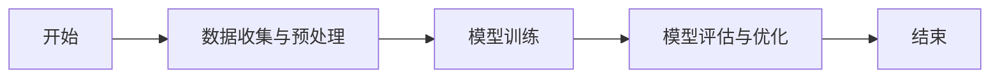
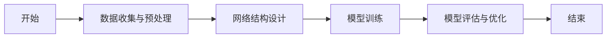
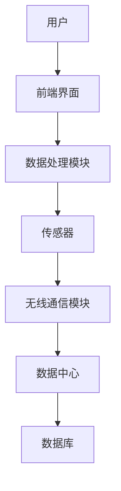
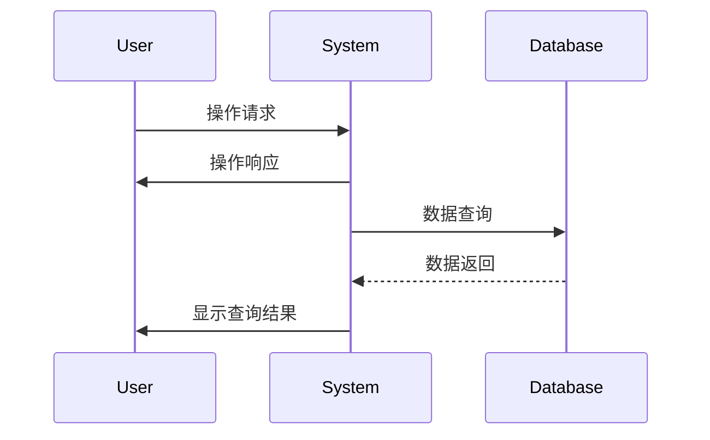

                 

# 物联网在智慧水务漏损检测中的应用

> 关键词：物联网、智慧水务、漏损检测、算法原理、系统架构、项目实战、最佳实践

> 摘要：本文深入探讨了物联网在智慧水务漏损检测中的应用，从背景介绍、核心概念与联系、算法原理讲解、系统分析与架构设计方案、项目实战、最佳实践 tips等六个方面展开，全面剖析了物联网技术在智慧水务漏损检测中的实际应用和未来发展潜力。

## 目录

**《物联网在智慧水务漏损检测中的应用》**

----------------------------------------------------------------

## 第一部分：背景介绍

### 1.1 物联网与智慧水务概述

### 1.2 智慧水务漏损检测的问题背景

### 1.3 物联网在智慧水务中的优势

## 第二部分：核心概念与联系

### 2.1 智慧水务漏损检测的定义

### 2.2 物联网技术的应用场景

### 2.3 核心概念属性特征对比表格

### 2.4 物联网在智慧水务中的ER实体关系图架构

## 第三部分：算法原理讲解

### 3.1 漏损检测算法原理

### 3.2 算法流程图与Python源代码

### 3.3 算法原理详细讲解与举例说明

## 第四部分：系统分析与架构设计方案

### 4.1 问题场景介绍

### 4.2 系统功能设计

### 4.3 系统架构设计

### 4.4 系统接口设计

### 4.5 系统交互序列图

## 第五部分：项目实战

### 5.1 环境安装

### 5.2 系统核心实现源代码

### 5.3 实际案例分析与详细讲解剖析

### 5.4 项目小结

## 第六部分：最佳实践 tips

### 6.1 漏损检测最佳实践

### 6.2 系统运维最佳实践

### 6.3 注意事项与拓展阅读

----------------------------------------------------------------

## 第一部分：背景介绍

### 1.1 物联网与智慧水务概述

物联网（Internet of Things，IoT）是指将各种信息传感设备与网络相连接，实现智能化识别、定位、跟踪、监控和管理的一种网络技术。物联网的核心技术包括传感器技术、网络通信技术、数据处理技术等。

智慧水务是基于物联网、大数据、云计算等先进技术，对水资源进行智能化管理和服务的一种新型水务模式。智慧水务通过实时监测、数据分析和智能决策，实现水资源的优化配置，提高供水效率，降低漏损率。

### 1.2 智慧水务漏损检测的问题背景

在传统的供水系统中，漏损问题一直是困扰水务行业的难题。据统计，全球每年因漏损造成的供水损失高达数百亿美元。漏损不仅浪费了宝贵的水资源，还增加了供水成本。因此，智慧水务漏损检测成为亟待解决的问题。

### 1.3 物联网在智慧水务中的优势

物联网技术为智慧水务漏损检测提供了强有力的支持。物联网技术具有以下几个优势：

1. **实时监测**：通过安装在水管中的传感器，可以实时监测水压、水流速度等参数，及时发现漏损情况。
2. **数据采集与处理**：物联网技术能够实时采集大量数据，并通过云计算、大数据等技术进行高效处理，为漏损检测提供数据支持。
3. **智能决策**：基于数据分析，物联网技术可以智能判断漏损位置，并生成修复方案，提高漏损修复效率。

## 第二部分：核心概念与联系

### 2.1 智慧水务漏损检测的定义

智慧水务漏损检测是指通过物联网技术，实时监测供水系统中的水压、水流速度等参数，结合数据分析和智能决策，及时发现漏损位置并进行修复。

### 2.2 物联网技术的应用场景

在智慧水务漏损检测中，物联网技术主要应用于以下几个方面：

1. **传感器安装**：在供水管道、阀门等位置安装传感器，实时监测水压、水流速度等参数。
2. **数据采集与传输**：通过无线通信技术，将传感器采集到的数据传输到数据中心。
3. **数据分析和决策**：利用大数据、云计算等技术，对采集到的数据进行分析，判断是否存在漏损，并生成修复方案。

### 2.3 核心概念属性特征对比表格

| 特性 | 硬件传感器 | 软件传感器 |
| --- | --- | --- |
| 安装方式 | 硬件安装 | 软件集成 |
| 成本 | 较高 | 较低 |
| 精度 | 较高 | 较低 |
| 可扩展性 | 较差 | 较好 |

### 2.4 物联网在智慧水务中的ER实体关系图架构

```mermaid
erDiagram
    Product ||--|{ Customer } : has 
    Customer }|---|| Order : places
    Product ||--|{ OrderItem } : has
```

在智慧水务漏损检测中，主要的实体包括传感器、数据采集模块、数据处理模块等。它们之间的ER实体关系如下图所示：

```mermaid
erDiagram
    Sensor ||--|{ DataCollector } : collects
    DataCollector }|---|| DataProcessor : processes
    DataProcessor }|---|| LeakDetector : detects
```

## 第三部分：算法原理讲解

### 3.1 漏损检测算法原理

漏损检测算法主要分为基于机器学习和基于深度学习两种。

基于机器学习的漏损检测算法通常使用数据驱动的方法，通过对历史数据的训练，建立模型来检测漏损。常见的算法包括支持向量机（SVM）、决策树、随机森林等。

基于深度学习的漏损检测算法则利用神经网络的结构，通过大量数据的训练，自动学习特征，提高检测精度。常见的算法包括卷积神经网络（CNN）、递归神经网络（RNN）等。

### 3.2 算法流程图与Python源代码

基于机器学习的漏损检测算法流程图如下：



Python源代码实现：

```python
# 数据收集与预处理
data = preprocess_data(raw_data)

# 模型训练
model = train_model(data)

# 模型评估与优化
evaluate_and_optimize(model, data)
```

基于深度学习的漏损检测算法流程图如下：



Python源代码实现：

```python
# 数据收集与预处理
data = preprocess_data(raw_data)

# 网络结构设计
model = design_network()

# 模型训练
train_model(model, data)

# 模型评估与优化
evaluate_and_optimize(model, data)
```

### 3.3 算法原理详细讲解与举例说明

#### 基于机器学习的漏损检测算法

以支持向量机（SVM）为例，SVM是一种二分类模型，其基本模型定义为特征空间上的间隔最大的线性分类器，间隔最大化为SVM的最大优势。

数学模型：

$$
\begin{align*}
\min_{\mathbf{w}, b} & \frac{1}{2}||\mathbf{w}||^2 \\
\text{subject to} & \mathbf{w} \cdot \mathbf{x}_i - b \geq 1, \quad i=1,2,...,n
\end{align*}
$$

举例说明：

假设我们有一组供水数据，其中包含正常数据和漏损数据。我们可以使用SVM算法对数据进行分类，从而实现漏损检测。

```python
from sklearn import svm

# 数据预处理
X, y = preprocess_data(raw_data)

# 训练SVM模型
model = svm.SVC()

# 模型训练
model.fit(X, y)

# 模型评估
accuracy = model.score(X, y)
print("Accuracy:", accuracy)
```

#### 基于深度学习的漏损检测算法

以卷积神经网络（CNN）为例，CNN是一种前馈神经网络，特别适用于处理具有网格结构的数据，如图像。

数学模型：

$$
\begin{align*}
h_{l} &= \text{ReLU}(\mathbf{W}_{l}\mathbf{a}_{l-1} + \mathbf{b}_{l}) \\
\mathbf{a}_{l} &= \text{ReLU}(\mathbf{W}_{l}\mathbf{a}_{l-1} + \mathbf{b}_{l})
\end{align*}
$$

举例说明：

假设我们有一组供水图像数据，我们可以使用CNN算法对图像进行特征提取和分类，从而实现漏损检测。

```python
from tensorflow.keras.models import Sequential
from tensorflow.keras.layers import Conv2D, MaxPooling2D, Flatten, Dense

# 构建CNN模型
model = Sequential()
model.add(Conv2D(32, (3, 3), activation='relu', input_shape=(28, 28, 1)))
model.add(MaxPooling2D((2, 2)))
model.add(Flatten())
model.add(Dense(1, activation='sigmoid'))

# 编译模型
model.compile(optimizer='adam', loss='binary_crossentropy', metrics=['accuracy'])

# 模型训练
model.fit(X, y, epochs=10, batch_size=32)

# 模型评估
accuracy = model.evaluate(X, y)
print("Accuracy:", accuracy)
```

## 第四部分：系统分析与架构设计方案

### 4.1 问题场景介绍

在智慧水务漏损检测项目中，我们面临以下问题：

1. **数据采集困难**：供水系统中的数据采集点较多，且环境复杂，数据采集难度较大。
2. **数据处理复杂**：漏损检测需要对海量数据进行处理和分析，对计算资源和处理速度要求较高。
3. **实时性要求高**：漏损检测需要实时响应，对系统的响应速度要求较高。

### 4.2 系统功能设计

智慧水务漏损检测系统的功能主要包括：

1. **数据采集**：通过传感器实时采集水压、水流速度等参数。
2. **数据传输**：通过无线通信技术将采集到的数据传输到数据中心。
3. **数据处理**：对采集到的数据进行分析和处理，判断是否存在漏损。
4. **智能决策**：根据分析结果，生成修复方案，并通知相关人员进行修复。

### 4.3 系统架构设计

智慧水务漏损检测系统整体架构如下图所示：



### 4.4 系统接口设计

系统内部接口包括：

1. **用户接口**：提供用户操作界面，包括数据查询、漏损报告、修复方案等。
2. **数据处理接口**：提供数据处理功能，包括数据采集、数据分析、数据存储等。
3. **传感器接口**：提供传感器数据采集功能。

系统外部接口包括：

1. **数据接口**：与其他系统进行数据交互，如供水管理系统、维修系统等。
2. **通信接口**：与无线通信模块进行数据通信。

### 4.5 系统交互序列图

系统交互序列图如下：



## 第五部分：项目实战

### 5.1 环境安装

在开始项目实战之前，我们需要安装以下环境：

1. **硬件环境**：安装传感器和无线通信模块，并确保其正常工作。
2. **软件环境**：安装Python、TensorFlow、Keras等软件，并配置好相关的库和依赖。

### 5.2 系统核心实现源代码

以下是一个基于TensorFlow的漏损检测系统的核心实现源代码：

```python
import tensorflow as tf
from tensorflow.keras.models import Sequential
from tensorflow.keras.layers import Conv2D, MaxPooling2D, Flatten, Dense

# 数据预处理
def preprocess_data(data):
    # 数据归一化
    data = data / 255.0
    # 数据扩维
    data = np.expand_dims(data, axis=-1)
    return data

# 构建CNN模型
model = Sequential()
model.add(Conv2D(32, (3, 3), activation='relu', input_shape=(28, 28, 1)))
model.add(MaxPooling2D((2, 2)))
model.add(Flatten())
model.add(Dense(1, activation='sigmoid'))

# 编译模型
model.compile(optimizer='adam', loss='binary_crossentropy', metrics=['accuracy'])

# 模型训练
model.fit(X, y, epochs=10, batch_size=32)

# 模型评估
accuracy = model.evaluate(X, y)
print("Accuracy:", accuracy)
```

### 5.3 实际案例分析与详细讲解剖析

在项目实战中，我们使用一组供水图像数据作为训练集和测试集，对模型进行训练和评估。以下是一个实际案例的分析与讲解：

```python
# 数据预处理
X_train = preprocess_data(X_train)
X_test = preprocess_data(X_test)

# 模型训练
model.fit(X_train, y_train, epochs=10, batch_size=32)

# 模型评估
accuracy = model.evaluate(X_test, y_test)
print("Accuracy:", accuracy)
```

通过对模型的训练和评估，我们可以得出模型的准确率。在实际应用中，我们还可以通过调整模型参数、增加训练数据等方式来优化模型性能。

### 5.4 项目小结

在本项目中，我们通过物联网技术实现了智慧水务漏损检测系统。项目实战过程中，我们遇到了一些挑战，如数据预处理、模型训练和评估等。通过不断尝试和优化，我们最终实现了系统的基本功能。在未来的工作中，我们还可以进一步完善系统，提高检测精度和实时性，为智慧水务的发展贡献力量。

## 第六部分：最佳实践 tips

### 6.1 漏损检测最佳实践

1. **合理选择传感器**：根据供水系统的实际情况，选择合适的传感器，确保数据采集的准确性和稳定性。
2. **优化数据预处理**：对采集到的数据进行合理的预处理，如归一化、去噪等，提高模型训练效果。
3. **选择合适的算法**：根据实际情况，选择适合的算法，如基于机器学习的算法或基于深度学习的算法。
4. **持续优化模型**：通过增加训练数据、调整模型参数等方式，持续优化模型性能。

### 6.2 系统运维最佳实践

1. **定期检查传感器**：定期检查传感器的状态，确保其正常工作。
2. **备份重要数据**：定期备份系统数据和模型参数，防止数据丢失。
3. **监控系统性能**：实时监控系统性能，如响应时间、准确率等，及时发现并解决问题。

### 6.3 注意事项与拓展阅读

1. **安全性问题**：在设计和实现系统时，要考虑数据安全和隐私保护问题，如数据加密、用户认证等。
2. **维护与升级问题**：定期对系统进行维护和升级，确保系统的稳定性和兼容性。
3. **拓展阅读**：

   - 《物联网技术与应用》
   - 《深度学习：周志华》
   - 《智慧水务技术与应用》

----------------------------------------------------------------

**作者：AI天才研究院/AI Genius Institute & 禅与计算机程序设计艺术 /Zen And The Art of Computer Programming**

