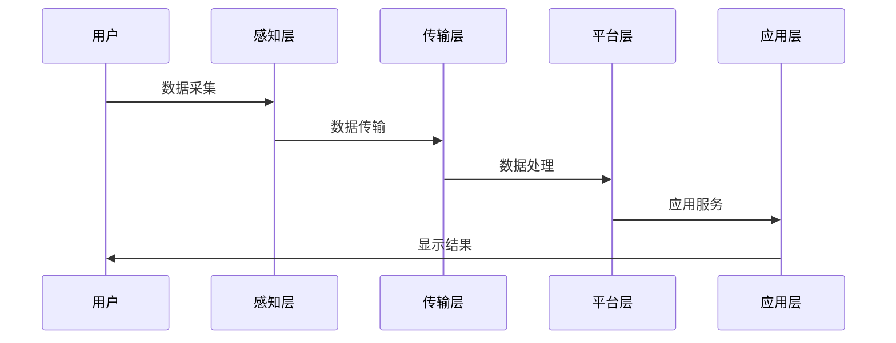

                 

### 《物联网在智慧水务管理中的全面应用》

#### 关键词：物联网、智慧水务、传感器技术、数据采集、系统架构、项目实践

#### 摘要：

随着物联网技术的迅猛发展，其在智慧水务管理中的全面应用已经成为行业热点。本文从物联网技术概述、智慧水务管理背景、物联网技术在智慧水务中的应用、关键技术解析、系统架构设计、项目实践等方面，详细阐述了物联网在智慧水务管理中的全面应用，为相关领域的从业者提供了有价值的参考。

#### 目录：

1. 引言
2. 物联网技术概述
3. 智慧水务管理背景
4. 物联网技术在智慧水务中的应用
5. 关键技术解析
6. 系统架构设计
7. 项目实践
8. 结论与未来展望
9. 附录

#### 引言

随着城市化进程的加快，水资源管理的重要性日益凸显。智慧水务管理作为水资源管理的一种新模式，以其高效、智能、可持续的特点，受到了广泛关注。而物联网技术的迅猛发展，为智慧水务管理提供了强大的技术支撑。本文旨在探讨物联网在智慧水务管理中的全面应用，为相关领域的从业者提供有益的参考。

#### 物联网技术概述

##### 1.1 物联网的定义与基本原理

物联网（Internet of Things，IoT）是指通过将各种信息传感设备与互联网连接，实现智能化的网络体系。它将传感器、软件、网络和计算机等现代信息技术相结合，实现对物理世界的全面感知、智能处理和自动控制。

##### 1.2 物联网的关键技术

物联网的关键技术包括传感器技术、数据采集与处理技术、网络通信技术等。传感器技术是实现物联网感知功能的核心，数据采集与处理技术是实现物联网智能处理的关键，网络通信技术是实现物联网互联互通的基石。

##### 1.3 物联网技术的发展趋势

随着物联网技术的不断成熟，其在各行业的应用越来越广泛。未来，物联网技术将朝着更加智能化、泛在化、安全化的方向发展，为智慧水务管理提供更加高效、智能的解决方案。

#### 智慧水务管理背景

##### 2.1 智慧水务的必要性

智慧水务是一种以信息技术和物联网技术为支撑的水资源管理新模式，它能够实现水资源的高效利用、优化调度和精准监控，对于解决我国水资源短缺、水污染等问题具有重要意义。

##### 2.2 智慧水务的管理挑战

智慧水务管理面临着数据采集与处理、系统互联互通、信息安全等方面的挑战。如何有效应对这些挑战，实现智慧水务管理的全面升级，成为当前亟待解决的问题。

##### 2.3 智慧水务的现状与展望

当前，智慧水务在我国已经取得了初步成果，但仍处于探索阶段。未来，随着物联网技术的不断成熟，智慧水务将在水资源管理、环境保护、城市安全等方面发挥更大的作用。

#### 物联网技术在智慧水务中的应用

##### 3.1 水资源监测

物联网技术可以通过传感器网络对水资源进行实时监测，包括水位、流量、水质等参数。这些数据可以为水资源调度和管理提供有力支持。

##### 3.2 水质监测

物联网技术可以实现对水质指标的实时监测和预警，有效防止水污染事故的发生。

##### 3.3 水资源调度与管理

物联网技术可以实现对水资源的优化调度和管理，提高水资源的利用效率。

##### 3.4 水泵站自动化管理

物联网技术可以实现水泵站的自动化管理，提高泵站的运行效率，降低运维成本。

#### 关键技术解析

##### 4.1 传感器技术

传感器技术是物联网技术的核心，它能够实现物理世界的信息采集。在智慧水务管理中，传感器技术广泛应用于水位、流量、水质等参数的监测。

##### 4.2 数据采集与处理技术

数据采集与处理技术是实现物联网智能处理的关键。通过数据采集与处理技术，可以实现对监测数据的实时分析、处理和存储。

##### 4.3 网络通信技术

网络通信技术是实现物联网互联互通的基石。在智慧水务管理中，网络通信技术可以保证数据传输的实时性、可靠性和安全性。

#### 系统架构设计

##### 5.1 整体架构设计

智慧水务管理系统可以分为感知层、传输层、平台层和应用层。感知层负责数据采集，传输层负责数据传输，平台层负责数据处理和分析，应用层负责提供各种应用服务。

##### 5.2 硬件架构设计

硬件架构设计包括传感器、数据采集器、服务器等设备的选择和配置。

##### 5.3 软件架构设计

软件架构设计包括数据采集与处理模块、平台管理模块、应用服务模块等。

##### 5.4 系统接口设计

系统接口设计包括数据接口、服务接口等，用于实现系统间的数据交互和服务调用。

##### 5.5 系统交互mermaid序列图

#### 项目实践

##### 6.1 系统安装与配置

系统安装与配置包括硬件设备的安装、软件系统的配置和数据接口的调试等。

##### 6.2 系统调试与优化

系统调试与优化包括系统功能的测试、性能的优化和数据安全的保障等。

##### 6.3 实际案例分析与讲解

本文将结合实际案例，对物联网在智慧水务管理中的应用进行详细分析，包括系统架构、关键技术、项目实施过程和效果评估等方面。

#### 结论与未来展望

物联网在智慧水务管理中具有广泛的应用前景。未来，随着物联网技术的不断成熟，智慧水务管理将在水资源管理、环境保护、城市安全等方面发挥更大的作用。

#### 附录

附录部分将提供本文引用的相关文献和资料，以供读者进一步学习和参考。

#### 作者信息

作者：AI天才研究院/AI Genius Institute & 禅与计算机程序设计艺术 /Zen And The Art of Computer Programming

### 结语

物联网在智慧水务管理中的全面应用，将为水资源管理带来新的变革。本文通过对物联网技术概述、智慧水务管理背景、物联网技术在智慧水务中的应用、关键技术解析、系统架构设计、项目实践等方面的探讨，为相关领域的从业者提供了有益的参考。未来，随着物联网技术的不断发展，智慧水务管理将在水资源管理、环境保护、城市安全等方面发挥更大的作用。

