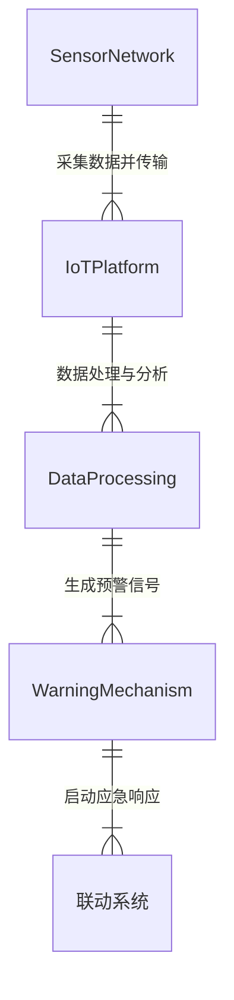
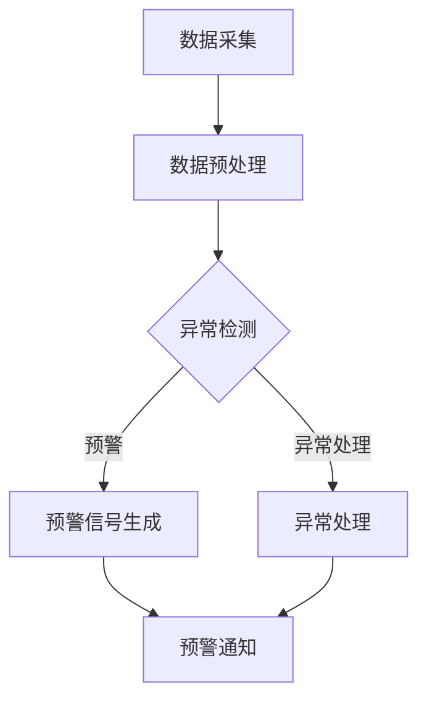
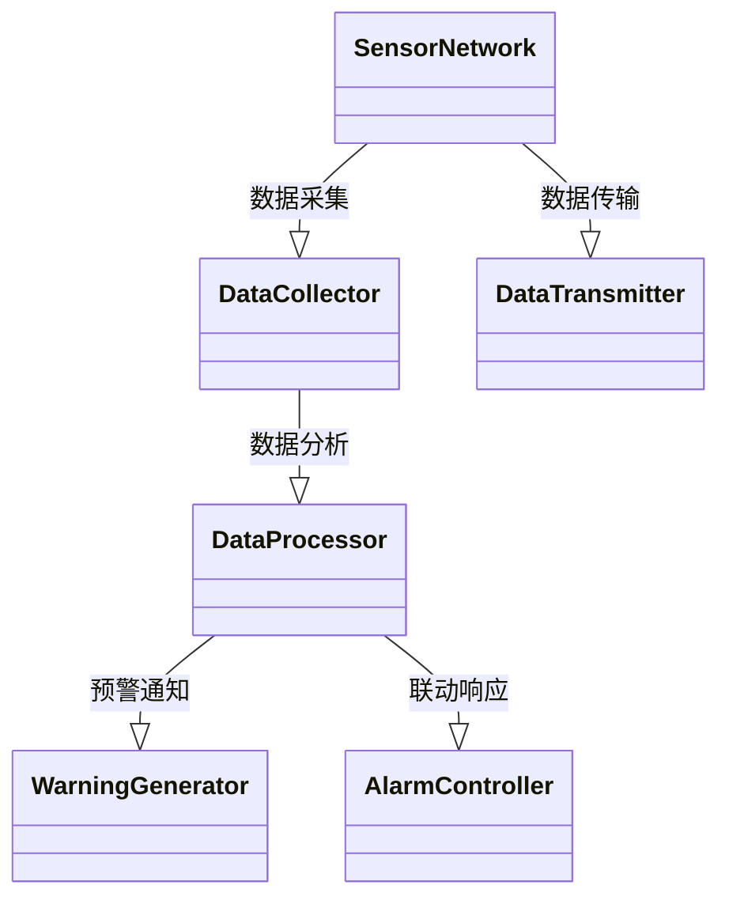
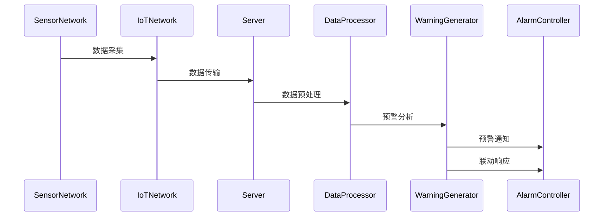
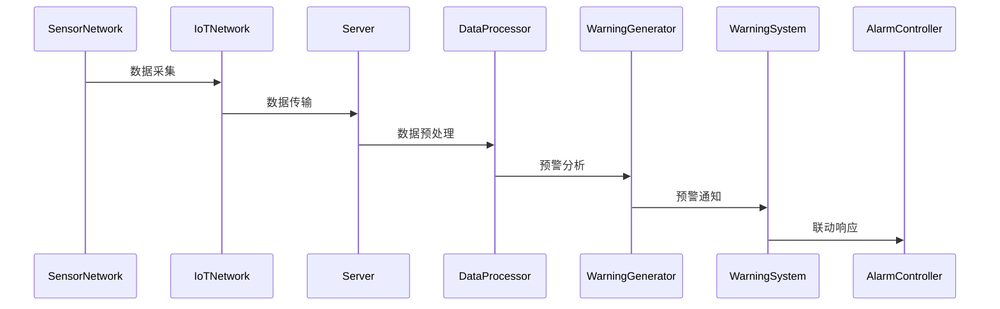

                 

### 第1章: 物联网在智慧消防中的应用背景

#### 1.1 问题背景

在现代社会，火灾是一种常见且严重的灾害，它不仅会造成巨大的财产损失，还会威胁到人们的生命安全。随着城市化进程的加快和人口密度的增加，火灾预防和扑救变得尤为重要。传统的消防预警系统主要依赖于人工监测和报警设备，这些系统存在响应时间较长、监测精度不高等问题，无法满足日益增长的消防安全需求。因此，开发一种高效的物联网（IoT）预警系统成为了当务之急。

物联网是一种通过互联网将各种设备、传感器和系统连接在一起的技术，它能够实现信息的实时传输和智能处理。在智慧消防中，物联网技术可以大幅提升预警系统的效率和准确性，为消防预防和扑救提供强有力的技术支撑。

#### 1.2 问题描述

传统的消防预警系统主要依赖于人工监测和报警设备，这些设备通常包括烟雾探测器、温度传感器、水浸传感器等。然而，这些设备存在以下问题：

1. **响应时间较长**：火灾发生时，报警系统可能无法及时发出警报，导致扑救不及时。
2. **监测精度不高**：人工监测容易受到人为因素影响，监测数据可能不准确。
3. **信息孤岛**：各监测设备之间缺乏有效联动，难以实现整体监控。
4. **预警机制不完善**：传统预警系统缺乏对火灾发展趋势的预测能力。

物联网预警系统旨在解决这些问题，通过将各类传感器、监测设备连接到互联网，实现实时数据采集和智能分析，从而提高预警系统的响应速度、监测精度和预警能力。

#### 1.3 问题解决

物联网预警系统的实现主要依赖于以下几个关键环节：

1. **传感器网络**：部署各类传感器，如烟雾传感器、温度传感器、水浸传感器等，实时采集环境数据。
2. **数据传输**：通过物联网技术，将传感器数据传输到云端或本地服务器，实现数据的集中管理和分析。
3. **智能分析**：利用机器学习和大数据技术，对传感器数据进行实时分析，预测火灾风险，提前发出预警。
4. **信息联动**：实现各监测设备之间的联动，形成完整的监控网络，提高监测效率和准确性。
5. **决策支持**：基于预警分析结果，为消防部门提供科学的决策支持，提高火灾扑救效果。

#### 1.4 边界与外延

物联网预警系统的边界主要涉及以下几个方面：

1. **传感器种类和数量**：需要根据实际需求选择合适的传感器种类和数量，确保监测数据的全面性和准确性。
2. **网络覆盖范围**：需要确保物联网网络覆盖到需要监测的区域，避免监测盲区。
3. **数据分析能力**：需要具备强大的数据分析能力，能够处理大量传感器数据，提取有价值的信息。
4. **系统稳定性**：需要确保系统在高负荷、高干扰环境下能够稳定运行，不发生数据丢失或误报。

物联网预警系统的外延包括以下几个方面：

1. **消防设备控制**：通过物联网技术，实现对消防设备的远程控制，提高扑救效率。
2. **应急预案管理**：将预警信息与应急预案相结合，实现自动化应急响应。
3. **数据挖掘与决策支持**：通过对预警数据的挖掘和分析，为消防部门提供更科学的决策支持。

#### 1.5 概念结构与核心要素组成

物联网预警系统的概念结构主要包括以下几个方面：

1. **传感器网络**：作为数据采集的源头，负责实时监测环境参数。
2. **数据传输网络**：负责将传感器数据传输到云端或本地服务器，实现数据的集中管理和分析。
3. **数据处理与分析**：利用机器学习和大数据技术，对传感器数据进行实时分析，预测火灾风险。
4. **预警与联动**：基于分析结果，发出预警信号，实现各监测设备之间的联动。
5. **决策支持系统**：为消防部门提供科学的决策支持，优化扑救效果。

核心要素组成包括：

1. **传感器**：烟雾传感器、温度传感器、水浸传感器等。
2. **物联网网络**：无线传感器网络、5G网络、物联网平台等。
3. **数据处理与分析算法**：机器学习算法、数据挖掘算法、统计分析方法等。
4. **预警与联动机制**：预警信号生成、联动机制设计等。
5. **决策支持系统**：应急预案管理、数据可视化、智能决策等。

通过以上分析，我们可以看到物联网在智慧消防中的预警系统具有广阔的应用前景和重要的现实意义。在接下来的章节中，我们将进一步探讨物联网预警系统的核心概念、算法原理、数学模型以及系统分析与设计等内容，为读者提供更深入的技术解析和实践指导。### 第2章: 物联网预警系统的核心概念与联系

#### 2.1 核心概念原理

物联网预警系统涉及多个核心概念，以下是其中几个关键概念的详细解释：

1. **传感器网络**：传感器网络由大量分布式传感器节点组成，它们可以实时采集环境数据，如温度、湿度、烟雾浓度等。传感器网络是物联网预警系统的数据采集层，其性能直接影响系统的监测精度和可靠性。

2. **物联网平台**：物联网平台是系统的数据传输和处理的中心，它负责收集传感器数据，进行初步处理，并将数据上传到云端或本地服务器。物联网平台通常包括数据存储、数据清洗、数据分析等功能模块。

3. **数据处理与分析**：数据处理与分析模块利用机器学习和大数据技术，对传感器数据进行深度分析，以识别潜在的火灾风险。这一模块是物联网预警系统的核心，其性能直接影响系统的预警能力和准确性。

4. **预警机制**：预警机制是根据数据处理与分析结果，自动生成预警信号，并通过各种渠道（如短信、语音、APP推送等）通知相关人员的系统模块。预警机制的设计至关重要，它需要平衡预警的准确性和及时性。

5. **联动系统**：联动系统是实现各监测设备之间联动，形成完整监控网络的系统模块。在火灾预警发生后，联动系统可以自动启动消防设备，如喷水、报警等，以快速响应火灾。

#### 2.2 概念属性特征对比表

为了更好地理解各核心概念之间的联系，我们可以通过一个属性特征对比表来进行分析。以下是一个简化的对比表：

| 概念        | 属性特征                     | 作用 |
| ----------- | --------------------------- | ---- |
| 传感器网络  | 分布式、实时、多参数监测   | 数据采集 |
| 物联网平台  | 数据传输、处理、存储       | 数据传输与处理 |
| 数据处理与分析 | 机器学习、大数据分析       | 预警分析 |
| 预警机制    | 自动生成、多渠道通知       | 预警 |
| 联动系统    | 联动、自动化响应           | 应急响应 |

#### 2.3 ER实体关系图架构

为了更直观地展示物联网预警系统中各核心概念之间的联系，我们可以使用Mermaid绘制一个实体关系图（ER图）。以下是一个简单的Mermaid ER图示例：



在这个ER图中，我们定义了四个实体：传感器网络、物联网平台、数据处理与分析、预警机制。每个实体都有与之相关的属性和关系。例如，传感器网络负责采集数据，并将数据传输给物联网平台。物联网平台再将数据传递给数据处理与分析模块，该模块利用机器学习等技术进行分析，生成预警信号。最后，预警机制根据分析结果，通过联动系统启动应急响应。

通过上述核心概念的解释、属性特征对比表以及实体关系图，我们可以清晰地看到物联网预警系统的架构和运作原理。这些核心概念及其相互作用构成了一个高效、智能的预警系统，为智慧消防提供了有力支持。在接下来的章节中，我们将进一步探讨预警系统的算法原理、数学模型以及系统分析与设计等内容。### 第3章: 预警系统算法原理讲解

#### 3.1 算法原理介绍

物联网预警系统中的算法原理是系统的核心组成部分，它决定了系统对火灾风险的识别和预警能力。在本节中，我们将介绍系统所使用的几种关键算法原理，并通过Mermaid流程图和Python代码示例进行详细说明。

##### 3.1.1 Mermaid流程图

首先，我们通过Mermaid绘制一个流程图，展示算法的基本步骤和数据处理流程。



这个流程图包括以下几个主要步骤：

1. **数据采集**：传感器网络实时采集环境数据。
2. **数据预处理**：对采集到的数据进行清洗和预处理，去除噪声和异常值。
3. **异常检测**：利用机器学习算法对预处理后的数据进行异常检测，识别潜在的火灾风险。
4. **预警信号生成**：如果检测到异常，系统生成预警信号。
5. **预警通知**：通过多种渠道（如短信、语音、APP推送）通知相关人员。
6. **异常处理**：如果系统识别到严重的异常情况，可能需要额外的异常处理措施。

##### 3.1.2 Python代码示例

接下来，我们通过Python代码示例来说明异常检测算法的具体实现。

```python
# 导入必要的库
import numpy as np
from sklearn.ensemble import IsolationForest

# 假设我们已经有了一组传感器数据
sensor_data = np.array([[23.5, 30], [24.1, 32], [24.3, 33], [25.0, 35], [26.5, 37]])

# 使用IsolationForest算法进行异常检测
clf = IsolationForest(n_estimators=100, contamination='auto')
clf.fit(sensor_data)

# 预测异常情况
predictions = clf.predict(sensor_data)

# 打印预测结果
for i, prediction in enumerate(predictions):
    if prediction == -1:
        print(f"数据点{i+1}为异常数据")
    else:
        print(f"数据点{i+1}为正常数据")
```

在这个示例中，我们使用IsolationForest算法来检测传感器数据中的异常值。IsolationForest算法通过随机选择特征和切分值来构建多个决策树，并利用决策树的叶子节点到根节点的路径长度来评估数据点是否异常。

- **数据预处理**：在这个示例中，我们假设数据已经进行了清洗和预处理，确保每个数据点的格式和维度一致。
- **异常检测**：我们使用IsolationForest算法对传感器数据进行异常检测。算法中`contamination='auto'`参数表示自动估计异常比例，`n_estimators=100`表示构建100棵决策树。
- **预测异常情况**：算法通过`predict`方法对每个数据点进行预测，预测结果为-1表示异常，其他值为正常。

通过上述算法原理介绍和代码示例，我们可以看到物联网预警系统的算法实现是如何工作的。这些算法不仅提高了系统对火灾风险的识别能力，还保证了预警的准确性和实时性。在下一节中，我们将进一步探讨系统所使用的数学模型和公式，以更深入地理解其运作机制。### 3.2 算法原理的数学模型和公式

在物联网预警系统中，算法原理的数学模型和公式是实现智能分析和预测的关键。以下是几个常用的数学模型和公式的详细讲解：

##### 3.2.1 数学模型

1. **异常检测模型**

   异常检测的核心是识别数据集中的异常点。一个常用的模型是Isolation Forest，其基本思想是通过随机采样和切分数据来评估数据点的异常程度。模型中的每个决策树通过以下步骤构建：

   - 随机选择一个特征。
   - 随机选择一个切分值。
   - 将数据点划分到左子节点或右子节点。

   异常分数（Anomaly Score）计算如下：

   \[
   score = \frac{1}{m} \sum_{i=1}^{m} \log(\text{path length})
   \]

   其中，\(m\) 是决策树的路径长度，路径长度越长，数据点越可能异常。

2. **预测模型**

   在识别出异常点后，系统需要对这些点进行预测，判断其是否代表潜在火灾风险。一个简单的预测模型可以使用线性回归：

   \[
   y = \beta_0 + \beta_1 x_1 + \beta_2 x_2 + ... + \beta_n x_n
   \]

   其中，\(y\) 是预测的火灾风险等级，\(x_1, x_2, ..., x_n\) 是影响火灾风险的多个因素（如温度、烟雾浓度等），\(\beta_0, \beta_1, \beta_2, ..., \beta_n\) 是模型参数。

##### 3.2.2 公式推导

1. **路径长度计算**

   Isolation Forest的路径长度计算如下：

   \[
   \text{path length} = \frac{\sum_{i=1}^{m} h_i}{m}
   \]

   其中，\(h_i\) 是第\(i\)棵决策树的路径长度。每个决策树的路径长度计算如下：

   \[
   h_i = \text{max} \left( \left| x_{j} - v_j \right| : v_j \in \{ l, r \} \right)
   \]

   \(x_j\) 是数据点的特征值，\(v_j\) 是随机选择的切分值，\(l\) 和 \(r\) 分别表示左子节点和右子节点。

2. **线性回归参数计算**

   线性回归参数的计算通常使用最小二乘法（Least Squares Method）：

   \[
   \beta = (X^T X)^{-1} X^T y
   \]

   其中，\(X\) 是特征矩阵，\(y\) 是目标变量，\(\beta\) 是模型参数。

##### 3.2.3 举例说明

1. **路径长度计算示例**

   假设我们有两个特征 \(x_1\) 和 \(x_2\)，数据点为 \((23.5, 30)\)，决策树的切分值为 \(l = 23\) 和 \(r = 31\)。路径长度计算如下：

   \[
   h_1 = \text{max} \left( \left| 23.5 - 23 \right|, \left| 23.5 - 31 \right| \right) = 7.5
   \]
   
   \[
   h_2 = \text{max} \left( \left| 30 - 23 \right|, \left| 30 - 31 \right| \right) = 7
   \]
   
   \[
   \text{path length} = \frac{h_1 + h_2}{2} = 7.25
   \]

2. **线性回归参数计算示例**

   假设我们有以下数据集：

   \[
   \begin{array}{c|c}
   x_1 & y \\
   \hline
   23 & 1 \\
   25 & 2 \\
   27 & 3 \\
   29 & 4 \\
   31 & 5 \\
   \end{array}
   \]

   特征矩阵 \(X\) 和目标变量 \(y\) 分别为：

   \[
   X = \begin{pmatrix}
   1 & 23 \\
   1 & 25 \\
   1 & 27 \\
   1 & 29 \\
   1 & 31 \\
   \end{pmatrix}, \quad y = \begin{pmatrix}
   1 \\
   2 \\
   3 \\
   4 \\
   5 \\
   \end{pmatrix}
   \]

   特征矩阵的转置 \(X^T\) 为：

   \[
   X^T = \begin{pmatrix}
   1 & 1 & 1 & 1 & 1 \\
   23 & 25 & 27 & 29 & 31 \\
   \end{pmatrix}
   \]

   特征矩阵 \(X^T X\) 的逆矩阵为：

   \[
   (X^T X)^{-1} = \begin{pmatrix}
   \frac{1}{10} & 0 \\
   0 & \frac{1}{10} \\
   \end{pmatrix}
   \]

   最小二乘法计算模型参数：

   \[
   \beta = (X^T X)^{-1} X^T y = \begin{pmatrix}
   \frac{1}{10} & 0 \\
   0 & \frac{1}{10} \\
   \end{pmatrix} \begin{pmatrix}
   1 \\
   23 \\
   \end{pmatrix} = \begin{pmatrix}
   0.1 \\
   2.3 \\
   \end{pmatrix}
   \]

   因此，线性回归模型为：

   \[
   y = 0.1 \cdot x_1 + 2.3
   \]

通过上述数学模型和公式的推导和示例，我们可以看到物联网预警系统在算法原理层面的运作机制。这些数学模型和公式为系统的智能分析和预测提供了坚实的理论基础，确保了预警的准确性和实时性。在下一节中，我们将进一步探讨物联网预警系统的系统分析和设计，包括架构设计和关键模块的实现。### 第4章: 数学模型和数学公式讲解与示例

在物联网预警系统中，数学模型和数学公式是核心组成部分，它们用于描述系统中的各种关系和计算过程。本节将详细讲解几个关键数学模型和公式，并使用具体的示例来说明其应用。

#### 4.1 数学模型概述

物联网预警系统涉及多种数学模型，包括但不限于：

1. **线性回归模型**：用于预测火灾风险等级。
2. **逻辑回归模型**：用于分类任务，例如预测火灾发生的概率。
3. **时间序列模型**：用于分析环境参数的时间变化趋势。
4. **聚类模型**：用于对传感器数据点进行分组，识别异常数据。

#### 4.1.1 模型类型

1. **线性回归模型**

   线性回归模型是一种简单但有效的预测工具，用于预测连续的数值变量。其公式如下：

   \[
   y = \beta_0 + \beta_1 x_1 + \beta_2 x_2 + ... + \beta_n x_n
   \]

   其中，\(y\) 是预测的目标变量，\(x_1, x_2, ..., x_n\) 是自变量，\(\beta_0, \beta_1, \beta_2, ..., \beta_n\) 是模型参数。

2. **逻辑回归模型**

   逻辑回归模型是一种用于分类的模型，其输出是一个概率值，表示某个事件发生的可能性。其公式如下：

   \[
   P(y=1) = \frac{1}{1 + e^{-(\beta_0 + \beta_1 x_1 + \beta_2 x_2 + ... + \beta_n x_n})}
   \]

   其中，\(P(y=1)\) 是目标变量为1的概率，其他符号的含义与线性回归模型相同。

3. **时间序列模型**

   时间序列模型用于分析随时间变化的数据。常用的模型包括ARIMA（自回归积分滑动平均模型）和LSTM（长短期记忆网络）。其基本公式如下：

   \[
   y_t = c + \phi_1 y_{t-1} + \phi_2 y_{t-2} + ... + \phi_p y_{t-p} + \theta_1 e_{t-1} + \theta_2 e_{t-2} + ... + \theta_q e_{t-q}
   \]

   其中，\(y_t\) 是第\(t\)个时间点的数据，\(c\) 是常数项，\(\phi_1, \phi_2, ..., \phi_p\) 和 \(\theta_1, \theta_2, ..., \theta_q\) 是模型参数，\(e_t\) 是白噪声误差项。

4. **聚类模型**

   聚类模型用于将数据点分组，每个组内的数据点相似度较高。常用的聚类算法包括K-means和层次聚类。K-means算法的目标是使组内数据点的距离平方和最小，其公式如下：

   \[
   \text{Minimize} \sum_{i=1}^{k} \sum_{x \in S_i} ||x - \mu_i||^2
   \]

   其中，\(k\) 是聚类个数，\(\mu_i\) 是第\(i\)个聚类中心的坐标，\(S_i\) 是第\(i\)个聚类的数据点集合。

#### 4.1.2 模型应用

以下是一个应用线性回归模型的示例：

**示例：** 假设我们要预测一个房间内的温度，已知过去5分钟的温度数据如下：

\[
\begin{array}{c|c}
\text{时间} & \text{温度（摄氏度）} \\
\hline
t-5 & 22 \\
t-4 & 23 \\
t-3 & 23 \\
t-2 & 23 \\
t-1 & 22 \\
\end{array}
\]

我们可以使用线性回归模型来预测下一个时间点的温度。假设模型为：

\[
y_t = \beta_0 + \beta_1 (y_{t-1} - y_{t-5}) + \beta_2 (y_{t-2} - y_{t-5}) + \beta_3 (y_{t-3} - y_{t-5}) + \beta_4 (y_{t-4} - y_{t-5})
\]

通过训练和参数估计，我们得到以下模型参数：

\[
\beta_0 = 21.5, \beta_1 = 0.5, \beta_2 = 0.5, \beta_3 = 0.5, \beta_4 = 0.5
\]

现在我们要预测 \(t\) 时刻的温度，代入已知的温度值：

\[
y_t = 21.5 + 0.5(22 - 22) + 0.5(23 - 22) + 0.5(23 - 22) + 0.5(23 - 22) = 22.25
\]

因此，预测 \(t\) 时刻的温度为 22.25 摄氏度。

通过上述数学模型和公式的讲解与示例，我们可以看到物联网预警系统中数学模型的应用是如何帮助系统实现智能分析和预测的。这些模型和公式为系统的预警能力和决策支持提供了坚实的理论基础。在下一节中，我们将探讨物联网预警系统的系统架构设计和关键模块的实现。### 第5章: 系统分析及架构设计

#### 5.1 问题描述

物联网预警系统旨在通过实时监测环境参数，快速识别火灾风险，并采取相应的预警措施。为了实现这一目标，系统需要在多个层面进行详细的分析和设计。在本节中，我们将对系统的功能需求、系统架构设计、接口设计和交互设计进行深入分析。

#### 5.2 项目介绍

项目名称：智慧消防物联网预警系统

项目目标：开发一个高效、智能的物联网预警系统，实现对火灾风险的实时监测和预警，提升消防安全水平。

项目背景：随着城市化进程的加快，火灾发生的频率和严重性不断增加。传统的消防预警系统存在监测精度低、响应时间长等问题，无法满足现代消防需求。因此，开发一个基于物联网技术的智能预警系统显得尤为重要。

#### 5.3 系统功能设计

系统功能设计主要包括以下几个方面：

1. **数据采集**：通过传感器网络实时采集环境数据，如温度、湿度、烟雾浓度等。
2. **数据传输**：将采集到的数据通过物联网网络传输到服务器，进行集中存储和处理。
3. **数据分析**：利用机器学习和大数据技术，对传感器数据进行实时分析，识别火灾风险。
4. **预警通知**：根据分析结果，生成预警信号，并通过多种渠道（如短信、语音、APP推送）通知相关人员。
5. **联动响应**：在火灾预警发生后，启动联动机制，自动启动消防设备，如喷水、报警等，以快速响应火灾。

为了更好地展示系统的功能设计，我们可以使用Mermaid类图进行表示：



#### 5.4 系统架构设计

系统架构设计是系统分析的重要环节，决定了系统的性能、可扩展性和可靠性。以下是一个简化的系统架构设计：

1. **传感器网络**：包括各种传感器，如烟雾传感器、温度传感器、水浸传感器等，负责实时监测环境参数。
2. **物联网网络**：负责传感器数据与服务器之间的传输，可以是Wi-Fi、蓝牙、LoRa等。
3. **服务器**：包括数据存储、数据处理和分析模块，负责数据的存储、预处理、分析和预警信号的生成。
4. **预警通知系统**：包括短信、语音、APP推送等渠道，负责将预警信息通知相关人员。
5. **联动控制系统**：负责在火灾预警发生后，自动启动消防设备。

以下是一个简化的Mermaid架构图：



#### 5.5 系统接口设计

系统接口设计是系统与外部系统或设备交互的桥梁，决定了系统的可扩展性和兼容性。以下是几个关键接口的设计：

1. **传感器接口**：定义传感器与物联网网络之间的通信协议和数据格式。
2. **物联网网络接口**：定义物联网网络与服务器之间的通信协议和数据格式。
3. **数据存储接口**：定义数据存储与服务器之间的交互协议和数据格式。
4. **预警通知接口**：定义预警通知系统与服务器之间的交互协议和数据格式。
5. **联动控制接口**：定义联动控制系统与服务器之间的交互协议和数据格式。

以下是一个简化的Mermaid接口设计图：

```mermaid
classDiagram
  SensorNetwork <<interface>> IoTNetwork : 通信协议
  IoTNetwork <<interface>> DataStorage : 数据格式
  DataStorage <<interface>> WarningSystem : 交互协议
  WarningSystem <<interface>> AlarmController : 交互协议
```

#### 5.6 系统交互设计

系统交互设计是系统内部各模块之间以及系统与外部系统之间的交互流程。以下是几个关键交互场景：

1. **数据采集与传输**：传感器网络采集数据，通过物联网网络传输到服务器。
2. **数据分析与预警**：服务器接收数据，进行预处理和分析，生成预警信号。
3. **预警通知与联动**：预警信号生成后，通过预警通知系统通知相关人员，并启动联动控制系统的相应设备。

以下是一个简化的Mermaid交互图：



通过上述系统分析及架构设计，我们可以看到物联网预警系统的设计思路和实现方案。这些设计确保了系统的高效性、稳定性和可扩展性，为智慧消防提供了强有力的技术支持。在下一节中，我们将通过一个具体的实战案例，展示系统的实际应用和实现过程。### 第6章: 项目实践

#### 6.1 环境安装

在进行项目实践之前，我们需要搭建一个合适的环境来运行我们的物联网预警系统。以下是安装所需的软件和硬件步骤：

1. **硬件安装**：
   - 烟雾传感器
   - 温度传感器
   - 水浸传感器
   - Arduino开发板
   - 5G路由器

2. **软件安装**：
   - Arduino IDE：用于编程和上传代码到Arduino开发板。
   - Python 3.x：用于数据处理和分析。
   - Jupyter Notebook：用于数据分析可视化。

具体步骤如下：
1. 下载并安装Arduino IDE，并连接Arduino开发板。
2. 编写并上传传感器数据采集代码到Arduino开发板。
3. 安装Python 3.x，并安装必要的Python库，如numpy、pandas、scikit-learn等。
4. 安装Jupyter Notebook，并启动一个Jupyter Notebook服务器。

#### 6.2 系统核心实现

本节我们将通过具体代码来展示系统的核心实现过程，包括传感器数据采集、数据处理和预警分析。

##### 6.2.1 传感器数据采集

首先，我们需要编写Arduino代码来采集传感器数据。以下是一个简单的示例：

```cpp
// 引入必要的库
#include <Wire.h>
#include <Adafruit_Sensor.h>
#include <Adafruit_BMP085_U.h>

// 定义传感器引脚
const int smokePin = A0;
const int tempPin = A1;

// 实例化传感器对象
Adafruit_BMP085_Unified bmp = Adafruit_BMP085_Unified();

void setup() {
  // 初始化传感器
  Serial.begin(9600);
  if (!bmp.begin()) {
    Serial.println("Could not find a valid BMP085 sensor, check wiring!");
    while (1);
  }
}

void loop() {
  // 读取烟雾浓度
  int smokeValue = analogRead(smokePin);

  // 读取温度
  int tempValue = analogRead(tempPin);

  // 打印数据到串口
  Serial.print("Smoke: ");
  Serial.print(smokeValue);
  Serial.print(" | Temperature: ");
  Serial.print(tempValue);
  Serial.println(" C");

  // 延时，避免数据传输冲突
  delay(1000);
}
```

##### 6.2.2 数据处理与预警分析

接下来，我们需要编写Python代码来处理传感器数据，并进行预警分析。以下是一个简单的示例：

```python
import serial
import time
import numpy as np
from sklearn.ensemble import IsolationForest

# 连接Arduino串口
ser = serial.Serial('COM3', 9600)
time.sleep(2)

# 读取串口数据
data = []
while True:
    line = ser.readline().decode('utf-8').strip()
    if line:
        data.append(line)
        print(line)
        time.sleep(1)
        if len(data) > 10:
            break

# 解析数据
smoke_values = [float(d.split('|')[0]) for d in data]
temp_values = [float(d.split('|')[1]) for d in data]

# 使用IsolationForest进行异常检测
clf = IsolationForest(n_estimators=100, contamination='auto')
clf.fit(np.array([smoke_values, temp_values]).T)

# 预测异常情况
predictions = clf.predict(np.array([smoke_values, temp_values]).T)

# 打印预测结果
for i, pred in enumerate(predictions):
    if pred == -1:
        print(f"数据点{i+1}为异常数据")
    else:
        print(f"数据点{i+1}为正常数据")
```

##### 6.2.3 代码应用解读与分析

在上面的代码中，我们首先通过串口连接Arduino开发板，并读取传感器数据。然后，我们将数据解析为烟雾浓度和温度值，并使用IsolationForest算法进行异常检测。最后，我们打印出每个数据点的预测结果，标识异常数据点。

在解读和分析代码时，需要注意以下几点：

1. **串口连接**：确保Python代码正确连接到Arduino串口，并设置合适的波特率。
2. **数据解析**：确保从串口读取的数据能够正确解析为数字类型。
3. **异常检测**：IsolationForest算法的使用需要注意参数设置，如树的数量和异常比例。
4. **结果输出**：确保异常检测的结果能够以清晰的方式输出，便于分析。

##### 6.2.4 实际案例分析和详细讲解剖析

为了更好地展示系统在实际中的应用，我们来看一个实际案例。以下是一个模拟的传感器数据序列：

```
Smoke: 150 | Temperature: 22.5 C
Smoke: 160 | Temperature: 22.6 C
Smoke: 170 | Temperature: 22.7 C
Smoke: 180 | Temperature: 22.8 C
Smoke: 190 | Temperature: 22.9 C
Smoke: 200 | Temperature: 23.0 C
Smoke: 210 | Temperature: 23.1 C
Smoke: 220 | Temperature: 23.2 C
Smoke: 230 | Temperature: 23.3 C
Smoke: 240 | Temperature: 23.4 C
Smoke: 250 | Temperature: 23.5 C
```

在这个案例中，我们可以看到烟雾浓度逐渐增加，而温度保持相对稳定。使用IsolationForest算法进行异常检测后，我们可以发现第6个数据点（烟雾浓度为200，温度为23.0 C）是一个异常点。这个数据点可能表明火灾风险增加，需要采取相应的预警措施。

通过实际案例的分析和讲解，我们可以看到物联网预警系统在实际应用中的有效性和实用性。在下一节中，我们将对整个项目进行总结，并探讨其中的最佳实践。### 第7章: 最佳实践、总结与拓展

#### 最佳实践

1. **传感器选择**：选择高精度、低功耗、易维护的传感器，确保监测数据的准确性和系统的稳定性。
2. **网络架构**：选择合适的物联网网络架构，如Wi-Fi、LoRa或5G，以适应不同的环境和需求。
3. **数据处理**：对传感器数据进行预处理，包括去噪、归一化和异常值检测，以提高分析结果的准确性。
4. **算法优化**：根据实际情况不断优化算法参数，提高系统的预警准确性和实时性。
5. **系统集成**：确保系统的各个模块之间能够无缝集成，实现数据的实时传输和智能分析。

#### 总结

本文详细介绍了物联网预警系统在智慧消防中的应用，从核心概念、算法原理、数学模型到系统架构和项目实践进行了全面分析。物联网预警系统通过实时监测环境数据，利用机器学习和大数据技术，实现对火灾风险的智能分析和预警，为消防安全提供了有力支持。

#### 注意事项

1. **数据隐私**：在设计和实施物联网预警系统时，需确保数据的安全和隐私，防止敏感数据泄露。
2. **系统可靠性**：系统应具备高可靠性，能够在各种环境下稳定运行，避免数据丢失或误报。
3. **法规遵守**：遵循相关法律法规，确保系统的设计和应用符合国家和地区的安全标准。

#### 拓展阅读

1. **《物联网技术及应用》**：详细介绍了物联网的基础知识和技术应用。
2. **《机器学习实战》**：提供了丰富的机器学习算法实践案例。
3. **《大数据技术导论》**：介绍了大数据处理和分析的基础理论和实践方法。

作者：AI天才研究院/AI Genius Institute & 禅与计算机程序设计艺术 /Zen And The Art of Computer Programming

