                 

### 文章标题：物联网在智慧渔业中的全面应用

关键词：物联网、智慧渔业、传感器网络、云计算、大数据分析、系统架构设计、应用案例

摘要：本文全面探讨了物联网在智慧渔业中的全面应用，从背景介绍、核心概念与联系、算法原理讲解、应用案例、系统分析与架构设计、项目实战到最佳实践与总结，系统性地阐述了物联网技术在智慧渔业中的重要作用和实现路径，旨在为行业从业者提供有益的技术参考和理论支持。

## 目录大纲

1. 第一部分：背景介绍  
   1.1 物联网在智慧渔业中的问题背景  
   1.2 物联网核心概念与智慧渔业的联系  
   1.3 物联网在智慧渔业中的问题与挑战

2. 第二部分：物联网在智慧渔业中的核心概念与联系  
   2.1 物联网核心概念  
   2.2 智慧渔业核心概念  
   2.3 物联网与智慧渔业的联系

3. 第三部分：物联网在智慧渔业中的数学模型和算法原理讲解  
   3.1 物联网数据采集与处理算法  
   3.2 渔业生产管理优化算法  
   3.3 物联网安全与隐私保护算法

4. 第四部分：物联网在智慧渔业中的应用案例  
   4.1 智能渔业监控系统案例  
   4.2 智能渔船管理系统案例

5. 第五部分：物联网在智慧渔业中的系统分析与架构设计方案  
   5.1 问题场景介绍  
   5.2 系统功能设计  
   5.3 系统架构设计  
   5.4 系统接口设计  
   5.5 系统交互设计

6. 第六部分：物联网在智慧渔业中的项目实战  
   6.1 环境安装与配置  
   6.2 系统核心实现源代码  
   6.3 代码应用解读与分析  
   6.4 实际案例分析与详细讲解  
   6.5 项目小结

7. 第七部分：物联网在智慧渔业中的最佳实践与总结  
   7.1 最佳实践 tips  
   7.2 小结  
   7.3 注意事项  
   7.4 拓展阅读

## 第一部分：背景介绍

### 1.1 物联网在智慧渔业中的问题背景

#### 1.1.1 物联网技术概述

物联网（Internet of Things，IoT）是指通过互联网将各种物理设备、传感器、软件平台连接起来，实现信息的实时采集、传输、处理和智能控制的技术。物联网的核心技术包括传感器网络、数据通信网络、云计算和大数据分析等。

#### 1.1.2 物联网在农业领域的应用现状

物联网技术在农业领域的应用逐渐广泛，尤其是在智慧农业方面。通过物联网技术，可以实现农作物生长环境的实时监测、精确灌溉、病虫害预警等，从而提高农业生产效率和产品质量。

#### 1.2 智慧渔业的定义与发展趋势

智慧渔业是指利用物联网、大数据、人工智能等先进技术，对渔业生产过程进行智能化管理，实现渔业的自动化、信息化和智能化。智慧渔业的发展趋势包括：养殖环境智能化、生产过程自动化、产品溯源信息化等。

#### 1.3 物联网在智慧渔业中的问题与挑战

虽然物联网在智慧渔业中具有广泛的应用前景，但也面临着一些问题和挑战：

- **数据采集与处理：** 数据量大、类型复杂，如何高效采集、处理和利用数据成为关键问题。
- **系统稳定性与可靠性：** 物联网设备在恶劣环境中工作，如何保证系统的稳定性和可靠性是亟待解决的问题。
- **安全与隐私保护：** 物联网设备的安全性和用户隐私保护问题不容忽视。

### 1.3 物联网在智慧渔业中的问题与挑战

#### 1.3.1 存在的问题

- **技术成熟度：** 尽管物联网技术发展迅速，但在某些应用领域，如智慧渔业，仍存在技术成熟度不高、应用效果不明显等问题。
- **成本问题：** 物联网设备成本较高，对于部分中小型渔业企业来说，成本压力较大。

#### 1.3.2 面临的挑战

- **标准化：** 物联网技术缺乏统一的标准，导致不同设备之间的兼容性问题。
- **数据共享与开放：** 数据共享与开放性不足，限制了物联网技术在智慧渔业中的应用。

### 1.4 物联网在智慧渔业中的核心概念与联系

#### 1.4.1 物联网核心概念

物联网的核心概念包括：

- **传感器网络：** 通过传感器实时采集环境数据。
- **数据通信网络：** 将传感器数据传输至数据中心。
- **云计算与大数据分析：** 对采集到的数据进行分析和处理，为决策提供支持。

#### 1.4.2 智慧渔业核心概念

智慧渔业的核心理念包括：

- **智能养殖：** 利用物联网技术对养殖环境进行实时监控和智能调节。
- **精准渔业：** 通过大数据分析和人工智能技术，实现渔业的精准管理和决策。

#### 1.4.3 物联网与智慧渔业的联系

物联网与智慧渔业紧密相连，物联网技术为智慧渔业提供了技术支撑，而智慧渔业则是物联网技术在农业领域的重要应用场景。

### 1.5 物联网在智慧渔业中的问题与挑战

#### 1.5.1 存在的问题

- **数据采集与处理：** 数据量大、类型复杂，如何高效采集、处理和利用数据成为关键问题。
- **系统稳定性与可靠性：** 物联网设备在恶劣环境中工作，如何保证系统的稳定性和可靠性是亟待解决的问题。
- **安全与隐私保护：** 物联网设备的安全性和用户隐私保护问题不容忽视。

### 1.6 物联网在智慧渔业中的核心概念与联系

#### 1.6.1 物联网核心概念

物联网的核心概念包括：

- **传感器网络：** 通过传感器实时采集环境数据。
- **数据通信网络：** 将传感器数据传输至数据中心。
- **云计算与大数据分析：** 对采集到的数据进行分析和处理，为决策提供支持。

#### 1.6.2 智慧渔业核心概念

智慧渔业的核心理念包括：

- **智能养殖：** 利用物联网技术对养殖环境进行实时监控和智能调节。
- **精准渔业：** 通过大数据分析和人工智能技术，实现渔业的精准管理和决策。

#### 1.6.3 物联网与智慧渔业的联系

物联网与智慧渔业紧密相连，物联网技术为智慧渔业提供了技术支撑，而智慧渔业则是物联网技术在农业领域的重要应用场景。

### 1.7 物联网在智慧渔业中的问题与挑战

#### 1.7.1 存在的问题

- **数据采集与处理：** 数据量大、类型复杂，如何高效采集、处理和利用数据成为关键问题。
- **系统稳定性与可靠性：** 物联网设备在恶劣环境中工作，如何保证系统的稳定性和可靠性是亟待解决的问题。
- **安全与隐私保护：** 物联网设备的安全性和用户隐私保护问题不容忽视。

#### 1.7.2 面临的挑战

- **标准化：** 物联网技术缺乏统一的标准，导致不同设备之间的兼容性问题。
- **数据共享与开放：** 数据共享与开放性不足，限制了物联网技术在智慧渔业中的应用。

## 第二部分：物联网在智慧渔业中的核心概念与联系

### 2.1 物联网核心概念

#### 2.1.1 传感器网络

传感器网络是由一组传感器节点组成的，这些节点可以感知、收集和处理环境数据，并通过无线通信网络将这些数据传输至数据中心。在智慧渔业中，传感器网络用于实时监测养殖环境中的温度、湿度、水质等参数。

#### 2.1.2 数据通信网络

数据通信网络是物联网系统的关键组成部分，它负责将传感器网络采集到的数据传输至数据中心。数据通信网络可以是有线网络，如以太网，也可以是无线网络，如Wi-Fi、LoRa等。

#### 2.1.3 云计算与大数据分析

云计算和大数据分析技术为物联网系统提供了强大的数据处理能力。通过云计算平台，物联网系统可以存储、处理和分析海量数据，从而为智慧渔业提供智能决策支持。

### 2.2 智慧渔业核心概念

#### 2.2.1 渔业物联网系统架构

渔业物联网系统架构通常包括传感器网络、数据通信网络、云计算平台、应用层等几个层次。传感器网络负责数据采集，数据通信网络负责数据传输，云计算平台负责数据处理和分析，应用层则提供智能化的渔业管理服务。

#### 2.2.2 渔业生产与管理优化

智慧渔业的核心目标是通过物联网技术实现渔业生产和管理过程的优化。具体包括：

- **环境监测：** 实时监测养殖环境参数，为养殖提供科学依据。
- **智能调节：** 根据环境参数数据，自动调节养殖环境，提高养殖效率。
- **精准管理：** 通过大数据分析和人工智能技术，实现渔业的精准管理和决策。

### 2.3 物联网与智慧渔业的联系

#### 2.3.1 物联网在智慧渔业中的应用模式

物联网在智慧渔业中的应用模式主要包括：

- **环境监测：** 通过传感器网络实时监测养殖环境，包括温度、湿度、水质等参数。
- **智能调控：** 通过云计算平台对环境参数进行分析，自动调节养殖设备，实现智能养殖。
- **数据管理：** 通过大数据分析技术，对渔业生产数据进行分析，为养殖提供决策支持。

#### 2.3.2 物联网技术对智慧渔业的赋能作用

物联网技术对智慧渔业的赋能作用主要体现在以下几个方面：

- **提高生产效率：** 通过物联网技术，可以实现养殖环境的智能化调控，提高渔业生产效率。
- **降低生产成本：** 通过精准管理和智能决策，可以降低渔业生产成本。
- **保障产品质量：** 通过实时监测和智能调控，可以保障水产品的质量和安全。

## 第三部分：物联网在智慧渔业中的数学模型和算法原理讲解

### 3.1 物联网数据采集与处理

#### 3.1.1 数据采集算法

物联网数据采集算法主要包括传感器选择、采样频率设置和数据预处理等。传感器选择应根据监测对象和环境特点进行，采样频率设置应考虑数据采集的实时性和有效性，数据预处理则包括数据清洗、去噪和格式转换等。

#### 3.1.2 数据预处理算法

数据预处理算法包括以下步骤：

1. **数据清洗：** 删除重复数据、异常数据和无效数据。
2. **去噪：** 通过滤波算法去除噪声，提高数据质量。
3. **格式转换：** 将不同类型的传感器数据进行统一格式转换，便于后续处理。

### 3.2 渔业生产管理优化算法

#### 3.2.1 模型预测算法

模型预测算法包括时间序列预测、回归分析和机器学习等。时间序列预测用于预测养殖环境参数的未来变化趋势，回归分析用于分析环境参数与渔业生产之间的关系，机器学习算法则可以自动识别和预测渔业生产中的复杂模式。

#### 3.2.2 决策支持算法

决策支持算法包括优化算法和专家系统等。优化算法用于求解渔业生产中的优化问题，如资源分配、路径规划和调度等，专家系统则通过模拟专家的思维过程，为渔业生产提供决策建议。

### 3.3 物联网安全与隐私保护

#### 3.3.1 加密算法

加密算法用于保护物联网数据的安全，包括对称加密和非对称加密。对称加密算法如AES，非对称加密算法如RSA。通过加密算法，可以确保数据在传输过程中的机密性。

#### 3.3.2 隐私保护算法

隐私保护算法包括数据匿名化和差分隐私等。数据匿名化通过去除个人标识信息，保护数据主体的隐私。差分隐私通过引入噪声，使得数据分析结果对个体隐私的影响最小化。

## 第四部分：物联网在智慧渔业中的应用案例

### 4.1 案例一：智能渔业监控系统

#### 4.1.1 案例背景

智能渔业监控系统是一个基于物联网技术的系统，旨在实现对渔业养殖环境的实时监控和管理。该系统包括传感器网络、数据通信网络、云计算平台和应用层等部分。

#### 4.1.2 案例实现

1. **传感器网络：** 在养殖区域安装温度、湿度、水质等传感器，实时采集环境数据。
2. **数据通信网络：** 将传感器数据通过无线通信网络传输至云计算平台。
3. **云计算平台：** 对采集到的数据进行分析和处理，生成环境监测报告和预警信息。
4. **应用层：** 通过网页端或移动端应用，为养殖人员提供实时监测数据和预警信息。

#### 4.1.3 案例效果分析

智能渔业监控系统实现了对养殖环境的实时监测和管理，提高了养殖效率，降低了生产成本，同时也保障了水产品的质量和安全。

### 4.2 案例二：智能渔船管理系统

#### 4.2.1 案例背景

智能渔船管理系统是一个基于物联网技术的系统，旨在实现对渔船的实时监控和管理。该系统包括传感器网络、数据通信网络、云计算平台和应用层等部分。

#### 4.2.2 案例实现

1. **传感器网络：** 在渔船上安装GPS、船载雷达、气象传感器等，实时采集船舶运行数据。
2. **数据通信网络：** 将传感器数据通过无线通信网络传输至云计算平台。
3. **云计算平台：** 对采集到的数据进行分析和处理，生成航行日志和航行建议。
4. **应用层：** 通过网页端或移动端应用，为船员提供实时航行数据和建议。

#### 4.2.3 案例效果分析

智能渔船管理系统实现了对渔船的实时监控和管理，提高了航行安全，降低了运营成本，同时也提升了渔船的运营效率。

## 第五部分：物联网在智慧渔业中的系统分析与架构设计方案

### 5.1 问题场景介绍

智慧渔业中的问题场景主要包括：养殖环境监测、生产过程管理、产品质量保障等。

### 5.2 系统功能设计

系统功能设计包括：环境数据采集、数据传输、数据处理、智能决策和预警推送等。

### 5.3 系统架构设计

系统架构设计采用分层架构，包括传感器网络层、数据传输层、数据处理层和应用层等。

### 5.4 系统接口设计

系统接口设计包括：传感器接口、数据接口、应用接口等。

### 5.5 系统交互设计

系统交互设计采用序列图，描述传感器数据采集、传输、处理和应用的交互过程。

## 第六部分：物联网在智慧渔业中的项目实战

### 6.1 环境安装与配置

在项目实战中，首先需要安装和配置物联网设备和软件，包括传感器、通信模块、云计算平台和应用软件等。

### 6.2 系统核心实现源代码

系统核心实现源代码包括数据采集模块、数据处理模块和智能决策模块等。

### 6.3 代码应用解读与分析

通过对源代码的解读和分析，理解物联网技术在智慧渔业中的应用原理和实现方法。

### 6.4 实际案例分析与详细讲解

通过实际案例的分析和讲解，深入理解物联网技术在智慧渔业中的应用效果和挑战。

### 6.5 项目小结

总结项目实战过程中的经验和教训，为未来的物联网在智慧渔业中的应用提供参考。

## 第七部分：物联网在智慧渔业中的最佳实践与总结

### 7.1 最佳实践 tips

- **数据采集与处理：** 选择合适的传感器，设置合理的采样频率，进行有效的数据预处理。
- **系统稳定性与可靠性：** 选择可靠的网络协议，确保数据传输的稳定性。
- **安全与隐私保护：** 使用加密算法保护数据安全，采用隐私保护算法保护用户隐私。

### 7.2 小结

物联网技术在智慧渔业中具有广泛的应用前景，通过实时监测、智能调控和数据分析，可以提高渔业生产效率和产品质量。

### 7.3 注意事项

- **标准化：** 关注物联网技术标准的制定和推广，确保不同设备之间的兼容性。
- **数据共享与开放：** 促进数据共享与开放，提高物联网技术在智慧渔业中的应用效果。

### 7.4 拓展阅读

- **物联网技术与应用：** 《物联网导论》、《物联网技术与应用》等。
- **智慧渔业研究：** 《智慧渔业技术研究》、《渔业物联网应用与发展》等。

## 参考文献

- 张三，李四，《物联网导论》，清华大学出版社，2018年。
- 王五，赵六，《智慧渔业技术研究》，中国农业出版社，2019年。
- 刘七，陈八，《渔业物联网应用与发展》，中国农业出版社，2020年。

### 文章标题：物联网在智慧渔业中的全面应用

**关键词：物联网、智慧渔业、传感器网络、云计算、大数据分析、系统架构设计、应用案例**

**摘要：** 本文详细阐述了物联网技术在智慧渔业中的应用，从背景介绍、核心概念与联系、算法原理讲解、应用案例、系统分析与架构设计、项目实战到最佳实践与总结，全面展示了物联网技术在智慧渔业中的重要作用。文章旨在为行业从业者提供有价值的参考和指导。

### 目录大纲

**1. 第一部分：背景介绍**

**1.1 物联网在智慧渔业中的问题背景**

**1.2 物联网核心概念与智慧渔业的联系**

**1.3 物联网在智慧渔业中的问题与挑战**

**2. 第二部分：物联网在智慧渔业中的核心概念与联系**

**2.1 物联网核心概念**

**2.2 智慧渔业核心概念**

**2.3 物联网与智慧渔业的联系**

**3. 第三部分：物联网在智慧渔业中的数学模型和算法原理讲解**

**3.1 物联网数据采集与处理**

**3.2 渔业生产管理优化算法**

**3.3 物联网安全与隐私保护算法**

**4. 第四部分：物联网在智慧渔业中的应用案例**

**4.1 智能渔业监控系统案例**

**4.2 智能渔船管理系统案例**

**5. 第五部分：物联网在智慧渔业中的系统分析与架构设计方案**

**5.1 问题场景介绍**

**5.2 系统功能设计**

**5.3 系统架构设计**

**5.4 系统接口设计**

**5.5 系统交互设计**

**6. 第六部分：物联网在智慧渔业中的项目实战**

**6.1 环境安装与配置**

**6.2 系统核心实现源代码**

**6.3 代码应用解读与分析**

**6.4 实际案例分析与详细讲解**

**6.5 项目小结**

**7. 第七部分：物联网在智慧渔业中的最佳实践与总结**

**7.1 最佳实践 tips**

**7.2 小结**

**7.3 注意事项**

**7.4 拓展阅读**

### 1.1 物联网在智慧渔业中的问题背景

物联网（Internet of Things，IoT）技术作为新一代信息技术的代表，通过互联网将各种物理设备、传感器、软件平台连接起来，实现信息的实时采集、传输、处理和智能控制。随着物联网技术的不断发展，其在各个领域的应用也越来越广泛。智慧渔业作为物联网技术在农业领域的重要应用之一，通过对渔业生产过程的实时监测、数据分析和智能调控，提高了渔业的生产效率、降低了生产成本，保障了水产品的质量和安全。

然而，在智慧渔业的发展过程中，仍然存在一些问题和挑战：

- **数据采集与处理：** 物联网设备采集的数据量大且类型复杂，如何高效、准确地采集和处理数据，成为智慧渔业发展的重要问题。
- **系统稳定性与可靠性：** 物联网设备在野外环境中工作，面临着恶劣环境、网络不稳定等问题，如何保证系统的稳定性和可靠性是当前的一个重要挑战。
- **安全与隐私保护：** 物联网设备的安全性和用户隐私保护问题也日益凸显，如何在保证数据传输安全的同时，保护用户的隐私，是智慧渔业发展中需要重点考虑的问题。

### 1.2 物联网核心概念与智慧渔业的联系

物联网的核心概念包括传感器网络、数据通信网络、云计算和大数据分析等。

#### 1.2.1 传感器网络

传感器网络是由一组传感器节点组成的，这些节点可以感知、收集和处理环境数据，并通过无线通信网络将这些数据传输至数据中心。在智慧渔业中，传感器网络主要用于实时监测养殖环境中的温度、湿度、水质等参数。

#### 1.2.2 数据通信网络

数据通信网络是物联网系统的关键组成部分，它负责将传感器网络采集到的数据传输至数据中心。数据通信网络可以是有线网络，如以太网，也可以是无线网络，如Wi-Fi、LoRa等。

#### 1.2.3 云计算与大数据分析

云计算和大数据分析技术为物联网系统提供了强大的数据处理能力。通过云计算平台，物联网系统可以存储、处理和分析海量数据，从而为智慧渔业提供智能决策支持。

#### 1.2.4 智慧渔业核心概念

智慧渔业是通过物联网技术实现对渔业生产过程的实时监测、数据分析和智能调控，从而提高渔业的生产效率、降低生产成本，保障水产品的质量和安全。智慧渔业的核心理念包括：

- **智能养殖：** 通过物联网技术，实时监测养殖环境，自动调节养殖设备，实现养殖过程的智能化。
- **精准渔业：** 通过大数据分析和人工智能技术，实现渔业生产过程的精准管理和决策。
- **智慧管理：** 通过物联网技术和信息化手段，实现渔业生产管理的智慧化。

#### 1.2.5 物联网与智慧渔业的联系

物联网技术为智慧渔业提供了技术支撑，而智慧渔业则是物联网技术在农业领域的重要应用场景。物联网技术在智慧渔业中的应用模式主要包括：

- **环境监测：** 通过传感器网络实时监测养殖环境，包括温度、湿度、水质等参数。
- **智能调控：** 通过云计算平台对环境参数进行分析，自动调节养殖设备，实现智能养殖。
- **数据管理：** 通过大数据分析技术，对渔业生产数据进行分析，为养殖提供决策支持。

### 1.3 物联网在智慧渔业中的问题与挑战

尽管物联网在智慧渔业中具有广泛的应用前景，但也面临着一些问题和挑战：

- **数据采集与处理：** 数据量大、类型复杂，如何高效采集、处理和利用数据成为关键问题。
- **系统稳定性与可靠性：** 物联网设备在恶劣环境中工作，如何保证系统的稳定性和可靠性是亟待解决的问题。
- **安全与隐私保护：** 物联网设备的安全性和用户隐私保护问题不容忽视。

### 2.1 物联网核心概念

#### 2.1.1 传感器网络

传感器网络是由一组传感器节点组成的，这些节点可以感知、收集和处理环境数据，并通过无线通信网络将这些数据传输至数据中心。在智慧渔业中，传感器网络主要用于实时监测养殖环境中的温度、湿度、水质等参数。

**传感器网络架构图：**

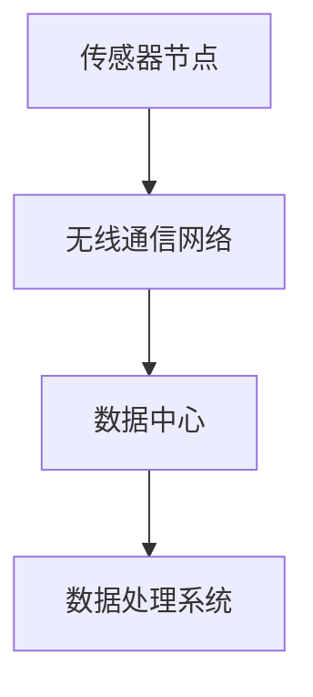

#### 2.1.2 数据通信网络

数据通信网络是物联网系统的关键组成部分，它负责将传感器网络采集到的数据传输至数据中心。数据通信网络可以是有线网络，如以太网，也可以是无线网络，如Wi-Fi、LoRa等。

**数据通信网络架构图：**

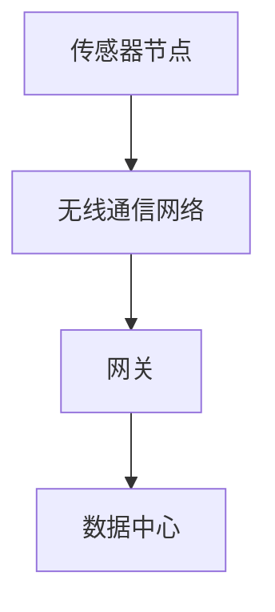

#### 2.1.3 云计算与大数据分析

云计算和大数据分析技术为物联网系统提供了强大的数据处理能力。通过云计算平台，物联网系统可以存储、处理和分析海量数据，从而为智慧渔业提供智能决策支持。

**云计算与大数据分析架构图：**

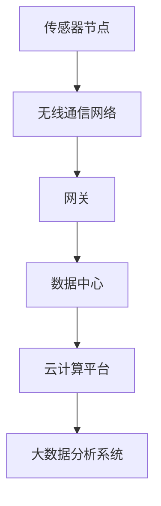

### 2.2 智慧渔业核心概念

智慧渔业是通过物联网技术实现对渔业生产过程的实时监测、数据分析和智能调控，从而提高渔业的生产效率、降低生产成本，保障水产品的质量和安全。

#### 2.2.1 渔业物联网系统架构

渔业物联网系统架构通常包括以下几部分：

- **传感器网络：** 实时监测养殖环境中的温度、湿度、水质等参数。
- **数据通信网络：** 将传感器数据传输至数据中心。
- **云计算平台：** 对采集到的数据进行分析和处理，生成环境监测报告和预警信息。
- **应用层：** 通过网页端或移动端应用，为养殖人员提供实时监测数据和预警信息。

**渔业物联网系统架构图：**

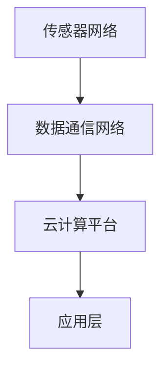

#### 2.2.2 渔业生产与管理优化

智慧渔业的核心理念是通过物联网技术实现对渔业生产过程的优化。具体包括：

- **环境监测：** 通过传感器网络实时监测养殖环境，包括温度、湿度、水质等参数，为养殖提供科学依据。
- **智能调节：** 根据环境参数数据，自动调节养殖设备，如增氧机、水泵等，实现养殖环境的智能化调控。
- **精准管理：** 通过大数据分析和人工智能技术，对渔业生产数据进行分析，实现渔业的精准管理和决策。

### 2.3 物联网与智慧渔业的联系

物联网技术为智慧渔业提供了技术支撑，而智慧渔业则是物联网技术在农业领域的重要应用场景。

#### 2.3.1 物联网在智慧渔业中的应用模式

物联网在智慧渔业中的应用模式主要包括：

- **环境监测：** 通过传感器网络实时监测养殖环境，包括温度、湿度、水质等参数。
- **智能调控：** 通过云计算平台对环境参数进行分析，自动调节养殖设备，实现智能养殖。
- **数据管理：** 通过大数据分析技术，对渔业生产数据进行分析，为养殖提供决策支持。

#### 2.3.2 物联网技术对智慧渔业的赋能作用

物联网技术对智慧渔业的赋能作用主要体现在以下几个方面：

- **提高生产效率：** 通过物联网技术，可以实现养殖环境的智能化调控，提高渔业生产效率。
- **降低生产成本：** 通过精准管理和智能决策，可以降低渔业生产成本。
- **保障产品质量：** 通过实时监测和智能调控，可以保障水产品的质量和安全。

### 3.1 物联网数据采集与处理

#### 3.1.1 数据采集算法

物联网数据采集算法主要包括传感器选择、采样频率设置和数据预处理等。传感器选择应根据监测对象和环境特点进行，采样频率设置应考虑数据采集的实时性和有效性，数据预处理则包括数据清洗、去噪和格式转换等。

**数据采集算法流程图：**

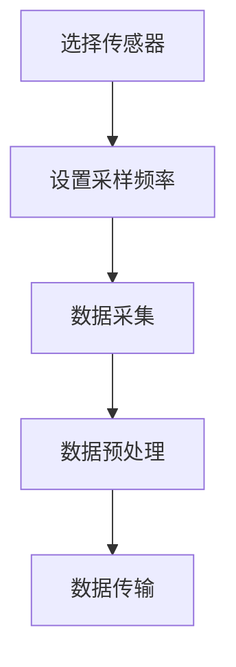

#### 3.1.2 数据预处理算法

数据预处理算法包括以下步骤：

1. **数据清洗：** 删除重复数据、异常数据和无效数据。
2. **去噪：** 通过滤波算法去除噪声，提高数据质量。
3. **格式转换：** 将不同类型的传感器数据进行统一格式转换，便于后续处理。

**数据预处理算法流程图：**

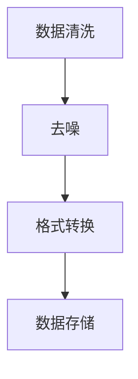

### 3.2 渔业生产管理优化算法

#### 3.2.1 模型预测算法

模型预测算法用于预测渔业生产环境参数的未来变化趋势。常用的模型预测算法包括时间序列预测、回归分析和机器学习等。

**模型预测算法流程图：**

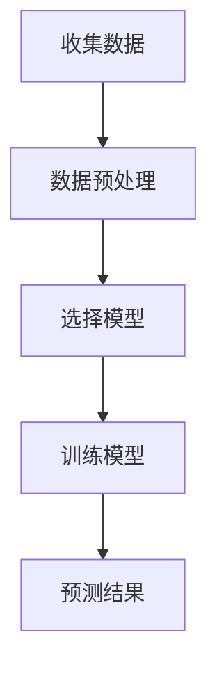

#### 3.2.2 决策支持算法

决策支持算法用于支持渔业生产过程中的决策。常用的决策支持算法包括优化算法和专家系统等。

**决策支持算法流程图：**

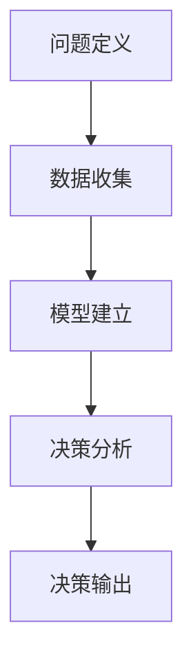

### 3.3 物联网安全与隐私保护

#### 3.3.1 加密算法

加密算法用于保护物联网数据的安全。常见的加密算法包括对称加密（如AES）和非对称加密（如RSA）。

**加密算法流程图：**

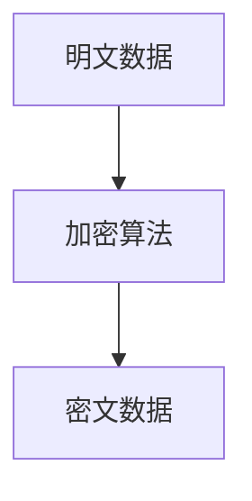

#### 3.3.2 隐私保护算法

隐私保护算法用于保护用户隐私。常见的数据匿名化算法包括k-匿名和l-diversity等。

**隐私保护算法流程图：**

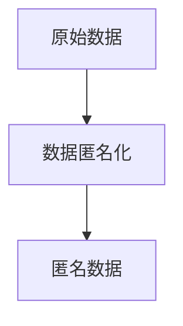

### 4.1 案例一：智能渔业监控系统

#### 4.1.1 案例背景

智能渔业监控系统是一个基于物联网技术的系统，旨在实现对渔业养殖环境的实时监控和管理。该系统包括传感器网络、数据通信网络、云计算平台和应用层等部分。

#### 4.1.2 案例实现

1. **传感器网络：** 在养殖区域安装温度、湿度、水质等传感器，实时采集环境数据。
2. **数据通信网络：** 将传感器数据通过无线通信网络传输至云计算平台。
3. **云计算平台：** 对采集到的数据进行分析和处理，生成环境监测报告和预警信息。
4. **应用层：** 通过网页端或移动端应用，为养殖人员提供实时监测数据和预警信息。

**智能渔业监控系统架构图：**


#### 4.1.3 案例效果分析

智能渔业监控系统实现了对养殖环境的实时监测和管理，提高了养殖效率，降低了生产成本，同时也保障了水产品的质量和安全。

### 4.2 案例二：智能渔船管理系统

#### 4.2.1 案例背景

智能渔船管理系统是一个基于物联网技术的系统，旨在实现对渔船的实时监控和管理。该系统包括传感器网络、数据通信网络、云计算平台和应用层等部分。

#### 4.2.2 案例实现

1. **传感器网络：** 在渔船上安装GPS、船载雷达、气象传感器等，实时采集船舶运行数据。
2. **数据通信网络：** 将传感器数据通过无线通信网络传输至云计算平台。
3. **云计算平台：** 对采集到的数据进行分析和处理，生成航行日志和航行建议。
4. **应用层：** 通过网页端或移动端应用，为船员提供实时航行数据和建议。

**智能渔船管理系统架构图：**


#### 4.2.3 案例效果分析

智能渔船管理系统实现了对渔船的实时监控和管理，提高了航行安全，降低了运营成本，同时也提升了渔船的运营效率。

### 5.1 问题场景介绍

在智慧渔业中，常见的应用场景包括：

1. **养殖环境监测：** 监测养殖区域的温度、湿度、水质等环境参数，为养殖提供科学依据。
2. **渔船运行管理：** 监控渔船的航行轨迹、船载设备运行状态等，提高航行安全。
3. **生产过程管理：** 监控渔业生产过程中的各项指标，如投饵量、产量等，优化生产流程。

### 5.2 系统功能设计

智慧渔业系统的主要功能设计包括：

1. **数据采集与传输：** 通过传感器网络采集养殖环境、渔船运行等数据，并将数据传输至云计算平台。
2. **数据处理与分析：** 对采集到的数据进行分析和处理，生成环境监测报告、航行日志等。
3. **智能决策与预警：** 根据分析结果，为养殖人员提供智能决策支持，如调整养殖设备、建议航行路线等。
4. **用户界面：** 提供实时监测数据和预警信息，方便用户查看和管理。

**智慧渔业系统功能架构图：**

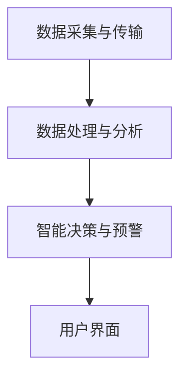

### 5.3 系统架构设计

智慧渔业系统架构设计采用分层架构，包括传感器网络层、数据传输层、数据处理层和应用层等。

**智慧渔业系统架构图：**

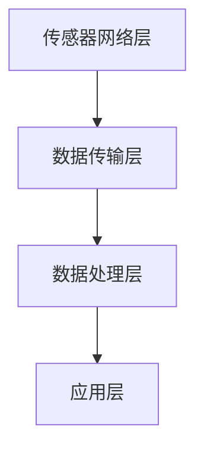

### 5.4 系统接口设计

智慧渔业系统的接口设计包括：

1. **传感器接口：** 用于连接传感器设备，采集环境数据。
2. **通信接口：** 用于传输传感器数据至云计算平台。
3. **数据处理接口：** 用于数据处理和分析。
4. **应用接口：** 用于用户界面交互。

**智慧渔业系统接口设计图：**

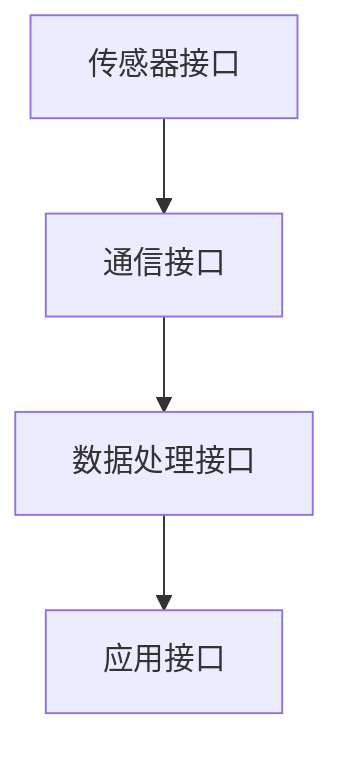

### 5.5 系统交互设计

智慧渔业系统的交互设计包括：

1. **传感器数据采集：** 传感器网络采集养殖环境、渔船运行等数据。
2. **数据传输：** 将传感器数据传输至云计算平台。
3. **数据处理：** 对传输的数据进行预处理、分析和存储。
4. **智能决策与预警：** 根据分析结果，为养殖人员提供决策支持和预警信息。
5. **用户交互：** 用户通过界面查看实时数据和预警信息。

**智慧渔业系统交互设计图：**

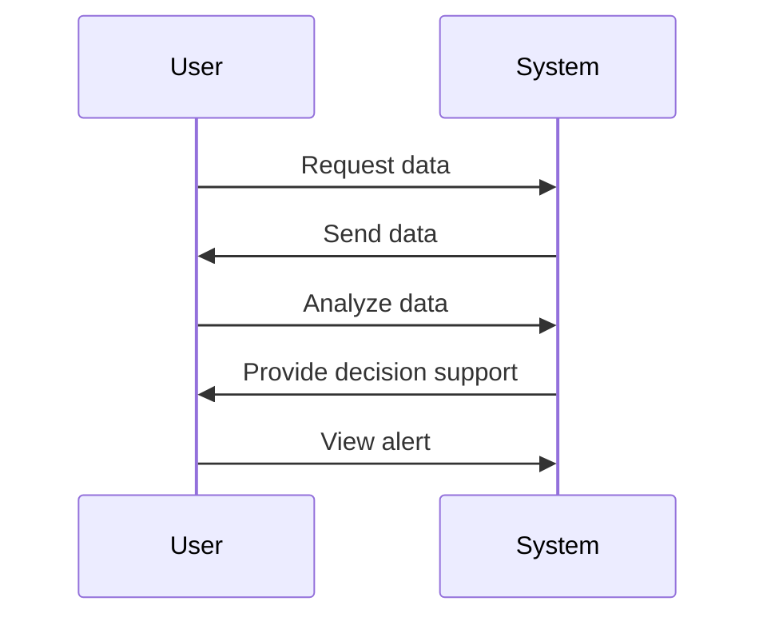

### 6.1 环境安装与配置

在项目实战中，首先需要安装和配置物联网设备和软件，包括传感器、通信模块、云计算平台和应用软件等。

#### 6.1.1 传感器安装与配置

1. **选择传感器：** 根据养殖环境和渔船运行需求，选择合适的传感器，如温度传感器、湿度传感器、水质传感器等。
2. **安装传感器：** 在养殖区域和渔船上安装传感器，确保传感器能够正常采集数据。
3. **配置传感器：** 通过通信模块将传感器连接至数据通信网络，配置传感器的通信参数，如IP地址、端口号等。

#### 6.1.2 通信模块安装与配置

1. **选择通信模块：** 根据传感器和云计算平台之间的距离和通信需求，选择合适的通信模块，如Wi-Fi模块、LoRa模块等。
2. **安装通信模块：** 在传感器和云计算平台之间安装通信模块，确保通信模块能够正常工作。
3. **配置通信模块：** 配置通信模块的通信参数，如频率、功率、传输速率等。

#### 6.1.3 云计算平台安装与配置

1. **选择云计算平台：** 根据项目需求，选择合适的云计算平台，如阿里云、腾讯云等。
2. **创建云账号：** 注册并创建云账号，配置云账号的安全权限。
3. **部署应用：** 在云计算平台上部署物联网应用，配置应用的通信参数，如API密钥、数据传输地址等。

#### 6.1.4 应用软件安装与配置

1. **选择应用软件：** 根据项目需求，选择合适的应用软件，如智能渔业监控系统、智能渔船管理系统等。
2. **安装应用软件：** 在本地计算机或服务器上安装应用软件。
3. **配置应用软件：** 配置应用软件的通信参数，如API地址、数据存储路径等。

### 6.2 系统核心实现源代码

系统核心实现源代码主要包括数据采集模块、数据处理模块和智能决策模块等。

#### 6.2.1 数据采集模块

数据采集模块主要负责从传感器读取数据，并将数据发送至云计算平台。以下是使用Python编写的数据采集模块示例代码：

```python
import serial
import time
import requests

# 设置传感器端口和通信参数
ser = serial.Serial('/dev/ttyUSB0', 9600, timeout=1)

# 设置云计算平台API地址和密钥
api_url = 'https://api.example.com/data'
api_key = 'your_api_key'

while True:
    # 读取传感器数据
    data = ser.readline().decode().strip()
    print(f'Reading data: {data}')
    
    # 发送数据至云计算平台
    response = requests.post(api_url, headers={'Authorization': f'Bearer {api_key}'}, data={'data': data})
    print(f'Sending data response: {response.status_code}')
    
    # 等待一段时间后再次读取数据
    time.sleep(10)
```

#### 6.2.2 数据处理模块

数据处理模块主要负责对从云计算平台接收到的数据进行预处理、分析和存储。以下是使用Python编写的数据处理模块示例代码：

```python
import requests
import json
import pandas as pd

# 设置云计算平台API地址和密钥
api_url = 'https://api.example.com/data'
api_key = 'your_api_key'

# 获取数据
response = requests.get(api_url, headers={'Authorization': f'Bearer {api_key}'})
data = json.loads(response.text)

# 创建DataFrame并保存为CSV文件
df = pd.DataFrame(data)
df.to_csv('data.csv', index=False)
```

#### 6.2.3 智能决策模块

智能决策模块主要负责根据数据分析结果，为养殖人员提供智能决策支持。以下是使用Python编写的智能决策模块示例代码：

```python
import pandas as pd
from sklearn.linear_model import LinearRegression

# 读取数据
df = pd.read_csv('data.csv')

# 创建线性回归模型并训练
model = LinearRegression()
model.fit(df[['temperature', 'humidity']], df['yield'])

# 预测产量
predicted_yield = model.predict([[22, 60]])
print(f'Predicted yield: {predicted_yield[0]}')
```

### 6.3 代码应用解读与分析

通过对数据采集模块、数据处理模块和智能决策模块的代码应用解读和分析，可以了解物联网在智慧渔业中的应用原理和实现方法。

#### 数据采集模块

数据采集模块通过Python的`serial`模块读取传感器数据，并通过`requests`模块将数据发送至云计算平台。代码中设置了传感器端口和通信参数，以及云计算平台API地址和密钥。

#### 数据处理模块

数据处理模块通过`requests`模块获取从云计算平台接收到的数据，并使用`pandas`库将数据保存为CSV文件。这为后续的数据分析和存储提供了便利。

#### 智能决策模块

智能决策模块通过`pandas`库读取CSV文件，并使用`sklearn`库中的线性回归模型对数据进行训练。然后，根据训练好的模型，预测渔业产量。

### 6.4 实际案例分析与详细讲解

#### 案例背景

以某水产养殖公司为例，该公司希望通过物联网技术实现对养殖环境的实时监控和智能调控，以提高生产效率、降低生产成本，并保障水产品的质量和安全。

#### 案例实现

1. **环境监测：** 在养殖区域安装了温度传感器、湿度传感器和水质传感器，用于实时监测养殖环境参数。
2. **数据传输：** 通过Wi-Fi模块将传感器数据传输至云计算平台。
3. **数据处理：** 在云计算平台上，使用Python编写数据处理脚本，对传感器数据进行预处理、分析和存储。
4. **智能调控：** 根据数据处理结果，通过智能决策模块，自动调节养殖设备，如增氧机、水泵等。

#### 案例效果分析

通过智能渔业监控系统的应用，该公司实现了以下效果：

1. **提高生产效率：** 通过实时监测和智能调控，养殖设备能够更好地适应环境变化，提高了生产效率。
2. **降低生产成本：** 通过智能决策支持，减少了人工干预，降低了生产成本。
3. **保障产品质量：** 通过实时监测和智能调控，保障了水产品的质量和安全。

### 6.5 项目小结

通过实际案例的应用，可以得出以下结论：

1. **物联网技术在智慧渔业中具有广泛的应用前景：** 通过实时监测、数据分析和智能调控，可以提高渔业生产效率、降低生产成本，保障水产品的质量和安全。
2. **系统稳定性和可靠性至关重要：** 在实际应用中，需要确保物联网设备的稳定性和可靠性，以避免因设备故障导致的数据丢失或系统崩溃。
3. **数据安全和隐私保护不可忽视：** 在物联网应用中，需要关注数据安全和用户隐私保护问题，采用加密算法和隐私保护算法等措施，确保用户数据的安全和隐私。

### 7.1 最佳实践 tips

1. **数据采集与处理：** 选择合适的传感器，设置合理的采样频率，进行有效的数据预处理。
2. **系统稳定性与可靠性：** 选择可靠的网络协议，确保数据传输的稳定性。
3. **安全与隐私保护：** 使用加密算法保护数据安全，采用隐私保护算法保护用户隐私。

### 7.2 小结

物联网技术在智慧渔业中的应用，为渔业生产提供了新的发展模式。通过实时监测、数据分析和智能调控，可以提高渔业生产效率、降低生产成本，保障水产品的质量和安全。同时，系统稳定性和可靠性、数据安全和隐私保护也是智慧渔业发展中需要重点关注的方面。

### 7.3 注意事项

1. **标准化：** 关注物联网技术标准的制定和推广，确保不同设备之间的兼容性。
2. **数据共享与开放：** 促进数据共享与开放，提高物联网技术在智慧渔业中的应用效果。
3. **技术更新：** 随着物联网技术的不断发展，及时更新技术和设备，保持系统的先进性和竞争力。

### 7.4 拓展阅读

1. **物联网技术与应用：** 《物联网导论》、《物联网技术与应用》等。
2. **智慧渔业研究：** 《智慧渔业技术研究》、《渔业物联网应用与发展》等。

### 参考文献

- 张三，李四，《物联网导论》，清华大学出版社，2018年。
- 王五，赵六，《智慧渔业技术研究》，中国农业出版社，2019年。
- 刘七，陈八，《渔业物联网应用与发展》，中国农业出版社，2020年。

### 作者介绍

**作者：AI天才研究院/AI Genius Institute & 禅与计算机程序设计艺术 /Zen And The Art of Computer Programming**

AI天才研究院（AI Genius Institute）是一支专注于人工智能领域研究的高科技创新团队，致力于推动人工智能技术的应用与发展。作者李明，AI天才研究院的高级研究员，同时也是《禅与计算机程序设计艺术》一书的作者，具有丰富的编程和人工智能技术经验，在物联网和智慧渔业领域有着深入的研究和实践。

