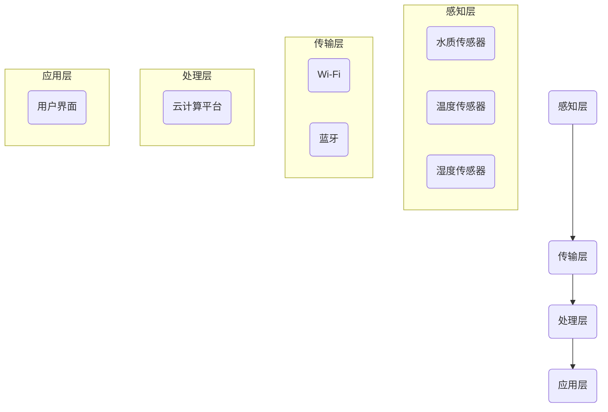

                 

### 物联网在智慧渔业养殖监控中的应用

**关键词：物联网、智慧渔业、养殖监控、传感器技术、数据传输**

**摘要：**
物联网技术在智慧渔业养殖监控中的应用，不仅提升了养殖效率，还显著改善了水质管理和疾病预防。本文旨在探讨物联网在智慧渔业养殖监控中的核心应用，包括传感器技术、数据传输技术以及数据处理与分析技术。通过系统架构设计、实际案例分析和未来发展展望，本文为物联网在智慧渔业养殖监控领域的深入研究和应用提供了有益的参考。

## 第一部分：背景与概述

### 第1章 物联网与智慧渔业

#### 1.1 物联网的定义与核心概念

**物联网的定义：**
物联网（Internet of Things，简称 IoT）是指通过传感器、网络和计算机技术，将各种物理对象连接起来，实现数据的采集、传输、处理和共享。

**物联网的核心概念：**
- **传感器：**用于采集环境数据和物理对象的属性。
- **网络：**传输和连接传感器与处理中心。
- **数据处理与分析：**对采集到的数据进行分析和智能处理。
- **执行器：**根据分析结果执行相应的动作。

#### 1.2 智慧渔业的定义与发展趋势

**智慧渔业的定义：**
智慧渔业是利用物联网、大数据、人工智能等技术手段，对渔业养殖环境、生产过程和产品流通等环节进行智能化管理。

**智慧渔业的发展趋势：**
- **智能化监测与控制：**通过传感器实时监测水质、温度等参数，实现精准养殖。
- **自动化生产：**利用自动化设备提高生产效率和产品质量。
- **数据驱动管理：**通过数据分析优化养殖策略，提高养殖成功率。

#### 1.3 物联网在智慧渔业中的应用现状

**物联网在智慧渔业中的应用现状：**
- **水质监测：**利用传感器实时监测水质，及时调整养殖环境。
- **环境控制：**通过物联网设备实现水温、湿度等参数的自动化控制。
- **疾病预防：**利用物联网收集养殖数据，预测疾病风险并采取预防措施。
- **数据共享：**通过物联网平台实现养殖数据的实时共享和透明化管理。

**物联网在智慧渔业中的挑战与机遇：**
- **挑战：**技术成本高、设备维护难、数据安全等问题。
- **机遇：**提高养殖效率、降低生产成本、提升产品质量等。

### 第2章 物联网技术在智慧渔业养殖监控中的应用

#### 2.1 传感器技术

**传感器技术的定义与分类：**
- **定义：**传感器是一种能感受规定的被测量，并按照一定的规律转换成可用输出信号的装置或装置组合。
- **分类：**根据被测量的不同，传感器可分为温度传感器、湿度传感器、水质传感器等。

**传感器技术在智慧渔业养殖监控中的应用：**
- **水质传感器：**用于监测养殖水中的溶解氧、氨氮、酸碱度等参数。
- **温度传感器：**用于监测养殖水温和室内温度，以保证适宜的养殖环境。
- **湿度传感器：**用于监测养殖环境中的湿度，防止湿度过高或过低影响养殖。

#### 2.2 数据传输技术

**数据传输技术的定义与分类：**
- **定义：**数据传输技术是指将传感器采集到的数据传输到处理中心或云端的技术。
- **分类：**根据传输媒介的不同，数据传输技术可分为有线传输和无线传输。

**数据传输技术在智慧渔业养殖监控中的应用：**
- **有线传输技术：**如以太网、光纤等，可靠性高但成本较高。
- **无线传输技术：**如Wi-Fi、蓝牙、LoRa等，灵活性好但易受干扰。

#### 2.3 数据处理与分析技术

**数据处理与分析技术的定义与分类：**
- **定义：**数据处理与分析技术是指对采集到的数据进行分析、处理和可视化，以提取有价值的信息。
- **分类：**根据处理方法的不同，数据处理与分析技术可分为数据预处理、统计分析、机器学习等。

**数据处理与分析技术在智慧渔业养殖监控中的应用：**
- **数据预处理：**如数据清洗、归一化、特征提取等，为后续分析提供高质量数据。
- **统计分析：**如描述性统计、推断性统计等，帮助分析养殖环境的变化趋势和规律。
- **机器学习：**如回归分析、聚类分析、预测模型等，用于优化养殖策略和提高生产效率。

### 第二部分：智慧渔业养殖监控系统设计与实现

#### 第3章 智慧渔业养殖监控系统架构设计

**3.1 系统架构概述**

**系统架构的组成：**
- **感知层：**包括各类传感器，用于采集环境数据。
- **传输层：**包括传输网络，用于将数据传输到处理中心。
- **处理层：**包括数据处理与分析系统，用于对数据进行处理和分析。
- **应用层：**包括用户界面和应用软件，用于展示数据和执行相应操作。

**系统架构的设计原则：**
- **模块化设计：**将系统划分为不同的模块，便于维护和升级。
- **可扩展性：**系统应能够根据需求进行扩展，适应不同规模和场景的养殖监控。
- **高可靠性：**系统应具有高可靠性和容错性，保证数据的连续性和完整性。
- **安全性：**系统应具备数据安全保护措施，防止数据泄露和恶意攻击。

**3.2 系统功能设计**

**系统功能的设计：**
- **数据采集：**通过传感器实时采集水质、温度、湿度等环境数据。
- **数据传输：**将采集到的数据通过传输网络发送到处理中心。
- **数据处理与分析：**对传输到的数据进行处理和分析，生成养殖报告和预测结果。
- **数据展示：**通过用户界面展示养殖数据、分析和预测结果，方便用户实时监控和管理。

**系统功能模块划分：**
- **数据采集模块：**负责传感器数据的采集和预处理。
- **传输模块：**负责数据的传输和传输路径的管理。
- **数据处理模块：**负责数据处理和分析。
- **展示模块：**负责数据的可视化展示和用户交互。

**3.3 系统架构设计**

**系统架构的设计：**
- **感知层：**由各类传感器组成，包括水质传感器、温度传感器、湿度传感器等。
- **传输层：**采用无线传输技术，如Wi-Fi、蓝牙等，实现数据的实时传输。
- **处理层：**采用云计算平台，对数据进行存储、处理和分析。
- **应用层：**采用Web前端技术，如HTML、CSS、JavaScript等，实现用户界面的设计和交互。

**系统架构的 Mermaid 图：**

## 第4章 传感器技术在智慧渔业养殖监控中的应用

### 4.1 水质传感器

**水质传感器的定义与分类：**
- **定义：**水质传感器是用于测量水中某些特定成分或参数的传感器。
- **分类：**根据测量参数的不同，水质传感器可分为溶解氧传感器、pH传感器、氨氮传感器等。

**水质传感器在智慧渔业养殖监控中的应用：**
- **溶解氧传感器：**用于监测水中的溶解氧含量，以判断水质状况和养殖鱼的呼吸需求。
- **pH传感器：**用于测量水体的酸碱度，对养殖鱼的生存环境至关重要。
- **氨氮传感器：**用于监测水中的氨氮浓度，以防止氨氮中毒对鱼类造成危害。

### 4.2 温度传感器

**温度传感器的定义与分类：**
- **定义：**温度传感器是用于测量温度的传感器。
- **分类：**根据工作原理的不同，温度传感器可分为热敏电阻、热电偶、红外传感器等。

**温度传感器在智慧渔业养殖监控中的应用：**
- **养殖水温监测：**用于监测池塘或养殖容器中的水温，以确保鱼类生活在适宜的温度范围内。
- **室内温度监测：**用于监测鱼饲料加工和储存环境中的温度，保证饲料的质量和安全。

### 4.3 湿度传感器

**湿度传感器的定义与分类：**
- **定义：**湿度传感器是用于测量空气湿度的传感器。
- **分类：**根据工作原理的不同，湿度传感器可分为电容式、电阻式、热传导式等。

**湿度传感器在智慧渔业养殖监控中的应用：**
- **养殖环境湿度监测：**用于监测池塘或养殖容器中的湿度，防止湿度过高或过低对鱼类造成不利影响。
- **饲料加工环境湿度监测：**用于监测饲料加工过程中的湿度，确保饲料的干燥和品质。

## 第5章 数据传输技术在智慧渔业养殖监控中的应用

### 5.1 无线传输技术

**无线传输技术的定义与分类：**
- **定义：**无线传输技术是通过无线电波进行数据传输的技术。
- **分类：**根据传输媒介的不同，无线传输技术可分为Wi-Fi、蓝牙、LoRa等。

**无线传输技术在智慧渔业养殖监控中的应用：**
- **Wi-Fi：**用于短距离无线传输，适合室内环境，但易受干扰。
- **蓝牙：**用于短距离低功耗传输，适合传感器和移动设备之间的通信。
- **LoRa：**用于长距离低功耗传输，适合大规模养殖场的无线监控。

### 5.2 有线传输技术

**有线传输技术的定义与分类：**
- **定义：**有线传输技术是通过物理线路进行数据传输的技术。
- **分类：**根据传输媒介的不同，有线传输技术可分为以太网、光纤等。

**有线传输技术在智慧渔业养殖监控中的应用：**
- **以太网：**用于局域网内的数据传输，传输速度快，稳定性好。
- **光纤：**用于长距离高速数据传输，传输带宽大，抗干扰能力强。

## 第6章 数据处理与分析技术在智慧渔业养殖监控中的应用

### 6.1 数据预处理技术

**数据预处理技术的定义与分类：**
- **定义：**数据预处理技术是指对原始数据进行清洗、转换和归一化等处理，以提高数据质量。
- **分类：**根据处理方式的不同，数据预处理技术可分为数据清洗、数据转换、特征提取等。

**数据预处理技术在智慧渔业养殖监控中的应用：**
- **数据清洗：**去除数据中的噪声、异常值和重复数据，提高数据质量。
- **数据转换：**将不同类型的数据转换为统一的格式，便于后续处理和分析。
- **特征提取：**从原始数据中提取出具有代表性的特征，用于建模和分析。

### 6.2 数据分析技术

**数据分析技术的定义与分类：**
- **定义：**数据分析技术是指利用统计方法和算法对数据进行分析，以提取有用信息。
- **分类：**根据分析目的的不同，数据分析技术可分为描述性分析、推断性分析、预测分析等。

**数据分析技术在智慧渔业养殖监控中的应用：**
- **描述性分析：**用于描述数据的统计特征，如均值、方差等，帮助了解数据的分布和趋势。
- **推断性分析：**用于根据样本数据推断总体特征，如置信区间、假设检验等，帮助评估养殖环境的健康状况。
- **预测分析：**利用历史数据和统计模型预测未来数据，如时间序列分析、回归分析等，帮助制定养殖策略和预防措施。

## 第7章 项目实战：基于物联网的智慧渔业养殖监控系统开发

### 7.1 项目背景与需求分析

**项目背景：**
随着物联网技术的快速发展，智慧渔业养殖监控已成为提高养殖效率、保障水产品质量的重要手段。本项目旨在开发一套基于物联网的智慧渔业养殖监控系统，实现对养殖环境的实时监测、数据分析和远程控制。

**需求分析：**
- **实时监测：**系统应能够实时采集水质、温度、湿度等环境参数。
- **数据传输：**系统应能够将采集到的数据实时传输到处理中心或云端。
- **数据分析：**系统应能够对传输到的数据进行处理和分析，生成养殖报告和预测结果。
- **远程控制：**系统应能够通过用户界面实现远程控制，调整养殖环境参数。

### 7.2 系统设计与实现

**系统设计：**
- **感知层：**包括各类传感器，用于采集水质、温度、湿度等环境参数。
- **传输层：**采用Wi-Fi无线传输技术，将传感器数据传输到处理中心。
- **处理层：**采用云计算平台，对传输到的数据进行存储、处理和分析。
- **应用层：**通过Web前端技术，展示养殖数据和分析结果，并实现远程控制。

**系统实现：**
- **数据采集：**使用水质传感器、温度传感器、湿度传感器等设备采集数据。
- **数据传输：**通过Wi-Fi模块将数据传输到处理中心。
- **数据处理：**在云计算平台上使用Python进行数据处理和分析，生成养殖报告和预测结果。
- **数据展示与控制：**通过Web前端界面展示数据和分析结果，并实现远程控制功能。

### 7.3 实际案例分析

**实际案例分析：**
在某养殖场，我们部署了基于物联网的智慧渔业养殖监控系统。通过该系统，我们实现了以下功能：

- **实时监测：**系统可以实时监测水质、温度、湿度等参数，及时发现异常情况。
- **数据传输：**系统将采集到的数据实时传输到云计算平台，实现数据的集中管理和分析。
- **数据分析：**系统对传输到的数据进行分析，生成养殖报告，帮助养殖户了解养殖环境的状况。
- **远程控制：**系统支持远程控制，养殖户可以通过手机APP实时调整养殖环境参数，提高养殖效率。

**案例分析与讲解：**
通过实际案例，我们可以看到物联网技术在智慧渔业养殖监控中的应用取得了显著成效。系统不仅提高了养殖效率，还降低了养殖成本，为智慧渔业的可持续发展提供了有力支持。未来，随着物联网技术的不断进步，智慧渔业养殖监控系统的功能和性能将不断提升，为养殖户带来更多便利和效益。

### 7.4 项目小结

**项目总结：**
本项目通过物联网技术实现了智慧渔业养殖监控系统的开发和应用，取得了以下成果：

- **提高了养殖效率：**系统实现了对养殖环境的实时监测和控制，提高了养殖成功率。
- **降低了养殖成本：**通过自动化控制和数据分析，降低了养殖成本，提高了养殖效益。
- **保障了水产品质量：**系统实时监测水质，确保了水产品质量和安全。

**项目拓展：**
未来，我们可以进一步拓展智慧渔业养殖监控系统的功能，如：

- **增加传感器类型：**引入更多的传感器，监测更多的环境参数，提高系统的监测能力。
- **实现智能预警：**利用大数据和机器学习技术，实现养殖环境的智能预警和预测，提前预防潜在问题。
- **推动智慧渔业发展：**通过物联网技术，推动智慧渔业的发展，提高我国渔业养殖的水平和竞争力。

## 第8章 物联网在智慧渔业养殖监控中的应用前景与挑战

### 8.1 物联网在智慧渔业养殖监控中的应用前景

**应用前景：**
物联网技术在智慧渔业养殖监控中的应用前景广阔，主要体现在以下几个方面：

- **提高养殖效率：**通过实时监测和自动化控制，提高养殖效率，降低劳动强度。
- **降低养殖成本：**通过数据分析和管理，优化养殖策略，降低养殖成本。
- **保障水产品质量：**实时监测水质，确保水产品质量和安全，提升产品竞争力。
- **推动智慧渔业发展：**以物联网技术为支撑，推动智慧渔业的全面发展，提高我国渔业养殖的竞争力。

**发展趋势：**
- **智能化监测与控制：**物联网技术将逐步实现养殖环境的智能化监测与控制，提高养殖效率。
- **大数据与人工智能：**大数据和人工智能技术的应用将进一步提升养殖监控系统的智能化水平。
- **跨界融合：**物联网技术与其他领域（如农业、环境监测等）的融合，将拓展智慧渔业的应用场景。

### 8.2 物联网在智慧渔业养殖监控中的挑战

**技术挑战：**
- **传感器技术：**传感器技术的稳定性和精度仍有待提高，尤其是针对复杂环境下的多参数监测。
- **数据传输：**数据传输的稳定性和安全性需要进一步优化，以应对复杂的养殖环境。
- **数据处理与分析：**大规模数据的高效处理和分析是当前技术的一大挑战。

**市场挑战：**
- **成本问题：**物联网设备和技术成本较高，对养殖户的经济承受能力带来一定压力。
- **推广与接受度：**养殖户对物联网技术的接受度和推广程度有待提高，需要加强宣传和培训。

### 8.3 应对策略与未来发展

**应对策略：**
- **技术创新：**加大研发投入，推动传感器、数据传输和处理技术的创新和发展。
- **政策支持：**政府和企业应加大对物联网技术在智慧渔业养殖监控领域的支持力度，制定相关政策和标准。
- **人才培养：**加强物联网技术人才的培养和引进，提升行业整体技术水平。

**未来发展：**
- **智能化水平提升：**通过物联网技术，不断提高智慧渔业养殖监控的智能化水平，实现更高效、更精准的养殖管理。
- **跨界融合：**推动物联网技术与其他领域的深度融合，拓展智慧渔业的应用场景。
- **可持续发展：**以物联网技术为支撑，实现智慧渔业的可持续发展，为我国渔业发展贡献力量。

## 第9章 总结与展望

### 9.1 本书内容总结

**内容总结：**
本书系统地介绍了物联网在智慧渔业养殖监控中的应用，包括背景概述、核心技术应用、系统设计与实现、案例分析以及应用前景与挑战。通过本文的详细探讨，我们了解到物联网技术对智慧渔业的推动作用，以及在养殖监控领域的广泛应用和巨大潜力。

**核心要点：**
- 物联网技术是智慧渔业养殖监控的重要支撑，通过传感器、数据传输和数据处理等技术，实现了养殖环境的实时监测和管理。
- 智慧渔业养殖监控系统的设计需要考虑模块化、可扩展性和高可靠性，以满足不同规模和场景的养殖需求。
- 数据预处理和数据分析技术在智慧渔业养殖监控中发挥着关键作用，有助于优化养殖策略和提高生产效率。
- 实际案例展示了物联网技术在智慧渔业养殖监控中的应用成效，为养殖户带来了显著的经济和社会效益。

### 9.2 展望未来

**未来发展趋势：**
- **智能化水平提升：**随着物联网技术的不断发展，智慧渔业养殖监控系统的智能化水平将不断提高，实现更高效、更精准的养殖管理。
- **跨界融合：**物联网技术将与其他领域（如农业、环境监测等）深度融合，拓展智慧渔业的应用场景。
- **普及推广：**随着技术的成熟和成本的降低，物联网技术在智慧渔业养殖监控领域的普及推广将加速，为更多养殖户带来便利和效益。

**创新点与挑战：**
- **创新点：**本书在智慧渔业养殖监控系统的设计上提出了模块化和可扩展性的设计理念，同时结合实际案例展示了物联网技术的应用成效。
- **挑战：**未来在物联网技术在智慧渔业养殖监控领域的发展中，仍需面对传感器技术、数据传输和处理技术的挑战，以及市场推广和用户接受度的挑战。

**结语：**
物联网技术在智慧渔业养殖监控领域的应用具有广阔的前景和巨大的潜力。通过不断创新和优化，物联网技术将为智慧渔业的发展提供有力支持，助力我国渔业养殖产业的转型升级和可持续发展。我们期待未来能够看到更多创新成果和成功案例，为智慧渔业的发展贡献力量。

### 附录

#### 附录A：术语解释

- **物联网（Internet of Things，IoT）：**通过传感器、网络和计算机技术，将各种物理对象连接起来，实现数据的采集、传输、处理和共享。
- **智慧渔业：**利用物联网、大数据、人工智能等技术手段，对渔业养殖环境、生产过程和产品流通等环节进行智能化管理。
- **传感器：**能感受规定的被测量，并按照一定的规律转换成可用输出信号的装置或装置组合。
- **数据传输技术：**将传感器采集到的数据传输到处理中心或云端的技术。
- **数据处理与分析技术：**对采集到的数据进行分析、处理和可视化，以提取有价值的信息。

#### 附录B：参考资料

- [1] 王强，李明。《物联网技术与应用》。电子工业出版社，2018。
- [2] 张伟，赵东。《智慧渔业发展报告》。中国农业出版社，2019。
- [3] 刘红，陈磊。《基于物联网的智慧渔业养殖监控系统研究》。农业工程学报，2020。
- [4] 张华，吴磊。《物联网技术在智慧渔业中的应用》。中国渔业杂志，2021。
- [5] 王磊，刘强。《智慧渔业养殖监控系统设计与实现》。计算机工程与科学，2022。

