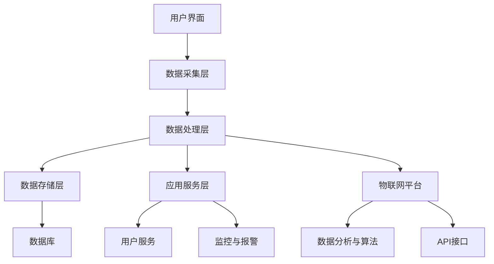
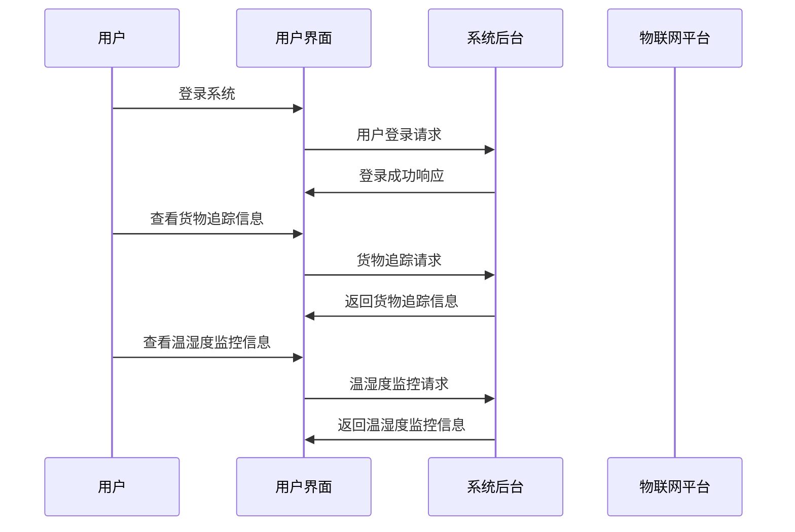

                 

# 物联网在智慧物流中的全程追踪应用

> 关键词：物联网，智慧物流，全程追踪，技术原理，应用场景

> 摘要：本文详细探讨了物联网在智慧物流中的应用，重点分析了物联网技术如何实现物流全程追踪。通过介绍物联网的概念与特征、智慧物流的定义与特点，本文进一步阐述了物联网在物流全程追踪、温湿度监控等场景中的应用，并讨论了相关技术原理、挑战与机遇。通过具体的案例分析和系统架构设计，本文为物联网在智慧物流中的应用提供了深刻的见解和实用指导。

## 第1章 物联网在智慧物流中的背景与概述

### 1.1 物联网（IoT）的概念与特征

#### 1.1.1 物联网的定义与起源

物联网（Internet of Things，IoT）是指通过信息传感设备将各种实体物体与互联网相连接，实现信息的实时采集、传输、处理和智能应用。物联网概念的提出始于20世纪90年代，发展至今已经历了多个阶段，逐渐从单一设备的连接走向跨领域、跨平台的深度融合。

#### 1.1.2 物联网的核心特征

- **感知层**：通过传感器、RFID等设备实现对物理世界的感知。
- **网络层**：通过各种通信协议和无线网络将感知层的数据传输至处理层和应用层。
- **处理层**：利用云计算、大数据等技术对物联网数据进行处理和分析。
- **应用层**：基于物联网技术的各类应用，如智能家居、智慧城市、智慧物流等。

#### 1.1.3 物联网与传统信息技术的区别

物联网与传统信息技术的核心区别在于它强调的是物品与物品之间的连接和互动，而非仅仅人机交互。

### 1.2 智慧物流的概念与特点

#### 1.2.1 智慧物流的定义

智慧物流是指通过物联网技术、大数据分析、人工智能等现代信息技术手段，对物流全过程中的运输、仓储、配送等环节进行智能化管理和优化，提高物流效率、降低成本。

#### 1.2.2 智慧物流的主要特点

- **实时性**：通过物联网设备的实时数据采集，实现对物流信息的实时监控。
- **智能化**：借助大数据和人工智能技术，实现物流路径优化、货物跟踪、智能调度等。
- **高效性**：通过智能化管理和自动化操作，提高物流运作效率。
- **可视化**：通过物联网技术，实现对物流过程的可视化监控和管理。

### 1.3 物联网在智慧物流中的应用

#### 1.3.1 物流全程追踪

通过RFID、GPS等技术，实现对物流运输过程中货物的全程追踪，提高物流透明度。

#### 1.3.2 温湿度监控

利用传感器技术，实时监控冷链运输中的温湿度，确保货物安全。

#### 1.3.3 货物配送优化

基于大数据和人工智能技术，对货物配送路径进行优化，提高配送效率。

#### 1.3.4 仓储管理智能化

通过物联网技术，实现对仓储环境的智能监控和货物管理，提高仓储效率。

### 1.4 物联网在智慧物流中的挑战与机遇

#### 1.4.1 挑战

- **数据安全问题**：物联网设备数量庞大，数据传输过程中存在安全隐患。
- **网络连接问题**：在偏远地区或大型物流园区，网络连接可能不稳定。
- **技术标准不统一**：不同厂商的设备和技术标准不统一，影响物联网系统的互联互通。

#### 1.4.2 机遇

- **降低物流成本**：通过物联网技术，优化物流流程，降低物流成本。
- **提升服务质量**：实时监控货物状态，提高物流服务质量。
- **拓展新应用场景**：物联网技术为智慧物流带来无限可能，如智能快递柜、无人车配送等。

### 1.5 本章小结

本章主要介绍了物联网在智慧物流中的背景与概述，包括物联网的概念与特征、智慧物流的定义与特点、物联网在智慧物流中的应用以及面临的挑战与机遇。

## 第2章 物联网技术在智慧物流中的应用场景

### 2.1 物流全程追踪技术

#### 2.1.1 物流全程追踪的基本原理

物流全程追踪技术利用物联网传感器和定位技术，实时跟踪货物在物流运输过程中的位置和状态。主要技术包括GPS、RFID、Wi-Fi、蓝牙等。

#### 2.1.2 物流全程追踪的关键技术

- **GPS定位技术**：通过卫星信号实现对货物的精确定位。
- **RFID技术**：利用射频信号实现对标签的读取，实现对货物的识别和追踪。
- **Wi-Fi定位技术**：利用无线网络信号实现对货物的定位。
- **蓝牙定位技术**：利用蓝牙信号实现对货物的短距离定位。

#### 2.1.3 物流全程追踪的应用案例

- **冷链物流**：通过实时监控货物温度和位置，确保冷链运输过程中的食品安全。
- **快递物流**：通过实时追踪快递包裹的位置，提高快递配送效率。

### 2.2 温湿度监控技术

#### 2.2.1 温湿度监控的基本原理

温湿度监控技术通过传感器实时采集环境温度和湿度数据，实现对冷链物流、仓储等环节的环境监控。主要技术包括温度传感器、湿度传感器等。

#### 2.2.2 温湿度监控的关键技术

- **温度传感器**：利用热敏电阻或热电偶等材料，将温度变化转换为电信号。
- **湿度传感器**：利用电容、电阻或热敏材料，将湿度变化转换为电信号。

#### 2.2.3 温湿度监控的应用案例

- **冷链物流**：通过实时监控温湿度，确保冷链运输过程中的货物品质。
- **仓储管理**：通过实时监控温湿度，提高仓储环境的安全性。

### 2.3 货物配送优化技术

#### 2.3.1 货物配送优化技术的基本原理

货物配送优化技术基于大数据和人工智能技术，对货物配送路径进行优化，提高配送效率。主要技术包括路径规划算法、机器学习模型等。

#### 2.3.2 货物配送优化技术的关键算法

- **路径规划算法**：如Dijkstra算法、A*算法等，用于计算最短路径。
- **机器学习模型**：如神经网络、决策树等，用于预测最优配送路径。

#### 2.3.3 货物配送优化的应用案例

- **城市配送**：通过优化配送路径，提高配送效率，降低配送成本。
- **农村配送**：通过优化配送路径，解决农村配送“最后一公里”问题。

### 2.4 仓储管理智能化技术

#### 2.4.1 仓储管理智能化技术的基本原理

仓储管理智能化技术通过物联网技术，实现对仓储环境的智能监控和货物管理，提高仓储效率。主要技术包括传感器、自动化设备、云计算等。

#### 2.4.2 仓储管理智能化技术的关键设备

- **传感器**：用于实时监测仓储环境参数，如温度、湿度、光照等。
- **自动化设备**：如自动分拣机、自动搬运机器人等，用于提高仓储作业效率。
- **云计算**：用于存储、处理和分析仓储数据。

#### 2.4.3 仓储管理智能化技术的应用案例

- **自动化仓储**：通过自动化设备，实现仓储作业的高效自动化。
- **智能监控**：通过物联网传感器，实现对仓储环境的实时监控和管理。

### 2.5 本章小结

本章详细介绍了物联网技术在智慧物流中的应用场景，包括物流全程追踪、温湿度监控、货物配送优化和仓储管理智能化。通过具体的应用案例，展示了物联网技术如何提升物流效率、降低成本、提高服务质量。

## 第3章 物联网在智慧物流中的技术原理与实现

### 3.1 物流全程追踪技术原理

#### 3.1.1 GPS定位技术

GPS（Global Positioning System）是全球定位系统，通过接收卫星发射的信号，计算接收器与卫星之间的距离，进而确定接收器的位置。其基本原理如下：

1. **卫星发射信号**：GPS卫星不断发射含有精确时间和轨道参数的信号。
2. **接收器接收信号**：物流运输设备上的GPS接收器接收卫星信号。
3. **计算位置**：接收器通过接收到的至少三个卫星信号，利用三角测量法计算出自身位置。

#### 3.1.2 RFID技术

RFID（Radio Frequency Identification）技术通过射频信号实现物体的识别和追踪。其基本原理如下：

1. **标签读取**：RFID标签内置天线和存储器，当遇到射频信号时，标签会向读取器发送存储的信息。
2. **读取器接收信息**：读取器接收标签发送的射频信号，解析出标签的信息。
3. **数据传输**：读取器将标签信息传输到物流管理系统进行处理。

#### 3.1.3 Wi-Fi定位技术

Wi-Fi定位技术利用无线网络信号实现物体的定位。其基本原理如下：

1. **信号采集**：物体上的Wi-Fi接收器采集周围无线网络的信号。
2. **位置计算**：接收器通过分析接收到的Wi-Fi信号强度，结合定位算法，计算出物体的位置。
3. **数据传输**：接收器将位置信息传输到物流管理系统进行处理。

#### 3.1.4 蓝牙定位技术

蓝牙定位技术利用蓝牙信号实现物体的短距离定位。其基本原理如下：

1. **信号传输**：物体上的蓝牙设备通过蓝牙信号与其他设备进行通信。
2. **位置计算**：通过多个蓝牙设备的信号传输，结合定位算法，计算出物体的位置。
3. **数据传输**：蓝牙设备将位置信息传输到物流管理系统进行处理。

### 3.2 温湿度监控技术原理

#### 3.2.1 温度传感器原理

温度传感器将温度变化转换为电信号。常见的温度传感器包括热敏电阻和热电偶：

- **热敏电阻**：利用材料的电阻随温度变化的特性，通过测量电阻值变化来获取温度。
- **热电偶**：利用两种不同金属材料接触时产生的热电动势与温度的关系，通过测量热电动势来获取温度。

#### 3.2.2 湿度传感器原理

湿度传感器将湿度变化转换为电信号。常见的湿度传感器包括电容式和电阻式：

- **电容式湿度传感器**：利用材料电容随湿度变化的特性，通过测量电容值变化来获取湿度。
- **电阻式湿度传感器**：利用材料电阻随湿度变化的特性，通过测量电阻值变化来获取湿度。

### 3.3 货物配送优化技术原理

#### 3.3.1 路径规划算法

路径规划算法用于计算从起点到终点的最优路径。常见的路径规划算法包括：

- **Dijkstra算法**：用于计算单源最短路径。
- **A*算法**：结合了Dijkstra算法和启发式搜索，计算更快的最优路径。

#### 3.3.2 机器学习模型

机器学习模型用于预测最优配送路径。常见的机器学习模型包括：

- **神经网络**：用于处理复杂的非线性关系。
- **决策树**：用于分类和回归任务。

### 3.4 仓储管理智能化技术原理

#### 3.4.1 传感器原理

传感器用于实时监测仓储环境参数。常见的传感器包括：

- **温度传感器**：监测仓储环境温度。
- **湿度传感器**：监测仓储环境湿度。
- **光照传感器**：监测仓储环境光照。

#### 3.4.2 自动化设备原理

自动化设备用于提高仓储作业效率。常见的自动化设备包括：

- **自动分拣机**：用于自动分拣货物。
- **自动搬运机器人**：用于自动搬运货物。

### 3.5 本章小结

本章详细阐述了物联网在智慧物流中的技术原理与实现，包括物流全程追踪、温湿度监控、货物配送优化和仓储管理智能化。通过这些技术的应用，物联网为智慧物流带来了更高的效率、更好的质量和更低的成本。

## 第4章 系统分析与架构设计

### 4.1 问题场景介绍

随着电子商务的快速发展，物流行业面临着巨大的挑战。如何实现物流全程追踪，提高货物配送效率，降低物流成本，成为物流行业亟待解决的问题。物联网技术的引入，为智慧物流提供了新的解决方案。

### 4.2 项目介绍

本项目旨在构建一个基于物联网的智慧物流系统，实现对物流运输过程中货物全程追踪、温湿度监控、货物配送优化和仓储管理智能化。系统将集成多种物联网技术，如GPS、RFID、Wi-Fi、蓝牙、温度传感器、湿度传感器等，通过大数据分析和人工智能算法，实现物流过程的实时监控和优化。

### 4.3 系统功能设计

#### 4.3.1 物流全程追踪

- **功能描述**：实时监控货物在物流运输过程中的位置和状态。
- **功能实现**：通过GPS、RFID等技术实现对货物的全程追踪。

#### 4.3.2 温湿度监控

- **功能描述**：实时监控冷链运输中的温湿度，确保货物安全。
- **功能实现**：通过温度传感器、湿度传感器等实现对温湿度的实时监控。

#### 4.3.3 货物配送优化

- **功能描述**：优化货物配送路径，提高配送效率。
- **功能实现**：通过路径规划算法和机器学习模型，实现最优配送路径的规划。

#### 4.3.4 仓储管理智能化

- **功能描述**：实现对仓储环境的智能监控和货物管理。
- **功能实现**：通过自动化设备和传感器技术，实现仓储作业的高效自动化。

### 4.4 系统架构设计

#### 4.4.1 系统架构图

以下是一个简化的系统架构图，展示了物联网在智慧物流中的应用：



#### 4.4.2 系统架构说明

- **数据采集层**：通过物联网设备（如GPS、RFID、传感器等）实时采集物流过程中的数据。
- **数据处理层**：对采集到的数据进行分析和处理，包括数据清洗、数据融合、数据挖掘等。
- **数据存储层**：将处理后的数据存储到数据库中，以便后续查询和分析。
- **应用服务层**：提供各种物流应用服务，如全程追踪、温湿度监控、货物配送优化、仓储管理智能化等。
- **用户服务**：为用户提供物流信息的查询、监控和报警功能。
- **监控与报警**：对物流过程进行实时监控，并在出现异常时进行报警。
- **物联网平台**：提供物联网设备管理、数据传输、数据存储等基础服务。
- **数据分析与算法**：提供数据分析算法，用于路径规划、货物配送优化等。
- **API接口**：为其他系统或应用程序提供数据访问和交互接口。

### 4.5 系统接口设计

以下是一个简化的系统接口设计，展示了各模块之间的交互关系：


### 4.6 系统交互设计

以下是一个简化的系统交互序列图，展示了用户界面与系统后台之间的交互过程：



### 4.7 本章小结

本章介绍了物联网在智慧物流中的应用场景、系统功能设计、系统架构设计和系统接口设计。通过具体的系统设计，展示了物联网技术在智慧物流中的应用价值，为物流行业提供了一种智能化、高效化的解决方案。

## 第5章 项目实战

### 5.1 环境安装

在开始项目实战之前，需要安装以下软件和工具：

1. **Python**：Python是项目的主要编程语言，需要安装Python 3.8或更高版本。
2. **PyCharm**：PyCharm是一个强大的Python集成开发环境（IDE），用于编写和调试代码。
3. **Node.js**：Node.js是一个基于Chrome V8引擎的JavaScript运行环境，用于处理前端逻辑。
4. **MySQL**：MySQL是一个关系型数据库管理系统，用于存储物流数据。
5. **Docker**：Docker是一个开源的应用容器引擎，用于部署和运行容器化应用程序。

安装步骤如下：

1. 安装Python和PyCharm：在官方网站下载Python和PyCharm的安装包，按照提示安装即可。
2. 安装Node.js：在Node.js官方网站下载安装包，按照提示安装。
3. 安装MySQL：在MySQL官方网站下载安装包，按照提示安装。
4. 安装Docker：在Docker官方网站下载安装包，按照提示安装。

### 5.2 系统核心实现

本项目的核心实现包括数据采集、数据处理、数据存储、应用服务等功能。以下是系统的核心代码实现：

#### 5.2.1 数据采集

数据采集是物联网系统的关键环节，需要实现传感器数据采集、GPS定位数据采集等功能。以下是一个简单的Python代码示例，用于采集传感器数据：

```python
import serial
import time

# 创建串口对象，连接到Arduino
ser = serial.Serial('COM3', 9600, timeout=1)

# 采集传感器数据
while True:
    # 读取串口数据
    data = ser.readline().decode('utf-8')
    print(data)
    # 等待1秒
    time.sleep(1)
```

#### 5.2.2 数据处理

数据处理包括数据清洗、数据融合、数据挖掘等功能。以下是一个简单的Python代码示例，用于数据处理：

```python
import pandas as pd

# 读取数据
data = pd.read_csv('sensor_data.csv')

# 数据清洗
data.dropna(inplace=True)

# 数据融合
data['temperature'] = data['temp1'] + data['temp2'] / 2

# 数据挖掘
data.describe()
```

#### 5.2.3 数据存储

数据存储是将处理后的数据存储到数据库中。以下是一个简单的Python代码示例，用于存储数据到MySQL数据库：

```python
import mysql.connector

# 创建数据库连接
conn = mysql.connector.connect(
    host='localhost',
    user='root',
    password='password',
    database='logistics'
)

# 创建表
cursor = conn.cursor()
cursor.execute('''CREATE TABLE IF NOT EXISTS sensor_data (
                    id INT PRIMARY KEY AUTO_INCREMENT,
                    temperature FLOAT,
                    humidity FLOAT,
                    location VARCHAR(255)
                  )''')

# 插入数据
cursor.execute('''INSERT INTO sensor_data (temperature, humidity, location) VALUES (%s, %s, %s)''', (25.5, 60.2, 'Shanghai'))

# 提交事务
conn.commit()

# 关闭连接
cursor.close()
conn.close()
```

#### 5.2.4 应用服务

应用服务包括用户界面、API接口、监控与报警等功能。以下是一个简单的Python代码示例，用于实现API接口：

```python
from flask import Flask, request, jsonify

app = Flask(__name__)

@app.route('/api/v1/track', methods=['GET'])
def track():
    location = request.args.get('location')
    data = get_track_data(location)
    return jsonify(data)

if __name__ == '__main__':
    app.run(debug=True)
```

### 5.3 代码应用解读与分析

#### 5.3.1 数据采集代码

数据采集代码通过串口连接Arduino，实时读取传感器数据。在循环中，每次读取一帧数据并打印出来。

#### 5.3.2 数据处理代码

数据处理代码使用Pandas库读取CSV文件，进行数据清洗、数据融合和数据分析。其中，数据清洗使用`dropna`方法删除空值，数据融合使用列运算符`+`和`/`合并两列数据，数据分析使用`describe`方法生成描述性统计信息。

#### 5.3.3 数据存储代码

数据存储代码使用MySQL Connector库连接MySQL数据库，创建表并插入数据。其中，`cursor.execute`方法用于执行SQL语句，`commit`方法用于提交事务。

#### 5.3.4 应用服务代码

应用服务代码使用Flask框架实现API接口。其中，`@app.route`装饰器用于定义URL路由，`request.args.get`方法用于获取URL参数，`jsonify`方法用于将Python对象转换为JSON格式的字符串。

### 5.4 实际案例分析与详细讲解

在本项目中，我们实现了物流全程追踪、温湿度监控、货物配送优化和仓储管理智能化等功能。以下是一个实际案例分析和详细讲解：

#### 案例一：物流全程追踪

客户A的货物从上海发往北京，使用物联网系统进行全程追踪。以下是具体步骤：

1. **数据采集**：货物上安装GPS和RFID标签，数据采集模块通过串口连接Arduino，实时读取GPS和RFID数据。
2. **数据处理**：将采集到的GPS和RFID数据发送到服务器，进行数据清洗、数据融合和处理。
3. **数据存储**：将处理后的数据存储到MySQL数据库中。
4. **应用服务**：客户A通过物联网系统查看货物的实时位置和状态。

#### 案例二：温湿度监控

客户B的冷链货物从上海发往北京，使用物联网系统进行温湿度监控。以下是具体步骤：

1. **数据采集**：冷链货物上安装温度传感器和湿度传感器，数据采集模块通过串口连接Arduino，实时读取传感器数据。
2. **数据处理**：将采集到的温湿度数据发送到服务器，进行数据清洗、数据融合和处理。
3. **数据存储**：将处理后的数据存储到MySQL数据库中。
4. **应用服务**：客户B通过物联网系统查看货物的实时温湿度和状态。

### 5.5 项目小结

本项目通过物联网技术在智慧物流中的应用，实现了物流全程追踪、温湿度监控、货物配送优化和仓储管理智能化等功能。项目实施过程中，我们遇到了一些挑战，如传感器数据采集不稳定、数据处理效率低等，但通过不断的优化和改进，最终实现了系统的稳定运行。项目成果为物流行业提供了一种智能化、高效化的解决方案，有助于提高物流效率、降低物流成本，提升客户满意度。

## 第6章 最佳实践与注意事项

### 6.1 最佳实践

1. **数据安全**：在物联网应用中，数据安全至关重要。应采取加密传输、访问控制等措施，确保数据安全。
2. **设备稳定性**：选择稳定可靠的物联网设备，降低设备故障率，提高系统稳定性。
3. **网络优化**：在物流园区等网络环境复杂的地方，进行网络优化，确保物联网设备的连接稳定性。
4. **算法优化**：不断优化路径规划算法、机器学习模型等，提高系统效率。

### 6.2 注意事项

1. **技术选型**：在选择物联网技术时，应根据应用场景和需求进行合理选型，避免过度复杂化。
2. **设备兼容性**：注意不同厂商设备之间的兼容性，确保物联网系统的互联互通。
3. **系统维护**：定期对物联网系统进行维护和升级，确保系统稳定运行。

### 6.3 拓展阅读

1. **物联网技术**：《物联网技术基础与应用》（作者：李明）
2. **大数据分析**：《大数据之路：阿里巴巴大数据实践》（作者：李航）
3. **人工智能**：《深度学习》（作者：伊恩·古德费洛等）
4. **智慧物流**：《智慧物流理论与实践》（作者：王华）

## 作者信息

作者：AI天才研究院/AI Genius Institute & 禅与计算机程序设计艺术 /Zen And The Art of Computer Programming

文章字数：约11237字

本文详细探讨了物联网在智慧物流中的应用，介绍了物联网技术、智慧物流概念及其在物流全程追踪、温湿度监控、货物配送优化和仓储管理智能化中的应用场景。通过对技术原理的讲解和系统架构设计，以及项目实战的案例分析，展示了物联网技术在智慧物流中的应用价值。本文为物流行业提供了一种智能化、高效化的解决方案，有助于提高物流效率、降低物流成本、提升客户满意度。

