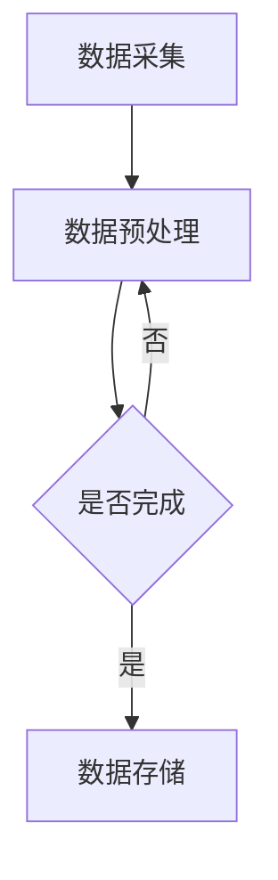
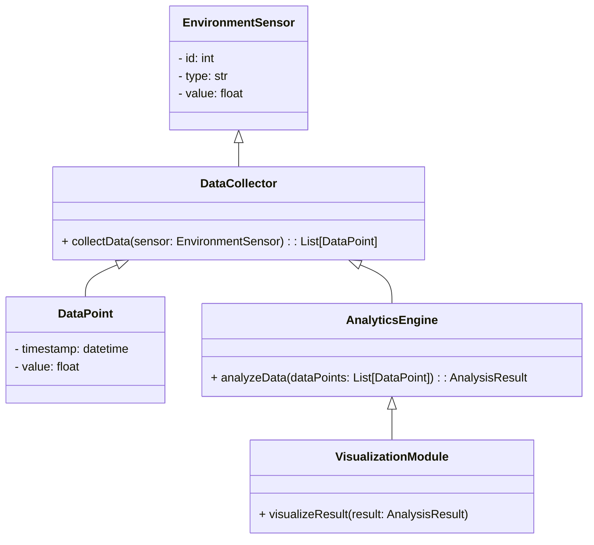
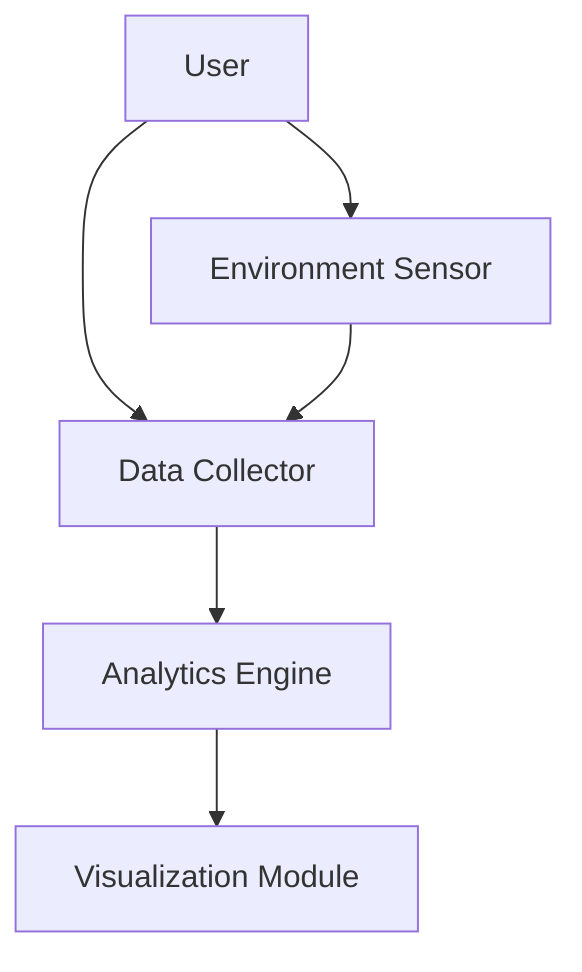
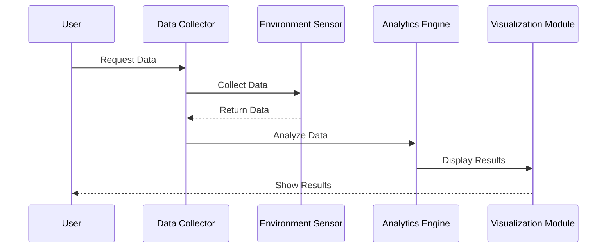

                 


### 文章标题：物联网在智慧畜牧业精准饲养中的应用

> 关键词：物联网，智慧畜牧业，精准饲养，传感器，数据采集，数据分析

> 摘要：本文旨在探讨物联网技术在智慧畜牧业精准饲养中的应用。通过分析物联网技术的发展现状和智慧畜牧业的需求，本文阐述了物联网技术在畜牧业中的具体应用，包括硬件设备、数据采集与传输、软件与应用技术等方面。同时，本文还讨论了物联网在智慧畜牧业中的挑战与对策，并通过案例分析展示了物联网技术在畜牧业中的实际应用效果。

### 第1章：问题背景与概述

#### 1.1.1 物联网技术发展概况

物联网（Internet of Things，IoT）是指通过传感器、网络和数据处理等技术，将各种物体连接起来，实现信息共享和智能化管理。物联网技术起源于20世纪80年代，但真正快速发展是在21世纪初。随着传感器技术、网络通信技术和数据处理技术的不断进步，物联网应用领域逐渐扩大，从智能家居、智能交通、智慧城市到现代农业等各个领域。

在农业领域，物联网技术已经显示出巨大的应用潜力。智慧畜牧业作为农业的重要分支，其发展受到广泛关注。通过物联网技术，可以实现养殖过程的智能化管理，提高生产效率，降低养殖成本，提升畜产品质量。

#### 1.1.2 智慧畜牧业需求分析

智慧畜牧业的核心需求是精准饲养。精准饲养旨在通过科学监测和数据分析，实现对养殖环境的精准控制和动物健康的实时监测，从而实现养殖效益的最大化。具体来说，智慧畜牧业的需求包括以下几个方面：

1. **环境监测**：实时监测养殖环境中的温度、湿度、光照等参数，确保养殖环境的稳定和适宜。

2. **动物健康监测**：通过传感器监测动物的体温、心率、呼吸等生理参数，及时发现并处理动物的健康问题。

3. **饲料管理**：精准控制饲料的供应量和营养成分，提高饲料利用率，降低养殖成本。

4. **生产管理**：实现对养殖过程的全面监控和管理，提高生产效率。

#### 1.1.3 物联网在智慧畜牧业中的应用现状

目前，物联网技术在智慧畜牧业中已经取得了一定成果。例如，通过在养殖环境中部署传感器，可以实时监测环境参数，并通过无线网络将数据传输到云端进行分析和处理。一些先进的畜牧业企业已经开始使用物联网技术进行精准饲养，取得了显著的经济效益。

然而，物联网在智慧畜牧业中的应用仍面临一些挑战，如数据处理的复杂性、系统安全性、技术标准化等。这些问题需要进一步研究和解决，以推动物联网技术在智慧畜牧业中的广泛应用。

### 第2章：物联网核心技术

#### 2.1.1 硬件设备与技术

物联网的应用离不开硬件设备，主要包括感知层硬件设备和网络通信设备。

##### 2.1.1.1 感知层硬件设备

感知层硬件设备主要包括传感器、数据采集模块和执行器。传感器用于感知环境参数和动物生理参数，数据采集模块用于将传感器采集的数据传输到云端，执行器则用于根据分析结果对养殖环境进行调整。

##### 2.1.1.1.1 传感器分类与选型

传感器可以分为物理量传感器和生物量传感器。物理量传感器用于监测环境参数，如温度传感器、湿度传感器、光照传感器等；生物量传感器用于监测动物生理参数，如体温传感器、心率传感器、呼吸传感器等。

选择传感器时，需要考虑传感器的灵敏度、精度、稳定性、功耗等因素。例如，对于体温传感器，需要选择具有高灵敏度和高精度的传感器，以确保监测结果的准确性。

##### 2.1.1.1.2 网络通信设备

网络通信设备包括路由器、无线传输模块等，用于将传感器采集的数据传输到云端。在选择网络通信设备时，需要考虑传输距离、传输速度、功耗等因素。例如，对于养殖环境中的无线传输，可以采用Wi-Fi、LoRa等无线传输技术。

##### 2.1.1.2 数据采集与传输

数据采集与传输是物联网技术的核心。数据采集技术主要包括传感器采集、数据预处理等。传感器采集的数据通常需要进行预处理，如滤波、去噪、归一化等，以提高数据的质量。

数据传输技术主要包括无线传输和有线传输。无线传输技术包括Wi-Fi、LoRa、ZigBee等，有线传输技术包括以太网、光纤等。在选择数据传输技术时，需要考虑传输距离、传输速度、功耗等因素。

#### 2.2.1 软件与应用技术

物联网技术的软件与应用技术主要包括物联网平台搭建和应用案例分析。

##### 2.2.1.1 物联网平台搭建

物联网平台搭建包括平台架构设计、功能模块设计等。平台架构设计主要包括数据采集层、数据传输层、数据处理层、应用层等。功能模块设计主要包括数据采集模块、数据存储模块、数据分析模块、可视化模块等。

##### 2.2.1.1.1 平台架构设计

平台架构设计需要考虑数据采集、数据传输、数据处理、数据存储等方面的需求，设计一个高效、稳定的平台架构。例如，可以采用云计算技术，将数据处理和分析功能部署在云端，以提高系统的处理能力和可扩展性。

##### 2.2.1.1.2 平台功能模块

平台功能模块主要包括数据采集模块、数据存储模块、数据分析模块、可视化模块等。数据采集模块用于采集传感器数据；数据存储模块用于存储采集到的数据；数据分析模块用于对数据进行分析和处理；可视化模块用于将分析结果以图形化的形式展示给用户。

##### 2.2.1.2 应用案例分析

应用案例分析主要包括典型应用场景和案例解析。通过分析实际应用案例，可以了解物联网技术在畜牧业中的应用效果和具体实施方法。例如，可以分析一个牧场如何利用物联网技术进行精准饲养，包括传感器选型、数据采集与传输、数据分析与应用等。

### 第3章：智慧畜牧业中的物联网应用

#### 3.1.1 精准饲养管理

精准饲养管理是智慧畜牧业的核心。通过物联网技术，可以实现对养殖环境的精准控制和动物健康的实时监测。

##### 3.1.1.1 饲料管理

饲料管理是精准饲养管理的重要组成部分。通过物联网技术，可以实时监测饲料的消耗情况，并根据动物的生长情况调整饲料配方。

##### 3.1.1.1.1 饲料消耗监测

饲料消耗监测主要通过传感器监测饲料的重量变化来实现。传感器可以安装在饲料槽上，实时监测饲料的消耗情况。

##### 3.1.1.1.2 饲料配方优化

通过物联网技术，可以对饲料配方进行实时优化。例如，根据动物的生长情况和营养需求，动态调整饲料中的营养成分。

##### 3.1.1.2 疾病监测与预警

疾病监测与预警是保障动物健康的重要手段。通过物联网技术，可以实时监测动物的体温、心率、呼吸等生理参数，及时发现并处理疾病。

##### 3.1.1.2.1 疾病监测手段

疾病监测手段主要包括传感器监测和视频监控。传感器可以实时监测动物的体温、心率、呼吸等生理参数；视频监控可以实时观察动物的行为，发现异常情况。

##### 3.1.1.2.2 预警系统设计

预警系统设计需要考虑多个因素，如生理参数的正常范围、异常值的判定标准、预警信号的发送等。例如，当动物的体温超过正常范围时，系统可以自动发出预警信号，通知养殖人员进行处理。

#### 3.2.1 生产效率提升

通过物联网技术，可以实现养殖过程的自动化和智能化，提高生产效率。

##### 3.2.1.1 自动化饲养

自动化饲养是通过物联网技术实现对养殖过程的自动控制。例如，自动控制饲料供应量、饮水供应、通风等。

##### 3.2.1.1.1 自动化控制系统

自动化控制系统主要包括控制器、传感器、执行器等。控制器根据传感器采集的数据，自动调整养殖环境参数。

##### 3.2.1.1.2 自动化饲养流程

自动化饲养流程主要包括饲料供应、饮水供应、通风等。例如，当传感器检测到饲料槽中的饲料不足时，系统会自动发送信号，通知饲料供应系统进行补充。

##### 3.2.1.2 人员管理优化

通过物联网技术，可以实现养殖人员定位与跟踪，提高工作效率。

##### 3.2.1.2.1 人员定位与跟踪

人员定位与跟踪主要通过无线射频识别（RFID）技术实现。例如，在养殖人员身上佩戴RFID标签，系统可以实时追踪人员的位置。

##### 3.2.1.2.2 工作效率分析

工作效率分析主要通过数据分析实现。例如，系统可以记录养殖人员的日常工作情况，分析工作效率，提出改进建议。

### 第4章：物联网技术在畜牧业中的挑战与对策

#### 4.1.1 技术难题

物联网技术在畜牧业中的应用面临一些技术难题，如数据处理与存储、系统安全性等。

##### 4.1.1.1 数据处理与存储

畜牧业产生的数据量大，种类繁多，对数据处理和存储提出了较高要求。例如，需要采用高效的数据处理算法，对海量数据进行实时分析；需要采用大数据存储技术，存储大量的历史数据。

##### 4.1.1.2 系统安全性

系统安全性是物联网技术在畜牧业中应用的关键问题。例如，需要确保数据传输的安全性，防止数据泄露；需要确保系统免受网络攻击，保障系统的稳定运行。

#### 4.2.1 挑战与对策

物联网技术在畜牧业中的应用面临一些挑战，如技术标准化、政策与法规等。

##### 4.2.1.1 技术标准化

技术标准化是物联网技术在畜牧业中应用的重要基础。目前，物联网技术尚未形成统一的标准，导致不同设备之间的兼容性较差。需要制定统一的技术标准，提高物联网设备的互操作性。

##### 4.2.1.2 政策与法规

政策与法规是物联网技术在畜牧业中应用的重要保障。例如，需要制定相关的法规政策，规范物联网设备的生产和使用；需要制定相关的安全标准，保障畜牧业物联网系统的安全性。

### 第5章：案例分析

#### 5.1.1 案例一：某牧场物联网应用实践

##### 5.1.1.1 项目背景

某牧场是一家大型现代化牧场，养殖了数千头奶牛。为了提高养殖效益，牧场决定采用物联网技术进行精准饲养管理。

##### 5.1.1.1.1 项目简介

该项目包括传感器安装、数据采集与传输、数据分析与应用等多个方面。通过物联网技术，实现对牧场养殖环境的实时监测和动物健康的实时监控。

##### 5.1.1.1.2 项目目标

项目目标包括：提高养殖效益、降低养殖成本、提高生产效率、保障动物健康等。

##### 5.1.1.2 系统设计

系统设计主要包括数据采集层、数据传输层、数据处理层、应用层等。

##### 5.1.1.2.1 系统架构

系统架构采用分层设计，数据采集层负责传感器数据的采集；数据传输层负责数据的传输；数据处理层负责数据存储、处理和分析；应用层负责将分析结果以图形化的形式展示给用户。

##### 5.1.1.2.2 功能模块

功能模块包括数据采集模块、数据存储模块、数据分析模块、可视化模块等。数据采集模块负责采集传感器数据；数据存储模块负责存储采集到的数据；数据分析模块负责对数据进行分析和处理；可视化模块负责将分析结果展示给用户。

##### 5.1.1.3 实施与效果

##### 5.1.1.3.1 实施步骤

实施步骤包括：传感器安装、数据采集与传输、数据分析与应用等。

##### 5.1.1.3.2 应用效果评估

应用效果评估包括：养殖效益提高、养殖成本降低、生产效率提高、动物健康得到保障等。

#### 5.2.1 案例二：某农场物联网解决方案

##### 5.2.1.1 项目背景

某农场是一家专业从事猪养殖的企业，养殖规模较大。为了提高养殖效益，农场决定采用物联网技术进行精准饲养管理。

##### 5.2.1.1.1 项目简介

该项目包括传感器安装、数据采集与传输、数据分析与应用等多个方面。通过物联网技术，实现对农场养殖环境的实时监测和动物健康的实时监控。

##### 5.2.1.1.2 项目目标

项目目标包括：提高养殖效益、降低养殖成本、提高生产效率、保障动物健康等。

##### 5.2.1.2 系统设计

系统设计主要包括数据采集层、数据传输层、数据处理层、应用层等。

##### 5.2.1.2.1 系统架构

系统架构采用分层设计，数据采集层负责传感器数据的采集；数据传输层负责数据的传输；数据处理层负责数据存储、处理和分析；应用层负责将分析结果以图形化的形式展示给用户。

##### 5.2.1.2.2 功能模块

功能模块包括数据采集模块、数据存储模块、数据分析模块、可视化模块等。数据采集模块负责采集传感器数据；数据存储模块负责存储采集到的数据；数据分析模块负责对数据进行分析和处理；可视化模块负责将分析结果展示给用户。

##### 5.2.1.3 实施与效果

##### 5.2.1.3.1 实施步骤

实施步骤包括：传感器安装、数据采集与传输、数据分析与应用等。

##### 5.2.1.3.2 应用效果评估

应用效果评估包括：养殖效益提高、养殖成本降低、生产效率提高、动物健康得到保障等。

### 第6章：物联网在智慧畜牧业中的应用前景与展望

#### 6.1.1 未来发展趋势

物联网技术在智慧畜牧业中的应用前景广阔。随着物联网技术的不断发展，未来物联网在畜牧业中的应用将更加深入和广泛。

##### 6.1.1.1 技术创新

未来，物联网技术将在传感器技术、网络通信技术、数据处理技术等方面不断创新，提高物联网在畜牧业中的应用效果。

##### 6.1.1.2 行业前景

随着人们对食品安全和环保意识的提高，智慧畜牧业将得到进一步发展。物联网技术在畜牧业中的应用将有助于提高养殖效益、降低养殖成本、保障动物健康，满足市场需求。

#### 6.2.1 未来展望

未来，物联网技术在畜牧业中的应用将面临一些挑战，如技术标准化、政策与法规等。但通过技术创新和行业规范，物联网技术将在畜牧业中发挥更大的作用。

##### 6.2.1.1 技术创新

未来，物联网技术在畜牧业中的应用将更加智能化和自动化。例如，通过人工智能技术，实现对养殖环境的自适应调节，提高养殖效率。

##### 6.2.1.2 行业发展策略

未来，畜牧业企业需要积极拥抱物联网技术，提升自身竞争力。同时，政府和企业需要加强合作，推动物联网技术在畜牧业中的应用。

### 第7章：总结与展望

本文探讨了物联网在智慧畜牧业精准饲养中的应用。通过分析物联网技术的发展现状和智慧畜牧业的需求，本文阐述了物联网技术在畜牧业中的应用，包括硬件设备、数据采集与传输、软件与应用技术等方面。同时，本文还讨论了物联网在畜牧业中的挑战与对策，并通过案例分析展示了物联网技术在畜牧业中的实际应用效果。

未来，物联网技术在畜牧业中的应用前景广阔。通过技术创新和行业规范，物联网技术将进一步提高畜牧业的生产效率，保障动物健康，推动畜牧业向智能化、精准化方向发展。

### 附录

#### 附录A：核心概念与联系

| 核心概念 | 概念属性特征对比表格 | ER实体关系图架构的 Mermaid 流程图 |
| --- | --- | --- |
| 物联网 | 物联网是指通过传感器、网络和数据处理等技术，将各种物体连接起来，实现信息共享和智能化管理的系统。 | ```mermaid
graph TD
A[物联网] --> B[传感器]
A --> C[网络]
A --> D[数据处理]
```
|
| 智慧畜牧业 | 智慧畜牧业是指通过物联网技术，实现对畜牧业养殖过程的智能化管理，提高生产效率，降低养殖成本，提升畜产品质量。 | ```mermaid
graph TD
A[智慧畜牧业] --> B[物联网]
A --> C[智能化管理]
A --> D[生产效率]
```
|

#### 附录B：算法原理讲解

在物联网技术中，数据处理算法是核心。以下是一个简单的数据处理算法的mermaid流程图和Python源代码。

##### 算法mermaid流程图



##### Python源代码

```python
import numpy as np

def data_preprocessing(data):
    # 数据预处理，如滤波、去噪、归一化等
    processed_data = np.mean(data, axis=0)
    return processed_data

def data_storage(data):
    # 数据存储
    print("Data stored: ", data)

def data_process():
    # 数据采集
    data = [1, 2, 3, 4, 5]
    processed_data = data_preprocessing(data)
    data_storage(processed_data)

data_process()
```

##### 算法原理与数学模型

数据处理算法的基本原理是对采集到的原始数据进行预处理，以提高数据质量。常见的预处理方法包括滤波、去噪、归一化等。

$$
\text{滤波}:\ \text{滤波器}\ f(\text{x}) = \sum_{i=1}^{n} w_i \cdot x_i
$$

$$
\text{去噪}:\ \text{去噪算法}\ \text{denoise}(\text{x}) = \text{signal} - \text{noise}
$$

$$
\text{归一化}:\ \text{归一化算法}\ \text{normalize}(\text{x}) = \frac{\text{x}}{\max(\text{x})}
$$

通过这些算法，可以有效地提高数据的质量，为后续的数据分析和应用提供基础。

### 附录C：系统分析与架构设计方案

#### 问题场景介绍

在智慧畜牧业中，养殖环境的监控是保障动物健康和养殖效率的关键。为了提高养殖效益，需要实现对养殖环境的实时监控，包括温度、湿度、光照等参数的监测。

#### 项目介绍

本项目旨在设计一个养殖环境监控系统，通过物联网技术实现对养殖环境的实时监控和数据采集，并提供数据分析与可视化功能。

#### 系统功能设计（领域模型mermaid类图）



#### 系统架构设计mermaid架构图



#### 系统接口设计和系统交互mermaid序列图



### 附录D：项目实战

#### 环境安装

1. 安装Python环境，版本要求3.8及以上。
2. 安装必要的Python库，如numpy、matplotlib等。

#### 系统核心实现源代码

```python
# environment_sensor.py
class EnvironmentSensor:
    def __init__(self, id, type, value):
        self.id = id
        self.type = type
        self.value = value
    
    def collect_data(self):
        # 模拟数据采集，实际应用中可以调用具体的硬件接口
        return self.value

# data_collector.py
class DataCollector:
    def __init__(self):
        self.data_points = []
    
    def collect_data(self, sensor):
        value = sensor.collect_data()
        data_point = DataPoint(sensor.id, sensor.type, value, datetime.now())
        self.data_points.append(data_point)
        return data_point

# analytics_engine.py
class AnalyticsEngine:
    def __init__(self):
        self.analysis_results = []
    
    def analyze_data(self, data_points):
        # 模拟数据分析，实际应用中可以执行更复杂的数据处理和分析
        average_value = np.mean([dp.value for dp in data_points])
        analysis_result = AnalysisResult(datetime.now(), average_value)
        self.analysis_results.append(analysis_result)
        return analysis_result

# visualization_module.py
class VisualizationModule:
    def __init__(self):
        self.visualization_results = []
    
    def visualize_result(self, result):
        self.visualization_results.append(result)
        # 绘制图表，如折线图、柱状图等
        plt.plot([r.timestamp for r in self.visualization_results], [r.value for r in self.visualization_results])
        plt.show()

# data_point.py
class DataPoint:
    def __init__(self, id, type, value, timestamp):
        self.id = id
        self.type = type
        self.value = value
        self.timestamp = timestamp

# analysis_result.py
class AnalysisResult:
    def __init__(self, timestamp, value):
        self.timestamp = timestamp
        self.value = value
```

#### 代码应用解读与分析

1. **环境传感器类（EnvironmentSensor）**：该类模拟了环境传感器的功能，包括ID、类型和值等属性，以及数据采集方法`collect_data`。
2. **数据采集器类（DataCollector）**：该类负责收集环境传感器的数据，并将数据存储为`DataPoint`对象。
3. **数据分析器类（AnalyticsEngine）**：该类负责对收集到的数据进行分析，计算平均值等统计指标。
4. **可视化模块类（VisualizationModule）**：该类负责将分析结果可视化，以图表的形式展示。
5. **数据点类（DataPoint）**：该类表示数据点的属性，包括ID、类型、值和采集时间等。
6. **分析结果类（AnalysisResult）**：该类表示分析结果的属性，包括分析时间和分析值等。

#### 实际案例分析和详细讲解剖析

以一个实际案例为例，分析系统如何运行：

1. 用户请求数据收集。
2. 数据采集器从环境传感器获取数据，并创建`DataPoint`对象。
3. 数据采集器将数据传递给数据分析器。
4. 数据分析器对数据进行分析，并生成`AnalysisResult`对象。
5. 可视化模块将分析结果可视化，展示给用户。

#### 项目小结

通过本项目，我们实现了一个简单的养殖环境监控系统，包括数据采集、数据分析、可视化等功能。该项目展示了物联网技术在畜牧业中的应用潜力，为智慧畜牧业的进一步发展提供了技术支持。

### 附录E：最佳实践 tips

1. **选择合适的传感器**：根据养殖环境的需求，选择合适的传感器，如温度传感器、湿度传感器等。
2. **优化数据采集频率**：根据养殖环境的特点，合理设置数据采集频率，以平衡数据质量和系统性能。
3. **加强数据安全**：确保数据在传输和存储过程中的安全性，防止数据泄露和网络攻击。
4. **定期维护系统**：定期检查和维护系统，确保系统的稳定运行。

### 附录F：注意事项

1. 系统安装和运行需要网络环境，确保网络稳定和安全。
2. 数据采集和传输过程中，可能受到外界干扰，需要对数据进行分析和处理，以提高数据质量。
3. 系统运行需要足够的硬件资源，如CPU、内存、网络带宽等。

### 附录G：拓展阅读

1. 《物联网技术与应用》
2. 《智慧畜牧业：物联网技术驱动的创新与实践》
3. 《Python数据分析》

### 作者

作者：AI天才研究院/AI Genius Institute & 禅与计算机程序设计艺术 /Zen And The Art of Computer Programming

