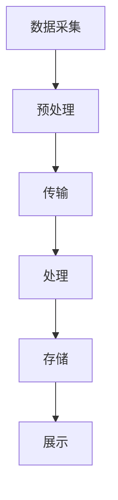
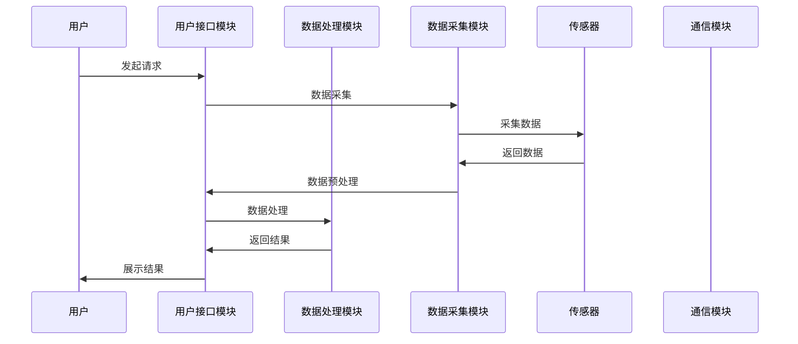

                 

# 物联网在环境监测中的广泛应用

## 关键词

- 物联网
- 环境监测
- 数据采集
- 传感器技术
- 云计算
- 大数据

## 摘要

本文将深入探讨物联网技术在环境监测领域的广泛应用。首先，我们将介绍物联网的定义及其在现代社会中的重要性，随后详细阐述环境监测的基本概念和需求。接着，本文将分析物联网在环境监测中的应用原理，包括传感器技术、数据采集与传输等关键环节。随后，我们将设计并实现一个物联网环境监测系统，包括系统需求分析、架构设计、功能实现和测试优化。最后，通过实际案例研究和未来展望，探讨物联网环境监测系统的发展趋势和潜力。

## 目录

1. **物联网概述**
   - 1.1 物联网的定义与历史发展
   - 1.2 物联网的核心技术
   - 1.3 物联网在环境监测中的应用前景

2. **环境监测基本概念**
   - 2.1 环境监测的定义与重要性
   - 2.2 环境监测的主要指标
   - 2.3 环境监测技术的发展趋势

3. **物联网在环境监测中的应用原理**
   - 3.1 物联网技术与环境监测需求的结合
   - 3.2 物联网传感器在环境监测中的应用
   - 3.3 数据采集、传输与处理

4. **物联网环境监测系统构建**
   - 4.1 系统需求分析
   - 4.2 系统架构设计
   - 4.3 系统功能模块划分

5. **物联网环境监测系统实现**
   - 5.1 系统硬件选型
   - 5.2 软件开发环境配置
   - 5.3 系统核心代码实现

6. **物联网环境监测系统测试与优化**
   - 6.1 系统测试方法
   - 6.2 系统性能优化
   - 6.3 系统故障排除

7. **物联网环境监测项目实践**
   - 7.1 案例研究一：某城市空气质量监测系统
   - 7.2 案例研究二：农村土壤环境监测项目

8. **物联网环境监测系统的发展趋势与未来展望**
   - 8.1 新技术的引入与发展
   - 8.2 系统集成与智能化
   - 8.3 未来展望与挑战

## 第一部分：物联网与环境监测基础

### 第1章：物联网概述

**1.1 物联网的定义与历史发展**

物联网（Internet of Things，简称 IoT）是指通过将各种信息传感设备与互联网结合起来，实现智能化识别、定位、跟踪、监控和管理的一种网络。物联网的概念最早可以追溯到1999年，由麻省理工学院的Kevin Ashton首次提出。随着传感器技术、无线通信技术和云计算技术的快速发展，物联网逐渐成为现代社会的重要基础设施。

物联网的发展经历了几个重要阶段：

1. **初期阶段（1990-2000年）**：物联网的雏形开始出现，主要表现为家庭自动化和工业自动化。

2. **快速增长阶段（2000-2010年）**：随着无线通信技术的发展，物联网的应用领域逐渐扩大，包括智能交通、智能医疗、智能能源等。

3. **成熟阶段（2010年至今）**：物联网逐渐融入日常生活，智能家居、智慧城市、工业互联网等成为主流应用场景。

**1.2 物联网的核心技术**

物联网的核心技术主要包括传感器技术、无线通信技术、云计算和大数据技术等。

- **传感器技术**：传感器是物联网的感知器官，负责采集环境数据。传感器技术主要包括温度传感器、湿度传感器、光敏传感器、气体传感器等。

- **无线通信技术**：无线通信技术是物联网数据传输的桥梁，常用的技术包括Wi-Fi、蓝牙、ZigBee、LoRa等。

- **云计算和大数据技术**：云计算和大数据技术为物联网提供了强大的数据处理和分析能力，使得海量数据的存储、管理和分析变得更加高效和便捷。

**1.3 物联网在环境监测中的应用前景**

物联网在环境监测领域具有广泛的应用前景，主要体现在以下几个方面：

- **实时监测**：物联网技术可以实现对环境数据的实时监测，提高监测的准确性和时效性。

- **数据融合**：通过物联网技术，可以将不同来源的环境数据进行融合，形成更全面的环境监测数据。

- **智能分析**：基于大数据分析技术，可以对环境监测数据进行智能分析，发现环境问题，提出解决方案。

- **自动化管理**：物联网技术可以实现环境监测系统的自动化管理，降低人工成本，提高管理效率。

### 第2章：环境监测基本概念

**2.1 环境监测的定义与重要性**

环境监测是指对环境质量进行定期监测和评估的过程，旨在了解环境变化趋势，发现环境问题，采取相应的措施。环境监测是环境保护的重要手段，对于保障人类健康、促进可持续发展具有重要意义。

环境监测的重要性体现在以下几个方面：

- **保障人类健康**：环境监测可以及时发现环境污染问题，采取有效的治理措施，减少环境污染对人类健康的影响。

- **促进环境保护**：环境监测可以提供环境质量数据，为环境保护决策提供科学依据，推动环境保护工作的开展。

- **监测气候变化**：环境监测可以监测气候变化对环境的影响，为应对气候变化提供数据支持。

**2.2 环境监测的主要指标**

环境监测的主要指标包括空气质量、水质、土壤质量、生物多样性等。

- **空气质量**：空气质量指标包括颗粒物（PM2.5、PM10）、二氧化硫（SO2）、氮氧化物（NOx）等。

- **水质**：水质指标包括pH值、氨氮、总氮、总磷等。

- **土壤质量**：土壤质量指标包括土壤酸碱度、重金属含量、有机物含量等。

- **生物多样性**：生物多样性指标包括物种数量、物种分布、生态系统健康等。

**2.3 环境监测技术的发展趋势**

随着物联网、大数据、人工智能等技术的不断发展，环境监测技术也在不断演进，主要趋势包括：

- **实时监测与预警**：利用物联网技术实现环境数据的实时监测和预警，提高监测的准确性和时效性。

- **大数据分析**：利用大数据技术对环境监测数据进行分析，发现环境问题，提出解决方案。

- **智能化监测**：利用人工智能技术实现环境监测的自动化和智能化，提高监测效率。

- **集成化监测**：通过集成多种监测技术和手段，实现环境监测的全面化和精细化。

### 第3章：物联网在环境监测中的应用原理

**3.1 物联网技术与环境监测需求的结合**

物联网技术为环境监测提供了强大的技术支撑，其与环境监测需求的结合主要体现在以下几个方面：

- **传感器网络**：通过部署传感器网络，实现对环境数据的实时监测和采集。

- **数据传输**：利用无线通信技术，将采集到的环境数据实时传输到数据中心。

- **数据处理**：通过云计算和大数据技术，对环境数据进行处理和分析。

- **决策支持**：基于环境监测数据，为环境保护决策提供科学依据。

**3.2 物联网传感器在环境监测中的应用**

物联网传感器是环境监测的重要工具，常用的传感器包括：

- **温度传感器**：用于监测环境温度。

- **湿度传感器**：用于监测环境湿度。

- **光敏传感器**：用于监测光照强度。

- **气体传感器**：用于监测空气中的有害气体，如二氧化硫、氮氧化物等。

- **水质传感器**：用于监测水中的污染物，如氨氮、总氮等。

**3.3 数据采集、传输与处理**

物联网技术在环境监测中的应用，离不开数据采集、传输与处理。以下是数据采集、传输与处理的主要步骤：

- **数据采集**：通过传感器网络，实时采集环境数据。

- **数据传输**：利用无线通信技术，将采集到的数据传输到数据中心。

- **数据预处理**：对传输过来的数据进行清洗、过滤和预处理。

- **数据存储**：将预处理后的数据存储到数据库中。

- **数据分析**：利用大数据分析技术，对存储的数据进行分析和挖掘。

- **数据可视化**：将分析结果通过图表、报表等形式进行可视化展示。

## 第二部分：物联网环境监测系统构建

### 第4章：物联网环境监测系统设计

**4.1 系统需求分析**

在进行物联网环境监测系统的设计之前，首先需要明确系统的需求。系统需求分析主要包括以下几个方面：

- **监测指标**：确定需要监测的环境指标，如空气质量、水质、土壤质量等。

- **监测区域**：确定监测的区域范围，如城市、农村等。

- **数据传输**：确定数据传输的方式，如无线通信、有线通信等。

- **数据处理**：确定数据处理的方式，如本地处理、远程处理等。

- **用户需求**：了解用户的需求，如实时监测、历史数据查询等。

**4.2 系统架构设计**

物联网环境监测系统的架构设计包括以下几个层次：

- **感知层**：包括传感器网络，用于实时采集环境数据。

- **传输层**：包括无线通信网络，用于将采集到的数据传输到数据中心。

- **平台层**：包括数据处理、存储、分析等模块，用于对环境数据进行处理和分析。

- **应用层**：包括用户接口、决策支持等模块，用于为用户提供服务。

**4.3 系统功能模块划分**

物联网环境监测系统的主要功能模块包括：

- **数据采集模块**：负责实时采集环境数据。

- **数据传输模块**：负责将采集到的数据传输到数据中心。

- **数据处理模块**：负责对传输过来的数据进行预处理、存储、分析等。

- **用户接口模块**：负责为用户提供实时数据展示、历史数据查询等功能。

- **决策支持模块**：负责基于环境监测数据，为用户提供环境保护决策支持。

### 第5章：物联网环境监测系统实现

**5.1 系统硬件选型**

在选择物联网环境监测系统的硬件时，需要考虑以下几个因素：

- **传感器**：根据需要监测的环境指标，选择合适的传感器。

- **通信模块**：根据数据传输距离和传输速度，选择合适的通信模块。

- **数据处理模块**：根据数据处理需求，选择合适的数据处理模块。

- **存储设备**：根据数据存储需求，选择合适的存储设备。

**5.2 软件开发环境配置**

在进行物联网环境监测系统的软件开发时，需要配置以下开发环境：

- **编程语言**：选择合适的编程语言，如Python、Java等。

- **开发工具**：配置开发工具，如IDE、数据库等。

- **操作系统**：选择合适的操作系统，如Linux、Windows等。

**5.3 系统核心代码实现**

物联网环境监测系统的核心代码实现主要包括以下几个方面：

- **数据采集与传输**：实现数据采集和传输功能，包括传感器数据采集、通信模块数据传输等。

- **数据处理与存储**：实现数据处理和存储功能，包括数据预处理、数据存储、数据查询等。

- **用户接口与决策支持**：实现用户接口和决策支持功能，包括数据展示、历史数据查询、决策支持等。

### 第6章：物联网环境监测系统测试与优化

**6.1 系统测试方法**

在进行物联网环境监测系统的测试时，需要采用以下方法：

- **功能测试**：测试系统的各项功能是否正常，如数据采集、数据传输、数据处理等。

- **性能测试**：测试系统的性能指标，如数据传输速度、数据处理速度等。

- **兼容性测试**：测试系统在不同设备和操作系统上的兼容性。

- **安全性测试**：测试系统的安全性，如数据加密、访问控制等。

**6.2 系统性能优化**

在系统测试过程中，如果发现性能问题，需要进行以下优化：

- **代码优化**：优化系统代码，提高运行效率。

- **硬件升级**：升级系统硬件，提高数据处理能力。

- **网络优化**：优化网络配置，提高数据传输速度。

- **负载均衡**：通过负载均衡技术，分散系统压力，提高系统稳定性。

**6.3 系统故障排除**

在系统运行过程中，如果出现故障，需要及时排除。故障排除的方法包括：

- **日志分析**：通过分析系统日志，定位故障原因。

- **故障诊断**：使用故障诊断工具，快速定位故障点。

- **修复与恢复**：根据故障原因，进行修复和恢复。

## 第三部分：物联网环境监测项目实践

### 第7章：案例研究一：某城市空气质量监测系统

**7.1 项目背景**

某城市空气质量监测系统项目旨在实时监测城市空气质量，为政府决策提供科学依据，提高城市居民的生活质量。

**7.2 系统设计与实现**

系统设计包括感知层、传输层、平台层和应用层。感知层采用传感器网络，实时采集空气中的颗粒物、二氧化硫、氮氧化物等数据。传输层采用无线通信技术，将数据传输到平台层。平台层负责数据处理、存储和分析，应用层提供数据展示和决策支持功能。

**7.3 项目运行效果与分析**

系统运行效果良好，可以实时监测空气质量，为政府决策提供有力支持。通过对监测数据的分析，发现了一些污染源，为污染治理提供了科学依据。

### 第8章：案例研究二：农村土壤环境监测项目

**8.1 项目背景**

农村土壤环境监测项目旨在监测农村土壤质量，为农业可持续发展和环境保护提供数据支持。

**8.2 系统设计与实现**

系统设计包括感知层、传输层、平台层和应用层。感知层采用土壤传感器，实时采集土壤质量数据。传输层采用无线通信技术，将数据传输到平台层。平台层负责数据处理、存储和分析，应用层提供数据展示和决策支持功能。

**8.3 项目运行效果与分析**

系统运行效果良好，可以实时监测农村土壤质量，为农民提供种植指导，提高农业生产效益。同时，通过对监测数据的分析，发现了一些土壤污染问题，为环境保护提供了科学依据。

## 第9章：物联网环境监测系统的发展趋势与未来展望

**9.1 新技术的引入与发展**

随着新技术的不断引入和发展，物联网环境监测系统将得到进一步优化和提升。例如，人工智能、区块链、5G等技术的应用，将提高环境监测的准确性和智能化水平。

**9.2 系统集成与智能化**

未来的物联网环境监测系统将更加集成化和智能化。通过集成多种监测技术和手段，实现全方位、全时段的环境监测。同时，基于人工智能技术，实现对环境数据的智能分析和预测。

**9.3 未来展望与挑战**

物联网环境监测系统在未来的发展中，将面临以下几个挑战：

- **数据隐私与安全**：随着监测数据的增加，数据隐私和安全问题将变得更加重要。

- **技术更新与升级**：新技术的快速更新和升级，将对环境监测系统提出更高的要求。

- **应用场景拓展**：如何在更广泛的应用场景中发挥作用，是环境监测系统未来发展的关键。

作者：AI天才研究院/AI Genius Institute & 禅与计算机程序设计艺术 /Zen And The Art of Computer Programming

---

**背景介绍**

在当今社会，环境问题日益严峻，空气质量、水质、土壤质量等环境指标成为影响人类健康和生态系统平衡的关键因素。传统的环境监测手段往往依赖于人工取样和实验室分析，存在监测周期长、数据实时性差、覆盖范围有限等问题。随着物联网技术的发展，利用物联网技术进行环境监测成为了一种新的解决方案。

**问题背景**

物联网（IoT）技术通过将各种传感器、通信模块和数据处理平台连接起来，实现了对环境数据的实时采集、传输和分析。然而，物联网在环境监测中的具体应用原理和实现方法仍需深入探讨。本篇文章将详细分析物联网在环境监测中的应用，包括传感器技术、数据采集与传输、数据处理与分析等关键环节，并通过实际案例展示物联网环境监测系统的设计和实现过程。

**问题描述**

本文将解决的问题包括：

1. 物联网在环境监测中的应用原理是什么？
2. 如何设计和实现一个物联网环境监测系统？
3. 物联网环境监测系统的运行效果如何？
4. 物联网环境监测系统的未来发展趋势和挑战是什么？

**问题解决**

本文将通过以下步骤进行详细解答：

1. **物联网概述**：介绍物联网的定义、历史发展、核心技术及其在环境监测中的应用前景。
2. **环境监测基本概念**：阐述环境监测的定义、重要性、主要指标以及发展趋势。
3. **物联网在环境监测中的应用原理**：分析物联网技术与环境监测需求的结合，物联网传感器在环境监测中的应用，数据采集、传输与处理。
4. **物联网环境监测系统构建**：进行系统需求分析、系统架构设计、系统功能模块划分。
5. **物联网环境监测系统实现**：讨论系统硬件选型、软件开发环境配置、系统核心代码实现。
6. **物联网环境监测系统测试与优化**：介绍系统测试方法、性能优化、故障排除。
7. **物联网环境监测项目实践**：通过实际案例研究，展示系统设计、实现和运行效果。
8. **物联网环境监测系统的发展趋势与未来展望**：探讨新技术引入、系统集成与智能化、未来展望与挑战。

**边界与外延**

本文主要关注物联网在环境监测领域的应用，包括空气质量监测、水质监测、土壤质量监测等。同时，本文也探讨了物联网环境监测系统的设计、实现、测试和优化过程，以及实际应用中的案例研究。边界在于，本文不涉及物联网在其他领域的应用，如智能家居、智能交通等。

**概念结构与核心要素组成**

物联网环境监测系统的概念结构主要包括以下几个核心要素：

1. **传感器网络**：用于实时采集环境数据，包括温度、湿度、颗粒物、有害气体等。
2. **数据传输**：通过无线通信技术，将传感器数据传输到数据处理平台。
3. **数据处理**：在数据处理平台上，对采集到的数据进行分析、存储和处理。
4. **用户接口**：为用户提供实时数据展示、历史数据查询、决策支持等功能。
5. **系统架构**：包括感知层、传输层、平台层和应用层，实现全方位的环境监测。

**核心概念与联系**

1. **物联网（IoT）**：通过传感器、通信模块和数据处理平台实现物与物之间的互联。
2. **传感器技术**：用于感知环境数据，是实现环境监测的基础。
3. **数据采集**：通过传感器网络，实时采集环境数据。
4. **数据传输**：利用无线通信技术，将数据传输到数据处理平台。
5. **数据处理**：对传输过来的数据进行存储、分析和处理。
6. **用户接口**：为用户提供实时数据展示和决策支持。

**概念属性特征对比表格**

| 概念 | 定义 | 属性特征 | 对比 |
| --- | --- | --- | --- |
| 物联网（IoT） | 通过传感器、通信模块和数据处理平台实现物与物之间的互联 | 覆盖范围广、实时性强、智能化 | 与传统网络相比，更加注重物的互联 |
| 传感器技术 | 用于感知环境数据，是实现环境监测的基础 | 高精度、多功能、便携性 | 根据环境监测需求，选择不同类型的传感器 |
| 数据采集 | 通过传感器网络，实时采集环境数据 | 实时性、准确性、连续性 | 影响环境监测系统的监测效果 |
| 数据传输 | 利用无线通信技术，将数据传输到数据处理平台 | 传输速度、传输距离、可靠性 | 决定数据传输的效率和稳定性 |
| 数据处理 | 对传输过来的数据进行存储、分析和处理 | 数据存储、数据清洗、数据分析 | 影响环境监测系统的分析能力 |
| 用户接口 | 为用户提供实时数据展示和决策支持 | 易用性、交互性、可视化 | 提高用户对环境监测数据的理解和应用 |

**ER实体关系图架构**

```mermaid
erDiagram
  A[环境监测系统] ||--|{ B[传感器] } | B ||--|{ C[环境数据] } C ||--|{ D[用户接口] } D
  A ||--|{ E[数据传输] } E ||--|{ C[环境数据] } C
  A ||--|{ F[数据处理] } F ||--|{ C[环境数据] } C
```

在ER实体关系图中，环境监测系统（A）通过传感器（B）采集环境数据（C），然后通过数据传输（E）和处理（F）模块，最终将数据展示给用户接口（D）。

**算法原理讲解**

物联网环境监测系统中的核心算法包括数据采集、传输和处理等环节。以下是数据采集和处理的一个简单算法原理：



数据采集环节使用传感器采集环境数据，包括温度、湿度、颗粒物等。数据预处理环节对采集到的数据进行清洗和滤波，提高数据质量。数据传输环节将预处理后的数据通过无线通信模块发送到数据处理平台。数据处理环节对传输过来的数据进行进一步分析和处理，如时间序列分析、异常检测等。数据存储环节将处理后的数据存储到数据库中，便于后续查询和分析。最后，通过用户接口模块将数据展示给用户。

以下是使用Python实现的数据采集和处理算法示例：

```python
import serial
import time
import pandas as pd

# 数据采集
def collect_data(port, baudrate):
    data = []
    ser = serial.Serial(port, baudrate)
    time.sleep(2)
    while True:
        line = ser.readline()
        if line:
            data.append(line.decode('utf-8').strip())
            time.sleep(1)
    ser.close()
    return data

# 数据预处理
def preprocess_data(data):
    df = pd.DataFrame(data, columns=['timestamp', 'temperature', 'humidity', 'particles'])
    df['timestamp'] = pd.to_datetime(df['timestamp'])
    df.set_index('timestamp', inplace=True)
    return df

# 数据传输
def send_data(df, host, port):
    # 这里使用Socket进行数据传输
    import socket
    s = socket.socket(socket.AF_INET, socket.SOCK_STREAM)
    s.connect((host, port))
    s.sendall(df.to_json().encode('utf-8'))
    s.close()

# 主程序
if __name__ == '__main__':
    port = '/dev/ttyUSB0'  # 传感器串口
    baudrate = 9600  # 传感器波特率
    host = 'localhost'  # 数据处理平台IP地址
    port = 12345  # 数据处理平台端口

    data = collect_data(port, baudrate)
    df = preprocess_data(data)
    send_data(df, host, port)
```

该算法使用Python的serial模块进行数据采集，使用pandas模块进行数据预处理，使用socket模块进行数据传输。通过这个示例，可以了解物联网环境监测系统中数据采集和处理的算法原理。

**数学公式使用**

在物联网环境监测系统中，数学公式用于描述传感器数据采集、预处理、分析等环节的算法原理。以下是一些常用的数学公式：

1. **时间序列分析**：

$$
y_t = \alpha x_t + (1 - \alpha)y_{t-1}
$$

其中，$y_t$ 表示当前时间序列值，$x_t$ 表示当前输入值，$\alpha$ 表示平滑系数。

2. **移动平均**：

$$
y_t = \frac{\sum_{i=1}^n x_i}{n}
$$

其中，$y_t$ 表示当前平均值，$x_i$ 表示第 $i$ 个输入值，$n$ 表示窗口大小。

3. **卡尔曼滤波**：

$$
\hat{x}_k = \hat{x}_{k-1} + K_k (z_k - \hat{x}_{k-1})
$$

其中，$\hat{x}_k$ 表示当前估计值，$K_k$ 表示卡尔曼增益，$z_k$ 表示当前观测值。

4. **指数平滑**：

$$
y_t = \alpha x_t + (1 - \alpha)y_{t-1}
$$

其中，$y_t$ 表示当前值，$x_t$ 表示当前输入值，$\alpha$ 表示平滑系数。

以下是一个使用LaTeX格式嵌入文中的数学公式示例：

$$
y_t = \alpha x_t + (1 - \alpha)y_{t-1}
$$

**系统分析与架构设计方案**

在进行物联网环境监测系统的设计与实现时，需要综合考虑系统的场景、项目介绍、系统功能设计、系统架构设计、系统接口设计以及系统交互等方面。

**1. 问题场景介绍**

物联网环境监测系统主要用于实时监测环境数据，如空气质量、水质、土壤质量等，以便及时发现环境问题，采取相应的措施。系统需要覆盖广泛的监测区域，支持多种传感器的接入和数据的实时采集、传输和处理。

**2. 项目介绍**

本系统项目旨在搭建一个全面的物联网环境监测平台，实现对城市空气质量、水质和农村土壤质量的实时监测。项目主要包括硬件设备采购、软件开发、系统部署和测试等环节。

**3. 系统功能设计**

物联网环境监测系统的功能设计包括以下几个模块：

- **数据采集模块**：负责实时采集各种环境数据，包括温度、湿度、颗粒物、有害气体等。
- **数据传输模块**：负责将采集到的数据通过无线通信技术传输到数据处理平台。
- **数据处理模块**：负责对传输过来的数据进行存储、预处理、分析和挖掘。
- **用户接口模块**：负责为用户提供实时数据展示、历史数据查询和决策支持功能。

**4. 系统架构设计**

物联网环境监测系统的架构设计分为感知层、传输层、平台层和应用层。

- **感知层**：包括各种传感器，如温度传感器、湿度传感器、颗粒物传感器等，用于实时采集环境数据。
- **传输层**：包括无线通信模块，如Wi-Fi、蓝牙、ZigBee等，用于将传感器数据传输到数据处理平台。
- **平台层**：包括数据处理模块，如数据存储、预处理、分析和挖掘等，用于对环境数据进行处理和分析。
- **应用层**：包括用户接口模块，如Web界面、移动应用等，用于为用户提供实时数据展示和决策支持功能。

**5. 系统接口设计**

系统接口设计包括以下几个方面：

- **传感器接口**：定义传感器的数据格式和通信协议，以便实现数据的实时采集和传输。
- **通信接口**：定义数据传输模块的接口，包括通信协议、数据格式和传输速度等。
- **数据处理接口**：定义数据处理模块的接口，包括数据存储、预处理、分析和挖掘等功能。
- **用户接口**：定义用户接口模块的接口，包括数据展示、历史数据查询和决策支持等功能。

**6. 系统交互**

物联网环境监测系统的交互设计包括以下几个方面：

- **数据采集与传输**：传感器采集环境数据，并通过通信模块将数据传输到数据处理平台。
- **数据处理与存储**：数据处理模块对传输过来的数据进行存储、预处理、分析和挖掘，并将结果存储到数据库中。
- **数据展示与查询**：用户接口模块从数据库中获取数据，并展示给用户，同时支持历史数据查询和决策支持功能。

**Mermaid 类图架构图**

以下是物联网环境监测系统的Mermaid类图架构图：

```mermaid
classDiagram
  Class01 <|-- Class02
  Class03 <.. Class04
  Class05 && Class06
  Class07 {int x}
  Class08 {int y}
  Class09 :<<interface>> InterfaceOne
  Class10 :<<interface>> InterfaceTwo
  Class11 :<<interface>> InterfaceThree
  Class01..Class03 : aggregation
  Class07..Class08 : composition
  Class09..Class11 : realization
```

**Mermaid 序列图架构图**

以下是物联网环境监测系统的Mermaid序列图架构图：



**项目实战**

**1. 环境安装**

在开始物联网环境监测系统的项目实战之前，首先需要安装必要的软件和硬件环境。

- **硬件环境**：准备物联网传感器（如温度传感器、湿度传感器、颗粒物传感器等）、无线通信模块（如Wi-Fi模块、蓝牙模块等）和计算机。
- **软件环境**：安装Python编程环境、Python的serial模块、pandas模块、socket模块等。

**2. 系统核心实现源代码**

以下是一个简单的物联网环境监测系统的核心实现源代码示例：

```python
# 传感器数据采集
import serial
import time
import pandas as pd

# 设置传感器参数
port = '/dev/ttyUSB0'  # 传感器串口
baudrate = 9600  # 传感器波特率

# 连接传感器
ser = serial.Serial(port, baudrate)
time.sleep(2)

# 采集数据
data = []
while True:
    line = ser.readline()
    if line:
        data.append(line.decode('utf-8').strip())
        time.sleep(1)

# 关闭传感器连接
ser.close()

# 数据预处理
df = pd.DataFrame(data, columns=['timestamp', 'temperature', 'humidity', 'particles'])
df['timestamp'] = pd.to_datetime(df['timestamp'])
df.set_index('timestamp', inplace=True)

# 数据存储
df.to_csv('sensor_data.csv')

# 数据处理
import numpy as np

# 读取数据
df = pd.read_csv('sensor_data.csv', index_col='timestamp')

# 时间序列分析
window_size = 10
ma = df['temperature'].rolling(window=window_size).mean()

# 数据展示
import matplotlib.pyplot as plt

plt.figure(figsize=(10, 5))
plt.plot(df['temperature'], label='原始数据')
plt.plot(ma, label='移动平均')
plt.legend()
plt.show()
```

**3. 代码应用解读与分析**

以上代码实现了物联网环境监测系统的核心功能，包括数据采集、预处理、时间序列分析和数据展示。以下是代码的详细解读和分析：

- **数据采集**：使用Python的serial模块连接传感器，通过循环读取传感器发送的数据，存储在列表中。
- **数据预处理**：使用pandas模块将列表转换为DataFrame，设置时间戳为索引，便于后续数据处理。
- **时间序列分析**：使用pandas的rolling函数，对温度数据进行移动平均处理，以平滑数据波动。
- **数据展示**：使用matplotlib模块绘制温度数据的折线图，展示原始数据和移动平均结果。

**4. 实际案例分析和详细讲解剖析**

以下是一个实际案例，分析物联网环境监测系统的应用效果，并详细讲解其实现过程：

**案例：某城市空气质量监测系统**

**项目背景**：某城市空气质量较差，政府希望通过建设空气质量监测系统，实时监测空气质量，为污染治理提供科学依据。

**系统设计**：

- **感知层**：安装空气质量传感器，实时监测PM2.5、PM10、SO2、NO2等指标。
- **传输层**：使用Wi-Fi模块，将传感器数据传输到数据处理平台。
- **平台层**：使用Python编写数据处理程序，对传输过来的数据进行预处理、存储和分析。
- **应用层**：通过Web界面，实时展示空气质量数据，并提供历史数据查询和决策支持功能。

**实现过程**：

1. **数据采集**：使用Python的serial模块连接空气质量传感器，读取传感器数据。
2. **数据预处理**：使用pandas模块对传感器数据进行处理，包括时间戳转换、数据清洗和滤波等。
3. **数据存储**：将处理后的数据存储到MySQL数据库中，便于后续查询和分析。
4. **数据展示**：使用Flask框架，编写Web界面，实时展示空气质量数据，并提供历史数据查询功能。
5. **决策支持**：基于数据分析结果，为政府提供污染治理建议。

**项目小结**：

通过实际案例分析和详细讲解，可以看出物联网环境监测系统在空气质量监测中的应用效果显著。系统能够实时监测空气质量，为污染治理提供科学依据，提高了政府的环境保护工作效率。同时，系统的实现过程也展示了物联网技术在环境监测领域的广泛应用和潜力。

**最佳实践 Tips**

1. **选择合适的传感器**：根据监测需求，选择适合的传感器，确保数据的准确性和稳定性。
2. **优化通信模块**：选择稳定、高效的无线通信模块，提高数据传输速度和可靠性。
3. **数据处理与存储**：合理设计数据处理和存储方案，确保数据的安全性和可扩展性。
4. **用户界面设计**：简洁、直观的用户界面，提高用户对系统功能的理解和操作便捷性。

**小结**

本文通过详细分析和实际案例，阐述了物联网在环境监测领域的广泛应用。物联网技术为环境监测提供了实时、准确的数据采集、传输和处理能力，有助于提高环境监测的效率和质量。未来，随着新技术的不断发展，物联网环境监测系统将更加智能化、集成化和高效化。

**注意事项**

1. **数据安全**：在数据传输和处理过程中，注意数据加密和安全防护，防止数据泄露。
2. **系统维护**：定期检查和维护传感器、通信模块和数据处理平台，确保系统的正常运行。
3. **技术更新**：关注物联网技术的发展动态，及时更新系统技术和功能，提高监测效果。

**拓展阅读**

- [《物联网技术与应用》](https://book.douban.com/subject/26890190/)
- [《环境监测技术》](https://book.douban.com/subject/26399228/)
- [《大数据技术导论》](https://book.douban.com/subject/26763222/)

