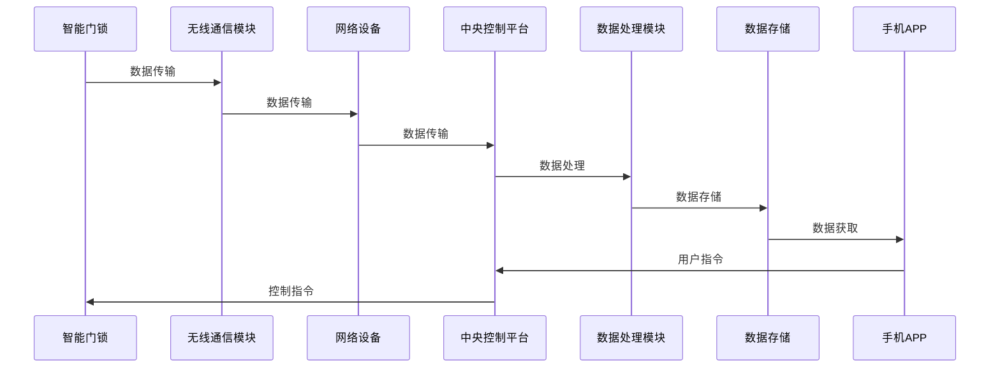

                 

### 文章标题

# 物联网安全：应对海量设备互联的挑战

> 关键词：物联网，安全，海量设备，互联，挑战，技术

> 摘要：本文将深入探讨物联网（IoT）安全领域的挑战与应对策略。随着物联网设备的爆炸性增长，网络安全问题日益突出。本文将介绍物联网的基本概念、常见安全威胁、基础安全原则以及高级安全措施，帮助读者理解并应对物联网安全挑战。通过逐步分析和推理，我们将提供一套系统化的安全解决方案，以应对海量设备互联所带来的复杂安全问题。

----------------------------------------------------------------

## 引言

随着科技的发展，物联网（Internet of Things，IoT）已经成为现代社会的关键技术之一。从智能家居到智慧城市，从工业自动化到医疗健康，物联网应用无处不在，极大地改变了我们的生活方式和工作模式。然而，随着物联网设备的普及和互联，网络安全问题也日益凸显，成为制约物联网进一步发展的关键因素。

### 物联网的基本概念

物联网是指通过互联网连接各种物理设备，使它们能够收集、交换和利用数据，从而实现智能化和自动化的网络。物联网设备通常包括传感器、控制器、执行器、智能终端等，通过无线网络、有线网络或卫星网络进行连接，形成一个庞大的网络生态系统。

### 物联网的安全问题

物联网设备由于数量庞大、种类繁多，且分布广泛，其安全性面临诸多挑战。主要的安全问题包括：

- **设备漏洞**：物联网设备在设计和实现过程中可能存在各种漏洞，如默认密码、软件缺陷等，这些漏洞可能被恶意攻击者利用。

- **数据泄露**：物联网设备收集的数据可能包含敏感信息，如个人身份信息、医疗记录等，数据泄露可能导致隐私侵犯和身份盗用。

- **中间人攻击**：攻击者通过在通信过程中插入自己，篡改数据或窃取信息。

- **拒绝服务攻击（DDoS）**：攻击者通过大量无效请求使物联网设备或网络瘫痪。

### 物联网安全的重要性

物联网安全不仅关乎个人隐私和财产安全，还涉及到国家安全和社会稳定。例如，工业控制系统、交通管理系统等关键基础设施的物联网设备一旦遭受攻击，可能引发严重后果。因此，确保物联网安全具有重要意义。

### 文章结构

本文将分为以下几个部分：

1. **物联网安全概述**：介绍物联网的基本概念、常见安全威胁、问题和挑战。

2. **基础安全原则和技术**：探讨物联网安全的基本原则和核心技术，包括安全模型、加密技术、认证授权等。

3. **高级安全措施**：介绍高级安全措施，如安全通信协议、设备安全、网络安全等。

4. **系统分析与架构设计**：分析物联网系统的安全性，包括功能设计、架构设计、接口设计和系统交互等。

5. **项目实战与最佳实践**：通过实际项目案例，展示物联网安全解决方案的实施和效果。

6. **小结与拓展阅读**：总结文章要点，提供相关资源供进一步学习。

## 物联网安全概述

### 基本概念

物联网（Internet of Things，IoT）是指将日常生活中的各种物理设备通过网络连接起来，使其具备数据采集、处理、传输和执行任务的能力。物联网设备可以通过传感器、控制器、执行器等组件实现智能化和自动化。这些设备可以是简单的家用设备，如智能灯泡、智能插座，也可以是复杂的工业设备，如工业机器人、自动化生产线。

物联网设备通常具有以下几个特点：

- **互联互通**：物联网设备通过互联网或其他通信网络进行连接，实现设备间的数据交换和协同工作。

- **分布式**：物联网设备分布广泛，覆盖家庭、企业、公共场所等多种环境。

- **多样性**：物联网设备种类繁多，包括智能手表、智能家居设备、工业传感器、医疗设备等。

- **低功耗**：许多物联网设备采用电池供电，因此需要具备低功耗特性，以延长设备的使用寿命。

### 常见安全威胁

物联网设备在互联过程中面临着多种安全威胁。以下是一些常见的安全威胁类型：

- **设备漏洞**：物联网设备在设计和实现过程中可能存在各种漏洞，如默认密码、软件缺陷等。这些漏洞可能被攻击者利用，从而控制设备或窃取数据。

- **中间人攻击**：攻击者通过在通信过程中插入自己，篡改数据或窃取信息。中间人攻击可能发生在设备与服务器之间的通信过程中。

- **拒绝服务攻击（DDoS）**：攻击者通过大量无效请求使物联网设备或网络瘫痪，从而影响系统的正常运行。

- **数据泄露**：物联网设备收集的数据可能包含敏感信息，如个人身份信息、医疗记录等。如果这些数据泄露，可能导致隐私侵犯和身份盗用。

- **恶意软件**：攻击者通过恶意软件感染物联网设备，从而控制设备或窃取数据。

- **供应链攻击**：攻击者通过篡改物联网设备的生产或供应链过程，植入恶意代码或硬件。

### 问题与挑战

物联网安全面临的问题和挑战主要包括：

- **复杂性**：物联网生态系统包含多种设备、平台和协议，导致安全策略的实施变得复杂。

- **设备多样性**：物联网设备种类繁多，且硬件和软件配置各异，使得统一的安全解决方案难以实现。

- **安全性与性能的平衡**：物联网设备通常需要低功耗、低延迟和高性能，安全措施可能会影响设备的性能。

- **安全意识不足**：许多用户和企业对物联网安全的重要性认识不足，导致安全措施不到位。

- **法律法规不健全**：物联网安全相关的法律法规尚未完善，缺乏明确的安全标准和规范。

### 边界与外延

物联网安全的边界涉及到设备、网络、数据和用户等多个方面。物联网设备的安全边界包括设备本身的安全措施，如加密、认证和访问控制等。网络边界则涉及到网络设备的防护措施，如防火墙和入侵检测系统等。数据边界主要涉及到数据传输和存储过程中的安全性，如数据加密和备份等。用户边界则涉及到用户行为的安全意识，如密码管理和安全设置等。

物联网安全的外延包括以下几个方面：

- **跨领域协作**：物联网安全涉及到多个领域，如硬件、软件、通信和网络安全等，需要跨领域协作来制定综合性的安全策略。

- **持续监控和更新**：物联网设备需要持续监控和更新，以确保其安全性得到保障。

- **用户教育和培训**：提高用户对物联网安全问题的认识和应对能力，是物联网安全的重要组成部分。

## 基本安全原则和核心技术

### 安全模型和框架

在物联网安全的设计过程中，选择合适的安全模型和框架至关重要。以下是几种常见的安全模型和框架：

#### 零信任模型

零信任模型（Zero Trust Model）是一种基于假设内部网络同样不信任的安全模型。该模型强调对每次访问请求进行严格验证，无论请求来自内部网络还是外部网络。零信任模型的主要特点包括：

- **身份验证和授权**：每次访问请求都需要进行身份验证和授权，确保只有经过验证的用户和设备才能访问系统资源。

- **多因素认证**：采用多因素认证（MFA）来增加安全性，例如密码、生物特征和设备认证等。

- **动态访问控制**：根据用户的身份、设备的状态和访问请求的上下文来动态调整访问权限。

#### 防御深度

防御深度（Defense in Depth）是一种多层次的安全防护策略。它通过在系统的不同层级部署多种安全措施来提高安全性。防御深度的核心思想是：

- **多层次的防护**：在物理、网络、系统和应用等不同层级部署安全措施，形成多层次的安全防护体系。

- **冗余和备份**：确保系统在遭受攻击时能够通过冗余和备份机制恢复，降低攻击对系统的影响。

#### 安全设计

安全设计（Security by Design）是一种将安全要素融入到系统设计和开发过程中的方法。安全设计的主要原则包括：

- **最小权限原则**：系统中的每个组件和用户都应只拥有完成其任务所需的最小权限。

- **最小暴露原则**：系统的设计和实现应尽可能减少对外部网络的暴露，降低攻击面。

- **自动化和标准化**：通过自动化工具和标准化流程来确保安全措施的实施和监控。

### 加密技术

加密技术是保障物联网安全的核心技术之一。以下是几种常见的加密技术：

#### 对称加密

对称加密（Symmetric Encryption）是一种加密算法，加密和解密使用相同的密钥。对称加密的优点是加密速度快，但缺点是密钥管理复杂，需要确保密钥的安全传输和存储。

#### 非对称加密

非对称加密（Asymmetric Encryption）使用一对密钥，即公钥和私钥。公钥用于加密，私钥用于解密。非对称加密的优点是密钥管理相对简单，但加密和解密速度较慢。

#### 哈希函数

哈希函数（Hash Function）用于将数据转换为固定长度的字符串，以确保数据的一致性和完整性。常见的哈希函数包括MD5、SHA-1和SHA-256等。

#### 数字签名

数字签名（Digital Signature）用于确保数据的完整性和真实性。数字签名利用非对称加密技术，通过对数据进行加密，生成一个签名。接收方可以通过解密签名来验证数据的完整性和真实性。

### 认证和授权

认证和授权是物联网安全的重要组成部分。以下是几种常见的认证和授权技术：

#### 多因素认证

多因素认证（Multi-Factor Authentication，MFA）是一种结合多种认证方法的认证机制。常见的多因素认证包括密码、生物特征和设备认证等。

#### OAuth

OAuth（Open Authorization）是一种开放的授权协议，用于第三方应用访问受保护资源。OAuth通过令牌（Token）机制实现授权，从而避免了直接使用用户密码。

#### OpenID Connect

OpenID Connect（OIDC）是一种身份验证和授权框架，基于OAuth 2.0协议。OIDC提供了一种标准化的方法来验证用户的身份，并与OAuth结合，实现资源的访问控制。

#### 角色基

角色基于访问控制（Role-Based Access Control，RBAC）是一种根据用户角色来分配访问权限的机制。RBAC通过定义用户角色和对应权限，简化了访问控制的复杂性。

## 高级安全措施

### 安全通信协议

安全通信协议是保障物联网设备之间安全通信的关键。以下是几种常见的安全通信协议：

#### TLS/SSL

TLS（传输层安全协议）和SSL（安全套接字层）是广泛使用的安全通信协议。它们通过加密数据传输，确保通信过程中的数据隐私和完整性。

- **TLS/SSL的优势**：加密通信、防止中间人攻击、支持证书认证等。
- **TLS/SSL的挑战**：计算开销较大、证书管理复杂等。

#### IPsec

IPsec（Internet Protocol Security）是一种网络层安全协议，用于保护IP协议数据包的完整性、认证和加密。IPsec可以用于端到端通信，确保数据在传输过程中的安全性。

- **IPsec的优势**：支持广泛的网络设备、适用于复杂的网络架构等。
- **IPsec的挑战**：配置复杂、性能影响较大等。

#### 轻量级协议

轻量级协议（如COAP-TLS、MQTT-SN）是专门为物联网设备设计的安全通信协议，具有低计算开销、低带宽消耗等特点。

- **轻量级协议的优势**：适用于资源受限的设备、提高通信效率等。
- **轻量级协议的挑战**：安全性相对较低、协议标准化程度有待提高等。

### 设备安全

设备安全是物联网安全的重要方面，涉及到设备的硬件、软件和固件等方面。以下是几种常见的设备安全措施：

#### 安全启动

安全启动（Secure Boot）是一种确保设备在启动过程中只加载可信代码和固件的方法。安全启动通过验证固件和驱动程序的签名，防止恶意代码的加载。

- **安全启动的优势**：防止恶意固件和驱动程序的加载、提高系统的安全性。
- **安全启动的挑战**：固件和驱动程序签名管理复杂、对固件更新有较高要求等。

#### 安全固件更新

安全固件更新（Secure Firmware Update）是一种确保设备固件安全更新的方法。安全固件更新通过加密和签名机制，确保更新过程的安全性和完整性。

- **安全固件更新的优势**：防止恶意固件更新、提高系统的安全性。
- **安全固件更新的挑战**：固件更新流程复杂、对更新验证有较高要求等。

#### 安全存储

安全存储（Secure Storage）是一种确保设备存储数据安全的方法。安全存储通过加密技术，确保数据在存储过程中的隐私性和完整性。

- **安全存储的优势**：保护敏感数据、防止数据泄露等。
- **安全存储的挑战**：存储加密和解密开销较大、对存储容量有较高要求等。

### 网络安全

网络安全是保障物联网系统整体安全的关键，涉及到网络设备、安全策略和监控等方面。以下是几种常见的网络安全措施：

#### 防火墙

防火墙（Firewall）是一种网络安全设备，用于控制网络流量，防止未授权的访问和攻击。防火墙可以根据规则对进出网络的流量进行过滤和审计。

- **防火墙的优势**：提供网络隔离、防止网络攻击等。
- **防火墙的挑战**：配置和维护复杂、难以应对复杂的网络攻击等。

#### 入侵检测系统

入侵检测系统（Intrusion Detection System，IDS）是一种网络安全设备，用于检测和响应网络攻击。IDS可以通过分析网络流量和系统日志，发现异常行为和攻击迹象。

- **IDS的优势**：实时监测网络威胁、快速响应等。
- **IDS的挑战**：误报率高、需要大量的人工参与等。

#### 安全信息和事件管理

安全信息和事件管理（Security Information and Event Management，SIEM）是一种集成化安全管理系统，用于收集、存储、分析和报告安全事件。SIEM可以帮助企业及时发现和应对安全威胁。

- **SIEM的优势**：统一管理安全事件、提高安全响应效率等。
- **SIEM的挑战**：数据量巨大、处理和分析复杂等。

## 物联网系统的安全分析与架构设计

### 问题场景介绍

在当前物联网（IoT）时代，越来越多的设备和系统开始依赖物联网技术进行数据采集、传输和智能控制。然而，随着物联网设备的增多和复杂度的提升，系统的安全性也成为了至关重要的因素。一个典型的物联网系统场景可能包括家庭智能设备、工业自动化控制系统、智能城市基础设施等，这些系统都需要处理大量的数据，并与其他设备进行通信。

### 项目介绍

为了更好地分析和设计物联网系统的安全性，我们选择一个智能家居系统作为项目案例。该智能家居系统包括智能门锁、智能灯光、智能空调、智能监控设备等，通过一个中央控制平台进行管理。该项目旨在确保系统的安全性，同时提供便捷的用户体验。

### 系统功能设计

智能家居系统的功能设计主要包括以下几个方面：

1. **数据采集**：通过传感器和智能设备收集室内温度、湿度、光照度等环境数据。

2. **数据传输**：将采集到的数据通过无线网络传输到中央控制平台。

3. **数据处理**：对传输过来的数据进行处理和存储，包括数据清洗、异常检测和数据分析等。

4. **用户交互**：通过手机APP、网页控制台等方式，为用户提供便捷的远程控制和监控功能。

5. **设备控制**：根据用户指令和系统算法，对智能家居设备进行控制，如调节灯光亮度、调整空调温度等。

### 系统架构设计

智能家居系统的架构设计采用分层架构，主要包括以下几层：

1. **感知层**：包括各种传感器和智能设备，负责数据采集。

2. **网络层**：包括无线通信模块和网络设备，负责数据传输。

3. **平台层**：包括数据存储、处理和分析模块，以及中央控制平台，负责数据处理和用户交互。

4. **应用层**：包括各种应用服务，如远程控制、数据分析等。

5. **安全层**：包括安全防护措施，如加密、认证和授权等。

以下是智能家居系统的架构设计Mermaid类图：

```mermaid
classDiagram
    智能门锁 <<感知层>>
    智能灯光 <<感知层>>
    智能空调 <<感知层>>
    智能监控设备 <<感知层>>

    无线通信模块 <<网络层>>
    网络设备 <<网络层>>

    数据存储 <<平台层>>
    数据处理模块 <<平台层>>
    中央控制平台 <<平台层>>

    手机APP <<应用层>>
    网页控制台 <<应用层>>

    加密 <<安全层>>
    认证 <<安全层>>
    授权 <<安全层>>
```

### 系统接口设计和系统交互

智能家居系统的接口设计和系统交互主要包括以下几个方面：

1. **感知层与网络层**：传感器和智能设备通过无线通信模块与网络设备进行通信，将采集到的数据传输到平台层。

2. **网络层与平台层**：网络设备将数据传输到中央控制平台，平台层负责数据的存储和处理。

3. **平台层与应用层**：中央控制平台通过API接口为手机APP和网页控制台提供服务，用户可以通过这些应用进行远程控制和监控。

4. **安全层与其他层次**：安全层负责对系统中的数据进行加密、认证和授权，确保数据的安全性和隐私性。

以下是智能家居系统的接口设计和系统交互Mermaid序列图：



## 项目实战

### 环境安装

为了进行智能家居项目的实战，我们需要搭建一个合适的环境。以下是环境安装的步骤：

1. **安装操作系统**：选择一个支持物联网开发的操作系统，如Ubuntu 20.04 LTS。

2. **安装开发工具**：安装必要的开发工具，如Python 3、Node.js、Git等。

3. **安装物联网开发板**：选择一个合适的物联网开发板，如ESP8266或ESP32，并安装相应的驱动程序。

4. **安装MQTT服务器**：安装一个MQTT服务器，如Mosquitto，用于设备之间的通信。

5. **安装数据库**：选择一个合适的数据库系统，如MySQL或MongoDB，用于数据存储和管理。

### 系统核心实现源代码

智能家居系统的核心实现主要包括以下几个方面：

1. **传感器和设备驱动**：编写传感器和设备的驱动程序，使其能够与物联网开发板进行通信。

2. **数据采集和处理**：编写数据采集和处理程序，用于采集环境数据并进行初步处理。

3. **MQTT客户端**：编写MQTT客户端程序，用于与MQTT服务器进行通信，发送和接收数据。

4. **中央控制平台**：编写中央控制平台的服务器端和客户端程序，用于处理用户指令并控制设备。

以下是智能家居系统的核心实现源代码：

```python
# 传感器和设备驱动
import serial
ser = serial.Serial('/dev/ttyUSB0', 9600)

def read_sensor_data():
    data = ser.readline().decode().strip()
    return float(data)

# 数据采集和处理
def collect_data():
    temperature = read_sensor_data()
    humidity = read_sensor_data()
    return {"temperature": temperature, "humidity": humidity}

# MQTT客户端
import paho.mqtt.client as mqtt

def on_connect(client, userdata, flags, rc):
    print("Connected with result code " + str(rc))
    client.subscribe("home/sensors")

def on_message(client, userdata, msg):
    print(f"Received message '{msg.payload}' on topic '{msg.topic}' with QoS {msg.qos}")

client = mqtt.Client()
client.on_connect = on_connect
client.on_message = on_message
client.connect("localhost", 1883, 60)
client.loop_start()

while True:
    data = collect_data()
    client.publish("home/sensors", json.dumps(data))

# 中央控制平台
import flask

app = flask.Flask(__name__)

@app.route("/control", methods=["POST"])
def control():
    data = flask.request.json
    command = data["command"]
    device = data["device"]
    # 发送控制指令到设备
    # ...
    return "OK"

if __name__ == "__main__":
    app.run()
```

### 代码应用解读与分析

上述源代码展示了智能家居系统的核心实现。以下是代码的解读与分析：

1. **传感器和设备驱动**：
   - 通过Python的`serial`模块，与开发板上的串口进行通信，读取传感器的数据。
   - `read_sensor_data()`函数用于读取传感器的数据，并转换为浮点数类型。

2. **数据采集和处理**：
   - `collect_data()`函数用于采集传感器的数据，并将其封装为一个字典对象，便于后续处理。

3. **MQTT客户端**：
   - 使用Paho MQTT客户端库，与MQTT服务器进行通信。
   - `on_connect()`函数在连接成功后调用，用于订阅主题。
   - `on_message()`函数在接收到MQTT消息后调用，用于处理消息。

4. **中央控制平台**：
   - 使用Flask框架搭建一个简单的Web服务，用于接收用户指令。
   - `control()`函数用于处理用户发送的HTTP请求，并根据请求的内容发送控制指令到设备。

### 实际案例分析与详细讲解剖析

为了更好地展示智能家居系统的应用效果，我们以一个实际案例进行分析。

#### 案例背景

假设用户在家中通过手机APP控制智能灯光，希望将灯光的亮度调高。

#### 操作步骤

1. 用户在手机APP上选择要控制的灯光设备，并输入调整亮度的指令。

2. 手机APP通过HTTP请求将指令发送到中央控制平台。

3. 中央控制平台接收到请求后，解析请求内容，提取设备名称和亮度调整值。

4. 中央控制平台通过MQTT客户端，将控制指令发送到智能灯光设备。

5. 智能灯光设备接收到指令后，调整亮度，并发送确认信息到中央控制平台。

6. 中央控制平台将确认信息反馈给用户，完成灯光亮度的调整。

#### 详细讲解剖析

1. **MQTT通信**：
   - MQTT是一种轻量级的消息队列协议，适用于物联网设备之间的通信。
   - 在本案例中，中央控制平台和智能灯光设备通过MQTT协议进行通信。
   - 中央控制平台作为MQTT客户端，订阅了主题为`home/sensors`的消息。
   - 智能灯光设备作为MQTT服务器，发布控制指令到主题为`home/controls`的消息。

2. **HTTP通信**：
   - Flask框架提供了一个简单的Web服务，用于处理用户请求。
   - 用户通过手机APP发送HTTP POST请求，请求内容包括设备名称和亮度调整值。

3. **控制指令的解析和执行**：
   - Central Control Platform接收到HTTP请求后，解析请求内容，提取设备名称和亮度调整值。
   - Central Control Platform使用MQTT客户端，将控制指令发送到智能灯光设备。
   - Smart Light Device接收到指令后，根据指令内容调整亮度，并发送确认信息到Central Control Platform。

4. **确认信息的反馈**：
   - Central Control Platform接收到确认信息后，将确认信息反馈给用户。
   - 用户可以看到灯光亮度已经调整成功。

### 项目小结

通过本案例，我们可以看到智能家居系统的核心实现和实际应用效果。智能家居系统通过物联网技术实现了设备间的互联互通，为用户提供了便捷的控制和监控功能。然而，在实际应用中，还需要进一步优化系统的性能和安全性，以满足不同用户的需求。

## 最佳实践与注意事项

### 最佳实践

1. **安全性优先**：在设计物联网系统时，始终将安全性放在首位，遵循安全设计原则，确保系统的安全性。

2. **最小权限原则**：为系统中的每个组件和用户分配最小的权限，以减少潜在的安全风险。

3. **多因素认证**：采用多因素认证机制，确保只有经过验证的用户和设备才能访问系统资源。

4. **定期更新和监控**：定期更新物联网设备的固件和软件，并使用监控工具实时监控系统的安全状态。

5. **加密和签名**：使用加密技术保护数据传输和存储过程中的隐私性和完整性，并对数据进行数字签名，确保数据的真实性和完整性。

### 注意事项

1. **隐私保护**：在设计和实现物联网系统时，要充分考虑用户隐私保护，避免敏感数据泄露。

2. **设备兼容性**：确保物联网设备与其他系统和服务兼容，避免因设备兼容性问题导致安全漏洞。

3. **法律法规遵守**：遵守相关的法律法规，确保物联网系统的合法合规。

4. **安全意识培养**：提高用户和企业对物联网安全问题的认识和应对能力，加强安全意识培养。

### 拓展阅读

1. **《物联网安全指南》**：详细介绍了物联网安全的各个方面，包括安全原则、技术措施和最佳实践。

2. **《物联网安全标准》**：了解物联网安全相关的标准规范，以便在设计和实现过程中遵循。

3. **《网络安全法》**：了解国家和地区的网络安全法律法规，确保物联网系统的合法合规。

## 作者信息

作者：AI天才研究院/AI Genius Institute & 禅与计算机程序设计艺术 /Zen And The Art of Computer Programming

## 总结

本文围绕物联网安全主题，详细介绍了物联网的基本概念、安全威胁、基础安全原则和核心技术、高级安全措施、系统分析与架构设计以及项目实战。通过逐步分析和推理，本文提供了一套系统化的安全解决方案，以应对海量设备互联的挑战。物联网安全不仅是技术问题，更涉及到法律、政策和伦理等方面。未来，随着物联网技术的不断发展，物联网安全将变得更加重要和复杂。希望本文能为读者提供有益的参考和启示。

